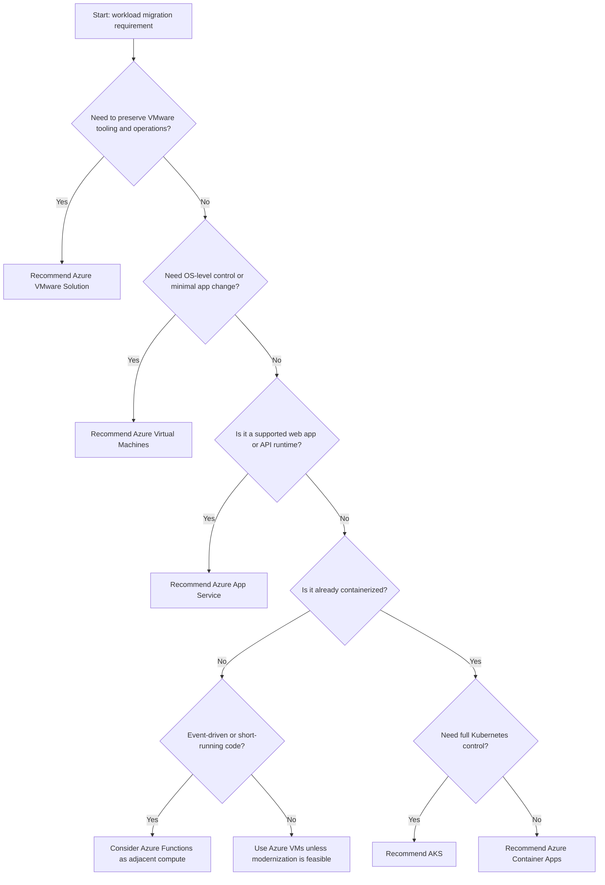
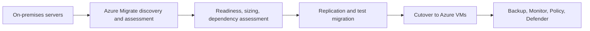
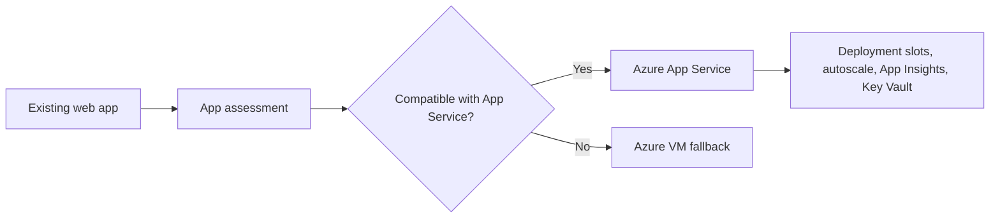
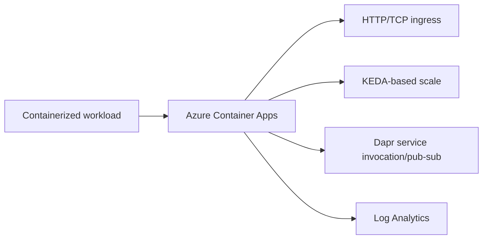
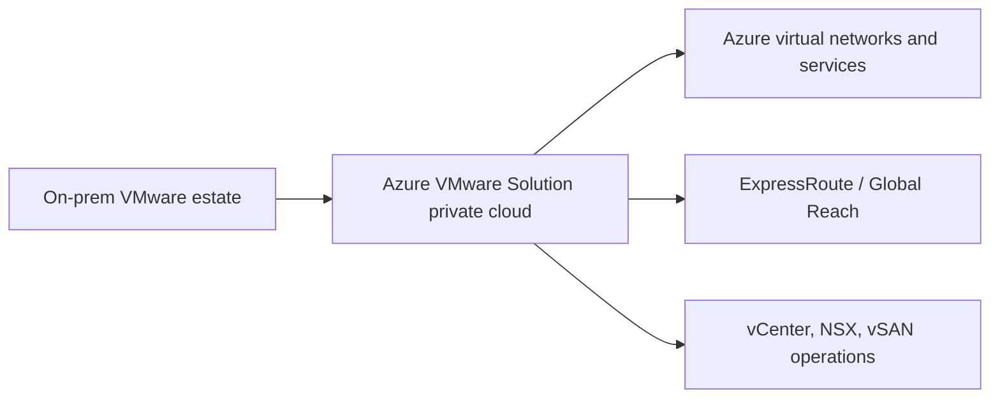

# AZ-305 Study Guide: Recommend a solution for migrating workloads to IaaS and PaaS

> **Exam task:** Design migrations — Recommend a solution for migrating workloads to infrastructure as a service (IaaS) and platform as a service (PaaS)
>
> **Domain:** Design infrastructure solutions
>
> **Estimated reading time:** 45 minutes
>
> **Matched task source:** Exact match from the provided [Study Guide Map](https://github.com/Greg-T8/LearningAzure/blob/main/certs/AZ-305/research/Infrastructure/Migrations/Migrating%20workloads%20to%20IaaS%20and%20PaaS%20Task%20Map%20-%20ChatGPT.md), with wording aligned to the official [AZ-305 study guide](https://learn.microsoft.com/en-us/credentials/certifications/resources/study-guides/az-305).
>
> **Scope boundary:** This guide covers how to recommend migration targets and migration approaches for workloads moving to [Azure Virtual Machines](https://learn.microsoft.com/en-us/azure/virtual-machines/overview), [Azure App Service](https://learn.microsoft.com/en-us/azure/app-service/overview), [Azure Container Apps](https://learn.microsoft.com/en-us/azure/container-apps/overview), [Azure Kubernetes Service](https://learn.microsoft.com/en-us/azure/aks/intro-kubernetes), and [Azure VMware Solution](https://learn.microsoft.com/en-us/azure/azure-vmware/introduction). It intentionally keeps database migration and unstructured data migration concise because those are separate AZ-305 migration tasks in the official [Design migrations](https://learn.microsoft.com/en-us/credentials/certifications/resources/study-guides/az-305) skill.

---

## How to use this guide

Use this guide to practice architect-level migration recommendations rather than tool-only memorization. By the end, you should be able to choose between [rehosting to Azure VMs](https://learn.microsoft.com/en-us/azure/virtual-machines/overview), modernizing to [Azure App Service](https://learn.microsoft.com/en-us/azure/app-service/overview), moving containerized workloads to [Azure Container Apps](https://learn.microsoft.com/en-us/azure/container-apps/overview) or [AKS](https://learn.microsoft.com/en-us/azure/aks/intro-kubernetes), and using [Azure VMware Solution](https://learn.microsoft.com/en-us/azure/azure-vmware/introduction) when a VMware operating model must be preserved.

Read scenario questions for clues such as **OS-level control**, **legacy dependencies**, **web app runtime support**, **container orchestration requirements**, **downtime tolerance**, **hybrid connectivity**, **landing zone readiness**, **cost optimization**, and **modernization appetite**. Those clues usually decide whether the best answer is [IaaS rehost](https://learn.microsoft.com/en-us/azure/virtual-machines/overview), [PaaS modernization](https://learn.microsoft.com/en-us/azure/app-service/overview), [serverless container hosting](https://learn.microsoft.com/en-us/azure/container-apps/overview), [managed Kubernetes](https://learn.microsoft.com/en-us/azure/aks/intro-kubernetes), or [Azure VMware Solution](https://learn.microsoft.com/en-us/azure/azure-vmware/introduction).

This task differs from adjacent AZ-305 tasks because it focuses on the **destination architecture and migration approach** for application and server workloads. The adjacent task [Evaluate on-premises servers, data, and applications for migration](https://learn.microsoft.com/en-us/credentials/certifications/resources/study-guides/az-305) focuses more on discovery and assessment, while [Recommend a solution for migrating databases](https://learn.microsoft.com/en-us/credentials/certifications/resources/study-guides/az-305) focuses on database target selection and data migration.

---

## Primary source set

### Exam and module sources

| Source                                                                                                                                | Why it matters                                                                                                                                                                           |
| ------------------------------------------------------------------------------------------------------------------------------------- | ---------------------------------------------------------------------------------------------------------------------------------------------------------------------------------------- |
| [Official AZ-305 study guide](https://learn.microsoft.com/en-us/credentials/certifications/resources/study-guides/az-305)             | Defines the official domain, skill, and task boundary for [Design infrastructure solutions](https://learn.microsoft.com/en-us/credentials/certifications/resources/study-guides/az-305). |
| [Architect infrastructure operations in Azure](https://learn.microsoft.com/en-us/training/paths/architect-infrastructure-operations/) | Helps connect migration design to operational readiness, monitoring, deployment, and manageability.                                                                                      |

### Core product documentation

| Source                                                                                                                                                  | Why it matters                                                                                                                                                   |
| ------------------------------------------------------------------------------------------------------------------------------------------------------- | ---------------------------------------------------------------------------------------------------------------------------------------------------------------- |
| [Plan your migration — Cloud Adoption Framework](https://learn.microsoft.com/en-us/azure/cloud-adoption-framework/migrate/plan-migration)               | Covers workload sequencing, dependency grouping, migration waves, cutover, and rollback planning.                                                                |
| [Prepare your landing zone for migration](https://learn.microsoft.com/en-us/azure/cloud-adoption-framework/ready/landing-zone/ready-azure-landing-zone) | Covers landing zone prerequisites such as hybrid connectivity, identity, DNS, routing, firewall, monitoring, subscriptions, and Defender for Cloud readiness.    |
| [Azure Migrate overview](https://learn.microsoft.com/en-us/azure/migrate/migrate-services-overview)                                                     | Describes Azure Migrate as the migration hub for discovery, assessment, business case development, and migration execution.                                      |
| [Azure Migrate business case](https://learn.microsoft.com/en-us/azure/migrate/how-to-build-a-business-case)                                             | Supports comparing modernization to PaaS, lift-and-shift to IaaS, and Azure VMware Solution from a cost and readiness perspective.                               |
| [Azure Migrate application assessment](https://learn.microsoft.com/en-us/azure/migrate/review-application-assessment)                                   | Supports web application migration recommendations such as App Service preferred, PaaS-only, or IaaS fallback.                                                   |
| [Migrate physical or virtual machines with Azure Migrate](https://learn.microsoft.com/en-us/azure/migrate/tutorial-migrate-physical-virtual-machines)   | Supports IaaS migration execution for physical servers, non-standard virtualization platforms, private clouds, and public cloud VMs.                             |
| [Azure Virtual Machines overview](https://learn.microsoft.com/en-us/azure/virtual-machines/overview)                                                    | Supports IaaS target selection when OS control, custom software, legacy dependencies, or lift-and-shift speed are required.                                      |
| [Azure App Service overview](https://learn.microsoft.com/en-us/azure/app-service/overview)                                                              | Supports PaaS target selection for web apps, APIs, mobile back ends, built-in scaling, deployment slots, managed runtime, and reduced infrastructure management. |
| [Migrate .NET apps to Azure App Service](https://learn.microsoft.com/en-us/azure/app-service/app-service-asp-net-migration)                             | Supports migration of ASP.NET applications to App Service and helps identify compatibility boundaries.                                                           |
| [Azure Container Apps overview](https://learn.microsoft.com/en-us/azure/container-apps/overview)                                                        | Supports PaaS-style migration for containerized APIs, microservices, background jobs, and event-driven workloads without managing Kubernetes directly.           |
| [AKS overview](https://learn.microsoft.com/en-us/azure/aks/intro-kubernetes)                                                                            | Supports migration designs where Kubernetes control, ecosystem compatibility, or custom orchestration is required.                                               |
| [Azure VMware Solution overview](https://learn.microsoft.com/en-us/azure/azure-vmware/introduction)                                                     | Supports VMware estate migration where preserving vSphere, vSAN, NSX, vCenter, and VMware operations is more important than immediate Azure-native refactoring.  |
| [Compare Azure Migrate and Azure Site Recovery](https://learn.microsoft.com/en-us/azure/site-recovery/migrate-overview)                                 | Helps avoid confusing migration tooling with disaster recovery tooling.                                                                                          |

### Supporting architecture and framework sources

| Source                                                                                                                                         | Why it matters                                                                                                             |
| ---------------------------------------------------------------------------------------------------------------------------------------------- | -------------------------------------------------------------------------------------------------------------------------- |
| [Choose an Azure compute service](https://learn.microsoft.com/en-us/azure/architecture/guide/technology-choices/compute-decision-tree)         | Provides a decision tree for choosing between VMs, App Service, Functions, Container Apps, AKS, and other compute options. |
| [Well-Architected Framework: Select services](https://learn.microsoft.com/en-us/azure/well-architected/performance-efficiency/select-services) | Supports service-selection reasoning based on workload requirements, operational model, scalability, and performance.      |
| [Azure Arc-enabled servers overview](https://learn.microsoft.com/en-us/azure/azure-arc/servers/overview)                                       | Supports hybrid inventory, management, monitoring, governance, and transition-state operations before or during migration. |
| [Azure Backup overview](https://learn.microsoft.com/en-us/azure/backup/backup-overview)                                                        | Supports protection planning for migrated VMs, managed disks, Azure Files, databases in VMs, and recovery vault design.    |
| [Azure Monitor overview](https://learn.microsoft.com/en-us/azure/azure-monitor/fundamentals/overview)                                          | Supports post-migration observability for Azure resources, VMs, applications, Kubernetes, and network components.          |
| [Azure Policy overview](https://learn.microsoft.com/en-us/azure/governance/policy/overview)                                                    | Supports migration landing zone governance, policy enforcement, and compliance guardrails.                                 |
| [Azure RBAC overview](https://learn.microsoft.com/en-us/azure/role-based-access-control/overview)                                              | Supports access control decisions for migration projects, subscriptions, resource groups, and operations teams.            |
| [Azure Private Link overview](https://learn.microsoft.com/en-us/azure/private-link/private-link-overview)                                      | Supports private connectivity to PaaS services during modernization.                                                       |
| [VPN Gateway overview](https://learn.microsoft.com/en-us/azure/vpn-gateway/vpn-gateway-about-vpngateways)                                      | Supports encrypted hybrid connectivity when ExpressRoute is unavailable or not required.                                   |
| [ExpressRoute overview](https://learn.microsoft.com/en-us/azure/expressroute/expressroute-introduction)                                        | Supports private, dedicated connectivity for large-scale, sensitive, or latency-sensitive migration traffic.               |

### Discovery notes from the Study Guide Map

The provided map identifies [Cloud Adoption Framework](https://learn.microsoft.com/en-us/azure/cloud-adoption-framework/migrate/plan-migration), [Azure landing zones](https://learn.microsoft.com/en-us/azure/cloud-adoption-framework/ready/landing-zone/ready-azure-landing-zone), [Azure Migrate](https://learn.microsoft.com/en-us/azure/migrate/migrate-services-overview), [Azure Virtual Machines](https://learn.microsoft.com/en-us/azure/virtual-machines/overview), [Azure App Service](https://learn.microsoft.com/en-us/azure/app-service/overview), [Azure Container Apps](https://learn.microsoft.com/en-us/azure/container-apps/overview), [AKS](https://learn.microsoft.com/en-us/azure/aks/intro-kubernetes), [Azure VMware Solution](https://learn.microsoft.com/en-us/azure/azure-vmware/introduction), [Azure Arc-enabled servers](https://learn.microsoft.com/en-us/azure/azure-arc/servers/overview), [Azure Site Recovery](https://learn.microsoft.com/en-us/azure/site-recovery/migrate-overview), [Azure Backup](https://learn.microsoft.com/en-us/azure/backup/backup-overview), [Azure Monitor](https://learn.microsoft.com/en-us/azure/azure-monitor/fundamentals/overview), [Azure Advisor](https://learn.microsoft.com/en-us/azure/advisor/advisor-overview), [Azure Policy](https://learn.microsoft.com/en-us/azure/governance/policy/overview), [Azure RBAC](https://learn.microsoft.com/en-us/azure/role-based-access-control/overview), [Key Vault](https://learn.microsoft.com/en-us/azure/key-vault/general/overview), [Private Link](https://learn.microsoft.com/en-us/azure/private-link/private-link-overview), [VPN Gateway](https://learn.microsoft.com/en-us/azure/vpn-gateway/vpn-gateway-about-vpngateways), and [ExpressRoute](https://learn.microsoft.com/en-us/azure/expressroute/expressroute-introduction) as potentially relevant.

The map’s forum-discovery note is nonauthoritative and is useful only as a signal that candidates commonly discuss [Azure Migrate](https://learn.microsoft.com/en-us/azure/migrate/migrate-services-overview), lift-and-shift to [Azure VMs](https://learn.microsoft.com/en-us/azure/virtual-machines/overview), [App Service](https://learn.microsoft.com/en-us/azure/app-service/overview) modernization, [Azure VMware Solution](https://learn.microsoft.com/en-us/azure/azure-vmware/introduction), right-sizing, landing zone readiness, hybrid connectivity, and post-migration optimization.

---

## 1. Exam task scope

This task asks you to recommend the **right migration destination and migration approach** for workloads that can move to Azure as either [IaaS compute](https://learn.microsoft.com/en-us/azure/virtual-machines/overview) or [PaaS compute](https://learn.microsoft.com/en-us/azure/app-service/overview). The architect decision is not simply “use Azure Migrate”; it is deciding whether a workload should be rehosted, modernized, containerized, kept in a VMware operational model, or deferred until dependencies are resolved.

In scope:

| In-scope decision          | What you should be able to recommend                                                                                                                                                                                                                                                                |
| -------------------------- | --------------------------------------------------------------------------------------------------------------------------------------------------------------------------------------------------------------------------------------------------------------------------------------------------- |
| Rehost to Azure VMs        | Choose [Azure Virtual Machines](https://learn.microsoft.com/en-us/azure/virtual-machines/overview) when workloads require OS-level control, custom agents, unsupported runtimes, legacy software, or fast migration with minimal app changes.                                                       |
| Modernize web apps         | Choose [Azure App Service](https://learn.microsoft.com/en-us/azure/app-service/overview) when the workload is a web app, REST API, mobile back end, or supported runtime that benefits from managed hosting, deployment slots, autoscale, integrated authentication, and reduced server management. |
| Move containerized apps    | Choose [Azure Container Apps](https://learn.microsoft.com/en-us/azure/container-apps/overview) when the workload is containerized and needs serverless operations, HTTP ingress, event-driven scaling, jobs, or Dapr without full Kubernetes management.                                            |
| Use Kubernetes             | Choose [AKS](https://learn.microsoft.com/en-us/azure/aks/intro-kubernetes) when the workload needs Kubernetes APIs, Helm charts, service mesh patterns, custom controllers, advanced orchestration, or portability across Kubernetes environments.                                                  |
| Preserve VMware operations | Choose [Azure VMware Solution](https://learn.microsoft.com/en-us/azure/azure-vmware/introduction) when the business needs vSphere compatibility, VMware tooling, vCenter operations, or rapid datacenter exit without immediate Azure-native redesign.                                              |
| Sequence migration waves   | Use [Cloud Adoption Framework migration planning](https://learn.microsoft.com/en-us/azure/cloud-adoption-framework/migrate/plan-migration) to group dependencies, plan waves, choose migration methods, and define rollback.                                                                        |
| Prepare target platform    | Use [Azure landing zone migration readiness](https://learn.microsoft.com/en-us/azure/cloud-adoption-framework/ready/landing-zone/ready-azure-landing-zone) to ensure identity, DNS, routing, connectivity, policy, security, and monitoring are ready before workload cutover.                      |

Out of scope or adjacent:

| Adjacent topic              | Why it is adjacent                                                                                                                                                                                                                                                                                                                          |
| --------------------------- | ------------------------------------------------------------------------------------------------------------------------------------------------------------------------------------------------------------------------------------------------------------------------------------------------------------------------------------------- |
| Database migration          | [Recommend a solution for migrating databases](https://learn.microsoft.com/en-us/credentials/certifications/resources/study-guides/az-305) is a separate task, although application migration often depends on database target readiness.                                                                                                   |
| Unstructured data migration | [Recommend a solution for migrating unstructured data](https://learn.microsoft.com/en-us/credentials/certifications/resources/study-guides/az-305) is a separate task, although migration waves must include file shares, blobs, and content dependencies.                                                                                  |
| Backup and DR               | [Design solutions for backup and disaster recovery](https://learn.microsoft.com/en-us/credentials/certifications/resources/study-guides/az-305) is a separate domain, although migrated workloads still require [Azure Backup](https://learn.microsoft.com/en-us/azure/backup/backup-overview), recovery objectives, and rollback planning. |
| Monitoring solution design  | [Recommend a monitoring solution](https://learn.microsoft.com/en-us/credentials/certifications/resources/study-guides/az-305) is a separate task, although migrated workloads still need [Azure Monitor](https://learn.microsoft.com/en-us/azure/azure-monitor/fundamentals/overview), Application Insights, alerts, and logs.              |

> **Exam tip:** When a scenario asks for the **migration target**, focus on workload constraints and destination fit; when it asks for the **migration assessment**, focus on [Azure Migrate discovery and assessment](https://learn.microsoft.com/en-us/azure/migrate/migrate-services-overview); when it asks for **database migration**, move to database-specific services such as [Azure SQL migration guidance](https://learn.microsoft.com/en-us/azure/azure-sql/migration-guides/).

---

## 2. Product and topic discovery pass

| Product, service, or topic                  | Why it may be relevant                                                                                                       | Primary Microsoft source                                                                                                                                | In-scope or adjacent?                                  |
| ------------------------------------------- | ---------------------------------------------------------------------------------------------------------------------------- | ------------------------------------------------------------------------------------------------------------------------------------------------------- | ------------------------------------------------------ |
| Cloud Adoption Framework migration planning | Defines migration waves, dependency grouping, sequencing, downtime methods, and rollback.                                    | [Plan your migration](https://learn.microsoft.com/en-us/azure/cloud-adoption-framework/migrate/plan-migration)                                          | In scope                                               |
| Azure landing zones                         | Ensures governance, subscriptions, networking, identity, DNS, firewall, monitoring, and security readiness before migration. | [Prepare your landing zone for migration](https://learn.microsoft.com/en-us/azure/cloud-adoption-framework/ready/landing-zone/ready-azure-landing-zone) | In scope                                               |
| Azure Migrate                               | Central migration hub for discovery, assessment, business case, and migration execution.                                     | [Azure Migrate overview](https://learn.microsoft.com/en-us/azure/migrate/migrate-services-overview)                                                     | In scope                                               |
| Azure Migrate business case                 | Compares modernization, IaaS lift-and-shift, and Azure VMware Solution recommendations.                                      | [Build a business case](https://learn.microsoft.com/en-us/azure/migrate/how-to-build-a-business-case)                                                   | In scope                                               |
| Azure Migrate application assessment        | Helps decide whether web apps should move to App Service, AKS, or IaaS fallback.                                             | [Review application assessment](https://learn.microsoft.com/en-us/azure/migrate/review-application-assessment)                                          | In scope                                               |
| Azure Virtual Machines                      | Target for workloads needing OS control, custom software, or lift-and-shift migration.                                       | [Azure VMs overview](https://learn.microsoft.com/en-us/azure/virtual-machines/overview)                                                                 | In scope                                               |
| Managed disks                               | Required storage foundation for Azure VM migration and sizing.                                                               | [Azure managed disks overview](https://learn.microsoft.com/en-us/azure/virtual-machines/managed-disks-overview)                                         | In scope                                               |
| Azure App Service                           | PaaS target for web apps, APIs, mobile back ends, supported runtimes, and custom containers.                                 | [App Service overview](https://learn.microsoft.com/en-us/azure/app-service/overview)                                                                    | In scope                                               |
| App Service Migration Assistant             | Supports ASP.NET migration to App Service and helps identify compatibility issues.                                           | [Migrate .NET apps to App Service](https://learn.microsoft.com/en-us/azure/app-service/app-service-asp-net-migration)                                   | In scope                                               |
| Azure Container Apps                        | Serverless container platform for APIs, jobs, microservices, event-driven processing, and Dapr.                              | [Container Apps overview](https://learn.microsoft.com/en-us/azure/container-apps/overview)                                                              | In scope                                               |
| AKS                                         | Managed Kubernetes target for workloads requiring Kubernetes-native operations.                                              | [AKS overview](https://learn.microsoft.com/en-us/azure/aks/intro-kubernetes)                                                                            | In scope but often adjacent to container-specific task |
| Azure VMware Solution                       | VMware-compatible private cloud on dedicated Azure infrastructure.                                                           | [Azure VMware Solution overview](https://learn.microsoft.com/en-us/azure/azure-vmware/introduction)                                                     | In scope                                               |
| Azure Arc-enabled servers                   | Supports hybrid management, governance, monitoring, and security for pre-migration or transition-state servers.              | [Azure Arc-enabled servers](https://learn.microsoft.com/en-us/azure/azure-arc/servers/overview)                                                         | Supporting                                             |
| Azure Site Recovery                         | Primarily DR, but useful to distinguish from Azure Migrate migration execution.                                              | [Compare Azure Migrate and Site Recovery](https://learn.microsoft.com/en-us/azure/site-recovery/migrate-overview)                                       | Adjacent                                               |
| Azure Backup                                | Protects migrated VMs, disks, Azure Files, SQL in VMs, and other supported workloads.                                        | [Azure Backup overview](https://learn.microsoft.com/en-us/azure/backup/backup-overview)                                                                 | Supporting                                             |
| Azure Monitor                               | Provides post-migration telemetry for applications, infrastructure, logs, metrics, traces, and events.                       | [Azure Monitor overview](https://learn.microsoft.com/en-us/azure/azure-monitor/fundamentals/overview)                                                   | Supporting                                             |
| Application Insights                        | Application performance monitoring for web apps and services after modernization.                                            | [Application Insights](https://learn.microsoft.com/en-us/azure/azure-monitor/app/app-insights-overview)                                                 | Supporting                                             |
| Azure Advisor                               | Provides cost, reliability, operational, performance, and security recommendations after migration.                          | [Azure Advisor overview](https://learn.microsoft.com/en-us/azure/advisor/advisor-overview)                                                              | Supporting                                             |
| Azure Policy                                | Enforces landing zone guardrails for allowed locations, SKUs, tags, private endpoints, and security baselines.               | [Azure Policy overview](https://learn.microsoft.com/en-us/azure/governance/policy/overview)                                                             | Supporting                                             |
| Azure RBAC                                  | Controls migration team, application team, platform team, and operations access to Azure resources.                          | [Azure RBAC overview](https://learn.microsoft.com/en-us/azure/role-based-access-control/overview)                                                       | Supporting                                             |
| Key Vault                                   | Stores secrets, certificates, and keys used by migrated applications.                                                        | [Key Vault overview](https://learn.microsoft.com/en-us/azure/key-vault/general/overview)                                                                | Supporting                                             |
| Private Link                                | Provides private access to supported PaaS services during modernization.                                                     | [Private Link overview](https://learn.microsoft.com/en-us/azure/private-link/private-link-overview)                                                     | Supporting                                             |
| VPN Gateway                                 | Provides encrypted hybrid connectivity when private dedicated connectivity is not required.                                  | [VPN Gateway overview](https://learn.microsoft.com/en-us/azure/vpn-gateway/vpn-gateway-about-vpngateways)                                               | Supporting                                             |
| ExpressRoute                                | Provides private dedicated connectivity for large-scale, sensitive, or latency-sensitive migrations.                         | [ExpressRoute overview](https://learn.microsoft.com/en-us/azure/expressroute/expressroute-introduction)                                                 | Supporting                                             |

---

## 3. Starting point from Microsoft Learn

Start with the [Cloud Adoption Framework migration plan](https://learn.microsoft.com/en-us/azure/cloud-adoption-framework/migrate/plan-migration) because it frames migration as a sequence of workload decisions, dependency groups, migration waves, cutover plans, and rollback criteria. The key AZ-305 idea is that migration design is not a single technical action; it is an architecture decision that includes workload readiness, target fit, connectivity, data transfer method, identity, DNS, monitoring, security, cost, and operational handoff.

Use [Azure Migrate](https://learn.microsoft.com/en-us/azure/migrate/migrate-services-overview) as the tooling anchor because Microsoft positions it as a centralized migration hub for discovery, assessment, migration execution, and business case development. The exam is unlikely to ask only “which tool performs discovery”; it is more likely to give a scenario with workload constraints and ask whether the workload belongs on [Azure VMs](https://learn.microsoft.com/en-us/azure/virtual-machines/overview), [App Service](https://learn.microsoft.com/en-us/azure/app-service/overview), [Container Apps](https://learn.microsoft.com/en-us/azure/container-apps/overview), [AKS](https://learn.microsoft.com/en-us/azure/aks/intro-kubernetes), or [Azure VMware Solution](https://learn.microsoft.com/en-us/azure/azure-vmware/introduction).

The [Azure Migrate business case](https://learn.microsoft.com/en-us/azure/migrate/how-to-build-a-business-case) is especially useful because it exposes three exam-relevant preferences: **modernize with PaaS**, **migrate to IaaS**, and **migrate to Azure VMware Solution**. The business case guidance states that the default modernize option can recommend PaaS targets where compatible and fall back to IaaS where workloads are not ready for PaaS modernization.

Microsoft’s [compute decision tree](https://learn.microsoft.com/en-us/azure/architecture/guide/technology-choices/compute-decision-tree) is the best architecture source for selecting between compute services because it focuses on workload fit rather than migration mechanics.

> **Exam tip:** If the requirement says “minimal changes,” “custom Windows service,” “unsupported runtime,” “requires local admin,” or “must preserve OS configuration,” prefer [Azure VMs](https://learn.microsoft.com/en-us/azure/virtual-machines/overview); if the requirement says “supported web app runtime,” “reduce server management,” “deployment slots,” “autoscale,” or “built-in authentication,” prefer [Azure App Service](https://learn.microsoft.com/en-us/azure/app-service/overview).

---

## 4. Conceptual foundation

### 4.1 Migration target selection: rehost, modernize, containerize, or preserve VMware

The most important design choice is whether the workload should be rehosted to [Azure VMs](https://learn.microsoft.com/en-us/azure/virtual-machines/overview), modernized to [App Service](https://learn.microsoft.com/en-us/azure/app-service/overview), moved to [Container Apps](https://learn.microsoft.com/en-us/azure/container-apps/overview), moved to [AKS](https://learn.microsoft.com/en-us/azure/aks/intro-kubernetes), or kept in a VMware-compatible environment with [Azure VMware Solution](https://learn.microsoft.com/en-us/azure/azure-vmware/introduction).

A workload should usually be rehosted to [Azure VMs](https://learn.microsoft.com/en-us/azure/virtual-machines/overview) when the organization needs speed, low application change, OS-level access, custom software, legacy dependencies, or compatibility with current operational processes. A workload should usually be modernized to [Azure App Service](https://learn.microsoft.com/en-us/azure/app-service/overview) when it is a web app, API, or supported runtime and the organization wants managed infrastructure, scaling, deployment slots, and reduced patching responsibility. A workload should usually move to [Azure Container Apps](https://learn.microsoft.com/en-us/azure/container-apps/overview) when containers are already part of the app design and the team wants serverless scaling without managing Kubernetes. A workload should usually move to [AKS](https://learn.microsoft.com/en-us/azure/aks/intro-kubernetes) when Kubernetes-native control, portability, operators, Helm charts, network policy, or ecosystem compatibility is a requirement. A workload should usually move to [Azure VMware Solution](https://learn.microsoft.com/en-us/azure/azure-vmware/introduction) when the organization must rapidly exit a datacenter while preserving VMware tooling and operations.

> **Exam tip:** “PaaS is more modern” is not enough; the exam answer must satisfy constraints such as runtime support, network integration, identity model, compliance, operational skill set, migration timeline, and dependencies using Microsoft’s [compute service selection guidance](https://learn.microsoft.com/en-us/azure/architecture/guide/technology-choices/compute-decision-tree).

### 4.2 Landing zone readiness before workload migration

Before moving workloads, the target Azure environment must be ready for identity, connectivity, DNS, routing, monitoring, security, and governance. Microsoft’s [landing zone migration readiness](https://learn.microsoft.com/en-us/azure/cloud-adoption-framework/ready/landing-zone/ready-azure-landing-zone) guidance calls out hybrid connectivity, identity, DNS, firewall, routing, monitoring, Defender for Cloud, and subscription provisioning as migration prerequisites.

This matters because a technically successful VM replication can still fail architecturally if DNS cannot resolve dependencies, firewall rules block authentication, subnets do not have route tables, domain controllers are unavailable, monitoring is not enabled, or policy blocks required resource types.

> **Exam tip:** If the scenario emphasizes “before migrating workloads,” “shared platform,” “connectivity,” “identity,” “DNS,” “subscriptions,” “policy,” or “security baseline,” the best answer is often about preparing an [Azure landing zone](https://learn.microsoft.com/en-us/azure/cloud-adoption-framework/ready/landing-zone/ready-azure-landing-zone), not starting replication.

### 4.3 Workload dependencies and migration waves

The [Cloud Adoption Framework migration plan](https://learn.microsoft.com/en-us/azure/cloud-adoption-framework/migrate/plan-migration) recommends discovering dependencies, grouping workloads, sequencing migration waves, and validating group completeness. Direct dependencies, shared databases, authentication services, DNS records, load balancers, caches, and APIs should be considered when forming migration groups.

This is especially important for multi-tier workloads because moving the app tier without the database, identity dependency, or internal API can create latency, firewall, or authentication problems. A migration wave should usually keep tightly coupled components together unless the architecture supports hybrid operation.

> **Exam tip:** When a question mentions “dependencies,” “migration waves,” “business units,” “shared databases,” “internal APIs,” or “low-latency dependencies,” think [migration sequencing](https://learn.microsoft.com/en-us/azure/cloud-adoption-framework/migrate/plan-migration), not only target compute selection.

### 4.4 Downtime, cutover, and rollback

The [Cloud Adoption Framework migration plan](https://learn.microsoft.com/en-us/azure/cloud-adoption-framework/migrate/plan-migration) distinguishes downtime migrations from near-zero downtime migrations. Downtime migration is simpler and can fit dev/test or low-criticality workloads, while near-zero downtime requires replication, testing, network readiness, and a controlled cutover process.

A rollback plan should define failure conditions such as failed health checks, unacceptable performance, security findings, or business validation failure. For architect-level recommendations, rollback is part of migration design because it affects DNS TTLs, replication direction, data consistency, health probes, deployment automation, and communications.

> **Exam tip:** If the scenario includes “strict SLA,” “minimal downtime,” “customer-facing,” or “transactional,” prefer a migration method with replication and tested cutover; if it includes “dev/test,” “maintenance window,” or “noncritical,” a simpler downtime migration may be acceptable under the [Cloud Adoption Framework migration method guidance](https://learn.microsoft.com/en-us/azure/cloud-adoption-framework/migrate/plan-migration).

### 4.5 Identity implications

Migrated workloads often keep existing Active Directory dependencies during the first migration phase. Microsoft’s [landing zone migration readiness](https://learn.microsoft.com/en-us/azure/cloud-adoption-framework/ready/landing-zone/ready-azure-landing-zone) guidance notes that many migrated workloads are already joined to Active Directory and that rearchitecting identity is often a modernization effort rather than a prerequisite for initial migration.

A practical IaaS migration design may require domain controllers in Azure, site topology, DNS resolution, Microsoft Entra integration, RBAC, and managed identities. A PaaS modernization design may require [managed identities](https://learn.microsoft.com/en-us/entra/identity/managed-identities-azure-resources/overview), [App Service authentication](https://learn.microsoft.com/en-us/azure/app-service/overview-authentication-authorization), Key Vault references, and secret rotation.

> **Exam tip:** Do not assume every migrated workload immediately becomes cloud-native identity; for many IaaS migrations, keeping AD DS dependencies temporarily is consistent with Microsoft’s [landing zone migration identity guidance](https://learn.microsoft.com/en-us/azure/cloud-adoption-framework/ready/landing-zone/ready-azure-landing-zone).

### 4.6 Networking implications

Migration design depends on hybrid connectivity, address space, DNS, firewall rules, routing, private endpoints, and egress. Microsoft’s [landing zone migration readiness](https://learn.microsoft.com/en-us/azure/cloud-adoption-framework/ready/landing-zone/ready-azure-landing-zone) guidance highlights [VPN Gateway](https://learn.microsoft.com/en-us/azure/vpn-gateway/vpn-gateway-about-vpngateways), [ExpressRoute](https://learn.microsoft.com/en-us/azure/expressroute/expressroute-introduction), hub-spoke routing, custom DNS, Azure Firewall DNS proxy, and private endpoint routing.

For large migrations, [ExpressRoute](https://learn.microsoft.com/en-us/azure/expressroute/expressroute-introduction) is often the stronger design for private dedicated connectivity, while [VPN Gateway](https://learn.microsoft.com/en-us/azure/vpn-gateway/vpn-gateway-about-vpngateways) can fit smaller or temporary secure connectivity needs. For PaaS modernization, [Private Link](https://learn.microsoft.com/en-us/azure/private-link/private-link-overview) and private DNS zones become important when the requirement is private access to supported Azure services.

> **Exam tip:** If the requirement says “private dedicated connectivity,” “predictable migration throughput,” or “large-scale datacenter migration,” consider [ExpressRoute](https://learn.microsoft.com/en-us/azure/expressroute/expressroute-introduction); if it says “encrypted tunnel over the internet” or “lower-cost hybrid connectivity,” consider [VPN Gateway](https://learn.microsoft.com/en-us/azure/vpn-gateway/vpn-gateway-about-vpngateways).

---

## 5. Design decision framework

### 5.1 Primary decision tree

Use this tree with [Microsoft’s compute decision tree](https://learn.microsoft.com/en-us/azure/architecture/guide/technology-choices/compute-decision-tree) and [Well-Architected service selection](https://learn.microsoft.com/en-us/azure/well-architected/performance-efficiency/select-services). The tree is intentionally scenario-focused: it starts with constraints, not product preference.

### 5.2 Recommendation logic

| Requirement clue                                                          | Preferred recommendation                                                                                                           | Reason                                                                                                                              |
| ------------------------------------------------------------------------- | ---------------------------------------------------------------------------------------------------------------------------------- | ----------------------------------------------------------------------------------------------------------------------------------- |
| “Must move quickly with minimal changes”                                  | [Azure Virtual Machines](https://learn.microsoft.com/en-us/azure/virtual-machines/overview)                                        | IaaS rehost preserves OS and application architecture better than PaaS modernization.                                               |
| “Must keep vCenter, vSphere, NSX, and VMware operations”                  | [Azure VMware Solution](https://learn.microsoft.com/en-us/azure/azure-vmware/introduction)                                         | AVS provides VMware private clouds on dedicated Azure infrastructure with VMware management components.                             |
| “ASP.NET web app with supported runtime and no OS dependency”             | [Azure App Service](https://learn.microsoft.com/en-us/azure/app-service/overview)                                                  | App Service provides managed web hosting, supported runtimes, scaling, deployment slots, and reduced server management.             |
| “Containerized API with HTTP traffic and event-driven scale”              | [Azure Container Apps](https://learn.microsoft.com/en-us/azure/container-apps/overview)                                            | Container Apps supports HTTP ingress, event-driven processing, jobs, Dapr, and scale behavior without direct Kubernetes management. |
| “Requires Kubernetes APIs, Helm, operators, or custom controllers”        | [AKS](https://learn.microsoft.com/en-us/azure/aks/intro-kubernetes)                                                                | AKS fits Kubernetes-native workloads that require cluster-level orchestration features.                                             |
| “On-prem servers need inventory, monitoring, governance before migration” | [Azure Arc-enabled servers](https://learn.microsoft.com/en-us/azure/azure-arc/servers/overview)                                    | Azure Arc lets non-Azure servers be represented and managed as Azure resources.                                                     |
| “Need migration cost comparison and target recommendations”               | [Azure Migrate business case](https://learn.microsoft.com/en-us/azure/migrate/how-to-build-a-business-case)                        | Business case compares PaaS modernization, IaaS migration, and AVS options.                                                         |
| “Need migration waves and dependency grouping”                            | [Cloud Adoption Framework migration plan](https://learn.microsoft.com/en-us/azure/cloud-adoption-framework/migrate/plan-migration) | CAF guidance covers dependency groups, sequencing, downtime strategy, and rollback.                                                 |

> **Test yourself**
>
> * A company has 40 ASP.NET web apps on Windows Server. Most use supported frameworks, but three require COM components and local registry writes. What migration targets should you recommend?
> * A company must exit a datacenter in six months and keep VMware operational processes for the first year. Which target is most likely?
>
> **Answer guidance:** Supported ASP.NET apps are candidates for [Azure App Service](https://learn.microsoft.com/en-us/azure/app-service/overview), while apps with OS-level dependencies may need [Azure VMs](https://learn.microsoft.com/en-us/azure/virtual-machines/overview) or App Service features that specifically support legacy dependencies only if compatibility is validated. A VMware-preservation requirement points to [Azure VMware Solution](https://learn.microsoft.com/en-us/azure/azure-vmware/introduction).

---

## 6. Service and feature comparison tables

### 6.1 IaaS vs PaaS vs VMware-preserving migration

| Option                                                                                     | Best fit                                                        | Strengths                                                                      | Weaknesses                                                        | Exam clue                                                                    |
| ------------------------------------------------------------------------------------------ | --------------------------------------------------------------- | ------------------------------------------------------------------------------ | ----------------------------------------------------------------- | ---------------------------------------------------------------------------- |
| [Azure VMs](https://learn.microsoft.com/en-us/azure/virtual-machines/overview)             | Legacy apps, custom OS configuration, lift-and-shift            | High compatibility, OS access, familiar admin model                            | More patching, backup, monitoring, scaling, and OS responsibility | “Minimal changes,” “custom agent,” “local admin,” “unsupported runtime”      |
| [Azure App Service](https://learn.microsoft.com/en-us/azure/app-service/overview)          | Web apps, APIs, supported runtimes, custom containers           | Managed runtime, autoscale, deployment slots, authentication, VNet integration | Less OS control, runtime/platform constraints                     | “Web app,” “API,” “reduce infrastructure management,” “deployment slots”     |
| [Azure Container Apps](https://learn.microsoft.com/en-us/azure/container-apps/overview)    | Containerized apps, microservices, jobs, event-driven workloads | Serverless containers, Dapr, revisions, traffic splitting, scale triggers      | Less Kubernetes control than AKS                                  | “Containerized,” “scale to zero,” “event-driven,” “no Kubernetes management” |
| [AKS](https://learn.microsoft.com/en-us/azure/aks/intro-kubernetes)                        | Kubernetes-native platforms and complex container orchestration | Kubernetes APIs, ecosystem compatibility, cluster customization                | More operational complexity than Container Apps                   | “Helm,” “operators,” “custom controllers,” “Kubernetes portability”          |
| [Azure VMware Solution](https://learn.microsoft.com/en-us/azure/azure-vmware/introduction) | VMware estate migration and datacenter exit                     | vCenter, vSAN, vSphere, NSX, VMware compatibility                              | Dedicated host cost, VMware operational model persists            | “Keep VMware,” “vCenter,” “rapid datacenter exit,” “minimal replatforming”   |

### 6.2 Azure Migrate design choices

| Choice                           | Use when                                                                                                                           | Microsoft source                                                                                                                   |
| -------------------------------- | ---------------------------------------------------------------------------------------------------------------------------------- | ---------------------------------------------------------------------------------------------------------------------------------- |
| Modernize with PaaS preference   | You want PaaS-preferred recommendations with IaaS fallback where workloads are not ready for PaaS.                                 | [Azure Migrate business case](https://learn.microsoft.com/en-us/azure/migrate/how-to-build-a-business-case)                        |
| Migrate to all IaaS              | You want quick lift-and-shift recommendations to Azure VMs and related IaaS targets.                                               | [Azure Migrate business case](https://learn.microsoft.com/en-us/azure/migrate/how-to-build-a-business-case)                        |
| Migrate to Azure VMware Solution | You want cost and compatibility recommendations for hosting workloads on AVS.                                                      | [Azure Migrate business case](https://learn.microsoft.com/en-us/azure/migrate/how-to-build-a-business-case)                        |
| Physical server migration path   | You need to migrate physical servers, Xen/KVM VMs, unsupported VMware/Hyper-V paths, private cloud VMs, or other public cloud VMs. | [Migrate machines as physical servers](https://learn.microsoft.com/en-us/azure/migrate/tutorial-migrate-physical-virtual-machines) |

### 6.3 Connectivity options for migration

| Connectivity option                                                                              | Best fit                                                                                    | Tradeoff                                                                                |
| ------------------------------------------------------------------------------------------------ | ------------------------------------------------------------------------------------------- | --------------------------------------------------------------------------------------- |
| [ExpressRoute](https://learn.microsoft.com/en-us/azure/expressroute/expressroute-introduction)   | Private dedicated connectivity, large-scale migrations, predictable enterprise connectivity | More planning and provider coordination than VPN                                        |
| [VPN Gateway](https://learn.microsoft.com/en-us/azure/vpn-gateway/vpn-gateway-about-vpngateways) | Encrypted connectivity over the internet, smaller migrations, temporary hybrid connectivity | Less predictable throughput than dedicated connectivity                                 |
| [Azure Data Box](https://learn.microsoft.com/en-us/azure/databox/data-box-overview)              | Large offline data transfer when network transfer is impractical                            | Physical shipping and operational lead time                                             |
| Public internet                                                                                  | Less sensitive or smaller transfers where no private connection exists                      | Least preferred for sensitive or bandwidth-heavy workloads under CAF migration planning |

---

## 7. Architecture patterns

### Pattern 1: Rehost to Azure VMs

Use this pattern when an application requires OS-level control, custom agents, legacy services, or minimal change. The target design should include [Azure VMs](https://learn.microsoft.com/en-us/azure/virtual-machines/overview), [managed disks](https://learn.microsoft.com/en-us/azure/virtual-machines/managed-disks-overview), [Azure Backup](https://learn.microsoft.com/en-us/azure/backup/backup-overview), [Azure Monitor](https://learn.microsoft.com/en-us/azure/azure-monitor/fundamentals/overview), [Azure Policy](https://learn.microsoft.com/en-us/azure/governance/policy/overview), and landing zone networking.

Strengths: high compatibility, faster migration, fewer application code changes, and easier rollback for many workloads. Weaknesses: continued OS patching, VM backup, agent management, scaling design, and operational overhead.

> **Exam tip:** A lift-and-shift target does not remove the need for landing zone readiness; migrated VMs still need [networking](https://learn.microsoft.com/en-us/azure/cloud-adoption-framework/ready/landing-zone/ready-azure-landing-zone), [monitoring](https://learn.microsoft.com/en-us/azure/azure-monitor/fundamentals/overview), [backup](https://learn.microsoft.com/en-us/azure/backup/backup-overview), and [governance](https://learn.microsoft.com/en-us/azure/governance/policy/overview).

### Pattern 2: Web app modernization to App Service

Use this pattern when the workload is a web app, API, or supported runtime that can move away from server management. [Azure App Service](https://learn.microsoft.com/en-us/azure/app-service/overview) supports common stacks such as .NET, Java, Node.js, Python, and PHP, and it supports custom containers for containerized web workloads.

Strengths: reduced infrastructure management, built-in scaling, deployment slots, integration with managed identities, VNet integration, and Application Insights. Weaknesses: less OS control, runtime limitations, and potential compatibility issues for apps that rely on COM, registry, local installers, or unsupported Windows components.

> **Exam tip:** “Web app” alone does not guarantee App Service; compatibility and dependencies determine whether [App Service](https://learn.microsoft.com/en-us/azure/app-service/overview), [App Service migration guidance](https://learn.microsoft.com/en-us/azure/app-service/app-service-asp-net-migration), or [Azure VMs](https://learn.microsoft.com/en-us/azure/virtual-machines/overview) is the better answer.

### Pattern 3: Serverless container modernization with Azure Container Apps

Use this pattern when the workload is containerized and does not require full Kubernetes control. [Azure Container Apps](https://learn.microsoft.com/en-us/azure/container-apps/overview) fits APIs, microservices, background jobs, and event-driven processing, and it supports Dapr, revisions, traffic splitting, secrets, VNet integration, and Log Analytics monitoring.

Strengths: reduced operational complexity, event-driven scale, built-in ingress, revisions, and serverless container operations. Weaknesses: less cluster-level control than [AKS](https://learn.microsoft.com/en-us/azure/aks/intro-kubernetes), and some apps cannot scale to zero when CPU or memory rules are the scale trigger.

> **Exam tip:** If the scenario says “containers” but also says “avoid Kubernetes management,” choose [Azure Container Apps](https://learn.microsoft.com/en-us/azure/container-apps/overview); if it says “must use Kubernetes APIs, Helm charts, or custom controllers,” choose [AKS](https://learn.microsoft.com/en-us/azure/aks/intro-kubernetes).

### Pattern 4: VMware estate migration to Azure VMware Solution

Use this pattern when a business needs to migrate VMware workloads quickly while preserving VMware tooling. [Azure VMware Solution](https://learn.microsoft.com/en-us/azure/azure-vmware/introduction) provides private clouds with vCenter Server, vSAN, vSphere, and NSX on dedicated bare-metal Azure infrastructure.

Strengths: VMware compatibility, reduced refactoring, rapid datacenter exit, and integration with Azure services. Weaknesses: dedicated host cost, continued VMware operational model, sizing constraints, network planning, and regional/SKU availability considerations.

> **Exam tip:** [Azure VMware Solution](https://learn.microsoft.com/en-us/azure/azure-vmware/introduction) is not the same as migrating VMware VMs to Azure VMs; AVS preserves VMware infrastructure and operations, while Azure VM migration moves workloads into Azure-native IaaS.

---

## 8. Implementation awareness for architects

AZ-305 does not require step-by-step execution, but architects should know which implementation constraints affect design.

| Implementation area             | Architect-level awareness                                                                                                                                                                                                                                                                                                                     |
| ------------------------------- | --------------------------------------------------------------------------------------------------------------------------------------------------------------------------------------------------------------------------------------------------------------------------------------------------------------------------------------------- |
| Azure Migrate project           | [Azure Migrate](https://learn.microsoft.com/en-us/azure/migrate/migrate-services-overview) organizes discovery, assessment, and migration execution in projects, and the selected target region affects sizing and cost recommendations in the [business case](https://learn.microsoft.com/en-us/azure/migrate/how-to-build-a-business-case). |
| Discovery duration              | Microsoft recommends waiting at least a day after discovery begins before building an [Azure Migrate business case](https://learn.microsoft.com/en-us/azure/migrate/how-to-build-a-business-case) so performance and utilization data are more representative.                                                                                |
| Physical server migration       | [Physical server migration](https://learn.microsoft.com/en-us/azure/migrate/tutorial-migrate-physical-virtual-machines) can support physical servers, Xen/KVM VMs, private cloud VMs, and public cloud VMs when standard VMware or Hyper-V paths do not apply.                                                                                |
| Replication appliance lifecycle | The [classic replication appliance](https://learn.microsoft.com/en-us/azure/migrate/tutorial-migrate-physical-virtual-machines) retires on September 30, 2026, and new agent-based migrations must use the simplified appliance.                                                                                                              |
| Target region immutability      | In the physical server migration workflow, Microsoft notes that you cannot change the target region for the project after confirming the target region in that workflow.                                                                                                                                                                      |
| App Service compatibility       | [App Service migration guidance](https://learn.microsoft.com/en-us/azure/app-service/app-service-asp-net-migration) is important when existing ASP.NET apps have dependencies that may not be compatible with App Service.                                                                                                                    |
| Container platform choice       | [Container Apps](https://learn.microsoft.com/en-us/azure/container-apps/overview) reduces Kubernetes management, while [AKS](https://learn.microsoft.com/en-us/azure/aks/intro-kubernetes) provides Kubernetes-native control.                                                                                                                |
| AVS sizing                      | [Azure VMware Solution](https://learn.microsoft.com/en-us/azure/azure-vmware/introduction) has host, cluster, SKU, regional, and networking constraints that must be validated before recommending it.                                                                                                                                        |
| Landing zone dependencies       | [Landing zone migration readiness](https://learn.microsoft.com/en-us/azure/cloud-adoption-framework/ready/landing-zone/ready-azure-landing-zone) should be addressed before cutover because identity, DNS, routing, firewall, monitoring, and security can block workloads after migration.                                                   |

---

## 9. Security, governance, and compliance considerations

Migration target selection affects security ownership. With [Azure VMs](https://learn.microsoft.com/en-us/azure/virtual-machines/overview), the customer remains responsible for OS configuration, guest patching, endpoint protection, VM backup, disk encryption choices, and network security. With [Azure App Service](https://learn.microsoft.com/en-us/azure/app-service/overview) and [Azure Container Apps](https://learn.microsoft.com/en-us/azure/container-apps/overview), Microsoft manages more platform infrastructure, but the customer still owns identity, application security, secrets, network exposure, code security, and configuration.

Use [Azure RBAC](https://learn.microsoft.com/en-us/azure/role-based-access-control/overview) to separate platform team, migration team, workload team, and operations team permissions. Use [Azure Policy](https://learn.microsoft.com/en-us/azure/governance/policy/overview) to enforce allowed regions, tags, SKUs, diagnostic settings, private endpoint requirements, encryption, and Defender for Cloud enablement. Use [Key Vault](https://learn.microsoft.com/en-us/azure/key-vault/general/overview) for migrated application secrets, certificates, and keys rather than storing secrets in app settings or configuration files without protection.

For private PaaS access, use [Private Link](https://learn.microsoft.com/en-us/azure/private-link/private-link-overview) where supported and design private DNS resolution carefully. For migrated workloads requiring hybrid authentication, use [landing zone identity preparation](https://learn.microsoft.com/en-us/azure/cloud-adoption-framework/ready/landing-zone/ready-azure-landing-zone) to plan AD DS, Microsoft Entra integration, DNS, and routing before cutover.

> **Exam tip:** A secure migration design is not only “turn on Defender”; it includes [RBAC](https://learn.microsoft.com/en-us/azure/role-based-access-control/overview), [Policy](https://learn.microsoft.com/en-us/azure/governance/policy/overview), [Key Vault](https://learn.microsoft.com/en-us/azure/key-vault/general/overview), [Private Link](https://learn.microsoft.com/en-us/azure/private-link/private-link-overview), [network security](https://learn.microsoft.com/en-us/azure/cloud-adoption-framework/ready/landing-zone/ready-azure-landing-zone), and [monitoring](https://learn.microsoft.com/en-us/azure/azure-monitor/fundamentals/overview) based on the chosen target.

---

## 10. Resiliency, availability, and disaster recovery considerations

Migration recommendations must account for availability zones, backup, replication, RTO, RPO, and rollback, but this task should not turn into the separate AZ-305 business continuity domain. For [Azure VMs](https://learn.microsoft.com/en-us/azure/virtual-machines/overview), design availability with zones, availability sets where needed, managed disks, load balancing, backup, and recovery. For [App Service](https://learn.microsoft.com/en-us/azure/app-service/overview), consider plan tier, scale-out, deployment slots, backups, and zone redundancy features where available. For [Container Apps](https://learn.microsoft.com/en-us/azure/container-apps/overview), consider revision management, traffic splitting, scale rules, and dependent services. For [AKS](https://learn.microsoft.com/en-us/azure/aks/intro-kubernetes), consider node pools, availability zones, cluster upgrades, ingress, and workload resilience. For [Azure VMware Solution](https://learn.microsoft.com/en-us/azure/azure-vmware/introduction), consider AVS cluster design, host count, vSAN policies, ExpressRoute connectivity, and region/SKU availability.

Use [Azure Backup](https://learn.microsoft.com/en-us/azure/backup/backup-overview) for backup-supported workloads such as Azure VMs, managed disks, Azure Files, SQL Server in Azure VMs, SAP HANA in Azure VMs, and other supported services. Use [Azure Site Recovery](https://learn.microsoft.com/en-us/azure/site-recovery/site-recovery-overview) for disaster recovery scenarios, but avoid treating ASR as the default answer when the question is asking for migration assessment and target recommendation.

> **Exam tip:** [Azure Migrate](https://learn.microsoft.com/en-us/azure/migrate/migrate-services-overview) is the migration hub; [Azure Site Recovery](https://learn.microsoft.com/en-us/azure/site-recovery/migrate-overview) is primarily associated with disaster recovery and has a comparison page specifically to help distinguish the services.

> **Test yourself**
>
> * A workload can tolerate four hours of planned downtime. Should you design a near-zero downtime migration?
> * A production web app must support blue-green validation during migration. Which PaaS feature helps?
>
> **Answer guidance:** A planned downtime migration may be acceptable for workloads that tolerate outage windows under the [Cloud Adoption Framework migration method guidance](https://learn.microsoft.com/en-us/azure/cloud-adoption-framework/migrate/plan-migration). For web apps, [App Service deployment slots](https://learn.microsoft.com/en-us/azure/app-service/deploy-staging-slots) support staged validation and controlled swaps.

---

## 11. Cost and licensing considerations

Cost recommendations should account for compute sizing, storage, data transfer, backup, monitoring, private connectivity, reservations, savings plans, and operational effort. The [Azure Migrate business case](https://learn.microsoft.com/en-us/azure/migrate/how-to-build-a-business-case) helps estimate TCO, potential savings, Azure Hybrid Benefit, Extended Security Updates, Defender for Cloud, Azure Monitor, Azure Update Manager, and sustainability impact.

For [Azure VMs](https://learn.microsoft.com/en-us/azure/virtual-machines/overview), cost drivers include VM size, managed disk type, storage redundancy, backup retention, bandwidth, licensing, availability configuration, and monitoring ingestion. For [App Service](https://learn.microsoft.com/en-us/azure/app-service/overview), cost drivers include App Service plan tier, instance count, scale-out, deployment environments, networking features, and monitoring. For [Container Apps](https://learn.microsoft.com/en-us/azure/container-apps/overview), cost depends on consumption or workload profile behavior, scale rules, active replicas, jobs, and Log Analytics. For [AKS](https://learn.microsoft.com/en-us/azure/aks/intro-kubernetes), cost includes node pools, load balancers, storage, networking, monitoring, and operational complexity. For [Azure VMware Solution](https://learn.microsoft.com/en-us/azure/azure-vmware/introduction), cost is heavily shaped by dedicated host requirements, minimum cluster sizing, reserved instances, and network design.

The [Azure Migrate business case](https://learn.microsoft.com/en-us/azure/migrate/how-to-build-a-business-case) specifically distinguishes savings options such as reserved instances and Azure savings plans for eligible compute targets, and notes that only reserved instances are available as a savings option for Azure VMware Solution.

> **Exam tip:** A cheaper-looking VM target can be incomplete if it ignores patching, backup, monitoring, security, availability, and operational cost; use [Azure Migrate business case](https://learn.microsoft.com/en-us/azure/migrate/how-to-build-a-business-case) and [Well-Architected service selection](https://learn.microsoft.com/en-us/azure/well-architected/performance-efficiency/select-services) to reason beyond compute price.

---

## 12. Monitoring and operational considerations

For migrated workloads, monitoring is required but should be scoped as operational readiness, not the separate AZ-305 task “Recommend a monitoring solution.” Use [Azure Monitor](https://learn.microsoft.com/en-us/azure/azure-monitor/fundamentals/overview) for metrics, logs, traces, events, VM insights, application monitoring, Kubernetes monitoring, dashboards, alerts, and Log Analytics. Use [Application Insights](https://learn.microsoft.com/en-us/azure/azure-monitor/app/app-insights-overview) for web app and application performance monitoring, especially when modernizing to [App Service](https://learn.microsoft.com/en-us/azure/app-service/overview). Use [Azure Backup monitoring](https://learn.microsoft.com/en-us/azure/backup/backup-overview) for backup status and recovery posture. Use [Azure Advisor](https://learn.microsoft.com/en-us/azure/advisor/advisor-overview) after migration to identify optimization opportunities.

For hybrid and transition-state servers, [Azure Arc-enabled servers](https://learn.microsoft.com/en-us/azure/azure-arc/servers/overview) can support monitoring, governance, update management, Defender integration, and VM extensions for machines outside Azure. This can be relevant when workloads cannot all migrate at once or when some dependencies remain on-premises.

Operational ownership should be clear before migration. Platform teams usually own landing zones, subscriptions, policy, connectivity, DNS, and shared monitoring. Workload teams usually own application configuration, performance validation, dependency testing, and release coordination. Security teams usually own Defender for Cloud posture, policy compliance, Key Vault controls, and incident response integration.

> **Exam tip:** If the question asks for the migration recommendation, monitoring should be a supporting design requirement; if the question asks for the monitoring architecture itself, pivot to [Azure Monitor](https://learn.microsoft.com/en-us/azure/azure-monitor/fundamentals/overview), [Log Analytics](https://learn.microsoft.com/en-us/azure/azure-monitor/logs/log-analytics-overview), [Application Insights](https://learn.microsoft.com/en-us/azure/azure-monitor/app/app-insights-overview), alerts, and diagnostic settings.

---

## 13. Common exam traps

| Trap                                                         | Tempting wrong answer                                                         | Why it seems reasonable                             | Why it is wrong or incomplete                                                                                                                    | Better design choice                                                                                                                                                                                                                                                     | Microsoft source                                                                                                                                 |
| ------------------------------------------------------------ | ----------------------------------------------------------------------------- | --------------------------------------------------- | ------------------------------------------------------------------------------------------------------------------------------------------------ | ------------------------------------------------------------------------------------------------------------------------------------------------------------------------------------------------------------------------------------------------------------------------ | ------------------------------------------------------------------------------------------------------------------------------------------------ |
| Assuming all migrations should use VMs                       | Azure VMs for every workload                                                  | Lift-and-shift is familiar and minimizes app change | Some web apps and containerized apps are better suited to managed PaaS                                                                           | Use [App Service](https://learn.microsoft.com/en-us/azure/app-service/overview), [Container Apps](https://learn.microsoft.com/en-us/azure/container-apps/overview), or [AKS](https://learn.microsoft.com/en-us/azure/aks/intro-kubernetes) when workload constraints fit | [Compute decision tree](https://learn.microsoft.com/en-us/azure/architecture/guide/technology-choices/compute-decision-tree)                     |
| Assuming all web apps should use App Service                 | App Service for every web app                                                 | App Service is a managed web platform               | Legacy dependencies, unsupported runtimes, COM, registry, MSI, or OS-level dependencies can block simple PaaS migration                          | Validate with [App Service migration guidance](https://learn.microsoft.com/en-us/azure/app-service/app-service-asp-net-migration) and fall back to [Azure VMs](https://learn.microsoft.com/en-us/azure/virtual-machines/overview) when required                          | [App Service overview](https://learn.microsoft.com/en-us/azure/app-service/overview)                                                             |
| Confusing Container Apps and AKS                             | AKS for every container                                                       | AKS is the main Kubernetes service                  | Some workloads need containers without Kubernetes operations                                                                                     | Use [Container Apps](https://learn.microsoft.com/en-us/azure/container-apps/overview) for serverless containers and [AKS](https://learn.microsoft.com/en-us/azure/aks/intro-kubernetes) for Kubernetes-native control                                                    | [Container Apps overview](https://learn.microsoft.com/en-us/azure/container-apps/overview)                                                       |
| Confusing Azure VMware Solution with Azure VMs               | Migrate VMware VMs directly to Azure VMs                                      | Both move workloads into Azure                      | AVS preserves VMware infrastructure, while Azure VMs are Azure-native IaaS                                                                       | Use [Azure VMware Solution](https://learn.microsoft.com/en-us/azure/azure-vmware/introduction) when VMware operations must remain                                                                                                                                        | [Azure VMware Solution](https://learn.microsoft.com/en-us/azure/azure-vmware/introduction)                                                       |
| Treating Azure Site Recovery as the default migration answer | Azure Site Recovery                                                           | ASR performs replication and failover               | Microsoft positions Azure Migrate as the central migration hub, while ASR is primarily a DR service                                              | Use [Azure Migrate](https://learn.microsoft.com/en-us/azure/migrate/migrate-services-overview) for migration assessment and execution                                                                                                                                    | [Azure Migrate vs Site Recovery](https://learn.microsoft.com/en-us/azure/site-recovery/migrate-overview)                                         |
| Ignoring landing zone prerequisites                          | Start replication immediately                                                 | Replication feels like the migration action         | DNS, identity, routing, firewall, policy, and monitoring gaps can break workloads after cutover                                                  | Prepare the [Azure landing zone for migration](https://learn.microsoft.com/en-us/azure/cloud-adoption-framework/ready/landing-zone/ready-azure-landing-zone) first                                                                                                       | [Landing zone migration readiness](https://learn.microsoft.com/en-us/azure/cloud-adoption-framework/ready/landing-zone/ready-azure-landing-zone) |
| Choosing PaaS without private networking design              | App Service or PaaS database with public endpoints                            | PaaS is managed and easier                          | Compliance may require private access, DNS planning, and restricted public access                                                                | Use [Private Link](https://learn.microsoft.com/en-us/azure/private-link/private-link-overview), VNet integration, and private DNS where supported                                                                                                                        | [Private Link overview](https://learn.microsoft.com/en-us/azure/private-link/private-link-overview)                                              |
| Underestimating migration dependencies                       | Move servers individually                                                     | Individual servers are easy to assess               | Shared databases, identity, APIs, caches, DNS, and load balancers can require grouped migration                                                  | Use [CAF dependency grouping and migration waves](https://learn.microsoft.com/en-us/azure/cloud-adoption-framework/migrate/plan-migration)                                                                                                                               | [Plan your migration](https://learn.microsoft.com/en-us/azure/cloud-adoption-framework/migrate/plan-migration)                                   |
| Cost trap                                                    | Pick the smallest VM size                                                     | Lower size appears cheaper                          | Performance, backup, monitoring, licensing, data transfer, and operations can change total cost                                                  | Use [Azure Migrate business case](https://learn.microsoft.com/en-us/azure/migrate/how-to-build-a-business-case) and right-sizing                                                                                                                                         | [Build a business case](https://learn.microsoft.com/en-us/azure/migrate/how-to-build-a-business-case)                                            |
| Edge cases                                                   | Keep using old migration appliance or assume every agent-based path is stable | Existing migration setup may appear operational     | Microsoft documents retirement timing for the classic replication appliance and requires the simplified appliance for new agent-based migrations | Validate current migration tooling and use the supported [physical server migration workflow](https://learn.microsoft.com/en-us/azure/migrate/tutorial-migrate-physical-virtual-machines)                                                                                | [Migrate machines as physical servers](https://learn.microsoft.com/en-us/azure/migrate/tutorial-migrate-physical-virtual-machines)               |

---

## 14. Scenario-based design examples

### Scenario 1: Straightforward default recommendation — supported web app modernization

**Customer requirement:** A company has several ASP.NET web applications on Windows Server and wants to reduce VM patching and infrastructure management.
**Constraints:** The apps use supported .NET versions, HTTP endpoints, standard configuration, and no local COM or registry dependency.
**Recommended design:** Migrate compatible apps to [Azure App Service](https://learn.microsoft.com/en-us/azure/app-service/overview) and use [App Service migration guidance](https://learn.microsoft.com/en-us/azure/app-service/app-service-asp-net-migration) to validate compatibility.
**Why this design is appropriate:** App Service provides managed hosting, supported runtimes, scale options, deployment integration, deployment slots, authentication integration, and reduced server management.
**Alternatives considered:** [Azure VMs](https://learn.microsoft.com/en-us/azure/virtual-machines/overview) would preserve server control but continue OS patching and VM operations. [AKS](https://learn.microsoft.com/en-us/azure/aks/intro-kubernetes) would add unnecessary Kubernetes complexity unless the app is containerized and needs Kubernetes APIs.
**Exam interpretation notes:** “Reduce infrastructure management” and “supported web app” point to [App Service](https://learn.microsoft.com/en-us/azure/app-service/overview), not VMs.

### Scenario 2: Cost-constrained design — right-size before rehost

**Customer requirement:** A company wants to migrate 200 underutilized on-premises servers to Azure quickly and reduce capital expense.
**Constraints:** The company has limited refactoring budget and wants cost estimates before migration.
**Recommended design:** Use [Azure Migrate discovery and assessment](https://learn.microsoft.com/en-us/azure/migrate/migrate-services-overview) and [Azure Migrate business case](https://learn.microsoft.com/en-us/azure/migrate/how-to-build-a-business-case) to right-size Azure VM targets, estimate TCO, and compare IaaS versus PaaS modernization opportunities.
**Why this design is appropriate:** The business case can evaluate migration preferences such as modernize with PaaS, migrate to IaaS, and migrate to Azure VMware Solution.
**Alternatives considered:** Manually choosing equivalent VM sizes risks overprovisioning because on-premises allocated capacity often differs from actual utilization.
**Exam interpretation notes:** “Cost estimate,” “right-size,” and “business case” point to [Azure Migrate business case](https://learn.microsoft.com/en-us/azure/migrate/how-to-build-a-business-case).

### Scenario 3: Security/compliance-driven design — private PaaS modernization

**Customer requirement:** A company wants to modernize internal web APIs but requires private network access and no public service exposure.
**Constraints:** Applications must use private connectivity, centralized DNS, and controlled egress.
**Recommended design:** Use [Azure App Service](https://learn.microsoft.com/en-us/azure/app-service/overview) if the runtime is compatible, integrate with virtual networks as required, and use [Private Link](https://learn.microsoft.com/en-us/azure/private-link/private-link-overview) where supported for private access to dependent PaaS services.
**Why this design is appropriate:** PaaS can reduce server management while still supporting private access patterns when the network and DNS design are correct.
**Alternatives considered:** [Azure VMs](https://learn.microsoft.com/en-us/azure/virtual-machines/overview) provide full network control but keep more OS and platform operations.
**Exam interpretation notes:** “Private access” does not automatically mean VMs; many PaaS services support private networking, but DNS and routing must be designed.

### Scenario 4: Multi-region or resiliency-driven design — critical customer-facing workload

**Customer requirement:** A customer-facing application must be migrated with minimal downtime and strong recovery posture.
**Constraints:** The app has a database dependency, strict validation requirements, and defined rollback conditions.
**Recommended design:** Use [CAF migration planning](https://learn.microsoft.com/en-us/azure/cloud-adoption-framework/migrate/plan-migration) to group dependencies, test migration in nonproduction, choose near-zero downtime methods where required, define rollback criteria, and design target resiliency using the chosen compute service’s availability features.
**Why this design is appropriate:** Migration success depends on dependency grouping, tested cutover, health validation, rollback, and post-migration monitoring.
**Alternatives considered:** A simple outage-based migration is less suitable when the workload has strict SLA requirements.
**Exam interpretation notes:** “Minimal downtime,” “critical,” and “rollback” point to migration method and wave planning, not only compute target.

### Scenario 5: Edge case — physical or non-standard virtualized servers

**Customer requirement:** A company must migrate servers running on KVM and a few physical servers.
**Constraints:** Standard VMware and Hyper-V migration paths do not apply.
**Recommended design:** Use the [Azure Migrate physical server migration path](https://learn.microsoft.com/en-us/azure/migrate/tutorial-migrate-physical-virtual-machines), which Microsoft describes as useful for physical servers, Xen/KVM VMs, private cloud VMs, and public cloud VMs.
**Why this design is appropriate:** Azure Migrate supports treating these machines as physical servers for migration when standard hypervisor-specific paths are not available.
**Alternatives considered:** [Azure Site Recovery](https://learn.microsoft.com/en-us/azure/site-recovery/migrate-overview) is not the default migration hub answer when Azure Migrate can perform the migration workflow.
**Exam interpretation notes:** “KVM,” “physical,” or “other public cloud VM” can point to the physical server migration workflow in Azure Migrate.

### Scenario 6: Adjacent-task confusion — database-heavy application

**Customer requirement:** A company wants to migrate an application and its SQL Server database to Azure.
**Constraints:** The app tier can move to App Service, but the database has strict compatibility and latency requirements.
**Recommended design:** Recommend [App Service](https://learn.microsoft.com/en-us/azure/app-service/overview) for the compatible app tier, but treat the database migration as adjacent and evaluate database targets using [Azure SQL migration guidance](https://learn.microsoft.com/en-us/azure/azure-sql/migration-guides/).
**Why this design is appropriate:** The current task covers workload migration to IaaS/PaaS, while database migration is a separate AZ-305 task.
**Alternatives considered:** Putting the database on a VM by default may preserve compatibility but can miss managed database benefits.
**Exam interpretation notes:** Keep the app platform decision and database platform decision separate unless the question explicitly combines them.

---

## 15. Test yourself

> **Test yourself**
>
> * A legacy Windows application requires a custom kernel driver and local admin access. Which Azure target is most likely?
> * A containerized API needs HTTP ingress, event-driven scaling, traffic splitting, and no Kubernetes cluster management. Which Azure target is most likely?
> * A VMware estate must be moved quickly while preserving vCenter operations. Which Azure target is most likely?
>
> **Answer guidance:** The legacy Windows app points to [Azure VMs](https://learn.microsoft.com/en-us/azure/virtual-machines/overview), the containerized API points to [Azure Container Apps](https://learn.microsoft.com/en-us/azure/container-apps/overview), and the VMware estate points to [Azure VMware Solution](https://learn.microsoft.com/en-us/azure/azure-vmware/introduction).

---

## 16. Adjacent task context

| Adjacent task or topic                               | Why it overlaps                                              | What belongs in this task                                                                                                                                                                                                                           | What belongs elsewhere                                                                                                                                      |
| ---------------------------------------------------- | ------------------------------------------------------------ | --------------------------------------------------------------------------------------------------------------------------------------------------------------------------------------------------------------------------------------------------- | ----------------------------------------------------------------------------------------------------------------------------------------------------------- |
| Evaluate migration solution using CAF                | CAF defines migration phases, waves, and readiness.          | Use [CAF migration planning](https://learn.microsoft.com/en-us/azure/cloud-adoption-framework/migrate/plan-migration) to justify sequencing and migration approach.                                                                                 | Deep CAF governance and adoption strategy belongs to the CAF evaluation task.                                                                               |
| Evaluate on-premises servers, data, and applications | Assessment informs target choice.                            | Use [Azure Migrate](https://learn.microsoft.com/en-us/azure/migrate/migrate-services-overview) output to recommend IaaS or PaaS.                                                                                                                    | Detailed discovery mechanics belong to the assessment task.                                                                                                 |
| Recommend a solution for migrating databases         | App migration often depends on database migration.           | Identify database dependency as a constraint.                                                                                                                                                                                                       | Choose database targets using [Azure SQL migration guidance](https://learn.microsoft.com/en-us/azure/azure-sql/migration-guides/).                          |
| Recommend a solution for migrating unstructured data | File shares and content stores can be workload dependencies. | Include file/data dependency in migration waves.                                                                                                                                                                                                    | Choose Blob, Files, Data Box, or sync tools in the unstructured data task.                                                                                  |
| Recommend a monitoring solution                      | Migrated workloads need monitoring.                          | Include basic operational readiness with [Azure Monitor](https://learn.microsoft.com/en-us/azure/azure-monitor/fundamentals/overview).                                                                                                              | Full monitoring architecture belongs to the monitoring task.                                                                                                |
| Recommend backup and recovery                        | Migrated workloads need protection.                          | Include backup as a migration readiness requirement.                                                                                                                                                                                                | Detailed RTO/RPO architecture belongs to [business continuity](https://learn.microsoft.com/en-us/credentials/certifications/resources/study-guides/az-305). |
| Recommend network connectivity                       | Migration needs hybrid connectivity.                         | Choose between [VPN Gateway](https://learn.microsoft.com/en-us/azure/vpn-gateway/vpn-gateway-about-vpngateways), [ExpressRoute](https://learn.microsoft.com/en-us/azure/expressroute/expressroute-introduction), and private access where relevant. | Full network architecture belongs to network solution tasks.                                                                                                |

---

## 17. Final exam-focused summary

### Key takeaways

* Use [Azure Migrate](https://learn.microsoft.com/en-us/azure/migrate/migrate-services-overview) as the migration hub, but do not confuse the tool with the architecture recommendation.
* Use [Cloud Adoption Framework migration planning](https://learn.microsoft.com/en-us/azure/cloud-adoption-framework/migrate/plan-migration) for dependency grouping, migration waves, downtime method, and rollback.
* Prepare the [Azure landing zone](https://learn.microsoft.com/en-us/azure/cloud-adoption-framework/ready/landing-zone/ready-azure-landing-zone) before migration so identity, DNS, connectivity, routing, policy, monitoring, and security do not block cutover.
* Choose [Azure VMs](https://learn.microsoft.com/en-us/azure/virtual-machines/overview) for minimal change, OS control, legacy dependencies, and lift-and-shift.
* Choose [Azure App Service](https://learn.microsoft.com/en-us/azure/app-service/overview) for compatible web apps and APIs when managed hosting is preferred.
* Choose [Azure Container Apps](https://learn.microsoft.com/en-us/azure/container-apps/overview) for serverless containerized apps that do not require Kubernetes control.
* Choose [AKS](https://learn.microsoft.com/en-us/azure/aks/intro-kubernetes) when Kubernetes-native control is required.
* Choose [Azure VMware Solution](https://learn.microsoft.com/en-us/azure/azure-vmware/introduction) when preserving VMware operations is a hard requirement.
* Use [Azure Backup](https://learn.microsoft.com/en-us/azure/backup/backup-overview), [Azure Monitor](https://learn.microsoft.com/en-us/azure/azure-monitor/fundamentals/overview), [Azure Policy](https://learn.microsoft.com/en-us/azure/governance/policy/overview), [Azure RBAC](https://learn.microsoft.com/en-us/azure/role-based-access-control/overview), and [Defender for Cloud](https://learn.microsoft.com/en-us/azure/defender-for-cloud/defender-for-cloud-introduction) as supporting design elements, not as substitutes for migration target selection.

### Must-know decisions

| Decision                  | What to know                                                                                                                                                                                                                                                                     |
| ------------------------- | -------------------------------------------------------------------------------------------------------------------------------------------------------------------------------------------------------------------------------------------------------------------------------- |
| IaaS vs PaaS              | [Azure VMs](https://learn.microsoft.com/en-us/azure/virtual-machines/overview) maximize compatibility; [App Service](https://learn.microsoft.com/en-us/azure/app-service/overview) reduces infrastructure management for compatible web apps.                                    |
| Container Apps vs AKS     | [Container Apps](https://learn.microsoft.com/en-us/azure/container-apps/overview) reduces Kubernetes management; [AKS](https://learn.microsoft.com/en-us/azure/aks/intro-kubernetes) provides Kubernetes-native control.                                                         |
| Azure VMs vs AVS          | [Azure VMs](https://learn.microsoft.com/en-us/azure/virtual-machines/overview) are Azure-native IaaS; [Azure VMware Solution](https://learn.microsoft.com/en-us/azure/azure-vmware/introduction) preserves VMware infrastructure.                                                |
| Migration tool vs DR tool | [Azure Migrate](https://learn.microsoft.com/en-us/azure/migrate/migrate-services-overview) is the migration hub; [Azure Site Recovery](https://learn.microsoft.com/en-us/azure/site-recovery/migrate-overview) is primarily a DR solution.                                       |
| Connectivity              | [ExpressRoute](https://learn.microsoft.com/en-us/azure/expressroute/expressroute-introduction) fits private dedicated connectivity; [VPN Gateway](https://learn.microsoft.com/en-us/azure/vpn-gateway/vpn-gateway-about-vpngateways) fits encrypted internet-based connectivity. |
| Governance                | [Azure Policy](https://learn.microsoft.com/en-us/azure/governance/policy/overview) and [Azure RBAC](https://learn.microsoft.com/en-us/azure/role-based-access-control/overview) should be in place before workload cutover.                                                      |

### Requirement clues

| Requirement clue                                                               | Likely recommendation                                                                                                                  |
| ------------------------------------------------------------------------------ | -------------------------------------------------------------------------------------------------------------------------------------- |
| “Minimal changes,” “OS control,” “custom agent,” “legacy dependency”           | [Azure Virtual Machines](https://learn.microsoft.com/en-us/azure/virtual-machines/overview)                                            |
| “Web app,” “API,” “deployment slots,” “managed runtime,” “reduce patching”     | [Azure App Service](https://learn.microsoft.com/en-us/azure/app-service/overview)                                                      |
| “Containerized,” “event-driven,” “jobs,” “Dapr,” “avoid Kubernetes management” | [Azure Container Apps](https://learn.microsoft.com/en-us/azure/container-apps/overview)                                                |
| “Helm,” “operators,” “Kubernetes APIs,” “custom controllers”                   | [AKS](https://learn.microsoft.com/en-us/azure/aks/intro-kubernetes)                                                                    |
| “Keep vCenter,” “VMware operations,” “rapid datacenter exit”                   | [Azure VMware Solution](https://learn.microsoft.com/en-us/azure/azure-vmware/introduction)                                             |
| “Dependency groups,” “migration waves,” “rollback,” “cutover”                  | [Cloud Adoption Framework migration planning](https://learn.microsoft.com/en-us/azure/cloud-adoption-framework/migrate/plan-migration) |
| “TCO,” “right-sizing,” “PaaS vs IaaS recommendation”                           | [Azure Migrate business case](https://learn.microsoft.com/en-us/azure/migrate/how-to-build-a-business-case)                            |
| “Private connectivity,” “large data transfer,” “dedicated connection”          | [ExpressRoute](https://learn.microsoft.com/en-us/azure/expressroute/expressroute-introduction)                                         |

### Before the exam, make sure you can…

* Explain when to recommend [Azure VMs](https://learn.microsoft.com/en-us/azure/virtual-machines/overview), [App Service](https://learn.microsoft.com/en-us/azure/app-service/overview), [Container Apps](https://learn.microsoft.com/en-us/azure/container-apps/overview), [AKS](https://learn.microsoft.com/en-us/azure/aks/intro-kubernetes), and [Azure VMware Solution](https://learn.microsoft.com/en-us/azure/azure-vmware/introduction).
* Use [Cloud Adoption Framework migration planning](https://learn.microsoft.com/en-us/azure/cloud-adoption-framework/migrate/plan-migration) to reason through dependency grouping, migration waves, downtime, and rollback.
* Use [Azure landing zone migration readiness](https://learn.microsoft.com/en-us/azure/cloud-adoption-framework/ready/landing-zone/ready-azure-landing-zone) to identify prerequisites such as identity, DNS, hybrid connectivity, routing, firewall, monitoring, and security.
* Interpret [Azure Migrate business case](https://learn.microsoft.com/en-us/azure/migrate/how-to-build-a-business-case) recommendations for PaaS modernization, IaaS migration, and Azure VMware Solution.
* Avoid confusing [Azure Migrate](https://learn.microsoft.com/en-us/azure/migrate/migrate-services-overview) with [Azure Site Recovery](https://learn.microsoft.com/en-us/azure/site-recovery/migrate-overview).
* Recognize when database and unstructured data details belong to adjacent AZ-305 migration tasks rather than this IaaS/PaaS workload migration task.

---

## 18. Quick-reference tables

### Requirement-to-service map

| Requirement                        | Recommended service or pattern                                                                                                                          |
| ---------------------------------- | ------------------------------------------------------------------------------------------------------------------------------------------------------- |
| Fast migration with minimal change | [Azure VMs](https://learn.microsoft.com/en-us/azure/virtual-machines/overview)                                                                          |
| Supported web app modernization    | [Azure App Service](https://learn.microsoft.com/en-us/azure/app-service/overview)                                                                       |
| ASP.NET compatibility validation   | [App Service migration guidance](https://learn.microsoft.com/en-us/azure/app-service/app-service-asp-net-migration)                                     |
| Serverless container hosting       | [Azure Container Apps](https://learn.microsoft.com/en-us/azure/container-apps/overview)                                                                 |
| Kubernetes-native workloads        | [AKS](https://learn.microsoft.com/en-us/azure/aks/intro-kubernetes)                                                                                     |
| VMware operational continuity      | [Azure VMware Solution](https://learn.microsoft.com/en-us/azure/azure-vmware/introduction)                                                              |
| Migration business case            | [Azure Migrate business case](https://learn.microsoft.com/en-us/azure/migrate/how-to-build-a-business-case)                                             |
| Dependency grouping and waves      | [CAF migration planning](https://learn.microsoft.com/en-us/azure/cloud-adoption-framework/migrate/plan-migration)                                       |
| Landing zone readiness             | [Prepare your landing zone for migration](https://learn.microsoft.com/en-us/azure/cloud-adoption-framework/ready/landing-zone/ready-azure-landing-zone) |
| Hybrid management before migration | [Azure Arc-enabled servers](https://learn.microsoft.com/en-us/azure/azure-arc/servers/overview)                                                         |
| Post-migration monitoring          | [Azure Monitor](https://learn.microsoft.com/en-us/azure/azure-monitor/fundamentals/overview)                                                            |
| Post-migration backup              | [Azure Backup](https://learn.microsoft.com/en-us/azure/backup/backup-overview)                                                                          |
| Governance guardrails              | [Azure Policy](https://learn.microsoft.com/en-us/azure/governance/policy/overview)                                                                      |
| Access control                     | [Azure RBAC](https://learn.microsoft.com/en-us/azure/role-based-access-control/overview)                                                                |
| Private PaaS access                | [Private Link](https://learn.microsoft.com/en-us/azure/private-link/private-link-overview)                                                              |
| Dedicated hybrid connectivity      | [ExpressRoute](https://learn.microsoft.com/en-us/azure/expressroute/expressroute-introduction)                                                          |

### Edge-case-to-design-change map

| Edge case                                           | Normal recommendation                                                             | Design change                                                                                                                                                                                |
| --------------------------------------------------- | --------------------------------------------------------------------------------- | -------------------------------------------------------------------------------------------------------------------------------------------------------------------------------------------- |
| Web app has unsupported OS dependencies             | [App Service](https://learn.microsoft.com/en-us/azure/app-service/overview)       | Use [Azure VMs](https://learn.microsoft.com/en-us/azure/virtual-machines/overview) or validate specialized App Service options before recommending PaaS.                                     |
| Containerized app requires Kubernetes operators     | [Container Apps](https://learn.microsoft.com/en-us/azure/container-apps/overview) | Use [AKS](https://learn.microsoft.com/en-us/azure/aks/intro-kubernetes).                                                                                                                     |
| VMware estate must preserve vCenter operations      | [Azure VMs](https://learn.microsoft.com/en-us/azure/virtual-machines/overview)    | Use [Azure VMware Solution](https://learn.microsoft.com/en-us/azure/azure-vmware/introduction).                                                                                              |
| Physical/KVM/non-standard VM source                 | Standard VMware or Hyper-V migration                                              | Use [Azure Migrate physical server migration](https://learn.microsoft.com/en-us/azure/migrate/tutorial-migrate-physical-virtual-machines).                                                   |
| Regulatory private access requirement               | Public PaaS endpoint                                                              | Use [Private Link](https://learn.microsoft.com/en-us/azure/private-link/private-link-overview), private DNS, and landing zone network controls.                                              |
| Large migration with private throughput requirement | VPN-only migration                                                                | Consider [ExpressRoute](https://learn.microsoft.com/en-us/azure/expressroute/expressroute-introduction).                                                                                     |
| Existing old agent-based migration setup            | Continue existing appliance assumption                                            | Validate current support because Microsoft documents [classic replication appliance retirement](https://learn.microsoft.com/en-us/azure/migrate/tutorial-migrate-physical-virtual-machines). |
| Database is the blocker                             | Keep app and database together by default                                         | Treat database target selection under [Azure SQL migration guidance](https://learn.microsoft.com/en-us/azure/azure-sql/migration-guides/) and the separate database migration task.          |
