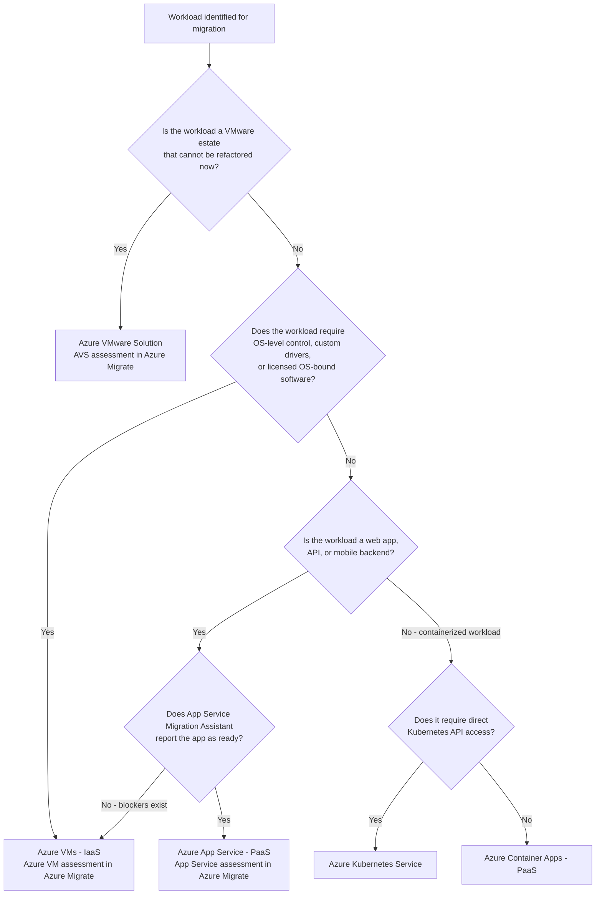
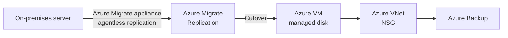
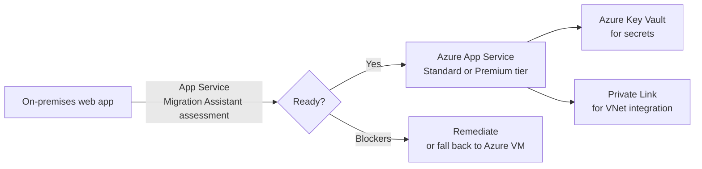

# AZ-305 Study Guide: Recommend a Solution for Migrating Workloads to IaaS and PaaS

> **Exam task:** Design migrations — Recommend a solution for migrating workloads to IaaS and PaaS
>
> **Domain:** Design infrastructure solutions
>
> **Estimated reading time:** 45 minutes
>
> **Matched task source:** Exact match from the Study Guide Map under Domain: Design infrastructure solutions > Skill: Design migrations > Task: Recommend a solution for migrating workloads to IaaS and PaaS.
>
> **Scope boundary:** This guide covers discovery, assessment, migration path selection, migration execution (IaaS lift-and-shift and PaaS modernization), landing zone readiness, and post-migration optimization considerations. It intentionally excludes: recommending solutions for migrating databases (separate task), recommending solutions for migrating unstructured data (separate task), and recommending a disaster recovery solution (separate domain).

---

## How to use this guide

By the end of this guide you should be able to:

- Describe how Azure Migrate drives the decision, plan, and execute phases of a migration.
- Choose between IaaS (Azure VMs) and PaaS (App Service, Azure SQL, Container Apps, AKS) migration targets given a set of workload requirements.
- Apply the Cloud Adoption Framework migrate methodology to sequencing, wave planning, and landing zone preparation.
- Identify when Azure VMware Solution (AVS) is the right intermediate step for VMware estates.
- Articulate the role of Azure Site Recovery in the migration context and why it is not the primary migration tool.
- Recognize and avoid common exam traps around service selection and scope confusion.

**How this task relates to adjacent tasks:** This task focuses on *how to move workloads*. A separate AZ-305 task covers *recommending a solution for migrating databases*. Another covers *migrating unstructured data*. Resiliency and disaster recovery live in a different domain. When a scenario question emphasizes RTOs and RPOs without mentioning migration, that is likely the DR task, not this one.

**How to read scenario questions for requirement clues:** Look for phrases like "on-premises servers," "existing application," "modernize," "lift and shift," "VMware estate," "web application," "containerize," "minimal code change," "OS-level control," "compliance," and "cost savings." These clues tell you which migration path and tooling the question is directing you toward.

---

## Primary source set

### Exam and module sources

- [AZ-305 official study guide skills outline](https://learn.microsoft.com/en-us/credentials/certifications/resources/study-guides/az-305)
- [Microsoft Learn: Migrate workloads to Azure](https://learn.microsoft.com/en-us/training/paths/migrate-application-workloads-azure/)

### Core product documentation

- [Azure Migrate overview](https://learn.microsoft.com/en-us/azure/migrate/migrate-services-overview)
- [Azure Migrate assessment types](https://learn.microsoft.com/en-us/azure/migrate/concepts-assessment-overview)
- [Azure Migrate business case](https://learn.microsoft.com/en-us/azure/migrate/how-to-build-a-business-case)
- [Azure Migrate application assessment](https://learn.microsoft.com/en-us/azure/migrate/review-application-assessment)
- [Azure Migrate: Migrate physical and virtual machines to Azure VMs](https://learn.microsoft.com/en-us/azure/migrate/tutorial-migrate-physical-virtual-machines)
- [Azure App Service overview](https://learn.microsoft.com/en-us/azure/app-service/overview)
- [App Service Migration Assistant](https://learn.microsoft.com/en-us/azure/app-service/app-service-asp-net-migration)
- [Azure Virtual Machines overview](https://learn.microsoft.com/en-us/azure/virtual-machines/overview)
- [Azure VMware Solution overview](https://learn.microsoft.com/en-us/azure/azure-vmware/introduction)
- [Azure Container Apps overview](https://learn.microsoft.com/en-us/azure/container-apps/overview)
- [Azure Site Recovery: migrate overview](https://learn.microsoft.com/en-us/azure/site-recovery/migrate-overview)

### Supporting architecture and framework sources

- [Cloud Adoption Framework: Plan your migration](https://learn.microsoft.com/en-us/azure/cloud-adoption-framework/migrate/plan-migration)
- [Cloud Adoption Framework: Ready your Azure landing zone](https://learn.microsoft.com/en-us/azure/cloud-adoption-framework/ready/landing-zone/ready-azure-landing-zone)
- [Cloud Adoption Framework: Migration wave planning](https://learn.microsoft.com/en-us/azure/cloud-adoption-framework/migrate/migration-wave-planning)
- [Azure Architecture Center: Choose an Azure compute service](https://learn.microsoft.com/en-us/azure/architecture/guide/technology-choices/compute-decision-tree)
- [Well-Architected Framework: Select services for performance efficiency](https://learn.microsoft.com/en-us/azure/well-architected/performance-efficiency/select-services)

### Discovery notes from the Study Guide Map

**Potentially relevant products considered:** Cloud Adoption Framework, Azure landing zones, Azure Migrate, Azure Migrate Discovery and assessment, Azure Migrate business case, Azure Migrate application assessment, Azure Virtual Machines, managed disks, Azure App Service, App Service Migration Assistant, Azure Container Apps, Azure Kubernetes Service, Azure VMware Solution, Azure Arc-enabled servers, Azure Site Recovery, Azure Backup, Azure Monitor, Application Insights, Azure Advisor, Azure Policy, Azure RBAC, Key Vault, Private Link, VPN Gateway, ExpressRoute.

**Forum-discovery note (nonauthoritative — used only as a discovery signal):** Public candidate discussions commonly mention Azure Migrate, lift-and-shift to Azure VMs, App Service modernization, Azure VMware Solution for VMware estates, cost/right-sizing, landing-zone readiness, and hybrid connectivity. All claims in this guide are grounded in official Microsoft documentation, not forum content.

**Coverage notes from the Study Guide Map:** This task is fragmented across several documentation areas. Azure Migrate and the Cloud Adoption Framework are primary. The Azure Architecture Center compute decision tree is critical for IaaS vs. PaaS selection reasoning. Several services (Container Apps, AKS, AVS, Site Recovery, ExpressRoute) are lightly covered in Microsoft Learn modules but are testable in scenario questions.

---

## 1. Exam task scope

### Domain, skill, and task

- **Domain:** Design infrastructure solutions
- **Skill:** Design migrations
- **Task:** Recommend a solution for migrating workloads to IaaS and PaaS

### What this task expects you to know

The exam expects you to reason as an architect choosing the right migration path and tooling for a described workload scenario. You are not expected to configure Azure Migrate step by step. You are expected to:

- Understand the Azure Migrate hub as the discovery, assessment, and migration platform.
- Select the appropriate Azure Migrate assessment type for the workload.
- Choose between Azure VMs (IaaS) and PaaS targets (App Service, Azure SQL, Container Apps) based on workload requirements.
- Recognize when Azure VMware Solution is the right choice for VMware-heavy environments.
- Understand the role of the Cloud Adoption Framework migrate methodology in workload sequencing and landing zone readiness.
- Distinguish between migration (Azure Migrate) and disaster recovery (Azure Site Recovery).

### What is in scope

- Azure Migrate for discovery, assessment, and execution
- IaaS target selection (Azure VMs, managed disks)
- PaaS target selection (App Service, Azure SQL, Container Apps, AKS)
- Azure VMware Solution as a migration path
- Landing zone readiness before migration
- Hybrid connectivity during migration (VPN, ExpressRoute)
- Migration sequencing and wave planning
- Post-migration right-sizing and cost optimization

### What is out of scope

- Database-specific migration details (separate task: recommend a solution for migrating databases)
- Unstructured data migration (separate task)
- Disaster recovery design (separate domain)
- Azure Data Box configuration (in scope only as a data transfer option, not as a migration target decision)

### Adjacent tasks that can be confused with this one

| Adjacent task | Confusion risk |
|---|---|
| Recommend a solution for migrating databases | Scenarios mention SQL Server, Oracle, or PostgreSQL — recognize that the database task covers Azure SQL MI, Azure SQL Database, and Database Migration Service specifically |
| Recommend a disaster recovery solution | Scenarios mention RTO, RPO, failover — these are DR, not migration; Azure Site Recovery is primarily a DR tool |
| Recommend a solution for migrating unstructured data | Scenarios mention file shares, blob data, large offline data sets — this is the unstructured data migration task |

---

## 2. Product and topic discovery pass

| Product, service, or topic | Why it may be relevant | Primary Microsoft source | In-scope or adjacent? |
|---|---|---|---|
| [Azure Migrate](https://learn.microsoft.com/en-us/azure/migrate/migrate-services-overview) | Primary discovery, assessment, and migration execution hub for IaaS and PaaS targets | Azure Migrate overview | In scope (core) |
| [Azure Migrate appliance](https://learn.microsoft.com/en-us/azure/migrate/migrate-appliance) | Lightweight VM that performs agentless discovery of on-premises servers; required before assessment | Azure Migrate docs | In scope |
| [Azure Migrate assessment types](https://learn.microsoft.com/en-us/azure/migrate/concepts-assessment-overview) | Drives IaaS vs. PaaS target selection; four types: Azure VM, Azure SQL, App Service, AVS | Assessment overview | In scope (core) |
| [Azure Migrate business case](https://learn.microsoft.com/en-us/azure/migrate/how-to-build-a-business-case) | Cost justification comparing IaaS vs. PaaS vs. on-premises TCO | Business case docs | In scope |
| [Azure Virtual Machines](https://learn.microsoft.com/en-us/azure/virtual-machines/overview) | IaaS target for lift-and-shift; required when OS-level control, custom software, or legacy dependencies exist | VM overview | In scope (core) |
| [Azure App Service](https://learn.microsoft.com/en-us/azure/app-service/overview) | PaaS target for web apps, APIs, mobile backends; no VM management required | App Service overview | In scope (core) |
| [App Service Migration Assistant](https://learn.microsoft.com/en-us/azure/app-service/app-service-asp-net-migration) | Tool for assessing and migrating existing ASP.NET apps to App Service | App Service migration docs | In scope |
| [Azure VMware Solution](https://learn.microsoft.com/en-us/azure/azure-vmware/introduction) | Allows VMware workloads to run natively on Azure without immediate refactoring; assessed via Azure Migrate AVS assessment | AVS overview | In scope |
| [Azure Container Apps](https://learn.microsoft.com/en-us/azure/container-apps/overview) | PaaS target for containerized workloads without direct Kubernetes management | Container Apps overview | In scope |
| [Azure Kubernetes Service](https://learn.microsoft.com/en-us/azure/aks/what-is-aks) | PaaS/container target when Kubernetes API access and control plane access are required | AKS overview | In scope (when Kubernetes control plane access required) |
| [Azure Site Recovery](https://learn.microsoft.com/en-us/azure/site-recovery/migrate-overview) | Can perform one-time VM migration but primarily a DR tool; exam distinguishes this from Azure Migrate | Site Recovery overview | Adjacent (exam trap) |
| [Cloud Adoption Framework migrate](https://learn.microsoft.com/en-us/azure/cloud-adoption-framework/migrate/plan-migration) | Methodology for workload sequencing, wave planning, and dependency management | CAF migrate | In scope |
| [Azure landing zones](https://learn.microsoft.com/en-us/azure/cloud-adoption-framework/ready/landing-zone/ready-azure-landing-zone) | Required pre-migration environment preparation: identity, networking, governance, subscriptions | CAF ready | In scope (prerequisite) |
| [ExpressRoute](https://learn.microsoft.com/en-us/azure/expressroute/expressroute-introduction) | Preferred data path during large-scale migration; private dedicated connectivity | ExpressRoute docs | In scope (hybrid connectivity) |
| [VPN Gateway](https://learn.microsoft.com/en-us/azure/vpn-gateway/vpn-gateway-about-vpngateways) | Encrypted tunnel over internet when ExpressRoute is unavailable | VPN Gateway docs | In scope (hybrid connectivity) |
| [Azure Arc-enabled servers](https://learn.microsoft.com/en-us/azure/azure-arc/servers/overview) | Extends Azure management to non-Azure servers during hybrid operation; used post-migration or as an intermediate step | Azure Arc docs | Adjacent |
| [Azure Advisor](https://learn.microsoft.com/en-us/azure/advisor/advisor-overview) | Post-migration right-sizing and cost optimization recommendations | Advisor docs | In scope (post-migration) |
| [Azure Monitor / Application Insights](https://learn.microsoft.com/en-us/azure/azure-monitor/overview) | Post-migration operational monitoring; relevant for assessing baseline before and after migration | Monitor docs | Adjacent (monitoring task) |
| [Azure Backup](https://learn.microsoft.com/en-us/azure/backup/backup-overview) | Pre- and post-migration backup strategy for IaaS VMs | Backup docs | Adjacent (resiliency task) |

---

## 3. Starting point from Microsoft Learn

The best starting point is the [Azure Migrate service overview](https://learn.microsoft.com/en-us/azure/migrate/migrate-services-overview), combined with the [Cloud Adoption Framework migrate methodology](https://learn.microsoft.com/en-us/azure/cloud-adoption-framework/migrate/plan-migration).

Microsoft frames migration in three phases: **Decide**, **Plan**, and **Execute**.

- **Decide:** Deploy the Azure Migrate appliance to perform agentless discovery. Build a business case that compares TCO on-premises vs. Azure. The business case surfaces right-sizing recommendations and identifies modernization opportunities.
- **Plan:** Run Azure Migrate assessments to determine Azure readiness and right-sizing. Four assessment types exist: Azure VM, Azure SQL, App Service, and AVS. Each maps to a different migration target.
- **Execute:** Use the Azure Migrate and Modernize tool, App Service Migration Assistant, or partner tools to perform the actual migration with minimal downtime.

The Microsoft Learn module on this topic introduces these terms:

- **Lift and shift (rehosting):** Move the workload as-is to Azure VMs with no code changes. Fast, low risk, but does not take advantage of PaaS economics or managed services.
- **Cloud optimized (refactoring):** Move to PaaS with minor code changes or configuration changes. Takes advantage of managed services, autoscaling, and reduced operational overhead.
- **Rearchitect/rebuild:** Significant redesign for cloud-native; outside the scope of this exam task, which focuses on migration, not greenfield architecture.

The primary documentation gap for AZ-305 preparation is that Microsoft Learn modules describe the tools well but are light on the *decision reasoning* for when to choose IaaS vs. PaaS targets for a specific workload type. The Azure Architecture Center [compute decision tree](https://learn.microsoft.com/en-us/azure/architecture/guide/technology-choices/compute-decision-tree) fills this gap.

> **Exam tip:** The AZ-305 exam asks you to *recommend*, not to configure. Understanding why you choose App Service over Azure VMs for a given workload — and what constraints force you back to IaaS — is more important than knowing the migration steps. Practice reasoning through the [compute decision tree](https://learn.microsoft.com/en-us/azure/architecture/guide/technology-choices/compute-decision-tree) for different workload types.

---

## 4. Conceptual foundation

### 4.1 Why migration architecture matters

Migration design is not just moving bits. An architect must choose a landing target that the workload can actually run on, at a cost and operational model the organization can sustain, with a migration path that minimizes downtime and risk. Getting the IaaS vs. PaaS decision wrong locks the organization into either over-managed VMs or an incompatible PaaS surface.

> **Exam tip:** The exam frequently presents scenarios where the "obvious" answer is App Service, but a constraint — such as a dependency on a Windows Service, a COM object, or a legacy IIS configuration — makes Azure VMs the correct answer. Always check for dependency blockers before recommending PaaS.

### 4.2 IaaS vs. PaaS: the core architectural distinction

[Azure Virtual Machines](https://learn.microsoft.com/en-us/azure/virtual-machines/overview) (IaaS) give you a full VM with OS-level control. You manage patching, configuration, and the runtime. [Azure App Service](https://learn.microsoft.com/en-us/azure/app-service/overview) (PaaS) gives you a managed hosting environment where you deploy application code and Microsoft manages the OS, runtime patching, scaling infrastructure, and load balancing.

From the [Azure Architecture Center compute decision tree](https://learn.microsoft.com/en-us/azure/architecture/guide/technology-choices/compute-decision-tree):

- If the workload requires OS-level control, custom drivers, or cannot be modified: **Azure VMs (IaaS)**.
- If the workload is a web app, API, or mobile backend that can run on a managed runtime: **App Service (PaaS)**.
- If the workload is already containerized and requires orchestration without direct Kubernetes API access: **Azure Container Apps (PaaS)**.
- If the workload requires direct Kubernetes control plane access: **AKS**.
- If the workload runs on VMware and the organization is not ready to refactor: **Azure VMware Solution**.

> **Exam tip:** Azure VMware Solution is not "running VMware on Azure VMs." It is a dedicated bare-metal Azure service that runs VMware vSphere, vSAN, and NSX natively. Choosing AVS is a strategic decision for organizations that want to extend their VMware operational model to Azure before eventual modernization to IaaS or PaaS. The [AVS introduction](https://learn.microsoft.com/en-us/azure/azure-vmware/introduction) makes this distinction.

### 4.3 The Azure Migrate hub

[Azure Migrate](https://learn.microsoft.com/en-us/azure/migrate/migrate-services-overview) is a free service. It is the unified platform for:

- Discovering on-premises servers, databases, and web apps (via the lightweight appliance or import templates).
- Assessing readiness, right-sizing, and cost for multiple Azure targets.
- Building a business case comparing TCO.
- Executing migration with integrated and partner tools.

Partner tools can be added to the Azure Migrate hub but may carry additional charges. The core Azure Migrate and Modernize tool (formerly called Azure Migrate: Server Migration) is free for migration execution.

> **Exam tip:** The [Azure Migrate appliance](https://learn.microsoft.com/en-us/azure/migrate/migrate-appliance) is the recommended discovery approach. It performs *agentless* discovery by deploying a lightweight VM in your datacenter. An agent-based approach is available for agent-based migration and for machines in environments where the appliance cannot be deployed. The appliance supports VMware, Hyper-V, and physical/other cloud servers.

### 4.4 Assessment types and their targets

[Azure Migrate supports four assessment types](https://learn.microsoft.com/en-us/azure/migrate/concepts-assessment-overview):

| Assessment type | Migration target |
|---|---|
| Azure VM assessment | Azure Virtual Machines (IaaS) |
| Azure SQL assessment | Azure SQL Database, Azure SQL Managed Instance, SQL Server on Azure VM |
| App Service assessment | Azure App Service, Azure Spring Apps, Azure Kubernetes Service |
| Azure VMware Solution assessment | Azure VMware Solution (AVS) nodes |

Each assessment produces readiness status (ready, ready with conditions, not ready), right-sizing recommendations, and monthly cost estimates.

> **Exam tip:** You can run multiple assessment types against the same discovered inventory. This lets you compare IaaS vs. PaaS target costs and readiness before choosing a path. The [assessment overview](https://learn.microsoft.com/en-us/azure/migrate/concepts-assessment-overview) makes clear that assessments are point-in-time snapshots — rerun them if the source environment changes significantly before migration.

### 4.5 Dependency analysis

[Dependency analysis](https://learn.microsoft.com/en-us/azure/migrate/concepts-dependency-visualization) in Azure Migrate identifies network dependencies between servers. This prevents migrating a workload while leaving behind a dependency that breaks it. Two types are available:

- **Agentless dependency analysis:** Uses network data from the appliance. Simpler, but less granular.
- **Agent-based dependency analysis:** Installs the Log Analytics agent (and Dependency agent) on each server. More granular process-level visibility.

For AZ-305, you need to understand that dependency analysis is a planning step, not an execution step, and that the output is used to group servers into migration waves.

### 4.6 Cloud Adoption Framework migrate methodology

The [CAF migrate methodology](https://learn.microsoft.com/en-us/azure/cloud-adoption-framework/migrate/plan-migration) provides the overarching process:

1. **Plan:** Sequence workloads. Group into waves. Identify dependencies. Choose data migration path.
2. **Prepare workloads (Ready):** Ensure the landing zone is ready. Landing zone includes identity (Entra ID), networking (hub-spoke or virtual WAN), governance (Azure Policy, management groups), and subscriptions.
3. **Execute migration:** Replicate, test, and cut over workload by workload.
4. **Optimize:** Right-size, configure autoscaling, apply cost reservations, enable monitoring.
5. **Decommission source:** Remove on-premises resources after validation.

> **Exam tip:** The CAF methodology emphasizes landing zone readiness *before* migration. If a scenario describes a customer who wants to begin migrating servers immediately but has no Azure governance or networking structure in place, the correct design recommendation includes landing zone preparation as a prerequisite, not a parallel activity.

### 4.7 Hybrid connectivity during migration

The [CAF migration plan](https://learn.microsoft.com/en-us/azure/cloud-adoption-framework/migrate/plan-migration) identifies four data migration paths: ExpressRoute, VPN Gateway, Azure Data Box (offline), and public internet.

- **ExpressRoute** is preferred for any production workload migration. It provides private, dedicated bandwidth without traversing the public internet. Setup lead time must be planned ahead of migration waves.
- **VPN Gateway** is acceptable when ExpressRoute is unavailable or the migration window is short.
- **Azure Data Box** is used for large offline data volumes where network transfer is impractical. It does not apply to live server migration.
- **Public internet** is used only for non-sensitive, small-volume workloads.

> **Exam tip:** ExpressRoute requires advance setup and incurs data transfer costs. If a scenario describes a very tight migration window where ExpressRoute is not yet in place, VPN Gateway is the correct interim recommendation. Do not treat ExpressRoute as automatically available.

### 4.8 Azure Site Recovery vs. Azure Migrate

[Azure Site Recovery](https://learn.microsoft.com/en-us/azure/site-recovery/migrate-overview) can technically perform a one-time VM migration to Azure, but its primary purpose is disaster recovery — continuous replication for failover. Azure Migrate is the correct tool for planned server migration.

The key distinction for the exam:

- **Azure Migrate:** Planned migration of on-premises workloads to Azure as the permanent home. Assessment, business case, execution, and optimization in one hub.
- **Azure Site Recovery:** Continuous replication for DR; failover and failback to maintain business continuity during an outage. Use it for migration only in specific legacy scenarios, not as the default recommendation.

> **Exam tip:** If a scenario mentions "migrate servers to Azure with minimal downtime," the answer is [Azure Migrate (Migrate and Modernize tool)](https://learn.microsoft.com/en-us/azure/migrate/migrate-services-overview), not Azure Site Recovery — even though ASR is sometimes described as a migration tool. Azure Site Recovery as a migration tool is a legacy pattern. The AZ-305 exam expects you to recommend Azure Migrate.

---

## 5. Design decision framework

### When to choose IaaS (Azure VMs)

Choose [Azure Virtual Machines](https://learn.microsoft.com/en-us/azure/virtual-machines/overview) when any of the following apply:

- The workload requires OS-level control (custom kernel settings, device drivers, non-standard OS).
- The application has Windows Services, COM+ components, or registry dependencies that are not supported on App Service.
- The workload uses licensed software that is tied to a specific OS or hardware.
- The organization wants the fastest path to Azure with zero application changes (pure lift-and-shift).
- The application requires network-level connectivity that PaaS services cannot provide (e.g., direct IP binding, non-HTTP/S protocols at the application tier).

### When to choose PaaS (App Service, Azure SQL, Container Apps)

Choose a PaaS target when:

- The workload is a web application, API, or mobile backend running on a supported runtime (.NET, Java, Node.js, Python, PHP, Ruby).
- The organization wants to eliminate VM management overhead (OS patching, scaling infrastructure).
- The application has few or no OS-level dependencies.
- The [App Service Migration Assistant](https://learn.microsoft.com/en-us/azure/app-service/app-service-asp-net-migration) assessment reports the application as "ready" or "ready with minor remediation."
- Cost savings from eliminating IaaS management overhead outweigh the migration effort for code adjustments.

### When to choose Azure VMware Solution

Choose [Azure VMware Solution](https://learn.microsoft.com/en-us/azure/azure-vmware/introduction) when:

- The organization runs a large VMware estate and is not ready to rearchitect applications for Azure-native IaaS or PaaS.
- The organization wants to maintain VMware operational tooling (vCenter, vSAN, NSX) while running in Azure.
- The migration timeline is aggressive and refactoring is not feasible within the window.
- AVS is often an intermediate step toward eventual IaaS or PaaS modernization.

### Decision tree

After selecting the target, always run the corresponding [Azure Migrate assessment](https://learn.microsoft.com/en-us/azure/migrate/concepts-assessment-overview) to validate readiness and get right-sizing recommendations before executing the migration.

---

## 6. Service and feature comparison tables

### IaaS vs. PaaS migration target comparison

| Dimension | Azure VMs (IaaS) | App Service (PaaS) | Azure Container Apps (PaaS) | Azure VMware Solution |
|---|---|---|---|---|
| OS control | Full ([VM docs](https://learn.microsoft.com/en-us/azure/virtual-machines/overview)) | None | None | Full (VMware) |
| Code changes required | None | Minor to moderate | Containerization required | None |
| Management overhead | High (OS patching, scaling) | Low (Microsoft manages runtime) | Low | Medium (VMware tools) |
| Supported workloads | Any | Web apps, APIs, mobile backends ([App Service](https://learn.microsoft.com/en-us/azure/app-service/overview)) | Containerized microservices ([Container Apps](https://learn.microsoft.com/en-us/azure/container-apps/overview)) | VMware VMs |
| Migration tool | Azure Migrate and Modernize | App Service Migration Assistant + Azure Migrate | Azure Migrate + container workflow | Azure Migrate AVS assessment |
| Cost model | VM size + storage + licensing | App Service Plan tier | Consumption or Dedicated plan | Dedicated bare-metal nodes |
| Ideal scenario | Legacy apps, OS-bound software | ASP.NET, Java, Node.js web apps | Containerized services | Large VMware estates |

### Azure Migrate assessment type comparison

| Assessment type | Target services | Key readiness blockers | [Source](https://learn.microsoft.com/en-us/azure/migrate/concepts-assessment-overview) |
|---|---|---|---|
| Azure VM | Azure Virtual Machines | Unsupported OS, disk limits | Azure Migrate assessment overview |
| Azure SQL | Azure SQL DB, SQL MI, SQL on VM | Unsupported SQL features, cross-db queries | Azure Migrate SQL assessment |
| App Service | App Service, Spring Apps, AKS | OS dependencies, COM+ components, 32-bit apps | Azure Migrate App Service assessment |
| AVS | Azure VMware Solution nodes | VMware version compatibility | Azure Migrate AVS assessment |

### Hybrid connectivity options during migration

| Option | When to use | Pros | Cons | Source |
|---|---|---|---|---|
| [ExpressRoute](https://learn.microsoft.com/en-us/azure/expressroute/expressroute-introduction) | Primary path for any production migration when available | Private, fast, predictable | Lead time to provision, ongoing cost | CAF migrate plan |
| [VPN Gateway](https://learn.microsoft.com/en-us/azure/vpn-gateway/vpn-gateway-about-vpngateways) | When ExpressRoute is not available or migration is small-scale | Encrypted, no physical setup | Slower, shared internet bandwidth | CAF migrate plan |
| [Azure Data Box](https://learn.microsoft.com/en-us/azure/databox/data-box-overview) | Large offline data volumes (petabyte-scale) | No network bandwidth consumption | Slow (shipping time), no live migration | CAF migrate plan |
| Public internet | Non-sensitive workloads, small data volume | No setup required | Least secure, bandwidth contention | CAF migrate plan |

---

## 7. Architecture patterns

### Pattern 1: Lift-and-shift to Azure VMs

**When it applies:** The workload has OS-level dependencies, licensed software, or no tolerance for code changes. The priority is speed of migration.

**Required Azure services:**

- [Azure Migrate (Migrate and Modernize tool)](https://learn.microsoft.com/en-us/azure/migrate/migrate-services-overview)
- [Azure Virtual Machines](https://learn.microsoft.com/en-us/azure/virtual-machines/overview) with managed disks
- [Azure Virtual Network](https://learn.microsoft.com/en-us/azure/virtual-network/virtual-networks-overview) for network isolation
- [Azure Backup](https://learn.microsoft.com/en-us/azure/backup/backup-overview) for post-migration protection

**Strengths:** Fastest path, no code changes, supports any workload.

**Weaknesses:** Does not reduce VM management overhead. No autoscaling. Higher long-term cost than PaaS. Continues to require OS patching.

**Failure modes:** Missing dependency causes application failure after cutover. Incorrect VM sizing causes performance problems or cost overruns.

**Cost:** VM compute + managed disk storage + networking. Reservations (1- or 3-year) reduce cost significantly for stable workloads.

**Security:** Apply [Azure RBAC](https://learn.microsoft.com/en-us/azure/role-based-access-control/overview), [NSGs](https://learn.microsoft.com/en-us/azure/virtual-network/network-security-groups-overview), [Defender for Servers](https://learn.microsoft.com/en-us/azure/defender-for-cloud/defender-for-servers-introduction), and [Azure Backup](https://learn.microsoft.com/en-us/azure/backup/backup-overview).

After migration, use [Azure Advisor](https://learn.microsoft.com/en-us/azure/advisor/advisor-overview) to identify right-sizing opportunities.

---

### Pattern 2: Modernize to App Service (PaaS)

**When it applies:** The workload is a web application or API with a supported runtime. The App Service Migration Assistant reports the application as ready.

**Required Azure services:**

- [Azure Migrate (App Service assessment)](https://learn.microsoft.com/en-us/azure/migrate/concepts-assessment-overview)
- [App Service Migration Assistant](https://learn.microsoft.com/en-us/azure/app-service/app-service-asp-net-migration)
- [Azure App Service](https://learn.microsoft.com/en-us/azure/app-service/overview) (Standard or Premium tier for production)
- [Azure Key Vault](https://learn.microsoft.com/en-us/azure/key-vault/general/overview) for secrets
- [Private Link](https://learn.microsoft.com/en-us/azure/private-link/private-link-overview) for network isolation (Premium tier)

**Strengths:** Eliminates OS management. Built-in autoscaling. Integrated CI/CD support. Managed TLS. Slot-based deployment for zero-downtime updates.

**Weaknesses:** Limited OS-level control. Supported runtimes only. Networking constraints on lower tiers.

**Failure modes:** COM+ or Windows Service dependencies cause assessment blockers. Legacy IIS configurations require manual remediation.

**Cost:** App Service Plan (not per-request). Standard tier or above for production SLA.

> **Exam tip:** App Service has [VNet integration](https://learn.microsoft.com/en-us/azure/app-service/overview-vnet-integration) available on Standard and above. Private endpoints for inbound traffic require Premium tier. If a scenario requires full network isolation for an App Service app, confirm the tier supports it before recommending App Service.

---

### Pattern 3: VMware estate to Azure VMware Solution

**When it applies:** The organization has a large VMware-based datacenter and is not ready to rearchitect applications. The priority is datacenter exit speed.

**Required Azure services:**

- [Azure VMware Solution](https://learn.microsoft.com/en-us/azure/azure-vmware/introduction) (dedicated bare-metal clusters)
- [Azure Migrate AVS assessment](https://learn.microsoft.com/en-us/azure/migrate/concepts-azure-vmware-solution-assessment-calculation) for node sizing
- [ExpressRoute](https://learn.microsoft.com/en-us/azure/expressroute/expressroute-introduction) for connectivity between on-premises and AVS
- VMware HCX for workload mobility between on-premises and AVS

**Strengths:** Zero application changes. Maintains VMware operational model. Supports VMware tools, licensing, and processes.

**Weaknesses:** High cost (dedicated bare-metal nodes). Does not deliver Azure-native cost or elasticity benefits until workloads are eventually migrated to IaaS or PaaS. Not a long-term modernization destination on its own.

**AVS is a stepping stone:** The CAF and Microsoft documentation position AVS as an intermediate step toward eventual Azure-native IaaS or PaaS migration.

> **Exam tip:** AVS is not the same as running VMware on Azure VMs. It runs on dedicated bare metal. The [Azure Migrate AVS assessment](https://learn.microsoft.com/en-us/azure/migrate/concepts-azure-vmware-solution-assessment-calculation) determines the number of AVS nodes needed and checks VMware version compatibility.

---

> **Test yourself**
>
> - A customer runs 200 VMware VMs supporting manufacturing automation software. The software vendor does not support any cloud platform and requires direct OS-level access. The customer wants to exit their datacenter within 6 months. What migration target should you recommend?
> - A customer's web development team has built a set of ASP.NET applications on IIS. They want to move to Azure and reduce VM management overhead. The App Service Migration Assistant reports one application has COM+ dependencies. What do you recommend for each application?
>
> **Answer guidance:** For the VMware manufacturing scenario, Azure VMware Solution is correct because the vendor requires OS-level access and the timeline is aggressive — AVS allows zero-change migration while maintaining VMware tooling. For the ASP.NET scenario, applications without blockers go to [App Service](https://learn.microsoft.com/en-us/azure/app-service/overview); the application with COM+ dependencies goes to [Azure VMs](https://learn.microsoft.com/en-us/azure/virtual-machines/overview) because COM+ is not supported on App Service.

---

## 8. Implementation awareness for architects

AZ-305 is a design exam. You do not need to know Azure Migrate portal click sequences. You do need to understand the following implementation constraints that affect design decisions.

**Azure Migrate appliance prerequisites:**

- Requires a VM in the on-premises environment (VMware, Hyper-V, or physical server).
- Requires network connectivity from the appliance to the Azure Migrate service over HTTPS (port 443).
- For agentless VMware migration, vCenter Server access and appropriate vCenter permissions are required.
- See [appliance requirements](https://learn.microsoft.com/en-us/azure/migrate/migrate-appliance#appliance-requirements) for hardware sizing.

**Assessment sequencing:**

- Discovery must complete before assessments can be created.
- Dependency analysis should run for at least 24 hours (ideally 7 days) to capture a representative dependency map.
- Assessments are point-in-time. Rerun after significant changes to source configuration.

**Landing zone must precede migration execution:**

- Identity: Hybrid identity (Entra ID Connect or Entra ID Connect cloud sync) must be in place if applications authenticate against on-premises AD.
- Networking: Hub-spoke or Virtual WAN topology with appropriate routing to on-premises must be configured before migrating workloads that depend on on-premises resources.
- Governance: Azure Policy assignments and RBAC roles should be in place before workloads land in Azure.

**Migration wave planning:**

- Group dependent workloads into the same migration wave. Do not migrate a web tier without its database tier unless the database remains on-premises intentionally during a phased migration.
- Start with lower-risk, lower-complexity workloads in early waves. Build team confidence before migrating business-critical systems.
- See [CAF migration wave planning](https://learn.microsoft.com/en-us/azure/cloud-adoption-framework/migrate/migration-wave-planning).

**Cutover testing:**

- Azure Migrate supports test migrations — replicating a workload to a test VNet without cutting over production. Always test before cutover.
- Rollback is possible until the migration is committed and the source VM is decommissioned.

---

## 9. Security, governance, and compliance considerations

### Identity

- On-premises Active Directory identities must be synchronized to [Microsoft Entra ID](https://learn.microsoft.com/en-us/entra/identity/hybrid/connect/whatis-azure-ad-connect) for workloads that use Windows Authentication or Kerberos.
- [Managed identities](https://learn.microsoft.com/en-us/entra/identity/managed-identities-azure-resources/overview) should replace service accounts and hard-coded credentials in migrated PaaS workloads.
- [Azure Key Vault](https://learn.microsoft.com/en-us/azure/key-vault/general/overview) should be used to store secrets, connection strings, and certificates in migrated workloads.

### Network security

- Apply [Network Security Groups](https://learn.microsoft.com/en-us/azure/virtual-network/network-security-groups-overview) to subnet or NIC level to control inbound and outbound traffic.
- Use [Private Link / Private Endpoints](https://learn.microsoft.com/en-us/azure/private-link/private-link-overview) to prevent PaaS services (App Service, Azure SQL) from being accessible over the public internet.
- Apply [Azure Firewall](https://learn.microsoft.com/en-us/azure/firewall/overview) in the hub VNet for centralized outbound traffic control.

### Governance

- Use [Azure Policy](https://learn.microsoft.com/en-us/azure/governance/policy/overview) to enforce tagging, allowed VM SKUs, and required diagnostic settings on migrated resources.
- Use [management groups](https://learn.microsoft.com/en-us/azure/governance/management-groups/overview) to apply policy and RBAC hierarchically across subscriptions.
- Use [Azure Blueprints](https://learn.microsoft.com/en-us/azure/governance/blueprints/overview) (or Bicep templates + Azure Policy assignments) to define repeatable landing zone configurations.

### Encryption

- Azure VMs with managed disks are encrypted at rest by default using [Azure Storage Service Encryption](https://learn.microsoft.com/en-us/azure/storage/common/storage-service-encryption). Enable [Azure Disk Encryption](https://learn.microsoft.com/en-us/azure/virtual-machines/disk-encryption-overview) if you need OS- and data-disk encryption with customer-managed keys.
- App Service supports HTTPS and TLS termination. Use [App Service Managed Certificates](https://learn.microsoft.com/en-us/azure/app-service/configure-ssl-certificate#create-a-free-managed-certificate) or bring your own certificate.

### Defender for Cloud

- Enable [Defender for Servers](https://learn.microsoft.com/en-us/azure/defender-for-cloud/defender-for-servers-introduction) on migrated IaaS VMs for threat detection, vulnerability assessment, and security posture management.
- [Defender for App Service](https://learn.microsoft.com/en-us/azure/defender-for-cloud/defender-for-app-service-introduction) provides threat detection for web application workloads on PaaS.

> **Exam tip:** If a scenario mentions compliance requirements such as data residency or regulatory mandates (HIPAA, PCI-DSS), verify that the selected Azure region supports the required compliance certifications. Use [Azure compliance documentation](https://learn.microsoft.com/en-us/azure/compliance/) to validate. A region with no Azure VMware Solution footprint means AVS is not a valid recommendation in that region.

---

## 10. Resiliency, availability, and disaster recovery considerations

This task is about migration, not DR design. However, the migration design must account for resiliency at the landing target.

**For Azure VMs (IaaS):**

- Deploy migrated VMs into [Availability Zones](https://learn.microsoft.com/en-us/azure/reliability/availability-zones-overview) for zone-level fault tolerance where the workload SLA requires it.
- Use [Azure Backup](https://learn.microsoft.com/en-us/azure/backup/backup-overview) immediately after migration. Do not wait for a second migration wave to enable backup.
- Post-migration, [Azure Site Recovery](https://learn.microsoft.com/en-us/azure/site-recovery/site-recovery-overview) can be configured for DR replication to a secondary region.

**For App Service (PaaS):**

- App Service with Standard tier and above provides zone redundancy options.
- Consider [Traffic Manager](https://learn.microsoft.com/en-us/azure/traffic-manager/traffic-manager-overview) or [Azure Front Door](https://learn.microsoft.com/en-us/azure/frontdoor/front-door-overview) for multi-region routing if the workload SLA requires geo-redundancy.

**For Azure VMware Solution:**

- AVS supports stretched clusters for zone-level redundancy within a single region. Cross-region DR for AVS workloads requires additional AVS deployment in a secondary region.

> **Exam tip:** The migration design includes backup from day one. If a scenario describes a migration recommendation without mentioning backup, the complete recommendation includes [Azure Backup](https://learn.microsoft.com/en-us/azure/backup/backup-overview) as part of the post-migration state — not as a deferred activity.

---

## 11. Cost and licensing considerations

### Azure Migrate is free

[Azure Migrate](https://learn.microsoft.com/en-us/azure/migrate/migrate-services-overview) itself has no licensing cost. Partner tools added to the hub may charge separately.

### IaaS (Azure VM) cost drivers

- VM compute (vCPU + memory): Varies by SKU. Right-sizing using the Azure Migrate assessment prevents over-provisioning.
- Managed disk storage: Premium SSD for production, Standard SSD for dev/test.
- Licensing: Windows Server and SQL Server licenses can be brought from on-premises using [Azure Hybrid Benefit](https://learn.microsoft.com/en-us/azure/virtual-machines/windows/hybrid-use-benefit-licensing). This can reduce Windows VM costs by up to 40% and SQL costs significantly.
- [Reserved VM Instances](https://learn.microsoft.com/en-us/azure/virtual-machines/prepay-reserved-vm-instances): 1- or 3-year reservations reduce compute cost by up to 72% vs. pay-as-you-go. Recommend for stable workloads post-migration.

### PaaS (App Service) cost drivers

- Priced per App Service Plan tier, not per request. Multiple apps can share one plan.
- Premium tier required for Private Endpoints, zone redundancy, and larger compute.
- No OS licensing cost.

### Azure VMware Solution cost

- Priced per dedicated bare-metal node. Minimum 3 nodes per cluster. High cost relative to IaaS or PaaS. Justified only when the organization is not ready to refactor.
- [Reserved capacity](https://learn.microsoft.com/en-us/azure/azure-vmware/reserved-instance) (1- or 3-year) reduces AVS node cost.

### Business case tool

The [Azure Migrate business case](https://learn.microsoft.com/en-us/azure/migrate/how-to-build-a-business-case) generates a TCO comparison between staying on-premises and migrating to Azure. It accounts for CapEx vs. OpEx shifts, right-sizing savings, and license optimization via Azure Hybrid Benefit.

> **Exam tip:** Azure Hybrid Benefit for Windows Server requires Software Assurance. If a scenario says the customer has active Software Assurance, always factor in [Azure Hybrid Benefit](https://learn.microsoft.com/en-us/azure/virtual-machines/windows/hybrid-use-benefit-licensing) as a cost optimization lever. If Software Assurance is not mentioned, do not assume it is available.

---

## 12. Monitoring and operational considerations

**Adjacent task context:** Recommending a comprehensive monitoring solution is a separate AZ-305 task. This section covers only the operational monitoring considerations that are relevant to a migration design recommendation.

Post-migration, migrated workloads should have:

- [Azure Monitor](https://learn.microsoft.com/en-us/azure/azure-monitor/overview) configured for VM or App Service metrics.
- [Diagnostic settings](https://learn.microsoft.com/en-us/azure/azure-monitor/essentials/diagnostic-settings) enabled to send logs to a Log Analytics workspace.
- [Application Insights](https://learn.microsoft.com/en-us/azure/azure-monitor/app/app-insights-overview) configured for web applications migrated to App Service (if the workload includes an instrumented application).
- [Azure Advisor](https://learn.microsoft.com/en-us/azure/advisor/advisor-overview) reviewed post-migration for right-sizing, security, and cost recommendations.

[Defender for Cloud](https://learn.microsoft.com/en-us/azure/defender-for-cloud/defender-for-cloud-introduction) provides a security posture score for migrated resources and highlights missing configuration (missing backup, unencrypted disks, open management ports).

---

## 13. Common exam traps

| Trap | Tempting wrong answer | Why it seems reasonable | Why it is wrong or incomplete | Better design choice | Microsoft source |
|---|---|---|---|---|---|
| Azure Site Recovery for migration | Recommend ASR to migrate servers to Azure | ASR can technically perform a one-time migration | ASR is primarily a DR tool; Azure Migrate is the recommended migration platform | [Azure Migrate](https://learn.microsoft.com/en-us/azure/migrate/migrate-services-overview) | Site Recovery migrate overview |
| App Service for all web apps | Recommend App Service regardless of OS dependencies | App Service is simpler and cheaper for web apps | Apps with COM+, Windows Services, or registry dependencies cannot run on App Service | Run [App Service Migration Assistant](https://learn.microsoft.com/en-us/azure/app-service/app-service-asp-net-migration); fall back to Azure VMs for blockers | App Service migration docs |
| AVS as a permanent destination | Recommend AVS as the end-state for VMware workloads | AVS removes the need for application changes | AVS is expensive and does not deliver Azure-native elasticity or cost benefits; it is a migration stepping stone | Position AVS as intermediate; plan eventual modernization to IaaS or PaaS | [AVS introduction](https://learn.microsoft.com/en-us/azure/azure-vmware/introduction) |
| Skipping the landing zone | Begin migration before governance and networking are in place | Faster to start migrating servers | Workloads migrated without a landing zone land in ungoverned, unnetworked subscriptions | [Prepare the Azure landing zone](https://learn.microsoft.com/en-us/azure/cloud-adoption-framework/ready/landing-zone/ready-azure-landing-zone) before migration | CAF ready docs |
| Assuming Azure Hybrid Benefit without Software Assurance | Recommend Azure Hybrid Benefit cost savings for all customers | AHB is a well-known cost saver | AHB for Windows Server requires active Software Assurance; not all customers have it | Confirm SA status before including AHB in cost projections | [Azure Hybrid Benefit](https://learn.microsoft.com/en-us/azure/virtual-machines/windows/hybrid-use-benefit-licensing) |
| Ignoring dependency grouping | Migrate the web tier without the database tier in the same wave | The web tier and database tier can be migrated separately | Missing the database dependency causes application failure after cutover | Use [dependency analysis](https://learn.microsoft.com/en-us/azure/migrate/concepts-dependency-visualization) to group dependent workloads into the same migration wave | Azure Migrate dependency docs |
| Treating all container workloads as AKS | Recommend AKS for all containerized workloads | AKS is the most well-known container service | Container Apps is the correct choice when the workload does not require direct Kubernetes API access; AKS adds management overhead | [Azure Container Apps](https://learn.microsoft.com/en-us/azure/container-apps/overview) for serverless containers; AKS when Kubernetes API access is required | Container Apps overview |
| Edge cases: Region/SKU constraints | Recommend App Service Premium with Private Endpoints in a region without availability zone support | Premium tier supports Private Endpoints generally | Not all Azure regions support AZ for App Service; check regional AZ availability | Verify AZ availability for the chosen region at [Azure regions with AZ support](https://learn.microsoft.com/en-us/azure/reliability/availability-zones-service-support) | Azure reliability docs |

> **Test yourself**
>
> - A customer wants to migrate 50 ASP.NET web applications to Azure. They mention their license agreement includes Software Assurance for Windows Server. What cost optimization should your recommendation include?
> - A customer's migration team is ready to start replicating servers. Their Azure subscription has no hub VNet, no Azure Policy assignments, and no Entra ID Connect configuration for hybrid identity. What should happen first?
>
> **Answer guidance:** Include [Azure Hybrid Benefit](https://learn.microsoft.com/en-us/azure/virtual-machines/windows/hybrid-use-benefit-licensing) for Windows Server, reducing compute costs. For the unprepared subscription, the [Azure landing zone](https://learn.microsoft.com/en-us/azure/cloud-adoption-framework/ready/landing-zone/ready-azure-landing-zone) must be prepared — identity, networking, and governance — before migration execution begins.

---

## 14. Scenario-based design examples

### Scenario 1: Straightforward lift-and-shift

**Customer requirement:** A financial services company runs 150 Windows Server VMs on VMware vSphere hosting internal line-of-business applications. The applications have no cloud-native readiness and the team has no Azure experience. The priority is datacenter exit within 12 months.

**Constraints:** No tolerance for application code changes. Mixed workloads: some run .NET Framework web apps, some run Windows Services, some run SQL Server. Organization has Software Assurance on all Windows and SQL Server licenses.

**Recommended design:**

- Deploy the [Azure Migrate appliance](https://learn.microsoft.com/en-us/azure/migrate/migrate-appliance) in the VMware environment.
- Run [Azure VM assessments](https://learn.microsoft.com/en-us/azure/migrate/concepts-assessment-overview) and [Azure SQL assessments](https://learn.microsoft.com/en-us/azure/migrate/concepts-assessment-overview) for all servers.
- Prepare an [Azure landing zone](https://learn.microsoft.com/en-us/azure/cloud-adoption-framework/ready/landing-zone/ready-azure-landing-zone) with hub-spoke networking and Entra ID Connect for hybrid identity.
- Migrate VMs to [Azure Virtual Machines](https://learn.microsoft.com/en-us/azure/virtual-machines/overview) using Azure Migrate and Modernize (agentless VMware migration).
- Apply [Azure Hybrid Benefit](https://learn.microsoft.com/en-us/azure/virtual-machines/windows/hybrid-use-benefit-licensing) for Windows Server and SQL Server to reduce compute costs.
- Purchase [1-year Reserved VM Instances](https://learn.microsoft.com/en-us/azure/virtual-machines/prepay-reserved-vm-instances) post-migration for stable workloads.
- Enable [Azure Backup](https://learn.microsoft.com/en-us/azure/backup/backup-overview) for all VMs on day one post-migration.

**Why this design:** Pure lift-and-shift to Azure VMs is the correct choice when there is no tolerance for code changes and the priority is speed. Azure Hybrid Benefit reduces cost materially given the existing SA coverage.

**Alternatives considered:** App Service for the .NET Framework apps — rejected because some apps have Windows Service components that block App Service assessment readiness. AVS — rejected because the organization has Software Assurance and can use Azure Hybrid Benefit directly on Azure VMs, which is more cost-effective than dedicated AVS nodes.

**Exam interpretation:** Questions that say "no code changes, fastest migration" almost always point to IaaS + Azure Migrate, not AVS, unless the scenario also says "maintain VMware operational model."

---

### Scenario 2: Cost-constrained design

**Customer requirement:** A startup has a LAMP stack web application running on two on-premises VMs. They want to move to Azure with the lowest possible cost. The application is PHP on Apache with a MySQL backend.

**Constraints:** Very limited budget. Team is small. No Windows Server licenses (Linux only). Application has no OS-level dependencies beyond the standard LAMP stack.

**Recommended design:**

- Run an [Azure Migrate App Service assessment](https://learn.microsoft.com/en-us/azure/migrate/concepts-assessment-overview) and confirm the PHP application is compatible with App Service Linux.
- Migrate the PHP application to [Azure App Service](https://learn.microsoft.com/en-us/azure/app-service/overview) (Basic or Standard tier depending on required SLA).
- Migrate MySQL to [Azure Database for MySQL - Flexible Server](https://learn.microsoft.com/en-us/azure/mysql/flexible-server/overview).
- Use [Azure Migrate business case](https://learn.microsoft.com/en-us/azure/migrate/how-to-build-a-business-case) to confirm PaaS cost is lower than running two VMs.

**Why this design:** Eliminating VM management removes the cost of the OS layer. App Service Basic tier is significantly cheaper than two VMs for a small web application. Azure Database for MySQL eliminates the need to manage a database VM.

**Alternatives considered:** Azure VMs — rejected because the workload has no OS-level dependencies, and PaaS will be cheaper and simpler to operate for a small team.

---

### Scenario 3: Security and compliance-driven design

**Customer requirement:** A healthcare organization wants to migrate a web application to Azure. The application handles PHI (protected health information). The organization requires that the application is not accessible from the public internet and that all data is encrypted at rest with customer-managed keys.

**Constraints:** HIPAA compliance. No public internet exposure. Customer-managed encryption keys.

**Recommended design:**

- Migrate the web application to [Azure App Service Premium tier](https://learn.microsoft.com/en-us/azure/app-service/overview) to support Private Endpoints.
- Configure an [App Service Private Endpoint](https://learn.microsoft.com/en-us/azure/app-service/networking/private-endpoint) to remove public internet access.
- Store secrets and connection strings in [Azure Key Vault](https://learn.microsoft.com/en-us/azure/key-vault/general/overview) with access via [managed identity](https://learn.microsoft.com/en-us/entra/identity/managed-identities-azure-resources/overview).
- Configure database encryption with [customer-managed keys via Key Vault](https://learn.microsoft.com/en-us/azure/azure-sql/database/transparent-data-encryption-byok-overview).
- Enable [Defender for App Service](https://learn.microsoft.com/en-us/azure/defender-for-cloud/defender-for-app-service-introduction) for threat detection.

**Why this design:** Premium tier is required for Private Endpoint support. Customer-managed keys satisfy the HIPAA encryption requirement. Managed identity removes the need to hard-code credentials.

**Exam interpretation:** Any time a scenario mentions HIPAA, PCI-DSS, or "no public internet access" for a PaaS service, the answer requires Premium tier App Service with Private Endpoints, not Standard or Basic.

---

### Scenario 4: Multi-region resiliency-driven design

**Customer requirement:** A global e-commerce company wants to migrate its web application to Azure. The application must serve customers in North America and Europe with sub-100ms latency. A single-region outage must not cause complete service disruption.

**Constraints:** Multi-region required. Latency requirements. Active-active desired.

**Recommended design:**

- Migrate the web application to [Azure App Service](https://learn.microsoft.com/en-us/azure/app-service/overview) deployed in two regions (e.g., East US and West Europe).
- Place [Azure Front Door](https://learn.microsoft.com/en-us/azure/frontdoor/front-door-overview) in front of both App Service deployments for global load balancing, WAF, and latency-based routing.
- Use [Azure Cosmos DB](https://learn.microsoft.com/en-us/azure/cosmos-db/introduction) or a geo-replicated database as the backend to avoid a single-region database dependency.
- Enable [App Service Zone Redundancy](https://learn.microsoft.com/en-us/azure/reliability/reliability-app-service) in each region (Premium v2 or v3 plan required).

**Why this design:** Azure Front Door provides global routing with latency-based traffic distribution. Two App Service deployments in different regions ensure regional failure tolerance.

**Adjacent task boundary:** Database geo-replication and selection of Cosmos DB vs. Azure SQL geo-replication are covered in the "recommend a solution for migrating databases" task. In this scenario, reference the database tier but do not detail the database migration design.

---

### Scenario 5: Edge case — VMware estate, tight timeline, compliance constraint

**Customer requirement:** A regulated financial institution runs 500 VMware VMs. They must exit their datacenter within 9 months due to a lease expiration. Their compliance team has approved Azure in a specific region. The organization cannot modify any application code.

**Constraints:** 9-month deadline. Zero code changes. Regulated industry. Specific region.

**Recommended design:**

- Verify that [Azure VMware Solution is available in the approved region](https://learn.microsoft.com/en-us/azure/azure-vmware/introduction#regions).
- Deploy [Azure VMware Solution](https://learn.microsoft.com/en-us/azure/azure-vmware/introduction) for the bulk of the VMware estate.
- Use [VMware HCX](https://learn.microsoft.com/en-us/azure/azure-vmware/tutorial-deploy-vmware-hcx) for live workload migration from on-premises vSphere to AVS.
- Plan a subsequent phase to incrementally migrate individual applications from AVS to Azure VMs or App Service as the team builds Azure familiarity.
- Connect on-premises and AVS via [ExpressRoute](https://learn.microsoft.com/en-us/azure/expressroute/expressroute-introduction).

**Why this design:** The 9-month deadline and zero-code-change constraint rule out refactoring. AVS is the only path that can move 500 VMware VMs within that window without application changes. AVS in the approved region must be confirmed first.

**Why Azure VMs alone is wrong here:** Migrating 500 VMs to Azure VMs via Azure Migrate and Modernize is possible but would require significant assessment, wave planning, and cutover testing. AVS with HCX is faster at scale because it uses VMware-native live migration.

**Exam interpretation:** The combination of "VMware," "large scale," "tight timeline," and "no code changes" should trigger an AVS recommendation. The additional check is whether AVS is available in the required region.

---

### Scenario 6: Avoid confusing with adjacent task (database migration)

**Customer requirement:** A customer wants to migrate a three-tier application: a React front end, a .NET Core API, and a SQL Server database. They want to use PaaS targets as much as possible.

**What belongs in this task:** Recommending that the front end goes to [Azure Static Web Apps](https://learn.microsoft.com/en-us/azure/static-web-apps/overview) or App Service, and the .NET Core API goes to [Azure App Service](https://learn.microsoft.com/en-us/azure/app-service/overview) or [Azure Container Apps](https://learn.microsoft.com/en-us/azure/container-apps/overview).

**What belongs in the database migration task:** Choosing between Azure SQL Database, Azure SQL Managed Instance, and SQL Server on Azure VM for the SQL Server tier. Running an Azure SQL assessment in Azure Migrate for the database. Using Database Migration Service for the data migration itself.

**Exam interpretation:** When a scenario asks you to "recommend a migration solution" for a multi-tier application, scope your answer to the compute tier recommendation. Acknowledge the database tier and note that a database migration assessment is needed, but do not attempt to design the full database migration in this task.

---

## 15. Test yourself

> **Test yourself — Discovery and assessment**
>
> - A customer wants to start planning an Azure migration. They have 200 on-premises servers across VMware and Hyper-V. They want to know which servers are ready for Azure, what size VMs they would need, and what the monthly cost would be. What should you recommend first?
> - A customer asks whether they should run 95th percentile or 99th percentile performance data in their Azure Migrate assessment. What is the tradeoff?
>
> **Answer guidance:** Deploy the [Azure Migrate appliance](https://learn.microsoft.com/en-us/azure/migrate/migrate-appliance) for each hypervisor type, run discovery for at least 7 days to capture dependency data, then create [Azure VM assessments](https://learn.microsoft.com/en-us/azure/migrate/concepts-assessment-overview). The 95th percentile excludes outliers and produces right-sized recommendations. The 99th percentile includes outliers and may over-provision. For most production scenarios, 95th percentile is recommended.

> **Test yourself — IaaS vs. PaaS**
>
> - A customer runs a Windows Forms desktop application packaged as a web app using IIS and .NET Framework 3.5. The App Service Migration Assistant reports it "not ready" due to a .NET Framework version incompatibility. What is the correct recommendation?
> - A customer runs a containerized Node.js microservices application. The team is comfortable with Docker but does not need direct Kubernetes API access. What is the appropriate PaaS target?
>
> **Answer guidance:** The Windows Forms app with a .NET Framework incompatibility should go to [Azure Virtual Machines](https://learn.microsoft.com/en-us/azure/virtual-machines/overview) — the IaaS fallback for blocked App Service assessments. The containerized Node.js app without Kubernetes API access requirements should go to [Azure Container Apps](https://learn.microsoft.com/en-us/azure/container-apps/overview), not AKS.

---

## 16. Adjacent task context

| Adjacent task or topic | Why it overlaps | What belongs in this task | What belongs elsewhere |
|---|---|---|---|
| Recommend a solution for migrating databases | Multi-tier application migrations include both a compute tier and a database tier | Choosing IaaS or PaaS targets for the compute tier; running VM and App Service assessments | Azure SQL assessment details, Database Migration Service, choosing between SQL DB / SQL MI / SQL on VM |
| Recommend a disaster recovery solution | Azure Site Recovery appears in both migration and DR contexts | Using ASR for one-time server migration (legacy pattern only); understanding that Azure Migrate is preferred | Configuring ASR for continuous DR replication; RPO/RTO design; failover/failback planning |
| Recommend a solution for migrating unstructured data | Large-scale data migration may use Azure Data Box | Choosing Azure Data Box as the connectivity option for offline large-volume migration | Designing Azure Blob Storage, Azure Files, or Azure NetApp Files targets; AzCopy and Storage Migration Service |
| Recommend a network topology | Landing zone networking is a prerequisite for migration | Noting that a hub-spoke or Virtual WAN topology must be in place before migration | Detailed network topology and ExpressRoute/VPN design decisions |

---

## 17. Final exam-focused summary

### Key takeaways

- [Azure Migrate](https://learn.microsoft.com/en-us/azure/migrate/migrate-services-overview) is the unified hub for discovery, assessment, business case, and migration execution. It is always the starting point.
- [Azure Migrate assessment types](https://learn.microsoft.com/en-us/azure/migrate/concepts-assessment-overview) map directly to migration targets: Azure VM, Azure SQL, App Service, and AVS. Run the right assessment for the right target.
- IaaS (Azure VMs) is the correct choice when OS-level control is required, when the App Service assessment has blockers, or when the fastest lift-and-shift is the priority.
- PaaS (App Service) is the correct choice when the workload is a web app or API with no OS-level dependencies and the Migration Assistant confirms readiness.
- [Azure VMware Solution](https://learn.microsoft.com/en-us/azure/azure-vmware/introduction) is the correct choice for large VMware estates with aggressive timelines and no tolerance for code changes. It is an intermediate step, not a permanent destination.
- [Azure Site Recovery is not the primary migration tool](https://learn.microsoft.com/en-us/azure/site-recovery/migrate-overview). Use Azure Migrate for planned migrations.
- [Landing zone readiness](https://learn.microsoft.com/en-us/azure/cloud-adoption-framework/ready/landing-zone/ready-azure-landing-zone) (identity, networking, governance) is a prerequisite for migration execution.
- [Azure Hybrid Benefit](https://learn.microsoft.com/en-us/azure/virtual-machines/windows/hybrid-use-benefit-licensing) and [Reserved Instances](https://learn.microsoft.com/en-us/azure/virtual-machines/prepay-reserved-vm-instances) are cost optimization levers that belong in any IaaS migration recommendation where SA is confirmed.
- [Dependency analysis](https://learn.microsoft.com/en-us/azure/migrate/concepts-dependency-visualization) must precede wave planning to prevent cutover failures caused by unmigrated dependencies.

### Common requirement clues

| Clue in the scenario | Design direction |
|---|---|
| "No code changes" + "VMware estate" + "large scale" | Azure VMware Solution |
| "No code changes" + "Windows VMs" + "OS-level control" | Azure VMs (IaaS lift-and-shift) |
| "Web application" + "minimal management overhead" | App Service (confirm with Migration Assistant) |
| "Containerized" + "no Kubernetes API access needed" | Azure Container Apps |
| "Containerized" + "needs Kubernetes control plane" | AKS |
| "Software Assurance confirmed" | Include Azure Hybrid Benefit in cost model |
| "HIPAA / no public internet" + "App Service" | App Service Premium + Private Endpoint |
| "Tight timeline" + "datacenter exit" | AVS (if VMware) or Azure Migrate agentless (if smaller scale) |
| "DR" + "RTO/RPO" | Stop — this is a different AZ-305 task |

### Before the exam, make sure you can

- [ ] Describe the three phases of Azure Migrate (Decide, Plan, Execute) and what happens in each.
- [ ] Name all four Azure Migrate assessment types and their corresponding migration targets.
- [ ] Explain the difference between Azure Migrate and Azure Site Recovery in the context of server migration.
- [ ] Describe when AVS is the right recommendation vs. when it is cost-unjustifiable.
- [ ] Identify which App Service tier is required for Private Endpoints.
- [ ] Explain why landing zone readiness must precede migration execution.
- [ ] Describe when Azure Hybrid Benefit applies and when it does not.
- [ ] Walk through the [compute decision tree](https://learn.microsoft.com/en-us/azure/architecture/guide/technology-choices/compute-decision-tree) for a given workload scenario.
- [ ] Differentiate between this task (compute migration) and the database migration task.

---

## 18. Quick-reference tables

### Requirement-to-service map

| Requirement | Recommended service | Source |
|---|---|---|
| Discover on-premises VMs | [Azure Migrate appliance](https://learn.microsoft.com/en-us/azure/migrate/migrate-appliance) | Azure Migrate docs |
| Assess readiness and sizing for VM migration | [Azure VM assessment](https://learn.microsoft.com/en-us/azure/migrate/concepts-assessment-overview) | Azure Migrate assessment overview |
| Assess web app readiness for PaaS | [App Service assessment + Migration Assistant](https://learn.microsoft.com/en-us/azure/app-service/app-service-asp-net-migration) | App Service migration docs |
| Migrate VMware VMs with no code changes | [Azure Migrate agentless VMware migration](https://learn.microsoft.com/en-us/azure/migrate/migrate-services-overview) | Azure Migrate overview |
| Migrate large VMware estate, tight timeline, no refactoring | [Azure VMware Solution + HCX](https://learn.microsoft.com/en-us/azure/azure-vmware/introduction) | AVS docs |
| Migrate web app to managed PaaS | [Azure App Service](https://learn.microsoft.com/en-us/azure/app-service/overview) | App Service overview |
| Migrate containerized app (no K8s API) | [Azure Container Apps](https://learn.microsoft.com/en-us/azure/container-apps/overview) | Container Apps overview |
| Migrate containerized app (K8s API required) | [AKS](https://learn.microsoft.com/en-us/azure/aks/what-is-aks) | AKS overview |
| Compare TCO on-premises vs. Azure | [Azure Migrate business case](https://learn.microsoft.com/en-us/azure/migrate/how-to-build-a-business-case) | Business case docs |
| Reduce Windows Server VM cost with SA | [Azure Hybrid Benefit](https://learn.microsoft.com/en-us/azure/virtual-machines/windows/hybrid-use-benefit-licensing) | AHB docs |
| Reduce long-term VM cost for stable workloads | [Reserved VM Instances](https://learn.microsoft.com/en-us/azure/virtual-machines/prepay-reserved-vm-instances) | Reservations docs |
| Prepare Azure environment before migration | [Azure landing zone](https://learn.microsoft.com/en-us/azure/cloud-adoption-framework/ready/landing-zone/ready-azure-landing-zone) | CAF ready docs |

### Trap-to-correct-answer map

| Trap | Correct answer | Source |
|---|---|---|
| Azure Site Recovery for migration | [Azure Migrate and Modernize](https://learn.microsoft.com/en-us/azure/migrate/migrate-services-overview) | Azure Migrate overview |
| App Service without checking blockers | Run [App Service Migration Assistant](https://learn.microsoft.com/en-us/azure/app-service/app-service-asp-net-migration) first; fall back to Azure VMs if blockers exist | App Service migration docs |
| AVS as permanent destination | AVS is intermediate; plan modernization to IaaS/PaaS | [AVS introduction](https://learn.microsoft.com/en-us/azure/azure-vmware/introduction) |
| Container Apps for workloads needing K8s API | Use [AKS](https://learn.microsoft.com/en-us/azure/aks/what-is-aks) when K8s control plane access is required | AKS docs |
| Private Endpoint on App Service Standard tier | Private Endpoints require [App Service Premium tier](https://learn.microsoft.com/en-us/azure/app-service/networking/private-endpoint) | App Service networking docs |
| Migrate without landing zone | [Prepare landing zone](https://learn.microsoft.com/en-us/azure/cloud-adoption-framework/ready/landing-zone/ready-azure-landing-zone) before migration execution | CAF ready docs |
