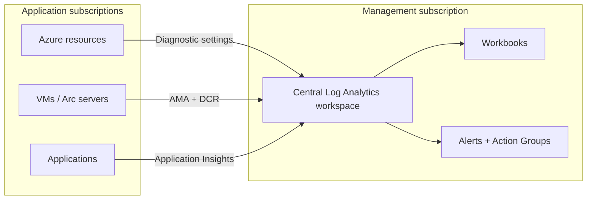
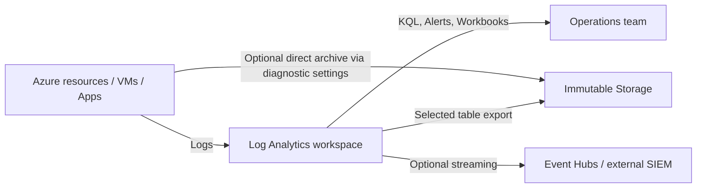

# AZ-305 Study Guide: Recommend a logging solution

This guide is deliberately scoped to a single AZ-305 exam task: the **AZ-305 study guide** item under **Design identity, governance, and monitoring solutions** → **Design solutions for logging and monitoring** → **Recommend a logging solution**. Microsoft’s own **module** for this area centers on designing for **Azure Monitor data sources**, **Log Analytics workspaces**, **Workbooks/Azure Monitor insights**, and **Azure Data Explorer**, so the architect’s job here is not to memorize deployment clicks, but to choose the right telemetry sources, workspace topology, destinations, retention model, access model, and scale strategy for a given requirement. [AZ-305 study guide](https://learn.microsoft.com/en-us/credentials/certifications/resources/study-guides/az-305), [exam page](https://learn.microsoft.com/en-us/credentials/certifications/exams/az-305/), and [module overview](https://learn.microsoft.com/en-us/training/modules/design-solution-to-log-monitor-azure-resources/) all line up on that scope. citeturn41search0turn41search1turn41search3

## Exam task scope and module baseline

On the exam, “recommend a logging solution” usually means making architectural choices about **what telemetry to collect**, **where it should land**, **how long it should be retained**, **who can access it**, **how it should be protected**, and **how the design scales across subscriptions, regions, and teams**. The neighboring tasks “recommend a solution for routing logs” and “recommend a monitoring solution” are adjacent, but this task stays centered on log collection and storage strategy rather than alerting logic or dashboard design as primary deliverables. The most likely decisions tested are whether to use a **single or multiple Log Analytics workspaces**, when to send logs to **Log Analytics** versus **Storage** or **Event Hubs**, when to use **Azure Monitor Agent with data collection rules**, and how to design for **compliance, cost, and resilience**. [AZ-305 study guide](https://learn.microsoft.com/en-us/credentials/certifications/resources/study-guides/az-305), [Log Analytics workspace architecture](https://learn.microsoft.com/en-us/azure/azure-monitor/logs/workspace-design), [Azure Monitor overview](https://learn.microsoft.com/en-us/azure/azure-monitor/fundamentals/overview). citeturn41search0turn39view3turn12view6

The Microsoft Learn module is the right starting point because it frames the problem in the same way the exam does: first understand **Azure Monitor data sources**, then design **Log Analytics workspaces**, then think about **analysis experiences** such as **Workbooks**, **Insights**, and selected use of **Azure Data Explorer**. The module summary explicitly says you should know Azure Monitor’s two primary components—**Logs** and **Metrics**—and be able to collect, analyze, visualize, and act on them. [Design a solution to log and monitor Azure resources](https://learn.microsoft.com/en-us/training/modules/design-solution-to-log-monitor-azure-resources/), [module summary and resources](https://learn.microsoft.com/en-us/training/modules/design-solution-to-log-monitor-azure-resources/7-summary-resources). citeturn41search3turn6view2

Where the module is not deep enough for architect-level exam prep is in newer or more operationally important details that the product documentation now emphasizes: **resource-specific tables instead of AzureDiagnostics**, **Analytics/Basic/Auxiliary table plans**, **workspace replication**, **availability-zone behavior**, **private link design**, **built-in Policy at scale for diagnostic settings**, and the fact that **data collection rules are replacing some legacy collection paths but not resource-log diagnostic settings yet**. Those details are exactly where many AZ-305 questions hide their tradeoffs. [Resource logs in Azure Monitor](https://learn.microsoft.com/en-us/azure/azure-monitor/platform/resource-logs), [Azure Monitor Logs overview](https://learn.microsoft.com/en-us/azure/azure-monitor/logs/data-platform-logs), [data collection rules in Azure Monitor](https://learn.microsoft.com/en-us/azure/azure-monitor/data-collection/data-collection-rule-overview), [workspace replication](https://learn.microsoft.com/en-us/azure/azure-monitor/logs/workspace-replication). citeturn20view0turn38view4turn24search1turn16view2

## Conceptual foundation

Architecturally, a logging solution exists to create a trustworthy operational record of what happened in the platform, inside resources, inside operating systems, and inside applications. Microsoft positions **Azure Monitor** as the unified observability service for **metrics, logs, traces, and events** across Azure and hybrid environments, and it is also the common data platform that other services such as **Defender for Cloud** and **Microsoft Sentinel** build on. That matters for AZ-305 because the best logging solution is usually the one that preserves correlation across all of those signals instead of fragmenting them into isolated tools. [Azure Monitor overview](https://learn.microsoft.com/en-us/azure/azure-monitor/fundamentals/overview), [Monitor your Azure cloud estate](https://learn.microsoft.com/en-us/azure/cloud-adoption-framework/manage/monitor), [enterprise monitoring architecture](https://learn.microsoft.com/en-us/azure/azure-monitor/fundamentals/enterprise-monitoring-architecture). citeturn12view6turn12view3turn12view1

The fundamental log types you need to separate are these. The **Azure Activity Log** is the platform’s **control-plane** history for create, update, delete, policy, health, and similar management events; it is collected automatically, retained by Azure for 90 days, and exported with diagnostic settings if you need longer retention or correlation in Log Analytics. **Resource logs** are **data-plane or service-operation** logs emitted by individual Azure resources such as Key Vault, App Service, SQL, or Application Gateway; they are **not collected by default** and require diagnostic settings. **Guest OS logs** and local performance counters from VMs and Arc-enabled servers are typically collected through the **Azure Monitor Agent** plus **data collection rules**. **Application telemetry** belongs in **Application Insights**, which now uses workspace-based storage in Log Analytics. [Activity Log](https://learn.microsoft.com/en-us/azure/azure-monitor/platform/activity-log), [resource logs](https://learn.microsoft.com/en-us/azure/azure-monitor/platform/resource-logs), [Azure Monitor Agent overview](https://learn.microsoft.com/en-us/azure/azure-monitor/agents/azure-monitor-agent-overview), [Application Insights overview](https://learn.microsoft.com/en-us/azure/azure-monitor/app/app-insights-overview). citeturn9view2turn20view0turn7search3turn30search5

A good mental model is that **Azure Monitor** is the umbrella service, **Log Analytics workspace** is the log data store, **diagnostic settings** are the export/routing mechanism for Azure resource logs and activity log, **AMA + DCRs** are the collection mechanism for guest and custom machine data, **Application Insights** is the application-facing observability surface backed by Log Analytics, **Workbooks** and **Log Analytics** are the main analysis tools, and **Alerts** turn logs or metrics into action. **Event Hubs** and **Storage** are not primary analysis platforms in Azure Monitor; they are destinations used when you need external integration or low-cost archival. [Azure Monitor overview](https://learn.microsoft.com/en-us/azure/azure-monitor/fundamentals/overview), [diagnostic settings](https://learn.microsoft.com/en-us/azure/azure-monitor/platform/diagnostic-settings), [data sources and data collection methods](https://learn.microsoft.com/en-us/azure/azure-monitor/fundamentals/data-sources), [Workbooks overview](https://learn.microsoft.com/en-us/azure/azure-monitor/visualize/workbooks-overview), [alerts overview](https://learn.microsoft.com/en-us/azure/azure-monitor/alerts/alerts-overview). citeturn12view6turn8view1turn24search2turn33search3turn33search2

The control-plane versus data-plane distinction is exam-critical. If the requirement is “track who changed Azure resources, who created a resource, service health, or policy effects,” think **Activity Log**. If the requirement is “track what happened inside the service,” such as access to a secret, firewall logs, or SQL requests, think **resource logs**. If the requirement is “track what users and code did inside the application,” think **Application Insights** and application logs. If the requirement is “track Windows Event Logs, Syslog, or IIS logs from VMs,” think **AMA + DCR**. [Activity Log](https://learn.microsoft.com/en-us/azure/azure-monitor/platform/activity-log), [activity log schema](https://learn.microsoft.com/en-us/azure/azure-monitor/platform/activity-log-schema), [data sources](https://learn.microsoft.com/en-us/azure/azure-monitor/fundamentals/data-sources), [collect log data from virtual machines](https://learn.microsoft.com/en-us/azure/azure-monitor/vm/data-collection). citeturn10search1turn12view5turn19search7turn14search10

| Telemetry type | Primary Azure service or feature | Typical collection method | Architect-level design question |
|---|---|---|---|
| Control-plane platform events | [Azure Activity Log](https://learn.microsoft.com/en-us/azure/azure-monitor/platform/activity-log) | Collected automatically; export with [diagnostic settings](https://learn.microsoft.com/en-us/azure/azure-monitor/platform/diagnostic-settings) if needed | Do you need retention beyond 90 days, correlation with other logs, or streaming to SIEM? |
| Resource/service logs | [Azure resource logs](https://learn.microsoft.com/en-us/azure/azure-monitor/platform/resource-logs) | Per-resource [diagnostic settings](https://learn.microsoft.com/en-us/azure/azure-monitor/platform/diagnostic-settings) | Which categories matter, and should they go to Log Analytics, Storage, Event Hubs, or more than one? |
| Guest OS / workload logs from VMs and Arc | [Azure Monitor Agent](https://learn.microsoft.com/en-us/azure/azure-monitor/agents/azure-monitor-agent-overview) | [AMA](https://learn.microsoft.com/en-us/azure/azure-monitor/agents/azure-monitor-agent-overview) + [data collection rules](https://learn.microsoft.com/en-us/azure/azure-monitor/data-collection/data-collection-rule-overview) | Which data sources are needed, where should they land, and how should DCRs be segmented? |
| Application telemetry | [Application Insights](https://learn.microsoft.com/en-us/azure/azure-monitor/app/app-insights-overview) | Application instrumentation, increasingly with [OpenTelemetry](https://learn.microsoft.com/en-us/azure/azure-monitor/app/opentelemetry-enable) | Do you need app traces and dependencies correlated with infrastructure logs in the same workspace? |
| Custom external logs | [Logs Ingestion API](https://learn.microsoft.com/en-us/azure/azure-monitor/logs/logs-ingestion-api-overview) | Direct ingestion using [DCRs](https://learn.microsoft.com/en-us/azure/azure-monitor/data-collection/data-collection-rule-overview) and optionally a [DCE](https://learn.microsoft.com/en-us/azure/azure-monitor/data-collection/data-collection-endpoint-overview) | Is the format under your control, and do you need transformations before storage? |

The table above is the practical “what kind of log is this?” map that Microsoft’s platform documentation expects you to apply: resource logs still depend on diagnostic settings, guest/custom collection depends on AMA or DCR-based ingestion, and the architect must choose whether to centralize those flows in one or more workspaces for correlation and governance. citeturn8view1turn20view0turn7search3turn23view0turn23view1

## Design decision framework

For most AZ-305 scenarios, the default recommendation is: **use Azure Monitor with a centralized Log Analytics workspace as the primary log analysis destination**, and only add **Storage** or **Event Hubs** when you have a concrete retention, immutability, or external-consumer requirement. Microsoft’s current guidance for Log Analytics workspace architecture is to **start with a single workspace** and only add more workspaces when you have real business drivers such as data residency, data ownership, split billing, different retention needs for the same tables, or special resilience requirements. [Create Log Analytics workspaces](https://learn.microsoft.com/en-us/azure/azure-monitor/logs/quick-create-workspace), [workspace architecture guidance](https://learn.microsoft.com/en-us/azure/azure-monitor/logs/workspace-design), [Well-Architected Log Analytics guide](https://learn.microsoft.com/en-us/azure/well-architected/service-guides/azure-log-analytics). citeturn16view4turn39view3turn41search7

A useful architect decision flow is this. **First**, identify the signal source: activity log, resource log, guest OS log, application telemetry, or custom external log. **Second**, decide whether the primary business need is interactive analytics, archive/compliance, or external streaming. **Third**, choose the primary landing zone: Log Analytics for analytics, Storage for low-cost immutable retention, Event Hubs for external pipelines, or a combination. **Fourth**, decide workspace topology: single workspace unless geography, ownership, billing, retention, or resilience requirements force multiple. **Fifth**, optimize cost and functionality using resource-specific tables, table plans, retention, transformations, and commitment tiers rather than multiplying workspaces early. [Azure Monitor data sources](https://learn.microsoft.com/en-us/azure/azure-monitor/fundamentals/data-sources), [workspace design](https://learn.microsoft.com/en-us/azure/azure-monitor/logs/workspace-design), [Azure Monitor Logs overview](https://learn.microsoft.com/en-us/azure/azure-monitor/logs/data-platform-logs), [cost calculations and options](https://learn.microsoft.com/en-us/azure/azure-monitor/logs/cost-logs). citeturn24search2turn39view3turn38view4turn25view0

1. If the requirement is **query, correlate, alert, workbook, or operational troubleshooting**, choose [Log Analytics workspace](https://learn.microsoft.com/en-us/azure/azure-monitor/logs/log-analytics-workspace-overview) as the primary destination. Activity logs in Log Analytics can be correlated with other data and support richer log alerts than activity-log alerts alone. citeturn13search18turn9view0  
2. If the requirement is **long-term forensic retention or tamper-resistant archival**, add [Azure Storage via diagnostic settings](https://learn.microsoft.com/en-us/azure/azure-monitor/platform/diagnostic-settings) or [workspace data export](https://learn.microsoft.com/en-us/azure/azure-monitor/logs/logs-data-export), and use [immutability policies](https://learn.microsoft.com/en-us/azure/azure-monitor/platform/diagnostic-settings) where appropriate. citeturn8view4turn20view1  
3. If the requirement is **streaming to a non-Microsoft SIEM or downstream event pipeline**, add [Azure Event Hubs](https://learn.microsoft.com/en-us/azure/azure-monitor/platform/stream-monitoring-data-event-hubs). Do not use a compacted event hub, and keep regionality requirements in mind. citeturn20view2turn8view5  
4. If the requirement is **guest logs or custom file/app logs from machines**, design around [AMA](https://learn.microsoft.com/en-us/azure/azure-monitor/agents/azure-monitor-agent-overview) and [DCRs](https://learn.microsoft.com/en-us/azure/azure-monitor/data-collection/data-collection-rule-overview), not legacy agent patterns. citeturn7search3turn24search1  
5. If the requirement is **very large-scale custom analytical workloads beyond normal monitor operations**, consider [Azure Data Explorer](https://learn.microsoft.com/en-us/azure/data-explorer/data-explorer-overview) as an adjunct rather than a default replacement, because Azure Monitor Logs is already the native operational logging platform and can also be queried from ADX tools when needed. citeturn29search4turn29search1turn29search0

| Option | Best fit | Strengths | Weaknesses / caveats |
|---|---|---|---|
| [Log Analytics workspace](https://learn.microsoft.com/en-us/azure/azure-monitor/logs/log-analytics-workspace-overview) | Operational troubleshooting, correlation, KQL, alerts, workbooks | Native [Azure Monitor Logs](https://learn.microsoft.com/en-us/azure/azure-monitor/logs/data-platform-logs) store; supports alerts, workbooks, insights, retention, table plans, access control | Main cost driver is ingestion and retention; requires careful workspace and table-plan design |
| [Azure Storage via diagnostic settings](https://learn.microsoft.com/en-us/azure/azure-monitor/platform/diagnostic-settings) | Low-cost retention, backup, immutability, static analysis | Can be cheaper than LA; can be kept indefinitely; supports immutable storage | Less interactive than Log Analytics; for regional resources, storage must be in same region as the monitored resource |
| [Azure Event Hubs via diagnostic settings](https://learn.microsoft.com/en-us/azure/azure-monitor/platform/stream-monitoring-data-event-hubs) | External SIEM or event pipeline | Near-real-time streaming to external systems; scalable consumer model | Same-region requirement for regional resources; no compacted event hubs; network/firewall settings matter |
| [Workspace data export](https://learn.microsoft.com/en-us/azure/azure-monitor/logs/logs-data-export) | Continuously export selected workspace tables after ingestion | Exports as data arrives; good for immutable archive or downstream copy of selected tables | No historical backfill; no per-record filter in export rule itself; only supported for Analytics and Basic tables, not Auxiliary |
| [Azure Data Explorer](https://learn.microsoft.com/en-us/azure/data-explorer/data-explorer-overview) | Specialized large-scale analytics beyond default ops monitoring | High-performance big-data analytics; can query Azure Monitor data from ADX tools | Extra service and operational complexity; usually adjunct, not default AZ-305 recommendation for routine operational logging |

Microsoft’s guidance consistently positions Log Analytics as the native operational destination, Storage as archival/compliance support, Event Hubs as integration support, and data export as a post-ingestion fan-out tool rather than the first answer for primary monitoring. citeturn13search18turn8view4turn20view2turn20view1turn29search4

| Table plan | Use when | What you gain | What you give up |
|---|---|---|---|
| [Analytics](https://learn.microsoft.com/en-us/azure/azure-monitor/logs/data-platform-logs) | High-value logs used for continuous monitoring, detection, performance analysis | Full query capability, alerts, insights, restore, export, best experience | Highest ingestion cost of the three plans |
| [Basic](https://learn.microsoft.com/en-us/azure/azure-monitor/logs/data-platform-logs) | Medium-touch troubleshooting and incident response data | Reduced ingestion cost; supports simple log alerts; export supported | Query charges by scanned GB; query limitations; no insights |
| [Auxiliary](https://learn.microsoft.com/en-us/azure/azure-monitor/logs/data-platform-logs) | Low-touch verbose audit/compliance data in DCR-based custom tables | Minimal ingestion cost; up to 12 years total retention; useful for low-touch data | No alerts, no export, slower queries, no workspace replication support, custom tables only |

Microsoft’s own table-plan guidance is explicit that **Analytics** is for continuous operations, **Basic** is for lower-touch troubleshooting, and **Auxiliary** is for low-touch verbose or compliance data. That means an exam answer that puts mission-critical detection data into Auxiliary is usually wrong, and one that puts every verbose audit stream into Analytics is usually cost-inefficient. [Table plans](https://learn.microsoft.com/en-us/azure/azure-monitor/logs/data-platform-logs), [select a table plan](https://learn.microsoft.com/en-us/azure/azure-monitor/logs/logs-table-plans), [Basic and Auxiliary query limitations](https://learn.microsoft.com/en-us/azure/azure-monitor/logs/basic-logs-query). citeturn38view1turn21view0turn21view1

One configuration choice matters more than many candidates realize: for resource logs landing in Log Analytics, prefer **resource-specific mode** for new diagnostic settings. Microsoft says resource-specific tables are easier to query, have better schema discoverability, improve ingestion/query performance, and enable table-level RBAC, while **AzureDiagnostics** is the legacy shared-table model. If you switch an existing data flow to resource-specific mode, new data goes into dedicated tables while old data remains in **AzureDiagnostics**, so you may need a **union** query during transition. [Resource logs](https://learn.microsoft.com/en-us/azure/azure-monitor/platform/resource-logs), [AzureDiagnostics table reference](https://learn.microsoft.com/en-us/azure/azure-monitor/reference/tables/azurediagnostics). citeturn20view0turn19search2

Also learn the platform constraints that turn into exam distractors. A resource can have **up to five diagnostic settings**; one setting can include **one of each destination type**; **Storage** and **Event Hubs** must be in the **same region** for regional monitored resources; and diagnostic settings do **not** allow granular filtering inside a selected category, so Microsoft points you to **transformations** in supported Log Analytics tables when finer control is needed. [Diagnostic settings](https://learn.microsoft.com/en-us/azure/azure-monitor/platform/diagnostic-settings), [transformations](https://learn.microsoft.com/en-us/azure/azure-monitor/data-collection/data-collection-transformations). citeturn8view1turn14search1

## Architecture patterns

A strong AZ-305 answer usually combines a clear logging architecture with the business reason it exists. The patterns below are not arbitrary; they mirror Microsoft’s current enterprise monitoring and workspace-architecture guidance for management subscriptions, centralized workspaces, and selective fan-out to archive or external tooling. [enterprise monitoring architecture](https://learn.microsoft.com/en-us/azure/azure-monitor/fundamentals/enterprise-monitoring-architecture), [workspace design](https://learn.microsoft.com/en-us/azure/azure-monitor/logs/workspace-design), [Well-Architected Log Analytics guide](https://learn.microsoft.com/en-us/azure/well-architected/service-guides/azure-log-analytics). citeturn12view1turn39view3turn41search7

**Pattern: centralized operational logging in a management subscription.** Use this when an enterprise wants one operational view across many subscriptions and resource types, with shared queries, alerts, workbooks, and possibly shared security tooling. The required services are a **central Log Analytics workspace**, **diagnostic settings** for Azure resources, **AMA + DCRs** for machines, and usually **workbooks** and **alerts**. Strengths are central visibility, KQL correlation, easier governance, and better chance of reaching commitment tiers. Weaknesses are broader blast radius if the workspace is misconfigured, more careful RBAC design, and potentially less flexibility for strict data segregation requirements. Failure modes include accidental overcollection, poor RBAC boundaries, or cost spikes from verbose tables. [enterprise monitoring architecture](https://learn.microsoft.com/en-us/azure/azure-monitor/fundamentals/enterprise-monitoring-architecture), [workspace design](https://learn.microsoft.com/en-us/azure/azure-monitor/logs/workspace-design), [manage access](https://learn.microsoft.com/en-us/azure/azure-monitor/logs/manage-access), [cost calculations](https://learn.microsoft.com/en-us/azure/azure-monitor/logs/cost-logs). citeturn12view1turn39view3turn26view1turn25view0

**Pattern: compliance-oriented dual-destination logging.** Use this when the requirement explicitly says “query in Azure, but also keep an immutable or low-cost long-term copy.” The usual design is **Log Analytics** for active operations plus **Storage** for archive. For resource-originated logs, add a second diagnostic-setting destination directly on the resource; for workspace tables already centralized in Log Analytics, use **workspace data export** to selected tables. Storage can be made immutable; data export can continuously copy specified tables as they arrive. Strengths are auditability and retention flexibility. Weaknesses are more moving parts and the need to understand source-versus-workspace export differences. Failure modes include assuming data export backfills history, forgetting same-region destination requirements, or assuming Auxiliary tables export when they do not. [Diagnostic settings](https://learn.microsoft.com/en-us/azure/azure-monitor/platform/diagnostic-settings), [workspace data export](https://learn.microsoft.com/en-us/azure/azure-monitor/logs/logs-data-export), [Azure Monitor Logs overview](https://learn.microsoft.com/en-us/azure/azure-monitor/logs/data-platform-logs). citeturn8view4turn20view1turn38view5

**Pattern: app-centric correlated observability with optional external analytics.** Use this when the customer’s primary pain is “I need application traces, dependencies, and failures correlated with platform and VM logs.” The normal answer is **workspace-based Application Insights** plus the same Log Analytics workspace receiving platform/resource/guest logs. If the organization also needs very high-volume specialized analytics, Azure Monitor data can be queried from **Azure Data Explorer** tools or combined with ADX data, but ADX is an adjunct for advanced analytics rather than the normal first stop for Azure operational logging. A specific architect caveat here is that **Application Insights diagnostic settings must not send to the same workspace the App Insights resource is based on**, because Microsoft documents duplication and access complications. [Application Insights overview](https://learn.microsoft.com/en-us/azure/azure-monitor/app/app-insights-overview), [create workspace-based Application Insights](https://learn.microsoft.com/en-us/azure/azure-monitor/app/create-workspace-resource), [diagnostic settings for Application Insights](https://learn.microsoft.com/en-us/azure/azure-monitor/platform/diagnostic-settings), [query Azure Monitor data from Azure Data Explorer](https://learn.microsoft.com/en-us/azure/data-explorer/query-monitor-data). citeturn30search5turn30search0turn32view2turn29search1

## Implementation awareness and operational model

An architect does not need to remember every portal page, but does need to decide the things an implementation team cannot safely guess later: **workspace region**, **single versus multiple workspaces**, **table plans**, **retention**, **access-control mode**, **private-link requirement**, **source categories**, **archive/streaming destinations**, and whether logs are onboarded manually or through **Azure Policy**. Microsoft’s workspace-architecture guidance is especially explicit that the design should start with as few workspaces as possible and only branch when business rules require it. [workspace architecture](https://learn.microsoft.com/en-us/azure/azure-monitor/logs/workspace-design), [log analytics workspace overview](https://learn.microsoft.com/en-us/azure/azure-monitor/logs/log-analytics-workspace-overview), [Well-Architected Log Analytics guide](https://learn.microsoft.com/en-us/azure/well-architected/service-guides/azure-log-analytics). citeturn39view3turn40search2turn41search7

For machine and custom ingestion, the implementation-aware design questions are all DCR-related. Microsoft’s current model is that **AMA** is the supported guest agent, **DCRs** define what data is collected, transformed, and where it is sent, and **DCEs** are only required in specific scenarios such as **private link** or certain AMA data sources. Microsoft’s DCR best-practice guidance also recommends separating DCRs by **data source type** and often by **destination**, because large all-in-one DCRs become hard to manage and can create unnecessary agent processing or noncompliance with data-sovereignty requirements. If you use the **Logs Ingestion API**, be aware that Microsoft enforces **TLS 1.2 or higher** from March 1, 2026. [Azure Monitor Agent](https://learn.microsoft.com/en-us/azure/azure-monitor/agents/azure-monitor-agent-overview), [DCR overview](https://learn.microsoft.com/en-us/azure/azure-monitor/data-collection/data-collection-rule-overview), [DCE overview](https://learn.microsoft.com/en-us/azure/azure-monitor/data-collection/data-collection-endpoint-overview), [DCR best practices](https://learn.microsoft.com/en-us/azure/azure-monitor/data-collection/data-collection-rule-best-practices), [Logs Ingestion API](https://learn.microsoft.com/en-us/azure/azure-monitor/logs/logs-ingestion-api-overview). citeturn7search3turn24search1turn23view1turn24search0turn23view0

At scale, architects should strongly prefer policy-driven onboarding over ad hoc configuration. Microsoft provides **built-in Azure Policy initiatives and policies** to deploy diagnostic settings for supported resources to **Log Analytics**, **Storage**, or **Event Hubs**, and the assignment can be scoped at a **management group**, **subscription**, or **resource group**. For brownfield environments, **remediation tasks** matter because the policy otherwise affects only new resources. One subtle but important nuance: if you export **management-group activity logs** from multiple management groups in the same hierarchy, you get **duplicate events**, so Microsoft recommends putting the diagnostic setting at the highest level you need rather than on every level. [Built-in policies for diagnostic settings](https://learn.microsoft.com/en-us/azure/azure-monitor/platform/diagnostic-settings-policy-built-in), [custom policy approach](https://learn.microsoft.com/en-us/azure/azure-monitor/platform/diagnostic-settings-policy), [Activity Log export for management groups](https://learn.microsoft.com/en-us/azure/azure-monitor/platform/activity-log). citeturn35view0turn35view1turn37view0

Operationally, a logging solution is incomplete unless teams can use it. Azure Monitor gives you **Log Analytics** for query analysis, **Workbooks** for curated visual reports, **Alerts** for metric/log/activity conditions, **Action Groups** for notification and automation, **alert processing rules** for routing/suppression, and **Workspace Insights / Workspace Health** for monitoring the logging platform itself. Microsoft also publishes current guidance on **log ingestion latency**, which is useful when a question asks whether “real-time” means metrics or logs: average log ingestion is less than 10 seconds once data reaches the service, but **resource logs are commonly 3–10 minutes end-to-end** and **activity logs 3–20 minutes**, while platform metrics are available much faster. [Log Analytics](https://learn.microsoft.com/en-us/azure/azure-monitor/logs/log-analytics-overview), [Workbooks](https://learn.microsoft.com/en-us/azure/azure-monitor/visualize/workbooks-overview), [alerts overview](https://learn.microsoft.com/en-us/azure/azure-monitor/alerts/alerts-overview), [action groups](https://learn.microsoft.com/en-us/azure/azure-monitor/alerts/action-groups), [alert processing rules](https://learn.microsoft.com/en-us/azure/azure-monitor/alerts/alerts-processing-rules), [workspace insights](https://learn.microsoft.com/en-us/azure/azure-monitor/logs/log-analytics-workspace-insights-overview), [workspace health](https://learn.microsoft.com/en-us/azure/azure-monitor/logs/log-analytics-workspace-health), [data ingestion time](https://learn.microsoft.com/en-us/azure/azure-monitor/logs/data-ingestion-time). citeturn17search4turn33search3turn33search2turn33search0turn33search1turn34view0turn17search7turn36view0

A good architect decision is also to avoid unnecessary implementation complexity. For example, Microsoft explicitly says **platform metrics are already collected and available in Metrics Explorer** without diagnostic settings, so exporting all metrics to Log Analytics by default is often a bad design unless you need cross-signal KQL analysis. Microsoft also notes that **metrics export via DCRs** exists but is still **preview**, which matters if an exam scenario overstates it as the universal answer today. [Diagnostic settings](https://learn.microsoft.com/en-us/azure/azure-monitor/platform/diagnostic-settings), [metrics export using DCRs](https://learn.microsoft.com/en-us/azure/azure-monitor/data-collection/metrics-export-create), [metrics export feature comparison](https://learn.microsoft.com/en-us/azure/azure-monitor/data-collection/data-plane-versus-metrics-export). citeturn32view0turn31search2turn31search3

## Security, governance, resiliency, and cost

Access control for logs is not a secondary topic; it is part of the logging-solution design. Microsoft’s guidance distinguishes **workspace-context** access from **resource-context** access. Resource-context lets application or resource teams query only the logs associated with resources they can read, while workspace-context is oriented toward central administrators with workspace-level permissions. Microsoft also supports **table-level Azure RBAC** and recommends **granular RBAC** for finer row/table control when needed. For many enterprises, the architect should intentionally choose resource-context access for application teams and reserve broader workspace access for central platform or security teams. [Manage access to Log Analytics workspaces](https://learn.microsoft.com/en-us/azure/azure-monitor/logs/manage-access). citeturn26view1turn26view2turn40search9

If the environment requires private ingestion and query paths, design for **Azure Monitor Private Link** using an **Azure Monitor Private Link Scope (AMPLS)**. Microsoft explains that private link for Azure Monitor is different from normal private endpoints because the VNet connects to an AMPLS boundary rather than to each resource separately. For Log Analytics, ingestion uses a resource-specific endpoint and queries use a shared endpoint, so DNS and topology planning matter. For high-security designs, this can be combined with **dedicated clusters**, which unlock features such as **customer-managed keys**, **Lockbox**, and **double encryption**. [Private Link for Azure Monitor](https://learn.microsoft.com/en-us/azure/azure-monitor/fundamentals/private-link-security), [dedicated clusters](https://learn.microsoft.com/en-us/azure/azure-monitor/logs/logs-dedicated-clusters), [best practices for Azure Monitor Logs](https://learn.microsoft.com/en-us/azure/azure-monitor/logs/best-practices-logs). citeturn27view3turn16view3turn16view0

For compliance-heavy designs, there are two common control patterns. One is **in-workspace long-term retention**, because Microsoft now supports up to **12 years total retention** at the table level, with Analytics retention and lower-cost long-term retention. The other is **immutable Storage archive**, especially when regulations or auditors want a tamper-resistant copy outside the regular query path. The architect choice depends on whether the business values easy in-place retrieval via search/restore, a separate immutable archive, or both. [Manage data retention in a Log Analytics workspace](https://learn.microsoft.com/en-us/azure/azure-monitor/logs/data-retention-configure), [Log Analytics workspace overview](https://learn.microsoft.com/en-us/azure/azure-monitor/logs/log-analytics-workspace-overview), [workspace data export](https://learn.microsoft.com/en-us/azure/azure-monitor/logs/logs-data-export), [diagnostic settings](https://learn.microsoft.com/en-us/azure/azure-monitor/platform/diagnostic-settings). citeturn40search0turn40search2turn20view1turn8view4

Resiliency is a real logging-design concern even though the exam task is not “design disaster recovery.” Microsoft documents that **availability zones** provide in-region data resilience for Azure Monitor Logs in supported regions, and that some regions also support service resilience. For broader regional resilience, **workspace replication** is a paid feature that creates a secondary “shadow” workspace in another region and can be switched over manually. Important caveats are exam-worthy: replication is **asynchronous**, historical logs from before replication are **not copied**, **Auxiliary tables are not replicated**, and **alert-rule replication is not automatic**. [Availability zones for Azure Monitor Logs](https://learn.microsoft.com/en-us/azure/azure-monitor/logs/availability-zones), [workspace replication](https://learn.microsoft.com/en-us/azure/azure-monitor/logs/workspace-replication), [reliability in Azure Monitor Logs](https://learn.microsoft.com/en-us/azure/reliability/reliability-monitor-logs). citeturn17search0turn16view2turn16view1

Cost design is usually the most common weak point in otherwise good logging answers. Microsoft states that the biggest charges are typically **ingestion and retention** in Log Analytics. The main cost levers are **table plan** choice, **retention**, **daily cap**, **transformations** to filter or shape data prior to storage, and **commitment tiers** if ingestion volume is stable enough. Commitment tiers can save up to roughly 30 percent versus pay-as-you-go for Analytics logs, and **dedicated clusters** start at **100 GB/day** commitment. The workspace design article also notes that consolidating data into fewer workspaces can help you qualify for better pricing. [Azure Monitor Logs cost calculations and options](https://learn.microsoft.com/en-us/azure/azure-monitor/logs/cost-logs), [best practices for Azure Monitor Logs](https://learn.microsoft.com/en-us/azure/azure-monitor/logs/best-practices-logs), [workspace design](https://learn.microsoft.com/en-us/azure/azure-monitor/logs/workspace-design). citeturn25view0turn25view4turn16view0turn39view3

The hidden cost traps are predictable. **Duplicate collection** is expensive, especially when the same security or platform data lands in multiple workspaces without necessity. **AzureDiagnostics** can become a large, harder-to-manage shared table. **Verbose logs** left in Analytics cost more than they need to. **Basic and Auxiliary** shift some cost to query-time and reduce interactive capability. **Data export** is separately billed and limited to supported tables and same-region destinations. Deleting data with purge does **not** reduce retention charges already configured; lowering retention does. [workspace architecture](https://learn.microsoft.com/en-us/azure/azure-monitor/logs/workspace-design), [Azure Monitor Logs overview](https://learn.microsoft.com/en-us/azure/azure-monitor/logs/data-platform-logs), [cost calculations](https://learn.microsoft.com/en-us/azure/azure-monitor/logs/cost-logs), [workspace data export](https://learn.microsoft.com/en-us/azure/azure-monitor/logs/logs-data-export). citeturn39view3turn38view1turn25view4turn20view1

## Exam traps, design scenarios, and final review

The hardest part of this exam task is not memorizing features; it is avoiding reasonable-sounding but incomplete answers. Microsoft’s current documentation is full of distinctions that separate an architect answer from an administrator answer. [study guide](https://learn.microsoft.com/en-us/credentials/certifications/resources/study-guides/az-305), [diagnostic settings](https://learn.microsoft.com/en-us/azure/azure-monitor/platform/diagnostic-settings), [workspace design](https://learn.microsoft.com/en-us/azure/azure-monitor/logs/workspace-design), [Azure Monitor Logs overview](https://learn.microsoft.com/en-us/azure/azure-monitor/logs/data-platform-logs). citeturn41search0turn32view0turn39view3turn38view4

| Tempting wrong answer | Why it seems reasonable | Why it is wrong or incomplete | Better design choice |
|---|---|---|---|
| “Create multiple workspaces for scale.” | More workspaces sounds more scalable. | Microsoft explicitly says to **start with a single workspace** and use the **fewest number** needed; scale alone is not the first reason to split. | Start with one workspace; split only for geography, ownership, billing, retention, or resilience needs. [workspace design](https://learn.microsoft.com/en-us/azure/azure-monitor/logs/workspace-design) |
| “Export all metrics to Log Analytics by default.” | Centralization feels neat. | Microsoft says platform metrics are already collected and available in Metrics Explorer; exporting all metrics can add cost and diagnostic-settings limitations. | Export metrics only when you need KQL correlation or downstream storage/streaming. [diagnostic settings](https://learn.microsoft.com/en-us/azure/azure-monitor/platform/diagnostic-settings) |
| “Use AzureDiagnostics everywhere.” | It is familiar and still exists. | Microsoft recommends **resource-specific mode** for new designs because it is easier to query, faster, and more manageable. | Prefer resource-specific tables for new diagnostic settings. [resource logs](https://learn.microsoft.com/en-us/azure/azure-monitor/platform/resource-logs) |
| “Put app telemetry into the same workspace by adding a diagnostic setting on Application Insights to that workspace.” | Centralization is usually good. | Microsoft documents that the destination **cannot** be the same workspace the Application Insights resource is based on, and duplicate data can result. | Use workspace-based App Insights normally; do not add that same-workspace diagnostic setting. [diagnostic settings](https://learn.microsoft.com/en-us/azure/azure-monitor/platform/diagnostic-settings) |
| “Auxiliary is the cheapest, so use it for all verbose logs including detections.” | Cheaper ingestion sounds optimal. | Auxiliary has major limits: no alerts, no export, slower queries, and no workspace replication support. | Keep operational and detection-critical data in Analytics; use Basic or Auxiliary selectively. [Azure Monitor Logs overview](https://learn.microsoft.com/en-us/azure/azure-monitor/logs/data-platform-logs) |
| “Assign management-group diagnostic settings at every level.” | More scopes sounds safer. | Microsoft warns this causes duplicate events across the hierarchy. | Export at the highest necessary management-group scope. [Activity Log](https://learn.microsoft.com/en-us/azure/azure-monitor/platform/activity-log) |

The table above is essentially a condensed map of Microsoft’s current “gotchas”: single-workspace-first, resource-specific tables, careful metric export, Application Insights special handling, and management-group duplicate-event behavior. citeturn39view3turn20view0turn32view2turn38view3turn37view0

**Scenario: centralized enterprise landing zone.** A customer has 20 subscriptions, wants one operations team to investigate incidents across Azure PaaS and VMs, and needs consistent onboarding. The best recommendation is a **central Log Analytics workspace in a management subscription**, onboard **resource logs through diagnostic settings**, onboard VM/Arc guest logs through **AMA + DCR**, and use **built-in Azure Policy initiatives** with remediation to deploy diagnostic settings at scale. I would reject “one workspace per subscription” unless the customer also requires chargeback granularity or distinct data-ownership boundaries, because Microsoft’s workspace guidance favors the fewest workspaces necessary and the Policy guidance is purpose-built for standardized rollout at scope. [enterprise monitoring architecture](https://learn.microsoft.com/en-us/azure/azure-monitor/fundamentals/enterprise-monitoring-architecture), [workspace design](https://learn.microsoft.com/en-us/azure/azure-monitor/logs/workspace-design), [built-in diagnostic-settings policies](https://learn.microsoft.com/en-us/azure/azure-monitor/platform/diagnostic-settings-policy-built-in). citeturn12view1turn39view3turn35view0

**Scenario: regulated multinational with data residency and audit retention.** The customer operates in the US and EU, requires logs to stay in-region, needs seven years of retention, and wants tamper-resistant copies for audit. The right answer is usually **separate regional workspaces** because Microsoft says geography requirements justify separate workspaces, combined with **resource-specific mode**, carefully assigned retention policies, and either **in-workspace long-term retention** or **Storage with immutability**, depending on whether audit retrieval should stay in the Azure Monitor workflow or in a separate archive. If daily ingestion is high and CMK or Lockbox is required, add a **dedicated cluster**. I would reject a single global workspace because it conflicts with Microsoft’s data-geography guidance. [workspace design](https://learn.microsoft.com/en-us/azure/azure-monitor/logs/workspace-design), [data retention](https://learn.microsoft.com/en-us/azure/azure-monitor/logs/data-retention-configure), [workspace data export](https://learn.microsoft.com/en-us/azure/azure-monitor/logs/logs-data-export), [dedicated clusters](https://learn.microsoft.com/en-us/azure/azure-monitor/logs/logs-dedicated-clusters). citeturn39view1turn40search0turn20view1turn16view3

**Scenario: SaaS application with app troubleshooting plus external SIEM.** The customer wants distributed traces, app failures, App Service and Key Vault logs, and also wants to feed a third-party SIEM. The best recommendation is **workspace-based Application Insights** for app telemetry plus **resource diagnostic settings** into the same operational Log Analytics workspace for Azure resources, with a second destination of **Event Hubs** for the SIEM where required. I would reject “send everything only to Event Hubs” because that destroys native Azure Monitor query, workbook, and alert capability, and I would reject “diagnostic-setting Application Insights into its own base workspace again” because Microsoft documents the duplication issue. [Application Insights overview](https://learn.microsoft.com/en-us/azure/azure-monitor/app/app-insights-overview), [Application Insights workspace-based creation](https://learn.microsoft.com/en-us/azure/azure-monitor/app/create-workspace-resource), [stream Azure monitoring data to Event Hubs](https://learn.microsoft.com/en-us/azure/azure-monitor/platform/stream-monitoring-data-event-hubs), [diagnostic settings](https://learn.microsoft.com/en-us/azure/azure-monitor/platform/diagnostic-settings). citeturn30search5turn30search0turn20view2turn32view2

**Adjacent task context.** Two nearby AZ-305 tasks overlap with this one. **Recommend a solution for routing logs** overlaps whenever you compare **Log Analytics**, **Storage**, and **Event Hubs**, but the routing task is more destination-centric while this task is primarily about overall log architecture. **Recommend a monitoring solution** overlaps when you discuss alerts, workbooks, and insights, but those should stay secondary here unless they clarify why a specific logging architecture is better. A related identity nuance is that **Microsoft Entra audit and sign-in logs** are configured through **Entra diagnostic settings**, not through Azure resource diagnostic settings, even though they can still land in Log Analytics, Storage, or Event Hubs. [AZ-305 study guide](https://learn.microsoft.com/en-us/credentials/certifications/resources/study-guides/az-305), [Entra logs integration with Azure Monitor Logs](https://learn.microsoft.com/en-us/entra/identity/monitoring-health/howto-integrate-activity-logs-with-azure-monitor-logs), [logs available for streaming from Microsoft Entra ID](https://learn.microsoft.com/en-us/entra/identity/monitoring-health/concept-diagnostic-settings-logs-options). citeturn41search0turn22search0turn22search2

**Key takeaways.** The default architect answer is **Azure Monitor + Log Analytics workspace**, not Storage or Event Hubs as the primary platform. Start with **one workspace**, split only for real business reasons. Prefer **resource-specific tables**. Use **AMA + DCRs** for machine and custom ingestion. Use **Storage** for archive/immutability, **Event Hubs** for external consumers, and **workspace data export** when you need post-ingestion fan-out of selected tables. Choose **Analytics/Basic/Auxiliary** intentionally, because plan choice changes alerting, export, replication, and query behavior. [Azure Monitor overview](https://learn.microsoft.com/en-us/azure/azure-monitor/fundamentals/overview), [workspace design](https://learn.microsoft.com/en-us/azure/azure-monitor/logs/workspace-design), [resource logs](https://learn.microsoft.com/en-us/azure/azure-monitor/platform/resource-logs), [DCR overview](https://learn.microsoft.com/en-us/azure/azure-monitor/data-collection/data-collection-rule-overview), [Azure Monitor Logs overview](https://learn.microsoft.com/en-us/azure/azure-monitor/logs/data-platform-logs). citeturn12view6turn39view3turn20view0turn24search1turn38view4

**Must-know services.** Azure Monitor, Log Analytics workspace, Azure Activity Log, resource logs, diagnostic settings, Azure Monitor Agent, data collection rules, data collection endpoints, Application Insights, Workbooks, Alerts, Event Hubs, Storage, workspace data export, Private Link / AMPLS, dedicated clusters, and—only as an advanced adjunct—Azure Data Explorer. [Azure Monitor documentation](https://learn.microsoft.com/en-us/azure/azure-monitor/), [module overview](https://learn.microsoft.com/en-us/training/modules/design-solution-to-log-monitor-azure-resources/), [enterprise monitoring architecture](https://learn.microsoft.com/en-us/azure/azure-monitor/fundamentals/enterprise-monitoring-architecture). citeturn11search14turn41search3turn12view1

**Must-know limitations and tradeoffs.** Activity Log is free for 90 days in Azure but needs export for longer retention; diagnostic settings have regional/destination limits; Application Insights has special same-workspace restrictions for diagnostic settings; Auxiliary tables do not support alerts or workspace replication; workspace replication is manual and does not backfill old data; and metrics export through DCRs is still preview. [Activity Log](https://learn.microsoft.com/en-us/azure/azure-monitor/platform/activity-log), [diagnostic settings](https://learn.microsoft.com/en-us/azure/azure-monitor/platform/diagnostic-settings), [workspace replication](https://learn.microsoft.com/en-us/azure/azure-monitor/logs/workspace-replication), [Azure Monitor Logs overview](https://learn.microsoft.com/en-us/azure/azure-monitor/logs/data-platform-logs), [metrics export using DCRs](https://learn.microsoft.com/en-us/azure/azure-monitor/data-collection/metrics-export-create). citeturn9view2turn32view2turn16view2turn38view3turn31search2

**Before the exam, make sure you can…**

- Explain when to choose **Log Analytics**, **Storage**, **Event Hubs**, or a combination for a logging design. citeturn13search18turn8view4turn20view2turn20view1
- Defend a **single-workspace-first** design and identify the exact conditions that justify multiple workspaces. citeturn39view3turn39view1
- Distinguish **Activity Log**, **resource logs**, **guest logs**, and **application telemetry**, including control-plane versus data-plane implications. citeturn10search1turn20view0turn7search3turn30search5
- Recommend **resource-specific mode** over **AzureDiagnostics** for new resource-log designs. citeturn20view0turn19search2
- Choose correctly between **Analytics**, **Basic**, and **Auxiliary** table plans based on alerting, export, query, retention, and resiliency requirements. citeturn38view1turn21view1
- Describe how to onboard logging **at scale** with **Azure Policy**, and why management-group activity-log exports can create duplicates. citeturn35view0turn37view0
- Explain the security and resiliency implications of **AMPLS/Private Link**, **dedicated clusters**, **availability zones**, and **workspace replication**. citeturn27view3turn16view3turn17search0turn16view2

**Open questions / limitations.** A few Microsoft features adjacent to this task are still evolving, especially **metrics export via DCRs** and some DCR-based ingestion scenarios. Also, the Learn module is helpful but not as current as the product documentation for newer table-plan, resilience, and policy-at-scale guidance, so for exam prep you should treat the Azure Monitor product docs as the source of truth whenever they are more detailed or newer. [metrics export via DCRs](https://learn.microsoft.com/en-us/azure/azure-monitor/data-collection/metrics-export-create), [Azure Monitor “what’s new”](https://learn.microsoft.com/en-us/azure/azure-monitor/fundamentals/whats-new), [module summary](https://learn.microsoft.com/en-us/training/modules/design-solution-to-log-monitor-azure-resources/7-summary-resources). citeturn31search2turn15search6turn6view2
