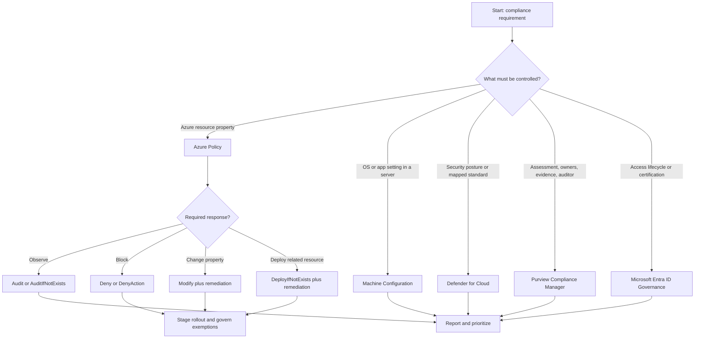
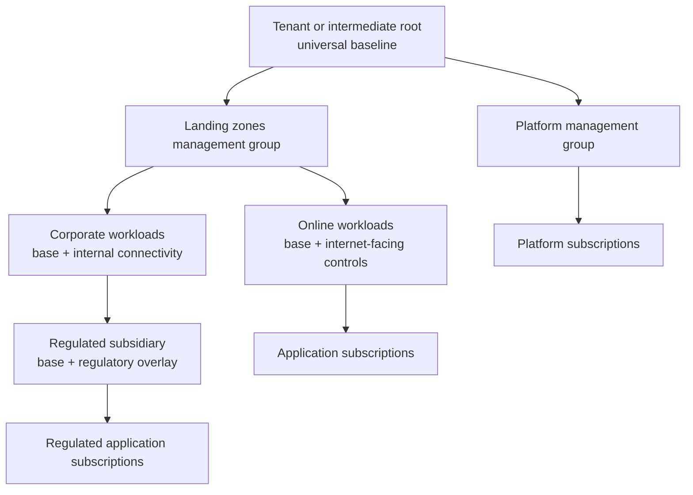
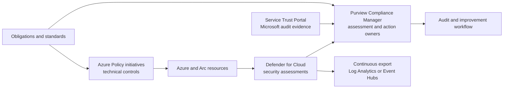

<!--
-------------------------------------------------------------------------
Program: Compliance_task_brief.md
Description: Architect-level AZ-305 task brief for managing compliance in Azure
Context: AZ-305 — Design governance — Recommend a solution for managing compliance
Author: Greg Tate
-------------------------------------------------------------------------
-->

# AZ-305 Task Brief: Recommend a solution for managing compliance

> **Exam task:** Design governance — Recommend a solution for managing compliance
>
> **Domain:** Design identity, governance, and monitoring solutions
>
> **Estimated reading time:** 45 minutes
>
> **Matched task source:** Exact match in the provided Study Guide Map, the supplied `Skills.psd1`, and the current [official AZ-305 study guide](https://learn.microsoft.com/en-us/credentials/certifications/resources/study-guides/az-305#design-identity-governance-and-monitoring-solutions-2530), whose skills measured are effective as of April 17, 2026.
>
> **Scope boundary:** This guide covers how to translate compliance obligations into Azure control objectives, enforce and report Azure resource configuration with Azure Policy, assess security posture with Microsoft Defender for Cloud, manage organization-wide assessments and evidence with Microsoft Purview Compliance Manager, and extend configuration control to server operating systems with Azure Machine Configuration. Detailed management-group design, identity-governance lifecycle design, and full monitoring architecture are adjacent tasks and appear only where they constrain the compliance solution.

---

## How to use this guide

Read this guide as a decision sequence: **obligation → control → technical test → scope → effect → exception → evidence → improvement**. The architect's job is not to select the product with the word “compliance” in its name; it is to decide which service owns each part of that sequence. [Azure Policy assesses and enforces Azure resource state](https://learn.microsoft.com/en-us/azure/governance/policy/overview), [Defender for Cloud continuously assesses security standards](https://learn.microsoft.com/en-us/azure/defender-for-cloud/concept-regulatory-compliance-standards), and [Purview Compliance Manager coordinates assessments, improvement actions, evidence, and compliance scoring](https://learn.microsoft.com/en-us/purview/compliance-manager).

By the end, you should be able to:

- Convert a regulatory or internal requirement into a control catalog, identify which controls are technically testable, and retain human evidence for controls that cannot be automatically assessed. [Defender for Cloud leaves nonautomatable controls without an automated verdict](https://learn.microsoft.com/en-us/azure/defender-for-cloud/concept-regulatory-compliance-standards#compliance-controls).
- Choose between [Azure Policy definitions, initiatives, assignments, exclusions, and exemptions](https://learn.microsoft.com/en-us/azure/governance/policy/overview#azure-policy-objects) without confusing their purposes.
- Select [audit, deny, modify, deployIfNotExists, auditIfNotExists, manual, or disabled](https://learn.microsoft.com/en-us/azure/governance/policy/concepts/effect-basics) according to the required response and deployment phase.
- Distinguish preventive controls, detective assessments, corrective remediation, and evidence-management workflows. [Azure Policy supports assessment and remediation](https://learn.microsoft.com/en-us/azure/governance/policy/overview), while [Compliance Manager tracks improvement actions and evidence](https://learn.microsoft.com/en-us/purview/compliance-manager).
- Design inherited controls at [management-group scope](https://learn.microsoft.com/en-us/azure/governance/management-groups/overview) while keeping exceptions narrow, approved, time-bound, and visible through [policy exemptions](https://learn.microsoft.com/en-us/azure/governance/policy/concepts/exemption-structure).
- Explain why a built-in regulatory initiative or a high score is useful evidence but is not, by itself, a certification or proof that every legal responsibility is satisfied. [Regulatory initiatives identify Microsoft, customer, and shared responsibility](https://learn.microsoft.com/en-us/azure/governance/policy/concepts/regulatory-compliance), and [Azure compliance offerings describe Microsoft's audit scope](https://learn.microsoft.com/en-us/azure/compliance/).

In scenario questions, underline clues such as **prevent deployment**, **assess existing resources**, **automatically correct**, **guest operating system**, **hybrid servers**, **industry standard**, **manual evidence**, **auditor**, **exception expires**, **multiple subscriptions**, **AWS or GCP**, **data residency**, **continuous export**, and **least privilege**. Each clue points to a different layer of the compliance operating model.

Use the inline links to verify changing product behavior close to the exam date. The [official study guide](https://learn.microsoft.com/en-us/credentials/certifications/resources/study-guides/az-305#updates-to-the-exam) says most questions cover generally available features but commonly used preview features can appear.

---

## Primary source set

### Exam and module sources

- [Official AZ-305 study guide](https://learn.microsoft.com/en-us/credentials/certifications/resources/study-guides/az-305), including the exact task under Design governance.
- [AZ-305: Design identity, governance, and monitor solutions](https://learn.microsoft.com/en-us/training/paths/design-identity-governance-monitor-solutions/), the advanced learning path containing the Design governance module.
- [Design governance](https://learn.microsoft.com/en-us/training/modules/design-governance/), the Microsoft Learn starting point for management groups, subscriptions, resource groups, tags, Azure Policy, RBAC, and landing zones.

### Core product documentation

- [Azure Policy overview](https://learn.microsoft.com/en-us/azure/governance/policy/overview) for definitions, initiatives, assignments, scope, inheritance, evaluation, and remediation.
- [Regulatory Compliance initiatives](https://learn.microsoft.com/en-us/azure/governance/policy/concepts/regulatory-compliance) for mapping policy definitions to controls, compliance domains, and responsibility.
- [Policy effects](https://learn.microsoft.com/en-us/azure/governance/policy/concepts/effect-basics) for preventive, detective, corrective, and manual responses.
- [Policy remediation](https://learn.microsoft.com/en-us/azure/governance/policy/how-to/remediate-resources) for managed identities, required roles, and remediation tasks.
- [Policy exemptions](https://learn.microsoft.com/en-us/azure/governance/policy/concepts/exemption-structure) for waivers, mitigations, expiration, metadata, and selective initiative exemptions.
- [Policy compliance data](https://learn.microsoft.com/en-us/azure/governance/policy/how-to/get-compliance-data) for evaluation triggers, Policy Insights, Azure Resource Graph, command-line, portal, and Azure Monitor access.
- [Policy as code](https://learn.microsoft.com/en-us/azure/governance/policy/concepts/policy-as-code) for source control, testing, staged enforcement, review, and deployment automation.
- [Azure Machine Configuration](https://learn.microsoft.com/en-us/azure/governance/machine-configuration/overview/01-overview-concepts) for in-guest Azure and Arc-enabled server configuration.
- [Defender for Cloud regulatory compliance](https://learn.microsoft.com/en-us/azure/defender-for-cloud/concept-regulatory-compliance-standards) and its [regulatory compliance dashboard](https://learn.microsoft.com/en-us/azure/defender-for-cloud/regulatory-compliance-dashboard) for continuous security assessment and multicloud standards.
- [Microsoft Purview Compliance Manager](https://learn.microsoft.com/en-us/purview/compliance-manager) for assessment workflows, improvement actions, evidence, ownership, and a risk-based score.

### Supporting architecture and framework sources

- [Microsoft cloud security benchmark](https://learn.microsoft.com/en-us/security/benchmark/azure/introduction) for a Microsoft-authored security control baseline and mappings to external frameworks.
- [Cloud Adoption Framework governance enforcement](https://learn.microsoft.com/en-us/azure/cloud-adoption-framework/govern/enforce-cloud-governance-policies) for inheritance, monitor-first rollout, policy as code, and team responsibilities.
- [Azure landing zone policy-driven governance](https://learn.microsoft.com/en-us/azure/cloud-adoption-framework/ready/landing-zone/design-area/azure-policy) for enterprise-scale baseline placement and platform guardrails.
- [Azure compliance documentation](https://learn.microsoft.com/en-us/azure/compliance/) for Microsoft certifications, attestations, and industry or regional offerings.
- [Service Trust Portal](https://learn.microsoft.com/en-us/purview/get-started-with-service-trust-portal) for audit reports, compliance guides, trust documents, and Microsoft-managed evidence.
- [Well-Architected Framework security checklist](https://learn.microsoft.com/en-us/azure/well-architected/security/checklist) for risk-based security design principles that support, but do not replace, formal compliance obligations.

### Discovery notes from the Study Guide Map

The supplied map considered Azure Policy, initiatives, effects, exclusions, exemptions, remediation, policy as code, Machine Configuration, management groups, RBAC, Defender for Cloud, the Microsoft cloud security benchmark, Purview Compliance Manager, Azure compliance offerings, Service Trust Portal, Resource Graph, Azure Monitor, Log Analytics, Arc, landing zones, Azure Blueprints, deployment stacks, template specs, Microsoft Entra ID Governance, and Microsoft Cloud for Sovereignty.

The map's forum-discovery note says public study pages commonly put Azure Policy at the center, pair it with Defender for Cloud regulatory compliance, and select Purview for organization-wide compliance activities. That note is **nonauthoritative** and is used only to identify common candidate discussion patterns; the recommendations in this brief are grounded in the Microsoft sources above.

Coverage decisions:

- Azure Policy is the core service because the task asks for a design to manage compliance of Azure resource configurations at scale. [Azure Policy is designed to enforce organizational standards and assess compliance](https://learn.microsoft.com/en-us/azure/governance/policy/overview).
- Defender for Cloud is included when the requirement emphasizes security posture, mapped regulatory standards, recommendations, multicloud resources, or compliance dashboards. [Defender standards continuously assess automatable controls](https://learn.microsoft.com/en-us/azure/defender-for-cloud/concept-regulatory-compliance-standards).
- Purview Compliance Manager is included when the requirement emphasizes an audit program, evidence, owners, improvement actions, Microsoft 365, or organization-wide compliance. [Compliance Manager manages assessments across a multicloud environment](https://learn.microsoft.com/en-us/purview/compliance-manager).
- Machine Configuration is included when policy must inspect or configure operating-system and application settings inside Azure or Arc-enabled machines. [Machine Configuration audits or configures OS settings as code](https://learn.microsoft.com/en-us/azure/governance/machine-configuration/overview/01-overview-concepts).
- Azure Blueprints is migration context only. As of this guide's validation date, [new blueprint definitions and versions can no longer be created after July 31, 2026](https://learn.microsoft.com/en-us/azure/governance/blueprints/blueprint-retirement); Microsoft recommends migration to [deployment stacks](https://learn.microsoft.com/en-us/azure/azure-resource-manager/bicep/deployment-stacks) and [template specs](https://learn.microsoft.com/en-us/azure/azure-resource-manager/templates/template-specs) before final retirement on January 31, 2027.

---

## 1. Exam task scope

### Task-resolution result

| Resolution item | Result |
|---|---|
| Domain | [Design identity, governance, and monitoring solutions](https://learn.microsoft.com/en-us/credentials/certifications/resources/study-guides/az-305#design-identity-governance-and-monitoring-solutions-2530) |
| Skill | Design governance |
| Exact task | Recommend a solution for managing compliance |
| Match quality | Exact wording match in the supplied map, supplied skill manifest, and current official study guide. |
| Architect's output | A layered control and evidence architecture: authoritative requirements, scope, Policy controls, security assessment, exception workflow, remediation, evidence retention, ownership, and continuous improvement. [CAF recommends governance policies with assigned accountability and enforcement processes](https://learn.microsoft.com/en-us/azure/cloud-adoption-framework/govern/enforce-cloud-governance-policies). |

### What the task is really asking

An Azure Solutions Architect must decide:

1. **What must be proved?** Use contractual, regulatory, internal, and Microsoft shared-responsibility material to establish applicable obligations. [Azure compliance offerings](https://learn.microsoft.com/en-us/azure/compliance/) show Microsoft's certifications and supporting documentation; they do not define every customer control.
2. **What can Azure test?** Express Azure Resource Manager properties as Policy definitions, group related tests into initiatives, and use regulatory metadata when a framework-oriented dashboard is required. [Regulatory Compliance initiatives group policy definitions into controls and domains](https://learn.microsoft.com/en-us/azure/governance/policy/concepts/regulatory-compliance).
3. **Where should it apply?** Choose the highest scope at which the requirement is uniformly valid, normally a management group for a portfolio of subscriptions, then use narrow exceptions rather than duplicating assignments. [Management-group policy assignments inherit to descendant subscriptions](https://learn.microsoft.com/en-us/azure/governance/management-groups/overview).
4. **What response is appropriate?** Start with visibility, then choose prevention or correction according to risk, feasibility, and deployment impact. Microsoft recommends beginning with `audit` or `auditIfNotExists` before enforcement. [Policy management recommendations](https://learn.microsoft.com/en-us/azure/governance/policy/overview#recommendations-for-managing-policies)
5. **How are legitimate deviations handled?** Use documented exemptions with category, owner metadata, selected policy references, and expiration rather than silently changing or bypassing the baseline. [Policy exemptions are first-class child resources](https://learn.microsoft.com/en-us/azure/governance/policy/concepts/exemption-structure).
6. **How will drift be detected and corrected?** Use periodic Policy evaluation, on-demand scans, remediation tasks, Defender recommendations, and workflow integration. [Policy exposes state through Policy Insights and Resource Graph](https://learn.microsoft.com/en-us/azure/governance/policy/how-to/get-compliance-data).
7. **What evidence survives an audit?** Preserve assignment versions, exemption approvals, evaluation results, remediation history, manual attestations, and Microsoft audit artifacts. [Compliance Manager supplies improvement-action workflows and audit-oriented reporting](https://learn.microsoft.com/en-us/purview/compliance-manager).

### In scope

- Azure resource-state controls, regulatory initiatives, assignment scope, effects, remediation, exemptions, reporting, and policy as code. [Azure Policy overview](https://learn.microsoft.com/en-us/azure/governance/policy/overview)
- Security posture and regulatory-standard assessment across Azure and connected clouds. [Defender for Cloud regulatory standards](https://learn.microsoft.com/en-us/azure/defender-for-cloud/concept-regulatory-compliance-standards)
- Guest operating-system configuration for Azure and Arc-enabled servers. [Machine Configuration](https://learn.microsoft.com/en-us/azure/governance/machine-configuration/overview/01-overview-concepts)
- Organization-wide assessment ownership and evidence. [Purview Compliance Manager](https://learn.microsoft.com/en-us/purview/compliance-manager)
- Microsoft audit artifacts and shared responsibility. [Service Trust Portal](https://learn.microsoft.com/en-us/purview/get-started-with-service-trust-portal)

### Out of scope except where it changes the compliance answer

- Designing the complete management-group, subscription, resource-group, and tagging hierarchy belongs to the adjacent resource-organization task. [The official study guide lists it separately](https://learn.microsoft.com/en-us/credentials/certifications/resources/study-guides/az-305#design-governance).
- Access reviews, entitlement management, privileged identity management, and employee lifecycle belong to the separate identity-governance task. [Microsoft Entra ID Governance](https://learn.microsoft.com/en-us/entra/id-governance/identity-governance-overview) is included only when a compliance obligation concerns identity lifecycle or access certification.
- Designing enterprise log routing, workspace topology, metrics, and alerts belongs to the logging and monitoring tasks. [The official study guide lists those tasks separately](https://learn.microsoft.com/en-us/credentials/certifications/resources/study-guides/az-305#design-solutions-for-logging-and-monitoring).
- Designing data protection, backup, and regional failover belongs to business continuity; here they appear only as controls that the compliance program must assess. [AZ-305 business continuity tasks](https://learn.microsoft.com/en-us/credentials/certifications/resources/study-guides/az-305#design-business-continuity-solutions-1520)

> **Exam tip:** If a scenario asks who may perform an action, start with [Azure RBAC](https://learn.microsoft.com/en-us/azure/role-based-access-control/overview). If it asks what resource state is allowed, audited, denied, or repaired, start with [Azure Policy](https://learn.microsoft.com/en-us/azure/governance/policy/overview#azure-policy-and-azure-rbac). A complete compliance design frequently uses both.

---

## 2. Product and topic discovery pass

| Product, service, or topic | Why it may be relevant | Primary Microsoft source | In-scope or adjacent? |
|---|---|---|---|
| Azure Policy | Tests and enforces Azure resource state; provides assignments, initiatives, compliance state, and remediation. | [Azure Policy overview](https://learn.microsoft.com/en-us/azure/governance/policy/overview) | Core |
| Policy initiatives | Package related definitions, shared parameters, and framework controls into a manageable assignment unit. | [Initiative structure](https://learn.microsoft.com/en-us/azure/governance/policy/concepts/initiative-definition-structure) | Core |
| Regulatory Compliance initiatives | Add control groups, compliance domains, responsibility, and policy metadata to an initiative. | [Regulatory Compliance](https://learn.microsoft.com/en-us/azure/governance/policy/concepts/regulatory-compliance) | Core |
| Policy effects | Select observation, prevention, mutation, related-resource deployment, action blocking, manual attestation, or disabling. | [Effect basics](https://learn.microsoft.com/en-us/azure/governance/policy/concepts/effect-basics) | Core |
| Exclusions and exemptions | Bound applicability and govern legitimate exceptions without weakening the entire baseline. | [Scope and exclusions](https://learn.microsoft.com/en-us/azure/governance/policy/concepts/scope), [exemptions](https://learn.microsoft.com/en-us/azure/governance/policy/concepts/exemption-structure) | Core |
| Remediation tasks and managed identities | Correct existing resources for `modify` and `deployIfNotExists` policies under least privilege. | [Remediation](https://learn.microsoft.com/en-us/azure/governance/policy/how-to/remediate-resources) | Core |
| Management groups | Supply inherited policy scope across subscription portfolios. | [Management groups](https://learn.microsoft.com/en-us/azure/governance/management-groups/overview) | Core dependency; hierarchy design is adjacent |
| Azure Machine Configuration | Tests or configures in-guest OS and application settings on Azure and Arc-enabled machines. | [Machine Configuration concepts](https://learn.microsoft.com/en-us/azure/governance/machine-configuration/overview/01-overview-concepts) | Core when guest state is required |
| Microsoft Defender for Cloud | Maps security recommendations to standards and continuously assesses supported controls across Azure, AWS, and GCP. | [Regulatory standards](https://learn.microsoft.com/en-us/azure/defender-for-cloud/concept-regulatory-compliance-standards) | Core for security compliance |
| Microsoft cloud security benchmark | Supplies a cloud-focused baseline and control mappings that can seed the security control catalog. | [MCSB introduction](https://learn.microsoft.com/en-us/security/benchmark/azure/introduction) | Supporting core |
| Microsoft Purview Compliance Manager | Manages assessments, improvement actions, owners, evidence, and auditor-oriented reporting across the digital estate. | [Compliance Manager](https://learn.microsoft.com/en-us/purview/compliance-manager) | Core for program/evidence requirements |
| Azure compliance offerings | Determines whether Microsoft has relevant certifications or attestations and clarifies service scope. | [Azure compliance](https://learn.microsoft.com/en-us/azure/compliance/) | Core discovery/evidence |
| Service Trust Portal | Provides Microsoft audit reports and trust documents used as supplier evidence. | [Service Trust Portal](https://learn.microsoft.com/en-us/purview/get-started-with-service-trust-portal) | Supporting core |
| Azure Resource Graph and Policy Insights | Query compliance state and inventory across large scopes. | [Get Policy compliance data](https://learn.microsoft.com/en-us/azure/governance/policy/how-to/get-compliance-data) | Supporting core |
| Azure Monitor and Log Analytics | Retain, alert on, and analyze exported assessment or activity data. | [Azure Monitor overview](https://learn.microsoft.com/en-us/azure/azure-monitor/fundamentals/overview) | Adjacent operational dependency |
| Azure Arc | Projects hybrid and multicloud machines into Azure management so Policy and Machine Configuration can govern them. | [Azure Arc-enabled servers overview](https://learn.microsoft.com/en-us/azure/azure-arc/servers/overview) | Supporting when hybrid is required |
| Azure RBAC | Separates policy authors, assigners, readers, exemption approvers, and remediation identities. | [Azure RBAC overview](https://learn.microsoft.com/en-us/azure/role-based-access-control/overview) | Adjacent authorization dependency |
| Azure landing zones | Provide an enterprise policy baseline and scalable governance placement pattern. | [Azure landing zone Policy design area](https://learn.microsoft.com/en-us/azure/cloud-adoption-framework/ready/landing-zone/design-area/azure-policy) | Supporting architecture |
| Deployment stacks and template specs | Package/version deployed resources and replace legacy Blueprint packaging use cases; they do not replace continuous Policy evaluation. | [Deployment stacks](https://learn.microsoft.com/en-us/azure/azure-resource-manager/bicep/deployment-stacks), [template specs](https://learn.microsoft.com/en-us/azure/azure-resource-manager/templates/template-specs) | Adjacent deployment governance |
| Azure Blueprints | Relevant only to legacy estates and migration questions because phased retirement has begun. | [Blueprint retirement](https://learn.microsoft.com/en-us/azure/governance/blueprints/blueprint-retirement) | Legacy/adjacent |
| Microsoft Entra ID Governance | Satisfies access lifecycle, reviews, and entitlement-control obligations rather than Azure resource configuration rules. | [Identity Governance overview](https://learn.microsoft.com/en-us/entra/id-governance/identity-governance-overview) | Adjacent exam task |
| Microsoft Cloud for Sovereignty | Adds policy initiatives and guidance when sovereign controls, transparency, and residency requirements materially change the design. | [Sovereignty Policy Portfolio](https://learn.microsoft.com/en-us/industry/sovereignty/policy-portfolio-baseline) | Edge-case supporting topic |

> **Test yourself**
>
> - A regulator requires evidence that database encryption, privileged-access reviews, and employee training occur. Which single Azure product should enforce all three?
> - A customer says “We passed the Defender standard, so certification is automatic.” What is missing from that reasoning?
>
> **Answer guidance:** No single product owns all three. Use [Azure Policy](https://learn.microsoft.com/en-us/azure/governance/policy/overview) or service-native assessment for resource configuration, [Microsoft Entra ID Governance](https://learn.microsoft.com/en-us/entra/id-governance/identity-governance-overview) for access reviews, and [Purview Compliance Manager](https://learn.microsoft.com/en-us/purview/compliance-manager) or another governance-risk-compliance workflow for people/process evidence. [Defender for Cloud assesses automatable controls](https://learn.microsoft.com/en-us/azure/defender-for-cloud/concept-regulatory-compliance-standards#compliance-controls); certification still depends on the complete control scope and an authorized audit.

---

## 3. Starting point from Microsoft Learn

The [AZ-305 governance module](https://learn.microsoft.com/en-us/training/modules/design-governance/) establishes the broad design vocabulary: management groups organize inherited governance, subscriptions and resource groups provide boundaries, tags describe resources, Azure Policy evaluates rules, RBAC authorizes actions, and landing zones combine those building blocks. For this task, the important move is to turn that vocabulary into a compliance lifecycle rather than a list of services.

### Core concepts Microsoft expects

| Concept | Architect-level interpretation |
|---|---|
| Definition | A reusable rule containing conditions and one effect; prefer a [built-in definition](https://learn.microsoft.com/en-us/azure/governance/policy/concepts/definition-structure-basics#type) when it exactly satisfies the requirement, and author custom logic when no suitable built-in exists. |
| Initiative | A versionable control set that groups related definitions and parameters so the organization assigns and reports them together. [Initiative definitions simplify grouped management](https://learn.microsoft.com/en-us/azure/governance/policy/concepts/initiative-definition-structure). |
| Assignment | The application of one definition or initiative to a scope, with parameter values, enforcement behavior, messages, overrides, selectors, identity, and exclusions as applicable. [Assignment structure](https://learn.microsoft.com/en-us/azure/governance/policy/concepts/assignment-structure) |
| Scope | Management group, subscription, resource group, or resource; descendants inherit assignments, so place a control at the highest uniformly applicable scope. [Policy scope](https://learn.microsoft.com/en-us/azure/governance/policy/concepts/scope) |
| Compliance state | The evaluated relationship between an applicable resource and a policy; state can include compliant, non-compliant, exempt, conflict, not started, or protected. [Policy glossary](https://learn.microsoft.com/en-us/azure/governance/policy/policy-glossary#compliance-state) |
| Effect | The response when a rule matches, chosen according to whether the design should observe, prevent, change, deploy, block an action, request manual evidence, or disable evaluation. [Effect basics](https://learn.microsoft.com/en-us/azure/governance/policy/concepts/effect-basics) |
| Remediation | A separately triggered corrective operation for existing resources under `modify` or `deployIfNotExists`, authorized through an assignment managed identity. [Remediation security](https://learn.microsoft.com/en-us/azure/governance/policy/how-to/remediate-resources#how-remediation-security-works) |
| Exemption | A visible exception child resource tied to an assignment, with `waiver` or `mitigated` category and optional expiration. [Exemption structure](https://learn.microsoft.com/en-us/azure/governance/policy/concepts/exemption-structure) |

### Design recommendations from the starting material

- Start in audit mode, examine compliance and deployment impact, remediate where appropriate, then progressively enable enforcement. [Azure Policy explicitly recommends audit-first rollout](https://learn.microsoft.com/en-us/azure/governance/policy/overview#recommendations-for-managing-policies).
- Group related definitions in initiatives even when the initial set is small, because initiatives reduce assignment sprawl and allow the control set to evolve. [Initiative recommendation](https://learn.microsoft.com/en-us/azure/governance/policy/overview#recommendations-for-managing-policies)
- Store definitions, initiatives, assignments, and exemptions in source control; validate them before production deployment. [Policy-as-code guidance](https://learn.microsoft.com/en-us/azure/governance/policy/concepts/policy-as-code)
- Apply broad common controls high in the hierarchy and workload-specific controls lower in the hierarchy. [CAF Azure Policy guidance](https://learn.microsoft.com/en-us/azure/cloud-adoption-framework/ready/landing-zone/design-area/azure-policy)
- Separate resource-state governance from authorization: Policy defines allowed state, while RBAC determines which principals can perform management actions. [Policy versus RBAC](https://learn.microsoft.com/en-us/azure/governance/policy/overview#azure-policy-and-azure-rbac)

### Gaps to close for scenario readiness

The module alone does not fully resolve which evidence system to use, how to treat manual controls, how to distinguish exclusions from exemptions, how remediation identities obtain permissions, how hybrid guest state is assessed, or how product retirement changes a legacy recommendation. Those distinctions require the [Policy exemption](https://learn.microsoft.com/en-us/azure/governance/policy/concepts/exemption-structure), [remediation](https://learn.microsoft.com/en-us/azure/governance/policy/how-to/remediate-resources), [Machine Configuration](https://learn.microsoft.com/en-us/azure/governance/machine-configuration/overview/01-overview-concepts), [Defender regulatory dashboard](https://learn.microsoft.com/en-us/azure/defender-for-cloud/regulatory-compliance-dashboard), [Compliance Manager](https://learn.microsoft.com/en-us/purview/compliance-manager), and [Blueprint retirement](https://learn.microsoft.com/en-us/azure/governance/blueprints/blueprint-retirement) documentation.

> **Exam tip:** “Audit existing resources” selects a detective effect; “block future noncompliant deployments” selects `deny`; “add or change a supported property” suggests `modify`; and “ensure a related resource exists” suggests `deployIfNotExists`. [Effect behavior is resource- and timing-dependent](https://learn.microsoft.com/en-us/azure/governance/policy/concepts/effect-basics), so do not treat effect names as interchangeable labels.

---

## 4. Conceptual foundation

### 4.1 Compliance is a control system, not a dashboard

A sound compliance design has five logically separate layers:

1. **Authority:** laws, contracts, standards, and internal policies define the obligation. [Azure compliance documentation](https://learn.microsoft.com/en-us/azure/compliance/) helps establish what Microsoft has independently audited.
2. **Control catalog:** the organization translates obligations into control objectives, identifies Microsoft/customer/shared responsibility, and assigns control owners. [Regulatory initiatives can display responsibility metadata](https://learn.microsoft.com/en-us/azure/governance/policy/concepts/regulatory-compliance).
3. **Technical enforcement and assessment:** Azure Policy, service-native controls, Defender for Cloud, Machine Configuration, and identity tools test or enforce automatable requirements. [Defender for Cloud maps security recommendations to compliance controls](https://learn.microsoft.com/en-us/azure/defender-for-cloud/concept-regulatory-compliance-standards).
4. **Evidence and exceptions:** assessment results, activity records, exemption approvals, Microsoft audit reports, and manual proof establish what happened and why. [Compliance Manager supports improvement actions and audit reporting](https://learn.microsoft.com/en-us/purview/compliance-manager).
5. **Improvement:** owners prioritize gaps, remediate drift, retest, and update the control set as services or obligations change. [CAF treats governance as an iterative discipline](https://learn.microsoft.com/en-us/azure/cloud-adoption-framework/govern/).

> **Exam tip:** A portal score summarizes evidence from a defined scope and control set; it does not expand the scope, perform missing manual controls, or confer certification. [Defender cannot automatically decide controls that lack automated assessments](https://learn.microsoft.com/en-us/azure/defender-for-cloud/concept-regulatory-compliance-standards#compliance-controls).

### 4.2 Policy objects separate reusable intent from application

- A **definition** states one rule and one effect. [Definition structure](https://learn.microsoft.com/en-us/azure/governance/policy/concepts/definition-structure-basics)
- An **initiative** combines definitions into a goal or framework and can map common initiative parameters to member definitions. [Initiative structure](https://learn.microsoft.com/en-us/azure/governance/policy/concepts/initiative-definition-structure)
- An **assignment** binds the definition or initiative to a scope and supplies parameter values. [Policy assignment](https://learn.microsoft.com/en-us/azure/governance/policy/concepts/assignment-structure)
- An **exclusion** in `notScopes` removes a descendant scope from an assignment before evaluation; excluded resources do not appear as exempt compliance evidence. [Policy scope](https://learn.microsoft.com/en-us/azure/governance/policy/concepts/scope#assignment-and-exclusion-scopes)
- An **exemption** is an auditable exception that retains a visible `exempt` result and can target selected definitions inside an initiative. [Exemption structure](https://learn.microsoft.com/en-us/azure/governance/policy/concepts/exemption-structure)
- A **remediation task** instructs Policy to correct applicable existing resources; new or updated resources are handled according to the effect during normal evaluation. [Remediation](https://learn.microsoft.com/en-us/azure/governance/policy/how-to/remediate-resources)

This separation enables one centrally governed control definition to have distinct parameter values, rollout stages, enforcement settings, and exception decisions across business scopes without forking the underlying rule.

> **Exam tip:** Choose an exemption when the exception itself must be governed, reported, approved, or expire. Choose `notScopes` when the child scope is genuinely outside the assignment's applicability and should not be represented as an exception. [Exemptions remain visible in compliance data](https://learn.microsoft.com/en-us/azure/governance/policy/policy-glossary#exempt).

### 4.3 Preventive, detective, corrective, and compensating controls

| Control type | Azure implementation | Design use |
|---|---|---|
| Preventive | [`deny`](https://learn.microsoft.com/en-us/azure/governance/policy/concepts/effect-deny), [`denyAction`](https://learn.microsoft.com/en-us/azure/governance/policy/concepts/effect-deny-action), RBAC, network controls | Stop prohibited state or actions before risk is accepted. |
| Detective | [`audit`](https://learn.microsoft.com/en-us/azure/governance/policy/concepts/effect-audit), [`auditIfNotExists`](https://learn.microsoft.com/en-us/azure/governance/policy/concepts/effect-audit-if-not-exists), Defender assessments | Identify drift or missing related configuration without blocking the request. |
| Corrective | [`modify`](https://learn.microsoft.com/en-us/azure/governance/policy/concepts/effect-modify), [`deployIfNotExists`](https://learn.microsoft.com/en-us/azure/governance/policy/concepts/effect-deploy-if-not-exists), remediation tasks | Change a supported property or deploy a required related resource. |
| Compensating | Exemption category `mitigated`, alternate technical control, documented evidence | Accept an alternate mechanism that reduces the risk when the prescribed control cannot apply. [Exemption categories](https://learn.microsoft.com/en-us/azure/governance/policy/concepts/exemption-structure#exemption-category) |
| Manual | [`manual`](https://learn.microsoft.com/en-us/azure/governance/policy/concepts/effect-manual), Compliance Manager improvement action/evidence | Track an obligation that automation cannot determine. |

The design should match the response to the consequence of failure. A low-risk naming convention may begin and remain detective, whereas a strict prohibited-location requirement can justify denial after impact testing. [CAF recommends monitor-first rollout and progressive enforcement](https://learn.microsoft.com/en-us/azure/cloud-adoption-framework/govern/enforce-cloud-governance-policies).

> **Exam tip:** `audit` identifies a noncompliant resource but does not fix it. `modify` and `deployIfNotExists` can support remediation, but the assignment's managed identity must have the required roles. [Remediation permissions](https://learn.microsoft.com/en-us/azure/governance/policy/how-to/remediate-resources#configure-the-managed-identity)

### 4.4 Control plane, data plane, and guest state

Azure Policy's standard Resource Manager mode primarily evaluates management-plane resource representations and supported resource-provider properties. [Policy modes determine which resource types and locations are evaluated](https://learn.microsoft.com/en-us/azure/governance/policy/concepts/definition-structure-basics#mode). Some services expose deeper provider modes, such as Kubernetes and Key Vault data-plane integrations. [Resource provider modes](https://learn.microsoft.com/en-us/azure/governance/policy/concepts/definition-structure-basics#resource-provider-modes)

For operating-system or application state inside a machine, use [Azure Machine Configuration](https://learn.microsoft.com/en-us/azure/governance/machine-configuration/overview/01-overview-concepts). It can audit or apply settings on Azure VMs and Arc-enabled servers, and Microsoft documents a current maximum of 50 guest assignments per machine. [Machine Configuration concepts and limits](https://learn.microsoft.com/en-us/azure/governance/machine-configuration/overview/01-overview-concepts)

For identities, access reviews, and entitlement lifecycles, use [Microsoft Entra ID Governance](https://learn.microsoft.com/en-us/entra/id-governance/identity-governance-overview); an ARM property policy is not a substitute for recurring certification of human access.

> **Exam tip:** If the requirement says “TLS registry setting inside every Windows server” or “package present on Linux,” ordinary ARM-mode Policy is insufficient; choose [Machine Configuration](https://learn.microsoft.com/en-us/azure/governance/machine-configuration/overview/01-overview-concepts), with Azure Arc when the servers are outside Azure.

### 4.5 Identity and least privilege

Policy authoring, assignment, exception approval, remediation, and evidence review are distinct responsibilities. [Resource Policy Contributor includes most Policy operations](https://learn.microsoft.com/en-us/azure/governance/policy/overview#azure-rbac-permissions-in-azure-policy), while read roles can view Policy objects and compliance results within scope. `modify` and `deployIfNotExists` assignments use a system- or user-assigned managed identity whose permissions should be restricted to the smallest roles required by `roleDefinitionIds`. [Remediation security](https://learn.microsoft.com/en-us/azure/governance/policy/how-to/remediate-resources#configure-the-policy-definition)

Portal-created assignments can grant listed roles automatically, but SDK-driven deployment requires those grants to be managed explicitly. [Remediation authorization differs by deployment interface](https://learn.microsoft.com/en-us/azure/governance/policy/how-to/remediate-resources#configure-the-managed-identity). This difference matters in policy-as-code pipelines: successful creation of an assignment is not proof that its remediation identity can repair resources.

> **Exam tip:** Assigning Contributor to every remediation identity is easy but violates least privilege. Use the role IDs declared by the definition and scope them only where remediation must act. [Managed identity best practices](https://learn.microsoft.com/en-us/entra/identity/managed-identities-azure-resources/managed-identity-best-practice-recommendations)

### 4.6 Security, operations, cost, and resiliency implications

- **Security:** a compliance baseline should include prevent/detect/correct decisions, but compliance mappings do not replace threat modeling or risk management. [Well-Architected security design principles](https://learn.microsoft.com/en-us/azure/well-architected/security/principles)
- **Operations:** evaluation is not instantaneous for all paths. New assignments take time to apply and large evaluation scopes have no fixed completion time; design dashboards and release gates accordingly. [Policy evaluation triggers](https://learn.microsoft.com/en-us/azure/governance/policy/how-to/get-compliance-data#evaluation-triggers)
- **Cost:** Azure Policy itself has no direct charge, but remediated resources, Defender plans, Machine Configuration, Log Analytics ingestion/retention, Event Hubs, and Purview licensing can introduce cost. [Azure Policy pricing](https://azure.microsoft.com/en-us/pricing/details/azure-policy/), [Defender for Cloud pricing](https://azure.microsoft.com/en-us/pricing/details/defender-for-cloud/), and [Compliance Manager licensing](https://learn.microsoft.com/en-us/purview/compliance-manager-setup#licensing) should be checked during design.
- **Resiliency:** Policy definitions and assignments should be source-controlled and reproducible, while exported compliance evidence should follow the retention and recovery requirements of its Log Analytics, Event Hubs, storage, or GRC destination. [Policy as code](https://learn.microsoft.com/en-us/azure/governance/policy/concepts/policy-as-code) provides the control-plane recovery baseline.

> **Exam tip:** The cheapest answer is not automatically “Policy only.” If the requirement includes security recommendations, multicloud assessment, evidence ownership, or auditors, the correct architecture may add [Defender for Cloud](https://learn.microsoft.com/en-us/azure/defender-for-cloud/regulatory-compliance-dashboard) or [Purview Compliance Manager](https://learn.microsoft.com/en-us/purview/compliance-manager) despite added licensing.

> **Test yourself**
>
> - A custom initiative contains 40 controls, but 5 require interviews and signed procedures. Should the architect force all 40 into automated resource policies?
> - A `deployIfNotExists` assignment reports noncompliant resources but remediation fails. What design dependency should be checked first?
>
> **Answer guidance:** Represent manual obligations with a [manual assessment/evidence workflow](https://learn.microsoft.com/en-us/purview/compliance-manager) or the Policy [`manual` effect](https://learn.microsoft.com/en-us/azure/governance/policy/concepts/effect-manual), rather than fabricating an automated test. For failed correction, verify the assignment's managed identity and required RBAC roles. [Remediation identity requirements](https://learn.microsoft.com/en-us/azure/governance/policy/how-to/remediate-resources#how-remediation-security-works)

---

## 5. Design decision framework

### Step-by-step design logic

1. **Classify the obligation.** Determine jurisdiction, business scope, data classification, contract, audit period, and whether Microsoft, the customer, or both are responsible. [Regulatory initiative metadata exposes responsibility](https://learn.microsoft.com/en-us/azure/governance/policy/concepts/regulatory-compliance).
2. **Confirm Microsoft service scope.** Use [Azure compliance offerings](https://learn.microsoft.com/en-us/azure/compliance/) and [Service Trust Portal](https://learn.microsoft.com/en-us/purview/get-started-with-service-trust-portal) evidence to determine which certifications and reports cover the selected cloud, region, and service.
3. **Build a control matrix.** For every objective, record owner, resource scope, technical test, effect, evidence source, exception authority, remediation target, and review frequency. [Compliance Manager improvement actions](https://learn.microsoft.com/en-us/purview/compliance-manager) can coordinate the broader workflow.
4. **Choose the enforcement engine.** Use Azure Policy for ARM/resource-provider state, Machine Configuration for guest state, Entra governance for access lifecycle, Defender for Cloud for security posture/standard assessment, and Purview for program/evidence workflows. [Policy supports deeper integrations only for selected providers](https://learn.microsoft.com/en-us/azure/governance/policy/overview#resources-covered-by-azure-policy).
5. **Select the assignment scope.** Place universally valid controls high enough to inherit, and place workload- or regulation-specific controls at their applicable management group or subscription. [CAF Policy guidance](https://learn.microsoft.com/en-us/azure/cloud-adoption-framework/ready/landing-zone/design-area/azure-policy)
6. **Prefer built-ins, but assess fit.** Built-ins reduce custom maintenance; a custom definition is justified when the semantics, aliases, parameterization, or evidence requirement differs. Monitor built-in changes because assignments use the current assigned definition state. [Policy assignments use the latest definition state](https://learn.microsoft.com/en-us/azure/governance/policy/overview#assignments).
7. **Choose an audit-first rollout.** Measure existing noncompliance and exemptions, test deployment pipelines, estimate remediation cost, and validate supported resource types. [Policy recommends `audit` or `auditIfNotExists` before enforcement](https://learn.microsoft.com/en-us/azure/governance/policy/overview#recommendations-for-managing-policies).
8. **Choose the steady-state effect.** Deny unacceptable new state, modify safe mutable properties, deploy required related resources, retain audit where remediation needs human change control, and use manual evidence where automation cannot decide. [Effect basics](https://learn.microsoft.com/en-us/azure/governance/policy/concepts/effect-basics)
9. **Design exceptions before enforcement.** Require an owner, justification, `waiver` or `mitigated` category, approval reference, narrow scope, selected policy reference, and expiration. [Exemption metadata and expiration](https://learn.microsoft.com/en-us/azure/governance/policy/concepts/exemption-structure)
10. **Automate and observe.** Store artifacts in source control, require peer review, validate in nonproduction scopes, deploy progressively, trigger evaluation/remediation, and export compliance status when retention or cross-tool correlation is required. [Policy as code](https://learn.microsoft.com/en-us/azure/governance/policy/concepts/policy-as-code) and [Defender continuous export](https://learn.microsoft.com/en-us/azure/defender-for-cloud/continuous-export) support this operating model.

### Scenario decision tree

The first branch identifies the correct control plane; the second chooses the response. In exam scenarios, resist selecting a downstream dashboard before identifying the thing that must be evaluated or enforced. [Azure Policy effect selection](https://learn.microsoft.com/en-us/azure/governance/policy/concepts/effect-basics) and [Defender regulatory assessment](https://learn.microsoft.com/en-us/azure/defender-for-cloud/concept-regulatory-compliance-standards) solve different layers.

### Hard constraints versus soft preferences

| Category | Examples | Design response |
|---|---|---|
| Hard constraint | Law, contractual residency, prohibited public endpoint, mandatory encryption, auditor evidence retention | Use preventive enforcement where Azure exposes a reliable test, with formal exceptions only. Confirm the selected service/region appears in [Azure compliance offerings](https://learn.microsoft.com/en-us/azure/compliance/). |
| Technical constraint | Property lacks a Policy alias, effect does not support mutation, provider behavior differs, guest state is invisible to ARM | Choose audit/manual evidence, service-native configuration, or [Machine Configuration](https://learn.microsoft.com/en-us/azure/governance/machine-configuration/overview/01-overview-concepts); do not promise impossible automatic remediation. |
| Organizational constraint | Separate platform/workload ownership, delegated subscriptions, merger, regulated business unit | Assign common initiatives at a management group and overlay narrower initiatives where requirements diverge. [Management group inheritance](https://learn.microsoft.com/en-us/azure/governance/management-groups/overview) |
| Soft preference | Naming, optional tag, preferred SKU, recommended logging destination | Begin with audit and assess operational harm before deny or modify. [CAF monitor-first approach](https://learn.microsoft.com/en-us/azure/cloud-adoption-framework/govern/enforce-cloud-governance-policies) |
| Evidence constraint | Auditor requires approval records, screenshots, narratives, or supplier reports | Add [Purview Compliance Manager](https://learn.microsoft.com/en-us/purview/compliance-manager) and [Service Trust Portal](https://learn.microsoft.com/en-us/purview/get-started-with-service-trust-portal) artifacts; Policy state alone is incomplete. |

### Decision rules worth memorizing

- **Many subscriptions, same resource rule:** management-group Policy assignment. [Management groups](https://learn.microsoft.com/en-us/azure/governance/management-groups/overview)
- **One framework, many related tests:** initiative, preferably with regulatory control metadata if the framework view matters. [Regulatory initiatives](https://learn.microsoft.com/en-us/azure/governance/policy/concepts/regulatory-compliance)
- **Existing noncompliance must be fixed:** `modify` or `deployIfNotExists` plus remediation and a least-privilege managed identity. [Remediation](https://learn.microsoft.com/en-us/azure/governance/policy/how-to/remediate-resources)
- **Exception must remain visible:** exemption, not `notScopes`. [Exemptions](https://learn.microsoft.com/en-us/azure/governance/policy/concepts/exemption-structure)
- **Guest OS setting:** Machine Configuration. [Machine Configuration](https://learn.microsoft.com/en-us/azure/governance/machine-configuration/overview/01-overview-concepts)
- **Mapped security posture:** Defender for Cloud. [Regulatory compliance dashboard](https://learn.microsoft.com/en-us/azure/defender-for-cloud/regulatory-compliance-dashboard)
- **Owners, evidence, improvement actions, auditors:** Purview Compliance Manager. [Compliance Manager](https://learn.microsoft.com/en-us/purview/compliance-manager)
- **Microsoft certification report:** Service Trust Portal/Azure compliance offering, not a Policy dashboard. [Service Trust Portal](https://learn.microsoft.com/en-us/purview/get-started-with-service-trust-portal)

> **Test yourself**
>
> - A bank has one approved exception for a legacy appliance until December 31. Should the architect exclude the entire appliance resource group from the banking initiative?
> - A global initiative blocks a service that one regulated subsidiary is legally allowed to use. Can a more permissive child assignment override the parent deny?
>
> **Answer guidance:** Create a narrow, expiring [policy exemption](https://learn.microsoft.com/en-us/azure/governance/policy/concepts/exemption-structure), potentially limited to the relevant definition inside the initiative. Azure Policy behaves as an explicit-deny system; a permissive child assignment cannot override an inherited deny, so the parent assignment must exclude/exempt the valid child scope or be redesigned. [Assignment inheritance and explicit deny](https://learn.microsoft.com/en-us/azure/governance/policy/overview#assignments)

---

## 6. Service and feature comparison tables

### Core service selection

| Requirement | Azure Policy | Defender for Cloud | Purview Compliance Manager | Machine Configuration |
|---|---|---|---|---|
| Enforce ARM resource properties | Primary choice; effects include audit, deny, modify, and related-resource deployment. [Policy effects](https://learn.microsoft.com/en-us/azure/governance/policy/concepts/effect-basics) | Consumes many Policy-based assessments but is not the general resource governance authoring plane. [Security standards](https://learn.microsoft.com/en-us/azure/defender-for-cloud/concept-regulatory-compliance-standards) | Tracks actions/evidence; does not deny ARM requests. [Compliance Manager](https://learn.microsoft.com/en-us/purview/compliance-manager) | Not for ordinary ARM properties. [Machine Configuration](https://learn.microsoft.com/en-us/azure/governance/machine-configuration/overview/01-overview-concepts) |
| Assess mapped security standards | Can expose regulatory initiatives and resource-level results. [Regulatory initiatives](https://learn.microsoft.com/en-us/azure/governance/policy/concepts/regulatory-compliance) | Primary security posture dashboard, recommendations, reports, and multicloud standards. [Dashboard](https://learn.microsoft.com/en-us/azure/defender-for-cloud/regulatory-compliance-dashboard) | Consolidates broader assessment and improvement work; integrates Defender data. [Defender-Purview integration](https://learn.microsoft.com/en-us/azure/defender-for-cloud/regulatory-compliance-dashboard#integration-with-purview) | Supplies guest-state findings where used. |
| Manage manual evidence and owners | Limited; `manual` effect represents manual attestation but is not a full GRC workflow. [Manual effect](https://learn.microsoft.com/en-us/azure/governance/policy/concepts/effect-manual) | Supports manual attestations for some assessments and point-in-time reports. [Dashboard improvement workflow](https://learn.microsoft.com/en-us/azure/defender-for-cloud/regulatory-compliance-dashboard) | Primary choice for assessment owners, improvement actions, evidence, and auditor reporting. [Compliance Manager capabilities](https://learn.microsoft.com/en-us/purview/compliance-manager) | No |
| Assess in-guest configuration | Only through the Machine Configuration integration. [Policy deeper integrations](https://learn.microsoft.com/en-us/azure/governance/policy/overview#resources-covered-by-azure-policy) | Surfaces related recommendations when applicable. | Tracks the control and evidence, not the setting itself. | Primary choice for Azure and Arc-enabled servers. [Machine Configuration](https://learn.microsoft.com/en-us/azure/governance/machine-configuration/overview/01-overview-concepts) |
| Prevent deployment | Yes, through valid preventive effects. [Deny](https://learn.microsoft.com/en-us/azure/governance/policy/concepts/effect-deny) | Not its main purpose. | No | Can configure guest state, but not replace ARM request-time denial. |
| Multicloud | Arc and selected provider integrations extend reach. [Azure Arc and Policy](https://learn.microsoft.com/en-us/azure/governance/policy/overview) | Standards can cover connected Azure, AWS, and GCP environments. [Regulatory dashboard](https://learn.microsoft.com/en-us/azure/defender-for-cloud/regulatory-compliance-dashboard) | Designed for compliance management across a multicloud environment. [Compliance Manager](https://learn.microsoft.com/en-us/purview/compliance-manager) | Azure Arc extends server coverage. [Arc-enabled servers](https://learn.microsoft.com/en-us/azure/azure-arc/servers/overview) |

### Policy effect comparison

| Effect | Best fit | Existing resources | Key constraint or trap |
|---|---|---|---|
| [`audit`](https://learn.microsoft.com/en-us/azure/governance/policy/concepts/effect-audit) | Detect a condition on the evaluated resource. | Marked noncompliant after evaluation; not changed. | It does not remediate. |
| [`auditIfNotExists`](https://learn.microsoft.com/en-us/azure/governance/policy/concepts/effect-audit-if-not-exists) | Detect a missing or incorrect related/child resource after provider handling. | Assessed but not changed. | Requires existence-condition details; it is not interchangeable with plain audit in every definition. |
| [`deny`](https://learn.microsoft.com/en-us/azure/governance/policy/concepts/effect-deny) | Block a create/update that would produce prohibited state. | Existing state remains until changed/remediated by another process. | Broad rollout can break application or infrastructure automation. |
| [`modify`](https://learn.microsoft.com/en-us/azure/governance/policy/concepts/effect-modify) | Add, replace, or remove supported properties/tags during request processing. | Can be repaired with a remediation task. | The targeted property must support the required operation and remediation identity needs roles. |
| [`deployIfNotExists`](https://learn.microsoft.com/en-us/azure/governance/policy/concepts/effect-deploy-if-not-exists) | Deploy a required related resource or configuration after the resource provider succeeds. | Can be repaired with a remediation task. | Needs an ARM template, deployment scope, role IDs, and managed identity. |
| [`denyAction`](https://learn.microsoft.com/en-us/azure/governance/policy/concepts/effect-deny-action) | Block specified resource actions such as deletion when supported. | Protects the action rather than changing configuration state. | Do not confuse it with RBAC or resource locks; applicability is policy-rule dependent. |
| [`manual`](https://learn.microsoft.com/en-us/azure/governance/policy/concepts/effect-manual) | Represent controls whose compliance must be attested manually. | Default state and attestation workflow determine reporting. | It does not magically automate a human/process control. |
| [`disabled`](https://learn.microsoft.com/en-us/azure/governance/policy/concepts/effect-disabled) | Turn off evaluation for a parameterized rollout or retired control. | Not evaluated by that definition. | Disabling a required control creates a coverage gap unless another control replaces it. |

### Exclusion, exemption, override, and disabled comparison

| Mechanism | What changes | Compliance visibility | Best use |
|---|---|---|---|
| `notScopes` exclusion | Removes descendant scopes from assignment applicability. [Policy scope](https://learn.microsoft.com/en-us/azure/governance/policy/concepts/scope#assignment-and-exclusion-scopes) | Excluded resources are not evaluated as exemptions. | A scope genuinely does not belong to the control population. |
| Policy exemption | Exempts a resource hierarchy or resource from an assignment, optionally only selected initiative definitions. [Exemption structure](https://learn.microsoft.com/en-us/azure/governance/policy/concepts/exemption-structure) | Visible as `exempt`; can carry category, evidence metadata, and expiration. | Approved waiver or compensating control. |
| Assignment override | Changes effect for selected definitions in an initiative assignment. [Assignment overrides](https://learn.microsoft.com/en-us/azure/governance/policy/concepts/assignment-structure#overrides) | Still evaluated under the overridden effect. | Progressive enforcement without editing the initiative definition. |
| Assignment `enforcementMode` | Can prevent enforcement while evaluation continues. [Enforcement mode](https://learn.microsoft.com/en-us/azure/governance/policy/concepts/assignment-structure#enforcement-mode) | Compliance evaluation remains available. | Safe rollout or troubleshooting before enforcement. |
| `disabled` effect | Stops that definition's evaluation. [Disabled effect](https://learn.microsoft.com/en-us/azure/governance/policy/concepts/effect-disabled) | No useful compliance test from that definition. | Parameterized initiative member intentionally not applicable. |

### Built-in versus custom policy

| Choice | Strength | Weakness | Selection rule |
|---|---|---|---|
| Built-in definition or initiative | Microsoft maintains logic and can version built-ins under a stable definition identifier. [Built-in versioning](https://learn.microsoft.com/en-us/azure/governance/policy/concepts/definition-structure-basics#version-preview) | Updates can change evaluated behavior; parameters may not match the exact control intent. | Prefer when semantics and scope fit; test/version-monitor before broad enforcement. |
| Duplicated built-in as custom | Allows local modification and stable local control. | The organization owns updates and can drift from Microsoft's improved source. [Regulatory initiative guidance recommends monitoring the source repository](https://learn.microsoft.com/en-us/azure/governance/policy/concepts/regulatory-compliance). | Use when customization is necessary and establish an upstream-diff process. |
| Original custom definition | Encodes an organization-specific requirement. | Requires alias research, tests, documentation, versioning, and ongoing maintenance. [Policy as code](https://learn.microsoft.com/en-us/azure/governance/policy/concepts/policy-as-code) | Use only when no built-in accurately expresses the control. |

---

## 7. Architecture patterns

### Pattern 1: Enterprise inherited compliance baseline

**When it applies:** Many subscriptions share common security, location, encryption, logging, and configuration expectations.

**Design:** Define a small universal baseline at the enterprise/platform root, assign workload-archetype initiatives at child management groups, and add regulatory overlays only to scopes where they apply. [Azure landing zones use Policy assignments across the management-group hierarchy](https://learn.microsoft.com/en-us/azure/cloud-adoption-framework/ready/landing-zone/design-area/azure-policy).

**Strengths:** inherited assignments, centralized control ownership, consistent onboarding, and reduced duplication. [Management groups provide inherited governance](https://learn.microsoft.com/en-us/azure/governance/management-groups/overview).

**Weaknesses and failure modes:** a control placed too high creates broad exclusions, inherited deny cannot be made permissive by a child assignment, and changes to a shared initiative can affect every assignment. [Policy is explicit deny and assignments use current definition state](https://learn.microsoft.com/en-us/azure/governance/policy/overview#assignments).

**Cost and operations:** Policy has no direct usage charge, but deployed diagnostic settings, security plans, storage, and remediation resources do. [Azure Policy pricing](https://azure.microsoft.com/en-us/pricing/details/azure-policy/) Central platform owners should publish versions and change windows through [policy as code](https://learn.microsoft.com/en-us/azure/governance/policy/concepts/policy-as-code).

**Security and monitoring:** separate Policy authorship, assignment authority, exemption approval, and remediation identities; aggregate state with Policy Insights/Resource Graph. [Policy RBAC](https://learn.microsoft.com/en-us/azure/governance/policy/overview#azure-rbac-permissions-in-azure-policy) and [compliance data access](https://learn.microsoft.com/en-us/azure/governance/policy/how-to/get-compliance-data) support the separation.

### Pattern 2: Audit-to-enforcement policy pipeline

**When it applies:** A new baseline must be introduced without breaking existing deployments.

1. Store definitions, initiatives, assignments, exemptions, tests, and release metadata in source control. [Policy as code](https://learn.microsoft.com/en-us/azure/governance/policy/concepts/policy-as-code)
2. Validate syntax, aliases, allowed effects, parameter contracts, and role IDs in continuous integration. [Definition structure](https://learn.microsoft.com/en-us/azure/governance/policy/concepts/definition-structure-basics)
3. Assign to a sandbox/canary scope with audit effects or disabled enforcement. [Assignment enforcement mode](https://learn.microsoft.com/en-us/azure/governance/policy/concepts/assignment-structure#enforcement-mode)
4. Trigger evaluation, inspect false positives and unsupported resources, and estimate corrective cost. [On-demand evaluation scan](https://learn.microsoft.com/en-us/azure/governance/policy/how-to/get-compliance-data#on-demand-evaluation-scan)
5. Remediate safe existing state and approve justified exemptions. [Remediation](https://learn.microsoft.com/en-us/azure/governance/policy/how-to/remediate-resources) and [exemptions](https://learn.microsoft.com/en-us/azure/governance/policy/concepts/exemption-structure)
6. Progressively change effects or use assignment overrides/resource selectors to expand enforcement. [Safe deployment practices for Policy](https://learn.microsoft.com/en-us/azure/governance/policy/how-to/policy-safe-deployment-practices)
7. Monitor compliance, deployment failures, exemption age, and policy drift after promotion. [Policy compliance data](https://learn.microsoft.com/en-us/azure/governance/policy/how-to/get-compliance-data)

**Strength:** lowers deployment risk while preserving a path to prevention. **Weakness:** audit-only controls can remain unresolved if no owner, deadline, and promotion gate exist. [CAF assigns accountability to governance and workload teams](https://learn.microsoft.com/en-us/azure/cloud-adoption-framework/govern/enforce-cloud-governance-policies).

### Pattern 3: Regulatory security posture plus evidence management

**When it applies:** The organization needs a mapped security framework, continuous technical assessment, executive reporting, manual actions, and auditor evidence.

Defender for Cloud continuously assesses supported controls and integrates resource-level data into Compliance Manager for the same standard. [Defender-Purview integration](https://learn.microsoft.com/en-us/azure/defender-for-cloud/regulatory-compliance-dashboard#integration-with-purview) Compliance Manager combines that data with improvement actions and broader digital-estate evidence. [Compliance Manager](https://learn.microsoft.com/en-us/purview/compliance-manager)

**Failure mode:** treating a passed automated subset as proof of the whole standard. Controls that cannot be automatically assessed remain outside Defender's automated verdict. [Compliance control limitations](https://learn.microsoft.com/en-us/azure/defender-for-cloud/concept-regulatory-compliance-standards#compliance-controls)

**Licensing:** the Microsoft cloud security benchmark is enabled by default with Defender for Cloud, while adding nondefault standards requires at least one paid Defender plan. [Regulatory dashboard prerequisites](https://learn.microsoft.com/en-us/azure/defender-for-cloud/regulatory-compliance-dashboard#before-you-start) Compliance Manager assessment availability depends on the licensing agreement. [Compliance Manager licensing](https://learn.microsoft.com/en-us/purview/compliance-manager#what-is-compliance-manager)

### Pattern 4: Hybrid server compliance

**When it applies:** Azure VMs, on-premises servers, or servers in other clouds must meet the same OS and application configuration baseline.

- Connect non-Azure machines through [Azure Arc-enabled servers](https://learn.microsoft.com/en-us/azure/azure-arc/servers/overview).
- Use [Machine Configuration](https://learn.microsoft.com/en-us/azure/governance/machine-configuration/overview/01-overview-concepts) packages and Policy assignments to audit or configure guest state at scale.
- Preserve separation between the ARM resource control and the in-guest control; both can be reported through Policy, but they inspect different state.
- Design network reachability, extension/agent lifecycle, package storage, change control, and role assignments before claiming complete hybrid coverage. [Machine Configuration requirements](https://learn.microsoft.com/en-us/azure/governance/machine-configuration/overview/02-setup)

**Failure mode:** assigning an ARM-mode “secure transfer required” policy and assuming it checks registry, local users, cipher suites, or application files inside every server.

### Pattern 5: Sovereign or residency-sensitive compliance overlay

**When it applies:** Controls vary by geography, regulated entity, operator access, or sovereign landing zone.

Use a dedicated management-group branch only when multiple subscriptions truly share the distinct regulatory posture. Apply location, service, encryption, and connectivity initiatives there, verify service/region availability against [Azure compliance offerings](https://learn.microsoft.com/en-us/azure/compliance/), and consider the [Microsoft Cloud for Sovereignty Policy Portfolio](https://learn.microsoft.com/en-us/industry/sovereignty/policy-portfolio-baseline) as a baseline rather than as automatic legal compliance.

**Failure mode:** assuming `Allowed locations` alone proves data residency. Resource location, data replication, backups, support access, diagnostic destinations, paired services, and tenant/operator controls can each affect the regulatory design. [Azure geographies](https://learn.microsoft.com/en-us/azure/reliability/regions-list) and service-specific compliance documentation must be evaluated.

> **Test yourself**
>
> - Why is a high-level deny assignment risky when a subsidiary has valid regional exceptions?
> - In the regulatory/evidence pattern, why are Defender for Cloud and Compliance Manager both present?
>
> **Answer guidance:** An inherited deny cannot be loosened by a child assignment; design the parent applicability before enforcement. [Policy assignment behavior](https://learn.microsoft.com/en-us/azure/governance/policy/overview#assignments) Defender provides continuous resource-level security assessment, while [Compliance Manager](https://learn.microsoft.com/en-us/purview/compliance-manager) adds owners, actions, evidence, and broader organizational assessment.

---

## 8. Implementation awareness for architects

### Decisions that must precede implementation

- Authoritative control source and version; applicable legal entities, clouds, regions, services, subscriptions, and resource types. [Azure compliance offerings](https://learn.microsoft.com/en-us/azure/compliance/)
- Definition/initiative ownership, assignment scope, parameter values, effect by rollout stage, and exception authority. [Policy assignment structure](https://learn.microsoft.com/en-us/azure/governance/policy/concepts/assignment-structure)
- Evidence source, retention target, review frequency, and owner for every control. [Compliance Manager improvement actions](https://learn.microsoft.com/en-us/purview/compliance-manager)
- Required remediation roles and whether a system- or user-assigned identity best fits lifecycle and permission management. [Remediation managed identities](https://learn.microsoft.com/en-us/azure/governance/policy/how-to/remediate-resources#configure-the-managed-identity)
- Non-Azure server onboarding and guest-state package lifecycle. [Machine Configuration setup](https://learn.microsoft.com/en-us/azure/governance/machine-configuration/overview/02-setup)
- Licensing for Defender plans, extra standards, Purview assessments, Machine Configuration/Arc features, and log retention. [Defender pricing](https://azure.microsoft.com/en-us/pricing/details/defender-for-cloud/) and [Purview licensing](https://learn.microsoft.com/en-us/purview/compliance-manager-setup#licensing)

### Sequencing that affects the design

1. Register required resource providers and establish the management-group/subscription scope. [Policy uses Microsoft.Authorization and Microsoft.PolicyInsights providers](https://learn.microsoft.com/en-us/azure/governance/policy/overview#azure-rbac-permissions-in-azure-policy).
2. Deploy definitions before initiatives, initiatives before assignments, and assignment identities/roles before expecting remediation to succeed. [Remediation role requirements](https://learn.microsoft.com/en-us/azure/governance/policy/how-to/remediate-resources#configure-the-policy-definition)
3. Evaluate in a limited scope before tenant-wide enforcement. [Policy safe deployment practices](https://learn.microsoft.com/en-us/azure/governance/policy/how-to/policy-safe-deployment-practices)
4. Create remediation tasks for existing resources; changing to a corrective effect does not itself retroactively fix every resource. [Remediate noncompliant resources](https://learn.microsoft.com/en-us/azure/governance/policy/how-to/remediate-resources)
5. Re-evaluate and validate evidence after remediation; large scopes have no guaranteed evaluation completion time. [Evaluation timing](https://learn.microsoft.com/en-us/azure/governance/policy/how-to/get-compliance-data#evaluation-triggers)
6. Promote enforcement and monitor deployment failures, false positives, exemptions, and definition changes. [Policy as code](https://learn.microsoft.com/en-us/azure/governance/policy/concepts/policy-as-code)

### Current limits and mechanics worth knowing

| Limit or behavior | Current documented value or consequence |
|---|---|
| Custom policy definitions | Maximum 500 per definition scope. [Policy limits](https://learn.microsoft.com/en-us/azure/governance/policy/overview#maximum-count-of-azure-policy-objects) |
| Initiative definitions | Maximum 200 per definition scope and 2,500 per tenant. [Policy limits](https://learn.microsoft.com/en-us/azure/governance/policy/overview#maximum-count-of-azure-policy-objects) |
| Assignments | Maximum 200 per assignment scope. [Policy limits](https://learn.microsoft.com/en-us/azure/governance/policy/overview#maximum-count-of-azure-policy-objects) |
| Exemptions | Maximum 1,000 per scope. [Policy limits](https://learn.microsoft.com/en-us/azure/governance/policy/overview#maximum-count-of-azure-policy-objects) |
| Initiative members | Maximum 1,000 policy definitions and 400 parameters per initiative. [Policy limits](https://learn.microsoft.com/en-us/azure/governance/policy/overview#maximum-count-of-azure-policy-objects) |
| Excluded scopes | Maximum 400 `notScopes` per assignment. [Policy limits](https://learn.microsoft.com/en-us/azure/governance/policy/overview#maximum-count-of-azure-policy-objects) |
| Remediation task | Maximum 50,000 resources per task. [Policy limits](https://learn.microsoft.com/en-us/azure/governance/policy/overview#maximum-count-of-azure-policy-objects) |
| Regular Policy evaluation | Azure Policy includes a standard compliance evaluation cycle once every 24 hours, plus assignment/update/resource lifecycle triggers. [Policy evaluation outcomes](https://learn.microsoft.com/en-us/azure/governance/policy/overview#understand-evaluation-outcomes) |
| New assignment | Assignment application takes about five minutes before evaluation begins; large-scope completion time is not predefined. [Evaluation triggers](https://learn.microsoft.com/en-us/azure/governance/policy/how-to/get-compliance-data#evaluation-triggers) |
| Machine Configuration | Current maximum 50 guest assignments per machine. [Machine Configuration concepts](https://learn.microsoft.com/en-us/azure/governance/machine-configuration/overview/01-overview-concepts) |
| Blueprints | Phased retirement began July 31, 2026; final retirement is January 31, 2027. [Blueprint retirement timeline](https://learn.microsoft.com/en-us/azure/governance/blueprints/blueprint-retirement) |

These are service limits, not sizing targets. A design approaching them should consolidate assignments into initiatives, remove duplication, and distribute truly distinct controls across appropriate scopes rather than treating maximums as normal architecture. [Microsoft recommends initiatives to reduce assignment management](https://learn.microsoft.com/en-us/azure/governance/policy/overview#recommendations-for-managing-policies).

### What implementation teams can decide later

- Repository layout, pipeline platform, and test framework, provided definitions, initiatives, assignments, exemptions, and releases remain reviewable and reproducible. [Policy as code](https://learn.microsoft.com/en-us/azure/governance/policy/concepts/policy-as-code)
- Portal, Azure CLI, PowerShell, Bicep, ARM, or Terraform delivery mechanism, provided the chosen route creates the same reviewed Policy objects and correctly grants remediation roles. [Azure Policy assignments can be created through multiple interfaces](https://learn.microsoft.com/en-us/azure/governance/policy/overview#policy-definition).
- Dashboard presentation and ticketing integration, provided authoritative Policy/Defender/Purview state and the evidence-retention requirement are preserved. [Defender continuous export](https://learn.microsoft.com/en-us/azure/defender-for-cloud/continuous-export)

---

## 9. Security, governance, and compliance considerations

### Responsibility and proof

Microsoft's certification for the Azure platform does not transfer all customer obligations to Microsoft. Regulatory initiative metadata can distinguish Microsoft, customer, and shared responsibility, and [Service Trust Portal](https://learn.microsoft.com/en-us/purview/get-started-with-service-trust-portal) provides supplier evidence for Microsoft-controlled areas. The customer must still implement and evidence its own identity, configuration, data, operational, and people/process controls. [Regulatory Compliance responsibility metadata](https://learn.microsoft.com/en-us/azure/governance/policy/concepts/regulatory-compliance)

### Governance control matrix

| Concern | Primary mechanism | Guardrail |
|---|---|---|
| Who can author definitions | Azure RBAC at definition scope. [Policy RBAC](https://learn.microsoft.com/en-us/azure/governance/policy/overview#azure-rbac-permissions-in-azure-policy) | Separate development from production assignment approval. |
| Who can assign controls | Resource Policy Contributor/custom least-privilege role plus authority at target scope. [Built-in Policy roles](https://learn.microsoft.com/en-us/azure/governance/policy/overview#azure-rbac-permissions-in-azure-policy) | Require reviewed source-controlled releases. |
| Who can grant remediation rights | Role assignment authority such as User Access Administrator at required scope. [Remediation role assignment](https://learn.microsoft.com/en-us/azure/governance/policy/overview#azure-rbac-permissions-in-azure-policy) | Do not grant broad Contributor merely for convenience. |
| Who can approve exceptions | Dedicated risk/control owner process plus Policy exemption write access. [Exemption permissions](https://learn.microsoft.com/en-us/azure/governance/policy/concepts/exemption-structure#permissions) | Record requester, approver, ticket, category, and expiration metadata. |
| Who can read compliance | Reader-level access can read Policy data within scope; Defender dashboards have separate role requirements. [Policy RBAC](https://learn.microsoft.com/en-us/azure/governance/policy/overview#azure-rbac-permissions-in-azure-policy), [Defender prerequisites](https://learn.microsoft.com/en-us/azure/defender-for-cloud/regulatory-compliance-dashboard#before-you-start) | Give auditors read-only access and export only the required evidence. |
| Who owns improvement | Control owner/workload owner in GRC workflow. [Compliance Manager improvement actions](https://learn.microsoft.com/en-us/purview/compliance-manager) | Make every finding actionable with owner and due date. |

### Exceptions are part of the control design

A mature exception includes:

- A narrow resource or resource-hierarchy scope. [Exemptions are child resources](https://learn.microsoft.com/en-us/azure/governance/policy/concepts/exemption-structure).
- A category of `waiver` when the control is accepted as not met, or `mitigated` when another measure addresses the intent. [Exemption categories](https://learn.microsoft.com/en-us/azure/governance/policy/concepts/exemption-structure#exemption-category)
- Selected `policyDefinitionReferenceIds` when only part of an initiative is excepted. [Initiative-specific exemption](https://learn.microsoft.com/en-us/azure/governance/policy/concepts/exemption-structure#policy-definition-reference-ids)
- Requester, approver, approval date, ticket, and compensating-control evidence in metadata. [Exemption metadata](https://learn.microsoft.com/en-us/azure/governance/policy/concepts/exemption-structure#metadata)
- `expiresOn` so temporary risk acceptance does not silently become permanent. [Exemption expiration](https://learn.microsoft.com/en-us/azure/governance/policy/concepts/exemption-structure#expiration)
- Monitoring and renewal/revocation workflow in the system of record.

### Encryption, network, and data controls

Policy can require supported encryption properties, disable public network access, require private endpoints or diagnostic settings, and restrict locations when the relevant resource providers expose suitable aliases and effects. [Azure Policy definition aliases](https://learn.microsoft.com/en-us/azure/governance/policy/concepts/definition-structure-alias) Service-specific semantics still matter: a generic policy result cannot prove end-to-end encryption, residency, key custody, or traffic isolation beyond the properties actually evaluated.

Use service-native controls for data plane and key operations, [Azure Key Vault RBAC](https://learn.microsoft.com/en-us/azure/key-vault/general/rbac-guide) for secret/key authorization, network security controls for traffic, and Policy to enforce their required configuration where supported. The compliance architecture should name both the control and the evidence source.

> **Exam tip:** Policy is not a substitute for RBAC, a resource lock, a firewall, encryption, backup, or an auditor. It can enforce or assess the configuration of many of those mechanisms, but each retains its own security purpose. [Policy versus RBAC](https://learn.microsoft.com/en-us/azure/governance/policy/overview#azure-policy-and-azure-rbac)

> **Test yourself**
>
> - A resource is compliant with a policy requiring a private endpoint. Does that prove all data-plane access is private?
> - An auditor needs the reason and approval for a six-month deviation. Should the architect use `notScopes` or an exemption?
>
> **Answer guidance:** Policy proves only the condition encoded in the definition; inspect service-native network and public-access settings for the complete claim. Use an [expiring exemption with metadata](https://learn.microsoft.com/en-us/azure/governance/policy/concepts/exemption-structure), because it preserves exception visibility and evidence.

---

## 10. Resiliency, availability, and disaster recovery considerations

Compliance management is not primarily a workload-availability design, but the compliance solution must remain trustworthy during regional failures, subscription moves, pipeline outages, and evidence-retention events.

### Resiliency design checklist

- Keep definitions, initiatives, assignments, exemption declarations, tests, and release history in a replicated source-control platform so control intent can be reconstructed independently of the portal. [Policy-as-code guidance](https://learn.microsoft.com/en-us/azure/governance/policy/concepts/policy-as-code)
- Treat deployed Policy objects as control-plane state, not as the only authoritative copy; assignments always evaluate the current referenced definition, so untracked edits undermine reproducibility. [Assignment behavior](https://learn.microsoft.com/en-us/azure/governance/policy/overview#assignments)
- Export assessment data when audit retention, cross-tenant aggregation, SIEM correlation, or historical trend analysis exceeds the native dashboard requirement. [Defender continuous export supports Event Hubs and Log Analytics](https://learn.microsoft.com/en-us/azure/defender-for-cloud/continuous-export).
- Select the destination's region, retention, immutability, access, backup, and disaster-recovery design from the evidence requirement. [Log Analytics workspace architecture](https://learn.microsoft.com/en-us/azure/azure-monitor/logs/workspace-design) and [Azure Storage redundancy](https://learn.microsoft.com/en-us/azure/storage/common/storage-redundancy) are separate downstream decisions.
- Use both state-change streaming and periodic snapshots when the audit requirement needs current events plus a complete recurring posture record; Defender continuous export supports streaming on change and weekly snapshots for supported data. [Continuous export frequencies](https://learn.microsoft.com/en-us/azure/defender-for-cloud/continuous-export#create-a-continuous-export-configuration)
- Test enforcement during failover. A disaster-recovery region, restored subscription, or newly vended subscription must inherit the same applicable initiatives, diagnostic controls, and remediation identity permissions. [Management-group inheritance](https://learn.microsoft.com/en-us/azure/governance/management-groups/overview)
- Include break-glass governance: emergency access should be tightly controlled and reviewed, but broad removal of Policy assignments is not a sound failover method. [Azure landing zone Policy guidance](https://learn.microsoft.com/en-us/azure/cloud-adoption-framework/ready/landing-zone/design-area/azure-policy)

### RTO and RPO interpretation

| Evidence or control component | RTO question | RPO question | Architect response |
|---|---|---|---|
| Policy definition repository | How quickly can the approved baseline be redeployed? | How many approved changes can be lost? | Use protected branches, reviews, release tags, and normal repository recovery. [Policy as code](https://learn.microsoft.com/en-us/azure/governance/policy/concepts/policy-as-code) |
| Policy compliance state | How quickly must current posture be re-evaluated? | Is loss of transient state acceptable if resources can be rescanned? | Use [on-demand scans](https://learn.microsoft.com/en-us/azure/governance/policy/how-to/get-compliance-data#on-demand-evaluation-scan) after recovery and retain exports when history matters. |
| Defender findings | How quickly must the security team regain visibility? | How much event or snapshot history can be lost? | Design [continuous export](https://learn.microsoft.com/en-us/azure/defender-for-cloud/continuous-export) and the target service to the audit requirement. |
| Manual evidence | How quickly must auditors/control owners access artifacts? | What evidence loss would invalidate an audit period? | Use the governed evidence repository and [Compliance Manager](https://learn.microsoft.com/en-us/purview/compliance-manager) retention/access model selected by the compliance team. |
| Remediation pipeline | How quickly must drift correction resume? | Which queued or partially completed remediations can be replayed? | Make releases idempotent, re-query compliance, and recreate scoped remediation tasks. [Policy remediation](https://learn.microsoft.com/en-us/azure/governance/policy/how-to/remediate-resources) |

> **Exam tip:** Adding geo-redundant storage does not make the control itself resilient. Preserve both **control intent** in policy as code and **control evidence** in a retention design; then ensure DR subscriptions remain under the correct inherited assignment scope. [Policy as code](https://learn.microsoft.com/en-us/azure/governance/policy/concepts/policy-as-code)

---

## 11. Cost and licensing considerations

### Cost drivers

| Component | Cost consideration | Design tradeoff |
|---|---|---|
| Azure Policy | Microsoft lists Azure Policy at no additional charge. [Azure Policy pricing](https://azure.microsoft.com/en-us/pricing/details/azure-policy/) | Custom authoring, testing, exception review, and remediation are operational costs even when the service has no direct charge. |
| Remediation | `deployIfNotExists` can create billable resources such as diagnostic settings' destinations, agents, private endpoints, or security configurations. [DeployIfNotExists](https://learn.microsoft.com/en-us/azure/governance/policy/concepts/effect-deploy-if-not-exists) | Preventing drift can cost less than recurring manual correction, but estimate the deployed estate before bulk remediation. |
| Defender for Cloud | Protection plans are priced per protected workload/resource type; nondefault regulatory standards require at least one paid plan to be enabled. [Defender pricing](https://azure.microsoft.com/en-us/pricing/details/defender-for-cloud/) and [dashboard prerequisites](https://learn.microsoft.com/en-us/azure/defender-for-cloud/regulatory-compliance-dashboard#before-you-start) | Enable plans based on risk and required capabilities rather than assuming every subscription needs every plan. |
| Purview Compliance Manager | Assessment availability and premium templates depend on licensing. [Compliance Manager licensing](https://learn.microsoft.com/en-us/purview/compliance-manager-setup#licensing) | Use when program workflow and evidence justify it; do not select it merely to deny Azure deployments. |
| Machine Configuration and Arc | Guest configuration and Arc-enabled services can have pricing or plan dependencies. [Azure Arc pricing](https://azure.microsoft.com/en-us/pricing/details/azure-arc/) | Apply guest controls only where the regulatory objective requires in-machine state. |
| Log Analytics | Ingestion, retention, search, archive, and query features can generate charges. [Azure Monitor Logs cost guidance](https://learn.microsoft.com/en-us/azure/azure-monitor/logs/cost-logs) | Filter exports, select retention by evidence class, and avoid duplicating the same data without purpose. |
| Event Hubs | Throughput, processing units, capture, and retention depend on tier/configuration. [Event Hubs pricing](https://azure.microsoft.com/en-us/pricing/details/event-hubs/) | Choose Event Hubs when streaming to SIEM/SOAR or another platform is required, not just for a dashboard. |
| Evidence storage | Capacity, operations, redundancy, immutability, and long retention affect cost. [Blob Storage pricing](https://azure.microsoft.com/en-us/pricing/details/storage/blobs/) | Regulatory immutability/retention can justify higher cost; classify evidence before selecting the tier. |

### Hidden cost traps

- A tenant-wide `deployIfNotExists` remediation can create thousands of billable resources or high-volume log routes; inventory the affected resource count and destination cost first. [Remediation tasks can target up to 50,000 resources](https://learn.microsoft.com/en-us/azure/governance/policy/overview#maximum-count-of-azure-policy-objects).
- Exporting every recommendation and weekly snapshot to multiple workspaces creates ingestion and retention duplication. [Defender export supports filters and target selection](https://learn.microsoft.com/en-us/azure/defender-for-cloud/continuous-export).
- Broad custom-policy catalogs create maintenance debt when built-in aliases, APIs, or service behavior change. [Policy as code](https://learn.microsoft.com/en-us/azure/governance/policy/concepts/policy-as-code) should include version review and automated testing.
- Permanent exemptions may appear operationally cheap but accumulate unmanaged risk and audit effort; use expiration and ownership. [Policy exemption expiration](https://learn.microsoft.com/en-us/azure/governance/policy/concepts/exemption-structure#expiration)
- A cheaper region or SKU is not cheaper if it falls outside a required compliance offering, data-residency boundary, encryption capability, or Defender feature. [Azure compliance offerings](https://learn.microsoft.com/en-us/azure/compliance/) must be checked against the service design.

### Cost-optimized baseline

For a small Azure-only organization without formal auditor workflow, begin with built-in Azure Policy initiatives, audit-first rollout, Resource Graph/Policy Insights reporting, and narrowly selected Defender plans based on risk. [Policy provides portal, command-line, Monitor, and Resource Graph compliance access](https://learn.microsoft.com/en-us/azure/governance/policy/how-to/get-compliance-data). Add Compliance Manager, long-retention exports, premium standards, or custom policies only when the requirement demands those capabilities.

> **Exam tip:** “Lowest cost” plus “prevent noncompliant Azure resource deployments” generally favors [Azure Policy](https://learn.microsoft.com/en-us/azure/governance/policy/overview), not Purview Compliance Manager. “Lowest cost” does not remove a stated requirement for multicloud security posture, premium regulatory standards, evidence workflow, or long-term audit retention.

---

## 12. Monitoring and operational considerations

This section covers operational monitoring of the compliance solution. It does not design the enterprise logging platform, which belongs to the adjacent AZ-305 logging and monitoring tasks. [The study guide separates logging/monitoring from governance](https://learn.microsoft.com/en-us/credentials/certifications/resources/study-guides/az-305#design-identity-governance-and-monitoring-solutions-2530).

### What to monitor

| Signal | Why it matters | Source or action |
|---|---|---|
| Compliance percentage and resource count by initiative/control | Shows breadth and trend, but must be interpreted against applicability and exemptions. | [Policy compliance data](https://learn.microsoft.com/en-us/azure/governance/policy/how-to/get-compliance-data) |
| New noncompliant resources | Detects drift or gaps after releases. | Query [PolicyStates/PolicyEvents](https://learn.microsoft.com/en-us/rest/api/policyinsights/) or Resource Graph. |
| Assignment or definition changes | A small control-plane edit can affect many descendant resources. | Monitor Azure Activity Log and protect the policy-as-code release path. [Azure Activity Log](https://learn.microsoft.com/en-us/azure/azure-monitor/platform/activity-log) |
| Denied deployments | Reveals guardrail effectiveness and false positives affecting delivery teams. | Activity Log policy events plus deployment pipeline errors. [Policy event data](https://learn.microsoft.com/en-us/azure/governance/policy/how-to/get-compliance-data) |
| Remediation failures | Often indicates missing roles, unsupported state, resource locks, or dependency failures. | Remediation task status and assignment managed-identity permissions. [Remediation](https://learn.microsoft.com/en-us/azure/governance/policy/how-to/remediate-resources) |
| Expiring exemptions | Prevents temporary deviations from becoming hidden permanent risk. | Query Policy exemption resources and route to owner workflow. [Exemption expiration](https://learn.microsoft.com/en-us/azure/governance/policy/concepts/exemption-structure#expiration) |
| Defender control status and recommendations | Tracks security-standard posture and actionable gaps. | [Regulatory compliance dashboard](https://learn.microsoft.com/en-us/azure/defender-for-cloud/regulatory-compliance-dashboard) |
| Evidence/action aging | Finds overdue manual controls and stale proof. | [Compliance Manager improvement actions](https://learn.microsoft.com/en-us/purview/compliance-manager) |
| Coverage gaps | Finds subscriptions, resource types, clouds, or guest machines not in scope or not reporting. | Compare inventory from [Azure Resource Graph](https://learn.microsoft.com/en-us/azure/governance/resource-graph/overview) with Policy/Defender/Arc coverage. |

### Evaluation and reporting behavior

- Policy evaluates on resource create/update, new or changed assignment, changed definition/initiative, and the regular compliance cycle; an on-demand scan can be triggered when validation cannot wait. [Evaluation triggers](https://learn.microsoft.com/en-us/azure/governance/policy/how-to/get-compliance-data#evaluation-triggers)
- A new assignment takes roughly five minutes to apply before evaluation begins, and a large scope has no predefined completion time. [Policy evaluation timing](https://learn.microsoft.com/en-us/azure/governance/policy/how-to/get-compliance-data#evaluation-triggers)
- Policy compliance is available through the portal, command line, Azure Monitor logs, Resource Graph, and Policy Insights APIs. [Compliance access methods](https://learn.microsoft.com/en-us/azure/governance/policy/how-to/get-compliance-data)
- Defender can export security alerts and recommendations to Log Analytics or Event Hubs and can stream changes or send weekly snapshots for supported data. [Continuous export](https://learn.microsoft.com/en-us/azure/defender-for-cloud/continuous-export)
- Continuous export is event-oriented: unchanged historic findings are not necessarily replayed as a complete current inventory, so periodic snapshots or queries may be required. [Defender continuous export FAQ](https://learn.microsoft.com/en-us/azure/defender-for-cloud/faq-general#does-the-continuous-export-include-data-about-the-current-state-of-all-resources)

### Operational ownership model

| Role | Owns | Does not own by default |
|---|---|---|
| Compliance/risk team | Obligations, control interpretation, evidence rules, waiver authority, audit relationship. [Compliance Manager](https://learn.microsoft.com/en-us/purview/compliance-manager) | Resource implementation details alone. |
| Cloud platform team | Policy engineering, hierarchy placement, pipeline, assignment identities, common remediation, central reporting. [CAF governance enforcement](https://learn.microsoft.com/en-us/azure/cloud-adoption-framework/govern/enforce-cloud-governance-policies) | Accepting workload-specific business risk without approval. |
| Security team | Defender plans, security standards, recommendations, threat/risk interpretation, SIEM integration. [Defender regulatory compliance](https://learn.microsoft.com/en-us/azure/defender-for-cloud/concept-regulatory-compliance-standards) | Every nonsecurity regulation or evidence workflow. |
| Workload owner | Fixing workload findings, supplying evidence, testing Policy impact, requesting justified exemptions. [CAF governance responsibilities](https://learn.microsoft.com/en-us/azure/cloud-adoption-framework/govern/enforce-cloud-governance-policies) | Changing enterprise baselines unilaterally. |
| Auditor/read-only reviewer | Reviewing scope, results, exceptions, and evidence. | Authoring, assigning, or remediating controls. |

> **Exam tip:** A policy compliance dashboard answers “what is the evaluated resource state?” It does not replace the adjacent monitoring design for logs, metrics, application health, alert routing, or Service Health. [Azure Monitor overview](https://learn.microsoft.com/en-us/azure/azure-monitor/fundamentals/overview)

> **Test yourself**
>
> - A release pipeline assigns a new initiative and immediately fails because compliance is not yet 100 percent. Is that necessarily proof of noncompliance?
> - Why might a continuous-export stream be insufficient for an auditor requesting a full weekly posture snapshot?
>
> **Answer guidance:** Evaluation is asynchronous and large scopes have no fixed completion time, so the gate must recognize [Policy evaluation timing](https://learn.microsoft.com/en-us/azure/governance/policy/how-to/get-compliance-data#evaluation-triggers). Continuous export sends state changes; use the supported weekly snapshot or a complete scheduled query for full-state evidence. [Defender continuous export](https://learn.microsoft.com/en-us/azure/defender-for-cloud/continuous-export)

---

## 13. Common exam traps

| Trap | Tempting wrong answer | Why it seems reasonable | Why it is wrong or incomplete | Better design choice | Microsoft source |
|---|---|---|---|---|---|
| Compliance product naming | Use Purview Compliance Manager to block all noncompliant Azure deployments. | It has “Compliance Manager” in its name. | It manages assessments, actions, evidence, and scores; it is not the general ARM request enforcement engine. | Use Azure Policy for Azure resource state and add Purview when evidence/program workflow is required. | [Policy](https://learn.microsoft.com/en-us/azure/governance/policy/overview), [Compliance Manager](https://learn.microsoft.com/en-us/purview/compliance-manager) |
| Posture versus enforcement | Use Defender for Cloud alone to deny any prohibited resource configuration. | Defender shows standards and recommendations. | Its regulatory dashboard is primarily an assessment and improvement surface; general resource request enforcement belongs to Policy. | Use Policy effects for prevention/correction and Defender for mapped security assessment. | [Defender standards](https://learn.microsoft.com/en-us/azure/defender-for-cloud/concept-regulatory-compliance-standards), [Policy effects](https://learn.microsoft.com/en-us/azure/governance/policy/concepts/effect-basics) |
| RBAC versus Policy | Give fewer users Contributor to ensure every resource is encrypted. | Fewer operators reduce risk. | RBAC determines allowed actions, not the resulting configuration of every allowed deployment. | Combine least-privilege RBAC with a Policy that tests/enforces the encryption setting. | [Policy and RBAC](https://learn.microsoft.com/en-us/azure/governance/policy/overview#azure-policy-and-azure-rbac) |
| Audit means enforcement | Assign `audit` and call the environment compliant. | The dashboard identifies violations. | Audit records state but does not block or correct it. | Use audit for discovery, then deny/modify/DINE or owned remediation according to risk. | [Audit effect](https://learn.microsoft.com/en-us/azure/governance/policy/concepts/effect-audit) |
| Corrective effect repairs history automatically | Change a policy to `modify` and assume every old resource is fixed. | Modify can alter resources. | Existing resources require a remediation task; the assignment identity also needs roles. | Create scoped remediation after identity/RBAC validation. | [Remediation](https://learn.microsoft.com/en-us/azure/governance/policy/how-to/remediate-resources) |
| Child assignment overrides parent deny | Add a permissive policy at the child subscription. | Lower scope feels more specific. | Azure Policy is explicit deny; any applicable deny wins. | Change parent applicability through design, exclusion, or exemption, then apply the child baseline. | [Assignment behavior](https://learn.microsoft.com/en-us/azure/governance/policy/overview#assignments) |
| Exclusion equals auditable exception | Put approved exceptions in `notScopes`. | Both stop enforcement. | Exclusion removes applicability and visibility as an exempt state. | Use an exemption with category, evidence metadata, selected references, and expiration. | [Exemptions](https://learn.microsoft.com/en-us/azure/governance/policy/concepts/exemption-structure), [scope](https://learn.microsoft.com/en-us/azure/governance/policy/concepts/scope) |
| Initiative equals certification | Assign the PCI DSS initiative and claim certification. | The dashboard maps controls to PCI DSS. | Automated mappings cover only evaluated technical controls and do not perform the complete audit. | Use the initiative as technical evidence within a full compliance program and authorized assessment. | [Regulatory initiatives](https://learn.microsoft.com/en-us/azure/governance/policy/concepts/regulatory-compliance) |
| Azure certification covers customer configuration | Azure is ISO certified, so customer resources are automatically compliant. | Microsoft has audit reports. | Shared responsibility leaves customer configuration, identities, data, and processes to the customer. | Use Azure compliance evidence for Microsoft's responsibility and implement customer controls. | [Azure compliance](https://learn.microsoft.com/en-us/azure/compliance/), [responsibility metadata](https://learn.microsoft.com/en-us/azure/governance/policy/concepts/regulatory-compliance) |
| ARM Policy sees inside VMs | Use ordinary Policy to inspect all OS files and registry settings. | VMs are Azure resources. | ARM state and guest OS state are distinct. | Use Machine Configuration, plus Arc for non-Azure servers. | [Machine Configuration](https://learn.microsoft.com/en-us/azure/governance/machine-configuration/overview/01-overview-concepts) |
| Free Defender includes every standard | Enable Defender for Cloud free features and add all premium regulatory standards. | MCSB appears by default. | Adding nondefault standards requires at least one paid Defender plan. | Validate plan and standard prerequisites during architecture. | [Defender dashboard prerequisites](https://learn.microsoft.com/en-us/azure/defender-for-cloud/regulatory-compliance-dashboard#before-you-start) |
| Security Reader can do everything | Give auditors Security Reader for all Policy compliance data. | The role sounds tailored to security review. | Defender documentation distinguishes policy compliance permissions; Security Reader alone does not provide all required access. | Grant the documented minimum read roles at the correct scope. | [Defender prerequisites](https://learn.microsoft.com/en-us/azure/defender-for-cloud/regulatory-compliance-dashboard#before-you-start) |
| Portal is the evidence archive | Keep no exported history because the dashboard shows current state. | The portal is convenient. | Current state and event-oriented exports may not satisfy historical retention or immutability. | Design an evidence repository and snapshots according to audit requirements. | [Continuous export](https://learn.microsoft.com/en-us/azure/defender-for-cloud/continuous-export) |
| Blueprints for new governance | Create a new Blueprint to package Policy and resources. | Older Azure guidance used Blueprints. | New definitions/versions stopped after July 31, 2026, and the service retires January 31, 2027. | Use Policy plus policy as code; use deployment stacks/template specs for resource packaging. | [Blueprint retirement](https://learn.microsoft.com/en-us/azure/governance/blueprints/blueprint-retirement) |
| Score maximization | Implement the highest-point actions regardless of applicability. | Scores provide prioritization. | A score is risk-based guidance, not the organization's authoritative risk acceptance or certification decision. | Prioritize by applicable obligations, asset risk, dependencies, and evidence, using score as an input. | [Compliance score](https://learn.microsoft.com/en-us/purview/compliance-manager#understanding-your-compliance-score) |
| **Required edge case** | Apply one tenant-root deny initiative to every subscription and solve deviations with child assignments. | Centralization normally improves consistency. | Sovereign, sandbox, legacy, or provider-specific exceptions can make the rule nonuniform, and child allow cannot override parent deny. | Split universal baseline from scoped overlays; use selectors, exclusions, or narrow expiring exemptions before enforcing. | [Policy scope](https://learn.microsoft.com/en-us/azure/governance/policy/concepts/scope), [safe deployment](https://learn.microsoft.com/en-us/azure/governance/policy/how-to/policy-safe-deployment-practices) |

---

## 14. Scenario-based design examples

### Scenario 1: Straightforward default recommendation

**Customer requirement:** A growing enterprise wants consistent allowed locations, required encryption settings, diagnostic configuration, and visibility across 60 Azure subscriptions.

**Constraints:** The same baseline applies broadly, existing resources are inconsistent, and application teams must not be disrupted without notice.

**Recommended design:** Create a built-in-first Azure Policy initiative at the appropriate parent management group, parameterize permitted locations and destinations, begin with audit/auditIfNotExists, inventory gaps, configure least-privilege remediation identities, remediate supported existing state, and promote high-risk rules to deny/modify/deployIfNotExists through policy as code. [Microsoft recommends initiatives, audit-first rollout, and policy as code](https://learn.microsoft.com/en-us/azure/governance/policy/overview#recommendations-for-managing-policies).

**Why appropriate:** Policy gives inherited Azure resource-state evaluation and enforcement at the required scale. [Assignments inherit through Resource Manager scopes](https://learn.microsoft.com/en-us/azure/governance/policy/overview#assignments).

**Alternatives considered:** Defender alone supplies security posture but is not the general rule engine; Purview manages program evidence but does not deny deployments; 60 subscription-local assignments duplicate operations.

**Exam interpretation:** “Across subscriptions,” “consistent configuration,” “prevent,” and “automatically correct” point to management-group Policy with effects selected per control.

### Scenario 2: Cost-constrained Azure-only organization

**Customer requirement:** A 12-subscription company needs to demonstrate a basic cloud security baseline and prevent deployment outside US regions with minimal new licensing.

**Constraints:** No multicloud estate, no external auditor workflow this year, and a small platform team.

**Recommended design:** Assign the Microsoft cloud security benchmark/built-in Policy controls in audit mode, use a tested `deny` policy for allowed locations, query results with Policy Insights/Resource Graph, and use Defender for Cloud's default baseline visibility before selectively buying plans for identified risk. [Azure Policy has no additional service charge](https://azure.microsoft.com/en-us/pricing/details/azure-policy/), and [the MCSB is enabled by default with Defender for Cloud](https://learn.microsoft.com/en-us/azure/defender-for-cloud/regulatory-compliance-dashboard#before-you-start).

**Why appropriate:** It meets the stated Azure resource requirement without paying for a broader evidence-management platform that the scenario does not require.

**Alternatives rejected:** Purview Compliance Manager adds workflow capabilities but is not required merely to block regions; exporting every finding to Log Analytics would add ingestion/retention cost without a stated retention requirement. [Log cost guidance](https://learn.microsoft.com/en-us/azure/azure-monitor/logs/cost-logs)

**Exam interpretation:** “Lowest cost” narrows the service set, but it does not justify skipping a hard geographic control.

### Scenario 3: Security and compliance-driven healthcare design

**Customer requirement:** A healthcare organization needs continuous security assessment, HIPAA-related control mapping, formal improvement-action ownership, manual policy evidence, and audit reports covering Microsoft services.

**Constraints:** Some controls are technical, others are administrative; executives require one program view.

**Recommended design:** Use Azure Policy initiatives for technical resource controls, Defender for Cloud regulatory standards for continuous supported security assessments, Purview Compliance Manager for the broader assessment/evidence/owner workflow, and Service Trust Portal for Microsoft audit artifacts. [Defender integrates compliance data with Compliance Manager](https://learn.microsoft.com/en-us/azure/defender-for-cloud/regulatory-compliance-dashboard#integration-with-purview), while [Service Trust Portal supplies audit and trust documentation](https://learn.microsoft.com/en-us/purview/get-started-with-service-trust-portal).

**Why appropriate:** The architecture separates technical enforcement, security assessment, organizational evidence, and supplier evidence while joining their outputs.

**Alternatives rejected:** A Policy initiative alone cannot perform staff training or maintain all manual evidence; Microsoft certification alone does not prove customer-controlled configuration and processes.

**Exam interpretation:** “Auditor,” “evidence,” “improvement actions,” and “manual controls” are the decisive Purview clues; “continuous security assessment” is the Defender clue.

### Scenario 4: Multiregion and resiliency-driven evidence design

**Customer requirement:** A financial platform runs in two Azure regions and must preserve seven years of compliance evidence even if one region fails.

**Constraints:** Current dashboard state is insufficient; restore/failover subscriptions must remain governed.

**Recommended design:** Keep the approved Policy baseline in protected source control, assign it above both regional subscriptions, export assessment/security data to a governed evidence pipeline, and select storage redundancy, immutability, retention, and access controls that meet the seven-year requirement. Re-evaluate Policy after failover and test that restored resources inherit the same assignments. [Defender can export to Log Analytics or Event Hubs](https://learn.microsoft.com/en-us/azure/defender-for-cloud/continuous-export), and [immutable Blob Storage](https://learn.microsoft.com/en-us/azure/storage/blobs/immutable-storage-overview) can support write-once/read-many evidence requirements.

**Why appropriate:** It protects control intent and historical evidence as separate assets and keeps both regional workloads in one applicable governance scope.

**Alternatives rejected:** Portal-only dashboards do not establish seven-year immutable history; a separate unmanaged policy set per region increases drift.

**Exam interpretation:** “Seven years,” “immutable,” and “regional failure” change the answer from ordinary dashboard reporting to a durable evidence architecture; detailed workload failover remains an adjacent BCDR task.

### Scenario 5: Edge case where the normal recommendation changes

**Customer requirement:** A legacy network appliance cannot enable the mandated feature until a vendor upgrade in four months, but it is protected by an approved compensating firewall control.

**Constraints:** The enterprise initiative uses deny; only one resource needs the deviation, and the auditor requires approval evidence and automatic expiry.

**Recommended design:** Create the narrowest Policy exemption for the relevant initiative member, categorize it as `mitigated`, store requester/approver/ticket/compensating-control evidence in metadata, and set `expiresOn` to the upgrade deadline. [Policy exemptions support mitigation, selected definition references, metadata, and expiration](https://learn.microsoft.com/en-us/azure/governance/policy/concepts/exemption-structure).

**Why appropriate:** The normal deny remains intact for all other resources while the approved exception stays visible as exempt.

**Alternatives rejected:** Disabling the initiative weakens every resource; `notScopes` hides the deviation from exemption reporting; a permissive child policy cannot override an inherited deny. [Policy explicit-deny behavior](https://learn.microsoft.com/en-us/azure/governance/policy/overview#assignments)

**Exam interpretation:** “One resource,” “approved compensating control,” “auditor,” and “expires” select an exemption, not an exclusion.

### Scenario 6: Easy to confuse with an adjacent AZ-305 task

**Customer requirement:** Every quarter, managers must certify that employees still need privileged Azure access; expired project members must lose entitlements automatically.

**Constraints:** The organization also has Azure Policy, but the requirement is about human access lifecycle rather than resource properties.

**Recommended design:** Use Microsoft Entra ID Governance capabilities such as entitlement management and access reviews, with Privileged Identity Management where eligible privilege is time-bound. [Identity Governance automates identity and access lifecycle](https://learn.microsoft.com/en-us/entra/id-governance/identity-governance-overview).

**Why appropriate:** The control asks who should retain access and for how long, not whether an ARM resource property matches a rule.

**Alternatives rejected:** Azure Policy is the wrong primary control plane; Defender may report some identity-related recommendations but does not run the required quarterly manager certification workflow.

**Exam interpretation:** This belongs primarily to the adjacent task “Recommend a solution for identity governance,” even though the business purpose is compliance.

> **Test yourself**
>
> - Which scenario requires an evidence repository design even if all current resource checks pass?
> - Which scenario should not be solved primarily with Azure Policy?
>
> **Answer guidance:** Scenario 4 has an explicit seven-year retention and regional-failure requirement, so current-state dashboards are inadequate. Scenario 6 is an identity lifecycle and access-certification problem for [Microsoft Entra ID Governance](https://learn.microsoft.com/en-us/entra/id-governance/identity-governance-overview).

---

## 15. Test yourself

> **Test yourself**
>
> - A policy assignment reports a resource as exempt. What object should you inspect to find the category, scope, selected initiative members, approval metadata, and expiration?
> - An initiative contains a rule that should be audited in canary subscriptions but denied in production. Must you duplicate the initiative?
> - A compliance officer needs Microsoft SOC reports and customer configuration evidence. Where does each come from?
> - A rule must ensure every VM has a monitoring agent and every operating system disables an insecure cipher. Are those the same Policy mechanism?
> - A new assignment has not completed evaluation across 30,000 resources after ten minutes. Should the architecture declare failure?
> - Why can a 100-percent Policy compliance result still be insufficient for a regulatory audit?
>
> **Answer guidance:** Inspect the [policy exemption](https://learn.microsoft.com/en-us/azure/governance/policy/concepts/exemption-structure). Use assignment-level rollout controls such as [overrides, selectors, or enforcement mode](https://learn.microsoft.com/en-us/azure/governance/policy/concepts/assignment-structure) rather than automatically forking the initiative. Microsoft audit artifacts come from [Service Trust Portal](https://learn.microsoft.com/en-us/purview/get-started-with-service-trust-portal); customer state comes from Policy/Defender and manual evidence. A related agent resource can fit `deployIfNotExists`, while the cipher is guest state for [Machine Configuration](https://learn.microsoft.com/en-us/azure/governance/machine-configuration/overview/01-overview-concepts). Large evaluations have no fixed completion time. [Policy evaluation timing](https://learn.microsoft.com/en-us/azure/governance/policy/how-to/get-compliance-data#evaluation-triggers) Finally, Policy evaluates only encoded, applicable technical rules; regulatory scope also includes shared/customer responsibilities and manual controls. [Regulatory Compliance initiatives](https://learn.microsoft.com/en-us/azure/governance/policy/concepts/regulatory-compliance)

---

## 16. Adjacent task context

| Adjacent task or topic | Why it overlaps | What belongs in this task | What belongs elsewhere |
|---|---|---|---|
| Recommend a structure for management groups, subscriptions, resource groups, and tags | Policy assignment and inheritance depend on scope. | Select the highest uniformly applicable control scope and understand inheritance. | Design the full hierarchy, subscription boundaries, resource-group lifecycle, and tag taxonomy. [Management groups](https://learn.microsoft.com/en-us/azure/governance/management-groups/overview) |
| Recommend a solution for identity governance | Access reviews and entitlement evidence often satisfy compliance controls. | Identify identity lifecycle as a required control/evidence source. | Design access reviews, entitlement management, lifecycle workflows, and PIM. [Identity Governance](https://learn.microsoft.com/en-us/entra/id-governance/identity-governance-overview) |
| Recommend a solution for authorizing access to Azure resources | Policy authors, assigners, remediation identities, and auditors need scoped permissions. | Separate duties and least privilege for the compliance platform. | Design the complete RBAC role and assignment architecture. [Azure RBAC](https://learn.microsoft.com/en-us/azure/role-based-access-control/overview) |
| Recommend a logging solution | Compliance evidence may require retained logs. | State evidence requirements, retention, access, and immutability. | Select detailed workspace, storage, archive, and application logging architecture. [Azure Monitor Logs](https://learn.microsoft.com/en-us/azure/azure-monitor/logs/data-platform-logs) |
| Recommend a solution for routing logs | Policy and Defender findings may be exported. | Identify the compliance data and destination requirement. | Design diagnostic settings, data collection rules, Event Hubs, workspace routing, and SIEM integration. [Azure Monitor data collection](https://learn.microsoft.com/en-us/azure/azure-monitor/data-collection/) |
| Recommend a monitoring solution | Compliance findings need alerting and ownership. | Monitor compliance state, remediation, changes, exceptions, and coverage. | Design workload/platform availability, metrics, alerts, application insights, and Service Health. [Azure Monitor](https://learn.microsoft.com/en-us/azure/azure-monitor/fundamentals/overview) |
| Business continuity solutions | Backup, replication, and recovery may be compliance controls. | Assess whether required configuration/evidence exists. | Select recovery services, architecture, RTO/RPO, replication, and failover. [Azure reliability](https://learn.microsoft.com/en-us/azure/reliability/) |
| Microsoft Cloud for Sovereignty | Sovereign controls may change regions, operators, services, and policy overlays. | Translate sovereign obligations into applicable controls and evidence. | Design the full sovereign landing zone and workload architecture. [Sovereignty Policy Portfolio](https://learn.microsoft.com/en-us/industry/sovereignty/policy-portfolio-baseline) |

---

## 17. Final exam-focused summary

### Key takeaways

- Start with the obligation and responsibility model, not a product name. [Azure compliance offerings](https://learn.microsoft.com/en-us/azure/compliance/) and [Regulatory Compliance initiatives](https://learn.microsoft.com/en-us/azure/governance/policy/concepts/regulatory-compliance) establish different parts of that context.
- Use Azure Policy as the primary Azure resource-state compliance engine. [Policy evaluates, enforces, and remediates organizational standards](https://learn.microsoft.com/en-us/azure/governance/policy/overview).
- Use initiatives for control sets, assignments for scope/parameters, exemptions for visible deviations, and remediation tasks for supported existing resources. [Azure Policy objects](https://learn.microsoft.com/en-us/azure/governance/policy/overview#azure-policy-objects)
- Use Defender for Cloud for continuous mapped security posture and multicloud standards. [Defender regulatory compliance](https://learn.microsoft.com/en-us/azure/defender-for-cloud/concept-regulatory-compliance-standards)
- Use Purview Compliance Manager for assessments, owners, improvement actions, evidence, and auditor workflows. [Compliance Manager](https://learn.microsoft.com/en-us/purview/compliance-manager)
- Use Machine Configuration for in-guest settings and Arc for non-Azure servers. [Machine Configuration](https://learn.microsoft.com/en-us/azure/governance/machine-configuration/overview/01-overview-concepts)
- Use RBAC for who may act and Policy for allowed state; neither replaces the other. [Policy and RBAC](https://learn.microsoft.com/en-us/azure/governance/policy/overview#azure-policy-and-azure-rbac)
- Treat Policy/Defender scores as scoped assessment evidence, not automatic certification. [Defender automated-assessment limits](https://learn.microsoft.com/en-us/azure/defender-for-cloud/concept-regulatory-compliance-standards#compliance-controls)
- Use policy as code, audit-first rollout, progressive enforcement, and least-privilege remediation. [Policy management recommendations](https://learn.microsoft.com/en-us/azure/governance/policy/overview#recommendations-for-managing-policies)
- Do not recommend Azure Blueprints for a new design during its phased retirement. [Blueprint retirement](https://learn.microsoft.com/en-us/azure/governance/blueprints/blueprint-retirement)

### Must-know decisions

| Requirement clue | Decision |
|---|---|
| “Block a noncompliant deployment” | Policy `deny`. [Deny effect](https://learn.microsoft.com/en-us/azure/governance/policy/concepts/effect-deny) |
| “Observe existing state” | `audit` or `auditIfNotExists`. [Effect basics](https://learn.microsoft.com/en-us/azure/governance/policy/concepts/effect-basics) |
| “Correct existing resource properties” | `modify` plus remediation and assignment identity. [Modify](https://learn.microsoft.com/en-us/azure/governance/policy/concepts/effect-modify) |
| “Ensure a related resource exists” | `deployIfNotExists` plus remediation/identity. [DINE](https://learn.microsoft.com/en-us/azure/governance/policy/concepts/effect-deploy-if-not-exists) |
| “Approved deviation must expire” | Policy exemption with metadata and `expiresOn`. [Exemption structure](https://learn.microsoft.com/en-us/azure/governance/policy/concepts/exemption-structure) |
| “Same control across subscriptions” | Management-group initiative assignment. [Management groups](https://learn.microsoft.com/en-us/azure/governance/management-groups/overview) |
| “Inside the operating system” | Machine Configuration; Arc if outside Azure. [Machine Configuration](https://learn.microsoft.com/en-us/azure/governance/machine-configuration/overview/01-overview-concepts) |
| “Security standards and recommendations” | Defender for Cloud regulatory dashboard. [Dashboard](https://learn.microsoft.com/en-us/azure/defender-for-cloud/regulatory-compliance-dashboard) |
| “Evidence, action owner, auditor, score” | Purview Compliance Manager. [Compliance Manager](https://learn.microsoft.com/en-us/purview/compliance-manager) |
| “Microsoft audit report/certification” | Service Trust Portal and Azure compliance documentation. [Service Trust Portal](https://learn.microsoft.com/en-us/purview/get-started-with-service-trust-portal) |

### Must-know limitations and tradeoffs

- Parent deny is not overridden by a permissive child assignment. [Policy explicit-deny behavior](https://learn.microsoft.com/en-us/azure/governance/policy/overview#assignments)
- Existing resources are not automatically corrected merely because a corrective effect exists; create remediation tasks and grant identity roles. [Remediation](https://learn.microsoft.com/en-us/azure/governance/policy/how-to/remediate-resources)
- `notScopes` removes applicability; exemption preserves visible exception state. [Policy scope](https://learn.microsoft.com/en-us/azure/governance/policy/concepts/scope) and [exemptions](https://learn.microsoft.com/en-us/azure/governance/policy/concepts/exemption-structure)
- Automated assessment covers only machine-testable controls and applicable resources. [Defender compliance controls](https://learn.microsoft.com/en-us/azure/defender-for-cloud/concept-regulatory-compliance-standards#compliance-controls)
- Evaluation is asynchronous; new assignments and large scopes require timing-aware validation. [Evaluation triggers](https://learn.microsoft.com/en-us/azure/governance/policy/how-to/get-compliance-data#evaluation-triggers)
- Compliance features can drive resource, security-plan, ingestion, retention, and operational cost even when Azure Policy itself is free. [Azure Policy pricing](https://azure.microsoft.com/en-us/pricing/details/azure-policy/)

### Before the exam, make sure you can…

- [ ] Explain Policy definition, initiative, assignment, exclusion, exemption, effect, identity, and remediation in one sentence each. [Policy glossary](https://learn.microsoft.com/en-us/azure/governance/policy/policy-glossary)
- [ ] Select the correct effect from a scenario and explain its behavior for new versus existing resources. [Effect basics](https://learn.microsoft.com/en-us/azure/governance/policy/concepts/effect-basics)
- [ ] Design an audit-to-enforcement rollout with canary scope, remediation, and exception governance. [Safe deployment practices](https://learn.microsoft.com/en-us/azure/governance/policy/how-to/policy-safe-deployment-practices)
- [ ] Distinguish Azure Policy, Defender for Cloud, Purview Compliance Manager, Machine Configuration, and Entra ID Governance. [Policy overview](https://learn.microsoft.com/en-us/azure/governance/policy/overview)
- [ ] Explain Microsoft, customer, and shared responsibility and why certification is not inherited. [Regulatory Compliance](https://learn.microsoft.com/en-us/azure/governance/policy/concepts/regulatory-compliance)
- [ ] Design a narrow, expiring, evidence-backed exemption. [Exemption structure](https://learn.microsoft.com/en-us/azure/governance/policy/concepts/exemption-structure)
- [ ] Identify the managed identity and least-privilege RBAC needed for remediation. [Remediation security](https://learn.microsoft.com/en-us/azure/governance/policy/how-to/remediate-resources#how-remediation-security-works)
- [ ] Explain how Policy Insights, Resource Graph, Defender export, and Compliance Manager evidence fit together. [Policy compliance data](https://learn.microsoft.com/en-us/azure/governance/policy/how-to/get-compliance-data)
- [ ] Recognize Blueprints as a retirement/migration topic, not a recommended new governance platform. [Blueprint retirement](https://learn.microsoft.com/en-us/azure/governance/blueprints/blueprint-retirement)

---

## 18. Quick-reference tables

### Requirement-to-service map

| Requirement | Primary recommendation | Add when required |
|---|---|---|
| Enforce Azure resource configuration | [Azure Policy](https://learn.microsoft.com/en-us/azure/governance/policy/overview) | Machine Configuration for guest state; service-native controls for unsupported/data-plane state. |
| Apply a common framework across subscriptions | Policy regulatory initiative at management-group scope. [Regulatory initiatives](https://learn.microsoft.com/en-us/azure/governance/policy/concepts/regulatory-compliance) | Scoped overlays/exemptions for legitimate differences. |
| Continuous security-standard posture | [Defender for Cloud](https://learn.microsoft.com/en-us/azure/defender-for-cloud/concept-regulatory-compliance-standards) | Paid plan for nondefault standards; export for external retention/SIEM. |
| Organization-wide assessment and evidence | [Purview Compliance Manager](https://learn.microsoft.com/en-us/purview/compliance-manager) | Defender integration and Service Trust Portal evidence. |
| Azure and hybrid server OS baseline | [Machine Configuration](https://learn.microsoft.com/en-us/azure/governance/machine-configuration/overview/01-overview-concepts) | Azure Arc for non-Azure machines. |
| Human access certification | [Microsoft Entra ID Governance](https://learn.microsoft.com/en-us/entra/id-governance/identity-governance-overview) | PIM for privileged eligibility and time-bound activation. |
| Microsoft supplier audit evidence | [Service Trust Portal](https://learn.microsoft.com/en-us/purview/get-started-with-service-trust-portal) | Azure compliance offering/service-specific documents. |
| Stream findings to another platform | [Defender continuous export](https://learn.microsoft.com/en-us/azure/defender-for-cloud/continuous-export) to Event Hubs or Log Analytics | Destination retention, resiliency, access, and cost design. |

### Scenario-to-response map

| Scenario phrase | Likely answer | Do not confuse with |
|---|---|---|
| “Prevent creation” | Policy `deny`. [Deny](https://learn.microsoft.com/en-us/azure/governance/policy/concepts/effect-deny) | Audit, which only records state. |
| “Existing resources missing tags/settings” | `modify` plus remediation if property support exists. [Modify](https://learn.microsoft.com/en-us/azure/governance/policy/concepts/effect-modify) | Append, which is not the general existing-resource repair answer. |
| “Required diagnostic setting/agent” | `deployIfNotExists` plus remediation. [DINE](https://learn.microsoft.com/en-us/azure/governance/policy/concepts/effect-deploy-if-not-exists) | Plain auditIfNotExists, which does not deploy. |
| “Temporary approved exception” | Exemption with expiration. [Exemption](https://learn.microsoft.com/en-us/azure/governance/policy/concepts/exemption-structure) | `notScopes`, which removes applicability. |
| “Custom framework dashboard” | Regulatory Compliance initiative/control groups; link into Defender where supported. [Regulatory initiative](https://learn.microsoft.com/en-us/azure/governance/policy/concepts/regulatory-compliance) | A claim of certification. |
| “Manager certifies access quarterly” | Entra access reviews. [Access reviews](https://learn.microsoft.com/en-us/entra/id-governance/access-reviews-overview) | Azure resource Policy. |
| “Auditor needs manual evidence” | Purview Compliance Manager. [Compliance Manager](https://learn.microsoft.com/en-us/purview/compliance-manager) | Defender-only automated assessment. |
| “Registry/file/package setting” | Machine Configuration. [Machine Configuration](https://learn.microsoft.com/en-us/azure/governance/machine-configuration/overview/01-overview-concepts) | ARM-mode Policy alone. |

### Trap-to-correct-answer map

| If an answer says… | Ask… | Usually prefer… |
|---|---|---|
| “Use one compliance product.” | Which layer: enforce, assess, evidence, identity, or guest state? | A layered service selection. [Policy overview](https://learn.microsoft.com/en-us/azure/governance/policy/overview) |
| “Assign deny at tenant root.” | Is the requirement truly universal and tested? | Split universal baseline from scoped overlays. [CAF Policy guidance](https://learn.microsoft.com/en-us/azure/cloud-adoption-framework/ready/landing-zone/design-area/azure-policy) |
| “Exclude the exception.” | Must the exception be visible, approved, or expire? | Policy exemption. [Exemption structure](https://learn.microsoft.com/en-us/azure/governance/policy/concepts/exemption-structure) |
| “Policy will fix it.” | Which effect, remediation task, identity, and role? | Explicit corrective design. [Remediation](https://learn.microsoft.com/en-us/azure/governance/policy/how-to/remediate-resources) |
| “The score proves certification.” | What scope and manual controls are omitted? | Full control/evidence program. [Defender control limits](https://learn.microsoft.com/en-us/azure/defender-for-cloud/concept-regulatory-compliance-standards#compliance-controls) |
| “Create a Blueprint.” | Is this a new design after phased retirement began? | Policy as code plus deployment stacks/template specs. [Blueprint retirement](https://learn.microsoft.com/en-us/azure/governance/blueprints/blueprint-retirement) |

### Edge-case-to-design-change map

| Normal default | Edge-case clue | Design change |
|---|---|---|
| Assign common initiative high in hierarchy | Subsidiary has materially different sovereign/legal requirements | Separate universal controls from a scoped sovereign overlay; validate offerings/regions. [Sovereignty Policy Portfolio](https://learn.microsoft.com/en-us/industry/sovereignty/policy-portfolio-baseline) |
| Promote audit to deny | Legacy resource has approved compensating control | Narrow expiring `mitigated` exemption. [Exemption categories](https://learn.microsoft.com/en-us/azure/governance/policy/concepts/exemption-structure#exemption-category) |
| Use ARM Policy | Requirement is inside OS/application | Machine Configuration and Arc as required. [Machine Configuration](https://learn.microsoft.com/en-us/azure/governance/machine-configuration/overview/01-overview-concepts) |
| Use current-state dashboard | Evidence must survive seven years and regional loss | Export/snapshot into governed immutable retention architecture. [Defender export](https://learn.microsoft.com/en-us/azure/defender-for-cloud/continuous-export), [immutable storage](https://learn.microsoft.com/en-us/azure/storage/blobs/immutable-storage-overview) |
| Use built-in definition directly | Built-in semantics nearly, but not exactly, match legal control | Create/test a custom definition or compensating evidence; do not misstate coverage. [Policy as code](https://learn.microsoft.com/en-us/azure/governance/policy/concepts/policy-as-code) |
| Recommend Blueprints from older material | Current date is within phased retirement | Migrate to deployment stacks/template specs and retain Policy separately for ongoing compliance. [Blueprint retirement](https://learn.microsoft.com/en-us/azure/governance/blueprints/blueprint-retirement) |

---

## 19. Final validation

- [x] The guide remains anchored to the exact task: recommending a solution for managing compliance.
- [x] The domain, skill, and task were resolved from the supplied map, supplied `Skills.psd1`, and the [current official AZ-305 study guide](https://learn.microsoft.com/en-us/credentials/certifications/resources/study-guides/az-305).
- [x] The product discovery pass starts from the supplied Study Guide Map and uses current Microsoft sources.
- [x] Potentially relevant products were considered, and identity governance, hierarchy design, logging, monitoring, and BCDR are labeled as adjacent where appropriate.
- [x] The forum-discovery note is labeled nonauthoritative and used only as a discovery signal.
- [x] The document uses normal Markdown links and contains no internal citation markers or footnote artifacts.
- [x] Primary sources appear near the top, and substantive factual claims use inline Microsoft links.
- [x] Exam tips, tests, a scenario decision tree, architecture diagrams, comparison tables, limits, implementation dependencies, security, cost, operations, and edge cases are included.
- [x] Six architect-level scenarios cover a default, cost constraint, security/compliance program, multiregion evidence resiliency, an exception edge case, and an adjacent identity-governance task.
- [x] The common-traps table contains the required edge-case row.
- [x] Azure Blueprints guidance reflects its current phased-retirement state as of September 10, 2026. [Blueprint retirement](https://learn.microsoft.com/en-us/azure/governance/blueprints/blueprint-retirement)
- [x] Structured content dominates while explanatory prose connects the design decisions.
- [x] Links and licensing should be revalidated near the exam date because Microsoft documentation, service limits, licensing, and exam objectives can change. [Official AZ-305 study guide](https://learn.microsoft.com/en-us/credentials/certifications/resources/study-guides/az-305)
