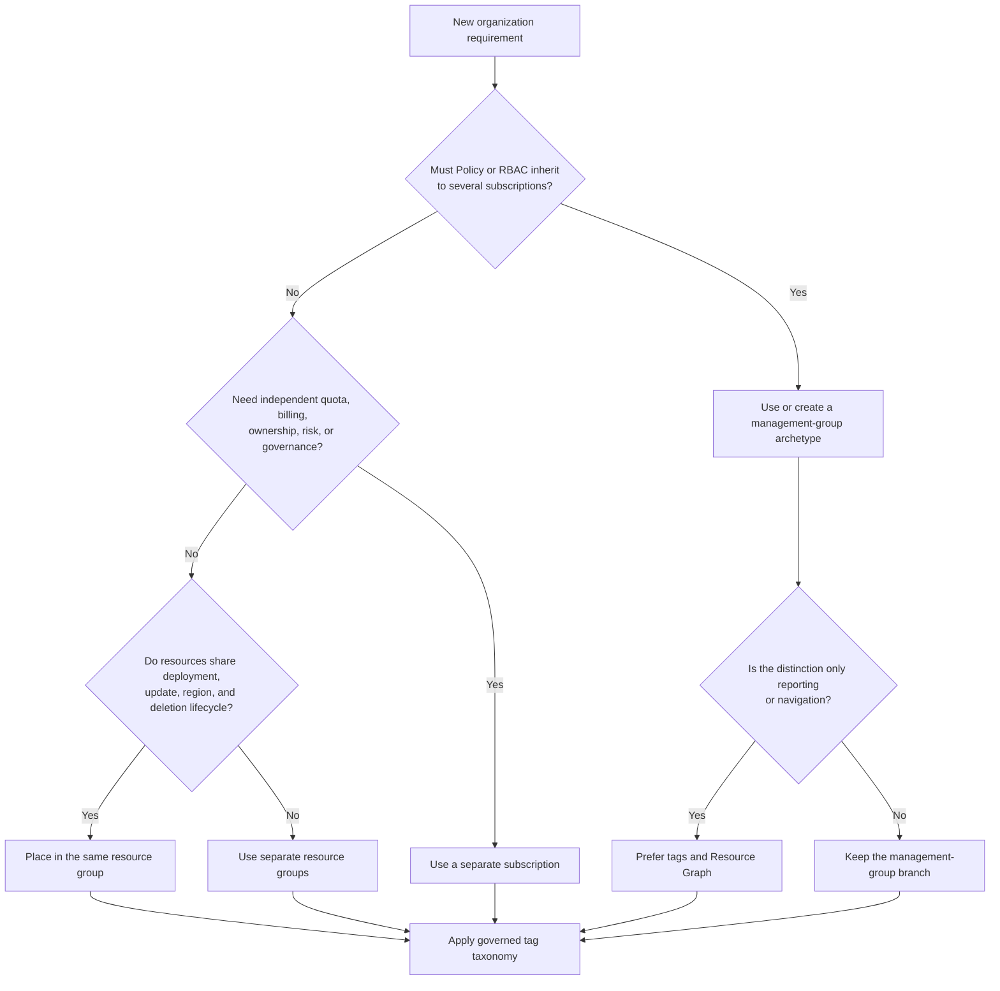

<!--
-------------------------------------------------------------------------
Program: Landing Zone study guide - Sol.md
Description: Architect-level AZ-305 study guide for Azure resource organization and tagging
Context: AZ-305 — Design governance — Azure landing zones and resource organization
Author: Greg Tate
-------------------------------------------------------------------------
-->

# AZ-305 Study Guide: Recommend a structure for management groups, subscriptions, and resource groups, and a strategy for resource tagging

> **Exam task:** Design governance — Recommend a structure for management groups, subscriptions, and resource groups, and a strategy for resource tagging
>
> **Domain:** Design identity, governance, and monitoring solutions
>
> **Estimated reading time:** 45 minutes
>
> **Matched task source:** Exact match in the provided Study Guide Map, the supplied `Skills.psd1`, and the current [official AZ-305 study guide](https://learn.microsoft.com/en-us/credentials/certifications/resources/study-guides/az-305), whose skills measured are effective as of April 17, 2026.
>
> **Scope boundary:** This guide covers the Azure resource hierarchy, landing-zone placement, subscription and resource-group boundaries, and tag taxonomy and enforcement. It uses Azure Policy, Azure RBAC, Cost Management, Resource Graph, locks, and subscription vending only where they explain or operationalize those design choices; selecting a complete compliance or identity-governance solution belongs to adjacent AZ-305 tasks.

---

## How to use this guide

Read this guide from the outside inward: **tenant and management groups → subscriptions → resource groups → resources → tags**. At each level, ask what must inherit, what must be isolated, what must scale independently, what shares a lifecycle, and what only needs to be searchable or reportable. [Azure Resource Manager exposes four governance scopes](https://learn.microsoft.com/en-us/azure/azure-resource-manager/management/overview#understand-scope), while tags provide metadata rather than a fifth security or policy-inheritance boundary. [Azure tags are not first-class grouping scopes](https://learn.microsoft.com/en-us/azure/governance/management-groups/overview#scenario-comparison)

By the end, you should be able to:

- Design a reasonably flat [management-group hierarchy](https://learn.microsoft.com/en-us/azure/cloud-adoption-framework/ready/landing-zone/design-area/resource-org-management-groups) around shared policy and access archetypes rather than an organization chart.
- Decide when a workload, platform function, environment, region, regulated boundary, or quota requirement warrants a separate [subscription](https://learn.microsoft.com/en-us/azure/cloud-adoption-framework/ready/landing-zone/design-area/resource-org-subscriptions).
- Place resources that share deployment, update, deletion, administration, and regional metadata concerns into the correct [resource groups](https://learn.microsoft.com/en-us/azure/azure-resource-manager/management/overview#what-is-a-resource-group).
- Define a controlled [tag taxonomy](https://learn.microsoft.com/en-us/azure/cloud-adoption-framework/ready/azure-best-practices/resource-tagging) for cost, ownership, operations, classification, automation, and lifecycle.
- Distinguish native tag behavior, [Azure Policy tag remediation](https://learn.microsoft.com/en-us/azure/azure-resource-manager/management/tag-policies), and [Cost Management tag inheritance](https://learn.microsoft.com/en-us/azure/cost-management-billing/costs/enable-tag-inheritance).

In scenario questions, underline clues such as **all subscriptions**, **common guardrails**, **separate billing**, **quota**, **blast radius**, **independent owner**, **different lifecycle**, **dev/test/prod**, **data sovereignty**, **chargeback**, **find resources across subscriptions**, **existing resources are missing tags**, and **usage records only**. Those phrases identify the required scope and whether the answer should change the hierarchy, create a subscription, split a resource group, or apply metadata.

Use the inline links to verify current limits and behavior. The [official AZ-305 study guide](https://learn.microsoft.com/en-us/credentials/certifications/resources/study-guides/az-305#skills-measured-as-of-april-17-2026) notes that questions usually cover generally available features but can include commonly used preview features; the core hierarchy and tagging decisions in this guide rely on generally available capabilities.

---

## Primary source set

### Exam and module sources

- [Official AZ-305 study guide](https://learn.microsoft.com/en-us/credentials/certifications/resources/study-guides/az-305)
- [Design governance](https://learn.microsoft.com/en-us/training/modules/design-governance/)
- [AZ-305: Design identity, governance, and monitor solutions](https://learn.microsoft.com/en-us/training/paths/design-identity-governance-monitor-solutions/)
- [Exam Readiness Zone: Design identity, governance, and monitoring solutions](https://learn.microsoft.com/en-us/shows/exam-readiness-zone/preparing-for-az-305-01-fy25)

### Core product documentation

- [Resource organization design area](https://learn.microsoft.com/en-us/azure/cloud-adoption-framework/ready/landing-zone/design-area/resource-org)
- [Management-group design](https://learn.microsoft.com/en-us/azure/cloud-adoption-framework/ready/landing-zone/design-area/resource-org-management-groups)
- [Subscription design](https://learn.microsoft.com/en-us/azure/cloud-adoption-framework/ready/landing-zone/design-area/resource-org-subscriptions)
- [Azure management groups](https://learn.microsoft.com/en-us/azure/governance/management-groups/overview)
- [Azure Resource Manager and resource groups](https://learn.microsoft.com/en-us/azure/azure-resource-manager/management/overview)
- [Resource tagging strategy](https://learn.microsoft.com/en-us/azure/cloud-adoption-framework/ready/azure-best-practices/resource-tagging)
- [Azure resource tags and limitations](https://learn.microsoft.com/en-us/azure/azure-resource-manager/management/tag-resources)
- [Azure Policy definitions for tag compliance](https://learn.microsoft.com/en-us/azure/azure-resource-manager/management/tag-policies)
- [Azure Policy overview](https://learn.microsoft.com/en-us/azure/governance/policy/overview)
- [Azure RBAC scopes](https://learn.microsoft.com/en-us/azure/role-based-access-control/scope-overview)
- [Cost Management tag inheritance](https://learn.microsoft.com/en-us/azure/cost-management-billing/costs/enable-tag-inheritance)
- [Azure Resource Graph](https://learn.microsoft.com/en-us/azure/governance/resource-graph/overview)

### Supporting architecture and framework sources

- [Azure landing zones](https://learn.microsoft.com/en-us/azure/cloud-adoption-framework/ready/landing-zone/)
- [Azure landing-zone design principles](https://learn.microsoft.com/en-us/azure/cloud-adoption-framework/ready/landing-zone/design-principles)
- [Manage application development environments](https://learn.microsoft.com/en-us/azure/cloud-adoption-framework/ready/landing-zone/design-area/management-application-environments)
- [Subscription vending](https://learn.microsoft.com/en-us/azure/cloud-adoption-framework/ready/landing-zone/design-area/subscription-vending)
- [Deploy Azure landing zones](https://learn.microsoft.com/en-us/azure/architecture/landing-zones/landing-zone-deploy)
- [Management and governance architecture design](https://learn.microsoft.com/en-us/azure/architecture/guide/management-governance/management-governance-get-started)
- [Resource naming and tagging decision guide](https://learn.microsoft.com/en-us/azure/cloud-adoption-framework/ready/azure-best-practices/resource-naming-and-tagging-decision-guide)
- [Azure resource locks](https://learn.microsoft.com/en-us/azure/azure-resource-manager/management/lock-resources)
- [Azure subscription and service limits](https://learn.microsoft.com/en-us/azure/azure-resource-manager/management/azure-subscription-service-limits)

### Discovery notes from the Study Guide Map

**Potentially relevant products considered:** Cloud Adoption Framework, Azure landing zones, platform and application landing zones, management groups, tenant root and default management groups, subscriptions, subscription vending, quotas, Azure Resource Manager, resource groups, tags, naming conventions, Azure Policy, initiatives, remediation, exemptions, Azure RBAC, Privileged Identity Management, locks, Cost Management, budgets, cost allocation, Resource Graph, Bicep, Terraform, and deployment stacks.

The map's forum-discovery note is **nonauthoritative**. It is used only to identify recurring candidate confusion about multi-subscription design, inherited Policy and RBAC scope, regulatory placement, resource-group lifecycle, tag inheritance, cost allocation, and when to choose a subscription instead of a resource group. Every recommendation below is grounded in Microsoft documentation.

Coverage is deliberately layered. The [Cloud Adoption Framework](https://learn.microsoft.com/en-us/azure/cloud-adoption-framework/ready/landing-zone/design-area/resource-org) supplies the architecture and decision reasoning; [management groups](https://learn.microsoft.com/en-us/azure/governance/management-groups/overview), [Resource Manager](https://learn.microsoft.com/en-us/azure/azure-resource-manager/management/overview), [Azure Policy](https://learn.microsoft.com/en-us/azure/governance/policy/overview), and [Azure RBAC](https://learn.microsoft.com/en-us/azure/role-based-access-control/scope-overview) define enforceable mechanics; [Cost Management](https://learn.microsoft.com/en-us/azure/cost-management-billing/costs/enable-tag-inheritance) and [Resource Graph](https://learn.microsoft.com/en-us/azure/governance/resource-graph/overview) provide financial and inventory views.

---

## 1. Exam task scope

This task asks an Azure solutions architect to recommend a durable **resource-organization model**: where enterprise guardrails inherit, where workloads and platform services are isolated, which resources move and retire together, and how business and operational context remains discoverable across the hierarchy. Microsoft treats [resource organization](https://learn.microsoft.com/en-us/azure/cloud-adoption-framework/ready/landing-zone/design-area/resource-org) as a foundation for compliance, naming, tagging, subscription design, and management-group design.

### Task-resolution result

| Field | Resolved value |
|---|---|
| Domain | **Design identity, governance, and monitoring solutions**, confirmed by the [official skills outline](https://learn.microsoft.com/en-us/credentials/certifications/resources/study-guides/az-305#design-identity-governance-and-monitoring-solutions-2530). |
| Skill | **Design governance**, confirmed by the [official AZ-305 study guide](https://learn.microsoft.com/en-us/credentials/certifications/resources/study-guides/az-305#design-governance). |
| Exact task | **Recommend a structure for management groups, subscriptions, and resource groups, and a strategy for resource tagging**, an [exact current objective](https://learn.microsoft.com/en-us/credentials/certifications/resources/study-guides/az-305#design-governance). |

### Likely design decisions tested

| Decision | What the candidate must recognize |
|---|---|
| Management-group placement | Group subscriptions that require the same [policy and access archetype](https://learn.microsoft.com/en-us/azure/cloud-adoption-framework/ready/landing-zone/design-area/resource-org-management-groups), while keeping the hierarchy flat and stable. |
| Subscription boundary | Use subscriptions as [units of management, billing, governance, security, quota, and scale](https://learn.microsoft.com/en-us/azure/cloud-adoption-framework/ready/landing-zone/design-area/resource-org-subscriptions#organization-and-governance-design-considerations). |
| Platform versus workload | Separate shared platform functions such as connectivity, identity, management, and security from [application landing-zone subscriptions](https://learn.microsoft.com/en-us/azure/cloud-adoption-framework/ready/landing-zone/). |
| Environment separation | Prefer separate subscriptions when production and nonproduction need independent access, cost, quota, or risk boundaries, but do not automatically create [environment-named management groups](https://learn.microsoft.com/en-us/azure/cloud-adoption-framework/ready/landing-zone/design-area/resource-org-management-groups#management-group-recommendations). |
| Resource-group boundary | Group resources that [share a lifecycle](https://learn.microsoft.com/en-us/azure/azure-resource-manager/management/overview#what-is-a-resource-group), deployment cadence, administration, and deletion fate. |
| Region handling | A subscription is global and can contain multiple regions; create separate regional subscriptions only for [region-specific governance, sovereignty, or scale](https://learn.microsoft.com/en-us/azure/cloud-adoption-framework/ready/landing-zone/design-area/resource-org-subscriptions#multiple-regions-recommendations). |
| Tag taxonomy | Use controlled metadata for [function, classification, accounting, purpose, ownership, operations, automation, and compliance](https://learn.microsoft.com/en-us/azure/cloud-adoption-framework/ready/azure-best-practices/resource-tagging#define-your-tagging-strategy). |
| Tag enforcement | Choose audit, deny, append, or preferably modify/remediation according to whether the requirement is visibility, admission control, inheritance, or repair of [existing resources](https://learn.microsoft.com/en-us/azure/azure-resource-manager/management/tag-policies). |

### In scope

- Management-group hierarchy, tenant-root behavior, inheritance, depth, parentage, default placement, and move implications based on [Azure management-group mechanics](https://learn.microsoft.com/en-us/azure/governance/management-groups/overview).
- Platform subscriptions, application landing zones, environment and region separation, quota planning, ownership, chargeback, and [subscription vending](https://learn.microsoft.com/en-us/azure/cloud-adoption-framework/ready/landing-zone/design-area/subscription-vending).
- Resource-group lifecycle, administration, region, dependencies, deletion, locks, and [scope behavior](https://learn.microsoft.com/en-us/azure/azure-resource-manager/management/overview#what-is-a-resource-group).
- Tag keys, allowed values, ownership, enforcement, remediation, cost reporting, querying, and [technical limitations](https://learn.microsoft.com/en-us/azure/azure-resource-manager/management/tag-resources#limitations).

### Out of scope except where it constrains the structure

> **Adjacent task context:** “Recommend a solution for managing compliance” owns the complete Azure Policy, Defender for Cloud, regulatory-assessment, evidence, exemption, and remediation operating model. This guide uses [Azure Policy](https://learn.microsoft.com/en-us/azure/governance/policy/overview) only to show how hierarchy and tags become enforceable.

> **Adjacent task context:** “Recommend a solution for identity governance” owns access reviews, entitlement management, lifecycle workflows, and privileged access. This guide uses [Azure RBAC inheritance](https://learn.microsoft.com/en-us/azure/role-based-access-control/scope-overview) and PIM only to prevent a hierarchy from creating excessive administrative scope.

> **Adjacent task context:** Naming supports human readability but does not replace mutable metadata. The [naming and tagging decision guide](https://learn.microsoft.com/en-us/azure/cloud-adoption-framework/ready/azure-best-practices/resource-naming-and-tagging-decision-guide) is supporting context, not a separate naming-convention tutorial.

The exam mental boundary is: **hierarchy determines inherited governance and administrative blast radius; subscriptions determine workload/platform isolation and scale; resource groups determine lifecycle; tags determine searchable business context**.

> **Exam tip:** If a requirement says “group resources across subscriptions for reporting,” do not deepen the management-group tree solely for navigation. Use [tags and Azure Resource Graph](https://learn.microsoft.com/en-us/azure/governance/resource-graph/overview) unless the resources truly require a common inherited Policy or RBAC boundary.

---

## 2. Product and topic discovery pass

| Product, service, or topic | Why it may be relevant | Primary Microsoft source | In-scope or adjacent? |
|---|---|---|---|
| Azure landing zones | Provides the target pattern of platform and application landing zones with repeatable governance. | [Landing-zone overview](https://learn.microsoft.com/en-us/azure/cloud-adoption-framework/ready/landing-zone/) | Core architecture |
| Tenant root management group | Provides the unavoidable top-level scope to which all management groups and subscriptions roll up. | [Root management group](https://learn.microsoft.com/en-us/azure/governance/management-groups/overview#root-management-group-for-each-directory) | Core |
| Intermediate root management group | Creates an organization-controlled parent below the tenant root so broad assignments and future changes are easier to manage. | [CAF hierarchy](https://learn.microsoft.com/en-us/azure/cloud-adoption-framework/ready/landing-zone/design-area/resource-org-management-groups#management-groups-in-the-azure-landing-zone-architecture) | Core pattern |
| Platform management group | Groups shared security, management, connectivity, and identity subscriptions under common platform governance. | [CAF hierarchy](https://learn.microsoft.com/en-us/azure/cloud-adoption-framework/ready/landing-zone/design-area/resource-org-management-groups#management-groups-in-the-azure-landing-zone-architecture) | Core pattern |
| Landing zones management group | Parents workload archetypes and carries workload-agnostic guardrails. | [CAF hierarchy](https://learn.microsoft.com/en-us/azure/cloud-adoption-framework/ready/landing-zone/design-area/resource-org-management-groups#management-groups-in-the-azure-landing-zone-architecture) | Core pattern |
| Corp, Online, and Local archetypes | Separate workloads whose connectivity and policy requirements differ. | [Workload-type management groups](https://learn.microsoft.com/en-us/azure/cloud-adoption-framework/ready/landing-zone/design-area/resource-org-management-groups#management-groups-in-the-azure-landing-zone-architecture) | Core when applicable |
| Sandbox and Decommissioned | Isolate experimentation and stage retired subscriptions under distinct policy. | [CAF hierarchy](https://learn.microsoft.com/en-us/azure/cloud-adoption-framework/ready/landing-zone/design-area/resource-org-management-groups#management-groups-in-the-azure-landing-zone-architecture) | Core lifecycle pattern |
| Azure subscriptions | Supply boundaries for management, billing, quota, policy, security, and scale. | [Subscription considerations](https://learn.microsoft.com/en-us/azure/cloud-adoption-framework/ready/landing-zone/design-area/resource-org-subscriptions) | Core |
| Subscription vending | Captures workload metadata and automatically places/configures new application landing zones. | [Subscription vending](https://learn.microsoft.com/en-us/azure/cloud-adoption-framework/ready/landing-zone/design-area/subscription-vending) | Core operating pattern |
| Resource groups | Contain resources with a shared lifecycle and supply a scope for roles, policy, locks, and deployments. | [Resource groups](https://learn.microsoft.com/en-us/azure/azure-resource-manager/management/overview#what-is-a-resource-group) | Core |
| Azure resource tags | Add key-value metadata to subscriptions, resource groups, and supported resources, but not management groups. | [Tag usage](https://learn.microsoft.com/en-us/azure/azure-resource-manager/management/tag-resources#tag-usage-and-recommendations) | Core |
| Azure Policy | Audits, denies, adds, replaces, inherits, and remediates tag state across hierarchy scopes. | [Tag policies](https://learn.microsoft.com/en-us/azure/azure-resource-manager/management/tag-policies) | Supporting enforcement |
| Azure RBAC | Determines who can act at management-group, subscription, resource-group, and resource scope with downward inheritance. | [RBAC scopes](https://learn.microsoft.com/en-us/azure/role-based-access-control/scope-overview) | Supporting security |
| Microsoft Entra PIM | Reduces standing privilege when platform roles must be assigned broadly. | [CAF management-group recommendation](https://learn.microsoft.com/en-us/azure/cloud-adoption-framework/ready/landing-zone/design-area/resource-org-management-groups#management-group-recommendations) | Adjacent identity control |
| Resource locks | Protect control-plane updates or deletion and inherit from parent scopes, but are not authorization or compliance controls. | [Resource locks](https://learn.microsoft.com/en-us/azure/azure-resource-manager/management/lock-resources) | Supporting protection |
| Cost Management | Groups cost by scope/tags and can add inherited tags to usage records without modifying resources. | [Cost tag inheritance](https://learn.microsoft.com/en-us/azure/cost-management-billing/costs/enable-tag-inheritance) | Supporting financial view |
| Azure Resource Graph | Queries inventory and tag compliance at scale across selected subscriptions and management groups. | [Resource Graph](https://learn.microsoft.com/en-us/azure/governance/resource-graph/overview) | Supporting inventory |
| Naming conventions | Encode stable, human-readable identity while tags hold mutable or multi-dimensional metadata. | [Naming and tagging guide](https://learn.microsoft.com/en-us/azure/cloud-adoption-framework/ready/azure-best-practices/resource-naming-and-tagging-decision-guide) | Supporting |
| Bicep and Terraform | Express landing-zone hierarchy, Policy, RBAC, resource groups, and tags as repeatable infrastructure as code. | [Landing-zone deployment options](https://learn.microsoft.com/en-us/azure/architecture/landing-zones/landing-zone-deploy#standard-deployment-options) | Implementation awareness |
| Deployment stacks | Manage collections of Azure resources with lifecycle behavior, but do not replace the four Resource Manager governance scopes. | [Deployment stacks](https://learn.microsoft.com/en-us/azure/azure-resource-manager/bicep/deployment-stacks) | Adjacent implementation |

> **Test yourself**
>
> - A company wants to find every resource owned by the payroll team across ten subscriptions. Does that requirement justify another management-group level?
> - A production workload needs a separate quota pool and independent cost accountability. Is a new resource group enough?
>
> **Answer guidance:** Search and reporting point to [tags plus Resource Graph](https://learn.microsoft.com/en-us/azure/governance/resource-graph/overview), not hierarchy depth. Independent quota and management boundaries point to a [subscription](https://learn.microsoft.com/en-us/azure/cloud-adoption-framework/ready/landing-zone/design-area/resource-org-subscriptions#organization-and-governance-design-considerations), because a resource group does not create a subscription quota pool.

---

## 3. Starting point from Microsoft Learn

The [Design governance module](https://learn.microsoft.com/en-us/training/modules/design-governance/) is the most direct learning starting point. Its objectives explicitly cover management groups, subscriptions, resource groups, tags, Azure Policy, Azure RBAC, and landing zones—the same elements that appear together in this exam task.

### Core concepts Microsoft Learn expects

1. **Scope hierarchy:** Understand management group, subscription, resource group, and resource scopes and their parent-child behavior through [Resource Manager scope](https://learn.microsoft.com/en-us/azure/azure-resource-manager/management/overview#understand-scope).
2. **Governance inheritance:** Understand that [Policy and RBAC assignments inherit](https://learn.microsoft.com/en-us/azure/governance/management-groups/overview) from management groups into descendants.
3. **Subscription democratization:** Treat subscriptions as scalable, governed units that workload teams can consume through [landing-zone guardrails](https://learn.microsoft.com/en-us/azure/cloud-adoption-framework/ready/landing-zone/design-principles#subscription-democratization).
4. **Lifecycle organization:** Put resources that deploy, update, and delete together in the same [resource group](https://learn.microsoft.com/en-us/azure/azure-resource-manager/management/overview#what-is-a-resource-group).
5. **Metadata strategy:** Use [tags](https://learn.microsoft.com/en-us/azure/cloud-adoption-framework/ready/azure-best-practices/resource-tagging) for cross-cutting cost, ownership, operation, classification, purpose, and automation information.
6. **Policy-driven consistency:** Use [Azure Policy](https://learn.microsoft.com/en-us/azure/governance/policy/overview) to assess and enforce taxonomic consistency instead of relying on manual discipline.

### Where the module needs architect-level depth

- The module introduces hierarchy, but scenario readiness requires knowing why the [CAF reference hierarchy](https://learn.microsoft.com/en-us/azure/cloud-adoption-framework/ready/landing-zone/design-area/resource-org-management-groups#management-groups-in-the-azure-landing-zone-architecture) separates platform, landing zones, sandbox, and decommissioned scopes.
- The module introduces subscriptions, but design questions require recognizing [quota, sovereignty, ownership, cost, and environment](https://learn.microsoft.com/en-us/azure/cloud-adoption-framework/ready/landing-zone/design-area/resource-org-subscriptions) as independent reasons for separation.
- The module introduces tags, but architects must distinguish [no native inheritance](https://learn.microsoft.com/en-us/azure/azure-resource-manager/management/tag-resources#inherit-tags), Policy `modify` with remediation, and [billing-record-only inheritance](https://learn.microsoft.com/en-us/azure/cost-management-billing/costs/enable-tag-inheritance#enable-tag-inheritance).
- The module introduces governance tools, but the exam can test that [Policy governs state, RBAC governs actions](https://learn.microsoft.com/en-us/azure/governance/policy/overview#azure-policy-and-azure-rbac), locks constrain control-plane changes, and tags classify rather than authorize.

> **Exam tip:** A resource owner cannot override an inherited `deny` policy merely because the owner has full RBAC permissions. [Azure Policy evaluates the resulting resource state](https://learn.microsoft.com/en-us/azure/governance/policy/overview#azure-policy-and-azure-rbac), while RBAC only determines whether the caller may attempt the action.

---

## 4. Conceptual foundation

### 4.1 The four scopes answer different questions

| Scope | Primary design question | Good use | Poor use |
|---|---|---|---|
| Management group | Which subscriptions need the same inherited governance or broad platform access? | Assign common [Policy initiatives and limited platform RBAC](https://learn.microsoft.com/en-us/azure/cloud-adoption-framework/ready/landing-zone/design-area/resource-org-management-groups#management-group-recommendations). | Reproduce every department, project, environment, or region regardless of governance difference. |
| Subscription | What needs an independent management, cost, quota, security, or scale boundary? | Isolate a workload/application landing zone or [platform function](https://learn.microsoft.com/en-us/azure/cloud-adoption-framework/ready/landing-zone/design-area/resource-org-subscriptions#organization-and-governance-design-considerations). | Use one enterprise subscription and rely only on resource groups for every team and criticality level. |
| Resource group | Which resources share deployment, update, deletion, administration, and regional metadata concerns? | Group one workload component set with a [shared lifecycle](https://learn.microsoft.com/en-us/azure/azure-resource-manager/management/overview#what-is-a-resource-group). | Group unrelated resources only because they have the same owner or cost center. |
| Resource | Does one exceptional item need narrower access, a lock, or a distinct tag value? | Apply a precise [resource-scope role or lock](https://learn.microsoft.com/en-us/azure/role-based-access-control/scope-overview). | Create large numbers of one-off assignments that become difficult to govern. |

> **Exam tip:** Choose the highest scope that is correct for the requirement but no higher. [RBAC scope guidance](https://learn.microsoft.com/en-us/azure/role-based-access-control/scope-overview) ties narrower scope to smaller compromise blast radius, while management-group guidance warns against broad application-team access.

### 4.2 Management groups are policy and access inheritance architecture

Every Microsoft Entra directory has one hierarchy whose top is the [tenant root management group](https://learn.microsoft.com/en-us/azure/governance/management-groups/overview#root-management-group-for-each-directory). All management groups and subscriptions have a single parent and ultimately roll up to that root; assignments at the root can therefore affect every Resource Manager resource in the tenant. [Management-group limits and root behavior](https://learn.microsoft.com/en-us/azure/governance/management-groups/overview#important-facts-about-management-groups)

Architectural rules:

- Put only universal, “must-have” assignments at the root because [root Policy and access assignments apply tenant-wide](https://learn.microsoft.com/en-us/azure/governance/management-groups/overview#root-management-group-for-each-directory).
- Create an organization-controlled **intermediate root** beneath the tenant root, then parent the platform, landing-zone, sandbox, and decommissioned branches beneath it as shown in the [CAF hierarchy](https://learn.microsoft.com/en-us/azure/cloud-adoption-framework/ready/landing-zone/design-area/resource-org-management-groups#management-groups-in-the-azure-landing-zone-architecture).
- Keep the tree reasonably flat—Microsoft recommends ideally [three to four levels](https://learn.microsoft.com/en-us/azure/cloud-adoption-framework/ready/landing-zone/design-area/resource-org-management-groups#management-group-recommendations)—even though the technical maximum is six levels below the tenant root. [Management-group depth limit](https://learn.microsoft.com/en-us/azure/governance/management-groups/overview#important-facts-about-management-groups)
- Group subscriptions by **common policy, security, connectivity, compliance, or feature requirements**, not by a frequently changing reporting structure. [CAF workload archetypes](https://learn.microsoft.com/en-us/azure/cloud-adoption-framework/ready/landing-zone/design-area/resource-org-management-groups#management-group-recommendations)
- Do not make `Dev`, `Test`, and `Prod` management groups by default; use subscriptions within the same workload archetype unless the environments truly require different inherited governance. [Environment guidance](https://learn.microsoft.com/en-us/azure/cloud-adoption-framework/ready/landing-zone/design-area/resource-org-management-groups#management-group-recommendations)
- Do not make region management groups solely because resources use different regions; add location-based hierarchy only when [residency, sovereignty, security, or regulatory controls differ](https://learn.microsoft.com/en-us/azure/cloud-adoption-framework/ready/landing-zone/design-area/resource-org-management-groups#management-group-recommendations).

> **Exam tip:** “Same department” is weak evidence for a management group. “Same policy and connectivity archetype” is strong evidence. Microsoft explicitly recommends that management groups serve [Policy assignment rather than mirror organizational or billing structure](https://learn.microsoft.com/en-us/azure/cloud-adoption-framework/ready/landing-zone/design-area/resource-org-management-groups#management-group-recommendations).

### 4.3 Subscriptions are democratized landing-zone units

A subscription is simultaneously a [management, billing, scale, quota, governance, security, and identity boundary](https://learn.microsoft.com/en-us/azure/cloud-adoption-framework/ready/landing-zone/design-area/resource-org-subscriptions#organization-and-governance-design-considerations). That makes it the preferred unit for handing a governed application landing zone to a workload team.

Create another subscription when one or more of these requirements are material:

- A workload or platform capability needs an independent ownership and administration boundary under [least-privilege RBAC](https://learn.microsoft.com/en-us/azure/role-based-access-control/scope-overview).
- Production must be isolated from nonproduction for access, budget, incident blast radius, or lifecycle reasons under the [application-environment guidance](https://learn.microsoft.com/en-us/azure/cloud-adoption-framework/ready/landing-zone/design-area/management-application-environments).
- A workload needs an independent cost and budget scope or financial accountability model under [subscription cost-management guidance](https://learn.microsoft.com/en-us/azure/cloud-adoption-framework/ready/landing-zone/design-area/resource-org-subscriptions#cost-management-design-considerations).
- Subscription or regional service quotas could constrain the workload; Microsoft recommends using [subscriptions as scale units](https://learn.microsoft.com/en-us/azure/cloud-adoption-framework/ready/landing-zone/design-area/resource-org-subscriptions#quota-and-capacity-recommendations).
- A region requires separate governance, management, data-sovereignty, or residency controls, or the workload must scale past quota limits. [Multiple-region recommendations](https://learn.microsoft.com/en-us/azure/cloud-adoption-framework/ready/landing-zone/design-area/resource-org-subscriptions#multiple-regions-recommendations)
- A regulated workload needs a materially different policy initiative or administrative boundary that would be unsafe or cumbersome to express as exemptions in a shared subscription. [Management-group design considerations](https://learn.microsoft.com/en-us/azure/cloud-adoption-framework/ready/landing-zone/design-area/resource-org-management-groups#management-group-design-considerations)

Do not create a new subscription only because two resources use different Azure regions. Subscriptions are [global logical constructs](https://learn.microsoft.com/en-us/azure/cloud-adoption-framework/ready/landing-zone/design-area/resource-org-subscriptions#multiple-region-considerations), and a primary/secondary regional deployment can remain in one subscription when governance, lifecycle, and quotas align.

> **Exam tip:** “Separate monthly report” can often be satisfied with tags and Cost Management; “separate quota, policy, and administrative boundary” requires a subscription. [Subscriptions supply those hard boundaries](https://learn.microsoft.com/en-us/azure/cloud-adoption-framework/ready/landing-zone/design-area/resource-org-subscriptions), while tags supply metadata.

### 4.4 Resource groups are lifecycle and administration boundaries

All resources in a resource group should share the same lifecycle: they should be deployed, updated, and deleted together. [Resource-group guidance](https://learn.microsoft.com/en-us/azure/azure-resource-manager/management/overview#what-is-a-resource-group) A web tier and a database can communicate across resource groups, so dependency does not require co-location when their lifecycle or ownership differs.

Use separate resource groups when:

- Components have independent deployment or retirement cycles, because deleting a resource group deletes its contained resources. [Resource-group deletion behavior](https://learn.microsoft.com/en-us/azure/azure-resource-manager/management/overview#what-is-a-resource-group)
- Platform and application teams need different Resource Manager permissions or locks at [resource-group scope](https://learn.microsoft.com/en-us/azure/role-based-access-control/scope-overview).
- Primary and secondary regional components should have independent regional operations; CAF recommends that one resource group not span regions and that its location match its contained resources. [Subscription multiregion recommendations](https://learn.microsoft.com/en-us/azure/cloud-adoption-framework/ready/landing-zone/design-area/resource-org-subscriptions#multiple-regions-recommendations)
- Shared networking, monitoring, security, or data services outlive an individual workload component and therefore need a distinct lifecycle. [Resource-group lifecycle rule](https://learn.microsoft.com/en-us/azure/azure-resource-manager/management/overview#what-is-a-resource-group)

Remember that a resource group's location stores its **metadata**, not a geographic boundary for all contained resources. Resource Manager permits resources in other regions, but Microsoft recommends matching locations and designing for metadata availability. [Resource-group location](https://learn.microsoft.com/en-us/azure/azure-resource-manager/management/overview#what-location-should-i-use-for-my-resource-group)

> **Exam tip:** Group by lifecycle before technology type. One `all-databases` resource group is usually wrong when those databases belong to unrelated workloads and must be retired independently; [resource-group deletion and lifecycle](https://learn.microsoft.com/en-us/azure/azure-resource-manager/management/overview#what-is-a-resource-group) dominate visual tidiness.

### 4.5 Tags create horizontal metadata, not inheritance scopes

Tags are plaintext key-value metadata applied to supported resources, resource groups, and subscriptions—but not management groups. [Tag usage and security warning](https://learn.microsoft.com/en-us/azure/azure-resource-manager/management/tag-resources#tag-usage-and-recommendations) They support search, filtering, cost allocation, operations, ownership, automation, and compliance reporting without forcing those dimensions into the hierarchy.

An effective taxonomy separates stable tag categories:

| Category | Example keys | Design intent |
|---|---|---|
| Functional | `WorkloadName`, `ApplicationId`, `ServiceName` | Connect technical resources to a workload or service catalog through [functional classification](https://learn.microsoft.com/en-us/azure/cloud-adoption-framework/ready/azure-best-practices/resource-tagging#define-your-tagging-strategy). |
| Accounting | `CostCenter`, `BusinessUnit`, `ChargeCode` | Support showback or chargeback beyond subscription-level cost scope through [cost allocation metadata](https://learn.microsoft.com/en-us/azure/cloud-adoption-framework/ready/azure-best-practices/resource-tagging#define-your-tagging-strategy). |
| Ownership | `Owner`, `TechnicalContact`, `BusinessOwner` | Identify accountability and escalation contacts through [ownership tags](https://learn.microsoft.com/en-us/azure/cloud-adoption-framework/ready/azure-best-practices/resource-tagging#define-your-tagging-strategy). |
| Environment and purpose | `Environment`, `Purpose`, `Criticality` | Distinguish production, development, testing, sandbox, and business criticality through [purpose metadata](https://learn.microsoft.com/en-us/azure/cloud-adoption-framework/ready/azure-best-practices/resource-tagging#define-your-tagging-strategy). |
| Classification/compliance | `DataClassification`, `RegulatoryScope` | Support inventory and reporting; enforcement still belongs to [Azure Policy](https://learn.microsoft.com/en-us/azure/governance/policy/overview), not the tag alone. |
| Operations | `OperationsTeam`, `SupportTier`, `MaintenanceWindow` | Drive ownership, routing, scheduling, and operational reporting through [operations metadata](https://learn.microsoft.com/en-us/azure/cloud-adoption-framework/ready/azure-best-practices/resource-tagging#define-your-tagging-strategy). |
| Automation/lifecycle | `ManagedBy`, `AutoShutdown`, `ExpirationDate` | Provide machine-readable signals for approved automation through [automation tags](https://learn.microsoft.com/en-us/azure/cloud-adoption-framework/ready/azure-best-practices/resource-tagging#define-your-tagging-strategy). |

Tag keys need a data owner, definition, allowed values, applicable scopes/types, enforcement effect, source of truth, and retirement process. [CAF tagging guidance](https://learn.microsoft.com/en-us/azure/cloud-adoption-framework/ready/azure-best-practices/resource-tagging) warns that inconsistent taxonomy reduces the value of governance and reporting.

> **Exam tip:** A tag named `Confidential` does not encrypt, isolate, or authorize anything. It can help [Policy evaluate resource state](https://learn.microsoft.com/en-us/azure/governance/policy/overview), but the actual control must be implemented by Policy, RBAC, networking, encryption, or another service.

### 4.6 Control plane, identity, networking, operations, cost, and resiliency

- **Control plane:** Management groups, subscriptions, resource groups, Policy, RBAC, locks, and tags are Azure Resource Manager governance constructs; a [lock applies to control-plane operations](https://learn.microsoft.com/en-us/azure/azure-resource-manager/management/lock-resources), not every service's data plane.
- **Identity:** Broad role assignments inherit downward, so limit application teams to subscription/resource-group scope and reserve management-group assignments for controlled platform duties. [CAF RBAC recommendation](https://learn.microsoft.com/en-us/azure/cloud-adoption-framework/ready/landing-zone/design-area/resource-org-management-groups#management-group-recommendations)
- **Networking:** Connectivity requirements can define `Corp` versus `Online` landing-zone archetypes, while shared hubs, firewalls, ExpressRoute, and private DNS commonly live in a [connectivity subscription](https://learn.microsoft.com/en-us/azure/cloud-adoption-framework/ready/landing-zone/design-area/resource-org-subscriptions#organization-and-governance-design-considerations).
- **Operations:** Resource Graph can query resource properties and tags across subscriptions at scale, enabling horizontal inventory without a deeper tree. [Resource Graph capabilities](https://learn.microsoft.com/en-us/azure/governance/resource-graph/overview)
- **Cost:** Subscriptions provide strong billing/accountability scope; tags add allocation dimensions, and Cost Management inheritance can enrich usage records. [Cost tag inheritance](https://learn.microsoft.com/en-us/azure/cost-management-billing/costs/enable-tag-inheritance)
- **Resiliency:** The hierarchy is global, but resource-group metadata has a location and workload resources remain subject to regional service design; organization does not itself create workload failover. [Resource-group location behavior](https://learn.microsoft.com/en-us/azure/azure-resource-manager/management/overview#what-location-should-i-use-for-my-resource-group)

> **Test yourself**
>
> - A central network team needs persistent access to every connectivity subscription. At which scope should access be considered, and why should it be limited to that branch?
> - Two application components communicate constantly but have different owners and retirement dates. Must they share a resource group?
>
> **Answer guidance:** A controlled platform role can be assigned at the relevant [platform/connectivity management-group scope](https://learn.microsoft.com/en-us/azure/cloud-adoption-framework/ready/landing-zone/design-area/resource-org-management-groups#management-group-recommendations), avoiding access to workload branches. Communication does not imply shared lifecycle; [resources in different resource groups can connect](https://learn.microsoft.com/en-us/azure/azure-resource-manager/management/overview#what-is-a-resource-group).

---

## 5. Design decision framework

### Step-by-step design logic

1. **Establish the tenant boundary.** Management groups and their subscriptions must trust the same [Microsoft Entra tenant](https://learn.microsoft.com/en-us/azure/governance/management-groups/overview); cross-tenant organization requires a different management approach, not a shared management-group tree.
2. **Identify universal controls.** Put only truly tenant-wide Policy and access requirements at the [tenant root](https://learn.microsoft.com/en-us/azure/governance/management-groups/overview#root-management-group-for-each-directory).
3. **Create stable archetype branches.** Use an intermediate root, platform, landing zones, sandbox, and decommissioned branches, then add only branches justified by differing [policy, connectivity, security, or compliance requirements](https://learn.microsoft.com/en-us/azure/cloud-adoption-framework/ready/landing-zone/design-area/resource-org-management-groups).
4. **Separate platform functions.** Give management, security, connectivity, and identity their own subscriptions when needed so their [Policy, RBAC, cost, and ownership](https://learn.microsoft.com/en-us/azure/cloud-adoption-framework/ready/landing-zone/design-area/resource-org-subscriptions#organization-and-governance-design-considerations) can differ.
5. **Define the application landing-zone product lines.** Decide whether workloads receive one subscription, separate prod/nonprod subscriptions, per-region subscriptions, or regulated variants according to [vending criteria](https://learn.microsoft.com/en-us/azure/cloud-adoption-framework/ready/landing-zone/design-area/subscription-vending).
6. **Split resource groups by lifecycle and region.** Keep independently deployed, owned, protected, or retired components separate under the [Resource Manager lifecycle rule](https://learn.microsoft.com/en-us/azure/azure-resource-manager/management/overview#what-is-a-resource-group).
7. **Design a minimal tag dictionary.** Define only metadata with a real consumer, owner, allowed values, and enforcement plan under the [CAF tagging process](https://learn.microsoft.com/en-us/azure/cloud-adoption-framework/ready/azure-best-practices/resource-tagging).
8. **Choose enforcement per tag.** Audit during rollout, use `deny` only when deployment must fail, and use `modify` plus remediation when tags should be inherited or repaired on [existing resources](https://learn.microsoft.com/en-us/azure/azure-resource-manager/management/tag-policies).
9. **Separate operational and billing inheritance.** Use Policy when the resource itself needs the tag; use [Cost Management inheritance](https://learn.microsoft.com/en-us/azure/cost-management-billing/costs/enable-tag-inheritance) when only usage records need allocation metadata.
10. **Automate onboarding and review.** Use [subscription vending](https://learn.microsoft.com/en-us/azure/cloud-adoption-framework/ready/landing-zone/design-area/subscription-vending) to place subscriptions, assign budgets/RBAC/Policy, capture ownership, and establish networking and quota before handoff.

### Scenario decision tree

The tree forces hard boundaries before metadata. A requirement that only changes reporting should normally end at [tags and Resource Graph](https://learn.microsoft.com/en-us/azure/governance/resource-graph/overview), while common inherited controls justify a management-group branch and independent quotas justify a subscription. [Subscription boundary guidance](https://learn.microsoft.com/en-us/azure/cloud-adoption-framework/ready/landing-zone/design-area/resource-org-subscriptions)

### Hard constraints versus soft preferences

| Type | Constraint or preference | Architectural response |
|---|---|---|
| Hard | A management group or subscription has only [one parent](https://learn.microsoft.com/en-us/azure/governance/management-groups/overview#important-facts-about-management-groups). | Use tags/Resource Graph for secondary classification rather than trying to place one subscription in two branches. |
| Hard | A management-group tree supports [six levels below root](https://learn.microsoft.com/en-us/azure/governance/management-groups/overview#important-facts-about-management-groups). | Keep a growth margin and avoid encoding volatile details in hierarchy. |
| Hard | All subscriptions in a management-group hierarchy trust the same [Entra tenant](https://learn.microsoft.com/en-us/azure/governance/management-groups/overview). | Do not propose cross-tenant management groups. |
| Hard | A resource belongs to one resource group and a resource group belongs to one subscription. [Resource Manager scope](https://learn.microsoft.com/en-us/azure/azure-resource-manager/management/overview#understand-scope) | Use separate deployment and access patterns for cross-scope dependencies. |
| Hard | Management groups cannot be tagged, and supported resources/scopes normally allow at most [50 tag pairs](https://learn.microsoft.com/en-us/azure/azure-resource-manager/management/tag-resources#limitations). | Keep the taxonomy intentional; do not reserve hierarchy classification for management-group tags. |
| Soft | Keep management groups [ideally three to four levels](https://learn.microsoft.com/en-us/azure/cloud-adoption-framework/ready/landing-zone/design-area/resource-org-management-groups#management-group-recommendations). | Add levels only for an enforceable, stable governance distinction. |
| Soft | Prefer one workload or logical application boundary per [application landing-zone subscription](https://learn.microsoft.com/en-us/azure/architecture/landing-zones/landing-zone-deploy#application-landing-zone-architectures). | Shared subscriptions are acceptable for small workloads when ownership, risk, quota, and governance align. |
| Soft | Keep one region per resource group and align resource-group/resource locations. [CAF regional guidance](https://learn.microsoft.com/en-us/azure/cloud-adoption-framework/ready/landing-zone/design-area/resource-org-subscriptions#multiple-regions-recommendations) | Deviate only with an understood lifecycle and metadata-availability design. |

> **Exam tip:** The most specific requirement wins over the generic default. “Do not create region management groups” changes when the scenario states that location-based regulatory policy must inherit across many subscriptions; CAF explicitly permits [location-based hierarchy for sovereignty requirements](https://learn.microsoft.com/en-us/azure/cloud-adoption-framework/ready/landing-zone/design-area/resource-org-management-groups#management-group-recommendations).

---

## 6. Service and feature comparison tables

### Scope comparison

| Capability | Management group | Subscription | Resource group | Tags |
|---|---|---|---|---|
| Primary purpose | Organize subscriptions for inherited [Policy and RBAC](https://learn.microsoft.com/en-us/azure/governance/management-groups/overview). | Provide [management, billing, scale, quota, governance, and security boundaries](https://learn.microsoft.com/en-us/azure/cloud-adoption-framework/ready/landing-zone/design-area/resource-org-subscriptions). | Contain resources that share [lifecycle and administration](https://learn.microsoft.com/en-us/azure/azure-resource-manager/management/overview#what-is-a-resource-group). | Add cross-cutting [metadata](https://learn.microsoft.com/en-us/azure/azure-resource-manager/management/tag-resources). |
| Child objects | Management groups and subscriptions, with one parent per child. [Hierarchy facts](https://learn.microsoft.com/en-us/azure/governance/management-groups/overview#important-facts-about-management-groups) | Resource groups and supported subscription-scope resources. [Resource Manager scopes](https://learn.microsoft.com/en-us/azure/azure-resource-manager/management/overview#understand-scope) | Resources, each in one resource group. [Resource-group rules](https://learn.microsoft.com/en-us/azure/azure-resource-manager/management/overview#what-is-a-resource-group) | Not a parent-child container or first-class group. [Scenario comparison](https://learn.microsoft.com/en-us/azure/governance/management-groups/overview#scenario-comparison) |
| Policy inheritance | Yes, into descendants. [Management-group inheritance](https://learn.microsoft.com/en-us/azure/governance/management-groups/overview) | Yes, into resource groups/resources. [Policy scope](https://learn.microsoft.com/en-us/azure/governance/policy/overview#overview) | Yes, into resources. [Policy scope](https://learn.microsoft.com/en-us/azure/governance/policy/overview#overview) | No native hierarchy inheritance; tags may be Policy conditions. [Tag inheritance](https://learn.microsoft.com/en-us/azure/azure-resource-manager/management/tag-resources#inherit-tags) |
| RBAC inheritance | Yes; widest blast radius. [RBAC scope](https://learn.microsoft.com/en-us/azure/role-based-access-control/scope-overview) | Yes. [RBAC scope](https://learn.microsoft.com/en-us/azure/role-based-access-control/scope-overview) | Yes. [RBAC scope](https://learn.microsoft.com/en-us/azure/role-based-access-control/scope-overview) | No; tags do not grant permissions. [Management-group scenario comparison](https://learn.microsoft.com/en-us/azure/governance/management-groups/overview#scenario-comparison) |
| Cost boundary | Not universally a billing scope; MCA cost features do not currently support management groups. [Management-group note](https://learn.microsoft.com/en-us/azure/governance/management-groups/overview#hierarchy-of-management-groups-and-subscriptions) | Strong native cost/accountability scope. [Subscription cost considerations](https://learn.microsoft.com/en-us/azure/cloud-adoption-framework/ready/landing-zone/design-area/resource-org-subscriptions#cost-management-design-considerations) | Cost can be viewed/grouped at this scope. [Cost analysis scopes](https://learn.microsoft.com/en-us/azure/cost-management-billing/costs/understand-work-scopes) | Cost allocation dimension where usage supports tags or inheritance enriches records. [Cost tag inheritance](https://learn.microsoft.com/en-us/azure/cost-management-billing/costs/enable-tag-inheritance) |
| Tag support | No. [Tag scope](https://learn.microsoft.com/en-us/azure/azure-resource-manager/management/tag-resources#tag-usage-and-recommendations) | Yes, normally up to 50 pairs. [Tag limits](https://learn.microsoft.com/en-us/azure/azure-resource-manager/management/tag-resources#limitations) | Yes, normally up to 50 pairs. [Tag limits](https://learn.microsoft.com/en-us/azure/azure-resource-manager/management/tag-resources#limitations) | Applies only to supported scopes/resource types. [Tag support](https://learn.microsoft.com/en-us/azure/azure-resource-manager/management/tag-support) |

### Tag enforcement comparison

| Requirement | Best starting effect/feature | Existing resources | Critical nuance |
|---|---|---|---|
| Measure missing or invalid tags before enforcement | [`audit`](https://learn.microsoft.com/en-us/azure/governance/policy/concepts/effect-audit) | Reports noncompliance after evaluation. | Microsoft recommends beginning with audit before enforcement to observe impact. [Policy recommendations](https://learn.microsoft.com/en-us/azure/governance/policy/overview#recommendations-for-managing-policies) |
| Block creation/update without a required tag | [`deny`](https://learn.microsoft.com/en-us/azure/governance/policy/concepts/effect-deny) | Does not repair existing resources. | Can break deployments if required values are not available at deployment time. |
| Add a missing tag during a request | [`append`](https://learn.microsoft.com/en-us/azure/governance/policy/concepts/effect-append) | Existing resources wait for a qualifying update; no bulk repair. | Built-in tag guidance points to newer `modify` policies for remediation. [Tag policies](https://learn.microsoft.com/en-us/azure/azure-resource-manager/management/tag-policies) |
| Add, replace, or inherit tags and repair existing resources | [`modify`](https://learn.microsoft.com/en-us/azure/governance/policy/concepts/effect-modify) plus a [remediation task](https://learn.microsoft.com/en-us/azure/governance/policy/how-to/remediate-resources) | Yes, with a remediation task. | The assignment needs a managed identity with sufficient least-privilege RBAC for modification. [Remediation identity](https://learn.microsoft.com/en-us/azure/governance/policy/how-to/remediate-resources#how-remediation-access-control-works) |
| Add subscription/RG tags only to cost usage records | [Cost Management tag inheritance](https://learn.microsoft.com/en-us/azure/cost-management-billing/costs/enable-tag-inheritance) | Updates current-month usage records according to documented timing. | Does not modify resource tags and has billing-account/scope prerequisites. |

### Naming versus tags

| Dimension | Resource name | Tag |
|---|---|---|
| Best for | Stable identity, resource type, workload abbreviation, environment, region, or instance where the value should be visible and durable. [Naming guidance](https://learn.microsoft.com/en-us/azure/cloud-adoption-framework/ready/azure-best-practices/resource-naming) | Mutable, multi-dimensional cost, owner, classification, operations, automation, and purpose metadata. [Tagging guidance](https://learn.microsoft.com/en-us/azure/cloud-adoption-framework/ready/azure-best-practices/resource-tagging) |
| Mutability | Many Azure resource types cannot be renamed, so names should avoid volatile organizational attributes. [Naming considerations](https://learn.microsoft.com/en-us/azure/cloud-adoption-framework/ready/azure-best-practices/resource-naming) | Tags can normally be updated, subject to resource-type support and permissions. [Tag limitations](https://learn.microsoft.com/en-us/azure/azure-resource-manager/management/tag-resources#limitations) |
| Security | Not a security control. | Plaintext and not a security control; never store secrets or sensitive values. [Tag warning](https://learn.microsoft.com/en-us/azure/azure-resource-manager/management/tag-resources#tag-usage-and-recommendations) |
| Inheritance | None as a governance mechanism. | No native inheritance; use Policy or billing-only Cost Management inheritance. [Tag inheritance](https://learn.microsoft.com/en-us/azure/azure-resource-manager/management/tag-resources#inherit-tags) |

> **Test yourself**
>
> - Existing resources must receive `CostCenter` from their resource group. Is `append` sufficient?
> - Finance needs inherited tags in cost reports, but operations does not require those tags on Azure resources. Should Policy mutate every resource?
>
> **Answer guidance:** Use a built-in [`modify` inheritance policy and remediation](https://learn.microsoft.com/en-us/azure/azure-resource-manager/management/tag-policies) to repair existing resource state. If the requirement is strictly billing data, [Cost Management tag inheritance](https://learn.microsoft.com/en-us/azure/cost-management-billing/costs/enable-tag-inheritance) is the narrower fit because it modifies usage records, not resources.

