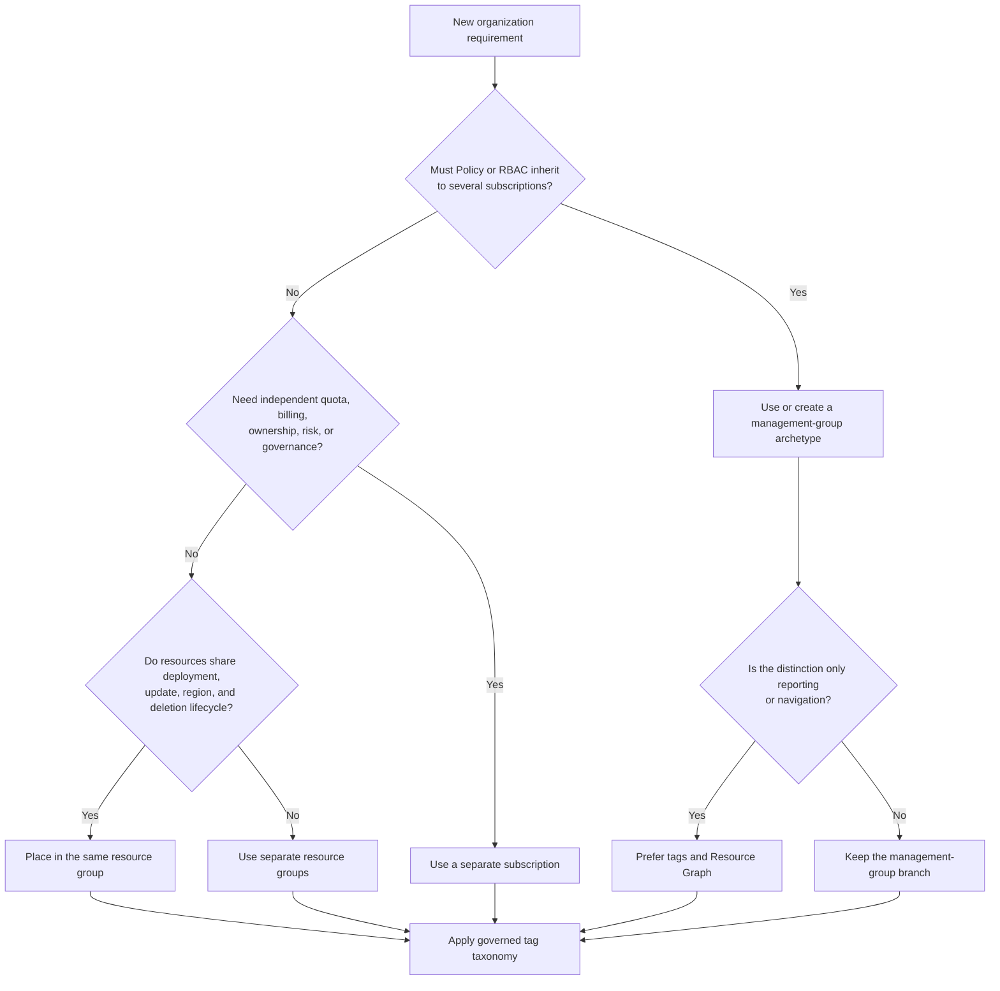
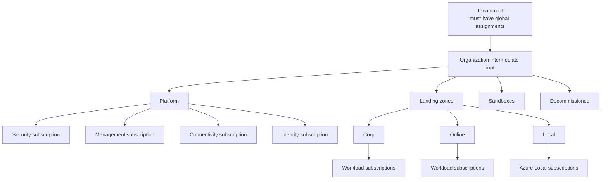
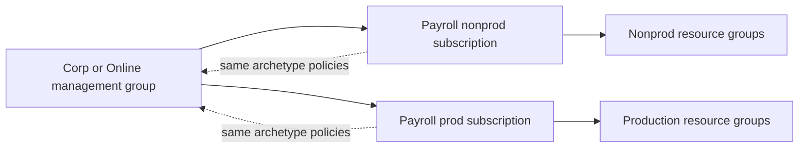
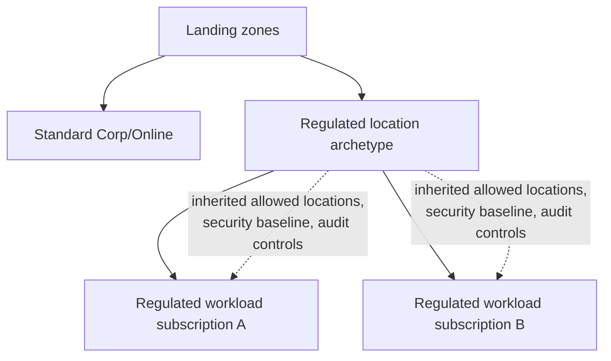
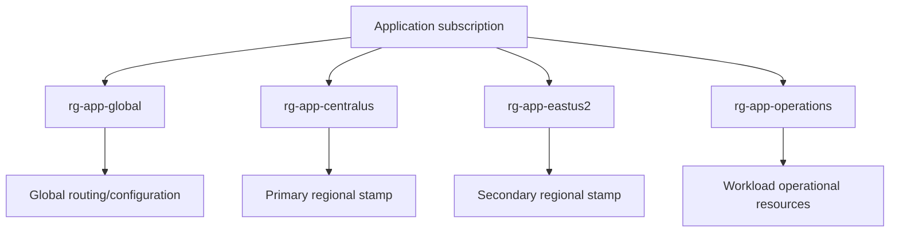
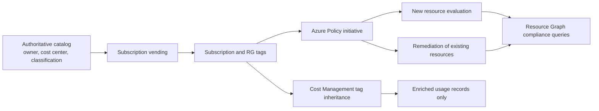

<!--
-------------------------------------------------------------------------
Program: Landing Zone study guide - Sol.md
Description: Architect-level AZ-305 study guide for Azure resource organization and tagging
Context: AZ-305 — Design governance — Azure landing zones and resource organization
Author: Greg Tate
-------------------------------------------------------------------------
-->

# AZ-305 Study Guide: Recommend a structure for management groups, subscriptions, and resource groups, and a strategy for resource tagging

> **Exam task:** Design governance — Recommend a structure for management groups, subscriptions, and resource groups, and a strategy for resource tagging
>
> **Domain:** Design identity, governance, and monitoring solutions
>
> **Estimated reading time:** 45 minutes
>
> **Matched task source:** Exact match in the provided Study Guide Map, the supplied `Skills.psd1`, and the current [official AZ-305 study guide](https://learn.microsoft.com/en-us/credentials/certifications/resources/study-guides/az-305), whose skills measured are effective as of April 17, 2026.
>
> **Scope boundary:** This guide covers the Azure resource hierarchy, landing-zone placement, subscription and resource-group boundaries, and tag taxonomy and enforcement. It uses Azure Policy, Azure RBAC, Cost Management, Resource Graph, locks, and subscription vending only where they explain or operationalize those design choices; selecting a complete compliance or identity-governance solution belongs to adjacent AZ-305 tasks.

---

## How to use this guide

Read this guide from the outside inward: **tenant and management groups → subscriptions → resource groups → resources → tags**. At each level, ask what must inherit, what must be isolated, what must scale independently, what shares a lifecycle, and what only needs to be searchable or reportable. [Azure Resource Manager exposes four governance scopes](https://learn.microsoft.com/en-us/azure/azure-resource-manager/management/overview#understand-scope), while tags provide metadata rather than a fifth security or policy-inheritance boundary. [Azure tags are not first-class grouping scopes](https://learn.microsoft.com/en-us/azure/governance/management-groups/overview#scenario-comparison)

By the end, you should be able to:

- Design a reasonably flat [management-group hierarchy](https://learn.microsoft.com/en-us/azure/cloud-adoption-framework/ready/landing-zone/design-area/resource-org-management-groups) around shared policy and access archetypes rather than an organization chart.
- Decide when a workload, platform function, environment, region, regulated boundary, or quota requirement warrants a separate [subscription](https://learn.microsoft.com/en-us/azure/cloud-adoption-framework/ready/landing-zone/design-area/resource-org-subscriptions).
- Place resources that share deployment, update, deletion, administration, and regional metadata concerns into the correct [resource groups](https://learn.microsoft.com/en-us/azure/azure-resource-manager/management/overview#what-is-a-resource-group).
- Define a controlled [tag taxonomy](https://learn.microsoft.com/en-us/azure/cloud-adoption-framework/ready/azure-best-practices/resource-tagging) for cost, ownership, operations, classification, automation, and lifecycle.
- Distinguish native tag behavior, [Azure Policy tag remediation](https://learn.microsoft.com/en-us/azure/azure-resource-manager/management/tag-policies), and [Cost Management tag inheritance](https://learn.microsoft.com/en-us/azure/cost-management-billing/costs/enable-tag-inheritance).

In scenario questions, underline clues such as **all subscriptions**, **common guardrails**, **separate billing**, **quota**, **blast radius**, **independent owner**, **different lifecycle**, **dev/test/prod**, **data sovereignty**, **chargeback**, **find resources across subscriptions**, **existing resources are missing tags**, and **usage records only**. Those phrases identify the required scope and whether the answer should change the hierarchy, create a subscription, split a resource group, or apply metadata.

Use the inline links to verify current limits and behavior. The [official AZ-305 study guide](https://learn.microsoft.com/en-us/credentials/certifications/resources/study-guides/az-305#skills-measured-as-of-april-17-2026) notes that questions usually cover generally available features but can include commonly used preview features; the core hierarchy and tagging decisions in this guide rely on generally available capabilities.

---

## Primary source set

### Exam and module sources

- [Official AZ-305 study guide](https://learn.microsoft.com/en-us/credentials/certifications/resources/study-guides/az-305)
- [Design governance](https://learn.microsoft.com/en-us/training/modules/design-governance/)
- [AZ-305: Design identity, governance, and monitor solutions](https://learn.microsoft.com/en-us/training/paths/design-identity-governance-monitor-solutions/)
- [Exam Readiness Zone: Design identity, governance, and monitoring solutions](https://learn.microsoft.com/en-us/shows/exam-readiness-zone/preparing-for-az-305-01-fy25)

### Core product documentation

- [Resource organization design area](https://learn.microsoft.com/en-us/azure/cloud-adoption-framework/ready/landing-zone/design-area/resource-org)
- [Management-group design](https://learn.microsoft.com/en-us/azure/cloud-adoption-framework/ready/landing-zone/design-area/resource-org-management-groups)
- [Subscription design](https://learn.microsoft.com/en-us/azure/cloud-adoption-framework/ready/landing-zone/design-area/resource-org-subscriptions)
- [Azure management groups](https://learn.microsoft.com/en-us/azure/governance/management-groups/overview)
- [Azure Resource Manager and resource groups](https://learn.microsoft.com/en-us/azure/azure-resource-manager/management/overview)
- [Resource tagging strategy](https://learn.microsoft.com/en-us/azure/cloud-adoption-framework/ready/azure-best-practices/resource-tagging)
- [Azure resource tags and limitations](https://learn.microsoft.com/en-us/azure/azure-resource-manager/management/tag-resources)
- [Azure Policy definitions for tag compliance](https://learn.microsoft.com/en-us/azure/azure-resource-manager/management/tag-policies)
- [Azure Policy overview](https://learn.microsoft.com/en-us/azure/governance/policy/overview)
- [Azure RBAC scopes](https://learn.microsoft.com/en-us/azure/role-based-access-control/scope-overview)
- [Cost Management tag inheritance](https://learn.microsoft.com/en-us/azure/cost-management-billing/costs/enable-tag-inheritance)
- [Azure Resource Graph](https://learn.microsoft.com/en-us/azure/governance/resource-graph/overview)

### Supporting architecture and framework sources

- [Azure landing zones](https://learn.microsoft.com/en-us/azure/cloud-adoption-framework/ready/landing-zone/)
- [Azure landing-zone design principles](https://learn.microsoft.com/en-us/azure/cloud-adoption-framework/ready/landing-zone/design-principles)
- [Manage application development environments](https://learn.microsoft.com/en-us/azure/cloud-adoption-framework/ready/landing-zone/design-area/management-application-environments)
- [Subscription vending](https://learn.microsoft.com/en-us/azure/cloud-adoption-framework/ready/landing-zone/design-area/subscription-vending)
- [Deploy Azure landing zones](https://learn.microsoft.com/en-us/azure/architecture/landing-zones/landing-zone-deploy)
- [Management and governance architecture design](https://learn.microsoft.com/en-us/azure/architecture/guide/management-governance/management-governance-get-started)
- [Define your naming convention](https://learn.microsoft.com/en-us/azure/cloud-adoption-framework/ready/azure-best-practices/resource-naming)
- [Azure resource locks](https://learn.microsoft.com/en-us/azure/azure-resource-manager/management/lock-resources)
- [Azure subscription and service limits](https://learn.microsoft.com/en-us/azure/azure-resource-manager/management/azure-subscription-service-limits)

### Discovery notes from the Study Guide Map

**Potentially relevant products considered:** Cloud Adoption Framework, Azure landing zones, platform and application landing zones, management groups, tenant root and default management groups, subscriptions, subscription vending, quotas, Azure Resource Manager, resource groups, tags, naming conventions, Azure Policy, initiatives, remediation, exemptions, Azure RBAC, Privileged Identity Management, locks, Cost Management, budgets, cost allocation, Resource Graph, Bicep, Terraform, and deployment stacks.

The map's forum-discovery note is **nonauthoritative**. It is used only to identify recurring candidate confusion about multi-subscription design, inherited Policy and RBAC scope, regulatory placement, resource-group lifecycle, tag inheritance, cost allocation, and when to choose a subscription instead of a resource group. Every recommendation below is grounded in Microsoft documentation.

Coverage is deliberately layered. The [Cloud Adoption Framework](https://learn.microsoft.com/en-us/azure/cloud-adoption-framework/ready/landing-zone/design-area/resource-org) supplies the architecture and decision reasoning; [management groups](https://learn.microsoft.com/en-us/azure/governance/management-groups/overview), [Resource Manager](https://learn.microsoft.com/en-us/azure/azure-resource-manager/management/overview), [Azure Policy](https://learn.microsoft.com/en-us/azure/governance/policy/overview), and [Azure RBAC](https://learn.microsoft.com/en-us/azure/role-based-access-control/scope-overview) define enforceable mechanics; [Cost Management](https://learn.microsoft.com/en-us/azure/cost-management-billing/costs/enable-tag-inheritance) and [Resource Graph](https://learn.microsoft.com/en-us/azure/governance/resource-graph/overview) provide financial and inventory views.

---

## 1. Exam task scope

This task asks an Azure solutions architect to recommend a durable **resource-organization model**: where enterprise guardrails inherit, where workloads and platform services are isolated, which resources move and retire together, and how business and operational context remains discoverable across the hierarchy. Microsoft treats [resource organization](https://learn.microsoft.com/en-us/azure/cloud-adoption-framework/ready/landing-zone/design-area/resource-org) as a foundation for compliance, naming, tagging, subscription design, and management-group design.

### Task-resolution result

| Field | Resolved value |
|---|---|
| Domain | **Design identity, governance, and monitoring solutions**, confirmed by the [official skills outline](https://learn.microsoft.com/en-us/credentials/certifications/resources/study-guides/az-305#design-identity-governance-and-monitoring-solutions-2530). |
| Skill | **Design governance**, confirmed by the [official AZ-305 study guide](https://learn.microsoft.com/en-us/credentials/certifications/resources/study-guides/az-305#design-governance). |
| Exact task | **Recommend a structure for management groups, subscriptions, and resource groups, and a strategy for resource tagging**, an [exact current objective](https://learn.microsoft.com/en-us/credentials/certifications/resources/study-guides/az-305#design-governance). |

### Likely design decisions tested

| Decision | What the candidate must recognize |
|---|---|
| Management-group placement | Group subscriptions that require the same [policy and access archetype](https://learn.microsoft.com/en-us/azure/cloud-adoption-framework/ready/landing-zone/design-area/resource-org-management-groups), while keeping the hierarchy flat and stable. |
| Subscription boundary | Use subscriptions as [units of management, billing, governance, security, quota, and scale](https://learn.microsoft.com/en-us/azure/cloud-adoption-framework/ready/landing-zone/design-area/resource-org-subscriptions#organization-and-governance-design-considerations). |
| Platform versus workload | Separate shared platform functions such as connectivity, identity, management, and security from [application landing-zone subscriptions](https://learn.microsoft.com/en-us/azure/cloud-adoption-framework/ready/landing-zone/). |
| Environment separation | Prefer separate subscriptions when production and nonproduction need independent access, cost, quota, or risk boundaries, but do not automatically create [environment-named management groups](https://learn.microsoft.com/en-us/azure/cloud-adoption-framework/ready/landing-zone/design-area/resource-org-management-groups#management-group-recommendations). |
| Resource-group boundary | Group resources that [share a lifecycle](https://learn.microsoft.com/en-us/azure/azure-resource-manager/management/overview#what-is-a-resource-group), deployment cadence, administration, and deletion fate. |
| Region handling | A subscription is global and can contain multiple regions; create separate regional subscriptions only for [region-specific governance, sovereignty, or scale](https://learn.microsoft.com/en-us/azure/cloud-adoption-framework/ready/landing-zone/design-area/resource-org-subscriptions#multiple-regions-recommendations). |
| Tag taxonomy | Use controlled metadata for [function, classification, accounting, purpose, ownership, operations, automation, and compliance](https://learn.microsoft.com/en-us/azure/cloud-adoption-framework/ready/azure-best-practices/resource-tagging#define-your-tagging-strategy). |
| Tag enforcement | Choose audit, deny, append, or preferably modify/remediation according to whether the requirement is visibility, admission control, inheritance, or repair of [existing resources](https://learn.microsoft.com/en-us/azure/azure-resource-manager/management/tag-policies). |

### In scope

- Management-group hierarchy, tenant-root behavior, inheritance, depth, parentage, default placement, and move implications based on [Azure management-group mechanics](https://learn.microsoft.com/en-us/azure/governance/management-groups/overview).
- Platform subscriptions, application landing zones, environment and region separation, quota planning, ownership, chargeback, and [subscription vending](https://learn.microsoft.com/en-us/azure/cloud-adoption-framework/ready/landing-zone/design-area/subscription-vending).
- Resource-group lifecycle, administration, region, dependencies, deletion, locks, and [scope behavior](https://learn.microsoft.com/en-us/azure/azure-resource-manager/management/overview#what-is-a-resource-group).
- Tag keys, allowed values, ownership, enforcement, remediation, cost reporting, querying, and [technical limitations](https://learn.microsoft.com/en-us/azure/azure-resource-manager/management/tag-resources#limitations).

### Out of scope except where it constrains the structure

> **Adjacent task context:** “Recommend a solution for managing compliance” owns the complete Azure Policy, Defender for Cloud, regulatory-assessment, evidence, exemption, and remediation operating model. This guide uses [Azure Policy](https://learn.microsoft.com/en-us/azure/governance/policy/overview) only to show how hierarchy and tags become enforceable.

> **Adjacent task context:** “Recommend a solution for identity governance” owns access reviews, entitlement management, lifecycle workflows, and privileged access. This guide uses [Azure RBAC inheritance](https://learn.microsoft.com/en-us/azure/role-based-access-control/scope-overview) and PIM only to prevent a hierarchy from creating excessive administrative scope.

> **Adjacent task context:** Naming supports human readability but does not replace mutable metadata. The [Azure naming guidance](https://learn.microsoft.com/en-us/azure/cloud-adoption-framework/ready/azure-best-practices/resource-naming) is supporting context, not a separate naming-convention tutorial.

The exam mental boundary is: **hierarchy determines inherited governance and administrative blast radius; subscriptions determine workload/platform isolation and scale; resource groups determine lifecycle; tags determine searchable business context**.

> **Exam tip:** If a requirement says “group resources across subscriptions for reporting,” do not deepen the management-group tree solely for navigation. Use [tags and Azure Resource Graph](https://learn.microsoft.com/en-us/azure/governance/resource-graph/overview) unless the resources truly require a common inherited Policy or RBAC boundary.

---

## 2. Product and topic discovery pass

| Product, service, or topic | Why it may be relevant | Primary Microsoft source | In-scope or adjacent? |
|---|---|---|---|
| Azure landing zones | Provides the target pattern of platform and application landing zones with repeatable governance. | [Landing-zone overview](https://learn.microsoft.com/en-us/azure/cloud-adoption-framework/ready/landing-zone/) | Core architecture |
| Tenant root management group | Provides the unavoidable top-level scope to which all management groups and subscriptions roll up. | [Root management group](https://learn.microsoft.com/en-us/azure/governance/management-groups/overview#root-management-group-for-each-directory) | Core |
| Intermediate root management group | Creates an organization-controlled parent below the tenant root so broad assignments and future changes are easier to manage. | [CAF hierarchy](https://learn.microsoft.com/en-us/azure/cloud-adoption-framework/ready/landing-zone/design-area/resource-org-management-groups#management-groups-in-the-azure-landing-zone-architecture) | Core pattern |
| Platform management group | Groups shared security, management, connectivity, and identity subscriptions under common platform governance. | [CAF hierarchy](https://learn.microsoft.com/en-us/azure/cloud-adoption-framework/ready/landing-zone/design-area/resource-org-management-groups#management-groups-in-the-azure-landing-zone-architecture) | Core pattern |
| Landing zones management group | Parents workload archetypes and carries workload-agnostic guardrails. | [CAF hierarchy](https://learn.microsoft.com/en-us/azure/cloud-adoption-framework/ready/landing-zone/design-area/resource-org-management-groups#management-groups-in-the-azure-landing-zone-architecture) | Core pattern |
| Corp, Online, and Local archetypes | Separate workloads whose connectivity and policy requirements differ. | [Workload-type management groups](https://learn.microsoft.com/en-us/azure/cloud-adoption-framework/ready/landing-zone/design-area/resource-org-management-groups#management-groups-in-the-azure-landing-zone-architecture) | Core when applicable |
| Sandbox and Decommissioned | Isolate experimentation and stage retired subscriptions under distinct policy. | [CAF hierarchy](https://learn.microsoft.com/en-us/azure/cloud-adoption-framework/ready/landing-zone/design-area/resource-org-management-groups#management-groups-in-the-azure-landing-zone-architecture) | Core lifecycle pattern |
| Azure subscriptions | Supply boundaries for management, billing, quota, policy, security, and scale. | [Subscription considerations](https://learn.microsoft.com/en-us/azure/cloud-adoption-framework/ready/landing-zone/design-area/resource-org-subscriptions) | Core |
| Subscription vending | Captures workload metadata and automatically places/configures new application landing zones. | [Subscription vending](https://learn.microsoft.com/en-us/azure/cloud-adoption-framework/ready/landing-zone/design-area/subscription-vending) | Core operating pattern |
| Resource groups | Contain resources with a shared lifecycle and supply a scope for roles, policy, locks, and deployments. | [Resource groups](https://learn.microsoft.com/en-us/azure/azure-resource-manager/management/overview#what-is-a-resource-group) | Core |
| Azure resource tags | Add key-value metadata to subscriptions, resource groups, and supported resources, but not management groups. | [Tag usage](https://learn.microsoft.com/en-us/azure/azure-resource-manager/management/tag-resources#tag-usage-and-recommendations) | Core |
| Azure Policy | Audits, denies, adds, replaces, inherits, and remediates tag state across hierarchy scopes. | [Tag policies](https://learn.microsoft.com/en-us/azure/azure-resource-manager/management/tag-policies) | Supporting enforcement |
| Azure RBAC | Determines who can act at management-group, subscription, resource-group, and resource scope with downward inheritance. | [RBAC scopes](https://learn.microsoft.com/en-us/azure/role-based-access-control/scope-overview) | Supporting security |
| Microsoft Entra PIM | Reduces standing privilege when platform roles must be assigned broadly. | [CAF management-group recommendation](https://learn.microsoft.com/en-us/azure/cloud-adoption-framework/ready/landing-zone/design-area/resource-org-management-groups#management-group-recommendations) | Adjacent identity control |
| Resource locks | Protect control-plane updates or deletion and inherit from parent scopes, but are not authorization or compliance controls. | [Resource locks](https://learn.microsoft.com/en-us/azure/azure-resource-manager/management/lock-resources) | Supporting protection |
| Cost Management | Groups cost by scope/tags and can add inherited tags to usage records without modifying resources. | [Cost tag inheritance](https://learn.microsoft.com/en-us/azure/cost-management-billing/costs/enable-tag-inheritance) | Supporting financial view |
| Azure Resource Graph | Queries inventory and tag compliance at scale across selected subscriptions and management groups. | [Resource Graph](https://learn.microsoft.com/en-us/azure/governance/resource-graph/overview) | Supporting inventory |
| Naming conventions | Encode stable, human-readable identity while tags hold mutable or multi-dimensional metadata. | [Naming guidance](https://learn.microsoft.com/en-us/azure/cloud-adoption-framework/ready/azure-best-practices/resource-naming) | Supporting |
| Bicep and Terraform | Express landing-zone hierarchy, Policy, RBAC, resource groups, and tags as repeatable infrastructure as code. | [Landing-zone deployment options](https://learn.microsoft.com/en-us/azure/architecture/landing-zones/landing-zone-deploy#standard-deployment-options) | Implementation awareness |
| Deployment stacks | Manage collections of Azure resources with lifecycle behavior, but do not replace the four Resource Manager governance scopes. | [Deployment stacks](https://learn.microsoft.com/en-us/azure/azure-resource-manager/bicep/deployment-stacks) | Adjacent implementation |

> **Test yourself**
>
> - A company wants to find every resource owned by the payroll team across ten subscriptions. Does that requirement justify another management-group level?
> - A production workload needs a separate quota pool and independent cost accountability. Is a new resource group enough?
>
> **Answer guidance:** Search and reporting point to [tags plus Resource Graph](https://learn.microsoft.com/en-us/azure/governance/resource-graph/overview), not hierarchy depth. Independent quota and management boundaries point to a [subscription](https://learn.microsoft.com/en-us/azure/cloud-adoption-framework/ready/landing-zone/design-area/resource-org-subscriptions#organization-and-governance-design-considerations), because a resource group does not create a subscription quota pool.

---

## 3. Starting point from Microsoft Learn

The [Design governance module](https://learn.microsoft.com/en-us/training/modules/design-governance/) is the most direct learning starting point. Its objectives explicitly cover management groups, subscriptions, resource groups, tags, Azure Policy, Azure RBAC, and landing zones—the same elements that appear together in this exam task.

### Core concepts Microsoft Learn expects

1. **Scope hierarchy:** Understand management group, subscription, resource group, and resource scopes and their parent-child behavior through [Resource Manager scope](https://learn.microsoft.com/en-us/azure/azure-resource-manager/management/overview#understand-scope).
2. **Governance inheritance:** Understand that [Policy and RBAC assignments inherit](https://learn.microsoft.com/en-us/azure/governance/management-groups/overview) from management groups into descendants.
3. **Subscription democratization:** Treat subscriptions as scalable, governed units that workload teams can consume through [landing-zone guardrails](https://learn.microsoft.com/en-us/azure/cloud-adoption-framework/ready/landing-zone/design-principles#subscription-democratization).
4. **Lifecycle organization:** Put resources that deploy, update, and delete together in the same [resource group](https://learn.microsoft.com/en-us/azure/azure-resource-manager/management/overview#what-is-a-resource-group).
5. **Metadata strategy:** Use [tags](https://learn.microsoft.com/en-us/azure/cloud-adoption-framework/ready/azure-best-practices/resource-tagging) for cross-cutting cost, ownership, operation, classification, purpose, and automation information.
6. **Policy-driven consistency:** Use [Azure Policy](https://learn.microsoft.com/en-us/azure/governance/policy/overview) to assess and enforce taxonomic consistency instead of relying on manual discipline.

### Where the module needs architect-level depth

- The module introduces hierarchy, but scenario readiness requires knowing why the [CAF reference hierarchy](https://learn.microsoft.com/en-us/azure/cloud-adoption-framework/ready/landing-zone/design-area/resource-org-management-groups#management-groups-in-the-azure-landing-zone-architecture) separates platform, landing zones, sandbox, and decommissioned scopes.
- The module introduces subscriptions, but design questions require recognizing [quota, sovereignty, ownership, cost, and environment](https://learn.microsoft.com/en-us/azure/cloud-adoption-framework/ready/landing-zone/design-area/resource-org-subscriptions) as independent reasons for separation.
- The module introduces tags, but architects must distinguish [no native inheritance](https://learn.microsoft.com/en-us/azure/azure-resource-manager/management/tag-resources#inherit-tags), Policy `modify` with remediation, and [billing-record-only inheritance](https://learn.microsoft.com/en-us/azure/cost-management-billing/costs/enable-tag-inheritance#enable-tag-inheritance).
- The module introduces governance tools, but the exam can test that [Policy governs state, RBAC governs actions](https://learn.microsoft.com/en-us/azure/governance/policy/overview#azure-policy-and-azure-rbac), locks constrain control-plane changes, and tags classify rather than authorize.

> **Exam tip:** A resource owner cannot override an inherited `deny` policy merely because the owner has full RBAC permissions. [Azure Policy evaluates the resulting resource state](https://learn.microsoft.com/en-us/azure/governance/policy/overview#azure-policy-and-azure-rbac), while RBAC only determines whether the caller may attempt the action.

---

## 4. Conceptual foundation

### 4.1 The four scopes answer different questions

| Scope | Primary design question | Good use | Poor use |
|---|---|---|---|
| Management group | Which subscriptions need the same inherited governance or broad platform access? | Assign common [Policy initiatives and limited platform RBAC](https://learn.microsoft.com/en-us/azure/cloud-adoption-framework/ready/landing-zone/design-area/resource-org-management-groups#management-group-recommendations). | Reproduce every department, project, environment, or region regardless of governance difference. |
| Subscription | What needs an independent management, cost, quota, security, or scale boundary? | Isolate a workload/application landing zone or [platform function](https://learn.microsoft.com/en-us/azure/cloud-adoption-framework/ready/landing-zone/design-area/resource-org-subscriptions#organization-and-governance-design-considerations). | Use one enterprise subscription and rely only on resource groups for every team and criticality level. |
| Resource group | Which resources share deployment, update, deletion, administration, and regional metadata concerns? | Group one workload component set with a [shared lifecycle](https://learn.microsoft.com/en-us/azure/azure-resource-manager/management/overview#what-is-a-resource-group). | Group unrelated resources only because they have the same owner or cost center. |
| Resource | Does one exceptional item need narrower access, a lock, or a distinct tag value? | Apply a precise [resource-scope role or lock](https://learn.microsoft.com/en-us/azure/role-based-access-control/scope-overview). | Create large numbers of one-off assignments that become difficult to govern. |

> **Exam tip:** Choose the highest scope that is correct for the requirement but no higher. [RBAC scope guidance](https://learn.microsoft.com/en-us/azure/role-based-access-control/scope-overview) ties narrower scope to smaller compromise blast radius, while management-group guidance warns against broad application-team access.

### 4.2 Management groups are policy and access inheritance architecture

Every Microsoft Entra directory has one hierarchy whose top is the [tenant root management group](https://learn.microsoft.com/en-us/azure/governance/management-groups/overview#root-management-group-for-each-directory). All management groups and subscriptions have a single parent and ultimately roll up to that root; assignments at the root can therefore affect every Resource Manager resource in the tenant. [Management-group limits and root behavior](https://learn.microsoft.com/en-us/azure/governance/management-groups/overview#important-facts-about-management-groups)

Architectural rules:

- Put only universal, “must-have” assignments at the root because [root Policy and access assignments apply tenant-wide](https://learn.microsoft.com/en-us/azure/governance/management-groups/overview#root-management-group-for-each-directory).
- Create an organization-controlled **intermediate root** beneath the tenant root, then parent the platform, landing-zone, sandbox, and decommissioned branches beneath it as shown in the [CAF hierarchy](https://learn.microsoft.com/en-us/azure/cloud-adoption-framework/ready/landing-zone/design-area/resource-org-management-groups#management-groups-in-the-azure-landing-zone-architecture).
- Keep the tree reasonably flat—Microsoft recommends ideally [three to four levels](https://learn.microsoft.com/en-us/azure/cloud-adoption-framework/ready/landing-zone/design-area/resource-org-management-groups#management-group-recommendations)—even though the technical maximum is six levels below the tenant root. [Management-group depth limit](https://learn.microsoft.com/en-us/azure/governance/management-groups/overview#important-facts-about-management-groups)
- Group subscriptions by **common policy, security, connectivity, compliance, or feature requirements**, not by a frequently changing reporting structure. [CAF workload archetypes](https://learn.microsoft.com/en-us/azure/cloud-adoption-framework/ready/landing-zone/design-area/resource-org-management-groups#management-group-recommendations)
- Do not make `Dev`, `Test`, and `Prod` management groups by default; use subscriptions within the same workload archetype unless the environments truly require different inherited governance. [Environment guidance](https://learn.microsoft.com/en-us/azure/cloud-adoption-framework/ready/landing-zone/design-area/resource-org-management-groups#management-group-recommendations)
- Do not make region management groups solely because resources use different regions; add location-based hierarchy only when [residency, sovereignty, security, or regulatory controls differ](https://learn.microsoft.com/en-us/azure/cloud-adoption-framework/ready/landing-zone/design-area/resource-org-management-groups#management-group-recommendations).

> **Exam tip:** “Same department” is weak evidence for a management group. “Same policy and connectivity archetype” is strong evidence. Microsoft explicitly recommends that management groups serve [Policy assignment rather than mirror organizational or billing structure](https://learn.microsoft.com/en-us/azure/cloud-adoption-framework/ready/landing-zone/design-area/resource-org-management-groups#management-group-recommendations).

### 4.3 Subscriptions are democratized landing-zone units

A subscription is simultaneously a [management, billing, scale, quota, governance, security, and identity boundary](https://learn.microsoft.com/en-us/azure/cloud-adoption-framework/ready/landing-zone/design-area/resource-org-subscriptions#organization-and-governance-design-considerations). That makes it the preferred unit for handing a governed application landing zone to a workload team.

Create another subscription when one or more of these requirements are material:

- A workload or platform capability needs an independent ownership and administration boundary under [least-privilege RBAC](https://learn.microsoft.com/en-us/azure/role-based-access-control/scope-overview).
- Production must be isolated from nonproduction for access, budget, incident blast radius, or lifecycle reasons under the [application-environment guidance](https://learn.microsoft.com/en-us/azure/cloud-adoption-framework/ready/landing-zone/design-area/management-application-environments).
- A workload needs an independent cost and budget scope or financial accountability model under [subscription cost-management guidance](https://learn.microsoft.com/en-us/azure/cloud-adoption-framework/ready/landing-zone/design-area/resource-org-subscriptions#cost-management-design-considerations).
- Subscription or regional service quotas could constrain the workload; Microsoft recommends using [subscriptions as scale units](https://learn.microsoft.com/en-us/azure/cloud-adoption-framework/ready/landing-zone/design-area/resource-org-subscriptions#quota-and-capacity-recommendations).
- A region requires separate governance, management, data-sovereignty, or residency controls, or the workload must scale past quota limits. [Multiple-region recommendations](https://learn.microsoft.com/en-us/azure/cloud-adoption-framework/ready/landing-zone/design-area/resource-org-subscriptions#multiple-regions-recommendations)
- A regulated workload needs a materially different policy initiative or administrative boundary that would be unsafe or cumbersome to express as exemptions in a shared subscription. [Management-group design considerations](https://learn.microsoft.com/en-us/azure/cloud-adoption-framework/ready/landing-zone/design-area/resource-org-management-groups#management-group-design-considerations)

Do not create a new subscription only because two resources use different Azure regions. Subscriptions are [global logical constructs](https://learn.microsoft.com/en-us/azure/cloud-adoption-framework/ready/landing-zone/design-area/resource-org-subscriptions#multiple-region-considerations), and a primary/secondary regional deployment can remain in one subscription when governance, lifecycle, and quotas align.

> **Exam tip:** “Separate monthly report” can often be satisfied with tags and Cost Management; “separate quota, policy, and administrative boundary” requires a subscription. [Subscriptions supply those hard boundaries](https://learn.microsoft.com/en-us/azure/cloud-adoption-framework/ready/landing-zone/design-area/resource-org-subscriptions), while tags supply metadata.

### 4.4 Resource groups are lifecycle and administration boundaries

All resources in a resource group should share the same lifecycle: they should be deployed, updated, and deleted together. [Resource-group guidance](https://learn.microsoft.com/en-us/azure/azure-resource-manager/management/overview#what-is-a-resource-group) A web tier and a database can communicate across resource groups, so dependency does not require co-location when their lifecycle or ownership differs.

Use separate resource groups when:

- Components have independent deployment or retirement cycles, because deleting a resource group deletes its contained resources. [Resource-group deletion behavior](https://learn.microsoft.com/en-us/azure/azure-resource-manager/management/overview#what-is-a-resource-group)
- Platform and application teams need different Resource Manager permissions or locks at [resource-group scope](https://learn.microsoft.com/en-us/azure/role-based-access-control/scope-overview).
- Primary and secondary regional components should have independent regional operations; CAF recommends that one resource group not span regions and that its location match its contained resources. [Subscription multiregion recommendations](https://learn.microsoft.com/en-us/azure/cloud-adoption-framework/ready/landing-zone/design-area/resource-org-subscriptions#multiple-regions-recommendations)
- Shared networking, monitoring, security, or data services outlive an individual workload component and therefore need a distinct lifecycle. [Resource-group lifecycle rule](https://learn.microsoft.com/en-us/azure/azure-resource-manager/management/overview#what-is-a-resource-group)

Remember that a resource group's location stores its **metadata**, not a geographic boundary for all contained resources. Resource Manager permits resources in other regions, but Microsoft recommends matching locations and designing for metadata availability. [Resource-group location](https://learn.microsoft.com/en-us/azure/azure-resource-manager/management/overview#what-location-should-i-use-for-my-resource-group)

> **Exam tip:** Group by lifecycle before technology type. One `all-databases` resource group is usually wrong when those databases belong to unrelated workloads and must be retired independently; [resource-group deletion and lifecycle](https://learn.microsoft.com/en-us/azure/azure-resource-manager/management/overview#what-is-a-resource-group) dominate visual tidiness.

### 4.5 Tags create horizontal metadata, not inheritance scopes

Tags are plaintext key-value metadata applied to supported resources, resource groups, and subscriptions—but not management groups. [Tag usage and security warning](https://learn.microsoft.com/en-us/azure/azure-resource-manager/management/tag-resources#tag-usage-and-recommendations) They support search, filtering, cost allocation, operations, ownership, automation, and compliance reporting without forcing those dimensions into the hierarchy.

An effective taxonomy separates stable tag categories:

| Category | Example keys | Design intent |
|---|---|---|
| Functional | `WorkloadName`, `ApplicationId`, `ServiceName` | Connect technical resources to a workload or service catalog through [functional classification](https://learn.microsoft.com/en-us/azure/cloud-adoption-framework/ready/azure-best-practices/resource-tagging#define-your-tagging-strategy). |
| Accounting | `CostCenter`, `BusinessUnit`, `ChargeCode` | Support showback or chargeback beyond subscription-level cost scope through [cost allocation metadata](https://learn.microsoft.com/en-us/azure/cloud-adoption-framework/ready/azure-best-practices/resource-tagging#define-your-tagging-strategy). |
| Ownership | `Owner`, `TechnicalContact`, `BusinessOwner` | Identify accountability and escalation contacts through [ownership tags](https://learn.microsoft.com/en-us/azure/cloud-adoption-framework/ready/azure-best-practices/resource-tagging#define-your-tagging-strategy). |
| Environment and purpose | `Environment`, `Purpose`, `Criticality` | Distinguish production, development, testing, sandbox, and business criticality through [purpose metadata](https://learn.microsoft.com/en-us/azure/cloud-adoption-framework/ready/azure-best-practices/resource-tagging#define-your-tagging-strategy). |
| Classification/compliance | `DataClassification`, `RegulatoryScope` | Support inventory and reporting; enforcement still belongs to [Azure Policy](https://learn.microsoft.com/en-us/azure/governance/policy/overview), not the tag alone. |
| Operations | `OperationsTeam`, `SupportTier`, `MaintenanceWindow` | Drive ownership, routing, scheduling, and operational reporting through [operations metadata](https://learn.microsoft.com/en-us/azure/cloud-adoption-framework/ready/azure-best-practices/resource-tagging#define-your-tagging-strategy). |
| Automation/lifecycle | `ManagedBy`, `AutoShutdown`, `ExpirationDate` | Provide machine-readable signals for approved automation through [automation tags](https://learn.microsoft.com/en-us/azure/cloud-adoption-framework/ready/azure-best-practices/resource-tagging#define-your-tagging-strategy). |

Tag keys need a data owner, definition, allowed values, applicable scopes/types, enforcement effect, source of truth, and retirement process. [CAF tagging guidance](https://learn.microsoft.com/en-us/azure/cloud-adoption-framework/ready/azure-best-practices/resource-tagging) warns that inconsistent taxonomy reduces the value of governance and reporting.

> **Exam tip:** A tag named `Confidential` does not encrypt, isolate, or authorize anything. It can help [Policy evaluate resource state](https://learn.microsoft.com/en-us/azure/governance/policy/overview), but the actual control must be implemented by Policy, RBAC, networking, encryption, or another service.

### 4.6 Control plane, identity, networking, operations, cost, and resiliency

- **Control plane:** Management groups, subscriptions, resource groups, Policy, RBAC, locks, and tags are Azure Resource Manager governance constructs; a [lock applies to control-plane operations](https://learn.microsoft.com/en-us/azure/azure-resource-manager/management/lock-resources), not every service's data plane.
- **Identity:** Broad role assignments inherit downward, so limit application teams to subscription/resource-group scope and reserve management-group assignments for controlled platform duties. [CAF RBAC recommendation](https://learn.microsoft.com/en-us/azure/cloud-adoption-framework/ready/landing-zone/design-area/resource-org-management-groups#management-group-recommendations)
- **Networking:** Connectivity requirements can define `Corp` versus `Online` landing-zone archetypes, while shared hubs, firewalls, ExpressRoute, and private DNS commonly live in a [connectivity subscription](https://learn.microsoft.com/en-us/azure/cloud-adoption-framework/ready/landing-zone/design-area/resource-org-subscriptions#organization-and-governance-design-considerations).
- **Operations:** Resource Graph can query resource properties and tags across subscriptions at scale, enabling horizontal inventory without a deeper tree. [Resource Graph capabilities](https://learn.microsoft.com/en-us/azure/governance/resource-graph/overview)
- **Cost:** Subscriptions provide strong billing/accountability scope; tags add allocation dimensions, and Cost Management inheritance can enrich usage records. [Cost tag inheritance](https://learn.microsoft.com/en-us/azure/cost-management-billing/costs/enable-tag-inheritance)
- **Resiliency:** The hierarchy is global, but resource-group metadata has a location and workload resources remain subject to regional service design; organization does not itself create workload failover. [Resource-group location behavior](https://learn.microsoft.com/en-us/azure/azure-resource-manager/management/overview#what-location-should-i-use-for-my-resource-group)

> **Test yourself**
>
> - A central network team needs persistent access to every connectivity subscription. At which scope should access be considered, and why should it be limited to that branch?
> - Two application components communicate constantly but have different owners and retirement dates. Must they share a resource group?
>
> **Answer guidance:** A controlled platform role can be assigned at the relevant [platform/connectivity management-group scope](https://learn.microsoft.com/en-us/azure/cloud-adoption-framework/ready/landing-zone/design-area/resource-org-management-groups#management-group-recommendations), avoiding access to workload branches. Communication does not imply shared lifecycle; [resources in different resource groups can connect](https://learn.microsoft.com/en-us/azure/azure-resource-manager/management/overview#what-is-a-resource-group).

---

## 5. Design decision framework

### Step-by-step design logic

1. **Establish the tenant boundary.** Management groups and their subscriptions must trust the same [Microsoft Entra tenant](https://learn.microsoft.com/en-us/azure/governance/management-groups/overview); cross-tenant organization requires a different management approach, not a shared management-group tree.
2. **Identify universal controls.** Put only truly tenant-wide Policy and access requirements at the [tenant root](https://learn.microsoft.com/en-us/azure/governance/management-groups/overview#root-management-group-for-each-directory).
3. **Create stable archetype branches.** Use an intermediate root, platform, landing zones, sandbox, and decommissioned branches, then add only branches justified by differing [policy, connectivity, security, or compliance requirements](https://learn.microsoft.com/en-us/azure/cloud-adoption-framework/ready/landing-zone/design-area/resource-org-management-groups).
4. **Separate platform functions.** Give management, security, connectivity, and identity their own subscriptions when needed so their [Policy, RBAC, cost, and ownership](https://learn.microsoft.com/en-us/azure/cloud-adoption-framework/ready/landing-zone/design-area/resource-org-subscriptions#organization-and-governance-design-considerations) can differ.
5. **Define the application landing-zone product lines.** Decide whether workloads receive one subscription, separate prod/nonprod subscriptions, per-region subscriptions, or regulated variants according to [vending criteria](https://learn.microsoft.com/en-us/azure/cloud-adoption-framework/ready/landing-zone/design-area/subscription-vending).
6. **Split resource groups by lifecycle and region.** Keep independently deployed, owned, protected, or retired components separate under the [Resource Manager lifecycle rule](https://learn.microsoft.com/en-us/azure/azure-resource-manager/management/overview#what-is-a-resource-group).
7. **Design a minimal tag dictionary.** Define only metadata with a real consumer, owner, allowed values, and enforcement plan under the [CAF tagging process](https://learn.microsoft.com/en-us/azure/cloud-adoption-framework/ready/azure-best-practices/resource-tagging).
8. **Choose enforcement per tag.** Audit during rollout, use `deny` only when deployment must fail, and use `modify` plus remediation when tags should be inherited or repaired on [existing resources](https://learn.microsoft.com/en-us/azure/azure-resource-manager/management/tag-policies).
9. **Separate operational and billing inheritance.** Use Policy when the resource itself needs the tag; use [Cost Management inheritance](https://learn.microsoft.com/en-us/azure/cost-management-billing/costs/enable-tag-inheritance) when only usage records need allocation metadata.
10. **Automate onboarding and review.** Use [subscription vending](https://learn.microsoft.com/en-us/azure/cloud-adoption-framework/ready/landing-zone/design-area/subscription-vending) to place subscriptions, assign budgets/RBAC/Policy, capture ownership, and establish networking and quota before handoff.

### Scenario decision tree

<!-- This diagram maps scenario requirements to the narrowest appropriate Azure scope. -->

The tree forces hard boundaries before metadata. A requirement that only changes reporting should normally end at [tags and Resource Graph](https://learn.microsoft.com/en-us/azure/governance/resource-graph/overview), while common inherited controls justify a management-group branch and independent quotas justify a subscription. [Subscription boundary guidance](https://learn.microsoft.com/en-us/azure/cloud-adoption-framework/ready/landing-zone/design-area/resource-org-subscriptions)

### Hard constraints versus soft preferences

| Type | Constraint or preference | Architectural response |
|---|---|---|
| Hard | A management group or subscription has only [one parent](https://learn.microsoft.com/en-us/azure/governance/management-groups/overview#important-facts-about-management-groups). | Use tags/Resource Graph for secondary classification rather than trying to place one subscription in two branches. |
| Hard | A management-group tree supports [six levels below root](https://learn.microsoft.com/en-us/azure/governance/management-groups/overview#important-facts-about-management-groups). | Keep a growth margin and avoid encoding volatile details in hierarchy. |
| Hard | All subscriptions in a management-group hierarchy trust the same [Entra tenant](https://learn.microsoft.com/en-us/azure/governance/management-groups/overview). | Do not propose cross-tenant management groups. |
| Hard | A resource belongs to one resource group and a resource group belongs to one subscription. [Resource Manager scope](https://learn.microsoft.com/en-us/azure/azure-resource-manager/management/overview#understand-scope) | Use separate deployment and access patterns for cross-scope dependencies. |
| Hard | Management groups cannot be tagged, and supported resources/scopes normally allow at most [50 tag pairs](https://learn.microsoft.com/en-us/azure/azure-resource-manager/management/tag-resources#limitations). | Keep the taxonomy intentional; do not reserve hierarchy classification for management-group tags. |
| Soft | Keep management groups [ideally three to four levels](https://learn.microsoft.com/en-us/azure/cloud-adoption-framework/ready/landing-zone/design-area/resource-org-management-groups#management-group-recommendations). | Add levels only for an enforceable, stable governance distinction. |
| Soft | Prefer one workload or logical application boundary per [application landing-zone subscription](https://learn.microsoft.com/en-us/azure/architecture/landing-zones/landing-zone-deploy#application-landing-zone-architectures). | Shared subscriptions are acceptable for small workloads when ownership, risk, quota, and governance align. |
| Soft | Keep one region per resource group and align resource-group/resource locations. [CAF regional guidance](https://learn.microsoft.com/en-us/azure/cloud-adoption-framework/ready/landing-zone/design-area/resource-org-subscriptions#multiple-regions-recommendations) | Deviate only with an understood lifecycle and metadata-availability design. |

> **Exam tip:** The most specific requirement wins over the generic default. “Do not create region management groups” changes when the scenario states that location-based regulatory policy must inherit across many subscriptions; CAF explicitly permits [location-based hierarchy for sovereignty requirements](https://learn.microsoft.com/en-us/azure/cloud-adoption-framework/ready/landing-zone/design-area/resource-org-management-groups#management-group-recommendations).

---

## 6. Service and feature comparison tables

### Scope comparison

| Capability | Management group | Subscription | Resource group | Tags |
|---|---|---|---|---|
| Primary purpose | Organize subscriptions for inherited [Policy and RBAC](https://learn.microsoft.com/en-us/azure/governance/management-groups/overview). | Provide [management, billing, scale, quota, governance, and security boundaries](https://learn.microsoft.com/en-us/azure/cloud-adoption-framework/ready/landing-zone/design-area/resource-org-subscriptions). | Contain resources that share [lifecycle and administration](https://learn.microsoft.com/en-us/azure/azure-resource-manager/management/overview#what-is-a-resource-group). | Add cross-cutting [metadata](https://learn.microsoft.com/en-us/azure/azure-resource-manager/management/tag-resources). |
| Child objects | Management groups and subscriptions, with one parent per child. [Hierarchy facts](https://learn.microsoft.com/en-us/azure/governance/management-groups/overview#important-facts-about-management-groups) | Resource groups and supported subscription-scope resources. [Resource Manager scopes](https://learn.microsoft.com/en-us/azure/azure-resource-manager/management/overview#understand-scope) | Resources, each in one resource group. [Resource-group rules](https://learn.microsoft.com/en-us/azure/azure-resource-manager/management/overview#what-is-a-resource-group) | Not a parent-child container or first-class group. [Scenario comparison](https://learn.microsoft.com/en-us/azure/governance/management-groups/overview#scenario-comparison) |
| Policy inheritance | Yes, into descendants. [Management-group inheritance](https://learn.microsoft.com/en-us/azure/governance/management-groups/overview) | Yes, into resource groups/resources. [Policy scope](https://learn.microsoft.com/en-us/azure/governance/policy/overview#overview) | Yes, into resources. [Policy scope](https://learn.microsoft.com/en-us/azure/governance/policy/overview#overview) | No native hierarchy inheritance; tags may be Policy conditions. [Tag inheritance](https://learn.microsoft.com/en-us/azure/azure-resource-manager/management/tag-resources#inherit-tags) |
| RBAC inheritance | Yes; widest blast radius. [RBAC scope](https://learn.microsoft.com/en-us/azure/role-based-access-control/scope-overview) | Yes. [RBAC scope](https://learn.microsoft.com/en-us/azure/role-based-access-control/scope-overview) | Yes. [RBAC scope](https://learn.microsoft.com/en-us/azure/role-based-access-control/scope-overview) | No; tags do not grant permissions. [Management-group scenario comparison](https://learn.microsoft.com/en-us/azure/governance/management-groups/overview#scenario-comparison) |
| Cost boundary | Not universally a billing scope; MCA cost features do not currently support management groups. [Management-group note](https://learn.microsoft.com/en-us/azure/governance/management-groups/overview#hierarchy-of-management-groups-and-subscriptions) | Strong native cost/accountability scope. [Subscription cost considerations](https://learn.microsoft.com/en-us/azure/cloud-adoption-framework/ready/landing-zone/design-area/resource-org-subscriptions#cost-management-design-considerations) | Cost can be viewed/grouped at this scope. [Cost analysis scopes](https://learn.microsoft.com/en-us/azure/cost-management-billing/costs/understand-work-scopes) | Cost allocation dimension where usage supports tags or inheritance enriches records. [Cost tag inheritance](https://learn.microsoft.com/en-us/azure/cost-management-billing/costs/enable-tag-inheritance) |
| Tag support | No. [Tag scope](https://learn.microsoft.com/en-us/azure/azure-resource-manager/management/tag-resources#tag-usage-and-recommendations) | Yes, normally up to 50 pairs. [Tag limits](https://learn.microsoft.com/en-us/azure/azure-resource-manager/management/tag-resources#limitations) | Yes, normally up to 50 pairs. [Tag limits](https://learn.microsoft.com/en-us/azure/azure-resource-manager/management/tag-resources#limitations) | Applies only to supported scopes/resource types. [Tag support](https://learn.microsoft.com/en-us/azure/azure-resource-manager/management/tag-support) |

### Tag enforcement comparison

| Requirement | Best starting effect/feature | Existing resources | Critical nuance |
|---|---|---|---|
| Measure missing or invalid tags before enforcement | [`audit`](https://learn.microsoft.com/en-us/azure/governance/policy/concepts/effect-audit) | Reports noncompliance after evaluation. | Microsoft recommends beginning with audit before enforcement to observe impact. [Policy recommendations](https://learn.microsoft.com/en-us/azure/governance/policy/overview#recommendations-for-managing-policies) |
| Block creation/update without a required tag | [`deny`](https://learn.microsoft.com/en-us/azure/governance/policy/concepts/effect-deny) | Does not repair existing resources. | Can break deployments if required values are not available at deployment time. |
| Add a missing tag during a request | [`append`](https://learn.microsoft.com/en-us/azure/governance/policy/concepts/effect-append) | Existing resources wait for a qualifying update; no bulk repair. | Built-in tag guidance points to newer `modify` policies for remediation. [Tag policies](https://learn.microsoft.com/en-us/azure/azure-resource-manager/management/tag-policies) |
| Add, replace, or inherit tags and repair existing resources | [`modify`](https://learn.microsoft.com/en-us/azure/governance/policy/concepts/effect-modify) plus a [remediation task](https://learn.microsoft.com/en-us/azure/governance/policy/how-to/remediate-resources) | Yes, with a remediation task. | The assignment needs a managed identity with sufficient least-privilege RBAC for modification. [Remediation identity](https://learn.microsoft.com/en-us/azure/governance/policy/how-to/remediate-resources#how-remediation-access-control-works) |
| Add subscription/RG tags only to cost usage records | [Cost Management tag inheritance](https://learn.microsoft.com/en-us/azure/cost-management-billing/costs/enable-tag-inheritance) | Updates current-month usage records according to documented timing. | Does not modify resource tags and has billing-account/scope prerequisites. |

### Naming versus tags

| Dimension | Resource name | Tag |
|---|---|---|
| Best for | Stable identity, resource type, workload abbreviation, environment, region, or instance where the value should be visible and durable. [Naming guidance](https://learn.microsoft.com/en-us/azure/cloud-adoption-framework/ready/azure-best-practices/resource-naming) | Mutable, multi-dimensional cost, owner, classification, operations, automation, and purpose metadata. [Tagging guidance](https://learn.microsoft.com/en-us/azure/cloud-adoption-framework/ready/azure-best-practices/resource-tagging) |
| Mutability | Many Azure resource types cannot be renamed, so names should avoid volatile organizational attributes. [Naming considerations](https://learn.microsoft.com/en-us/azure/cloud-adoption-framework/ready/azure-best-practices/resource-naming) | Tags can normally be updated, subject to resource-type support and permissions. [Tag limitations](https://learn.microsoft.com/en-us/azure/azure-resource-manager/management/tag-resources#limitations) |
| Security | Not a security control. | Plaintext and not a security control; never store secrets or sensitive values. [Tag warning](https://learn.microsoft.com/en-us/azure/azure-resource-manager/management/tag-resources#tag-usage-and-recommendations) |
| Inheritance | None as a governance mechanism. | No native inheritance; use Policy or billing-only Cost Management inheritance. [Tag inheritance](https://learn.microsoft.com/en-us/azure/azure-resource-manager/management/tag-resources#inherit-tags) |

> **Test yourself**
>
> - Existing resources must receive `CostCenter` from their resource group. Is `append` sufficient?
> - Finance needs inherited tags in cost reports, but operations does not require those tags on Azure resources. Should Policy mutate every resource?
>
> **Answer guidance:** Use a built-in [`modify` inheritance policy and remediation](https://learn.microsoft.com/en-us/azure/azure-resource-manager/management/tag-policies) to repair existing resource state. If the requirement is strictly billing data, [Cost Management tag inheritance](https://learn.microsoft.com/en-us/azure/cost-management-billing/costs/enable-tag-inheritance) is the narrower fit because it modifies usage records, not resources.

---

## 7. Architecture patterns

### Pattern 1: Standard enterprise landing-zone hierarchy

**When it applies:** An organization expects multiple workloads and wants centralized platform services with consistent, scalable workload governance. The [Azure landing-zone reference architecture](https://learn.microsoft.com/en-us/azure/cloud-adoption-framework/ready/landing-zone/) is Microsoft's standardized starting point for that environment.

<!-- This diagram shows the standard platform and application landing-zone hierarchy. -->

The hierarchy places shared platform subscriptions under a platform branch and application subscriptions under policy archetypes such as Corp, Online, or Local. [CAF hierarchy definitions](https://learn.microsoft.com/en-us/azure/cloud-adoption-framework/ready/landing-zone/design-area/resource-org-management-groups#management-groups-in-the-azure-landing-zone-architecture)

| Dimension | Assessment |
|---|---|
| Why it works | Platform and workload teams receive distinct scopes, while subscriptions inherit policy appropriate to their [workload type](https://learn.microsoft.com/en-us/azure/cloud-adoption-framework/ready/landing-zone/design-area/resource-org-management-groups#management-groups-in-the-azure-landing-zone-architecture). |
| Strengths | Stable, scalable, supports policy-driven governance, separates platform cost/ownership, and enables [subscription democratization](https://learn.microsoft.com/en-us/azure/cloud-adoption-framework/ready/landing-zone/design-principles#subscription-democratization). |
| Weaknesses | Requires platform engineering, Policy lifecycle management, subscription vending, and careful inherited-role review. [Subscription-vending teams and process](https://learn.microsoft.com/en-us/azure/cloud-adoption-framework/ready/landing-zone/design-area/subscription-vending#how-to-implement-subscription-vending) |
| Failure modes | Too many root assignments, an organization-chart tree, broad application-team RBAC, or a subscription left at the tenant root/default location. [CAF management-group recommendations](https://learn.microsoft.com/en-us/azure/cloud-adoption-framework/ready/landing-zone/design-area/resource-org-management-groups#management-group-recommendations) |
| Cost | Dedicated platform subscriptions improve accountability but do not by themselves reduce service charges; actual platform services and duplicated regional components drive cost. [Subscription cost considerations](https://learn.microsoft.com/en-us/azure/cloud-adoption-framework/ready/landing-zone/design-area/resource-org-subscriptions#cost-management-design-considerations) |
| Security | Management-group RBAC should be limited to controlled platform roles and elevated through PIM where appropriate. [CAF security recommendation](https://learn.microsoft.com/en-us/azure/cloud-adoption-framework/ready/landing-zone/design-area/resource-org-management-groups#management-group-recommendations) |
| Operations | Vending should establish owner, budget, quotas, networking, Policy, tags, and Service Health before handoff. [Subscription-vending process](https://learn.microsoft.com/en-us/azure/cloud-adoption-framework/ready/landing-zone/design-area/subscription-vending) |
| Monitoring | Every subscription should receive [Azure Service Health alerts](https://learn.microsoft.com/en-us/azure/cloud-adoption-framework/ready/landing-zone/design-area/resource-org-subscriptions#operational-excellence-recommendations), while full telemetry architecture remains an adjacent monitoring task. |

### Pattern 2: Workload-per-subscription with prod/nonprod isolation

**When it applies:** A workload has distinct production risk, access, budget, deployment, and operational ownership from its development/test environments. [Application-environment guidance](https://learn.microsoft.com/en-us/azure/cloud-adoption-framework/ready/landing-zone/design-area/management-application-environments) supports selecting the management model per workload while platform Policy supplies guardrails.

<!-- This diagram shows environment isolation with subscriptions under one policy archetype. -->

This design separates the hard subscription boundaries without adding `Dev` and `Prod` management groups when both environments require the same policy archetype. [CAF says not to create environment management groups by default](https://learn.microsoft.com/en-us/azure/cloud-adoption-framework/ready/landing-zone/design-area/resource-org-management-groups#management-group-recommendations).

| Dimension | Assessment |
|---|---|
| Strengths | Separates quota, cost, access, incidents, and lifecycle while preserving common inherited guardrails. [Subscription boundaries](https://learn.microsoft.com/en-us/azure/cloud-adoption-framework/ready/landing-zone/design-area/resource-org-subscriptions#organization-and-governance-design-considerations) |
| Weaknesses | More subscriptions increase onboarding, RBAC, budget, quota, and inventory operations, making [automated vending](https://learn.microsoft.com/en-us/azure/cloud-adoption-framework/ready/landing-zone/design-area/subscription-vending) important. |
| Failure modes | Putting dev and prod in one resource group, or creating environment management groups only for visual organization. [Resource-group lifecycle](https://learn.microsoft.com/en-us/azure/azure-resource-manager/management/overview#what-is-a-resource-group) |
| Cost | Separation improves cost visibility but may reduce economies of density for shared services; define a [chargeback model](https://learn.microsoft.com/en-us/azure/cloud-adoption-framework/ready/landing-zone/design-area/resource-org-subscriptions#cost-management-design-considerations) where workloads consume common platforms. |
| Security | Give workload teams subscription-level roles only in their environment and retain platform controls through inherited [Policy and limited RBAC](https://learn.microsoft.com/en-us/azure/cloud-adoption-framework/ready/landing-zone/design-area/management-application-environments). |

### Pattern 3: Sovereignty or regulatory branch

**When it applies:** Several subscriptions require location-specific allowed-region, security, residency, sovereignty, or regulatory controls that differ materially from the normal archetype. CAF allows [location-based management-group structures](https://learn.microsoft.com/en-us/azure/cloud-adoption-framework/ready/landing-zone/design-area/resource-org-management-groups#management-group-recommendations) when those requirements exist.

<!-- This diagram shows a regulated management-group branch for shared inherited controls. -->

| Dimension | Assessment |
|---|---|
| Why it works | A stable compliance distinction is expressed once as inherited Policy across several subscriptions. [Management-group design considerations](https://learn.microsoft.com/en-us/azure/cloud-adoption-framework/ready/landing-zone/design-area/resource-org-management-groups#management-group-design-considerations) |
| Strengths | Reduces repeated assignments and makes regulated placement explicit. [Policy assignment scope](https://learn.microsoft.com/en-us/azure/governance/policy/overview#overview) |
| Weaknesses | Moving a subscription into or out of the branch changes inherited Policy/RBAC and can expose noncompliance or broken custom-role paths. [Management-group move issues](https://learn.microsoft.com/en-us/azure/governance/management-groups/overview#issues-with-breaking-the-role-definition-and-assignment-hierarchy-path) |
| Failure modes | Creating a branch merely for a preferred deployment region with no governance difference. [CAF multiregion recommendation](https://learn.microsoft.com/en-us/azure/cloud-adoption-framework/ready/landing-zone/design-area/resource-org-management-groups#management-group-recommendations) |
| Security/compliance | Start new initiatives in audit where practical, assess impact, then enforce through a governed [Policy-as-code process](https://learn.microsoft.com/en-us/azure/governance/policy/overview#recommendations-for-managing-policies). |
| Resiliency | A sovereignty branch can limit eligible secondary regions, so disaster-recovery design must choose compliant locations; the hierarchy itself provides no replication. [Azure region selection guidance](https://learn.microsoft.com/en-us/azure/reliability/regions-overview) |

### Pattern 4: Lifecycle- and region-aligned resource groups

**When it applies:** A multiregion workload has shared global components, independent regional stamps, and operational resources with distinct lifecycles.

<!-- This diagram separates global, regional, and operational resource-group lifecycles. -->

The pattern respects the recommendation that one resource group not span regions while allowing all regions to remain in one global subscription when quotas and governance align. [Subscription multiregion guidance](https://learn.microsoft.com/en-us/azure/cloud-adoption-framework/ready/landing-zone/design-area/resource-org-subscriptions#multiple-regions-recommendations)

| Dimension | Assessment |
|---|---|
| Strengths | Supports independent regional deployment/deletion, targeted locks/RBAC, and clearer disaster-recovery operations. [Resource-group scope capabilities](https://learn.microsoft.com/en-us/azure/azure-resource-manager/management/overview#what-is-a-resource-group) |
| Weaknesses | Cross-resource-group dependencies require explicit IaC references and careful deletion sequencing. [Resource-group dependencies](https://learn.microsoft.com/en-us/azure/azure-resource-manager/management/overview#what-is-a-resource-group) |
| Failure modes | Mixing shared global components into a regional group that may be redeployed or deleted, or assuming the resource-group location controls every resource's region. [Resource-group location](https://learn.microsoft.com/en-us/azure/azure-resource-manager/management/overview#what-location-should-i-use-for-my-resource-group) |
| Cost | No inherent charge for extra resource groups; regional duplication, network transfer, and service SKUs create workload cost. [Well-Architected data-cost guidance](https://learn.microsoft.com/en-us/azure/well-architected/cost-optimization/optimize-data-costs) |
| Monitoring | Use tags such as `WorkloadName`, `Environment`, and `RegionRole` for cross-group inventory, but design full monitoring under the adjacent AZ-305 monitoring task. [Resource Graph](https://learn.microsoft.com/en-us/azure/governance/resource-graph/overview) |

### Pattern 5: Governed tag pipeline

**When it applies:** Metadata must remain trustworthy across self-service deployments and existing resources.

<!-- This diagram traces authoritative metadata through vending, Policy, inventory, and cost views. -->

| Dimension | Assessment |
|---|---|
| Strengths | Captures metadata once, enforces it automatically, remediates drift, and supports inventory and financial reporting. [Subscription vending](https://learn.microsoft.com/en-us/azure/cloud-adoption-framework/ready/landing-zone/design-area/subscription-vending) |
| Weaknesses | Requires taxonomy ownership, authoritative-value integration, Policy assignment identity, remediation permissions, and exception handling. [Policy remediation access](https://learn.microsoft.com/en-us/azure/governance/policy/how-to/remediate-resources#how-remediation-access-control-works) |
| Failure modes | Free-form values, duplicate keys with inconsistent case, sensitive data in tags, blind `deny`, or confusion between resource and usage-record inheritance. [Tag behavior](https://learn.microsoft.com/en-us/azure/azure-resource-manager/management/tag-resources) |
| Security | Tags are plaintext; the source catalog should supply identifiers rather than secrets or confidential narrative. [Tag warning](https://learn.microsoft.com/en-us/azure/azure-resource-manager/management/tag-resources#tag-usage-and-recommendations) |
| Operations | Resource Graph can filter and group at scale, but inventory consumers must account for unsupported resource types and tag limits. [Resource Graph capabilities](https://learn.microsoft.com/en-us/azure/governance/resource-graph/overview) |
| Cost | Cost inheritance is useful where services do not emit tags consistently, but it changes billing usage records only. [Cost inheritance behavior](https://learn.microsoft.com/en-us/azure/cost-management-billing/costs/enable-tag-inheritance) |

> **Test yourself**
>
> - A new EU branch exists only because resources deploy in Europe, but its Policy and RBAC are identical to the Corp branch. Keep or remove it?
> - A cost-center value changes in the service catalog. Which parts of a governed tag pipeline may need updates?
>
> **Answer guidance:** Remove a location-only branch unless location changes inherited governance; CAF says not to model regions in management groups by default. [Management-group recommendations](https://learn.microsoft.com/en-us/azure/cloud-adoption-framework/ready/landing-zone/design-area/resource-org-management-groups#management-group-recommendations) A tag-value change can require subscription/resource-group updates, [Policy remediation](https://learn.microsoft.com/en-us/azure/governance/policy/how-to/remediate-resources), and later Cost Management usage-record updates depending on the chosen inheritance settings.

---

## 8. Implementation awareness for architects

AZ-305 tests recommendations rather than command memorization, but architects must understand which decisions become difficult or risky after deployment.

### Decisions to settle before implementation

| Decision | Why it should be explicit before deployment |
|---|---|
| Management-group ID and purpose | A management group's ID is used in resource paths and differs from its display name; custom-role and assignment relationships can affect later moves. [Management-group custom-role guidance](https://learn.microsoft.com/en-us/azure/governance/management-groups/overview#custom-role-definitions-and-management-groups) |
| Root versus child assignments | Root assignments affect all current and future descendants, so only universal requirements belong there. [Root management-group warning](https://learn.microsoft.com/en-us/azure/governance/management-groups/overview#root-management-group-for-each-directory) |
| Default management group | Configure a dedicated default so new or transferred subscriptions do not sit unmanaged under the tenant root. [Default management-group recommendation](https://learn.microsoft.com/en-us/azure/cloud-adoption-framework/ready/landing-zone/design-area/resource-org-management-groups#management-group-recommendations) |
| Subscription product line | Decide archetype, owner, environment model, network connectivity, budget, quota, and Policy/RBAC profile for [subscription vending](https://learn.microsoft.com/en-us/azure/cloud-adoption-framework/ready/landing-zone/design-area/subscription-vending). |
| Resource-group decomposition | Moving resources later is not supported uniformly by every resource type and can affect IDs/dependencies, so design lifecycle boundaries early. [Move support guidance](https://learn.microsoft.com/en-us/azure/azure-resource-manager/management/move-support-resources) |
| Tag contract | Define keys, meanings, allowed values, casing, source, scope, conflict precedence, and remediation before enforcement. [CAF tagging requirements](https://learn.microsoft.com/en-us/azure/cloud-adoption-framework/ready/azure-best-practices/resource-tagging#define-your-tagging-requirements) |
| Policy rollout | Begin with audit where practical, test in a nonproduction hierarchy, then move to enforcement through [Policy as code](https://learn.microsoft.com/en-us/azure/governance/policy/overview#recommendations-for-managing-policies). |

### Subscription-vending input contract

A vending request should capture enough information to select and configure the landing zone without manual interpretation:

- Workload/application identifier and business/technical owners for [ownership and lifecycle](https://learn.microsoft.com/en-us/azure/cloud-adoption-framework/ready/landing-zone/design-area/subscription-vending).
- Environment and criticality to choose isolation, budget, operations, and access under the [application-environment model](https://learn.microsoft.com/en-us/azure/cloud-adoption-framework/ready/landing-zone/design-area/management-application-environments).
- Connectivity archetype (`Corp`, `Online`, `Local`, isolated, or approved variant) for correct [management-group placement](https://learn.microsoft.com/en-us/azure/cloud-adoption-framework/ready/landing-zone/design-area/resource-org-management-groups#management-groups-in-the-azure-landing-zone-architecture).
- Data classification, regulatory scope, sovereignty, and allowed regions to select applicable [Policy assignments](https://learn.microsoft.com/en-us/azure/governance/policy/overview).
- Cost center, budget, alert recipients, and chargeback model for [cost transparency](https://learn.microsoft.com/en-us/azure/cloud-adoption-framework/ready/landing-zone/design-area/resource-org-subscriptions#cost-management-design-considerations).
- Required providers, regional SKUs, quotas, capacity, and quota increase lead time under [subscription quota guidance](https://learn.microsoft.com/en-us/azure/cloud-adoption-framework/ready/landing-zone/design-area/resource-org-subscriptions#quota-and-capacity-recommendations).
- Workload-team groups and approved roles at the narrowest practical [RBAC scope](https://learn.microsoft.com/en-us/azure/role-based-access-control/scope-overview).

### Sequencing that affects the design

1. Create/protect the hierarchy and establish the default management group before high-volume subscription onboarding. [Protect hierarchy](https://learn.microsoft.com/en-us/azure/governance/management-groups/how-to/protect-resource-hierarchy)
2. Define initiatives and role definitions at stable parent scopes, then assign them to the intended child archetypes. [Policy hierarchy recommendation](https://learn.microsoft.com/en-us/azure/governance/policy/overview#recommendations-for-managing-policies)
3. Test audit results and exemption needs before enabling `deny` or large-scale `modify`. [Policy rollout recommendation](https://learn.microsoft.com/en-us/azure/governance/policy/overview#recommendations-for-managing-policies)
4. Vend the subscription with management-group placement, RBAC, budgets, network integration, tags, provider registration, quota, and Service Health. [Vending implementation](https://learn.microsoft.com/en-us/azure/cloud-adoption-framework/ready/landing-zone/design-area/subscription-vending#how-to-implement-subscription-vending)
5. Create lifecycle-aligned resource groups and deploy resources with IaC; use the same tag contract in deployment templates and Policy. [Landing-zone deployment options](https://learn.microsoft.com/en-us/azure/architecture/landing-zones/landing-zone-deploy#standard-deployment-options)
6. Run remediation for existing tag drift with an assignment identity that has the minimum required roles. [Remediation access](https://learn.microsoft.com/en-us/azure/governance/policy/how-to/remediate-resources#how-remediation-access-control-works)
7. Validate inventory, tag coverage, inherited Policy/RBAC, cost allocation, and alert ownership before handoff. [Resource Graph](https://learn.microsoft.com/en-us/azure/governance/resource-graph/overview)

### Current limits and mechanics to know

- One directory can support [10,000 management groups](https://learn.microsoft.com/en-us/azure/governance/management-groups/overview#important-facts-about-management-groups), but good design targets simplicity rather than the maximum.
- A management-group tree supports [six levels below tenant root](https://learn.microsoft.com/en-us/azure/governance/management-groups/overview#important-facts-about-management-groups); subscription level is not counted.
- Each management group and subscription has [one parent](https://learn.microsoft.com/en-us/azure/governance/management-groups/overview#important-facts-about-management-groups).
- A resource group normally supports up to [800 instances of a resource type](https://learn.microsoft.com/en-us/azure/azure-resource-manager/management/overview#what-is-a-resource-group), with documented exemptions.
- Each taggable resource, resource group, or subscription normally supports [50 tag pairs](https://learn.microsoft.com/en-us/azure/azure-resource-manager/management/tag-resources#limitations), while some types support fewer and not all types support tags.
- Tag names are case-insensitive for operations, providers may preserve casing, and tag values are case-sensitive. [Tag casing behavior](https://learn.microsoft.com/en-us/azure/azure-resource-manager/management/tag-resources#tag-usage-and-recommendations)

### What implementation teams can decide later

- Exact IaC module decomposition, pipeline runner, and repository layout, as long as the chosen approach preserves the approved hierarchy and Policy-as-code operating model. [Landing-zone deployment options](https://learn.microsoft.com/en-us/azure/architecture/landing-zones/landing-zone-deploy#standard-deployment-options)
- Resource-specific naming abbreviations and instance formatting within an approved enterprise naming standard. [Azure naming guidance](https://learn.microsoft.com/en-us/azure/cloud-adoption-framework/ready/azure-best-practices/resource-naming)
- Portal versus CLI versus API mechanics for individual tag updates, because the architecture is defined by taxonomy, permissions, Policy, and source of truth. [Tag implementation options](https://learn.microsoft.com/en-us/azure/azure-resource-manager/management/tag-resources#next-steps)

> **Exam tip:** `modify` and `deployIfNotExists` remediation is not magic administrative authority. The [Policy assignment's managed identity needs RBAC permissions](https://learn.microsoft.com/en-us/azure/governance/policy/how-to/remediate-resources#how-remediation-access-control-works) to change the target resources.

---

## 9. Security, governance, and compliance considerations

### Control matrix

| Requirement | Correct control | Why hierarchy/tagging still matters |
|---|---|---|
| Define allowed resource state | [Azure Policy](https://learn.microsoft.com/en-us/azure/governance/policy/overview) | Management-group placement determines which assignments inherit; tags can be evaluated as resource properties. |
| Define who can perform actions | [Azure RBAC](https://learn.microsoft.com/en-us/azure/role-based-access-control/scope-overview) | Scope determines blast radius and inherited permissions. |
| Make broad privileges eligible/time-bound | [Microsoft Entra PIM for Azure roles](https://learn.microsoft.com/en-us/entra/id-governance/privileged-identity-management/pim-resource-roles-overview) | Particularly important for platform roles at management-group scope. |
| Prevent control-plane deletion/update | [Resource locks](https://learn.microsoft.com/en-us/azure/azure-resource-manager/management/lock-resources) | Locks inherit from subscription/resource-group/resource scopes but do not replace RBAC or Policy. |
| Describe classification/ownership | [Resource tags](https://learn.microsoft.com/en-us/azure/cloud-adoption-framework/ready/azure-best-practices/resource-tagging) | Metadata can drive reporting or Policy conditions, but the tag itself has no enforcement power. |
| Assess security posture/regulatory controls | [Defender for Cloud regulatory compliance](https://learn.microsoft.com/en-us/azure/defender-for-cloud/regulatory-compliance-dashboard) and Azure Policy | This is primarily the adjacent compliance task; hierarchy provides assignment scope. |

### Security design rules

- Treat the tenant root as a high-impact scope and limit assignments there to universal requirements. [Root scope warning](https://learn.microsoft.com/en-us/azure/governance/management-groups/overview#root-management-group-for-each-directory)
- Do not grant workload teams application roles at management-group scope; assign at subscription or resource-group scope during vending. [CAF least-privilege recommendation](https://learn.microsoft.com/en-us/azure/cloud-adoption-framework/ready/landing-zone/design-area/resource-org-management-groups#management-group-recommendations)
- Use PIM for justified broad platform access so standing privilege is minimized. [CAF PIM recommendation](https://learn.microsoft.com/en-us/azure/cloud-adoption-framework/ready/landing-zone/design-area/resource-org-management-groups#management-group-recommendations)
- Review inherited RBAC and Policy before moving a subscription because moves can change effective controls and can fail when they break a custom-role definition/assignment path. [Move-path issue](https://learn.microsoft.com/en-us/azure/governance/management-groups/overview#issues-with-breaking-the-role-definition-and-assignment-hierarchy-path)
- Protect the hierarchy so ordinary tenant principals cannot freely create management groups, and configure a safe [default management group](https://learn.microsoft.com/en-us/azure/governance/management-groups/how-to/protect-resource-hierarchy).
- Never put passwords, keys, personal information, or sensitive classification detail in tags because Azure stores tags as plaintext and exposes them through multiple management/reporting paths. [Tag security warning](https://learn.microsoft.com/en-us/azure/azure-resource-manager/management/tag-resources#tag-usage-and-recommendations)
- Use Policy exemptions deliberately rather than proliferating custom management groups for isolated exceptions; full exemption governance belongs to the adjacent compliance task. [Azure Policy exemption structure](https://learn.microsoft.com/en-us/azure/governance/policy/concepts/exemption-structure)

### Locks are narrower than they look

`CanNotDelete` allows authorized updates but blocks control-plane deletion; `ReadOnly` permits control-plane reads but blocks updates and can also block operations that use POST, such as starting a VM or scaling an App Service plan. [Lock behavior and considerations](https://learn.microsoft.com/en-us/azure/azure-resource-manager/management/lock-resources) The most restrictive inherited lock wins, and a lock on one resource can prevent deletion of the containing resource group. [Lock inheritance](https://learn.microsoft.com/en-us/azure/azure-resource-manager/management/lock-resources#lock-inheritance)

> **Exam tip:** Owner does not bypass an inherited lock or a Policy deny merely because Owner is the broadest common RBAC role. [RBAC answers who may act](https://learn.microsoft.com/en-us/azure/role-based-access-control/scope-overview); [Policy](https://learn.microsoft.com/en-us/azure/governance/policy/overview#azure-policy-and-azure-rbac) and [locks](https://learn.microsoft.com/en-us/azure/azure-resource-manager/management/lock-resources) independently constrain the resulting operation.

---

## 10. Resiliency, availability, and disaster recovery considerations

Resource organization is not a backup or failover service, but poor organization can increase the failure or recovery blast radius.

| Consideration | Design implication |
|---|---|
| Hierarchy availability | Management groups and subscriptions are global logical governance constructs; they do not make regional workload resources highly available. [Subscription multiregion considerations](https://learn.microsoft.com/en-us/azure/cloud-adoption-framework/ready/landing-zone/design-area/resource-org-subscriptions#multiple-region-considerations) |
| Resource-group metadata | A resource group's location stores its metadata; a temporary metadata-region issue can prevent management operations even if resources elsewhere continue operating. [Resource-group location](https://learn.microsoft.com/en-us/azure/azure-resource-manager/management/overview#what-location-should-i-use-for-my-resource-group) |
| Regional stamps | Use separate resource groups for primary and secondary regional stamps to support independent deployment, failover operations, and deletion under [regional resource-group guidance](https://learn.microsoft.com/en-us/azure/cloud-adoption-framework/ready/landing-zone/design-area/resource-org-subscriptions#multiple-regions-recommendations). |
| Subscription choice | Keep primary/secondary resources in one subscription when governance, quota, lifecycle, and BCDR tooling align; use separate subscriptions for independently managed active-active stamps or region-specific governance/scale. [CAF multiregion recommendations](https://learn.microsoft.com/en-us/azure/cloud-adoption-framework/ready/landing-zone/design-area/resource-org-subscriptions#multiple-regions-recommendations) |
| Deletion blast radius | A resource-group deletion removes contained resources, so shared recovery dependencies should not sit in an application group that can be retired as a unit. [Resource-group deletion](https://learn.microsoft.com/en-us/azure/azure-resource-manager/management/overview#what-is-a-resource-group) |
| Locks during recovery | Locks can prevent legitimate recovery, scale, backup cleanup, or resource-move operations; review lock behavior in runbooks. [Lock considerations](https://learn.microsoft.com/en-us/azure/azure-resource-manager/management/lock-resources#considerations-before-applying-your-locks) |
| Sovereignty | A location-based regulated branch can restrict valid failover regions; choose a secondary region that satisfies the same policy and data-residency constraints. [CAF location-based hierarchy exception](https://learn.microsoft.com/en-us/azure/cloud-adoption-framework/ready/landing-zone/design-area/resource-org-management-groups#management-group-recommendations) |

RTO, RPO, backup, replication, availability zones, regional pairs, and workload SLA selection belong to the AZ-305 business-continuity and high-availability tasks. Here the architect ensures that the hierarchy and lifecycle scopes do not prevent the chosen recovery design.

> **Exam tip:** Do not answer a requirement for zone or regional resilience with “put the resources in separate resource groups.” Resource groups improve management isolation but provide no data replication or SLA; use the relevant [Azure reliability design](https://learn.microsoft.com/en-us/azure/reliability/) for the workload service.

---

## 11. Cost and licensing considerations

Management-group, subscription, resource-group, and tag structure determines how costs can be owned and analyzed, but actual charges come from deployed services, usage, support, transfer, and purchased commitments.

### Cost design choices

- Use subscriptions where a workload or platform function needs a strong budget, ownership, invoice, or quota-accountability boundary. [CAF cost considerations](https://learn.microsoft.com/en-us/azure/cloud-adoption-framework/ready/landing-zone/design-area/resource-org-subscriptions#cost-management-design-considerations)
- Use tags for dimensions such as `CostCenter`, `BusinessUnit`, `WorkloadName`, and `Environment` when showback or chargeback must cross the hierarchy. [CAF accounting tags](https://learn.microsoft.com/en-us/azure/cloud-adoption-framework/ready/azure-best-practices/resource-tagging#define-your-tagging-strategy)
- Enable [Cost Management tag inheritance](https://learn.microsoft.com/en-us/azure/cost-management-billing/costs/enable-tag-inheritance) only after deciding precedence between resource tags and inherited subscription/resource-group/billing tags.
- Remember that inherited tags are placed on usage records, not resources, and updates apply according to documented current-month processing behavior. [Usage-record updates](https://learn.microsoft.com/en-us/azure/cost-management-billing/costs/enable-tag-inheritance#usage-record-updates)
- Cost inheritance availability depends on billing-account type and supported scope; the documented account types include EA, MCA, and MPA with Azure plan subscriptions. [Cost inheritance availability](https://learn.microsoft.com/en-us/azure/cost-management-billing/costs/enable-tag-inheritance)
- A management group is not always a usable cost scope; Azure management-group documentation notes that management groups are not currently supported for Cost Management features with MCA subscriptions. [Management-group cost note](https://learn.microsoft.com/en-us/azure/governance/management-groups/overview#hierarchy-of-management-groups-and-subscriptions)
- Shared platform services improve efficiency but need an explicit allocation model; CAF calls out [chargeback for shared services](https://learn.microsoft.com/en-us/azure/cloud-adoption-framework/ready/landing-zone/design-area/resource-org-subscriptions#cost-management-design-considerations).
- Duplicating subscriptions does not inherently duplicate costs, but designs that duplicate firewalls, gateways, monitoring workspaces, private endpoints, or regional services can. Analyze the actual service topology, not the number of containers.

### Hidden cost traps

| Trap | Why it matters |
|---|---|
| Assuming every service emits usable resource tags into billing | Cost inheritance exists partly so child usage records can receive subscription/RG metadata when direct resource tags are inconsistent. [Cost inheritance purpose](https://learn.microsoft.com/en-us/azure/cost-management-billing/costs/enable-tag-inheritance) |
| Using resource-level tags with uncontrolled values | `Prod`, `Production`, and `production` fragment reports because tag values are case-sensitive. [Tag casing](https://learn.microsoft.com/en-us/azure/azure-resource-manager/management/tag-resources#tag-usage-and-recommendations) |
| Overriding resource tags in Cost Management | The chosen precedence can make the usage record show an inherited value instead of the resource's own value. [Tag precedence](https://learn.microsoft.com/en-us/azure/cost-management-billing/costs/enable-tag-inheritance#choose-between-resource-and-inherited-tags) |
| Treating a budget as a hard spending cap | Azure budgets provide tracking and alerts/actions but do not generally stop resources automatically. [Cost Management budgets](https://learn.microsoft.com/en-us/azure/cost-management-billing/costs/tutorial-acm-create-budgets) |
| Applying `ReadOnly` locks broadly | Locks can block scale operations and lead to overprovisioning or failed automation. [Lock considerations](https://learn.microsoft.com/en-us/azure/azure-resource-manager/management/lock-resources#considerations-before-applying-your-locks) |

> **Exam tip:** If the requirement says “make inherited cost tags appear in charge records without changing resources,” choose [Cost Management tag inheritance](https://learn.microsoft.com/en-us/azure/cost-management-billing/costs/enable-tag-inheritance), not Azure Policy. If operations queries must see the tag on the resource, use [Policy `modify` and remediation](https://learn.microsoft.com/en-us/azure/azure-resource-manager/management/tag-policies).

---

## 12. Monitoring and operational considerations

This task requires enough operations design to keep the hierarchy and metadata trustworthy; it does not replace the adjacent task **Recommend a monitoring solution**.

### Operational ownership model

| Team | Typical responsibility | Scope |
|---|---|---|
| Cloud governance/CCoE | Approves hierarchy principles, tag taxonomy, policy intent, and vending product lines. | Organization/intermediate-root design under [subscription vending roles](https://learn.microsoft.com/en-us/azure/cloud-adoption-framework/ready/landing-zone/design-area/subscription-vending#how-to-implement-subscription-vending). |
| Platform team | Implements management groups, assignments, platform subscriptions, default placement, and vending automation. | Platform and landing-zone parent scopes under [CAF hierarchy guidance](https://learn.microsoft.com/en-us/azure/cloud-adoption-framework/ready/landing-zone/design-area/resource-org-management-groups). |
| Workload team | Maintains workload resource groups, resource tags not centrally derived, budgets, and application resources. | Vended application subscription under the [application-team management model](https://learn.microsoft.com/en-us/azure/cloud-adoption-framework/ready/landing-zone/design-area/management-application-environments). |
| Finance/FinOps | Owns cost-center mapping, showback/chargeback, cost-tag precedence, and allocation review. | Subscription, billing, and usage-record views using [Cost Management](https://learn.microsoft.com/en-us/azure/cost-management-billing/costs/enable-tag-inheritance). |
| Security/compliance | Owns baseline/control intent, regulated archetypes, exceptions, and evidence requirements. | Policy initiatives and compliance views; full design belongs to the adjacent compliance task. [Azure Policy](https://learn.microsoft.com/en-us/azure/governance/policy/overview) |

### What to monitor and review

- Audit management-group changes, Policy assignments, and role assignments through the [management-group activity log](https://learn.microsoft.com/en-us/azure/governance/management-groups/manage#audit-management-groups-by-using-activity-logs).
- Alert on Azure platform incidents for every subscription through [Azure Service Health](https://learn.microsoft.com/en-us/azure/cloud-adoption-framework/ready/landing-zone/design-area/resource-org-subscriptions#operational-excellence-recommendations).
- Query subscriptions in the wrong/default management group and resources with missing or invalid tags through [Azure Resource Graph](https://learn.microsoft.com/en-us/azure/governance/resource-graph/overview).
- Review effective inherited [Policy compliance](https://learn.microsoft.com/en-us/azure/governance/policy/overview), exemptions, remediation failures, and assignment-identity permissions.
- Review broad [RBAC assignments](https://learn.microsoft.com/en-us/azure/role-based-access-control/scope-overview), orphaned owners, excessive direct resource assignments, and PIM activation patterns.
- Review quota consumption and request increases before demand reaches platform limits. [CAF quota recommendations](https://learn.microsoft.com/en-us/azure/cloud-adoption-framework/ready/landing-zone/design-area/resource-org-subscriptions#quota-and-capacity-recommendations)
- Review tag cardinality, stale owners, expired temporary resources, and mismatches between the authoritative catalog and resource state under the [CAF tagging lifecycle](https://learn.microsoft.com/en-us/azure/cloud-adoption-framework/ready/azure-best-practices/resource-tagging).
- Review costs by subscription and controlled tags, including unallocated or untagged spend and the effect of [tag inheritance precedence](https://learn.microsoft.com/en-us/azure/cost-management-billing/costs/enable-tag-inheritance#choose-between-resource-and-inherited-tags).

### Useful Resource Graph reasoning patterns

Resource Graph is designed for performant inventory queries across a selected set of subscriptions and can filter, group, sort, and inspect resource properties at scale. [Resource Graph overview](https://learn.microsoft.com/en-us/azure/governance/resource-graph/overview) Architecturally useful questions include:

- Which subscriptions are not under an approved management-group archetype?
- Which production resources lack an owner, cost center, workload ID, or approved environment value?
- Which resources use regions forbidden for their regulated archetype?
- Which resource groups mix regional resources or contain stale temporary assets?
- Which critical resources lack expected locks or appear in decommissioned subscriptions?

Those queries detect organization drift; detailed workload health, SLOs, logs, alerts, dashboards, and tracing remain in the [monitoring task's service set](https://learn.microsoft.com/en-us/azure/azure-monitor/fundamentals/overview).

> **Test yourself**
>
> - A platform team wants a daily list of resources missing `Owner` across 200 subscriptions. Should it deploy a new management group or use an inventory query?
> - A subscription is correctly placed but has no Service Health alert recipient. Is that a hierarchy defect?
>
> **Answer guidance:** Use [Resource Graph](https://learn.microsoft.com/en-us/azure/governance/resource-graph/overview) and Policy compliance for horizontal inventory; a new hierarchy branch is unnecessary. Missing [Service Health configuration](https://learn.microsoft.com/en-us/azure/cloud-adoption-framework/ready/landing-zone/design-area/resource-org-subscriptions#operational-excellence-recommendations) is an onboarding/operations defect, which the vending product should correct.

---

## 13. Common exam traps

| Trap | Tempting wrong answer | Why it seems reasonable | Why it is wrong or incomplete | Better design choice | Microsoft source |
|---|---|---|---|---|---|
| Mirror the organization chart | Create a management group for every business unit and department. | The tree looks familiar and supports department reports. | Organization charts change and do not necessarily represent shared Policy/access needs; deep trees increase inherited-assignment complexity. | Group subscriptions by stable policy, security, compliance, connectivity, and access archetypes; use tags for organizational reporting. | [CAF management-group recommendations](https://learn.microsoft.com/en-us/azure/cloud-adoption-framework/ready/landing-zone/design-area/resource-org-management-groups#management-group-recommendations) |
| Environment management groups by default | Create root children named Dev, Test, and Prod. | Environment is a common governance dimension. | CAF explicitly recommends not creating environment management groups by default; workloads can use separate subscriptions under the same archetype. | Separate environments by subscription when risk/access/cost/lifecycle justify it, and add hierarchy only for materially different inherited controls. | [Environment recommendation](https://learn.microsoft.com/en-us/azure/cloud-adoption-framework/ready/landing-zone/design-area/resource-org-management-groups#management-group-recommendations) |
| Region management groups by default | Create East US, Central US, and West Europe branches. | Resources are regional and operations teams think regionally. | Subscriptions are global and the hierarchy should not model regions without a governance requirement. | Keep the standard archetype; use regional resource groups/tags, adding regional hierarchy only for sovereignty or distinct Policy. | [Multiregion management-group guidance](https://learn.microsoft.com/en-us/azure/cloud-adoption-framework/ready/landing-zone/design-area/resource-org-management-groups#management-group-recommendations) |
| One subscription per region always | Put primary and DR regions in different subscriptions. | It appears to improve isolation and resiliency. | A subscription can contain resources from multiple regions, and some BCDR designs benefit from the same subscription. | Use one subscription when governance, quota, ownership, and lifecycle align; split for independent active-active management, sovereignty, or quota. | [Subscription multiregion recommendations](https://learn.microsoft.com/en-us/azure/cloud-adoption-framework/ready/landing-zone/design-area/resource-org-subscriptions#multiple-regions-recommendations) |
| One enterprise subscription | Put all workloads into separate resource groups in one subscription. | Resource groups can scope RBAC, Policy, locks, and cost views. | Resource groups do not isolate subscription quota, broad subscription access, billing ownership, or some governance blast-radius concerns. | Use application landing-zone subscriptions as units of management and scale. | [Subscription democratization](https://learn.microsoft.com/en-us/azure/cloud-adoption-framework/ready/landing-zone/design-principles#subscription-democratization) |
| A subscription for every small component | Create a subscription per microservice regardless of risk or ownership. | Maximum isolation seems safest. | Subscription sprawl adds operational overhead when components share ownership, quota, risk, and governance. | Use flexible criteria; some applications can coexist when the boundaries align. | [Flexible subscription model](https://learn.microsoft.com/en-us/azure/cloud-adoption-framework/ready/landing-zone/design-area/resource-org-subscriptions#recommendations) |
| Group resource groups by resource type | Put all VNets together, all databases together, and all VMs together. | Technology teams can browse familiar inventories. | Unrelated resources then share deletion and administration scope despite different workload lifecycles. | Group by shared lifecycle, region, and administration; use Resource Graph for technology inventory. | [Resource-group lifecycle](https://learn.microsoft.com/en-us/azure/azure-resource-manager/management/overview#what-is-a-resource-group) |
| Dependency means same resource group | Put the web app and shared database in one resource group because they communicate. | The resources form one technical solution. | Resources can connect across groups; a shared database may have a different owner and lifecycle. | Separate groups when lifecycle or administration differs and manage dependencies explicitly. | [Cross-resource-group connectivity](https://learn.microsoft.com/en-us/azure/azure-resource-manager/management/overview#what-is-a-resource-group) |
| Resource-group location controls all resources | Select a resource-group region to force every contained resource there. | Resource groups require a location. | The location stores resource-group metadata; Resource Manager permits contained resources elsewhere. | Use Policy to restrict locations and align groups/resources by region for operations and reliability. | [Resource-group location](https://learn.microsoft.com/en-us/azure/azure-resource-manager/management/overview#what-location-should-i-use-for-my-resource-group) |
| Resource-group tags automatically inherit | Tag the resource group and assume all resource tags appear. | Parent-child inheritance exists for Policy and RBAC. | Resources do not natively inherit subscription or resource-group tags. | Use built-in Policy `modify` inheritance and remediation when the resource must have the tag. | [Tag inheritance](https://learn.microsoft.com/en-us/azure/azure-resource-manager/management/tag-resources#inherit-tags) |
| Cost inheritance fixes resources | Enable Cost Management inheritance to make operations queries see tags. | The feature is named “tag inheritance.” | It adds tags to child usage records, not to Azure resources. | Use Policy for resource state; use Cost Management only for cost records. | [Cost inheritance behavior](https://learn.microsoft.com/en-us/azure/cost-management-billing/costs/enable-tag-inheritance) |
| `append` repairs historical drift | Assign an append policy and expect every existing resource to be fixed. | Append can add tags on create/update. | Existing resources remain unchanged until a qualifying update, and append is not the preferred bulk-remediation path. | Use `modify` with a remediation task and correctly permissioned assignment identity. | [Tag policies](https://learn.microsoft.com/en-us/azure/azure-resource-manager/management/tag-policies) |
| `deny` is always strongest and best | Deny every deployment missing every enterprise tag immediately. | Strict admission control prevents noncompliance. | Some tags are unknown at deployment time, unsupported types exist, and untested deny can break automation. | Start with audit; use modify for derived/default tags and deny only for required caller-supplied metadata. | [Policy rollout recommendation](https://learn.microsoft.com/en-us/azure/governance/policy/overview#recommendations-for-managing-policies) |
| Tags are security controls | Apply `DataClassification=Restricted` and assume the resource is protected. | Classification drives security processes. | Tags only describe resource state; they do not authorize, encrypt, or isolate. | Use the tag as a Policy condition, then enforce actual RBAC, network, encryption, and service controls. | [Azure Policy purpose](https://learn.microsoft.com/en-us/azure/governance/policy/overview) |
| Store rich sensitive metadata in tags | Put owner email, incident detail, or secret values in tags. | Tags are easy to query and export. | Tags are plaintext and visible through cost, deployment, command, and monitoring paths. | Store only nonsecret identifiers and resolve them through controlled systems of record. | [Tag plaintext warning](https://learn.microsoft.com/en-us/azure/azure-resource-manager/management/tag-resources#tag-usage-and-recommendations) |
| Management-group Owner for workload teams | Assign Owner at the landing-zones management group to simplify onboarding. | One inherited assignment is operationally easy. | It overprivileges application teams across every descendant subscription. | Assign workload groups at the vended subscription/resource-group scope; reserve broad access for controlled platform roles. | [CAF RBAC recommendation](https://learn.microsoft.com/en-us/azure/cloud-adoption-framework/ready/landing-zone/design-area/resource-org-management-groups#management-group-recommendations) |
| Put every Policy at tenant root | Centralize all initiatives at the highest possible scope. | One assignment reaches the whole tenant. | Root assignments are difficult to exclude/debug and affect all future descendants. | Put only universal must-haves at root; assign archetype-specific initiatives at child management groups. | [Root warning and CAF recommendation](https://learn.microsoft.com/en-us/azure/cloud-adoption-framework/ready/landing-zone/design-area/resource-org-management-groups#management-group-recommendations) |
| Lock equals backup or authorization | Add `CanNotDelete` and conclude that data is recoverable and unauthorized users cannot read it. | Locks prevent some destructive operations. | Locks apply to control-plane operations, do not create backup, and do not govern data-plane access. | Combine locks with RBAC, Policy, soft delete, backup, and service-specific data protection as required. | [Resource lock scope](https://learn.microsoft.com/en-us/azure/azure-resource-manager/management/lock-resources) |
| Edge case: sovereignty never changes hierarchy | Keep all regulated regional subscriptions under the ordinary Corp branch because region branches are discouraged. | Standard guidance says not to model regions. | The guidance contains an explicit exception for location-based regulatory, residency, security, and sovereignty requirements. | Add a stable regulated/location archetype when several subscriptions need distinct inherited controls. | [Location-based exception](https://learn.microsoft.com/en-us/azure/cloud-adoption-framework/ready/landing-zone/design-area/resource-org-management-groups#management-group-recommendations) |

> **Exam tip:** Beware absolute answers. “Never separate by environment or region” is too strong; the real rule is **do not add hierarchy without a governance difference**. A stated sovereignty, quota, ownership, or access requirement can change the default. [CAF management-group guidance](https://learn.microsoft.com/en-us/azure/cloud-adoption-framework/ready/landing-zone/design-area/resource-org-management-groups)

---

## 14. Scenario-based design examples

### Scenario 1: Straightforward enterprise default

**Customer requirement:** A manufacturing company has 30 application teams, hybrid connectivity, centralized security monitoring, and a growing mix of internal and internet-facing workloads.

**Constraints:** Platform teams own connectivity and monitoring; workload teams need autonomy; the company wants common security and location guardrails without broad workload-team access.

**Recommended design:**

- Establish an intermediate root below the tenant root, with **Platform**, **Landing zones**, **Sandboxes**, and **Decommissioned** branches based on the [CAF management-group hierarchy](https://learn.microsoft.com/en-us/azure/cloud-adoption-framework/ready/landing-zone/design-area/resource-org-management-groups#management-groups-in-the-azure-landing-zone-architecture).
- Under Platform, create dedicated **Security**, **Management**, **Connectivity**, and **Identity** subscriptions when those functions are required. [Platform subscription recommendations](https://learn.microsoft.com/en-us/azure/cloud-adoption-framework/ready/landing-zone/design-area/resource-org-subscriptions#organization-and-governance-design-considerations)
- Under Landing zones, use **Corp** for hybrid-connected workloads and **Online** for workloads with direct internet-facing or no-VNet patterns. [CAF workload archetypes](https://learn.microsoft.com/en-us/azure/cloud-adoption-framework/ready/landing-zone/design-area/resource-org-management-groups#management-groups-in-the-azure-landing-zone-architecture)
- Vend application subscriptions into the correct archetype with owner, budget, quota, connectivity, Policy, RBAC, tags, and Service Health preconfigured. [Subscription vending](https://learn.microsoft.com/en-us/azure/cloud-adoption-framework/ready/landing-zone/design-area/subscription-vending)
- Use resource groups per workload lifecycle and region, and a controlled tag set for workload, environment, owner, cost center, criticality, and management source. [Resource-group lifecycle](https://learn.microsoft.com/en-us/azure/azure-resource-manager/management/overview#what-is-a-resource-group)

**Why appropriate:** The hierarchy carries stable enterprise and archetype guardrails, subscriptions provide team/scale boundaries, and tags provide horizontal reporting without mirroring 30 teams as management groups. [CAF hierarchy recommendations](https://learn.microsoft.com/en-us/azure/cloud-adoption-framework/ready/landing-zone/design-area/resource-org-management-groups#management-group-recommendations)

**Alternatives rejected:** One enterprise subscription fails to provide workload-level quota and management isolation; a department management group per team overfits a mutable organization chart. [Subscription boundary guidance](https://learn.microsoft.com/en-us/azure/cloud-adoption-framework/ready/landing-zone/design-area/resource-org-subscriptions)

**Exam interpretation:** “Hybrid-connected” points to Corp; “internet-facing/no VNet” points to Online; “central shared networking” points to a connectivity subscription; “team autonomy within guardrails” points to subscription democratization.

### Scenario 2: Cost-constrained small organization

**Customer requirement:** A startup has four small internal applications, one cloud team, modest growth, and needs simple production/nonproduction cost visibility.

**Constraints:** Low operational overhead matters more than maximum isolation; all apps share policy, connectivity, and owners; no workload approaches subscription quotas.

**Recommended design:**

- Begin with a small set of subscriptions rather than reproducing a large enterprise hierarchy, consistent with [CAF guidance for a new cloud environment](https://learn.microsoft.com/en-us/azure/cloud-adoption-framework/ready/landing-zone/design-area/resource-org).
- Use separate production and nonproduction subscriptions if their access, budget, and operational risk differ; place both under the same appropriate landing-zone archetype rather than create Dev/Prod management groups. [Environment guidance](https://learn.microsoft.com/en-us/azure/cloud-adoption-framework/ready/landing-zone/design-area/resource-org-management-groups#management-group-recommendations)
- Create per-application, per-environment resource groups only where resources share lifecycle; keep shared networking/operations resources in separate longer-lived groups. [Resource-group guidance](https://learn.microsoft.com/en-us/azure/azure-resource-manager/management/overview#what-is-a-resource-group)
- Use `WorkloadName`, `Environment`, `Owner`, and `CostCenter` tags for showback, with Policy audit/modify and Cost Management inheritance only where needed. [CAF tagging requirements](https://learn.microsoft.com/en-us/azure/cloud-adoption-framework/ready/azure-best-practices/resource-tagging#define-your-tagging-requirements)

**Why appropriate:** CAF says subscription models should remain flexible and acknowledges that some applications can coexist when boundaries align. [Flexible subscription recommendation](https://learn.microsoft.com/en-us/azure/cloud-adoption-framework/ready/landing-zone/design-area/resource-org-subscriptions#recommendations)

**Alternatives rejected:** A subscription per application per environment creates unnecessary operational overhead today; one resource group for everything creates deletion and lifecycle coupling.

**Exam interpretation:** “Cost-constrained” does not mean “one resource group.” It means choose the minimum set of hard boundaries that satisfies risk and ownership, then use tags for reporting.

### Scenario 3: Security and compliance-driven healthcare design

**Customer requirement:** A healthcare provider has several regulated workloads that must deploy only to approved US regions, use stricter security controls, and be administered by a small regulated-platform team.

**Constraints:** The normal Corp workloads do not require the full regulated initiative; the company wants fewer exceptions and consistent evidence.

**Recommended design:**

- Add a **Regulated** child archetype under Landing zones because multiple subscriptions need the same distinct location, security, and compliance Policy. [Management-group compliance design](https://learn.microsoft.com/en-us/azure/cloud-adoption-framework/ready/landing-zone/design-area/resource-org-management-groups#management-group-design-considerations)
- Assign regulated initiatives at that management group, initially evaluate their impact with audit, then enforce after remediation and exception review. [Policy management recommendations](https://learn.microsoft.com/en-us/azure/governance/policy/overview#recommendations-for-managing-policies)
- Vend one or more workload subscriptions into the branch according to workload ownership, production isolation, and quota needs. [Subscription boundaries](https://learn.microsoft.com/en-us/azure/cloud-adoption-framework/ready/landing-zone/design-area/resource-org-subscriptions)
- Grant the regulated platform team least-privilege, PIM-controlled access at the narrowest branch scope that covers its duties; keep application teams at their subscription/resource-group scope. [CAF RBAC/PIM recommendation](https://learn.microsoft.com/en-us/azure/cloud-adoption-framework/ready/landing-zone/design-area/resource-org-management-groups#management-group-recommendations)
- Use nonsecret tags such as `RegulatoryScope` and `DataClassification` for inventory, then let Policy enforce the actual controls. [Tag security warning](https://learn.microsoft.com/en-us/azure/azure-resource-manager/management/tag-resources#tag-usage-and-recommendations)

**Why appropriate:** The stable regulatory distinction is a valid hierarchy branch because it changes inherited Policy and access for multiple subscriptions.

**Alternatives rejected:** Tags alone cannot enforce regions, encryption, or network isolation; applying the full regulated initiative at root would burden unrelated workloads and increase exemptions.

**Exam interpretation:** “Several subscriptions,” “same stricter controls,” and “small specialized administrators” are management-group clues; “classification tag” is only metadata, not protection.

### Scenario 4: Multiregion resilient retail workload

**Customer requirement:** A retail API runs active-passive in Central US and East US 2. One workload team owns both regions, both use identical policy, and quotas have ample headroom.

**Constraints:** The team wants independent regional deployments and clear failover operations, but not unnecessary subscriptions.

**Recommended design:**

- Keep both regions in one application subscription because subscriptions are global and the governance, owner, quota, and lifecycle align. [CAF multiregion considerations](https://learn.microsoft.com/en-us/azure/cloud-adoption-framework/ready/landing-zone/design-area/resource-org-subscriptions#multiple-region-considerations)
- Use separate primary and secondary regional resource groups, plus separate global/shared and operations groups, following the recommendation that a resource group should not contain resources from different regions. [CAF multiregion resource-group recommendation](https://learn.microsoft.com/en-us/azure/cloud-adoption-framework/ready/landing-zone/design-area/resource-org-subscriptions#multiple-regions-recommendations)
- Apply consistent workload/environment/criticality tags and an explicit `RegionRole` value for inventory; keep actual failover and replication in the workload's reliability design. [Azure reliability guidance](https://learn.microsoft.com/en-us/azure/reliability/)

**Why appropriate:** Resource groups provide independent regional lifecycle without inventing a subscription boundary unsupported by the requirements.

**Alternatives rejected:** Separate management groups per region are unnecessary; separate subscriptions add operational overhead without a sovereignty, quota, ownership, or independent active-active lifecycle requirement.

**Exam interpretation:** “Same owner/policy/quota” points to one subscription; “independent regional deployment” points to separate resource groups; “RTO/RPO” would move the center of the question to the adjacent business-continuity domain.

### Scenario 5: Edge case—regional sovereignty changes the default

**Customer requirement:** A multinational has Canadian workloads across six subscriptions. Policy must deny all non-Canadian locations, administrative access is assigned to a Canadian operations group, and data cannot fail over outside Canada.

**Constraints:** The ordinary Online branch permits several global regions and is operated by a global team.

**Recommended design:**

- Create a **Canada-regulated** management-group archetype because region now changes inherited Policy, administration, and disaster-recovery choices for several subscriptions. [CAF location-based exception](https://learn.microsoft.com/en-us/azure/cloud-adoption-framework/ready/landing-zone/design-area/resource-org-management-groups#management-group-recommendations)
- Assign the allowed-locations and regulatory initiatives at that branch and give the Canadian platform group controlled branch access; keep workload teams at subscription scope. [Policy and RBAC inheritance](https://learn.microsoft.com/en-us/azure/governance/management-groups/overview)
- Vend Canadian application subscriptions into the branch and restrict secondary-region choices to compliant locations as part of the workload reliability design. [Azure region selection](https://learn.microsoft.com/en-us/azure/reliability/regions-overview)

**Why appropriate:** This is the explicit exception to “do not make regional management groups”: location is now a stable governance and access archetype.

**Alternatives rejected:** Tags cannot enforce region or administrator scope; leaving subscriptions in Online would require repeated assignments/exclusions and would increase the risk of noncompliant placement.

**Exam interpretation:** The normal recommendation changes because the requirement says **sovereignty**, **distinct operators**, and **shared inherited location Policy**, not merely “resources are in Canada.”

### Scenario 6: Easy to confuse with the adjacent compliance task

**Customer requirement:** An enterprise already has a sound landing-zone hierarchy. Auditors now require evidence mapped to a regulatory standard, periodic compliance assessment, approved exemptions, and remediation tracking.

**Constraints:** No change in workload ownership, quota, connectivity, lifecycle, or subscription placement is requested.

**Recommended design:** Keep the hierarchy unless assessment reveals a stable group of subscriptions needing distinct inherited controls. Design the compliance solution with [Azure Policy compliance](https://learn.microsoft.com/en-us/azure/governance/policy/overview), initiatives, exemptions, remediation, and potentially [Defender for Cloud regulatory compliance](https://learn.microsoft.com/en-us/azure/defender-for-cloud/regulatory-compliance-dashboard).

**Why appropriate:** The requirement is about evidence, assessment, exemptions, and remediation rather than resource organization.

**Alternatives rejected:** A new “Audit” management group does not itself create compliance evidence and could disrupt effective Policy/RBAC if subscriptions are moved.

**Exam interpretation:** Recognize the scope boundary. This task defines where controls inherit; **Recommend a solution for managing compliance** defines the control/evidence operating model.

> **Test yourself**
>
> - A workload needs a second subscription only because finance wants a new report column. What should you challenge first?
> - A region-specific management group is proposed. Which facts would make it valid?
>
> **Answer guidance:** Challenge whether controlled [cost tags and Cost Management](https://learn.microsoft.com/en-us/azure/cost-management-billing/costs/enable-tag-inheritance) meet the reporting need before creating a hard subscription boundary. A regional branch becomes valid when location changes shared inherited [regulatory, sovereignty, security, access, or management requirements](https://learn.microsoft.com/en-us/azure/cloud-adoption-framework/ready/landing-zone/design-area/resource-org-management-groups#management-group-recommendations), not merely deployment geography.

---

## 15. Test yourself

> **Test yourself**
>
> - Three subscriptions require identical network and security Policy but belong to different business units. Should business-unit ownership or shared governance drive their management-group placement?
> - A resource tag exists with a different value from the resource-group tag. The requirement says the resource-group value is authoritative. Which built-in Policy behavior is needed?
> - A team wants to move a subscription from Sandbox to Corp. What must be reviewed before the move?
> - A resource group contains the primary and secondary regional stamps. Both must be deployed and failed over independently. What should change?
> - Finance sees `production`, `Production`, and `Prod` in cost reports. Is the problem a missing hierarchy level?
>
> **Answer guidance:**
>
> - Shared Policy/access archetype should drive [management-group placement](https://learn.microsoft.com/en-us/azure/cloud-adoption-framework/ready/landing-zone/design-area/resource-org-management-groups), while business unit can remain a tag and subscription ownership attribute.
> - Use a built-in [“inherit a tag from the resource group” `modify` policy](https://learn.microsoft.com/en-us/azure/azure-resource-manager/management/tag-policies) that replaces the resource value, then remediate existing resources.
> - Review effective inherited Policy/RBAC, compliance, custom-role definition paths, networking, budgets, and workload readiness because [management-group moves change the ancestry](https://learn.microsoft.com/en-us/azure/governance/management-groups/overview#issues-with-breaking-the-role-definition-and-assignment-hierarchy-path).
> - Split the regional stamps into lifecycle-aligned regional resource groups under [CAF multiregion guidance](https://learn.microsoft.com/en-us/azure/cloud-adoption-framework/ready/landing-zone/design-area/resource-org-subscriptions#multiple-regions-recommendations).
> - Standardize allowed tag values and casing through the taxonomy and Policy; [tag values are case-sensitive](https://learn.microsoft.com/en-us/azure/azure-resource-manager/management/tag-resources#tag-usage-and-recommendations).

---

## 16. Adjacent task context

| Adjacent task or topic | Why it overlaps | What belongs in this task | What belongs elsewhere |
|---|---|---|---|
| Recommend a solution for managing compliance | Policy assignments inherit through the hierarchy and can use tags. | Choose durable scopes/archetypes and describe tag enforcement touchpoints. | Regulatory initiatives, posture tools, evidence, detailed exemptions, assessment, and remediation operating model. [Azure Policy](https://learn.microsoft.com/en-us/azure/governance/policy/overview) |
| Recommend a solution for identity governance | Broad Azure roles and PIM affect hierarchy security. | Avoid overbroad management-group RBAC and choose least-privilege scope. | Access reviews, entitlement management, lifecycle workflows, privileged access governance. [Entra ID Governance](https://learn.microsoft.com/en-us/entra/id-governance/identity-governance-overview) |
| Recommend a solution for authorizing access to Azure resources | RBAC inherits down the same four scopes. | Show how scope structure affects authorization blast radius. | Select built-in/custom roles, conditions, delegation, managed identity, and authorization design. [Azure RBAC](https://learn.microsoft.com/en-us/azure/role-based-access-control/overview) |
| Recommend a monitoring solution | Operations teams need hierarchy/tag inventory and Service Health ownership. | Monitor organization drift, tag compliance, quota, activity, and subscription onboarding. | Workload telemetry, alert rules, SLOs, visualization, Application Insights, VM/container/network monitoring. [Azure Monitor](https://learn.microsoft.com/en-us/azure/azure-monitor/fundamentals/overview) |
| Recommend a logging/routing solution | Governance changes and Policy compliance need logs; platform subscriptions can host central logging. | Decide which platform branch owns shared management/security subscriptions. | Workspace topology, diagnostic settings, DCRs, retention, Event Hubs, Storage, and routing. [Azure Monitor logs](https://learn.microsoft.com/en-us/azure/azure-monitor/logs/data-platform-logs) |
| Design migrations with CAF | Migrated workloads need landing zones and subscriptions before waves move. | Define target management-group/subscription/RG/tag placement. | Discovery, assessment, dependency mapping, migration method, cutover, and modernization. [CAF migrate methodology](https://learn.microsoft.com/en-us/azure/cloud-adoption-framework/migrate/) |
| Naming conventions | Names and tags jointly support organization. | Distinguish stable identity from mutable metadata. | Full abbreviation dictionary and resource-specific name constraints. [Naming guidance](https://learn.microsoft.com/en-us/azure/cloud-adoption-framework/ready/azure-best-practices/resource-naming) |
| Billing hierarchy | Cost ownership can influence subscription design. | Use cost/accountability requirements as subscription/tag criteria. | EA/MCA billing accounts, profiles, invoice sections, enrollment accounts, and invoice administration. [Cost Management scopes](https://learn.microsoft.com/en-us/azure/cost-management-billing/costs/understand-work-scopes) |

---

## 17. Final exam-focused summary

### Key takeaways

1. **Management groups organize subscriptions for inherited governance.** Keep them stable and reasonably flat, group by shared Policy/access archetype, and avoid mirroring organization, environment, or region without a real governance difference. [CAF management-group recommendations](https://learn.microsoft.com/en-us/azure/cloud-adoption-framework/ready/landing-zone/design-area/resource-org-management-groups#management-group-recommendations)
2. **Subscriptions are hard workload/platform boundaries.** Use them for management, billing, quota, security, policy, ownership, and scale isolation. [Subscription design](https://learn.microsoft.com/en-us/azure/cloud-adoption-framework/ready/landing-zone/design-area/resource-org-subscriptions)
3. **Resource groups express lifecycle.** Resources that deploy, update, and delete together belong together; dependencies may cross groups. [Resource-group design](https://learn.microsoft.com/en-us/azure/azure-resource-manager/management/overview#what-is-a-resource-group)
4. **Tags express horizontal metadata.** They support cost, owner, purpose, operations, classification, automation, and inventory but do not create a security boundary. [CAF tagging strategy](https://learn.microsoft.com/en-us/azure/cloud-adoption-framework/ready/azure-best-practices/resource-tagging)
5. **Inheritance terms are not interchangeable.** Policy/RBAC inherit through scope; resource tags do not; Policy can copy/repair resource tags; Cost Management can enrich usage records only. [Tag inheritance distinctions](https://learn.microsoft.com/en-us/azure/azure-resource-manager/management/tag-resources#inherit-tags)
6. **The requirement justifies the boundary.** Sovereignty, materially different access/Policy, independent quota, or independent lifecycle can override the ordinary default. [CAF design considerations](https://learn.microsoft.com/en-us/azure/cloud-adoption-framework/ready/landing-zone/design-area/resource-org-management-groups#management-group-design-considerations)

### Must-know services and constructs

- [Azure management groups](https://learn.microsoft.com/en-us/azure/governance/management-groups/overview)
- [Azure subscriptions and application landing zones](https://learn.microsoft.com/en-us/azure/cloud-adoption-framework/ready/landing-zone/design-area/resource-org-subscriptions)
- [Azure Resource Manager resource groups](https://learn.microsoft.com/en-us/azure/azure-resource-manager/management/overview#what-is-a-resource-group)
- [Azure resource tags](https://learn.microsoft.com/en-us/azure/azure-resource-manager/management/tag-resources)
- [Azure Policy tag definitions and remediation](https://learn.microsoft.com/en-us/azure/azure-resource-manager/management/tag-policies)
- [Azure RBAC scope](https://learn.microsoft.com/en-us/azure/role-based-access-control/scope-overview)
- [Subscription vending](https://learn.microsoft.com/en-us/azure/cloud-adoption-framework/ready/landing-zone/design-area/subscription-vending)
- [Cost Management tag inheritance](https://learn.microsoft.com/en-us/azure/cost-management-billing/costs/enable-tag-inheritance)
- [Azure Resource Graph](https://learn.microsoft.com/en-us/azure/governance/resource-graph/overview)

### Must-know limitations

- A management-group tree has [six levels below root](https://learn.microsoft.com/en-us/azure/governance/management-groups/overview#important-facts-about-management-groups), and a directory supports 10,000 management groups.
- Every management group/subscription has one parent, and all children roll up to one [tenant root](https://learn.microsoft.com/en-us/azure/governance/management-groups/overview#root-management-group-for-each-directory).
- Management groups cannot be tagged; taggable resources, groups, and subscriptions normally support [50 pairs](https://learn.microsoft.com/en-us/azure/azure-resource-manager/management/tag-resources#limitations), with resource-specific exceptions.
- Tags are plaintext, values are case-sensitive, not all types support tags, and resources do not [inherit tags natively](https://learn.microsoft.com/en-us/azure/azure-resource-manager/management/tag-resources).
- Resource groups normally permit [800 instances of a resource type](https://learn.microsoft.com/en-us/azure/azure-resource-manager/management/overview#what-is-a-resource-group), with exemptions.

### Common requirement clues

| Clue | Think |
|---|---|
| Same Policy/access across subscriptions | Management-group archetype and inherited assignments. [Management groups](https://learn.microsoft.com/en-us/azure/governance/management-groups/overview) |
| Separate quota, budget, owner, or security boundary | Subscription. [Subscription boundaries](https://learn.microsoft.com/en-us/azure/cloud-adoption-framework/ready/landing-zone/design-area/resource-org-subscriptions) |
| Deploy/update/delete together | Resource group. [Resource-group lifecycle](https://learn.microsoft.com/en-us/azure/azure-resource-manager/management/overview#what-is-a-resource-group) |
| Find, report, classify, automate across hierarchy | Tags plus Resource Graph. [Resource Graph](https://learn.microsoft.com/en-us/azure/governance/resource-graph/overview) |
| Existing resources need inherited tags | Policy `modify` plus remediation. [Tag policies](https://learn.microsoft.com/en-us/azure/azure-resource-manager/management/tag-policies) |
| Only billing usage needs inherited tags | Cost Management tag inheritance. [Cost inheritance](https://learn.microsoft.com/en-us/azure/cost-management-billing/costs/enable-tag-inheritance) |
| Region mentioned without sovereignty/policy difference | Usually regional resource groups/tags, not a new management group or subscription. [Multiregion guidance](https://learn.microsoft.com/en-us/azure/cloud-adoption-framework/ready/landing-zone/design-area/resource-org-subscriptions#multiple-regions-recommendations) |
| Region plus sovereignty/distinct operators | Regulated/location archetype may be justified. [Location exception](https://learn.microsoft.com/en-us/azure/cloud-adoption-framework/ready/landing-zone/design-area/resource-org-management-groups#management-group-recommendations) |

### Before the exam, make sure you can…

- [ ] Draw the tenant-root, intermediate-root, Platform, Landing zones, Sandbox, and Decommissioned hierarchy and explain each branch using the [CAF reference](https://learn.microsoft.com/en-us/azure/cloud-adoption-framework/ready/landing-zone/design-area/resource-org-management-groups#management-groups-in-the-azure-landing-zone-architecture).
- [ ] Explain why Corp, Online, and Local are policy/connectivity archetypes rather than business-unit labels. [CAF hierarchy](https://learn.microsoft.com/en-us/azure/cloud-adoption-framework/ready/landing-zone/design-area/resource-org-management-groups#management-groups-in-the-azure-landing-zone-architecture)
- [ ] Decide subscription versus resource group from quota, ownership, billing, policy, access, region, and lifecycle clues. [Subscription considerations](https://learn.microsoft.com/en-us/azure/cloud-adoption-framework/ready/landing-zone/design-area/resource-org-subscriptions)
- [ ] Explain why management groups should not normally model dev/test/prod or regions. [CAF recommendations](https://learn.microsoft.com/en-us/azure/cloud-adoption-framework/ready/landing-zone/design-area/resource-org-management-groups#management-group-recommendations)
- [ ] Recognize the sovereignty and independent active-active exceptions to the normal multiregion recommendation. [CAF multiregion recommendations](https://learn.microsoft.com/en-us/azure/cloud-adoption-framework/ready/landing-zone/design-area/resource-org-subscriptions#multiple-regions-recommendations)
- [ ] Design a tag dictionary with owner, allowed values, scope, source, consumer, and enforcement. [CAF tagging strategy](https://learn.microsoft.com/en-us/azure/cloud-adoption-framework/ready/azure-best-practices/resource-tagging)
- [ ] Distinguish audit, deny, append, modify, and remediation for tag governance. [Tag policies](https://learn.microsoft.com/en-us/azure/azure-resource-manager/management/tag-policies)
- [ ] Explain resource-tag inheritance versus billing-record inheritance in one sentence. [Cost inheritance](https://learn.microsoft.com/en-us/azure/cost-management-billing/costs/enable-tag-inheritance)
- [ ] Separate Policy, RBAC, locks, tags, and Defender for Cloud by purpose. [Azure Policy and RBAC](https://learn.microsoft.com/en-us/azure/governance/policy/overview#azure-policy-and-azure-rbac)

---

## 18. Quick-reference tables

### Requirement-to-structure map

| Requirement | Default recommendation | Exception that changes the answer |
|---|---|---|
| Apply one baseline to every tenant subscription | Put only universal assignments at tenant/intermediate root. [Root scope](https://learn.microsoft.com/en-us/azure/governance/management-groups/overview#root-management-group-for-each-directory) | Place nonuniversal controls at a child archetype to avoid excessive exclusions. |
| Apply common controls to several subscriptions | Use a management group. [Management groups](https://learn.microsoft.com/en-us/azure/governance/management-groups/overview) | If the need is only reporting, use tags/Resource Graph. |
| Isolate one workload/team | Use an application landing-zone subscription. [Application landing zones](https://learn.microsoft.com/en-us/azure/architecture/landing-zones/landing-zone-deploy#application-landing-zone-architectures) | Small workloads may coexist when policy, risk, owner, quota, and lifecycle align. |
| Separate production and nonproduction | Use separate subscriptions when access/risk/cost/lifecycle require it. [Environment guidance](https://learn.microsoft.com/en-us/azure/cloud-adoption-framework/ready/landing-zone/design-area/management-application-environments) | Do not automatically add Dev/Prod management groups. |
| Separate regions | Use regional resource groups in the same global subscription. [Multiregion guidance](https://learn.microsoft.com/en-us/azure/cloud-adoption-framework/ready/landing-zone/design-area/resource-org-subscriptions#multiple-regions-recommendations) | Split subscriptions/management groups for sovereignty, distinct governance, independent active-active lifecycle, or quota. |
| Separate deployment/deletion lifecycle | Use separate resource groups. [Resource groups](https://learn.microsoft.com/en-us/azure/azure-resource-manager/management/overview#what-is-a-resource-group) | Cross-group dependencies are allowed and should not force co-location. |
| Organize by owner/cost center across subscriptions | Use tags and Resource Graph/Cost Management. [Tagging strategy](https://learn.microsoft.com/en-us/azure/cloud-adoption-framework/ready/azure-best-practices/resource-tagging) | A distinct subscription is justified if ownership also requires independent hard boundaries. |

### Tag strategy quick map

| Need | Mechanism | Remember |
|---|---|---|
| Prevent missing caller-supplied tag | Policy `deny`. [Deny effect](https://learn.microsoft.com/en-us/azure/governance/policy/concepts/effect-deny) | Test first; unsupported types and deployment sequencing matter. |
| Observe rollout impact | Policy `audit`. [Audit effect](https://learn.microsoft.com/en-us/azure/governance/policy/concepts/effect-audit) | Recommended starting mode for new Policy. |
| Copy authoritative parent tag to resources | Policy `modify` inheritance. [Built-in tag policies](https://learn.microsoft.com/en-us/azure/azure-resource-manager/management/tag-policies) | Choose replace versus “if missing” behavior deliberately. |
| Repair existing resources | Remediation task. [Policy remediation](https://learn.microsoft.com/en-us/azure/governance/policy/how-to/remediate-resources) | Assignment identity needs required RBAC. |
| Enrich cost records only | Cost Management tag inheritance. [Cost inheritance](https://learn.microsoft.com/en-us/azure/cost-management-billing/costs/enable-tag-inheritance) | Resource remains unchanged. |
| Query across subscriptions | Azure Resource Graph. [Resource Graph](https://learn.microsoft.com/en-us/azure/governance/resource-graph/overview) | Account for tag support and eventual inventory update. |
| Delegate tag maintenance | Tag Contributor or resource write access. [Tag permissions](https://learn.microsoft.com/en-us/azure/azure-resource-manager/management/tag-resources#required-access) | Tag Contributor behavior differs by interface and does not grant resource management. |

### Trap-to-correct-answer map

| If an answer says… | Ask… | Usually prefer… |
|---|---|---|
| “Create another management-group level.” | Do multiple subscriptions need different inherited Policy/RBAC? | Tags/Resource Graph if the need is only navigation. [CAF hierarchy](https://learn.microsoft.com/en-us/azure/cloud-adoption-framework/ready/landing-zone/design-area/resource-org-management-groups) |
| “Put it in another resource group.” | Does the requirement need a new quota/billing/security boundary? | Subscription if a hard boundary is required. [Subscription design](https://learn.microsoft.com/en-us/azure/cloud-adoption-framework/ready/landing-zone/design-area/resource-org-subscriptions) |
| “Resource-group tags inherit.” | Which mechanism performs the copy? | Policy `modify`, not native behavior. [Tag inheritance](https://learn.microsoft.com/en-us/azure/azure-resource-manager/management/tag-resources#inherit-tags) |
| “Enable tag inheritance.” | On resources or on cost usage records? | Policy for resources; Cost Management for usage records. [Cost inheritance](https://learn.microsoft.com/en-us/azure/cost-management-billing/costs/enable-tag-inheritance) |
| “Use a lock for security.” | Is the goal authorization, compliance, deletion prevention, or recovery? | RBAC, Policy, lock, or backup according to the actual requirement. [Locks](https://learn.microsoft.com/en-us/azure/azure-resource-manager/management/lock-resources) |
| “Use one subscription per region.” | Is there sovereignty, quota, independent ownership, or active-active lifecycle? | One global subscription plus regional resource groups when those differences are absent. [Multiregion subscriptions](https://learn.microsoft.com/en-us/azure/cloud-adoption-framework/ready/landing-zone/design-area/resource-org-subscriptions#multiple-regions-recommendations) |

### Edge-case-to-design-change map

| Normal default | Edge-case clue | Design change |
|---|---|---|
| No region management groups | Shared sovereignty/residency Policy and regional administrators across subscriptions | Add a location/regulated archetype. [CAF exception](https://learn.microsoft.com/en-us/azure/cloud-adoption-framework/ready/landing-zone/design-area/resource-org-management-groups#management-group-recommendations) |
| One subscription for primary/DR regions | Independent active-active lifecycle, region-specific governance, or quota exhaustion | Use separate regional subscriptions. [CAF multiregion recommendations](https://learn.microsoft.com/en-us/azure/cloud-adoption-framework/ready/landing-zone/design-area/resource-org-subscriptions#multiple-regions-recommendations) |
| One application per subscription | Several small apps share owner, policy, risk, lifecycle, and quota | Coexistence can be acceptable under a flexible subscription model. [CAF flexibility](https://learn.microsoft.com/en-us/azure/cloud-adoption-framework/ready/landing-zone/design-area/resource-org-subscriptions#recommendations) |
| `modify` parent tags onto resources | A resource-specific value is intentionally authoritative | Use “inherit if missing” rather than replace, or exempt the justified scope. [Built-in tag policies](https://learn.microsoft.com/en-us/azure/azure-resource-manager/management/tag-policies) |
| Resource tags drive cost reports | Resource type does not emit tag data consistently | Enable Cost Management tag inheritance for usage records if billing type/scope supports it. [Cost inheritance](https://learn.microsoft.com/en-us/azure/cost-management-billing/costs/enable-tag-inheritance) |

---

## 19. Final validation

- [x] The guide remains anchored to the exact task: resource hierarchy and resource-tagging strategy.
- [x] The domain, skill, and task were resolved from the supplied map/skills file and the [official AZ-305 study guide](https://learn.microsoft.com/en-us/credentials/certifications/resources/study-guides/az-305).
- [x] Product discovery begins with the supplied Study Guide Map and current Microsoft documentation.
- [x] Potentially relevant products were considered, while compliance, identity governance, detailed monitoring, migration execution, and BCDR remain clearly adjacent.
- [x] Forum-discovery material is identified as nonauthoritative and used only as a discovery signal.
- [x] The document uses normal Markdown links and no internal citation markers.
- [x] The primary source set appears near the top, and factual design claims use inline Microsoft links.
- [x] Exam tips, decision logic, Mermaid diagrams, comparison tables, operational constraints, and edge cases are included.
- [x] Six scenario-based examples cover the default, cost, compliance/security, multiregion, exception, and adjacent-task boundary.
- [x] Common traps include the required edge-case row.
- [x] Structured content dominates while explanatory prose connects the decisions.
- [x] The final review should verify link availability again near the exam date because Microsoft Learn content, limits, and exam objectives can change. [Official AZ-305 study guide](https://learn.microsoft.com/en-us/credentials/certifications/resources/study-guides/az-305)
