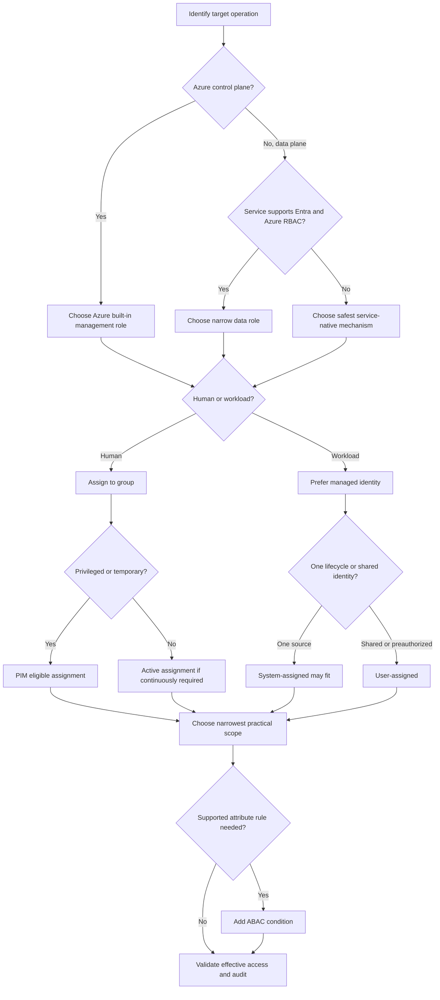
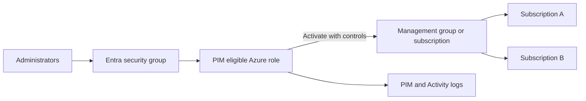
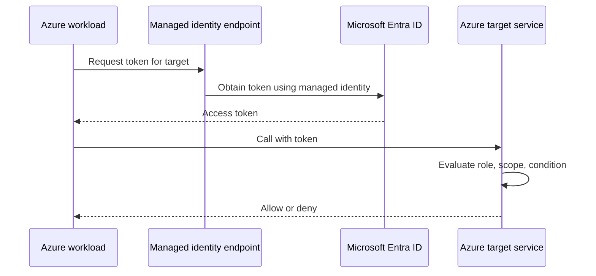

# AZ-305 Study Guide: Recommend a solution for authorizing access to Azure resources

> **Exam task:** Design authentication and authorization solutions — Recommend a solution for authorizing access to Azure resources
>
> **Domain:** Design identity, governance, and monitoring solutions
>
> **Estimated reading time:** 45 minutes
>
> **Matched task source:** Exact match in the supplied AZ-305 skill hierarchy, the consolidated Study Guide Map, and the [official AZ-305 study guide](https://learn.microsoft.com/en-us/credentials/certifications/resources/study-guides/az-305).
>
> **Scope boundary:** This guide covers authorization to Azure management-plane and data-plane resources. Authentication method selection, identity lifecycle design, on-premises authorization, secrets lifecycle management, broad compliance design, and monitoring-platform selection are adjacent tasks and appear only where they change an authorization decision.

---

## How to use this guide

Read Sections 1–4 to build the mental model, then use Sections 5–7 to practice turning requirements into architecture choices. Sections 8–12 add the implementation, governance, resiliency, cost, and operational facts that change a recommendation. Finish with the traps, scenarios, and quick-reference tables.

By the end, you should be able to:

- Translate a scenario into the three parts of an [Azure role assignment](https://learn.microsoft.com/en-us/azure/role-based-access-control/overview): **principal**, **role definition**, and **scope**.
- Distinguish [Azure roles from Microsoft Entra roles](https://learn.microsoft.com/en-us/azure/role-based-access-control/rbac-and-directory-admin-roles), and distinguish control-plane `Actions` from data-plane `DataActions`.
- Choose among [built-in roles](https://learn.microsoft.com/en-us/azure/role-based-access-control/built-in-roles), [custom roles](https://learn.microsoft.com/en-us/azure/role-based-access-control/custom-roles), and supported [Azure ABAC conditions](https://learn.microsoft.com/en-us/azure/role-based-access-control/conditions-overview).
- Decide when human access should be group-based and permanent, eligible through [Privileged Identity Management](https://learn.microsoft.com/en-us/entra/id-governance/privileged-identity-management/pim-configure), or governed by an access review.
- Choose [system-assigned or user-assigned managed identities](https://learn.microsoft.com/en-us/entra/identity/managed-identities-azure-resources/overview) for Azure workloads and apply least-privilege target-resource roles.
- Recognize when a service has additional authorization choices, such as [Azure Storage](https://learn.microsoft.com/en-us/azure/storage/common/authorize-data-access), [Azure Key Vault](https://learn.microsoft.com/en-us/azure/key-vault/general/rbac-access-policy), or [Azure Lighthouse](https://learn.microsoft.com/en-us/azure/lighthouse/concepts/tenants-users-roles).

Scenario questions usually reveal the answer through requirement words: **least privilege**, **temporary**, **approval**, **no stored credentials**, **many subscriptions**, **data access**, **attribute**, **cross-tenant**, **legacy application**, or **lowest licensing cost**. Do not select a feature merely because it is more advanced; select the least complex supported control that satisfies every hard requirement.

Use inline links to verify details and read the most relevant Microsoft Learn page. The Study Guide Map is a discovery aid; Microsoft documentation is the authority.

> **Adjacent task context:** Choosing MFA, passwordless authentication, federation, or Conditional Access policy design belongs mainly to “Recommend an authentication solution.” This guide discusses Conditional Access only as protection around Azure management access, not as a substitute for Azure RBAC.

---

## Primary source set

### Exam and module sources

- [Official AZ-305 study guide](https://learn.microsoft.com/en-us/credentials/certifications/resources/study-guides/az-305)
- [AZ-305: Design identity, governance, and monitor solutions learning path](https://learn.microsoft.com/en-us/training/paths/design-identity-governance-monitor-solutions/)
- [Design authentication and authorization solutions](https://learn.microsoft.com/en-us/training/modules/design-authentication-authorization-solutions/)

### Core product documentation

- [Azure RBAC overview](https://learn.microsoft.com/en-us/azure/role-based-access-control/overview)
- [Azure built-in roles](https://learn.microsoft.com/en-us/azure/role-based-access-control/built-in-roles)
- [Azure custom roles](https://learn.microsoft.com/en-us/azure/role-based-access-control/custom-roles)
- [Understand Azure RBAC scope](https://learn.microsoft.com/en-us/azure/role-based-access-control/scope-overview)
- [Azure RBAC best practices](https://learn.microsoft.com/en-us/azure/role-based-access-control/best-practices)
- [Azure ABAC and role assignment conditions](https://learn.microsoft.com/en-us/azure/role-based-access-control/conditions-overview)
- [Azure roles, Microsoft Entra roles, and classic subscription administrator roles](https://learn.microsoft.com/en-us/azure/role-based-access-control/rbac-and-directory-admin-roles)
- [Microsoft Entra Privileged Identity Management](https://learn.microsoft.com/en-us/entra/id-governance/privileged-identity-management/pim-configure)
- [Managed identities for Azure resources](https://learn.microsoft.com/en-us/entra/identity/managed-identities-azure-resources/overview)
- [Azure Resource Manager control-plane and data-plane operations](https://learn.microsoft.com/en-us/azure/azure-resource-manager/management/control-plane-and-data-plane)
- [Authorize access to Azure Storage data](https://learn.microsoft.com/en-us/azure/storage/common/authorize-data-access)
- [Azure Key Vault RBAC versus access policies](https://learn.microsoft.com/en-us/azure/key-vault/general/rbac-access-policy)
- [Azure Lighthouse tenants, users, and roles](https://learn.microsoft.com/en-us/azure/lighthouse/concepts/tenants-users-roles)

### Supporting architecture and framework sources

- [Azure Well-Architected Framework identity and access strategies](https://learn.microsoft.com/en-us/azure/well-architected/security/identity-access)
- [Cloud Adoption Framework landing-zone identity and access management](https://learn.microsoft.com/en-us/azure/cloud-adoption-framework/ready/landing-zone/design-area/identity-access-landing-zones)
- [Azure Policy overview and its relationship to RBAC](https://learn.microsoft.com/en-us/azure/governance/policy/overview)
- [Conditional Access target resources](https://learn.microsoft.com/en-us/entra/identity/conditional-access/concept-conditional-access-cloud-apps)
- [View Azure RBAC changes in the Activity Log](https://learn.microsoft.com/en-us/azure/role-based-access-control/change-history-report)

### Discovery notes from the Study Guide Map

The map identified Azure RBAC roles and scope, Azure ABAC, deny assignments, groups, service principals, managed identities, PIM, access reviews, Conditional Access, Azure Resource Manager, management groups, Storage, Data Lake ACLs, Key Vault, Lighthouse, Policy, locks, ID Protection, and Defender for Cloud as the plausible product universe.

Coverage is concentrated in Azure RBAC but fragmented at the edges: privileged access is in Microsoft Entra ID Governance, workload identity is in managed identities, service data may use service-specific controls, and enterprise authorization design is explained best by the Well-Architected and Cloud Adoption Frameworks.

Public candidate discussions highlighted built-in versus custom roles, scope, PIM, managed identities, and Azure-role versus Entra-role confusion. Those discussions are nonauthoritative discovery signals only; all recommendations in this guide are grounded in Microsoft documentation.

---

## 1. Exam task scope

### What the task is asking

An Azure Solutions Architect must recommend **who or what receives access, which permitted operations it receives, where those permissions apply, how long the access lasts, and how the organization proves that the design remains appropriate**. Azure implements the core decision as a [role assignment](https://learn.microsoft.com/en-us/azure/role-based-access-control/role-assignments): a security principal receives a role definition at a scope.

The exam is testing design judgment, not whether you can click **Add role assignment**. A good answer balances [least privilege](https://learn.microsoft.com/en-us/azure/role-based-access-control/best-practices), administrative scale, separation of duties, licensing, service support, auditability, and operational risk.

### Likely design decisions tested

- **Principal:** user, Microsoft Entra security group, service principal, system-assigned managed identity, user-assigned managed identity, or a cross-tenant principal projected through [Azure Lighthouse](https://learn.microsoft.com/en-us/azure/lighthouse/concepts/tenants-users-roles).
- **Role:** a narrow [built-in role](https://learn.microsoft.com/en-us/azure/role-based-access-control/built-in-roles) by default; a [custom role](https://learn.microsoft.com/en-us/azure/role-based-access-control/custom-roles) only when required permissions do not align with a built-in role.
- **Scope:** management group, subscription, resource group, resource, or a service-supported child-resource scope, using the [narrowest practical scope](https://learn.microsoft.com/en-us/azure/role-based-access-control/scope-overview).
- **Duration:** active access when continuously required, or eligible/time-bound access through [PIM](https://learn.microsoft.com/en-us/entra/id-governance/privileged-identity-management/pim-configure) when privilege should exist only on demand.
- **Refinement:** a supported [role assignment condition](https://learn.microsoft.com/en-us/azure/role-based-access-control/conditions-overview) when role and scope cannot express an attribute-based rule efficiently.
- **Plane:** a management-plane role, data-plane role, or both, based on the [control-plane/data-plane boundary](https://learn.microsoft.com/en-us/azure/azure-resource-manager/management/control-plane-and-data-plane).
- **Service model:** Azure RBAC, a service-native mechanism, or a constrained delegated token such as a [shared access signature](https://learn.microsoft.com/en-us/azure/storage/common/storage-sas-overview), depending on the target and client.

### In scope

- Azure RBAC evaluation, built-in and custom roles, assignments, inheritance, conditions, and deny assignments.
- Authorization for human administrators and Azure-hosted workloads.
- PIM for Azure resource roles and periodic review of privileged access.
- Management-plane versus data-plane permissions.
- Storage and Key Vault as representative service-specific authorization decisions.
- Cross-tenant resource administration through Azure Lighthouse.
- Policy, locks, Conditional Access, networking, and monitoring only where they complement authorization.

### Out of scope except as a dependency

> **Adjacent task context:** Authentication methods, federation, and identity-risk policy selection belong to “Recommend an authentication solution.” [Conditional Access](https://learn.microsoft.com/en-us/entra/identity/conditional-access/overview) decides whether a token may be issued under current conditions; it does not define the Azure resource operations that token permits.

> **Adjacent task context:** User provisioning, synchronization, tenant strategy, and external identity lifecycle belong to “Recommend an identity management solution.” This task starts after the required principal exists in Microsoft Entra ID.

> **Adjacent task context:** File-system ACLs, Active Directory groups, Kerberos, Application Proxy, and on-premises resource permissions belong mainly to “Recommend a solution for authorizing access to on-premises resources.”

> **Adjacent task context:** Key rotation, secret storage, certificate lifecycle, and managed HSM selection belong mainly to “Recommend a solution to manage secrets, certificates, and keys.” This guide considers only who may access Key Vault objects.

### Mental boundary

Use this sequence:

1. **Identity exists** — identity management.
2. **Identity proves itself** — authentication.
3. **Identity receives permission to an Azure target** — this task.
4. **Target and assignments comply with organizational rules** — governance/compliance.
5. **Changes and use are observed** — logging/monitoring.

> **Exam tip:** If a scenario asks who can start a VM, read blobs, assign roles, or administer a subscription, begin with [Azure RBAC](https://learn.microsoft.com/en-us/azure/role-based-access-control/overview). If it asks who can create users or change tenant-wide identity settings, begin with [Microsoft Entra roles](https://learn.microsoft.com/en-us/azure/role-based-access-control/rbac-and-directory-admin-roles).

---

## 2. Product and topic discovery pass

| Product, service, or topic | Why it may be relevant | Primary Microsoft source | In-scope or adjacent? |
|---|---|---|---|
| Azure RBAC | Core principal-role-scope authorization model for Azure resources | [Azure RBAC overview](https://learn.microsoft.com/en-us/azure/role-based-access-control/overview) | Core |
| Built-in roles | Preferred least-privilege starting point and service-specific permission catalog | [Azure built-in roles](https://learn.microsoft.com/en-us/azure/role-based-access-control/built-in-roles) | Core |
| Custom roles | Required when no built-in role matches the exact operation set | [Azure custom roles](https://learn.microsoft.com/en-us/azure/role-based-access-control/custom-roles) | Core |
| Scope and inheritance | Determines blast radius and administrative scale | [Understand scope](https://learn.microsoft.com/en-us/azure/role-based-access-control/scope-overview) | Core |
| Azure ABAC | Adds supported attribute-based filters to role assignments | [Conditions overview](https://learn.microsoft.com/en-us/azure/role-based-access-control/conditions-overview) | Core when attributes are required |
| Deny assignments | Explicitly block access granted by role assignments; usually Azure-managed | [Deny assignments](https://learn.microsoft.com/en-us/azure/role-based-access-control/deny-assignments) | Supporting edge case |
| Microsoft Entra security groups | Scale human assignments and reduce direct-user assignment count | [Azure RBAC best practices](https://learn.microsoft.com/en-us/azure/role-based-access-control/best-practices) | Core pattern |
| PIM for Azure resources | Adds eligibility, activation, time limits, approval, MFA, and audit | [PIM overview](https://learn.microsoft.com/en-us/entra/id-governance/privileged-identity-management/pim-configure) | Core for privileged access |
| Access reviews | Recertify whether privileged Azure-role access remains necessary | [PIM access reviews](https://learn.microsoft.com/en-us/entra/id-governance/privileged-identity-management/pim-create-roles-and-resource-roles-review) | Supporting governance |
| Managed identities | Secretless principal for Azure-hosted workloads | [Managed identities overview](https://learn.microsoft.com/en-us/entra/identity/managed-identities-azure-resources/overview) | Core for workloads |
| Service principals | Workload principal when managed identity is unsupported or the workload is external | [Service principal objects](https://learn.microsoft.com/en-us/entra/identity-platform/app-objects-and-service-principals) | In-scope alternative |
| Conditional Access | Adds sign-in-time controls around Azure management access | [Target resources](https://learn.microsoft.com/en-us/entra/identity/conditional-access/concept-conditional-access-cloud-apps) | Adjacent protective layer |
| Azure Resource Manager | Defines management-plane operations and scope hierarchy | [Control and data planes](https://learn.microsoft.com/en-us/azure/azure-resource-manager/management/control-plane-and-data-plane) | Core foundation |
| Management groups | Enterprise scope above subscriptions for inherited assignments | [Management groups overview](https://learn.microsoft.com/en-us/azure/governance/management-groups/overview) | Supporting scale pattern |
| Azure Storage authorization | Demonstrates RBAC, SAS, Shared Key, Kerberos, and ACL choices | [Authorize Storage data](https://learn.microsoft.com/en-us/azure/storage/common/authorize-data-access) | Core service example |
| Azure Key Vault authorization | Demonstrates RBAC versus a legacy service-native access model | [RBAC versus access policies](https://learn.microsoft.com/en-us/azure/key-vault/general/rbac-access-policy) | Core service example |
| Azure Lighthouse | Cross-tenant delegated resource administration | [Tenants, users, and roles](https://learn.microsoft.com/en-us/azure/lighthouse/concepts/tenants-users-roles) | Core when cross-tenant |
| Azure Policy | Governs allowed resource state; complements but does not replace RBAC | [Azure Policy overview](https://learn.microsoft.com/en-us/azure/governance/policy/overview) | Adjacent governance |
| Resource locks | Protect resources from update or deletion; do not grant access | [Lock Azure resources](https://learn.microsoft.com/en-us/azure/azure-resource-manager/management/lock-resources) | Adjacent protection |
| Azure Monitor and Activity Log | Audit assignment and custom-role changes and alert on privilege | [RBAC change history](https://learn.microsoft.com/en-us/azure/role-based-access-control/change-history-report) | Supporting operations |
| Well-Architected Framework | Workload-level identity and access design principles | [Identity and access strategies](https://learn.microsoft.com/en-us/azure/well-architected/security/identity-access) | Supporting architecture |
| Cloud Adoption Framework | Estate-wide landing-zone access model and separation of duties | [Landing-zone IAM](https://learn.microsoft.com/en-us/azure/cloud-adoption-framework/ready/landing-zone/design-area/identity-access-landing-zones) | Supporting architecture |

---

## 3. Starting point from Microsoft Learn

Microsoft’s [Design authentication and authorization solutions](https://learn.microsoft.com/en-us/training/modules/design-authentication-authorization-solutions/) module expects an architect to understand IAM, Conditional Access, identity protection, access reviews, service principals, managed identities, and Key Vault. For this specific task, Azure RBAC is the organizing model that connects those topics.

The minimum vocabulary is:

- A **security principal** is the user, group, service principal, or managed identity requesting access; a **role definition** is a permission collection; and a **scope** is the target resource set. Together they form an [Azure role assignment](https://learn.microsoft.com/en-us/azure/role-based-access-control/overview).
- `Actions` and `NotActions` describe management-plane permissions, while `DataActions` and `NotDataActions` describe data-plane permissions in an [Azure role definition](https://learn.microsoft.com/en-us/azure/role-based-access-control/role-definitions).
- Management group, subscription, resource group, and resource scopes form a parent-child hierarchy, and lower scopes inherit permissions assigned above them. ([Understand scope](https://learn.microsoft.com/en-us/azure/role-based-access-control/scope-overview))
- Azure RBAC is normally additive: effective permissions are the union of applicable role assignments, after deny assignments and supported conditions are evaluated. ([Azure RBAC evaluation](https://learn.microsoft.com/en-us/azure/role-based-access-control/overview#how-azure-rbac-determines-if-a-user-has-access-to-a-resource))
- PIM changes a continuously active assignment into eligible or time-bound privilege with activation controls. ([PIM overview](https://learn.microsoft.com/en-us/entra/id-governance/privileged-identity-management/pim-configure))

The module is a starting point, not enough by itself for scenario readiness. You must also know service-specific boundaries: a broad control-plane role may not read data, a key may bypass identity-based controls, an ABAC condition supports only particular data actions, and Lighthouse accepts only supported built-in roles. ([Control and data planes](https://learn.microsoft.com/en-us/azure/azure-resource-manager/management/control-plane-and-data-plane), [Storage authorization](https://learn.microsoft.com/en-us/azure/storage/common/authorize-data-access), [ABAC conditions](https://learn.microsoft.com/en-us/azure/role-based-access-control/conditions-overview), [Lighthouse role support](https://learn.microsoft.com/en-us/azure/lighthouse/concepts/tenants-users-roles#role-support-for-azure-lighthouse))

> **Exam tip:** “Contributor” means broad resource management but not role assignment and not universal data access; “Owner” adds the ability to manage access. Always inspect the required operation and plane instead of assuming the role name is sufficient. ([Azure roles compared](https://learn.microsoft.com/en-us/azure/role-based-access-control/rbac-and-directory-admin-roles#azure-roles))

> **Test yourself**
>
> - A team must restart VMs but must not modify networking or assign roles. What should you inspect first?
> - An application can create a storage account but receives authorization failures when reading blobs. What boundary explains the result?
>
> **Answer guidance:** Start with a narrow [built-in role](https://learn.microsoft.com/en-us/azure/role-based-access-control/built-in-roles) and use a custom role only if no built-in role fits. Creating a storage account is a management-plane operation; reading blob contents requires a supported data-plane authorization such as a Storage Blob Data role. ([Control and data planes](https://learn.microsoft.com/en-us/azure/azure-resource-manager/management/control-plane-and-data-plane))

---

## 4. Conceptual foundation

### 4.1 The principal-role-scope model

Every Azure RBAC recommendation should be expressible as:

> Assign **role R** to **principal P** at **scope S**, with **duration D** and optional **condition C**.

The principal should be stable and manageable. Microsoft recommends assigning human access to [groups rather than individual users](https://learn.microsoft.com/en-us/azure/role-based-access-control/best-practices#assign-roles-to-groups-not-users), while workloads should normally use a [managed identity](https://learn.microsoft.com/en-us/entra/identity/managed-identities-azure-resources/overview) when the source and target support Microsoft Entra authentication.

The role should contain only necessary operations. Prefer a [built-in role](https://learn.microsoft.com/en-us/azure/role-based-access-control/built-in-roles), because Microsoft maintains its permission set and ecosystem compatibility; create a [custom role](https://learn.microsoft.com/en-us/azure/role-based-access-control/custom-roles) when no built-in role can meet least privilege.

The scope should be narrow enough to limit blast radius but broad enough to remain operable. A role assigned at a management group can flow to many subscriptions, while a resource-level assignment isolates access but increases assignment count and lifecycle work. ([Understand scope](https://learn.microsoft.com/en-us/azure/role-based-access-control/scope-overview))

> **Exam tip:** If a requirement says “all current and future subscriptions in this business unit,” consider a [management-group scope](https://learn.microsoft.com/en-us/azure/governance/management-groups/overview). If it says “only this storage account,” do not assign the role at subscription scope merely because deployment is easier.

### 4.2 Azure roles versus Microsoft Entra roles

[Azure roles](https://learn.microsoft.com/en-us/azure/role-based-access-control/rbac-and-directory-admin-roles) control Azure resources through Azure Resource Manager and integrated data planes. [Microsoft Entra roles](https://learn.microsoft.com/en-us/entra/identity/role-based-access-control/permissions-reference) control directory resources such as users, groups, applications, and identity policies.

A Global Administrator does not automatically have Owner access to every Azure subscription. A Global Administrator can use the documented [elevate-access mechanism](https://learn.microsoft.com/en-us/azure/role-based-access-control/elevate-access-global-admin) to receive User Access Administrator at root scope, but that is an emergency or recovery path that should be monitored and removed when no longer needed.

Classic subscription administrator roles are retired and should not drive a new design; current designs use [Azure RBAC roles](https://learn.microsoft.com/en-us/azure/role-based-access-control/rbac-and-directory-admin-roles#classic-subscription-administrator-roles).

> **Exam tip:** “Manage users” points to Microsoft Entra roles; “manage VMs in a subscription” points to Azure roles. The word **administrator** alone does not identify the correct role system.

### 4.3 Control plane versus data plane

The [control plane](https://learn.microsoft.com/en-us/azure/azure-resource-manager/management/control-plane-and-data-plane) creates, configures, and deletes Azure resources through Azure Resource Manager. The data plane uses a resource instance—for example, reading a blob, retrieving a secret, or querying a database.

Role definitions make the distinction explicit: `Actions` govern control-plane operations, and `DataActions` govern supported data-plane operations. ([Role definitions](https://learn.microsoft.com/en-us/azure/role-based-access-control/role-definitions)) A Contributor might configure a service without permission to read its data; conversely, a data reader might read contents without changing the resource configuration.

The boundary is not perfectly risk-free. A management operation such as retrieving a Storage account key can indirectly grant full data access, so architects must review powerful actions, not just `DataActions`. ([Prevent Shared Key authorization](https://learn.microsoft.com/en-us/azure/storage/common/shared-key-authorization-prevent#permissions-for-allowing-or-disallowing-shared-key-access))

> **Exam tip:** If the requirement uses verbs such as **deploy**, **configure**, or **delete the account**, look for management-plane roles. If it uses **read blobs**, **retrieve secrets**, or **query records**, look for data-plane roles or a service-specific mechanism.

### 4.4 Built-in roles, custom roles, and effective permissions

[Built-in roles](https://learn.microsoft.com/en-us/azure/role-based-access-control/built-in-roles) range from broad roles such as Owner, Contributor, and Reader to workload-specific roles such as Virtual Machine Contributor or Storage Blob Data Reader. Choose the narrowest role that covers the required operations.

A [custom role](https://learn.microsoft.com/en-us/azure/role-based-access-control/custom-roles) defines `Actions`, `NotActions`, `DataActions`, `NotDataActions`, and `AssignableScopes`. Microsoft recommends avoiding wildcards because future resource-provider operations could silently expand permission. ([RBAC best practices](https://learn.microsoft.com/en-us/azure/role-based-access-control/best-practices#avoid-using-a-wildcard-when-creating-custom-roles))

`NotActions` is not an explicit deny. If another assignment grants the excluded action, the principal still receives it because [Azure RBAC is additive](https://learn.microsoft.com/en-us/azure/role-based-access-control/overview#multiple-role-assignments). A true [deny assignment](https://learn.microsoft.com/en-us/azure/role-based-access-control/deny-assignments) overrides grants, but customers cannot directly create arbitrary deny assignments; Azure creates and manages them for supported features.

> **Exam tip:** A custom role defined as Contributor minus one action does not protect against a second role assignment that grants that action. Check all inherited assignments and do not confuse `NotActions` with a deny assignment.

### 4.5 Scope, inheritance, and assignment scale

Azure scope descends from [management group to subscription to resource group to resource](https://learn.microsoft.com/en-us/azure/role-based-access-control/scope-overview). A child inherits role assignments from its ancestors, so high-scope assignments are efficient but have a large blast radius.

Use management-group or subscription assignments for stable platform responsibilities that genuinely span the estate. Use resource-group scope when resources share ownership and lifecycle. Use resource or supported child-resource scope for high-value or exceptional targets that require isolation.

Groups reduce direct-user assignment churn and help avoid the fixed [4,000 role assignments per subscription limit](https://learn.microsoft.com/en-us/azure/role-based-access-control/troubleshoot-limits). Custom roles also have a documented [5,000-per-tenant limit](https://learn.microsoft.com/en-us/azure/role-based-access-control/custom-roles), which is generous but reinforces the need for a reusable role catalog rather than one role per person or resource.

> **Exam tip:** “Assign to each user on each resource” is rarely the scalable answer. Look for a group, a shared user-assigned managed identity, a broader but still safe scope, or an ABAC condition.

### 4.6 Privileged human access: PIM and Conditional Access

[PIM](https://learn.microsoft.com/en-us/entra/id-governance/privileged-identity-management/pim-configure) can make Azure resource roles eligible rather than permanently active and can require time-bound activation, approval, MFA, justification, notifications, and audit. This reduces standing privilege without removing an administrator’s ability to work.

PIM role settings are configured per role and resource; settings at a subscription do not automatically inherit to a resource group. ([Configure Azure resource role settings](https://learn.microsoft.com/en-us/entra/id-governance/privileged-identity-management/pim-resource-roles-configure-role-settings)) Recurring [access reviews for Azure resource roles](https://learn.microsoft.com/en-us/entra/id-governance/privileged-identity-management/pim-create-roles-and-resource-roles-review) help remove stale privileged assignments.

[Conditional Access](https://learn.microsoft.com/en-us/entra/identity/conditional-access/concept-conditional-access-cloud-apps#windows-azure-service-management-api) can require controls for Azure management tokens used by the portal, CLI, PowerShell, and related APIs. It protects the circumstances under which access begins; Azure RBAC still determines permitted resource actions.

> **Exam tip:** Choose PIM when the clue is **just in time**, **approval**, **temporary elevation**, or **remove standing privilege**. Choose Conditional Access when the clue is **require MFA**, **compliant device**, **trusted location**, or **risk signal**. Mature privileged-access designs often use both.

### 4.7 Workload access: managed identities and service principals

A [managed identity](https://learn.microsoft.com/en-us/entra/identity/managed-identities-azure-resources/overview) is a Microsoft Entra-backed service principal whose credential lifecycle Azure manages. The workload requests a token and receives permissions through target-resource role assignments; the application does not store a client secret.

A system-assigned identity shares the source resource’s lifecycle and cannot be shared. A user-assigned identity is an independent Azure resource that can be attached to multiple supported sources, enabling preauthorization, reuse, and separation of identity administration from workload deployment. ([Managed identity comparison](https://learn.microsoft.com/en-us/entra/identity/managed-identities-azure-resources/overview#differences-between-system-assigned-and-user-assigned-managed-identities)) Microsoft recommends user-assigned identities for most scenarios, while a system-assigned identity remains simple and tightly coupled for one resource. ([Developer guidance](https://learn.microsoft.com/en-us/entra/identity/managed-identities-azure-resources/overview-for-developers))

If the source cannot use managed identity or runs outside Azure without supported workload identity federation, use a service principal with the safest supported credential model and rotate credentials. ([Workload identity options](https://learn.microsoft.com/en-us/entra/workload-id/workload-identities-overview))

Permission changes may not be immediate. Managed identity tokens are cached by Azure infrastructure, and changes expressed through group or role claims can take hours to appear; Microsoft recommends applying permissions directly to a shared user-assigned identity when rapid authorization changes matter. ([Managed identity authorization limitations](https://learn.microsoft.com/en-us/entra/identity/managed-identities-azure-resources/managed-identity-best-practice-recommendations#limitation-of-using-managed-identities-for-authorization))

> **Exam tip:** “No credentials in code,” “Azure-hosted workload,” and “target supports Microsoft Entra authentication” point to managed identity plus Azure RBAC. Decide system-assigned versus user-assigned from lifecycle, sharing, preauthorization, and separation-of-duties requirements.

### 4.8 Azure ABAC role assignment conditions

[Azure ABAC](https://learn.microsoft.com/en-us/azure/role-based-access-control/conditions-overview) adds a Boolean condition to a role assignment, filtering the permissions already granted by its role. Conditions can reduce assignment sprawl when access depends on supported resource, request, environment, or principal attributes.

ABAC is not a universal Azure authorization engine. Current Azure role assignment conditions apply to built-in or custom role assignments with supported Azure Blob Storage or Azure Queue Storage data actions. ([Conditions overview](https://learn.microsoft.com/en-us/azure/role-based-access-control/conditions-overview#what-are-role-assignment-conditions))

Because RBAC is additive, another unconditional assignment that grants the same operation can bypass the intended restriction. Microsoft’s [ABAC troubleshooting guidance](https://learn.microsoft.com/en-us/azure/role-based-access-control/conditions-troubleshoot#symptom---condition-is-not-enforced) explicitly calls out overlapping assignments and conditions that fail to target every permission path.

> **Exam tip:** Choose ABAC for a supported Storage attribute rule such as blob tags or paths. Do not choose it for an arbitrary Azure service, and always check for broader inherited or unconditional grants.

### 4.9 Service-specific authorization

Azure RBAC is the platform model, but services expose different data-plane choices.

- [Azure Storage](https://learn.microsoft.com/en-us/azure/storage/common/authorize-data-access) supports Microsoft Entra authorization for supported services, managed identities, Shared Key, and SAS variants; Azure Files adds protocol- and identity-specific behavior.
- Microsoft recommends Microsoft Entra ID with managed identities where supported and recommends a [user delegation SAS](https://learn.microsoft.com/en-us/azure/storage/blobs/storage-blob-user-delegation-sas-create-cli) over a key-signed SAS when delegated Blob access is required.
- Disabling Shared Key strengthens identity-based enforcement but changes compatibility: service SAS and account SAS depend on Shared Key, while a Blob user delegation SAS can continue. ([Prevent Shared Key authorization](https://learn.microsoft.com/en-us/azure/storage/common/shared-key-authorization-prevent#understand-how-disallowing-shared-key-affects-sas-tokens))
- [Azure Files authorization](https://learn.microsoft.com/en-us/azure/storage/files/storage-files-authorization-overview) can combine share-level Azure RBAC with directory/file-level Windows ACLs for SMB.
- [Azure Key Vault](https://learn.microsoft.com/en-us/azure/key-vault/general/rbac-access-policy) supports Azure RBAC and the legacy access-policy model. RBAC provides centralized authorization and stronger separation between resource contributors and access administrators.

For new Key Vault resources created with API version `2026-02-01` or later, Azure RBAC is the default authorization model; existing vaults retain their configured model unless explicitly changed. ([Key Vault 2026-02-01 behavior](https://learn.microsoft.com/en-us/azure/key-vault/general/access-control-default))

> **Exam tip:** Do not recommend a storage account key merely because it is easy. A key grants broad data access and bypasses identity-specific controls. Prefer Entra-based RBAC and managed identity, then use narrowly scoped, short-lived delegation only when the client model requires it.

### 4.10 Cross-tenant authorization with Azure Lighthouse

[Azure Lighthouse](https://learn.microsoft.com/en-us/azure/lighthouse/concepts/tenants-users-roles) projects delegated subscriptions or resource groups from a customer tenant into a managing tenant. An authorization pairs a managing-tenant principal with a supported Azure built-in role, avoiding customer-tenant user accounts for every operator.

Lighthouse is constrained by design: custom roles, Owner, classic administrators, roles with `DataActions`, and several access-management operations are unsupported. ([Lighthouse role support](https://learn.microsoft.com/en-us/azure/lighthouse/concepts/tenants-users-roles#role-support-for-azure-lighthouse)) Eligible authorizations can use PIM for JIT elevation, but they have their own supported-role, licensing, cloud, and principal restrictions. ([Eligible authorizations](https://learn.microsoft.com/en-us/azure/lighthouse/how-to/create-eligible-authorizations))

> **Exam tip:** Choose Lighthouse for cross-tenant Azure resource management. Do not assume it can delegate Owner, custom roles, or data-plane roles; validate the required role against Lighthouse support.

### 4.11 Cross-cutting implications

- **Networking:** A firewall or private endpoint controls network reachability; it does not grant Azure RBAC permissions. Both network path and authorization must succeed. ([Well-Architected identity and access](https://learn.microsoft.com/en-us/azure/well-architected/security/identity-access))
- **Governance:** [Azure Policy](https://learn.microsoft.com/en-us/azure/governance/policy/overview#azure-policy-and-azure-rbac) evaluates resource state and can block noncompliant changes even when RBAC permits the caller; the controls are complementary.
- **Protection:** [Resource locks](https://learn.microsoft.com/en-us/azure/azure-resource-manager/management/lock-resources) protect control-plane resources from deletion or modification but are not an authorization model and generally do not protect data-plane operations.
- **Audit:** Azure records role-assignment and custom-role changes in the [Activity Log](https://learn.microsoft.com/en-us/azure/role-based-access-control/change-history-report), while PIM adds activation and assignment history.
- **Cost:** Core Azure RBAC is included with Azure, but [PIM requires Microsoft Entra ID P2 or Microsoft Entra ID Governance licensing](https://learn.microsoft.com/en-us/entra/id-governance/licensing-fundamentals#privileged-identity-management), and exporting or alerting on logs can add Azure Monitor cost.
- **Resiliency:** Azure RBAC data is globally stored and enforced through Azure Resource Manager, but applications must still handle token caching and propagation delay. ([RBAC data resiliency](https://learn.microsoft.com/en-us/azure/role-based-access-control/overview#where-is-azure-rbac-data-stored))

> **Exam tip:** A complete authorization design can require RBAC, network reachability, Policy, and monitoring together, but the exam may ask for only one missing control. Match the answer to the unsatisfied requirement instead of selecting the largest bundle. ([Policy versus RBAC](https://learn.microsoft.com/en-us/azure/governance/policy/overview#azure-policy-and-azure-rbac))

> **Test yourself**
>
> - Why can a user with Contributor on a storage account fail to read blobs?
> - Why does adding a Reader assignment at resource scope not reduce Contributor inherited from the subscription?
> - When would a user-assigned managed identity be preferable to a system-assigned identity?
>
> **Answer guidance:** Control-plane and data-plane permissions are distinct; RBAC grants are additive; and user-assigned identities provide independent lifecycle, sharing, and preauthorization. ([Control and data planes](https://learn.microsoft.com/en-us/azure/azure-resource-manager/management/control-plane-and-data-plane), [multiple assignments](https://learn.microsoft.com/en-us/azure/role-based-access-control/overview#multiple-role-assignments), [managed identity comparison](https://learn.microsoft.com/en-us/entra/identity/managed-identities-azure-resources/overview#differences-between-system-assigned-and-user-assigned-managed-identities))

---

## 5. Design decision framework

### 5.1 Scenario decision tree

This tree begins with the operation and target, not the identity feature. That prevents common category errors such as choosing Conditional Access instead of a resource role, or choosing Contributor for data access.

### 5.2 Step-by-step design logic

1. **Name the exact target and operation.** Convert “manage storage” into explicit control-plane and data-plane verbs using [role definitions](https://learn.microsoft.com/en-us/azure/role-based-access-control/role-definitions).
2. **Identify the principal type.** Use groups for human populations and prefer [managed identity](https://learn.microsoft.com/en-us/entra/identity/managed-identities-azure-resources/overview) for supported Azure workloads.
3. **Select a built-in role.** Search the [built-in role catalog](https://learn.microsoft.com/en-us/azure/role-based-access-control/built-in-roles) for the narrowest sufficient role.
4. **Use a custom role only for a real permission gap.** Start from an existing role, enumerate operations, minimize wildcards, and define reusable `AssignableScopes`. ([Custom roles](https://learn.microsoft.com/en-us/azure/role-based-access-control/custom-roles))
5. **Choose the narrowest practical scope.** Balance blast radius with assignment count, future resources, ownership boundaries, and operations. ([Scope](https://learn.microsoft.com/en-us/azure/role-based-access-control/scope-overview))
6. **Choose active versus eligible access.** Use [PIM](https://learn.microsoft.com/en-us/entra/id-governance/privileged-identity-management/pim-configure) for high-impact human roles when licensing and activation workflow are acceptable.
7. **Apply a supported condition only if required.** Verify resource type, data action, attribute source, and all overlapping assignments. ([ABAC](https://learn.microsoft.com/en-us/azure/role-based-access-control/conditions-overview))
8. **Check bypass paths.** Look for keys, SAS, access policies, local accounts, broad inherited roles, and code-execution permissions that can use a workload’s managed identity. ([Storage Shared Key](https://learn.microsoft.com/en-us/azure/storage/common/shared-key-authorization-prevent), [managed identity best practices](https://learn.microsoft.com/en-us/entra/identity/managed-identities-azure-resources/managed-identity-best-practice-recommendations))
9. **Add complementary controls.** Conditional Access protects management sign-in; Policy constrains resource state; locks prevent accidental control-plane changes; neither replaces RBAC. ([Conditional Access target resources](https://learn.microsoft.com/en-us/entra/identity/conditional-access/concept-conditional-access-cloud-apps), [Policy versus RBAC](https://learn.microsoft.com/en-us/azure/governance/policy/overview#azure-policy-and-azure-rbac))
10. **Design lifecycle and evidence.** Define request, approval, review, removal, logs, alerts, and ownership. ([RBAC change history](https://learn.microsoft.com/en-us/azure/role-based-access-control/change-history-report))

### 5.3 Hard constraints versus soft preferences

| Requirement type | Examples | Design effect | Source |
|---|---|---|---|
| Hard target constraint | Service does not support Entra tokens; Lighthouse rejects required role | Use supported service-native mechanism or redesign delegation | [Managed identity target support](https://learn.microsoft.com/en-us/entra/identity/managed-identities-azure-resources/overview-for-developers#what-resources-can-managed-identities-connect-to), [Lighthouse roles](https://learn.microsoft.com/en-us/azure/lighthouse/concepts/tenants-users-roles#role-support-for-azure-lighthouse) |
| Hard permission constraint | Required operation absent from every built-in role | Create a least-privilege custom role | [Custom roles](https://learn.microsoft.com/en-us/azure/role-based-access-control/custom-roles) |
| Hard temporal constraint | Privilege must require approval and expire | Use PIM eligible/time-bound assignment | [PIM](https://learn.microsoft.com/en-us/entra/id-governance/privileged-identity-management/pim-configure) |
| Hard attribute constraint | Blob access depends on tag, path, or principal attribute | Use a supported ABAC condition and remove bypass assignments | [Azure ABAC](https://learn.microsoft.com/en-us/azure/role-based-access-control/conditions-overview) |
| Hard no-secret constraint | Azure workload cannot store credentials | Use managed identity if source and target support it | [Managed identities](https://learn.microsoft.com/en-us/entra/identity/managed-identities-azure-resources/overview) |
| Soft simplicity preference | Small stable team, low-risk Reader access | A direct group-based active assignment may be simpler than PIM | [RBAC best practices](https://learn.microsoft.com/en-us/azure/role-based-access-control/best-practices) |
| Soft scale preference | Many resources share ownership | Prefer resource-group scope or reusable identity rather than per-resource assignments | [Scope](https://learn.microsoft.com/en-us/azure/role-based-access-control/scope-overview) |
| Soft cost preference | No P2/Governance licenses | Use active least-privilege RBAC plus monitoring unless JIT is mandatory | [Entra licensing](https://learn.microsoft.com/en-us/entra/id-governance/licensing-fundamentals#privileged-identity-management) |

> **Exam tip:** Treat explicit requirements as constraints. “Must require approval” overrides a lower-cost preference and points to PIM; “minimize licensing cost” does not justify ignoring a mandatory JIT requirement.

> **Test yourself**
>
> - A shared deployment identity must exist before ten App Service instances are created. Which managed identity type fits?
> - A developer needs one unsupported control-plane operation plus read-only access. Should you assign Contributor?
>
> **Answer guidance:** A precreated [user-assigned managed identity](https://learn.microsoft.com/en-us/entra/identity/managed-identities-azure-resources/overview#differences-between-system-assigned-and-user-assigned-managed-identities) can be authorized before attachment and shared. If no built-in role fits, create a narrow [custom role](https://learn.microsoft.com/en-us/azure/role-based-access-control/custom-roles) rather than granting broad Contributor access.

---

## 6. Service and feature comparison tables

### 6.1 Fundamental Azure roles

| Role | Resource management | Assign Azure roles | Typical design use | Source |
|---|---|---|---|---|
| Reader | View resources | No | Inventory, support visibility, audit consumers | [Reader](https://learn.microsoft.com/en-us/azure/role-based-access-control/built-in-roles/general#reader) |
| Contributor | Manage resources | No | Broad resource operator when a narrower service role is insufficient | [Contributor](https://learn.microsoft.com/en-us/azure/role-based-access-control/built-in-roles/privileged#contributor) |
| Owner | Manage resources | Yes | Exceptional full control; minimize and protect with PIM | [Owner](https://learn.microsoft.com/en-us/azure/role-based-access-control/built-in-roles/privileged#owner) |
| Role Based Access Control Administrator | Manage Azure RBAC access | Yes, within role permissions and conditions | Dedicated access administrator without general resource management | [RBAC Administrator](https://learn.microsoft.com/en-us/azure/role-based-access-control/built-in-roles/privileged#role-based-access-control-administrator) |
| User Access Administrator | Manage Azure resource access | Yes | Existing access-administration and recovery scenarios; broader legacy access-admin role | [User Access Administrator](https://learn.microsoft.com/en-us/azure/role-based-access-control/built-in-roles/privileged#user-access-administrator) |

### 6.2 Built-in role versus custom role versus ABAC condition

| Choice | Use when | Strengths | Weaknesses or limits | Source |
|---|---|---|---|---|
| Built-in role | A Microsoft role matches required operations | Maintained, recognizable, fast to deploy | May be broader or narrower than a unique job function | [Built-in roles](https://learn.microsoft.com/en-us/azure/role-based-access-control/built-in-roles) |
| Custom role | Required operation set cannot be expressed by a built-in role | Precise reusable permission bundle | Governance overhead; wildcard and future-operation risk; tenant limit | [Custom roles](https://learn.microsoft.com/en-us/azure/role-based-access-control/custom-roles) |
| ABAC condition | A supported Storage data assignment needs attribute-based filtering | Fine-grained access and fewer assignments | Limited supported data actions; additive assignments can bypass it | [Conditions](https://learn.microsoft.com/en-us/azure/role-based-access-control/conditions-overview) |
| Deny assignment | An Azure-managed feature must block actions despite grants | Overrides role grants | Customers cannot directly create arbitrary denies | [Deny assignments](https://learn.microsoft.com/en-us/azure/role-based-access-control/deny-assignments) |

### 6.3 Human and workload principal choices

| Principal | Best fit | Lifecycle | Key tradeoff | Source |
|---|---|---|---|---|
| Individual user | Exceptional one-person assignment or break-glass need | Human lifecycle | High churn and poor assignment scale | [RBAC best practices](https://learn.microsoft.com/en-us/azure/role-based-access-control/best-practices#assign-roles-to-groups-not-users) |
| Security group | Teams and job functions | Membership governs effective access | Requires disciplined group ownership and review | [Assign roles to groups](https://learn.microsoft.com/en-us/azure/role-based-access-control/best-practices#assign-roles-to-groups-not-users) |
| Service principal | External or unsupported workload identity scenarios | Application object and credentials/federation | Credential or federation lifecycle remains an explicit design concern | [Workload identities](https://learn.microsoft.com/en-us/entra/workload-id/workload-identities-overview) |
| System-assigned managed identity | One Azure resource with coupled identity lifecycle | Deleted with source resource | Simple, but cannot be shared or precreated independently | [Managed identity comparison](https://learn.microsoft.com/en-us/entra/identity/managed-identities-azure-resources/overview#differences-between-system-assigned-and-user-assigned-managed-identities) |
| User-assigned managed identity | Multiple resources, preauthorization, independent lifecycle | Separate Azure resource | Reuse increases blast radius unless assignment and use are controlled | [Managed identity best practices](https://learn.microsoft.com/en-us/entra/identity/managed-identities-azure-resources/managed-identity-best-practice-recommendations) |

### 6.4 Active RBAC versus PIM-eligible access

| Model | Use when | Security posture | Cost/operations | Source |
|---|---|---|---|---|
| Active assignment | Access is continuously required or low impact | Least privilege still required; privilege is always available | Core RBAC has no PIM license dependency | [Azure RBAC overview](https://learn.microsoft.com/en-us/azure/role-based-access-control/overview) |
| PIM eligible assignment | High-impact access is occasional | Reduces standing privilege; can require MFA, approval, time limit, and justification | Requires supported Entra licensing and activation operations | [PIM](https://learn.microsoft.com/en-us/entra/id-governance/privileged-identity-management/pim-configure), [licensing](https://learn.microsoft.com/en-us/entra/id-governance/licensing-fundamentals#privileged-identity-management) |
| Time-bound active assignment | Access is needed only during a defined project window | Automatically expires without activation each use | Less friction than eligible access but active during the window | [PIM assignment types](https://learn.microsoft.com/en-us/entra/id-governance/privileged-identity-management/pim-configure#role-assignment-overview) |

### 6.5 Storage authorization choices

| Method | Appropriate scenario | Security/design notes | Source |
|---|---|---|---|
| Entra ID + Azure RBAC | Users and workloads supported by Entra authentication | Preferred identity-specific authorization; managed identity removes stored secrets | [Authorize Storage data](https://learn.microsoft.com/en-us/azure/storage/common/authorize-data-access) |
| User delegation SAS | Temporary delegated Blob access when direct identity integration is impractical | Signed with Entra-backed user delegation key; scope and expiry must be minimized | [User delegation SAS](https://learn.microsoft.com/en-us/azure/storage/blobs/storage-blob-user-delegation-sas-create-cli) |
| Service or account SAS | Legacy or compatibility requirement using Shared Key | Depends on account key; rejected when Shared Key is disabled | [Shared Key effects](https://learn.microsoft.com/en-us/azure/storage/common/shared-key-authorization-prevent#understand-how-disallowing-shared-key-affects-sas-tokens) |
| Shared Key | Last-resort compatibility | Grants broad account data access and is difficult to attribute to a person or workload | [Protect access keys](https://learn.microsoft.com/en-us/azure/storage/common/authorize-data-access#protect-your-access-keys) |
| Azure Files share role + ACL | SMB share, directory, and file authorization | Azure RBAC controls share-level access; Windows ACLs control directory/file detail | [Azure Files authorization](https://learn.microsoft.com/en-us/azure/storage/files/storage-files-authorization-overview) |

### 6.6 Azure RBAC versus adjacent controls

| Control | Primary question answered | Does it grant resource permissions? | Source |
|---|---|---|---|
| Azure RBAC | Who can perform which operation at which Azure scope? | Yes | [Azure RBAC](https://learn.microsoft.com/en-us/azure/role-based-access-control/overview) |
| Conditional Access | Under what sign-in conditions may a token be issued or used? | No | [Conditional Access](https://learn.microsoft.com/en-us/entra/identity/conditional-access/overview) |
| Azure Policy | Is resulting resource state allowed and compliant? | No; it evaluates/changes/blocks resource state | [Policy versus RBAC](https://learn.microsoft.com/en-us/azure/governance/policy/overview#azure-policy-and-azure-rbac) |
| Resource lock | May an otherwise authorized control-plane operation modify or delete this target? | No | [Resource locks](https://learn.microsoft.com/en-us/azure/azure-resource-manager/management/lock-resources) |
| Network ACL/firewall | Can the request reach the endpoint? | No | [Well-Architected network security](https://learn.microsoft.com/en-us/azure/well-architected/security/networking) |

---

## 7. Architecture patterns

### 7.1 Enterprise group-based RBAC with PIM

**When it applies:** Human platform teams administer many subscriptions, privileged work is intermittent, and the organization requires approval and audit.

Assign job-function groups to the narrowest suitable [Azure roles and scopes](https://learn.microsoft.com/en-us/azure/role-based-access-control/best-practices), then make high-impact assignments eligible through [PIM](https://learn.microsoft.com/en-us/entra/id-governance/privileged-identity-management/pim-configure). Use management-group scope only when the same responsibility truly applies across descendant subscriptions. ([Landing-zone IAM](https://learn.microsoft.com/en-us/azure/cloud-adoption-framework/ready/landing-zone/design-area/identity-access-landing-zones))

**Strengths:** scalable membership, reduced standing privilege, approval, expiry, and audit. **Weaknesses:** Entra licensing, activation dependency, and risk from overly broad high-scope roles. **Failure mode:** making Owner permanently active or assigning individuals directly. **Cost:** licensing and operational governance, not an Azure RBAC transaction charge. **Monitoring:** PIM activity plus Azure Activity Log changes. ([PIM licensing](https://learn.microsoft.com/en-us/entra/id-governance/licensing-fundamentals#privileged-identity-management), [RBAC change history](https://learn.microsoft.com/en-us/azure/role-based-access-control/change-history-report))

### 7.2 Secretless workload-to-resource authorization

**When it applies:** An Azure workload needs to access Storage, Key Vault, SQL, Service Bus, or another target that supports Microsoft Entra tokens.

Use a [managed identity](https://learn.microsoft.com/en-us/entra/identity/managed-identities-azure-resources/overview), grant the narrowest target data role, and avoid permissions that let an unrelated operator run code as the source resource and therefore use its identity. ([Managed identity best practices](https://learn.microsoft.com/en-us/entra/identity/managed-identities-azure-resources/managed-identity-best-practice-recommendations))

**Strengths:** no application secret, Azure-managed credential lifecycle, RBAC auditability. **Weaknesses:** source and target support requirements, token caching, and possible blast radius from shared user-assigned identities. **Failure mode:** assigning Contributor to the source and assuming that grants target access. **Cost:** no secret-rotation platform is required, but the target service and monitoring still incur normal charges. **Monitoring:** managed identity sign-ins, target audit logs, and role changes. ([Managed identity overview](https://learn.microsoft.com/en-us/entra/identity/managed-identities-azure-resources/overview))

### 7.3 Attribute-based Storage authorization

**When it applies:** Many users or workloads need the same Storage data role, but their access depends on supported blob/queue attributes such as a path, tag, container, or principal attribute.

Assign a supported Storage data role at a maintainable scope and add an [Azure ABAC condition](https://learn.microsoft.com/en-us/azure/role-based-access-control/conditions-overview). Inventory all other assignments that could grant the same data action, because an unconditional grant can bypass the condition. ([Conditions troubleshooting](https://learn.microsoft.com/en-us/azure/role-based-access-control/conditions-troubleshoot#symptom---condition-is-not-enforced))

**Strengths:** fewer assignments and fine-grained attribute logic. **Weaknesses:** limited service/action support and more complex testing. **Failure mode:** treating ABAC as a deny or assuming it applies to every Azure service. **Cost:** operational complexity rather than a separate ABAC SKU. **Monitoring:** Storage data logs plus assignment-condition change history where applicable.

### 7.4 Key Vault authorization with separation of duties

**When it applies:** Application owners may configure a vault but must not grant themselves access to secrets, keys, or certificates.

Choose the [Azure RBAC permission model](https://learn.microsoft.com/en-us/azure/key-vault/general/rbac-access-policy), give platform access administrators Owner or User Access Administrator only where required, give resource operators Key Vault Contributor without data access, and give applications narrow Key Vault data roles through managed identities.

**Strengths:** centralized RBAC, PIM integration, and clearer separation between management and data access. **Weaknesses:** migration planning for legacy access policies and possible propagation delay. **Failure mode:** using the legacy access-policy model while broadly assigning Contributor, which can enable self-grant of data access. **Current-version note:** API `2026-02-01` and later default new vaults to RBAC, while existing vaults retain their current model. ([Key Vault default](https://learn.microsoft.com/en-us/azure/key-vault/general/access-control-default))

### 7.5 Cross-tenant operations through Azure Lighthouse

**When it applies:** A service provider or central team must manage customer or subsidiary Azure resources without individual guest accounts and directory switching.

Delegate a subscription or resource group through [Azure Lighthouse](https://learn.microsoft.com/en-us/azure/lighthouse/concepts/tenants-users-roles), assign managing-tenant security groups supported built-in roles, and include a safe removal path. Use [eligible authorizations](https://learn.microsoft.com/en-us/azure/lighthouse/how-to/create-eligible-authorizations) when JIT elevation is required and supported.

**Strengths:** centralized cross-tenant operations, customer visibility, and scoped delegation. **Weaknesses:** no custom roles, Owner, or roles with `DataActions`; eligible authorizations add licensing and cloud restrictions. **Failure mode:** selecting Lighthouse for direct customer data access that requires an unsupported data role. **Monitoring:** managing tenant PIM audit plus customer subscription Activity Log for delegated actions. ([Lighthouse eligible authorization audit](https://learn.microsoft.com/en-us/azure/lighthouse/how-to/create-eligible-authorizations#how-eligible-authorizations-work))

> **Exam tip:** Architecture patterns are composable. A secure landing zone may use group-based RBAC, PIM, Conditional Access, managed identities, Policy, and logging together—but each control answers a different question.

> **Test yourself**
>
> - Which pattern fits a central operations team managing five subsidiary tenants without creating users in each tenant?
> - Which pattern fits hundreds of workloads that may read only blobs tagged for their project?
>
> **Answer guidance:** Use [Azure Lighthouse](https://learn.microsoft.com/en-us/azure/lighthouse/concepts/tenants-users-roles) for supported cross-tenant management. Consider a supported [ABAC condition](https://learn.microsoft.com/en-us/azure/role-based-access-control/conditions-overview) for attribute-based Blob access, while checking for unconditional grants.

---

## 8. Implementation awareness for architects

### Decisions required before implementation

- Define principal ownership, group membership authority, joiner/mover/leaver process, and emergency access. ([Well-Architected IAM](https://learn.microsoft.com/en-us/azure/well-architected/security/identity-access))
- Inventory exact operations and whether they are control-plane or data-plane actions. ([Role definitions](https://learn.microsoft.com/en-us/azure/role-based-access-control/role-definitions))
- Define the resource hierarchy and stable assignment scopes before distributing permissions. ([Landing-zone IAM](https://learn.microsoft.com/en-us/azure/cloud-adoption-framework/ready/landing-zone/design-area/identity-access-landing-zones))
- Decide active versus eligible assignments, activation policy, approvers, duration, and review cadence. ([PIM role settings](https://learn.microsoft.com/en-us/entra/id-governance/privileged-identity-management/pim-resource-roles-configure-role-settings))
- Decide whether workloads use system-assigned identities, reusable user-assigned identities, or another workload identity. ([Managed identity best practices](https://learn.microsoft.com/en-us/entra/identity/managed-identities-azure-resources/managed-identity-best-practice-recommendations))
- Identify service-native bypass paths before disabling keys or changing permission models. ([Prevent Shared Key](https://learn.microsoft.com/en-us/azure/storage/common/shared-key-authorization-prevent), [Key Vault RBAC migration](https://learn.microsoft.com/en-us/azure/key-vault/general/rbac-migration))

### Infrastructure-as-code awareness

Role assignments can be deployed through the portal, CLI, PowerShell, ARM/Bicep, SDKs, and REST. ([Azure RBAC overview](https://learn.microsoft.com/en-us/azure/role-based-access-control/overview)) In infrastructure as code, use stable role-definition IDs rather than names, specify the correct principal type, and generate deterministic assignment resource names to avoid duplicate or conflicting deployments. ([RBAC best practices](https://learn.microsoft.com/en-us/azure/role-based-access-control/best-practices#assign-roles-using-the-unique-role-id-instead-of-the-role-name), [role assignments](https://learn.microsoft.com/en-us/azure/role-based-access-control/role-assignments))

When a deployment creates both a managed identity and a role assignment, Microsoft Entra replication can produce transient principal-not-found failures; specifying `principalType` in the role assignment helps address this IaC scenario. ([Troubleshoot Azure RBAC](https://learn.microsoft.com/en-us/azure/role-based-access-control/troubleshooting#symptom---assigning-a-role-to-a-new-principal-sometimes-fails))

### Propagation and caching

Authorization changes are not always instantaneous. Azure RBAC changes can take time to refresh, management-group changes can take longer, ABAC conditions can take several minutes, and managed-identity group/role claim changes can be delayed by token caching. ([RBAC troubleshooting](https://learn.microsoft.com/en-us/azure/role-based-access-control/troubleshooting), [ABAC troubleshooting](https://learn.microsoft.com/en-us/azure/role-based-access-control/conditions-troubleshoot), [managed identity limitations](https://learn.microsoft.com/en-us/entra/identity/managed-identities-azure-resources/managed-identity-best-practice-recommendations#limitation-of-using-managed-identities-for-authorization))

Architects should specify retry/backoff and rollout sequencing instead of treating a temporary 403 as proof that the model is wrong.

### Limits and dependencies worth recognizing

- Azure supports a fixed [4,000 role assignments per subscription](https://learn.microsoft.com/en-us/azure/role-based-access-control/troubleshoot-limits); group-based design conserves assignments.
- A tenant supports up to [5,000 custom roles](https://learn.microsoft.com/en-us/azure/role-based-access-control/custom-roles), with a different documented limit for Azure operated by 21Vianet.
- ABAC conditions currently support specified Blob and Queue data actions, not arbitrary Azure services. ([ABAC](https://learn.microsoft.com/en-us/azure/role-based-access-control/conditions-overview))
- PIM requires a supported Microsoft Entra license for users in scope of privileged assignments. ([PIM licensing](https://learn.microsoft.com/en-us/entra/id-governance/licensing-fundamentals#privileged-identity-management))
- Lighthouse delegates only supported built-in roles and excludes Owner, custom roles, and roles with `DataActions`. ([Lighthouse role support](https://learn.microsoft.com/en-us/azure/lighthouse/concepts/tenants-users-roles#role-support-for-azure-lighthouse))

### What can be deferred

Portal workflow, CLI syntax, display naming, and dashboard layout can usually be delegated after the architect specifies principals, roles, scopes, conditions, lifecycle, assignment ownership, evidence, and rollback. Implementation details cannot be deferred when they change the security model—for example, Storage Shared Key compatibility or a Key Vault access-policy migration.

---

## 9. Security, governance, and compliance considerations

### Least privilege and separation of duties

Minimize privileged administrator assignments, use narrow scopes, prefer job-function roles over Owner, and make high-impact human roles eligible through PIM. ([Azure RBAC best practices](https://learn.microsoft.com/en-us/azure/role-based-access-control/best-practices)) Separate the ability to operate resources from the ability to grant access; the [RBAC Administrator and User Access Administrator roles](https://learn.microsoft.com/en-us/azure/role-based-access-control/rbac-and-directory-admin-roles#azure-roles) exist specifically for access administration.

Be cautious when a role lets a person execute or modify code on a resource that has a managed identity. The operator may be able to run code as that identity and reach its downstream resources. ([Managed identity best practices](https://learn.microsoft.com/en-us/entra/identity/managed-identities-azure-resources/managed-identity-best-practice-recommendations))

### Protect the management plane

Use [Conditional Access for Azure management](https://learn.microsoft.com/en-us/entra/identity/conditional-access/concept-conditional-access-cloud-apps#windows-azure-service-management-api) to require appropriate authentication strength or device posture, while maintaining tested emergency access. Use PIM for activation and Azure RBAC for permissions; none of the three replaces the others.

### Governance controls

[Azure Policy and RBAC](https://learn.microsoft.com/en-us/azure/governance/policy/overview#azure-policy-and-azure-rbac) combine to control both caller actions and resulting resource state. Policy can require Key Vault RBAC or disallow Storage Shared Key, but remediation identities themselves need least-privilege RBAC assignments.

[Resource locks](https://learn.microsoft.com/en-us/azure/azure-resource-manager/management/lock-resources) are useful against accidental control-plane deletion or modification, but they apply to all users and roles at scope and do not replace role design. A lock can also block legitimate automation, so ownership and removal procedure matter.

### Compliance evidence and recertification

Capture assignment purpose in descriptions where supported, use group ownership, schedule [privileged access reviews](https://learn.microsoft.com/en-us/entra/id-governance/privileged-identity-management/pim-create-roles-and-resource-roles-review), and retain RBAC changes beyond the Activity Log’s native window when regulation requires it. ([RBAC change history](https://learn.microsoft.com/en-us/azure/role-based-access-control/change-history-report))

Compliance does not automatically mean “custom role.” A standardized built-in role at a narrow scope, protected by PIM and reviewed regularly, is often easier to explain and audit than hundreds of bespoke roles. ([Well-Architected IAM](https://learn.microsoft.com/en-us/azure/well-architected/security/identity-access))

> **Exam tip:** RBAC answers **who can act**; Policy answers **which resulting states are acceptable**; a lock blocks specific control-plane changes; Conditional Access protects sign-in context; PIM limits when privilege is active. Select the control named by the requirement. ([Policy versus RBAC](https://learn.microsoft.com/en-us/azure/governance/policy/overview#azure-policy-and-azure-rbac))

> **Test yourself**
>
> - A user is authorized to create storage accounts, but deployments outside approved regions must fail. Which two controls combine?
> - An auditor requires quarterly confirmation that subscription Owners still need access. What adds the review lifecycle?
>
> **Answer guidance:** Use Azure RBAC for who may deploy and [Azure Policy](https://learn.microsoft.com/en-us/azure/governance/policy/overview#azure-policy-and-azure-rbac) for allowed regions. Use [PIM access reviews](https://learn.microsoft.com/en-us/entra/id-governance/privileged-identity-management/pim-create-roles-and-resource-roles-review) for recurring privileged-role recertification.

---

## 10. Resiliency, availability, and disaster recovery considerations

Authorization is not primarily a backup or replication task, but it affects whether operators and workloads can respond during failure.

### Platform resilience

Azure RBAC role definitions, assignments, and deny assignments are stored globally so Azure Resource Manager can enforce access across regions. ([RBAC data storage](https://learn.microsoft.com/en-us/azure/role-based-access-control/overview#where-is-azure-rbac-data-stored)) Do not create duplicate regional role assignments for the same globally scoped Azure resource hierarchy merely for resilience.

### Operational access during incidents

Incident responders need predesigned access. Use eligible PIM roles with appropriate activation duration and approvers, and maintain tested emergency-access procedures for identity-control-plane failures. ([PIM role settings](https://learn.microsoft.com/en-us/entra/id-governance/privileged-identity-management/pim-resource-roles-configure-role-settings), [Well-Architected emergency access](https://learn.microsoft.com/en-us/azure/well-architected/security/identity-access#emergency-access))

Overly strict approval dependencies can become a single operational bottleneck; overly broad permanent Owner access creates continuous risk. Choose enough approver and emergency-path resilience without normalizing standing privilege.

### Workload failover

A system-assigned identity belongs to one Azure resource, so a separately deployed failover resource receives a different principal and needs its own authorization. A user-assigned identity can be attached to multiple supported resources and may simplify preauthorization of active/passive instances, but shared identity expands blast radius. ([Managed identity comparison](https://learn.microsoft.com/en-us/entra/identity/managed-identities-azure-resources/overview#differences-between-system-assigned-and-user-assigned-managed-identities))

Test role propagation and token acquisition before failover. Managed identity token caching means removal or group-membership change might not take effect immediately, so do not rely on rapid membership mutation as the only failover control. ([Managed identity authorization limitation](https://learn.microsoft.com/en-us/entra/identity/managed-identities-azure-resources/managed-identity-best-practice-recommendations#limitation-of-using-managed-identities-for-authorization))

### Restored resources and authorization state

Authorization relationships may not follow service data through every restore or recreation workflow. For example, Key Vault migration and recovery planning should include recreation or validation of RBAC assignments. ([Key Vault RBAC migration considerations](https://learn.microsoft.com/en-us/azure/key-vault/general/rbac-migration)) Treat authorization as infrastructure as code so failover and recovery environments can reproduce intended access consistently.

> **Adjacent task context:** RTO, RPO, backup vault choice, regional replication, and workload failover topology belong to the business-continuity domain. Here, ask only whether responders and failover identities retain the minimum authorization needed to execute the recovery plan.

---

## 11. Cost and licensing considerations

### Direct platform and licensing costs

Core [Azure RBAC is included with an Azure subscription](https://learn.microsoft.com/en-us/azure/role-based-access-control/overview#license-requirements). Built-in roles, custom roles, and supported conditions are design mechanisms rather than separately metered authorization services.

[PIM requires Microsoft Entra ID P2 or Microsoft Entra ID Governance licensing](https://learn.microsoft.com/en-us/entra/id-governance/licensing-fundamentals#privileged-identity-management) for the applicable users and scenarios. Conditional Access has its own Microsoft Entra licensing requirements and should be included when a scenario mandates sign-in controls. ([Conditional Access licensing](https://learn.microsoft.com/en-us/entra/identity/conditional-access/overview#license-requirements))

Managed identities do not require an application secret store or rotation workflow, but they do not eliminate normal charges for the source, target, network, or logs. ([Managed identities](https://learn.microsoft.com/en-us/entra/identity/managed-identities-azure-resources/overview))

### Operational cost drivers

- Thousands of direct assignments increase review, troubleshooting, and cleanup effort; groups and rational scope design reduce that burden. ([RBAC best practices](https://learn.microsoft.com/en-us/azure/role-based-access-control/best-practices#assign-roles-to-groups-not-users))
- Custom roles create testing and change-management obligations whenever resource providers add operations. ([Custom-role wildcard guidance](https://learn.microsoft.com/en-us/azure/role-based-access-control/best-practices#avoid-using-a-wildcard-when-creating-custom-roles))
- PIM activation and approval add user and support workflow, even while improving security. ([PIM overview](https://learn.microsoft.com/en-us/entra/id-governance/privileged-identity-management/pim-configure))
- Exporting Activity Logs to Log Analytics or alerting on role changes adds ingestion, retention, query, and alerting costs. ([Alert on privileged assignments](https://learn.microsoft.com/en-us/azure/role-based-access-control/role-assignments-alert))
- Shared Key may look operationally cheap but increases credential-distribution, rotation, attribution, and incident-response cost. ([Storage authorization](https://learn.microsoft.com/en-us/azure/storage/common/authorize-data-access#protect-your-access-keys))

Reservations, savings plans, replication tiers, and data-transfer pricing rarely decide the authorization mechanism itself and should not distract from the task.

> **Exam tip:** If minimizing license cost is the only advanced requirement, group-based active Azure RBAC may be sufficient because core RBAC is included. If the scenario explicitly requires JIT, approval, or expiring privilege, [PIM licensing](https://learn.microsoft.com/en-us/entra/id-governance/licensing-fundamentals#privileged-identity-management) is a necessary design dependency, not an optional luxury.

---

## 12. Monitoring and operational considerations

### What to monitor

- Role assignment creation/deletion and custom-role creation/update/deletion in the [Azure Activity Log](https://learn.microsoft.com/en-us/azure/role-based-access-control/change-history-report).
- Privileged assignments and activations in [PIM audit history](https://learn.microsoft.com/en-us/entra/id-governance/privileged-identity-management/azure-pim-resource-rbac).
- Managed identity and service-principal sign-ins in Microsoft Entra monitoring, plus target-service audit logs. ([Managed identity sign-in activity](https://learn.microsoft.com/en-us/entra/identity/managed-identities-azure-resources/overview))
- Authorization failures, unusual key use, SAS use, and Shared Key use in service logs, especially while migrating Storage to Entra-based authorization. ([Detect Shared Key authorization](https://learn.microsoft.com/en-us/azure/storage/common/shared-key-authorization-prevent#detect-the-type-of-authorization-used-by-client-applications))
- High-impact role assignment events through an [Azure Monitor alert](https://learn.microsoft.com/en-us/azure/role-based-access-control/role-assignments-alert).

### Retention and correlation

Azure RBAC changes are available in the Activity Log for the documented native history period; route logs to Azure Monitor Logs when longer retention, cross-subscription queries, correlation, or alerting is required. ([RBAC change history](https://learn.microsoft.com/en-us/azure/role-based-access-control/change-history-report)) Correlate assignment change, PIM activation, sign-in, target request, and Policy result to reconstruct who received access and what happened.

### Operational ownership

Define separate owners for role catalog, group membership, privileged access policy, workload identities, service data authorization, and audit response. The [Cloud Adoption Framework landing-zone guidance](https://learn.microsoft.com/en-us/azure/cloud-adoption-framework/ready/landing-zone/design-area/identity-access-landing-zones) recommends an enterprise access model and clear platform/application responsibilities.

Review orphaned assignments when a user, group, service principal, or managed identity is deleted, because role-assignment metadata can remain and complicate audit or future automation. ([Role assignments and deleted principals](https://learn.microsoft.com/en-us/azure/role-based-access-control/role-assignments#principal))

> **Adjacent task context:** Selecting Log Analytics workspace topology, retention architecture, alerting platform, or enterprise monitoring strategy belongs to “Recommend a monitoring solution.” This task only requires enough telemetry to govern and troubleshoot authorization.

> **Test yourself**
>
> - Which log proves that an Azure role assignment was created?
> - Why might a successful PIM activation not immediately produce the expected application behavior?
>
> **Answer guidance:** Azure RBAC changes appear in the [Azure Activity Log](https://learn.microsoft.com/en-us/azure/role-based-access-control/change-history-report). Applications and managed identity infrastructure can cache authorization state or tokens, so propagation and token refresh behavior must be considered. ([PIM activation behavior](https://learn.microsoft.com/en-us/entra/id-governance/privileged-identity-management/pim-resource-roles-activate-your-roles), [managed identity caching](https://learn.microsoft.com/en-us/entra/identity/managed-identities-azure-resources/managed-identity-best-practice-recommendations#limitation-of-using-managed-identities-for-authorization))

---

## 13. Common exam traps

| Trap | Tempting wrong answer | Why it seems reasonable | Why it is wrong or incomplete | Better design choice | Microsoft source |
|---|---|---|---|---|---|
| Azure role versus Entra role | Assign Global Administrator to manage subscriptions | It sounds like the highest administrator | Directory administration and Azure resource authorization are separate role systems | Assign the required Azure role at the appropriate Azure scope | [Role systems compared](https://learn.microsoft.com/en-us/azure/role-based-access-control/rbac-and-directory-admin-roles) |
| Contributor versus data access | Assign Contributor to read Storage blobs | Contributor manages the account | Control-plane permission does not automatically grant Blob data access | Assign a narrow Storage Blob Data role | [Control/data planes](https://learn.microsoft.com/en-us/azure/azure-resource-manager/management/control-plane-and-data-plane) |
| Reader reduces Contributor | Add Reader at a lower scope | The lower scope looks more specific | Azure RBAC grants are additive; Reader does not subtract inherited Contributor | Remove or narrow the broad grant; use supported conditions where appropriate | [Multiple assignments](https://learn.microsoft.com/en-us/azure/role-based-access-control/overview#multiple-role-assignments) |
| `NotActions` as deny | Create Contributor minus delete and assume deletion is blocked globally | The word “Not” suggests denial | Another role can still grant delete | Remove overlapping grants; use Azure-managed deny/lock only for their supported purpose | [Custom roles](https://learn.microsoft.com/en-us/azure/role-based-access-control/custom-roles), [deny assignments](https://learn.microsoft.com/en-us/azure/role-based-access-control/deny-assignments) |
| Custom role by default | Create one custom role per team | It appears maximally precise | It increases lifecycle work and may use unsafe wildcards | Prefer the narrowest built-in role; customize only for a real gap | [RBAC best practices](https://learn.microsoft.com/en-us/azure/role-based-access-control/best-practices) |
| Direct user assignments | Assign every administrator individually | Easy for a small initial rollout | Poor lifecycle scale and consumes assignments | Assign roles to governed security groups | [Assign roles to groups](https://learn.microsoft.com/en-us/azure/role-based-access-control/best-practices#assign-roles-to-groups-not-users) |
| Conditional Access replaces RBAC | Require MFA and assume access is authorized | MFA strengthens sign-in | It does not define resource operations or scope | Use Conditional Access plus Azure RBAC | [Conditional Access target resources](https://learn.microsoft.com/en-us/entra/identity/conditional-access/concept-conditional-access-cloud-apps) |
| Policy replaces RBAC | Use Policy to control who may manage VMs | Policy can deny noncompliant changes | Policy evaluates state; RBAC governs user actions | Combine Policy with RBAC according to requirement | [Policy versus RBAC](https://learn.microsoft.com/en-us/azure/governance/policy/overview#azure-policy-and-azure-rbac) |
| Managed identity grants access automatically | Enable a managed identity only | The identity now exists | A principal still needs target authorization | Assign the target’s narrow built-in data or management role | [Managed identities](https://learn.microsoft.com/en-us/entra/identity/managed-identities-azure-resources/overview) |
| Shared Key for convenience | Give an app a storage account key | Works with many tools | Key grants broad data access and weakens attribution and Conditional Access | Use Entra RBAC/managed identity or a narrow user delegation SAS | [Storage authorization](https://learn.microsoft.com/en-us/azure/storage/common/authorize-data-access) |
| ABAC everywhere | Add a condition for any resource type | Attribute logic sounds generic | Azure role conditions support specific Blob/Queue data actions | Validate supported service, role, action, and attributes | [ABAC limits](https://learn.microsoft.com/en-us/azure/role-based-access-control/conditions-overview) |
| Lighthouse for any cross-tenant access | Delegate Owner or a data role through Lighthouse | Lighthouse is cross-tenant Azure management | Owner, custom roles, and roles with `DataActions` are unsupported | Use a supported built-in management role or another approved model | [Lighthouse role support](https://learn.microsoft.com/en-us/azure/lighthouse/concepts/tenants-users-roles#role-support-for-azure-lighthouse) |
| PIM without license/operations | Make every role eligible | Stronger security sounds universally best | PIM has licensing, activation, approval, and availability implications | Use PIM for privilege where requirements justify it; retain active least-privilege access where continuous access is required | [PIM licensing](https://learn.microsoft.com/en-us/entra/id-governance/licensing-fundamentals#privileged-identity-management) |
| Immediate revocation assumption | Remove a managed identity from a group and expect instant denial | Human token refresh often appears quick | Managed identity token caching can delay effective change | Apply roles directly to a user-assigned identity when fast changes matter and design for propagation | [Managed identity authorization limitation](https://learn.microsoft.com/en-us/entra/identity/managed-identities-azure-resources/managed-identity-best-practice-recommendations#limitation-of-using-managed-identities-for-authorization) |
| Key Vault legacy model by habit | Use access policies for every vault | It is familiar and still supported | It weakens separation of duties compared with RBAC; new API behavior defaults to RBAC | Prefer RBAC and migrate deliberately | [Key Vault RBAC comparison](https://learn.microsoft.com/en-us/azure/key-vault/general/rbac-access-policy) |
| Edge case: legacy client cannot use Entra | Disable Shared Key immediately | Entra-based access is preferred | Unsupported clients or Azure Files workflows may break | Inventory use, migrate clients, then disable Shared Key; retain only the narrowest compatible exception | [Prevent Shared Key](https://learn.microsoft.com/en-us/azure/storage/common/shared-key-authorization-prevent) |

---

## 14. Scenario-based design examples

### Scenario 1 — Straightforward default: application team owns one resource group

**Customer requirement:** A five-person application team must deploy and manage resources in one resource group but cannot grant access or change shared networking outside it.

**Constraints:** The team changes over time; no JIT or approval requirement is stated.

**Recommended design:** Create a governed Microsoft Entra security group and assign the narrowest sufficient built-in service roles at the application resource-group scope. Use Contributor only if narrower built-in roles cannot cover the team’s legitimate resource types; Contributor does not permit Azure RBAC role assignment. ([Built-in roles](https://learn.microsoft.com/en-us/azure/role-based-access-control/built-in-roles), [scope](https://learn.microsoft.com/en-us/azure/role-based-access-control/scope-overview))

**Why appropriate:** Group membership handles team churn, and resource-group scope prevents inherited access to other application or platform resources. ([RBAC best practices](https://learn.microsoft.com/en-us/azure/role-based-access-control/best-practices))

**Alternatives rejected:** Individual assignments scale poorly. Subscription Contributor is too broad. Owner unnecessarily adds access management. A custom role is unjustified unless the built-in catalog has a genuine permission gap.

**Exam interpretation:** No temporal, attribute, cross-tenant, or no-secret clue exists; do not overengineer the answer.

### Scenario 2 — Cost-constrained read-only operations

**Customer requirement:** A small organization needs twelve support staff to view Azure resource configuration. It must minimize new license cost.

**Constraints:** No user may modify resources; access is continuously needed during support shifts.

**Recommended design:** Assign the built-in Reader role to a security group at the narrowest shared scope. Core Azure RBAC is included with Azure and does not require PIM licensing. ([Reader](https://learn.microsoft.com/en-us/azure/role-based-access-control/built-in-roles/general#reader), [RBAC licensing](https://learn.microsoft.com/en-us/azure/role-based-access-control/overview#license-requirements))

**Why appropriate:** Reader is low impact and continuously required. Group membership scales the assignment without P2/Governance licensing.

**Alternatives rejected:** PIM would add licensing and activation friction without an explicit JIT requirement. Contributor violates read-only access. Individual assignments add lifecycle cost.

**Exam interpretation:** “Lowest cost” matters only after security requirements are met; it does not make Shared Key or broad access acceptable.

### Scenario 3 — Security and compliance-driven subscription administration

**Customer requirement:** Production administrators need Owner only for approved changes, access must expire after use, MFA and justification are mandatory, and quarterly recertification is required.

**Constraints:** The organization owns Microsoft Entra ID P2/Governance licensing.

**Recommended design:** Assign a privileged group an eligible Azure resource role through PIM at the production scope, configure approval/MFA/maximum duration/notifications, and schedule PIM access reviews. Consider whether Contributor plus a separate eligible access-administrator role can satisfy separation of duties better than Owner. ([PIM](https://learn.microsoft.com/en-us/entra/id-governance/privileged-identity-management/pim-configure), [PIM role settings](https://learn.microsoft.com/en-us/entra/id-governance/privileged-identity-management/pim-resource-roles-configure-role-settings), [access reviews](https://learn.microsoft.com/en-us/entra/id-governance/privileged-identity-management/pim-create-roles-and-resource-roles-review))

**Why appropriate:** The design directly satisfies time, approval, assurance, audit, and recertification requirements while reducing standing privilege.

**Alternatives rejected:** Permanent Owner fails the standing-access requirement. Conditional Access alone cannot make the role eligible or expire it. A resource lock does not govern who activates privilege.

**Exam interpretation:** Multiple clues—approval, expiry, MFA, periodic review—make PIM the central answer.

### Scenario 4 — Multi-region workload authorization

**Customer requirement:** Active and standby App Service instances in two regions must read from one Key Vault without stored credentials, and failover must not require a new role assignment.

**Constraints:** Both instances support user-assigned managed identity; a shared identity’s blast radius is acceptable.

**Recommended design:** Create a user-assigned managed identity independently, assign it the narrow Key Vault data role at vault scope using the RBAC permission model, and attach the identity to both regional instances before failover testing. ([Managed identity comparison](https://learn.microsoft.com/en-us/entra/identity/managed-identities-azure-resources/overview#differences-between-system-assigned-and-user-assigned-managed-identities), [Key Vault RBAC](https://learn.microsoft.com/en-us/azure/key-vault/general/rbac-access-policy))

**Why appropriate:** The identity is preauthorized and independent of either regional workload lifecycle, so a failover does not introduce a new principal.

**Alternatives rejected:** Separate system-assigned identities require separate assignments and validation. A shared secret reintroduces credential lifecycle. Key Vault Contributor is control-plane access and does not represent narrow secret retrieval.

**Exam interpretation:** Multi-region is not automatically a business-continuity answer; the authorization clue is identity lifecycle across failover instances.

### Scenario 5 — Edge case: legacy Storage client during keyless migration

**Customer requirement:** New applications must use Entra RBAC, but one vendor tool currently supports only Shared Key. The organization wants to disable Shared Key with no outage.

**Constraints:** The vendor upgrade is scheduled in three months; immediate disabling would break production.

**Recommended design:** Inventory and monitor current authorization use, migrate supported clients to managed identities and data roles, isolate or tightly govern the legacy dependency, rotate/protect its key, then disable Shared Key after compatibility is proven. ([Storage authorization](https://learn.microsoft.com/en-us/azure/storage/common/authorize-data-access), [prevent Shared Key](https://learn.microsoft.com/en-us/azure/storage/common/shared-key-authorization-prevent))

**Why appropriate:** It reaches the secure target state without violating the no-outage constraint.

**Alternatives rejected:** Disabling Shared Key immediately is secure in isolation but fails availability. Leaving keys permanently enabled fails the stated target. A service SAS still depends on Shared Key and is not the final keyless design.

**Exam interpretation:** Edge cases modify sequencing, not the preferred end state.

### Scenario 6 — Attribute-based Blob access at scale

**Customer requirement:** Hundreds of project identities may read blobs only when each blob’s project tag matches an attribute on the identity.

**Constraints:** The data is in Azure Blob Storage, the required data role and attributes are supported, and direct per-project container assignment would create excessive administration.

**Recommended design:** Assign a supported Blob data reader role at a maintainable scope with an Azure ABAC condition that compares supported principal/resource attributes. Audit broader assignments that might independently grant read. ([Azure ABAC](https://learn.microsoft.com/en-us/azure/role-based-access-control/conditions-overview), [conditions troubleshooting](https://learn.microsoft.com/en-us/azure/role-based-access-control/conditions-troubleshoot#symptom---condition-is-not-enforced))

**Why appropriate:** ABAC expresses the required relationship without hundreds of role assignments.

**Alternatives rejected:** A custom role cannot dynamically compare each identity with each blob. A broad unconditional role violates isolation. Individual per-resource assignments increase sprawl.

**Exam interpretation:** The target service and supported data action make ABAC valid; the same answer would not automatically apply to SQL, Key Vault, or every Azure service.

### Scenario 7 — Cross-tenant management versus data access

**Customer requirement:** A managed service provider must view and operate resources in customer subscriptions without customer-tenant accounts. It also asks to read customer Storage data.

**Constraints:** Customers require least privilege and visible delegation.

**Recommended design:** Use Azure Lighthouse for supported built-in management roles on delegated subscriptions/resource groups. Design data access separately because Lighthouse does not support roles with `DataActions`; use a customer-approved data-access model only if the service contract truly requires it. ([Lighthouse role support](https://learn.microsoft.com/en-us/azure/lighthouse/concepts/tenants-users-roles#role-support-for-azure-lighthouse))

**Why appropriate:** Lighthouse solves cross-tenant control-plane administration without overclaiming data-plane capability.

**Alternatives rejected:** Guest accounts for every operator add lifecycle overhead. Owner is unsupported through Lighthouse. Assuming a management delegation includes data access is incorrect.

**Exam interpretation:** “Cross-tenant” suggests Lighthouse, but “read customer data” is the boundary clue that requires a second authorization decision.

### Scenario 8 — Adjacent-task confusion: Azure VM login and on-premises share access

**Customer requirement:** Administrators must manage an Azure VM resource, sign in to its operating system, and access an on-premises SMB share.

**Constraints:** The scenario combines three authorization surfaces.

**Recommended design:** Use an Azure management role for VM resource operations, an appropriate VM login role or OS authorization model for guest access, and the on-premises directory/file ACL model for the SMB share. ([Azure built-in VM roles](https://learn.microsoft.com/en-us/azure/role-based-access-control/built-in-roles/compute), [Azure versus Entra roles](https://learn.microsoft.com/en-us/azure/role-based-access-control/rbac-and-directory-admin-roles))

**Why appropriate:** Azure resource management, guest OS login, and on-premises file authorization are distinct planes.

**Alternatives rejected:** Virtual Machine Contributor does not automatically authorize every guest OS or file-share action. An on-premises group alone does not grant Azure control-plane access.

**Exam interpretation:** Split composite requirements before selecting roles. The on-premises share portion belongs to the adjacent on-premises authorization task.

---

## 15. Test yourself

> **Test yourself**
>
> 1. A user must view all subscriptions under one management group but manage only one resource group. What assignments would you recommend?
> 2. A team needs to create role assignments but must not manage compute or networking. Which role family should you investigate?
> 3. An Azure Function must read one Storage container and cannot store secrets. What principal, role type, and scope fit?
> 4. An auditor requires proof of who activated production privilege and who changed an assignment. Which two evidence sources matter?
> 5. A custom role excludes delete through `NotActions`, but a user can still delete. What should you inspect?
> 6. A Blob ABAC condition appears correct but is not enforced. What common design error should you check first?
> 7. A service provider needs cross-tenant Owner and Blob Data Reader. Can Lighthouse provide both?
> 8. A new Key Vault created with API `2026-02-01` has no access policies. Which authorization model should you expect?

**Answer guidance:**

1. Assign Reader at management-group scope and the necessary management role at the one resource group; additive assignments produce broader capability only where both apply. ([Scope and inheritance](https://learn.microsoft.com/en-us/azure/role-based-access-control/scope-overview))
2. Investigate [Role Based Access Control Administrator](https://learn.microsoft.com/en-us/azure/role-based-access-control/built-in-roles/privileged#role-based-access-control-administrator) or User Access Administrator, then narrow scope and conditions.
3. Use a managed identity, a Storage Blob Data role, and the narrowest supported container/account scope. ([Managed identities](https://learn.microsoft.com/en-us/entra/identity/managed-identities-azure-resources/overview), [Storage data roles](https://learn.microsoft.com/en-us/azure/storage/blobs/assign-azure-role-data-access))
4. Use PIM activity/audit history for activation and Azure Activity Log for role changes. ([PIM audit](https://learn.microsoft.com/en-us/entra/id-governance/privileged-identity-management/azure-pim-resource-rbac), [RBAC changes](https://learn.microsoft.com/en-us/azure/role-based-access-control/change-history-report))
5. Inspect all inherited and overlapping assignments; `NotActions` is not a deny. ([Multiple role assignments](https://learn.microsoft.com/en-us/azure/role-based-access-control/overview#multiple-role-assignments))
6. Check for another unconditional assignment granting the same data action and ensure the condition targets every permission path. ([ABAC troubleshooting](https://learn.microsoft.com/en-us/azure/role-based-access-control/conditions-troubleshoot#symptom---condition-is-not-enforced))
7. No. Lighthouse excludes Owner and roles with `DataActions`; redesign management delegation and data access separately. ([Lighthouse role support](https://learn.microsoft.com/en-us/azure/lighthouse/concepts/tenants-users-roles#role-support-for-azure-lighthouse))
8. Expect Azure RBAC by default for new vaults created with that API version, while remembering that existing vaults are not automatically converted. ([Key Vault default](https://learn.microsoft.com/en-us/azure/key-vault/general/access-control-default))

---

## 16. Adjacent task context

| Adjacent task or topic | Why it overlaps | What belongs in this task | What belongs elsewhere |
|---|---|---|---|
| Recommend an authentication solution | Tokens and Conditional Access precede authorization | Resource role, scope, duration, and target permissions | MFA method, federation, passwordless, authentication flow |
| Recommend an identity management solution | Principals must exist and groups drive assignments | Select principal type as an assignment target | Provisioning, synchronization, authoritative source, tenant lifecycle |
| Authorize access to on-premises resources | Hybrid users may access both Azure and on-prem targets | Azure Resource Manager and integrated Azure data-plane access | AD DS groups, Kerberos/NTLM, file ACLs, Application Proxy authorization |
| Manage secrets, certificates, and keys | Workloads may use Key Vault | Who can manage or retrieve vault objects | Rotation, expiry, HSM tier, certificate issuance, secret lifecycle |
| Design governance | Management groups, Policy, and locks affect access architecture | Scope hierarchy and complementary controls | Full hierarchy/tagging strategy, compliance initiatives, broad governance model |
| Recommend identity governance | Reviews and entitlement lifecycle can recertify access | PIM/access review only where it governs Azure roles | Organization-wide entitlement management and lifecycle governance |
| Recommend a monitoring solution | Authorization must be auditable | Minimum logs and alerts for role changes/use | Workspace architecture, monitoring platform, enterprise observability |
| Design network security | Endpoint reachability and authorization both matter | Recognize network controls do not grant permission | Firewall, private endpoint, NSG, routing, perimeter architecture |

The governing distinction is simple: this task decides what an existing, authenticated principal may do to an Azure target.

---

## 17. Final exam-focused summary

### Key takeaways

- Every core recommendation is **principal + role + scope**, with duration and condition when required. ([Azure RBAC](https://learn.microsoft.com/en-us/azure/role-based-access-control/overview))
- Prefer a narrow built-in role, a group for humans, a managed identity for supported workloads, and the narrowest practical scope. ([RBAC best practices](https://learn.microsoft.com/en-us/azure/role-based-access-control/best-practices))
- Use a custom role only for a genuine permission gap, and avoid wildcards. ([Custom roles](https://learn.microsoft.com/en-us/azure/role-based-access-control/custom-roles))
- Use PIM for JIT, time-bound, approval-based privileged human access, accounting for licensing and activation operations. ([PIM](https://learn.microsoft.com/en-us/entra/id-governance/privileged-identity-management/pim-configure))
- Separate control-plane and data-plane access; do not infer data permission from a management role. ([Control and data planes](https://learn.microsoft.com/en-us/azure/azure-resource-manager/management/control-plane-and-data-plane))
- Azure RBAC is additive; a narrower assignment does not reduce a broader grant, and `NotActions` is not a deny. ([RBAC evaluation](https://learn.microsoft.com/en-us/azure/role-based-access-control/overview#multiple-role-assignments))
- ABAC is valuable but currently limited to supported Blob/Queue data actions and can be bypassed by overlapping grants. ([ABAC](https://learn.microsoft.com/en-us/azure/role-based-access-control/conditions-overview))
- Storage, Key Vault, Files, databases, and other services may expose additional data-plane authorization models; evaluate bypass paths explicitly.
- Lighthouse is for supported cross-tenant Azure management, not arbitrary custom, Owner, or data-plane roles. ([Lighthouse role support](https://learn.microsoft.com/en-us/azure/lighthouse/concepts/tenants-users-roles#role-support-for-azure-lighthouse))

### Must-know limitations and tradeoffs

- [4,000 role assignments per subscription](https://learn.microsoft.com/en-us/azure/role-based-access-control/troubleshoot-limits) encourages groups and rational scope design.
- [5,000 custom roles per tenant](https://learn.microsoft.com/en-us/azure/role-based-access-control/custom-roles) is a hard ceiling, but governance complexity becomes a problem much earlier.
- [PIM licensing](https://learn.microsoft.com/en-us/entra/id-governance/licensing-fundamentals#privileged-identity-management) is required for its privileged-access features.
- Managed identity and RBAC changes can have propagation and token-cache delays. ([Managed identity limitations](https://learn.microsoft.com/en-us/entra/identity/managed-identities-azure-resources/managed-identity-best-practice-recommendations#limitation-of-using-managed-identities-for-authorization))
- Disabling Storage Shared Key affects service/account SAS and client compatibility. ([Prevent Shared Key](https://learn.microsoft.com/en-us/azure/storage/common/shared-key-authorization-prevent))
- Key Vault RBAC is recommended and is the default for new vaults created using API `2026-02-01` or later; existing vaults retain their model. ([Key Vault default](https://learn.microsoft.com/en-us/azure/key-vault/general/access-control-default))

### Common requirement clues

| Requirement clue | Think first |
|---|---|
| Least privilege | Narrow built-in role and scope |
| Temporary, approval, JIT | PIM eligible Azure resource role |
| No secrets in Azure workload | Managed identity plus target role |
| Shared identity, preauthorization, failover | User-assigned managed identity |
| Identity tied to one resource lifecycle | System-assigned managed identity |
| Blob tag/path/principal attribute | Supported Azure ABAC condition |
| All subscriptions in hierarchy | Management-group scope, carefully bounded |
| Data access fails despite Contributor | Control-plane versus data-plane role |
| Cross-tenant management | Azure Lighthouse, then validate role support |
| Lowest license cost | Group-based active RBAC unless temporal controls are mandatory |
| Prevent noncompliant resource state | Azure Policy in addition to RBAC |
| Prevent accidental deletion | Resource lock in addition to RBAC |

### Before the exam, make sure you can…

- [ ] Build a role assignment from principal, role, and scope.
- [ ] Explain Azure roles versus Microsoft Entra roles.
- [ ] Explain management-plane `Actions` versus data-plane `DataActions`.
- [ ] Compare Owner, Contributor, Reader, RBAC Administrator, and User Access Administrator.
- [ ] Choose built-in role, custom role, ABAC condition, or Azure-managed deny appropriately.
- [ ] Choose group-based active access versus PIM eligibility.
- [ ] Choose system-assigned versus user-assigned managed identity.
- [ ] Explain why Conditional Access, Policy, locks, and networking do not replace RBAC.
- [ ] Compare Entra RBAC, SAS, Shared Key, and file ACLs for Storage scenarios.
- [ ] Explain Key Vault RBAC versus access policies and the current default behavior.
- [ ] State Lighthouse’s key role restrictions.
- [ ] Design assignment monitoring, review, removal, and recovery access.

---

## 18. Quick-reference tables

### 18.1 Requirement-to-solution map

| Requirement | Recommended starting point | Source |
|---|---|---|
| Human team access | Security group + narrow built-in role + narrow scope | [RBAC best practices](https://learn.microsoft.com/en-us/azure/role-based-access-control/best-practices) |
| Privileged occasional access | PIM eligible Azure role | [PIM](https://learn.microsoft.com/en-us/entra/id-governance/privileged-identity-management/pim-configure) |
| Azure workload, no credentials | Managed identity + target role | [Managed identities](https://learn.microsoft.com/en-us/entra/identity/managed-identities-azure-resources/overview) |
| One workload lifecycle | System-assigned managed identity may fit | [Identity comparison](https://learn.microsoft.com/en-us/entra/identity/managed-identities-azure-resources/overview#differences-between-system-assigned-and-user-assigned-managed-identities) |
| Multiple sources or preauthorization | User-assigned managed identity | [Managed identity guidance](https://learn.microsoft.com/en-us/entra/identity/managed-identities-azure-resources/overview-for-developers) |
| No built-in role fits | Narrow reusable custom role | [Custom roles](https://learn.microsoft.com/en-us/azure/role-based-access-control/custom-roles) |
| Supported attribute-dependent Blob/Queue access | Azure RBAC condition/ABAC | [ABAC](https://learn.microsoft.com/en-us/azure/role-based-access-control/conditions-overview) |
| Temporary Blob delegation | User delegation SAS when direct RBAC is unsuitable | [User delegation SAS](https://learn.microsoft.com/en-us/azure/storage/blobs/storage-blob-user-delegation-sas-create-cli) |
| Cross-tenant Azure management | Azure Lighthouse with supported built-in role | [Lighthouse roles](https://learn.microsoft.com/en-us/azure/lighthouse/concepts/tenants-users-roles) |
| Enforce allowed configuration | Azure Policy plus RBAC | [Policy versus RBAC](https://learn.microsoft.com/en-us/azure/governance/policy/overview#azure-policy-and-azure-rbac) |

### 18.2 Plane and role map

| Required operation | Plane | What to inspect | Common mistake |
|---|---|---|---|
| Create/configure/delete Azure resource | Control | Role `Actions` | Selecting a data role |
| Read or modify service data | Data | Role `DataActions` or service-native model | Assuming Contributor reads data |
| Assign Azure roles | Control/access administration | RBAC Administrator, User Access Administrator, Owner, and scope/conditions | Giving Owner when only access administration is needed |
| Administer users/groups/apps | Microsoft Entra directory | Microsoft Entra role | Selecting Azure Owner |
| Reach private endpoint | Network | DNS, route, firewall, private endpoint | Treating network reachability as authorization |

See [control-plane and data-plane operations](https://learn.microsoft.com/en-us/azure/azure-resource-manager/management/control-plane-and-data-plane) and [Azure versus Microsoft Entra roles](https://learn.microsoft.com/en-us/azure/role-based-access-control/rbac-and-directory-admin-roles).

### 18.3 Trap-to-correct-answer map

| If you see… | Correct the reasoning to… | Source |
|---|---|---|
| Reader at child scope to reduce Contributor | Remove/narrow the broader grant; RBAC is additive | [Multiple assignments](https://learn.microsoft.com/en-us/azure/role-based-access-control/overview#multiple-role-assignments) |
| `NotActions` used as explicit deny | It subtracts within one role only | [Role definitions](https://learn.microsoft.com/en-us/azure/role-based-access-control/role-definitions) |
| MFA proposed instead of a role | Conditional Access protects sign-in; RBAC grants permissions | [Conditional Access target resources](https://learn.microsoft.com/en-us/entra/identity/conditional-access/concept-conditional-access-cloud-apps) |
| Contributor proposed for Blob read | Choose a Storage data role | [Storage authorization](https://learn.microsoft.com/en-us/azure/storage/common/authorize-data-access) |
| Policy proposed to grant access | Policy governs state; RBAC grants access | [Policy versus RBAC](https://learn.microsoft.com/en-us/azure/governance/policy/overview#azure-policy-and-azure-rbac) |
| Managed identity enabled with no target assignment | Add narrow target-resource authorization | [Managed identities](https://learn.microsoft.com/en-us/entra/identity/managed-identities-azure-resources/overview) |
| Lighthouse proposed with Owner/DataActions | Select a supported role or separate data-access model | [Lighthouse role support](https://learn.microsoft.com/en-us/azure/lighthouse/concepts/tenants-users-roles#role-support-for-azure-lighthouse) |

### 18.4 Edge-case-to-design-change map

| Edge case | Normal recommendation | Required design change | Source |
|---|---|---|---|
| Legacy Storage client lacks Entra support | Disable Shared Key | Migrate/inventory first; preserve controlled compatibility temporarily | [Prevent Shared Key](https://learn.microsoft.com/en-us/azure/storage/common/shared-key-authorization-prevent) |
| Fast managed identity revocation required | Grant group access and change membership | Apply permissions directly to a user-assigned identity and account for token caching | [Managed identity limitation](https://learn.microsoft.com/en-us/entra/identity/managed-identities-azure-resources/managed-identity-best-practice-recommendations#limitation-of-using-managed-identities-for-authorization) |
| Cross-tenant role contains DataActions | Use Lighthouse | Separate control-plane delegation from data authorization | [Lighthouse roles](https://learn.microsoft.com/en-us/azure/lighthouse/concepts/tenants-users-roles#role-support-for-azure-lighthouse) |
| Existing Key Vault uses access policies | Prefer RBAC | Plan migration; do not flip model without validating roles and rollback | [RBAC migration](https://learn.microsoft.com/en-us/azure/key-vault/general/rbac-migration) |
| PIM settings expected to inherit | Configure at higher scope | Configure role settings for each required role/resource because settings do not inherit | [PIM role settings](https://learn.microsoft.com/en-us/entra/id-governance/privileged-identity-management/pim-resource-roles-configure-role-settings) |
| ABAC condition is bypassed | Add one condition | Remove or constrain overlapping grants and target all permission paths | [ABAC troubleshooting](https://learn.microsoft.com/en-us/azure/role-based-access-control/conditions-troubleshoot#symptom---condition-is-not-enforced) |

---

## 19. Final validation

- Exact task, skill, and domain are resolved from the supplied hierarchy and [official AZ-305 study guide](https://learn.microsoft.com/en-us/credentials/certifications/resources/study-guides/az-305).
- Azure RBAC remains the center of the guide; adjacent authentication, identity management, governance, monitoring, networking, and continuity topics are explicitly bounded.
- Product coverage follows the supplied Study Guide Map and current official Microsoft documentation.
- Public candidate discussion appears only as a nonauthoritative discovery note.
- Current limitations and version-sensitive behavior are identified for PIM licensing, ABAC support, role limits, managed identity caching, Lighthouse role support, Storage Shared Key, and Key Vault API `2026-02-01`.
- All citations use normal inline Markdown links to official Microsoft sources; there are no internal citation markers or third-party sources.
- Decision logic, comparisons, patterns, traps, scenarios, self-tests, adjacent-task boundaries, and quick-reference tables are included.
