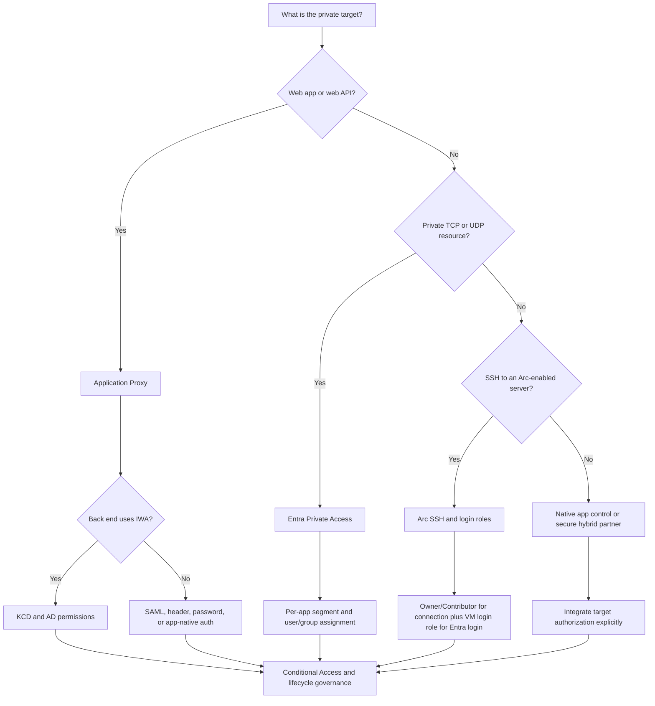
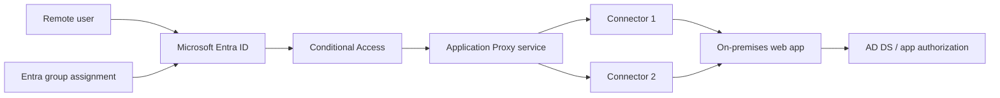
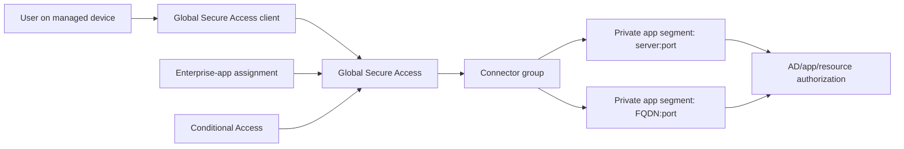
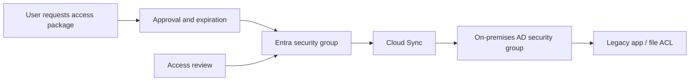

# AZ-305 Study Guide: Recommend a solution for authorizing access to on-premises resources

> **Exam task:** Design authentication and authorization solutions — Recommend a solution for authorizing access to on-premises resources
>
> **Domain:** Design identity, governance, and monitoring solutions
>
> **Estimated reading time:** 45 minutes
>
> **Matched task source:** Exact match in the [official AZ-305 study guide](https://learn.microsoft.com/en-us/credentials/certifications/resources/study-guides/az-305) and the supplied Study Guide Map.
>
> **Scope boundary:** This guide covers identity-aware access paths, Microsoft Entra application assignment and policy, AD DS groups and Windows permissions, legacy authentication bridging, access lifecycle, and privileged access to on-premises servers. It intentionally excludes general Azure resource authorization, broad hybrid network design, identity-management architecture, secrets management, and full monitoring-solution design except where they directly affect access to an on-premises resource.

---

## How to use this guide

Work through the guide in three passes:

1. Learn the four separate decisions in an authorization design: **reachability**, **front-door authorization**, **back-end authorization**, and **access lifecycle**. [Application Proxy](https://learn.microsoft.com/en-us/entra/identity/app-proxy/overview-what-is-app-proxy) and [Microsoft Entra Private Access](https://learn.microsoft.com/en-us/entra/global-secure-access/concept-private-access) primarily secure the path to a resource; [AD DS groups and resource permissions](https://learn.microsoft.com/en-us/windows-server/identity/ad-ds/manage/understand-security-groups) still determine what many legacy resources allow after connection.
2. Memorize the requirement clues in the decision framework and comparison tables. A web application, arbitrary TCP/UDP resource, Windows-integrated application, managed legacy domain, and Arc-enabled server lead to different recommendations. ([Microsoft directory-service comparison](https://learn.microsoft.com/en-us/entra/identity/domain-services/compare-identity-solutions))
3. Practice the scenarios and traps without looking at the answers. The exam task uses the verb **recommend**, so success depends on selecting the smallest complete architecture rather than naming a product in isolation. ([Azure Well-Architected identity and access guidance](https://learn.microsoft.com/en-us/azure/well-architected/security/identity-access))

By the end, you should be able to identify which service establishes access, which identity is evaluated, where the final permission check occurs, how access expires, and which high-availability and licensing dependencies alter the recommendation. Use the inline Microsoft Learn links to investigate a specific limit or implementation detail after you can explain the design in your own words.

Read scenario questions for nouns and constraints:

- **Web, HTTP/HTTPS, external URL, no VPN, legacy intranet app** usually points to [Microsoft Entra application proxy](https://learn.microsoft.com/en-us/entra/identity/app-proxy/overview-what-is-app-proxy).
- **RDP, SSH, SMB, LDAP, TCP/UDP, VPN replacement, per-app network access** usually points to [Microsoft Entra Private Access](https://learn.microsoft.com/en-us/entra/global-secure-access/concept-private-access).
- **IWA, Kerberos, SPN, impersonation** points to [Kerberos constrained delegation through Application Proxy](https://learn.microsoft.com/en-us/entra/identity/app-proxy/how-to-configure-sso-with-kcd).
- **ACL, NTFS, share permission, domain local/global/universal group, forest trust** points to [AD DS security groups](https://learn.microsoft.com/en-us/windows-server/identity/ad-ds/manage/understand-security-groups) and [Windows access control](https://learn.microsoft.com/en-us/windows/security/identity-protection/access-control/access-control).
- **Request, approval, expiration, recertification, joiner/mover/leaver** points to [Microsoft Entra entitlement management](https://learn.microsoft.com/en-us/entra/id-governance/scenarios/entitlement-management-private-access).
- **No public IP or inbound SSH port on an on-premises server** can point to [SSH access for Azure Arc-enabled servers](https://learn.microsoft.com/en-us/azure/azure-arc/servers/ssh-arc-overview).

> **Adjacent task context:** Authentication proves who the subject is; this task decides whether that subject may reach and use an on-premises resource. Azure RBAC for ordinary Azure resources belongs mainly to the sibling task “Recommend a solution for authorizing access to Azure resources.” ([Azure RBAC overview](https://learn.microsoft.com/en-us/azure/role-based-access-control/overview))

---

## Primary source set

### Exam and module sources

- [Official AZ-305 study guide](https://learn.microsoft.com/en-us/credentials/certifications/resources/study-guides/az-305) — confirms the exact domain, skill, and task wording.
- [AZ-305: Design identity, governance, and monitor solutions](https://learn.microsoft.com/en-us/training/paths/design-identity-governance-monitor-solutions/) — the official learning path containing the identity module.
- [Design authentication and authorization solutions](https://learn.microsoft.com/en-us/training/modules/design-authentication-authorization-solutions/) — establishes architect-level IAM, Conditional Access, access-review, application-identity, and Key Vault concepts.
- [Deploy and configure Microsoft Entra Global Secure Access](https://learn.microsoft.com/en-us/training/modules/deploy-configure-microsoft-entra-global-secure-access/) — covers Private Access deployment, Conditional Access, dashboards, logs, and remote-network concepts.

### Core product documentation

- [Microsoft Entra application proxy overview](https://learn.microsoft.com/en-us/entra/identity/app-proxy/overview-what-is-app-proxy)
- [Application Proxy SSO choices](https://learn.microsoft.com/en-us/entra/identity/app-proxy/how-to-configure-sso)
- [Microsoft Entra Private Access](https://learn.microsoft.com/en-us/entra/global-secure-access/concept-private-access)
- [Global Secure Access known limitations](https://learn.microsoft.com/en-us/entra/global-secure-access/reference-current-known-limitations)
- [Enterprise-application assignment methods](https://learn.microsoft.com/en-us/entra/identity/enterprise-apps/ways-users-get-assigned-to-applications)
- [Secure hybrid access and partner integrations](https://learn.microsoft.com/en-us/entra/identity/enterprise-apps/secure-hybrid-access)
- [Compare Microsoft directory-based services](https://learn.microsoft.com/en-us/entra/identity/domain-services/compare-identity-solutions)
- [Govern on-premises AD DS application access with cloud-managed groups](https://learn.microsoft.com/en-us/entra/identity/hybrid/cloud-sync/govern-on-premises-groups)
- [Private Access with entitlement management](https://learn.microsoft.com/en-us/entra/id-governance/scenarios/entitlement-management-private-access)
- [AD DS security groups](https://learn.microsoft.com/en-us/windows-server/identity/ad-ds/manage/understand-security-groups)
- [Windows access control](https://learn.microsoft.com/en-us/windows/security/identity-protection/access-control/access-control)
- [On-premises application provisioning architecture](https://learn.microsoft.com/en-us/entra/identity/app-provisioning/on-premises-application-provisioning-architecture)
- [SSH access to Azure Arc-enabled servers](https://learn.microsoft.com/en-us/azure/azure-arc/servers/ssh-arc-overview)

### Supporting architecture and framework sources

- [Build resilience in on-premises application access](https://learn.microsoft.com/en-us/entra/architecture/resilience-on-premises-access)
- [Azure Well-Architected identity and access strategies](https://learn.microsoft.com/en-us/azure/well-architected/security/identity-access)
- [Microsoft Entra Private Access operations](https://learn.microsoft.com/en-us/entra/global-secure-access/how-to-operate-private-access)
- [AD DS tier model](https://learn.microsoft.com/en-us/windows-server/identity/ad-ds/tier-model)
- [Microsoft Entra monitoring and health](https://learn.microsoft.com/en-us/entra/identity/monitoring-health/overview-monitoring-health)

### Discovery notes from the Study Guide Map

The Study Guide Map identified Application Proxy, Private Access, secure hybrid access partners, Conditional Access, enterprise-app assignment, AD DS, Domain Services, group provisioning to AD DS, application provisioning, entitlement management, access reviews, Arc-enabled servers, RDS, VPN/ExpressRoute, Defender for Cloud Apps, and Well-Architected guidance. Its core coverage observation is correct: the task is fragmented because no single control provides reachability, authentication, fine-grained authorization, lifecycle governance, and resiliency for every on-premises resource type.

The map's forum-discovery note is nonauthoritative. It is useful only because public discussions repeatedly reveal the same candidate confusions: Application Proxy versus Private Access, connectivity versus authorization, Entra assignment versus back-end ACLs, and Domain Services versus self-managed AD DS. All recommendations in this guide are grounded in the official Microsoft sources above.

---

## 1. Exam task scope

The [official AZ-305 study guide](https://learn.microsoft.com/en-us/credentials/certifications/resources/study-guides/az-305) places this task in **Design identity, governance, and monitoring solutions**, under **Design authentication and authorization solutions**. The architect must recommend how a human or workload obtains only the required access to an application, server, file, directory object, or other resource hosted on a private network.

The likely design decisions are:

- Select an identity-aware access path: [Application Proxy for remote web applications](https://learn.microsoft.com/en-us/entra/identity/app-proxy/overview-what-is-app-proxy), [Private Access for private TCP/UDP resources](https://learn.microsoft.com/en-us/entra/global-secure-access/concept-private-access), a [secure hybrid access partner](https://learn.microsoft.com/en-us/entra/identity/enterprise-apps/secure-hybrid-access), or [Arc SSH for an Arc-enabled server](https://learn.microsoft.com/en-us/azure/azure-arc/servers/ssh-arc-overview).
- Select the identity authority and legacy bridge: Microsoft Entra ID, on-premises AD DS, or a [managed Microsoft Entra Domain Services domain](https://learn.microsoft.com/en-us/entra/identity/domain-services/compare-identity-solutions).
- Select the assignment and policy model: direct user assignment, group assignment, [Conditional Access](https://learn.microsoft.com/en-us/entra/identity/conditional-access/overview), access packages, or access reviews.
- Preserve or modernize the final permission check through [AD DS security groups](https://learn.microsoft.com/en-us/windows-server/identity/ad-ds/manage/understand-security-groups), Windows ACLs, application roles, or accounts provisioned into the target system.
- Design connector, directory, and application availability because the [private network connector tier is customer-operated](https://learn.microsoft.com/en-us/entra/global-secure-access/concept-connectors).

In scope:

- Remote and local identity-aware access to resources on private networks.
- Web publishing, TCP/UDP segmentation, enterprise-app assignment, Conditional Access, SSO bridging, group-based authorization, ACLs, access lifecycle, and connector resilience.
- Server access when the on-premises machine is represented by Azure Arc.

Out of scope unless a dependency changes the authorization design:

- General password-hash synchronization, pass-through authentication, federation, and tenant topology belong mainly to **Recommend an authentication solution** or **Recommend an identity management solution**. ([Hybrid identity synchronization](https://learn.microsoft.com/en-us/entra/architecture/sync-directory))
- Subscription, resource-group, Key Vault, Storage, and managed-identity permissions belong mainly to **Recommend a solution for authorizing access to Azure resources**. ([Azure RBAC overview](https://learn.microsoft.com/en-us/azure/role-based-access-control/overview))
- VPN Gateway, ExpressRoute, routing, firewalls, and DNS belong mainly to **Recommend a connectivity solution that connects Azure resources to on-premises networks**, although this task must recognize that [connectivity does not grant application permission](https://learn.microsoft.com/en-us/entra/global-secure-access/tutorial-private-access-app-segmentation).
- Comprehensive observability architecture belongs to **Recommend a monitoring solution**; this guide covers only access-path and identity operations. ([Microsoft Entra monitoring and health](https://learn.microsoft.com/en-us/entra/identity/monitoring-health/overview-monitoring-health))

The mental boundary is simple: **a route answers “can packets arrive?”; authentication answers “who is this?”; authorization answers “may this identity perform this operation?”; governance answers “who approved it, for how long, and how is it removed?”** Microsoft Entra Private Access can restrict which identity may send traffic to an application segment, but the [Windows ACL or application authorization layer](https://learn.microsoft.com/en-us/windows/security/identity-protection/access-control/access-control) can still deny the requested operation.

---

## 2. Product and topic discovery pass

| Product, service, or topic | Why it may be relevant | Primary Microsoft source | In-scope or adjacent? |
|---|---|---|---|
| Microsoft Entra application proxy | Publishes private web apps with Entra preauthentication, assignment, Conditional Access, SSO, and outbound-only connectors. | [Application Proxy overview](https://learn.microsoft.com/en-us/entra/identity/app-proxy/overview-what-is-app-proxy) | Core |
| Microsoft Entra Private Access | Provides per-user, per-app ZTNA to private TCP/UDP destinations and is the modern VPN-replacement pattern. | [Private Access concept](https://learn.microsoft.com/en-us/entra/global-secure-access/concept-private-access) | Core |
| Global Secure Access client | Acquires Private Access traffic on supported endpoints; its platform and DNS constraints can be hard design limits. | [Known limitations](https://learn.microsoft.com/en-us/entra/global-secure-access/reference-current-known-limitations) | Core dependency |
| Enterprise applications | Represents the published/private application and provides assignment, ownership, SSO, policy targeting, and logs. | [Application management](https://learn.microsoft.com/en-us/entra/identity/enterprise-apps/what-is-application-management) | Core |
| Conditional Access | Applies MFA, authentication strength, device, location, and risk-based grant/block decisions before access. | [Conditional Access overview](https://learn.microsoft.com/en-us/entra/identity/conditional-access/overview) | Core |
| Application Proxy SSO | Bridges cloud authentication to password, IWA/KCD, header-based, or SAML authentication on the back end. | [Configure Application Proxy SSO](https://learn.microsoft.com/en-us/entra/identity/app-proxy/how-to-configure-sso) | Core |
| AD DS security groups | Supply SIDs and group membership used by Kerberos applications, shares, servers, and ACLs. | [AD DS security groups](https://learn.microsoft.com/en-us/windows-server/identity/ad-ds/manage/understand-security-groups) | Core |
| Windows ACLs | Enforce object-level permissions, inheritance, ownership, user rights, and auditing after authentication. | [Windows access control](https://learn.microsoft.com/en-us/windows/security/identity-protection/access-control/access-control) | Core |
| Microsoft Entra Cloud Sync group provisioning | Writes cloud-governed security-group membership to AD DS for unchanged Kerberos/LDAP applications. | [Govern on-premises groups](https://learn.microsoft.com/en-us/entra/identity/hybrid/cloud-sync/govern-on-premises-groups) | Core for cloud-governed legacy access |
| Application provisioning | Creates, updates, and removes accounts or entitlements in LDAP, SQL, REST, SOAP, PowerShell, ECMA, or SCIM targets. | [On-premises provisioning architecture](https://learn.microsoft.com/en-us/entra/identity/app-provisioning/on-premises-application-provisioning-architecture) | Core for target-account lifecycle |
| Entitlement management | Adds request, approval, expiration, access-package, and revocation workflows around application or group access. | [Private Access governance scenario](https://learn.microsoft.com/en-us/entra/id-governance/scenarios/entitlement-management-private-access) | Core for governed access |
| Access reviews | Recertifies group or enterprise-application access to remove access that is no longer justified. | [Access reviews overview](https://learn.microsoft.com/en-us/entra/id-governance/access-reviews-overview) | Supporting governance |
| Microsoft Entra Domain Services | Supplies managed Kerberos, NTLM, LDAP, domain join, and Group Policy for legacy workloads moved into Azure. | [Compare identity solutions](https://learn.microsoft.com/en-us/entra/identity/domain-services/compare-identity-solutions) | Adjacent unless workload is being lifted to Azure |
| Secure hybrid access partners | Cover legacy or appliance-integrated scenarios where Microsoft's native publishing pattern is not the best fit. | [Secure hybrid access](https://learn.microsoft.com/en-us/entra/identity/enterprise-apps/secure-hybrid-access) | Supporting alternative |
| Azure Arc-enabled servers SSH | Uses an Azure control plane and optional Entra login for inbound-port-free SSH to an on-premises server. | [Arc SSH overview](https://learn.microsoft.com/en-us/azure/azure-arc/servers/ssh-arc-overview) | Core edge case |
| AD DS tier model and PAWs | Separates privileged identities, administrative devices, and Tier 0/1/2 assets to prevent credential escalation. | [AD DS tier model](https://learn.microsoft.com/en-us/windows-server/identity/ad-ds/tier-model) | Supporting security |
| VPN Gateway and ExpressRoute | Provide network reachability but do not by themselves grant a user permission to an application or object. | [Private Access segmentation guidance](https://learn.microsoft.com/en-us/entra/global-secure-access/tutorial-private-access-app-segmentation) | Adjacent network task |
| Azure Well-Architected Framework | Supplies least-privilege, centralized-identity, separation-of-duties, and access-review design principles. | [Identity and access strategies](https://learn.microsoft.com/en-us/azure/well-architected/security/identity-access) | Supporting framework |

---

## 3. Starting point from Microsoft Learn

Start with the official [Design authentication and authorization solutions](https://learn.microsoft.com/en-us/training/modules/design-authentication-authorization-solutions/) module. It teaches the architectural vocabulary of IAM, Conditional Access, identity protection, access reviews, service principals, managed identities, and Key Vault, but its breadth means that it does not fully teach how to authorize an on-premises application.

Pair it immediately with the [Application Proxy overview](https://learn.microsoft.com/en-us/entra/identity/app-proxy/overview-what-is-app-proxy). Its architecture establishes the exam's classic pattern: a remote user authenticates to Microsoft Entra ID, the cloud service validates the token and policy, a private network connector uses an outbound connection to reach the internal web application, and an optional SSO method completes back-end authentication.

Then study [Microsoft Entra Private Access](https://learn.microsoft.com/en-us/entra/global-secure-access/concept-private-access) and the [Global Secure Access training module](https://learn.microsoft.com/en-us/training/modules/deploy-configure-microsoft-entra-global-secure-access/). Private Access generalizes identity-aware access beyond HTTP/HTTPS to private FQDNs, IP ranges, ports, and TCP/UDP protocols, while per-app enterprise applications allow specific assignments and Conditional Access policies.

The documentation's most useful design diagram is the logical chain:

```text
User/device -> Entra policy and assignment -> cloud access service
            -> outbound connector -> private application/resource
            -> back-end role/group/ACL check
```

The gap in the introductory module is the **double authorization** problem. A user can be assigned to the Entra enterprise application yet lack an AD group or application role required by the target; conversely, a user with a valid back-end account might still be denied at the Entra front door. [Application Proxy troubleshooting](https://learn.microsoft.com/en-us/entra/identity/app-proxy/application-proxy-troubleshoot) explicitly distinguishes assignment failures from missing on-premises access.

> **Exam tip:** If the requirement says “publish an internal web application without opening inbound ports,” choose [Application Proxy with Microsoft Entra preauthentication](https://learn.microsoft.com/en-us/entra/identity/app-proxy/application-proxy-security), not passthrough. Passthrough forfeits the preauthentication barrier and its associated Conditional Access enforcement.

---

## 4. Conceptual foundation

### 4.1 The four gates

An architect should model access as four gates:

1. **Reachability:** Can traffic get from the client to a connector and then to the private resource? [Private network connectors](https://learn.microsoft.com/en-us/entra/global-secure-access/concept-connectors) need outbound service connectivity and line of sight to the back end.
2. **Front-door authorization:** Is the user or group assigned, and does the request satisfy [Conditional Access](https://learn.microsoft.com/en-us/entra/identity/conditional-access/overview)?
3. **Back-end authorization:** Does the application, server, or object permit the user's SID, group, role, or account? [Windows access control](https://learn.microsoft.com/en-us/windows/security/identity-protection/access-control/access-control) evaluates permissions after authentication.
4. **Lifecycle governance:** Who may request access, who approves it, when does it expire, and how is it reviewed or removed? [Entitlement management](https://learn.microsoft.com/en-us/entra/id-governance/scenarios/entitlement-management-private-access) can coordinate assignments, provisioning, groups, approvals, reviews, and expiration.

This model prevents two common design errors. First, assigning a user to Private Access does not automatically change an NTFS ACL. Second, adding a user to an AD group does not make the resource remotely reachable or enforce device compliance.

> **Exam tip:** A complete answer often contains two controls: an identity-aware access path plus a back-end permission mechanism. [Application Proxy security](https://learn.microsoft.com/en-us/entra/identity/app-proxy/application-proxy-security) protects the path; [AD DS groups and ACLs](https://learn.microsoft.com/en-us/windows-server/identity/ad-ds/manage/understand-security-groups) protect the operation.

### 4.2 Identity, security principals, groups, and permissions

AD DS represents users, computers, and groups as security principals with SIDs. A resource's discretionary ACL maps those principals to permissions such as Read, Modify, or Full control, while inheritance propagates permissions through object hierarchies. ([Windows access control](https://learn.microsoft.com/en-us/windows/security/identity-protection/access-control/access-control))

Use [security groups rather than distribution groups](https://learn.microsoft.com/en-us/windows-server/identity/ad-ds/manage/understand-security-groups) because only security-enabled groups can appear in DACLs. Global groups usually collect accounts with a common role, domain local groups commonly receive permissions in the resource domain, and universal groups support forest-wide membership where their replication and scope tradeoffs are acceptable.

Microsoft Entra enterprise-app assignment is a separate control. An administrator can assign users directly, assign supported groups, enable self-service access, or deliver an application role through an access package. ([Assignment methods](https://learn.microsoft.com/en-us/entra/identity/enterprise-apps/ways-users-get-assigned-to-applications))

For a legacy AD-integrated application, [Microsoft Entra Cloud Sync can provision a cloud-governed security group back to AD DS](https://learn.microsoft.com/en-us/entra/identity/hybrid/cloud-sync/govern-on-premises-groups). This preserves the application's existing Kerberos/group check while moving membership governance to Entra.

> **Exam tip:** “Use Entra groups” is incomplete when the application reads on-premises AD membership. The design must include [group provisioning to AD DS](https://learn.microsoft.com/en-us/entra/identity/hybrid/group-writeback-cloud-sync) or an application provisioning/federation method the target understands.

### 4.3 Connectivity is not authorization

A VPN commonly grants a device broad network reachability. [Private Access per-app segmentation](https://learn.microsoft.com/en-us/entra/global-secure-access/tutorial-private-access-app-segmentation) instead maps users and groups to precise destinations, ports, and protocols and can apply application-specific Conditional Access.

Quick Access is useful for migration because it can publish broad IP ranges or wildcard FQDNs, but Microsoft recommends moving toward per-app enterprise applications for least privilege. ([Per-app segmentation tutorial](https://learn.microsoft.com/en-us/entra/global-secure-access/tutorial-private-access-app-segmentation))

Application Proxy is narrower and often simpler for a web application. It is a reverse proxy for HTTP/HTTPS applications, provides an external URL, terminates the client session in the cloud service, and forwards traffic through outbound-only connectors. ([Application Proxy overview](https://learn.microsoft.com/en-us/entra/identity/app-proxy/overview-what-is-app-proxy))

> **Exam tip:** “Replace the VPN for one web app” favors [Application Proxy](https://learn.microsoft.com/en-us/entra/identity/app-proxy/overview-what-is-app-proxy); “replace the VPN for RDP, SSH, SMB, LDAP, or arbitrary private TCP/UDP apps” favors [Private Access](https://learn.microsoft.com/en-us/entra/global-secure-access/concept-private-access).

### 4.4 Authentication bridging and SSO

Microsoft Entra preauthentication establishes the cloud identity and evaluates policy. The back end might still require a different protocol, so [Application Proxy supports several SSO patterns](https://learn.microsoft.com/en-us/entra/identity/app-proxy/how-to-configure-sso):

- **IWA/Kerberos:** the connector uses [Kerberos constrained delegation](https://learn.microsoft.com/en-us/entra/identity/app-proxy/how-to-configure-sso-with-kcd) to obtain a service ticket on the user's behalf.
- **SAML:** Microsoft Entra ID issues SAML assertions, and claims can map the user to application roles. ([SAML with Application Proxy](https://learn.microsoft.com/en-us/entra/identity/app-proxy/conceptual-sso-apps))
- **Header-based:** identity data is supplied in headers for applications designed around trusted header authentication. ([Application Proxy SSO choices](https://learn.microsoft.com/en-us/entra/identity/app-proxy/how-to-configure-sso))
- **Password-based:** credentials can be vaulted for applications that expose username/password fields. ([Plan SSO deployment](https://learn.microsoft.com/en-us/entra/identity/enterprise-apps/plan-sso-deployment))

KCD requires correct SPNs, connector-to-domain-controller reachability, and delegation configuration. [Application Proxy assumes compatible cloud and on-premises identities](https://learn.microsoft.com/en-us/entra/identity/app-proxy/how-to-configure-sso-with-kcd), although a delegated login identity can map alternative identifiers.

> **Exam tip:** KCD is not a general network authorization service. Choose it only when the back-end web application uses IWA and Application Proxy must translate the Entra-authenticated identity into a Kerberos service ticket. ([KCD flow](https://learn.microsoft.com/en-us/entra/identity/app-proxy/how-to-configure-sso-with-kcd))

### 4.5 Control planes and enforcement points

Microsoft Entra ID is the cloud identity and policy plane. Enterprise applications, assignments, Conditional Access, entitlement management, and access reviews live here. ([Application management overview](https://learn.microsoft.com/en-us/entra/identity/enterprise-apps/what-is-application-management))

AD DS is often the legacy identity and authorization-data plane. Domain controllers issue Kerberos tickets containing authorization data, group membership supplies SIDs, and the resource evaluates its ACL or application role. ([AD DS logical model](https://learn.microsoft.com/en-us/windows-server/identity/ad-ds/plan/understanding-the-active-directory-logical-model))

Azure Arc introduces an Azure resource control plane for a non-Azure server. [Arc SSH](https://learn.microsoft.com/en-us/azure/azure-arc/servers/ssh-arc-overview) uses Azure permissions to establish the connection and, on Linux, can use the Virtual Machine Administrator Login or Virtual Machine User Login role for Entra sign-in; Owner or Contributor does not automatically grant operating-system login.

> **Exam tip:** Do not apply Azure RBAC as the universal answer. It is relevant to an Arc representation of a server, but ordinary on-premises files and applications continue to enforce AD/application permissions unless explicitly integrated. ([Arc SSH authorization](https://learn.microsoft.com/en-us/azure/azure-arc/servers/ssh-arc-overview))

### 4.6 Security, governance, cost, and resilience implications

Use Entra preauthentication and Conditional Access to block unauthorized traffic before it reaches the private network. [Passthrough preauthentication does not provide that benefit](https://learn.microsoft.com/en-us/entra/identity/app-proxy/application-proxy-security).

Use access packages and reviews when business owners must approve, expire, or recertify access. [Entitlement management can bundle application assignments and group membership](https://learn.microsoft.com/en-us/entra/id-governance/entitlement-management-access-package-create), while target provisioning removes application accounts or entitlements when access ends.

Licensing can determine feasibility: Application Proxy requires [Microsoft Entra ID P1 or P2](https://learn.microsoft.com/en-us/entra/identity/domain-services/deploy-azure-app-proxy); Private Access requires its standalone entitlement or Microsoft Entra Suite plus a P1/P2 prerequisite; risk-based Conditional Access requires P2; and advanced governance depends on P2, ID Governance, or Suite capabilities. ([Microsoft Entra licensing](https://learn.microsoft.com/en-us/entra/fundamentals/licensing))

Connectors are customer-operated and must be redundant. [At least two connectors in a connector group](https://learn.microsoft.com/en-us/entra/global-secure-access/concept-connectors) avoid a single point of failure and allow service updates without avoidable downtime.

> **Exam tip:** Microsoft manages the cloud service, but the customer still owns connector hosts, back-end applications, directory health, assignments, and licensing. [Connector-group redundancy](https://learn.microsoft.com/en-us/entra/global-secure-access/concept-connector-groups) is therefore part of the authorization architecture.

> **Test yourself**
>
> - A user is assigned to an Application Proxy enterprise app and passes MFA but receives an application “access denied” page. Which gate probably failed?
> - A user is in the correct AD group but cannot reach an SMB server remotely. Which gate is missing?
>
> **Answer guidance:** The first failure is likely the [back-end application's group, role, or ACL check](https://learn.microsoft.com/en-us/entra/identity/app-proxy/application-proxy-troubleshoot). The second has back-end authorization but lacks an access path; [Private Access](https://learn.microsoft.com/en-us/entra/global-secure-access/concept-private-access) is a candidate for identity-aware SMB reachability.

---

## 5. Design decision framework

Use this sequence:

1. Identify the resource and protocol.
2. Decide whether the requirement is remote reachability, authorization, or both.
3. Identify the authoritative identity and the back-end permission store.
4. Choose the front-door service and SSO bridge.
5. Add assignment, Conditional Access, lifecycle governance, and auditing.
6. Remove single points of failure and verify licensing/limitations.



### Hard constraints

- Application Proxy is for web applications and supported web/API patterns; arbitrary private TCP/UDP access requires [Private Access](https://learn.microsoft.com/en-us/entra/global-secure-access/concept-private-access) or another network access design.
- Private Access currently requires client-based traffic acquisition for private traffic, and its [known limitations](https://learn.microsoft.com/en-us/entra/global-secure-access/reference-current-known-limitations) include secure-DNS, NRPT, local-subnet, and remote-network constraints.
- IWA SSO requires KCD prerequisites such as correct identity mapping, SPNs, domain trust/reachability, and connector delegation. ([KCD configuration](https://learn.microsoft.com/en-us/entra/identity/app-proxy/how-to-configure-sso-with-kcd))
- Managed Domain Services cannot provide Domain Admin or Enterprise Admin privileges, schema extensions, or account-based KCD, and forest trusts require Enterprise or higher. ([Directory-service comparison](https://learn.microsoft.com/en-us/entra/identity/domain-services/compare-identity-solutions))
- Microsoft Entra login through Arc SSH is supported for Linux, while Windows Arc SSH uses local-user authentication. ([Arc SSH overview](https://learn.microsoft.com/en-us/azure/azure-arc/servers/ssh-arc-overview))

### Soft preferences

- Prefer Entra preauthentication over passthrough when the application can support it because preauthentication blocks unauthenticated connections before they enter the private network. ([Application Proxy security](https://learn.microsoft.com/en-us/entra/identity/app-proxy/application-proxy-security))
- Prefer per-app Private Access segments over broad Quick Access once discovery and migration are complete. ([Per-app segmentation](https://learn.microsoft.com/en-us/entra/global-secure-access/tutorial-private-access-app-segmentation))
- Prefer group-based assignment over per-user assignment and automate membership lifecycle where possible. ([Well-Architected IAM guidance](https://learn.microsoft.com/en-us/azure/well-architected/security/identity-access))
- Prefer two or more connectors per group and place connector groups close to their applications. ([Connector groups](https://learn.microsoft.com/en-us/entra/global-secure-access/concept-connector-groups))

### “It depends” pivots

- If the application is web-based but complex, uses unsupported origins, or depends on an existing access appliance, evaluate [complex Application Proxy behavior](https://learn.microsoft.com/en-us/entra/identity/app-proxy/application-proxy-configure-complex-application) and [secure hybrid access partners](https://learn.microsoft.com/en-us/entra/identity/enterprise-apps/secure-hybrid-access).
- If the application needs legacy directory protocols only after migration to Azure, consider [Domain Services](https://learn.microsoft.com/en-us/entra/identity/domain-services/overview); if it requires full AD control or schema extensions, use self-managed AD DS.
- If an unchanged on-premises app authorizes only through AD membership, use [group provisioning to AD DS](https://learn.microsoft.com/en-us/entra/identity/hybrid/cloud-sync/govern-on-premises-groups); if it maintains accounts in SQL, LDAP, or another repository, use [application provisioning](https://learn.microsoft.com/en-us/entra/identity/app-provisioning/on-premises-application-provisioning-architecture).
- If administrators need time-bound access to a critical private app, combine per-app Private Access with [PIM-managed group membership](https://learn.microsoft.com/en-us/entra/global-secure-access/how-to-configure-global-access-with-pim).

> **Test yourself**
>
> - A requirement includes an HTTPS app, an SMB share, and an RDP endpoint. Can one Application Proxy design satisfy it?
> - A legacy app needs schema extensions after migration to Azure. Is Domain Services sufficient?
>
> **Answer guidance:** No: Application Proxy covers the web app, while [Private Access](https://learn.microsoft.com/en-us/entra/global-secure-access/concept-private-access) or another private path is needed for nonweb resources. No: schema extension requires [self-managed AD DS rather than Domain Services](https://learn.microsoft.com/en-us/entra/identity/domain-services/compare-identity-solutions).

## 6. Service and feature comparison tables

### 6.1 Choose the access front door

| Option | Best fit | Authorization control point | Strengths | Important limits |
|---|---|---|---|---|
| [Microsoft Entra Application Proxy](https://learn.microsoft.com/en-us/entra/identity/app-proxy/overview-what-is-app-proxy) | Remotely publish an on-premises web application | Enterprise-app assignment and Conditional Access before the connector; the app still enforces its own permissions | No inbound firewall opening, Entra preauthentication, SSO options, connector groups | Not a general TCP/UDP tunnel; passthrough removes cloud preauthentication benefits |
| [Microsoft Entra Private Access](https://learn.microsoft.com/en-us/entra/global-secure-access/concept-private-access) | Give users least-privilege access to private apps and resources over arbitrary supported ports/protocols | Enterprise-app assignment, Conditional Access, and app segments | Identity-centric replacement for broad VPN access; Quick Access aids migration; per-app access supports segmentation | Requires Global Secure Access client-based traffic acquisition for private traffic today; review DNS, routing, and platform limitations |
| [Traditional VPN or private network](https://learn.microsoft.com/en-us/azure/vpn-gateway/vpn-gateway-about-vpngateways) | Broad network reachability, device-to-site access, or protocols/topologies outside Private Access support | VPN policy plus downstream AD/application ACLs | Mature network compatibility and broad protocol support | Network admission does not itself provide per-application authorization; broad reach increases lateral-movement exposure |
| [Secure hybrid access partner](https://learn.microsoft.com/en-us/entra/identity/enterprise-apps/secure-hybrid-access) | Existing ADC, VPN, ZTNA, or network appliance integrated with Entra | Entra policy plus partner enforcement | Preserves required partner capabilities while adding Entra controls | Architecture, support, licensing, and policy behavior vary by partner |
| [Azure Arc-enabled servers SSH](https://learn.microsoft.com/en-us/azure/azure-arc/servers/ssh-arc-overview) | Administrative SSH or PowerShell remoting to an Arc-enabled server | Azure control-plane permission to connect; OS authorization remains separate | No public IP or inbound SSH port; auditable Azure-mediated connection | Entra OS login is Linux-only; it is an administration path, not an end-user application publishing service |

[Application Proxy](https://learn.microsoft.com/en-us/entra/identity/app-proxy/overview-what-is-app-proxy) and [Private Access](https://learn.microsoft.com/en-us/entra/global-secure-access/concept-private-access) both use outbound connectors, but they solve different scopes: the former publishes web applications and the latter provides identity-aware private network access. A [VPN](https://learn.microsoft.com/en-us/azure/vpn-gateway/vpn-gateway-about-vpngateways) establishes private connectivity; authorization must still be designed at the app, server, share, database, or directory layer. [Secure hybrid access](https://learn.microsoft.com/en-us/entra/identity/enterprise-apps/secure-hybrid-access) is the integration path when partner infrastructure is a requirement.

### 6.2 Choose the directory dependency

| Directory option | Select when | Do not select when |
|---|---|---|
| [Existing on-premises AD DS](https://learn.microsoft.com/en-us/windows-server/identity/ad-ds/plan/understanding-the-active-directory-logical-model) | The resource remains on-premises and already depends on Kerberos, NTLM, LDAP, GPO, machine accounts, or AD security groups | The goal is to eliminate the on-premises directory dependency without changing the application |
| [Microsoft Entra Domain Services](https://learn.microsoft.com/en-us/entra/identity/domain-services/overview) | A legacy workload is moving into Azure and needs managed domain join, LDAP, Kerberos/NTLM, or GPO without customer-managed domain controllers | The workload needs Domain Admin/Enterprise Admin, schema extensions, account-based KCD, or an unrestricted extension of the on-premises forest |
| [Self-managed AD DS on Azure VMs](https://learn.microsoft.com/en-us/entra/identity/domain-services/compare-identity-solutions) | Full domain control, schema extension, broader trust design, or unsupported managed-domain features are mandatory | The operational burden of domain-controller patching, backup, security, and recovery is unjustified |
| [Microsoft Entra ID directly](https://learn.microsoft.com/en-us/entra/identity/enterprise-apps/plan-sso-deployment) | The application can use modern federation/OIDC/SAML and app roles or claims | The unchanged application only understands AD DS protocols or local authorization repositories |

The [Microsoft identity solution comparison](https://learn.microsoft.com/en-us/entra/identity/domain-services/compare-identity-solutions) is the decisive source. Domain Services is a standalone managed domain with one-way synchronization from Entra ID; it is not a replica of the on-premises forest. Only identities and selected credential material synchronize, while on-premises OUs, GPOs, computer objects, and other domain configuration do not. ([Domain Services synchronization](https://learn.microsoft.com/en-us/entra/identity/domain-services/synchronization))

### 6.3 Choose how entitlement reaches the resource

| Pattern | Use it for | Key design concern |
|---|---|---|
| [Enterprise-app assignment](https://learn.microsoft.com/en-us/entra/identity/enterprise-apps/ways-users-get-assigned-to-applications) | Who may cross the Entra access gate | Set “assignment required,” prefer groups, and remember assignment is not the same as the app’s internal authorization |
| [Token claims or app roles](https://learn.microsoft.com/en-us/entra/identity/enterprise-apps/plan-sso-deployment) | Modern apps that consume Entra tokens | Keep role semantics stable; avoid token bloat from excessive group claims |
| [Cloud Sync group provisioning to AD DS](https://learn.microsoft.com/en-us/entra/identity/hybrid/cloud-sync/govern-on-premises-groups) | An on-premises app authorizes through AD security-group membership | Direct membership and scale limits; group scope/type; agent resilience; removal behavior |
| [Provisioning agent plus ECMA/SCIM connector](https://learn.microsoft.com/en-us/entra/identity/app-provisioning/on-premises-application-provisioning-architecture) | An on-premises app has its own LDAP, SQL, REST, SOAP, or other user store | Attribute mapping, matching rules, connector credentials, reconciliation, and high availability |
| [Entitlement management/access packages](https://learn.microsoft.com/en-us/entra/id-governance/entitlement-management-access-package-create) | Request, approval, expiration, external-user, and multi-resource lifecycle | Licensing, sponsor/reviewer design, separation of duties, and removal validation |
| [Access reviews](https://learn.microsoft.com/en-us/entra/id-governance/access-reviews-overview) | Periodic proof that continuing access is justified | Reviewer independence, fallback reviewers, auto-apply decisions, and treatment of nonresponse |
| [AD security groups and resource ACLs](https://learn.microsoft.com/en-us/windows-server/identity/ad-ds/manage/understand-security-groups) | File shares, Windows resources, and legacy apps that use Windows authorization | Use role-based groups and least privilege; protect privileged tiers and avoid direct-user ACLs |

An enterprise application is normally available to authenticated tenant users unless assignment is required; enabling the requirement makes assignment the cloud admission gate for supported applications. ([Restrict an app to assigned users](https://learn.microsoft.com/en-us/entra/identity-platform/howto-restrict-your-app-to-a-set-of-users)) The back-end resource must still evaluate a token role, AD group, local role, share/NTFS ACL, or application permission. For lifecycle automation, [Cloud Sync group provisioning](https://learn.microsoft.com/en-us/entra/identity/hybrid/cloud-sync/govern-on-premises-groups) targets AD DS groups, while the [on-premises provisioning architecture](https://learn.microsoft.com/en-us/entra/identity/app-provisioning/on-premises-application-provisioning-architecture) reaches application-specific repositories.

### Exam pattern: similar words, different scopes

| Requirement phrase | Likely answer family |
|---|---|
| “Publish an internal web application without inbound firewall ports” | [Application Proxy](https://learn.microsoft.com/en-us/entra/identity/app-proxy/overview-what-is-app-proxy) |
| “Access private TCP/UDP resources by FQDN/IP and port with per-app Conditional Access” | [Private Access](https://learn.microsoft.com/en-us/entra/global-secure-access/concept-private-access) |
| “The migrated application needs LDAP/Kerberos but no domain-controller management” | [Domain Services](https://learn.microsoft.com/en-us/entra/identity/domain-services/overview) |
| “The application checks membership in an on-premises AD group” | [Cloud Sync group provisioning](https://learn.microsoft.com/en-us/entra/identity/hybrid/cloud-sync/govern-on-premises-groups) plus AD ACLs/app roles |
| “Users need accounts created in an on-premises SQL/LDAP application” | [Entra provisioning agent and appropriate connector](https://learn.microsoft.com/en-us/entra/identity/app-provisioning/on-premises-application-provisioning-architecture) |
| “Request, approve, expire, and review access” | [Entitlement management](https://learn.microsoft.com/en-us/entra/id-governance/entitlement-management-access-package-create) plus access reviews |
| “Connect to an on-premises server without exposing SSH/RDP inbound” | [Arc SSH](https://learn.microsoft.com/en-us/azure/azure-arc/servers/ssh-arc-overview), subject to OS and authentication requirements |

## 7. Architecture patterns

### 7.1 Pattern A — Publish a legacy web application securely



Use this when the resource is a web app and the requirement emphasizes Entra preauthentication, Conditional Access, no inbound connection, and optional SSO. Connectors establish outbound connections, and a connector group routes the published app to an appropriate network location. ([Application Proxy security](https://learn.microsoft.com/en-us/entra/identity/app-proxy/application-proxy-security), [connector groups](https://learn.microsoft.com/en-us/entra/global-secure-access/concept-connector-groups))

Authorization is layered:

1. Group assignment controls who can launch the enterprise app.
2. Conditional Access evaluates user, device, risk, location, authentication strength, or session conditions.
3. Application Proxy preauthentication blocks anonymous access before the private network.
4. The back-end application or Windows resource enforces its own roles and permissions.

For an Integrated Windows Authentication app, configure [Kerberos constrained delegation](https://learn.microsoft.com/en-us/entra/identity/app-proxy/how-to-configure-sso-with-kcd) only after validating SPNs, delegation, identity mapping, and domain trust. Do not choose passthrough merely to avoid fixing SSO: with passthrough, the app—not Entra—authenticates the initial request.

**Pattern assessment:** Required services are Entra ID, Application Proxy, connectors, and the existing web app/directory. Its strengths are preauthentication, no inbound listener, and flexible SSO; its weaknesses and failure modes include web-only scope, unsupported URL/CORS behavior, connector/DNS/KCD failure, and back-end outage. Cost includes P1/P2 entitlement, connector hosts, certificates, and logging. Operations must own connector patching, certificate renewal, and synthetic tests. Secure it with assignment, Conditional Access, isolated connector reachability, and back-end least privilege; monitor Entra sign-ins, audit changes, connector events, and application authorization logs.

### 7.2 Pattern B — Replace broad VPN access with per-app private access



Use [Quick Access](https://learn.microsoft.com/en-us/entra/global-secure-access/how-to-configure-quick-access) to migrate a known broad network scope or validate connectivity, then create [per-app access](https://learn.microsoft.com/en-us/entra/global-secure-access/how-to-configure-per-app-access) segments for least privilege. A segment describes destination, port, and protocol; assigning the associated enterprise app governs who receives that route. The destination itself still requires an authorization mechanism such as an AD group, database role, or application ACL.

Before selecting this pattern, check [current known limitations](https://learn.microsoft.com/en-us/entra/global-secure-access/reference-current-known-limitations), especially client acquisition, DNS over HTTPS/secure DNS, NRPT, overlapping segments, local subnet behavior, and unsupported remote-network acquisition for private traffic. A technically correct service choice can still fail if the client or name-resolution assumptions conflict with the environment.

**Pattern assessment:** Required services are Private Access, Global Secure Access clients, connectors, enterprise apps, and the existing resource identity system. Its strength is per-app segmentation across supported private protocols; its weaknesses and failure modes are endpoint/platform dependency, route or DNS conflict, overlap, connector loss, and target-side denial. Cost includes Private Access/Suite licensing, client deployment, connector hosts, coexistence, and telemetry. Operations must inventory segments, manage client versions, and test route acquisition. Secure with direct group assignment, Conditional Access, narrow segments, and resource ACLs; monitor traffic, audit, client, connector, and target logs.

### 7.3 Pattern C — Govern a legacy app that authorizes by AD group



This pattern separates governance from enforcement. [Entitlement management](https://learn.microsoft.com/en-us/entra/id-governance/entitlement-management-access-package-create) controls request, approval, assignment duration, and policy. [Cloud Sync](https://learn.microsoft.com/en-us/entra/identity/hybrid/cloud-sync/govern-on-premises-groups) provisions the membership that the unchanged application understands. AD DS or the application then enforces access. Validate deprovisioning end to end: removal from the access package must ultimately remove effective access, not merely the cloud group membership.

**Pattern assessment:** Required services are ID Governance, an Entra security group, Cloud Sync agents, AD DS, and the target app/ACL. Its strength is governed lifecycle without rewriting the legacy authorization model; weaknesses and failure modes include license dependency, unsupported nesting/scale, provisioning delay, agent failure, and stale sessions. Cost covers governance entitlement, agent hosts, and review operations. Operations own mappings, approvals, reconciliation, and removal tests. Secure through separation of requester/approver/reviewer and role-based groups; monitor access-package audits, review results, provisioning logs, AD changes, and target access.

### 7.4 Pattern D — Provide a legacy directory to an Azure-migrated workload

Deploy [Microsoft Entra Domain Services](https://learn.microsoft.com/en-us/entra/identity/domain-services/overview) into a dedicated virtual network, enable secure LDAP only when required, and domain-join the migrated workload. Entra users and groups synchronize one way into the managed domain. Use this when the app needs traditional directory protocols but does not need full AD administrative control.

For cross-forest resource access, validate whether a resource forest and outbound trust meet the need. Forest trust capabilities require Enterprise or Premium and have explicit direction and count constraints. ([Forest trust concepts](https://learn.microsoft.com/en-us/entra/identity/domain-services/concepts-forest-trust)) If the app requires unsupported trust behavior, schema changes, or Domain Admin, select self-managed AD DS instead.

**Pattern assessment:** Required services are Domain Services, VNet/DNS, synchronized Entra identities, and the Azure-hosted legacy workload. Its strength is managed LDAP/Kerberos/NTLM/GPO; its weakness is restricted administration and one-way identity/configuration behavior. Failure modes include missing credential hashes, DNS errors, trust limitations, and a nonredundant workload. Cost is hourly by SKU plus replicas, network, and workload resources. Operations own app joins, DNS, secure LDAP certificates, group policy, and recovery exercises. Secure network access and privileged groups; monitor managed-domain health plus workload authentication and authorization.

### 7.5 Pattern E — Administer a server through Azure Arc

Onboard the server to Azure Arc, authorize the operator to initiate the connection at the Azure resource scope, and separately grant the required operating-system login privilege. [Arc SSH](https://learn.microsoft.com/en-us/azure/azure-arc/servers/ssh-arc-overview) avoids a public IP and inbound SSH port. For Linux Entra login, Azure VM Administrator Login or Azure VM User Login roles govern OS login; Owner or Contributor permits the connection operation but does not automatically grant Entra OS login.

This pattern is for administrative access, not for publishing a business app. Windows supports Arc SSH with local accounts; Entra user login through Arc SSH is currently Linux-only.

**Pattern assessment:** Required services are Azure Arc-enabled Servers, a healthy Connected Machine agent, SSH daemon, Azure RBAC, and—on Linux—the Entra SSH login capability. Its strength is Azure-mediated administration without public IP or inbound SSH; its weaknesses and failure modes are agent/Azure egress dependency, Linux-only Entra login, and separate OS permission requirements. Cost includes Arc-related services and monitoring ingestion. Operations own onboarding, agent/extension maintenance, local recovery, and role reviews. Secure with least-scope RBAC and OS roles; monitor Azure activity, Arc connection state, SSH/auth logs, and privileged actions.

## 8. Implementation awareness for architects

AZ-305 tests design judgment rather than portal memorization. Know the sequence, dependencies, and failure boundaries.

### 8.1 Application Proxy sequence

1. Inventory URL behavior, authentication protocol, dependencies, web sockets, APIs, hard-coded links, redirects, and cross-origin requests. Use the [complex-application guidance](https://learn.microsoft.com/en-us/entra/identity/app-proxy/application-proxy-configure-complex-application) and [CORS guidance](https://learn.microsoft.com/en-us/entra/identity/app-proxy/application-proxy-understand-cors-issues) for multi-origin apps.
2. Install at least two connectors on supported Windows Server hosts with outbound reachability to Entra and to the app. Connectors are stateless; connector groups create routing, isolation, and availability boundaries. ([Connector concepts](https://learn.microsoft.com/en-us/entra/global-secure-access/concept-connectors))
3. Publish the internal and external URLs and select Entra preauthentication unless a documented requirement forces passthrough.
4. Configure SSO: password vaulting, header-based, SAML, or KCD/IWA as supported. ([Application Proxy SSO](https://learn.microsoft.com/en-us/entra/identity/app-proxy/how-to-configure-sso))
5. Require assignment, assign groups, and apply Conditional Access.
6. Test both gates independently: a user may pass Entra assignment and still lack back-end authorization.
7. Test connector loss, DNS failure, certificate expiry, and removal of access.

### 8.2 Private Access sequence

1. Discover destinations, protocols, ports, DNS suffixes, overlapping address spaces, user populations, and client platforms.
2. Create connector groups aligned with application location and failure domains.
3. Enable the private-access traffic-forwarding profile and deploy the Global Secure Access client to the scoped population. ([Private Access introduction](https://learn.microsoft.com/en-us/entra/global-secure-access/tutorial-private-access-introduction))
4. Start with Quick Access only when broad migration coverage is intentional.
5. Define per-app segments by FQDN/IP/range and port/protocol, then assign groups to their enterprise applications.
6. Apply Conditional Access to the private-access application resource. ([Target Private Access apps](https://learn.microsoft.com/en-us/entra/global-secure-access/how-to-target-resource-private-access-apps))
7. Validate DNS resolution, traffic acquisition, connector selection, route precedence, and resource-side permissions.
8. Remove obsolete VPN routes only after proving every required workflow and break-glass path.

Nested groups are not supported for per-app assignment behavior described by the [per-app configuration guidance](https://learn.microsoft.com/en-us/entra/global-secure-access/how-to-configure-per-app-access), and configuration propagation is not instantaneous. Design direct group assignment and allow for synchronization during testing.

### 8.3 Directory and provisioning sequence

For Domain Services, choose region, virtual network, DNS integration, SKU, and replica-set design before domain-joining workloads. Credential hashes required for NTLM/Kerberos must exist in the managed domain; cloud-only users may need to change their password, and synchronized users require the configured hybrid hash flow. ([Domain Services synchronization](https://learn.microsoft.com/en-us/entra/identity/domain-services/synchronization))

For Cloud Sync group provisioning:

1. Confirm the app actually consumes AD group membership.
2. Design the cloud group, target AD group or OU behavior, attribute mapping, and scoping.
3. Deploy agents with appropriate directory reachability and permissions.
4. Test additions, removals, direct versus nested membership, disabled users, and large groups.
5. Monitor provisioning cycles and agent health.

[Cloud Sync limitations](https://learn.microsoft.com/en-us/entra/identity/hybrid/cloud-sync/reference-cloud-sync-faq) make direct membership, agent topology, and scale material design inputs. For application-specific repositories, deploy the provisioning agent and select SCIM or an ECMA connector; the agent translates the Entra provisioning request into the protocol the target supports. ([How provisioning works](https://learn.microsoft.com/en-us/entra/identity/app-provisioning/how-provisioning-works))

### 8.4 Conditional Access rollout

Create policies in report-only mode, exclude emergency-access identities, analyze sign-in results, pilot with a representative group, then enforce progressively. Conditional Access requires Entra ID P1 for common controls; risk-based policies require P2 capabilities. ([Conditional Access overview](https://learn.microsoft.com/en-us/entra/identity/conditional-access/overview))

Do not use Conditional Access as the only authorization layer. It decides whether an authentication session may reach a resource under current conditions; it does not replace an application's business roles, AD ACLs, database grants, or OS permissions.

> **Test yourself**
>
> - During implementation, which should be tested separately: cloud assignment or target authorization?
> - Why should a Private Access proof of concept include DNS and secure-DNS behavior?
>
> **Answer guidance:** Test both gates separately because [application assignment](https://learn.microsoft.com/en-us/entra/identity-platform/howto-restrict-your-app-to-a-set-of-users) does not prove target permission. DNS and acquisition behavior are explicit [Private Access limitations](https://learn.microsoft.com/en-us/entra/global-secure-access/reference-current-known-limitations) that can invalidate the design.

## 9. Security, governance, and compliance considerations

### Apply Zero Trust at every gate

The [Azure Well-Architected identity and access guidance](https://learn.microsoft.com/en-us/azure/well-architected/security/identity-access) recommends explicit verification, least privilege, strong authentication, workload identities, and auditable authorization. For an on-premises resource, translate that into controls at four layers:

- **Identity:** require phishing-resistant or appropriately strong authentication for sensitive access; protect privileged identities; use emergency-access accounts with tightly monitored exclusions.
- **Cloud admission:** require enterprise-app assignment and evaluate Conditional Access. Prefer preauthentication over passthrough.
- **Connectivity:** expose only the specific app or segment, not the entire network. Restrict connector egress and locate connectors in a network zone that can reach only required destinations.
- **Resource authorization:** use roles or security groups mapped to business duties. Enforce least privilege in the application, AD DS, file system, database, or operating system.

### Group and role design

Use role-based group nesting where the target supports it: identities belong to business-role groups, and resource permissions are assigned to resource-specific groups. Windows access tokens contain user and security-group SIDs, and the resource compares those SIDs with the discretionary ACL. ([Windows access control](https://learn.microsoft.com/en-us/windows/security/identity-protection/access-control/access-control), [AD DS security groups](https://learn.microsoft.com/en-us/windows-server/identity/ad-ds/manage/understand-security-groups))

Avoid direct user permissions because they obscure intent and make removal difficult. Separate administrative tiers and never let a lower-trust application or host become a path to a higher-trust identity. Microsoft’s [AD DS tier model](https://learn.microsoft.com/en-us/windows-server/identity/ad-ds/tier-model) explains the principle of preventing credential exposure across trust levels.

### Govern the access lifecycle

Use [entitlement management](https://learn.microsoft.com/en-us/entra/id-governance/entitlement-management-access-package-create) when access needs a requestor, approver, justification, activation window, expiration, or external sponsor. Put the Entra group or enterprise application in an access package, then use [access reviews](https://learn.microsoft.com/en-us/entra/id-governance/access-reviews-overview) to revalidate continuing access. For a private app, the package can grant the group that is assigned to the Private Access enterprise application; [the documented scenario](https://learn.microsoft.com/en-us/entra/id-governance/scenarios/entitlement-management-private-access) connects those components.

For high-impact temporary access, use PIM for the governing group and require activation controls. Global Secure Access supports a [PIM-governed access pattern](https://learn.microsoft.com/en-us/entra/global-secure-access/how-to-configure-global-access-with-pim), but propagation and active-session behavior must be tested before relying on it for immediate revocation.

### Protect connectors and synchronization agents

Connector and agent hosts bridge the cloud control plane to private resources. Treat them as privileged infrastructure:

- Use dedicated supported servers, patch them promptly, restrict interactive administration, and monitor configuration changes.
- Grant only required service permissions; do not make the hosts domain controllers unless the product explicitly requires that topology.
- Permit only required outbound destinations and required internal app/directory traffic.
- Keep at least two access connectors per production connector group, and design provisioning-agent resilience according to the connector type.
- Store connector credentials or certificates securely and rotate them under change control.

### External users

Do not assume every access technology supports guests identically. Validate tenant, client, device, licensing, and resource-side identity behavior using the current [Private Access external-user guidance](https://learn.microsoft.com/en-us/entra/global-secure-access/concept-external-user-access). For Application Proxy, external users can be assigned to enterprise applications, but back-end IWA/KCD may still require an identity the on-premises domain can resolve; guest or consumer identities do not automatically become AD accounts. ([Application Proxy troubleshooting](https://learn.microsoft.com/en-us/entra/identity/app-proxy/application-proxy-troubleshoot))

> **Exam tip:** Conditional Access and enterprise-app assignment protect the cloud admission point, but compliance is incomplete unless the private resource also enforces least privilege and the complete access trail is auditable. ([Conditional Access](https://learn.microsoft.com/en-us/entra/identity/conditional-access/overview), [Windows access control](https://learn.microsoft.com/en-us/windows/security/identity-protection/access-control/access-control))

## 10. Resiliency, availability, and disaster recovery considerations

Authorization designs fail both closed and open. A connector outage may block legitimate work; an emergency bypass may unintentionally create excessive access. Document the desired behavior for each dependency.

| Dependency | Resilient design | Failure question to test |
|---|---|---|
| [Application Proxy/Private Access connector](https://learn.microsoft.com/en-us/entra/global-secure-access/concept-connector-groups) | At least two connectors per production group; separate hosts; network reachability to the same required apps | Does traffic fail over, and does an unhealthy connector leave the serving pool? |
| [DNS and certificates](https://learn.microsoft.com/en-us/entra/identity/app-proxy/application-proxy-network-topology) | Redundant resolvers, monitored certificate expiry, documented internal/external names | Can clients and connectors resolve the same intended target after failover? |
| [AD DS/Kerberos](https://learn.microsoft.com/en-us/entra/identity/app-proxy/how-to-configure-sso-with-kcd) | Multiple domain controllers/sites, correct SPNs, time sync, tested trust paths | Does authorization and KCD continue when a DC/site is unavailable? |
| [Domain Services](https://learn.microsoft.com/en-us/entra/identity/domain-services/concepts-replica-sets) | Built-in managed replicas; additional replica sets for supported higher-SKU regional needs; application redundancy | Does the application survive loss of an instance, zone, or region? |
| [Cloud Sync/provisioning agent](https://learn.microsoft.com/en-us/entra/identity/app-provisioning/on-premises-application-provisioning-architecture) | Supported multi-agent topology and documented active/passive or active/active behavior for the chosen connector | Does provisioning resume without duplication, and how are removals reconciled? |
| [Arc-enabled server](https://learn.microsoft.com/en-us/azure/azure-arc/servers/troubleshoot-connectivity) | Healthy Connected Machine agent and outbound Azure connectivity; local emergency procedure | What happens when the server is disconnected from Azure for an extended period? |
| [Governance](https://learn.microsoft.com/en-us/entra/id-governance/access-reviews-overview) | Alternate approvers/reviewers, emergency process, audit trail | Can urgent access be granted without permanently bypassing policy? |

Microsoft recommends multiple Application Proxy connectors and describes resilient on-premises access patterns in the [Entra resilience guidance](https://learn.microsoft.com/en-us/entra/architecture/resilience-on-premises-access). Connector groups provide service-side load distribution and isolation, but the back-end application, domain, DNS, and network must also be redundant. ([Connector groups](https://learn.microsoft.com/en-us/entra/global-secure-access/concept-connector-groups))

Domain Services deploys managed domain controllers per replica set; Enterprise and Premium support additional replica sets, which are billed independently. ([Replica sets](https://learn.microsoft.com/en-us/entra/identity/domain-services/concepts-replica-sets)) A second directory replica does not make a single application server highly available, so design both tiers.

For Arc, the Connected Machine agent depends on outbound Azure connectivity. Monitor connection state and alert on degradation; [Arc connectivity troubleshooting](https://learn.microsoft.com/en-us/azure/azure-arc/servers/troubleshoot-connectivity) documents how disconnection affects management services.

## 11. Cost and licensing considerations

Do not answer licensing questions from memory alone in a real design; verify the tenant agreement and current [Microsoft Entra licensing](https://learn.microsoft.com/en-us/entra/fundamentals/licensing). For exam reasoning, know which choices add a paid control plane and which add infrastructure.

| Component | Cost/licensing driver | Often-overlooked cost |
|---|---|---|
| [Application Proxy](https://learn.microsoft.com/en-us/entra/identity/domain-services/deploy-azure-app-proxy) | Microsoft Entra ID P1 or P2 licensing for users | Connector Windows Server hosts, operations, certificates, and log retention |
| [Conditional Access](https://learn.microsoft.com/en-us/entra/identity/conditional-access/overview) | P1 for common policies; P2 for risk-based capabilities | Pilot/support effort and stronger-authentication deployment |
| [Private Access](https://learn.microsoft.com/en-us/entra/fundamentals/licensing) | Eligible P1/P2 prerequisite plus Microsoft Entra Private Access or Microsoft Entra Suite entitlement | Client deployment, connectors, network egress, migration coexistence, and monitoring |
| [Entitlement management/access reviews](https://learn.microsoft.com/en-us/entra/id-governance/licensing-fundamentals) | P2, ID Governance, or Suite capabilities depending on feature and user population | Reviewer/approver operations and workflow ownership |
| [Domain Services](https://learn.microsoft.com/en-us/entra/fundamentals/licensing) | Hourly charge by SKU; replica sets add charges | Network, secure LDAP certificates, migrated workload redundancy, and backup/restore constraints |
| [Self-managed AD DS](https://learn.microsoft.com/en-us/entra/identity/domain-services/compare-identity-solutions) | VM, disk, backup, network, and operations | Patching, monitoring, security hardening, recovery testing, and specialist labor |
| [Cloud Sync/app provisioning](https://learn.microsoft.com/en-us/entra/identity/app-provisioning/on-premises-application-provisioning-architecture) | Entra licensing and agent hosts vary by scenario | Connector development/support, reconciliation, and target-system administration |
| [Azure Arc SSH](https://learn.microsoft.com/en-us/azure/azure-arc/servers/ssh-arc-overview) | Arc-enabled server and related Azure services | Log Analytics/monitoring ingestion and retention |
| [VPN/partner ZTNA](https://learn.microsoft.com/en-us/entra/identity/enterprise-apps/secure-hybrid-access) | Gateway/appliance, throughput, user or site licensing | Public IP, egress, support contracts, redundant appliances, and broad-network risk |

The cheapest license is not necessarily the lowest-cost architecture. A managed service can eliminate inbound appliances and operational toil, while a seemingly free AD-based pattern may preserve domain-controller, VPN, patching, and incident-response costs. Conversely, do not buy Private Access for a single web app if Application Proxy already satisfies the requirements and licensing.

> **Exam tip:** Match the license to the required control: Application Proxy and common Conditional Access scenarios use P1 capabilities, risk-based policy uses P2, and Private Access needs its own eligible entitlement in addition to the prerequisite identity license. Always verify the current [Microsoft Entra licensing terms](https://learn.microsoft.com/en-us/entra/fundamentals/licensing).

## 12. Monitoring and operational considerations

### What to collect

| Signal | What it proves | Typical response |
|---|---|---|
| [Entra interactive and noninteractive sign-in logs](https://learn.microsoft.com/en-us/entra/identity/monitoring-health/overview-monitoring-health) | Authentication and Conditional Access result | Investigate failed controls, unfamiliar context, or excluded users |
| [Entra audit logs](https://learn.microsoft.com/en-us/entra/global-secure-access/how-to-access-audit-logs) | Changes to apps, assignments, groups, policies, and Global Secure Access configuration | Correlate change actor/time with access impact |
| [Provisioning logs](https://learn.microsoft.com/en-us/entra/identity/monitoring-health/overview-monitoring-health) | Create/update/disable operations and attribute or connector failures | Fix mapping, credentials, connectivity, or target conflicts; retry safely |
| [Application Proxy connector Admin/Session logs](https://learn.microsoft.com/en-us/entra/identity/app-proxy/application-proxy-troubleshoot) | Connector registration, health, service communication, and session failures | Isolate server, DNS, TLS, port, KCD, or back-end reachability issue |
| [Private Access traffic and connector signals](https://learn.microsoft.com/en-us/entra/global-secure-access/how-to-operate-private-access) | Acquired traffic, destination, policy path, connector availability | Validate segment, client forwarding, DNS, connector, and destination ACL |
| [AD DS security/Kerberos events and application audit](https://learn.microsoft.com/en-us/windows/security/identity-protection/access-control/access-control) | Back-end authentication and resource authorization | Distinguish SPN/delegation failure from an ACL/role denial |
| [Arc connection and activity logs](https://learn.microsoft.com/en-us/azure/azure-arc/servers/troubleshoot-connectivity) | Azure control-plane action and agent connectivity | Restore agent egress, extension health, or RBAC configuration |
| [Resource-native audit](https://learn.microsoft.com/en-us/azure/well-architected/security/identity-access) | Actual files, rows, transactions, or admin actions performed | Detect excessive permissions and support forensic reconstruction |

The [Entra monitoring and health overview](https://learn.microsoft.com/en-us/entra/identity/monitoring-health/overview-monitoring-health) covers sign-in, audit, and provisioning logs. Route important logs to durable destinations with retention aligned to investigation and compliance requirements. Global Secure Access [audit-log guidance](https://learn.microsoft.com/en-us/entra/global-secure-access/how-to-access-audit-logs) describes access and routing options; its default interactive retention should not be mistaken for a long-term archive.

The [Private Access operations guide](https://learn.microsoft.com/en-us/entra/global-secure-access/how-to-operate-private-access) recommends monitoring connector state and traffic failures. Connector online state is not by itself an end-to-end test, so use synthetic access checks and, when appropriate, install Azure Monitor Agent to collect host heartbeat and Windows events. [Azure Monitor Agent on Arc-enabled servers](https://learn.microsoft.com/en-us/azure/azure-arc/servers/azure-monitor-agent-deployment) can extend host observability to on-premises servers.

This is the minimum operational monitoring needed to run the access design. Selecting the organization-wide Azure Monitor, Log Analytics workspace, diagnostic-settings, retention, SIEM, workbook, and service-health architecture belongs primarily to the adjacent AZ-305 task **Recommend a monitoring solution**.

### Troubleshooting order

1. **Assignment:** Is the user directly or validly group-assigned, and is “assignment required” configured as intended?
2. **Conditional Access:** Which policy applied, and was the result success, report-only, failure, or not applied?
3. **Client/route:** Was the traffic acquired by Application Proxy or the Global Secure Access client?
4. **Connector:** Is a connector available in the correct group and able to reach the destination?
5. **Authentication delegation:** Did token translation, KCD, SAML, header, or Kerberos SSO succeed?
6. **Resource authorization:** Does the resulting identity have the required AD group, ACL, database role, or app role?
7. **Lifecycle timing:** Has assignment/provisioning propagated, or does an old session/token preserve access temporarily?

This order prevents the classic error of treating an HTTP 403 from the back end as a connector outage or treating successful network reachability as proof of authorization.

> **Test yourself**
>
> - Which logs separate a Conditional Access denial from an on-premises ACL denial?
> - Does a connector showing “active” prove that the application is usable?
>
> **Answer guidance:** Use [Entra sign-in logs](https://learn.microsoft.com/en-us/entra/identity/monitoring-health/overview-monitoring-health) for Conditional Access and target/AD audit logs for the resource decision. No: connector state must be combined with traffic telemetry and an end-to-end test as described in [Private Access operations](https://learn.microsoft.com/en-us/entra/global-secure-access/how-to-operate-private-access).

## 13. Common exam traps

| Trap | Tempting wrong answer | Why it seems reasonable | Why it is wrong or incomplete | Better design choice | Microsoft source |
|---|---|---|---|---|---|
| Service selection | Use a VPN to authorize users | A VPN authenticates a connection and reaches private addresses | Network admission does not grant the target file, app, or database permission | Use the narrowest connectivity path and retain AD/app/database authorization | [Private Access](https://learn.microsoft.com/en-us/entra/global-secure-access/concept-private-access) |
| Feature overlap | Use Application Proxy for every private protocol | It exposes an internal app through Entra and outbound connectors | Application Proxy is for web application publishing, not arbitrary private TCP/UDP | Use Application Proxy for web apps and Private Access for supported nonweb private resources | [Application Proxy overview](https://learn.microsoft.com/en-us/entra/identity/app-proxy/overview-what-is-app-proxy) |
| Scope boundary | Enterprise-app assignment grants the app’s internal role | Both are described as application access | Assignment crosses the cloud gate but might not create an account, AD membership, or app role | Map or provision the identity and enforce back-end roles separately | [Application assignment](https://learn.microsoft.com/en-us/entra/identity/enterprise-apps/ways-users-get-assigned-to-applications) |
| Security misunderstanding | Passthrough is equivalent to preauthentication | Both can publish the same URL | Passthrough allows unauthenticated requests to reach the application tier | Prefer Entra preauthentication unless a hard dependency prevents it | [Application Proxy security](https://learn.microsoft.com/en-us/entra/identity/app-proxy/application-proxy-security) |
| SKU/tier confusion | Domain Services supplies full AD control on any tier | It supports LDAP, Kerberos, NTLM, domain join, and GPO | It withholds Domain/Enterprise Admin and schema extension; forest trusts require Enterprise or higher | Use the appropriate Domain Services SKU only when its managed limits fit; otherwise use self-managed AD DS | [Directory-service comparison](https://learn.microsoft.com/en-us/entra/identity/domain-services/compare-identity-solutions) |
| Identity-model confusion | Nested groups work everywhere | AD commonly relies on nested security groups | Private Access assignment and Cloud Sync scoping/membership have explicit direct-membership constraints | Assign supported groups directly and test effective membership | [Per-app Private Access](https://learn.microsoft.com/en-us/entra/global-secure-access/how-to-configure-per-app-access) |
| Resiliency misunderstanding | Two connectors make the solution highly available | Connectors are stateless and service traffic can fail over | DNS, AD DS, certificates, network paths, and the application may remain single points of failure | Design and test every dependency and failure domain | [Entra resilience guidance](https://learn.microsoft.com/en-us/entra/architecture/resilience-on-premises-access) |
| Operational ownership | Microsoft operates the entire connector path | The cloud access service is Microsoft-managed | The customer owns connector hosts, patching, private DNS/reachability, and the back-end | Define cloud/customer ownership and monitor end to end | [Connector concepts](https://learn.microsoft.com/en-us/entra/global-secure-access/concept-connectors) |
| Cost misunderstanding | Domain Services is cheaper because it eliminates domain-controller VMs | Managed operations reduce customer effort | It is billed hourly by SKU and extra replica sets add cost; the workload still needs redundancy | Compare total license, compute, replica, network, logging, and operations cost | [Entra licensing](https://learn.microsoft.com/en-us/entra/fundamentals/licensing) |
| Privilege confusion | Arc Owner automatically grants Linux login | Owner can authorize the connection action | Entra OS login requires the applicable VM Login role; connection and login are separate | Grant narrow connection scope and the correct OS login role | [Arc SSH authorization](https://learn.microsoft.com/en-us/azure/azure-arc/servers/ssh-arc-overview) |
| **Edge case** | Route Private Access through remote-network connectivity without endpoint clients | Global Secure Access also supports remote-network connectivity | Current private-traffic acquisition is client-based and remote-network acquisition is not supported for this case | Deploy supported clients or retain a different private-connectivity path | [Current known limitations](https://learn.microsoft.com/en-us/entra/global-secure-access/reference-current-known-limitations) |
| Revocation timing | Removing a group membership ends access immediately | The entitlement disappears from the source directory | Synchronization, tokens, sessions, caches, and target ACL evaluation can delay effective removal | Define a revocation SLA and test removal through every layer | [Cloud Sync FAQ](https://learn.microsoft.com/en-us/entra/identity/hybrid/cloud-sync/reference-cloud-sync-faq) |

## 14. Scenario-based design examples

### Scenario 1 — Default choice for an internal web app

**Requirement:** Remote employees need an on-premises HR web application. The company wants MFA, compliant-device enforcement, no inbound firewall rule, and seamless Windows SSO. The app uses IWA and AD groups.

**Constraints:** The app remains on-premises, uses HTTP/HTTPS plus IWA, and must not accept an inbound Internet connection.

**Recommendation:** Publish it with Application Proxy using Entra preauthentication, apply group assignment and Conditional Access, deploy at least two connectors, and configure KCD for IWA. Retain AD group-based roles in the app.

**Why:** The workload is web-based, the cloud front door supplies the requested identity controls, and outbound connectors avoid inbound exposure. KCD bridges the Entra sign-in to the IWA back end. ([Application Proxy overview](https://learn.microsoft.com/en-us/entra/identity/app-proxy/overview-what-is-app-proxy), [KCD](https://learn.microsoft.com/en-us/entra/identity/app-proxy/how-to-configure-sso-with-kcd))

**Alternatives considered and rejected:** Private Access is unnecessary unless the app has nonweb dependencies that cannot traverse Application Proxy. A VPN gives broader network access than the requirement calls for.

**Exam interpretation:** “Web,” “IWA,” “Conditional Access,” and “no inbound ports” strongly signal Application Proxy with KCD; still name the AD/app authorization layer.

### Scenario 2 — Cost-conscious single web application

**Requirement:** One internal web app must be available to licensed Entra ID P1 users. No TCP/UDP resources need remote access, and the organization wants minimal new infrastructure.

**Constraints:** Reuse existing P1 licensing, support only one web app, and avoid a new broad network-access service.

**Recommendation:** Use Application Proxy with the existing P1 entitlement and two modest connector hosts. Require assignment and apply the existing Conditional Access baseline.

**Why:** Application Proxy directly fits the protocol and avoids adding a VPN gateway or Private Access entitlement solely for this app. Infrastructure and operational costs still include connector hosts and monitoring, but the design reuses the current license. Verify current entitlements in the [Entra licensing reference](https://learn.microsoft.com/en-us/entra/fundamentals/licensing).

**Alternatives considered and rejected:** Domain Services does not publish the app and would add an unrelated managed directory charge; Private Access adds capability and licensing the requirement does not need.

**Exam interpretation:** When two services work, choose the narrowest one that meets protocol and policy requirements at the lower total cost.

### Scenario 3 — Security-first VPN reduction

**Requirement:** Engineers currently receive a VPN route to an entire data-center subnet but need only Git over SSH, an internal database port, and one HTTPS management endpoint. Access must require managed devices and be reviewable.

**Constraints:** Multiple nonweb protocols are required, subnet-wide reach is prohibited, and access needs device and lifecycle controls.

**Recommendation:** Deploy Private Access, initially validate with a narrowly scoped Quick Access configuration, then create separate per-app segments and group assignments. Apply Conditional Access for compliant devices and strong authentication. Govern group membership with access packages and recurring reviews.

**Why:** The key requirement is arbitrary private protocols with application-level segmentation rather than broad network admission. Private Access supplies the scoped route; the servers and database must continue to enforce their own accounts and permissions. ([Private Access](https://learn.microsoft.com/en-us/entra/global-secure-access/concept-private-access), [app segmentation](https://learn.microsoft.com/en-us/entra/global-secure-access/tutorial-private-access-app-segmentation))

**Alternatives considered and rejected:** Application Proxy cannot publish Git SSH or the database protocol. Keeping the full-subnet VPN route violates least privilege.

**Exam interpretation:** “Arbitrary ports” plus “per-resource access” selects Private Access; Conditional Access and entitlement governance complete the policy, while target permissions remain necessary.

### Scenario 4 — Resilient publication across two sites

**Requirement:** A business-critical web application has active instances in two on-premises sites. Remote access must survive loss of a connector host and should be isolated from lower-trust apps.

**Constraints:** The design must tolerate connector-host and site dependencies without mixing trust zones or implying that connector redundancy protects the application tier.

**Recommendation:** Use Application Proxy with dedicated connector groups aligned to application network reachability, at least two connectors per serving group, redundant DNS and AD dependencies, and a tested application failover design. Monitor connector and synthetic application health.

**Why:** Connector redundancy protects only the access bridge. Dedicated groups limit lateral reach and let the service select healthy connectors, while the application and supporting services require their own resilience. ([Connector groups](https://learn.microsoft.com/en-us/entra/global-secure-access/concept-connector-groups), [resilience guidance](https://learn.microsoft.com/en-us/entra/architecture/resilience-on-premises-access))

**Alternatives considered and rejected:** Placing two connectors on the same failure-prone host or network does not meet the site-loss requirement; a single shared connector group may also expand unnecessary network reach.

**Exam interpretation:** Resiliency requirements change topology, not the core product choice. Name every dependent tier and failure domain.

### Scenario 5 — Edge case: users behind a branch router without clients

**Requirement:** Branch users need a private TCP application. The security team proposes Private Access through Global Secure Access remote-network connectivity and forbids endpoint software.

**Constraints:** The application is nonweb, endpoint clients are forbidden, and the proposed traffic-acquisition method must be supported now.

**Recommendation:** Do not select that design without a supported acquisition path. The current [known-limitations reference](https://learn.microsoft.com/en-us/entra/global-secure-access/reference-current-known-limitations) states that private traffic is acquired through the Global Secure Access client rather than remote networks. Either permit supported clients, use another private-connectivity technology, or revisit the application architecture.

**Why:** This is a hard product constraint, not a preference. A good exam answer rejects a nominally attractive service when a stated limitation conflicts with the requirement.

**Alternatives considered and rejected:** Application Proxy cannot carry the TCP application; client-based Private Access violates the no-client constraint. A supported VPN/partner path or requirement change remains viable.

**Exam interpretation:** Current product limits override the default least-privilege recommendation.

### Scenario 6 — Legacy authorization synchronized from the cloud

**Requirement:** Access to an on-premises document system is controlled exclusively by an AD security group. Managers must approve requests, access must expire after 90 days, and reviewers must recertify access quarterly.

**Constraints:** The application cannot consume Entra assignment directly; AD group membership is its only authorization source, and lifecycle enforcement must be automated.

**Recommendation:** Create an access package that grants membership in an Entra security group, use Cloud Sync group provisioning to represent that entitlement in the required on-premises AD security group, and run quarterly access reviews with decision application. Validate the full removal path.

**Why:** Entitlement management governs the lifecycle; Cloud Sync translates the cloud entitlement into the authorization primitive the unchanged app understands. ([Govern on-premises groups](https://learn.microsoft.com/en-us/entra/identity/hybrid/cloud-sync/govern-on-premises-groups), [access reviews](https://learn.microsoft.com/en-us/entra/id-governance/access-reviews-overview))

**Alternatives considered and rejected:** Enterprise-app assignment alone cannot update an AD group consumed by the document system. Manual group administration cannot reliably enforce approval, expiration, and recurring review.

**Exam interpretation:** Trace the entitlement all the way from governance policy to the exact group the legacy resource evaluates.

### Scenario 7 — Adjacent but not the same task

**Requirement:** A legacy application is being moved from on-premises to Azure VMs. It requires LDAP, domain join, Kerberos, and GPO but no schema extension or Domain Admin. The team does not want to operate domain controllers.

**Constraints:** Legacy protocols are mandatory, full AD administrative control is not, and the destination is Azure rather than the existing data center.

**Recommendation:** Use Microsoft Entra Domain Services and domain-join the Azure VMs, subject to credential synchronization, network, DNS, and SKU validation.

**Why:** This is a directory-dependency decision adjacent to authorizing access. The app’s resource permissions still need groups and ACLs, but Domain Services supplies the managed legacy protocols. ([Domain Services overview](https://learn.microsoft.com/en-us/entra/identity/domain-services/overview))

**Alternatives considered and rejected:** Application Proxy might publish the web tier but cannot replace the required LDAP/domain-join dependency. Self-managed AD DS adds unnecessary operations when no unsupported managed-domain capability is required.

**Exam interpretation:** This is primarily the adjacent identity-management/directory decision; authorization still requires groups and ACLs afterward.

### Scenario 8 — Administrative access to an isolated Linux server

**Requirement:** Operators must administer an on-premises Linux server without a public IP or open inbound SSH port. Connections must be controlled through Azure, and users should sign in with Entra accounts.

**Constraints:** The target is Linux, the workflow is administrative SSH, public/inbound exposure is prohibited, and Entra OS login is required.

**Recommendation:** Onboard the server to Azure Arc, use SSH access through Arc, grant narrowly scoped connection permission, and assign Azure VM User Login or Administrator Login according to duties.

**Why:** Arc SSH provides the required Azure-mediated administrative path, and Linux supports Entra login. Connection authorization and OS login authorization are deliberately separate. ([Arc SSH](https://learn.microsoft.com/en-us/azure/azure-arc/servers/ssh-arc-overview))

**Alternatives considered and rejected:** Application Proxy is an end-user web publishing service; it is not an SSH administration channel. A conventional public SSH endpoint violates the exposure constraint.

**Exam interpretation:** Separate permission to initiate the Azure-mediated connection from permission to sign in to the operating system.

## 15. Test yourself

Answer each question before expanding the explanation mentally. The goal is to identify the control boundary, not merely name a product.

### Checkpoint A — Foundations

**1. A user is assigned to an Application Proxy enterprise app but receives an access-denied page from the internal application after successful Entra authentication. What should you inspect first?**

Inspect the back-end identity mapping and application authorization: KCD/SPN behavior for IWA, the identity presented to the app, and its AD group or internal role. Successful assignment proves only that the user crossed the Entra gate.

**2. Why is a VPN not a complete answer to “authorize access to an on-premises file share”?**

A VPN supplies a network path. AD authentication, share permissions, NTFS ACLs, and group membership determine whether the user can read or change the files.

**3. When is passthrough in Application Proxy justified?**

Only when the application must perform the initial authentication and cannot use a supported Entra preauthentication design. It sacrifices the ability to block unauthenticated requests at the cloud edge, so document and mitigate that risk. ([Application Proxy security](https://learn.microsoft.com/en-us/entra/identity/app-proxy/application-proxy-security))

### Checkpoint B — Product selection

**4. Users need RDP, SSH, and a custom TCP port to specific on-premises servers, with per-resource Conditional Access. Application Proxy or Private Access?**

Private Access, because the requirement includes nonweb private protocols and per-app segments. Confirm client, DNS, platform, and current product limitations before finalizing.

**5. A migrated Azure VM application requires LDAP and Kerberos and cannot be modernized. It needs no schema extension or Domain Admin. Which directory option minimizes operations?**

Microsoft Entra Domain Services. It supplies managed legacy directory protocols without customer-managed domain controllers. Verify synchronization and network/DNS prerequisites.

**6. The same application requires a custom schema extension and Enterprise Admin. What changes?**

Use self-managed AD DS because those controls are unavailable in Domain Services. ([Identity solution comparison](https://learn.microsoft.com/en-us/entra/identity/domain-services/compare-identity-solutions))

**7. An on-premises application stores its user accounts in SQL and does not read AD group membership. Is Cloud Sync group provisioning sufficient?**

No. Use Entra application provisioning with the on-premises agent and a connector that can write to the target repository. Cloud Sync group provisioning addresses AD group-based authorization.

### Checkpoint C — Design quality

**8. What are the four independent gates you should name in a hybrid-access design?**

Identity authentication, cloud admission/Conditional Access, connectivity through the publishing or private-access plane, and resource-side authorization.

**9. What must be redundant besides two connectors?**

DNS, outbound network paths, domain controllers/Kerberos dependencies, certificates, connector hosts/failure domains, the application tier, its data tier, and governance/emergency processes.

**10. Why should Quick Access normally be transitional?**

It is useful for discovery or VPN migration but represents a broader destination scope. Per-app segments better express least privilege and allow distinct assignments and Conditional Access.

**11. What is the safest order for troubleshooting a denied request?**

Assignment, Conditional Access, client/route acquisition, connector, delegated authentication/SSO, resource authorization, then synchronization/session timing.

**12. How do entitlement management and access reviews differ?**

Entitlement management packages resources into request/approval/expiration policies. Access reviews periodically decide whether existing access should continue. They complement rather than replace one another.

### Mini case

Contoso has these requirements:

- Vendors access one on-premises IWA web application.
- Employees access an internal SQL endpoint from managed laptops.
- Access expires automatically at contract or project end.
- The organization cannot expose inbound data-center ports.

**Propose the design.**

Use Application Proxy with preauthentication for the web app and evaluate guest-to-back-end identity constraints before selecting KCD. Use Private Access per-app segmentation for the SQL endpoint, with the Global Secure Access client on supported managed endpoints. Put assignments into access packages with expiration and reviews. Deploy redundant outbound connectors and preserve database/application authorization. The lifecycle mechanism grants group or app assignment; it does not itself create the correct vendor identity in AD or database roles.

## 16. Adjacent task context

The exam blueprint places this task under **Design authentication and authorization solutions**. Distinguish it from its siblings so that a broad identity question does not pull you into the wrong design.

| Adjacent task or topic | Why it overlaps | What belongs in this task | What belongs elsewhere |
|---|---|---|---|
| [Recommend an authentication solution](https://learn.microsoft.com/en-us/training/modules/design-authentication-authorization-solutions/) | Authentication establishes the identity used for authorization | App access gate, SSO bridge, and the identity ultimately checked by the on-premises resource | Federation, passwordless, MFA method, and tenant-wide authentication design |
| [Recommend an identity management solution](https://learn.microsoft.com/en-us/entra/architecture/sync-directory) | Users, groups, and synchronization supply security principals | How those principals receive effective app, AD, OS, or data permissions | Full directory topology, source of authority, identity creation, and broad synchronization architecture |
| [Authorize access to Azure resources](https://learn.microsoft.com/en-us/credentials/certifications/resources/study-guides/az-305) | Arc connection and some control-plane actions use Azure RBAC | Arc connection scope and its boundary from OS login; enterprise-app assignment | General Azure RBAC roles/scopes, custom roles, ABAC, and managed-identity authorization |
| [Manage secrets, certificates, and keys](https://learn.microsoft.com/en-us/credentials/certifications/resources/study-guides/az-305) | Connectors and apps depend on credentials and certificates | The authorization impact of credential or certificate availability | Vault architecture, rotation platform, HSM, cryptographic key lifecycle |
| [Identity governance](https://learn.microsoft.com/en-us/entra/id-governance/entitlement-management-access-package-create) | Requests, approvals, expiration, PIM, and reviews control entitlement lifecycle | Governance that grants/removes the groups or app assignments used for private access | Organization-wide governance program and unrelated Azure policy/compliance structure |
| [Logging and monitoring](https://learn.microsoft.com/en-us/entra/identity/monitoring-health/overview-monitoring-health) | Evidence is required to operate and audit access | Minimum identity, connector, provisioning, and resource signals | Enterprise workspace, collection, retention, SIEM, workbook, and service-health architecture |
| [Network connectivity](https://learn.microsoft.com/en-us/azure/vpn-gateway/vpn-gateway-about-vpngateways) | A route is required before a resource can evaluate permissions | Selecting an identity-aware publishing/private-access path and separating it from authorization | Full VPN, ExpressRoute, Virtual WAN, routing, DNS, firewall, and hybrid topology design |

Use the current [AZ-305 study guide](https://learn.microsoft.com/en-us/credentials/certifications/resources/study-guides/az-305) as the authoritative skill outline. The relevant learning module is [Design authentication and authorization solutions](https://learn.microsoft.com/en-us/training/modules/design-authentication-authorization-solutions/); the [Global Secure Access module](https://learn.microsoft.com/en-us/training/modules/deploy-configure-microsoft-entra-global-secure-access/) provides focused coverage for Private Access.

### Cross-task clues

- A question centered on **protocol, port, route, or site** begins as connectivity, but “who can use that route” brings it back to authorization.
- A question centered on **MFA or passwordless** begins as authentication; “which users may reach the app” requires assignment and authorization.
- A question centered on **Azure VM control-plane actions** uses Azure RBAC; **signing in to the guest OS** is another authorization decision.
- A question centered on **request/approve/expire/review** is identity governance; the resulting group, app assignment, role, or ACL is the enforcement link.
- A question centered on **LDAP/Kerberos dependency after migration** is directory architecture; it still requires resource permissions after the directory exists.

## 17. Final exam-focused summary

The durable design rule is:

> Select the narrowest supported access path, enforce identity policy before private connectivity, and preserve explicit least-privilege authorization at the resource.

Remember these distinctions:

1. **Application Proxy** publishes on-premises web applications through outbound connectors and can apply Entra preauthentication, assignment, Conditional Access, and SSO.
2. **Private Access** supplies identity-aware access to private destinations and arbitrary supported ports/protocols; move from broad Quick Access toward per-app segmentation.
3. **VPN/private networking** supplies reachability, not the final resource permission.
4. **Enterprise-app assignment** controls the cloud gate; it does not automatically create a back-end account or grant an application role.
5. **AD groups and ACLs** remain the authorization language for many Windows and legacy resources.
6. **Cloud Sync group provisioning** carries a cloud-governed entitlement into AD group membership; the provisioning agent/SCIM/ECMA family handles application-specific repositories.
7. **Entitlement management, PIM, and access reviews** govern request, approval, temporary activation, expiration, and recertification.
8. **Domain Services** is a managed standalone domain for Azure workloads with legacy protocol needs, not a full extension of the on-premises forest.
9. **Arc SSH** is an Azure-mediated server administration path; connection permission and operating-system login permission are separate.
10. **Resilience is end to end:** redundant connectors do not fix a single application server, DNS resolver, domain dependency, or approval bottleneck.

When two answers look plausible, identify the hard constraint: web versus arbitrary protocol, cloud versus on-premises location, client availability, directory administrative control, identity type, assignment behavior, or current product limitation. Then compare lifecycle, security, resilience, and total cost.

### Must-know decisions and services

- Choose [Application Proxy](https://learn.microsoft.com/en-us/entra/identity/app-proxy/overview-what-is-app-proxy) for an on-premises web app and [Private Access](https://learn.microsoft.com/en-us/entra/global-secure-access/concept-private-access) for supported private nonweb protocols or identity-based VPN reduction.
- Choose [Domain Services](https://learn.microsoft.com/en-us/entra/identity/domain-services/overview) only for Azure-hosted workloads whose legacy directory needs fit its managed limits; choose self-managed AD DS when full control is mandatory.
- Choose [Cloud Sync group provisioning](https://learn.microsoft.com/en-us/entra/identity/hybrid/cloud-sync/govern-on-premises-groups) when the target evaluates AD membership, and application provisioning when it evaluates another user repository.
- Choose [Arc SSH](https://learn.microsoft.com/en-us/azure/azure-arc/servers/ssh-arc-overview) for Azure-mediated server administration, not business-application publication.

### Must-know limitations and tradeoffs

- App assignment is not the back-end role, network access is not resource authorization, and successful SSO is not proof of permission.
- Preauthentication improves security; passthrough preserves difficult compatibility at the cost of the cloud authentication barrier.
- Per-app segmentation improves least privilege; broad Quick Access or VPN scope can simplify migration at the cost of exposure.
- Managed services reduce infrastructure operations but introduce licensing, feature, client, synchronization, and control-plane dependencies.
- Revocation and failover are only as fast and reliable as the slowest assignment, sync, token, session, DNS, connector, directory, and application layer.

### Common requirement clues

“Internal web app” points to Application Proxy; “FQDN/IP plus port” points to Private Access; “IWA” points to KCD prerequisites; “LDAP/Kerberos after Azure migration” points to Domain Services evaluation; “approve, expire, review” points to entitlement governance; and “no inbound SSH” points to Arc SSH.

### Before the exam, make sure you can

- [ ] Draw the four gates and name the owner of each.
- [ ] Explain Application Proxy versus Private Access versus VPN in one sentence each.
- [ ] Explain Entra assignment versus AD/app/database authorization.
- [ ] Select Domain Services versus self-managed AD DS from a hard requirement.
- [ ] Trace access-package removal to effective resource revocation.
- [ ] Identify connector, DNS, directory, app, licensing, monitoring, and current-limit dependencies.

## 18. Quick-reference tables

### One-minute selection matrix

| Need | First candidate | Add these controls |
|---|---|---|
| Publish an on-premises web app | [Application Proxy](https://learn.microsoft.com/en-us/entra/identity/app-proxy/overview-what-is-app-proxy) | Assignment required, CA, supported SSO, redundant connectors, back-end roles |
| Reach a private nonweb app from users | [Private Access](https://learn.microsoft.com/en-us/entra/global-secure-access/concept-private-access) | Client acquisition, per-app segment, CA, connector group, target authorization |
| Retain broad site/device networking | [VPN/ExpressRoute/partner access](https://learn.microsoft.com/en-us/entra/identity/enterprise-apps/secure-hybrid-access) | Network segmentation plus resource identity and ACLs |
| Modernize authentication for an app behind an existing appliance | [Secure hybrid access integration](https://learn.microsoft.com/en-us/entra/identity/enterprise-apps/secure-hybrid-access) | Entra CA/SSO plus partner policy and app authorization |
| Give an Azure-migrated legacy app LDAP/Kerberos | [Domain Services](https://learn.microsoft.com/en-us/entra/identity/domain-services/overview) | VNet/DNS, credential synchronization, SKU/replicas, app ACLs |
| Require full AD control in Azure | [Self-managed AD DS](https://learn.microsoft.com/en-us/entra/identity/domain-services/compare-identity-solutions) | Secure DC operations, backup, monitoring, trusts, tiering |
| Drive legacy AD authorization from cloud governance | [Access package → Entra group → Cloud Sync → AD group](https://learn.microsoft.com/en-us/entra/identity/hybrid/cloud-sync/govern-on-premises-groups) | Approval, expiration, review, removal testing |
| Provision accounts into a private app repository | [Entra provisioning service + agent + connector](https://learn.microsoft.com/en-us/entra/identity/app-provisioning/on-premises-application-provisioning-architecture) | Mappings, matching, credentials, HA, reconciliation |
| Administer an on-premises Linux server through Azure | [Arc SSH](https://learn.microsoft.com/en-us/azure/azure-arc/servers/ssh-arc-overview) | Azure connection scope, Entra OS login role, agent health, audit |

### Capability check

| Capability | [Application Proxy](https://learn.microsoft.com/en-us/entra/identity/app-proxy/overview-what-is-app-proxy) | [Private Access](https://learn.microsoft.com/en-us/entra/global-secure-access/concept-private-access) | [Domain Services](https://learn.microsoft.com/en-us/entra/identity/domain-services/compare-identity-solutions) | [Arc SSH](https://learn.microsoft.com/en-us/azure/azure-arc/servers/ssh-arc-overview) |
|---|:---:|:---:|:---:|:---:|
| Publishes web app | Yes | Provides network path | No | No |
| Arbitrary private TCP/UDP path | No | Yes, within current support | No | SSH-based admin only |
| Entra Conditional Access at access plane | Yes | Yes | Not as an app-publishing front door | Azure control-plane policy/RBAC pattern |
| Legacy LDAP/Kerberos directory | Uses existing directory for SSO as needed | Resource may use existing directory | Yes | No |
| Avoids inbound connector firewall port | Yes | Yes | Not its purpose | Yes for SSH connection |
| Replaces resource ACL/role | No | No | No | No |

### Key limitations worth memorizing

- Application Proxy is a web publishing service; preauthentication provides the strongest cloud gate.
- Private Access design must validate endpoint-client and DNS behavior against the current limitations.
- Domain Services has no Domain/Enterprise Admin or schema extension, and its synchronization is one way.
- Cloud Sync and app assignment designs must account for nested/direct membership and propagation.
- Arc SSH Entra login is Linux-only; Windows uses local-user authentication through this path.
- Assignment, provisioning, synchronization, tokens, and sessions can have different revocation timing.

## 19. Final validation

Use this checklist before accepting a design:

### Requirements and scope

- [ ] Is the resource web, TCP/UDP, Windows/SMB, database, directory-dependent, or administrative?
- [ ] Are every protocol, port, FQDN/IP, client platform, user type, and location documented?
- [ ] Is the requirement connectivity, authentication, cloud admission, resource authorization, lifecycle governance, or a combination?
- [ ] Are hard constraints separated from preferences?

### Identity and authorization

- [ ] Is “assignment required” intentionally set for enterprise applications?
- [ ] Are group assignments preferred over direct users, with nesting support verified?
- [ ] Does the back-end receive an identity it can resolve and authorize?
- [ ] Are resource roles, AD groups, database grants, share permissions, and NTFS ACLs least-privilege?
- [ ] Are privileged access and emergency access separated, time-bound where possible, and monitored?

### Access path

- [ ] Does Application Proxy cover every app behavior, origin, API, redirect, and SSO requirement?
- [ ] Does Private Access support the required client, DNS, route, and traffic-acquisition topology today?
- [ ] Are segments narrow and free from unintended overlaps?
- [ ] Are connectors isolated by purpose and able to reach only necessary resources?
- [ ] Are at least two connectors deployed per production serving group?

### Directory and lifecycle

- [ ] If Domain Services is proposed, have unsupported administrative, schema, KCD, trust, and synchronization assumptions been eliminated?
- [ ] Does Cloud Sync or application provisioning target the repository the app actually evaluates?
- [ ] Are create, update, disable, delete, nested-membership, and reconciliation behaviors tested?
- [ ] Are requests, approvals, expiration, access reviews, and external-user cleanup owned?
- [ ] Is the effective revocation time known across assignment, sync, token, session, and resource caches?

### Operations

- [ ] Are connector, DNS, AD, certificate, network, app, and data-tier failures tested?
- [ ] Are sign-in, audit, provisioning, connector, AD, Arc, and application logs retained centrally?
- [ ] Are alerts tied to an owner and a tested response procedure?
- [ ] Are licensing prerequisites and full operational costs verified?
- [ ] Is there a safe migration, rollback, and emergency-access path?

If any checked design still relies on “the network is private, therefore the user is authorized,” the design is incomplete.
