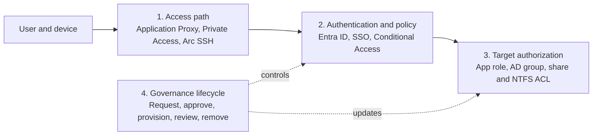

# Access to on-premises resources Technical Guide

## Scope and study objectives

This guide covers the AZ-305 task **Recommend a solution for authorizing access to on-premises resources** in the **Design identity, governance, and monitoring solutions** domain and the **Design authentication and authorization solutions** skill. It consolidates all 20 notes for this topic and focuses on choosing an access path, bridging the user's identity to a legacy protocol, preserving target-resource authorization, governing the entitlement lifecycle, and operating the resulting architecture.

The central design rule is to separate four decisions: **how traffic reaches the resource, how the user authenticates, what the target authorizes, and how access is granted and removed**. Microsoft Entra application proxy, Microsoft Entra Private Access, Microsoft Entra Domain Services, provisioning, and Azure Arc solve different parts of that chain; none should be treated as a universal replacement for the others.

## Missed-question priorities

The source notes explicitly identified the following misconceptions. These concepts deserve extra review because each distractor is technically plausible but crosses an architectural boundary or applies a fact at the wrong layer.

| Misconception or distractor | Correct rule | Architecture and exam discriminator |
|---|---|---|
| Privileged Identity Management (PIM) is the natural tool for requestable, expiring, manager-approved access to an ordinary private application. | Use an **entitlement management access package** for standard application-access requests, approvals, expiration, and recurring reviews. Use PIM for privileged Microsoft Entra roles, Azure roles, or eligible membership in privileged groups. [Private Access with entitlement management](https://learn.microsoft.com/en-us/entra/id-governance/scenarios/entitlement-management-private-access) [Access-review scopes](https://learn.microsoft.com/en-us/entra/id-governance/access-reviews-overview#where-do-you-create-reviews) | Choose by the **resource being governed**, not by the presence of approval or time limits. |
| `500` is the connector's concurrent-connection limit. | For the **Application Proxy response path**, each connector is limited by default to **200 concurrent outbound connections**. A production connector group should have at least two connectors, with three preferred. [Traffic distribution across connectors](https://learn.microsoft.com/en-us/entra/identity/app-proxy/application-proxy-high-availability-load-balancing#traffic-distribution-across-connectors) [Best practices for high availability of connectors](https://learn.microsoft.com/en-us/entra/identity/app-proxy/application-proxy-high-availability-load-balancing#best-practices-for-high-availability-of-connectors) | `500` belongs to **Private Access application segments per app**, not this Application Proxy connector limit. |
| Private Access assignment or Entra authentication grants file permissions on an SMB server. | Private Access admits and routes the network flow. The Windows server still evaluates the authenticated security identifiers (SIDs) against share and NTFS access control lists (ACLs). [Windows access control model](https://learn.microsoft.com/en-us/windows/security/identity-protection/access-control/access-control) | A secure path is not the target's resource-authorization decision. |
| The Domain Services 90-day password policy is why existing cloud-only users cannot sign in immediately after deployment. | Existing cloud-only users must change or reset their passwords after Domain Services is enabled so Microsoft Entra ID can generate the NTLM- and Kerberos-compatible hashes required by the managed domain. Hybrid users require the Domain Services password-hash synchronization configuration. [Enable user accounts for Domain Services](https://learn.microsoft.com/en-us/entra/identity/domain-services/tutorial-create-instance-advanced#enable-user-accounts-for-domain-services) | Distinguish an **initial credential prerequisite** from an ongoing password policy. |
| The default `.onmicrosoft.com` DNS name is the safest production choice for Domain Services. | Use a routable custom domain that the organization owns when public secure LDAP may be required; a public certificate authority cannot issue a certificate for Microsoft's `.onmicrosoft.com` domain. Avoid `.local`, keep the prefix at 15 characters or fewer, and avoid connected-namespace conflicts. [DNS name considerations](https://learn.microsoft.com/en-us/entra/identity/domain-services/tutorial-create-instance-advanced#create-a-managed-domain-and-configure-basic-settings) | The deciding clues are public LDAPS certificate ownership, routability, prefix length, and namespace collision. |
| Source IP restoration fixes a private-resource subnet that overlaps the user's local network. | IP-based acquisition works only when the destination range is outside the endpoint's local subnet. Use an **FQDN segment** for the overlapping destination and disable DNS over HTTPS where required for FQDN acquisition. Source IP restoration serves logging and Conditional Access context; it does not change endpoint route selection. [Current Private Access limitations](https://learn.microsoft.com/en-us/entra/global-secure-access/reference-current-known-limitations#private-access-limitations) | Solve an endpoint acquisition conflict with naming, not an identity-context feature. |
| Quick Access remains the preferred route or fallback after a more specific per-app segment is created. | The per-app enterprise application takes precedence, including its assignment and Conditional Access scope. Quick Access does not provide fallback access; assignments are not copied. Allow **15 minutes** for configuration changes to synchronize to clients. [Application segment overlap and priority](https://learn.microsoft.com/en-us/entra/global-secure-access/how-to-configure-per-app-access#add-application-segment) [Assign users and groups](https://learn.microsoft.com/en-us/entra/global-secure-access/how-to-configure-per-app-access#assign-users-and-groups) | When an assigned user still fails immediately after a correct migration, consider propagation; when an unassigned user fails, the denial is expected. |
| TCP `443` is the connector port used to download certificate revocation lists (CRLs). | Private network connectors require outbound TCP `80` and `443`; port `80` supports certificate-validation traffic such as CRL retrieval, while service and data-path communications use TLS over `443`. No inbound connector port is required. [Private network connector ports and requirements](https://learn.microsoft.com/en-us/entra/global-secure-access/concept-connectors#what-is-a-private-network-connector) | `443` is the main encrypted service path, but it is not the only required outbound port. |
| Microsoft Entra sign-in logs show every private IP address and port used after authentication. | Sign-in logs describe the identity authentication and Conditional Access result; Global Secure Access traffic logs describe network connections and transactions; audit logs describe configuration changes. [Global Secure Access logs and monitoring](https://learn.microsoft.com/en-us/entra/global-secure-access/concept-global-secure-access-logs-monitoring) [Global Secure Access audit logs](https://learn.microsoft.com/en-us/entra/global-secure-access/how-to-access-audit-logs) | Select the log by plane: identity, data, or control. |
| A synchronized Domain Services user is uneditable merely because LDAP writes are reserved for locally created objects. | The root cause is the **one-way synchronization boundary**: synchronized users, passwords, attributes, and group memberships are read-only in the managed domain. Locally created objects in custom organizational units (OUs) are the writable exception. [How Domain Services synchronization works](https://learn.microsoft.com/en-us/entra/identity/domain-services/synchronization#synchronization-from-microsoft-entra-id-to-domain-services) | Lead with source of authority and synchronization direction; then mention the local-object exception. |

## Architecture and core concepts

### The four authorization layers

An end-to-end design succeeds only when every layer agrees. A user can pass Entra authentication and still be denied by an application role or file ACL; conversely, a valid on-premises account is not a reason to expose a broad inbound network path.

*Explanatory diagram based on the service boundaries described in the linked Microsoft documentation; it is not an official Microsoft figure.*

- **Access path:** Application Proxy publishes private HTTP/HTTPS web applications, Private Access brokers supported private TCP/UDP destinations, and Arc SSH provides an Azure-mediated administrative channel to an Arc-enabled server. [Application Proxy overview](https://learn.microsoft.com/en-us/entra/identity/app-proxy/overview-what-is-app-proxy) [Private Access overview](https://learn.microsoft.com/en-us/entra/global-secure-access/concept-private-access) [Arc SSH overview](https://learn.microsoft.com/en-us/azure/azure-arc/servers/ssh-arc-overview)
- **Authentication and policy:** Microsoft Entra preauthentication can apply assignment, multifactor authentication (MFA), device, risk, and other Conditional Access controls before the request reaches a private application. Passthrough publication does not create the same Entra-authenticated front-door decision. [Application Proxy security](https://learn.microsoft.com/en-us/entra/identity/app-proxy/application-proxy-security)
- **Target authorization:** The target still applies its native roles, groups, SIDs, ACLs, or database permissions. Access-path assignment should therefore be coordinated with any required local account or group membership. [Windows access control model](https://learn.microsoft.com/en-us/windows/security/identity-protection/access-control/access-control)
- **Lifecycle governance:** Entitlement management, provisioning, group synchronization, and access reviews create and remove the entitlements consumed by the access and target layers. [Private Access with entitlement management](https://learn.microsoft.com/en-us/entra/id-governance/scenarios/entitlement-management-private-access)

### Service-selection matrix

Start with the resource type and the user's intended action. Protocol, client constraints, legacy identity dependencies, and the level at which authorization must occur then narrow the choice.

| Requirement | Primary pattern | What it supplies | What remains separate |
|---|---|---|---|
| Publish an on-premises HTTP/HTTPS web application to browser users | **Microsoft Entra application proxy** | Entra preauthentication, Conditional Access, assignment, supported SSO translation, and outbound-only connectors. [Application Proxy overview](https://learn.microsoft.com/en-us/entra/identity/app-proxy/overview-what-is-app-proxy) | Back-end accounts, roles, and app-level authorization. |
| Reach private TCP/UDP resources such as SMB, RDP, SSH, databases, or custom protocols | **Microsoft Entra Private Access** | Identity-aware Zero Trust Network Access (ZTNA), Quick Access or per-app network segments, and Conditional Access targeted to the Private Access app. [Private Access overview](https://learn.microsoft.com/en-us/entra/global-secure-access/concept-private-access) | Protocol authentication and target authorization. |
| Provide private access from endpoints on which the Global Secure Access client cannot be installed | **Application Proxy for a web app**, or another supported VPN/SD-WAN/private-connectivity design for nonweb traffic | A path compatible with the endpoint constraint. | Private Access cannot currently acquire private traffic from Global Secure Access remote networks. [Remote-network and Private Access limitations](https://learn.microsoft.com/en-us/entra/global-secure-access/reference-current-known-limitations#remote-network-limitations) |
| Supply Kerberos, NTLM, LDAP, domain join, and Group Policy to Azure-hosted legacy workloads without customer-managed domain controllers | **Microsoft Entra Domain Services** | A managed domain synchronized one way from Microsoft Entra ID. [Domain Services overview](https://learn.microsoft.com/en-us/entra/identity/domain-services/overview) | Customers do not receive full AD DS control; synchronized-object writes and reverse synchronization are unsupported. |
| Administer an on-premises or multicloud server without a VPN, public IP, or inbound SSH port | **SSH for Azure Arc-enabled servers** | Azure-mediated tunneling plus Azure RBAC for connection and, on Linux, Entra operating-system sign-in. [Arc SSH benefits and requirements](https://learn.microsoft.com/en-us/azure/azure-arc/servers/ssh-arc-overview) | Application publication and ordinary end-user resource access. |
| Give cloud-only users SMB access to Azure Files without deploying domain controllers | **Microsoft Entra Kerberos for Azure Files** | Entra-issued Kerberos tickets for hybrid and cloud-only identities. [Enable Entra Kerberos for Azure Files](https://learn.microsoft.com/en-us/azure/storage/files/storage-files-identity-auth-hybrid-identities-enable) | Share-level roles and directory/file ACL configuration still require deliberate permission design. |
| Create, update, and remove accounts in an on-premises LDAP, SQL, REST, SOAP, or custom repository | **Microsoft Entra provisioning service plus provisioning agent and ECMA/target connector** | Identity lifecycle synchronization to the target repository. [On-premises provisioning architecture](https://learn.microsoft.com/en-us/entra/identity/app-provisioning/on-premises-application-provisioning-architecture) | Interactive authentication and the network access path. |

### Microsoft Entra Private Access architecture

Private Access extends the application-proxy connector model to private resources, ports, and protocols. It is a ZTNA design for users, not a general site-to-site routing fabric, and current private-traffic acquisition depends on the Global Secure Access client.

- **Client dependency:** Private Access traffic is currently acquired by the installed Global Secure Access client. Remote networks support Microsoft and Internet traffic profiles but not the Private Access profile. [Known limitations](https://learn.microsoft.com/en-us/entra/global-secure-access/reference-current-known-limitations#remote-network-limitations)
  - Locked-down contractor devices, printers, and other endpoints that cannot run the client need another access path.
  - Application Proxy is the clientless browser alternative when the resource is a web application.
- **Connector path:** A private network connector runs on Windows Server, establishes outbound connections to Microsoft, and reaches internal targets on behalf of the service. Maintain at least two healthy connectors and avoid placing an inbound-facing connector in a perimeter network merely to make the service work. [Private network connectors](https://learn.microsoft.com/en-us/entra/global-secure-access/concept-connectors)
- **Quick Access:** Broad CIDR ranges, IP ranges, wildcard FQDNs, ports, and protocols can reproduce a VPN-like starting point. Private DNS suffixes let the client send matching DNS requests through the Private Access path to internal resolution. [Configure Quick Access](https://learn.microsoft.com/en-us/entra/global-secure-access/how-to-configure-quick-access)
- **Application Discovery:** Traffic observed through Quick Access identifies used FQDNs, IPs, ports, protocols, users, and devices. Use that evidence to replace broad access with per-app enterprise applications. [Per-app access segmentation](https://learn.microsoft.com/en-us/entra/global-secure-access/tutorial-private-access-app-segmentation)
- **Per-app segmentation:** Each segment consists of a destination, port, and protocol. A Private Access enterprise application supports up to **500 segments**; segments cannot overlap within or between Private Access apps, except for the deliberate Quick Access migration overlap. [Configure per-app access](https://learn.microsoft.com/en-us/entra/global-secure-access/how-to-configure-per-app-access#add-application-segment)
  - If 650 exact server FQDNs genuinely require separate segments, split them across multiple nonoverlapping apps.
  - If the same assignment and policy legitimately cover a namespace or subnet, a wildcard FQDN or CIDR range can reduce segment count, but the broader blast radius must be accepted explicitly.
- **Precedence:** A matching enterprise-app segment outranks Quick Access. Users must be assigned directly or through a directly assigned group; nested groups are not supported, and Quick Access assignments are not copied. [Assignment behavior](https://learn.microsoft.com/en-us/entra/global-secure-access/how-to-configure-per-app-access#assign-users-and-groups)
- **Configuration timing:** Allow 15 minutes for segment or assignment changes to reach Global Secure Access clients before treating a correctly configured test as failed. Use client Advanced Diagnostics and its policy tester to identify the active rule. [View rule priority in the client](https://learn.microsoft.com/en-us/entra/global-secure-access/how-to-configure-per-app-access#view-rule-priority-in-the-client)

#### Acquisition edge cases

| Condition | Behavior | Design response |
|---|---|---|
| Private target IP overlaps the endpoint's local subnet | The operating system treats the target as local, so the IP-based rule is not acquired. | Publish and access the resource by FQDN; confirm that DNS over HTTPS is disabled for the relevant client path. [Private Access limitations](https://learn.microsoft.com/en-us/entra/global-secure-access/reference-current-known-limitations#private-access-limitations) |
| Destination has both IPv4 and IPv6 reachability | The Global Secure Access client tunnels IPv4; IPv6 traffic can go direct. | Prefer IPv4 where policy requires the GSA path and test for unintended IPv6 bypass. [Client IPv6 limitation](https://learn.microsoft.com/en-us/entra/global-secure-access/reference-current-known-limitations#internet-access-limitations) |
| Branch traffic is sent through a Global Secure Access remote network | Private Access cannot currently acquire that traffic profile. | Install supported endpoint clients or retain another private-connectivity path. [Remote-network limitations](https://learn.microsoft.com/en-us/entra/global-secure-access/reference-current-known-limitations#remote-network-limitations) |
| Source IP restoration is enabled | Entra can use the restored original public egress IP for supported logging and Conditional Access evaluation. | Do not treat this feature as a route-selection or overlapping-subnet fix. [Access-control limitations](https://learn.microsoft.com/en-us/entra/global-secure-access/reference-current-known-limitations#access-controls-limitations) |

### Intelligent Local Access

Intelligent Local Access (ILA) prevents in-office Private Access traffic from unnecessarily hairpinning through the cloud. It changes the route, not the access model.

1. Configure a private network with a DNS server, probe FQDN, and expected resolution result.
2. Associate the private network with the target Quick Access or enterprise application.
3. The Global Secure Access client uses the DNS probe to recognize the corporate network.
4. On a match, traffic for the associated app uses the local path; off-network traffic uses the normal cloud tunnel.
5. Conditional Access for the Private Access application still applies. Validate `Local` versus `Tunnel` behavior in client Advanced Diagnostics. [Configure Intelligent Local Access](https://learn.microsoft.com/en-us/entra/global-secure-access/tutorial-private-access-intelligent-local-access)

### Application Proxy and legacy web SSO

Application Proxy is the default identity-aware publication pattern for internal web applications. The connector uses outbound-only connectivity, while the cloud service provides the external endpoint and can enforce Entra preauthentication before private-network traffic is sent to the back end.

- **Web scope:** Use Application Proxy for HTTP/HTTPS applications. Choose Private Access for native SMB, SSH, RDP, database, or other private TCP/UDP access that is not presented through a supported web gateway. [Application Proxy overview](https://learn.microsoft.com/en-us/entra/identity/app-proxy/overview-what-is-app-proxy)
- **Preauthentication:** Prefer Microsoft Entra preauthentication when the application can support it, because assignment and Conditional Access can be evaluated before the request reaches the private network. Passthrough sends the initial unauthenticated request to the back end. [Application Proxy security](https://learn.microsoft.com/en-us/entra/identity/app-proxy/application-proxy-security)
- **Header-based SSO:** Application Proxy can translate configured Entra claims into HTTP headers and pass them through the connector to the application. Restrict direct access so users cannot bypass the trusted header-injection path. [Header-based SSO](https://learn.microsoft.com/en-us/entra/identity/app-proxy/application-proxy-configure-single-sign-on-with-headers)
- **SAML SSO:** Application Proxy supports both service-provider-initiated and identity-provider-initiated flows for SAML applications and caches the SAML request and response to and from the on-premises app. Configure and test SAML on the internal network first, then publish it through the same enterprise application. [SAML SSO for on-premises apps](https://learn.microsoft.com/en-us/entra/identity/app-proxy/conceptual-sso-apps)
- **Custom domains:** Use a custom external domain and certificate when the application or SAML configuration requires a stable matching hostname, redirect URI, cookie scope, or user-facing URL. A custom domain is valuable but is not a universal prerequisite for every SAML publication. [Application Proxy custom domains](https://learn.microsoft.com/en-us/entra/identity/app-proxy/how-to-configure-custom-domain)
- **Secure Hybrid Access partners:** F5 BIG-IP Access Policy Manager, PingAccess, and other application delivery or access-controller integrations can federate with Entra ID, apply Conditional Access through the Entra sign-in, and protocol-transition cloud claims into legacy headers. Use this pattern when an existing appliance or advanced traffic-management requirement justifies it; BIG-IP Virtual Edition in Azure is one possible placement, not an intrinsic requirement. [Secure Hybrid Access integrations](https://learn.microsoft.com/en-us/entra/identity/enterprise-apps/secure-hybrid-access-integrations) [F5 header-based SSO configuration](https://learn.microsoft.com/en-us/entra/identity/enterprise-apps/f5-big-ip-header-advanced)

## Design decisions and tradeoffs

### Reachability versus resource authorization

Private Access can authorize a user to send SMB traffic to TCP `445`, but it does not convert Entra claims into NTFS permissions. The Windows file server authenticates the protocol identity and evaluates SIDs in the access token against share and NTFS ACL entries.

- **Network gate:** Assign the user to the Private Access application and apply Conditional Access to determine whether the flow can reach the server.
- **Resource gate:** Use the target's AD DS users and security groups plus share/NTFS ACLs to grant Read, Write, or Modify rights. [Security groups](https://learn.microsoft.com/en-us/windows-server/identity/ad-ds/manage/understand-security-groups) [Windows access control](https://learn.microsoft.com/en-us/windows/security/identity-protection/access-control/access-control)
- **Operational implication:** Provisioning or synchronized group membership might be necessary so the target can recognize the same person admitted by the cloud access layer.

> **Architectural interpretation:** Treat every private-access design as two explicit authorization gates. Troubleshooting should first prove the route and cloud decision, then prove protocol authentication and target authorization.

### Entitlement management versus PIM

Both products can use approvals and time limits, but their primary resource models differ.

| Requirement | Entitlement management | PIM |
|---|---|---|
| Standard employee or guest requests a bundle of application/group resources | Primary fit: publish an access package in a catalog with request and approval policy. [Private Access scenario](https://learn.microsoft.com/en-us/entra/id-governance/scenarios/entitlement-management-private-access) | Not the primary access-package catalog. |
| Assignment expires automatically | Configure the access-package assignment policy. | Configure eligible or time-bound privileged activation/assignment. |
| Manager periodically recertifies continued app access | Add recurring access reviews to the access package. [Recurring access reviews](https://learn.microsoft.com/en-us/entra/id-governance/access-reviews-overview#why-are-access-reviews-important) | Reviews are appropriate when the reviewed object is a privileged role or PIM-managed group. |
| Administrator needs just-in-time elevation to an Entra or Azure role | Not the primary privileged-role activation control. | Primary fit. |

An access package can include the Private Access enterprise application plus a group or provisioning entitlement that the back end consumes. When the assignment ends, design and test removal at both the Private Access gate and the target system; cloud revocation alone cannot repair a stale local account or ACL.

### Azure Files identity choice

Azure Files supports multiple directory identity sources, and a storage account uses one Active Directory-based authentication method at a time. Match the choice to where identities originate and whether traditional domain controllers are acceptable.

| Identity source | Choose when | Key dependency or boundary |
|---|---|---|
| On-premises AD DS | Users are hybrid identities and the organization already operates AD DS. | Domain connectivity is required for traditional Kerberos operations and some ACL administration scenarios. |
| Microsoft Entra Domain Services | Lift-and-shift workloads need managed Kerberos/NTLM/LDAP/domain behavior in Azure. | Microsoft deploys managed domain controllers into an Azure virtual network; this does not satisfy a requirement for no managed domain controllers. |
| Microsoft Entra Kerberos | Azure Files must authenticate hybrid or cloud-only Entra identities without relying on traditional domain-controller infrastructure for share access. | Entra issues Kerberos tickets for SMB. Cloud-only ACL tooling and group-ticket limits have documented constraints that must be validated during design. [Entra Kerberos for Azure Files](https://learn.microsoft.com/en-us/azure/storage/files/storage-files-identity-auth-hybrid-identities-enable) |

### Administrative server access with Azure Arc SSH

Arc SSH is for administration of the server, not publication of the business application running on it. The Connected Machine agent supports the Azure-mediated channel without a public IP, inbound SSH firewall rule, or VPN.

- **Connection gate:** Azure permissions authorize establishing the Arc SSH connection.
- **OS-login gate:** On Linux, install the `AADSSHLoginForLinux` extension packages and assign **Virtual Machine Administrator Login** or **Virtual Machine User Login**. Owner or Contributor on the Arc resource does not automatically grant Entra OS login. [Microsoft Entra authentication for Arc SSH](https://learn.microsoft.com/en-us/azure/azure-arc/servers/ssh-arc-overview#microsoft-entra-authentication)
- **Platform boundary:** Arc SSH works with Windows and Linux local users; Microsoft Entra OS login is Linux-only in the documented Arc SSH design.
- **Security implication:** Broad Azure Contributor access can deploy privileged extensions, so treat contributors as indirect server administrators even when OS-login roles are separated. [Arc identity and authorization](https://learn.microsoft.com/en-us/azure/azure-arc/servers/security-identity-authorization#identity-and-access-control)

## Requirements, limits, and operational behavior

### Private network connectors

The same connector platform underpins Application Proxy and Private Access, but a limit should be applied only to the workload for which Microsoft documents it.

| Requirement or behavior | Current design rule |
|---|---|
| Firewall direction | Permit required **outbound** connectivity; do not open an inbound internet path to the connector. [Private network connector overview](https://learn.microsoft.com/en-us/entra/global-secure-access/concept-connectors#what-is-a-private-network-connector) |
| Outbound ports | Allow TCP `80` and `443`. Port `80` is required for certificate-validation endpoints such as CRL retrieval; `443` carries service/control and data-path TLS communications. |
| TLS path | Avoid outbound forward proxies, TLS interception, or inline inspection that breaks the connector's certificate authentication. [Hardened-environment considerations](https://learn.microsoft.com/en-us/entra/global-secure-access/concept-connectors#connector-deployments-in-hardened-environments) |
| Connector count | Maintain at least two healthy connectors per production group. For Application Proxy, Microsoft prefers three for maintenance and failure buffer. [Application Proxy connector HA](https://learn.microsoft.com/en-us/entra/identity/app-proxy/application-proxy-high-availability-load-balancing#best-practices-for-high-availability-of-connectors) |
| Application Proxy connection default | Each connector is limited by default to `200` concurrent outbound response connections. [Traffic distribution](https://learn.microsoft.com/en-us/entra/identity/app-proxy/application-proxy-high-availability-load-balancing#traffic-distribution-across-connectors) |
| Distribution | Application Proxy requests are usually spread almost evenly, but even distribution and connector-level session affinity are not guaranteed. Global Secure Access enterprise apps also offer documented traffic-routing options. |
| Domain join | A connector need not be domain joined unless the SSO design, such as Kerberos constrained delegation (KCD), requires it. [Connector domain joining](https://learn.microsoft.com/en-us/entra/global-secure-access/concept-connectors#domain-joining) |

> **Documentation correction:** Do not generalize the Application Proxy `200`-connection default into a universal maximum for every Private Access TCP or UDP session. Size Private Access connector hosts using current connector specifications, throughput tests, destination behavior, protocol mix, latency, loss, and failure capacity.

### Domain Services identity and DNS boundaries

Domain Services supplies managed legacy directory protocols, but Microsoft Entra ID remains authoritative for synchronized identities.

- **Synchronization direction:** Users, groups, attributes, group memberships, and compatible credential hashes synchronize from Microsoft Entra ID to the managed domain. No reverse synchronization occurs. [Domain Services synchronization](https://learn.microsoft.com/en-us/entra/identity/domain-services/synchronization)
- **Read-only synchronized objects:** Change synchronized attributes, passwords, and memberships at their source. Custom OUs can contain locally created writable users, groups, or service accounts, but those objects do not write back to Entra ID.
- **Cloud-only credentials:** Users that existed before Domain Services was enabled must change or reset their password before the required NTLM- and Kerberos-compatible hashes exist and the account becomes usable in the managed domain.
- **Hybrid credentials:** Configure Microsoft Entra Connect to synchronize the compatible legacy hashes required by Domain Services. [Password hash synchronization for Domain Services](https://learn.microsoft.com/en-us/entra/identity/domain-services/tutorial-configure-password-hash-sync)
- **DNS namespace:** Prefer an owned, routable custom name when public LDAPS is a requirement. Avoid `.local`, keep the domain prefix to 15 characters or fewer, and do not duplicate a DNS namespace reachable through the VNet, VPN, or ExpressRoute. [Advanced managed-domain DNS settings](https://learn.microsoft.com/en-us/entra/identity/domain-services/tutorial-create-instance-advanced#create-a-managed-domain-and-configure-basic-settings)
- **VNet DNS:** Configure connected workloads to use the managed domain's two DNS IP addresses or a deliberate conditional-forwarding design. [Update VNet DNS settings](https://learn.microsoft.com/en-us/entra/identity/domain-services/tutorial-create-instance-advanced#update-dns-settings-for-the-azure-virtual-network)

### On-premises LDAP account provisioning

Authentication and provisioning are different flows. Application Proxy can authenticate a user to a legacy web application, but it does not inherently create, update, or delete the user's account in the application's LDAP repository.

1. The Microsoft Entra provisioning service evaluates assignments and emits provisioning operations.
2. The on-premises provisioning agent maintains outbound connectivity to Microsoft Entra ID.
3. The Extensible Connectivity (ECMA) Connector Host translates the cloud provisioning operation into the target connector's LDAP, SQL, REST, SOAP, PowerShell, or other operation.
4. The target connector creates, updates, disables, or deletes the local account according to mappings and scope. [How application provisioning works](https://learn.microsoft.com/en-us/entra/identity/app-provisioning/how-provisioning-works)

For the Generic LDAP connector:

- Microsoft Identity Manager (MIM) Synchronization is not required for this cloud-orchestrated architecture. Existing compatible ECMA2 connectors can be imported where appropriate, while the Microsoft Entra provisioning service remains the synchronization engine. [On-premises provisioning architecture](https://learn.microsoft.com/en-us/entra/identity/app-provisioning/on-premises-application-provisioning-architecture)
- Supported targets include directories such as OpenLDAP, Active Directory Lightweight Directory Services (AD LDS), and other documented LDAP servers; provisioning to Active Directory Domain Services through this connector is not supported.
- Microsoft Entra passwords cannot be synchronized into the LDAP directory. Some non-AD LDS targets can receive an initial random password; use federation or Application Proxy SSO where possible to avoid a second user-managed password.
- Use a separate provisioning agent from Microsoft Entra Cloud Sync, and do not confuse account provisioning with interactive authentication. [LDAP connector recommendations and limitations](https://learn.microsoft.com/en-us/entra/identity/app-provisioning/on-premises-ldap-connector-configure#more-recommendations-and-limitations)

## Security and governance

### Least privilege and migration from VPN-style access

Quick Access is useful for discovery and staged VPN replacement, but broad subnets and wildcard destinations should not become the steady-state authorization model. Move discovered traffic into narrowly scoped enterprise applications, assign only required users or groups, and apply application-specific Conditional Access.

1. Publish only the broad range needed for the transition.
2. Observe actual use in Application Discovery.
3. Create the per-app segment and its connector-group association.
4. Assign the required users directly or through a supported nonnested group.
5. Apply and test Conditional Access.
6. Wait for client propagation and verify the active rule.
7. Remove the redundant broad Quick Access segment after successful validation. [Private Access segmentation tutorial](https://learn.microsoft.com/en-us/entra/global-secure-access/tutorial-private-access-app-segmentation)

### Monitoring by plane

No single log proves end-to-end authorization. Correlate identity, data-plane, control-plane, and target-resource evidence using user, device, application, destination, and time.

| Evidence source | Question it answers | Typical fields or evidence |
|---|---|---|
| Microsoft Entra sign-in logs | Did the user authenticate and satisfy Conditional Access? | User, application, authentication method, device, IP context, risk, policy result. [Sign-in log activity details](https://learn.microsoft.com/en-us/entra/identity/monitoring-health/concept-sign-ins) |
| Global Secure Access traffic logs | What network connection or transaction traversed the service, from where to where, and with what result? | Traffic type, source, destination, user/device, action, bytes, and transaction or connection result. [Global Secure Access traffic logs](https://learn.microsoft.com/en-us/entra/global-secure-access/concept-global-secure-access-logs-monitoring#traffic-logs-preview) |
| Microsoft Entra audit logs | Who changed Global Secure Access configuration? | Actor, operation, target, changed properties, status, and time. [Access Global Secure Access audit logs](https://learn.microsoft.com/en-us/entra/global-secure-access/how-to-access-audit-logs) |
| Connector health and host logs | Was the connector available and able to reach the cloud and target? | Heartbeat, service state, port/TLS errors, DNS, target reachability, and host resource pressure. [Operate Private Access](https://learn.microsoft.com/en-us/entra/global-secure-access/how-to-operate-private-access) |
| Target security or application audit | Did the protocol authenticate, and what operation did the target authorize? | Kerberos/NTLM events, app role decision, share/NTFS access, database or application action. |

- Traffic and remote-network health logs are retained in the service for 30 days according to current documentation. Export required logs through diagnostic settings when compliance or investigation retention must be longer. [Log retention and storage](https://learn.microsoft.com/en-us/entra/global-secure-access/concept-global-secure-access-logs-monitoring#log-retention-and-storage)
- An online connector heartbeat proves only cloud connectivity, not DNS, target reachability, authentication, or target authorization. Use an end-to-end synthetic test for critical applications.

## Configuration, validation, and troubleshooting

### Deployment validation sequence

Use the following order because it follows the request from client acquisition to target authorization and prevents an ACL failure from being misdiagnosed as a tunnel failure.

1. **Validate client acquisition.** Confirm the Global Secure Access client is healthy, the intended forwarding profile is present, and the destination matches the expected FQDN/IP, port, and protocol rule.
2. **Validate precedence and assignment.** Use Advanced Diagnostics or the policy tester to identify the winning rule. Confirm direct user or supported group assignment and allow 15 minutes after changes.
3. **Validate DNS and overlap.** For FQDN acquisition, confirm internal resolution and required DNS-over-HTTPS settings. Check whether an IP destination overlaps the endpoint's local subnet.
4. **Validate the connector group.** Confirm at least two healthy connectors, required outbound `80`/`443` access, no breaking TLS inspection, correct private DNS, and reachability to the destination port.
5. **Validate identity policy.** Inspect sign-in logs for assignment, authentication, MFA, device, risk, and Conditional Access outcomes.
6. **Validate target authentication.** Check Kerberos, NTLM, SAML, header, SSH, SMB, or application-specific authentication evidence.
7. **Validate resource authorization.** Confirm AD group membership, local account state, role mapping, share permission, NTFS ACL, or application authorization.
8. **Correlate control-plane changes.** Use audit logs to identify segment, assignment, connector-group, or forwarding-profile changes near the failure time.

### High-frequency failure matrix

| Symptom | Most likely boundary | Validation or correction |
|---|---|---|
| Resource worked through Quick Access and immediately fails after per-app creation for everyone | Assignment or propagation | Confirm explicit enterprise-app assignments; wait 15 minutes and inspect client rule priority. |
| Resource works by FQDN but not IP from a home network using the same subnet | Endpoint acquisition | Keep the FQDN segment and confirm secure-DNS settings; source IP restoration is irrelevant. |
| Sign-in succeeds but SMB access is denied | Target authentication or authorization | Check the Windows identity, group SIDs, share permissions, and NTFS ACLs. |
| Connector shows unhealthy after outbound security inspection was enabled | Connector TLS/certificate path | Allow required URLs and ports, remove breaking TLS inspection, and verify CRL access over port `80`. |
| Existing cloud-only user cannot sign in to a newly deployed managed domain | Credential-hash prerequisite | Have the user change/reset the password after enablement; wait for synchronization. |
| Synchronized Domain Services membership change fails in AD tools | Source-of-authority boundary | Change the group membership in Entra ID or the upstream on-premises AD DS source. |
| Legacy LDAP user still exists after application access is removed | Provisioning/lifecycle | Check provisioning scope, mappings, agent/connector health, deprovisioning action, and target conflict logs. |
| Traffic occurred, but sign-in logs do not show its destination ports | Wrong log plane | Query Global Secure Access traffic logs; correlate with sign-in and target logs. |
| In-office ILA traffic still tunnels through the cloud | DNS probe or app association | Confirm probe DNS server/FQDN/expected result, linked target app, and client diagnostics. |

## Common misconceptions and exam discriminators

- **Application Proxy versus Private Access:** Web publication and supported web SSO imply Application Proxy; native private TCP/UDP access and VPN reduction imply Private Access.
- **Private Access versus authorization:** App assignment controls network admission. It does not create a local account, add an AD group membership, or edit an ACL.
- **Quick Access versus per-app:** Quick Access accelerates onboarding; per-app segmentation is the least-privilege destination. The per-app rule wins and has no Quick Access fallback.
- **Remote network versus client acquisition:** Global Secure Access supports remote networks, but current Private Access traffic acquisition still requires the endpoint client.
- **Application Proxy `200` versus Private Access `500`:** `200` is the documented default concurrent outbound response-connection limit per Application Proxy connector; `500` is the maximum number of application segments per Private Access app.
- **Port `80` versus `443`:** `443` carries encrypted connector service traffic; `80` remains necessary for certificate-validation retrieval. Both are outbound.
- **Entitlement management versus PIM:** Access packages govern ordinary application/resource bundles; PIM governs privileged elevation or eligible privileged membership.
- **Authentication versus provisioning:** SSO proves identity to the app. Provisioning creates, updates, and removes the app's local account or entitlement.
- **Domain Services versus self-managed AD DS:** Domain Services supplies managed legacy protocols but retains a one-way, largely read-only synchronized identity model. Choose self-managed AD DS when full domain/forest control or unsupported write behavior is mandatory.
- **Arc resource control versus OS login:** Owner/Contributor can control the Arc resource but does not automatically receive Entra Linux login; assign the appropriate VM Login data-plane role.
- **Entra Kerberos versus Domain Services:** For supported cloud workloads such as Azure Files, Entra Kerberos can serve cloud-only identities without managed domain controllers. Domain Services is for workloads that need a broader managed-domain feature set.
- **F5 integration placement:** F5 BIG-IP can be a Secure Hybrid Access protocol bridge, but the requirement is the capability and traffic topology, not a mandatory Virtual Edition deployment in Azure.

## Architecture summary

Use the narrowest supported path that matches the resource protocol, then preserve the target's authorization model and govern both layers as one lifecycle.

1. **Classify the target:** web app, arbitrary private protocol, managed legacy domain workload, Azure Files share, or server administration.
2. **Choose the access path:** Application Proxy, Private Access, Domain Services-supported network design, Entra Kerberos, or Arc SSH.
3. **Define the identity bridge:** SAML, header injection, KCD, Kerberos, Entra Linux login, or target-local authentication.
4. **Define target authorization:** app role, AD security group, share/NTFS ACL, LDAP account, or OS privilege.
5. **Add governance:** access package, approval, expiration, recurring review, PIM for privileged elevation, and provisioning/deprovisioning where needed.
6. **Design resilience:** redundant connectors, independent network paths, healthy DNS and directory dependencies, and application-tier availability.
7. **Prove operations:** correlate sign-in, traffic, audit, connector, provisioning, and target logs; test both grant and revocation end to end.

## Final review checklist

- [ ] I can select Application Proxy for an on-premises web app and Private Access for supported private TCP/UDP resources.
- [ ] I remember that current Private Access acquisition requires the Global Secure Access client and is not supported through remote-network acquisition.
- [ ] I can explain why Private Access routing does not replace SMB authentication, AD security groups, share permissions, or NTFS ACLs.
- [ ] I choose entitlement management access packages for requestable, approved, expiring standard app access and PIM for privileged elevation.
- [ ] I remember the documented Application Proxy connector values: `200` concurrent outbound response connections by default, at least two connectors, and three preferred.
- [ ] I remember the Private Access scale value: up to `500` nonoverlapping application segments per enterprise app.
- [ ] I assign users to the per-app enterprise application before migration because it outranks Quick Access and Quick Access is not a fallback.
- [ ] I allow 15 minutes for Private Access segment and assignment changes to synchronize to clients.
- [ ] I use FQDN acquisition—not source IP restoration—when the private destination IP overlaps the endpoint's local subnet, and I validate DNS-over-HTTPS behavior.
- [ ] I remember that the Global Secure Access client tunnels IPv4 and can send IPv6 directly.
- [ ] I allow connector egress on TCP `80` for certificate-validation retrieval and `443` for encrypted service traffic; I do not open inbound connector ports.
- [ ] I avoid TLS interception or an outbound proxy design that breaks connector certificate authentication.
- [ ] I use sign-in logs for authentication, traffic logs for network flows, audit logs for configuration changes, and target logs for the final resource decision.
- [ ] I require existing cloud-only users to change/reset passwords after Domain Services enablement so compatible Kerberos/NTLM hashes can be generated.
- [ ] I can explain that Domain Services synchronization is one way and synchronized objects are read-only in the managed domain.
- [ ] I choose an owned, routable Domain Services DNS name for public LDAPS scenarios, avoid `.local`, keep the prefix to 15 characters or fewer, and prevent namespace conflicts.
- [ ] I distinguish Application Proxy SSO from ECMA/LDAP account provisioning and design deprovisioning explicitly.
- [ ] I know that the Generic LDAP provisioning connector does not provision to AD DS and cannot synchronize a user's Entra password.
- [ ] I use Intelligent Local Access only as a path optimization and still apply Conditional Access to the associated Private Access application.
- [ ] I use Entra Kerberos for supported Azure Files cloud-only identity scenarios and retain explicit share/file permission design.
- [ ] I separate Arc SSH connection authorization from Linux OS-login authorization and assign the appropriate VM Login role.
- [ ] I treat a custom domain for SAML Application Proxy as requirement-driven, not universally mandatory.

## Documentation and interpretation notes

> **Documentation correction:** The source notes described the Application Proxy `200` connection value as though it were a universal private network connector capacity limit. Current Microsoft documentation states it for Application Proxy's per-connector outbound response connections. Private Access capacity must be validated against its current connector specifications and the actual protocol mix.

> **Documentation correction:** A custom Application Proxy domain is not universally required for SAML. Use one when hostname, certificate, redirect, cookie, or application constraints require it; follow the SAML application and custom-domain procedures for the specific design.

> **Documentation correction:** F5 BIG-IP Secure Hybrid Access does not inherently require BIG-IP Virtual Edition to be deployed in Azure. Select the supported F5 topology and placement that fits the existing application-delivery architecture.

> **Architectural interpretation:** Cloud access assignment, provisioning, and target authorization should share a tested removal workflow. A user is not fully deprovisioned until the access path, session/token state, target account or group membership, and resource permissions all reflect the removal.
