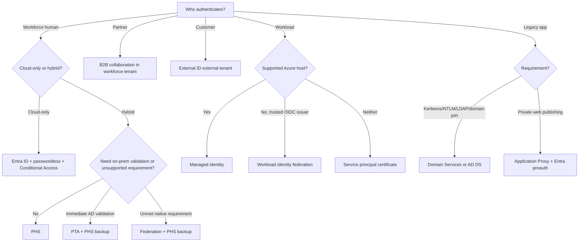
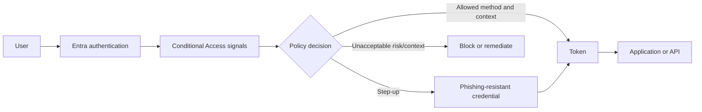
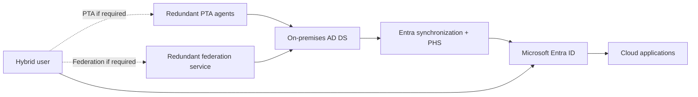
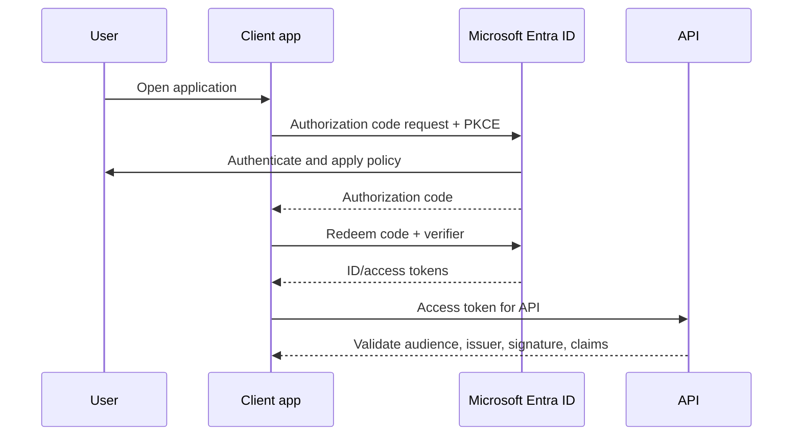
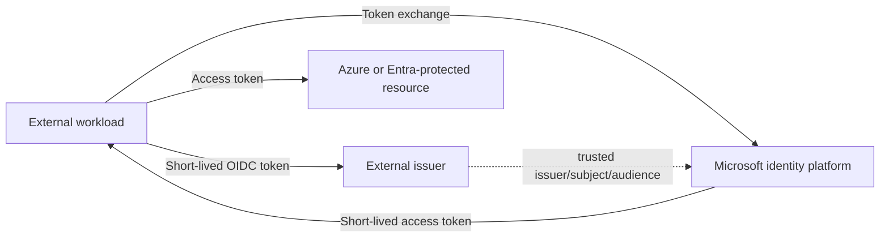

# AZ-305 Study Guide: Recommend an authentication solution

> **Exam task:** Design authentication and authorization solutions — Recommend an authentication solution
>
> **Domain:** Design identity, governance, and monitoring solutions
>
> **Estimated reading time:** 45 minutes
>
> **Matched task source:** Exact match in the provided Study Guide Map, `Skills.psd1`, and the current [official AZ-305 study guide](https://learn.microsoft.com/en-us/credentials/certifications/resources/study-guides/az-305), whose skills measured are effective as of April 17, 2026.
>
> **Scope boundary:** This guide covers how human and workload identities prove who or what they are: workforce methods, adaptive access, hybrid sign-in, application protocols and flows, secretless workload authentication, external identities, and legacy integration. Identity lifecycle, Azure resource permissions, on-premises authorization, identity governance, and secret storage belong to adjacent AZ-305 tasks and appear only when they constrain authentication.

---

## How to use this guide

Read this guide as a requirement-to-authentication-pattern map. First identify the actor—employee, administrator, partner, customer, application, pipeline, or legacy workload—then identify where the identity lives, what assurance is required, which protocols the target supports, and which dependencies can fail. [Microsoft's identity architecture guidance distinguishes users, devices, and applications](https://learn.microsoft.com/en-us/azure/architecture/identity/identity-get-started), while the [Well-Architected Framework treats identity as the primary security perimeter](https://learn.microsoft.com/en-us/azure/well-architected/security/identity-access).

By the end, you should be able to:

- Recommend [phishing-resistant passwordless authentication](https://learn.microsoft.com/en-us/entra/identity/authentication/overview-authentication), bootstrap it safely, and enforce an appropriate [authentication strength](https://learn.microsoft.com/en-us/entra/identity/authentication/concept-authentication-strengths).
- Choose among [password hash synchronization (PHS), pass-through authentication (PTA), and federation](https://learn.microsoft.com/en-us/entra/identity/hybrid/connect/choose-ad-authn) for hybrid users.
- Match [SAML, OpenID Connect, OAuth 2.0, and the correct token flow](https://learn.microsoft.com/en-us/entra/identity-platform/authentication-flows-app-scenarios) to an application architecture.
- Prefer [managed identities](https://learn.microsoft.com/en-us/entra/identity/managed-identities-azure-resources/overview) or [workload identity federation](https://learn.microsoft.com/en-us/entra/workload-id/workload-identity-federation) over stored workload credentials.
- Separate employee, partner, customer, and legacy-domain scenarios using [Microsoft Entra External ID](https://learn.microsoft.com/en-us/entra/external-id/), [Domain Services](https://learn.microsoft.com/en-us/entra/identity/domain-services/overview), and [Application Proxy](https://learn.microsoft.com/en-us/entra/identity/app-proxy/overview-what-is-app-proxy).

In scenario questions, underline clues such as **cloud-only**, **immediate on-premises account-state enforcement**, **third-party authentication**, **phishing resistant**, **customer self-service sign-up**, **partner collaboration**, **no browser**, **daemon**, **API on behalf of user**, **GitHub Actions**, **Kerberos/NTLM/LDAP**, **private web app**, **no inbound ports**, **minimum infrastructure**, and **survive an on-premises outage**. Each clue narrows the correct authentication boundary.

Use the inline sources for follow-up study and to verify current licensing, support, and preview status. The official exam guide says questions usually cover generally available capabilities but can include commonly used preview features, so [preview authentication features](https://learn.microsoft.com/en-us/credentials/certifications/resources/study-guides/az-305#updates-to-the-exam) should be recognized without automatically becoming the best production recommendation.

---

## Primary source set

### Exam and module sources

- [Official AZ-305 study guide](https://learn.microsoft.com/en-us/credentials/certifications/resources/study-guides/az-305)
- [AZ-305: Design identity, governance, and monitor solutions](https://learn.microsoft.com/en-us/training/paths/design-identity-governance-monitor-solutions/)
- [Design authentication and authorization solutions](https://learn.microsoft.com/en-us/training/modules/design-authentication-authorization-solutions/)
- [Exam Readiness Zone](https://learn.microsoft.com/en-us/shows/exam-readiness-zone/)

### Core product documentation

- [Microsoft Entra authentication overview](https://learn.microsoft.com/en-us/entra/identity/authentication/overview-authentication)
- [Authentication methods policy](https://learn.microsoft.com/en-us/entra/identity/authentication/concept-authentication-methods-manage)
- [Plan phishing-resistant passwordless authentication](https://learn.microsoft.com/en-us/entra/identity/authentication/how-to-deploy-phishing-resistant-passwordless-authentication)
- [Conditional Access](https://learn.microsoft.com/en-us/entra/identity/conditional-access/overview)
- [Authentication strengths](https://learn.microsoft.com/en-us/entra/identity/authentication/concept-authentication-strengths)
- [Microsoft Entra ID Protection](https://learn.microsoft.com/en-us/entra/id-protection/overview-identity-protection)
- [Choose a hybrid authentication method](https://learn.microsoft.com/en-us/entra/identity/hybrid/connect/choose-ad-authn)
- [Enterprise application single sign-on](https://learn.microsoft.com/en-us/entra/identity/enterprise-apps/what-is-single-sign-on)
- [Microsoft identity platform application scenarios and flows](https://learn.microsoft.com/en-us/entra/identity-platform/authentication-flows-app-scenarios)
- [Managed identities for Azure resources](https://learn.microsoft.com/en-us/entra/identity/managed-identities-azure-resources/overview)
- [Microsoft Entra Workload ID](https://learn.microsoft.com/en-us/entra/workload-id/workload-identities-overview)
- [Workload identity federation](https://learn.microsoft.com/en-us/entra/workload-id/workload-identity-federation)
- [Microsoft Entra External ID](https://learn.microsoft.com/en-us/entra/external-id/)
- [Microsoft Entra Domain Services](https://learn.microsoft.com/en-us/entra/identity/domain-services/overview)
- [Microsoft Entra Application Proxy](https://learn.microsoft.com/en-us/entra/identity/app-proxy/overview-what-is-app-proxy)

### Supporting architecture and framework sources

- [Azure Architecture Center: identity architecture](https://learn.microsoft.com/en-us/azure/architecture/identity/identity-get-started)
- [Well-Architected identity and access strategies](https://learn.microsoft.com/en-us/azure/well-architected/security/identity-access)
- [Cloud Adoption Framework: identity and access management](https://learn.microsoft.com/en-us/azure/cloud-adoption-framework/ready/landing-zone/design-area/identity-access)
- [Zero Trust identity guidance](https://learn.microsoft.com/en-us/security/zero-trust/deploy/identity)
- [Microsoft Entra licensing](https://learn.microsoft.com/en-us/entra/fundamentals/licensing)
- [Microsoft Entra deployment plans](https://learn.microsoft.com/en-us/entra/architecture/deployment-plans)

### Discovery notes from the Study Guide Map

**Potentially relevant products considered:** Microsoft Entra ID, Authentication methods policy, MFA, passkeys and FIDO2, Windows Hello for Business, certificate-based authentication, Temporary Access Pass (TAP), self-service password reset (SSPR), Conditional Access and authentication strengths, Continuous Access Evaluation (CAE), ID Protection, PHS, PTA, AD FS, seamless SSO, Connect Sync, Cloud Sync, SAML, OpenID Connect, OAuth 2.0, MSAL, managed identities, Workload ID, workload identity federation, External ID, Domain Services, Application Proxy, Private Access, Global Secure Access, and Verified ID.

The map's forum-discovery note is **nonauthoritative**. It is used only to identify recurring candidate discussion about hybrid tradeoffs, MFA, Conditional Access, and secretless workloads; every recommendation below is grounded in Microsoft documentation.

Coverage is intentionally divided by identity population. The [Architecture Center](https://learn.microsoft.com/en-us/azure/architecture/identity/identity-get-started) and [Well-Architected Framework](https://learn.microsoft.com/en-us/azure/well-architected/security/identity-access) provide the design lens; method, hybrid, application, and workload documentation provide the primary comparisons. [External ID](https://learn.microsoft.com/en-us/entra/external-id/), [Domain Services](https://learn.microsoft.com/en-us/entra/identity/domain-services/overview), and [Application Proxy](https://learn.microsoft.com/en-us/entra/identity/app-proxy/overview-what-is-app-proxy) enter only when the scenario mentions customers or partners, legacy protocols, or private web applications.

Microsoft Entra Private Access, Global Secure Access, and Verified ID are treated as adjacent. [Private Access is a Zero Trust network-access service](https://learn.microsoft.com/en-us/entra/global-secure-access/overview-what-is-global-secure-access#microsoft-entra-private-access), not the identity provider itself; [Verified ID provides verifiable identity claims and identity proofing](https://learn.microsoft.com/en-us/entra/verified-id/decentralized-identifier-overview), not ordinary sign-in, MFA, or authorization.

---

## 1. Exam task scope

This task asks an Azure solutions architect to recommend how a person or workload proves identity before access is evaluated. [Authentication verifies identity; authorization decides what that identity may do](https://learn.microsoft.com/en-us/azure/well-architected/security/identity-access#terminology). A complete recommendation identifies the identity provider, credential or federation mechanism, protocol and token flow, contextual controls, recovery path, availability dependencies, and operational ownership.

### Likely design decisions tested

| Decision | What the exam expects you to distinguish |
|---|---|
| Identity population | Workforce users, guests and partners, customers, and workload identities require different tenant and lifecycle patterns. ([Identity architecture](https://learn.microsoft.com/en-us/azure/architecture/identity/identity-get-started)) |
| Assurance | Ordinary MFA is not automatically phishing resistant; use [authentication strengths](https://learn.microsoft.com/en-us/entra/identity/authentication/concept-authentication-strengths) when a sensitive resource requires specific methods. |
| Adaptive access | [Conditional Access](https://learn.microsoft.com/en-us/entra/identity/conditional-access/overview) combines identity, device, location, application, and risk signals with grant or session controls. |
| Hybrid validation | [PHS validates in Microsoft Entra ID, PTA validates against on-premises AD through agents, and federation delegates to a trusted IdP](https://learn.microsoft.com/en-us/entra/identity/hybrid/connect/choose-ad-authn). |
| Enterprise SSO | Prefer standards-based [OIDC or SAML federation](https://learn.microsoft.com/en-us/entra/identity/enterprise-apps/what-is-single-sign-on); password-based SSO is a compatibility option and linked SSO is only a launch link. |
| App flow | Match SPA, web app, API, desktop/mobile, device, and daemon architectures to [supported OAuth/OIDC flows](https://learn.microsoft.com/en-us/entra/identity-platform/authentication-flows-app-scenarios). |
| Workload credential | Prefer [managed identity for supported Azure hosts](https://learn.microsoft.com/en-us/entra/identity/managed-identities-azure-resources/overview) and [federation for external OIDC-capable workloads](https://learn.microsoft.com/en-us/entra/workload-id/workload-identity-federation). |
| Legacy requirement | Use [Domain Services](https://learn.microsoft.com/en-us/entra/identity/domain-services/overview) for managed Kerberos, NTLM, LDAP, and domain join; use [Application Proxy](https://learn.microsoft.com/en-us/entra/identity/app-proxy/overview-what-is-app-proxy) to publish a private web app with Entra preauthentication. |

### In scope

- Human credential and MFA design using the [Authentication methods policy](https://learn.microsoft.com/en-us/entra/identity/authentication/concept-authentication-methods-manage), passwordless methods, TAP, and recovery.
- Contextual and risk-based sign-in enforcement using [Conditional Access](https://learn.microsoft.com/en-us/entra/identity/conditional-access/overview), [authentication strengths](https://learn.microsoft.com/en-us/entra/identity/authentication/concept-authentication-strengths), and [ID Protection](https://learn.microsoft.com/en-us/entra/id-protection/overview-identity-protection).
- Hybrid identity sign-in dependencies and continuity using the [PHS/PTA/federation decision model](https://learn.microsoft.com/en-us/entra/identity/hybrid/connect/choose-ad-authn).
- Enterprise application SSO and custom application authentication using [Microsoft identity platform standards and libraries](https://learn.microsoft.com/en-us/entra/identity-platform/authentication-flows-app-scenarios).
- Workload authentication using [managed identities](https://learn.microsoft.com/en-us/entra/identity/managed-identities-azure-resources/overview), service principals, certificates, or federated credentials.
- Partner, customer, private-app, and legacy-domain authentication when those requirements are explicit in [External ID](https://learn.microsoft.com/en-us/entra/external-id/), [Application Proxy](https://learn.microsoft.com/en-us/entra/identity/app-proxy/overview-what-is-app-proxy), or [Domain Services](https://learn.microsoft.com/en-us/entra/identity/domain-services/overview).

### Out of scope except as a dependency

> **Adjacent task context:** “Recommend an identity management solution” owns tenant design, provisioning, synchronization, and identity lifecycle. Choosing Connect Sync versus Cloud Sync is therefore adjacent; this guide discusses synchronization only where a hybrid authentication choice needs PHS or synchronized objects.

> **Adjacent task context:** “Recommend a solution for authorizing access” owns Azure RBAC, app roles, groups, scopes, and on-premises ACLs. Tokens carry identity and claims, but assigning permissions is not authentication. ([Authentication versus authorization](https://learn.microsoft.com/en-us/azure/well-architected/security/identity-access#terminology))

> **Adjacent task context:** “Recommend a solution to manage secrets, certificates, and keys” owns Key Vault, rotation, and certificate lifecycle. This guide recommends eliminating workload secrets where possible and mentions credential storage only as a fallback boundary. ([Managed identities](https://learn.microsoft.com/en-us/entra/identity/managed-identities-azure-resources/overview))

> **Exam tip:** If the requirement says “prove the administrator is using a phishing-resistant method,” choose [Conditional Access authentication strength](https://learn.microsoft.com/en-us/entra/identity/authentication/concept-authentication-strengths). If it says “allow that administrator to restart only one VM,” the answer belongs to Azure RBAC authorization.

---

## 2. Product and topic discovery pass

| Product, service, or topic | Why it may be relevant | Primary Microsoft source | In-scope or adjacent? |
|---|---|---|---|
| Microsoft Entra ID | Primary cloud identity provider for users, devices, apps, and Azure resources. | [Identity architecture](https://learn.microsoft.com/en-us/azure/architecture/identity/identity-get-started) | Core |
| Authentication methods policy | Centrally enables methods for all users or targeted groups and is the recommended method-governance policy. | [Manage authentication methods](https://learn.microsoft.com/en-us/entra/identity/authentication/concept-authentication-methods-manage) | Core |
| Passkeys/FIDO2, Windows Hello for Business, CBA | Microsoft-recommended phishing-resistant methods for higher-assurance sign-in. | [Authentication overview](https://learn.microsoft.com/en-us/entra/identity/authentication/overview-authentication) | Core |
| Temporary Access Pass | Time-limited bootstrap or recovery credential for passwordless enrollment. | [TAP](https://learn.microsoft.com/en-us/entra/identity/authentication/howto-authentication-temporary-access-pass) | Core |
| SSPR | User-driven password recovery with optional on-premises password writeback; less central as passwordless adoption grows. | [Plan SSPR](https://learn.microsoft.com/en-us/entra/identity/authentication/concept-sspr-deploy) | Supporting |
| Conditional Access | Zero Trust policy engine for contextual block, authentication, device, terms, and session controls. | [Overview](https://learn.microsoft.com/en-us/entra/identity/conditional-access/overview) | Core |
| Authentication strengths | Requires allowed combinations of methods rather than any method that satisfies generic MFA. | [Authentication strengths](https://learn.microsoft.com/en-us/entra/identity/authentication/concept-authentication-strengths) | Core |
| ID Protection | Detects user and sign-in risk and enables automated remediation through risk-based Conditional Access. | [ID Protection](https://learn.microsoft.com/en-us/entra/id-protection/overview-identity-protection) | Core for risk-driven requirements |
| Continuous Access Evaluation | Allows supported clients and resources to react to critical events and location changes without waiting solely for token expiry. | [CAE](https://learn.microsoft.com/en-us/entra/identity/conditional-access/concept-continuous-access-evaluation) | Supporting |
| PHS | Simplest and most resilient hybrid cloud-authentication option; supports leaked-credential detection and Domain Services. | [Hybrid authentication](https://learn.microsoft.com/en-us/entra/identity/hybrid/connect/choose-ad-authn) | Core for hybrid users |
| PTA | Keeps password validation against on-premises AD through agents and immediately applies supported on-premises account states. | [Hybrid authentication](https://learn.microsoft.com/en-us/entra/identity/hybrid/connect/choose-ad-authn#cloud-authentication-pass-through-authentication) | Core for explicit on-premises validation |
| Federation/AD FS | Delegates sign-in to an external trusted system for requirements Microsoft Entra ID cannot natively meet, at greater infrastructure cost and complexity. | [Hybrid authentication](https://learn.microsoft.com/en-us/entra/identity/hybrid/connect/choose-ad-authn#federated-authentication) | Core edge case |
| Seamless SSO | Reduces prompts for supported domain-connected users when cloud authentication is used; it is not itself the validation method. | [Seamless SSO](https://learn.microsoft.com/en-us/entra/identity/hybrid/connect/how-to-connect-sso) | Supporting |
| Enterprise applications | Integrates SaaS and private applications with federated, password-based, linked, or disabled SSO. | [Enterprise SSO](https://learn.microsoft.com/en-us/entra/identity/enterprise-apps/what-is-single-sign-on) | Core |
| Microsoft identity platform and MSAL | Provides OIDC/OAuth token issuance and supported libraries for modern application types. | [Application scenarios](https://learn.microsoft.com/en-us/entra/identity-platform/authentication-flows-app-scenarios) | Core |
| Managed identities | Azure-managed workload credentials remove application secret handling. | [Overview](https://learn.microsoft.com/en-us/entra/identity/managed-identities-azure-resources/overview) | Core |
| Workload ID and federation | Represents apps, service principals, and managed identities and enables external token exchange without stored credentials. | [Federation concepts](https://learn.microsoft.com/en-us/entra/workload-id/workload-identity-federation) | Core |
| External ID B2B | Allows partners and guests to use external identities to collaborate in a workforce tenant. | [External identities overview](https://learn.microsoft.com/en-us/entra/external-id/external-identities-overview) | Core when partner access is stated |
| External ID external tenant | CIAM tenant for consumer or business-customer sign-up and sign-in. | [Tenant configurations](https://learn.microsoft.com/en-us/entra/external-id/tenant-configurations) | Core when customer authentication is stated |
| Domain Services | Managed domain for applications needing domain join, Kerberos, NTLM, or LDAP without customer-managed domain controllers. | [Overview](https://learn.microsoft.com/en-us/entra/identity/domain-services/overview) | Core legacy edge case |
| Application Proxy | Publishes private web apps through outbound connectors and can add Entra preauthentication, Conditional Access, and SSO. | [Overview](https://learn.microsoft.com/en-us/entra/identity/app-proxy/overview-what-is-app-proxy) | Core private-web-app edge case |
| Private Access / Global Secure Access | Extends identity-aware Zero Trust access to private resources and protocols beyond classic web publishing. | [Private Access](https://learn.microsoft.com/en-us/entra/global-secure-access/overview-what-is-global-secure-access#microsoft-entra-private-access) | Adjacent networking/access edge |
| Verified ID | Provides verifiable credentials and identity proofing; it can strengthen onboarding and recovery but is not ordinary sign-in. | [Verified ID](https://learn.microsoft.com/en-us/entra/verified-id/decentralized-identifier-overview) | Adjacent |

> **Exam tip:** Do not choose a product before classifying the actor. [Managed identity](https://learn.microsoft.com/en-us/entra/identity/managed-identities-azure-resources/overview) is for Azure-hosted workloads, [B2B collaboration](https://learn.microsoft.com/en-us/entra/external-id/external-identities-overview) is for business partners using organizational resources, and an [external tenant](https://learn.microsoft.com/en-us/entra/external-id/tenant-configurations) is for customer-facing apps.

> **Test yourself**
>
> - A supplier needs access to your SharePoint site with its home-tenant credentials. Is a CIAM external tenant the default design?
> - An AKS pod must read Key Vault without a Kubernetes secret. Is a system-assigned VM identity the precise answer?
>
> **Answer guidance:** Use [B2B collaboration in the workforce tenant](https://learn.microsoft.com/en-us/entra/external-id/external-identities-overview) for supplier collaboration. Use [Microsoft Entra Workload ID for AKS](https://learn.microsoft.com/en-us/azure/aks/workload-identity-overview) so the Kubernetes service account federates to a managed identity or app identity.

---

## 3. Starting point from Microsoft Learn

The advanced Learn module [Design authentication and authorization solutions](https://learn.microsoft.com/en-us/training/modules/design-authentication-authorization-solutions/) establishes the expected architecture vocabulary: Microsoft Entra ID, B2B and customer identities, Conditional Access, Identity Protection, managed identities, service principals, and Key Vault. It is a broad skill-level module, so this task requires separating authentication decisions from authorization, identity lifecycle, and secret-management decisions covered beside it.

Start the product deep dive with the [Microsoft Entra authentication overview](https://learn.microsoft.com/en-us/entra/identity/authentication/overview-authentication). Its method matrix distinguishes primary authentication, secondary MFA, and SSPR/account-recovery uses; this prevents the assumption that every registered method can serve every purpose. Microsoft recommends [Windows Hello for Business, passkeys/FIDO2, and certificate-based authentication](https://learn.microsoft.com/en-us/entra/identity/authentication/overview-authentication#phishing-resistant-authentication-methods) for phishing resistance.

Then add four decision documents:

1. Use [Conditional Access](https://learn.microsoft.com/en-us/entra/identity/conditional-access/overview) to translate user, device, location, application, and risk requirements into adaptive controls.
2. Use the [hybrid authentication decision tree](https://learn.microsoft.com/en-us/entra/identity/hybrid/connect/choose-ad-authn#decision-tree) for PHS, PTA, and federation.
3. Use [application types and authentication flows](https://learn.microsoft.com/en-us/entra/identity-platform/authentication-flows-app-scenarios) to map public and confidential clients to OAuth/OIDC flows.
4. Use [managed identities](https://learn.microsoft.com/en-us/entra/identity/managed-identities-azure-resources/overview) and [workload identity federation](https://learn.microsoft.com/en-us/entra/workload-id/workload-identity-federation) for secretless service authentication.

The module is not sufficient by itself for scenario readiness because exam questions turn on failure dependencies, protocol support, device posture, identity population, credential bootstrap, and licensing. The [Well-Architected identity guidance](https://learn.microsoft.com/en-us/azure/well-architected/security/identity-access) supplies the architectural rules: centralize authentication in a trusted identity provider, avoid custom identity systems, use modern protocols, eliminate shared secrets, and apply conditional, auditable controls.

> **Exam tip:** “MFA required” permits several methods, while “phishing-resistant MFA required” is a narrower requirement. Enforce the latter with a [phishing-resistant authentication strength](https://learn.microsoft.com/en-us/entra/identity/authentication/concept-authentication-strengths), not merely the generic Require multifactor authentication grant control.

---

## 4. Conceptual foundation

### 4.1 Identity provider, authentication, tokens, and authorization

An identity provider establishes and verifies an identity, then issues a security artifact that a relying application or resource trusts. Microsoft advises using a trusted IdP instead of building a custom identity system because the IdP centralizes policy and evolves against changing attack patterns. ([Well-Architected identity guidance](https://learn.microsoft.com/en-us/azure/well-architected/security/identity-access#the-role-of-an-identity-provider))

Authentication answers **who or what is this?** Authorization answers **what may it do?** [OpenID Connect adds authentication to OAuth 2.0](https://learn.microsoft.com/en-us/entra/identity-platform/v2-protocols-oidc), while [OAuth 2.0 obtains tokens for delegated or application access to protected resources](https://learn.microsoft.com/en-us/entra/identity-platform/v2-oauth2-auth-code-flow). The API—not the client—must validate its access token and enforce scopes, roles, and other authorization policy. ([Access tokens](https://learn.microsoft.com/en-us/entra/identity-platform/access-tokens))

Control-plane access and data-plane access can authenticate through the same Microsoft Entra tenant but authorize against different systems. For example, Azure Resource Manager evaluates Azure RBAC for management operations, while a storage service can separately evaluate data-plane roles; the adjacent authorization task owns that permission design. ([Azure RBAC scope](https://learn.microsoft.com/en-us/azure/role-based-access-control/scope-overview))

> **Exam tip:** ID tokens tell a client about the signed-in user; access tokens are presented to an API. [A client must not use an ID token to call an API](https://learn.microsoft.com/en-us/entra/identity-platform/id-tokens).

### 4.2 Authentication assurance: factors are not enough

Traditional MFA combines two or more factor categories, but not every MFA method resists adversary-in-the-middle phishing. Microsoft explicitly recommends [passkeys/FIDO2, Windows Hello for Business, and certificate-based authentication](https://learn.microsoft.com/en-us/entra/identity/authentication/overview-authentication#phishing-resistant-authentication-methods) when the design requires phishing resistance.

[Authentication strengths](https://learn.microsoft.com/en-us/entra/identity/authentication/concept-authentication-strengths) are Conditional Access grant controls that restrict which method combinations satisfy a policy. Built-in strengths cover multifactor authentication, passwordless MFA, and phishing-resistant MFA; custom strengths allow a tenant to select acceptable combinations for a specific requirement. A previously completed authentication can satisfy a strength only if its method and context meet the policy.

[Temporary Access Pass](https://learn.microsoft.com/en-us/entra/identity/authentication/howto-authentication-temporary-access-pass) is a time-limited bootstrap and recovery credential, not the steady-state credential. It lets a new or recovering user register a passwordless method without first depending on the passwordless method being registered. [Combined registration](https://learn.microsoft.com/en-us/entra/identity/authentication/concept-registration-mfa-sspr-combined) lets users manage MFA and SSPR security information through one experience.

Recovery is part of the authentication architecture. If a design deploys strong credentials without secure onboarding, lost-device recovery, alternate credentials, and protected break-glass accounts, it can trade phishing risk for lockout or help-desk social-engineering risk. Microsoft recommends a [phishing-resistant passwordless deployment plan](https://learn.microsoft.com/en-us/entra/identity/authentication/how-to-deploy-phishing-resistant-passwordless-authentication) that covers identity verification, bootstrap, registration, enforcement, and recovery.

Do not build a new recovery design around security questions: Microsoft states that [security questions for SSPR retire in March 2027](https://learn.microsoft.com/en-us/entra/identity/authentication/concept-authentication-security-questions) because of security and reliability concerns. Prefer stronger registered recovery methods and a verified help-desk or identity-proofing process as part of the [passwordless deployment lifecycle](https://learn.microsoft.com/en-us/entra/identity/authentication/how-to-deploy-phishing-resistant-passwordless-authentication).

> **Exam tip:** TAP is the bridge into passwordless authentication. It should not be chosen as the everyday method, and [Verified ID is identity proofing rather than an MFA or sign-in method](https://learn.microsoft.com/en-us/entra/identity/authentication/overview-authentication).

### 4.3 Conditional Access and identity risk

[Conditional Access](https://learn.microsoft.com/en-us/entra/identity/conditional-access/overview) is an if-then policy engine: assignments identify users or workload identities and target resources; conditions evaluate signals such as device platform, location, client app, and risk; access controls block, grant under requirements, or shape sessions. It is evaluated after first-factor authentication, so it does not replace the identity provider or primary credential.

[ID Protection](https://learn.microsoft.com/en-us/entra/id-protection/overview-identity-protection) supplies user-risk and sign-in-risk detections. A sign-in-risk policy can demand MFA when the current attempt looks suspicious; a user-risk policy can demand secure remediation, such as a password change, when the identity itself appears compromised. Risk-based Conditional Access requires [Microsoft Entra ID P2](https://learn.microsoft.com/en-us/entra/fundamentals/licensing#microsoft-entra-id-protection), while Conditional Access generally requires P1.

[Continuous Access Evaluation](https://learn.microsoft.com/en-us/entra/identity/conditional-access/concept-continuous-access-evaluation) lets supported clients and resource providers react to critical events and supported location changes without relying only on a fixed access-token lifetime. It is not universal instant revocation: application, client, resource, event, guest, and location-policy support matters.

Design policies in report-only mode, exclude emergency-access identities, prevent lockout, and migrate from legacy per-user controls to policy-based enforcement. Microsoft's [Conditional Access deployment guidance](https://learn.microsoft.com/en-us/entra/identity/conditional-access/plan-conditional-access) recommends planning personas, apps, conditions, exclusions, and rollout before enforcement.

> **Exam tip:** “Block a risky sign-in or require MFA based on risk” points to [ID Protection plus Conditional Access](https://learn.microsoft.com/en-us/entra/id-protection/howto-identity-protection-configure-risk-policies). “Require FIDO2 for finance” additionally needs an [authentication strength](https://learn.microsoft.com/en-us/entra/identity/authentication/concept-authentication-strengths).

### 4.4 Hybrid authentication: where password validation happens

Hybrid provisioning technology and hybrid authentication method are separate decisions. Microsoft states that choosing Connect Sync or Cloud Sync does not itself determine whether sign-in uses PHS, PTA, or federation. ([Hybrid authentication scope](https://learn.microsoft.com/en-us/entra/identity/hybrid/connect/choose-ad-authn))

[PHS](https://learn.microsoft.com/en-us/entra/identity/hybrid/connect/choose-ad-authn#cloud-authentication-password-hash-synchronization) synchronizes a derived password hash and lets Microsoft Entra ID perform cloud validation. It has the smallest sign-in infrastructure footprint and continues cloud authentication during an on-premises outage, but some on-premises account-state changes are not enforced at the instant of cloud sign-in.

[PTA](https://learn.microsoft.com/en-us/entra/identity/hybrid/connect/choose-ad-authn#cloud-authentication-pass-through-authentication) sends password validation through outbound agents to on-premises AD, allowing supported on-premises disabled, locked, expired, password-expired, and sign-in-hours states to apply at sign-in. This introduces on-premises agents, domain controllers, network, and Internet egress into the availability path; Microsoft recommends three agents for availability.

[Federation](https://learn.microsoft.com/en-us/entra/identity/hybrid/connect/choose-ad-authn#federated-authentication) delegates authentication to a trusted external system such as AD FS. Choose it when a required sign-in capability is not natively supported, such as a necessary third-party federated authentication system or particular legacy sign-in behavior—not merely because AD FS already exists.

Microsoft recommends enabling [PHS alongside PTA or federation](https://learn.microsoft.com/en-us/entra/identity/hybrid/connect/choose-ad-authn#recommendations) for outage recovery and leaked-credential detection. Failover from PTA to PHS is not automatic, so continuity still needs an operational procedure.

> **Exam tip:** Default to PHS when requirements permit. Move to PTA for immediate on-premises password/account-state validation and to federation only for an unmet native requirement; retain PHS as a resilience and security capability. ([Hybrid decision tree](https://learn.microsoft.com/en-us/entra/identity/hybrid/connect/choose-ad-authn#decision-tree))

### 4.5 Application authentication: protocol and flow are different choices

For an enterprise application, first ask what protocol the application already supports. [OIDC](https://learn.microsoft.com/en-us/entra/identity-platform/v2-protocols-oidc) is the modern sign-in protocol layered on OAuth 2.0; [SAML](https://learn.microsoft.com/en-us/entra/identity/enterprise-apps/add-application-portal-setup-sso) remains common for established enterprise web applications. [Password-based SSO](https://learn.microsoft.com/en-us/entra/identity/enterprise-apps/what-is-single-sign-on#password-based-sso) securely stores and replays credentials for apps that cannot federate, while linked SSO only places a link in the user's portal.

For a custom application, classify the client before choosing a flow. [SPAs, mobile apps, desktop apps, and device apps are public clients](https://learn.microsoft.com/en-us/entra/identity-platform/authentication-flows-app-scenarios) because they cannot safely keep a client secret; server-side web apps, APIs, and daemons can be confidential clients when their server environment protects credentials.

- Use [authorization code with PKCE](https://learn.microsoft.com/en-us/entra/identity-platform/v2-oauth2-auth-code-flow) for SPAs and public interactive clients, and authorization code for server-side web applications.
- Use [on-behalf-of](https://learn.microsoft.com/en-us/entra/identity-platform/v2-oauth2-on-behalf-of-flow) when a middle-tier API calls another API for the signed-in user.
- Use [client credentials](https://learn.microsoft.com/en-us/entra/identity-platform/v2-oauth2-client-creds-grant-flow) for daemon or service-to-service access with no user, preferring a managed identity, federated credential, or certificate over a shared secret.
- Use [device authorization grant](https://learn.microsoft.com/en-us/entra/identity-platform/v2-oauth2-device-code) only when the input-constrained device cannot host the browser interaction itself.

[MSAL](https://learn.microsoft.com/en-us/entra/identity-platform/msal-overview) handles supported protocol details, caching, and token acquisition; a custom credential-handling implementation increases risk without creating architectural value. The resource API must validate access tokens for itself, and the app should request only required scopes or application permissions. ([Access tokens](https://learn.microsoft.com/en-us/entra/identity-platform/access-tokens))

> **Exam tip:** A SPA cannot protect a client secret. Choose [authorization code with PKCE](https://learn.microsoft.com/en-us/entra/identity-platform/v2-oauth2-auth-code-flow), not client credentials or the older implicit-flow default.

### 4.6 Workload authentication: eliminate credentials before storing them

[Managed identities](https://learn.microsoft.com/en-us/entra/identity/managed-identities-azure-resources/overview) let supported Azure resources acquire Microsoft Entra tokens without application code managing secrets. A system-assigned identity shares the resource lifecycle and gives the resource a distinct identity; a user-assigned identity is a standalone Azure resource that can be precreated and attached to multiple resources.

Microsoft's current [managed-identity recommendations](https://learn.microsoft.com/en-us/entra/identity/managed-identities-azure-resources/managed-identity-best-practice-recommendations) favor user-assigned identities for reusable permissions, replicated or rapidly created resources, preauthorization, and separation of deployment duties. System-assigned identities remain appropriate when per-resource attribution, unique permissions, and automatic lifecycle coupling are required.

[Workload identity federation](https://learn.microsoft.com/en-us/entra/workload-id/workload-identity-federation) configures an app registration or user-assigned managed identity to trust a specific external OIDC issuer, subject, and audience. GitHub Actions, Kubernetes, Azure Pipelines, and workloads on other clouds can exchange their short-lived external token for a Microsoft Entra access token without storing an Entra secret.

If neither managed identity nor federation is supported, use a service principal with a certificate before a client secret, protect the credential, rotate it, and monitor expiry. Microsoft recommends [certificates or federated credentials over secrets for client credentials](https://learn.microsoft.com/en-us/entra/identity-platform/v2-oauth2-client-creds-grant-flow).

> **Exam tip:** “Runs on Azure and supports managed identity” normally ends the credential-selection question. “Runs in GitHub Actions or a non-Azure OIDC platform” points to [workload identity federation](https://learn.microsoft.com/en-us/entra/workload-id/workload-identity-federation), not a long-lived client secret.

### 4.7 External and legacy identities

[External ID B2B collaboration](https://learn.microsoft.com/en-us/entra/external-id/external-identities-overview) belongs in a workforce tenant when partners or guests collaborate on organizational apps and resources. The guest can commonly use a home organizational or social identity while the resource tenant controls access.

An [External ID external tenant](https://learn.microsoft.com/en-us/entra/external-id/tenant-configurations) is a separate CIAM configuration for applications offered to consumers or business customers, with self-service sign-up/sign-in, branding, and customer identity flows. Azure AD B2C is no longer available for purchase by new customers as of May 1, 2025; existing B2C tenants are not converted by the workforce/external tenant model. ([External tenant guidance](https://learn.microsoft.com/en-us/entra/external-id/tenant-configurations))

[Domain Services](https://learn.microsoft.com/en-us/entra/identity/domain-services/overview) supplies managed domain join, Group Policy, LDAP, Kerberos, and NTLM for legacy workloads without requiring customers to deploy and patch domain controllers. It is not a general replacement for Microsoft Entra ID and does not provide the full administrative control of self-managed AD DS. ([Compare directory services](https://learn.microsoft.com/en-us/entra/identity/domain-services/compare-identity-solutions))

[Application Proxy](https://learn.microsoft.com/en-us/entra/identity/app-proxy/overview-what-is-app-proxy) publishes private web applications through outbound connectors, can require Microsoft Entra preauthentication and Conditional Access, and can provide SSO to supported back-end methods. It solves application publishing and preauthentication; [Private Access](https://learn.microsoft.com/en-us/entra/global-secure-access/overview-what-is-global-secure-access#microsoft-entra-private-access) is the broader adjacent answer for identity-aware access to private resources and non-web protocols.

> **Exam tip:** Customer-facing does not mean B2B guest. Use an [external tenant for CIAM](https://learn.microsoft.com/en-us/entra/external-id/tenant-configurations), a workforce tenant's B2B features for partners, Domain Services for legacy domain protocols, and Application Proxy for private web publishing.

### 4.8 Cross-cutting architecture implications

- **Networking:** Cloud authentication reduces inbound and on-premises sign-in dependencies; [PTA needs outbound agent connectivity and federation adds a larger on-premises/perimeter topology](https://learn.microsoft.com/en-us/entra/identity/hybrid/connect/choose-ad-authn#comparing-methods). Application Proxy also uses outbound connectors rather than inbound firewall publishing. ([Application Proxy](https://learn.microsoft.com/en-us/entra/identity/app-proxy/overview-what-is-app-proxy))
- **Operations:** Authentication is a tier-zero service. Monitor sign-ins, risk detections, method registration, workload credentials, hybrid agents, federation certificates, connectors, and emergency accounts through [Microsoft Entra monitoring and health](https://learn.microsoft.com/en-us/entra/identity/monitoring-health/overview-monitoring-health).
- **Governance:** Standardize allowed methods, Conditional Access baselines, app-registration ownership, tenant restrictions, and workload identity patterns through the [Cloud Adoption Framework identity design area](https://learn.microsoft.com/en-us/azure/cloud-adoption-framework/ready/landing-zone/design-area/identity-access).
- **Cost:** Feature selection is licensing-sensitive: [Conditional Access requires P1, risk-based policies require ID Protection/P2, and Workload ID Premium applies to advanced workload protections](https://learn.microsoft.com/en-us/entra/fundamentals/licensing).
- **Reliability:** Every synchronous dependency in a sign-in path becomes an availability dependency. [PHS avoids on-premises runtime validation](https://learn.microsoft.com/en-us/entra/identity/hybrid/connect/choose-ad-authn#cloud-authentication-password-hash-synchronization), whereas PTA and federation need redundant on-premises components and a tested PHS recovery path.

> **Exam tip:** The strongest theoretical control is not automatically the best design if it creates an unsupported client path or an unmitigated sign-in outage. Choose the strongest method and policy that the required population, app protocol, device, region, and recovery process can actually support. ([Well-Architected identity tradeoffs](https://learn.microsoft.com/en-us/azure/well-architected/security/identity-access))

---

## 5. Design decision framework

Use the following order. It prevents a common exam error: choosing a familiar product before identifying the identity boundary.

1. **Classify the actor.** Human or workload? For a human, employee/admin, partner, or customer? For a workload, Azure-hosted or external? ([Identity types](https://learn.microsoft.com/en-us/azure/well-architected/security/identity-access#terminology))
2. **Choose the authority.** Workforce Microsoft Entra tenant, guest's home identity plus resource tenant, external CIAM tenant, on-premises AD plus hybrid identity, or external workload issuer. ([Identity architecture](https://learn.microsoft.com/en-us/azure/architecture/identity/identity-get-started))
3. **Identify protocol and client constraints.** Modern OIDC/OAuth, enterprise SAML, legacy Kerberos/NTLM/LDAP, browserless device, private web app, or noninteractive service. ([App scenarios](https://learn.microsoft.com/en-us/entra/identity-platform/authentication-flows-app-scenarios))
4. **Set assurance.** Base MFA, passwordless, phishing-resistant MFA, device compliance, location, or risk-driven step-up. ([Conditional Access](https://learn.microsoft.com/en-us/entra/identity/conditional-access/overview))
5. **Remove stored credentials.** Managed identity in Azure; federated identity outside Azure; certificate only where secretless options cannot work. ([Workload identity federation](https://learn.microsoft.com/en-us/entra/workload-id/workload-identity-federation))
6. **Design continuity and recovery.** Redundancy, PHS backup, break-glass accounts, TAP/bootstrap, certificate rotation, and tested operational procedures. ([Hybrid recommendations](https://learn.microsoft.com/en-us/entra/identity/hybrid/connect/choose-ad-authn#recommendations))
7. **Validate licensing and support.** Check user and workload licenses, app and client compatibility, feature availability, and preview constraints. ([Entra licensing](https://learn.microsoft.com/en-us/entra/fundamentals/licensing))

The tree selects the authentication foundation. Apply [Conditional Access and authentication strengths](https://learn.microsoft.com/en-us/entra/identity/authentication/concept-authentication-strengths) after choosing a compatible human identity path; apply least-privilege authorization after authentication as a separate design step.

### Hard constraints versus soft preferences

| Type | Requirement clue | Design consequence |
|---|---|---|
| Hard | On-premises disabled/locked/expired state must apply at every password sign-in | Choose [PTA](https://learn.microsoft.com/en-us/entra/identity/hybrid/connect/choose-ad-authn#cloud-authentication-pass-through-authentication) or federation rather than PHS-only. |
| Hard | A required third-party authentication capability is unsupported natively | Use [federation](https://learn.microsoft.com/en-us/entra/identity/hybrid/connect/choose-ad-authn#federated-authentication) and engineer its availability. |
| Hard | App requires LDAP, Kerberos, NTLM, or domain join | Use [Domain Services or AD DS](https://learn.microsoft.com/en-us/entra/identity/domain-services/compare-identity-solutions), not OIDC alone. |
| Hard | Sensitive resource requires phishing resistance | Require [phishing-resistant authentication strength](https://learn.microsoft.com/en-us/entra/identity/authentication/concept-authentication-strengths); generic MFA is insufficient. |
| Hard | Public client cannot protect a credential | Use [authorization code with PKCE](https://learn.microsoft.com/en-us/entra/identity-platform/v2-oauth2-auth-code-flow); never embed a client secret. |
| Soft | Minimum infrastructure and highest cloud-sign-in continuity | Prefer [PHS](https://learn.microsoft.com/en-us/entra/identity/hybrid/connect/choose-ad-authn#cloud-authentication-password-hash-synchronization). |
| Soft | Reusable workload permissions across identical resources | Prefer a [user-assigned managed identity](https://learn.microsoft.com/en-us/entra/identity/managed-identities-azure-resources/managed-identity-best-practice-recommendations). |
| Soft | Unique resource attribution and automatic identity deletion | Prefer a [system-assigned managed identity](https://learn.microsoft.com/en-us/entra/identity/managed-identities-azure-resources/managed-identity-best-practice-recommendations). |

> **Test yourself**
>
> - A company says password hashes may be synchronized, but cloud sign-in must immediately honor AD sign-in hours. Which hybrid method and resilience companion fit?
> - A finance app accepts any MFA today, but policy now requires only phishing-resistant methods. What changes?
>
> **Answer guidance:** Use [PTA with multiple agents and PHS enabled as a backup](https://learn.microsoft.com/en-us/entra/identity/hybrid/connect/choose-ad-authn). Apply a [phishing-resistant authentication strength](https://learn.microsoft.com/en-us/entra/identity/authentication/concept-authentication-strengths) to the finance app rather than relying on generic MFA.

---

## 6. Service and feature comparison tables

### 6.1 Workforce authentication methods

| Method | Phishing resistance and use | Best fit | Important boundary |
|---|---|---|---|
| Passkey/FIDO2 | [Phishing-resistant primary authentication and MFA](https://learn.microsoft.com/en-us/entra/identity/authentication/overview-authentication); device-bound and synced models have different attestation and portability characteristics. | Portable passwordless access, security keys, mobile passkeys, broad high-assurance rollout. | [Synced passkeys do not support attestation](https://learn.microsoft.com/en-us/entra/identity/authentication/how-to-authentication-passkeys-fido2), so use device-bound models when a strict device boundary is required. |
| Windows Hello for Business | [Phishing-resistant, device-bound asymmetric credential](https://learn.microsoft.com/en-us/windows/security/identity-protection/hello-for-business/); strong Windows sign-in and SSO experience. | Managed Windows workforce devices. | Not the portable credential for every non-Windows or cross-device scenario. |
| Certificate-based authentication | [Phishing-resistant certificate/smart-card authentication](https://learn.microsoft.com/en-us/entra/identity/authentication/concept-certificate-based-authentication). | Existing PKI, smart-card, regulated, or certificate-mandated environments. | PKI issuance, revocation, mapping, and lifecycle remain operational dependencies. |
| Authenticator passwordless | [Primary passwordless phone-based sign-in](https://learn.microsoft.com/en-us/entra/identity/authentication/concept-authentication-passwordless). | Organizations needing passwordless mobile approval where passkey rollout is not the chosen model. | Do not confuse passwordless Authenticator with ordinary push MFA or with the phishing-resistant strength. |
| Authenticator push/number matching | [MFA secondary authentication](https://learn.microsoft.com/en-us/entra/identity/authentication/concept-mfa-howitworks). | Transitional or broad MFA where stronger methods are not yet feasible. | Stronger than password-only but not the default answer to an explicit phishing-resistant requirement. |
| SMS/voice | Supported [MFA and/or recovery method](https://learn.microsoft.com/en-us/entra/identity/authentication/overview-authentication), depending on method. | Compatibility and carefully bounded recovery cases. | Susceptible to phishing and telephony attacks; do not lead a modern high-assurance design with it. |
| TAP | [Time-limited bootstrap/recovery credential](https://learn.microsoft.com/en-us/entra/identity/authentication/howto-authentication-temporary-access-pass). | New-user or lost-credential enrollment into passwordless methods. | Not a durable everyday credential. |

### 6.2 Hybrid authentication

| Consideration | PHS | PTA | Federation |
|---|---|---|---|
| Validation location | Microsoft Entra ID validates a synchronized derived hash. ([PHS](https://learn.microsoft.com/en-us/entra/identity/hybrid/connect/choose-ad-authn#cloud-authentication-password-hash-synchronization)) | Entra service relays validation through agents to on-premises AD. ([PTA](https://learn.microsoft.com/en-us/entra/identity/hybrid/connect/choose-ad-authn#cloud-authentication-pass-through-authentication)) | Entra delegates validation to a trusted federation system. ([Federation](https://learn.microsoft.com/en-us/entra/identity/hybrid/connect/choose-ad-authn#federated-authentication)) |
| Infrastructure | Lowest runtime footprint beyond synchronization. ([Comparison](https://learn.microsoft.com/en-us/entra/identity/hybrid/connect/choose-ad-authn#comparing-methods)) | Multiple outbound agents and reachable domain controllers; Microsoft recommends three agents. ([PTA availability](https://learn.microsoft.com/en-us/entra/identity/hybrid/connect/choose-ad-authn#cloud-authentication-pass-through-authentication)) | Federation and proxy farms, certificates, load balancing, inbound/perimeter connectivity, and monitoring. ([Comparison](https://learn.microsoft.com/en-us/entra/identity/hybrid/connect/choose-ad-authn#comparing-methods)) |
| On-premises account state | Some changes arrive after sync; password-expired and lockout semantics differ from online validation. ([PHS considerations](https://learn.microsoft.com/en-us/entra/identity/hybrid/connect/choose-ad-authn#cloud-authentication-password-hash-synchronization)) | Enforces supported AD state at sign-in. ([PTA advanced scenarios](https://learn.microsoft.com/en-us/entra/identity/hybrid/connect/choose-ad-authn#cloud-authentication-pass-through-authentication)) | Depends on federation design and can meet specialized sign-in requirements. ([Federation](https://learn.microsoft.com/en-us/entra/identity/hybrid/connect/choose-ad-authn#federated-authentication)) |
| On-premises outage | Cloud sign-in continues. ([PHS continuity](https://learn.microsoft.com/en-us/entra/identity/hybrid/connect/choose-ad-authn#cloud-authentication-password-hash-synchronization)) | Primary validation fails if agents, network, or AD are unavailable; manual switch to preconfigured PHS is possible. ([PTA continuity](https://learn.microsoft.com/en-us/entra/identity/hybrid/connect/choose-ad-authn#cloud-authentication-pass-through-authentication)) | Primary validation depends on federation infrastructure; preconfigured PHS supplies recovery. ([Federation continuity](https://learn.microsoft.com/en-us/entra/identity/hybrid/connect/choose-ad-authn#federated-authentication)) |
| Default position | Preferred for simplicity, security features, and continuity when requirements allow. ([Recommendations](https://learn.microsoft.com/en-us/entra/identity/hybrid/connect/choose-ad-authn#recommendations)) | Use for explicit online AD validation requirements. | Use only for a capability Microsoft Entra cannot meet natively or a hard federation constraint. |

### 6.3 Application flows

| Application scenario | Recommended flow | Why | Do not choose |
|---|---|---|---|
| SPA | [Authorization code with PKCE](https://learn.microsoft.com/en-us/entra/identity-platform/v2-oauth2-auth-code-flow) | Browser code is a public client and PKCE protects code redemption. | Embedded secret or implicit flow as a new default. |
| Server-side web app signs in user | [Authorization code](https://learn.microsoft.com/en-us/entra/identity-platform/v2-oauth2-auth-code-flow) | Confidential server can safely complete code redemption; OIDC supplies sign-in. | Client credentials, because a user is present. |
| Native/mobile/desktop app | [Authorization code with PKCE](https://learn.microsoft.com/en-us/entra/identity-platform/scenario-desktop-acquire-token) | Public client uses system browser and cannot safely store a secret. | Resource owner password credentials. |
| Input-constrained device | [Device code flow](https://learn.microsoft.com/en-us/entra/identity-platform/v2-oauth2-device-code) | User completes sign-in on a separate browser-capable device. | Forcing credentials into the constrained device. |
| Middle-tier API calls downstream API for user | [On-behalf-of flow](https://learn.microsoft.com/en-us/entra/identity-platform/v2-oauth2-on-behalf-of-flow) | Preserves delegated user context across API tiers. | Passing the original token to an API for which it was not issued. |
| Daemon/service with no user | [Client credentials](https://learn.microsoft.com/en-us/entra/identity-platform/v2-oauth2-client-creds-grant-flow) using managed/federated identity or certificate | Application authenticates as itself and receives application permissions. | Authorization code or device code. |

### 6.4 Workload identity choice

| Requirement | Best choice | Tradeoff or boundary |
|---|---|---|
| One Azure resource, unique permissions, coupled lifecycle | [System-assigned managed identity](https://learn.microsoft.com/en-us/entra/identity/managed-identities-azure-resources/managed-identity-best-practice-recommendations) | Role assignments cannot be precreated before the identity exists. |
| Multiple replicated Azure resources share permissions | [User-assigned managed identity](https://learn.microsoft.com/en-us/entra/identity/managed-identities-azure-resources/managed-identity-best-practice-recommendations) | Broader blast radius if unrelated resources share it; lifecycle must be managed explicitly. |
| AKS pod | [Microsoft Entra Workload ID for AKS](https://learn.microsoft.com/en-us/azure/aks/workload-identity-overview) | Trust must bind the intended issuer, service-account subject, and audience. |
| GitHub Actions, Azure Pipelines, or external OIDC workload | [Workload identity federation](https://learn.microsoft.com/en-us/entra/workload-id/workload-identity-federation) | External token issuer and subject become trust dependencies; configure narrow federated credentials. |
| Unsupported host with confidential credential capability | [Service principal certificate](https://learn.microsoft.com/en-us/entra/identity-platform/certificate-credentials) | Certificate storage, expiry, and rotation are still required. |
| Last-resort compatibility | [Service principal secret](https://learn.microsoft.com/en-us/entra/identity-platform/v2-oauth2-client-creds-grant-flow) | Highest operational secret burden; scope, store, rotate, and monitor it. |

> **Exam tip:** System-assigned does not always mean “more secure,” and user-assigned does not always mean “less isolated.” Choose by lifecycle, reuse, preauthorization, audit attribution, and blast radius using Microsoft's [managed identity decision guidance](https://learn.microsoft.com/en-us/entra/identity/managed-identities-azure-resources/managed-identity-best-practice-recommendations).

---

## 7. Architecture patterns

### 7.1 Zero Trust workforce authentication

**When it applies:** Employees and administrators use Microsoft 365, Azure, SaaS, and custom applications, and the organization requires adaptive high-assurance access. [Zero Trust identity guidance](https://learn.microsoft.com/en-us/security/zero-trust/deploy/identity) treats every request as explicitly verified rather than trusted because of network location.

**Design:** Centralize authentication in Microsoft Entra ID, govern methods through the [Authentication methods policy](https://learn.microsoft.com/en-us/entra/identity/authentication/concept-authentication-methods-manage), bootstrap users with [TAP](https://learn.microsoft.com/en-us/entra/identity/authentication/howto-authentication-temporary-access-pass), and roll out [phishing-resistant passwordless credentials](https://learn.microsoft.com/en-us/entra/identity/authentication/how-to-deploy-phishing-resistant-passwordless-authentication). Apply baseline Conditional Access to block legacy authentication and require appropriate access controls; apply a phishing-resistant strength to privileged or sensitive resources. ([Conditional Access templates](https://learn.microsoft.com/en-us/entra/identity/conditional-access/concept-conditional-access-policy-common))

The credential establishes assurance, while Conditional Access evaluates context and the application enforces authorization. [ID Protection risk](https://learn.microsoft.com/en-us/entra/id-protection/overview-identity-protection) can change the decision, and [CAE](https://learn.microsoft.com/en-us/entra/identity/conditional-access/concept-continuous-access-evaluation) can shorten reaction time for supported resources and events.

**Strengths:** Central policy, reduced password exposure, adaptive step-up, and consistent application SSO follow Microsoft's [Well-Architected recommendation to use a trusted IdP and modern standards](https://learn.microsoft.com/en-us/azure/well-architected/security/identity-access).

**Weaknesses and failure modes:** Enrollment and recovery become critical; unsupported clients or methods can strand users; an overly broad Conditional Access policy can lock out administrators. Use staged groups, report-only mode, protected emergency-access accounts, and registration monitoring. ([Conditional Access planning](https://learn.microsoft.com/en-us/entra/identity/conditional-access/plan-conditional-access))

**Cost and operations:** Conditional Access requires P1 and risk-driven automation requires ID Protection/P2; device compliance can add Intune licensing and operations. ([Entra licensing](https://learn.microsoft.com/en-us/entra/fundamentals/licensing)) Track sign-in failures, method registration, risky users, policy impact, and break-glass use through [Entra monitoring](https://learn.microsoft.com/en-us/entra/identity/monitoring-health/overview-monitoring-health).

### 7.2 Resilient hybrid cloud authentication

**When it applies:** Users originate in on-premises AD DS but need reliable access to cloud apps. [PHS is Microsoft's simplest cloud authentication option](https://learn.microsoft.com/en-us/entra/identity/hybrid/connect/choose-ad-authn#cloud-authentication-password-hash-synchronization).

**Design:** Use PHS as the primary method when hard requirements permit. If immediate online AD validation is mandatory, use PTA with three agents; if an unsupported native authentication requirement is mandatory, retain federation. Enable PHS in every design as the recovery path and to support leaked-credential detection. ([Hybrid recommendations](https://learn.microsoft.com/en-us/entra/identity/hybrid/connect/choose-ad-authn#recommendations))

The solid path shows the resilient PHS design. PTA or federation adds the dotted synchronous on-premises path only for explicit requirements; the synchronized hash remains available for a tested manual changeover. ([Hybrid authentication](https://learn.microsoft.com/en-us/entra/identity/hybrid/connect/choose-ad-authn))

**Strengths:** PHS reduces infrastructure and on-premises outage dependency. PTA preserves live AD validation with less infrastructure than federation. Federation can meet specialized requirements. ([Method comparison](https://learn.microsoft.com/en-us/entra/identity/hybrid/connect/choose-ad-authn#comparing-methods))

**Weaknesses and failure modes:** PHS has synchronization timing semantics; PTA depends on agents, domain controllers, egress, and manual failover; federation depends on a larger farm, proxy, certificate, load-balancer, network, and monitoring stack. ([Detailed hybrid considerations](https://learn.microsoft.com/en-us/entra/identity/hybrid/connect/choose-ad-authn#detailed-considerations))

**Cost and operations:** PHS has the lowest runtime footprint. PTA and federation add Windows hosts, patching, monitoring, network, certificates, and recovery exercises even where Microsoft Entra licensing is unchanged. ([Hybrid comparison](https://learn.microsoft.com/en-us/entra/identity/hybrid/connect/choose-ad-authn#comparing-methods))

**Security and monitoring:** Monitor synchronization freshness, PTA agent status, federation health, certificate expiry, and unusual sign-ins through [Connect Health and Entra monitoring](https://learn.microsoft.com/en-us/entra/identity/hybrid/connect/whatis-azure-ad-connect). Restrict administrative access to hybrid identity servers because [compromise of hybrid identity infrastructure can affect the cloud identity control plane](https://learn.microsoft.com/en-us/entra/architecture/security-operations-infrastructure).

### 7.3 Modern application authentication

**When it applies:** A custom SPA, web app, mobile app, API, or daemon uses Microsoft Entra ID. [Microsoft identity platform uses OAuth 2.0 and OpenID Connect across these architectures](https://learn.microsoft.com/en-us/entra/identity-platform/authentication-flows-app-scenarios).

**Design:** Register each logical application/API with the intended tenant audience and redirect URIs. Use MSAL and authorization code with PKCE for public interactive clients, authorization code for confidential web apps, on-behalf-of for a middle tier, and a secretless client-credentials identity for a daemon. Validate access tokens at each API and apply delegated scopes or application roles as an adjacent authorization decision. ([Application scenarios](https://learn.microsoft.com/en-us/entra/identity-platform/authentication-flows-app-scenarios))

The code and PKCE verifier protect the interactive exchange, while the access token is audience-specific to the API. [Authorization code with PKCE is recommended for SPAs](https://learn.microsoft.com/en-us/entra/identity-platform/v2-oauth2-auth-code-flow), and [APIs must validate tokens intended for them](https://learn.microsoft.com/en-us/entra/identity-platform/access-tokens).

**Strengths:** Standards and MSAL reduce custom credential handling, support SSO and Conditional Access, and separate user delegation from application-only access. ([MSAL](https://learn.microsoft.com/en-us/entra/identity-platform/msal-overview))

**Weaknesses and failure modes:** Incorrect redirect URIs, tenant audiences, token audiences, consent, or credential placement can create vulnerabilities or outages. Never put a confidential credential in browser or native-client code. ([Public and confidential clients](https://learn.microsoft.com/en-us/entra/identity-platform/msal-client-applications))

**Cost and operations:** App registration itself is not the main cost driver, but premium Conditional Access, ID Protection, External ID monthly active users, certificate management, and application telemetry can be. Use [sign-in logs and service-principal sign-in logs](https://learn.microsoft.com/en-us/entra/identity/monitoring-health/concept-sign-ins) to operate the design.

### 7.4 Secretless workload authentication

**When it applies:** Azure code, an AKS pod, CI/CD, or an external cloud workload needs a Microsoft Entra token without a user. [Workload identities include applications, service principals, and managed identities](https://learn.microsoft.com/en-us/entra/workload-id/workload-identities-overview).

**Design:** Use a managed identity on a supported Azure host. For AKS, bind a Kubernetes service account through [AKS Workload ID](https://learn.microsoft.com/en-us/azure/aks/workload-identity-overview). For GitHub Actions, Azure Pipelines, or other trusted OIDC platforms, configure a narrow [federated identity credential](https://learn.microsoft.com/en-us/entra/workload-id/workload-identity-federation). Assign only the required downstream permission as the adjacent authorization step.

The federated credential is a trust mapping, not a stored Entra secret. Its issuer, subject, and audience must be narrow enough that an unintended repository, branch, environment, or service account cannot impersonate the workload. ([Federation concepts](https://learn.microsoft.com/en-us/entra/workload-id/workload-identity-federation))

**Strengths:** Removes secret distribution and expiry outages, enables short-lived tokens, and centralizes workload access in Entra. ([Workload identity federation benefits](https://learn.microsoft.com/en-us/entra/workload-id/workload-identity-federation#why-use-workload-identity-federation))

**Weaknesses and failure modes:** A broad subject trust creates a large impersonation boundary; sharing one user-assigned identity across unrelated components widens blast radius; deleting a user-assigned identity or changing its permissions can affect many consumers. [Managed identity guidance](https://learn.microsoft.com/en-us/entra/identity/managed-identities-azure-resources/managed-identity-best-practice-recommendations) requires deliberate lifecycle and least-privilege design.

**Cost and operations:** Core managed identity token use does not require credential vault operations, but [Workload ID Premium protections](https://learn.microsoft.com/en-us/entra/fundamentals/licensing#microsoft-entra-workload-id) and downstream service usage can add licensing or resource cost. Inventory owners, assignments, federated subjects, sign-ins, unused identities, and permission changes.

### 7.5 Legacy private web application modernization boundary

**When it applies:** A private web app cannot be rewritten immediately but should gain Internet-safe remote access, Entra preauthentication, Conditional Access, and SSO. [Application Proxy supports publishing on-premises web applications without opening inbound connections](https://learn.microsoft.com/en-us/entra/identity/app-proxy/overview-what-is-app-proxy).

**Design:** Deploy redundant connectors close to the application, publish through Application Proxy, require Entra preauthentication, apply Conditional Access, and configure the supported back-end SSO method such as Kerberos constrained delegation, header-based, SAML, or password vaulting as appropriate. ([Application Proxy SSO concepts](https://learn.microsoft.com/en-us/entra/identity/app-proxy/how-to-configure-sso))

**Strengths:** Adds modern front-door authentication without immediate app rewrite and avoids direct inbound publication. [Application Proxy connectors use outbound connections](https://learn.microsoft.com/en-us/entra/identity/app-proxy/overview-what-is-app-proxy).

**Weaknesses and failure modes:** Connector availability, connector-to-app connectivity, and back-end SSO remain dependencies; it does not convert a non-web protocol into a web app. Use [Private Access](https://learn.microsoft.com/en-us/entra/global-secure-access/overview-what-is-global-secure-access#microsoft-entra-private-access) or an appropriate network solution when the requirement is broader private-resource access.

**Cost and operations:** Application Proxy requires appropriate Entra licensing, connector hosts, monitoring, and patching. ([Application Proxy licensing](https://learn.microsoft.com/en-us/entra/identity/app-proxy/overview-what-is-app-proxy#licensing)) The app's own legacy credential or Kerberos lifecycle still needs operation.

**Security and monitoring:** Prevent bypass by restricting direct application access to approved connector paths, monitor connector health and sign-in failures, and audit changes to the enterprise application and back-end SSO configuration. ([Application Proxy connector guidance](https://learn.microsoft.com/en-us/entra/identity/app-proxy/application-proxy-connectors))

> **Test yourself**
>
> - A private HR web app supports integrated Windows authentication and must not be directly exposed. Which pattern preserves the app while adding Entra policy?
> - GitHub Actions deploys Bicep to Azure and currently stores a client secret. What is the preferred replacement?
>
> **Answer guidance:** Use [Application Proxy with Entra preauthentication and the supported SSO method](https://learn.microsoft.com/en-us/entra/identity/app-proxy/overview-what-is-app-proxy). Replace the secret with a [federated identity credential for GitHub Actions](https://learn.microsoft.com/en-us/entra/workload-id/workload-identity-federation).

---

## 8. Implementation awareness for architects

Architects need enough implementation detail to avoid designs that cannot be deployed or safely rolled out.

### Decisions required before implementation

- Define user populations, admin personas, service accounts, guests, customers, excluded emergency accounts, and workload owners before targeting [Conditional Access policies](https://learn.microsoft.com/en-us/entra/identity/conditional-access/plan-conditional-access).
- Inventory device platforms and application protocol support before enforcing [authentication strengths](https://learn.microsoft.com/en-us/entra/identity/authentication/concept-authentication-strengths) or blocking legacy clients.
- Choose identity authority, verified domains, tenant audience, redirect URIs, delegated versus application permissions, and consent ownership before creating [app registrations](https://learn.microsoft.com/en-us/entra/identity-platform/quickstart-register-app).
- Determine whether hybrid requirements concern synchronization or runtime authentication; the [synchronization technology does not determine PHS/PTA/federation behavior](https://learn.microsoft.com/en-us/entra/identity/hybrid/connect/choose-ad-authn).
- Choose system-assigned versus user-assigned identity by lifecycle, scale, reuse, and audit requirements before infrastructure deployment because [user-assigned identities and role assignments can be precreated](https://learn.microsoft.com/en-us/entra/identity/managed-identities-azure-resources/managed-identity-best-practice-recommendations).

### Sequencing that affects the design

1. Establish at least two protected cloud-only emergency-access accounts and monitoring before broad Conditional Access enforcement. ([Emergency access guidance](https://learn.microsoft.com/en-us/entra/identity/role-based-access-control/security-emergency-access))
2. Enable and target authentication methods, verify user identity, issue TAP where appropriate, register strong credentials, then enforce the required authentication strength. ([Passwordless deployment](https://learn.microsoft.com/en-us/entra/identity/authentication/how-to-deploy-phishing-resistant-passwordless-authentication))
3. Build Conditional Access policies in report-only mode, inspect impact, pilot, stage, and then enable. ([Conditional Access planning](https://learn.microsoft.com/en-us/entra/identity/conditional-access/plan-conditional-access))
4. For federation-to-cloud migration, enable PHS and use [staged rollout](https://learn.microsoft.com/en-us/entra/identity/hybrid/connect/how-to-connect-staged-rollout) before changing the primary sign-in method.
5. For workload federation, create the managed identity or app, add the exact issuer-subject-audience trust, assign least privilege, and update the workload to exchange external tokens. ([Federation setup model](https://learn.microsoft.com/en-us/entra/workload-id/workload-identity-federation#how-it-works))

### Configuration facts worth recognizing

- The [Authentication methods policy](https://learn.microsoft.com/en-us/entra/identity/authentication/concept-authentication-methods-manage) is the recommended policy surface, but legacy MFA and SSPR policies can still enable methods independently during migration; a method must be disabled across applicable policies to be truly unavailable.
- Conditional Access policy includes assignments, conditions, and access controls; [authentication strength is a grant control](https://learn.microsoft.com/en-us/entra/identity/authentication/concept-authentication-strengths), not an authentication method rollout policy.
- [PTA failover to PHS is manual](https://learn.microsoft.com/en-us/entra/identity/hybrid/connect/choose-ad-authn#cloud-authentication-pass-through-authentication), so a runbook and authority to change the sign-in method are architecture deliverables.
- [Managed identity tokens are cached by Azure infrastructure](https://learn.microsoft.com/en-us/entra/identity/managed-identities-azure-resources/managed-identity-best-practice-recommendations#limitation-of-using-managed-identities-for-authorization), so group or role membership changes can take hours; direct permissions on a user-assigned identity can be a better pattern where rapid change matters.
- App code should use [Azure Identity libraries and `DefaultAzureCredential`](https://learn.microsoft.com/en-us/dotnet/azure/sdk/authentication/) or the equivalent supported SDK rather than calling metadata endpoints and hand-rolling token caches.

### What can be deferred

Portal navigation, exact group names, policy display names, deployment language, connector host selection, and detailed help-desk scripts can be delegated after the architecture defines identities, trust boundaries, supported methods, policy intent, failure behavior, ownership, and acceptance tests. [Deployment plans](https://learn.microsoft.com/en-us/entra/architecture/deployment-plans) can structure implementation without changing the core recommendation.

> **Exam tip:** The architect must know that report-only and staged rollout exist because they change implementation risk. The exam is unlikely to reward memorizing every portal blade over choosing [a safe Conditional Access rollout](https://learn.microsoft.com/en-us/entra/identity/conditional-access/plan-conditional-access).

---

## 9. Security, governance, and compliance considerations

### Secure design principles

- Use Microsoft Entra ID as the trusted IdP and avoid a custom user/password store when standards-based federation is available. ([Well-Architected identity guidance](https://learn.microsoft.com/en-us/azure/well-architected/security/identity-access#the-role-of-an-identity-provider))
- Prefer phishing-resistant methods and use method-specific [authentication strengths](https://learn.microsoft.com/en-us/entra/identity/authentication/concept-authentication-strengths) for privileged and regulated resources.
- Block legacy authentication protocols that cannot satisfy modern MFA using [Conditional Access](https://learn.microsoft.com/en-us/entra/identity/conditional-access/policy-block-legacy-authentication).
- Separate administrative identities, use privileged workstations where required, and protect emergency access using [Microsoft's emergency-account guidance](https://learn.microsoft.com/en-us/entra/identity/role-based-access-control/security-emergency-access).
- Eliminate workload secrets with managed identity or federation; when a credential remains, use a certificate, protect it in Key Vault, rotate it, and assign an owner. ([Client credentials](https://learn.microsoft.com/en-us/entra/identity-platform/v2-oauth2-client-creds-grant-flow))
- Restrict app-registration and consent privileges, verify publisher and permission requests, and apply [application-management governance](https://learn.microsoft.com/en-us/entra/identity/enterprise-apps/plan-application-management-implementation).

### Governance boundaries

Authentication governance defines approved methods, assurance levels, tenant authorities, cross-tenant trust, app-registration standards, workload identity patterns, break-glass procedures, and audit retention. The [Cloud Adoption Framework identity design area](https://learn.microsoft.com/en-us/azure/cloud-adoption-framework/ready/landing-zone/design-area/identity-access) recommends central identity controls while aligning workload access with landing-zone governance.

Azure Policy can verify or deploy settings on Azure resources, such as whether supported services use managed identity, but Azure Policy does not replace Conditional Access for sign-in decisions. [Azure Policy governs resource compliance](https://learn.microsoft.com/en-us/azure/governance/policy/overview), whereas [Conditional Access governs access decisions](https://learn.microsoft.com/en-us/entra/identity/conditional-access/overview).

Regulated designs must address identity proofing, credential assurance, nonrepudiation/audit requirements, residency and tenant location, external identity terms, and recovery. [Certificate-based authentication](https://learn.microsoft.com/en-us/entra/identity/authentication/concept-certificate-based-authentication) can fit a mandated PKI/smart-card environment, while [passkeys](https://learn.microsoft.com/en-us/entra/identity/authentication/how-to-authentication-passkeys-fido2) can fit phishing-resistant passwordless requirements; the compliance rule, device model, and attestation requirement determine which.

> **Exam tip:** Azure RBAC cannot require a particular authentication method. Use [Conditional Access authentication strength](https://learn.microsoft.com/en-us/entra/identity/authentication/concept-authentication-strengths) for sign-in assurance and Azure RBAC for the separate question of resource permissions.

---

## 10. Resiliency, availability, and disaster recovery considerations

Authentication is upstream of nearly every workload: an identity outage can make healthy applications unusable. Microsoft therefore recommends reducing unnecessary synchronous dependencies and treating identity components as critical infrastructure. ([Well-Architected identity guidance](https://learn.microsoft.com/en-us/azure/well-architected/security/identity-access))

| Component | Failure concern | Resiliency design |
|---|---|---|
| Microsoft Entra cloud authentication | Tenant misconfiguration or broad policy lockout can be more likely than a platform-wide outage. | Maintain and monitor [cloud-only emergency-access accounts](https://learn.microsoft.com/en-us/entra/identity/role-based-access-control/security-emergency-access), test exclusions, and use staged policy deployment. |
| PHS | Synchronization can stop, delaying password or account changes, while previously synchronized cloud validation continues. | Monitor synchronization and deploy a standby Connect Sync server where that topology is used. ([PHS continuity](https://learn.microsoft.com/en-us/entra/identity/hybrid/connect/choose-ad-authn#cloud-authentication-password-hash-synchronization)) |
| PTA | Agent, domain controller, local network, or Internet egress failure blocks password validation. | Deploy [three PTA agents and preconfigure PHS backup](https://learn.microsoft.com/en-us/entra/identity/hybrid/connect/choose-ad-authn#cloud-authentication-pass-through-authentication); test the manual switch. |
| Federation | Federation servers, web application proxies, load balancers, certificates, DNS, network, and AD become the sign-in path. | Build a redundant farm and enable [PHS for disaster recovery](https://learn.microsoft.com/en-us/entra/identity/hybrid/connect/choose-ad-authn#federated-authentication). |
| Application Proxy | Connector group or connector-to-app failure interrupts private-app access. | Use multiple connectors in a connector group and monitor [Application Proxy connectors](https://learn.microsoft.com/en-us/entra/identity/app-proxy/application-proxy-connectors). |
| Domain Services | Region and managed-domain availability must match the workload's dependency and recovery plan. | Use [replica sets](https://learn.microsoft.com/en-us/entra/identity/domain-services/concepts-replica-sets) where supported and design application recovery with DNS and network dependencies. |
| Managed identity | Identity deletion, resource deletion, permission change, or regional service dependency can interrupt token use. | Choose lifecycle deliberately, avoid orphaned assignments, and account for [managed identity token caching](https://learn.microsoft.com/en-us/entra/identity/managed-identities-azure-resources/managed-identity-best-practice-recommendations). |
| App credential | Expired secret/certificate causes deterministic outage. | Prefer federation/managed identity; otherwise overlap certificate rotation and alert before expiry. ([Credential best practice](https://learn.microsoft.com/en-us/entra/identity-platform/security-best-practices-for-app-registration)) |

RTO and RPO language applies differently to authentication. For PTA and federation, RTO includes detection, authority, and execution time to switch to PHS; the necessary synchronized hash must already exist, so the effective recovery state cannot be created after the outage. ([Hybrid recommendations](https://learn.microsoft.com/en-us/entra/identity/hybrid/connect/choose-ad-authn#recommendations))

CAE improves revocation responsiveness for supported cases but should not be represented as a global recovery or instant-revocation guarantee. [Guest accounts, unsupported clients/resources, group changes, and some location policies have CAE limitations](https://learn.microsoft.com/en-us/entra/identity/conditional-access/concept-continuous-access-evaluation#limitations).

> **Exam tip:** If the scenario prioritizes cloud availability during a datacenter or ransomware outage, PHS is the key hybrid clue. PTA and federation can be made highly available locally, but they remain dependent on on-premises identity until the organization deliberately changes to its preconfigured PHS path. ([Hybrid recommendations](https://learn.microsoft.com/en-us/entra/identity/hybrid/connect/choose-ad-authn#recommendations))

---

## 11. Cost and licensing considerations

Authentication architecture cost is a combination of Entra licensing, active-user pricing, infrastructure, devices, operations, and failure risk. Validate current entitlements against [Microsoft Entra licensing documentation](https://learn.microsoft.com/en-us/entra/fundamentals/licensing) rather than assuming a Microsoft 365 bundle includes every feature.

| Cost driver | Design effect |
|---|---|
| Microsoft Entra ID Free | Includes baseline tenant capabilities and security defaults, but [Conditional Access requires P1](https://learn.microsoft.com/en-us/entra/fundamentals/licensing#microsoft-entra-conditional-access). |
| Microsoft Entra ID P1 | Enables Conditional Access and other premium capabilities; license users in policy scope according to [licensing terms](https://learn.microsoft.com/en-us/entra/fundamentals/licensing). |
| Microsoft Entra ID P2 / ID Protection | Required for [risk-based user and sign-in policies](https://learn.microsoft.com/en-us/entra/fundamentals/licensing#microsoft-entra-id-protection). |
| Workload ID Premium | Required for advanced workload identity protections such as [Conditional Access for workload identities](https://learn.microsoft.com/en-us/entra/workload-id/workload-identities-overview). |
| External ID | Customer identity uses a monthly-active-user model, with [core features free for the first 50,000 MAU](https://learn.microsoft.com/en-us/entra/fundamentals/licensing#microsoft-external-id); verify add-on pricing and feature availability. |
| Domain Services | Managed-domain charges accrue by selected SKU and usage period. ([Entra licensing](https://learn.microsoft.com/en-us/entra/fundamentals/licensing#microsoft-entra-domain-services)) |
| PHS versus PTA/federation | PHS minimizes runtime hosts; PTA adds agents; federation adds servers, proxies, load balancing, certificates, patching, monitoring, and specialist operations. ([Hybrid comparison](https://learn.microsoft.com/en-us/entra/identity/hybrid/connect/choose-ad-authn#comparing-methods)) |
| Authentication hardware and PKI | Security keys, smart cards, certificate authorities, issuance, revocation, replacement, and support can dominate method cost even if the cloud feature is included. ([Phishing-resistant deployment planning](https://learn.microsoft.com/en-us/entra/identity/authentication/how-to-deploy-phishing-resistant-passwordless-authentication)) |
| Help desk and recovery | Password resets, MFA re-registration, device loss, and identity proofing generate operating cost; [SSPR and passwordless deployment](https://learn.microsoft.com/en-us/entra/identity/authentication/concept-sspr-deploy) can reduce some tickets but require a safe recovery process. |

A cheap credential that produces frequent resets, phishing incidents, or expiry outages can be more expensive than phishing-resistant passwordless or federation. Conversely, forcing hardware keys on every low-risk user without a requirement can create acquisition and replacement cost; apply stronger methods by persona and resource using [authentication strengths](https://learn.microsoft.com/en-us/entra/identity/authentication/concept-authentication-strengths).

> **Exam tip:** “Use Conditional Access” implies at least P1; “automatically respond to sign-in or user risk” implies ID Protection/P2. [Security defaults](https://learn.microsoft.com/en-us/entra/fundamentals/security-defaults) are the no-cost baseline, but they do not provide the same customization as Conditional Access.

---

## 12. Monitoring and operational considerations

Authentication operations should detect failure, abuse, drift, and impending credential expiry. [Microsoft Entra monitoring and health](https://learn.microsoft.com/en-us/entra/identity/monitoring-health/overview-monitoring-health) exposes sign-in, audit, provisioning, health, recommendation, and reporting experiences; available features and retention vary by license.

### What to monitor

| Signal | Why it matters | Microsoft source |
|---|---|---|
| Interactive and noninteractive user sign-ins | Reveals result, application, client, authentication details, Conditional Access outcome, location, and risk context. | [Sign-in logs](https://learn.microsoft.com/en-us/entra/identity/monitoring-health/concept-sign-ins) |
| Service-principal and managed-identity sign-ins | Detects workload failures, unusual resources, inactive identities, and credential use. | [Sign-in logs](https://learn.microsoft.com/en-us/entra/identity/monitoring-health/concept-sign-ins) |
| Risky users, risky sign-ins, and detections | Drives investigation and automated risk remediation. | [ID Protection](https://learn.microsoft.com/en-us/entra/id-protection/overview-identity-protection) |
| Authentication-method registration and changes | Detects rollout gaps and suspicious method additions or deletions. | [Authentication activity monitoring](https://learn.microsoft.com/en-us/entra/identity/authentication/howto-authentication-methods-activity) |
| Conditional Access insights | Shows report-only and enforced policy impact before and after rollout. | [Conditional Access insights and reporting](https://learn.microsoft.com/en-us/entra/identity/conditional-access/howto-conditional-access-insights-reporting) |
| Connect synchronization and PTA agent health | Detects hybrid identity freshness and runtime validation failure. | [Microsoft Entra Connect Health](https://learn.microsoft.com/en-us/entra/identity/hybrid/connect/whatis-azure-ad-connect) |
| Federation and Application Proxy certificates/connectors | Prevents certificate-expiry and connector-capacity outages. | [Application Proxy connector maintenance](https://learn.microsoft.com/en-us/entra/identity/app-proxy/application-proxy-connectors) |
| App credentials and owners | Prevents orphaned apps and expired secrets/certificates. | [App registration security practices](https://learn.microsoft.com/en-us/entra/identity-platform/security-best-practices-for-app-registration) |
| Emergency account use | Any sign-in should trigger high-priority review. | [Emergency-access monitoring](https://learn.microsoft.com/en-us/entra/identity/role-based-access-control/security-emergency-access) |

Export logs to Azure Monitor when retention, correlation, alerting, or SIEM requirements exceed the portal experience. [Diagnostic settings can route Entra activity logs to Log Analytics, Storage, or Event Hubs](https://learn.microsoft.com/en-us/entra/identity/monitoring-health/howto-configure-diagnostic-settings); destination topology belongs to the adjacent logging and routing tasks.

Define ownership boundaries: the identity platform team owns tenant baselines and sign-in infrastructure; application teams own protocol integration, redirect URIs, token validation, and app-specific recovery; security operations owns suspicious sign-in and workload-identity response; help desk owns documented identity verification and recovery. Microsoft's [Entra security operations guide](https://learn.microsoft.com/en-us/entra/architecture/security-operations-introduction) organizes monitoring across identities, apps, devices, and infrastructure.

> **Adjacent task context:** This section identifies authentication-health signals and operational actions. Workspace design, retention, log routing, KQL architecture, and the enterprise monitoring platform belong to the AZ-305 logging, routing, and monitoring tasks.

> **Exam tip:** A successful sign-in count does not prove the architecture is healthy. Monitor registration coverage, policy outcomes, risky activity, hybrid agents, app credentials, connectors, and recovery accounts—the dependencies that can silently fail before users are locked out. ([Entra monitoring](https://learn.microsoft.com/en-us/entra/identity/monitoring-health/overview-monitoring-health))

---

## 13. Common exam traps

| Trap | Tempting wrong answer | Why it seems reasonable | Why it is wrong or incomplete | Better design choice | Microsoft source |
|---|---|---|---|---|---|
| Authentication versus authorization | Azure RBAC to require MFA | RBAC is an identity-related security control. | RBAC grants actions at scopes; it does not choose how the identity authenticates. | Conditional Access for authentication assurance; RBAC separately for permissions. | [AuthN/AuthZ terminology](https://learn.microsoft.com/en-us/azure/well-architected/security/identity-access#terminology) |
| Generic MFA versus phishing resistance | Require multifactor authentication | MFA sounds like the strongest available control. | SMS, voice, OTP, and push can satisfy MFA without being phishing resistant. | Require the [phishing-resistant authentication strength](https://learn.microsoft.com/en-us/entra/identity/authentication/concept-authentication-strengths). | [Authentication overview](https://learn.microsoft.com/en-us/entra/identity/authentication/overview-authentication) |
| TAP as steady state | Issue permanent TAPs | TAP can authenticate and help recovery. | TAP is time limited and designed for bootstrap/recovery. | Use TAP to register passkeys, WHfB, or another durable strong method. | [TAP](https://learn.microsoft.com/en-us/entra/identity/authentication/howto-authentication-temporary-access-pass) |
| PHS stores plaintext or reversible passwords | Reject PHS for that reason | Password material is synchronized. | Microsoft does not store plaintext or reversibly encrypted AD passwords; a derived hash is synchronized. | Evaluate PHS on actual security, timing, and continuity requirements. | [PHS details](https://learn.microsoft.com/en-us/entra/identity/hybrid/connect/choose-ad-authn#cloud-authentication-password-hash-synchronization) |
| Federation is always more secure | Retain AD FS by default | Authentication stays under local control. | Federation adds attack surface, certificates, perimeter components, complexity, and outage dependencies; use it for a hard unsupported requirement. | Prefer cloud authentication when requirements permit; enable PHS in all hybrid designs. | [Hybrid recommendations](https://learn.microsoft.com/en-us/entra/identity/hybrid/connect/choose-ad-authn#recommendations) |
| PTA automatically fails over | Configure PTA and PHS, then assume automatic recovery | PHS is available as backup. | The change from PTA to PHS is manual. | Preconfigure PHS and document/test the operational switch. | [PTA continuity](https://learn.microsoft.com/en-us/entra/identity/hybrid/connect/choose-ad-authn#cloud-authentication-pass-through-authentication) |
| Linked SSO is SSO | Choose linked SSO for seamless authentication | The app appears in My Apps. | Linked SSO is only a link and does not authenticate the user to the app. | Prefer OIDC/SAML federation; use password-based SSO only for compatibility. | [SSO options](https://learn.microsoft.com/en-us/entra/identity/enterprise-apps/what-is-single-sign-on#single-sign-on-options) |
| OAuth equals authentication | Use an OAuth access token as the client session identity without OIDC | OAuth issues tokens involving users. | OAuth is authorization; OIDC defines authentication and ID tokens. | Use OIDC for sign-in and OAuth access tokens for APIs. | [OIDC](https://learn.microsoft.com/en-us/entra/identity-platform/v2-protocols-oidc) |
| Client secret in a SPA | Use client credentials from JavaScript | It is simple service-to-service code. | Browser code cannot keep a secret; the credential can be extracted. | Authorization code with PKCE for the user-facing SPA. | [Authorization code flow](https://learn.microsoft.com/en-us/entra/identity-platform/v2-oauth2-auth-code-flow) |
| One access token for every API | Forward the front-end token through all tiers | The same user initiated the chain. | Tokens are issued for an audience, and forwarding exposes them to unintended resources. | Use on-behalf-of for the middle tier to obtain the downstream API token. | [OBO flow](https://learn.microsoft.com/en-us/entra/identity-platform/v2-oauth2-on-behalf-of-flow) |
| Managed identity is only system-assigned | Create unique identities for every replica | System-assigned is the most visible option. | User-assigned identities can be precreated, reused, and reduce deployment and role-assignment overhead. | Choose by lifecycle, attribution, reuse, and blast radius. | [Managed identity recommendations](https://learn.microsoft.com/en-us/entra/identity/managed-identities-azure-resources/managed-identity-best-practice-recommendations) |
| B2B for consumer CIAM | Invite every customer as a guest | Both are “external identities.” | B2B collaboration serves partners accessing workforce resources; CIAM needs customer sign-up/sign-in in an external tenant. | Use an External ID external tenant for customer apps. | [Tenant configurations](https://learn.microsoft.com/en-us/entra/external-id/tenant-configurations) |
| Domain Services for every hybrid design | Deploy Domain Services because AD exists on-premises | It supplies familiar domain protocols. | It is for workloads that actually require managed LDAP/Kerberos/NTLM/domain join, not ordinary Entra sign-in. | Use Entra cloud/hybrid auth; add Domain Services only for the legacy protocol requirement. | [Compare directory services](https://learn.microsoft.com/en-us/entra/identity/domain-services/compare-identity-solutions) |
| Application Proxy as a VPN | Publish any private protocol through Application Proxy | It connects users to private applications. | Classic Application Proxy is for web applications; broader private access has a different scope. | Use Application Proxy for private web apps or evaluate Private Access/network connectivity for other protocols. | [Application Proxy](https://learn.microsoft.com/en-us/entra/identity/app-proxy/overview-what-is-app-proxy) |
| Licensing blind spot | Choose risk-based CA under P1 | Conditional Access is a P1 feature. | Risk policies depend on ID Protection and require P2. | Validate feature-level licensing. | [Entra licensing](https://learn.microsoft.com/en-us/entra/fundamentals/licensing) |
| **Required edge case** | Recommend synced passkeys whenever portability is requested | Synced passkeys are phishing resistant and convenient. | They do not support attestation and may not meet a strict device-bound compliance rule. | Use a device-bound passkey/security key, WHfB, or CBA when attestation/device boundary is mandatory. | [Passkey types](https://learn.microsoft.com/en-us/entra/identity/authentication/how-to-authentication-passkeys-fido2) |

---

## 14. Scenario-based design examples

### Scenario 1: Straightforward cloud workforce default

**Customer requirement:** A cloud-first company uses Entra-joined Windows devices, Microsoft 365, and modern SaaS. It wants low user friction, strong protection against phishing, and a controlled migration from password-plus-push MFA.

**Constraints:** Existing users have Authenticator MFA; new hires are remote; the company has Entra ID P1 but no hard PKI requirement.

**Recommended design:** Target groups through the [Authentication methods policy](https://learn.microsoft.com/en-us/entra/identity/authentication/concept-authentication-methods-manage), use existing MFA or [TAP to bootstrap passwordless registration](https://learn.microsoft.com/en-us/entra/identity/authentication/howto-authentication-temporary-access-pass), and deploy passkeys and/or Windows Hello for Business according to device and portability needs. Apply Conditional Access with a phishing-resistant strength to administrators and sensitive apps, then broaden enforcement after report-only validation. ([Passwordless deployment plan](https://learn.microsoft.com/en-us/entra/identity/authentication/how-to-deploy-phishing-resistant-passwordless-authentication))

**Why:** The design uses Entra as the IdP, removes routine passwords, and lets the policy demand the required assurance instead of accepting any MFA. [Passkeys, WHfB, and CBA are Microsoft's recommended phishing-resistant methods](https://learn.microsoft.com/en-us/entra/identity/authentication/overview-authentication).

**Alternatives considered:** Push MFA is a useful transition but does not meet explicit phishing resistance. CBA would work but adds PKI lifecycle without a stated certificate requirement. ([CBA overview](https://learn.microsoft.com/en-us/entra/identity/authentication/concept-certificate-based-authentication))

**Exam interpretation:** “Phishing resistant” and “managed Windows” point to a phishing-resistant strength plus WHfB/passkeys; “remote new hire” adds secure proofing and TAP bootstrap.

### Scenario 2: Cost-constrained small organization

**Customer requirement:** A 40-person Azure customer wants immediate baseline protection and cannot purchase premium identity licenses this quarter.

**Constraints:** No need for per-app, location, device, or risk customization; users have modern authentication-capable apps.

**Recommended design:** Enable [security defaults](https://learn.microsoft.com/en-us/entra/fundamentals/security-defaults) for baseline MFA registration and blocking of legacy authentication, improve method quality through the Authentication methods policy where available, and create a roadmap to P1 Conditional Access when granular policy becomes required.

**Why:** Security defaults are available without premium Conditional Access licensing and provide a Microsoft-managed baseline. [Conditional Access requires P1](https://learn.microsoft.com/en-us/entra/fundamentals/licensing#microsoft-entra-conditional-access), so recommending custom per-app policies would violate the cost constraint.

**Alternatives considered:** Per-user MFA is a legacy management model and lacks contextual policy. Custom Conditional Access is functionally richer but not licensed. ([Migrate from per-user MFA](https://learn.microsoft.com/en-us/entra/identity/authentication/how-to-migrate-mfa-sspr-policy))

**Exam interpretation:** When customization is absent and licensing is constrained, security defaults can be the correct baseline; when exclusions or app-specific strengths appear, the answer changes to P1 Conditional Access.

### Scenario 3: Security and compliance-driven administrators

**Customer requirement:** Privileged administrators must use a device-bound, attestable phishing-resistant credential; access is allowed only from compliant privileged workstations, and all risky activity must be investigated.

**Constraints:** Synced credentials are forbidden by policy; the organization operates PKI and licenses Entra ID P2 and Intune.

**Recommended design:** Use device-bound FIDO2 security keys, WHfB, or CBA according to the mandated assurance evidence; exclude synced passkeys because [they do not support attestation](https://learn.microsoft.com/en-us/entra/identity/authentication/how-to-authentication-passkeys-fido2). Apply Conditional Access that requires the phishing-resistant authentication strength and compliant device, and use ID Protection risk policies and monitoring. ([Authentication strengths](https://learn.microsoft.com/en-us/entra/identity/authentication/concept-authentication-strengths))

**Why:** The policy states both method assurance and device posture. Generic MFA satisfies neither the method restriction nor the managed-device requirement. [Conditional Access can combine authentication strength with other grant controls](https://learn.microsoft.com/en-us/entra/identity/authentication/concept-authentication-strengths).

**Alternatives considered:** Synced passkeys offer convenience and phishing resistance but fail attestation. SMS and push MFA fail the phishing-resistance requirement. A network location alone is not proof of user or device assurance. ([Zero Trust identity](https://learn.microsoft.com/en-us/security/zero-trust/deploy/identity))

**Exam interpretation:** Treat “device-bound/attested” as the edge-case modifier that changes an otherwise reasonable synced-passkey answer.

### Scenario 4: Multi-region and on-premises-outage resilience

**Customer requirement:** A global manufacturer synchronizes AD users to Entra. Microsoft 365 sign-in must survive loss of the corporate datacenters, and the design should minimize sign-in infrastructure.

**Constraints:** There is no unsupported third-party authentication requirement, and synchronized password hashes are permitted.

**Recommended design:** Use PHS as the primary authentication method, provide modern SSO through joined/hybrid-joined devices, and deploy synchronization redundancy appropriate to the selected sync topology. ([PHS](https://learn.microsoft.com/en-us/entra/identity/hybrid/connect/choose-ad-authn#cloud-authentication-password-hash-synchronization))

**Why:** Authentication occurs in the Entra cloud and does not synchronously depend on on-premises domain controllers, PTA agents, or AD FS. Microsoft's [hybrid recommendation](https://learn.microsoft.com/en-us/entra/identity/hybrid/connect/choose-ad-authn#recommendations) emphasizes PHS for outage survival.

**Alternatives considered:** PTA can use multiple agents but still depends on reachable AD and on-premises networking. AD FS can be stretched and load-balanced but adds the most components and lacks a stated business requirement. ([Hybrid comparison](https://learn.microsoft.com/en-us/entra/identity/hybrid/connect/choose-ad-authn#comparing-methods))

**Exam interpretation:** “Survive total on-premises loss” and “minimum infrastructure” make PHS the dominant answer, not a more elaborate multi-site federation farm.

### Scenario 5: Hybrid edge case with live AD state enforcement

**Customer requirement:** A regulated business permits hash synchronization but requires cloud password sign-in to reject an on-premises account immediately when it is locked, expired, outside sign-in hours, or has an expired password.

**Constraints:** Federation is not otherwise required; cloud access needs a recovery option for a datacenter outage.

**Recommended design:** Use PTA with three agents so supported on-premises account state is evaluated at sign-in; also enable PHS for leaked-credential detection and manual disaster-recovery changeover. ([PTA advanced scenarios and continuity](https://learn.microsoft.com/en-us/entra/identity/hybrid/connect/choose-ad-authn#cloud-authentication-pass-through-authentication))

**Why:** PHS-only has synchronization timing and does not mirror every on-premises state at the instant of authentication. PTA meets the hard live-validation constraint with less infrastructure than federation. ([Hybrid decision tree](https://learn.microsoft.com/en-us/entra/identity/hybrid/connect/choose-ad-authn#decision-tree))

**Alternatives considered:** PHS-only is more resilient but misses the stated live validation. Federation is more complex and no unsupported native requirement is present. PHS backup does not switch automatically, so the recovery procedure must be tested. ([Hybrid recommendations](https://learn.microsoft.com/en-us/entra/identity/hybrid/connect/choose-ad-authn#recommendations))

**Exam interpretation:** This is the explicit constraint that overrides the PHS default.

### Scenario 6: Partner collaboration versus customer CIAM

**Customer requirement:** Suppliers need access to Teams and a procurement SaaS application. Separately, millions of retail customers need branded self-service registration and sign-in to a shopping app.

**Constraints:** Suppliers should retain their home credentials; retail users must not be normal guests in the employee directory.

**Recommended design:** Use [External ID B2B collaboration](https://learn.microsoft.com/en-us/entra/external-id/external-identities-overview) in the workforce tenant for suppliers and federate the procurement app with Entra. Create a distinct [External ID external tenant](https://learn.microsoft.com/en-us/entra/external-id/tenant-configurations) for retail CIAM, register the shopping application there, and build customer user flows and branding.

**Why:** Partner collaboration and customer application identity have different directory, user-experience, lifecycle, and pricing models. The workforce tenant owns organizational resources; the external tenant is explicitly configured for consumer and business-customer apps. ([Tenant configurations](https://learn.microsoft.com/en-us/entra/external-id/tenant-configurations))

**Alternatives considered:** Inviting millions of customers as workforce guests confuses CIAM with collaboration. Putting suppliers in the external customer tenant disconnects them from normal workforce collaboration controls.

**Exam interpretation:** “Partner accesses our resources” means B2B; “customer self-service sign-up to our product” means an external tenant.

### Scenario 7: Easy to confuse with secret management and authorization

**Customer requirement:** An App Service API must read one Storage account. It currently has a client ID and secret in configuration. The secret must be removed, and the app must remain unable to write blobs.

**Constraints:** App Service supports managed identity; each API instance belongs to one logical application deployment.

**Recommended design:** Enable a managed identity on App Service and use a supported Azure Identity library to acquire tokens. Then, as an adjacent authorization decision, grant that identity only the required Storage Blob Data Reader scope. ([Managed identity overview](https://learn.microsoft.com/en-us/entra/identity/managed-identities-azure-resources/overview))

**Why:** Managed identity removes credential storage and rotation. The read-only role is authorization, not the authentication mechanism. ([Managed identity best practices](https://learn.microsoft.com/en-us/entra/identity/managed-identities-azure-resources/managed-identity-best-practice-recommendations))

**Alternatives considered:** Moving the secret into Key Vault protects it but leaves a credential lifecycle and creates a bootstrap question for Key Vault access. A certificate is better than a secret when managed identity is unsupported, but it is unnecessary here. ([Client credentials](https://learn.microsoft.com/en-us/entra/identity-platform/v2-oauth2-client-creds-grant-flow))

**Exam interpretation:** “Remove the secret” is solved by managed identity authentication; “read but not write” is solved separately by authorization.

---

## 15. Test yourself

> **Test yourself**
>
> - A company uses PHS and seamless SSO. Which component validates the password for a cloud sign-in, and is seamless SSO a fourth hybrid authentication method?
> - A native mobile app calls an API for a signed-in user. Why is client credentials wrong even if the developer can obfuscate a secret?
> - An Azure VM and App Service deployment perform the same job and need identical permissions. Which managed identity type reduces repeated role assignments?
>
> **Answer guidance:** [Microsoft Entra ID validates the synchronized hash in PHS](https://learn.microsoft.com/en-us/entra/identity/hybrid/connect/choose-ad-authn); seamless SSO reduces prompts but is not a separate password-validation method. A mobile app is a [public client that cannot safely keep a secret](https://learn.microsoft.com/en-us/entra/identity-platform/authentication-flows-app-scenarios), so use authorization code with PKCE for its user. A [user-assigned managed identity](https://learn.microsoft.com/en-us/entra/identity/managed-identities-azure-resources/managed-identity-best-practice-recommendations) can be shared across replicated or equivalent resources.

> **Test yourself**
>
> - A SAML SaaS application requires MFA only when sign-in risk is medium or high. Name the service, policy engine, and licensing level that drive the step-up.
> - A pipeline runs on GitHub-hosted runners and needs Azure deployment access. What three external-token attributes should the Entra trust constrain?
> - A legacy application needs LDAP and Kerberos but no customer-managed domain controllers. Which service is in scope, and which common Entra service is insufficient by itself?
>
> **Answer guidance:** Use [ID Protection risk signals with Conditional Access](https://learn.microsoft.com/en-us/entra/id-protection/howto-identity-protection-configure-risk-policies), requiring P2 for risk-based policies. A [federated identity credential](https://learn.microsoft.com/en-us/entra/workload-id/workload-identity-federation#how-it-works) constrains issuer, subject, and audience. Use [Microsoft Entra Domain Services](https://learn.microsoft.com/en-us/entra/identity/domain-services/overview); ordinary Entra ID modern authentication does not expose LDAP/Kerberos domain services to the app.

> **Test yourself**
>
> - A user signed in with SMS MFA ten minutes ago and now opens an app requiring phishing-resistant MFA. Does the earlier MFA necessarily satisfy the new app?
> - A PTA environment has PHS enabled and all agents fail. Will sign-in switch automatically?
> - A linked enterprise application appears in My Apps. Has Entra authenticated the user to that application?
>
> **Answer guidance:** No: the [authentication strength](https://learn.microsoft.com/en-us/entra/identity/authentication/concept-authentication-strengths) requires an allowed method, so the user must step up. [PTA-to-PHS failover is manual](https://learn.microsoft.com/en-us/entra/identity/hybrid/connect/choose-ad-authn#cloud-authentication-pass-through-authentication). [Linked SSO is a launch link, not true SSO](https://learn.microsoft.com/en-us/entra/identity/enterprise-apps/what-is-single-sign-on#linked-sso).

---

## 16. Adjacent task context

| Adjacent task or topic | Why it overlaps | What belongs in this task | What belongs elsewhere |
|---|---|---|---|
| [Recommend an identity management solution](https://learn.microsoft.com/en-us/credentials/certifications/resources/study-guides/az-305#design-authentication-and-authorization-solutions) | Hybrid users and external users must exist before they authenticate. | Identity authority and authentication dependency. | Tenant topology, provisioning, Connect Sync versus Cloud Sync, lifecycle, joiner/mover/leaver. |
| [Authorize access to Azure resources](https://learn.microsoft.com/en-us/credentials/certifications/resources/study-guides/az-305#design-authentication-and-authorization-solutions) | Entra tokens identify users and workloads used by [Azure RBAC](https://learn.microsoft.com/en-us/azure/role-based-access-control/overview). | Credential, token acquisition, and sign-in assurance. | Role definition, assignment, scope, deny assignments, and managed-identity permissions. |
| [Authorize access to on-premises resources](https://learn.microsoft.com/en-us/credentials/certifications/resources/study-guides/az-305#design-authentication-and-authorization-solutions) | [Kerberos, LDAP, Application Proxy, and hybrid identity](https://learn.microsoft.com/en-us/azure/architecture/identity/identity-get-started) can bridge access. | How identity is authenticated and translated to the app. | File ACLs, application roles, delegation permissions, and resource authorization. |
| [Manage secrets, certificates, and keys](https://learn.microsoft.com/en-us/credentials/certifications/resources/study-guides/az-305#design-authentication-and-authorization-solutions) | Service principals can use [secrets or certificates in client-credentials authentication](https://learn.microsoft.com/en-us/entra/identity-platform/v2-oauth2-client-creds-grant-flow). | Prefer secretless identity and select the fallback credential type. | Key Vault design, issuance, storage, rotation, HSM, and certificate lifecycle. |
| [Recommend an identity governance solution](https://learn.microsoft.com/en-us/credentials/certifications/resources/study-guides/az-305#design-governance) | [Guests, app owners, and privileged users](https://learn.microsoft.com/en-us/entra/id-governance/identity-governance-overview) need lifecycle controls. | Authentication population and assurance requirements. | Access reviews, entitlement management, PIM, and lifecycle workflows. |
| [Recommend a monitoring/logging solution](https://learn.microsoft.com/en-us/credentials/certifications/resources/study-guides/az-305#design-solutions-for-logging-and-monitoring) | [Sign-in and audit data](https://learn.microsoft.com/en-us/entra/identity/monitoring-health/overview-monitoring-health) are required for operation and detection. | Which authentication signals and failures matter. | Workspace topology, routing, retention, alerts, dashboards, and SIEM design. |
| [Recommend network security/connectivity](https://learn.microsoft.com/en-us/credentials/certifications/resources/study-guides/az-305#design-network-solutions) | [PTA, federation](https://learn.microsoft.com/en-us/entra/identity/hybrid/connect/choose-ad-authn), Application Proxy, and Private Access have network dependencies. | Authentication-path connectivity and trust boundary. | VPN, ExpressRoute, DNS, routing, firewall, hub-spoke, and general private access. |

> **Exam tip:** Managed identity often appears in three tasks at once: this task chooses it as the authentication mechanism, the authorization task grants its role, and the secret-management task is avoided because no application secret remains. ([Managed identities](https://learn.microsoft.com/en-us/entra/identity/managed-identities-azure-resources/overview))

---

## 17. Final exam-focused summary

### Key takeaways

- Start with the actor and trust boundary: workforce, partner, customer, workload, or legacy application. ([Identity architecture](https://learn.microsoft.com/en-us/azure/architecture/identity/identity-get-started))
- Prefer Microsoft Entra ID, modern protocols, phishing-resistant human credentials, contextual access, and secretless workload identity. ([Well-Architected identity](https://learn.microsoft.com/en-us/azure/well-architected/security/identity-access))
- For hybrid users, default to PHS; use PTA for live AD validation and federation only for an unmet native requirement; enable PHS with every method for continuity and security. ([Hybrid recommendations](https://learn.microsoft.com/en-us/entra/identity/hybrid/connect/choose-ad-authn#recommendations))
- Generic MFA and phishing-resistant MFA are not equivalent. Use [authentication strengths](https://learn.microsoft.com/en-us/entra/identity/authentication/concept-authentication-strengths) when a specific assurance level is required.
- Match application flow to client type and user presence: authorization code with PKCE, authorization code, on-behalf-of, device code, or client credentials. ([App flows](https://learn.microsoft.com/en-us/entra/identity-platform/authentication-flows-app-scenarios))
- Use managed identity on Azure and workload identity federation for trusted external OIDC workloads; store a certificate only when secretless choices are unsupported. ([Federation](https://learn.microsoft.com/en-us/entra/workload-id/workload-identity-federation))
- Use B2B for partner collaboration, an external tenant for customer CIAM, Domain Services for managed legacy domain protocols, and Application Proxy for private web application preauthentication. ([External tenant configurations](https://learn.microsoft.com/en-us/entra/external-id/tenant-configurations))

### Must-know limitations and tradeoffs

- PHS can have account-state synchronization timing; PTA and federation introduce on-premises runtime dependencies. ([Hybrid comparison](https://learn.microsoft.com/en-us/entra/identity/hybrid/connect/choose-ad-authn#comparing-methods))
- PTA-to-PHS disaster recovery is not automatic. ([PTA continuity](https://learn.microsoft.com/en-us/entra/identity/hybrid/connect/choose-ad-authn#cloud-authentication-pass-through-authentication))
- A public client cannot protect a secret, and an access token is audience-specific. ([Authorization code flow](https://learn.microsoft.com/en-us/entra/identity-platform/v2-oauth2-auth-code-flow))
- Synced passkeys are phishing resistant but do not provide attestation; device-bound requirements change the method choice. ([Passkey types](https://learn.microsoft.com/en-us/entra/identity/authentication/how-to-authentication-passkeys-fido2))
- Managed identity permissions and group changes can be delayed by token caching, and a shared user-assigned identity shares blast radius. ([Managed identity recommendations](https://learn.microsoft.com/en-us/entra/identity/managed-identities-azure-resources/managed-identity-best-practice-recommendations))
- Conditional Access generally requires P1; ID Protection risk policies require P2. ([Entra licensing](https://learn.microsoft.com/en-us/entra/fundamentals/licensing))

### Requirement clues

| Clue | Think first |
|---|---|
| Minimum infrastructure; survive on-premises outage | [PHS](https://learn.microsoft.com/en-us/entra/identity/hybrid/connect/choose-ad-authn) |
| Immediate AD account-state enforcement | [PTA](https://learn.microsoft.com/en-us/entra/identity/hybrid/connect/choose-ad-authn#cloud-authentication-pass-through-authentication) |
| Required unsupported third-party authentication | [Federation](https://learn.microsoft.com/en-us/entra/identity/hybrid/connect/choose-ad-authn#federated-authentication) |
| Phishing-resistant access | [Authentication strength plus passkey/WHfB/CBA](https://learn.microsoft.com/en-us/entra/identity/authentication/concept-authentication-strengths) |
| New-user passwordless enrollment | [TAP bootstrap](https://learn.microsoft.com/en-us/entra/identity/authentication/howto-authentication-temporary-access-pass) |
| Risk-based step-up or remediation | [ID Protection + Conditional Access](https://learn.microsoft.com/en-us/entra/id-protection/howto-identity-protection-configure-risk-policies) |
| SPA or native public client | [Authorization code with PKCE](https://learn.microsoft.com/en-us/entra/identity-platform/v2-oauth2-auth-code-flow) |
| API calls API for user | [On-behalf-of](https://learn.microsoft.com/en-us/entra/identity-platform/v2-oauth2-on-behalf-of-flow) |
| Azure service without stored credentials | [Managed identity](https://learn.microsoft.com/en-us/entra/identity/managed-identities-azure-resources/overview) |
| GitHub, Kubernetes, or external OIDC issuer | [Workload identity federation](https://learn.microsoft.com/en-us/entra/workload-id/workload-identity-federation) |
| Supplier/partner collaboration | [External ID B2B](https://learn.microsoft.com/en-us/entra/external-id/external-identities-overview) |
| Consumer self-service sign-up | [External ID external tenant](https://learn.microsoft.com/en-us/entra/external-id/tenant-configurations) |
| LDAP/Kerberos/NTLM without managed DCs | [Domain Services](https://learn.microsoft.com/en-us/entra/identity/domain-services/overview) |
| Private on-premises web app with Entra preauth | [Application Proxy](https://learn.microsoft.com/en-us/entra/identity/app-proxy/overview-what-is-app-proxy) |

### Before the exam, make sure you can…

- Explain where validation occurs for PHS, PTA, and federation and name their failure dependencies. ([Hybrid authentication](https://learn.microsoft.com/en-us/entra/identity/hybrid/connect/choose-ad-authn))
- Distinguish MFA, passwordless MFA, and phishing-resistant MFA strengths. ([Authentication strengths](https://learn.microsoft.com/en-us/entra/identity/authentication/concept-authentication-strengths))
- Map each application type to its OAuth/OIDC flow without placing secrets in public clients. ([App scenarios](https://learn.microsoft.com/en-us/entra/identity-platform/authentication-flows-app-scenarios))
- Choose system-assigned versus user-assigned managed identity and managed identity versus workload federation. ([Managed identity guidance](https://learn.microsoft.com/en-us/entra/identity/managed-identities-azure-resources/managed-identity-best-practice-recommendations))
- Separate workforce B2B, customer CIAM, private web publishing, and managed legacy-domain scenarios. ([Identity architecture](https://learn.microsoft.com/en-us/azure/architecture/identity/identity-get-started))
- Identify when a question has crossed from authentication into identity management, authorization, secret management, governance, networking, or monitoring.

---

## 18. Quick-reference tables

### 18.1 Requirement-to-solution map

| Requirement | Recommended authentication solution | Key modifier |
|---|---|---|
| Standard cloud workforce | [Entra ID + phishing-resistant passwordless + Conditional Access](https://learn.microsoft.com/en-us/entra/identity/authentication/how-to-deploy-phishing-resistant-passwordless-authentication) | Stage rollout and secure recovery. |
| Low-cost baseline without CA licensing | [Security defaults](https://learn.microsoft.com/en-us/entra/fundamentals/security-defaults) | Limited customization. |
| Sensitive/admin application | [Phishing-resistant authentication strength](https://learn.microsoft.com/en-us/entra/identity/authentication/concept-authentication-strengths) | Add compliant device/risk controls where licensed. |
| Cloud-resilient hybrid sign-in | [PHS](https://learn.microsoft.com/en-us/entra/identity/hybrid/connect/choose-ad-authn#cloud-authentication-password-hash-synchronization) | Default when live AD validation is not mandatory. |
| Live on-premises password validation | [PTA + PHS backup](https://learn.microsoft.com/en-us/entra/identity/hybrid/connect/choose-ad-authn#cloud-authentication-pass-through-authentication) | Three agents; manual disaster-recovery switch. |
| Required nonnative sign-in behavior | [Federation + PHS backup](https://learn.microsoft.com/en-us/entra/identity/hybrid/connect/choose-ad-authn#federated-authentication) | Engineer farm, proxy, certificate, DNS, and network HA. |
| Modern enterprise/custom app | [OIDC/OAuth through Microsoft identity platform](https://learn.microsoft.com/en-us/entra/identity-platform/authentication-flows-app-scenarios) | Flow depends on client type and user presence. |
| Existing enterprise SaaS | [OIDC or SAML SSO](https://learn.microsoft.com/en-us/entra/identity/enterprise-apps/what-is-single-sign-on) | Password-based SSO only for compatibility. |
| Azure workload | [Managed identity](https://learn.microsoft.com/en-us/entra/identity/managed-identities-azure-resources/overview) | System versus user assigned by lifecycle/reuse. |
| External workload or CI/CD | [Workload identity federation](https://learn.microsoft.com/en-us/entra/workload-id/workload-identity-federation) | Narrow issuer, subject, and audience trust. |
| Partners | [B2B collaboration](https://learn.microsoft.com/en-us/entra/external-id/external-identities-overview) | Resource tenant retains access control. |
| Customers | [External ID external tenant](https://learn.microsoft.com/en-us/entra/external-id/tenant-configurations) | MAU pricing and CIAM feature boundaries. |
| Legacy private web app | [Application Proxy](https://learn.microsoft.com/en-us/entra/identity/app-proxy/overview-what-is-app-proxy) | Requires supported back-end SSO and connectors. |
| Legacy domain protocols | [Domain Services](https://learn.microsoft.com/en-us/entra/identity/domain-services/overview) | Compare with self-managed AD DS if full control is required. |

### 18.2 Trap-to-correct-answer map

| If you see… | Do not jump to… | Prefer reasoning toward… |
|---|---|---|
| “MFA” | SMS by default | [Strongest supported method; authentication strength if explicit](https://learn.microsoft.com/en-us/entra/identity/authentication/concept-authentication-strengths) |
| “Hybrid” | AD FS automatically | [PHS default, PTA constraint, federation exception](https://learn.microsoft.com/en-us/entra/identity/hybrid/connect/choose-ad-authn) |
| “SSO” | Linked SSO | [OIDC/SAML federation](https://learn.microsoft.com/en-us/entra/identity/enterprise-apps/what-is-single-sign-on) |
| “SPA” | Client secret | [Authorization code with PKCE](https://learn.microsoft.com/en-us/entra/identity-platform/v2-oauth2-auth-code-flow) |
| “No user” | Device code | [Client credentials with managed/federated identity](https://learn.microsoft.com/en-us/entra/identity-platform/v2-oauth2-client-creds-grant-flow) |
| “Secret in Key Vault” | Keep the secret because it is protected | [Eliminate it with managed identity if supported](https://learn.microsoft.com/en-us/entra/identity/managed-identities-azure-resources/overview) |
| “External user” | One universal guest design | [Partner B2B versus customer external tenant](https://learn.microsoft.com/en-us/entra/external-id/tenant-configurations) |
| “Legacy authentication” | Rewrite or AD DS without examining requirements | [Application Proxy for private web; Domain Services for domain protocols](https://learn.microsoft.com/en-us/azure/architecture/identity/identity-get-started) |

### 18.3 Edge-case-to-design-change map

| Normal recommendation | Edge-case requirement | Design change |
|---|---|---|
| PHS | Immediate online AD state enforcement | [PTA plus PHS backup](https://learn.microsoft.com/en-us/entra/identity/hybrid/connect/choose-ad-authn) |
| PHS/PTA | Required unsupported third-party authentication | [Federation plus PHS backup](https://learn.microsoft.com/en-us/entra/identity/hybrid/connect/choose-ad-authn#federated-authentication) |
| Synced passkey | Strict attestation/device-bound credential | [Device-bound passkey/security key, WHfB, or CBA](https://learn.microsoft.com/en-us/entra/identity/authentication/how-to-authentication-passkeys-fido2) |
| Managed identity | Workload runs outside a supported Azure host but has an OIDC issuer | [Workload identity federation](https://learn.microsoft.com/en-us/entra/workload-id/workload-identity-federation) |
| OIDC enterprise SSO | Existing app supports only SAML | [SAML federation](https://learn.microsoft.com/en-us/entra/identity/enterprise-apps/what-is-single-sign-on) |
| Modern Entra app integration | App requires LDAP/Kerberos/NTLM | [Domain Services or AD DS](https://learn.microsoft.com/en-us/entra/identity/domain-services/compare-identity-solutions) |
| Security defaults | Per-app exclusions, device policy, risk, or strength requirements | [Licensed Conditional Access](https://learn.microsoft.com/en-us/entra/fundamentals/licensing#microsoft-entra-conditional-access) |

---

## 19. Final validation

- [x] Exact task, skill, and domain match the [official AZ-305 study guide](https://learn.microsoft.com/en-us/credentials/certifications/resources/study-guides/az-305).
- [x] Product coverage starts from the supplied Study Guide Map and is bounded to workforce, hybrid, application, workload, external, and legacy authentication.
- [x] The forum-discovery note is explicitly nonauthoritative and used only to identify candidate discussion patterns.
- [x] Every source is a normal Markdown link to official Microsoft documentation; no internal citation markers or third-party authorities remain.
- [x] The guide includes design reasoning, decision trees, comparisons, architecture patterns, implementation awareness, security, resiliency, cost, monitoring, traps, scenarios, self-tests, adjacent-task boundaries, and quick-reference tables.
- [x] Preview, licensing, lifecycle, and support constraints are called out where they can change the recommendation.
- [x] The guide remains anchored to **Recommend an authentication solution** rather than becoming a general identity-management or authorization guide.
