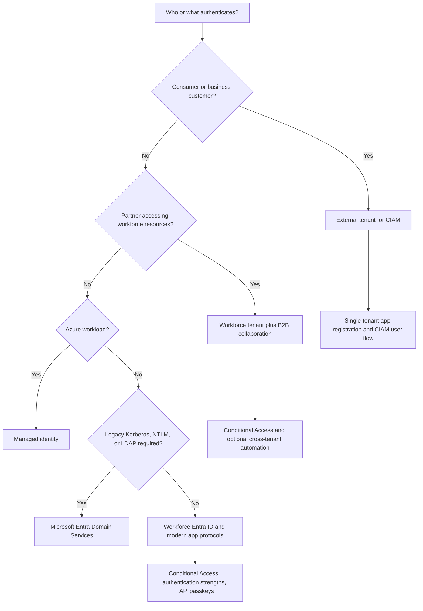

# Authentication Solution Technical Guide

## Scope and study objectives

This guide supports the AZ-305 domain **Design identity, governance, and monitoring solutions**, skill **Design authentication and authorization solutions**, and task **Recommend an authentication solution**. It consolidates the 20 source notes into an architecture-focused reference covering workforce authentication, customer identity, B2B automation, hybrid and legacy authentication, application sign-in, and workload identity.

- Choose the tenant and identity model from the user population and required governance features.
- Match authentication controls to the application execution model and assurance requirement.
- Account for service limits, token behavior, propagation delays, licensing, and unsupported combinations before recommending a design.
- Distinguish authentication from authorization: proving an identity is not the same as deciding what that identity can access.

## Missed-question priorities

These seven distinctions were explicitly associated with incorrect choices in the source notes. They receive extra emphasis because each is a plausible architecture-level distractor.

| Misconception or distractor | Correct rule | Why the distinction matters |
|---|---|---|
| Email one-time passcode (OTP) used for primary sign-in can also be reused as the second factor. | In an external tenant, email OTP can be either a first factor or a second factor, but not both in the same authentication. Email-OTP primary users can use only SMS as the secondary method. [MFA in external tenants — Enabling MFA methods](https://learn.microsoft.com/en-us/entra/external-id/customers/concept-multifactor-authentication-customers#enabling-mfa-methods) | A primary-method choice removes an MFA option and also blocks passkey enrollment for that account type. |
| Device platform is unsupported in an external tenant's Conditional Access policies. | Device platform and location are supported conditions; sign-in risk and user risk are not, because Microsoft Entra ID Protection is unavailable in external tenants. [Supported features — Conditional Access](https://learn.microsoft.com/en-us/entra/external-id/customers/concept-supported-features-customers#conditional-access) | The tenant type determines which risk signals exist, so a risk-based policy requirement can force a workforce-tenant/B2B design instead of CIAM. |
| A Continuous Access Evaluation (CAE) access token lasts 90 days. | A CAE session can use a long-lived access token for up to 28 hours. Ninety days is the default refresh-token lifetime for most non-SPA scenarios. [Continuous access evaluation — Token lifetime](https://learn.microsoft.com/en-us/entra/identity/conditional-access/concept-continuous-access-evaluation#token-lifetime) | Access tokens authorize resource calls; refresh tokens obtain replacement tokens. Confusing them produces incorrect revocation and session designs. |
| Microsoft Entra Domain Services requires Premium for additional replica sets. | Enterprise is the default and minimum SKU for multiple replica sets; Premium also supports them. [Replica sets — Deployment considerations](https://learn.microsoft.com/en-us/entra/identity/domain-services/concepts-replica-sets#deployment-considerations) | Select the minimum SKU that meets resilience requirements instead of assuming every geographic feature requires Premium. |
| The authentication methods policy has a 1-MB size limit. | Microsoft announced a dedicated **20-KB** allocation for the passkey (FIDO2) policy; the remaining authentication methods retain their existing shared limit. [Expanded policy storage for passkeys](https://learn.microsoft.com/en-us/entra/fundamentals/whats-new#expanded-policy-storage-for-passkeys-fido2-in-microsoft-entra-id) | Excessive group targeting can prevent policy updates from being saved; policy size must be treated as a deployment constraint. |
| A Temporary Access Pass (TAP) can last at most seven days. | A TAP can be configured from **10 through 43,200 minutes**, so its maximum is **30 days**. [Temporary Access Pass — policy settings](https://learn.microsoft.com/en-us/entra/identity/authentication/howto-authentication-temporary-access-pass#enable-the-temporary-access-pass-policy) | TAP is a short-lived bootstrap or recovery credential, and its actual bounds—not a familiar seven-day distractor—govern onboarding design. |
| Managed-identity authorization changes follow the normal one-hour user-token pattern. | Azure's managed-identity back end caches tokens per resource URI for around **24 hours**; group or role membership changes can take several hours, and the token cannot be force-refreshed. [Managed identity best practices — authorization limitation](https://learn.microsoft.com/en-us/entra/identity/managed-identities-azure-resources/managed-identity-best-practice-recommendations#limitation-of-using-managed-identities-for-authorization) | A design that depends on rapid revocation or permission changes should avoid group-membership churn for managed identities. |

## Architecture and core concepts

Authentication architecture begins with the identity population, application boundary, and protocol requirements. The following explanatory decision flow summarizes how the major solutions in the notes fit together; it is an original study diagram based on the linked product documentation.

### Workforce authentication assurance

Workforce designs use the authentication methods policy to make methods available and Conditional Access to decide when a resource requires stronger proof. Authentication strengths make the resource requirement more precise than a generic “require MFA” control.

- **Authentication strength behavior:** A strength is a Conditional Access grant control containing acceptable authentication-method combinations. Microsoft Entra ID evaluates the user's already completed and available methods during sign-in to the protected resource. [How authentication strengths work](https://learn.microsoft.com/en-us/entra/identity/authentication/concept-authentication-strength-how-it-works#how-an-authentication-strength-policy-is-evaluated-during-sign-in)
- **Built-in choices:** Microsoft supplies Multifactor authentication, Passwordless MFA, and Phishing-resistant MFA strengths. Custom strengths fill requirements that the built-ins do not express.
- **Custom limit and license:** A tenant can create up to **15 custom authentication strengths**, and using Conditional Access requires Microsoft Entra ID P1. [Create and manage custom authentication strengths — Prerequisites](https://learn.microsoft.com/en-us/entra/identity/authentication/concept-authentication-strength-advanced-options#prerequisites)
- **Advanced restrictions:** A custom strength can restrict passkeys by Authenticator Attestation GUID (AAGUID), constrain certificate-based authentication by issuer or policy object identifier, or select a targeted method such as QR-code sign-in. [Custom authentication strength advanced options](https://learn.microsoft.com/en-us/entra/identity/authentication/concept-authentication-strength-advanced-options)
- **Exam discriminator:** Enabling a method determines whether a user may register and use it. An authentication strength determines whether a completed method is strong enough for a particular resource.

### Passkey governance and enrollment

Passkeys (FIDO2) replace shared secrets with origin-bound public-key credentials and can provide phishing-resistant authentication. Workforce and external-tenant passkey implementations have materially different enforcement and enrollment capabilities.

- **Workforce passkey profiles:** Profiles provide group-targeted controls for device-bound versus synced passkeys, attestation enforcement, and AAGUID allow/block restrictions. [How to enable passkeys — Passkey profiles](https://learn.microsoft.com/en-us/entra/identity/authentication/how-to-authentication-passkeys-fido2#passkey-profiles)
  - Enabling profiles migrates the existing global passkey settings into a Default profile.
  - Opting into profiles cannot currently be reversed. [How to enable passkeys — Enable passkey profiles](https://learn.microsoft.com/en-us/entra/identity/authentication/how-to-authentication-passkeys-fido2#enable-passkey-profiles)
  - The current release announcement raises the maximum from 3 to **10 profiles per tenant** and gives the passkey policy a dedicated **20-KB** allocation. [Expanded policy storage for passkeys](https://learn.microsoft.com/en-us/entra/fundamentals/whats-new#expanded-policy-storage-for-passkeys-fido2-in-microsoft-entra-id)
  - Attestation controls registration. A later change to require attestation does not retroactively block a previously registered unattested passkey, while a key-restriction change can block an existing AAGUID from authentication. [How to enable passkeys — Create a new passkey profile](https://learn.microsoft.com/en-us/entra/identity/authentication/how-to-authentication-passkeys-fido2#create-a-new-passkey-profile)
- **External-tenant passkey prerequisites:** Customer passkey registration currently requires a custom URL domain, an associated sign-up/sign-in user flow, an email-plus-password or username-plus-password local account, MFA completed within the previous five minutes, and a WebAuthn-capable device and browser. [Sign in with passkeys — Prerequisites](https://learn.microsoft.com/en-us/entra/external-id/customers/how-to-sign-in-with-passkey#prerequisites)
  - After registration, the passkey can be the customer's sign-in method and can satisfy MFA.
  - Email-OTP, federated, and social-identity users cannot currently register passkeys. [Sign in with passkeys — FAQ](https://learn.microsoft.com/en-us/entra/external-id/customers/how-to-sign-in-with-passkey#frequently-asked-questions)
  - External tenants do not currently support Conditional Access authentication strengths, so a passkey can be offered but cannot be required through a phishing-resistant strength. [Sign in with passkeys — Can I enforce passkeys](https://learn.microsoft.com/en-us/entra/external-id/customers/how-to-sign-in-with-passkey#can-i-enforce-passkeys-using-conditional-access-authentication-strengths)

> **Documentation correction:** The current Microsoft Entra release announcement states **10** passkey profiles and a dedicated 20-KB passkey-policy allocation, but the implementation article still says “up to three.” Treat the release announcement as the newer product statement and confirm availability in the target tenant before designing around profiles four through ten.

### Temporary Access Pass for bootstrap and recovery

A Temporary Access Pass is a time-limited credential for bootstrapping passwordless methods or recovering access. It is not a steady-state authentication method.

| TAP policy property | Default | Allowed values | Design implication |
|---|---:|---:|---|
| Minimum lifetime | 1 hour | 10–43,200 minutes | Sets the lower bound available when an administrator creates a TAP. |
| Maximum lifetime | 8 hours | 10–43,200 minutes | The maximum configurable upper bound is 30 days, not seven days. |
| Default lifetime | 1 hour | 10–43,200 minutes | An individual pass can use a value within the configured policy bounds. |
| One-time use | False | True or False | False permits reuse during the validity window; True makes every issued TAP one-time use. |
| Code length | 8 characters | 8–48 characters | Increase length when policy requires more entropy, while balancing usability. |

The values above are from [Configure a Temporary Access Pass — policy settings](https://learn.microsoft.com/en-us/entra/identity/authentication/howto-authentication-temporary-access-pass#enable-the-temporary-access-pass-policy).

- **Use TAP for:** Passwordless onboarding, initial registration of a portable phishing-resistant credential, or recovery when a user lacks a usable password or MFA method. [Plan phishing-resistant passwordless deployment — bootstrap](https://learn.microsoft.com/en-us/entra/identity/authentication/how-to-deploy-phishing-resistant-passwordless-authentication#step-2-bootstrap-a-portable-credential)
- **Do not use TAP for:** Permanent sign-in, routine service authentication, or external guest accounts.
- **Operational recommendation:** Prefer the shortest lifetime and one-time behavior that completes the verified onboarding or recovery workflow.

### Microsoft Entra External ID for customer identity

An external tenant is a distinct Microsoft Entra configuration for consumer- and business-customer applications. It separates customer accounts, customer-facing apps, and user flows from the workforce directory. [External tenant overview](https://learn.microsoft.com/en-us/entra/external-id/customers/overview-customers-ciam#create-a-dedicated-external-tenant)

- **Application registration boundary:** Apps registered in an external tenant must use **Accounts in this organizational directory only**; the external-tenant app registration is single-tenant. [Supported features — Application registration](https://learn.microsoft.com/en-us/entra/external-id/customers/concept-supported-features-customers#application-registration)
- **Authority boundary:** OpenID Connect (OIDC) and OAuth applications use the tenant's `<tenant-name>.ciamlogin.com` authority or a configured custom URL domain. [Supported features — Authority URL](https://learn.microsoft.com/en-us/entra/external-id/customers/concept-supported-features-customers#authority-url-in-openid-connect-and-oauth2-flows)
- **Primary identity choices:** Customer user flows can use local password, email OTP, social identities, Microsoft Entra federation, or custom OIDC/SAML/WS-Fed providers, subject to browser-delegated versus native-authentication support. [Identity providers for external tenants](https://learn.microsoft.com/en-us/entra/external-id/customers/concept-authentication-methods-customers)
- **Email OTP dependency chain:**
  - Email OTP as the primary factor cannot also be used as MFA, leaving SMS as the secondary option; SMS requires a linked subscription and adds transaction charges. [MFA in external tenants — Email OTP](https://learn.microsoft.com/en-us/entra/external-id/customers/concept-multifactor-authentication-customers#email-one-time-passcode)
  - Email OTP used as secondary verification must be completed within 10 minutes. This customer-MFA lifetime must not be confused with the 30-minute B2B guest email-OTP lifetime. [MFA in external tenants — Email OTP](https://learn.microsoft.com/en-us/entra/external-id/customers/concept-multifactor-authentication-customers#email-one-time-passcode)
  - If passkeys are required, choose a password-based local account rather than email-OTP primary sign-in or a federated/social identity.
- **Conditional Access subset:** External tenants support device-platform and location conditions; block, MFA, and password-reset grants; and sign-in-frequency and persistent-browser-session controls. They do not expose sign-in-risk or user-risk conditions. [Supported features — Conditional Access](https://learn.microsoft.com/en-us/entra/external-id/customers/concept-supported-features-customers#conditional-access)
- **Governance boundary:** Microsoft Entra ID Protection and Microsoft Entra ID Governance are unavailable in external tenants. Privileged Identity Management (PIM), access reviews, and risk-based Conditional Access therefore require a workforce-tenant pattern when those are firm requirements. [Supported features — General feature comparison](https://learn.microsoft.com/en-us/entra/external-id/customers/concept-supported-features-customers#general-feature-comparison)

### External-tenant authorization, scaling, and billing

Authentication gets a customer into the application; application authorization still needs a deliberate role or group model. External tenants support groups and app roles, but not inherited application access through nested groups.

- **Flat group assignments:** A group assigned to an application grants access only to direct members. Nested group membership is unsupported for application assignment in both workforce and external tenants. [Supported features — Assign users or groups to apps](https://learn.microsoft.com/en-us/entra/external-id/customers/concept-supported-features-customers#consent-and-permission-features-for-enterprise-applications)
- **App-role alternative:** Define app-specific roles in the application manifest and assign them to users, groups, or applications. App roles give the application a stable role claim and avoid treating a tenant-wide group name as application logic. [Groups and application roles support](https://learn.microsoft.com/en-us/entra/external-id/customers/reference-group-app-roles-support)
- **Directory scale:** A production external tenant has a default limit of **300,000 total user-account and application objects**; Microsoft Support can raise it. A trial tenant is limited to 10,000 objects and cannot have that trial limit extended. [External ID service limits — Endpoint request usage](https://learn.microsoft.com/en-us/entra/external-id/customers/reference-service-limits#endpoint-request-usage)
- **MAU model:** Monthly active users (MAU) are unique external users who authenticate during a calendar month. MAU billing applies to every user in an external tenant regardless of `UserType`. [External ID pricing — billing model](https://learn.microsoft.com/en-us/entra/external-id/external-identities-pricing#external-id-billing-model)
- **Free-tier calculation:** The core offer includes the first **50,000 MAU** at no charge. A note-derived example with 60,000 MAU therefore yields `60,000 - 50,000 = 10,000` billable core MAU. [Microsoft Entra licensing — External ID](https://learn.microsoft.com/en-us/entra/fundamentals/licensing#microsoft-external-id)
- **Premium add-ons:** SMS authentication and machine-to-machine authentication are transaction-based; Go-Local is MAU-based and currently available only for Australia and Japan. Premium add-on charges are additional to basic MAU billing. [External ID pricing — Premium add-ons](https://learn.microsoft.com/en-us/entra/external-id/external-identities-pricing#premium-add-ons)
- **Subscription ownership:** An external tenant can be linked to an Azure subscription for billing but cannot own it or manage subscriptions; the linked subscription belongs to a workforce tenant. [External ID pricing — subscription ownership](https://learn.microsoft.com/en-us/entra/external-id/external-identities-pricing#can-i-change-the-ownership-of-a-subscription)
- **Lifecycle context:** Azure AD B2C stopped being available for purchase by new customers on May 1, 2025. Use External ID for new CIAM designs while planning migration separately for existing B2C tenants. [Planning for CIAM](https://learn.microsoft.com/en-us/entra/external-id/customers/concept-planning-your-solution)

### B2B collaboration and automatic redemption

B2B collaboration keeps external partners in the workforce resource tenant, where workforce governance and risk controls remain available. Cross-tenant synchronization can automate user provisioning and invitation redemption, but automatic redemption requires mutual administrative consent.

1. In the **target/resource tenant**, allow inbound user synchronization from the source tenant.
2. In the target tenant's inbound trust settings, enable automatic invitation redemption.
3. In the **source/home tenant**, enable automatic redemption in the outbound trust settings for the target.
4. Test the connection and provisioning before expanding scope.

Microsoft documents that automatic redemption must be enabled in both the source outbound and target inbound settings. [Configure cross-tenant synchronization — automatic redemption](https://learn.microsoft.com/en-us/entra/identity/multi-tenant-organizations/cross-tenant-synchronization-configure#step-3-automatically-redeem-invitations-in-the-target-tenant)

- **Failure condition:** A one-sided configuration does not establish mutual trust. A connection test can fail with `AzureActiveDirectoryCrossTenantSyncPolicyCheckFailure`, whose details identify whether source outbound consent or target inbound synchronization is missing. [Cross-tenant synchronization — policy check failure](https://learn.microsoft.com/en-us/entra/identity/multi-tenant-organizations/cross-tenant-synchronization-configure#symptom---test-connection-fails-with-azureactivedirectorycrosstenantsyncpolicycheckfailure)
- **License dependency:** The automatic-redemption trust control requires Microsoft Entra ID P1 or P2; without it, the checkbox is disabled. [Cross-tenant synchronization — disabled automatic redemption](https://learn.microsoft.com/en-us/entra/identity/multi-tenant-organizations/cross-tenant-synchronization-configure#symptom---automatic-redemption-checkbox-is-disabled)
- **Design implication:** Choose B2B in a workforce tenant when partners need internal resources plus ID Protection, PIM, access reviews, or other workforce governance. Choose an external tenant when consumers need dedicated customer journeys and separation from workforce resources.

### Hybrid and legacy authentication

Microsoft Entra Domain Services supplies managed-domain capabilities such as Kerberos and NTLM for applications that cannot use modern Microsoft Entra protocols. It is a compatibility service, not a second writable identity source.

- **Legacy credential requirement:** Domain Services needs password hashes in formats suitable for NTLM and Kerberos. Microsoft Entra ID does not derive those legacy hashes from an already stored cloud password. [Enable password hash synchronization — how it works](https://learn.microsoft.com/en-us/entra/identity/domain-services/tutorial-configure-password-hash-sync#password-hash-synchronization-using-microsoft-entra-connect)
- **Hybrid users:** The current Domain Services procedure explicitly configures Microsoft Entra Connect Sync to synchronize the legacy password hashes from on-premises Active Directory Domain Services. It requires Connect version 1.1.614.0 or later and does not support legacy DirSync. [Enable password hash synchronization — requirements](https://learn.microsoft.com/en-us/entra/identity/domain-services/tutorial-configure-password-hash-sync#password-hash-synchronization-using-microsoft-entra-connect)
- **Cloud-only users:** A cloud-only user must change the password after Domain Services is enabled so Microsoft Entra ID generates the required NTLM and Kerberos hashes. [Create a managed domain — password hashes](https://learn.microsoft.com/en-us/entra/identity/domain-services/tutorial-create-instance-advanced#password-hash-synchronization)
- **One-way synchronization:** User accounts, group memberships, and credential hashes synchronize from Microsoft Entra ID to the managed domain; changes do not synchronize back. [How synchronization works in Domain Services](https://learn.microsoft.com/en-us/entra/identity/domain-services/synchronization#synchronization-from-microsoft-entra-id-to-domain-services)

#### Replica-set architecture

Each Domain Services replica set contains two managed domain controllers. Additional regional replica sets improve authentication availability for legacy workloads, but the applications and their other dependencies must also be deployed resiliently.

| Decision | Current documented behavior |
|---|---|
| Minimum SKU for more than one replica set | Enterprise; Premium is also supported. Enterprise is the default SKU. |
| Maximum replica sets | Five total: the initial set plus four additional sets. |
| Network topology | Every VNet that hosts a replica set must be peered to every other such VNet because VNet peering is not transitive. |
| Billing | Each replica set is billed hourly at the managed domain's configured SKU. |
| Downgrade | A managed domain with multiple replica sets cannot move to Standard while those additional sets exist. |

These constraints are documented in [Replica sets concepts and features](https://learn.microsoft.com/en-us/entra/identity/domain-services/concepts-replica-sets#deployment-considerations).

### Publishing private web applications

Microsoft Entra Application Proxy publishes on-premises web applications without opening inbound connections and can put Microsoft Entra preauthentication and Conditional Access in front of them. Its back-end timeout is a hard architecture boundary for synchronous requests.

- **Default:** The back-end application timeout is **85 seconds**.
- **Long:** Selecting Long raises it to **180 seconds**, and it cannot be extended beyond that ceiling. [Application Proxy FAQ — back-end timeout](https://learn.microsoft.com/en-us/entra/identity/app-proxy/application-proxy-faq#what-is-the-length-of-the-default-and-long-backend-timeout-can-the-timeout-be-extended)
- **Use Long when:** A legitimate request, authentication step, database query, or report regularly needs more than 85 seconds but less than three minutes.
- **Redesign when:** Synchronous work regularly exceeds 180 seconds. Convert it to an asynchronous job with polling, notification, or persisted results rather than depending on a longer proxy connection.

### Application authentication and redirect boundaries

Application execution context determines the correct OAuth flow. Redirect URIs are security boundaries, not merely deployment convenience settings.

#### Single-page applications

- A single-page application (SPA) executes in the browser and cannot keep a client secret confidential.
- Use the OAuth 2.0 authorization code flow with Proof Key for Code Exchange (PKCE). PKCE is required for SPAs on the Microsoft identity platform, and browser-origin requests cannot use client credentials. [Authorization code flow — SPA redirect URIs](https://learn.microsoft.com/en-us/entra/identity-platform/v2-oauth2-auth-code-flow#redirect-uris-for-single-page-apps-spas)
- Register the redirect URI with platform type `spa`; this enables the required cross-origin resource sharing behavior.
- Do not embed a client secret in browser code. Do not choose Resource Owner Password Credentials (ROPC) for an interactive SPA.
- The implicit grant remains supported for compatibility but is no longer recommended; migrate new and existing SPAs to authorization code with PKCE. [Implicit grant — Prefer the auth code flow](https://learn.microsoft.com/en-us/entra/identity-platform/v2-oauth2-implicit-grant-flow#prefer-the-auth-code-flow)

#### Redirect URI constraints

| Sign-in audience or property | Limit or rule |
|---|---|
| Work or school accounts only, whether single-tenant or multitenant | Up to **256 redirect URIs**. |
| Work/school plus personal Microsoft accounts | Up to **100 redirect URIs**. |
| Length | Each redirect URI can contain up to **256 characters**. |
| Personal-account registrations | Query parameters in redirect URIs are not allowed. |
| General format | Use HTTPS except documented localhost exceptions; path matching is case-sensitive; internationalized domain names are unsupported. |

The limits and format rules are in [Redirect URI outline and restrictions](https://learn.microsoft.com/en-us/entra/identity-platform/reply-url#what-are-the-restrictions-of-redirect-uris-for-microsoft-entra-applications).

- **Security requirements:** Maintain ownership of every configured URI, monitor its DNS, remove unused development and production endpoints, avoid wildcard reply URLs, and avoid insecure HTTP or URN schemes. [Application registration security best practices — Redirect URIs](https://learn.microsoft.com/en-us/entra/identity-platform/security-best-practices-for-app-registration#redirect-uris)
- **Scale pattern:** If an application seems to need more redirect URIs, use separate app registrations for environments or a single controlled callback plus protected state. Do not solve the limit with a permissive wildcard.

### Workload authentication with managed identities

Managed identities give Azure resources an Entra identity without application-managed secrets. User-assigned identities are independent resources that can be attached to multiple compute resources; system-assigned identities share the lifecycle of one Azure resource. [Managed identities overview](https://learn.microsoft.com/en-us/entra/identity/managed-identities-azure-resources/overview)

- **Cache behavior:** The Azure managed-identity infrastructure caches tokens per target resource URI for around 24 hours. The application may also cache the returned token.
- **Authorization propagation:** Group or app-role membership expressed as token claims does not update until a fresh token is issued; managed-identity changes can therefore take several hours.
- **No force refresh:** The managed-identity token cannot currently be forced to refresh before expiry.
- **Rapid-change pattern:** Assign the needed permission directly to a user-assigned managed identity and attach that identity to the appropriate Azure resources. Avoid adding and removing managed identities from a permission-bearing group when rapid authorization changes are required. [Managed identity best practices — authorization limitation](https://learn.microsoft.com/en-us/entra/identity/managed-identities-azure-resources/managed-identity-best-practice-recommendations#limitation-of-using-managed-identities-for-authorization)
- **Least privilege:** A user who can run code on a resource can exercise every permission of the identities attached to it. Control both downstream role assignments and who may attach or execute as the identity.

## Design decisions and tradeoffs

The correct authentication solution is the one that satisfies the identity population, protocol, assurance, governance, and operational requirements together. A familiar product that violates one hard constraint is not a valid recommendation.

| Requirement | Prefer | Avoid or reconsider | Key discriminator |
|---|---|---|---|
| Consumer-facing branded sign-up/sign-in | External tenant | Workforce guest model used as makeshift CIAM | External tenants isolate customer identities and user flows. |
| Partner access to workforce resources with PIM, access reviews, or risk controls | Workforce tenant with B2B | External tenant | ID Governance and ID Protection are unavailable in external tenants. |
| Require a precise phishing-resistant method for a workforce resource | Conditional Access authentication strength | Generic MFA when method quality matters | Strengths constrain acceptable method combinations. |
| Customer passkey sign-in | External tenant local password account, custom URL domain, MFA bootstrap | Email-OTP primary, social/federated account, or policy-enforced authentication strength | Current customer passkey prerequisites and enforcement limits are narrower. |
| Browser SPA calling APIs for a signed-in user | Authorization code with PKCE | Client secret, implicit grant for a new app, or ROPC | Browser code is a public client and cannot protect a secret. |
| Azure service-to-service authentication | Managed identity | Stored client secret when the target supports Entra authentication | Azure manages the identity credential lifecycle. |
| Legacy application requires Kerberos or NTLM | Domain Services | Assuming modern OAuth alone can satisfy the protocol | Legacy hashes and managed-domain connectivity are required. |
| Private web app needs Entra preauthentication | Application Proxy | Long synchronous transactions beyond 180 seconds | The proxy has a fixed back-end timeout ceiling. |
| Flat, app-specific authorization | App roles | Nested groups for inherited application assignment | Nested application assignment is not supported. |
| Automated B2B onboarding without consent prompts | Cross-tenant synchronization with bilateral auto-redemption | One-sided trust configuration | Both source outbound and target inbound settings must agree. |

## Requirements, limits, and operational behavior

The following table is the rapid-review constraint set. Values are scoped so that similar numbers from different features are not accidentally interchanged.

| Area | Limit or behavior | Scope |
|---|---|---|
| Custom authentication strengths | 15 | Per workforce tenant. |
| Passkey profiles | 10 in the latest release announcement | Per tenant; validate rollout because the implementation page still says 3. |
| Passkey policy storage | Dedicated 20 KB | Per tenant's passkey (FIDO2) policy. |
| External tenant objects | 300,000 by default | User accounts plus applications; support can raise the production limit. |
| External ID core free tier | First 50,000 MAU | Unique active users per calendar month across tenants linked to a subscription. |
| External-tenant email OTP MFA window | 10 minutes | Secondary verification flow. |
| CAE access token | Up to 28 hours | CAE-capable client and resource session. |
| Standard access token | Randomized 60–90 minutes, 75 minutes average | Microsoft identity platform default. [Access tokens — Token lifetime](https://learn.microsoft.com/en-us/entra/identity-platform/access-tokens#token-lifetime) |
| Refresh token | 90 days for most scenarios; 24 hours for SPAs and email-OTP flows | The client must handle expiry and revocation. [Refresh tokens — Token lifetime](https://learn.microsoft.com/en-us/entra/identity-platform/refresh-tokens#token-lifetime) |
| Domain Services replica sets | 5 maximum | One initial plus four additional per managed domain. |
| Application Proxy timeout | 85 seconds default; 180 seconds Long | Per published application's back-end request. |
| TAP lifetime | 10–43,200 minutes | Per TAP, constrained by tenant policy. |
| Redirect URIs | 256 organizational-only; 100 when personal accounts are included | Per app registration; each URI is at most 256 characters. |
| Managed-identity token cache | Around 24 hours | Back-end cache per resource URI. |

## Security and governance

Authentication controls are effective only when their surrounding administration and recovery paths are equally deliberate. Tenant choice, assignment permissions, and fallback methods define the real security boundary.

- **Prefer phishing-resistant methods:** Use passkeys, Windows Hello for Business, or certificate-based authentication when assurance requirements justify them; enforce the requirement with authentication strengths in workforce tenants.
- **Preserve recoverability:** Maintain verified onboarding and recovery procedures, issue TAPs narrowly, and give users an approved backup method rather than weakening the primary requirement.
- **Separate customer and workforce administration:** Keep customer identities in the external tenant, but recognize that subscription ownership and advanced governance remain in the workforce plane.
- **Protect authorization administration:** Restrict who can assign managed identities, edit app-role mappings, update passkey profiles, or change Conditional Access exclusions.
- **Use direct evidence for authorization:** Prefer app roles for app-specific authorization, direct role assignments to a user-assigned managed identity when propagation speed matters, and direct group membership when an enterprise-app assignment depends on groups.
- **Avoid hidden trust expansion:** Automatic B2B redemption must be bilateral; redirect URI ownership must be continuously maintained; attached managed identities make their permissions available to code running on the host resource.

## Configuration, validation, and troubleshooting

Configuration should proceed from prerequisites to narrow pilots and then wider rollout. Validate both the positive path and the expected failure path before treating the design as complete.

### Authentication methods and passkeys

1. Inventory user groups, current authentication methods, recovery methods, device support, and application assurance requirements.
2. Enable the required authentication methods for a pilot population.
3. Define passkey profiles and AAGUID/attestation requirements, accounting for the 20-KB passkey-policy allocation.
4. Create authentication strengths for workforce resources that need a method stricter than generic MFA.
5. Test registration before enabling enforcement; a user who cannot register an allowed method can be blocked from the resource.
6. Monitor policy size and consolidate targeting when saves begin failing rather than multiplying small group references.

### External ID

1. Create or select the external tenant and link it to a workforce-owned Azure subscription for billing.
2. Register the application as single-tenant and create the sign-up/sign-in user flow.
3. Choose primary methods only after evaluating their downstream MFA and passkey compatibility.
4. If using customer passkeys, configure the custom URL domain, build the credential-management experience, and require recent MFA for registration.
5. Apply only Conditional Access conditions and grants that external tenants support.
6. Test application assignment with direct group members; do not use a nested group as proof of inherited access.
7. Track object count and MAU separately because directory capacity and billing measure different things.

### Domain Services and Application Proxy

1. Confirm that the application truly requires Kerberos, NTLM, LDAP, or a managed domain rather than a modern protocol integration.
2. For hybrid users, configure the documented legacy-hash synchronization path and verify that affected users can authenticate.
3. For cloud-only users, require a password change after enabling Domain Services.
4. For multiple replica sets, use Enterprise or Premium, create a full-mesh peering topology, and deploy the application dependencies in each resilience region.
5. For Application Proxy, test at the 85-second default before selecting Long; redesign any request that can exceed 180 seconds.

### Managed identity permission changes

1. Identify the exact target resource URI because the infrastructure cache is maintained per resource.
2. Determine whether the permission is direct or supplied through a group or app-role claim.
3. Do not repeatedly request tokens expecting a new authorization state; the platform can return the cached token.
4. Allow several hours for existing membership-based changes, up to the roughly 24-hour cache window.
5. If that delay violates the requirement, redesign around direct permission on a user-assigned managed identity before production rollout.

## Common misconceptions and exam discriminators

- **MFA is not a strength definition.** “Require MFA” allows any qualifying MFA combination; an authentication strength narrows the accepted methods.
- **External ID does not equal workforce B2B.** CIAM external tenants optimize customer journeys; workforce tenants retain enterprise governance for employees and partners.
- **Email OTP has context-specific lifetimes.** Customer email OTP used for MFA has a 10-minute completion window, while B2B guest email OTP is documented as valid for 30 minutes. [Email OTP for B2B guest users — user experience](https://learn.microsoft.com/en-us/entra/external-id/one-time-passcode#user-experience-for-one-time-passcode-guest-users)
- **Risk and device platform are different signals.** External tenants support device-platform and location conditions but not user-risk or sign-in-risk conditions.
- **A 28-hour CAE token is not weaker by duration alone.** CAE-capable resources can reject an unexpired token after critical events or applicable policy changes.
- **Enterprise, not Premium, is the minimum multi-replica Domain Services SKU.** Premium may meet the requirement, but it is not the least-cost qualifying answer.
- **TAP is not a seven-day credential.** Its hard maximum is 43,200 minutes, and architects should normally issue it for much less.
- **Managed-identity permissions are not immediately revocable through group churn.** The back-end token cache is the controlling delay.
- **External-tenant applications are single-tenant registrations.** Multitenant SaaS for many workforce directories belongs in a workforce tenant design.
- **Nested groups do not grant inherited enterprise-application access.** Assign direct users/groups or use app roles.
- **A SPA is not a confidential client.** Authorization code with PKCE replaces a stored secret; it does not make browser code capable of protecting one.
- **Redirect URI quantity is audience-dependent.** Adding personal Microsoft accounts reduces the maximum from 256 to 100 and prohibits query parameters.

## Architecture summary

Recommend the tenant model first, then the authentication method and enforcement control, then the authorization model, and finally the operational limits. That order prevents a downstream feature—such as risk-based Conditional Access, passkey enforcement, legacy protocol support, or rapid workload-permission changes—from invalidating the design.

1. **Classify the principal:** Workforce user, partner, customer, application, or Azure resource.
2. **Choose the identity boundary:** Workforce tenant, workforce B2B, external tenant, or managed identity.
3. **Match the protocol:** OIDC/OAuth with authorization code and PKCE for SPAs; managed identity for Azure workloads; Domain Services for Kerberos/NTLM compatibility.
4. **Set assurance:** Make methods available, then enforce generic MFA or a precise authentication strength where supported.
5. **Choose authorization:** Direct app assignment, flat groups, app roles, Azure RBAC, or direct permissions on a user-assigned managed identity.
6. **Validate constraints:** Licensing, tenant feature availability, policy size, object scale, MAU billing, token lifetime, cache propagation, timeouts, and regional topology.
7. **Pilot and recover:** Test positive and failure paths, maintain a strong recovery method, and monitor for configuration or documentation changes.

## Final review checklist

- [ ] I can explain why email OTP used as External ID primary sign-in cannot also be the MFA method and why that leaves SMS as the secondary option.
- [ ] I can identify device platform and location as supported external-tenant Conditional Access conditions, while user risk and sign-in risk are unsupported.
- [ ] I can distinguish a CAE access token of up to 28 hours from a refresh token that is 90 days in most scenarios.
- [ ] I can select Enterprise as the minimum Domain Services SKU for additional replica sets and remember the five-set maximum.
- [ ] I can identify the dedicated 20-KB passkey-policy allocation and design group targeting to stay within policy storage.
- [ ] I can state the TAP lifetime range of 10–43,200 minutes and use TAP only for bootstrap or recovery.
- [ ] I can account for the managed-identity cache of around 24 hours and choose direct permission on a user-assigned identity when changes must propagate quickly.
- [ ] I can choose a workforce tenant for partner governance and an external tenant for isolated CIAM journeys.
- [ ] I can register an external-tenant application as single-tenant and use its `ciamlogin.com` or custom-domain authority.
- [ ] I can list the external-tenant passkey prerequisites and explain why email-OTP/social/federated users cannot currently enroll.
- [ ] I can choose direct group membership or app roles instead of nested-group application inheritance.
- [ ] I can calculate billable core MAU above the first 50,000 and keep MAU separate from the 300,000-object default directory limit.
- [ ] I can configure bilateral automatic redemption for cross-tenant synchronization.
- [ ] I can explain why hybrid Domain Services users need legacy hash synchronization and why cloud-only users must change their passwords.
- [ ] I can state Application Proxy's 85-second default and 180-second maximum back-end timeouts.
- [ ] I can choose authorization code with PKCE and no client secret for a SPA.
- [ ] I can apply the 256-versus-100 redirect URI limit based on sign-in audience and enforce redirect ownership and HTTPS.

## Documentation and interpretation notes

- **Passkey profile count conflict:** The newer Microsoft Entra release announcement says the maximum increased from 3 to 10, while the current passkey implementation article still says 3. The guide uses 10 as the current announced limit and recommends tenant-level verification until the implementation page catches up.
- **Domain Services and Cloud Sync:** Microsoft now describes Cloud Sync as its strategic hybrid synchronization direction and documents general password-hash synchronization parity. The reviewed Domain Services legacy NTLM/Kerberos hash procedure, however, still specifically documents Microsoft Entra Connect Sync. Do not infer that general Cloud Sync password-hash support automatically satisfies the Domain Services legacy-hash procedure; validate the current supported migration path for that dependency. [Cloud Sync decision guide](https://learn.microsoft.com/en-us/entra/identity/hybrid/cloud-sync/connect-to-cloud-sync-decision-guide) and [Domain Services legacy hash procedure](https://learn.microsoft.com/en-us/entra/identity/domain-services/tutorial-configure-password-hash-sync)
- **Email OTP lifetime scope:** The 10-minute value in this guide is for email OTP as customer MFA in an external tenant. B2B guest fallback email OTP is a different flow with a documented 30-minute code lifetime.
- No other material claim remained unsupported after the official-documentation coverage pass.
