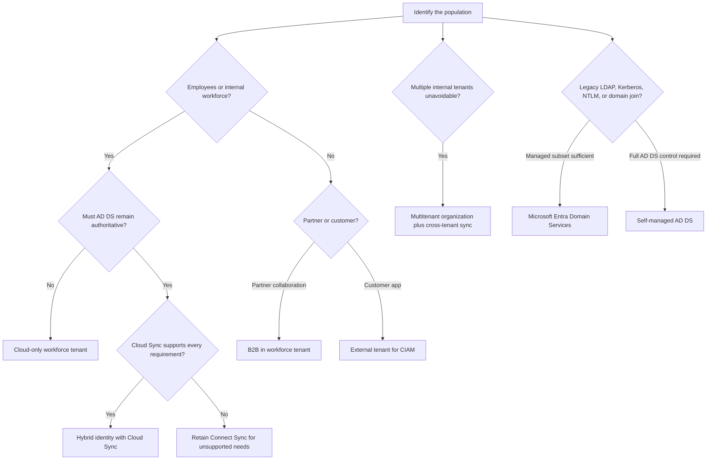
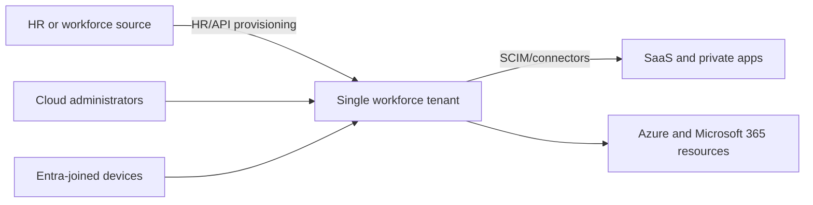
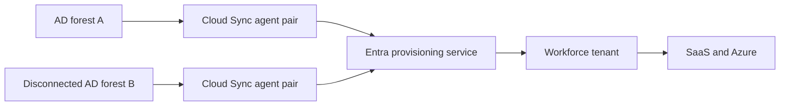
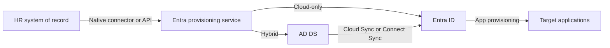
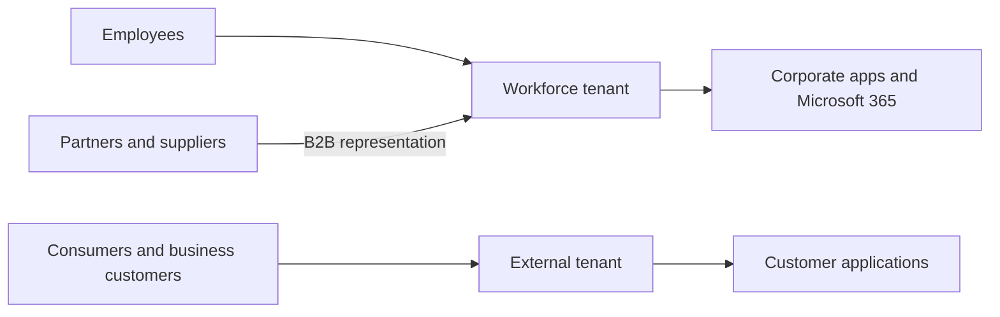
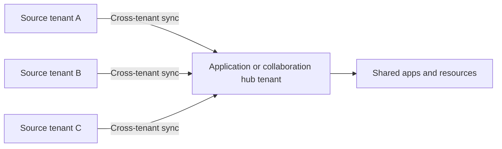
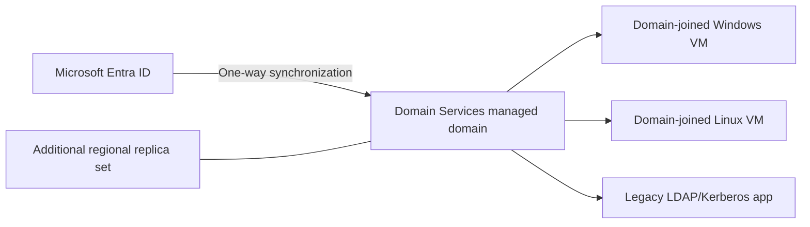

# AZ-305 Study Guide: Recommend an identity management solution

> **Exam task:** Design authentication and authorization solutions — Recommend an identity management solution
>
> **Domain:** Design identity, governance, and monitoring solutions
>
> **Estimated reading time:** 45 minutes
>
> **Matched task source:** Exact match in the [official AZ-305 study guide](https://learn.microsoft.com/en-us/credentials/certifications/resources/study-guides/az-305#design-authentication-and-authorization-solutions), the supplied `Skills.psd1`, and the supplied Study Guide Map.
>
> **Scope boundary:** This guide covers identity populations, authoritative sources, tenant and directory topology, hybrid synchronization, external identities, provisioning, device identities, and legacy domain requirements. Authentication methods, Azure and on-premises authorization, secrets and certificates, and detailed identity-governance controls are adjacent AZ-305 tasks and appear only when they change the identity-management recommendation.

---

## How to use this guide

Work through the guide in three passes:

1. Learn the decision vocabulary: **workforce versus external**, **cloud-only versus hybrid**, **single tenant versus multiple tenants**, **directory synchronization versus application provisioning**, and **Microsoft Entra ID versus Domain Services versus self-managed AD DS**. These are the distinctions behind the broad exam wording. ([Identity architecture design](https://learn.microsoft.com/en-us/azure/architecture/identity/identity-start-here))
2. Use the decision framework and comparison tables to translate requirement clues into a recommended architecture. AZ-305 usually cares more about why a topology is appropriate than about the portal clicks used to create it. ([AZ-305 audience profile](https://learn.microsoft.com/en-us/credentials/certifications/resources/study-guides/az-305#audience-profile))
3. Finish with the traps, scenarios, and quick-reference tables. For every weak area, follow the inline Microsoft Learn link to the narrowest relevant article rather than rereading an entire documentation set.

By the end, you should be able to determine:

- which tenant configuration and account type should hold each identity population;
- whether a workforce should be cloud-only or synchronized with Active Directory;
- whether Cloud Sync or Connect Sync meets a hybrid requirement;
- when B2B collaboration, a multitenant organization, or an external tenant is the correct external-identity model;
- where HR-driven, API-driven, cross-tenant, and application provisioning fit in an end-to-end lifecycle;
- when Microsoft Entra ID is insufficient because a workload requires LDAP, Kerberos, NTLM, Group Policy, or traditional domain join; and
- which requirements actually belong to authentication, authorization, secret management, monitoring, or identity governance instead.

When reading a scenario, underline the nouns that identify the population and boundary—**employee**, **subsidiary**, **supplier**, **consumer**, **device**, **SaaS account**, **legacy server**—then underline hard constraints such as **authoritative HR source**, **disconnected forests**, **single tenant**, **administrative isolation**, **LDAP**, **data residency**, **automatic deprovisioning**, and **minimum on-premises infrastructure**. Match those clues to the architecture before considering individual features.

---

## Primary source set

### Exam and module sources

- [Official AZ-305 study guide](https://learn.microsoft.com/en-us/credentials/certifications/resources/study-guides/az-305) — confirms the current domain, skill, task wording, and adjacent objectives.
- [Design authentication and authorization solutions](https://learn.microsoft.com/en-us/training/modules/design-authentication-authorization-solutions/) — the primary AZ-305 module covering IAM, Microsoft Entra ID, B2B, customer identity, Conditional Access, identity protection, access reviews, service principals, managed identities, and Key Vault.
- [Design for identity and access management](https://learn.microsoft.com/en-us/training/modules/design-authentication-authorization-solutions/2-design-for-identity-access-management) — introduces unified identity management and the workforce, partner, and customer decision.
- [Design for Microsoft Entra ID](https://learn.microsoft.com/en-us/training/modules/design-authentication-authorization-solutions/3-design-for-azure-active-directory) — introduces cloud-only and hybrid identity, centralized management, and the single-authoritative-source preference.
- [Design for Microsoft Entra B2B](https://learn.microsoft.com/en-us/training/modules/design-authentication-authorization-solutions/4-design-business-business) and [design for business-to-customer identity](https://learn.microsoft.com/en-us/training/modules/design-authentication-authorization-solutions/5-design-business-customer) — establish the partner-versus-customer boundary.

### Core product documentation

- [Microsoft Entra ID](https://learn.microsoft.com/en-us/entra/identity/) and [enterprise user management](https://learn.microsoft.com/en-us/entra/identity/users/) — core workforce directory, users, groups, licenses, domains, devices, and administration.
- [Hybrid identity overview](https://learn.microsoft.com/en-us/entra/identity/hybrid/whatis-hybrid-identity) and [Cloud Sync decision guide](https://learn.microsoft.com/en-us/entra/identity/hybrid/cloud-sync/connect-to-cloud-sync-decision-guide) — common identity and synchronization-tool selection.
- [Microsoft Entra External ID](https://learn.microsoft.com/en-us/entra/external-id/external-identities-overview) — B2B collaboration in workforce tenants and CIAM in external tenants.
- [Application provisioning](https://learn.microsoft.com/en-us/entra/identity/app-provisioning/user-provisioning) and [HR-driven provisioning](https://learn.microsoft.com/en-us/entra/identity/app-provisioning/what-is-hr-driven-provisioning) — account creation, update, and deprovisioning across systems.
- [Multitenant user management](https://learn.microsoft.com/en-us/entra/architecture/multi-tenant-user-management-introduction) and [cross-tenant synchronization](https://learn.microsoft.com/en-us/entra/identity/multi-tenant-organizations/cross-tenant-synchronization-overview) — identity lifecycle when one tenant cannot meet the organizational topology.
- [Compare Microsoft directory-based services](https://learn.microsoft.com/en-us/entra/identity/domain-services/compare-identity-solutions) and [Microsoft Entra Domain Services](https://learn.microsoft.com/en-us/entra/identity/domain-services/overview) — modern cloud directory versus managed or self-managed traditional domain services.
- [Device identity](https://learn.microsoft.com/en-us/entra/identity/devices/overview) — registered, joined, and hybrid joined device objects.

### Supporting architecture and framework sources

- [Azure Architecture Center identity guidance](https://learn.microsoft.com/en-us/azure/architecture/identity/identity-start-here) — design entry point and related reference architectures.
- [Azure identity-management best practices](https://learn.microsoft.com/en-us/azure/security/fundamentals/identity-management-best-practices) — centralization, single authoritative directory, connected tenants, and Zero Trust principles.
- [External identity deployment architectures](https://learn.microsoft.com/en-us/entra/architecture/external-identity-deployment-architectures) — compares workforce collaboration, isolated partner, consumer, and combined patterns.
- [Resource isolation with multiple tenants](https://learn.microsoft.com/en-us/entra/architecture/secure-multiple-tenants) — explains when tenant separation is justified and what it costs operationally.
- [Microsoft Entra architecture](https://learn.microsoft.com/en-us/entra/architecture/architecture) and [IAM resilience](https://learn.microsoft.com/en-us/entra/architecture/resilience-overview) — global service design and dependency-aware resilience.
- [Microsoft Entra licensing](https://learn.microsoft.com/en-us/entra/fundamentals/licensing), [External ID pricing](https://learn.microsoft.com/en-us/entra/external-id/external-identities-pricing), and [Domain Services replica sets](https://learn.microsoft.com/en-us/entra/identity/domain-services/concepts-replica-sets) — licensing, consumption, and redundancy cost drivers.
- [Microsoft Entra monitoring and health](https://learn.microsoft.com/en-us/entra/identity/monitoring-health/overview-monitoring-health) and [Microsoft Entra Backup and Recovery](https://learn.microsoft.com/en-us/entra/backup/overview) — operations and recoverability implications.

### Discovery notes from the Study Guide Map

The supplied map considered Microsoft Entra ID, workforce tenants, users and groups, dynamic membership, group-based licensing, custom domains, device identities, AD DS, Cloud Sync, Connect Sync, External ID, B2B collaboration, external tenants, legacy Azure AD B2C, multitenant organizations, cross-tenant synchronization, Domain Services, SCIM, HR/API-driven provisioning, Microsoft Identity Manager, Microsoft Graph, managed identities, Workload ID, and ID Governance.

The map's forum-discovery note says candidates frequently discuss hybrid identity, external identities, tenant design, lifecycle, RBAC, PIM, and access reviews. Those discussions are **nonauthoritative discovery signals only**; all recommendations in this guide are grounded in official Microsoft sources, and RBAC, PIM, and access reviews are kept at the adjacent-task boundary.

The map also highlights that no single documentation set covers the whole task. Download first: Microsoft Entra ID, Hybrid identity, Microsoft Entra External ID, Application provisioning, Microsoft Entra Domain Services, and the architecture guidance.

---

## 1. Exam task scope

### What the task is asking

The architect is being asked to recommend the **identity system and identity lifecycle architecture**, not merely a login method. The recommendation determines where identities are mastered, which directory holds them, how copies are created and removed, which tenant boundary applies, and whether modern identity protocols or traditional domain services are required. ([Identity architecture design](https://learn.microsoft.com/en-us/azure/architecture/identity/identity-start-here))

The likely design decisions are:

- **Population:** workforce, partner/guest, customer, device, application/workload, or legacy computer account. [External ID distinguishes workforce B2B from customer CIAM](https://learn.microsoft.com/en-us/entra/external-id/external-identities-overview), while Microsoft Entra ID stores users, groups, devices, applications, and service principals. ([Microsoft Entra ID documentation](https://learn.microsoft.com/en-us/entra/identity/))
- **Authority:** cloud directory, on-premises AD DS, HR system, another tenant, or external identity provider. [HR-driven provisioning](https://learn.microsoft.com/en-us/entra/identity/app-provisioning/what-is-hr-driven-provisioning) makes the HR platform the source for workforce identity attributes, while hybrid synchronization preserves AD DS authority for synchronized objects.
- **Topology:** one workforce tenant, multiple workforce tenants, a workforce tenant plus external tenant, or a managed/self-managed domain. Microsoft recommends [a single tenant when possible](https://learn.microsoft.com/en-us/entra/architecture/multi-tenant-user-management-introduction), because multiple tenants add identity copies, policies, administration, monitoring, and lifecycle coordination.
- **Movement:** directory synchronization, cross-tenant synchronization, HR/API-driven inbound provisioning, or application provisioning. These flows solve different source-to-target problems even though they all create or update identity objects. ([Provisioning overview](https://learn.microsoft.com/en-us/entra/identity/app-provisioning/user-provisioning))
- **Protocol requirement:** modern cloud identity or traditional LDAP/Kerberos/NTLM/domain services. [Microsoft's directory-service comparison](https://learn.microsoft.com/en-us/entra/identity/domain-services/compare-identity-solutions) separates Entra ID from Domain Services and self-managed AD DS.

### In scope

- Microsoft Entra workforce-tenant design, user/group/domain structure, and device identity.
- Cloud-only versus hybrid identity and Cloud Sync versus Connect Sync.
- Authoritative identity source and automated create/update/deactivate flows.
- B2B partner identities, external tenants for customers, and multitenant organizations.
- Microsoft Entra ID versus Domain Services versus self-managed AD DS.
- Identity-specific resiliency, licensing, monitoring, and recovery implications.

### Out of scope except as a dependency

> **Adjacent task context:** Choosing MFA, passwordless methods, Conditional Access, or PHS/PTA/federation as a **sign-in method** belongs to “Recommend an authentication solution.” Synchronizing a user and authenticating that user are separate decisions. ([Hybrid identity](https://learn.microsoft.com/en-us/entra/identity/hybrid/whatis-hybrid-identity))

> **Adjacent task context:** Choosing Azure RBAC roles and scopes belongs to “Recommend a solution for authorizing access to Azure resources.” Creating the user or group is identity management; deciding what it may do is authorization. ([Azure RBAC overview](https://learn.microsoft.com/en-us/azure/role-based-access-control/overview))

> **Adjacent task context:** PIM, access reviews, entitlement management, and Lifecycle Workflows belong primarily to “Recommend a solution for identity governance.” This guide includes provisioning and lifecycle source decisions but does not turn them into a full governance design. ([Identity Governance overview](https://learn.microsoft.com/en-us/entra/id-governance/identity-governance-overview))

> **Adjacent task context:** Managed identities and Workload ID are identity types, but choosing how an application authenticates to Azure is primarily covered by the application-identity and authorization tasks. ([Managed identities](https://learn.microsoft.com/en-us/entra/identity/managed-identities-azure-resources/overview))

### Mental boundary

Use this sentence to keep the tasks straight:

> **Identity management decides what identity object exists, where it is authoritative, where it is represented, and how its lifecycle flows. Authentication proves control of that identity. Authorization determines what the identity can do. Governance keeps access appropriate over time.** ([Microsoft identity and access management fundamentals](https://learn.microsoft.com/en-us/entra/fundamentals/identity-fundamental-concepts))

---

## 2. Product and topic discovery pass

| Product, service, or topic | Why it may be relevant | Primary Microsoft source | In-scope or adjacent? |
|---|---|---|---|
| Microsoft Entra ID | Core workforce directory and cloud IAM service for users, groups, devices, apps, and resources. | [Microsoft Entra ID](https://learn.microsoft.com/en-us/entra/identity/) | Core |
| Workforce tenant | Holds employees, internal apps, and organizational resources; can also contain B2B guests. | [Tenant configurations](https://learn.microsoft.com/en-us/entra/external-id/tenant-configurations) | Core |
| Users, groups, domains, and licenses | Define the manageable directory population and scalable assignment units. | [Enterprise user management](https://learn.microsoft.com/en-us/entra/identity/users/) | Core |
| Device identity | Represents BYOD, organization-owned, and hybrid-joined devices in the directory. | [Device identity](https://learn.microsoft.com/en-us/entra/identity/devices/overview) | Core/supporting |
| Active Directory Domain Services | Existing or self-managed source for traditional domain identities and protocols. | [Compare directory services](https://learn.microsoft.com/en-us/entra/identity/domain-services/compare-identity-solutions) | Core when legacy/hybrid |
| Hybrid identity | Creates a common identity for on-premises and cloud resources. | [Hybrid identity](https://learn.microsoft.com/en-us/entra/identity/hybrid/whatis-hybrid-identity) | Core |
| Microsoft Entra Cloud Sync | Cloud-managed synchronization using lightweight on-premises agents; strategic direction for supported hybrid scenarios. | [Cloud Sync](https://learn.microsoft.com/en-us/entra/identity/hybrid/cloud-sync/what-is-cloud-sync) | Core |
| Microsoft Entra Connect Sync | On-premises synchronization engine retained where Cloud Sync does not yet meet requirements. | [Connect Sync](https://learn.microsoft.com/en-us/entra/identity/hybrid/connect/how-to-connect-sync-whatis) | Core/conditional |
| Microsoft Entra External ID B2B | Represents partners as external users in a workforce tenant while they keep home credentials. | [B2B collaboration](https://learn.microsoft.com/en-us/entra/external-id/what-is-b2b) | Core |
| External tenant / CIAM | Separate tenant configuration for consumer and business-customer applications, self-service sign-up, and customer profiles. | [External tenant overview](https://learn.microsoft.com/en-us/entra/external-id/customers/overview-customers-ciam) | Core |
| Azure AD B2C | Legacy CIAM product for existing customers; not available to new customers since May 1, 2025. | [B2C FAQ](https://learn.microsoft.com/en-us/azure/active-directory-b2c/faq) | Conditional legacy |
| Multitenant organization | Coordinates collaboration and user experience across workforce tenants within one organization. | [Multitenant organizations](https://learn.microsoft.com/en-us/entra/identity/multi-tenant-organizations/) | Core when multiple tenants are required |
| Cross-tenant synchronization | Pushes selected internal users from a source tenant into a target tenant as B2B users and manages their lifecycle. | [Cross-tenant synchronization](https://learn.microsoft.com/en-us/entra/identity/multi-tenant-organizations/cross-tenant-synchronization-overview) | Core when multiple tenants are required |
| Application provisioning / SCIM | Creates, updates, and deprovisions app accounts and roles from Entra ID. | [Application provisioning](https://learn.microsoft.com/en-us/entra/identity/app-provisioning/user-provisioning) | Core |
| HR-driven provisioning | Uses HR as the source for workforce joiner, mover, and leaver identity data. | [HR-driven provisioning](https://learn.microsoft.com/en-us/entra/identity/app-provisioning/what-is-hr-driven-provisioning) | Core |
| API-driven inbound provisioning | Integrates arbitrary systems of record through a bulk SCIM-schema API processed by the Entra provisioning service. | [Inbound provisioning concepts](https://learn.microsoft.com/en-us/entra/identity/app-provisioning/inbound-provisioning-api-concepts) | Supporting/core for custom sources |
| Microsoft Entra Domain Services | Managed domain join, Group Policy, LDAP, Kerberos, and NTLM for legacy workloads. | [Domain Services](https://learn.microsoft.com/en-us/entra/identity/domain-services/overview) | Core when legacy protocols are required |
| Microsoft Entra Backup and Recovery | Recovers supported workforce-tenant objects and policies after accidental or malicious change. | [Backup and Recovery](https://learn.microsoft.com/en-us/entra/backup/overview) | Supporting resiliency |
| Conditional Access, ID Protection, PIM, access reviews | Secure and govern identities after the population and topology are chosen. | [Microsoft Entra licensing and feature matrix](https://learn.microsoft.com/en-us/entra/fundamentals/licensing) | Adjacent |
| Managed identities and Workload ID | Represent nonhuman workloads rather than workforce, partner, customer, or device populations. | [Workload identities](https://learn.microsoft.com/en-us/entra/workload-id/workload-identities-overview) | Adjacent |

> **Test yourself**
>
> - A company says “keep one account for Microsoft 365 and on-premises file servers.” Is the first decision synchronization or MFA?
> - A SaaS application supports SAML SSO but accumulates departed-user accounts. Which identity-management capability is missing?
> - A supplier already has an identity in its own Entra tenant. Should the resource company create and manage a password for that supplier?
>
> **Answer guidance:** First decide on [hybrid identity synchronization](https://learn.microsoft.com/en-us/entra/identity/hybrid/whatis-hybrid-identity); authentication is a separate task. Add [automated application provisioning and deprovisioning](https://learn.microsoft.com/en-us/entra/identity/app-provisioning/user-provisioning), because SSO alone does not manage the target account lifecycle. Use [B2B collaboration](https://learn.microsoft.com/en-us/entra/external-id/what-is-b2b) so the supplier retains its home identity and credential.

---

## 3. Starting point from Microsoft Learn

The AZ-305 module begins with four qualities of a strong IAM design: unified identity management, a seamless experience, adaptive access, and simplified governance. For this task, the important item is **unified identity management**—manage identities and application access centrally across cloud and on-premises environments. ([Design for IAM](https://learn.microsoft.com/en-us/training/modules/design-authentication-authorization-solutions/2-design-for-identity-access-management))

The module then identifies three population-level choices:

- [Microsoft Entra ID](https://learn.microsoft.com/en-us/training/modules/design-authentication-authorization-solutions/3-design-for-azure-active-directory) for workforce identities in cloud-only or hybrid organizations;
- [B2B collaboration](https://learn.microsoft.com/en-us/training/modules/design-authentication-authorization-solutions/4-design-business-business) for suppliers, vendors, and partners who should use identities managed outside the resource tenant; and
- [Microsoft Entra External ID in an external tenant](https://learn.microsoft.com/en-us/training/modules/design-authentication-authorization-solutions/5-design-business-customer) for customer-facing applications and self-service customer identity.

Microsoft's training recommends a [single Microsoft Entra instance and centralized identity management](https://learn.microsoft.com/en-us/training/modules/design-authentication-authorization-solutions/3-design-for-azure-active-directory) when requirements permit. That reduces duplicate accounts, inconsistent policy, administrative overhead, and mistakes; multitenant guidance repeats the [single-tenant preference](https://learn.microsoft.com/en-us/entra/architecture/multi-tenant-user-management-introduction).

The module is a starting point, not enough for scenario readiness. It does not fully develop the decisions covered by the [Cloud Sync comparison](https://learn.microsoft.com/en-us/entra/identity/hybrid/cloud-sync/connect-to-cloud-sync-decision-guide), [provisioning documentation](https://learn.microsoft.com/en-us/entra/identity/app-provisioning/user-provisioning), [multitenant architecture](https://learn.microsoft.com/en-us/entra/architecture/multi-tenant-user-management-introduction), [External ID migration guidance](https://learn.microsoft.com/en-us/entra/external-id/customers/plan-your-migration-from-b2c-to-external-id), [Domain Services replica design](https://learn.microsoft.com/en-us/entra/identity/domain-services/concepts-replica-sets), or [Backup and Recovery](https://learn.microsoft.com/en-us/entra/backup/overview); use those product sources for scenario depth.

> **Exam tip:** The words **B2B** and **B2C/CIAM** are not interchangeable. B2B usually keeps the partner's account authority in its home organization and represents the person in your workforce tenant; CIAM manages customer accounts in a separate external tenant. ([External ID comparison](https://learn.microsoft.com/en-us/entra/external-id/external-identities-overview))

---

## 4. Conceptual foundation

### 4.1 Identity objects, authority, and representation

An identity architecture often has three different things that scenarios casually call “the user”:

1. the **authoritative record**, such as an HR worker record or an AD DS user;
2. the **directory identity**, such as a Microsoft Entra user object; and
3. the **target representation**, such as a Salesforce account, B2B guest object, device object, or Domain Services synchronized user.

[HR-driven provisioning](https://learn.microsoft.com/en-us/entra/identity/app-provisioning/what-is-hr-driven-provisioning) can create the directory identity from the worker record; [Cloud Sync or Connect Sync](https://learn.microsoft.com/en-us/entra/identity/hybrid/get-started) can synchronize an AD DS identity into Entra ID; and [application provisioning](https://learn.microsoft.com/en-us/entra/identity/app-provisioning/user-provisioning) can create the target application account from Entra ID.

The architect must declare which system owns each important attribute and which service propagates it. Two systems independently writing the same attribute create ambiguity, oscillation, or accidental overwrite; provisioning mappings and scoping should reflect a deliberate source-of-authority model. ([Understand application provisioning](https://learn.microsoft.com/en-us/entra/identity/app-provisioning/how-provisioning-works))

> **Exam tip:** “Create a user in Entra ID” is incomplete if the scenario names HR or AD as authoritative. Select the inbound provisioning or synchronization path first, then decide which attributes remain mastered at the source. ([HR-driven provisioning](https://learn.microsoft.com/en-us/entra/identity/app-provisioning/what-is-hr-driven-provisioning))

### 4.2 Tenant, directory, and subscription boundaries

A Microsoft Entra tenant is a dedicated directory and policy boundary containing identities, registered applications, and configuration. A workforce tenant is intended for employees and organizational resources; an external tenant is intended for applications serving consumers or business customers. ([Tenant configurations](https://learn.microsoft.com/en-us/entra/external-id/tenant-configurations))

One workforce tenant gives the organization a unified identity view and common policy surface. A second tenant creates independent directory roles, objects, Conditional Access configuration, audit data, quotas, and application registrations, so [resource isolation with multiple tenants](https://learn.microsoft.com/en-us/entra/architecture/secure-multiple-tenants) should be chosen only when delegation inside one tenant cannot satisfy the boundary.

Azure subscriptions trust a Microsoft Entra tenant for identity, but the Azure resource hierarchy is not the same as the tenant hierarchy. Moving or grouping subscriptions does not merge identities, and creating another management group does not create a new identity boundary. ([Relationship between Azure subscriptions and Entra ID](https://learn.microsoft.com/en-us/entra/fundamentals/how-subscriptions-associated-directory))

> **Exam tip:** Use management groups or administrative delegation for organizational structure when possible; choose another tenant only for a true directory, policy, administration, service, regulatory, or identity-isolation boundary. ([Multiple-tenant isolation guidance](https://learn.microsoft.com/en-us/entra/architecture/secure-multiple-tenants))

### 4.3 Cloud-only and hybrid identity

With cloud-only identity, Microsoft Entra ID is the authoritative directory for the workforce account. This minimizes on-premises synchronization infrastructure and fits organizations whose users, devices, and applications do not require AD DS account authority. ([Design for Microsoft Entra ID](https://learn.microsoft.com/en-us/training/modules/design-authentication-authorization-solutions/3-design-for-azure-active-directory))

With hybrid identity, provisioning and synchronization create a common user identity across AD DS and Microsoft Entra ID. The account is generally created or mastered in the source directory and represented in the cloud; the user then accesses both on-premises and cloud resources with a common identity. ([Hybrid identity overview](https://learn.microsoft.com/en-us/entra/identity/hybrid/whatis-hybrid-identity))

Synchronization is not the same as authentication. Cloud Sync or Connect Sync moves identity data; password hash synchronization, pass-through authentication, or federation governs how a synchronized user validates a password during sign-in. The latter choice belongs primarily to the adjacent authentication task. ([Choose a hybrid authentication method](https://learn.microsoft.com/en-us/entra/identity/hybrid/connect/choose-ad-authn))

> **Exam tip:** If the question asks **where accounts are created and how objects reach Entra ID**, choose the identity-management flow. If it asks **where a password is validated**, choose the authentication method. ([Hybrid identity](https://learn.microsoft.com/en-us/entra/identity/hybrid/whatis-hybrid-identity))

### 4.4 Provisioning is a lifecycle pipeline

[Application provisioning](https://learn.microsoft.com/en-us/entra/identity/app-provisioning/user-provisioning) creates, updates, disables, and removes accounts and roles in SaaS or private applications; SCIM is the common standards-based protocol, while connectors can also reach LDAP, SQL, REST/SOAP, PowerShell, or ECMA targets.

[HR-driven provisioning](https://learn.microsoft.com/en-us/entra/identity/app-provisioning/what-is-hr-driven-provisioning) can create cloud-only users directly in Entra ID or create users in AD DS before synchronization. [API-driven inbound provisioning](https://learn.microsoft.com/en-us/entra/identity/app-provisioning/inbound-provisioning-api-concepts) extends the model to arbitrary systems of record and lets the provisioning service apply scoping, matching, mapping, and transformation.

SAML or OpenID Connect SSO does not automatically provide full lifecycle management. JIT creation at first sign-in can create accounts, but a separate provisioning/deprovisioning path is needed when the requirement is prompt removal, preprovisioning, group synchronization, attribute management, or auditability. ([Automated versus manual provisioning](https://learn.microsoft.com/en-us/entra/identity/app-provisioning/user-provisioning#manual-vs-automatic-provisioning))

> **Exam tip:** “Users must lose SaaS access immediately when employment ends” points to an authoritative termination signal plus automated deprovisioning, not merely SSO. ([HR-driven lifecycle scenarios](https://learn.microsoft.com/en-us/entra/identity/app-provisioning/what-is-hr-driven-provisioning#enabled-hr-scenarios))

### 4.5 External identity models

In [B2B collaboration](https://learn.microsoft.com/en-us/entra/external-id/what-is-b2b), a partner normally authenticates with a home work, school, social, or other supported identity; the resource organization maintains a user object and controls access without managing the partner's password.

[B2B direct connect](https://learn.microsoft.com/en-us/entra/external-id/b2b-direct-connect-overview) establishes a mutual trust relationship and currently centers on Teams shared-channel collaboration; unlike B2B collaboration, it does not create a conventional guest object for broad application access.

An [external tenant](https://learn.microsoft.com/en-us/entra/external-id/customers/overview-customers-ciam) is a separate configuration for consumer and business-customer apps, customer profiles, self-service registration, branding, and customer identity providers. It is not the tenant in which employees consume Microsoft 365.

Azure AD B2C is a legacy CIAM option for existing customers. It has not been available for new customers since May 1, 2025, remains supported until at least May 2030, and now has documented migration paths to External ID that require feature-gap assessment. ([Plan B2C migration](https://learn.microsoft.com/en-us/entra/external-id/customers/plan-your-migration-from-b2c-to-external-id))

> **Exam tip:** “External user” is not enough information. Ask whether the person is a partner collaborating with the workforce, a user from another tenant in the same company, or a consumer of an application; each points to a different lifecycle and tenant pattern. ([External identity deployment architectures](https://learn.microsoft.com/en-us/entra/architecture/external-identity-deployment-architectures))

### 4.6 Modern directory versus traditional domain services

Microsoft Entra ID is a cloud identity and access service using modern protocols and device identity. It is not a drop-in cloud domain controller and does not directly provide traditional LDAP, Kerberos, NTLM, Group Policy, or classic domain-join services to a legacy application. ([Compare directory services](https://learn.microsoft.com/en-us/entra/identity/domain-services/compare-identity-solutions))

[Microsoft Entra Domain Services](https://learn.microsoft.com/en-us/entra/identity/domain-services/overview) supplies a managed subset of AD DS capabilities without customers deploying, patching, or administering domain controllers. It synchronizes identity information from Entra ID and fits lift-and-shift workloads that need traditional protocols but not full AD DS control.

Self-managed AD DS on Azure VMs or extended from on-premises is appropriate when the workload needs capabilities outside Domain Services, such as schema extensions or broader domain/forest administration. That flexibility adds responsibility for domain-controller availability, patching, backup, replication, DNS, and security. ([Domain Services versus self-managed AD DS](https://learn.microsoft.com/en-us/entra/identity/domain-services/compare-identity-solutions#domain-services-and-self-managed-ad-ds))

> **Exam tip:** “No domain controllers to manage” plus LDAP/Kerberos/NTLM strongly suggests Domain Services. “Schema extension,” full Domain Admin/Enterprise Admin control, or unsupported trust behavior can force self-managed AD DS. ([Directory-service feature comparison](https://learn.microsoft.com/en-us/entra/identity/domain-services/compare-identity-solutions))

### 4.7 Device identity

A device identity is a directory object used in access and configuration decisions. [Microsoft Entra registered](https://learn.microsoft.com/en-us/entra/identity/devices/concept-device-registration) fits personal/BYOD devices; [Microsoft Entra joined](https://learn.microsoft.com/en-us/entra/identity/devices/concept-directory-join) fits organization-owned cloud-managed devices; and Microsoft Entra hybrid joined fits devices that remain joined to on-premises AD DS while also being represented in Entra ID. ([Device identity overview](https://learn.microsoft.com/en-us/entra/identity/devices/overview))

Hybrid join is often a transitional pattern, not an automatic end state. If users and applications can operate cloud-first, Entra join reduces dependence on domain connectivity; if classic management, sign-in, or application requirements remain, hybrid join can preserve compatibility. ([Plan a Microsoft Entra device deployment](https://learn.microsoft.com/en-us/entra/identity/devices/plan-device-deployment))

> **Adjacent task context:** Device identity exists in this task; using device compliance as a Conditional Access signal belongs primarily to authentication/access policy design. ([Device-based Conditional Access](https://learn.microsoft.com/en-us/entra/identity/conditional-access/policy-all-users-device-registration))

> **Test yourself**
>
> - A company wants cloud-managed corporate laptops but still needs SSO to on-premises file shares. Must the laptops remain hybrid joined?
> - A migrated application requires Kerberos and Group Policy but the company refuses to operate domain controllers in Azure. Which directory service is the candidate?
> - An acquisition must remain in a separate tenant for a year. Which feature manages employee object lifecycle into the parent tenant, and is it the same as B2B invitation?
>
> **Answer guidance:** [Entra-joined devices can access on-premises resources](https://learn.microsoft.com/en-us/entra/identity/devices/device-sso-to-on-premises-resources), so hybrid join is not automatically required. Use [Microsoft Entra Domain Services](https://learn.microsoft.com/en-us/entra/identity/domain-services/overview) for managed legacy protocols. Use [cross-tenant synchronization](https://learn.microsoft.com/en-us/entra/identity/multi-tenant-organizations/cross-tenant-synchronization-overview) for automated internal multitenant lifecycle; manual B2B invitation does not provide equivalent source-driven updates and deprovisioning.

---

## 5. Design decision framework

### 5.1 Scenario decision tree

This tree is deliberately population-first. A scenario can traverse more than one branch—for example, a hybrid workforce tenant can also invite B2B guests and run a Domain Services managed domain—but each branch answers a different requirement. ([Identity architecture](https://learn.microsoft.com/en-us/azure/architecture/identity/identity-start-here))

### 5.2 Step-by-step design logic

1. **Classify the population.** Use a workforce tenant for employees, B2B for collaborating partners, an external tenant for customers, and dedicated workload identities for nonhuman actors. ([External ID overview](https://learn.microsoft.com/en-us/entra/external-id/external-identities-overview))
2. **Declare the authoritative source.** Cloud-native organizations can master users in Entra ID; hybrid organizations can master users in AD DS; lifecycle-led organizations can use HR or another system of record to initiate creation and termination. ([HR-driven provisioning](https://learn.microsoft.com/en-us/entra/identity/app-provisioning/what-is-hr-driven-provisioning))
3. **Minimize tenant count.** Begin with one workforce tenant; add another only for a requirement that scoped administration, subscriptions, groups, or policies cannot meet. ([Multitenant user management](https://learn.microsoft.com/en-us/entra/architecture/multi-tenant-user-management-introduction))
4. **Select movement paths.** Choose Cloud Sync/Connect Sync for AD-to-Entra, cross-tenant sync for internal tenant-to-tenant user lifecycle, HR/API-driven provisioning for source-to-directory, and app provisioning for directory-to-application. ([Microsoft Entra provisioning](https://learn.microsoft.com/en-us/entra/identity/app-provisioning/user-provisioning))
5. **Test hard protocol constraints.** If the application needs LDAP/Kerberos/NTLM, compare Domain Services with self-managed AD DS instead of assuming Entra ID alone will work. ([Compare directory services](https://learn.microsoft.com/en-us/entra/identity/domain-services/compare-identity-solutions))
6. **Design deletion and recovery before rollout.** Define scoping, matching, accidental-deletion thresholds, soft-delete behavior, source recovery, and ownership for every identity copy. ([API-driven provisioning recovery guidance](https://learn.microsoft.com/en-us/entra/identity/app-provisioning/inbound-provisioning-api-faqs#how-can-we-prevent-accidental-disablingdeletion-of-users))
7. **Validate licenses and operations.** P1/P2, External ID MAU billing, Domain Services hourly billing, Azure Monitor retention, and multiple replica sets can change an otherwise technically valid answer. ([Microsoft Entra licensing](https://learn.microsoft.com/en-us/entra/fundamentals/licensing))

### 5.3 Hard constraints and soft preferences

| Requirement type | Examples | Effect on the decision |
|---|---|---|
| Hard identity boundary | Independent administrators, regulatory separation, isolated directory policy, customer population | Can justify [multiple tenants or an external tenant](https://learn.microsoft.com/en-us/entra/architecture/secure-multiple-tenants). |
| Hard protocol requirement | LDAP, Kerberos, NTLM, Group Policy, classic domain join | Requires [Domain Services or self-managed AD DS](https://learn.microsoft.com/en-us/entra/identity/domain-services/compare-identity-solutions). |
| Hard lifecycle source | HR is authoritative; termination must disable all downstream accounts | Requires [HR/API-driven provisioning plus downstream provisioning](https://learn.microsoft.com/en-us/entra/identity/app-provisioning/what-is-hr-driven-provisioning). |
| Hard synchronization feature | A capability is not supported by Cloud Sync | Retain [Connect Sync until feature parity or migration eligibility](https://learn.microsoft.com/en-us/entra/identity/hybrid/cloud-sync/connect-to-cloud-sync-decision-guide). |
| Soft preference | Fewer servers, simpler administration, fewer identity copies | Favors [cloud-only, Cloud Sync, and one tenant](https://learn.microsoft.com/en-us/azure/security/fundamentals/identity-management-best-practices#centralize-identity-management). |
| Soft cost preference | Lowest license and infrastructure cost | Favors core Entra features, but must not override protocol, lifecycle, isolation, or compliance requirements. ([Microsoft Entra licensing](https://learn.microsoft.com/en-us/entra/fundamentals/licensing)) |

> **Exam tip:** Treat explicit constraints as elimination rules. “Must use LDAP” eliminates Entra ID alone; “customers self-register” eliminates ordinary workforce B2B as the primary model; “no duplicated employee identities” weighs against unnecessary tenant separation. ([External identity architectures](https://learn.microsoft.com/en-us/entra/architecture/external-identity-deployment-architectures))

> **Test yourself**
>
> - An organization has three disconnected AD forests after acquisitions and wants minimal sync-server infrastructure. What should you evaluate first?
> - A separate tenant is proposed only because two departments want different Azure subscriptions. Is that sufficient?
> - A new consumer mobile app needs branded self-service sign-up. Should it use B2B guest invitations?
>
> **Answer guidance:** Evaluate [Cloud Sync and its supported topologies](https://learn.microsoft.com/en-us/entra/identity/hybrid/cloud-sync/plan-cloud-sync-topologies). Different subscriptions do not by themselves require different identity tenants; prefer [one tenant and Azure resource delegation](https://learn.microsoft.com/en-us/entra/architecture/secure-multiple-tenants). Use an [External ID external tenant](https://learn.microsoft.com/en-us/entra/external-id/customers/overview-customers-ciam), not workforce B2B invitations, for customer CIAM.

---

## 6. Service and feature comparison tables

### 6.1 Cloud-only versus hybrid workforce identity

| Decision area | Cloud-only workforce | Hybrid workforce |
|---|---|---|
| Authority | Microsoft Entra ID is the cloud directory of record. ([Microsoft Entra ID](https://learn.microsoft.com/en-us/entra/identity/)) | AD DS or an upstream HR source typically remains authoritative and identities are synchronized. ([Hybrid identity](https://learn.microsoft.com/en-us/entra/identity/hybrid/whatis-hybrid-identity)) |
| Infrastructure | No directory-sync server or agent is required for cloud-only account creation. ([Design for Entra ID](https://learn.microsoft.com/en-us/training/modules/design-authentication-authorization-solutions/3-design-for-azure-active-directory)) | Requires Cloud Sync agents or Connect Sync infrastructure and operational ownership. ([Hybrid integration](https://learn.microsoft.com/en-us/entra/identity/hybrid/get-started)) |
| Best fit | Cloud-first users, devices, and applications without AD account dependency. ([Cloud-governed management](https://learn.microsoft.com/en-us/entra/identity/hybrid/connect/cloud-governed-management-for-on-premises)) | Users need one identity across on-premises and cloud resources or migration must preserve AD authority. ([Hybrid identity](https://learn.microsoft.com/en-us/entra/identity/hybrid/whatis-hybrid-identity)) |
| Tradeoff | Simpler, but legacy apps may need modernization or a domain-service bridge. ([Compare identity solutions](https://learn.microsoft.com/en-us/entra/identity/domain-services/compare-identity-solutions)) | Compatibility with existing processes, but adds synchronization dependencies and attribute-authority complexity. ([Cloud Sync decision guide](https://learn.microsoft.com/en-us/entra/identity/hybrid/cloud-sync/connect-to-cloud-sync-decision-guide)) |

### 6.2 Cloud Sync versus Connect Sync

| Criterion | Microsoft Entra Cloud Sync | Microsoft Entra Connect Sync |
|---|---|---|
| Control model | Configuration and orchestration are cloud-managed; lightweight agents bridge to AD DS. ([Cloud Sync overview](https://learn.microsoft.com/en-us/entra/identity/hybrid/cloud-sync/what-is-cloud-sync)) | Synchronization engine and configuration run on a managed on-premises server. ([Connect Sync](https://learn.microsoft.com/en-us/entra/identity/hybrid/connect/how-to-connect-sync-whatis)) |
| Direction | Microsoft's strategic direction for supported new and migrating hybrid scenarios. ([Decision guide](https://learn.microsoft.com/en-us/entra/identity/hybrid/cloud-sync/connect-to-cloud-sync-decision-guide)) | Retain where current requirements are not supported by Cloud Sync; Microsoft documents a phased migration program. ([Migration FAQ](https://learn.microsoft.com/en-us/entra/identity/hybrid/cloud-sync/cloud-sync-migration-faq)) |
| Forest topology | Strong fit for multiple disconnected forests and lightweight agent deployment. ([Supported topologies](https://learn.microsoft.com/en-us/entra/identity/hybrid/cloud-sync/plan-cloud-sync-topologies)) | Supports mature complex/custom synchronization configurations; compare every required feature before migration. ([Feature decision guide](https://learn.microsoft.com/en-us/entra/identity/hybrid/cloud-sync/connect-to-cloud-sync-decision-guide)) |
| Availability | Multiple agents provide failover, but only one agent is active for a job rather than load balancing. ([Cloud Sync FAQ](https://learn.microsoft.com/en-us/entra/identity/hybrid/cloud-sync/reference-cloud-sync-faq)) | A staging server can provide standby capability; its configuration and failover must be operated. ([Connect Sync operational tasks](https://learn.microsoft.com/en-us/entra/identity/hybrid/connect/how-to-connect-sync-staging-server)) |
| Coexistence | Can coexist with Connect Sync for distinct scoped objects, but the same objects must not be managed by both. ([Migration FAQ](https://learn.microsoft.com/en-us/entra/identity/hybrid/cloud-sync/cloud-sync-migration-faq)) | During migration, use explicit OU scoping and staging; overlapping authority risks deletion and recreation. ([Migration FAQ](https://learn.microsoft.com/en-us/entra/identity/hybrid/cloud-sync/cloud-sync-migration-faq)) |
| Current operational warning | Agents are automatically updated and have documented platform prerequisites. ([Cloud Sync prerequisites](https://learn.microsoft.com/en-us/entra/identity/hybrid/cloud-sync/how-to-prerequisites)) | Connect Sync installations must remain on supported releases; Microsoft states versions below 2.5.79.0 stop syncing after September 30, 2026. ([Upgrade guidance](https://learn.microsoft.com/en-us/entra/identity/hybrid/connect/how-to-upgrade-previous-version)) |

### 6.3 Workforce, partner, customer, and internal multitenant identity

| Population | Preferred model | Identity authority and representation | Key boundary |
|---|---|---|---|
| Employees | [Workforce tenant](https://learn.microsoft.com/en-us/entra/external-id/tenant-configurations) | Cloud-only Entra account or synchronized AD account in the organization's tenant. | Corporate directory and policy boundary. |
| External suppliers/partners | [B2B collaboration](https://learn.microsoft.com/en-us/entra/external-id/what-is-b2b) | Partner keeps home credential; resource tenant has an external user object. | Resource tenant controls access; home organization controls source identity. |
| Teams shared-channel partner | [B2B direct connect](https://learn.microsoft.com/en-us/entra/external-id/b2b-direct-connect-overview) | Mutual cross-tenant trust without a conventional guest object for general app access. | Narrower collaboration scope and reciprocal configuration. |
| Consumers/business customers | [External tenant](https://learn.microsoft.com/en-us/entra/external-id/customers/overview-customers-ciam) | Customer accounts and registered customer apps reside in a separate CIAM tenant. | Not the employee/Microsoft 365 workforce directory. |
| Employees across related tenants | [Multitenant organization and cross-tenant sync](https://learn.microsoft.com/en-us/entra/identity/multi-tenant-organizations/cross-tenant-synchronization-overview) | Source tenant pushes selected internal users into target tenants and manages lifecycle. | Intended for tenants within one organization; synchronization is directional. |

### 6.4 Directory-service comparison

| Capability | Microsoft Entra ID | Microsoft Entra Domain Services | Self-managed AD DS |
|---|---|---|---|
| Primary use | Modern cloud identity, SaaS, Azure, and device identity. ([Entra ID](https://learn.microsoft.com/en-us/entra/identity/)) | Managed legacy domain protocols for Azure-hosted workloads. ([Domain Services](https://learn.microsoft.com/en-us/entra/identity/domain-services/overview)) | Full traditional domain capability and administrative control. ([Compare services](https://learn.microsoft.com/en-us/entra/identity/domain-services/compare-identity-solutions)) |
| LDAP/Kerberos/NTLM | Not exposed as traditional domain services. ([Compare services](https://learn.microsoft.com/en-us/entra/identity/domain-services/compare-identity-solutions)) | Supported as managed domain features. ([Domain Services](https://learn.microsoft.com/en-us/entra/identity/domain-services/overview)) | Supported. ([AD DS overview](https://learn.microsoft.com/en-us/windows-server/identity/ad-ds/get-started/virtual-dc/active-directory-domain-services-overview)) |
| Group Policy/domain join | Modern device join and MDM model, not classic GPO/domain join. ([Device identity](https://learn.microsoft.com/en-us/entra/identity/devices/overview)) | Supports managed domain join and Group Policy. ([Domain Services overview](https://learn.microsoft.com/en-us/entra/identity/domain-services/overview)) | Full traditional behavior. ([Compare services](https://learn.microsoft.com/en-us/entra/identity/domain-services/compare-identity-solutions)) |
| Domain-controller operations | Microsoft-operated cloud identity service. ([Entra architecture](https://learn.microsoft.com/en-us/entra/architecture/architecture)) | Microsoft deploys and manages the domain controllers. ([Domain Services](https://learn.microsoft.com/en-us/entra/identity/domain-services/overview)) | Customer deploys, patches, secures, backs up, and replicates domain controllers. ([Compare services](https://learn.microsoft.com/en-us/entra/identity/domain-services/compare-identity-solutions)) |
| Schema/full admin control | Entra object schema and roles, not AD DS forest control. ([Entra fundamentals](https://learn.microsoft.com/en-us/entra/fundamentals/what-is-entra)) | Managed subset; no Domain Admin or Enterprise Admin privileges and no schema extension. ([Compare services](https://learn.microsoft.com/en-us/entra/identity/domain-services/compare-identity-solutions)) | Full control, including schema and forest administration. ([Compare services](https://learn.microsoft.com/en-us/entra/identity/domain-services/compare-identity-solutions)) |

### 6.5 Provisioning-flow comparison

| Flow | Source → target | Choose it when | Important distinction |
|---|---|---|---|
| Cloud Sync / Connect Sync | AD DS → Entra ID | Existing AD identities must have cloud representations. ([Hybrid identity](https://learn.microsoft.com/en-us/entra/identity/hybrid/whatis-hybrid-identity)) | Directory synchronization, not SaaS provisioning or sign-in method. |
| HR-driven provisioning | Workday, SuccessFactors, SAP, or other HR path → AD DS or Entra ID | HR employment state should initiate joiner/mover/leaver identity changes. ([HR provisioning](https://learn.microsoft.com/en-us/entra/identity/app-provisioning/what-is-hr-driven-provisioning)) | Establishes system-of-record flow; governance workflows can extend it. |
| API-driven inbound | Arbitrary source → AD DS or Entra ID | No native HR connector exists or custom authoritative data must be processed. ([API concepts](https://learn.microsoft.com/en-us/entra/identity/app-provisioning/inbound-provisioning-api-concepts)) | Bulk API uses SCIM schema but is not a general-purpose standard SCIM server endpoint. ([API FAQ](https://learn.microsoft.com/en-us/entra/identity/app-provisioning/inbound-provisioning-api-faqs)) |
| Application provisioning | Entra ID → SaaS/private app | Target accounts, roles, groups, and deprovisioning must follow Entra assignments. ([App provisioning](https://learn.microsoft.com/en-us/entra/identity/app-provisioning/user-provisioning)) | Complements SSO; handles lifecycle in the target app. |
| Cross-tenant synchronization | Source workforce tenant → target workforce tenant | Related tenants need automated user creation/update/deletion and smoother collaboration. ([Cross-tenant sync](https://learn.microsoft.com/en-us/entra/identity/multi-tenant-organizations/cross-tenant-synchronization-overview)) | Intended within an organization, not as the default way to onboard unrelated partners. |

### 6.6 Device-identity comparison

| Device state | Typical ownership | Sign-in/join model | Use case |
|---|---|---|---|
| Microsoft Entra registered | Personal or BYOD | Local/personal device sign-in plus registered work identity. ([Registered devices](https://learn.microsoft.com/en-us/entra/identity/devices/concept-device-registration)) | Mobile/BYOD access with an organizational device object. |
| Microsoft Entra joined | Organization-owned | Organizational Entra account signs in to a cloud-joined device. ([Joined devices](https://learn.microsoft.com/en-us/entra/identity/devices/concept-directory-join)) | Cloud-first deployment and management. |
| Microsoft Entra hybrid joined | Organization-owned and AD domain joined | Device remains AD joined and is also represented in Entra ID. ([Hybrid join](https://learn.microsoft.com/en-us/entra/identity/devices/concept-hybrid-join)) | Transitional or hard AD-dependent device scenarios. |

> **Exam tip:** Do not select hybrid join merely because the organization has AD DS. Select it because the **device** still requires classic domain join or management; Entra-joined devices can retain SSO to many on-premises resources. ([SSO to on-premises resources](https://learn.microsoft.com/en-us/entra/identity/devices/device-sso-to-on-premises-resources))

---

## 7. Architecture patterns

### 7.1 Cloud-first single-workforce-tenant pattern

Use this pattern when employees, applications, and devices can be managed without AD DS as the account authority. Microsoft recommends [centralizing identity management in one Entra tenant](https://learn.microsoft.com/en-us/azure/security/fundamentals/identity-management-best-practices#centralize-identity-management) unless a real isolation requirement overrides the default.

The tenant is the common identity plane; authoritative workforce data can arrive through [HR-driven or API-driven provisioning](https://learn.microsoft.com/en-us/entra/identity/app-provisioning/what-is-hr-driven-provisioning), and [application provisioning](https://learn.microsoft.com/en-us/entra/identity/app-provisioning/user-provisioning) distributes accounts to target systems.

- **Strengths:** few identity copies, no AD-to-Entra synchronization tier, consistent user/group/device administration, and direct cloud lifecycle. ([Design for Microsoft Entra ID](https://learn.microsoft.com/en-us/training/modules/design-authentication-authorization-solutions/3-design-for-azure-active-directory))
- **Weaknesses:** legacy applications or device processes can require modernization, Domain Services, or retained AD DS. ([Compare directory services](https://learn.microsoft.com/en-us/entra/identity/domain-services/compare-identity-solutions))
- **Failure modes:** incorrect provisioning scope, matching, or termination mapping can create duplicate users or disable too many accounts; configure [accidental-deletion protection and recovery planning](https://learn.microsoft.com/en-us/entra/identity/app-provisioning/inbound-provisioning-api-faqs#how-can-we-prevent-accidental-disablingdeletion-of-users).
- **Cost:** core directory capability might be included with Microsoft cloud subscriptions, while dynamic/scoped administration, HR provisioning, governance, monitoring, and protection can require premium licensing. ([Microsoft Entra licensing](https://learn.microsoft.com/en-us/entra/fundamentals/licensing))
- **Operations and monitoring:** monitor audit, sign-in, and provisioning activity, and route logs to Azure Monitor or a SIEM when retention and alerting requirements exceed portal capability. ([Monitoring and health](https://learn.microsoft.com/en-us/entra/identity/monitoring-health/overview-monitoring-health))

### 7.2 Hybrid authoritative-AD pattern with Cloud Sync

Use this pattern when AD DS remains necessary for existing users or workloads, but Entra ID must provide the cloud representation. Evaluate Cloud Sync first for supported new designs because Microsoft identifies it as the strategic synchronization direction. ([Cloud Sync decision guide](https://learn.microsoft.com/en-us/entra/identity/hybrid/cloud-sync/connect-to-cloud-sync-decision-guide))

Cloud Sync stores configuration and runs provisioning logic in the cloud while lightweight agents connect to AD DS. Multiple agents support availability, but an individual job has one active agent and does not load-balance across them. ([Cloud Sync overview](https://learn.microsoft.com/en-us/entra/identity/hybrid/cloud-sync/what-is-cloud-sync), [Cloud Sync FAQ](https://learn.microsoft.com/en-us/entra/identity/hybrid/cloud-sync/reference-cloud-sync-faq))

- **Strengths:** reduced on-premises synchronization footprint, cloud-managed configuration, agent auto-update, and support for disconnected-forest scenarios. ([Cloud Sync overview](https://learn.microsoft.com/en-us/entra/identity/hybrid/cloud-sync/what-is-cloud-sync))
- **Weaknesses:** feature gaps or topology constraints can require Connect Sync, and the [current decision guide](https://learn.microsoft.com/en-us/entra/identity/hybrid/cloud-sync/connect-to-cloud-sync-decision-guide) must be checked rather than relying on an old comparison.
- **Failure modes:** overlapping Cloud Sync and Connect Sync scope can delete and recreate objects; inconsistent uniqueness or source-anchor data across forests can prevent correct matching. ([Migration FAQ](https://learn.microsoft.com/en-us/entra/identity/hybrid/cloud-sync/cloud-sync-migration-faq), [supported topologies](https://learn.microsoft.com/en-us/entra/identity/hybrid/cloud-sync/plan-cloud-sync-topologies))
- **Cost:** Entra Connect synchronization is included with Azure, but Windows Server/agent operations, premium monitoring, and downstream feature licenses remain costs. ([Microsoft Entra licensing](https://learn.microsoft.com/en-us/entra/fundamentals/licensing#microsoft-entra-connect))
- **Operations and security:** isolate synchronization roles, protect source AD, monitor provisioning errors, and keep any retained Connect Sync server above the current supported version floor. ([Cloud Sync prerequisites](https://learn.microsoft.com/en-us/entra/identity/hybrid/cloud-sync/how-to-prerequisites), [Connect upgrade guidance](https://learn.microsoft.com/en-us/entra/identity/hybrid/connect/how-to-upgrade-previous-version))

### 7.3 Authoritative-HR lifecycle pattern

Use this pattern when employment state must drive accounts rather than relying on tickets or manually maintained groups. [HR-driven provisioning](https://learn.microsoft.com/en-us/entra/identity/app-provisioning/what-is-hr-driven-provisioning) can target Entra ID directly for cloud-only users or target AD DS for hybrid users, after which synchronization creates the cloud representation.

- **Strengths:** automatic joiner, mover, leaver processing, consistent authoritative attributes, and reduced manual error. ([Enabled HR scenarios](https://learn.microsoft.com/en-us/entra/identity/app-provisioning/what-is-hr-driven-provisioning#enabled-hr-scenarios))
- **Weaknesses:** the end-to-end result is only as timely and correct as the source feed, matching keys, mappings, downstream connector cycles, and target APIs. ([How provisioning works](https://learn.microsoft.com/en-us/entra/identity/app-provisioning/how-provisioning-works))
- **Failure modes:** reused employee identifiers, incomplete termination values, broad scoping, and conflicting writers can create duplicates or unintended disables; test one identity and configure thresholds before broad rollout. ([API-driven provisioning FAQ](https://learn.microsoft.com/en-us/entra/identity/app-provisioning/inbound-provisioning-api-faqs))
- **Cost:** HR/API-driven provisioning requires licensing shown in the [Entra provisioning matrix](https://learn.microsoft.com/en-us/entra/fundamentals/licensing#provisioning), plus any integration-platform and target-system costs.
- **Operations and monitoring:** assign data ownership between HR and identity teams, monitor provisioning logs and quarantine, and define manual exception processes for urgent joins or terminations. ([Provisioning logs](https://learn.microsoft.com/en-us/entra/identity/monitoring-health/howto-analyze-provisioning-logs), [quarantine](https://learn.microsoft.com/en-us/entra/identity/app-provisioning/application-provisioning-quarantine-status))

### 7.4 Partner collaboration plus customer CIAM pattern

Use separate identity models when an organization serves both partners and consumers. The workforce tenant uses [B2B collaboration](https://learn.microsoft.com/en-us/entra/external-id/what-is-b2b) for guests; a distinct [external tenant](https://learn.microsoft.com/en-us/entra/external-id/customers/overview-customers-ciam) holds customer accounts and customer-facing app registrations.

- **Strengths:** partners reuse home credentials while customers receive a purpose-built sign-up/profile experience; employee and consumer directories remain separated. ([External ID overview](https://learn.microsoft.com/en-us/entra/external-id/external-identities-overview))
- **Weaknesses:** two tenant configurations require separate application registration, policy, operations, monitoring, support, and incident-response design. ([External ID deployment architecture](https://learn.microsoft.com/en-us/entra/architecture/external-identity-deployment-architectures))
- **Failure modes:** weak guest lifecycle, overly broad external collaboration settings, unavailable third-party identity providers, or application assumptions about tenant/user type. ([External collaboration settings](https://learn.microsoft.com/en-us/entra/external-id/external-collaboration-settings-configure))
- **Cost:** External ID uses a monthly active user model with a free tier, while premium/governance add-ons can add MAU- or transaction-based charges; verify the current threshold and prices when designing. ([External ID pricing](https://learn.microsoft.com/en-us/entra/external-id/external-identities-pricing))
- **Operations and security:** define owners, invitation/signup paths, terms/privacy handling, support recovery, cross-tenant trust, and monitoring separately for partner and customer populations. ([External identity architecture](https://learn.microsoft.com/en-us/entra/architecture/external-identity-deployment-architectures))

### 7.5 Multitenant organization pattern for merger or sovereignty constraints

Use this pattern when tenant consolidation is temporarily or permanently impossible because of merger timing, sovereignty, administrative boundaries, or organizational structure. Microsoft still recommends a single tenant when possible; multitenant features coordinate the unavoidable copies. ([Multitenant user management](https://learn.microsoft.com/en-us/entra/architecture/multi-tenant-user-management-introduction))

- **Strengths:** source-driven creation, update, and deprovisioning of B2B users can support hub-and-spoke, mesh, or just-in-time collaboration topologies. ([Cross-tenant topologies](https://learn.microsoft.com/en-us/entra/identity/multi-tenant-organizations/cross-tenant-synchronization-topology))
- **Weaknesses:** cross-tenant synchronization is configured per source-target direction, creates identity representations rather than merging directories, and increases policy and monitoring surfaces. ([Cross-tenant synchronization](https://learn.microsoft.com/en-us/entra/identity/multi-tenant-organizations/cross-tenant-synchronization-overview))
- **Failure modes:** incorrect inbound settings, auto-redemption trust, mappings, user type, or source scope can block collaboration or create excessive access. ([Cross-tenant synchronization settings](https://learn.microsoft.com/en-us/entra/identity/multi-tenant-organizations/cross-tenant-synchronization-overview#cross-tenant-synchronization-settings))
- **Cost:** synchronized users need appropriate source-tenant licenses, the target uses External ID billing, and auto-redemption has a target-tenant P1 prerequisite. ([Multitenant licensing](https://learn.microsoft.com/en-us/entra/fundamentals/licensing#multitenant-organizations))
- **Operations and security:** assign source and target owners, document authoritative attributes, test deprovisioning, and review trust settings; use entitlement management rather than cross-tenant sync for unrelated organizations. ([Cross-tenant synchronization scope](https://learn.microsoft.com/en-us/entra/identity/multi-tenant-organizations/cross-tenant-synchronization-overview))

### 7.6 Managed legacy-domain pattern

Use this pattern when applications migrated to Azure require domain join, LDAP, Group Policy, Kerberos, or NTLM, but the organization does not require full AD DS administration. ([Domain Services overview](https://learn.microsoft.com/en-us/entra/identity/domain-services/overview))

- **Strengths:** Microsoft operates the domain controllers, patching, replication, and core domain service; users can use synchronized credentials with legacy workloads. ([Domain Services](https://learn.microsoft.com/en-us/entra/identity/domain-services/overview))
- **Weaknesses:** managed-domain administration is intentionally limited; schema extension and full Domain/Enterprise Admin control are unavailable. ([Compare identity solutions](https://learn.microsoft.com/en-us/entra/identity/domain-services/compare-identity-solutions))
- **Failure modes:** network/DNS misconfiguration, missing password hashes, unsupported schema/trust needs, ignored health alerts, or single-region application dependencies. ([Domain Services troubleshooting](https://learn.microsoft.com/en-us/entra/identity/domain-services/troubleshoot))
- **Cost and resilience:** each replica set is billed hourly by SKU; Enterprise or Premium supports additional replica sets, with up to five total replica sets for geographic recovery. ([Replica sets](https://learn.microsoft.com/en-us/entra/identity/domain-services/concepts-replica-sets))
- **Operations and security:** design VNet peering/DNS, restrict secure LDAP exposure, monitor managed-domain health, and maintain application recovery plans. ([Secure a managed domain](https://learn.microsoft.com/en-us/entra/identity/domain-services/secure-your-domain))

> **Test yourself**
>
> - Which pattern handles a worker record flowing to AD, Entra ID, and then a SaaS application?
> - Why is cross-tenant synchronization a poor default for an unrelated supplier organization?
> - What requirement changes the managed legacy-domain pattern into self-managed AD DS?
>
> **Answer guidance:** Use the [HR-authoritative lifecycle](https://learn.microsoft.com/en-us/entra/identity/app-provisioning/what-is-hr-driven-provisioning) plus hybrid and application-provisioning chain. Cross-tenant sync is intended for [multiple tenants within one organization](https://learn.microsoft.com/en-us/entra/identity/multi-tenant-organizations/cross-tenant-synchronization-overview); ordinary B2B or entitlement management fits external partners. Full schema, forest, or unsupported trust/admin requirements push the design toward [self-managed AD DS](https://learn.microsoft.com/en-us/entra/identity/domain-services/compare-identity-solutions).

---

## 8. Implementation awareness for architects

### Decisions required before implementation

- **Tenant and domain plan:** decide the workforce/external tenant split, verified custom domains, tenant naming, regional/data-boundary implications, and which subscriptions trust which tenant. ([Create and manage tenants](https://learn.microsoft.com/en-us/entra/fundamentals/create-new-tenant))
- **Identity taxonomy:** define employee, contractor, supplier, customer, workload, administrator, and device object types; standardize immutable identifiers and ownership. ([User properties and types](https://learn.microsoft.com/en-us/entra/external-id/user-properties))
- **Source-of-authority matrix:** for each attribute, identify HR, AD DS, Entra ID, tenant source, or application as the writer; document transformation and conflict resolution. ([Attribute mapping](https://learn.microsoft.com/en-us/entra/identity/app-provisioning/customize-application-attributes))
- **Group strategy:** use groups for scalable assignment, decide security versus Microsoft 365 groups, assigned versus dynamic membership, ownership, nesting constraints, and lifecycle. ([Groups and access management](https://learn.microsoft.com/en-us/entra/fundamentals/concept-learn-about-groups))
- **Deletion strategy:** establish disable-before-delete stages, accidental deletion thresholds, soft-delete windows, backup/recovery responsibilities, and urgent termination procedure. ([Provisioning recovery guidance](https://learn.microsoft.com/en-us/entra/identity/app-provisioning/inbound-provisioning-api-faqs#how-can-we-prevent-accidental-disablingdeletion-of-users))

### Hybrid synchronization awareness

For Cloud Sync, the architect should understand agent placement, supported Windows Server versions, outbound connectivity, gMSA creation, forest/domain discovery, OU or group scoping, attribute mapping, uniqueness, and high-availability agent count. ([Cloud Sync prerequisites](https://learn.microsoft.com/en-us/entra/identity/hybrid/cloud-sync/how-to-prerequisites))

Cloud Sync chooses the source anchor automatically—`ms-DS-ConsistencyGuid` when present, otherwise `objectGUID`—and does not perform arbitrary cross-forest matching, so identity consolidation and merger designs must prepare uniqueness and anchor data. ([Supported Cloud Sync topologies](https://learn.microsoft.com/en-us/entra/identity/hybrid/cloud-sync/plan-cloud-sync-topologies))

When migrating from Connect Sync, do not place the same objects in both engines' scope. Use OU-based pilot scope, preserve the Connect configuration for rollback, validate on-demand provisioning, then expand only after object matching and attributes are correct. ([Cloud Sync migration FAQ](https://learn.microsoft.com/en-us/entra/identity/hybrid/cloud-sync/cloud-sync-migration-faq))

### Provisioning awareness

The provisioning service requires a source, target, scope, matching rules, attribute mappings, and credentials/connector. Architects should specify which population is in scope and the desired create/update/disable/delete behavior; implementation teams can tune expressions and schedules. ([How provisioning works](https://learn.microsoft.com/en-us/entra/identity/app-provisioning/how-provisioning-works))

For API-driven inbound provisioning, the `/bulkUpload` API accepts SCIM-schema payloads asynchronously, while the configured job determines create/update/enable/disable outcomes through scoping and mappings. It is not equivalent to directly calling the Graph Users API. ([API-driven provisioning FAQ](https://learn.microsoft.com/en-us/entra/identity/app-provisioning/inbound-provisioning-api-faqs))

For application provisioning, confirm that the gallery connector or target SCIM endpoint supports the required users, groups, roles, attributes, and deprovisioning semantics. If the app provides SSO but no provisioning connector, the lifecycle gap must be accepted or filled by custom integration. ([Application provisioning](https://learn.microsoft.com/en-us/entra/identity/app-provisioning/user-provisioning))

### External and multitenant awareness

For B2B, decide who can invite, which domains/organizations are allowed, what guests can enumerate, whether cross-tenant MFA/device claims are trusted, and who owns guest removal. ([External collaboration settings](https://learn.microsoft.com/en-us/entra/external-id/external-collaboration-settings-configure))

For cross-tenant synchronization, the source tenant configures the synchronization job, scope, and mappings; the target tenant configures inbound cross-tenant access and can stop synchronization. The flow is directional, so mesh or bidirectional models require multiple explicit configurations. ([Cross-tenant synchronization](https://learn.microsoft.com/en-us/entra/identity/multi-tenant-organizations/cross-tenant-synchronization-overview))

For an external tenant, decide supported identity providers, registration flow, profile attributes, branding, customer support/recovery, app registration, logging, and privacy obligations. Existing Azure AD B2C migrations must compare feature support before choosing standard migration or High Scale Compatibility mode. ([Plan an External ID solution](https://learn.microsoft.com/en-us/entra/external-id/customers/concept-planning-your-solution), [B2C migration](https://learn.microsoft.com/en-us/entra/external-id/customers/plan-your-migration-from-b2c-to-external-id))

### Domain Services awareness

Domain Services needs a unique namespace, a dedicated subnet, correct virtual-network DNS, identity/password-hash availability, administration through the delegated group, and protocol/security decisions such as secure LDAP. ([Domain Services deployment](https://learn.microsoft.com/en-us/entra/identity/domain-services/tutorial-create-instance))

Each replica set deploys two managed domain controllers. Additional regional replica sets require supported SKU and fully peered virtual networks, and all replica sets share the same domain data and AD site. ([Replica-set concepts](https://learn.microsoft.com/en-us/entra/identity/domain-services/concepts-replica-sets))

### What can be deferred

The implementation team can choose exact agent servers, mapping expressions, pilot groups, alert thresholds, and batch sequencing after the architect defines boundaries, authority, identity keys, lifecycle outcomes, required features, resilience, and licensing. The design must not defer decisions that could force another [tenant boundary](https://learn.microsoft.com/en-us/entra/architecture/secure-multiple-tenants), [directory service](https://learn.microsoft.com/en-us/entra/identity/domain-services/compare-identity-solutions), source-of-authority model, or [synchronization engine](https://learn.microsoft.com/en-us/entra/identity/hybrid/cloud-sync/connect-to-cloud-sync-decision-guide).

---

## 9. Security, governance, and compliance considerations

### Protect the identity-management control plane

Use Microsoft Entra built-in directory roles and least privilege for user, group, application, external identity, and hybrid operations; avoid broad Global Administrator use for routine provisioning administration. ([Least-privileged roles by task](https://learn.microsoft.com/en-us/entra/identity/role-based-access-control/delegate-by-task))

Administrative units can scope directory administration for organizational segments, but they are an administrative scope—not a full tenant isolation boundary—and some capabilities require P1 licensing. ([Administrative units](https://learn.microsoft.com/en-us/entra/identity/role-based-access-control/administrative-units), [licensing](https://learn.microsoft.com/en-us/entra/fundamentals/licensing#administrative-units))

Exclude highly privileged on-premises accounts from synchronization when they should not become cloud identities; Microsoft's Azure identity best practices explicitly recommend limiting synchronization of highly privileged AD accounts to reduce cloud-to-on-premises pivot risk. ([Identity-management best practices](https://learn.microsoft.com/en-us/azure/security/fundamentals/identity-management-best-practices#centralize-identity-management))

### Secure lifecycle flows

Protect connectors, provisioning agents, service accounts, API credentials, and privileged roles because compromise can create or modify identities at scale. Cloud Sync uses a gMSA and a Hybrid Identity Administrator during setup, while API-driven provisioning uses application permissions and administrative consent. ([Cloud Sync prerequisites](https://learn.microsoft.com/en-us/entra/identity/hybrid/cloud-sync/how-to-prerequisites), [inbound API access](https://learn.microsoft.com/en-us/entra/identity/app-provisioning/inbound-provisioning-api-grant-access))

Use pilot scope, on-demand tests, reviewable mappings, and accidental-deletion thresholds before enabling broad provisioning. Audit changes to users, groups, applications, and licenses through Entra audit logs and monitor provisioning operations separately. ([Provisioning safeguards](https://learn.microsoft.com/en-us/entra/identity/app-provisioning/inbound-provisioning-api-faqs#how-can-we-prevent-accidental-disablingdeletion-of-users), [audit logs](https://learn.microsoft.com/en-us/entra/identity/monitoring-health/concept-audit-logs))

### External identity and privacy

Restrict who can invite guests, what guest users can see, and which external organizations are trusted. Cross-tenant access settings can control inbound and outbound B2B access and whether MFA or compliant-device claims from another Entra organization are trusted. ([Cross-tenant access overview](https://learn.microsoft.com/en-us/entra/external-id/cross-tenant-access-overview))

External-tenant designs must minimize customer attributes, disclose collection and use, secure self-service flows, and account for identity-provider and custom-extension dependencies. The [External ID deployment architecture](https://learn.microsoft.com/en-us/entra/architecture/external-identity-deployment-architectures) frames privacy, account lifecycle, credential, risk, and operational considerations by population.

### Governance boundary

> **Adjacent task context:** Access packages, access reviews, PIM, and Lifecycle Workflows refine who receives or retains access after the identity architecture exists. Include their licensing and integration dependencies when necessary, but detailed selection belongs to the identity-governance objective. ([ID Governance overview](https://learn.microsoft.com/en-us/entra/id-governance/identity-governance-overview))

> **Exam tip:** A second tenant is not a substitute for least privilege, groups, administrative units, Conditional Access, or governance. Choose it only when the requirement is a boundary those scoped controls cannot provide. ([Resource isolation with multiple tenants](https://learn.microsoft.com/en-us/entra/architecture/secure-multiple-tenants))

---

## 10. Resiliency, availability, and disaster recovery considerations

### Microsoft Entra service and dependency resilience

Microsoft Entra ID is a globally distributed service with monitoring, rerouting, failover, and recovery built into its service architecture; customers do not select availability zones for the core tenant. ([Microsoft Entra architecture](https://learn.microsoft.com/en-us/entra/architecture/architecture))

Customer architecture still controls dependencies around Entra ID. Microsoft advises reducing complexity and single points of failure across on-premises directories, synchronization agents, federated identity providers, external IdPs, provisioning connectors, applications, networks, and support processes. ([IAM resilience overview](https://learn.microsoft.com/en-us/entra/architecture/resilience-overview))

### Hybrid synchronization resilience

Deploy multiple Cloud Sync agents for failover and avoid placing all agents on one physical host or failure domain; understand that only one agent is active for a synchronization job, so extra agents improve availability rather than throughput. ([Cloud Sync FAQ](https://learn.microsoft.com/en-us/entra/identity/hybrid/cloud-sync/reference-cloud-sync-faq))

For Connect Sync, a staging server provides a warm standby with imported configuration, but operators must plan promotion/failover and keep both servers supported. ([Connect Sync staging server](https://learn.microsoft.com/en-us/entra/identity/hybrid/connect/how-to-connect-sync-staging-server))

The source AD DS remains a recovery dependency for synchronized users and groups. Entra Backup and Recovery cannot recover objects still mastered on-premises, so AD backup, recycle-bin, and forest-recovery strategy remain necessary. ([Backup and Recovery hybrid limitations](https://learn.microsoft.com/en-us/entra/backup/overview#hybrid-identity-and-broader-recoverability))

### Directory-object recovery

[Microsoft Entra Backup and Recovery](https://learn.microsoft.com/en-us/entra/backup/overview) automatically captures supported workforce-tenant objects daily, retains up to seven days, supports difference reports and selected recovery, and requires Entra ID P1 or P2. It does not support external/B2C tenants, hard-deleted objects, all properties/links, or recovery of users/groups mastered in AD DS. ([Backup limitations](https://learn.microsoft.com/en-us/entra/backup/troubleshooting#known-limitations))

Soft-deleted users, Microsoft 365 groups, cloud security groups, application registrations, and service principals have a separate 30-day restore window; backup/recovery complements rather than replaces soft delete. ([Entra Backup and Recovery](https://learn.microsoft.com/en-us/entra/backup/overview#hybrid-identity-and-broader-recoverability))

### Domain Services resilience

A Domain Services replica set contains two managed domain controllers in one Azure region. Additional replica sets can be deployed to peered virtual networks in other supported regions for geographic disaster recovery, with a maximum of five replica sets and hourly billing for each. ([Replica sets](https://learn.microsoft.com/en-us/entra/identity/domain-services/concepts-replica-sets))

Replica sets protect the managed domain service, but the application still needs multi-region compute, DNS, networking, data, and failover design. All replica sets share one namespace and data set, so they do not create independent managed domains or isolate directory corruption. ([Replica-set behavior](https://learn.microsoft.com/en-us/entra/identity/domain-services/concepts-replica-sets#how-replica-sets-work))

### RTO and RPO interpretation

Identity RTO is not only “restore the tenant.” It includes detecting a bad lifecycle event, stopping the writer, recovering the authoritative source, restoring or reprovisioning directory objects, reconciling target apps, and confirming users can sign in. [Provisioning logs and change IDs](https://learn.microsoft.com/en-us/entra/identity/monitoring-health/howto-analyze-provisioning-logs) support this investigation.

Identity RPO depends on the source and object type: Entra Backup and Recovery has daily points, soft-delete preserves certain deleted objects, AD has its own backup/recycle model, and SaaS targets may require reprovisioning rather than object restore. ([Entra Backup and Recovery](https://learn.microsoft.com/en-us/entra/backup/overview))

> **Exam tip:** Adding another tenant rarely improves identity resilience by itself; it creates another identity system and more dependencies. Improve source, synchronization, recovery, break-glass, and application dependency design before multiplying tenants. ([IAM resilience](https://learn.microsoft.com/en-us/entra/architecture/resilience-overview))

---

## 11. Cost and licensing considerations

### 11.1 License-sensitive capabilities

| Capability | Cost/licensing implication | Design consequence |
|---|---|---|
| Core Microsoft Entra ID | Entra ID Free is included with Microsoft cloud subscriptions; P1 and P2 add premium capabilities. ([Entra licensing](https://learn.microsoft.com/en-us/entra/fundamentals/licensing)) | Do not assume every identity feature is included merely because the organization has Azure. |
| Cloud Sync / Connect Sync | Microsoft Entra Connect is free and included with Azure. ([Connect licensing](https://learn.microsoft.com/en-us/entra/fundamentals/licensing#microsoft-entra-connect)) | Infrastructure and operations still cost money even when the sync feature has no separate license. |
| Automated app user provisioning | User provisioning to SaaS apps is listed in Free; automated group provisioning and on-premises app provisioning require premium licensing in the current matrix. ([Provisioning matrix](https://learn.microsoft.com/en-us/entra/fundamentals/licensing#provisioning)) | Match the exact provisioning requirement—not just “SCIM”—to the license. |
| HR/API-driven provisioning | HR-driven and API-driven provisioning require P1 or an included higher offer. ([Provisioning matrix](https://learn.microsoft.com/en-us/entra/fundamentals/licensing#provisioning)) | A low-cost manual design can fail the automation requirement. |
| Cross-tenant synchronization | Synchronized users need source-tenant P1; target usage follows External ID billing, and enabling auto-redemption needs a target-tenant P1 license. ([Multitenant licensing](https://learn.microsoft.com/en-us/entra/fundamentals/licensing#multitenant-organizations)) | Tenant topology creates per-user and consumption implications. |
| External ID | Core billing is based on monthly active users and includes a free tier; premium add-ons can use MAU or transaction meters. ([External ID pricing](https://learn.microsoft.com/en-us/entra/external-id/external-identities-pricing)) | Estimate active—not merely stored—external populations, check guest/user-type behavior, and verify current thresholds and rates. |
| Domain Services | Billed hourly by SKU and by replica set; additional replicas multiply the managed-domain charge. ([Replica-set billing](https://learn.microsoft.com/en-us/entra/identity/domain-services/concepts-replica-sets#deployment-considerations)) | Compare managed-service cost with VM/DC operations, not with Entra ID alone. |
| Backup and Recovery | Requires a workforce tenant with Entra ID P1 or P2. ([Backup prerequisites](https://learn.microsoft.com/en-us/entra/backup/overview#prerequisites)) | External/B2C and on-premises-authoritative objects need separate recovery designs. |
| Monitoring and Connect Health | Audit/sign-in availability and premium health/provisioning features vary by license; Connect Health requires P1. ([Monitoring licensing](https://learn.microsoft.com/en-us/entra/fundamentals/licensing#microsoft-entra-monitoring-and-health), [Connect Health licensing](https://learn.microsoft.com/en-us/entra/fundamentals/licensing#microsoft-entra-connect-health)) | Include operations licenses and log destination cost in the architecture. |

### 11.2 Hidden cost drivers

- **Tenant multiplication:** separate support queues, administrators, app registrations, policies, emergency access, logging, monitoring, licenses, test processes, and cross-tenant lifecycle. ([Multiple-tenant guidance](https://learn.microsoft.com/en-us/entra/architecture/secure-multiple-tenants))
- **Hybrid infrastructure:** Windows Server hosts, patching, certificate lifecycle, staging/failover, AD operations, and troubleshooting even when synchronization licensing is free. ([Hybrid integration prerequisites](https://learn.microsoft.com/en-us/entra/identity/hybrid/get-started))
- **Provisioning integration:** custom API/SCIM development, mapping ownership, connector maintenance, target throttling, and exception operations. ([Application provisioning](https://learn.microsoft.com/en-us/entra/identity/app-provisioning/user-provisioning))
- **Log retention:** sending Entra activity logs to Log Analytics incurs ingestion and retention charges beyond included portal retention. ([Log integration considerations](https://learn.microsoft.com/en-us/entra/identity/monitoring-health/concept-log-monitoring-integration-options-considerations))
- **Domain networking:** VNet peering, secure LDAP exposure, application multi-region deployment, and one billed Domain Services replica set per region. ([Replica sets](https://learn.microsoft.com/en-us/entra/identity/domain-services/concepts-replica-sets))

Reservations and savings plans are generally not the decisive identity-license mechanism. They can reduce the cost of self-managed AD DS VMs or surrounding compute, but Entra user licenses, External ID MAU, Domain Services hourly charges, and Azure Monitor data are governed by their own models. ([Azure savings plan scope](https://learn.microsoft.com/en-us/azure/cost-management-billing/savings-plan/savings-plan-compute-overview))

> **Exam tip:** “Lowest cost” does not automatically mean Entra ID Free. If the same scenario requires HR automation, group provisioning, cross-tenant sync, extended monitoring, or recovery, price the required feature set and operational dependencies. ([Microsoft Entra licensing](https://learn.microsoft.com/en-us/entra/fundamentals/licensing))

> **Test yourself**
>
> - Is Connect Sync or Cloud Sync necessarily cost-free to operate because the feature is included?
> - Does storing 500,000 dormant customer accounts necessarily mean 500,000 External ID billable users that month?
> - Does one Domain Services managed domain with three regional replica sets incur one replica-set charge?
>
> **Answer guidance:** No; [sync software is included](https://learn.microsoft.com/en-us/entra/fundamentals/licensing#microsoft-entra-connect), but infrastructure and operations remain. External ID core billing is based on [monthly active users](https://learn.microsoft.com/en-us/entra/external-id/external-identities-pricing), not stored accounts alone. [Each Domain Services replica set is billed](https://learn.microsoft.com/en-us/entra/identity/domain-services/concepts-replica-sets#deployment-considerations).

---

## 12. Monitoring and operational considerations

### Identity signals that matter

- **Audit logs** record changes to users, groups, applications, licenses, and directory configuration; use them to identify who changed an identity or policy. ([Audit logs](https://learn.microsoft.com/en-us/entra/identity/monitoring-health/concept-audit-logs))
- **Sign-in logs** show how human and workload identities authenticate and use applications; they help distinguish object/lifecycle issues from sign-in failures. ([Sign-in logs](https://learn.microsoft.com/en-us/entra/identity/monitoring-health/concept-sign-ins))
- **Provisioning logs** record create, update, skip, disable, and delete operations performed by provisioning services and expose source, target, mapping steps, and errors. ([Analyze provisioning logs](https://learn.microsoft.com/en-us/entra/identity/monitoring-health/howto-analyze-provisioning-logs))
- **Provisioning health/quarantine** detects repeatedly failing jobs and can stop a job to limit further target impact. ([Quarantine status](https://learn.microsoft.com/en-us/entra/identity/app-provisioning/application-provisioning-quarantine-status))
- **Domain Services health** exposes managed-domain alerts that must be remediated before prolonged unhealthy state causes suspension or deletion risk. ([Domain Services health](https://learn.microsoft.com/en-us/entra/identity/domain-services/check-health))

### Routing and retention

Use Entra diagnostic settings to send activity logs to Log Analytics for KQL/workbooks/alerts, Event Hubs for third-party SIEM streaming, or Storage for archival use cases. Retention, analytics, SIEM integration, ownership, and cost determine the destination. ([Log integration options](https://learn.microsoft.com/en-us/entra/identity/monitoring-health/concept-log-monitoring-integration-options-considerations))

The provisioning-log article documents 30-day premium and 7-day free portal retention behavior, while long-term analysis requires routing to Azure Monitor. Always check current licensing and retention documentation for the tenant's offer. ([Provisioning-log retention](https://learn.microsoft.com/en-us/entra/identity/monitoring-health/howto-analyze-provisioning-logs#what-you-should-know))

### Operational ownership

Define an identity service owner, HR/source owner, AD owner, tenant administration owner, application owner, external-collaboration owner, and security-monitoring owner. A lifecycle incident can cross all of them—for example, HR sends a termination, Entra disables the user, a SaaS connector fails, and the application account remains active—so monitor the [provisioning chain and its logs](https://learn.microsoft.com/en-us/entra/identity/monitoring-health/howto-analyze-provisioning-logs) end to end.

Use service-level indicators such as source-to-directory provisioning latency, failed/queued/quarantined jobs, duplicate/mismatched identities, overdue deprovisioning, inactive/stale accounts, Cloud Sync agent health, Connect Sync health, and Domain Services alerts. [The provisioning workbook](https://learn.microsoft.com/en-us/entra/identity/app-provisioning/provisioning-workbook) aggregates synchronization results across provisioning sources and targets.

> **Adjacent task context:** This is the minimum operational design needed to run an identity solution. Choosing enterprise-wide workspace topology, routing, retention, SIEM, alerts, and visualization belongs to the separate logging, log-routing, and monitoring tasks. ([Monitoring and health](https://learn.microsoft.com/en-us/entra/identity/monitoring-health/overview-monitoring-health))

> **Exam tip:** A successful sign-in does not prove successful provisioning, and a provisioning failure does not necessarily indicate an authentication outage. Use the log family that matches the stage of the identity flow. ([Entra monitoring and health](https://learn.microsoft.com/en-us/entra/identity/monitoring-health/overview-monitoring-health))

---

## 13. Common exam traps

| Trap | Tempting wrong answer | Why it seems reasonable | Why it is wrong or incomplete | Better design choice | Microsoft source |
|---|---|---|---|---|---|
| Treating Microsoft Entra ID as cloud-hosted AD DS | “Use Entra ID for the LDAP/Kerberos application.” | Both products manage identities and share historical naming. | Entra ID does not expose the traditional domain services required by the application. | Use Domain Services for a managed subset or self-managed AD DS for full control. | [Compare identity solutions](https://learn.microsoft.com/en-us/entra/identity/domain-services/compare-identity-solutions) |
| Confusing synchronization with authentication | “Choose Cloud Sync because passwords must be validated on-premises.” | Hybrid identity and hybrid sign-in are often discussed together. | Cloud Sync/Connect Sync provision objects; PHS, PTA, or federation determines password-validation behavior. | Select the synchronization engine for object flow, then answer the adjacent authentication decision separately. | [Hybrid identity](https://learn.microsoft.com/en-us/entra/identity/hybrid/whatis-hybrid-identity), [hybrid authentication](https://learn.microsoft.com/en-us/entra/identity/hybrid/connect/choose-ad-authn) |
| Choosing Azure AD B2C for a new customer app | “B2C is Microsoft's customer identity product.” | Older training and architectures use the B2C name. | Azure AD B2C has not been available to new customers since May 1, 2025. | Use External ID in an external tenant for new CIAM designs; assess migration for existing B2C. | [External ID FAQ](https://learn.microsoft.com/en-us/entra/external-id/customers/faq-customers), [migration planning](https://learn.microsoft.com/en-us/entra/external-id/customers/plan-your-migration-from-b2c-to-external-id) |
| Creating a tenant per department or subscription | “Separate tenants improve organization.” | Tenants appear to give clean administrative boundaries. | They duplicate identity, policy, application, monitoring, and lifecycle surfaces; subscriptions and scoped delegation usually handle ordinary organization. | Prefer one workforce tenant unless a true isolation or service boundary requires another. | [Secure multiple tenants](https://learn.microsoft.com/en-us/entra/architecture/secure-multiple-tenants) |
| Treating every external identity as B2B | “Invite customers as guests.” | B2B can invite any email address. | Customer CIAM needs customer-oriented registration, profiles, branding, scale, privacy, and application boundaries. | B2B for collaboration; external tenant for customers. | [External ID comparison](https://learn.microsoft.com/en-us/entra/external-id/external-identities-overview) |
| Treating SSO as lifecycle management | “SAML SSO means no provisioning design is needed.” | Users can access the app with Entra credentials. | SSO authenticates; it does not guarantee precreation, attribute updates, group/role sync, or prompt deprovisioning. | Add application provisioning/SCIM when lifecycle requirements exist. | [Application provisioning](https://learn.microsoft.com/en-us/entra/identity/app-provisioning/user-provisioning) |
| Assuming Cloud Sync always replaces Connect Sync immediately | “Cloud Sync is strategic, so migrate every tenant now.” | Microsoft recommends Cloud Sync for supported scenarios. | Migration is phased and feature eligibility still matters; unsupported requirements remain on Connect Sync. | Compare every required feature and migrate only eligible, explicitly scoped objects. | [Decision guide](https://learn.microsoft.com/en-us/entra/identity/hybrid/cloud-sync/connect-to-cloud-sync-decision-guide), [migration FAQ](https://learn.microsoft.com/en-us/entra/identity/hybrid/cloud-sync/cloud-sync-migration-faq) |
| Overlapping Cloud Sync and Connect Sync scope | “Run both against the same users for redundancy.” | Two engines sound more available. | The same objects must not be managed by both; scope movement can cause deletion/recreation and identity disruption. | Use distinct OU scope during pilot/migration and one authority per object. | [Cloud Sync migration FAQ](https://learn.microsoft.com/en-us/entra/identity/hybrid/cloud-sync/cloud-sync-migration-faq) |
| Using cross-tenant sync for unrelated suppliers | “It automates external-user lifecycle.” | It can create and remove B2B objects. | Cross-tenant sync is intended for multiple tenants within one organization and creates broader trust/operational coupling. | Use ordinary B2B and, where governance is required, entitlement management for external organizations. | [Cross-tenant synchronization](https://learn.microsoft.com/en-us/entra/identity/multi-tenant-organizations/cross-tenant-synchronization-overview) |
| Defaulting every corporate device to hybrid join | “The company has AD DS, so devices must be hybrid joined.” | Hybrid join preserves existing domain processes. | Entra join supports cloud-first management and SSO to many on-premises resources; hybrid join is for remaining hard dependencies. | Choose registered, joined, or hybrid joined from ownership and management requirements. | [Device identity](https://learn.microsoft.com/en-us/entra/identity/devices/overview), [on-premises SSO](https://learn.microsoft.com/en-us/entra/identity/devices/device-sso-to-on-premises-resources) |
| Treating dynamic groups as a complete lifecycle | “Department rules solve joiner/mover/leaver.” | Dynamic membership automates assignment based on attributes. | It relies on correct identity creation, authoritative attributes, termination handling, and downstream deprovisioning. | Design the source-to-directory lifecycle first; use groups as an assignment layer. | [Groups and access](https://learn.microsoft.com/en-us/entra/fundamentals/concept-learn-about-groups), [HR provisioning](https://learn.microsoft.com/en-us/entra/identity/app-provisioning/what-is-hr-driven-provisioning) |
| Assuming another tenant is an HA copy | “Create a second tenant for Entra disaster recovery.” | More instances suggest redundancy. | Independent tenants create separate identities and policies rather than a transparent replica/failover pair. | Use Entra's global architecture, resilient dependencies, recovery capabilities, and app design. | [Entra architecture](https://learn.microsoft.com/en-us/entra/architecture/architecture), [IAM resilience](https://learn.microsoft.com/en-us/entra/architecture/resilience-overview) |
| Ignoring source recovery | “Entra Backup recovers every hybrid user.” | Backup and Recovery covers users and groups. | Synced users/groups remain mastered and recovered in AD DS; external/B2C tenants and hard-deleted objects are excluded. | Back up each authoritative source and use Entra recovery only within its support boundary. | [Entra Backup and Recovery](https://learn.microsoft.com/en-us/entra/backup/overview), [limitations](https://learn.microsoft.com/en-us/entra/backup/troubleshooting#known-limitations) |
| Underpricing multitenant or external identity | “Entra ID already exists, so cross-tenant and guest access are free.” | Core directory and Connect features can be included. | Cross-tenant sync has source/target licensing and External ID uses MAU billing; governance and monitoring add licenses. | Price the exact user types, active population, sync direction, add-ons, and operations. | [Entra licensing](https://learn.microsoft.com/en-us/entra/fundamentals/licensing#multitenant-organizations), [External ID pricing](https://learn.microsoft.com/en-us/entra/external-id/external-identities-pricing) |
| Operational ownership confusion | “The app team owns deprovisioning because the account is in its app.” | The target team controls the application. | HR, identity, connector, and app teams each own a stage; an unclear handoff leaves active orphan accounts. | Define end-to-end owner, stage SLIs, quarantine handling, and reconciliation. | [Provisioning logs](https://learn.microsoft.com/en-us/entra/identity/monitoring-health/howto-analyze-provisioning-logs), [provisioning workbook](https://learn.microsoft.com/en-us/entra/identity/app-provisioning/provisioning-workbook) |
| **Edge case: managed service lacks a required feature** | “Domain Services always replaces AD DS for legacy apps.” | It provides domain join, LDAP, Kerberos, NTLM, and Group Policy. | Managed Domain Services intentionally omits full schema and forest administration and has narrower trust/delegation behavior. | Select self-managed AD DS when the exact unsupported capability is mandatory. | [Directory-service comparison](https://learn.microsoft.com/en-us/entra/identity/domain-services/compare-identity-solutions) |

> **Test yourself**
>
> - A scenario mentions both Cloud Sync and PHS. Which one answers “how does the user object reach Entra ID,” and which answers “where can the cloud validate the password”?
> - A company wants two subscriptions with different billing owners. Does that alone justify two tenants?
> - An app supports SAML but has a compliance requirement to remove terminated accounts within minutes. What extra capability is needed?
>
> **Answer guidance:** [Cloud Sync](https://learn.microsoft.com/en-us/entra/identity/hybrid/cloud-sync/what-is-cloud-sync) answers object flow, while [PHS](https://learn.microsoft.com/en-us/entra/identity/hybrid/connect/whatis-phs) is an authentication dependency. Billing ownership can remain inside [one tenant with Azure hierarchy and RBAC](https://learn.microsoft.com/en-us/entra/architecture/secure-multiple-tenants). Add [automated application provisioning/deprovisioning](https://learn.microsoft.com/en-us/entra/identity/app-provisioning/user-provisioning) to SAML SSO.

---

## 14. Scenario-based design examples

### Scenario 1 — Straightforward default: cloud-first workforce

**Customer requirement:** A new company has 600 employees, Microsoft 365, Azure-hosted applications, and organization-owned laptops. It has no AD DS, no LDAP/Kerberos applications, and no regulatory need for separate directories.

**Constraints:** Accounts must be centrally managed, corporate devices must have organizational identities, and SaaS accounts should follow group assignment.

**Recommended design:** Use one [Microsoft Entra workforce tenant](https://learn.microsoft.com/en-us/entra/external-id/tenant-configurations), cloud-only users, Entra-joined corporate devices, security/Microsoft 365 groups, and automated provisioning for supported SaaS targets. ([Enterprise user management](https://learn.microsoft.com/en-us/entra/identity/users/), [joined devices](https://learn.microsoft.com/en-us/entra/identity/devices/concept-directory-join), [application provisioning](https://learn.microsoft.com/en-us/entra/identity/app-provisioning/user-provisioning))

**Why this design is appropriate:** It establishes one authoritative directory and avoids AD DS and synchronization infrastructure that no stated requirement needs. This follows Microsoft's [centralized, single-directory preference](https://learn.microsoft.com/en-us/azure/security/fundamentals/identity-management-best-practices#centralize-identity-management).

**Alternatives considered:** Hybrid identity and Domain Services.

**Why rejected:** Hybrid identity adds an on-premises source and synchronization path without a requirement; Domain Services adds legacy domain protocols the workload does not use. ([Compare directory services](https://learn.microsoft.com/en-us/entra/identity/domain-services/compare-identity-solutions))

**Exam interpretation:** If no hard AD dependency appears, do not invent one. “Cloud-first,” “minimum infrastructure,” and “new organization” point toward [cloud-only Entra identity](https://learn.microsoft.com/en-us/training/modules/design-authentication-authorization-solutions/3-design-for-azure-active-directory).

### Scenario 2 — Cost-constrained small organization

**Customer requirement:** A nonprofit with 70 staff uses Microsoft 365 and three small SaaS applications. It has no HR connector budget, accepts administrator-created accounts, and needs only user-level automated provisioning to one supported gallery app.

**Constraints:** Minimize additional licensing and infrastructure; no dynamic group, cross-tenant, advanced governance, or on-premises application-provisioning requirement exists.

**Recommended design:** Use one cloud-only Entra workforce tenant, assigned groups, a documented manual joiner/leaver process, and the supported user-provisioning connector where available. The current [Entra licensing matrix](https://learn.microsoft.com/en-us/entra/fundamentals/licensing#provisioning) lists automated user provisioning to SaaS apps in Free, while premium capabilities must be evaluated separately.

**Why this design is appropriate:** It meets the stated lifecycle service level without agent infrastructure or licenses for unused premium functions. [Enterprise user management](https://learn.microsoft.com/en-us/entra/identity/users/) supplies the core users, groups, domains, and license-assignment model.

**Alternatives considered:** HR-driven provisioning, dynamic groups, and on-premises provisioning agents.

**Why rejected:** They improve automation but add licensing or infrastructure that the requirements do not justify. ([Microsoft Entra licensing](https://learn.microsoft.com/en-us/entra/fundamentals/licensing))

**Exam interpretation:** “Lowest cost” is subordinate to required features. Here manual operation is explicitly acceptable; prompt deprovisioning or HR authority would change the choice toward [automated provisioning](https://learn.microsoft.com/en-us/entra/identity/app-provisioning/what-is-hr-driven-provisioning).

### Scenario 3 — Security and compliance-driven authoritative lifecycle

**Customer requirement:** A financial institution uses Workday as its personnel system, AD DS for existing servers, Microsoft 365, and several SCIM-enabled SaaS applications. Terminated users must be disabled across directories and apps through an auditable process.

**Constraints:** HR is the authoritative employment source; privileged on-premises administrator accounts must not become cloud accounts; provisioning failures must alert operations.

**Recommended design:** Use [HR-driven provisioning](https://learn.microsoft.com/en-us/entra/identity/app-provisioning/what-is-hr-driven-provisioning) from Workday to AD DS, Cloud Sync if its feature matrix meets the hybrid requirements, and application provisioning from Entra ID to SaaS. Exclude privileged AD accounts from synchronization, configure deletion protection, and route provisioning/audit logs to the monitoring platform. ([Identity-management best practices](https://learn.microsoft.com/en-us/azure/security/fundamentals/identity-management-best-practices#centralize-identity-management), [provisioning logs](https://learn.microsoft.com/en-us/entra/identity/monitoring-health/howto-analyze-provisioning-logs))

**Why this design is appropriate:** The [HR-authoritative lifecycle](https://learn.microsoft.com/en-us/entra/identity/app-provisioning/what-is-hr-driven-provisioning) flows through every representation, while source filtering limits privileged-account exposure and provisioning logs provide evidence of each stage.

**Alternatives considered:** Manual account tickets and direct Entra-only creation.

**Why rejected:** Tickets do not meet the required automation/audit consistency; direct cloud creation would conflict with HR and AD authority. ([HR lifecycle scenarios](https://learn.microsoft.com/en-us/entra/identity/app-provisioning/what-is-hr-driven-provisioning#enabled-hr-scenarios))

**Exam interpretation:** Compliance language often points to [authoritative lifecycle, traceability, and deprovisioning](https://learn.microsoft.com/en-us/entra/identity/app-provisioning/what-is-hr-driven-provisioning), not automatically to a second tenant.

### Scenario 4 — Multi-region resilience for a legacy application

**Customer requirement:** A global application is being lifted to Azure in two regions. It requires Kerberos, LDAP, and domain join, but the company does not want to operate domain controllers in Azure.

**Constraints:** The application must survive a regional outage, the managed domain can use a supported higher SKU, and the application has its own multi-region data/compute design.

**Recommended design:** Deploy [Microsoft Entra Domain Services](https://learn.microsoft.com/en-us/entra/identity/domain-services/overview) with an initial replica set and an additional replica set in the recovery region, using fully peered VNets and Enterprise or Premium as required. Direct each regional application tier to the appropriate DNS/domain service design and test failover. ([Replica sets](https://learn.microsoft.com/en-us/entra/identity/domain-services/concepts-replica-sets))

**Why this design is appropriate:** [Domain Services](https://learn.microsoft.com/en-us/entra/identity/domain-services/overview) supplies the legacy protocols without customer-managed DCs, and [geographic replica sets](https://learn.microsoft.com/en-us/entra/identity/domain-services/concepts-replica-sets) protect the managed domain from one regional outage.

**Alternatives considered:** Entra ID alone and self-managed AD DS VMs.

**Why rejected:** Entra ID alone does not supply LDAP/Kerberos domain service; self-managed AD DS meets the protocols but violates the managed-operations constraint. ([Directory-service comparison](https://learn.microsoft.com/en-us/entra/identity/domain-services/compare-identity-solutions))

**Exam interpretation:** Replica sets solve only the directory component. Do not claim they make application compute, data, DNS, or networking multi-region. Each replica set also adds hourly cost. ([Replica-set deployment considerations](https://learn.microsoft.com/en-us/entra/identity/domain-services/concepts-replica-sets#deployment-considerations))

### Scenario 5 — Edge case: retain Connect Sync

**Customer requirement:** A mature hybrid organization wants Cloud Sync's operational model, but its assessment identifies a mandatory custom synchronization behavior that the current Cloud Sync decision matrix does not support.

**Constraints:** The behavior cannot be redesigned before the migration date, and identity continuity is more important than reducing server management.

**Recommended design:** Retain Connect Sync for the affected objects, upgrade it to a supported release, and migrate only separately scoped eligible populations if coexistence adds real value. Reassess the [Cloud Sync decision guide](https://learn.microsoft.com/en-us/entra/identity/hybrid/cloud-sync/connect-to-cloud-sync-decision-guide) as Microsoft adds parity and invites the tenant into the phased migration program. ([Migration FAQ](https://learn.microsoft.com/en-us/entra/identity/hybrid/cloud-sync/cloud-sync-migration-faq))

**Why this design is appropriate:** Microsoft's [Cloud Sync decision guide](https://learn.microsoft.com/en-us/entra/identity/hybrid/cloud-sync/connect-to-cloud-sync-decision-guide) makes feature readiness decisive; strategic direction does not override an unsupported hard requirement.

**Alternatives considered:** Force immediate full Cloud Sync migration or run both engines against the same objects.

**Why rejected:** The first loses required behavior; the second creates unsupported overlapping authority and potential object recreation. ([Migration FAQ](https://learn.microsoft.com/en-us/entra/identity/hybrid/cloud-sync/cloud-sync-migration-faq))

**Exam interpretation:** Current [feature support](https://learn.microsoft.com/en-us/entra/identity/hybrid/cloud-sync/connect-to-cloud-sync-decision-guide) beats blanket product slogans; look for **must**, **custom**, **unsupported**, and **cannot change**.

### Scenario 6 — Merger with temporary tenant separation

**Customer requirement:** A parent company acquires two businesses. Their workforce tenants must remain separate for 18 months, but employees need a consistent experience in applications hosted in a central tenant.

**Constraints:** Each subsidiary remains authoritative for its employees; user creation, profile update, and termination in the central tenant must be automatic; all tenants are within the same organization.

**Recommended design:** Create the appropriate [multitenant organization topology](https://learn.microsoft.com/en-us/entra/identity/multi-tenant-organizations/) and configure directional cross-tenant synchronization from each subsidiary source tenant to the central resource tenant, with automatic redemption, scoped users, mapped attributes, and tested deprovisioning. ([Cross-tenant synchronization](https://learn.microsoft.com/en-us/entra/identity/multi-tenant-organizations/cross-tenant-synchronization-overview))

**Why this design is appropriate:** [Cross-tenant synchronization](https://learn.microsoft.com/en-us/entra/identity/multi-tenant-organizations/cross-tenant-synchronization-overview) lets subsidiaries keep authoritative home objects while the central tenant receives managed B2B representations and lifecycle changes.

**Alternatives considered:** Manual B2B invitations and immediate tenant consolidation.

**Why rejected:** Manual invitation lacks source-driven update/deletion; immediate consolidation violates the fixed separation constraint. ([Multitenant user management](https://learn.microsoft.com/en-us/entra/architecture/multi-tenant-user-management-introduction))

**Exam interpretation:** [Cross-tenant synchronization](https://learn.microsoft.com/en-us/entra/identity/multi-tenant-organizations/cross-tenant-synchronization-overview) is strongest when all tenants belong to one organization and the requirement is ongoing lifecycle, not one-time external collaboration.

### Scenario 7 — Adjacent-task confusion: partner identity versus authorization

**Customer requirement:** A consulting company's engineers must access selected Azure resources in a customer's tenant using their consulting-company accounts.

**Constraints:** The customer must not manage consultant passwords, access must be removable, and consultants need least-privilege resource permissions.

**Recommended design:** Use [B2B collaboration](https://learn.microsoft.com/en-us/entra/external-id/what-is-b2b) to represent consultants in the customer's workforce tenant. Then, as an adjacent authorization design, assign Azure RBAC through a group at the narrowest appropriate scope. ([Azure RBAC](https://learn.microsoft.com/en-us/azure/role-based-access-control/overview))

**Why this design is appropriate:** [B2B](https://learn.microsoft.com/en-us/entra/external-id/what-is-b2b) answers who the identities are and where credentials are managed; [RBAC](https://learn.microsoft.com/en-us/azure/role-based-access-control/overview) answers what those identities may do.

**Alternatives considered:** Customer-created local passwords and an external CIAM tenant.

**Why rejected:** Local accounts transfer password lifecycle to the customer; external tenants serve customer apps and do not replace workforce-tenant access to Azure administration. ([External ID tenant configurations](https://learn.microsoft.com/en-us/entra/external-id/tenant-configurations))

**Exam interpretation:** A complete real-world architecture may span two exam tasks. In this task, select [B2B](https://learn.microsoft.com/en-us/entra/external-id/what-is-b2b); do not spend the answer explaining RBAC role definitions unless asked.

> **Test yourself**
>
> - In Scenario 3, which system initiates termination, and which services propagate it?
> - In Scenario 4, what remains outside the Domain Services availability design?
> - In Scenario 7, which half is identity management and which half is authorization?
>
> **Answer guidance:** HR initiates the lifecycle; [HR provisioning, hybrid synchronization, and app provisioning](https://learn.microsoft.com/en-us/entra/identity/app-provisioning/what-is-hr-driven-provisioning) propagate it. Application compute, data, networking, and DNS/failover remain separate from [Domain Services replica sets](https://learn.microsoft.com/en-us/entra/identity/domain-services/concepts-replica-sets). [B2B](https://learn.microsoft.com/en-us/entra/external-id/what-is-b2b) creates the external representation; [Azure RBAC](https://learn.microsoft.com/en-us/azure/role-based-access-control/overview) grants permissions.

---

## 15. Test yourself

> **Test yourself**
>
> - A cloud-only employee, an AD-synchronized employee, a supplier, a consumer, and a corporate laptop all need identities. Name the likely directory representation for each.
> - Explain why one employee can have an HR record, an AD object, an Entra object, and a SaaS account without those being four independent authorities.
> - What two questions must be answered before choosing Cloud Sync instead of Connect Sync?
> - When is a second workforce tenant justified, and what does cross-tenant synchronization not do?
> - Why can Entra Backup and Recovery not be the only recovery plan for a hybrid identity?
>
> **Answer guidance:** Use a [cloud user, synchronized user, B2B external user, external-tenant customer account, and device object](https://learn.microsoft.com/en-us/entra/identity/). The source-of-authority and provisioning chain define which representation owns each attribute. Cloud Sync must satisfy the [required feature matrix and supported topology](https://learn.microsoft.com/en-us/entra/identity/hybrid/cloud-sync/connect-to-cloud-sync-decision-guide). A second tenant requires a true boundary; [cross-tenant sync creates managed representations rather than merging tenants](https://learn.microsoft.com/en-us/entra/identity/multi-tenant-organizations/cross-tenant-synchronization-overview). [Synced objects remain recoverable from AD DS](https://learn.microsoft.com/en-us/entra/backup/overview#hybrid-identity-and-broader-recoverability), so Entra recovery alone is insufficient.

> **Test yourself**
>
> - A line-of-business app uses OAuth but needs user accounts created before first sign-in and removed on termination. Is Domain Services required?
> - A customer has an existing Azure AD B2C estate with custom policies. Should it immediately recreate everything in External ID?
> - Five tenants in one enterprise need a hub-and-spoke employee collaboration model. How many directional synchronization relationships might the topology require, and what determines the exact number?
>
> **Answer guidance:** No; use [application provisioning](https://learn.microsoft.com/en-us/entra/identity/app-provisioning/user-provisioning), because the requirement is lifecycle rather than legacy domain protocols. Existing B2C customers should use the [migration decision guidance](https://learn.microsoft.com/en-us/entra/external-id/customers/plan-your-migration-from-b2c-to-external-id) and assess feature gaps before choosing standard or HSC migration. [Cross-tenant sync is configured per source-target direction](https://learn.microsoft.com/en-us/entra/identity/multi-tenant-organizations/cross-tenant-synchronization-overview), so the application-hub topology and required source/target flows determine the count.

---

## 16. Adjacent task context

| Adjacent task or topic | Why it overlaps | What belongs in this task | What belongs elsewhere |
|---|---|---|---|
| [Recommend an authentication solution](https://learn.microsoft.com/en-us/credentials/certifications/resources/study-guides/az-305#design-authentication-and-authorization-solutions) | Every managed user eventually signs in; hybrid sync is often discussed alongside PHS/PTA/federation. | Identity source, directory object, sync engine, tenant/population model. | MFA/passwordless, Conditional Access, PHS/PTA/federation as validation methods, identity risk. |
| [Authorize access to Azure resources](https://learn.microsoft.com/en-us/credentials/certifications/resources/study-guides/az-305#design-authentication-and-authorization-solutions) | Users, groups, service principals, and managed identities become Azure RBAC principals. | Which identities/groups exist and their lifecycle. | Role, scope, assignment, deny assignments, least-privilege permission design. ([Azure RBAC](https://learn.microsoft.com/en-us/azure/role-based-access-control/overview)) |
| [Authorize access to on-premises resources](https://learn.microsoft.com/en-us/credentials/certifications/resources/study-guides/az-305#design-authentication-and-authorization-solutions) | Hybrid users and Domain Services identities access legacy resources. | Common identity and directory-service selection. | File/application ACLs, delegation, access protocol, and resource permission design. |
| [Manage secrets, certificates, and keys](https://learn.microsoft.com/en-us/credentials/certifications/resources/study-guides/az-305#design-authentication-and-authorization-solutions) | Provisioning connectors and applications use service credentials or workload identities. | Identity object and lifecycle ownership. | Key Vault, secret/certificate storage, rotation, HSM, issuance, and application credential design. |
| [Recommend an identity-governance solution](https://learn.microsoft.com/en-us/credentials/certifications/resources/study-guides/az-305#design-governance) | Joiner/mover/leaver, guest lifecycle, and group assignment feed governance controls. | Source-of-authority, provisioning, deprovisioning, and identity representation. | Lifecycle Workflows, entitlement management, access reviews, PIM, access packages, attestation. ([ID Governance](https://learn.microsoft.com/en-us/entra/id-governance/identity-governance-overview)) |
| [Recommend a logging, routing, or monitoring solution](https://learn.microsoft.com/en-us/credentials/certifications/resources/study-guides/az-305#design-solutions-for-logging-and-monitoring) | Audit, sign-in, provisioning, and health data must be retained and alerted on. | Which identity signals and stage owners must be monitored. | Workspace, routing, retention, SIEM, alerting, dashboard, and operational-monitoring architecture. |
| [Recommend a structure for Azure resources](https://learn.microsoft.com/en-us/credentials/certifications/resources/study-guides/az-305#design-governance) | Tenant and subscription boundaries are often conflated. | Tenant and directory boundary. | Management groups, subscriptions, resource groups, and tagging hierarchy. |
| Device management and Conditional Access | Device identities can become access signals and management targets. | Registered/joined/hybrid-joined identity state. | Intune configuration/compliance and Conditional Access enforcement. ([Device identity](https://learn.microsoft.com/en-us/entra/identity/devices/overview)) |

> **Exam tip:** The word **identity** appears in several objectives. Anchor your answer to the requested verb: **manage** the object and lifecycle, **authenticate** the actor, **authorize** permissions, or **govern** continued access. ([Official AZ-305 skills](https://learn.microsoft.com/en-us/credentials/certifications/resources/study-guides/az-305#skills-measured-as-of-april-17-2026))

---

## 17. Final exam-focused summary

### Key takeaways

- Start with population, authority, boundary, lifecycle, and protocol—not with a favorite Entra feature. ([Identity architecture](https://learn.microsoft.com/en-us/azure/architecture/identity/identity-start-here))
- Prefer one workforce tenant and one authoritative source when requirements allow; multiple tenants add copies and operating surfaces. ([Identity-management best practices](https://learn.microsoft.com/en-us/azure/security/fundamentals/identity-management-best-practices#centralize-identity-management))
- Use cloud-only identity when AD authority is unnecessary; use hybrid identity when accounts must span AD DS and Entra ID. ([Hybrid identity](https://learn.microsoft.com/en-us/entra/identity/hybrid/whatis-hybrid-identity))
- Evaluate Cloud Sync first for supported hybrid synchronization, but retain Connect Sync for current hard feature gaps and never overlap object scope. ([Cloud Sync decision guide](https://learn.microsoft.com/en-us/entra/identity/hybrid/cloud-sync/connect-to-cloud-sync-decision-guide))
- Use B2B for partners, cross-tenant sync for related internal tenants, and an external tenant for customer CIAM. ([External ID](https://learn.microsoft.com/en-us/entra/external-id/external-identities-overview))
- Use HR/API-driven inbound provisioning to create authoritative workforce identities and application provisioning to manage downstream app accounts. ([Provisioning](https://learn.microsoft.com/en-us/entra/identity/app-provisioning/user-provisioning))
- Use Domain Services only when traditional domain protocols are required and its managed subset is sufficient; otherwise retain self-managed AD DS. ([Compare directory services](https://learn.microsoft.com/en-us/entra/identity/domain-services/compare-identity-solutions))
- Choose device registered, joined, or hybrid joined from ownership and hard management/application dependencies. ([Device identity](https://learn.microsoft.com/en-us/entra/identity/devices/overview))
- Treat recovery as source-specific: Entra objects, synchronized AD objects, external tenants, Domain Services, and SaaS representations do not share one universal restore mechanism. ([Entra Backup and Recovery](https://learn.microsoft.com/en-us/entra/backup/overview))

### Must-know limitations

- Cloud Sync feature/topology eligibility must be checked against the current decision guide; coexistence requires distinct scope. ([Migration FAQ](https://learn.microsoft.com/en-us/entra/identity/hybrid/cloud-sync/cloud-sync-migration-faq))
- Cross-tenant synchronization is directional and intended for tenants in one organization; it is not directory consolidation. ([Cross-tenant sync](https://learn.microsoft.com/en-us/entra/identity/multi-tenant-organizations/cross-tenant-synchronization-overview))
- External tenants are for customer apps, not employee Microsoft 365 resources; Azure AD B2C is legacy for new designs. ([Tenant configurations](https://learn.microsoft.com/en-us/entra/external-id/tenant-configurations), [B2C FAQ](https://learn.microsoft.com/en-us/azure/active-directory-b2c/faq))
- Domain Services does not provide full AD DS schema/forest administration, and regional replicas are separately billed. ([Compare services](https://learn.microsoft.com/en-us/entra/identity/domain-services/compare-identity-solutions), [replica sets](https://learn.microsoft.com/en-us/entra/identity/domain-services/concepts-replica-sets))
- Entra Backup and Recovery supports workforce tenants with P1/P2 and has object/property/source limitations; it does not recover hard-deleted or on-premises-authoritative objects. ([Backup limitations](https://learn.microsoft.com/en-us/entra/backup/troubleshooting#known-limitations))

### Common requirement clues

| Requirement clue | Think first |
|---|---|
| New/cloud-first organization; minimum infrastructure | [One cloud-only workforce tenant](https://learn.microsoft.com/en-us/training/modules/design-authentication-authorization-solutions/3-design-for-azure-active-directory) |
| One account across AD and cloud | [Hybrid identity](https://learn.microsoft.com/en-us/entra/identity/hybrid/whatis-hybrid-identity) |
| Disconnected AD forests; lightweight agents | [Cloud Sync](https://learn.microsoft.com/en-us/entra/identity/hybrid/cloud-sync/what-is-cloud-sync) |
| Required sync feature absent from Cloud Sync | [Retain Connect Sync and plan migration](https://learn.microsoft.com/en-us/entra/identity/hybrid/cloud-sync/connect-to-cloud-sync-decision-guide) |
| HR is authoritative; joiner/mover/leaver | [HR/API-driven provisioning](https://learn.microsoft.com/en-us/entra/identity/app-provisioning/what-is-hr-driven-provisioning) |
| SaaS account creation and prompt deprovisioning | [Application provisioning](https://learn.microsoft.com/en-us/entra/identity/app-provisioning/user-provisioning) |
| Supplier uses its home account | [B2B collaboration](https://learn.microsoft.com/en-us/entra/external-id/what-is-b2b) |
| Consumer self-service signup and branded profile | [External tenant](https://learn.microsoft.com/en-us/entra/external-id/customers/overview-customers-ciam) |
| Merger tenants stay separate but employee lifecycle must flow | [Cross-tenant synchronization](https://learn.microsoft.com/en-us/entra/identity/multi-tenant-organizations/cross-tenant-synchronization-overview) |
| LDAP/Kerberos/NTLM without customer-managed DCs | [Microsoft Entra Domain Services](https://learn.microsoft.com/en-us/entra/identity/domain-services/overview) |
| Schema extensions or full forest administration | [Self-managed AD DS](https://learn.microsoft.com/en-us/entra/identity/domain-services/compare-identity-solutions) |
| BYOD | [Microsoft Entra registered](https://learn.microsoft.com/en-us/entra/identity/devices/concept-device-registration) |
| Cloud-managed corporate device | [Microsoft Entra joined](https://learn.microsoft.com/en-us/entra/identity/devices/concept-directory-join) |
| Corporate device retains classic domain dependency | [Microsoft Entra hybrid joined](https://learn.microsoft.com/en-us/entra/identity/devices/concept-hybrid-join) |

### Before the exam, make sure you can…

- draw the identity flow from authoritative source through directory to target applications;
- separate synchronization from authentication and identity existence from authorization;
- justify one tenant versus multiple tenants from a real boundary requirement;
- compare Cloud Sync with Connect Sync using current feature support;
- distinguish B2B, B2B direct connect, multitenant cross-tenant sync, and external-tenant CIAM;
- compare Entra ID, Domain Services, and self-managed AD DS from protocol and administration requirements;
- select registered, joined, or hybrid joined device identity;
- explain license and operating-cost consequences of provisioning, external users, multitenant synchronization, logs, recovery, and replica sets; and
- identify which authoritative source must be recovered after an erroneous or malicious identity change.

---

## 18. Quick-reference tables

### 18.1 Requirement-to-solution map

| Requirement | Recommended starting point | Key modifier |
|---|---|---|
| Cloud workforce | [Microsoft Entra ID workforce tenant](https://learn.microsoft.com/en-us/entra/identity/) | One tenant and cloud authority by default. |
| Existing AD workforce | [Hybrid identity](https://learn.microsoft.com/en-us/entra/identity/hybrid/whatis-hybrid-identity) | Synchronization engine is separate from sign-in method. |
| Modern hybrid sync | [Cloud Sync](https://learn.microsoft.com/en-us/entra/identity/hybrid/cloud-sync/what-is-cloud-sync) | Verify current feature and topology support. |
| Mature unsupported hybrid requirement | [Connect Sync](https://learn.microsoft.com/en-us/entra/identity/hybrid/connect/how-to-connect-sync-whatis) | Keep supported; plan phased migration. |
| Employee lifecycle begins in HR | [HR/API-driven provisioning](https://learn.microsoft.com/en-us/entra/identity/app-provisioning/what-is-hr-driven-provisioning) | Choose direct-to-Entra or through AD. |
| SaaS/private app account lifecycle | [Application provisioning](https://learn.microsoft.com/en-us/entra/identity/app-provisioning/user-provisioning) | Confirm connector, attributes, groups, and deprovision semantics. |
| External business collaborator | [B2B collaboration](https://learn.microsoft.com/en-us/entra/external-id/what-is-b2b) | Home credential, resource-tenant object/access. |
| Customer/consumer app | [External tenant](https://learn.microsoft.com/en-us/entra/external-id/customers/overview-customers-ciam) | New CIAM default; MAU billing. |
| Related workforce tenants | [Multitenant organization and cross-tenant sync](https://learn.microsoft.com/en-us/entra/identity/multi-tenant-organizations/) | Directional lifecycle and explicit trust. |
| Managed legacy domain | [Microsoft Entra Domain Services](https://learn.microsoft.com/en-us/entra/identity/domain-services/overview) | Managed subset only. |
| Full traditional domain control | [Self-managed AD DS](https://learn.microsoft.com/en-us/entra/identity/domain-services/compare-identity-solutions) | Customer owns availability and operations. |

### 18.2 Source-to-target flow map

| Source | Target | Mechanism | Typical purpose |
|---|---|---|---|
| AD DS | Entra ID | [Cloud Sync or Connect Sync](https://learn.microsoft.com/en-us/entra/identity/hybrid/get-started) | Common hybrid identity. |
| HR/custom source | Entra ID | [HR/API-driven inbound provisioning](https://learn.microsoft.com/en-us/entra/identity/app-provisioning/inbound-provisioning-api-concepts) | Cloud-only workforce lifecycle. |
| HR/custom source | AD DS | [HR/API-driven inbound provisioning](https://learn.microsoft.com/en-us/entra/identity/app-provisioning/what-is-hr-driven-provisioning) | Hybrid workforce lifecycle before sync. |
| Entra ID | SaaS/private app | [Application provisioning](https://learn.microsoft.com/en-us/entra/identity/app-provisioning/user-provisioning) | Target account and role lifecycle. |
| Workforce tenant A | Workforce tenant B | [Cross-tenant synchronization](https://learn.microsoft.com/en-us/entra/identity/multi-tenant-organizations/cross-tenant-synchronization-overview) | Internal multitenant employee representation. |
| Home external identity provider | Workforce resource tenant | [B2B collaboration](https://learn.microsoft.com/en-us/entra/external-id/what-is-b2b) | Partner collaboration. |
| Entra ID | Domain Services | [Managed-domain synchronization](https://learn.microsoft.com/en-us/entra/identity/domain-services/synchronization) | Legacy protocol representation. |

### 18.3 Trap-to-correct-answer map

| If you see… | Do not jump to… | Prefer reasoning toward… |
|---|---|---|
| “Hybrid users” | PHS/PTA/federation only | [Authority and Cloud Sync/Connect Sync first](https://learn.microsoft.com/en-us/entra/identity/hybrid/whatis-hybrid-identity) |
| “External user” | One universal guest pattern | [Partner B2B versus customer external tenant versus internal multitenant](https://learn.microsoft.com/en-us/entra/external-id/external-identities-overview) |
| “Multiple subscriptions” | Multiple tenants | [One tenant plus Azure hierarchy/delegation](https://learn.microsoft.com/en-us/entra/architecture/secure-multiple-tenants) |
| “SSO” | Lifecycle complete | [Provisioning/deprovisioning requirement](https://learn.microsoft.com/en-us/entra/identity/app-provisioning/user-provisioning) |
| “Legacy application” | Domain Services automatically | [Exact protocol/admin requirement and directory comparison](https://learn.microsoft.com/en-us/entra/identity/domain-services/compare-identity-solutions) |
| “Cloud Sync is preferred” | Immediate forced migration | [Feature eligibility, scope, and phased migration](https://learn.microsoft.com/en-us/entra/identity/hybrid/cloud-sync/cloud-sync-migration-faq) |
| “Corporate device” | Hybrid join automatically | [Ownership plus hard AD dependency](https://learn.microsoft.com/en-us/entra/identity/devices/overview) |
| “Backup” | One universal identity restore | [Recover from each authoritative source](https://learn.microsoft.com/en-us/entra/backup/overview) |

### 18.4 Edge-case-to-design-change map

| Normal recommendation | Edge-case requirement | Design change |
|---|---|---|
| One workforce tenant | Legal/sovereign/administrative isolation cannot be delegated | [Multiple tenants with explicit lifecycle and trust](https://learn.microsoft.com/en-us/entra/architecture/secure-multiple-tenants) |
| Cloud-only identity | User must retain common account across AD-dependent resources and cloud | [Hybrid identity](https://learn.microsoft.com/en-us/entra/identity/hybrid/whatis-hybrid-identity) |
| Cloud Sync | Required behavior remains unsupported | [Retain Connect Sync for affected scope](https://learn.microsoft.com/en-us/entra/identity/hybrid/cloud-sync/connect-to-cloud-sync-decision-guide) |
| B2B invitation | Multiple related tenants need automatic employee lifecycle | [Cross-tenant synchronization](https://learn.microsoft.com/en-us/entra/identity/multi-tenant-organizations/cross-tenant-synchronization-overview) |
| External ID new design | Existing Azure AD B2C custom-policy estate | [Assess standard versus HSC migration and feature gaps](https://learn.microsoft.com/en-us/entra/external-id/customers/plan-your-migration-from-b2c-to-external-id) |
| Entra ID | App requires LDAP/Kerberos/NTLM | [Domain Services or self-managed AD DS](https://learn.microsoft.com/en-us/entra/identity/domain-services/compare-identity-solutions) |
| Domain Services | App requires schema extension/full forest control | [Self-managed AD DS](https://learn.microsoft.com/en-us/entra/identity/domain-services/compare-identity-solutions) |
| Entra joined device | Hard classic-domain device dependency remains | [Hybrid joined device](https://learn.microsoft.com/en-us/entra/identity/devices/concept-hybrid-join) |
| One regional Domain Services replica set | Legacy app must survive regional failure | [Additional regional replica set plus app-level DR](https://learn.microsoft.com/en-us/entra/identity/domain-services/concepts-replica-sets) |
| Entra Backup and Recovery | Object remains mastered in AD DS or tenant is external/B2C | [Recover authoritative source or use separate external-tenant plan](https://learn.microsoft.com/en-us/entra/backup/troubleshooting#known-limitations) |

---

## 19. Final validation

- [x] The task, skill, and domain exactly match the [official AZ-305 study guide](https://learn.microsoft.com/en-us/credentials/certifications/resources/study-guides/az-305).
- [x] Product coverage starts from the supplied Study Guide Map and expands only with official Microsoft sources needed for current design, licensing, migration, monitoring, and recovery constraints.
- [x] Forum-discovery notes are labeled nonauthoritative and used only to identify candidate discussion patterns.
- [x] The guide remains anchored to identity population, authority, topology, synchronization, provisioning, and directory selection.
- [x] Authentication, authorization, secrets, monitoring architecture, and detailed identity governance are clearly labeled as adjacent tasks.
- [x] Current Cloud Sync migration guidance, Connect Sync version warning, External ID/B2C lifecycle, multitenant licensing, Domain Services replica behavior, and Backup and Recovery boundaries are called out.
- [x] Every source is a normal Markdown hyperlink to official Microsoft documentation; no internal citation markers, footnotes, or third-party authorities remain.
- [x] The guide includes decision logic, Mermaid diagrams, comparison tables, implementation awareness, security, resiliency, cost, operations, traps, scenarios, self-tests, adjacent-task boundaries, and quick-reference tables.
