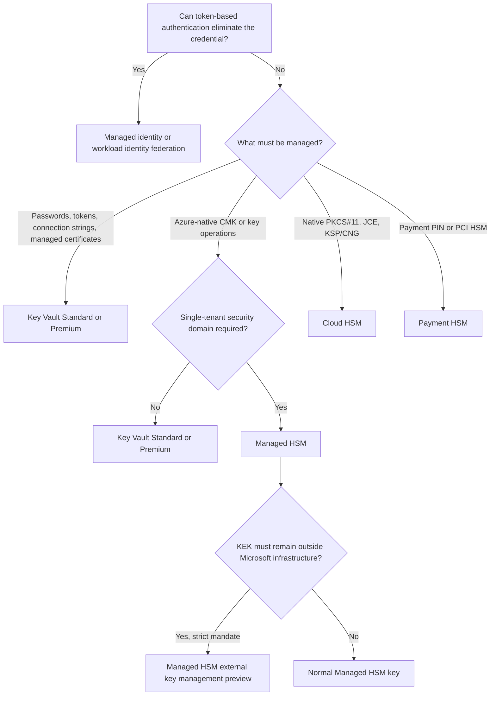

# Managing Secrets Technical Guide

## Scope and study objectives

This guide supports the AZ-305 domain **Design identity, governance, and monitoring solutions**, skill **Design authentication and authorization solutions**, task **Recommend a solution to manage secrets, certificates, and keys**. It consolidates all 51 source notes and covers secretless workload identity, Azure Key Vault, the Azure HSM portfolio, cryptographic lifecycle and recovery, and the App Configuration patterns that commonly surround secrets and key references.

- Separate four decisions before choosing a product: the object to store, the required custody and hardware boundary, the consuming workload's interface, and the complete rotation and recovery lifecycle.
- Prefer a token-based identity over a stored credential. When a credential cannot be eliminated, store it in a service designed for that object and retrieve it through a managed identity or federated workload identity.
- Treat availability, authorization, networking, deletion protection, backup, versioning, and consumer refresh as parts of the secret-management design rather than post-deployment options.

## Missed-question priorities

The missed questions cluster around boundaries between features with similar names. The table preserves the misconception only as a distractor and states the current architecture rule.

| Priority area | Misconception or distractor | Correct architecture rule | Why the distinction matters |
|---|---|---|---|
| Managed HSM roles | “Administrator” or “Crypto Officer” is the developer key-management role. | **Managed HSM Crypto User** performs normal key management and cryptographic operations. Administrator manages the security domain, backup/restore, and roles; Crypto Officer manages roles plus deleted-key recovery/purge/export. [Managed HSM local RBAC built-in roles](https://learn.microsoft.com/en-us/azure/key-vault/managed-hsm/built-in-roles#built-in-roles) | The wrong role either grants governance power or cannot create and use keys. |
| Azure-native CMK versus native HSM APIs | Cloud HSM is a customer-managed-key (CMK) endpoint for Azure SQL or Storage, or Key Vault Premium supports PKCS#11. | Use Key Vault or Managed HSM for supported Azure service CMK integrations; use Cloud HSM for applications that require PKCS#11, JCE, KSP/CNG, or direct HSM administration. [Choose a key management solution](https://learn.microsoft.com/en-us/azure/security/fundamentals/key-management-choose) | The interface boundary can make an otherwise compliant service unusable. |
| External custody | Dedicated HSM satisfies a rule that keys must never reside on Microsoft infrastructure. | Managed HSM external key management keeps the key-encryption key (KEK) in a customer-operated external HSM and forwards only wrap/unwrap through a customer-run proxy. It is a gated preview for strict legal or sovereignty mandates. [External key management overview](https://learn.microsoft.com/en-us/azure/key-vault/managed-hsm/external-key-management-overview#when-not-to-use-external-key-management) | Dedicated HSM is physically hosted in Azure and is retiring; external custody also transfers availability and operational responsibility to the customer. |
| Payment cryptography | General-purpose Cloud HSM is sufficient for PIN and PCI HSM workloads. | Choose Azure Payment HSM for payment PIN, issuing, authorization, EMV, tokenization, PCI PIN, and PCI HSM requirements. [Payment HSM overview](https://learn.microsoft.com/en-us/azure/payment-hsm/overview) | Payment HSM exposes specialized payment functions and compliance boundaries that general-purpose HSMs do not replace. |
| Key Vault tier and tenancy | FIPS 140-3 Level 3 always implies Managed HSM, or Premium is single-tenant. | Premium supports HSM-protected keys on FIPS 140-3 Level 3 validated hardware but remains multitenant. Managed HSM adds a single-tenant security domain and stores keys only. [Key Vault overview](https://learn.microsoft.com/en-us/azure/key-vault/general/overview#service-tiers) [Managed HSM overview](https://learn.microsoft.com/en-us/azure/key-vault/managed-hsm/overview) | Compliance level, tenancy, object support, and cost are separate decision axes. |
| App Configuration identity model | Environment names belong in key prefixes. | Keep keys stable; use labels for environment, version, tenant, or deployment-ring variants and prefixes for application/component grouping. A key-value's identity is key plus label; tags are metadata. [Key-value composition](https://learn.microsoft.com/en-us/azure/azure-app-configuration/concept-key-value#keys) | Labels allow the application to load an environment without changing the key names used by code. |
| App Configuration recovery | Soft delete restores an individual key-value, or snapshots and Restore are the same feature. | Soft delete protects a deleted store; point-in-time Restore reconstructs mutable key-values; a snapshot is a named immutable subset for controlled rollout and last-known-good rollback. [Point-in-time key-values](https://learn.microsoft.com/en-us/azure/azure-app-configuration/concept-point-time-snapshot) [Snapshots](https://learn.microsoft.com/en-us/azure/azure-app-configuration/concept-snapshots) | Selecting the wrong mechanism leaves the required recovery action unavailable. |
| App Configuration scaling | Standard's daily included requests or an average hourly load guarantees no throttling. | Standard has a 30,000-request hourly quota and 300-read/60-write requests-per-second (RPS) allowances. Premium has no hourly request quota but still has 450-read/100-write RPS allowances. [App Configuration request limits](https://learn.microsoft.com/en-us/azure/azure-app-configuration/faq#are-there-any-limits-on-the-number-of-requests-made-to-app-configuration) | Billing allocations, hourly quotas, and instantaneous throughput are different constraints. |
| App Configuration global resilience | The service transparently fails a client over between regional replicas. | Each replica has its own endpoint. Official providers can discover replicas and perform client-side failover; custom clients must implement equivalent logic. [Geo-replication topology](https://learn.microsoft.com/en-us/azure/azure-app-configuration/concept-geo-replication) | Replication supplies healthy endpoints, but the client chooses and changes endpoints. |
| Refresh consistency | A low-level SDK or polling every setting is the efficient refresh design. | Use a provider's cache and refresh features. When several values must change atomically from the application's perspective, update them first and change one sentinel last to trigger a full refresh. [.NET provider sentinel refresh](https://learn.microsoft.com/en-us/azure/azure-app-configuration/reference-dotnet-provider#refresh-on-sentinel-key) | The sentinel reduces change checks and prevents clients from loading a partially updated set. |
| Global client delivery | Traffic Manager caches configuration for millions of clients. | Azure Traffic Manager is DNS-based and does not proxy or cache content. The preview Front Door integration provides edge caching and managed-identity access to App Configuration for deliberately public client configuration. [Hyperscale client configuration](https://learn.microsoft.com/en-us/azure/azure-app-configuration/concept-hyperscale-client-configuration) | Routing alone does not offload origin requests or protect credentials embedded in client code. |
| Key Vault regional recovery | A failover gives full read/write service, or backup can restore globally when tiers match. | Microsoft-managed paired-region failover is delayed, best effort, and read-only after completion. Object backups restore only within the same subscription and Azure geography. [Key Vault region-failure behavior](https://learn.microsoft.com/en-us/azure/reliability/reliability-key-vault#resilience-to-region-wide-failures) [Key Vault backup boundaries](https://learn.microsoft.com/en-us/azure/key-vault/general/service-limits#backup-keys-secrets-certificates) | Applications that require regional writes or another target geography need a custom multi-vault design. |
| Key lifecycle | Native rotation policies rotate keys, secrets, and certificates identically. | Native rotation policies create new **key** versions; certificates can renew through certificate policies and integrated issuers; secrets usually need Event Grid plus automation that changes the source credential and writes a new secret version. [Key Vault autorotation models](https://learn.microsoft.com/en-us/azure/key-vault/general/autorotation) | Rotation is incomplete unless the authoritative system and every consumer move safely to the new value or version. |
| Key Vault scale | Ten vaults provide ten times one-vault throughput, and RSA-4096 HSM operations cost only twice RSA-2048 quota. | The subscription limit per region is five times the per-vault limit. For “all other” HSM key transactions, RSA-2048 allows 2,000 per 10 seconds and RSA-4096 allows 250, an 8:1 quota weight. [Key transaction limits](https://learn.microsoft.com/en-us/azure/key-vault/general/service-limits#key-transactions-maximum-transactions-allowed-in-10-seconds-per-vault-per-region1) | Caching, local public-key operations, backoff, regions, and subscription topology matter more than multiplying same-region vaults. |
| Managed HSM recovery and regional availability | LRS is unsupported for backup, immutable storage is preferred, or rack/zone redundancy survives region loss. | LRS is supported; an immutability policy is not. Restore requires the same security domain. Region survival requires one explicitly configured extended region, with both regions active and replication taking up to six minutes. [Managed HSM backup prerequisites](https://learn.microsoft.com/en-us/azure/key-vault/managed-hsm/backup-restore#prerequisites-for-backing-up-and-restoring-by-using-user-assigned-managed-identity) [Multi-region replication](https://learn.microsoft.com/en-us/azure/key-vault/managed-hsm/multi-region-replication) | Storage durability recommendations are not platform prerequisites, and regional recovery depends on artifacts or replication configured in advance. |
| Managed HSM versions | Key history ages out automatically. | Managed HSM allows 100 versions per key; rotations consume versions. Normal Key Vault has no version-count limit, but an object with more than 500 versions cannot be backed up. [Managed HSM object limits](https://learn.microsoft.com/en-us/azure/key-vault/managed-hsm/service-limits#object-limits) [Key Vault backup version limit](https://learn.microsoft.com/en-us/azure/key-vault/general/service-limits#backup-keys-secrets-certificates) | Rotation frequency must be planned against the version ceiling and recovery process. |
| Federated identity scale | One identity can contain 100 federation rules or standard rules accept wildcards. | An application or user-assigned managed identity supports at most 20 federated identity credentials (FICs). Standard FIC issuer, subject, and audience matching is exact; partition GA identities beyond 20. [FIC considerations](https://learn.microsoft.com/en-us/entra/workload-id/workload-identity-federation-considerations#general-federated-identity-credential-considerations) | CI/CD branches, repositories, clusters, and environments can exhaust the limit quickly. |

## Architecture and core concepts

### Start by eliminating the credential

A vault is not the first answer to every authentication problem. First determine whether the target supports Microsoft Entra tokens; only manage a secret when the protocol or external system requires one.

- **Azure-hosted workload:** Use a managed identity when the hosting service supports one. The platform manages the identity credential, and the application requests tokens without storing a client secret. [Secretless authentication with managed identities](https://learn.microsoft.com/en-us/entra/identity/managed-identities-azure-resources/secretless-authentication)
- **External workload:** Use workload identity federation for GitHub Actions, Kubernetes, multicloud, or on-premises software that can present a trusted external token. The external token is exchanged for an Entra access token. [Workload identity federation](https://learn.microsoft.com/en-us/entra/workload-id/workload-identity-federation)
  - A federated credential is supported on an application object or a **user-assigned** managed identity, not a system-assigned managed identity.
  - Standard matching uses the configured issuer, subject, and audience. For Microsoft Entra ID token exchange, set the audience to `api://AzureADTokenExchange`. [Federated identity credential settings](https://learn.microsoft.com/en-us/entra/workload-id/workload-identity-federation-create-trust)
  - The limit is 20 FICs per application or user-assigned managed identity. Partition workloads across identities when the GA model requires more trust relationships.
  - Flexible FICs are a preview that can match supported subject and custom claims with a restricted expression language, but current support is only for credentials on **application objects** and selected issuers such as GitHub, GitLab, and Terraform Cloud. [Flexible federated identity credentials](https://learn.microsoft.com/en-us/entra/workload-id/workload-identities-flexible-federated-identity-credentials)
- **Unavoidable secret:** Use a managed identity or federation as the bootstrap identity to read the secret from Key Vault. Do not replace one application secret with a vault access key embedded beside it.

### Select the store by object, integration, and custody

The following explanatory decision diagram consolidates the principal service-selection boundary. It is not an official Microsoft figure; its branches are based on the linked product-selection and object-model documentation.



*Validated against [Choose the right Azure key management solution](https://learn.microsoft.com/en-us/azure/security/fundamentals/key-management-choose) and [Key Vault keys, secrets, and certificates](https://learn.microsoft.com/en-us/azure/key-vault/general/about-keys-secrets-certificates).*

| Requirement | Recommended service | Decisive boundary |
|---|---|---|
| Passwords, API tokens, connection strings, or small protected values | Key Vault Standard or Premium | Managed HSM and Cloud HSM are not general secret stores. |
| X.509 certificate object with policy, issuer, and renewal lifecycle | Key Vault Standard or Premium | A Key Vault certificate coordinates a certificate object, key, and secret. [About Key Vault certificates](https://learn.microsoft.com/en-us/azure/key-vault/certificates/about-certificates#composition-of-a-certificate) |
| Software-protected RSA or elliptic-curve key | Key Vault Standard or Premium | Premium is not required for software keys. |
| HSM-protected RSA/EC key in a multitenant managed vault | Key Vault Premium | Creating a Premium vault does not make every key HSM-backed; use an HSM key type. [Key types and protection](https://learn.microsoft.com/en-us/azure/key-vault/keys/about-keys#key-types-and-protection-methods) |
| Single-tenant, FIPS 140-3 Level 3 Azure-native key service; RSA, EC, or AES keys | Managed HSM | Managed HSM is keys-only and has a customer-controlled security domain. [Managed HSM key types](https://learn.microsoft.com/en-us/azure/key-vault/managed-hsm/about-keys-details) |
| Existing application requires PKCS#11, OpenSSL, JCE, KSP, or CNG | Cloud HSM | Cloud HSM is a customer-administered, three-node HSM cluster for IaaS and traditional integrations. [Cloud HSM overview](https://learn.microsoft.com/en-us/azure/cloud-hsm/overview) |
| PCI payment cryptography, PIN processing, issuing, or authorization | Payment HSM | Payment HSM is based on Thales payShield and is purpose-built for payment workloads. [Payment HSM overview](https://learn.microsoft.com/en-us/azure/payment-hsm/overview) |
| Existing Dedicated HSM deployment | Migrate to Managed HSM or Cloud HSM | Dedicated HSM accepts no new customers and retires July 31, 2028. [Dedicated HSM retirement](https://learn.microsoft.com/en-us/azure/dedicated-hsm/overview) |
| Azure CMK integration with a KEK physically outside Microsoft | Managed HSM external key management, only if preview constraints are acceptable | Only wrap/unwrap is supported and no SLA covers the external key path. [External key comparison](https://learn.microsoft.com/en-us/azure/key-vault/managed-hsm/external-key-management-overview#comparison-external-keys-versus-managed-hsm-keys) |

### Object semantics and versioning

Object type controls supported operations, lifecycle automation, retrieval behavior, and cost. Treat keys, secrets, certificates, and configuration as distinct even when one solution references another.

- **Secret:** A versioned opaque value such as a password, token, or connection string. Key Vault protects the value but does not know how to change the source credential.
- **Key:** A versioned cryptographic object used for encrypt/decrypt, sign/verify, wrap/unwrap, or service encryption according to its type and allowed operations.
  - Key Vault Standard supports software-protected RSA and EC keys.
  - Key Vault Premium adds HSM-protected RSA and EC keys.
  - Managed HSM supports HSM-protected RSA, EC, and AES keys, including documented AES wrap, GCM/CBC, and HMAC operations, and stores no secret or certificate collections. [Managed HSM supported keys and algorithms](https://learn.microsoft.com/en-us/azure/key-vault/managed-hsm/about-keys-details)
- **Certificate:** In Key Vault, a managed certificate creates an addressable certificate, a key with the same name, and a secret that can contain the certificate value. The certificate policy describes issuer, key properties, validity, and lifetime actions. [Certificate composition](https://learn.microsoft.com/en-us/azure/key-vault/certificates/about-certificates#composition-of-a-certificate)
  - Cloud HSM can expose X.509 certificate objects through PKCS#11, but the certificate objects are stored as JSON Web Signature (JWS) data in a customer Blob container; an HSM signing key protects their integrity and the private cryptographic key remains HSM-protected. This is traditional certificate storage, not Key Vault certificate lifecycle management. [Cloud HSM certificate storage](https://learn.microsoft.com/en-us/azure/cloud-hsm/tutorial-certificate-storage)
- **Configuration:** Azure App Configuration stores settings, feature flags, labels, tags, and Key Vault references. A Key Vault reference contains a secret URI; the application authenticates independently to App Configuration and Key Vault to resolve it. [Use Key Vault references](https://learn.microsoft.com/en-us/azure/azure-app-configuration/use-key-vault-references-dotnet-core)
- **Bulk or business data:** Documents, large payloads, databases, and general application data do not belong in Key Vault or App Configuration. Store them in the appropriate data service and keep only a reference when needed.

### App Configuration key identity and layering

App Configuration separates the stable name used by application code from deployment-specific variants and administrative metadata. This model makes environment selection explicit and permits deterministic stacking.

- A key-value is uniquely identified by **key plus label**. The null label is a valid default variant. [Key-value queries and labels](https://learn.microsoft.com/en-us/azure/azure-app-configuration/concept-key-value#query-key-values)
- Use **prefixes** such as `OrdersApi:` or `Payments:` to group applications or components in a shared store.
- Use **labels** such as `Production`, `Staging`, `v2`, or `Ring1` for variants of the same stable key.
- Use **tags** such as `Owner=WebTeam` or `Classification=Internal` as metadata on one key-value. Tags do not participate in key-value identity, though supported APIs/providers can filter on them. [Key-value REST representation](https://learn.microsoft.com/en-us/azure/azure-app-configuration/rest-api-key-value)
- For layered configuration, load null-label defaults first and then the environment label. Later selections override earlier values with the same normalized key.

> **Operational recommendation:** Reserve labels for a small number of well-governed variation dimensions. Combining every tenant, region, release, and environment into labels can create a selection model that is difficult to reason about even though the platform permits it.

## Key Vault architecture, lifecycle, and resilience

### Vault topology, authorization, and networking

A key vault is a security and availability boundary. Its identity permissions and network path are independent gates, so a principal needs both authorization and reachability.

- **Topology:** Use a separate vault per application, environment, region, and tenant where those are distinct security or availability domains. This limits blast radius, aligns role scope, and avoids a single vault becoming a cross-workload dependency. [Key Vault security guidance](https://learn.microsoft.com/en-us/azure/key-vault/general/secure-key-vault)
- **Authorization:** Prefer the Azure role-based access control (Azure RBAC) permission model for new vaults. Assign data-plane roles to groups, applications, and managed identities at the narrowest practical scope; use Privileged Identity Management (PIM) for privileged human access. [Key Vault RBAC guide](https://learn.microsoft.com/en-us/azure/key-vault/general/rbac-guide)
- **Least-privilege purge:** `Key Vault Purge Operator` permits permanent deletion of soft-deleted vaults and objects without granting ordinary secret/key/certificate access. If purge protection is enabled, no role can bypass the retention lock. [Key Vault data-plane roles](https://learn.microsoft.com/en-us/azure/key-vault/general/rbac-guide#azure-built-in-roles-for-key-vault-data-plane-operations)
- **Networking:** Choose among public access, firewall rules, virtual network service endpoints, private endpoints, trusted-services bypass, and Network Security Perimeter according to workload reachability and exfiltration requirements. [Key Vault network security](https://learn.microsoft.com/en-us/azure/key-vault/general/network-security)
- **Monitoring:** Enable diagnostic settings and send audit logs to Log Analytics, Storage, or Event Hubs. Alert on access failures, throttling, deletion, purge, role changes, expiration, rotation failure, and anomalous access.

### Lifecycle automation by object type

Rotation changes a version or value; it does not automatically update every target system or consumer. Design the producer change, publication, propagation, overlap, verification, rollback, and retirement sequence.

| Object | Native lifecycle capability | Consumer and availability obligation |
|---|---|---|
| Key | A per-key rotation policy can create a new version on a creation-based or expiration-based schedule. The minimum rotation interval is 28 days. [Configure key rotation](https://learn.microsoft.com/en-us/azure/key-vault/keys/how-to-configure-key-rotation) | Use versionless identifiers where supported so consumers can follow the newest version. Keep the old version enabled until all dependent data-encryption keys (DEKs) are rewrapped and consumers are verified. |
| Secret | No general native policy can change the credential in its authoritative external system. Event Grid can emit near-expiry events and an Azure Function or other workflow can rotate the target and store a new version. [Secret rotation patterns](https://learn.microsoft.com/en-us/azure/key-vault/secrets/tutorial-rotation) | Use dual credentials when the target supports them: create and validate the new credential, move consumers, then revoke the old one. |
| Certificate | A certificate policy can renew self-signed certificates or request renewal through integrated certificate authorities. DigiCert and GlobalSign are the integrated public CAs; nonpartnered issuers require an external workflow. [Integrated certificate authorities](https://learn.microsoft.com/en-us/azure/key-vault/certificates/how-to-integrate-certificate-authority) | Ensure the consuming service refreshes the renewed certificate and private key; alert before expiry even when automatic renewal is configured. |

- Rotation policies are configured on individual keys, not as one vault-wide schedule. Use Azure Policy to audit or enforce organizational rotation requirements. [Key rotation policy governance](https://learn.microsoft.com/en-us/azure/key-vault/keys/key-rotation-policy)
- When a KEK rotates, envelope-encrypted services typically rewrap DEKs rather than reencrypting all underlying data. Retain access to old versions until rewrapping or migration completes.
- In a suspected compromise, create and activate safe material first where the threat model permits, move and verify dependents, and then disable/revoke the compromised version. Immediate disablement can create an outage before dependents can move.
- Give every cryptographic object a defined owner, purpose, allowed operations, expiration decision, rotation method, recovery method, and retirement evidence. Use Azure Policy and alerts to find objects that violate the standard.

### Soft delete, purge protection, backup, and restore

Deletion recovery protects against a different risk than backup. Soft delete retains a deleted resource or object inside the service; purge protection time-locks deletion; backup produces an encrypted offline object copy with strict restore boundaries.

| Mechanism | Scope and behavior | Critical boundary |
|---|---|---|
| Soft delete | Deleted vaults and objects remain recoverable for the configured 7–90 day retention period; new vaults default to 90 days. [Key Vault recovery management](https://learn.microsoft.com/en-us/azure/key-vault/general/key-vault-recovery) | A deleted name remains reserved during retention. Recovery does not provide a second regional active endpoint. |
| Purge protection | Prevents permanent deletion until retention expires. It can be enabled at creation or later but cannot be disabled after enablement. [Soft delete and purge protection](https://learn.microsoft.com/en-us/azure/key-vault/general/soft-delete-overview#purge-protection) | Owner, administrator, Purge Operator, and Microsoft cannot override the time lock. Some Azure integrations require it for CMKs. |
| Object backup | Downloads one key, secret, or certificate, including its versions, as an encrypted blob. [Key Vault backup](https://learn.microsoft.com/en-us/azure/key-vault/general/backup) | Restore is limited to a vault in the same subscription and Azure geography; the blob cannot be decrypted outside Azure. An object with more than 500 versions cannot be backed up. |
| Restore | Creates an independent restored object in the destination vault. | Later disablement, deletion, or purge of the source does not affect the restored copy. |

To enable purge protection with Azure CLI:

```azurecli
az keyvault update \
  --name contoso-prod-kv \
  --resource-group rg-security-prod \
  --enable-purge-protection true
```

The equivalent PowerShell switch is `-EnablePurgeProtection` on `New-AzKeyVault`. Validate the intended retention period before enabling purge protection because the resulting deletion lock is irreversible. [Configure Key Vault recovery](https://learn.microsoft.com/en-us/azure/key-vault/general/key-vault-recovery)

### Zone and region failure behavior

Key Vault automatically handles local and zone failures, but its paired-region disaster recovery has a materially weaker write-availability and recovery-time model. Match the design to the workload's recovery time objective (RTO), recovery point objective (RPO), and write requirements.

- **Within a zone-enabled region:** Standard and Premium are automatically zone redundant at no extra charge. Data is synchronously replicated, Azure reroutes requests during a zone outage, no data loss is expected, reads should have minimal to no downtime, and writes can be briefly unavailable. [Availability-zone behavior](https://learn.microsoft.com/en-us/azure/reliability/reliability-key-vault#resilience-to-availability-zone-failures)
- **Paired-region Microsoft-managed failover:** Data is asynchronously replicated for most supported region pairs. Microsoft decides whether to fail over after a prolonged outage; it can take several hours and is best effort.
  - After failover, supported reads and cryptographic operations include list/get, encrypt/decrypt, wrap/unwrap, sign/verify, and backup.
  - The secondary is read-only. Vault properties, firewall, access policies, new objects, and value updates cannot be changed there. [Microsoft-managed failover considerations](https://learn.microsoft.com/en-us/azure/reliability/reliability-key-vault#microsoft-managed-failover-to-a-paired-region)
  - Asynchronous replication means recent writes might not reach the secondary before a primary loss.
- **Custom multi-region design:** Create independent vaults, distribute or restore required material, and implement application endpoint failover when full regional write availability, a nonpaired region, a chosen recovery region, or a faster RTO is required. [Custom multi-region solutions](https://learn.microsoft.com/en-us/azure/reliability/reliability-key-vault#custom-multi-region-solutions-for-resiliency)

> **Architectural interpretation:** A custom multi-vault design improves endpoint control but creates a synchronization and lifecycle problem. Establish one writer or a controlled replication process; independently mutable copies of the same secret or key can diverge.

### Throughput, weighted limits, and caching

Key Vault applies per-vault, per-region limits in rolling 10-second windows and a subscription-wide regional ceiling of five times each per-vault limit. A successful design reduces calls before it adds vaults.

| Operation category | Per-vault maximum in 10 seconds | Architectural implication |
|---|---:|---|
| RSA-2048 HSM “all other” key transactions | 2,000 | Baseline weight for the HSM examples. |
| RSA-4096 HSM “all other” key transactions | 250 | One transaction consumes eight times the RSA-2048 HSM quota weight. |
| RSA-2048 software “all other” key transactions | 4,000 | Software-key quota is twice the RSA-2048 HSM allowance. |
| Secret/all other vault transactions | 4,000 | Create/import operations have separate lower limits. |
| Subscription aggregate in one region | 5 × the relevant per-vault limit | Ten saturated same-region vaults do not produce ten times one-vault throughput. |

*Values and weighting: [Azure Key Vault service limits](https://learn.microsoft.com/en-us/azure/key-vault/general/service-limits#key-transactions-maximum-transactions-allowed-in-10-seconds-per-vault-per-region1).*

**Note-derived calculation:** For RSA-2048 software-key GET operations, `5 × 4,000 = 20,000` transactions per 10 seconds is the subscription-wide maximum in one region. For HSM operations, `2,000 ÷ 250 = 8`, so RSA-4096 consumes eight times the quota weight of RSA-2048 for the documented category.

1. Cache secrets and public key material in memory and reuse them until refresh is necessary.
2. Perform public-key encryption and verification locally when the design permits; never cache or export nonexportable private HSM key material.
3. For many nodes needing the same value, use a controlled fan-out component or platform integration instead of every node polling the vault.
4. Honor HTTP `429` responses with exponential backoff and jitter; immediate retries also count against limits.
5. Separate vaults by security and availability domain, then distribute across regions or subscriptions only when caching and request reduction do not meet the requirement. [Key Vault throttling guidance](https://learn.microsoft.com/en-us/azure/key-vault/general/overview-throttling)

### Key Vault pricing-operation categories

The pricing calculator separates transaction meters from monthly active HSM-key-version meters. It is a cost model, not an API taxonomy.

- **Operations:** Ordinary authenticated Key Vault requests, including secret operations, certificate operations other than integrated renewal, and operations with RSA-2048 keys.
- **Advanced operations:** Operations with RSA-3072, RSA-4096, and elliptic-curve keys; an advanced HSM key can incur both advanced-operation transactions and an HSM key-version charge.
- **Certificate renewals:** Renewal requests performed through a supported integrated CA, not every certificate read, import, update, or TLS handshake.
- **HSM-protected keys:** Actively used RSA-2048 HSM key versions in Premium. Each used version is counted independently.
- **Advanced HSM-protected keys:** Actively used RSA-3072, RSA-4096, or EC-HSM key versions, with tiered monthly pricing plus operation charges. [Key Vault pricing details](https://azure.microsoft.com/en-us/pricing/details/key-vault/)

**Note-derived pricing example:** Twenty secrets retrieved 100 times produce `20 × 100 = 2,000` ordinary operations. Add 5,000 signing calls with one RSA-2048 HSM version as 5,000 ordinary operations plus one active HSM-key-version unit; 500 calls with one RSA-4096 HSM version as 500 advanced operations plus one active advanced-HSM-version unit; and two integrated CA renewals as two certificate-renewal units. Actual cost then depends on the current region/currency prices and the active-version billing window.

## Managed HSM architecture and operations

### Security domain and activation

The security domain is the defining Managed HSM artifact: an encrypted blob that establishes the customer-controlled root of trust, activates the HSM, and enables disaster recovery. Microsoft cannot reconstruct it or the protecting private keys.

- Single-tenancy here is a customer-specific cryptographic security domain and isolated HSM partitions; it does not promise that one customer owns the entire physical HSM chassis. Cloud HSM supplies a customer-dedicated three-node cluster, while Dedicated HSM supplies a whole appliance. [Managed HSM key sovereignty](https://learn.microsoft.com/en-us/azure/key-vault/managed-hsm/about-keys)

1. Provision the Managed HSM Azure resource; the pool is not ready for key workloads yet.
2. Generate at least three RSA key pairs and submit only their public keys while requesting the security-domain download.
3. Choose a recovery quorum. Microsoft recommends at least three people, and the maximum quorum size is 10.
4. Download the encrypted security domain. Activation completes after the download.
5. Store the encrypted domain and each quorum private key offline, on separate media, under multi-person control, and in geographically separate secure locations.
6. Test the recovery procedure and periodically review custody records. [Security domain protection](https://learn.microsoft.com/en-us/azure/key-vault/managed-hsm/security-domain#security-domain-protection-best-practices)

- **Failure condition:** Without the security domain and enough quorum private keys, a backup cannot recover the HSM and all keys are permanently lost. Microsoft has no recovery bypass. [Security domain recovery boundary](https://learn.microsoft.com/en-us/azure/key-vault/managed-hsm/security-domain#security-domain-compromise-or-loss)
- **Compromise response:** If the domain or quorum keys are compromised, create a new protection set or a new HSM/security domain as appropriate, migrate dependent workloads, and treat the current material as exposed.
- **Exam discriminator:** The phrase **security domain** specifically points to Managed HSM, not Cloud HSM, Key Vault Premium, or Dedicated HSM.

### Control plane, data plane, and local RBAC

Both Managed HSM planes authenticate with Microsoft Entra ID, but they authorize with separate role systems. Azure subscription ownership does not imply access to HSM keys.

| Plane | Endpoint and authorization | Representative operations |
|---|---|---|
| Control plane | Azure Resource Manager and Azure RBAC | Create, move, update, tag, and delete the Managed HSM resource. |
| Data plane | Managed HSM endpoint and Managed HSM local RBAC | Create/use keys, manage local roles, download/upload the security domain, and perform backup/restore. [Managed HSM access-control model](https://learn.microsoft.com/en-us/azure/key-vault/managed-hsm/access-control#access-control-model) |

| Local role | Intended capability | Does not grant |
|---|---|---|
| Managed HSM Administrator | Security-domain operations, full backup/restore, and role management | Ordinary key management or cryptographic use |
| Managed HSM Crypto Officer | Role management plus deleted-key purge/recover and key export | Ordinary key create/update/use |
| Managed HSM Crypto User | Key creation, import, update, rotation, backup/restore, and cryptographic operations | Deleted-key purge/recover/export or role mutation |
| Managed HSM Policy Administrator | Create/delete role assignments | Key operations |
| Managed HSM Crypto Auditor | Read key attributes and role metadata | Cryptographic use or mutation |
| Managed HSM Crypto Service Encryption User | Wrap/unwrap for service encryption | General key management |

*Exact data actions: [Managed HSM local RBAC built-in roles](https://learn.microsoft.com/en-us/azure/key-vault/managed-hsm/built-in-roles#permitted-operations).*

> **Documentation correction:** A source scenario's designated “Managed HSM Crypto Officer” answer conflicts with the current role table. For a developer who must create/manage/use keys but must not manage local RBAC or the security domain, **Managed HSM Crypto User** is the documented least-privilege fit.

Managed HSM emits `AuditEvent` data-plane logs through Azure Monitor diagnostic settings. Route them to Log Analytics, Storage, or Event Hubs and grant auditors access at the destination. A Managed HSM Crypto Auditor role reads HSM metadata; it does not by itself grant access to historical logs stored in another Azure resource. [Managed HSM logging](https://learn.microsoft.com/en-us/azure/key-vault/managed-hsm/logging)

### Capacity, versions, and backup

Managed HSM has fixed object and local-role limits that affect rotation and tenant/workload partitioning.

| Limit | Current value and scope |
|---|---:|
| HSM instances | 5 per subscription per region |
| Keys | 5,000 per HSM instance |
| Versions | 100 per key |
| Custom local role definitions | 50 per HSM instance |
| Role assignments | 50 at HSM scope; 10 at each key scope |

*Source: [Managed HSM object limits](https://learn.microsoft.com/en-us/azure/key-vault/managed-hsm/service-limits#object-limits).*

- At one rotation every 28 days, 100 versions are consumed in about `2,800 days ÷ 365 ≈ 7.7 years`. This is a note-derived capacity estimate; manual versions and schedule changes alter the result.
- A full backup includes keys, versions, attributes, tags, and local role assignments and is encrypted to the security domain.
- The supported managed-identity path uses a user-assigned managed identity with `Storage Blob Data Contributor` on the target storage account. The storage account **must not** have an immutability policy. LRS is supported; use geo-redundant storage when the backup must survive region loss. [Full-backup prerequisites](https://learn.microsoft.com/en-us/azure/key-vault/managed-hsm/backup-restore#prerequisites-for-backing-up-and-restoring-by-using-user-assigned-managed-identity)
- A full restore is destructive: first complete a destination backup at least 30 minutes before restore, then restore only between HSMs with the same security domain. During restore mode, all other data-plane commands are disabled. [Full-restore behavior](https://learn.microsoft.com/en-us/azure/key-vault/managed-hsm/backup-restore#full-restore)
- Selective restore recovers one purged key with all versions from a backup; use normal recovery for a key that is only soft-deleted.

### Availability, replication, deletion, and billing

A base Managed HSM pool provides regional high availability through three load-balanced partitions. That design does not by itself survive total region loss.

- Enable multi-region replication to add **one** extended region. Both regions actively serve reads and writes through the global Managed HSM DNS name; Traffic Manager sends a request to the closest available region. [Managed HSM replication architecture](https://learn.microsoft.com/en-us/azure/key-vault/managed-hsm/multi-region-replication#architecture)
- Key, role-definition, and role-assignment writes can take up to six minutes to replicate. Do not require the new material from the other region until that window has passed. [Replication latency](https://learn.microsoft.com/en-us/azure/key-vault/managed-hsm/multi-region-replication#replication-latency)
- If either region fails, the other accepts reads and writes. Enabling the extension creates another three-partition pool, increases the combined SLA to 99.99%, and adds the corresponding service cost.
- Soft delete cannot be disabled. Retention is 7–90 days and defaults to 90 days. A soft-deleted Managed HSM continues to incur its full hourly charge until purge or retention expiry. [Managed HSM soft delete](https://learn.microsoft.com/en-us/azure/key-vault/managed-hsm/soft-delete-overview)
- Purge protection prevents early purge. Pair long retention with an explicit decommission and cost plan because the deleted HSM remains billable during the protected interval.

### External key management preview

External key management keeps an Azure-facing Managed HSM key URI and authorization boundary while delegating the KEK operation to infrastructure outside Microsoft. It should be selected only when physical off-Azure custody is a mandatory requirement.

1. The Azure service calls the Managed HSM external key version for `wrapKey` or `unwrapKey`.
2. Managed HSM authenticates and authorizes the caller and follows the immutable external key identifier.
3. Managed HSM calls a customer-run EKM Proxy over mutual TLS (mTLS).
4. The proxy translates the request to the external HSM, which performs the operation without exporting the KEK.
5. The result returns through the proxy and Managed HSM. [External key request flow](https://learn.microsoft.com/en-us/azure/key-vault/managed-hsm/external-key-management-overview#how-external-key-management-works-high-level)

| Constraint | Current preview behavior |
|---|---|
| Operations | `wrapKey` and `unwrapKey` only; sign, verify, encrypt, decrypt, secure key release, and Confidential VM launch are unsupported. |
| Algorithms and keys | `RSA-OAEP`, `RSA-OAEP-256`, `A256KW`, and `A256KWP`; RSA 2048/3072/4096 and AES-256 keys. Managed HSM stores the external identifier, not the material. |
| Latency | Each proxy round trip must finish in 250 ms or Managed HSM times out and returns an error. [External key performance](https://learn.microsoft.com/en-us/azure/key-vault/managed-hsm/external-key-management-faq#performance-and-sla) |
| Availability | No SLA covers external keys, the proxy, or external HSM. The customer owns proxy/HSM HA, disaster recovery, patching, capacity, network, mTLS, monitoring, and vendor support. |
| Lifecycle | The external identifier is immutable for a version. Rotate by creating a new version; a normal and external key cannot be converted in place. |
| Recovery | Managed HSM backup/restore is not supported for external keys during preview; recreate the external reference and recover the external material through the customer process. |
| Access | Gated subscription enablement; public Azure regions only at preview launch, not Azure Government or China. Current onboarding includes an assigned Microsoft account manager and at least USD 10 million in annual committed Azure revenue. |

*Current preview scope: [External key management limitations](https://learn.microsoft.com/en-us/azure/key-vault/managed-hsm/external-key-management-overview#preview-scope-and-limitations).*

## App Configuration architecture and operational patterns

### Store selection and hard limits

App Configuration is for operational settings and feature flags, not protected secrets or arbitrary content. Its tier affects quotas, throughput allowances, storage, replicas, snapshots, and production suitability.

| Tier | Request quota | Throughput allowance | Point-in-time history | Typical use |
|---|---:|---:|---:|---|
| Free | 1,000 requests/day | No guaranteed throughput | 7 days | Evaluation and learning |
| Developer | 6,000 requests/hour | No guaranteed throughput | 7 days | Development and test |
| Standard | 30,000 requests/hour | Up to 300 read RPS and 60 write RPS | 30 days | Normal production workloads |
| Premium | No request quota | Up to 450 read RPS and 100 write RPS | 30 days | High-volume production, larger capacity, and premium features |

*Quotas and allowances: [App Configuration request limits](https://learn.microsoft.com/en-us/azure/azure-app-configuration/faq#are-there-any-limits-on-the-number-of-requests-made-to-app-configuration); history: [Point-in-time key-values](https://learn.microsoft.com/en-us/azure/azure-app-configuration/concept-point-time-snapshot).*

> **Documentation correction:** “Premium has no request limit” means it has no hourly request **quota**. Premium can still return HTTP `429` when the workload exceeds its throughput allowance or other service protections, so it does not guarantee that quota or throttling can never block a request.

- A single key-value has a **10 KB combined limit**, including key, value, label, content type, tags, and other attributes. [Key-value size limit](https://learn.microsoft.com/en-us/azure/azure-app-configuration/concept-key-value)
- When a payload exceeds 10 KB, store it in Blob Storage or another appropriate service and put a URI or structured reference in App Configuration. The application needs independent authorization to the target service.
- Store confidential values in Key Vault and put a Key Vault reference in App Configuration rather than a plaintext secret. The client must authenticate separately to both services.
- An App Configuration store or replica's request quota is isolated. Distributing clients across replicas adds regional endpoints and aggregate capacity, but each replica is billed as another store. [Geo-replication quotas](https://learn.microsoft.com/en-us/azure/azure-app-configuration/concept-geo-replication)

### Provider caching and the sentinel pattern

Official provider libraries are designed for application configuration reads, local caching, refresh, retry, and replica discovery. The data-plane SDK is better suited to programmatic management and writes when the application does not need provider semantics.

1. Load the required key prefixes and labels through the provider.
2. Serve configuration from the provider's in-process cache rather than querying App Configuration for each application operation.
3. When changes to several keys must appear as one coherent set, register one sentinel with `refreshAll: true`.
4. Update all dependent key-values first.
5. Update the sentinel last, after the set is complete.
6. On the next eligible refresh check, the provider detects the sentinel's change and reloads the selected configuration as one refresh event. [.NET provider refresh behavior](https://learn.microsoft.com/en-us/azure/azure-app-configuration/reference-dotnet-provider#configuration-refresh)

```csharp
options.ConfigureRefresh(refresh =>
{
    refresh.Register("SentinelKey", refreshAll: true)
           .SetRefreshInterval(TimeSpan.FromSeconds(60));
});
```

- Refresh calls before the configured interval expires are no-ops; the application continues using cached configuration if a refresh fails.
- Register all keys when independent changes should trigger refresh. Use a sentinel when a coordinated set should become visible together; it is not mechanically required for every store.
- Increase the refresh interval when configuration changes slowly. Choose the interval from propagation requirements and fleet size, not from the library default alone.
- **Note-derived request example:** A full load of 1,000 settings at 100 settings per request requires 10 requests. Across 500 simultaneous instances, that produces 5,000 startup requests; stagger startup/refresh and use replicas, caching, or snapshots to reduce bursts. The exact batch behavior is provider- and protocol-version-dependent, so load test the real client.

### Geo-replication and client-driven failover

App Configuration replicas are active, independently addressable endpoints with asynchronously replicated data. Geo-replication improves latency, request capacity, and regional resilience, but the client remains responsible for endpoint failover.

- Place replicas near major workload regions to reduce network latency and distribute request load.
- Use official providers with Microsoft Entra authentication so they can discover replicas and fail over when the connected endpoint is unavailable. If using connection strings or a custom client, configure endpoints and retry/failover explicitly. [Geo-replication failover](https://learn.microsoft.com/en-us/azure/azure-app-configuration/concept-geo-replication#resiliency-and-disaster-recovery)
- Because replication is asynchronous and eventually consistent, a client can briefly observe older values after switching replicas. Recent writes can be unavailable at another replica until replication completes.
- All replicas accept reads and writes, but multi-writer use increases conflict and consistency risk. Prefer a controlled writer path for configuration deployment.
- A global router is optional. It does not remove the need to understand replication or cache freshness, and it adds its own failure and security boundary.

### Front Door for hyperscale client configuration

Browser, mobile, and desktop clients cannot safely carry an App Configuration access key and can create enormous origin load. The preview App Configuration–Azure Front Door integration provides an edge-cached, anonymous delivery path for a deliberately exposed subset.

- Front Door uses a managed identity to authenticate to App Configuration, while clients read cached configuration through the Front Door endpoint. [Connect App Configuration to Front Door](https://learn.microsoft.com/en-us/azure/azure-app-configuration/how-to-connect-azure-front-door)
- Configure exact key, label, feature-flag, or snapshot filters. Anything delivered to an anonymous client must be treated as public; never expose secrets or sensitive operational controls.
- Microsoft recommends a Front Door cache time-to-live (TTL) of at least 10 minutes and an application refresh interval of at least one minute for the documented pattern. This can yield up to roughly 11 minutes of ordinary propagation delay and remains eventually consistent. [Hyperscale caching considerations](https://learn.microsoft.com/en-us/azure/azure-app-configuration/concept-hyperscale-client-configuration#recommendations-and-considerations)
- Traffic Manager is a DNS traffic router. It can direct a client to an endpoint but does not proxy HTTP content or provide the edge cache that offloads App Configuration. [Traffic Manager overview](https://learn.microsoft.com/en-us/azure/traffic-manager/traffic-manager-overview)
- **Preview boundary:** The direct integration is currently available only in Azure public cloud and can change before general availability.

### Recovery: store, item, and deployment state

Choose recovery by the thing that failed. Store deletion, key-value mutation, and bad release configuration are three different incidents.

| Incident | Correct feature | Behavior |
|---|---|---|
| Entire Standard or Premium store deleted | Store soft delete | Recover the store during its configured retention period. Soft delete does not version individual key-values, and a soft-deleted store is not billed. [App Configuration soft delete](https://learn.microsoft.com/en-us/azure/azure-app-configuration/concept-soft-delete) |
| One or more live key-values changed or deleted | Point-in-time Restore | Compare current state with a chosen time and write selected historical values back into the mutable store. History is 7 days for Free/Developer and 30 days for Standard/Premium. [Restore key-values](https://learn.microsoft.com/en-us/azure/azure-app-configuration/concept-point-time-snapshot#restore-key-values) |
| Controlled deployment or last-known-good configuration | Snapshot | Create a named immutable filtered subset and have the application select it. Roll back by selecting the prior snapshot, not by mutating it. [Deploy safely with snapshots](https://learn.microsoft.com/en-us/azure/azure-app-configuration/concept-snapshots#deploy-safely-with-snapshots) |

- Snapshots can be created and archived but not edited or directly deleted. An archived snapshot disappears after its configured retention period unless recovered.
- Recovering a soft-deleted App Configuration store does not restore associated role assignments, managed identity, Event Grid subscriptions, or private endpoints; recreate those integrations. [Soft-delete recovery boundary](https://learn.microsoft.com/en-us/azure/azure-app-configuration/concept-soft-delete)
- Default snapshot archival retention is 7 days in Free/Developer and 30 days in Standard/Premium. Snapshot storage quotas are 10 MB, 500 MB, 1 GB, and 4 GB respectively; an individual snapshot is limited to 1 MB. [Snapshot billing and limits](https://learn.microsoft.com/en-us/azure/azure-app-configuration/concept-snapshots#billing-considerations-and-limits)
- Snapshot references can point a provider to a named immutable set, allowing a controlled pointer change rather than changing every application selector. [Snapshot references](https://learn.microsoft.com/en-us/azure/azure-app-configuration/concept-snapshot-references)

### App Service references without code changes

App Configuration references let App Service and Azure Functions resolve centralized settings as platform application settings. This is useful for legacy applications that read environment variables and cannot adopt the provider SDK.

```text
@Microsoft.AppConfiguration(
  Endpoint=https://myStore.azconfig.io;
  Key=Demo:Color;
  Label=Production)
```

- Exporting raw values copies a static value. Exporting as a reference writes the reference syntax so the platform retrieves it at runtime.
- The application reads the resulting environment variable or app setting without App Configuration-specific code. [App Configuration references](https://learn.microsoft.com/en-us/azure/app-service/app-service-configuration-references)
- A site restart caused by an App Service configuration change immediately refetches references. Updating the App Configuration key-value alone does **not** trigger automatic dynamic refresh; use the provider for that behavior.
- Platform references resolve only while the app runs in Azure. A local Functions host, `local.settings.json`, or user-secrets store does not resolve them.
- Mark environment-specific references as slot settings where deployment slots must use different stores or labels.

### Configuration as code and strict imports

Strict import makes a repository-managed configuration file authoritative for a defined scope. Because it deletes key-values absent from the import, use it only with a precisely reviewed prefix, label, and file profile.

- **Default profile:** With strict mode, delete live key-values in the selected prefix-and-label scope that are absent from the imported conventional JSON, YAML, or properties file.
- **KVSet profile:** The file carries key, label, value, content type, and tags. Strict mode reconciles the broader selected set to the complete KVSet representation.
- Run a dry run in CI/CD before applying destructive reconciliation. Review the proposed creates, updates, and deletes.
- A locked key-value cannot be overwritten or deleted; reconciliation against it fails with HTTP `409 Conflict`. [Import and export data](https://learn.microsoft.com/en-us/azure/azure-app-configuration/howto-import-export-data)
- Pair strict deployment with a pre-deployment snapshot or another tested last-known-good path.

### Feature management lifetime in Blazor Server

Feature filters that depend on per-circuit or scoped state must use a compatible dependency-injection lifetime. In Blazor Server, register scoped feature management when filters consume scoped services.

```csharp
services.AddScopedFeatureManagement();
```

- `AddFeatureManagement()` is suitable when the filters and feature manager do not need scoped dependencies.
- `AddScopedFeatureManagement()` registers feature-management services with scoped lifetime for Blazor Server and other scoped-filter scenarios. [Feature management service lifetime](https://learn.microsoft.com/en-us/azure/azure-app-configuration/feature-management-dotnet-reference#scoped-feature-management-services)
- Do not use `IHttpContextAccessor` as durable circuit state in Blazor Server. Explicitly model the user or circuit context needed by the filter.

## Design decisions and tradeoffs

### Service-selection discriminators

Use the narrowest decisive requirement rather than selecting the service with the strongest-sounding security label.

| Scenario wording | Select | Reject the plausible alternative because… |
|---|---|---|
| “Store passwords, API keys, and automatically renewed certificates.” | Key Vault Standard or Premium | Managed HSM stores keys only. |
| “HSM-protected RSA key; multitenancy accepted; minimize cost.” | Key Vault Premium | Managed HSM's single-tenant fixed-capacity model is unnecessary. |
| “Single-tenant security domain; AES keys; Azure service CMK.” | Managed HSM | Premium is multitenant and Cloud HSM is not an Azure PaaS CMK endpoint. |
| “Legacy VM application cannot be refactored from PKCS#11.” | Cloud HSM | Key Vault and Managed HSM expose REST/SDK service interfaces, not native PKCS#11. |
| “Azure SQL/Storage CMK on single-tenant HSM.” | Managed HSM, if the consuming service supports it | Cloud HSM/Dedicated HSM do not supply the native PaaS CMK integration. |
| “PIN processing and PCI HSM.” | Payment HSM | General-purpose Cloud HSM does not replace payment-specific functions/certification. |
| “KEK must remain physically outside Microsoft.” | Managed HSM external key management preview | Dedicated/Cloud HSM are hosted on Microsoft infrastructure. |
| “Full managed X.509 lifecycle plus strict single-tenant HSM boundary.” | Decompose the requirement | Managed HSM is single-tenant but keys-only; Key Vault Premium manages certificates but is multitenant. Cloud HSM can protect traditional certificate private keys but does not provide Key Vault certificate lifecycle. |

### Availability decision rules

- Use built-in Key Vault zone resilience for datacenter/zone faults; use a custom multi-vault approach when regional write availability or a specific RTO is mandatory.
- Use Managed HSM multi-region replication when both regions must serve reads and writes through one service name; budget for a second pool and up to six minutes of replication latency.
- Use App Configuration replicas plus provider failover for global server applications; do not assume the service changes endpoints for a custom client.
- Use snapshots for coherent deployment state, point-in-time Restore for live item repair, and soft delete for resource recovery.
- Keep external EKM and HSM paths highly available only if the organization can own the complete proxy, network, certificate, external-HSM, backup, and vendor-support chain.

## Requirements, limits, and operational behavior

The highest-yield limits below are current documented constraints, not suggested targets. Design headroom, monitoring, and a response before production reaches them.

| Service or feature | Limit or behavior | Design response |
|---|---|---|
| Key Vault key transactions | Per-vault/per-region 10-second windows; subscription ceiling is 5× the per-vault category | Cache, use backoff, distribute by security domain and region, and monitor `429`. |
| Key Vault object versions | No storage count limit; individual backup fails above 500 versions | Monitor versions and preserve a separate recovery process before the backup ceiling. |
| Managed HSM keys and versions | 5,000 keys per HSM; 100 versions per key | Forecast rotation and workload growth; do not assume old versions expire. |
| Managed HSM local RBAC | 50 HSM-scope assignments; 10 per key | Assign groups at HSM scope where appropriate and avoid principal-per-key sprawl. |
| Managed HSM regional extension | One extended region; writes can take up to six minutes to replicate | Delay cross-region dependence on new keys/roles and test failover. |
| App Configuration key-value | 10 KB including metadata | Store large content externally and reference it. |
| App Configuration snapshots | 1 MB per snapshot; total quota by tier | Filter snapshots to the application/release subset and archive intentionally. |
| Standard App Configuration | 30,000 requests/hour; 300 read/60 write RPS allowance | Cache, stagger refresh, use sentinel where coherent, add replicas, or select Premium. |
| Premium App Configuration | No hourly quota; 450 read/100 write RPS allowance | Continue to design for throughput throttling and client retry. |
| Standard FICs | 20 per app or user-assigned managed identity | Partition identities; consider flexible FIC preview only when its support boundary is acceptable. |

## Security and governance

Secret management succeeds when identity, network, object lifecycle, audit, and recovery controls reinforce one another. No single vault or HSM feature supplies the whole control system.

- **Identity:** Prefer managed identities or federation; ban deployable secrets when token-based authentication is supported.
- **Least privilege:** Separate human administration, workload use, backup/restore, rotation, purge, and policy management. Use groups and PIM for privileged access.
- **Network isolation:** Disable or restrict public access where the workload supports private connectivity. Validate DNS and failover behavior for private endpoints.
- **Separation:** Use vaults and stores by application, environment, region, and tenant where these are real security or availability boundaries. A private endpoint or Entra tenant association does not turn Key Vault Premium into a single-tenant HSM service.
- **Deletion protection:** Enable soft delete and purge protection for production Key Vaults. Establish an explicit Managed HSM decommission process because soft-deleted pools remain billable.
- **Key custody:** Protect Managed HSM security-domain artifacts offline with geographic and personnel separation. Treat external EKM certificates, proxy code, and external-HSM backups as equally critical dependencies.
- **Monitoring:** Route diagnostic logs before an incident. Retain and query access, administrative, rotation, deletion, purge, backup, restore, and federation failures.
- **Policy:** Audit expiration, rotation policy, key sizes, curves, network exposure, purge protection, and role assignments through Azure Policy where definitions are available.
- **Configuration exposure:** App Configuration is not a secret store. Configuration delivered anonymously through Front Door must contain no secret or security-sensitive hidden value.
- **CMK compatibility:** Verify the consuming Azure service's current CMK support matrix and supported key-store types; support is service-specific. [Services supporting customer-managed keys](https://learn.microsoft.com/en-us/azure/security/fundamentals/encryption-customer-managed-keys-support)

## Configuration, validation, and troubleshooting

### Predeployment validation sequence

1. Identify every protected object and confirm whether it can be eliminated with a managed identity or workload identity federation.
2. Verify the consumer's supported interface: Entra token, Key Vault URI, Managed HSM URI, Key Vault reference, PKCS#11/JCE/KSP/CNG, or payment API.
3. Confirm SKU, tenancy, FIPS, region, cloud, preview, licensing/onboarding, and CMK integration requirements in current documentation.
4. Define Azure RBAC, local RBAC, and data-destination roles separately; test with the actual workload identity.
5. Validate the network path, DNS, firewall, private endpoint, trusted-service bypass, proxy, and failover endpoint from every workload region.
6. Exercise creation, retrieval/use, rotation, consumer refresh, disable/revoke, deletion recovery, backup, restore, and regional failover before production.
7. Load test startup and refresh bursts below documented service limits and verify exponential-backoff behavior for `429` and transient `5xx` responses.
8. Configure metrics, logs, alerts, ownership, runbooks, and break-glass access; then repeat the recovery test on a schedule.

### Symptom-to-cause guide

| Symptom | Likely causes | Validation and response |
|---|---|---|
| HTTP `403` from Key Vault or Managed HSM | Wrong plane/role, scope, identity, or access model | Inspect the token principal, Azure RBAC versus local RBAC, data actions, assignment propagation, and object scope. |
| Network timeout or name-resolution failure | Firewall/private endpoint/DNS mismatch | Resolve the service FQDN from the workload, inspect private DNS links and routes, and test TCP 443 without bypassing policy. |
| HTTP `429` from Key Vault | Per-vault weighted limit or 5× subscription regional ceiling | Inspect operation category and key size; cache, back off with jitter, spread valid domains/regions, and reduce burst synchronization. |
| HTTP `429` from App Configuration | Hourly quota or RPS allowance exceeded | Check Request Quota Usage and request rate, increase caching/refresh interval, stagger fleets, add replicas, or change tier. |
| App Configuration values never update in App Service | Platform reference expected to refresh dynamically | Restart through an app-setting change for immediate refetch, or adopt the provider SDK for dynamic refresh. |
| Partial configuration observed | Multiple keys changed while clients monitor independently | Use a snapshot or update a sentinel only after all values are complete. |
| App Configuration failover does not occur | Custom client or connection-string path lacks replica discovery | Configure multiple endpoints and failover, or use a supported provider with Entra authentication. |
| Managed HSM restore rejected | Different security domain, immutable storage account, missing UAMI role, or no recent destination backup | Compare security domains, storage policy, UAMI assignment, `Storage Blob Data Contributor`, and the 30-minute prerequisite. |
| New Managed HSM key/role fails in extended region | Asynchronous replication incomplete | Wait up to six minutes, retry safely, and monitor replication/failover status. |
| External key wrap/unwrap fails | Proxy, mTLS, public name resolution, network, external HSM, or unsupported operation | Correlate Managed HSM `EkmProxyOperation` logs with proxy and HSM logs; validate the complete customer-operated path. |
| FIC token exchange fails | Issuer/subject/audience mismatch, case mismatch, propagation delay, or unsupported issuer/algorithm | Decode the external token without exposing it, compare exact claims, confirm `api://AzureADTokenExchange`, and retry after propagation. |
| Strict import returns `409` | Target key-value is locked | Review the dry run and unlock only through an approved change process. |

## Common misconceptions and exam discriminators

- **Premium is not automatically HSM-backed.** The vault can contain software and HSM keys; choose `RSA-HSM` or `EC-HSM` for the hardware boundary.
- **Premium is not single-tenant.** Managed HSM supplies the customer security domain, but it stores keys only.
- **Cloud HSM is not a Key Vault endpoint.** Native PKCS#11 compatibility does not imply Azure PaaS CMK integration.
- **Security domain means Managed HSM.** It is the activation and recovery root of trust, not a generic synonym for tenant or subscription.
- **Control-plane ownership is not key access.** Managed HSM data-plane local RBAC is separate from Azure RBAC.
- **Crypto Officer is not the normal key creator.** In current Managed HSM local roles, Crypto User performs normal key management.
- **Soft delete, point-in-time Restore, and snapshots solve different App Configuration failures.** Resource, live item, and immutable release state are separate scopes.
- **No App Configuration request quota does not mean unlimited instantaneous throughput.** Premium still publishes RPS allowances.
- **Geo-replication does not move a custom App Configuration client.** Providers or application logic select a healthy replica.
- **Traffic Manager does not cache.** Front Door's preview integration adds the content-delivery path for client configuration.
- **Standard FICs do not accept subject wildcards.** Flexible FIC preview has a narrower support scope and still counts as a credential object.
- **Backup is not global portability.** Key Vault restore is constrained by subscription and geography; Managed HSM restore is constrained by security domain.
- **Rotation is not retirement.** Keep old key versions until dependent material is rewrapped and verified.

## Architecture summary

A sound solution minimizes credentials, selects a store whose object and interface match the consumer, then designs the whole lifecycle. The following end-to-end sequence is the compact architecture test.

1. **Eliminate:** Use managed identity for Azure workloads or workload identity federation for external workloads whenever the target accepts Entra tokens.
2. **Classify:** Separate secret, key, certificate, configuration, and bulk data requirements.
3. **Select:** Choose Key Vault, Managed HSM, Cloud HSM, Payment HSM, or the external-key preview by interface, custody, tenancy, compliance, and object support.
4. **Isolate:** Define vault/store/HSM topology, network boundary, and least-privilege roles by application, environment, region, and tenant.
5. **Automate:** Match key rotation, secret workflow, certificate renewal, configuration refresh, and consumer cutover to the object.
6. **Protect:** Enable deletion safeguards, preserve security-domain custody, create usable backups, and maintain last-known-good configuration.
7. **Scale:** Cache and fan out reads, stagger refresh, honor backoff, and add tiers/replicas/regions only after understanding per-resource and aggregate limits.
8. **Recover:** Test object recovery, restore constraints, regional failover, write availability, and customer-owned external dependencies.
9. **Observe:** Route logs, alert on failures and destructive operations, measure capacity, and periodically prove the runbooks.

## Final review checklist

- [ ] I choose **Managed HSM Crypto User** for ordinary Managed HSM key creation/use without local-role or security-domain administration.
- [ ] I choose Key Vault/Managed HSM for supported Azure PaaS CMKs and Cloud HSM for native PKCS#11/JCE/KSP/CNG applications.
- [ ] I reserve Payment HSM for payment PIN, PCI PIN, PCI HSM, issuing, authorization, and related payment cryptography.
- [ ] I do not recommend Dedicated HSM for a new design; it retires July 31, 2028.
- [ ] I use external key management only for a mandatory off-Microsoft KEK requirement and accept preview, wrap/unwrap-only, no-SLA, and customer-operated recovery constraints.
- [ ] I distinguish Key Vault Premium's multitenant FIPS 140-3 Level 3 HSM keys from Managed HSM's single-tenant security domain.
- [ ] I remember that Managed HSM stores keys only; Key Vault Standard/Premium store keys, secrets, and managed certificates.
- [ ] I decompose any requirement that combines a single-tenant HSM boundary with managed X.509 certificate lifecycle because no one Key Vault tier supplies both.
- [ ] I use stable App Configuration keys, labels for variants, prefixes for components, and tags for metadata.
- [ ] I use App Configuration soft delete for a deleted store, point-in-time Restore for mutable key-values, and snapshots for immutable release/LKG state.
- [ ] I distinguish Standard's 30,000 requests/hour and 300/60 RPS from Premium's no hourly quota and 450/100 RPS allowances.
- [ ] I implement App Configuration replica failover in the provider or client and plan for asynchronous consistency.
- [ ] I use provider caching and a sentinel when several configuration changes must become visible together.
- [ ] I use Front Door—not Traffic Manager—when anonymous client configuration needs edge caching, and I expose only nonsecret filtered data.
- [ ] I use `AddScopedFeatureManagement()` when Blazor Server feature filters require scoped dependencies.
- [ ] I use native policies for key rotation, CA/self-signed certificate lifecycle for certificates, and Event Grid plus automation for secrets.
- [ ] I retain old key versions until consumers and wrapped DEKs have safely moved.
- [ ] I remember Key Vault's five-times subscription regional ceiling and the 8:1 RSA-4096-to-RSA-2048 HSM quota weight for the documented category.
- [ ] I expect paired-region Key Vault failover to be delayed, Microsoft-controlled, potentially lossy for recent writes, and read-only after completion.
- [ ] I restore a Key Vault object only within the same subscription and Azure geography and keep each backed-up object at 500 versions or fewer.
- [ ] I protect the Managed HSM security domain and quorum private keys offline; without them, disaster recovery is impossible.
- [ ] I route Managed HSM audit logs to an Azure Monitor destination and authorize log readers there; Crypto Auditor alone is not historical-log access.
- [ ] I back up Managed HSM through a UAMI to nonimmutable storage and restore only to the same security domain after satisfying the recent-backup prerequisite.
- [ ] I plan around 5,000 keys, 100 versions per key, 50 HSM-scope role assignments, and 10 assignments per key in Managed HSM.
- [ ] I explicitly enable one Managed HSM extended region when region survival is required and allow up to six minutes for replication.
- [ ] I account for full hourly billing while a Managed HSM is soft-deleted and for the cost effect of purge protection retention.
- [ ] I keep each App Configuration key-value at or below 10 KB including metadata and store larger payloads elsewhere.
- [ ] I keep standard FICs at 20 or fewer per app/UAMI, match claims exactly, and partition GA identities beyond the limit.

## Documentation and interpretation notes

- **Managed HSM role correction:** The current role table contradicts the source scenario that named Crypto Officer as the developer role. Crypto User is the documented normal key-management role; Crypto Officer includes role management and deleted-key/export powers.
- **Single-tenancy plus certificate correction:** Key Vault Premium manages certificate objects and can use HSM-backed private keys, but it is multitenant. Managed HSM is single-tenant but has no managed certificate collection. A requirement demanding both must be decomposed; Cloud HSM can serve traditional HSM-integrated certificate/private-key workloads but does not supply Key Vault certificate issuance and renewal semantics.
- **App Configuration scaling correction:** Premium removes the hourly request quota, not all throttling boundaries. The guide preserves the current 450-read/100-write RPS allowances.
- **Flexible FIC correction:** Current preview documentation limits flexible FIC support to application objects and selected external issuers. The preview is not a general wildcard feature for user-assigned managed identities.
- **Front Door correction:** The direct App Configuration integration is preview, public-cloud only, and anonymous at the client edge. It must not be described as a universal or secret-delivery pattern.
- **Sentinel interpretation:** The sentinel pattern is recommended for coordinated multi-key refresh, not an unconditional requirement for every application. Registering all selected keys can be correct when settings change independently.
- **No unresolved unsupported material claim remains:** Note-derived calculations and operational recommendations are labeled as such; unsupported causal explanations and overly broad guarantees were omitted or narrowed.
