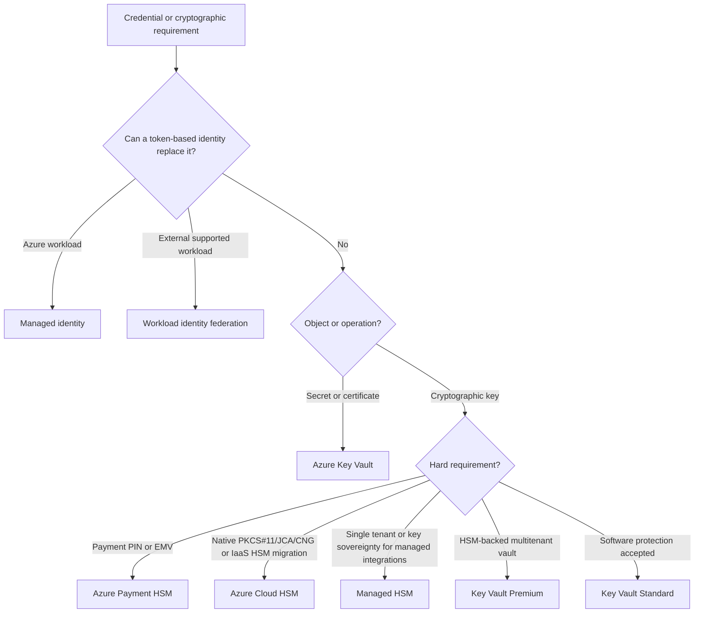
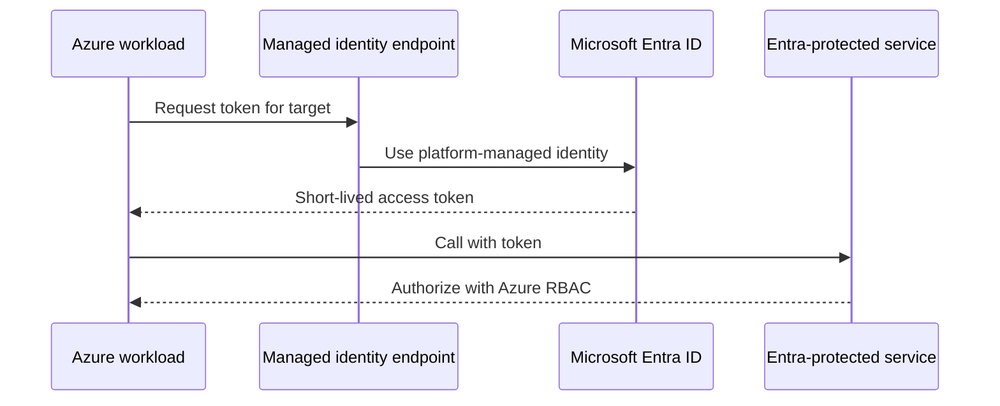

# AZ-305 Study Guide: Recommend a solution to manage secrets, certificates, and keys

> **Exam task:** Design authentication and authorization solutions — Recommend a solution to manage secrets, certificates, and keys
>
> **Domain:** Design identity, governance, and monitoring solutions
>
> **Estimated reading time:** 45 minutes
>
> **Matched task source:** Exact match in the current [AZ-305 skills measured as of April 17, 2026](https://learn.microsoft.com/en-us/credentials/certifications/resources/study-guides/az-305#skills-measured-as-of-april-17-2026) and the provided Study Guide Map.
>
> **Scope boundary:** This guide covers secret elimination, [Key Vault object and key-management service selection](https://learn.microsoft.com/en-us/azure/security/fundamentals/key-management-choose), certificate and key lifecycle, access control, network isolation, governance, monitoring, cost, and resiliency. It uses application configuration, encryption at rest, identity governance, monitoring, and disaster recovery only to clarify dependencies and the [official AZ-305 task boundaries](https://learn.microsoft.com/en-us/credentials/certifications/resources/study-guides/az-305#skills-measured-as-of-april-17-2026); it does not replace those adjacent tasks.

---

## How to use this guide

Work from the decision framework rather than memorizing Azure product names. By the end, you should be able to translate a scenario's object type, custody requirement, workload identity, integration model, lifecycle, and recovery requirement into a defensible recommendation grounded in the [Azure key-management selection guidance](https://learn.microsoft.com/en-us/azure/security/fundamentals/key-management-choose).

- Read sections 1–5 first to establish the task boundary and selection logic.
- Use sections 6–12 to add SKU, implementation, security, availability, cost, and operational constraints to a recommendation.
- Use the scenario and trap sections to practice identifying decisive words such as **password**, **certificate**, **HSM-backed**, **single-tenant**, **PKCS#11**, **payment PIN**, **customer-managed key**, **private endpoint**, **automatic renewal**, and **no stored credential**.
- Open the inline links when a scenario depends on a current limit, preview feature, compliance claim, or service integration; Microsoft notes that the exam primarily covers generally available features but can include commonly used previews. [AZ-305 exam update guidance](https://learn.microsoft.com/en-us/credentials/certifications/resources/study-guides/az-305#updates-to-the-exam)
- Keep the mental boundary clear: this task chooses and designs the credential or cryptographic-material solution; the adjacent configuration-management task decides where ordinary settings and feature flags belong, and the monitoring task designs the broader observability platform.

## Primary source set

### Exam and module sources

- The [official AZ-305 study guide](https://learn.microsoft.com/en-us/credentials/certifications/resources/study-guides/az-305) supplies the authoritative domain, skill, and task wording.
- The [Design authentication and authorization solutions](https://learn.microsoft.com/en-us/training/modules/design-authentication-authorization-solutions/) module places Key Vault beside managed identities and service principals in the identity design skill.
- The module's [Design for Azure Key Vault](https://learn.microsoft.com/en-us/training/modules/design-authentication-authorization-solutions/10-design-for-azure-key-vault) unit introduces object types, tiers, vault separation, network controls, monitoring, soft delete, and purge protection.

### Core product documentation

- [Azure Key Vault overview](https://learn.microsoft.com/en-us/azure/key-vault/general/overview) and [keys, secrets, and certificates](https://learn.microsoft.com/en-us/azure/key-vault/general/about-keys-secrets-certificates) define the main service and object model.
- [Choose the right Azure key-management solution](https://learn.microsoft.com/en-us/azure/security/fundamentals/key-management-choose) compares Key Vault Standard and Premium, Managed HSM, Cloud HSM, and Payment HSM.
- [Managed HSM](https://learn.microsoft.com/en-us/azure/key-vault/managed-hsm/overview), [Cloud HSM](https://learn.microsoft.com/en-us/azure/cloud-hsm/overview), and [Payment HSM](https://learn.microsoft.com/en-us/azure/payment-hsm/overview) document the specialized HSM choices.
- [Key Vault Azure RBAC](https://learn.microsoft.com/en-us/azure/key-vault/general/rbac-guide), [network security](https://learn.microsoft.com/en-us/azure/key-vault/general/network-security), [autorotation](https://learn.microsoft.com/en-us/azure/key-vault/general/autorotation), and [certificate scenarios](https://learn.microsoft.com/en-us/azure/key-vault/certificates/certificate-scenarios) cover the major design controls.
- [Secretless authentication](https://learn.microsoft.com/en-us/entra/identity/managed-identities-azure-resources/secretless-authentication) and [workload identity federation](https://learn.microsoft.com/en-us/entra/workload-id/workload-identity-federation) establish when the best secret-management design is to remove the secret.

### Supporting architecture and framework sources

- The [Well-Architected application-secrets guidance](https://learn.microsoft.com/en-us/azure/well-architected/security/application-secrets) supplies security tradeoffs and operational recommendations.
- [Reliability in Azure Key Vault](https://learn.microsoft.com/en-us/azure/reliability/reliability-key-vault) covers zone redundancy, regional behavior, backup, and workload responsibilities.
- [Azure App Configuration Key Vault references](https://learn.microsoft.com/en-us/azure/azure-app-configuration/use-key-vault-references-dotnet-core) define the boundary between settings and secret values.
- [Key Vault integration with Azure Policy](https://learn.microsoft.com/en-us/azure/key-vault/general/azure-policy) supports governance at scale, including deletion protection, expiry, network, and diagnostic controls.
- The [Exam Readiness Zone](https://learn.microsoft.com/en-us/shows/exam-readiness-zone/?terms=AZ-305) is useful after the technical reading for exam-strategy review, but it does not replace current product documentation.

### Discovery notes from the Study Guide Map

The map centers the task on [Azure key-management services](https://learn.microsoft.com/en-us/azure/security/fundamentals/key-management-choose), [secretless workload identities](https://learn.microsoft.com/en-us/entra/identity/managed-identities-azure-resources/secretless-authentication), Azure RBAC, networking, lifecycle, policy, monitoring, recovery, and regional resilience. It also flags [App Configuration references](https://learn.microsoft.com/en-us/azure/azure-app-configuration/use-key-vault-references-dotnet-core), AKS Secrets Store CSI integration, App Service certificate delivery, Defender for Key Vault, and service-specific customer-managed keys as adjacent integrations.

Public study discussions were used only as nonauthoritative discovery signals. Their recurring confusions—Premium versus Managed HSM, RBAC versus access policies, one shared vault versus separated vaults, secrets versus configuration, and native versus custom rotation—are resolved here using the [current Microsoft key-management guidance](https://learn.microsoft.com/en-us/azure/security/fundamentals/key-management-choose) and other linked product documentation.

## 1. Exam task scope

The architect is being asked to recommend how an organization should avoid, store, use, rotate, protect, recover, and audit sensitive credentials and cryptographic material. The task is broader than “choose Key Vault” because Azure offers materially different solutions based on object type, hardware boundary, tenancy, interface, industry, and workload integration. [Azure key-management decision guidance](https://learn.microsoft.com/en-us/azure/security/fundamentals/key-management-choose)

### What is in scope

- Decide whether a credential can be eliminated with a [managed identity or workload identity federation](https://learn.microsoft.com/en-us/entra/identity/managed-identities-azure-resources/secretless-authentication).
- Distinguish a [secret, cryptographic key, and X.509 certificate](https://learn.microsoft.com/en-us/azure/key-vault/general/about-keys-secrets-certificates) and choose the object that represents the requirement.
- Select Key Vault Standard, Key Vault Premium, Managed HSM, Cloud HSM, or Payment HSM by [security, custody, tenancy, interface, and industry requirements](https://learn.microsoft.com/en-us/azure/security/fundamentals/key-management-choose).
- Design identity, [control-plane and data-plane authorization](https://learn.microsoft.com/en-us/azure/key-vault/general/rbac-guide#key-vault-access-model-overview), network access, lifecycle automation, deletion protection, audit, and recovery.
- Recognize how customer-managed keys (CMKs), key-encryption keys (KEKs), and data-encryption keys (DEKs) affect the availability and lifecycle of dependent services. [Azure data encryption at rest](https://learn.microsoft.com/en-us/azure/security/fundamentals/encryption-atrest)

### What is outside the center of this task

> **Adjacent task context:** Choosing Azure App Configuration topology, labels, snapshots, or feature flags belongs to **Recommend an application configuration management solution**; this task covers only the protected Key Vault value referenced by App Configuration. [Key Vault references](https://learn.microsoft.com/en-us/azure/azure-app-configuration/use-key-vault-references-dotnet-core)

> **Adjacent task context:** Designing enterprise Log Analytics workspaces, Sentinel, routing, and retention belongs to the logging and monitoring tasks; this task only requires enough [Key Vault monitoring](https://learn.microsoft.com/en-us/azure/key-vault/general/monitor-key-vault) to operate and audit the recommendation.

> **Adjacent task context:** Selecting a storage/database encryption feature belongs primarily to that workload's data-protection task; this guide covers the key-management dependency and the effect of disabling or losing its KEK. [Encryption-at-rest key hierarchy](https://learn.microsoft.com/en-us/azure/security/fundamentals/encryption-atrest)

The exam mental model is: **eliminate first, classify second, select the protection boundary third, then design access and lifecycle**. A scenario that jumps immediately from “credential” to “Key Vault secret” may miss a stronger [secretless authentication](https://learn.microsoft.com/en-us/entra/identity/managed-identities-azure-resources/secretless-authentication) design.

## 2. Product and topic discovery pass

| Product, service, or topic | Why it may be relevant | Primary Microsoft source | In-scope or adjacent? |
|---|---|---|---|
| Azure Key Vault Standard | Stores software-protected keys, secrets, and certificates for general application scenarios. | [Object support](https://learn.microsoft.com/en-us/azure/key-vault/general/about-keys-secrets-certificates#object-types) | Core |
| Azure Key Vault Premium | Adds HSM-protected keys while retaining vault support for secrets and certificates. | [Key-management comparison](https://learn.microsoft.com/en-us/azure/security/fundamentals/key-management-choose) | Core |
| Azure Key Vault Managed HSM | Supplies a fully managed, single-tenant, highly available HSM boundary for HSM-backed keys only. | [Managed HSM overview](https://learn.microsoft.com/en-us/azure/key-vault/managed-hsm/overview) | Core |
| Azure Cloud HSM | Supplies customer administrative control and native cryptographic interfaces for IaaS/lift-and-shift HSM workloads. | [Cloud HSM suitability](https://learn.microsoft.com/en-us/azure/cloud-hsm/overview#azure-cloud-hsm-suitability) | Core when native HSM interfaces are required |
| Azure Payment HSM | Provides specialized bare-metal payment cryptography for PIN, EMV, payment authorization, and PCI ecosystems. | [Payment HSM use cases](https://learn.microsoft.com/en-us/azure/payment-hsm/overview#typical-use-cases) | Core only for payment scenarios |
| Managed identities | Remove deployable credentials from Azure service-to-service authentication. | [Secretless authentication within Azure](https://learn.microsoft.com/en-us/entra/identity/managed-identities-azure-resources/secretless-authentication#azure-service-to-azure-service-within-azure) | Core |
| Workload identity federation | Replaces stored client secrets/certificates for external or CI/CD workloads that can present trusted external tokens. | [External workload flow](https://learn.microsoft.com/en-us/entra/identity/managed-identities-azure-resources/secretless-authentication#external-workload-outside-azure-accesses-microsoft-entra-protected-resources) | Core/supporting |
| Azure RBAC and PIM | Separate management and data operations and provide least-privilege, time-bound administration. | [Key Vault RBAC model](https://learn.microsoft.com/en-us/azure/key-vault/general/rbac-guide) | Core |
| Private Link, firewall, and Network Security Perimeter | Restrict data-plane network paths and public exposure. | [Key Vault network options](https://learn.microsoft.com/en-us/azure/key-vault/general/network-security) | Core |
| Rotation, Event Grid, and Functions | Automate lifecycle differently for keys, secrets, and certificates. | [Autorotation models](https://learn.microsoft.com/en-us/azure/key-vault/general/autorotation#autorotation-for-different-asset-types) | Core |
| Soft delete, purge protection, and backup | Protect against accidental or malicious deletion and support constrained recovery scenarios. | [Soft-delete overview](https://learn.microsoft.com/en-us/azure/key-vault/general/soft-delete-overview) | Core |
| Azure App Configuration | Stores ordinary configuration and references Key Vault secrets without copying their values into configuration. | [Key Vault reference behavior](https://learn.microsoft.com/en-us/azure/azure-app-configuration/use-key-vault-references-dotnet-core) | Adjacent boundary |
| Azure Policy | Audits or enforces network, lifecycle, expiry, HSM, and diagnostic standards across vaults. | [Key Vault policy integration](https://learn.microsoft.com/en-us/azure/key-vault/general/azure-policy) | Supporting governance |
| Azure Monitor and Defender for Key Vault | Provide audit, health, threat, and operational evidence. | [Monitor Key Vault](https://learn.microsoft.com/en-us/azure/key-vault/general/monitor-key-vault) | Supporting/adjacent monitoring |
| Service-specific CMK integrations | Consume a Key Vault or Managed HSM key to protect Azure service data. | [Key-management scenarios](https://learn.microsoft.com/en-us/azure/security/fundamentals/key-management-choose#choose-an-azure-key-management-solution-by-scenario) | Adjacent workload dependency |

## 3. Starting point from Microsoft Learn

The [Design for Azure Key Vault](https://learn.microsoft.com/en-us/training/modules/design-authentication-authorization-solutions/10-design-for-azure-key-vault) unit establishes the baseline: separate secrets from code/configuration, distinguish Standard software keys from Premium HSM-protected keys, isolate vaults to limit blast radius, restrict access, enable network controls, log use, and protect deletion with soft delete and purge protection.

That unit is a starting point, not the entire 2026 design surface:

- It does not deeply compare [Managed HSM, Cloud HSM, and Payment HSM](https://learn.microsoft.com/en-us/azure/security/fundamentals/key-management-choose), which are decisive when single tenancy, key sovereignty, native PKCS#11, or payment PIN processing appears.
- Its access-policy wording must be reconciled with current documentation: [Azure RBAC is the default and recommended Key Vault model](https://learn.microsoft.com/en-us/azure/key-vault/general/rbac-migration) for new designs, and starting with API version `2026-02-01` it is the default for newly created vaults.
- It does not fully explain that keys, secrets, and certificates have [different native rotation models](https://learn.microsoft.com/en-us/azure/key-vault/general/autorotation#autorotation-for-different-asset-types).
- It does not replace the [Key Vault reliability](https://learn.microsoft.com/en-us/azure/reliability/reliability-key-vault) or current networking documentation needed for multi-region and private-access scenarios.

> **Exam tip:** If an answer says “create a Key Vault access policy” for a new architecture, compare it with an Azure RBAC answer. Current guidance calls [Azure RBAC the default and recommended model](https://learn.microsoft.com/en-us/azure/key-vault/general/rbac-migration); access policies are a legacy compatibility choice, not the preferred default.

## 4. Conceptual foundation

### 4.1 Eliminate before storing

Every stored credential creates lifecycle, exposure, and outage risk. For an Azure workload accessing a Microsoft Entra-protected service in the same tenant, the recommended pattern is a [managed identity and Azure RBAC](https://learn.microsoft.com/en-us/entra/identity/managed-identities-azure-resources/secretless-authentication#accesses-microsoft-entra-protected-resources-same-tenant), not an access key copied into Key Vault.

- Use a **system-assigned managed identity** when the identity should share the lifecycle of one resource. [Managed identity lifecycle guidance](https://learn.microsoft.com/en-us/entra/architecture/service-accounts-managed-identities)
- Use a **user-assigned managed identity** when multiple resources need the same identity or the identity must survive compute replacement. [Managed identity lifecycle characteristics](https://learn.microsoft.com/en-us/entra/architecture/service-accounts-managed-identities)
- Use **workload identity federation** for supported external workloads such as CI/CD or multicloud systems that can exchange a trusted external token for a Microsoft Entra token. [Workload identity federation](https://learn.microsoft.com/en-us/entra/workload-id/workload-identity-federation)
- If the target cannot use Microsoft Entra authentication, store the unavoidable password, API key, or certificate in Key Vault and let the workload's managed identity retrieve it. [Azure workload to non-Entra resource pattern](https://learn.microsoft.com/en-us/entra/identity/managed-identities-azure-resources/secretless-authentication#azure-service-accesses-external-or-non-microsoft-entra-protected-resources)

> **Exam tip:** “Store credentials securely” does not automatically mean “store a secret.” If both services support Entra tokens, choose [managed identity](https://learn.microsoft.com/en-us/entra/identity/managed-identities-azure-resources/secretless-authentication) and remove the credential.

### 4.2 Classify the object correctly

Key Vault uses versioned object identifiers, and an identifier without an explicit version is a base identifier that resolves through the service's current object behavior. [Key Vault object identifiers](https://learn.microsoft.com/en-us/azure/key-vault/general/about-keys-secrets-certificates#object-identifiers)

| Object | Architectural purpose | Important boundary |
|---|---|---|
| Secret | An opaque value retrieved by an authorized caller, such as a password, connection string, API key, or token. | The consuming application receives the secret value, so it must protect memory, logs, caches, and downstream use. [Secrets documentation](https://learn.microsoft.com/en-us/azure/key-vault/secrets/) |
| Key | Cryptographic material used for operations such as encrypt/decrypt, wrap/unwrap, sign, or verify. | The application can ask Key Vault/HSM to perform supported operations without exporting the protected private key material. [Key Vault key concepts](https://learn.microsoft.com/en-us/azure/key-vault/keys/about-keys) |
| Certificate | An X.509 lifecycle object with policy, issuer, contacts, and renewal behavior; creating one also creates addressable key and secret objects with the same name. | The certificate policy and private-key exportability determine whether and how consuming services can deploy it. [Certificate object composition](https://learn.microsoft.com/en-us/azure/key-vault/general/about-keys-secrets-certificates#object-types) |

Managed HSM supports HSM-protected cryptographic keys but not secrets or certificates. [Vault and Managed HSM object support](https://learn.microsoft.com/en-us/azure/key-vault/general/about-keys-secrets-certificates#object-types) This single constraint eliminates Managed HSM as the sole solution when the scenario requires connection strings and TLS certificate lifecycle in the same store.

> **Exam tip:** Do not choose Managed HSM merely because the word “certificate” implies cryptography. Managed HSM is [keys only](https://learn.microsoft.com/en-us/azure/key-vault/general/about-keys-secrets-certificates#object-types); use a Key Vault certificate object when issuance, renewal, and certificate deployment are the requirement.

### 4.3 Protection boundaries and key hierarchy

- **Software-protected key:** Choose Key Vault Standard when software protection satisfies the risk and compliance requirement. [Key-management comparison](https://learn.microsoft.com/en-us/azure/security/fundamentals/key-management-choose)
- **HSM-protected key in a multitenant vault service:** Choose Key Vault Premium when the solution also benefits from vault objects and native Azure integrations but requires HSM-backed key material. [Key Vault tiers](https://learn.microsoft.com/en-us/training/modules/design-authentication-authorization-solutions/10-design-for-azure-key-vault#things-to-know-about-azure-key-vault)
- **Single-tenant managed HSM boundary:** Choose Managed HSM when high-value keys require single tenancy, customer-controlled security domain, key sovereignty, and managed PaaS integration. [Managed HSM overview](https://learn.microsoft.com/en-us/azure/key-vault/managed-hsm/overview)
- **Customer-administered native HSM interfaces:** Choose Cloud HSM for IaaS/lift-and-shift applications requiring PKCS#11, JCA/JCE, CNG/KSP, AD CS private-key protection, or VM-based TLS/TDE integration. [Cloud HSM best fit](https://learn.microsoft.com/en-us/azure/cloud-hsm/overview#best-fit)
- **Payment cryptography:** Choose Payment HSM for payment authorization, PIN/EMV operations, credential issuing, and PCI payment ecosystems. [Payment HSM use cases](https://learn.microsoft.com/en-us/azure/payment-hsm/overview#typical-use-cases)

Envelope encryption separates the data-encryption key that encrypts data from the key-encryption key that wraps the DEK. Rotating a KEK normally creates new key material and requires services to rewrap DEKs; it does not mean every byte of protected data is immediately re-encrypted. [Key rotation and DEK rewrapping](https://learn.microsoft.com/en-us/azure/key-vault/keys/how-to-configure-key-rotation#key-rotation-policy)

> **Exam tip:** HSM-backed does not imply single-tenant. Key Vault Premium and Managed HSM both offer HSM-backed keys, but [tenancy, object support, sovereignty, integration, and billing model](https://learn.microsoft.com/en-us/azure/security/fundamentals/key-management-choose) distinguish them.

### 4.4 Control plane, data plane, identity, and network

Key Vault's control plane manages the vault resource through Azure Resource Manager; its data plane manages and uses the stored keys, secrets, and certificates through the vault endpoint. Both authenticate with Microsoft Entra ID, while authorization is independently evaluated for each plane. [Key Vault access model](https://learn.microsoft.com/en-us/azure/key-vault/general/rbac-guide#key-vault-access-model-overview)

- `Key Vault Contributor` manages the vault resource in the control plane but does not grant access to secret, key, or certificate data. [Key Vault built-in role boundary](https://learn.microsoft.com/en-us/azure/key-vault/general/rbac-guide#azure-built-in-roles-for-key-vault-data-plane-operations)
- Data-plane roles should match the workload operation: for example, a secrets-reading workload should not receive key administration or certificate management permissions. [Key Vault data-plane roles](https://learn.microsoft.com/en-us/azure/key-vault/general/rbac-guide#azure-built-in-roles-for-key-vault-data-plane-operations)
- A firewall or private endpoint restricts the network path but never replaces identity and authorization. The Key Vault firewall applies to data-plane traffic, not Azure Resource Manager control-plane operations. [Network security restrictions](https://learn.microsoft.com/en-us/azure/key-vault/general/network-security#restrictions-and-limitations)

> **Exam tip:** “Can manage the vault” and “can read its secrets” are separate decisions. [Control-plane RBAC and data-plane RBAC](https://learn.microsoft.com/en-us/azure/key-vault/general/rbac-guide#key-vault-access-model-overview) must be evaluated independently.

### 4.5 Lifecycle, governance, and operations

The lifecycle is object-specific: keys have native rotation policies, secrets usually require an event-triggered workflow that also changes the credential at its source, and certificates can renew through an integrated issuer or supported self-signed workflow. [Autorotation by object type](https://learn.microsoft.com/en-us/azure/key-vault/general/autorotation#autorotation-for-different-asset-types)

Governance must also protect deletion. Soft delete retains deleted vaults and objects for a configured `7`–`90` days, with `90` days as the default; the retention interval is chosen at vault creation and cannot later be changed. [Soft-delete behavior](https://learn.microsoft.com/en-us/azure/key-vault/general/soft-delete-overview) Purge protection prevents permanent purge until the retention period elapses and is commonly required for CMK integrations. [Purge protection](https://learn.microsoft.com/en-us/azure/key-vault/general/soft-delete-overview#purge-protection)

> **Exam tip:** Soft delete makes an object recoverable; purge protection stops an authorized purge from bypassing the retention period. For CMK designs, select [both safeguards](https://learn.microsoft.com/en-us/azure/key-vault/general/soft-delete-overview#purge-protection), not one as a substitute for the other.

> **Test yourself**
>
> - An App Service uses an Azure Storage account. Should the architect store an account key in Key Vault or authorize a managed identity?
> - A vendor appliance requires PKCS#11 and will run on Azure VMs. Which HSM family is the natural starting point?
>
> **Answer guidance:** Prefer [managed identity](https://learn.microsoft.com/en-us/entra/identity/managed-identities-azure-resources/secretless-authentication#accesses-microsoft-entra-protected-resources-same-tenant) when Storage can accept Entra tokens. Native PKCS#11 plus VM lift-and-shift points to [Azure Cloud HSM](https://learn.microsoft.com/en-us/azure/cloud-hsm/overview#best-fit), not ordinary Key Vault integration.

## 5. Design decision framework

Use this order in scenario questions:

1. **Can the credential be eliminated?** Use managed identity for supported Azure workloads or workload identity federation for supported external workloads. [Secretless patterns](https://learn.microsoft.com/en-us/entra/identity/managed-identities-azure-resources/secretless-authentication)
2. **What object is required?** Choose secret, key, or certificate by the operation the consumer needs. [Object types](https://learn.microsoft.com/en-us/azure/key-vault/general/about-keys-secrets-certificates#object-types)
3. **What protection and custody boundary is mandatory?** Identify software versus HSM, multitenant versus single-tenant, managed versus customer-administered interface, and payment specialization. [Key-management selection](https://learn.microsoft.com/en-us/azure/security/fundamentals/key-management-choose)
4. **How does the workload authenticate and reach the service?** Select managed identity, RBAC scope, public/firewall/private endpoint/perimeter, and DNS design. [RBAC](https://learn.microsoft.com/en-us/azure/key-vault/general/rbac-guide) [Network security](https://learn.microsoft.com/en-us/azure/key-vault/general/network-security)
5. **How is the object rotated and adopted?** Design version references, target-system update, overlap/fallback, near-expiry events, and emergency rotation. [Autorotation](https://learn.microsoft.com/en-us/azure/key-vault/general/autorotation)
6. **How is deletion, regional failure, and loss of custody recovered?** Add purge protection, backups where appropriate, regional architecture, retries/cache, and for Managed HSM protect the security domain. [Key Vault reliability](https://learn.microsoft.com/en-us/azure/reliability/reliability-key-vault) [Managed HSM security domain](https://learn.microsoft.com/en-us/azure/key-vault/managed-hsm/security-domain)

This tree identifies the service family, not the finished architecture. Apply object support, regional availability, integration support, authorization, network, lifecycle, recovery, and cost constraints before finalizing the recommendation. [Full selection comparison](https://learn.microsoft.com/en-us/azure/security/fundamentals/key-management-choose)

### Hard constraints versus soft preferences

| Requirement | Type | Design effect |
|---|---|---|
| Must store passwords or connection strings | Hard | Managed HSM and Cloud HSM are not secret stores; choose Key Vault or eliminate the credential. [Object support](https://learn.microsoft.com/en-us/azure/key-vault/general/about-keys-secrets-certificates#object-types) |
| Must manage certificate issuance and renewal | Hard | Choose Key Vault certificate lifecycle or a specialized PKI design; Cloud HSM protects CA keys but is not certificate lifecycle management. [Cloud HSM exclusions](https://learn.microsoft.com/en-us/azure/cloud-hsm/overview#azure-cloud-hsm-suitability) |
| Must use native PKCS#11/JCA/JCE/CNG/KSP | Hard | Choose Cloud HSM for the documented native interfaces. [Cloud HSM support](https://learn.microsoft.com/en-us/azure/cloud-hsm/overview#azure-cloud-hsm-suitability) |
| Must process payment PIN/EMV operations | Hard | Choose Payment HSM. [Payment HSM typical use cases](https://learn.microsoft.com/en-us/azure/payment-hsm/overview#typical-use-cases) |
| Requires single tenancy/key sovereignty | Hard when contractual | Favor Managed HSM for managed Azure key scenarios or Cloud HSM when native interface/customer HSM administration is also required. [Selection guidance](https://learn.microsoft.com/en-us/azure/security/fundamentals/key-management-choose) |
| Wants lower operational complexity | Soft | Favor a [fully managed Key Vault or Managed HSM service](https://learn.microsoft.com/en-us/azure/security/fundamentals/key-management-choose) over customer-administered HSM integration when other constraints allow. |
| Wants lower cost | Soft | Use Standard software keys if compliant; avoid an hourly dedicated HSM solely because “HSM sounds more secure.” [Key-management cost comparison](https://learn.microsoft.com/en-us/azure/security/fundamentals/key-management-choose) |
| Wants one shared vault for convenience | Soft and usually unsafe | Separate by application/environment and often region/tenant to align access, availability, and blast-radius boundaries. [RBAC scope recommendation](https://learn.microsoft.com/en-us/azure/key-vault/general/rbac-guide#best-practices-for-individual-keys-secrets-and-certificates-role-assignments) |

> **Test yourself**
>
> - A regulated Azure Storage design requires HSM-backed CMKs and single tenancy, but no secrets or certificates. Which option fits?
> - A workload needs an HSM-backed signing key plus database passwords and TLS certificate renewal in one service boundary. Is Managed HSM sufficient?
>
> **Answer guidance:** Single-tenant HSM-backed managed keys point to [Managed HSM](https://learn.microsoft.com/en-us/azure/key-vault/managed-hsm/overview). Managed HSM cannot store passwords or certificate objects, so the mixed-object requirement needs [Key Vault Premium](https://learn.microsoft.com/en-us/azure/key-vault/general/about-keys-secrets-certificates#object-types) or separated complementary services.

## 6. Service and feature comparison tables

### Key-management service comparison

| Service | Object/interface fit | Tenancy and protection | Best scenario | Main rejection clue |
|---|---|---|---|---|
| Key Vault Standard | Software-protected keys, secrets, certificates. [Object types](https://learn.microsoft.com/en-us/azure/key-vault/general/about-keys-secrets-certificates#object-types) | Managed multitenant service. [Selection table](https://learn.microsoft.com/en-us/azure/security/fundamentals/key-management-choose) | General application secrets, certificate lifecycle, or software-key cryptography. | Explicit HSM, single-tenant, native PKCS#11, or payment requirement. |
| Key Vault Premium | Software and HSM-protected keys plus secrets and certificates. [Key Vault tiers](https://learn.microsoft.com/en-us/training/modules/design-authentication-authorization-solutions/10-design-for-azure-key-vault#things-to-know-about-azure-key-vault) | Managed multitenant vault with HSM-backed key option. | HSM-backed keys with native vault/PaaS integration and mixed object types. | Mandatory single tenancy/key sovereignty or native general-purpose HSM interface. |
| Managed HSM | HSM-protected keys only through managed interfaces. [Managed HSM overview](https://learn.microsoft.com/en-us/azure/key-vault/managed-hsm/overview) | Fully managed, single-tenant, FIPS 140-3 Level 3 service with customer-controlled security domain. | High-value keys, CMKs, key sovereignty, and centralized enterprise key management. | Passwords, connection strings, certificate lifecycle, or full native PKCS#11 application migration. |
| Cloud HSM | Native PKCS#11, JCA/JCE, CNG/KSP and IaaS integrations. [Cloud HSM support](https://learn.microsoft.com/en-us/azure/cloud-hsm/overview#azure-cloud-hsm-suitability) | Single-tenant, customer-administered HSM cluster; Microsoft manages availability/patching. | VM lift-and-shift, AD CS key protection, VM-based TLS offload, Oracle/SQL Server TDE. | Azure PaaS/SaaS CMK integration, secret storage, or certificate lifecycle management. |
| Payment HSM | Thales payShield payment cryptographic operations. [Payment HSM overview](https://learn.microsoft.com/en-us/azure/payment-hsm/overview) | Bare-metal, single-tenant, customer-exclusive administration. | PIN, EMV, payment authorization, issuing, tokenization, and PCI payment processing. | General application keys or ordinary CMK requirements. |

### Identity and credential pattern comparison

| Pattern | Choose when | Lifecycle implication | Key risk |
|---|---|---|---|
| System-assigned managed identity | One Azure resource needs a unique identity with matching lifecycle. [Managed identity guidance](https://learn.microsoft.com/en-us/entra/architecture/service-accounts-managed-identities) | Deleted with its owning resource. | Recreating the resource creates a new identity and requires reauthorization. |
| User-assigned managed identity | Multiple resources share an identity or compute is replaced independently. [Managed identity guidance](https://learn.microsoft.com/en-us/entra/architecture/service-accounts-managed-identities) | Identity persists until explicitly deleted. | Shared permission scope can increase blast radius; unused identities require governance. |
| Workload identity federation | External/CI/CD workload has a trusted issuer and can exchange federated tokens. [Workload identity federation](https://learn.microsoft.com/en-us/entra/workload-id/workload-identity-federation) | No client-secret/certificate rotation for the federation credential. | Trust conditions such as issuer, subject, and audience must be precise. |
| Managed identity retrieves Key Vault secret | Target cannot accept Entra tokens. [Non-Entra target pattern](https://learn.microsoft.com/en-us/entra/identity/managed-identities-azure-resources/secretless-authentication#azure-service-accesses-external-or-non-microsoft-entra-protected-resources) | Vault secret and target credential must rotate together. | Updating only Key Vault or only the target causes authentication failure. |
| Service principal client secret/certificate | A legacy or unsupported flow prevents stronger identity patterns. [Secretless authentication patterns](https://learn.microsoft.com/en-us/entra/identity/managed-identities-azure-resources/secretless-authentication) | Explicit expiry, secure storage, monitoring, and rotation are required. [Application secret guidance](https://learn.microsoft.com/en-us/azure/well-architected/security/application-secrets) | Leaked or expired credential; prefer [federation or managed identity](https://learn.microsoft.com/en-us/entra/workload-id/workload-identity-federation) where supported. |

### Lifecycle comparison

| Object | Native lifecycle mechanism | Consumer design rule | Failure mode |
|---|---|---|---|
| Key | Rotation policy creates a new version; Event Grid can notify near expiry. [Key rotation policy](https://learn.microsoft.com/en-us/azure/key-vault/keys/how-to-configure-key-rotation#key-rotation-policy) | Use versionless identifiers for consumers that automatically adopt new versions, while retaining versioned references needed to decrypt/unwrap existing data. | Disabling old versions before DEKs are rewrapped makes existing data unavailable. |
| Secret | Event Grid event commonly triggers an Azure Function that updates the target credential and Key Vault. [Secret autorotation](https://learn.microsoft.com/en-us/azure/key-vault/general/autorotation#secret-autorotation) | Use a dual-credential overlap pattern when the target supports two credentials and availability matters. | Vault and target values diverge, or the consumer caches a retired value. |
| Certificate | Certificate policy can renew with integrated issuers or regenerate supported self-signed certificates. [Certificate autorotation](https://learn.microsoft.com/en-us/azure/key-vault/general/autorotation#certificate-autorotation) | Confirm issuer support, renewal threshold, exportability, deployment integration, chain, and endpoint binding. | Renewal succeeds in Key Vault but the new certificate is not deployed or bound by the consumer. |

### Network access comparison

| Option | Use when | Architectural tradeoff |
|---|---|---|
| Public endpoint with identity only | Low-complexity scenario accepts public network reachability while requiring Entra authentication and authorization. [Firewall-disabled behavior](https://learn.microsoft.com/en-us/azure/key-vault/general/network-security#key-vault-firewall-disabled-default) | Simplest, but broadest network exposure; public reachability is not anonymous access. |
| Firewall with IP/VNet rules | Known public IPs or service endpoints meet the path requirement. [Key Vault firewall](https://learn.microsoft.com/en-us/azure/key-vault/general/network-security#firewall-settings) | Rule/egress maintenance and trusted-service limitations can create outages. |
| Private endpoint | Workloads need private VNet connectivity and private DNS to the data plane. [Key Vault Private Link](https://learn.microsoft.com/en-us/azure/key-vault/general/private-link-service) | Adds endpoint, DNS, network, and cross-region design dependencies; control-plane operations remain separate. |
| Network Security Perimeter | Multiple supported PaaS resources need a logical public-access boundary with explicit rules. [Network Security Perimeter](https://learn.microsoft.com/en-us/azure/key-vault/general/network-security#network-security-perimeter) | Perimeter rules affect public traffic and trusted-services behavior; private endpoint traffic is outside perimeter enforcement. |

## 7. Architecture patterns

### Pattern 1 — Secretless Azure workload

**When:** An Azure-hosted application calls Azure services that support Microsoft Entra authentication. [Secretless Azure service-to-service pattern](https://learn.microsoft.com/en-us/entra/identity/managed-identities-azure-resources/secretless-authentication#accesses-microsoft-entra-protected-resources-same-tenant)

- **Strengths:** No retrievable application credential, platform-managed identity lifecycle, and centralized RBAC. [Secretless Azure service pattern](https://learn.microsoft.com/en-us/entra/identity/managed-identities-azure-resources/secretless-authentication#accesses-microsoft-entra-protected-resources-same-tenant)
- **Weaknesses:** The pattern works only where the target accepts Entra tokens; identity recreation and shared user-assigned identities need deliberate lifecycle controls. [Managed identity design guidance](https://learn.microsoft.com/en-us/entra/architecture/service-accounts-managed-identities)
- **Failure modes:** Missing role assignment, wrong scope, token audience error, deleted/recreated system identity, or a target without Entra authorization can break the flow. [Authorize workloads with Entra ID](https://learn.microsoft.com/en-us/entra/architecture/authorize-applications-resources-workloads)
- **Cost:** Managed identity avoids dedicated secret-rotation infrastructure for that connection; target and monitoring costs still apply. [Secretless authentication benefits](https://learn.microsoft.com/en-us/entra/identity/managed-identities-azure-resources/secretless-authentication)
- **Operations/security:** Monitor role changes and access evidence, and grant only the target data operations required. [Managed identity security guidance](https://learn.microsoft.com/en-us/entra/architecture/service-accounts-managed-identities)

### Pattern 2 — Managed identity bootstraps an unavoidable secret

**When:** The application runs in Azure but a third-party database, API, or device requires a password/API key. [Non-Entra target pattern](https://learn.microsoft.com/en-us/entra/identity/managed-identities-azure-resources/secretless-authentication#azure-service-accesses-external-or-non-microsoft-entra-protected-resources)

- The application authenticates to Key Vault with managed identity, receives the secret, and uses it only for the non-Entra target. [External/non-Entra resource pattern](https://learn.microsoft.com/en-us/entra/identity/managed-identities-azure-resources/secretless-authentication#azure-service-accesses-external-or-non-microsoft-entra-protected-resources)
- Separate vaults by application/environment so a compromised workload identity cannot read unrelated credentials. [Vault-scope recommendation](https://learn.microsoft.com/en-us/azure/key-vault/general/rbac-guide#best-practices-for-individual-keys-secrets-and-certificates-role-assignments)
- Cache only in memory for a controlled interval and implement retry/backoff to reduce latency and throttling; Key Vault is not a high-throughput application database. [Throttling guidance](https://learn.microsoft.com/en-us/azure/key-vault/general/overview-throttling)
- Rotate the value at the target and in Key Vault as one transaction or staged dual-credential workflow. [Secret-rotation patterns](https://learn.microsoft.com/en-us/azure/key-vault/general/autorotation#secret-autorotation)

### Pattern 3 — Configuration references without secret duplication

**When:** Applications need centralized settings and secret references. [App Configuration Key Vault references](https://learn.microsoft.com/en-us/azure/azure-app-configuration/use-key-vault-references-dotnet-core)

- Azure App Configuration stores the Key Vault secret URI, not the secret value. The application authenticates independently to App Configuration and Key Vault. [Key Vault references](https://learn.microsoft.com/en-us/azure/azure-app-configuration/use-key-vault-references-dotnet-core)
- **Strength:** Configuration operators can manage nonsecret settings without receiving secret values because App Configuration stores the reference rather than the value. [Reference behavior](https://learn.microsoft.com/en-us/azure/azure-app-configuration/use-key-vault-references-dotnet-core)
- **Weakness/failure mode:** App Configuration availability, Key Vault availability, identity permissions, reference resolution, and refresh behavior become separate dependencies. [Reference prerequisites](https://learn.microsoft.com/en-us/azure/azure-app-configuration/use-key-vault-references-dotnet-core)
- **Exam boundary:** App Configuration is not a replacement secret store, and Key Vault is not a general configuration or business-data database. [Application-secrets guidance](https://learn.microsoft.com/en-us/azure/well-architected/security/application-secrets)

### Pattern 4 — CMK-backed Azure service

**When:** Compliance or contractual requirements require customer control of the KEK used by an Azure service. [CMK and KEK scenarios](https://learn.microsoft.com/en-us/azure/security/fundamentals/key-management-choose#choose-an-azure-key-management-solution-by-scenario)

- Select a Key Vault Premium or Managed HSM key based on the service's supported integration, HSM/tenancy/sovereignty requirement, region, and tenant constraints. [CMK selection guidance](https://learn.microsoft.com/en-us/azure/security/fundamentals/key-management-choose#choose-an-azure-key-management-solution-by-scenario)
- Grant the service identity only the cryptographic operations it requires, commonly metadata plus wrap/unwrap rather than key administration. [Key Vault Crypto Service Encryption User](https://learn.microsoft.com/en-us/azure/key-vault/general/rbac-guide#azure-built-in-roles-for-key-vault-data-plane-operations)
- Retain old key versions until the dependent service confirms rewrapping; disabling or deleting a KEK can make encrypted data unavailable. [Key rotation behavior](https://learn.microsoft.com/en-us/azure/key-vault/keys/how-to-configure-key-rotation#key-rotation-policy)
- **Cost/operations:** Premium/HSM operations, rotation, audit retention, private networking, and service-specific integration all add cost and operational coupling. [Key-management solution comparison](https://learn.microsoft.com/en-us/azure/security/fundamentals/key-management-choose)

### Pattern 5 — Automated certificate lifecycle

**When:** An application needs public or private TLS certificates with controlled issuance and renewal. [Key Vault certificate scenarios](https://learn.microsoft.com/en-us/azure/key-vault/certificates/certificate-scenarios)

1. Decide whether the certificate is self-signed, issued by a Key Vault partner CA, or created through a CSR with a nonpartner/internal CA. [Certificate scenarios](https://learn.microsoft.com/en-us/azure/key-vault/certificates/certificate-scenarios)
2. Define certificate policy, subject/SAN, key type/size, validity, private-key exportability, renewal trigger, issuer, and contacts. [Certificate concepts](https://learn.microsoft.com/en-us/azure/key-vault/certificates/about-certificates)
3. Authorize the delivery integration or workload identity to retrieve/deploy only the needed certificate material. [Key Vault certificate RBAC roles](https://learn.microsoft.com/en-us/azure/key-vault/general/rbac-guide#azure-built-in-roles-for-key-vault-data-plane-operations)
4. Monitor near-expiry and renewal outcomes and test that the consuming endpoint actually binds the new version. [Certificate autorotation](https://learn.microsoft.com/en-us/azure/key-vault/certificates/tutorial-rotate-certificates)

- **Strength:** Centralized policy and supported renewal reduce manual expiry operations. [Certificate autorotation](https://learn.microsoft.com/en-us/azure/key-vault/certificates/tutorial-rotate-certificates)
- **Weakness:** Renewal is not the same as deployment; issuer and endpoint-specific bindings can require additional automation. [Certificate scenarios](https://learn.microsoft.com/en-us/azure/key-vault/certificates/certificate-scenarios)
- **Failure modes:** CA account or validation failure, renewal without consumer deployment, incompatible private-key exportability, or a stale listener binding can still cause outage. [Certificate lifecycle guidance](https://learn.microsoft.com/en-us/azure/key-vault/certificates/about-certificates)

### Pattern 6 — Enterprise vault topology

**When:** Multiple teams, regions, environments, or tenants need governed secret management. [Vault separation guidance](https://learn.microsoft.com/en-us/azure/key-vault/general/secure-key-vault)

- Default to a vault per application per environment, with additional regional/tenant separation when availability, residency, ownership, or multitenancy requires it. [Key Vault RBAC best practice](https://learn.microsoft.com/en-us/azure/key-vault/general/rbac-guide#best-practices-for-individual-keys-secrets-and-certificates-role-assignments)
- Apply Azure Policy for RBAC, deletion protection, private access, key/certificate properties, expiry, and diagnostics. [Key Vault policy controls](https://learn.microsoft.com/en-us/azure/key-vault/general/azure-policy)
- Centralize standards and monitoring without centralizing every secret into one blast radius. [Vault boundary recommendation](https://learn.microsoft.com/en-us/azure/key-vault/general/rbac-guide#best-practices-for-individual-keys-secrets-and-certificates-role-assignments)
- **Cost tradeoff:** More vaults add configuration, private endpoints, DNS, logs, and governance objects, but ordinary Key Vault pricing is principally SKU/operation based rather than a reason to collapse unrelated trust boundaries. [Key Vault pricing model and reliability cost](https://learn.microsoft.com/en-us/azure/reliability/reliability-key-vault#cost)

## 8. Implementation awareness for architects

### Decisions required before implementation

1. Inventory credentials and identify which can be replaced by managed identity or federation. [Secretless authentication](https://learn.microsoft.com/en-us/entra/identity/managed-identities-azure-resources/secretless-authentication)
2. Classify remaining objects and map each consumer's required operations. [Object types](https://learn.microsoft.com/en-us/azure/key-vault/general/about-keys-secrets-certificates#object-types)
3. Select service/SKU, region, topology, tenant/subscription ownership, and naming. [Key-management selection](https://learn.microsoft.com/en-us/azure/security/fundamentals/key-management-choose)
4. Define control-plane administrators, data-plane roles, PIM use, and emergency access. [Key Vault RBAC model](https://learn.microsoft.com/en-us/azure/key-vault/general/rbac-guide#key-vault-access-model-overview)
5. Define public/firewall/private endpoint/perimeter access and private DNS dependencies. [Key Vault network security](https://learn.microsoft.com/en-us/azure/key-vault/general/network-security)
6. Set soft-delete retention at creation, enable purge protection, and define backup/security-domain custody. [Soft-delete retention configuration](https://learn.microsoft.com/en-us/azure/key-vault/general/soft-delete-overview)
7. Define rotation/renewal, consumer refresh, rollback, and emergency-revocation workflows. [Autorotation models](https://learn.microsoft.com/en-us/azure/key-vault/general/autorotation)
8. Define diagnostic settings, alerts, policy enforcement, and evidence retention. [Monitor Key Vault](https://learn.microsoft.com/en-us/azure/key-vault/general/monitor-key-vault)

### Implementation facts that influence design

- Switching an existing vault from access policies to Azure RBAC invalidates access-policy permissions, so equivalent roles must be staged to avoid an outage. [RBAC migration warning](https://learn.microsoft.com/en-us/azure/key-vault/general/rbac-guide#enable-azure-rbac-permissions-on-key-vault)
- Role-assignment changes can take time to propagate; architects should include deployment validation and retry rather than assume immediate data-plane access. [Azure RBAC troubleshooting](https://learn.microsoft.com/en-us/azure/role-based-access-control/troubleshooting#role-assignment-changes-are-not-being-detected)
- Private endpoints require correct private DNS resolution to the vault endpoint and network reachability from every consumer, administrative tool, and rotation component. [Key Vault Private Link](https://learn.microsoft.com/en-us/azure/key-vault/general/private-link-service)
- Key Vault can throttle requests with HTTP `429`; clients should use exponential backoff, in-memory caching, and traffic separation by security/availability domain. [Throttling guidance](https://learn.microsoft.com/en-us/azure/key-vault/general/overview-throttling)
- Key Vault has no fixed count limit for stored keys, secrets, or certificates, but high version counts and transaction limits affect operations; more than `500` versions can impair backup, and a single-object backup supports at most `500` versions. [Key Vault service limits](https://learn.microsoft.com/en-us/azure/key-vault/general/service-limits)
- Managed HSM has its own capacity limits, including `5,000` keys and `100` versions per key per instance in current documentation, so high-scale designs must consult Managed HSM scaling guidance. [Managed HSM service limits](https://learn.microsoft.com/en-us/azure/key-vault/general/service-limits#key-vault-managed-hsm)
- The implementation team can choose portal, CLI, PowerShell, Bicep/ARM, or SDK mechanics, but the architect must specify the desired access model, topology, lifecycle, and governance outcome. [Key Vault developer guidance](https://learn.microsoft.com/en-us/azure/key-vault/general/developers-guide)

## 9. Security, governance, and compliance considerations

### Least privilege and separation of duties

- Prefer Azure RBAC for new Key Vault designs; it is the default and recommended model, while access policies are legacy. [RBAC migration guidance](https://learn.microsoft.com/en-us/azure/key-vault/general/rbac-migration)
- Assign workload data roles at vault scope by default and use one vault per application/environment rather than many object-level assignments; object scope is an exception, not a substitute for a trust boundary. [RBAC assignment best practices](https://learn.microsoft.com/en-us/azure/key-vault/general/rbac-guide#best-practices-for-individual-keys-secrets-and-certificates-role-assignments)
- Use PIM and approval/justification for powerful human roles, and distinguish routine secret reading from rotation, certificate management, purge, and RBAC administration. [Privileged access guidance](https://learn.microsoft.com/en-us/azure/well-architected/security/application-secrets)
- Protect control-plane Contributor/Owner assignments because an administrator who can change the authorization model or role assignments can potentially expand data access. [Administrative access warning](https://learn.microsoft.com/en-us/azure/key-vault/general/rbac-guide#managing-administrative-access-to-key-vault)
- For Managed HSM, remember that the control plane uses Azure RBAC while the data plane has its own local RBAC model and security-domain operations. [Managed HSM access control](https://learn.microsoft.com/en-us/azure/key-vault/managed-hsm/access-control)

### Network and exfiltration controls

- A private endpoint supplies private data-plane connectivity but does not replace identity, RBAC, DNS, or control-plane governance. [Key Vault Private Link](https://learn.microsoft.com/en-us/azure/key-vault/general/private-link-service)
- “Allow trusted Microsoft services” is not a blanket allow for every Azure service or scenario; confirm that the exact integration is supported. [Trusted-services firewall behavior](https://learn.microsoft.com/en-us/azure/key-vault/general/network-security#key-vault-firewall-enabled-trusted-services-only)
- Network Security Perimeter can group supported PaaS resources into a logical boundary for public traffic; private endpoint traffic is not subject to perimeter rules, and perimeter mode changes trusted-service behavior. [Network Security Perimeter restrictions](https://learn.microsoft.com/en-us/azure/key-vault/general/network-security#restrictions-and-limitations)

### Governance and compliance

- Apply Azure Policy to audit or deny missing purge protection, public exposure, noncompliant key types/sizes/expiry, certificate expiry, and missing diagnostic settings. [Key Vault policy integration](https://learn.microsoft.com/en-us/azure/key-vault/general/azure-policy)
- Select HSM claims from current product certifications, not generic assumptions: current Managed HSM and Cloud HSM documentation identify FIPS 140-3 Level 3, while Payment HSM has payment-specific PCI and Thales payShield certifications. [Managed HSM](https://learn.microsoft.com/en-us/azure/key-vault/managed-hsm/overview) [Cloud HSM](https://learn.microsoft.com/en-us/azure/cloud-hsm/overview) [Payment HSM compliance](https://learn.microsoft.com/en-us/azure/payment-hsm/certification-compliance)
- Compliance does not end at the service boundary; the customer still owns role governance, network design, rotation, audit retention, key usage, backup custody, and incident response. [Secure Key Vault guidance](https://learn.microsoft.com/en-us/azure/key-vault/general/secure-key-vault)

> **Exam tip:** Private Link answers a network-path requirement, HSM answers a key-protection/custody requirement, and RBAC answers an authorization requirement. A secure design often needs all three, but [none substitutes for the others](https://learn.microsoft.com/en-us/azure/key-vault/general/secure-key-vault).

> **Test yourself**
>
> - Does `Key Vault Contributor` allow an operator to read secrets?
> - Does disabling public network access eliminate the need for data-plane RBAC?
>
> **Answer guidance:** `Key Vault Contributor` is a [control-plane role without key/secret/certificate data access](https://learn.microsoft.com/en-us/azure/key-vault/general/rbac-guide#azure-built-in-roles-for-key-vault-data-plane-operations). Network restrictions and [data-plane authorization](https://learn.microsoft.com/en-us/azure/key-vault/general/rbac-guide#key-vault-access-model-overview) are independent gates.

## 10. Resiliency, availability, and disaster recovery considerations

Key Vault is highly available within a region, but the application must still handle transient failures and regional dependencies. In regions supporting availability zones, Key Vault automatically provides zone redundancy for both Standard and Premium without additional configuration or zone-redundancy cost. [Key Vault zone redundancy](https://learn.microsoft.com/en-us/azure/reliability/reliability-key-vault#resilience-to-availability-zone-failures)

### Design implications

- During a zone failure, Microsoft reroutes requests; in-flight requests can fail, so clients must implement transient retry. No data loss is expected from a zone failure because data is synchronously replicated across zones. [Zone-failure behavior](https://learn.microsoft.com/en-us/azure/reliability/reliability-key-vault#behavior-during-a-zone-failure)
- For regional failure, understand Microsoft's replication/failover behavior and whether the workload's recovery objectives justify vaults and application stacks in multiple regions. [Multi-region reliability](https://learn.microsoft.com/en-us/azure/reliability/reliability-key-vault)
- A per-application, per-region vault topology reduces cross-region latency/throttling dependency and aligns a regional application instance with its local secret domain. [Key Vault throttling and regional vault guidance](https://learn.microsoft.com/en-us/azure/key-vault/general/overview-throttling#how-does-key-vault-handle-its-limits)
- Secret caching can improve continuity and reduce calls, but cache only in protected memory, bound its lifetime, and plan what happens when a rotated value invalidates the cache. [Throttling guidance](https://learn.microsoft.com/en-us/azure/key-vault/general/overview-throttling)

### Recovery controls

| Control | Protects against | Does not replace |
|---|---|---|
| Soft delete | Accidental deletion within the configured retention period. [Soft delete](https://learn.microsoft.com/en-us/azure/key-vault/general/soft-delete-overview) | Purge protection, regional architecture, or application retry. |
| Purge protection | Malicious/accidental purge before retention expires. [Purge protection](https://learn.microsoft.com/en-us/azure/key-vault/general/soft-delete-overview#purge-protection) | Backup or consumer configuration recovery. |
| Individual-object backup | Loss scenarios needing an encrypted point-in-time copy; restore is limited to the same subscription and Azure geography. [Key Vault backup constraints](https://learn.microsoft.com/en-us/azure/reliability/reliability-key-vault#backups) | Continuous replication; backups do not update as objects change. |
| Multiple regional vaults | Application-controlled regional dependency and recovery design. [Key Vault regional guidance](https://learn.microsoft.com/en-us/azure/reliability/reliability-key-vault#multi-region-support) | There is no automatic application-secret synchronization between independently designed regional vaults; lifecycle automation must update each intended vault. [Multi-region vault guidance](https://learn.microsoft.com/en-us/azure/key-vault/general/overview-throttling#how-does-key-vault-handle-its-limits) |
| Managed HSM security domain and full backup | Catastrophic Managed HSM reconstruction and manual cross-region recovery. [Managed HSM disaster recovery](https://learn.microsoft.com/en-us/azure/key-vault/managed-hsm/disaster-recovery-guide) | Safe custody of the security-domain quorum keys and current backups. |

For Managed HSM, loss of the protected security domain and its quorum keys can make disaster recovery impossible; Microsoft cannot recover them for the customer. [Managed HSM security-domain purpose](https://learn.microsoft.com/en-us/azure/key-vault/managed-hsm/security-domain) Full restore is destructive/disruptive and restores keys, versions, attributes, tags, and role assignments to the backup state. [Managed HSM full restore](https://learn.microsoft.com/en-us/azure/key-vault/managed-hsm/backup-restore#full-restore)

Keep this section subordinate to the task: define how key/secret availability affects workload RTO/RPO, but place the full application failover and data-recovery architecture in the AZ-305 business-continuity tasks.

## 11. Cost and licensing considerations

Cost is a selection input, not an afterthought, because the HSM choices use different economic models. Use the [current Azure key-management comparison](https://learn.microsoft.com/en-us/azure/security/fundamentals/key-management-choose) and pricing pages rather than memorizing prices.

| Cost driver | Architectural effect |
|---|---|
| Key Vault Standard/Premium SKU and operations | Premium is justified when HSM-protected keys are required; ordinary secrets/certificates do not independently require Premium. Zone redundancy adds no separate charge. [Key Vault reliability cost](https://learn.microsoft.com/en-us/azure/reliability/reliability-key-vault#cost) |
| Managed HSM instance | Dedicated single-tenant capacity is billed as an always-on managed HSM resource, making consolidation of compatible high-value keys reasonable but not at the expense of access boundaries. [Managed HSM pricing reference](https://learn.microsoft.com/en-us/azure/key-vault/managed-hsm/overview) |
| Cloud HSM cluster | Dedicated HSM cluster and customer integration/administration costs suit native-interface requirements, not ordinary secret storage. [Cloud HSM overview](https://learn.microsoft.com/en-us/azure/cloud-hsm/overview) |
| Payment HSM | Specialized bare-metal payment devices, accessories, onboarding, network, and HA pairs create a materially different cost/operations profile. [Payment HSM overview](https://learn.microsoft.com/en-us/azure/payment-hsm/overview) |
| Private endpoints and DNS | Each regional/vault topology can add [Private Link, DNS, and network-management cost](https://learn.microsoft.com/en-us/azure/private-link/private-link-overview#pricing). |
| Rotation automation | Event Grid, Functions, logging, and testing cost money but reduce expiry incidents and manual labor. [Secret autorotation architecture](https://learn.microsoft.com/en-us/azure/key-vault/general/autorotation#secret-autorotation) |
| Logs and retention | Diagnostic ingestion, Log Analytics retention, archive, Event Hubs, or storage are billed by their destination services. [Key Vault monitoring collection](https://learn.microsoft.com/en-us/azure/key-vault/general/monitor-key-vault#collection-and-routing) |
| More vaults | Increases governance objects and possibly networking/logging resources, but better aligns blast radius, throughput, and regional architecture. [Vault separation guidance](https://learn.microsoft.com/en-us/azure/key-vault/general/rbac-guide#best-practices-for-individual-keys-secrets-and-certificates-role-assignments) |

Reservations and compute savings plans are generally not the main Key Vault design lever. The exam-relevant optimization is to eliminate credentials, choose only the protection tier required, avoid dedicated HSM services without a hard requirement, and design rotation/monitoring to prevent expensive outages. [Key-management cost comparison](https://learn.microsoft.com/en-us/azure/security/fundamentals/key-management-choose)

> **Exam tip:** “HSM-backed” does not automatically justify Managed HSM. If multitenant HSM protection and mixed keys/secrets/certificates are acceptable, [Key Vault Premium](https://learn.microsoft.com/en-us/azure/security/fundamentals/key-management-choose) can be the lower-complexity fit; select Managed HSM for its single-tenant/sovereignty boundary, not its name.

## 12. Monitoring and operational considerations

This task needs operational monitoring sufficient to prove access, lifecycle, health, and recovery. It does not require designing the enterprise-wide workspace and SIEM architecture.

### Minimum operational signal set

| Signal | What it proves | Design action |
|---|---|---|
| Azure Activity Log | Control-plane changes to the vault resource and related Azure resources. [Activity Log behavior](https://learn.microsoft.com/en-us/azure/key-vault/general/monitor-key-vault#azure-activity-log) | Alert on deletion, networking, authorization-model, policy, and diagnostic changes. |
| Key Vault resource logs | Authenticated data-plane REST requests, including failures, when diagnostic settings route the logs. [Enable Key Vault logging](https://learn.microsoft.com/en-us/azure/key-vault/general/howto-logging) | Send `AuditEvent`/supported resource logs to Log Analytics, Event Hubs, or Storage according to investigation and retention needs. |
| Platform metrics | Availability, latency, saturation, requests, and error behavior; metrics are collected automatically. [Azure Monitor platform metrics](https://learn.microsoft.com/en-us/azure/key-vault/general/monitor-key-vault#azure-monitor-platform-metrics) | Alert on availability, latency, saturation, throttling, and abnormal errors using tested thresholds. |
| Event Grid lifecycle events | Near-expiry and object-change signals that can trigger automation or notifications. [Autorotation events](https://learn.microsoft.com/en-us/azure/key-vault/general/autorotation) | Monitor delivery failures and dead-letter/automation outcomes, not only event publication. |
| Azure Policy compliance | Drift in purge protection, networking, expiry, key properties, and diagnostics. [Key Vault policy integration](https://learn.microsoft.com/en-us/azure/key-vault/general/azure-policy) | Remediate or deny based on organizational risk and deployment sequencing. |
| Resource Health and Service Health | Resource-specific and broader Azure service incidents. [Zone-failure monitoring](https://learn.microsoft.com/en-us/azure/reliability/reliability-key-vault#behavior-during-a-zone-failure) | Route health alerts to the owning operations team and correlate with application failures. |
| Defender for Key Vault | [Security detections for suspicious Key Vault access patterns](https://learn.microsoft.com/en-us/azure/defender-for-cloud/defender-for-key-vault-introduction) where the plan enables it. | Integrate incidents into the security operations process rather than treating [Defender for Key Vault](https://learn.microsoft.com/en-us/azure/defender-for-cloud/defender-for-key-vault-introduction) as access control. |

Resource logs are generated but are not stored/queryable until a diagnostic setting routes them; platform metrics and Activity Log have different default collection behavior. [Key Vault collection and routing](https://learn.microsoft.com/en-us/azure/key-vault/general/monitor-key-vault#collection-and-routing) Monitor both successful and failed access, rotation completion, certificate expiry, old enabled versions, purge attempts, RBAC changes, and sustained `429` throttling.

Operational ownership should be explicit:

- Application teams own consumer refresh, cache behavior, retry, and validation after rotation. [Application-secrets operations](https://learn.microsoft.com/en-us/azure/well-architected/security/application-secrets)
- Platform/security teams own standards, policy, privileged access, network boundaries, and central evidence. [Secure Key Vault guidance](https://learn.microsoft.com/en-us/azure/key-vault/general/secure-key-vault)
- PKI/key custodians own issuer, key ceremony, security-domain quorum, and HSM recovery responsibilities where applicable. [Managed HSM security domain](https://learn.microsoft.com/en-us/azure/key-vault/managed-hsm/security-domain)
- Workload owners and data owners jointly approve CMK disable/delete because the action can remove access to dependent data. [Encryption-at-rest key hierarchy](https://learn.microsoft.com/en-us/azure/security/fundamentals/encryption-atrest)

> **Test yourself**
>
> - Are Key Vault resource logs automatically retained in Log Analytics?
> - Which team should own verifying that a renewed certificate is bound to the production listener?
>
> **Answer guidance:** Resource logs require a [diagnostic setting and destination](https://learn.microsoft.com/en-us/azure/key-vault/general/monitor-key-vault#azure-monitor-resource-logs). The workload/application owner must validate deployment and binding; certificate renewal in Key Vault alone does not prove endpoint adoption. [Certificate rotation](https://learn.microsoft.com/en-us/azure/key-vault/certificates/tutorial-rotate-certificates)

## 13. Common exam traps

| Trap | Tempting wrong answer | Why it seems reasonable | Why it is wrong or incomplete | Better design choice | Microsoft source |
|---|---|---|---|---|---|
| Service selection | Put every credential in Key Vault | Key Vault is the named secret-management service. | A supported token identity removes theft, expiry, and rotation risk. | Use managed identity/federation first; vault only unavoidable material. | [Secretless authentication](https://learn.microsoft.com/en-us/entra/identity/managed-identities-azure-resources/secretless-authentication) |
| SKU confusion | Choose Managed HSM for secrets and certificates requiring HSM security | HSM sounds like the strongest universal store. | Managed HSM stores HSM-backed keys only. | Use Key Vault Premium for mixed vault objects plus HSM-backed keys, or separate services. | [Object support](https://learn.microsoft.com/en-us/azure/key-vault/general/about-keys-secrets-certificates#object-types) |
| Feature overlap | Choose Key Vault Premium whenever an HSM is mentioned | Premium supplies HSM-backed keys. | It does not satisfy native PKCS#11/IaaS migration or single-tenant sovereignty requirements. | Use Cloud HSM for native interfaces; Managed HSM for managed single-tenant key sovereignty. | [Selection guidance](https://learn.microsoft.com/en-us/azure/security/fundamentals/key-management-choose) |
| Payment edge | Use Managed HSM for payment PIN processing | It is a strong regulated HSM. | Payment cryptography has specialized payShield/PCI operations. | Use Payment HSM. | [Payment HSM use cases](https://learn.microsoft.com/en-us/azure/payment-hsm/overview#typical-use-cases) |
| Authorization | Give `Key Vault Contributor` to let an app read secrets | Contributor usually sounds powerful. | It manages the resource control plane and does not grant object data access. | Assign the least-privilege data-plane role to the workload identity. | [Built-in role boundary](https://learn.microsoft.com/en-us/azure/key-vault/general/rbac-guide#azure-built-in-roles-for-key-vault-data-plane-operations) |
| Legacy model | Create access policies for every new vault | Older training and implementations use them. | Azure RBAC is the current default and recommended model. | Design Azure RBAC and migrate legacy policies carefully. | [RBAC migration](https://learn.microsoft.com/en-us/azure/key-vault/general/rbac-migration) |
| Scope boundary | Store application settings and feature flags as Key Vault secrets | Central secure storage seems convenient. | Key Vault is not a general configuration store; it increases cost, access, and throughput coupling. | Store configuration in App Configuration and reference only protected values in Key Vault. | [Key Vault references](https://learn.microsoft.com/en-us/azure/azure-app-configuration/use-key-vault-references-dotnet-core) |
| Lifecycle | Rotate a secret by only writing a new Key Vault value | The secret appears updated centrally. | The target system still expects the old credential. | Update target and vault through a single- or dual-credential rotation workflow. | [Secret rotation](https://learn.microsoft.com/en-us/azure/key-vault/general/autorotation#secret-autorotation) |
| Resiliency | Delete old key versions immediately after rotation | Only the newest version should be secure. | Existing DEKs/data can still depend on old key material. | Retain enabled old versions until rewrapping/migration is complete. | [Key rotation behavior](https://learn.microsoft.com/en-us/azure/key-vault/keys/how-to-configure-key-rotation#key-rotation-policy) |
| Network security | A private endpoint makes RBAC unnecessary | Only private clients can reach the endpoint. | Network admission does not authorize object operations. | Require private networking and least-privilege RBAC as independent controls. | [Secure Key Vault](https://learn.microsoft.com/en-us/azure/key-vault/general/secure-key-vault) |
| Cost | Use Managed HSM for any HSM-backed key | It is the premium security option. | Dedicated single-tenant capacity can be unnecessary cost/complexity. | Use Standard, Premium, or Managed HSM according to actual compliance and tenancy needs. | [Key-management comparison](https://learn.microsoft.com/en-us/azure/security/fundamentals/key-management-choose) |
| Operational ownership | Key Vault automatic renewal guarantees the website uses the new certificate | The certificate version renews successfully. | Endpoint deployment/binding can remain stale. | Monitor renewal and validate consumer deployment. | [Certificate autorotation](https://learn.microsoft.com/en-us/azure/key-vault/certificates/tutorial-rotate-certificates) |
| **Edge case** | Use Cloud HSM as the CMK source for Azure PaaS services | Cloud HSM provides strong customer-controlled hardware. | Cloud HSM is IaaS-only and does not integrate with Azure PaaS/SaaS CMK scenarios. | Use a supported Key Vault Premium or Managed HSM integration. | [Cloud HSM not-a-fit scenarios](https://learn.microsoft.com/en-us/azure/cloud-hsm/overview#not-a-fit) |

## 14. Scenario-based design examples

### Scenario 1 — Straightforward default: eliminate the database password

**Customer requirement:** An Azure App Service must access Azure SQL Database without credentials in code or deployment variables.

**Constraints:** Both resources are in the same tenant; the application can use modern Azure SDK authentication.

**Recommended design:** Enable an App Service managed identity, create the corresponding database principal/permissions, and use Entra token authentication. Do not create a SQL password merely to store it in Key Vault. [Secretless Azure service-to-service authentication](https://learn.microsoft.com/en-us/entra/identity/managed-identities-azure-resources/secretless-authentication#accesses-microsoft-entra-protected-resources-same-tenant)

**Why:** The design removes the credential rather than managing its exposure, expiry, and rotation. [Secretless authentication benefits](https://learn.microsoft.com/en-us/entra/identity/managed-identities-azure-resources/secretless-authentication)

**Alternatives rejected:** A Key Vault secret is appropriate only if the target cannot accept Entra authentication. A service-principal client secret merely moves the credential problem. [Non-Entra target boundary](https://learn.microsoft.com/en-us/entra/identity/managed-identities-azure-resources/secretless-authentication#azure-service-accesses-external-or-non-microsoft-entra-protected-resources)

**Exam interpretation:** “No credentials,” “Azure-hosted,” and “supports Entra” are stronger clues than the generic phrase “secure connection string”; these clues point to [secretless managed-identity authentication](https://learn.microsoft.com/en-us/entra/identity/managed-identities-azure-resources/secretless-authentication#accesses-microsoft-entra-protected-resources-same-tenant).

### Scenario 2 — Cost-constrained mixed application objects

**Customer requirement:** A line-of-business application needs API secrets, two TLS certificates, and a software signing key; no regulation requires HSM protection.

**Constraints:** Minimize cost and operations while centralizing lifecycle and audit.

**Recommended design:** Use a Key Vault Standard vault dedicated to the application/environment, Azure RBAC for its managed identity and administrators, purge protection, lifecycle events, and diagnostic settings. [Key Vault object support](https://learn.microsoft.com/en-us/azure/key-vault/general/about-keys-secrets-certificates#object-types)

**Why:** Standard supports software keys, secrets, and certificates; Premium or dedicated HSM offerings add protection/cost not required by the scenario. [Key-management comparison](https://learn.microsoft.com/en-us/azure/security/fundamentals/key-management-choose)

**Alternatives rejected:** Managed HSM cannot store the secrets/certificates, and Cloud HSM does not provide certificate lifecycle or secret storage. [Object support](https://learn.microsoft.com/en-us/azure/key-vault/general/about-keys-secrets-certificates#object-types) [Cloud HSM exclusions](https://learn.microsoft.com/en-us/azure/cloud-hsm/overview#azure-cloud-hsm-suitability)

**Exam interpretation:** Select the least expensive service meeting a stated hard requirement; do not invent an HSM requirement. [Key-management comparison](https://learn.microsoft.com/en-us/azure/security/fundamentals/key-management-choose)

### Scenario 3 — Compliance-driven single-tenant key sovereignty

**Customer requirement:** A regulated organization needs HSM-backed CMKs for Azure PaaS data, single tenancy, key sovereignty, and separation of key administrators from workload operators.

**Constraints:** Only cryptographic keys are in scope; the consuming Azure services support Managed HSM.

**Recommended design:** Use Managed HSM with customer-controlled security domain, separate control/data roles, PIM for privileged administration, private access as required, purge protection, audit, multi-region/backup planning, and service-specific least-privilege cryptographic roles. [Managed HSM overview](https://learn.microsoft.com/en-us/azure/key-vault/managed-hsm/overview)

**Why:** Managed HSM supplies the managed, single-tenant HSM boundary and key sovereignty requested. [Managed HSM technical details](https://learn.microsoft.com/en-us/azure/key-vault/managed-hsm/managed-hsm-technical-details)

**Alternatives rejected:** Key Vault Premium is HSM-backed but multitenant. Cloud HSM is for native IaaS interfaces and is not the supported PaaS CMK source. [Cloud HSM not a fit](https://learn.microsoft.com/en-us/azure/cloud-hsm/overview#not-a-fit)

**Exam interpretation:** “Single-tenant,” “sovereignty,” and “Azure service CMK” together favor Managed HSM. [Key-management selection](https://learn.microsoft.com/en-us/azure/security/fundamentals/key-management-choose)

### Scenario 4 — Multi-region application with strict availability

**Customer requirement:** An active-active web application runs in two Azure regions and uses an unavoidable third-party API secret.

**Constraints:** Each region must continue if the other region or its dependencies fail; the API supports overlapping credentials.

**Recommended design:** Deploy a vault per application/environment/region, grant each regional managed identity only its local vault, use a dual-credential rotation workflow that updates the third-party target and both intended vaults, enable purge protection and diagnostics, and implement in-memory caching plus retry/backoff. [Regional vault and throttling guidance](https://learn.microsoft.com/en-us/azure/key-vault/general/overview-throttling#how-does-key-vault-handle-its-limits) [Dual-credential rotation](https://learn.microsoft.com/en-us/azure/key-vault/secrets/tutorial-rotation-dual)

**Why:** Each application region has a local secret dependency and can tolerate staged rotation without invalidating all callers simultaneously. [Dual-credential rotation](https://learn.microsoft.com/en-us/azure/key-vault/secrets/tutorial-rotation-dual)

**Alternatives rejected:** A single shared vault becomes a regional/latency and blast-radius dependency. Copying the secret manually creates drift and weak auditability. [Regional vault separation guidance](https://learn.microsoft.com/en-us/azure/key-vault/general/overview-throttling#how-does-key-vault-handle-its-limits)

**Exam interpretation:** Key Vault's built-in reliability does not remove the need to align the secret topology with an explicit multi-region application architecture. [Key Vault multi-region reliability](https://learn.microsoft.com/en-us/azure/reliability/reliability-key-vault)

### Scenario 5 — Edge case: PKCS#11 appliance migration

**Customer requirement:** An on-premises product using native PKCS#11 and HSM-resident keys is moving unchanged to Azure VMs.

**Constraints:** The vendor cannot use the Key Vault REST interface; Azure PaaS CMK integration is not required.

**Recommended design:** Use Azure Cloud HSM and its supported native interface/private VNet integration, with the customer administering the HSM domain while Microsoft manages cluster HA, patching, and maintenance. [Cloud HSM best fit](https://learn.microsoft.com/en-us/azure/cloud-hsm/overview#best-fit)

**Why:** Native PKCS#11 and IaaS lift-and-shift are defining Cloud HSM use cases. [Cloud HSM best fit](https://learn.microsoft.com/en-us/azure/cloud-hsm/overview#best-fit)

**Alternatives rejected:** Key Vault Premium does not provide the full native interface expected by the unchanged application. Managed HSM's limited PKCS#11 support is not the general-purpose migration solution. [Key-management selection details](https://learn.microsoft.com/en-us/azure/security/fundamentals/key-management-choose)

**Exam interpretation:** A protocol/interface constraint can override the normal managed-PaaS preference. [Azure key-management selection](https://learn.microsoft.com/en-us/azure/security/fundamentals/key-management-choose)

### Scenario 6 — Adjacent-task confusion: application configuration

**Customer requirement:** A .NET application needs centrally managed feature flags, endpoint URLs, and a vendor API secret.

**Constraints:** Configuration operators must not read the API secret; applications should refresh settings centrally.

**Recommended design:** Put feature flags and ordinary settings in Azure App Configuration, store the API secret in Key Vault, store a Key Vault reference in App Configuration, and authorize the workload separately to both services. [Key Vault references](https://learn.microsoft.com/en-us/azure/azure-app-configuration/use-key-vault-references-dotnet-core)

**Why:** The design separates configuration management from protected secret material and separates operator permissions. [Key Vault reference behavior](https://learn.microsoft.com/en-us/azure/azure-app-configuration/use-key-vault-references-dotnet-core)

**Alternatives rejected:** Putting every setting in Key Vault turns it into a configuration database; putting the secret value directly in App Configuration duplicates sensitive material. [Application-secrets guidance](https://learn.microsoft.com/en-us/azure/well-architected/security/application-secrets)

**Exam interpretation:** This task selects the secret store and access; the [App Configuration refresh, label, and feature-flag topology](https://learn.microsoft.com/en-us/azure/azure-app-configuration/overview) belongs to “Recommend an application configuration management solution.”

> **Test yourself**
>
> - Which requirement in Scenario 3 eliminates Key Vault Premium?
> - Which requirement in Scenario 5 eliminates an ordinary Key Vault design?
>
> **Answer guidance:** Mandatory single tenancy/key sovereignty separates [Managed HSM from Key Vault Premium](https://learn.microsoft.com/en-us/azure/security/fundamentals/key-management-choose). Native PKCS#11 for an unchanged IaaS workload points to [Cloud HSM](https://learn.microsoft.com/en-us/azure/cloud-hsm/overview#best-fit).

## 15. Test yourself

### Checkpoint A — Selection

> **Test yourself**
>
> - A solution needs HSM-backed keys, secrets, and certificate renewal but accepts multitenancy. Which tier is the starting point?
> - A bank needs PIN generation and EMV validation. Which service family is decisive?
>
> **Answer guidance:** Key Vault Premium supports mixed vault objects and HSM-backed keys. [Object and product comparison](https://learn.microsoft.com/en-us/azure/security/fundamentals/key-management-choose) Payment operations point to [Payment HSM](https://learn.microsoft.com/en-us/azure/payment-hsm/overview#typical-use-cases).

### Checkpoint B — Security and lifecycle

> **Test yourself**
>
> - Why are a private endpoint and Key Vault RBAC both required in a private design?
> - Why can secret rotation require two simultaneously valid target credentials?
>
> **Answer guidance:** The private endpoint controls the network path while [RBAC authorizes data operations](https://learn.microsoft.com/en-us/azure/key-vault/general/rbac-guide#key-vault-access-model-overview). A [dual-credential rotation pattern](https://learn.microsoft.com/en-us/azure/key-vault/secrets/tutorial-rotation-dual) preserves service while consumers move from old to new values.

### Checkpoint C — Recovery and operations

> **Test yourself**
>
> - What happens to RBAC assignments and Event Grid subscriptions when a soft-deleted vault is recovered?
> - Why is a Managed HSM security-domain ceremony an architecture concern?
>
> **Answer guidance:** Integrated resources such as role assignments and Event Grid subscriptions might need recreation after vault recovery. [Soft-delete integration behavior](https://learn.microsoft.com/en-us/azure/key-vault/general/soft-delete-overview) The [Managed HSM security domain](https://learn.microsoft.com/en-us/azure/key-vault/managed-hsm/security-domain) is customer-held recovery material that Microsoft cannot reconstruct.

## 16. Adjacent task context

| Adjacent task or topic | Why it overlaps | What belongs in this task | What belongs elsewhere |
|---|---|---|---|
| Recommend an authentication solution | [Managed identities, workload identities, and service principals](https://learn.microsoft.com/en-us/training/modules/design-authentication-authorization-solutions/) authenticate callers. | Choose the workload identity used to avoid or retrieve secrets. | Tenant-wide user authentication, MFA, passwordless user methods, and federation architecture. |
| Authorize access to Azure resources | [Azure RBAC governs vault and object operations](https://learn.microsoft.com/en-us/azure/key-vault/general/rbac-guide). | Select least-privilege Key Vault/Managed HSM roles and scopes. | General Azure RBAC hierarchy, ABAC, custom roles, and authorization for unrelated resources. |
| Recommend an identity governance solution | [PIM supports time-bound privileged access](https://learn.microsoft.com/en-us/entra/id-governance/privileged-identity-management/pim-configure) for powerful human roles. | Apply PIM and separation of duties to key and vault custodians. | Enterprise access-package and review programs outside this key-management scope. |
| Recommend an application configuration management solution | [App Configuration can hold Key Vault references](https://learn.microsoft.com/en-us/azure/azure-app-configuration/use-key-vault-references-dotnet-core). | Decide which values are secrets and how the workload accesses them. | Labels, feature flags, snapshots, refresh, and configuration topology. |
| Recommend a monitoring/log-routing solution | [Vault audit logs, metrics, and alerts need operational destinations](https://learn.microsoft.com/en-us/azure/key-vault/general/monitor-key-vault#collection-and-routing). | Specify minimum audit, health, and lifecycle evidence. | Enterprise workspace, Sentinel, cross-resource collection, routing, and retention architecture. |
| Recommend data protection for storage/databases | [CMK integrations consume vault or HSM keys](https://learn.microsoft.com/en-us/azure/security/fundamentals/encryption-atrest). | Select, protect, and rotate the KEK and authorize the service identity. | Workload encryption feature, backup, durability, and database/storage recovery design. |
| Recommend a recovery solution | [Vault or HSM loss can block a dependent workload](https://learn.microsoft.com/en-us/azure/reliability/reliability-key-vault). | Define purge protection, backup or security-domain custody, and key-dependency recovery. | Full workload RTO/RPO, failover orchestration, backup platform, and data restoration. |
| Recommend network security | [Private endpoints, firewalls, and Network Security Perimeter](https://learn.microsoft.com/en-us/azure/key-vault/general/network-security) restrict vault reachability. | Choose the vault data-plane access boundary. | Full hub-spoke, firewall, routing, DNS, and enterprise perimeter design. |

## 17. Final exam-focused summary

### Key takeaways

- Eliminate credentials with [managed identity or workload identity federation](https://learn.microsoft.com/en-us/entra/identity/managed-identities-azure-resources/secretless-authentication) before designing a store.
- Classify the requirement as [secret, key, or certificate](https://learn.microsoft.com/en-us/azure/key-vault/general/about-keys-secrets-certificates#object-types).
- Choose the key service by software/HSM protection, tenancy, sovereignty, native interface, PaaS integration, payment specialization, and cost. [Selection guidance](https://learn.microsoft.com/en-us/azure/security/fundamentals/key-management-choose)
- Treat identity/RBAC, network access, lifecycle, recovery, and monitoring as separate gates. [Secure Key Vault guidance](https://learn.microsoft.com/en-us/azure/key-vault/general/secure-key-vault)
- Prefer [Azure RBAC](https://learn.microsoft.com/en-us/azure/key-vault/general/rbac-migration), separate vaults by trust boundary, and protect deletion with soft delete plus purge protection.

### Must-know decisions and limitations

- Key Vault Standard supports software keys, secrets, and certificates. [Key Vault object support](https://learn.microsoft.com/en-us/azure/key-vault/general/about-keys-secrets-certificates#object-types)
- Key Vault Premium supports mixed vault objects plus HSM-backed keys. [Key Vault key protection](https://learn.microsoft.com/en-us/azure/key-vault/keys/about-keys#key-types-and-protection-methods)
- Managed HSM is a fully managed, single-tenant service for HSM-backed keys only. [Managed HSM overview](https://learn.microsoft.com/en-us/azure/key-vault/managed-hsm/overview)
- Cloud HSM supplies native HSM interfaces and IaaS/lift-and-shift integration but not Azure PaaS/SaaS CMK integration. [Cloud HSM suitability](https://learn.microsoft.com/en-us/azure/cloud-hsm/overview#azure-cloud-hsm-suitability)
- Payment HSM supplies specialized payment cryptography. [Payment HSM use cases](https://learn.microsoft.com/en-us/azure/payment-hsm/overview#typical-use-cases)
- Native key rotation, event/function secret rotation, and certificate renewal are different lifecycle models. [Autorotation comparison](https://learn.microsoft.com/en-us/azure/key-vault/general/autorotation)
- Soft delete, purge protection, backup, zone redundancy, and multi-region topology solve different failure modes. [Key Vault reliability](https://learn.microsoft.com/en-us/azure/reliability/reliability-key-vault)

### Common requirement clues

| Clue | Likely direction |
|---|---|
| “No credentials in code” + supported Azure services | [Managed identity](https://learn.microsoft.com/en-us/entra/identity/managed-identities-azure-resources/secretless-authentication) |
| GitHub/Kubernetes/multicloud token issuer | [Workload identity federation](https://learn.microsoft.com/en-us/entra/workload-id/workload-identity-federation) |
| Password, API key, connection string | [Key Vault secret](https://learn.microsoft.com/en-us/azure/key-vault/secrets/) |
| TLS issuance, renewal, contacts, CSR | [Key Vault certificates](https://learn.microsoft.com/en-us/azure/key-vault/certificates/certificate-scenarios) |
| HSM-backed plus secrets/certificates | [Key Vault Premium](https://learn.microsoft.com/en-us/azure/security/fundamentals/key-management-choose) |
| Single-tenant, sovereignty, PaaS CMK | [Managed HSM](https://learn.microsoft.com/en-us/azure/key-vault/managed-hsm/overview) |
| Native PKCS#11/JCA/CNG, VM lift-and-shift | [Cloud HSM](https://learn.microsoft.com/en-us/azure/cloud-hsm/overview#best-fit) |
| PIN, EMV, card issuing, PCI payment | [Payment HSM](https://learn.microsoft.com/en-us/azure/payment-hsm/overview#typical-use-cases) |

### Before the exam, make sure you can

- [ ] Start with [credential elimination](https://learn.microsoft.com/en-us/entra/identity/managed-identities-azure-resources/secretless-authentication) rather than defaulting to Key Vault.
- [ ] Distinguish [secret retrieval, nonexportable key operations, and certificate lifecycle](https://learn.microsoft.com/en-us/azure/key-vault/general/about-keys-secrets-certificates).
- [ ] Explain the decision boundary among [Premium, Managed HSM, Cloud HSM, and Payment HSM](https://learn.microsoft.com/en-us/azure/security/fundamentals/key-management-choose).
- [ ] Separate [control-plane management from data-plane object access](https://learn.microsoft.com/en-us/azure/key-vault/general/rbac-guide#key-vault-access-model-overview).
- [ ] Select a [least-privilege data role](https://learn.microsoft.com/en-us/azure/key-vault/general/rbac-guide#azure-built-in-roles-for-key-vault-data-plane-operations) rather than granting broad Contributor access.
- [ ] Explain why [RBAC, private networking, and purge protection](https://learn.microsoft.com/en-us/azure/key-vault/general/secure-key-vault) are independent controls.
- [ ] Design [key, secret, and certificate rotation](https://learn.microsoft.com/en-us/azure/key-vault/general/autorotation) without breaking consumers.
- [ ] Preserve [old key versions until dependent data has been rewrapped](https://learn.microsoft.com/en-us/azure/key-vault/keys/how-to-configure-key-rotation#key-rotation-policy).
- [ ] Align [vault topology with application, environment, region, and tenant boundaries](https://learn.microsoft.com/en-us/azure/key-vault/general/rbac-guide#best-practices-for-individual-keys-secrets-and-certificates-role-assignments).
- [ ] Specify [diagnostic settings, health and lifecycle alerts](https://learn.microsoft.com/en-us/azure/key-vault/general/monitor-key-vault), and recovery ownership.
- [ ] Recognize when [App Configuration](https://learn.microsoft.com/en-us/azure/azure-app-configuration/use-key-vault-references-dotnet-core), monitoring, data protection, or disaster recovery is adjacent rather than the center of the question.

## 18. Quick-reference tables

### One-minute requirement-to-service map

| Requirement | Recommend | Validate before finalizing |
|---|---|---|
| Azure workload to Entra-protected service | [Managed identity](https://learn.microsoft.com/en-us/entra/identity/managed-identities-azure-resources/secretless-authentication#accesses-microsoft-entra-protected-resources-same-tenant) | Identity lifecycle, target support, RBAC scope, tenant. |
| External workload with trusted OIDC issuer | [Workload identity federation](https://learn.microsoft.com/en-us/entra/workload-id/workload-identity-federation) | Issuer, subject, audience, tenant, role scope. |
| General secret/certificate/software key | [Key Vault Standard](https://learn.microsoft.com/en-us/azure/key-vault/general/about-keys-secrets-certificates#object-types) | Object type, identity, network, lifecycle, recovery. |
| Mixed objects plus HSM-backed keys | [Key Vault Premium](https://learn.microsoft.com/en-us/azure/security/fundamentals/key-management-choose) | HSM algorithm/integration and multitenancy acceptance. |
| Single-tenant high-value keys/sovereignty | [Managed HSM](https://learn.microsoft.com/en-us/azure/key-vault/managed-hsm/overview) | Keys only, integration support, security-domain custody, cost. |
| Native HSM interface for VM application | [Cloud HSM](https://learn.microsoft.com/en-us/azure/cloud-hsm/overview#best-fit) | Region, interface, cluster/network, customer administration. |
| Payment cryptography | [Payment HSM](https://learn.microsoft.com/en-us/azure/payment-hsm/overview#typical-use-cases) | Region, onboarding, PCI scope, HA pair, accessories/operations. |

### Design-control checklist

| Control area | Question | Preferred starting point |
|---|---|---|
| Identity | Can the credential disappear? | Managed identity/federation. [Secretless authentication](https://learn.microsoft.com/en-us/entra/identity/managed-identities-azure-resources/secretless-authentication) |
| Topology | What is the blast-radius boundary? | Vault per application/environment; add region/tenant separation as required. [RBAC best practice](https://learn.microsoft.com/en-us/azure/key-vault/general/rbac-guide#best-practices-for-individual-keys-secrets-and-certificates-role-assignments) |
| Authorization | Who manages the resource and who uses objects? | Separate control/data roles; Azure RBAC; least privilege; PIM for humans. [RBAC model](https://learn.microsoft.com/en-us/azure/key-vault/general/rbac-guide) |
| Network | Who can reach the data endpoint? | Public/firewall/private endpoint/perimeter according to risk and integration. [Network security](https://learn.microsoft.com/en-us/azure/key-vault/general/network-security) |
| Lifecycle | How does new material reach the source and consumers? | Object-specific automated rotation with overlap/rollback. [Autorotation](https://learn.microsoft.com/en-us/azure/key-vault/general/autorotation) |
| Recovery | What if it is deleted, purged, or regionally unavailable? | Soft delete, purge protection, backup where useful, regional design, security domain for Managed HSM. [Reliability](https://learn.microsoft.com/en-us/azure/reliability/reliability-key-vault) |
| Operations | How is access and health proven? | Diagnostic settings, metrics, alerts, Event Grid, policy, ownership. [Monitor Key Vault](https://learn.microsoft.com/en-us/azure/key-vault/general/monitor-key-vault) |

### Edge-case-to-design-change map

| Edge case | Normal answer | Design change |
|---|---|---|
| Target supports Entra authentication | Store its password/key in Key Vault | Remove the credential and use [managed identity](https://learn.microsoft.com/en-us/entra/identity/managed-identities-azure-resources/secretless-authentication). |
| Target supports two active credentials | Simple overwrite rotation | Use [dual-credential rotation](https://learn.microsoft.com/en-us/azure/key-vault/secrets/tutorial-rotation-dual) to preserve availability. |
| Application requires native PKCS#11 | Key Vault Premium | Use [Cloud HSM](https://learn.microsoft.com/en-us/azure/cloud-hsm/overview#best-fit). |
| Workload performs payment PIN/EMV cryptography | Managed HSM | Use [Payment HSM](https://learn.microsoft.com/en-us/azure/payment-hsm/overview#typical-use-cases). |
| Regulation requires key material outside Microsoft infrastructure | Managed HSM | Evaluate current [Managed HSM external key management (preview)](https://learn.microsoft.com/en-us/azure/key-vault/managed-hsm/external-key-management-overview) only if the preview and limited operation/SLA boundaries are acceptable; otherwise use the mandated external design. |
| Multi-region active-active app uses unavoidable secret | One globally shared vault | Use deliberate regional vault/identity/lifecycle topology and test failover. [Regional vault guidance](https://learn.microsoft.com/en-us/azure/key-vault/general/overview-throttling#how-does-key-vault-handle-its-limits) |

## 19. Final validation

- The exact target task, skill, and domain match the [current official AZ-305 study guide](https://learn.microsoft.com/en-us/credentials/certifications/resources/study-guides/az-305#design-authentication-and-authorization-solutions).
- Product coverage is anchored to the provided Study Guide Map and current Microsoft documentation.
- Forum observations are treated only as discovery signals.
- Service selection distinguishes object type, tenancy, custody, interface, industry, identity, lifecycle, network, recovery, cost, and operations.
- Adjacent configuration, monitoring, authorization, governance, data-protection, network, and recovery tasks are bounded explicitly.
- All source references use ordinary inline Markdown links to official Microsoft sources.
- The guide includes exam tips, comparison tables, decision logic, Mermaid diagrams, traps with an edge case, six architect-level scenarios, test-yourself blocks, and quick-reference review tables.
