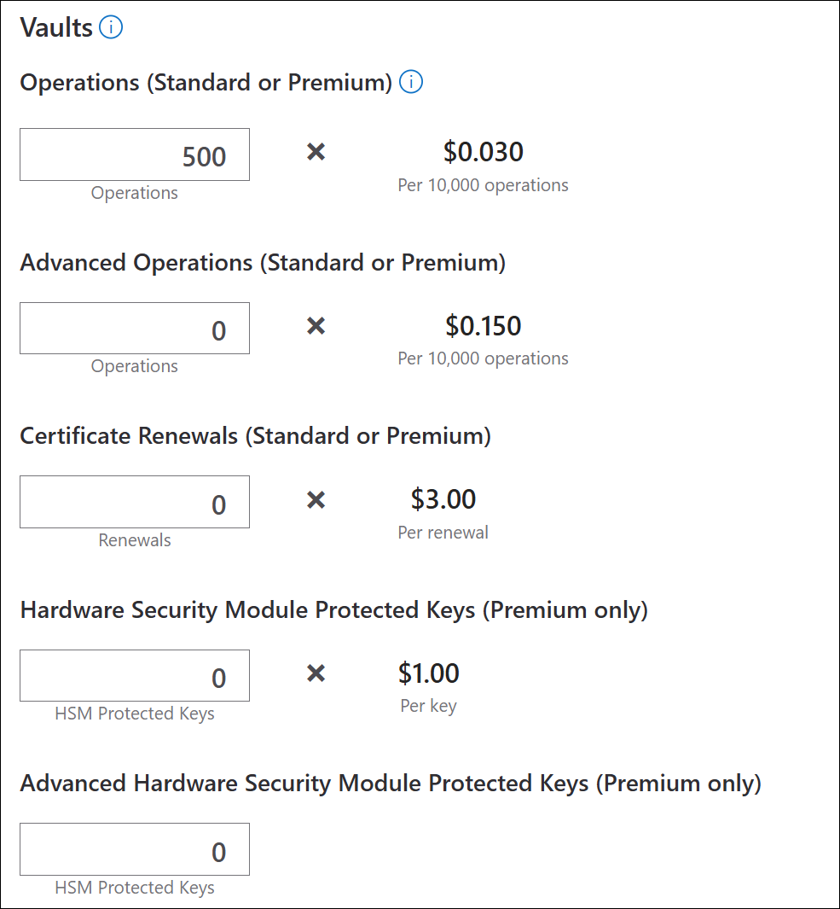

The calculator combines **transaction charges** with **monthly key-storage/usage charges**. The last two fields are not operation counts—they are counts of active HSM-backed key versions.

| Calculator field                                                    | What it represents                                                                                                                                                                                           | Typical examples                                                                                                           |
| ------------------------------------------------------------------- | ------------------------------------------------------------------------------------------------------------------------------------------------------------------------------------------------------------ | -------------------------------------------------------------------------------------------------------------------------- |
| **Operations (Standard or Premium)**                                | Ordinary Key Vault API transactions using secrets, certificates, and basic key types. Each successfully authenticated REST API request generally counts as one operation.                                    | Get/set/list a secret; import or retrieve a certificate; create, sign, decrypt, wrap, or unwrap with an RSA 2,048-bit key. |
| **Advanced Operations (Standard or Premium)**                       | Transactions involving **advanced key types**, which require more cryptographic processing.                                                                                                                  | Operations against RSA 3,072-bit, RSA 4,096-bit, or elliptic-curve cryptography keys.                                      |
| **Certificate Renewals (Standard or Premium)**                      | Renewal requests that Key Vault performs through a supported integrated certificate authority.                                                                                                               | Key Vault automatically renewing a certificate purchased from an integrated CA.                                            |
| **Hardware Security Module Protected Keys (Premium only)**          | The number of actively used **RSA 2,048-bit HSM-backed key versions** stored in a Premium vault. This is a monthly per-key charge, in addition to operation charges.                                         | An RSA 2,048-bit `RSA-HSM` key used for signing or customer-managed encryption.                                            |
| **Advanced Hardware Security Module Protected Keys (Premium only)** | The number of actively used **RSA 3,072-bit, RSA 4,096-bit, or ECC HSM-backed key versions** stored in a Premium vault. These have a higher, tiered monthly per-key charge, plus advanced-operation charges. | An RSA 4,096-bit `RSA-HSM` key or an elliptic-curve `EC-HSM` signing key.                                                  |

Microsoft defines an operation as a successfully authenticated Key Vault REST API call. Examples include `create`, `get`, `list`, `backup`, `restore`, `sign`, `verify`, `encrypt`, `decrypt`, `wrap`, and `unwrap`. The operation meter used depends primarily on the key type involved. ([Microsoft Azure][1])

### 1. Operations

Enter the estimated number of ordinary transactions, including:

* Secret operations such as retrieving or updating passwords, connection strings, and tokens.
* Most certificate-management operations other than renewal.
* Operations against software-backed or HSM-backed **RSA 2,048-bit keys**.

The Standard and Premium tiers charge the same transaction rate for these operations. Premium becomes more expensive when you use HSM-backed keys because the separate monthly HSM-key charge also applies. ([Microsoft Azure][1])

### 2. Advanced operations

Enter operations performed against:

* RSA 3,072-bit keys
* RSA 4,096-bit keys
* ECC keys

This applies whether the advanced key is software-protected or HSM-protected. An advanced HSM key therefore incurs both:

1. The **Advanced Operations** transaction charge.
2. The **Advanced HSM Protected Keys** monthly charge. ([Microsoft Azure][1])

### 3. Certificate renewals

This is specifically for a renewal request handled by Key Vault through a supported CA integration. It does not mean every certificate retrieval, import, update, or TLS connection.

For example:

* Importing a renewed certificate yourself: ordinary operations.
* Key Vault automatically requesting renewal from an integrated CA: one certificate-renewal charge, plus any associated ordinary operations.

Key Vault manages the certificate lifecycle but does not itself issue certificates or include the CA’s certificate purchase cost. ([Microsoft Azure][1])

### 4. HSM-protected keys

This field represents active RSA 2,048-bit HSM-backed keys in a **Premium** Key Vault. You are charged for each key version that was used at least once during the applicable preceding 30-day period.

Key versions matter. For example, if one logical key has three versions and two versions were used, Microsoft counts two HSM key units. Operations against those keys are charged separately under **Operations**. ([Microsoft Azure][1])

### 5. Advanced HSM-protected keys

This is the same monthly active-key concept, but for advanced HSM-backed key types:

* RSA 3,072-bit
* RSA 4,096-bit
* ECC

Each active version counts as a separate key. The monthly per-key pricing is tiered by the total number of active advanced HSM keys, and operations against them are additionally entered under **Advanced Operations**. ([Microsoft Azure][1])

### Example

Suppose a Premium vault contains:

* 20 secrets retrieved 100 times each: **2,000 Operations**
* One RSA 2,048-bit HSM key used for 5,000 signing calls: **5,000 Operations** and **1 HSM Protected Key**
* One RSA 4,096-bit HSM key used for 500 signing calls: **500 Advanced Operations** and **1 Advanced HSM Protected Key**
* Two certificates automatically renewed: **2 Certificate Renewals**

The ordinary and advanced transaction charges are added to the monthly HSM-key charges.

[1]: https://azure.microsoft.com/en-us/pricing/details/key-vault/ "Pricing - Key Vault | Microsoft Azure"
