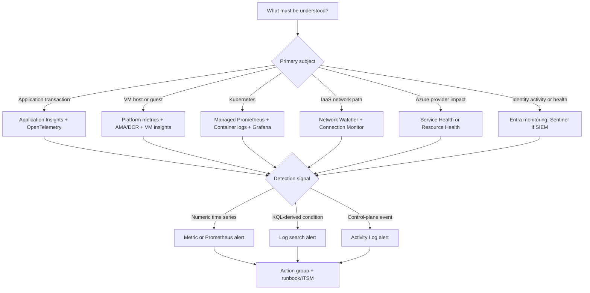
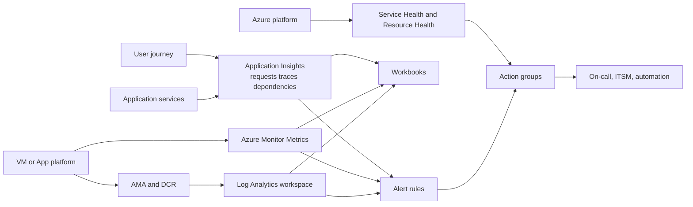
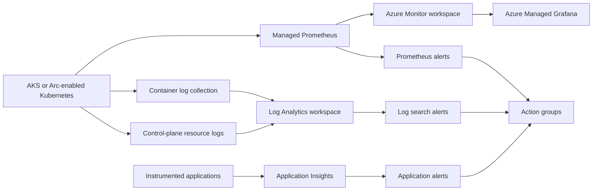
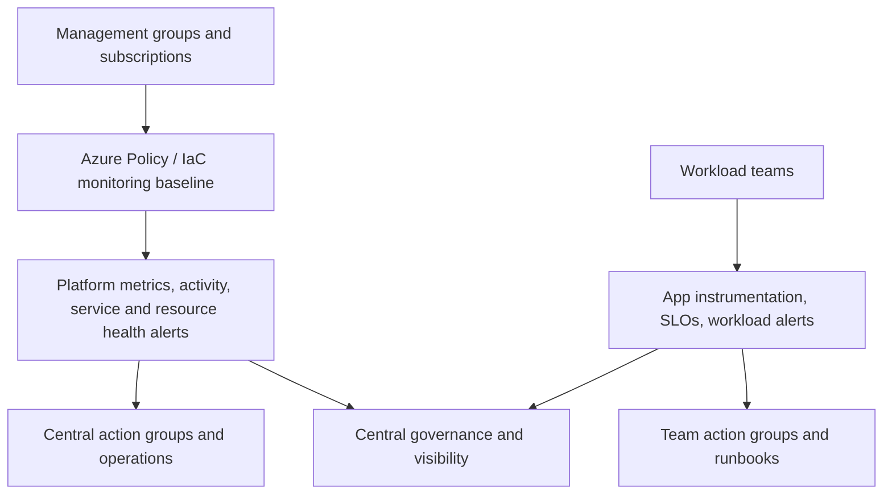

# AZ-305 Study Guide: Recommend a monitoring solution

> **Exam task:** Design solutions for logging and monitoring — Recommend a monitoring solution
>
> **Domain:** Design identity, governance, and monitoring solutions
>
> **Estimated reading time:** 45 minutes
>
> **Matched task source:** Exact match in the provided Study Guide Map and the current [official AZ-305 study guide](https://learn.microsoft.com/en-us/credentials/certifications/resources/study-guides/az-305), whose skills measured are effective as of April 17, 2026.
>
> **Scope boundary:** This guide focuses on turning available telemetry into workload health, visualization, detection, notification, investigation, and automated response. Detailed choices about what logs to collect and how to route them belong to the adjacent tasks **Recommend a logging solution** and **Recommend a solution for routing logs**.

---

## How to use this guide

Read this guide as a requirement-to-capability map. Start with the monitored subject—application, VM, Kubernetes, network, identity, security posture, or Azure platform health—then identify the required signal, analysis experience, alert type, audience, and response. [Azure Monitor unifies metrics, logs, traces, and events](https://learn.microsoft.com/en-us/azure/azure-monitor/fundamentals/overview), but a strong architecture rarely uses one feature for every layer.

By the end, you should be able to choose among [Application Insights](https://learn.microsoft.com/en-us/azure/azure-monitor/app/app-insights-overview), [VM insights](https://learn.microsoft.com/en-us/azure/azure-monitor/vm/monitor-vm), [Container insights and Kubernetes monitoring](https://learn.microsoft.com/en-us/azure/azure-monitor/containers/kubernetes-monitoring-overview), [Azure Monitor managed service for Prometheus](https://learn.microsoft.com/en-us/azure/azure-monitor/metrics/prometheus-metrics-overview), [Network Watcher](https://learn.microsoft.com/en-us/azure/network-watcher/network-watcher-overview), [Microsoft Entra monitoring and health](https://learn.microsoft.com/en-us/entra/identity/monitoring-health/overview-monitoring-health), [Azure Service Health](https://learn.microsoft.com/en-us/azure/service-health/overview), [Workbooks](https://learn.microsoft.com/en-us/azure/azure-monitor/visualize/workbooks-overview), and [Azure Managed Grafana](https://learn.microsoft.com/en-us/azure/managed-grafana/overview).

In scenario questions, underline requirement clues such as **distributed transaction**, **guest OS**, **PromQL**, **business KPI**, **personalized Azure outage**, **resource unavailable**, **IaaS connectivity**, **security posture**, **interactive investigation**, **24x7 operations dashboard**, **maintenance window**, and **automated remediation**. These clues normally identify the monitoring layer and the correct Azure feature.

Use the inline sources to verify current limitations, preview status, pricing, and supported regions. Microsoft states that AZ-305 questions usually cover generally available features but may include widely used preview features, so treat [Azure Monitor health models (preview)](https://learn.microsoft.com/en-us/azure/azure-monitor/health-models/overview) as a conceptual design option rather than a universal default.

---

## Primary source set

### Exam and module sources

- [Official AZ-305 study guide](https://learn.microsoft.com/en-us/credentials/certifications/resources/study-guides/az-305)
- [Design a solution to log and monitor Azure resources](https://learn.microsoft.com/en-us/training/modules/design-solution-to-log-monitor-azure-resources/)
- [Design identity, governance, and monitoring solutions learning path](https://learn.microsoft.com/en-us/training/paths/design-identity-governance-monitor-solutions/)
- [Exam Readiness Zone: Preparing for AZ-305](https://learn.microsoft.com/en-us/shows/exam-readiness-zone/preparing-for-az-305-01-fy25)

### Core product documentation

- [Azure Monitor overview](https://learn.microsoft.com/en-us/azure/azure-monitor/fundamentals/overview)
- [Azure Monitor metrics](https://learn.microsoft.com/en-us/azure/azure-monitor/metrics/data-platform-metrics)
- [Azure Monitor alerts](https://learn.microsoft.com/en-us/azure/azure-monitor/alerts/alerts-overview)
- [Application Insights](https://learn.microsoft.com/en-us/azure/azure-monitor/app/app-insights-overview)
- [Monitor virtual machines with Azure Monitor](https://learn.microsoft.com/en-us/azure/azure-monitor/vm/monitor-virtual-machine)
- [Kubernetes monitoring in Azure Monitor](https://learn.microsoft.com/en-us/azure/azure-monitor/containers/kubernetes-monitoring-overview)
- [Azure Monitor managed service for Prometheus](https://learn.microsoft.com/en-us/azure/azure-monitor/metrics/prometheus-metrics-overview)
- [Azure Monitor visualization best practices](https://learn.microsoft.com/en-us/azure/azure-monitor/visualize/best-practices-visualize)
- [Azure Managed Grafana](https://learn.microsoft.com/en-us/azure/managed-grafana/overview)
- [Azure Service Health](https://learn.microsoft.com/en-us/azure/service-health/overview)
- [Network Watcher](https://learn.microsoft.com/en-us/azure/network-watcher/network-watcher-overview)
- [Microsoft Entra monitoring and health](https://learn.microsoft.com/en-us/entra/identity/monitoring-health/overview-monitoring-health)
- [Microsoft Defender for Cloud](https://learn.microsoft.com/en-us/azure/defender-for-cloud/defender-for-cloud-introduction)

### Supporting architecture and framework sources

- [Azure Architecture Center: Monitoring and diagnostics best practices](https://learn.microsoft.com/en-us/azure/architecture/best-practices/monitoring)
- [Azure Architecture Center: Health Endpoint Monitoring pattern](https://learn.microsoft.com/en-us/azure/architecture/patterns/health-endpoint-monitoring)
- [Build a monitoring system for Azure workloads](https://learn.microsoft.com/en-us/azure/well-architected/design-guides/monitoring)
- [Well-Architected operational excellence observability guidance](https://learn.microsoft.com/en-us/azure/well-architected/operational-excellence/observability)
- [Monitor your Azure cloud estate](https://learn.microsoft.com/en-us/azure/cloud-adoption-framework/manage/monitor)
- [Azure Monitor enterprise monitoring architecture](https://learn.microsoft.com/en-us/azure/azure-monitor/fundamentals/enterprise-monitoring-architecture)
- [Azure Monitor cost and usage](https://learn.microsoft.com/en-us/azure/azure-monitor/fundamentals/cost-usage)
- [Azure Monitor health models (preview)](https://learn.microsoft.com/en-us/azure/azure-monitor/health-models/overview)
- [Azure reliability documentation](https://learn.microsoft.com/en-us/azure/reliability/)

### Discovery notes from the Study Guide Map

**Potentially relevant products considered:** Cloud Adoption Framework, Well-Architected Framework, Azure Monitor, Metrics, Logs, Log Analytics workspaces, Azure Monitor workspaces, alerts, action groups, alert processing rules, Application Insights, OpenTelemetry, VM insights, Container insights, managed Prometheus, Azure Monitor Agent, DCRs, Workbooks, Azure dashboards, Managed Grafana, autoscale, health models, Service Health, Resource Health, Network Watcher, Connection Monitor, Microsoft Entra monitoring, Defender for Cloud, Sentinel, Advisor, Azure Arc, Azure Policy, Azure Monitor Baseline Alerts, and Azure Data Explorer.

The map's forum-discovery note is **nonauthoritative**. It is used only to identify recurring candidate confusion among Azure Monitor, Log Analytics, Application Insights, VM insights, Sentinel, Service Health, DCRs, and DCEs; every recommendation below is grounded in Microsoft documentation.

Coverage is intentionally layered. [Azure Architecture Center monitoring guidance](https://learn.microsoft.com/en-us/azure/architecture/best-practices/monitoring) describes health, availability, performance, SLA, security, and diagnostic pipelines; [Well-Architected monitoring guidance](https://learn.microsoft.com/en-us/azure/well-architected/design-guides/monitoring) defines workload-level instrumentation, analysis, alerting, and visualization; and the [Cloud Adoption Framework monitoring guidance](https://learn.microsoft.com/en-us/azure/cloud-adoption-framework/manage/monitor) addresses estate scope, standardization, ownership, and hybrid operations.

Azure Monitor SCOM Managed Instance is intentionally excluded as a new-design choice. Microsoft's migration overview says the service was deprecated on September 30, 2025 and recommends Azure Monitor or on-premises System Center Operations Manager, while the migration FAQ describes full deprecation by September 30, 2026. ([Migration overview](https://learn.microsoft.com/en-us/azure/azure-monitor/scom-manage-instance/migration-overview), [migration FAQ](https://learn.microsoft.com/en-us/azure/azure-monitor/scom-manage-instance/migration-faq-scom-manage-instance))

---

## 1. Exam task scope

This task asks an Azure solutions architect to recommend how operators will know whether a workload and its dependencies are healthy, detect meaningful degradation, investigate it, and trigger the correct human or automated response. Microsoft frames monitoring as an architectural system with instrumentation, collection, analysis, alerting, and visualization phases—not as a portal feature added after deployment. ([Monitoring-system design guidance](https://learn.microsoft.com/en-us/azure/well-architected/design-guides/monitoring))

### Likely design decisions tested

| Design decision | What the exam expects you to distinguish |
|---|---|
| Signal | [Metrics](https://learn.microsoft.com/en-us/azure/azure-monitor/metrics/data-platform-metrics) for efficient time-series health and fast threshold evaluation; logs and traces for richer correlation, diagnosis, and transaction context. |
| Monitoring layer | [Application Insights](https://learn.microsoft.com/en-us/azure/azure-monitor/app/app-insights-overview) for APM; [VM monitoring](https://learn.microsoft.com/en-us/azure/azure-monitor/vm/monitor-virtual-machine) for host, guest, workload, and app layers; [Kubernetes monitoring](https://learn.microsoft.com/en-us/azure/azure-monitor/containers/kubernetes-monitoring-overview) for network, cluster, container, and application layers. |
| Platform-health view | [Azure Status, Service Health, and Resource Health](https://learn.microsoft.com/en-us/azure/service-health/overview) answer different questions: broad public Azure status, personalized service impact, and individual resource availability. |
| Visualization | Choose [Workbooks, Grafana, Azure dashboards, or Power BI](https://learn.microsoft.com/en-us/azure/azure-monitor/visualize/best-practices-visualize) according to interactivity, data sources, operations workflow, and business-reporting audience. |
| Detection | Select among [metric, log search, activity log, smart detection, and Prometheus alerting](https://learn.microsoft.com/en-us/azure/azure-monitor/alerts/alerts-overview) based on the signal and required evaluation behavior. |
| Response | Use reusable [action groups](https://learn.microsoft.com/en-us/azure/azure-monitor/alerts/action-groups) for notification or automation and [alert processing rules](https://learn.microsoft.com/en-us/azure/azure-monitor/alerts/alerts-processing-rules) for scoped suppression or action-group changes. |
| Operating model | Use [enterprise monitoring architecture guidance](https://learn.microsoft.com/en-us/azure/azure-monitor/fundamentals/enterprise-monitoring-architecture) to divide platform-team standards from workload-team health logic and response ownership. |

### In scope

- Mapping application, infrastructure, container, network, identity, platform-health, and security requirements to the correct [Azure monitoring experiences](https://learn.microsoft.com/en-us/azure/azure-monitor/fundamentals/overview).
- Designing metrics, traces, log queries, service-level indicators, health states, dashboards, alerts, action groups, and operational ownership using [Well-Architected observability guidance](https://learn.microsoft.com/en-us/azure/well-architected/operational-excellence/observability).
- Selecting [Azure Monitor visualization tools](https://learn.microsoft.com/en-us/azure/azure-monitor/visualize/best-practices-visualize) for operators, engineers, management, and business users.
- Monitoring hybrid and multicloud resources through [Azure Arc and Azure Monitor](https://learn.microsoft.com/en-us/azure/azure-monitor/fundamentals/overview#hybrid-environments).
- Understanding security, governance, reliability, and cost implications of the monitoring design through [Azure Monitor cost guidance](https://learn.microsoft.com/en-us/azure/azure-monitor/fundamentals/cost-usage) and the [Cloud Adoption Framework](https://learn.microsoft.com/en-us/azure/cloud-adoption-framework/manage/monitor).

### Out of scope except where it constrains monitoring

> **Adjacent task context:** “Recommend a logging solution” owns log source, schema, workspace, retention, archive, and query-store choices. “Recommend a solution for routing logs” owns diagnostic settings, DCR/DCE routing, Event Hubs, Storage, and destination topology. This guide refers to those mechanisms only when a monitoring feature depends on data being available.

[Microsoft Sentinel](https://learn.microsoft.com/en-us/azure/sentinel/overview) is the better answer when the dominant requirement is SIEM, threat detection, hunting, incident investigation, or SOAR. [Defender for Cloud](https://learn.microsoft.com/en-us/azure/defender-for-cloud/defender-for-cloud-introduction) is the better answer when the dominant requirement is cloud security posture management, regulatory posture, or workload protection. They integrate with the monitoring data platform but should not replace operational observability.

> **Exam tip:** “Centralize all logs” points toward the logging or routing tasks; “notify the on-call team when checkout latency threatens the SLO” points toward monitoring. [Azure Monitor alerts](https://learn.microsoft.com/en-us/azure/azure-monitor/alerts/alerts-overview) act on available signals, while collection and routing make those signals available.

---

## 2. Product and topic discovery pass

| Product, service, or topic | Why it may be relevant | Primary Microsoft source | In-scope or adjacent? |
|---|---|---|---|
| Azure Monitor | Unified observability platform for cloud and hybrid metrics, logs, traces, and events. | [Overview](https://learn.microsoft.com/en-us/azure/azure-monitor/fundamentals/overview) | Core |
| Azure Monitor Metrics | Dimensional time-series analysis, charts, near-real-time health signals, and metric alerts. | [Metrics](https://learn.microsoft.com/en-us/azure/azure-monitor/metrics/data-platform-metrics) | Core |
| Log Analytics | KQL-based correlation, investigation, Workbooks, and log search alerts after logs arrive. | [Logs overview](https://learn.microsoft.com/en-us/azure/azure-monitor/logs/data-platform-logs) | Core for analysis; collection design is adjacent |
| Application Insights | OpenTelemetry-based APM, distributed traces, application map, live metrics, failures, performance, and availability. | [Application Insights](https://learn.microsoft.com/en-us/azure/azure-monitor/app/app-insights-overview) | Core |
| VM insights | Accelerated VM guest onboarding, predefined charts and workbooks, and optional dependency mapping. | [VM monitoring](https://learn.microsoft.com/en-us/azure/azure-monitor/vm/monitor-virtual-machine#vm-insights) | Core |
| Container insights | Collects and analyzes container stdout/stderr, Kubernetes events, and inventory for AKS and Arc-enabled clusters. | [Kubernetes monitoring](https://learn.microsoft.com/en-us/azure/azure-monitor/containers/kubernetes-monitoring-overview) | Core |
| Managed Prometheus | Managed Prometheus-compatible metric collection, PromQL, recording rules, and alert rules for Kubernetes and cloud-native workloads. | [Prometheus overview](https://learn.microsoft.com/en-us/azure/azure-monitor/metrics/prometheus-metrics-overview) | Core when Prometheus is required |
| Azure Monitor workspace | Stores Prometheus and OpenTelemetry metrics and uses PromQL; it is distinct from a Log Analytics workspace. | [Azure Monitor data platform](https://learn.microsoft.com/en-us/azure/azure-monitor/fundamentals/overview#azure-monitor-data-platform) | Core for managed Prometheus |
| Workbooks | Interactive Azure-native reports combining queries, metrics, parameters, and resource context. | [Workbooks overview](https://learn.microsoft.com/en-us/azure/azure-monitor/visualize/workbooks-overview) | Core |
| Azure Managed Grafana | Managed operational dashboards across Azure Monitor, Prometheus, and other supported data sources. | [Managed Grafana](https://learn.microsoft.com/en-us/azure/managed-grafana/overview) | Core for cloud-native or multi-source dashboards |
| Azure dashboards | Shareable Azure portal status views for Azure resources and Markdown content. | [Visualization guidance](https://learn.microsoft.com/en-us/azure/azure-monitor/visualize/best-practices-visualize) | Core, simpler portal use cases |
| Power BI | Business analytics and longer-lived reporting when operational telemetry must be joined with business data. | [Visualization guidance](https://learn.microsoft.com/en-us/azure/azure-monitor/visualize/best-practices-visualize) | Supporting |
| Alerts, action groups, processing rules | Detect conditions, create alert instances, notify or automate, and alter action behavior during planned windows. | [Alerts](https://learn.microsoft.com/en-us/azure/azure-monitor/alerts/alerts-overview) | Core |
| Health models | Preview capability that rolls metric and query signals through workload dependencies into business-aware health. | [Health models](https://learn.microsoft.com/en-us/azure/azure-monitor/health-models/overview) | Core concept; preview constraint |
| Service Health and Resource Health | Personalized Azure service incidents and maintenance versus availability of a particular resource. | [Service Health](https://learn.microsoft.com/en-us/azure/service-health/overview) | Core |
| Network Watcher and Connection Monitor | IaaS network topology, continuous connectivity tests, diagnostics, flow visibility, and Traffic Analytics. | [Network Watcher](https://learn.microsoft.com/en-us/azure/network-watcher/network-watcher-overview) | Core for IaaS networks |
| Microsoft Entra monitoring and health | Sign-in, audit, provisioning, risk, tenant health, recommendations, and identity workbooks. | [Entra monitoring](https://learn.microsoft.com/en-us/entra/identity/monitoring-health/overview-monitoring-health) | Core for identity health |
| Defender for Cloud | Security posture, secure score, compliance, and workload-protection alerts. | [Defender for Cloud](https://learn.microsoft.com/en-us/azure/defender-for-cloud/defender-for-cloud-introduction) | Adjacent security specialization |
| Microsoft Sentinel | SIEM/SOAR, security analytics, incidents, hunting, and automation. | [Sentinel overview](https://learn.microsoft.com/en-us/azure/sentinel/overview) | Adjacent security specialization |
| Azure Policy and baseline alerts | Deploy monitoring configuration consistently and establish platform alert baselines at scale. | [CAF monitoring](https://learn.microsoft.com/en-us/azure/cloud-adoption-framework/manage/monitor) | Supporting governance |
| Azure Arc | Projects non-Azure servers and Kubernetes into Azure management so Azure Monitor can cover hybrid estates. | [Hybrid monitoring](https://learn.microsoft.com/en-us/azure/azure-monitor/fundamentals/overview#hybrid-environments) | Supporting |
| Azure Data Explorer | Custom, high-volume, low-latency telemetry analytics beyond the typical Azure Monitor operational design. | [Azure Data Explorer](https://learn.microsoft.com/en-us/azure/data-explorer/data-explorer-overview) | Adjacent edge case |
| Azure Advisor | Optimization recommendations rather than continuous workload-health telemetry and on-call alerting. | [Advisor overview](https://learn.microsoft.com/en-us/azure/advisor/advisor-overview) | Adjacent |
| Azure Monitor SCOM Managed Instance | A legacy migration concern, not a new monitoring recommendation, because Microsoft directs customers to Azure Monitor or on-premises SCOM. | [SCOM MI migration overview](https://learn.microsoft.com/en-us/azure/azure-monitor/scom-manage-instance/migration-overview) | Excluded/deprecating |

> **Exam tip:** The names are deceptively similar: a [Log Analytics workspace stores logs and traces queried with KQL, while an Azure Monitor workspace stores Prometheus and OpenTelemetry metrics queried with PromQL](https://learn.microsoft.com/en-us/azure/azure-monitor/fundamentals/overview#azure-monitor-data-platform). An AKS design can legitimately need both.

> **Test yourself**
>
> - A platform team wants PromQL dashboards and alerts for AKS, while developers need KQL investigation of container logs. Which workspace types are required?
> - A security team needs threat correlation and automated incident response. Is an Azure Monitor workbook alone sufficient?
>
> **Answer guidance:** Use an [Azure Monitor workspace for managed Prometheus metrics and a Log Analytics workspace for container logs](https://learn.microsoft.com/en-us/azure/azure-monitor/containers/kubernetes-monitoring-overview). Use [Microsoft Sentinel](https://learn.microsoft.com/en-us/azure/sentinel/overview), not merely a workbook, when SIEM/SOAR is the primary requirement.

---

## 3. Starting point from Microsoft Learn

Microsoft's advanced module [Design a solution to log and monitor Azure resources](https://learn.microsoft.com/en-us/training/modules/design-solution-to-log-monitor-azure-resources/) starts with four design areas: Azure Monitor data sources, Log Analytics workspaces, Workbooks and insights, and Azure Data Explorer. That is useful foundation, but the current exam task is broader than choosing a data store.

The modern [Azure Monitor overview](https://learn.microsoft.com/en-us/azure/azure-monitor/fundamentals/overview) organizes the service around resource, infrastructure, application, and hybrid monitoring. It also makes two crucial distinctions: Application Insights is the APM experience, and Azure Monitor's centralized platform uses separate Log Analytics and Azure Monitor workspace resource types for different data and query models.

For architect-level readiness, add three perspectives:

1. Use the [Azure Architecture Center monitoring and diagnostics pipeline](https://learn.microsoft.com/en-us/azure/architecture/best-practices/monitoring) to connect instrumentation, collection, analysis, diagnosis, visualization, alerting, and corrective action.
2. Use the [Well-Architected monitoring-system lifecycle](https://learn.microsoft.com/en-us/azure/well-architected/design-guides/monitoring) to move from instrumentation through hot, warm, and cold analysis to alerting and visualization.
3. Use [Cloud Adoption Framework estate monitoring](https://learn.microsoft.com/en-us/azure/cloud-adoption-framework/manage/monitor) to allocate ownership, standardize onboarding, and cover IaaS, PaaS, SaaS, hybrid, and multicloud scope.
4. Use [workload-specific monitoring documentation](https://learn.microsoft.com/en-us/azure/azure-monitor/fundamentals/overview#monitor-your-infrastructure) to avoid treating applications, VMs, Kubernetes, networks, identities, and Azure-provider health as the same problem.

The Learn module is therefore the launch point, not the complete decision framework. It does not by itself force you to design service-level objectives, alert-noise controls, business-health rollups, on-call routing, platform-versus-workload ownership, or distinct security and provider-health views; those come from the [Well-Architected](https://learn.microsoft.com/en-us/azure/well-architected/operational-excellence/observability) and product-specific guidance.

> **Exam tip:** A scenario that asks for a **monitoring solution** usually needs a complete loop—signal, view, condition, and response—not simply a Log Analytics workspace. [Azure Monitor alerts initiate action groups when rule conditions are met](https://learn.microsoft.com/en-us/azure/azure-monitor/alerts/alerts-overview), while dashboards alone remain passive.

---

## 4. Conceptual foundation

### 4.1 Monitoring is a workload capability

Observability is the system's ability to expose enough signals to infer internal state; monitoring is the operational practice that evaluates those signals against expected health and behavior. Microsoft recommends designing the monitoring stack alongside the functional workload and treating it as a system with its own data flows, reliability needs, ownership, and cost. ([Well-Architected monitoring system](https://learn.microsoft.com/en-us/azure/well-architected/design-guides/monitoring))

Start from user and business outcomes: availability, latency, throughput, correctness, recovery, queue age, transaction completion, and other service-level indicators. Then map each outcome to technical signals across dependencies. This prevents a common failure: every VM reports healthy CPU while the customer-facing transaction is failing. [Well-Architected observability guidance recommends correlating resource telemetry with user and business flows](https://learn.microsoft.com/en-us/azure/well-architected/operational-excellence/observability).

> **Exam tip:** Prefer a customer-impacting signal over an isolated component counter when both are offered. [Application Insights availability, failures, performance, and application-map experiences](https://learn.microsoft.com/en-us/azure/azure-monitor/app/app-insights-overview) reveal workload behavior that host CPU alone cannot.

### 4.2 Signals: metrics, logs, traces, and health

[Metrics](https://learn.microsoft.com/en-us/azure/azure-monitor/metrics/data-platform-metrics) are numeric time-series values with dimensions. They are efficient for trend visualization, fast evaluation, dynamic thresholds, and scale decisions, but they usually explain **that** a condition changed better than **why** it changed.

[Logs](https://learn.microsoft.com/en-us/azure/azure-monitor/logs/data-platform-logs) are structured records suited to KQL filtering, joins, aggregation, correlation, forensic investigation, and log search alerts. They provide flexibility at greater ingestion, storage, query, and alert-evaluation cost than simple platform metrics. ([Azure Monitor cost guidance](https://learn.microsoft.com/en-us/azure/azure-monitor/fundamentals/cost-usage))

[Distributed tracing and Application Map in Application Insights](https://learn.microsoft.com/en-us/azure/azure-monitor/app/app-map) correlate requests and dependencies across service boundaries. They are the correct capabilities when a scenario asks where latency or failure occurs across a distributed transaction.

[Health models (preview)](https://learn.microsoft.com/en-us/azure/azure-monitor/health-models/overview) add dependency and business context above raw signals, roll component state upward, and can alert on aggregate service health. They can reduce technically correct but business-irrelevant alert noise, but preview status and implementation maturity matter.

> **Exam tip:** Choose metric alerts for direct numeric conditions and log search alerts for KQL-derived conditions. Do not choose logs merely because all telemetry can eventually be represented as records; [Azure Monitor supports different alert types because signal behavior and evaluation needs differ](https://learn.microsoft.com/en-us/azure/azure-monitor/alerts/alerts-overview).

### 4.3 Control plane, data plane, and workload plane

The [Azure Activity Log](https://learn.microsoft.com/en-us/azure/azure-monitor/platform/activity-log) records subscription control-plane events such as resource creation, update, deletion, service health, and resource health events. Activity log alerts answer questions such as “a production network security group was changed,” not “the application endpoint is slow.”

Azure resource metrics and resource logs describe the service data plane and runtime. Guest operating-system and workload telemetry often require [Azure Monitor Agent and DCRs](https://learn.microsoft.com/en-us/azure/azure-monitor/vm/monitor-virtual-machine), while application behavior requires [Application Insights instrumentation](https://learn.microsoft.com/en-us/azure/azure-monitor/app/app-insights-overview).

The monitoring design should connect these planes without confusing them: a deployment change can be the cause, a resource metric the symptom, and an application trace the customer impact. [Workbooks](https://learn.microsoft.com/en-us/azure/azure-monitor/visualize/workbooks-overview) and KQL correlation can present these related views, while each source retains its distinct semantics.

> **Exam tip:** “Alert when a resource is deleted” means an [Activity Log alert](https://learn.microsoft.com/en-us/azure/azure-monitor/alerts/alerts-types#activity-log-alerts); “alert when request failure rate exceeds a threshold” points to [Application Insights metrics or logs](https://learn.microsoft.com/en-us/azure/azure-monitor/app/app-insights-overview).

### 4.4 Identity and access

Monitoring has two identity problems: who can access telemetry and how monitoring services access dependencies. Apply Azure RBAC at resource, resource group, subscription, and workspace scopes using built-in monitoring roles where possible. [Azure Monitor roles include Monitoring Reader and Monitoring Contributor capabilities](https://learn.microsoft.com/en-us/azure/azure-monitor/fundamentals/roles-permissions-security).

Dashboards and action endpoints should not depend on shared credentials. [Azure Managed Grafana integrates with Microsoft Entra ID and managed identities](https://learn.microsoft.com/en-us/azure/managed-grafana/overview), while action groups can invoke supported notification and automation endpoints through their configured action types. ([Action groups](https://learn.microsoft.com/en-us/azure/azure-monitor/alerts/action-groups))

Identity telemetry itself is a monitoring domain. [Microsoft Entra monitoring and health](https://learn.microsoft.com/en-us/entra/identity/monitoring-health/overview-monitoring-health) includes sign-in, audit, provisioning, risk, tenant-health, workbook, recommendation, and export capabilities; Sentinel becomes relevant when those signals require security analytics and incident response.

> **Exam tip:** Least-privilege dashboard access and identity-health monitoring are separate decisions. A managed identity can let [Managed Grafana access Azure Monitor data](https://learn.microsoft.com/en-us/azure/managed-grafana/how-to-permissions), while [Entra activity logs](https://learn.microsoft.com/en-us/entra/identity/monitoring-health/overview-monitoring-health) reveal authentication and directory behavior.

### 4.5 Networking and private access

Operational monitoring of Azure IaaS networks maps to [Network Watcher](https://learn.microsoft.com/en-us/azure/network-watcher/network-watcher-overview): topology and network insights for views, Connection Monitor for continuous reachability and latency tests, packet capture and connection troubleshooting for point-in-time diagnosis, and flow logs with Traffic Analytics for traffic patterns.

Network Watcher is not a substitute for application telemetry or PaaS-specific monitoring. A successful TCP connection does not prove a checkout transaction is correct; combine [Connection Monitor](https://learn.microsoft.com/en-us/azure/network-watcher/connection-monitor-overview) with [Application Insights availability and transaction telemetry](https://learn.microsoft.com/en-us/azure/azure-monitor/app/app-insights-overview) when both infrastructure path and user experience matter.

Private monitoring architectures must preserve access to ingestion, query, and notification endpoints. [Azure Monitor Private Link Scope](https://learn.microsoft.com/en-us/azure/azure-monitor/fundamentals/private-link-security) controls private connectivity for supported Azure Monitor resources, but this collection-path design belongs mostly to the routing task.

> **Exam tip:** Requirement language matters: “continuous connectivity and latency between endpoints” points to [Connection Monitor](https://learn.microsoft.com/en-us/azure/network-watcher/connection-monitor-overview); “page-load and dependency latency” points to [Application Insights](https://learn.microsoft.com/en-us/azure/azure-monitor/app/app-insights-overview).

### 4.6 Governance, security, cost, and resilience

Enterprise governance should establish a minimum platform baseline—onboarding policy, core provider and resource-health alerts, naming, severity, action-group conventions, and central visibility—while workload teams define application SLOs, business signals, and runbook-linked alerts. [CAF monitoring guidance](https://learn.microsoft.com/en-us/azure/cloud-adoption-framework/manage/monitor) supports this shared-responsibility operating model.

Operational observability and security monitoring overlap but have different outcomes. [Defender for Cloud](https://learn.microsoft.com/en-us/azure/defender-for-cloud/defender-for-cloud-introduction) focuses on security posture and workload protection; [Sentinel](https://learn.microsoft.com/en-us/azure/sentinel/overview) focuses on SIEM/SOAR; Azure Monitor focuses on health, performance, reliability, and operations.

Cost is governed primarily by collected data volume, retention, query and alert behavior, enabled insights, tests, and visualization services. Microsoft recommends using [Azure Monitor cost and usage tools](https://learn.microsoft.com/en-us/azure/azure-monitor/fundamentals/cost-usage) and collecting only actionable signals at appropriate fidelity.

Monitoring also needs resilience: independently observe each deployment region, include provider and dependency health, use synthetic tests from outside the workload's failure boundary, and ensure notification paths match availability and data-residency needs. [Action groups support global and regional processing choices](https://learn.microsoft.com/en-us/azure/azure-monitor/alerts/action-groups#global-availability-and-resilience), and [Service Health](https://learn.microsoft.com/en-us/azure/service-health/overview) supplies personalized Azure-provider impact.

> **Exam tip:** A monitoring platform is not useful if it shares every failure mode with the workload it observes. Use [external availability tests](https://learn.microsoft.com/en-us/azure/azure-monitor/app/availability) and [Service Health alerts](https://learn.microsoft.com/en-us/azure/service-health/alerts-activity-log-service-notifications-portal) to cover failure perspectives that guest telemetry alone cannot.

> **Test yourself**
>
> - CPU is normal, but users report intermittent checkout failures across three microservices. Which signal provides the best diagnostic path?
> - Operations wants to suppress notifications during a planned maintenance window without disabling or deleting alert rules. Which feature applies?
>
> **Answer guidance:** Use [Application Insights distributed tracing and application map](https://learn.microsoft.com/en-us/azure/azure-monitor/app/app-map) to correlate the transaction. Use an [alert processing rule](https://learn.microsoft.com/en-us/azure/azure-monitor/alerts/alerts-processing-rules) to suppress action groups on fired alerts for the planned scope and schedule.

---

## 5. Design decision framework

### Step-by-step logic

1. Define user, business, and operational outcomes using the [Well-Architected monitoring approach](https://learn.microsoft.com/en-us/azure/well-architected/design-guides/monitoring).
2. Decompose the workload into application, compute, container, data, network, identity, external dependency, and Azure-provider layers using [resource and infrastructure monitoring guidance](https://learn.microsoft.com/en-us/azure/azure-monitor/fundamentals/overview).
3. For each layer, choose the minimum useful combination of metrics, logs, and traces; use [metrics for efficient numerical health](https://learn.microsoft.com/en-us/azure/azure-monitor/metrics/data-platform-metrics) and richer telemetry for diagnosis.
4. Select a native insight or specialist service when it already models the layer: [Application Insights](https://learn.microsoft.com/en-us/azure/azure-monitor/app/app-insights-overview), [VM insights](https://learn.microsoft.com/en-us/azure/azure-monitor/vm/monitor-virtual-machine), [Kubernetes monitoring](https://learn.microsoft.com/en-us/azure/azure-monitor/containers/kubernetes-monitoring-overview), [Network Watcher](https://learn.microsoft.com/en-us/azure/network-watcher/network-watcher-overview), or [Service Health](https://learn.microsoft.com/en-us/azure/service-health/overview).
5. Choose visualization by audience and workflow using [Azure Monitor visualization guidance](https://learn.microsoft.com/en-us/azure/azure-monitor/visualize/best-practices-visualize).
6. Create actionable alert rules with clear severity, owner, response, and remediation. Reuse [action groups](https://learn.microsoft.com/en-us/azure/azure-monitor/alerts/action-groups) and use [processing rules](https://learn.microsoft.com/en-us/azure/azure-monitor/alerts/alerts-processing-rules) for maintenance or routing overlays.
7. Validate security, residency, cost, and failure-boundary constraints using [Azure Monitor cost guidance](https://learn.microsoft.com/en-us/azure/azure-monitor/fundamentals/cost-usage) and [enterprise architecture guidance](https://learn.microsoft.com/en-us/azure/azure-monitor/fundamentals/enterprise-monitoring-architecture).
8. Govern the baseline at scale, test alert delivery and runbooks, and continuously tune thresholds against real workload behavior using [alert best practices](https://learn.microsoft.com/en-us/azure/azure-monitor/alerts/best-practices-alerts).

### Scenario decision tree

This tree identifies the dominant requirement first. A complete production design may combine several branches, but the exam's “best” answer normally follows the branch that directly satisfies the stated outcome. The service mappings come from the [Azure Monitor overview](https://learn.microsoft.com/en-us/azure/azure-monitor/fundamentals/overview) and [alert-type guidance](https://learn.microsoft.com/en-us/azure/azure-monitor/alerts/alerts-overview).

### Hard constraints versus soft preferences

| Constraint or preference | Architectural effect |
|---|---|
| PromQL compatibility is mandatory | Use [Azure Monitor managed service for Prometheus and an Azure Monitor workspace](https://learn.microsoft.com/en-us/azure/azure-monitor/metrics/prometheus-metrics-overview); Grafana is the natural operational visualization. |
| End-to-end request correlation is mandatory | Instrument with [Application Insights and OpenTelemetry](https://learn.microsoft.com/en-us/azure/azure-monitor/app/app-insights-overview); infrastructure-only metrics are insufficient. |
| Azure outage or planned maintenance must be personalized to subscriptions and regions | Use [Service Health](https://learn.microsoft.com/en-us/azure/service-health/overview), not a generic public-status dashboard. |
| Individual resource availability is required | Use [Resource Health](https://learn.microsoft.com/en-us/azure/service-health/resource-health-overview), then correlate with workload telemetry. |
| Continuous IaaS endpoint reachability is required | Use [Connection Monitor](https://learn.microsoft.com/en-us/azure/network-watcher/connection-monitor-overview). |
| Interactive Azure-native investigation is preferred | Use [Workbooks](https://learn.microsoft.com/en-us/azure/azure-monitor/visualize/workbooks-overview). |
| Existing Grafana/Prometheus skills and multi-source operational dashboards are preferred | Use [Azure Managed Grafana](https://learn.microsoft.com/en-us/azure/managed-grafana/overview) with managed Prometheus and supported data sources. |
| Business analytics and executive reporting dominate | Use [Power BI](https://learn.microsoft.com/en-us/azure/azure-monitor/visualize/best-practices-visualize), potentially fed by curated monitoring and business data. |
| Preview features are prohibited | Do not make [Azure Monitor health models (preview)](https://learn.microsoft.com/en-us/azure/azure-monitor/health-models/overview) a dependency; implement health views and alerts from GA signals. |
| Security incident detection and response dominate | Use [Microsoft Sentinel](https://learn.microsoft.com/en-us/azure/sentinel/overview); feed operational context from Azure Monitor where useful. |

> **Exam tip:** “Use the fewest services” does not mean “force every signal into one store.” It means choose the smallest service combination that covers every required layer. [Kubernetes monitoring](https://learn.microsoft.com/en-us/azure/azure-monitor/containers/kubernetes-monitoring-overview) explicitly uses different services for network, metrics, logs, control plane, and application layers.

---

## 6. Service and feature comparison tables

### Monitoring experience by requirement

| Requirement | Best starting point | Why | Common wrong substitute |
|---|---|---|---|
| Web/API performance, failures, dependencies, traces, user behavior | [Application Insights](https://learn.microsoft.com/en-us/azure/azure-monitor/app/app-insights-overview) | Purpose-built APM with application map, live metrics, failures, performance, availability, and OpenTelemetry. | VM insights sees infrastructure but not full transaction semantics. |
| VM host and guest performance, processes, dependencies | [VM monitoring and VM insights](https://learn.microsoft.com/en-us/azure/azure-monitor/vm/monitor-virtual-machine) | Separates Azure host, guest OS, workload, and application layers and uses AMA/DCR for guest telemetry. | Platform metrics alone omit most guest and workload data. |
| AKS/Arc Kubernetes metric and container health | [Kubernetes monitoring](https://learn.microsoft.com/en-us/azure/azure-monitor/containers/kubernetes-monitoring-overview) | Combines managed Prometheus, container logs, control-plane logs, Grafana, network monitoring, and APM by layer. | Application Insights alone omits cluster and container health. |
| IaaS network reachability, topology, and path diagnosis | [Network Watcher](https://learn.microsoft.com/en-us/azure/network-watcher/network-watcher-overview) | Provides network-specific continuous and point-in-time diagnostic capabilities. | Application availability tests do not diagnose the Azure network path. |
| Personalized Azure outage and maintenance impact | [Service Health](https://learn.microsoft.com/en-us/azure/service-health/overview) | Filters Azure service incidents and planned maintenance to affected services, regions, and subscriptions. | Azure Status is public and broad, not personalized. |
| Single Azure resource availability | [Resource Health](https://learn.microsoft.com/en-us/azure/service-health/resource-health-overview) | Reports current and historical availability of an individual resource. | Service Health describes provider events, not complete application health. |
| Identity activity and tenant health | [Microsoft Entra monitoring and health](https://learn.microsoft.com/en-us/entra/identity/monitoring-health/overview-monitoring-health) | Covers sign-ins, audits, provisioning, risk, recommendations, and tenant health. | Azure Activity Log does not represent all tenant identity activity. |
| Security posture and workload threats | [Defender for Cloud](https://learn.microsoft.com/en-us/azure/defender-for-cloud/defender-for-cloud-introduction) | Provides CSPM, secure score, compliance views, and workload protection. | Azure Monitor alerts are not a complete CSPM/CWPP solution. |
| Security analytics, incidents, hunting, and SOAR | [Microsoft Sentinel](https://learn.microsoft.com/en-us/azure/sentinel/overview) | SIEM/SOAR capabilities correlate security data and automate incident response. | Log Analytics alone is a data/query platform, not the full SIEM outcome. |

### Signal and alert comparison

| Signal or alert | Choose when | Strength | Limitation or tradeoff |
|---|---|---|---|
| Platform metric + metric alert | A numeric resource signal and fast threshold/dynamic detection satisfy the requirement. | [Metrics are dimensional time-series data optimized for analysis and alerting](https://learn.microsoft.com/en-us/azure/azure-monitor/metrics/data-platform-metrics). | Less diagnostic context than event records or traces. |
| Log search alert | A KQL query must correlate, filter, count, or derive the condition. | [Log alerts evaluate Log Analytics queries](https://learn.microsoft.com/en-us/azure/azure-monitor/alerts/alerts-overview). | Query evaluation and collected log data can add cost and latency. ([Cost guidance](https://learn.microsoft.com/en-us/azure/azure-monitor/fundamentals/cost-usage)) |
| Activity Log alert | A control-plane, Service Health, Resource Health, policy, or autoscale event should trigger response. | [Activity Log alerts operate on Azure platform events](https://learn.microsoft.com/en-us/azure/azure-monitor/alerts/alerts-types#activity-log-alerts). | Not an application performance or guest OS signal. |
| Prometheus alert | PromQL rules must evaluate Prometheus metrics. | [Managed Prometheus supports Prometheus rule groups and alerting](https://learn.microsoft.com/en-us/azure/azure-monitor/metrics/prometheus-metrics-overview). | Requires the Prometheus/Azure Monitor workspace path. |
| Smart detection | Application anomaly detection is desired with minimal static-threshold design. | [Application Insights smart detection identifies potential performance problems and failures](https://learn.microsoft.com/en-us/azure/azure-monitor/alerts/alerts-overview). | It applies to supported Application Insights scenarios, not arbitrary estate conditions. |
| Action group | Multiple alert rules need reusable notification or automated actions. | [Action groups define who is notified and what action runs](https://learn.microsoft.com/en-us/azure/azure-monitor/alerts/action-groups). | It does not define the detection condition. |
| Alert processing rule | Fired-alert actions need scheduled suppression or scope-based augmentation. | [Processing rules suppress or add action groups without changing the alert rule](https://learn.microsoft.com/en-us/azure/azure-monitor/alerts/alerts-processing-rules). | It does not prevent alert instances from being created and does not affect Service Health alerts. |

### Visualization comparison

| Tool | Best fit | Key design distinction |
|---|---|---|
| Azure Workbooks | Interactive Azure resource investigation, parameters, drill-down, and combining metrics and log queries. | [Workbooks are the preferred Azure-native interactive reporting surface](https://learn.microsoft.com/en-us/azure/azure-monitor/visualize/best-practices-visualize). |
| Azure Managed Grafana | Always-on operational dashboards, Prometheus/PromQL, cloud-native teams, and multiple supported data sources. | [Managed Grafana provides a managed Grafana service with Entra integration and Azure data-source support](https://learn.microsoft.com/en-us/azure/managed-grafana/overview). |
| Azure dashboards | Simple shared Azure portal status board and resource tiles. | [Azure dashboards suit portal-centric single-pane views](https://learn.microsoft.com/en-us/azure/azure-monitor/visualize/best-practices-visualize) but provide less analytical depth than Workbooks. |
| Power BI | Executive, business, and long-term analytical reporting that combines monitoring and business data. | [Power BI is positioned for business-oriented visualization](https://learn.microsoft.com/en-us/azure/azure-monitor/visualize/best-practices-visualize), not live incident triage. |

> **Test yourself**
>
> - A NOC needs a continuously displayed Prometheus dashboard for 40 Kubernetes clusters. Which visualization is the strongest fit?
> - An engineer needs a parameterized Azure report that pivots from subscription to VM and runs KQL when a VM is selected. Which visualization is the strongest fit?
>
> **Answer guidance:** Choose [Azure Managed Grafana](https://learn.microsoft.com/en-us/azure/managed-grafana/overview) for the Prometheus operations board and [Azure Workbooks](https://learn.microsoft.com/en-us/azure/azure-monitor/visualize/workbooks-overview) for the interactive Azure-native investigation report.

---

## 7. Architecture patterns

### Pattern 1: Layered workload observability

**When it applies:** A distributed application runs on Azure compute and must expose user experience, application behavior, infrastructure health, dependency health, and Azure-provider status.

This pattern combines [Application Insights APM](https://learn.microsoft.com/en-us/azure/azure-monitor/app/app-insights-overview), [VM monitoring layers](https://learn.microsoft.com/en-us/azure/azure-monitor/vm/monitor-virtual-machine), [Workbooks](https://learn.microsoft.com/en-us/azure/azure-monitor/visualize/workbooks-overview), [alerts](https://learn.microsoft.com/en-us/azure/azure-monitor/alerts/alerts-overview), and [Service Health](https://learn.microsoft.com/en-us/azure/service-health/overview). Its strength is cross-layer visibility; its weakness is greater instrumentation, ownership, and cost complexity. Failure modes include missing trace context, collecting guest data without application data, and alerting separately on every component without prioritizing user impact.

**Cost and operations:** Use metrics for cheap, frequent health evaluation, sample high-volume traces where appropriate, and reserve detailed logs for actionable investigation. [Azure Monitor cost optimization](https://learn.microsoft.com/en-us/azure/azure-monitor/fundamentals/cost-usage) should be part of telemetry design, not a later cleanup.

**Security:** Restrict telemetry and dashboard access through [Azure Monitor RBAC](https://learn.microsoft.com/en-us/azure/azure-monitor/fundamentals/roles-permissions-security), and avoid placing secrets or unnecessary sensitive payloads in application telemetry.

### Pattern 2: Cloud-native Kubernetes observability

**When it applies:** AKS or Arc-enabled Kubernetes requires Prometheus-compatible metrics, container and control-plane logs, application traces, and operational dashboards.

The design follows Microsoft's [Kubernetes monitoring layers](https://learn.microsoft.com/en-us/azure/azure-monitor/containers/kubernetes-monitoring-overview): Prometheus for cluster metrics, Log Analytics for container and control-plane logs, Application Insights for workloads, and Network Watcher for Azure networking. It retains PromQL/Grafana skills while avoiding self-managed Prometheus operational overhead through [Azure Monitor managed service for Prometheus](https://learn.microsoft.com/en-us/azure/azure-monitor/metrics/prometheus-metrics-overview).

**Weaknesses and failure modes:** Two workspace types and multiple signals increase governance complexity; cardinality, container log volume, and duplicate collection can increase cost. Do not assume cluster health proves application health, or that application tracing covers node and control-plane failure.

### Pattern 3: Enterprise platform baseline plus workload overlays

**When it applies:** A large organization needs consistent minimum monitoring across subscriptions while application teams retain autonomy over service-level indicators and response.

[CAF estate-monitoring guidance](https://learn.microsoft.com/en-us/azure/cloud-adoption-framework/manage/monitor) supports centralized standards and visibility with shared responsibility across platform and workload teams. The platform baseline should cover provider health, core resource availability, and onboarding; workload overlays should cover transactions, business KPIs, and team-owned response.

**Strengths:** consistent coverage, scale, and clear accountability. **Weaknesses:** excessive centralization can slow workload teams, while excessive federation creates gaps, duplicated alerts, and inconsistent severity. A RACI, naming model, severity taxonomy, and action-group ownership model should be decided before implementation.

### Pattern 4: Business-aware health rollup

**When it applies:** Operators receive many technically correct alerts but need to know which failures affect a business service.

Use service entities and dependencies to roll component signals into a workload state. [Azure Monitor health models (preview)](https://learn.microsoft.com/en-us/azure/azure-monitor/health-models/overview) can evaluate metric and query signals, propagate health across dependencies, and alert at entity or aggregate levels.

The strength is business-context alerting and noise reduction. The weaknesses are preview status, model-maintenance effort, permissions, and dependency on correct topology and signals. If preview is unacceptable, use GA metrics, log queries, Workbooks, and carefully designed composite operational logic without making the preview feature a production dependency.

> **Exam tip:** A health model changes the unit of alerting from an isolated measurement to a business-context entity. It does not replace the underlying [metrics, Log Analytics queries, Azure Monitor workspace queries, or action groups](https://learn.microsoft.com/en-us/azure/azure-monitor/health-models/overview).

---

## 8. Implementation awareness for architects

An architect does not need to memorize portal clicks, but must know which design decisions create implementation dependencies.

### Instrumentation and onboarding

- For code-based server applications, Microsoft recommends the [Azure Monitor OpenTelemetry Distro](https://learn.microsoft.com/en-us/azure/azure-monitor/app/app-insights-overview#getting-started) for supported Application Insights scenarios. Browser applications use the [Application Insights JavaScript SDK rather than OpenTelemetry](https://learn.microsoft.com/en-us/azure/azure-monitor/app/app-insights-overview#getting-started), which is an implementation constraint worth recognizing.
- Azure VM host metrics are available from the Azure platform, but guest OS and workload telemetry require [Azure Monitor Agent and DCR configuration](https://learn.microsoft.com/en-us/azure/azure-monitor/vm/monitor-virtual-machine#layers-of-monitoring). VM insights simplifies common onboarding and supplies predefined views, but it is not required for all Azure Monitor VM features. ([VM insights](https://learn.microsoft.com/en-us/azure/azure-monitor/vm/monitor-virtual-machine#vm-insights))
- A complete Kubernetes solution normally enables [managed Prometheus for metrics, container collection for stdout/stderr and Kubernetes events, diagnostic settings for control-plane logs, and Application Insights for instrumented applications](https://learn.microsoft.com/en-us/azure/azure-monitor/containers/kubernetes-monitoring-overview).
- Hybrid servers and Kubernetes clusters can be projected into Azure management through [Azure Arc](https://learn.microsoft.com/en-us/azure/azure-monitor/fundamentals/overview#hybrid-environments), after which Azure Monitor onboarding can be standardized alongside Azure resources.

### Alert engineering

Before implementation, decide the monitored scope, signal, aggregation, threshold or query, evaluation frequency, failure period, severity, owner, action group, runbook, and expected resolution behavior. [Azure Monitor alert rules separate target, signal, condition, and actions](https://learn.microsoft.com/en-us/azure/azure-monitor/alerts/alerts-overview), so vague requirements such as “alert on high CPU” are incomplete.

Use [dynamic thresholds](https://learn.microsoft.com/en-us/azure/azure-monitor/alerts/alerts-dynamic-thresholds) when a metric has recurring patterns and a learned baseline is more meaningful than a fixed value. Use [log search alerts](https://learn.microsoft.com/en-us/azure/azure-monitor/alerts/alerts-create-log-alert-rule) when KQL logic is essential, and optimize queries because rule behavior, latency, and cost depend on query design. ([Log alert query guidance](https://learn.microsoft.com/en-us/azure/azure-monitor/alerts/alerts-log-query))

[Action groups](https://learn.microsoft.com/en-us/azure/azure-monitor/alerts/action-groups) should be reusable by operational owner and response type rather than duplicated for every rule. Use [alert processing rules](https://learn.microsoft.com/en-us/azure/azure-monitor/alerts/alerts-processing-rules) to add or suppress action groups for a scope or schedule while retaining alert visibility.

Know the implementation limits that can change a design. [Multi-resource metric alerts support resources of the same type in the same Azure region and exclude VM guest metrics and specified VM network metrics](https://learn.microsoft.com/en-us/azure/azure-monitor/alerts/alerts-types#monitor-multiple-resources-with-one-alert-rule). [An alert rule can use up to five action groups, which execute concurrently without a guaranteed order](https://learn.microsoft.com/en-us/azure/azure-monitor/alerts/action-groups#reusability-and-execution). [Alert processing rules apply within their subscription scope and do not affect Service Health alerts](https://learn.microsoft.com/en-us/azure/azure-monitor/alerts/alerts-processing-rules#scope-and-filters-for-alert-processing-rules).

### Infrastructure as code and policy

Alert rules, action groups, Workbooks, DCRs, and many monitoring resources can be represented through Azure Resource Manager/Bicep, Terraform providers, or deployment tooling. Treat monitoring artifacts as version-controlled workload resources and validate their current schemas against the [Azure resource reference](https://learn.microsoft.com/en-us/azure/templates/).

Use [Azure Policy for monitoring configuration at scale](https://learn.microsoft.com/en-us/azure/cloud-adoption-framework/manage/monitor) when the organization requires consistent onboarding or baseline controls across subscriptions. Policy is best for enforceable platform standards; it does not discover the correct business KPI or application threshold for each workload.

### Decide now versus defer

| Decide during architecture | Can be refined by implementation teams |
|---|---|
| Monitoring layers, business outcomes, service-level indicators, ownership, security boundary, residency, platform baseline, and specialist service selection, using [Well-Architected guidance](https://learn.microsoft.com/en-us/azure/well-architected/design-guides/monitoring). | Exact workbook layout, query formatting, dashboard colors, and low-risk visualization details, using [Azure visualization guidance](https://learn.microsoft.com/en-us/azure/azure-monitor/visualize/best-practices-visualize). |
| Whether PromQL, KQL, APM traces, IaaS network tests, provider-health signals, or security analytics are mandatory, using the [Azure Monitor service map](https://learn.microsoft.com/en-us/azure/azure-monitor/fundamentals/overview). | Initial static thresholds that will be tuned against observed baselines, provided the alert owner and response remain defined through [alert best practices](https://learn.microsoft.com/en-us/azure/azure-monitor/alerts/best-practices-alerts). |
| Preview-feature acceptance, high-availability needs, notification path, and automation authority, using [health model preview documentation](https://learn.microsoft.com/en-us/azure/azure-monitor/health-models/overview) and [action-group resilience guidance](https://learn.microsoft.com/en-us/azure/azure-monitor/alerts/action-groups#global-availability-and-resilience). | The precise implementation language—Bicep, Terraform, CLI, PowerShell, or portal—when it does not change capability or governance. ([Azure template reference](https://learn.microsoft.com/en-us/azure/templates/)) |

> **Exam tip:** Enabling a diagnostic setting does not complete the monitoring design. It makes telemetry available; architects still need to select the [analysis, visualization, alert, and response experiences](https://learn.microsoft.com/en-us/azure/azure-monitor/fundamentals/overview).

---

## 9. Security, governance, and compliance considerations

### Least privilege and operational separation

Grant readers, dashboard authors, alert authors, and automation identities only the access their responsibilities require. [Azure Monitor defines built-in Monitoring Reader and Monitoring Contributor roles and documents permissions by feature](https://learn.microsoft.com/en-us/azure/azure-monitor/fundamentals/roles-permissions-security); sensitive logs may require tighter workspace or table controls than ordinary platform metrics.

Separate platform operations, workload operations, and security operations while enabling purposeful correlation. [Defender for Cloud and Sentinel integrate with the Azure Monitor data platform](https://learn.microsoft.com/en-us/azure/azure-monitor/fundamentals/overview), but a security analyst's incident permissions and an application operator's performance permissions should not automatically be identical.

Use managed identities for supported service-to-service access. [Azure Managed Grafana uses Microsoft Entra integration and managed identities](https://learn.microsoft.com/en-us/azure/managed-grafana/overview), and [health models use managed identity plus monitoring permissions to read signals](https://learn.microsoft.com/en-us/azure/azure-monitor/health-models/create).

### Data protection and network boundaries

Telemetry can contain identifiers, URLs, query values, exception details, and other sensitive context. The application team should minimize or redact sensitive content before export and follow [Application Insights data collection and privacy guidance](https://learn.microsoft.com/en-us/azure/azure-monitor/app/application-insights-faq#data-collection-retention-storage-and-privacy).

When public access is prohibited, evaluate [Azure Monitor Private Link Scope](https://learn.microsoft.com/en-us/azure/azure-monitor/fundamentals/private-link-security) for supported Log Analytics and Application Insights access paths, plus private networking capabilities of [Azure Managed Grafana](https://learn.microsoft.com/en-us/azure/managed-grafana/overview). Private access affects DNS, ingestion, query, dashboard, and automation connectivity, so it must be designed before rollout.

Data residency and regulatory boundaries can force separate workspace or regional designs. That is primarily a logging-architecture decision, but it constrains cross-region monitoring queries, dashboards, and alerts; use the [Log Analytics workspace architecture guidance](https://learn.microsoft.com/en-us/azure/azure-monitor/logs/workspace-design) when those constraints appear.

### Governance and auditability

At scale, use [Azure Policy and enterprise monitoring architecture](https://learn.microsoft.com/en-us/azure/azure-monitor/fundamentals/enterprise-monitoring-architecture) to standardize required agents, collection configuration, diagnostic settings, and baseline alerts. Track exemptions deliberately so an unsupported or sensitive workload does not silently disappear from central visibility.

Monitor changes to the monitoring system itself. The [Azure Activity Log records control-plane operations](https://learn.microsoft.com/en-us/azure/azure-monitor/platform/activity-log), so changes to alert rules, action groups, and monitoring resources can be audited and can themselves trigger alerts where appropriate.

### Security-specific outcomes

- Choose [Defender for Cloud](https://learn.microsoft.com/en-us/azure/defender-for-cloud/defender-for-cloud-introduction) for security posture management, secure score, regulatory compliance views, and workload-protection alerts.
- Choose [Microsoft Sentinel](https://learn.microsoft.com/en-us/azure/sentinel/overview) for security correlation, detections, incidents, hunting, and SOAR across identity, cloud, endpoint, and other sources.
- Choose [Microsoft Entra monitoring and health](https://learn.microsoft.com/en-us/entra/identity/monitoring-health/overview-monitoring-health) for tenant identity activity, sign-in, audit, provisioning, risk, and health views; forward to Sentinel when the requirement becomes security detection and response.
- Retain [Azure Monitor](https://learn.microsoft.com/en-us/azure/azure-monitor/fundamentals/overview) for operational health and performance even when security services are enabled.

> **Exam tip:** “Alert on failed sign-ins” may be operational identity monitoring; “correlate risky sign-ins with endpoint and cloud threats, create incidents, and run playbooks” is [Microsoft Sentinel](https://learn.microsoft.com/en-us/azure/sentinel/overview). The second requirement is not satisfied by a generic Azure Monitor alert alone.

---

## 10. Resiliency, availability, and disaster recovery considerations

Monitoring supports reliability; it does not provide workload failover. A multi-region architecture still needs the compute, data, networking, and recovery design from the business-continuity domain, while the monitoring solution verifies that those mechanisms work. [Azure reliability guidance](https://learn.microsoft.com/en-us/azure/reliability/) distinguishes workload resilience from observability.

### Design implications

| Reliability requirement | Monitoring implication |
|---|---|
| Detect regional application failure | Monitor region-specific traffic, dependency, error, and latency signals with [Application Insights](https://learn.microsoft.com/en-us/azure/azure-monitor/app/app-insights-overview) and platform metrics rather than aggregating away the failed region. |
| Verify user-visible availability | Run [Application Insights availability tests](https://learn.microsoft.com/en-us/azure/azure-monitor/app/availability) from appropriate test locations and alert on the endpoint outcome. |
| Detect Azure-provider incidents and planned maintenance | Configure [Service Health alerts](https://learn.microsoft.com/en-us/azure/service-health/alerts-activity-log-service-notifications-portal) for relevant subscriptions, services, and regions. |
| Determine whether one resource is unavailable | Use [Resource Health](https://learn.microsoft.com/en-us/azure/service-health/resource-health-overview) and correlate it with workload signals. |
| Preserve notification during regional service disruption or meet residency requirements | Select [global or regional action-group processing](https://learn.microsoft.com/en-us/azure/azure-monitor/alerts/action-groups#global-availability-and-resilience) according to the notification and data-residency requirement. |
| Monitor hybrid links and regional paths | Use [Connection Monitor](https://learn.microsoft.com/en-us/azure/network-watcher/connection-monitor-overview) between representative endpoints. |
| Validate failover readiness | Alert on replication, queue, routing, and endpoint signals exposed by the workload's services and include failover exercises in [operational testing](https://learn.microsoft.com/en-us/azure/well-architected/operational-excellence/testing). |

Do not collapse all regional signals into one global average. A healthy region can mask a failed region, so preserve region as a metric dimension or query field and expose both regional and aggregate health. [Azure Monitor Metrics supports dimensions](https://learn.microsoft.com/en-us/azure/azure-monitor/metrics/data-platform-metrics), while [Workbooks and Grafana](https://learn.microsoft.com/en-us/azure/azure-monitor/visualize/best-practices-visualize) can show global rollup with regional drill-down.

RTO and RPO apply differently to monitoring. Decide how quickly detection, notification, dashboards, and investigation must recover, and how much telemetry loss is tolerable. Retention, replication, and workspace disaster recovery belong mainly to the logging design, but the monitoring architecture must not promise an alert based on data that will be unavailable during the assumed failure. Use [Azure Monitor Logs reliability guidance](https://learn.microsoft.com/en-us/azure/azure-monitor/logs/best-practices-logs#reliability) when log-based monitoring has strict regional continuity requirements.

> **Exam tip:** Service Health can explain an Azure-provider event, but it does not prove whether the end-to-end customer journey is working. Pair [Service Health](https://learn.microsoft.com/en-us/azure/service-health/overview) with [availability tests and application telemetry](https://learn.microsoft.com/en-us/azure/azure-monitor/app/availability).

---

## 11. Cost and licensing considerations

The most important cost principle is to collect and retain telemetry because it supports a health indicator, alert, investigation, audit, or business decision—not because collection is technically possible. [Azure Monitor cost guidance](https://learn.microsoft.com/en-us/azure/azure-monitor/fundamentals/cost-usage) explains how data ingestion, retention, queries, alerts, tests, and enabled services contribute to charges.

### Major cost drivers

| Cost driver | Design response |
|---|---|
| Log and trace volume | Filter nonactionable data, choose appropriate collection frequency, use [Application Insights OpenTelemetry sampling](https://learn.microsoft.com/en-us/azure/azure-monitor/app/opentelemetry-sampling), and avoid duplicate pipelines. |
| Container stdout/stderr volume | Configure [Container insights cost controls and collection settings](https://learn.microsoft.com/en-us/azure/azure-monitor/containers/container-insights-cost) rather than ingesting every namespace and stream by default. |
| High-cardinality Prometheus metrics | Control labels and scrape configuration and account for [managed Prometheus ingestion and query pricing](https://learn.microsoft.com/en-us/azure/azure-monitor/metrics/prometheus-metrics-overview#pricing). |
| Log search alert frequency and query scope | Prefer [metric alerts](https://learn.microsoft.com/en-us/azure/azure-monitor/alerts/alerts-overview) when a direct metric satisfies the requirement; optimize KQL and evaluation settings when log logic is necessary. |
| Application availability tests | Select tests and locations that represent the reliability requirement and review [Application Insights billing guidance](https://learn.microsoft.com/en-us/azure/azure-monitor/logs/cost-logs#application-insights-billing). |
| Managed visualization | Include the selected [Azure Managed Grafana pricing plan](https://learn.microsoft.com/en-us/azure/managed-grafana/overview) and operational requirements in the estimate; use Workbooks or portal dashboards when they satisfy a simpler use case. |
| Duplicate monitoring stacks | Consolidate where requirements align, but retain specialist tools when [Kubernetes, application, network, identity, or security layers require distinct capabilities](https://learn.microsoft.com/en-us/azure/azure-monitor/fundamentals/overview). |
| Long retention and compliance archive | Handle through the adjacent [Log Analytics workspace and retention design](https://learn.microsoft.com/en-us/azure/azure-monitor/logs/cost-logs), not by keeping all data in the most expensive interactive path. |

Commitment tiers can reduce predictable Log Analytics ingestion cost, but they are a workspace billing decision and should be based on measured volume. [Azure Monitor Logs cost guidance](https://learn.microsoft.com/en-us/azure/azure-monitor/logs/cost-logs) explains commitment tiers, table plans, retention, and query-related charges.

For a new Azure Managed Grafana deployment, the [Standard tier is the recommended and selectable tier, while Essential is deprecated and unavailable for new workspaces](https://learn.microsoft.com/en-us/azure/managed-grafana/overview#service-tiers). Standard supplies the service-level and enterprise features that make Managed Grafana suitable for production operations, so do not base a new AZ-305 design on Essential.

Licensing can also change the recommendation. Microsoft Entra risk and reporting capabilities, Defender for Cloud plans, Microsoft Sentinel ingestion, and Managed Grafana features have their own licensing or pricing models; verify [Entra licensing](https://learn.microsoft.com/en-us/entra/fundamentals/licensing), [Defender for Cloud pricing](https://azure.microsoft.com/en-us/pricing/details/defender-for-cloud/), [Sentinel pricing](https://azure.microsoft.com/en-us/pricing/details/microsoft-sentinel/), and [Managed Grafana plans](https://learn.microsoft.com/en-us/azure/managed-grafana/overview) before treating them as included with basic Azure Monitor.

> **Exam tip:** A low-cost design does not mean “collect nothing” or “use logs for everything.” Use [platform metrics and metric alerts](https://learn.microsoft.com/en-us/azure/azure-monitor/metrics/data-platform-metrics) for efficient health detection, then collect the minimum logs and traces required to explain and remediate failures.

> **Test yourself**
>
> - A team uses a one-minute KQL alert to count requests even though the same failure-rate metric is available directly. Which option should you prefer for cost and simplicity?
> - Container log costs rise sharply after a verbose deployment. Which architectural control should already exist?
>
> **Answer guidance:** Prefer a [metric alert when the native metric expresses the condition](https://learn.microsoft.com/en-us/azure/azure-monitor/alerts/alerts-overview). Establish [Container insights collection and cost controls](https://learn.microsoft.com/en-us/azure/azure-monitor/containers/container-insights-cost), plus ownership and budgets, before high-volume rollout.

---

## 12. Monitoring and operational considerations

This is the core operational section for the target task. A complete recommendation covers **what good looks like**, **which layers prove it**, **how humans see it**, **what conditions are actionable**, and **who responds**.

### 12.1 Coverage model

| Monitoring domain | Minimum architectural questions | Typical Azure capabilities |
|---|---|---|
| Workload and business | Which user journeys and business transactions define success? Which SLI and threshold represent unacceptable impact? | [Application Insights](https://learn.microsoft.com/en-us/azure/azure-monitor/app/app-insights-overview), custom metrics, availability tests, Workbooks, and workload alerts. |
| Application | Where do requests fail or slow across services and dependencies? Is trace context propagated? | [OpenTelemetry and Application Insights application map](https://learn.microsoft.com/en-us/azure/azure-monitor/app/app-map), end-to-end transactions, failures, performance, and live metrics. |
| Platform resource | Which service-native metrics indicate saturation, throttling, errors, capacity, or availability? | [Azure Monitor Metrics](https://learn.microsoft.com/en-us/azure/azure-monitor/metrics/data-platform-metrics), resource insights, metric alerts, and Resource Health. |
| VM and guest | Are host, OS, process, dependency, workload, and application layers covered? | [AMA/DCR, VM insights, platform metrics, and Application Insights](https://learn.microsoft.com/en-us/azure/azure-monitor/vm/monitor-virtual-machine). |
| Kubernetes | Are network, nodes, control plane, containers, objects, logs, metrics, and apps covered without duplicate collection? | [Managed Prometheus, Container insights, Log Analytics, Grafana, Application Insights, and Network Watcher](https://learn.microsoft.com/en-us/azure/azure-monitor/containers/kubernetes-monitoring-overview). |
| Network | Is the requirement topology, reachability, latency, traffic pattern, next hop, packet evidence, or application availability? | [Network Watcher and Connection Monitor](https://learn.microsoft.com/en-us/azure/network-watcher/network-watcher-overview), plus Application Insights for the application outcome. |
| Identity | Are sign-in, audit, provisioning, risk, and tenant health available to the correct operations and security teams? | [Microsoft Entra monitoring and health](https://learn.microsoft.com/en-us/entra/identity/monitoring-health/overview-monitoring-health), Workbooks, Azure Monitor, and Sentinel where SIEM is required. |
| Security | Is the goal posture, threat protection, or SIEM/SOAR rather than operational performance? | [Defender for Cloud](https://learn.microsoft.com/en-us/azure/defender-for-cloud/defender-for-cloud-introduction) and [Microsoft Sentinel](https://learn.microsoft.com/en-us/azure/sentinel/overview). |
| Azure provider | Will the team receive personalized incident, maintenance, health-advisory, and resource-availability notifications? | [Service Health and Resource Health](https://learn.microsoft.com/en-us/azure/service-health/overview). |

### 12.2 Alert lifecycle

An alert should correspond to an actionable state with a named owner and response. Use [alert best practices](https://learn.microsoft.com/en-us/azure/azure-monitor/alerts/best-practices-alerts) to establish consistent naming, severity, scope, descriptions, custom context, and action groups.

Prefer alerts on symptoms and user impact for paging; use lower-severity alerts or dashboards for diagnostic causes. Statefulness matters: [stateful alerts fire on transition and resolve when the condition clears, while stateless alerts can fire repeatedly](https://learn.microsoft.com/en-us/azure/azure-monitor/alerts/alerts-overview). Select behavior that matches incident management rather than accepting the default blindly.

Use [action groups](https://learn.microsoft.com/en-us/azure/azure-monitor/alerts/action-groups) to route alerts to email, SMS, push, voice, webhook, Functions, Logic Apps, Automation, ITSM, or other supported actions. Reuse groups by team and response, and test them. Use [alert processing rules](https://learn.microsoft.com/en-us/azure/azure-monitor/alerts/alerts-processing-rules) for planned maintenance suppression or for adding actions across a scope.

Do not automate destructive or high-risk remediation merely because action groups can invoke it. Define authorization, idempotency, retry behavior, rollback, audit, and human-approval boundaries as part of the operational design.

### 12.3 Visualization by audience

- Engineers investigating an incident usually benefit from [Workbooks](https://learn.microsoft.com/en-us/azure/azure-monitor/visualize/workbooks-overview) with resource parameters, KQL, metrics, and drill-through.
- Kubernetes and platform operations teams with Prometheus experience usually benefit from [Azure Managed Grafana](https://learn.microsoft.com/en-us/azure/managed-grafana/overview) and shared operational dashboards.
- Azure portal users needing a concise status board can use [Azure dashboards](https://learn.microsoft.com/en-us/azure/azure-portal/azure-portal-dashboards).
- Business stakeholders needing curated trends joined to business data can use [Power BI](https://learn.microsoft.com/en-us/azure/azure-monitor/visualize/best-practices-visualize).

Every visualization should have an audience, decision, refresh expectation, owner, and source of truth. A “single pane of glass” is valuable only when it preserves enough layer and regional context to support decisions.

### 12.4 Ownership and operating model

| Responsibility | Platform team | Workload team | Security team |
|---|---|---|---|
| Estate onboarding and baseline | Own [policy, common provider/resource health alerts, and enterprise visibility](https://learn.microsoft.com/en-us/azure/cloud-adoption-framework/manage/monitor). | Comply and identify exceptions. | Define required security integrations. |
| Business and application health | Provide shared tooling. | Own [instrumentation, SLIs, SLOs, workload alerts, runbooks, and tuning](https://learn.microsoft.com/en-us/azure/well-architected/design-guides/monitoring). | Consume relevant context. |
| Security posture and incidents | Support platform integration. | Remediate owned resources and applications. | Own [Defender for Cloud and Sentinel outcomes](https://learn.microsoft.com/en-us/azure/defender-for-cloud/defender-for-cloud-introduction). |
| Cost | Provide budgets, standards, and shared-cost allocation. | Control telemetry volume and query behavior using [Azure Monitor cost guidance](https://learn.microsoft.com/en-us/azure/azure-monitor/fundamentals/cost-usage). | Own incremental security-data requirements and retention. |
| Incident response | Operate shared platform and escalation path. | Own workload response and service restoration. | Own security incidents and coordinate cross-team response through [Sentinel](https://learn.microsoft.com/en-us/azure/sentinel/overview). |

> **Exam tip:** Central visibility does not imply central ownership of every alert. [CAF monitoring guidance](https://learn.microsoft.com/en-us/azure/cloud-adoption-framework/manage/monitor) supports a shared model: platform teams standardize the estate, while workload teams remain accountable for workload-specific health and response.

---

## 13. Common exam traps

| Trap | Tempting wrong answer | Why it seems reasonable | Why it is wrong or incomplete | Better design choice | Microsoft source |
|---|---|---|---|---|---|
| Azure Monitor versus Log Analytics | “Use Log Analytics” for every monitoring scenario. | Many Azure Monitor features use workspace data and KQL. | A workspace is a log store/query environment; it does not by itself provide application instrumentation, Prometheus metrics, provider health, network diagnostics, alert ownership, or response. | Start with [Azure Monitor](https://learn.microsoft.com/en-us/azure/azure-monitor/fundamentals/overview), then select the layer-specific experience and use Log Analytics where KQL is required. | [Azure Monitor data platform](https://learn.microsoft.com/en-us/azure/azure-monitor/fundamentals/overview#azure-monitor-data-platform) |
| Log Analytics workspace versus Azure Monitor workspace | Treat the two names as interchangeable. | Both are Azure Monitor workspace resources. | They store different data types and use KQL versus PromQL. | Use [Log Analytics for logs/traces and Azure Monitor workspace for Prometheus/OTel metrics](https://learn.microsoft.com/en-us/azure/azure-monitor/fundamentals/overview#azure-monitor-data-platform). | [Azure Monitor overview](https://learn.microsoft.com/en-us/azure/azure-monitor/fundamentals/overview) |
| Application Insights versus VM insights | Choose VM insights for application transaction failures. | The application runs on VMs. | VM insights covers infrastructure and guest/workload views; full APM and distributed transactions belong to Application Insights. | Use [Application Insights for APM](https://learn.microsoft.com/en-us/azure/azure-monitor/app/app-insights-overview) and VM insights for supporting VM health. | [VM monitoring layers](https://learn.microsoft.com/en-us/azure/azure-monitor/vm/monitor-virtual-machine#layers-of-monitoring) |
| Kubernetes “one tool” fallacy | Enable only Container insights. | It is the Azure-branded container monitoring feature. | Complete Kubernetes monitoring spans Prometheus metrics, container/control-plane logs, network, and application APM. | Follow the [layered Kubernetes monitoring model](https://learn.microsoft.com/en-us/azure/azure-monitor/containers/kubernetes-monitoring-overview). | [Kubernetes monitoring](https://learn.microsoft.com/en-us/azure/azure-monitor/containers/kubernetes-monitoring-overview) |
| Service Health versus Resource Health | Use Service Health to determine whether one VM is available. | Both are in Azure Service Health experiences. | Service Health is personalized provider impact; Resource Health focuses on an individual resource. | Choose [Resource Health for the resource and Service Health for provider incidents](https://learn.microsoft.com/en-us/azure/service-health/overview). | [Service Health overview](https://learn.microsoft.com/en-us/azure/service-health/overview) |
| Azure Status versus Service Health | Use the public status page for subscription-specific incident response. | It displays Azure outages. | Azure Status is broad; Service Health is personalized to services, subscriptions, and regions. | Configure [Service Health alerts](https://learn.microsoft.com/en-us/azure/service-health/alerts-activity-log-service-notifications-portal). | [Service Health](https://learn.microsoft.com/en-us/azure/service-health/overview) |
| Action group versus alert rule | Use an action group to detect high CPU. | Action groups are configured in the alerts experience. | Action groups define notification and automation, not the detection condition. | Create a [metric alert rule and attach a reusable action group](https://learn.microsoft.com/en-us/azure/azure-monitor/alerts/alerts-overview). | [Action groups](https://learn.microsoft.com/en-us/azure/azure-monitor/alerts/action-groups) |
| Processing rule versus disabling alerts | Disable alert rules for maintenance. | It stops notifications. | It changes detection configuration and risks forgotten re-enablement or loss of alert visibility. | Use a scheduled [alert processing rule](https://learn.microsoft.com/en-us/azure/azure-monitor/alerts/alerts-processing-rules) to suppress actions while alert instances remain visible. | [Processing rules](https://learn.microsoft.com/en-us/azure/azure-monitor/alerts/alerts-processing-rules) |
| Network Watcher versus APM | Use Connection Monitor to prove the application transaction works. | Connectivity is required by the transaction. | A reachable TCP endpoint does not prove application correctness or dependency behavior. | Combine [Connection Monitor](https://learn.microsoft.com/en-us/azure/network-watcher/connection-monitor-overview) with [Application Insights](https://learn.microsoft.com/en-us/azure/azure-monitor/app/app-insights-overview). | [Network Watcher](https://learn.microsoft.com/en-us/azure/network-watcher/network-watcher-overview) |
| Defender/Sentinel versus operational monitoring | Replace Azure Monitor with Sentinel for all operations. | Sentinel ingests and queries telemetry. | Sentinel is SIEM/SOAR; routine performance, reliability, APM, metrics, and Service Health remain Azure Monitor concerns. | Use [Sentinel for security outcomes](https://learn.microsoft.com/en-us/azure/sentinel/overview) and Azure Monitor for operational health. | [Azure Monitor overview](https://learn.microsoft.com/en-us/azure/azure-monitor/fundamentals/overview) |
| Dashboard versus alerting | Build a dashboard and call the workload monitored. | Operators can see the data. | Passive views do not proactively detect or route actionable conditions. | Combine the right [visualization](https://learn.microsoft.com/en-us/azure/azure-monitor/visualize/best-practices-visualize) with alerts and action groups. | [Alerts overview](https://learn.microsoft.com/en-us/azure/azure-monitor/alerts/alerts-overview) |
| Cost misunderstanding | Collect every event at maximum detail “just in case.” | More data appears to mean better observability. | Unactionable volume increases ingestion, retention, query, and operational noise. | Use [cost-aware collection, filtering, and sampling](https://learn.microsoft.com/en-us/azure/azure-monitor/fundamentals/cost-usage) tied to defined outcomes. | [Azure Monitor cost and usage](https://learn.microsoft.com/en-us/azure/azure-monitor/fundamentals/cost-usage) |
| Resiliency misunderstanding | One global average proves a multi-region service is healthy. | Aggregation creates a simple KPI. | Healthy-region traffic can hide a failed region. | Preserve regional dimensions and pair workload telemetry with [Service Health](https://learn.microsoft.com/en-us/azure/service-health/overview) and external availability tests. | [Metrics dimensions](https://learn.microsoft.com/en-us/azure/azure-monitor/metrics/data-platform-metrics) |
| Scope boundary confusion | Answer “send logs to Event Hubs” when asked how to detect high latency. | Event Hubs routes telemetry to consumers. | Routing is not detection, visualization, or operational response. | Use [Application Insights or Azure Monitor alerts](https://learn.microsoft.com/en-us/azure/azure-monitor/alerts/alerts-overview); discuss Event Hubs only if external routing is required. | [Azure Monitor overview](https://learn.microsoft.com/en-us/azure/azure-monitor/fundamentals/overview) |
| **Edge case: preview forbidden** | Use Azure Monitor health models for every business-health rollup. | Health models directly express dependencies and aggregate health. | [Health models are preview](https://learn.microsoft.com/en-us/azure/azure-monitor/health-models/overview), and the scenario may prohibit preview dependencies. | Use GA metrics, KQL alerts, Application Insights, and Workbooks; adopt health models only when preview acceptance is explicit. | [Health models](https://learn.microsoft.com/en-us/azure/azure-monitor/health-models/overview) |

---

## 14. Scenario-based design examples

### Scenario 1: Straightforward default—customer-facing web workload

**Customer requirement:** A three-tier Azure web application needs proactive detection of failed requests and slow dependencies, an engineer-facing investigation view, Azure outage notifications, and on-call automation.

**Constraints:** The application team can modify code, uses several PaaS dependencies, and wants Azure-native tools.

**Recommended design:** Instrument server components with the [Azure Monitor OpenTelemetry Distro and Application Insights](https://learn.microsoft.com/en-us/azure/azure-monitor/app/app-insights-overview#getting-started). Track request rate, failure rate, latency, dependency duration, exceptions, and a business transaction metric; add [availability tests](https://learn.microsoft.com/en-us/azure/azure-monitor/app/availability). Build a [Workbook](https://learn.microsoft.com/en-us/azure/azure-monitor/visualize/workbooks-overview) for drill-down, create metric or log alerts according to signal logic, route them through a reusable [action group](https://learn.microsoft.com/en-us/azure/azure-monitor/alerts/action-groups), and configure [Service Health alerts](https://learn.microsoft.com/en-us/azure/service-health/alerts-activity-log-service-notifications-portal).

**Why:** Application Insights supplies transaction and dependency context, Workbooks support Azure-native investigation, action groups connect detection to response, and Service Health adds provider context. [Azure Monitor's application and response model](https://learn.microsoft.com/en-us/azure/azure-monitor/fundamentals/overview) supports the complete loop.

**Alternatives considered:** VM insights alone was rejected because the workload requirement is application behavior, not guest OS health. Managed Grafana is viable if the team needs a continuously displayed, multi-source operations board, but Workbooks better fit the stated interactive Azure investigation requirement. ([Visualization guidance](https://learn.microsoft.com/en-us/azure/azure-monitor/visualize/best-practices-visualize))

**Exam interpretation:** “Failed requests,” “dependency latency,” and “distributed transaction” are decisive Application Insights clues; “Azure outage affecting our subscriptions” is a Service Health clue.

### Scenario 2: Cost-constrained VM estate

**Customer requirement:** Monitor 2,000 Azure and Arc-enabled VMs for availability, CPU saturation, disk capacity risk, and a small set of OS events with the lowest practical telemetry cost.

**Constraints:** The organization cannot ingest all guest events and performance counters, but needs central baseline alerts and a VM investigation view.

**Recommended design:** Start with [platform metrics and metric alerts](https://learn.microsoft.com/en-us/azure/azure-monitor/metrics/data-platform-metrics) for available host signals. Deploy [AMA with narrowly scoped DCRs](https://learn.microsoft.com/en-us/azure/azure-monitor/vm/monitor-virtual-machine) only for required guest counters and events, and use VM insights where its predefined views and onboarding value justify the data. Govern onboarding and baseline rules through [CAF enterprise monitoring practices](https://learn.microsoft.com/en-us/azure/cloud-adoption-framework/manage/monitor), with shared action groups and cost monitoring.

**Why:** Metrics efficiently cover direct numeric health, while selective guest collection supplies what the Azure host cannot see. [Azure Monitor cost guidance](https://learn.microsoft.com/en-us/azure/azure-monitor/fundamentals/cost-usage) supports filtering and volume governance.

**Alternatives considered:** Collecting every Windows event and Linux syslog facility was rejected as unactionable and expensive. Application Insights was rejected as the primary tool because the requirement is VM/OS health rather than application transactions.

**Exam interpretation:** “Lowest cost” and “specific guest signals” favor platform metrics plus selective AMA/DCR collection, not an all-data default.

### Scenario 3: Security- and compliance-driven identity monitoring

**Customer requirement:** A regulated enterprise must detect risky identity behavior, retain audit evidence in approved regions, correlate Entra events with endpoint and cloud threats, and maintain operational identity-health views.

**Constraints:** Least privilege, private connectivity, data residency, and separation of security and application operations are mandatory.

**Recommended design:** Use [Microsoft Entra monitoring and health](https://learn.microsoft.com/en-us/entra/identity/monitoring-health/overview-monitoring-health) for identity activity and tenant views, [Microsoft Sentinel](https://learn.microsoft.com/en-us/azure/sentinel/overview) for SIEM/SOAR correlation and incidents, and [Defender for Cloud](https://learn.microsoft.com/en-us/azure/defender-for-cloud/defender-for-cloud-introduction) for cloud posture and workload protection. Apply workspace topology and retention from the [Log Analytics workspace design guidance](https://learn.microsoft.com/en-us/azure/azure-monitor/logs/workspace-design), use [Azure Monitor Private Link Scope](https://learn.microsoft.com/en-us/azure/azure-monitor/fundamentals/private-link-security) where supported, and enforce least-privilege access through [Azure Monitor roles](https://learn.microsoft.com/en-us/azure/azure-monitor/fundamentals/roles-permissions-security).

**Why:** No single generic dashboard supplies tenant activity, SIEM correlation, posture, incident workflow, private access, and residency. Specialist security services use the monitoring platform but preserve distinct outcomes and ownership.

**Alternatives considered:** Azure Monitor alerts alone were rejected because they do not provide full SIEM/SOAR. Sentinel alone was rejected as the operational identity-health experience because Entra monitoring views and service-specific recommendations remain relevant.

**Exam interpretation:** “Correlate threats,” “incidents,” and “playbooks” imply Sentinel; “secure score/compliance posture” implies Defender for Cloud; “sign-in/audit/provisioning health” implies Entra monitoring.

### Scenario 4: Multi-region, resiliency-driven service

**Customer requirement:** An active-active application runs in two Azure regions. Operations must detect a single-region failure even if global traffic remains successful, distinguish provider incidents from application defects, and preserve the notification path.

**Constraints:** The global average can remain healthy during partial failure; regional visibility and external testing are mandatory.

**Recommended design:** Preserve region as a dimension in [metrics and Application Insights queries](https://learn.microsoft.com/en-us/azure/azure-monitor/metrics/data-platform-metrics). Run [availability tests](https://learn.microsoft.com/en-us/azure/azure-monitor/app/availability) against regional and global endpoints, configure region-specific alert rules plus an aggregate service view, add [Service Health and Resource Health](https://learn.microsoft.com/en-us/azure/service-health/overview), and choose [global or regional action groups](https://learn.microsoft.com/en-us/azure/azure-monitor/alerts/action-groups#global-availability-and-resilience) based on residency and resilience requirements.

**Why:** Region-specific signals prevent a healthy region from hiding a failed one; external tests verify the customer path; provider-health signals add causal context.

**Alternatives considered:** A single global latency average was rejected because it masks partial failure. Service Health alone was rejected because it cannot validate the end-to-end customer transaction.

**Exam interpretation:** “One region may fail while the service remains up” requires dimension-preserving monitoring and separate regional alerts, not merely a global dashboard.

### Scenario 5: Edge case—business health required, preview prohibited

**Customer requirement:** The NOC wants a red/amber/green view of an order-processing service that depends on APIs, a queue, workers, and a database, with paging only when customer order completion is affected.

**Constraints:** Organizational policy prohibits preview services in production.

**Recommended design:** Define the order-completion SLI and component signals with [Application Insights, Azure Monitor metrics, and KQL](https://learn.microsoft.com/en-us/azure/well-architected/design-guides/monitoring). Build a GA [Workbook](https://learn.microsoft.com/en-us/azure/azure-monitor/visualize/workbooks-overview) for health rollup and drill-down, and alert on the order-completion symptom plus selected component conditions through [Azure Monitor alerts](https://learn.microsoft.com/en-us/azure/azure-monitor/alerts/alerts-overview).

**Why:** [Azure Monitor health models are preview](https://learn.microsoft.com/en-us/azure/azure-monitor/health-models/overview), so they violate the hard constraint even though their business-aware dependency model is conceptually attractive.

**Alternatives considered:** Health models were rejected solely because preview is prohibited. Paging on every component metric was rejected because the stated outcome is customer order completion and alert-noise reduction.

**Exam interpretation:** A hard GA-only constraint overrides the most direct feature match. Always read preview and compliance language before selecting a service.

### Scenario 6: Adjacent-task confusion—external operations platform

**Customer requirement:** An organization must send Azure resource logs to a third-party operations platform and also page its Azure team when a production database metric breaches a service threshold.

**Constraints:** The external platform is mandatory, but Azure-native response remains required for the database.

**Recommended design:** Treat these as two decisions. Route supported logs to the external platform through the mechanism selected by the sibling [log-routing architecture](https://learn.microsoft.com/en-us/azure/azure-monitor/platform/stream-monitoring-data-event-hubs). Independently create an [Azure Monitor metric alert](https://learn.microsoft.com/en-us/azure/azure-monitor/alerts/alerts-overview) for the database signal and connect it to the Azure team's action group.

**Why:** Moving logs and detecting a metric condition solve different outcomes. One requirement does not eliminate the other.

**Alternatives considered:** Event Hubs alone was rejected because it does not define the Azure alert condition or on-call response. A log search alert was rejected if the same direct metric meets the requirement more simply.

**Exam interpretation:** Split mixed requirements by verb: **send/route** belongs to routing; **detect/page/automate** belongs to monitoring.

---

## 15. Test yourself

> **Test yourself**
>
> 1. A microservice call crosses six components. Which capability reveals where latency accumulates?
> 2. Which service tells you that an Azure outage affects your subscriptions and regions?
> 3. Which service tells you whether one specific VM is currently available?
> 4. A condition requires a KQL join across two tables. Which alert type applies?
> 5. A metric has strong weekday and weekend patterns. Which threshold approach can reduce brittle static rules?
> 6. Operations must mute notifications during Sunday maintenance but still view fired alerts. Which feature applies?
> 7. An AKS team requires PromQL and Grafana. Which workspace and managed service are central?
> 8. A compliance team prohibits preview. Can health models be a required dependency?
> 9. A SOC asks for incidents, hunting, and SOAR. Is Azure Monitor alone the complete answer?
> 10. A scenario asks to archive logs for seven years. Is that primarily the monitoring task?
>
> **Answer guidance:**
>
> 1. Use [Application Insights distributed tracing and application map](https://learn.microsoft.com/en-us/azure/azure-monitor/app/app-map).
> 2. Use [Azure Service Health](https://learn.microsoft.com/en-us/azure/service-health/overview).
> 3. Use [Azure Resource Health](https://learn.microsoft.com/en-us/azure/service-health/resource-health-overview).
> 4. Use a [log search alert](https://learn.microsoft.com/en-us/azure/azure-monitor/alerts/alerts-overview).
> 5. Consider [dynamic thresholds](https://learn.microsoft.com/en-us/azure/azure-monitor/alerts/alerts-dynamic-thresholds).
> 6. Use an [alert processing rule](https://learn.microsoft.com/en-us/azure/azure-monitor/alerts/alerts-processing-rules).
> 7. Use [managed Prometheus with an Azure Monitor workspace and Azure Managed Grafana](https://learn.microsoft.com/en-us/azure/azure-monitor/metrics/prometheus-metrics-overview).
> 8. No. [Azure Monitor health models are preview](https://learn.microsoft.com/en-us/azure/azure-monitor/health-models/overview); use GA signals, alerts, and visualization.
> 9. No. Use [Microsoft Sentinel](https://learn.microsoft.com/en-us/azure/sentinel/overview) for SIEM/SOAR, with Azure Monitor context as appropriate.
> 10. No. Archive destination and retention are primarily the logging and routing tasks; monitoring uses the retained data only where analysis or alerting requires it. ([Azure Monitor Logs cost and retention](https://learn.microsoft.com/en-us/azure/azure-monitor/logs/cost-logs))

---

## 16. Adjacent task context

| Adjacent task or topic | Why it overlaps | What belongs in this task | What belongs elsewhere |
|---|---|---|---|
| Recommend a logging solution | Monitoring often analyzes logs and traces. | Decide which available logs support health, investigation, visualization, and alerts through [Azure Monitor Logs](https://learn.microsoft.com/en-us/azure/azure-monitor/logs/data-platform-logs). | Source catalog, schema, workspace topology, table plans, retention, archive, and broad KQL platform design. |
| Recommend a solution for routing logs | Alerts and dashboards fail if required data never arrives. | State the telemetry dependency and required destination for the monitoring outcome. | [Diagnostic settings, DCR/DCE routes, Event Hubs, Storage, partner destinations, and export topology](https://learn.microsoft.com/en-us/azure/azure-monitor/platform/diagnostic-settings). |
| Design governance | Monitoring baselines need policy, RBAC, ownership, and management hierarchy. | Monitoring-specific roles, policy-based onboarding, baseline alerts, and audit. | Overall management-group, subscription, tagging, compliance, and identity-governance strategy. |
| Design business continuity and high availability | Monitoring verifies health and failover. | Regional signals, provider health, external tests, detection, notification, and operational validation. | Workload replication, backup, failover architecture, RTO/RPO implementation, and data durability. |
| Security architecture | Operational telemetry can reveal threats and posture. | Boundary between operational health, Entra monitoring, Defender, and Sentinel. | Full SIEM/SOAR, Zero Trust, network security, and security-control architecture. |
| Autoscale and performance | Metrics can initiate scaling and expose capacity risk. | Monitor saturation, throttling, latency, and scale events through [Azure Monitor metrics and alerts](https://learn.microsoft.com/en-us/azure/azure-monitor/autoscale/autoscale-overview). | Choosing the workload's compute, caching, database, partitioning, and scaling architecture. |

---

## 17. Final exam-focused summary

### Key takeaways

- [Azure Monitor](https://learn.microsoft.com/en-us/azure/azure-monitor/fundamentals/overview) is the umbrella observability platform, not a single store or dashboard.
- Select by monitored layer: [Application Insights](https://learn.microsoft.com/en-us/azure/azure-monitor/app/app-insights-overview) for APM, [VM insights](https://learn.microsoft.com/en-us/azure/azure-monitor/vm/monitor-virtual-machine) for VM layers, [Kubernetes monitoring](https://learn.microsoft.com/en-us/azure/azure-monitor/containers/kubernetes-monitoring-overview) for clusters, [Network Watcher](https://learn.microsoft.com/en-us/azure/network-watcher/network-watcher-overview) for IaaS networking, [Entra monitoring](https://learn.microsoft.com/en-us/entra/identity/monitoring-health/overview-monitoring-health) for identity, and [Service Health](https://learn.microsoft.com/en-us/azure/service-health/overview) for Azure-provider impact.
- [Log Analytics and Azure Monitor workspaces are different](https://learn.microsoft.com/en-us/azure/azure-monitor/fundamentals/overview#azure-monitor-data-platform): KQL logs/traces versus PromQL Prometheus/OTel metrics.
- Choose the alert type from the signal, then use [action groups](https://learn.microsoft.com/en-us/azure/azure-monitor/alerts/action-groups) for response and [processing rules](https://learn.microsoft.com/en-us/azure/azure-monitor/alerts/alerts-processing-rules) for scoped action changes or maintenance suppression.
- Choose visualization by audience: [Workbooks for interactive Azure analysis, Grafana for operational/cloud-native dashboards, Azure dashboards for portal views, and Power BI for business analytics](https://learn.microsoft.com/en-us/azure/azure-monitor/visualize/best-practices-visualize).
- [Defender for Cloud](https://learn.microsoft.com/en-us/azure/defender-for-cloud/defender-for-cloud-introduction) and [Sentinel](https://learn.microsoft.com/en-us/azure/sentinel/overview) specialize in security outcomes; they complement rather than erase operational monitoring.
- [Health models are preview](https://learn.microsoft.com/en-us/azure/azure-monitor/health-models/overview), so preview constraints can change the recommendation.
- [Azure Monitor SCOM Managed Instance is on its deprecation and migration path](https://learn.microsoft.com/en-us/azure/azure-monitor/scom-manage-instance/migration-overview), so it is not a new-design default.
- Cost and alert noise are architectural concerns; collect actionable signals, preserve diagnostic context, and tune continuously through [Azure Monitor cost](https://learn.microsoft.com/en-us/azure/azure-monitor/fundamentals/cost-usage) and [alert best practices](https://learn.microsoft.com/en-us/azure/azure-monitor/alerts/best-practices-alerts).

### Requirement clues

| If the scenario says… | Think… |
|---|---|
| Distributed trace, request, dependency, application map, availability test | [Application Insights](https://learn.microsoft.com/en-us/azure/azure-monitor/app/app-insights-overview) |
| Guest OS, process, VM dependency map | [AMA/DCR and VM insights](https://learn.microsoft.com/en-us/azure/azure-monitor/vm/monitor-virtual-machine) |
| PromQL, Prometheus rules, Kubernetes metrics | [Managed Prometheus and Azure Monitor workspace](https://learn.microsoft.com/en-us/azure/azure-monitor/metrics/prometheus-metrics-overview) |
| Interactive Azure report and drill-down | [Workbooks](https://learn.microsoft.com/en-us/azure/azure-monitor/visualize/workbooks-overview) |
| Grafana dashboard or multiple operational data sources | [Azure Managed Grafana](https://learn.microsoft.com/en-us/azure/managed-grafana/overview) |
| Personalized Azure outage or planned maintenance | [Service Health](https://learn.microsoft.com/en-us/azure/service-health/overview) |
| Individual resource unavailable | [Resource Health](https://learn.microsoft.com/en-us/azure/service-health/resource-health-overview) |
| Reachability, latency between endpoints, next hop, packet capture | [Network Watcher and Connection Monitor](https://learn.microsoft.com/en-us/azure/network-watcher/network-watcher-overview) |
| Secure score, security posture, workload protection | [Defender for Cloud](https://learn.microsoft.com/en-us/azure/defender-for-cloud/defender-for-cloud-introduction) |
| SIEM, incident, hunting, SOAR, playbook | [Microsoft Sentinel](https://learn.microsoft.com/en-us/azure/sentinel/overview) |
| Suppress alert actions during maintenance | [Alert processing rule](https://learn.microsoft.com/en-us/azure/azure-monitor/alerts/alerts-processing-rules) |
| Send/archive/stream telemetry | Adjacent [logging and routing design](https://learn.microsoft.com/en-us/azure/azure-monitor/platform/diagnostic-settings) |

### Before the exam, make sure you can…

- [ ] Explain why metrics, logs, and traces answer different monitoring questions using [Azure Monitor data concepts](https://learn.microsoft.com/en-us/azure/azure-monitor/fundamentals/overview).
- [ ] Map each workload layer to the right monitoring experience.
- [ ] Distinguish Log Analytics workspaces from Azure Monitor workspaces.
- [ ] Choose among metric, log search, Activity Log, Prometheus, and smart-detection alerts using [alert-type guidance](https://learn.microsoft.com/en-us/azure/azure-monitor/alerts/alerts-overview).
- [ ] Distinguish alert rules, action groups, and alert processing rules.
- [ ] Distinguish Azure Status, Service Health, and Resource Health.
- [ ] Choose Workbooks, Grafana, Azure dashboards, or Power BI by audience and workflow.
- [ ] Separate operational monitoring from Defender for Cloud and Sentinel security outcomes.
- [ ] Design regional, external, and provider-health perspectives for resilient workloads.
- [ ] Recognize cost, privacy, RBAC, residency, private-network, licensing, and preview constraints.
- [ ] Keep monitoring separate from the sibling logging and routing tasks.

---

## 18. Quick-reference tables

### Requirement-to-service map

| Requirement | Primary recommendation | Add when needed |
|---|---|---|
| Application APM | [Application Insights](https://learn.microsoft.com/en-us/azure/azure-monitor/app/app-insights-overview) | Workbooks, availability tests, smart detection, action groups. |
| VM health | [Platform metrics + AMA/DCR + VM insights](https://learn.microsoft.com/en-us/azure/azure-monitor/vm/monitor-virtual-machine) | Application Insights for app code; Defender/Sentinel for security. |
| Kubernetes operations | [Managed Prometheus + Container insights](https://learn.microsoft.com/en-us/azure/azure-monitor/containers/kubernetes-monitoring-overview) | Managed Grafana, Application Insights, Network Watcher, control-plane logs. |
| IaaS network | [Network Watcher](https://learn.microsoft.com/en-us/azure/network-watcher/network-watcher-overview) | Connection Monitor, Traffic Analytics, Application Insights. |
| Azure-provider health | [Service Health](https://learn.microsoft.com/en-us/azure/service-health/overview) | Resource Health and workload availability tests. |
| Identity health | [Microsoft Entra monitoring and health](https://learn.microsoft.com/en-us/entra/identity/monitoring-health/overview-monitoring-health) | Sentinel for SIEM/SOAR. |
| Security posture | [Defender for Cloud](https://learn.microsoft.com/en-us/azure/defender-for-cloud/defender-for-cloud-introduction) | Sentinel for cross-source incidents and automation. |
| Estate standardization | [CAF monitoring model + Azure Policy](https://learn.microsoft.com/en-us/azure/cloud-adoption-framework/manage/monitor) | Central baseline alerts, IaC, Arc, cost governance. |

### Alert selection map

| Condition shape | Select | Response |
|---|---|---|
| Numeric time series and dimensions | [Metric alert](https://learn.microsoft.com/en-us/azure/azure-monitor/alerts/alerts-types#metric-alerts) | Attach an [action group](https://learn.microsoft.com/en-us/azure/azure-monitor/alerts/action-groups). |
| KQL-derived condition | [Log search alert](https://learn.microsoft.com/en-us/azure/azure-monitor/alerts/alerts-types#log-search-alerts) | Optimize the query, choose state behavior, attach an action group. |
| Subscription control-plane or health event | [Activity Log alert](https://learn.microsoft.com/en-us/azure/azure-monitor/alerts/alerts-types#activity-log-alerts) | Route to the responsible platform or workload team. |
| PromQL expression | [Prometheus alert](https://learn.microsoft.com/en-us/azure/azure-monitor/alerts/alerts-types#prometheus-alerts) | Use Prometheus rule groups and an action group. |
| Application anomaly | [Application Insights smart detection](https://learn.microsoft.com/en-us/azure/azure-monitor/alerts/alerts-overview) | Route actionable modules to the application owner. |
| Scheduled suppression or cross-scope action change | [Alert processing rule](https://learn.microsoft.com/en-us/azure/azure-monitor/alerts/alerts-processing-rules) | Keep alert instances visible while changing actions. |

### Edge-case-to-design-change map

| Edge case | Normal recommendation | Design change |
|---|---|---|
| Preview prohibited | [Health model](https://learn.microsoft.com/en-us/azure/azure-monitor/health-models/overview) for business-aware rollup. | Use GA metrics, KQL, Application Insights, Workbooks, and standard alerts. |
| PromQL mandatory | Azure Monitor metrics/KQL chosen generically. | Use [managed Prometheus, Azure Monitor workspace, and Grafana](https://learn.microsoft.com/en-us/azure/azure-monitor/metrics/prometheus-metrics-overview). |
| Private access mandatory | Public Azure Monitor endpoints accepted. | Design [Azure Monitor Private Link Scope](https://learn.microsoft.com/en-us/azure/azure-monitor/fundamentals/private-link-security), DNS, and supported private dashboard access. |
| Security is the dominant outcome | Azure Monitor operational alerts. | Add or select [Defender for Cloud](https://learn.microsoft.com/en-us/azure/defender-for-cloud/defender-for-cloud-introduction) and [Sentinel](https://learn.microsoft.com/en-us/azure/sentinel/overview) according to posture versus SIEM/SOAR. |
| Regional failure can be masked | Global rollup only. | Preserve [metric dimensions](https://learn.microsoft.com/en-us/azure/azure-monitor/metrics/data-platform-metrics), add regional views/alerts, availability tests, and Service Health. |
| Lowest cost is explicit | Broad log collection and frequent KQL alerts. | Start with direct metrics, selective collection, sampling, and [cost governance](https://learn.microsoft.com/en-us/azure/azure-monitor/fundamentals/cost-usage). |
| Third-party monitoring platform mandatory | Azure-native visualization only. | Route required telemetry through the adjacent routing design while retaining [Azure-native alerts](https://learn.microsoft.com/en-us/azure/azure-monitor/alerts/alerts-overview) where the scenario requires them. |

---

## 19. Final validation

- [x] The guide is anchored to **Recommend a monitoring solution**.
- [x] The domain, skill, and exact task match the [official AZ-305 study guide](https://learn.microsoft.com/en-us/credentials/certifications/resources/study-guides/az-305) and the provided Study Guide Map.
- [x] Product coverage was derived from the Study Guide Map and current Microsoft documentation.
- [x] Potential products were considered; specialist and adjacent services were kept within clear boundaries.
- [x] Forum-discovery notes were treated only as nonauthoritative discovery signals.
- [x] All citations are normal inline Markdown links to Microsoft sources.
- [x] The guide includes exam tips, decision logic, comparison tables, Mermaid diagrams, traps, six scenarios, test-yourself prompts, adjacent-task boundaries, and quick-reference tables.
- [x] The required edge-case trap is included, and preview status is called out for Azure Monitor health models.
- [x] Security, governance, resiliency, cost, licensing, and operational ownership are integrated without turning the guide into a general AZ-305 survey.
