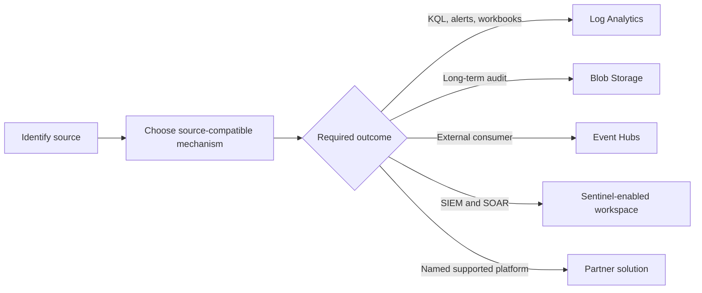
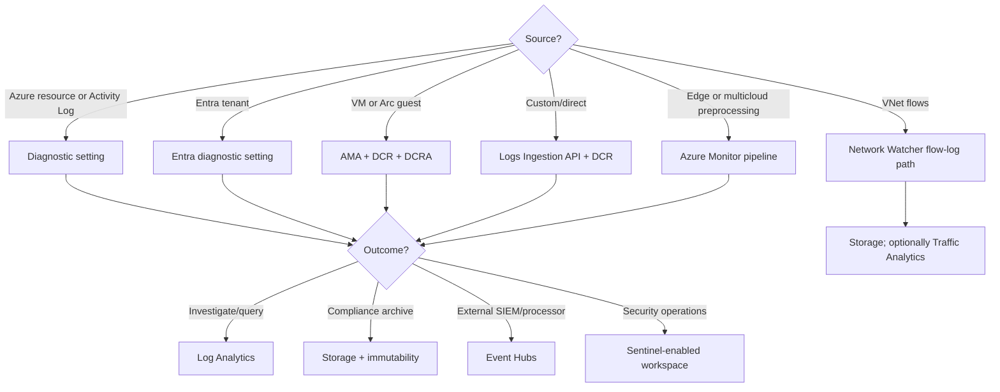
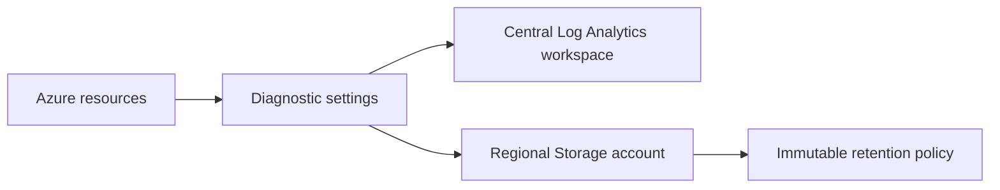
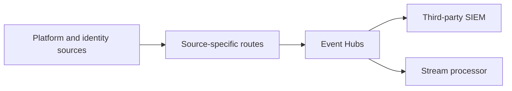
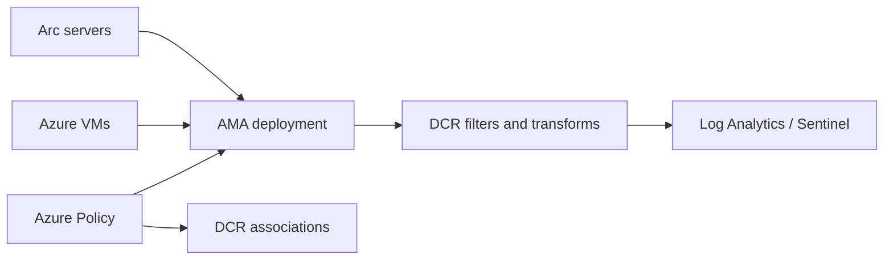
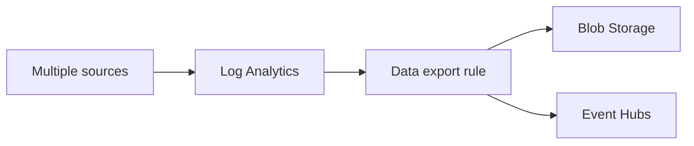

# AZ-305 Study Guide: Recommend a solution for routing logs

> **Exam task:** Design solutions for logging and monitoring — Recommend a solution for routing logs
>
> **Domain:** Design identity, governance, and monitoring solutions
>
> **Estimated reading time:** 45 minutes
>
> **Matched task source:** Exact match in the provided Study Guide Map and the current [official AZ-305 study guide](https://learn.microsoft.com/en-us/credentials/certifications/resources/study-guides/az-305).
>
> **Scope boundary:** This guide focuses on selecting the routing mechanism for each telemetry source, selecting destinations for analysis, archive, streaming, or security operations, and governing those routes at scale. It does not attempt to redesign the broader logging catalog or the alerting and visualization strategy.

---

## How to use this guide

Read this guide as a sequence of architectural decisions: identify the source, select the source-compatible collection mechanism, choose a destination from the required outcome, and then apply workspace, security, residency, reliability, and cost constraints. The [official AZ-305 study guide](https://learn.microsoft.com/en-us/credentials/certifications/resources/study-guides/az-305) places this task between “Recommend a logging solution” and “Recommend a monitoring solution,” so exam questions may deliberately mix the three.

By the end, you should be able to route [Azure resource logs](https://learn.microsoft.com/en-us/azure/azure-monitor/platform/resource-logs), the [Azure Activity Log](https://learn.microsoft.com/en-us/azure/azure-monitor/platform/activity-log), [Microsoft Entra activity logs](https://learn.microsoft.com/en-us/entra/identity/monitoring-health/howto-integrate-activity-logs-with-azure-monitor-logs), VM guest telemetry through [Azure Monitor Agent](https://learn.microsoft.com/en-us/azure/azure-monitor/agents/azure-monitor-agent-overview), custom data through the [Logs Ingestion API](https://learn.microsoft.com/en-us/azure/azure-monitor/logs/logs-ingestion-api-overview), and network data through [virtual network flow logs](https://learn.microsoft.com/en-us/azure/network-watcher/vnet-flow-logs-overview).

In scenarios, underline source clues such as **subscription control plane**, **resource data plane**, **guest operating system**, **tenant identity**, **custom application**, and **network flows**. Then underline outcome clues such as **KQL**, **seven-year archive**, **immutable**, **third-party SIEM**, **Sentinel**, **near-real-time stream**, and **data residency**. Those two groups normally determine the core answer; scale, cost, ownership, and security refine it.

---

## Primary source set

### Exam and module sources

- [Official AZ-305 study guide](https://learn.microsoft.com/en-us/credentials/certifications/resources/study-guides/az-305)
- [Design a solution to log and monitor Azure resources](https://learn.microsoft.com/en-us/training/modules/design-solution-to-log-monitor-azure-resources/)
- [Design identity, governance, and monitoring solutions learning path](https://learn.microsoft.com/en-us/training/paths/design-identity-governance-monitor-solutions/)
- [AZ-305 Exam Readiness Zone](https://learn.microsoft.com/en-us/shows/exam-readiness-zone/preparing-for-az-305-01-fy25)

### Core product documentation

- [Azure Monitor data sources and collection methods](https://learn.microsoft.com/en-us/azure/azure-monitor/fundamentals/data-sources)
- [Diagnostic settings in Azure Monitor](https://learn.microsoft.com/en-us/azure/azure-monitor/platform/diagnostic-settings)
- [Resource logs in Azure Monitor](https://learn.microsoft.com/en-us/azure/azure-monitor/platform/resource-logs)
- [Azure Activity Log](https://learn.microsoft.com/en-us/azure/azure-monitor/platform/activity-log)
- [Data collection rules](https://learn.microsoft.com/en-us/azure/azure-monitor/data-collection/data-collection-rule-overview)
- [Transformations in Azure Monitor](https://learn.microsoft.com/en-us/azure/azure-monitor/data-collection/data-collection-transformations)
- [Azure Monitor Agent](https://learn.microsoft.com/en-us/azure/azure-monitor/agents/azure-monitor-agent-overview)
- [Azure Monitor pipeline](https://learn.microsoft.com/en-us/azure/azure-monitor/data-collection/pipeline-overview)
- [Log Analytics workspace architecture](https://learn.microsoft.com/en-us/azure/azure-monitor/logs/workspace-design)
- [Log Analytics workspace data export](https://learn.microsoft.com/en-us/azure/azure-monitor/logs/logs-data-export)

### Supporting architecture and framework sources

- [Azure Monitor enterprise monitoring architecture](https://learn.microsoft.com/en-us/azure/azure-monitor/fundamentals/enterprise-monitoring-architecture)
- [Azure Well-Architected observability guidance](https://learn.microsoft.com/en-us/azure/well-architected/operational-excellence/observability)
- [Microsoft Entra log integration](https://learn.microsoft.com/en-us/entra/identity/monitoring-health/howto-integrate-activity-logs-with-azure-monitor-logs)
- [Event Hubs overview](https://learn.microsoft.com/en-us/azure/event-hubs/event-hubs-about)
- [Immutable Blob Storage](https://learn.microsoft.com/en-us/azure/storage/blobs/immutable-storage-overview)
- [Microsoft Sentinel overview](https://learn.microsoft.com/en-us/azure/sentinel/overview)
- [Virtual network flow logs](https://learn.microsoft.com/en-us/azure/network-watcher/vnet-flow-logs-overview)
- [Deploy diagnostic settings with Azure Policy](https://learn.microsoft.com/en-us/azure/azure-monitor/platform/diagnostic-settings-policy)

### Discovery notes from the Study Guide Map

**Potentially relevant products considered:** Azure Monitor, Azure Monitor Logs, Log Analytics workspaces, diagnostic settings, Activity Log, resource logs, platform metrics, DCRs, DCR associations, data collection endpoints, transformations, Azure Monitor Agent, Azure Monitor pipeline, Logs Ingestion API, workspace data export, Event Hubs, Blob Storage, immutable storage, Microsoft Entra monitoring, Sentinel, Defender for Cloud, Network Watcher, Traffic Analytics, Application Insights, Container insights, partner solutions, Azure Policy, and Azure Arc.

The forum-discovery note is **nonauthoritative**. It is used only to flag common candidate discussion patterns: diagnostic-setting destinations, workspace topology, DCR versus diagnostic settings, AMA, Sentinel, and Azure Policy. All recommendations below are grounded in Microsoft documentation.

---

## 1. Exam task scope

This task asks an architect to design the movement of telemetry, not merely name a log store. A complete recommendation answers four questions:

1. Which [data source](https://learn.microsoft.com/en-us/azure/azure-monitor/fundamentals/data-sources) emits the required telemetry?
2. Which collection and routing mechanism supports that source?
3. Which destination meets the use case?
4. Which topology and controls satisfy ownership, residency, security, reliability, and cost requirements?

### What is in scope

- [Diagnostic settings](https://learn.microsoft.com/en-us/azure/azure-monitor/platform/diagnostic-settings) for Azure platform telemetry.
- [DCRs and DCR associations](https://learn.microsoft.com/en-us/azure/azure-monitor/data-collection/data-collection-rule-overview) for supported agent, ingestion, and metric-export scenarios.
- [Log Analytics](https://learn.microsoft.com/en-us/azure/azure-monitor/logs/log-analytics-workspace-overview), [Storage](https://learn.microsoft.com/en-us/azure/azure-monitor/platform/diagnostic-settings#destinations), [Event Hubs](https://learn.microsoft.com/en-us/azure/event-hubs/event-hubs-about), partner destinations, and [Sentinel](https://learn.microsoft.com/en-us/azure/sentinel/overview).
- Initial collection versus [post-ingestion workspace export](https://learn.microsoft.com/en-us/azure/azure-monitor/logs/logs-data-export).
- Governance with [Azure Policy](https://learn.microsoft.com/en-us/azure/azure-monitor/platform/diagnostic-settings-policy).

### What is outside the center of the task

> **Adjacent task context:** “Recommend a logging solution” determines which signals, schemas, stores, and retention model the organization needs. “Recommend a monitoring solution” determines metrics, alerts, workbooks, health models, and response. This task determines how telemetry reaches the chosen destinations.

Threat analytics, incident automation, and hunting belong primarily to Sentinel operations; detailed alert-rule design belongs to monitoring; and broad compliance-control selection belongs to governance. They affect routing only when they impose a destination or handling requirement.

> **Exam tip:** Do not answer every routing question with Log Analytics. [Diagnostic settings can send the same selected categories to Log Analytics, Storage, Event Hubs, and supported partners](https://learn.microsoft.com/en-us/azure/azure-monitor/platform/diagnostic-settings#destinations), and the correct destination follows the required outcome.

---

## 2. Product and topic discovery pass

| Product, service, or topic | Why it may be relevant | Primary Microsoft source | Scope |
|---|---|---|---|
| Diagnostic settings | Route platform metrics, Activity Log, and resource logs to supported destinations. | [Diagnostic settings](https://learn.microsoft.com/en-us/azure/azure-monitor/platform/diagnostic-settings) | Core |
| Resource logs | Service-specific operational and data-plane records; not collected by default. | [Resource logs](https://learn.microsoft.com/en-us/azure/azure-monitor/platform/resource-logs) | Core |
| Activity Log | Subscription control-plane events; export for longer retention or downstream use. | [Activity Log](https://learn.microsoft.com/en-us/azure/azure-monitor/platform/activity-log) | Core |
| Log Analytics workspace | Queryable destination for KQL, alerts, workbooks, correlation, and Sentinel. | [Workspace overview](https://learn.microsoft.com/en-us/azure/azure-monitor/logs/log-analytics-workspace-overview) | Core |
| DCR and DCRA | Define inputs, transformations, data flows, destinations, and resource associations. | [DCR overview](https://learn.microsoft.com/en-us/azure/azure-monitor/data-collection/data-collection-rule-overview) | Core |
| Azure Monitor Agent | Collect guest OS and workload data from Azure and Arc-enabled machines. | [AMA overview](https://learn.microsoft.com/en-us/azure/azure-monitor/agents/azure-monitor-agent-overview) | Core |
| Logs Ingestion API | Send custom application or source data through a DCR to a target table. | [Logs Ingestion API](https://learn.microsoft.com/en-us/azure/azure-monitor/logs/logs-ingestion-api-overview) | Core |
| Azure Monitor pipeline | Process, buffer, and route edge, on-premises, or multicloud telemetry before cloud ingestion. | [Pipeline overview](https://learn.microsoft.com/en-us/azure/azure-monitor/data-collection/pipeline-overview) | Edge/hybrid |
| Workspace data export | Continuously forward selected tables after ingestion to Storage or Event Hubs. | [Data export](https://learn.microsoft.com/en-us/azure/azure-monitor/logs/logs-data-export) | Core second stage |
| Event Hubs | High-throughput stream for third-party SIEMs and processing consumers. | [Event Hubs](https://learn.microsoft.com/en-us/azure/event-hubs/event-hubs-about) | Core destination |
| Blob Storage and immutability | Low-cost archive and WORM retention with time policies or legal holds. | [Immutable storage](https://learn.microsoft.com/en-us/azure/storage/blobs/immutable-storage-overview) | Core destination |
| Microsoft Sentinel | SIEM/SOAR use of security data stored in a Log Analytics workspace. | [Sentinel](https://learn.microsoft.com/en-us/azure/sentinel/overview) | Destination/use case |
| Entra monitoring | Tenant-level audit, sign-in, provisioning, and risk log routing. | [Entra integration](https://learn.microsoft.com/en-us/entra/identity/monitoring-health/howto-integrate-activity-logs-with-azure-monitor-logs) | Core special source |
| Virtual network flow logs | Storage-first network flow path with optional Traffic Analytics. | [VNet flow logs](https://learn.microsoft.com/en-us/azure/network-watcher/vnet-flow-logs-overview) | Core special source |
| Azure Policy | Deploy and remediate routing baselines at scale. | [Diagnostic-setting policies](https://learn.microsoft.com/en-us/azure/azure-monitor/platform/diagnostic-settings-policy) | Governance |
| Application/Container insights | Source-specific observability experiences whose collection paths should not be reduced to generic platform logs. | [Azure Monitor data sources](https://learn.microsoft.com/en-us/azure/azure-monitor/fundamentals/data-sources) | Adjacent |
| Defender for Cloud | Security recommendations and security data can influence Sentinel/workspace architecture. | [Defender for Cloud integration](https://learn.microsoft.com/en-us/azure/sentinel/connect-microsoft-defender-for-cloud) | Adjacent |

---

## 3. Starting point from Microsoft Learn

The [AZ-305 logging and monitoring module](https://learn.microsoft.com/en-us/training/modules/design-solution-to-log-monitor-azure-resources/) introduces the service landscape, but the routing task is best learned from the [Azure Monitor source-and-collection map](https://learn.microsoft.com/en-us/azure/azure-monitor/fundamentals/data-sources). Microsoft separates platform data, applications, operating systems, resources, subscriptions, tenants, and custom sources because they do not all share one collection path.

The core design pattern is:

The module alone does not provide enough depth for constraints such as the [five diagnostic settings per resource, one destination of each type per setting, regional rules, and firewall bypass requirements](https://learn.microsoft.com/en-us/azure/azure-monitor/platform/diagnostic-settings#destinations). Those details often decide scenario answers.

> **Exam tip:** First solve the source-to-mechanism decision, then solve the outcome-to-destination decision. A requirement for an external SIEM points to [Event Hubs streaming](https://learn.microsoft.com/en-us/azure/azure-monitor/platform/diagnostic-settings#destinations), but guest OS events still need [AMA and a DCR](https://learn.microsoft.com/en-us/azure/azure-monitor/agents/azure-monitor-agent-overview) to enter the appropriate pipeline.

---

## 4. Conceptual foundation

### 4.1 Source, route, destination, consumer

A source generates telemetry; a route moves and optionally transforms it; a destination stores or streams it; and a consumer queries, archives, correlates, or processes it. Keeping these roles separate prevents a common error: treating Sentinel, Log Analytics, DCRs, and diagnostic settings as interchangeable.

- [Diagnostic settings](https://learn.microsoft.com/en-us/azure/azure-monitor/platform/diagnostic-settings) are route configurations for platform telemetry.
- [DCRs](https://learn.microsoft.com/en-us/azure/azure-monitor/data-collection/data-collection-rule-overview) describe data sources, transformations, and destinations for supported collection scenarios.
- A [Log Analytics workspace](https://learn.microsoft.com/en-us/azure/azure-monitor/logs/log-analytics-workspace-overview) is a queryable destination.
- [Microsoft Sentinel](https://learn.microsoft.com/en-us/azure/sentinel/overview) adds SIEM and SOAR capabilities over security data, commonly in Log Analytics.
- [Event Hubs](https://learn.microsoft.com/en-us/azure/event-hubs/event-hubs-about) is a streaming platform, not an interactive log analytics store.

> **Exam tip:** If an answer says “use a DCR to route all Azure resource logs,” check the source. Resource logs normally use [diagnostic settings](https://learn.microsoft.com/en-us/azure/azure-monitor/platform/resource-logs#collecting-resource-logs); DCRs govern supported DCR-based sources and transformations.

### 4.2 Control plane, resource data plane, guest, and tenant

The [Activity Log](https://learn.microsoft.com/en-us/azure/azure-monitor/platform/activity-log) records subscription control-plane events. [Resource logs](https://learn.microsoft.com/en-us/azure/azure-monitor/platform/resource-logs) expose service-specific operations and are not collected until diagnostic settings are configured. Guest OS telemetry comes from inside machines through [AMA](https://learn.microsoft.com/en-us/azure/azure-monitor/agents/azure-monitor-agent-overview), while identity events are routed at tenant scope through [Microsoft Entra diagnostic settings](https://learn.microsoft.com/en-us/entra/identity/monitoring-health/howto-integrate-activity-logs-with-azure-monitor-logs).

> **Exam tip:** “Who deleted the VM?” points to the Activity Log; “which process failed in the VM?” points to AMA plus DCR; “who signed in with risky behavior?” points to Entra logs and usually a Sentinel-enabled workspace.

### 4.3 Diagnostic settings constraints

Each monitored resource can have [up to five diagnostic settings](https://learn.microsoft.com/en-us/azure/azure-monitor/platform/diagnostic-settings#destinations). One setting can include at most one destination of each type, so two Log Analytics workspaces require two settings. For a regional resource, Storage and Event Hubs destinations must be in the same region; cross-subscription destinations are supported with appropriate RBAC, and cross-tenant destination management can use Azure Lighthouse.

When Storage or Event Hubs firewalls are enabled, [trusted Microsoft services must be allowed to bypass the firewall](https://learn.microsoft.com/en-us/azure/azure-monitor/platform/diagnostic-settings#destinations). A destination must exist before the setting is created, and diagnostic settings remaining after resource deletion can apply if a resource with the same identity is re-created, so lifecycle cleanup matters.

> **Exam tip:** “Send the same resource logs to six separate workspaces” cannot be satisfied by six diagnostic settings because the resource limit is five; reconsider centralization or use [workspace data export](https://learn.microsoft.com/en-us/azure/azure-monitor/logs/logs-data-export) as a second stage where supported.

### 4.4 DCRs, associations, endpoints, and transformations

A [DCR](https://learn.microsoft.com/en-us/azure/azure-monitor/data-collection/data-collection-rule-overview) specifies what data to collect, the incoming schema, transformations, and destinations. A DCR association connects a resource to a rule in association-based scenarios; one resource can be associated with multiple DCRs, and a DCR can serve multiple resources. Direct ingestion names the DCR in the API call instead.

[Transformations](https://learn.microsoft.com/en-us/azure/azure-monitor/data-collection/data-collection-transformations) use KQL per incoming record to filter, reshape, parse, or route data. Use source-side filters such as Windows event XPath where possible; cloud transformations can create processing charges when they discard more than the documented allowance, and adding columns increases ingested size.

A [data collection endpoint](https://learn.microsoft.com/en-us/azure/azure-monitor/data-collection/data-collection-endpoint-overview) is required only for particular DCR scenarios, including network-isolated ingestion or configuration access; do not add one automatically when the DCR scenario does not require it.

> **Exam tip:** A DCR is the processing contract; a DCRA selects which resource uses that contract; a DCE is an endpoint needed by specific network or collection scenarios. They are related but not synonyms.

### 4.5 Workspace topology and schema

Microsoft recommends using the [minimum number of Log Analytics workspaces](https://learn.microsoft.com/en-us/azure/azure-monitor/logs/workspace-design) that satisfies business requirements. Add workspaces for genuine constraints such as regional residency, ownership and RBAC boundaries, Sentinel design, billing, or resilience—not simply one per subscription.

For new diagnostic settings, choose [resource-specific tables](https://learn.microsoft.com/en-us/azure/azure-monitor/platform/resource-logs#resource-specific) where the service supports the choice. They improve schema discoverability, query performance, ingestion latency, and table-level RBAC compared with the legacy shared `AzureDiagnostics` table.

> **Exam tip:** Centralization is the default; sovereignty and access separation are exceptions. Resource-specific mode is the default choice for a new design when supported.

### Test yourself

> **Test yourself**
>
> - A regional Key Vault must send audit logs to two workspaces and an immutable archive. How many settings and which destinations are needed?
> - A fleet of Arc-enabled servers must send only warning and error Windows events to a workspace. What is the mechanism?
>
> **Answer guidance:** Two settings are required because [one setting permits only one destination of each type](https://learn.microsoft.com/en-us/azure/azure-monitor/platform/diagnostic-settings#destinations); one can also include the regional Storage destination. For the servers, use [AMA with a DCR/DCRA and source filtering](https://learn.microsoft.com/en-us/azure/azure-monitor/data-collection/data-collection-rule-samples#collect-vm-client-data).

---

## 5. Design decision framework

### Step-by-step logic

1. **Classify the source.** Platform resource, subscription, tenant identity, guest OS, application/custom, edge/multicloud, or network flow.
2. **Choose the mechanism.** Diagnostic setting, tenant diagnostic setting, AMA+DCR, Logs Ingestion API+DCR, pipeline, or flow-log path.
3. **Choose the outcome.** Query, archive, stream, security correlation, or partner integration.
4. **Choose topology.** Workspace count and region, Event Hubs namespace, Storage region and immutability, consumer ownership.
5. **Apply hard constraints.** Residency, firewall, RBAC, source support, diagnostic-setting count, retention, and SKU limitations.
6. **Apply soft preferences.** Simplicity, central operations, cost allocation, lower latency, and reduced duplication.
7. **Govern and validate.** Deploy with policy/IaC, remediate drift, and monitor whether data arrives.

### Hard constraints versus preferences

| Requirement | Type | Design consequence |
|---|---|---|
| Data must remain in an approved geography | Hard | Place the [workspace](https://learn.microsoft.com/en-us/azure/azure-monitor/logs/workspace-design) appropriately and keep regional Storage/Event Hubs destinations in the [resource's region](https://learn.microsoft.com/en-us/azure/azure-monitor/platform/diagnostic-settings#destinations). |
| Tamper-resistant seven-year retention | Hard | Route to Storage and configure [immutable WORM retention](https://learn.microsoft.com/en-us/azure/storage/blobs/immutable-storage-overview). |
| Existing third-party SIEM consumer | Hard integration | Route or export through [Event Hubs](https://learn.microsoft.com/en-us/azure/azure-monitor/platform/stream-monitoring-data-event-hubs). |
| Simplest operations | Preference | Prefer a [minimal-workspace architecture](https://learn.microsoft.com/en-us/azure/azure-monitor/logs/workspace-design). |
| Minimize ingestion cost | Preference unless budget cap | Filter at source, select only needed categories, and evaluate [transformation cost](https://learn.microsoft.com/en-us/azure/azure-monitor/data-collection/data-collection-transformations#cost-for-transformations). |
| Separate security ownership | Often hard | Use workspace/table RBAC or a justified security workspace aligned to [Sentinel workspace architecture](https://learn.microsoft.com/en-us/azure/sentinel/design-your-workspace-architecture). |

---

## 6. Service and feature comparison tables

### Destination comparison

| Destination | Choose when | Do not choose as the only destination when | Key constraints |
|---|---|---|---|
| [Log Analytics](https://learn.microsoft.com/en-us/azure/azure-monitor/logs/log-analytics-workspace-overview) | KQL, correlation, workbooks, log alerts, troubleshooting, or Sentinel is required. | The only requirement is low-cost immutable archive or an external streaming consumer. | Ingestion, retention, query, and table-plan costs apply; topology affects residency and access. |
| [Azure Storage](https://learn.microsoft.com/en-us/azure/azure-monitor/platform/diagnostic-settings#destinations) | Audit, backup, long retention, static analysis, or immutability is required. | Interactive KQL and operational alerting are required. | Regional resource destinations must be same-region; Standard accounts are supported diagnostic destinations. |
| [Event Hubs](https://learn.microsoft.com/en-us/azure/azure-monitor/platform/diagnostic-settings#destinations) | Near-real-time external SIEM, Kafka-compatible consumer, or processing pipeline is required. | Analysts need a queryable historical store without building a consumer. | Regional resource destinations must be same-region; throughput and consumer design matter. |
| [Sentinel-enabled workspace](https://learn.microsoft.com/en-us/azure/sentinel/overview) | Correlation, threat detection, hunting, incidents, and automation are required. | The requirement is only archive or generic event transport. | Sentinel pricing, access, retention, and workspace architecture matter. |
| [Partner solution](https://learn.microsoft.com/en-us/azure/azure-monitor/partners) | The named supported Azure-native integration is a firm requirement. | The platform is unsupported or generic decoupled streaming is preferred. | Availability and capabilities depend on the partner offering. |

### Routing mechanism comparison

| Mechanism | Sources | Transformation | Typical destination |
|---|---|---|---|
| [Diagnostic settings](https://learn.microsoft.com/en-us/azure/azure-monitor/platform/diagnostic-settings) | Resource logs, Activity Log, exportable platform metrics | Category selection; workspace transformations may later handle supported tables | Log Analytics, Storage, Event Hubs, partner |
| [AMA + DCR](https://learn.microsoft.com/en-us/azure/azure-monitor/agents/azure-monitor-agent-overview) | VM/Arc guest OS and supported workloads | DCR KQL plus source filters | Log Analytics/Sentinel-supported flows |
| [Logs Ingestion API + DCR](https://learn.microsoft.com/en-us/azure/azure-monitor/logs/logs-ingestion-api-overview) | Custom/direct sources | DCR transforms input to target schema | Log Analytics table |
| [Azure Monitor pipeline](https://learn.microsoft.com/en-us/azure/azure-monitor/data-collection/pipeline-overview) | Edge, on-premises, multicloud streams | Local filtering, transformation, aggregation, buffering | Azure Monitor cloud destinations |
| [Workspace data export](https://learn.microsoft.com/en-us/azure/azure-monitor/logs/logs-data-export) | Selected supported tables already ingested | Table selection; not an initial collector | Storage or Event Hubs |
| [VNet flow logs](https://learn.microsoft.com/en-us/azure/network-watcher/vnet-flow-logs-overview) | IP flows through virtual networks | Flow-log processing/Traffic Analytics path | Storage, optionally Traffic Analytics |

---

## 7. Architecture patterns

### Pattern 1: Central operational analytics plus compliance archive

Use this pattern when operators need KQL and alerts while auditors require long-lived tamper-resistant records. It uses one collection configuration to fan out to [Log Analytics and Storage](https://learn.microsoft.com/en-us/azure/azure-monitor/platform/diagnostic-settings#destinations), with [immutability](https://learn.microsoft.com/en-us/azure/storage/blobs/immutable-storage-overview) applied at the storage layer.

Strengths are independent analytics and compliance copies. Weaknesses are duplicated delivery/storage cost and regional Storage planning. A failure mode is assuming workspace retention alone satisfies legal WORM requirements.

### Pattern 2: Centralized collection with external SIEM streaming

Use [Event Hubs](https://learn.microsoft.com/en-us/azure/event-hubs/event-hubs-about) when consumers need a decoupled event stream. Plan namespace throughput, consumer groups, retention, authentication, and regional placement. The pattern avoids coupling every source directly to a vendor, but the consumer must reliably checkpoint and persist what it needs.

### Pattern 3: AMA fleet routing with reusable DCRs

Use reusable [DCRs and associations](https://learn.microsoft.com/en-us/azure/azure-monitor/data-collection/data-collection-rule-overview) for machine groups with common requirements, and use [Azure Policy](https://learn.microsoft.com/en-us/azure/azure-monitor/agents/azure-monitor-agent-policy) for fleet deployment. Avoid one bespoke rule per VM unless requirements truly differ, and filter as near the source as practical.

### Pattern 4: Ingest once, export selected tables

Use [workspace data export](https://learn.microsoft.com/en-us/azure/azure-monitor/logs/logs-data-export) when selected supported tables must be continuously forwarded after ingestion. It simplifies downstream routing but does not avoid Log Analytics ingestion charges and does not replace source collection.

> **Exam tip:** “All data must first be available to operations, then selected tables must go to a data lake or external platform” is a post-ingestion export clue. “Avoid paying to ingest archive-only data into Log Analytics” is a direct diagnostic-setting-to-Storage clue.

---

## 8. Implementation awareness for architects

Before implementation, decide the source inventory, categories, destination IDs and regions, schema mode, workspace topology, retention, identity/RBAC model, network access, and ownership. Resource categories differ, so use the [supported resource-log index](https://learn.microsoft.com/en-us/azure/azure-monitor/reference/supported-logs/supported-logs-index) or the resource-specific documentation rather than assuming every service exposes `allLogs` or `audit`.

[Category groups](https://learn.microsoft.com/en-us/azure/azure-monitor/platform/diagnostic-settings#category-groups) can automatically include new categories, but broader collection can increase volume. Use `audit` for supported audit categories or `allLogs` when complete coverage is explicitly required.

Implementation teams can choose portal, CLI, PowerShell, ARM, or Bicep, but repeatable enterprise routing should use IaC and [Azure Policy remediation](https://learn.microsoft.com/en-us/azure/azure-monitor/platform/diagnostic-settings-policy). Sequence destination creation before diagnostic settings because the destination must already exist.

Architects should also document deletion behavior, naming, policy exemptions, validation queries, and who responds to missing-data alerts. Resource logs use a scalable store-and-forward design but [do not provide transactional losslessness](https://learn.microsoft.com/en-us/azure/azure-monitor/platform/resource-logs#collecting-resource-logs), so do not represent them as an audit ledger with transactional guarantees.

---

## 9. Security, governance, and compliance considerations

Grant least privilege to destination resources and separate the ability to change routing from the ability to read sensitive logs. [Workspace access modes and table-level RBAC](https://learn.microsoft.com/en-us/azure/azure-monitor/logs/manage-access) can support operational separation without automatically multiplying workspaces.

Use [Private Link for Azure Monitor](https://learn.microsoft.com/en-us/azure/azure-monitor/logs/private-link-security) when ingestion and query traffic require private network paths. For diagnostic settings writing to firewalled Storage or Event Hubs, enable the documented [trusted Microsoft services bypass](https://learn.microsoft.com/en-us/azure/azure-monitor/platform/diagnostic-settings#destinations); a private endpoint alone does not change that service-to-destination requirement.

Use [Azure Policy](https://learn.microsoft.com/en-us/azure/azure-monitor/platform/diagnostic-settings-policy) with remediation for consistent deployment across management groups, subscriptions, resource groups, and resource types. Treat exemptions as governed exceptions, and remember that policies are resource-type aware because log categories vary.

For regulatory retention, [immutable Blob Storage](https://learn.microsoft.com/en-us/azure/storage/blobs/immutable-storage-overview) supports time-based WORM policies and legal holds. Minimize sensitive data before persistence with source filters or [DCR transformations](https://learn.microsoft.com/en-us/azure/azure-monitor/data-collection/data-collection-transformations), provided the transformation is supported and audit requirements allow removal.

> **Exam tip:** Network isolation, RBAC, and immutability solve different problems: private connectivity protects paths, RBAC controls actions, and immutability prevents modification or deletion during the retention policy.

---

## 10. Resiliency, availability, and disaster recovery considerations

Routing resiliency is end-to-end: source generation, collection agent or platform route, network path, destination ingestion, and consumer processing. A highly available Event Hubs namespace does not protect a third-party consumer that fails to checkpoint, and a second workspace does not help unless sources can route or fail over to it.

[Log Analytics workspace replication](https://learn.microsoft.com/en-us/azure/azure-monitor/logs/workspace-replication) can provide regional resilience for supported workspace data, but it has eligibility and feature limitations and should be selected from explicit RTO/RPO requirements. A manually managed second workspace adds routing, query, alert, and operational complexity.

For Event Hubs, choose an availability and disaster-recovery design from the service's [reliability guidance](https://learn.microsoft.com/en-us/azure/reliability/reliability-event-hubs) and ensure producers' regional constraints remain satisfied. For archive, choose Storage redundancy and lifecycle design from the data durability requirement, while recognizing that diagnostic settings for regional resources require same-region Storage destinations.

Keep this section bounded: selecting application failover, backup, or regional workload topology belongs to the business continuity domain. Here, the question is whether telemetry remains available enough to operate and investigate the workload during failure.

---

## 11. Cost and licensing considerations

The largest routing-related costs normally come from Log Analytics ingestion and retention, Sentinel analysis, Event Hubs throughput, Storage capacity and transactions, data export, and network transfer. Use the [Azure Monitor pricing model](https://learn.microsoft.com/en-us/azure/azure-monitor/fundamentals/cost-usage) to estimate each stage instead of treating routing as free.

Collect only required diagnostic categories. Platform metrics are already available in Azure Monitor Metrics; Microsoft recommends [not exporting them to logs unless log-query analysis is required](https://learn.microsoft.com/en-us/azure/azure-monitor/platform/diagnostic-settings#controlling-costs). Prefer source-side filters before DCR transformations where possible.

[Transformation charging](https://learn.microsoft.com/en-us/azure/azure-monitor/data-collection/data-collection-transformations#cost-for-transformations) can apply when Analytics or Basic table transformations discard more than half the incoming data, while adding data increases billable ingested volume. Sentinel-enabled Analytics tables have documented transformation-charge treatment, but Sentinel ingestion and retention pricing still requires analysis.

[Workspace data export](https://learn.microsoft.com/en-us/azure/azure-monitor/logs/logs-data-export#pricing-model) is a paid second stage and the data has already incurred workspace ingestion. Send archive-only data directly to Storage when interactive analytics is not needed.

> **Exam tip:** Filtering after ingestion cannot undo ingestion cost. If the requirement is “lowest cost and never queried,” direct Storage routing is usually stronger than Log Analytics followed by export.

---

## 12. Monitoring and operational considerations

The routing solution itself needs monitoring. Validate that expected tables receive records, alert on unexpected ingestion-volume changes, monitor agent/DCR health, check Event Hubs throttling and consumer lag, and use [Log Analytics workspace insights](https://learn.microsoft.com/en-us/azure/azure-monitor/logs/log-analytics-workspace-insights-overview) for workspace operations.

Define an owner for every route and consumer. Platform teams may own diagnostic settings and policy; security teams may own Sentinel connectors; application teams may own instrumentation; infrastructure teams may own AMA/DCRs; and integration teams may own Event Hubs consumers. Ownership gaps frequently appear as silent data gaps.

> **Adjacent task context:** Designing workload health metrics, alert thresholds, workbooks, action groups, and incident response is “Recommend a monitoring solution.” This section only monitors whether the routing architecture delivers usable telemetry.

### Test yourself

> **Test yourself**
>
> - A policy reports compliant, but a Log Analytics table is empty. What layers should be checked?
> - A third-party SIEM is hours behind although Event Hubs accepts events. Is the source route necessarily broken?
>
> **Answer guidance:** Check whether the source emits records, category selection, destination access, documented [ingestion latency](https://learn.microsoft.com/en-us/azure/azure-monitor/logs/data-ingestion-time), table/schema choice, and query time range. For Event Hubs, inspect throughput, throttling, consumer groups, and consumer checkpoints; successful routing does not guarantee consumer processing.

---

## 13. Common exam traps

| Trap | Tempting wrong answer | Why it seems reasonable | Why wrong or incomplete | Better design choice | Microsoft source |
|---|---|---|---|---|---|
| One mechanism for every source | Use diagnostic settings everywhere | They are prominent in Azure Monitor | Guest and custom sources use different paths | Match mechanism to the [source](https://learn.microsoft.com/en-us/azure/azure-monitor/fundamentals/data-sources) | [Data sources](https://learn.microsoft.com/en-us/azure/azure-monitor/fundamentals/data-sources) |
| Destination confusion | Event Hubs for KQL analysis | It receives events | It is a stream, not a KQL workspace | Use [Log Analytics](https://learn.microsoft.com/en-us/azure/azure-monitor/logs/log-analytics-workspace-overview) | [Destinations](https://learn.microsoft.com/en-us/azure/azure-monitor/platform/diagnostic-settings#destinations) |
| Archive confusion | Log Analytics only for legal WORM | It supports retention | Retention is not the same as immutable WORM | Storage with [immutability](https://learn.microsoft.com/en-us/azure/storage/blobs/immutable-storage-overview) | [Immutable storage](https://learn.microsoft.com/en-us/azure/storage/blobs/immutable-storage-overview) |
| Scope confusion | DCR for Activity Log | DCRs are modern | Activity Log export uses subscription/management-group diagnostic settings | Use [Activity Log export](https://learn.microsoft.com/en-us/azure/azure-monitor/platform/activity-log#export-activity-log) | [Activity Log](https://learn.microsoft.com/en-us/azure/azure-monitor/platform/activity-log) |
| Workspace sprawl | One workspace per subscription | Simple organizational symmetry | It adds query and governance complexity without a requirement | Start with a [minimal workspace design](https://learn.microsoft.com/en-us/azure/azure-monitor/logs/workspace-design) | [Workspace design](https://learn.microsoft.com/en-us/azure/azure-monitor/logs/workspace-design) |
| Schema trap | Always use `AzureDiagnostics` | Familiar legacy table | Resource-specific tables are preferred for new supported designs | Select [resource-specific mode](https://learn.microsoft.com/en-us/azure/azure-monitor/platform/resource-logs#resource-specific) | [Resource logs](https://learn.microsoft.com/en-us/azure/azure-monitor/platform/resource-logs) |
| Security trap | Private endpoint alone fixes diagnostic destination firewalls | Private endpoints are secure | Diagnostic settings require trusted-services bypass for firewalled Storage/Event Hubs | Apply the documented [firewall requirement](https://learn.microsoft.com/en-us/azure/azure-monitor/platform/diagnostic-settings#destinations) | [Diagnostic settings](https://learn.microsoft.com/en-us/azure/azure-monitor/platform/diagnostic-settings) |
| Cost trap | Ingest everything, filter later | Central collection is flexible | Post-ingestion filtering does not remove initial ingestion cost | Filter/select earlier and model [transformation cost](https://learn.microsoft.com/en-us/azure/azure-monitor/data-collection/data-collection-transformations#cost-for-transformations) | [Transformations](https://learn.microsoft.com/en-us/azure/azure-monitor/data-collection/data-collection-transformations) |
| Resiliency trap | Two workspaces automatically provide failover | Duplication sounds resilient | Sources, queries, alerts, and operational cutover need explicit design | Use documented [workspace reliability options](https://learn.microsoft.com/en-us/azure/azure-monitor/logs/best-practices-logs#reliability) | [Logs best practices](https://learn.microsoft.com/en-us/azure/azure-monitor/logs/best-practices-logs) |
| Operational trap | Policy compliance proves data delivery | Configuration exists | No events, access failure, or consumer failure can still yield no usable data | Monitor the route end-to-end | [Diagnostic troubleshooting](https://learn.microsoft.com/en-us/azure/azure-monitor/platform/diagnostic-settings#troubleshooting) |
| **Required edge case** | Six settings to six workspaces | One setting per workspace is valid | A resource supports only five settings | Centralize, reduce destinations, or export selected supported tables after ingestion | [Five-setting limit](https://learn.microsoft.com/en-us/azure/azure-monitor/platform/diagnostic-settings#destinations) |

---

## 14. Scenario-based design examples

### Scenario 1: Straightforward operational default

**Requirement:** A company needs centralized KQL troubleshooting and log alerts for production Azure resources. **Constraints:** One operations team, one geography, no special separation. **Recommendation:** Configure resource diagnostic settings to a central [Log Analytics workspace](https://learn.microsoft.com/en-us/azure/azure-monitor/logs/workspace-design), use resource-specific tables where supported, and deploy settings with [Azure Policy](https://learn.microsoft.com/en-us/azure/azure-monitor/platform/diagnostic-settings-policy).

One workspace minimizes administration and cross-workspace queries. Storage alone was rejected because it does not provide the required interactive operations experience; Event Hubs alone was rejected because no external consumer is required.

**Exam interpretation:** “Centralized,” “KQL,” and “log alerts” are Log Analytics clues; lack of a separation requirement argues against workspace-per-subscription sprawl.

### Scenario 2: Cost-constrained audit retention

**Requirement:** Keep resource audit logs for seven years; retrieval is rare and no interactive queries are required. **Constraints:** Lowest practical recurring cost and tamper resistance. **Recommendation:** Route required audit categories directly to same-region Standard Storage and apply a [time-based immutable retention policy](https://learn.microsoft.com/en-us/azure/storage/blobs/immutable-storage-overview).

Log Analytics plus export was rejected because it introduces ingestion and export charges without a query use case. Event Hubs was rejected because it transfers responsibility to a consumer and is not itself the compliance archive.

**Exam interpretation:** “Rare retrieval,” “seven years,” “immutable,” and “lowest cost” point to Storage, not Log Analytics.

### Scenario 3: Security and compliance operations

**Requirement:** Correlate Azure, Entra, and hybrid server security events; automate incident response; retain an immutable audit copy. **Constraints:** Security-team-only access and regulatory preservation. **Recommendation:** Route Entra logs through [tenant diagnostic settings](https://learn.microsoft.com/en-us/entra/identity/monitoring-health/howto-integrate-activity-logs-with-azure-monitor-logs), platform logs through resource/subscription diagnostic settings, and hybrid guest events through AMA+DCR to a [Sentinel-enabled workspace](https://learn.microsoft.com/en-us/azure/sentinel/overview); independently route required audit data to immutable Storage.

A generic operational workspace without Sentinel was rejected because it lacks the required SIEM/SOAR capability. Sentinel alone was rejected as the legal archive because investigation storage and WORM preservation are distinct requirements.

**Exam interpretation:** Multiple sources require multiple source-appropriate mechanisms even when they converge on one security destination.

### Scenario 4: Multi-region operational resilience

**Requirement:** Operators must investigate incidents during a regional disruption. **Constraints:** Workloads run in two regions, and telemetry residency must remain within approved regions. **Recommendation:** Assess [workspace replication](https://learn.microsoft.com/en-us/azure/azure-monitor/logs/workspace-replication) against eligibility and RTO/RPO; otherwise design regional workspaces with explicit dual-query, alert, routing, and cutover operations. Keep Storage/Event Hubs destinations compliant with [same-region rules for regional resources](https://learn.microsoft.com/en-us/azure/azure-monitor/platform/diagnostic-settings#destinations).

A casual second workspace was rejected because duplicated infrastructure without an operating procedure does not create dependable failover.

**Exam interpretation:** Resilience answers must include data path and operational cutover, not merely two resource names.

### Scenario 5: Edge case—same data to many business units

**Requirement:** A shared platform resource must supply logs to six departmental analytics destinations. **Constraints:** Departments cannot manage the source. **Recommendation:** Do not propose six resource diagnostic settings because [only five are supported per resource](https://learn.microsoft.com/en-us/azure/azure-monitor/platform/diagnostic-settings#destinations). Centralize into an approved workspace or Event Hubs route, then fan out through supported [workspace data export](https://learn.microsoft.com/en-us/azure/azure-monitor/logs/logs-data-export) or consumer architecture.

The exact fan-out depends on supported tables, security boundaries, and whether departments need a store or stream. **Exam interpretation:** Numeric platform limits can invalidate an otherwise reasonable pattern.

### Scenario 6: Adjacent-task confusion

**Requirement:** Alert the on-call team when API latency exceeds a threshold and show dependency failures in a dashboard. **Constraints:** Application already emits Application Insights telemetry. **Recommendation:** This is primarily the adjacent “Recommend a monitoring solution” task: design [Application Insights alerts and workbooks](https://learn.microsoft.com/en-us/azure/azure-monitor/app/app-insights-overview), not a new generic log-routing architecture.

Additional diagnostic settings were rejected because the question asks how to detect and visualize health, not how to move platform logs. **Exam interpretation:** Identify the verb: route/send/export indicates routing; alert/detect/visualize/respond indicates monitoring.

### Test yourself

> **Test yourself**
>
> - A custom appliance sends JSON from a disconnected site and needs local buffering and aggregation. Which mechanism changes the normal recommendation?
> - A customer wants every Log Analytics table exported to Storage. What should you verify before promising it?
>
> **Answer guidance:** Use [Azure Monitor pipeline](https://learn.microsoft.com/en-us/azure/azure-monitor/data-collection/pipeline-overview) for supported edge preprocessing and disconnection scenarios. Verify the [tables and limitations supported by workspace data export](https://learn.microsoft.com/en-us/azure/azure-monitor/logs/logs-data-export#supported-tables), destination and network requirements, and total ingestion/export cost.

---

## 15. Test yourself

> **Test yourself**
>
> - Which two questions should you answer before considering workspace topology?
> - When is a DCR transformation preferable to collecting everything unchanged?
> - Why is Event Hubs not a replacement for a compliance archive?
> - When does data export represent a second routing stage?
>
> **Answer guidance:** Identify the [source and its collection method](https://learn.microsoft.com/en-us/azure/azure-monitor/fundamentals/data-sources), then the destination outcome. Transform when supported filtering, normalization, sensitive-data removal, or table routing is required, while accounting for [cost and schema rules](https://learn.microsoft.com/en-us/azure/azure-monitor/data-collection/data-collection-transformations). Event Hubs provides a stream whose consumers must persist data. [Workspace data export](https://learn.microsoft.com/en-us/azure/azure-monitor/logs/logs-data-export) acts after data has already landed in Log Analytics.

---

## 16. Adjacent task context

| Adjacent task or topic | Why it overlaps | What belongs here | What belongs elsewhere |
|---|---|---|---|
| Recommend a logging solution | Sources, schemas, stores, and retention shape routes | Mechanism and destination path | Which logs must exist and the overall log data model |
| Recommend a monitoring solution | Routed data feeds alerts and workbooks | Delivering usable telemetry and monitoring route health | Health model, alerts, visualizations, and response |
| Recommend a compliance solution | Retention and residency impose constraints | Immutable/archive route and geography | Broader regulatory controls and evidence program |
| Design governance | Policy deploys routes at scale | Policy-based diagnostic settings and remediation | Full management hierarchy and compliance architecture |
| Design business continuity | Telemetry is needed during outages | Routing/destination resilience implications | Workload backup, failover, RTO, and RPO design |
| Network monitoring | Flow data has a special path | Correct route for VNet flow logs | Broader network health and security analysis |

---

## 17. Final exam-focused summary

### Key takeaways

- Start with the [source](https://learn.microsoft.com/en-us/azure/azure-monitor/fundamentals/data-sources), not a favorite destination.
- Use [diagnostic settings](https://learn.microsoft.com/en-us/azure/azure-monitor/platform/diagnostic-settings) for platform telemetry, [AMA+DCR](https://learn.microsoft.com/en-us/azure/azure-monitor/agents/azure-monitor-agent-overview) for machine guest data, Entra tenant settings for identity logs, and source-specific paths for custom and network telemetry.
- Choose [Log Analytics](https://learn.microsoft.com/en-us/azure/azure-monitor/logs/log-analytics-workspace-overview) for analysis, Storage for archive/immutability, Event Hubs for streaming, and Sentinel for SIEM/SOAR.
- Distinguish initial collection from [post-ingestion export](https://learn.microsoft.com/en-us/azure/azure-monitor/logs/logs-data-export).
- Prefer a minimal workspace topology and [resource-specific tables](https://learn.microsoft.com/en-us/azure/azure-monitor/platform/resource-logs#resource-specific) where supported.
- Remember diagnostic-setting constraints: five per resource, one destination of each type per setting, regional destination rules, and firewall requirements.
- Govern routes at scale with [Azure Policy](https://learn.microsoft.com/en-us/azure/azure-monitor/platform/diagnostic-settings-policy), and validate actual data flow rather than configuration alone.

### Before the exam, make sure you can…

- Map each major source to its routing mechanism.
- Map analysis, archive, external streaming, and security requirements to destinations.
- Explain DCR versus DCRA versus DCE.
- Explain diagnostic settings versus workspace data export.
- Defend one versus multiple workspaces.
- Recognize resource-specific versus `AzureDiagnostics` schema mode.
- Apply region, firewall, immutability, RBAC, cost, and setting-limit constraints.
- Reject an adjacent monitoring answer when the question is actually about routing—and vice versa.

---

## 18. Quick-reference tables

### Requirement-to-answer map

| Requirement clue | Likely recommendation |
|---|---|
| KQL, workbooks, correlation, log alerts | [Log Analytics workspace](https://learn.microsoft.com/en-us/azure/azure-monitor/logs/log-analytics-workspace-overview) |
| Long-term low-cost audit retention | [Azure Storage destination](https://learn.microsoft.com/en-us/azure/azure-monitor/platform/diagnostic-settings#destinations) |
| Tamper-resistant/WORM/legal hold | [Immutable Blob Storage](https://learn.microsoft.com/en-us/azure/storage/blobs/immutable-storage-overview) |
| Third-party SIEM or stream processor | [Event Hubs](https://learn.microsoft.com/en-us/azure/event-hubs/event-hubs-about) |
| Threat correlation, hunting, incidents, automation | [Microsoft Sentinel](https://learn.microsoft.com/en-us/azure/sentinel/overview) |
| Guest OS events and Syslog | [AMA with DCR/DCRA](https://learn.microsoft.com/en-us/azure/azure-monitor/agents/azure-monitor-agent-overview) |
| Custom JSON direct ingestion | [Logs Ingestion API with DCR](https://learn.microsoft.com/en-us/azure/azure-monitor/logs/logs-ingestion-api-overview) |
| Edge filtering, aggregation, buffering | [Azure Monitor pipeline](https://learn.microsoft.com/en-us/azure/azure-monitor/data-collection/pipeline-overview) |
| Export selected data after workspace ingestion | [Log Analytics data export](https://learn.microsoft.com/en-us/azure/azure-monitor/logs/logs-data-export) |
| Enforce routing across many resources | [Azure Policy with remediation](https://learn.microsoft.com/en-us/azure/azure-monitor/platform/diagnostic-settings-policy) |

### Edge-case-to-design-change map

| Edge case | Design change |
|---|---|
| Two destinations of the same type | Use two settings, within the [five-setting limit](https://learn.microsoft.com/en-us/azure/azure-monitor/platform/diagnostic-settings#destinations). |
| Regional resource sends to Storage/Event Hubs | Keep the destination in the [same region](https://learn.microsoft.com/en-us/azure/azure-monitor/platform/diagnostic-settings#destinations). |
| Destination firewall enabled | Allow the required [trusted Microsoft services bypass](https://learn.microsoft.com/en-us/azure/azure-monitor/platform/diagnostic-settings#destinations). |
| Data needs both operations and WORM archive | Fan out to Log Analytics and [immutable Storage](https://learn.microsoft.com/en-us/azure/storage/blobs/immutable-storage-overview). |
| Sovereignty prevents one global workspace | Use justified [regional workspaces](https://learn.microsoft.com/en-us/azure/azure-monitor/logs/workspace-design). |
| VNet traffic flows are requested | Use the [VNet flow-log storage-first path](https://learn.microsoft.com/en-us/azure/network-watcher/vnet-flow-logs-overview). |
| Source is intermittently disconnected | Consider [Azure Monitor pipeline buffering](https://learn.microsoft.com/en-us/azure/azure-monitor/data-collection/pipeline-overview). |
| New supported resource-log design | Select [resource-specific tables](https://learn.microsoft.com/en-us/azure/azure-monitor/platform/resource-logs#resource-specific). |

---

## 19. Final validation

- [x] Exact domain, skill, and task match verified against the [official AZ-305 study guide](https://learn.microsoft.com/en-us/credentials/certifications/resources/study-guides/az-305).
- [x] Product coverage derived from the provided Study Guide Map and current Microsoft documentation.
- [x] Forum notes treated only as nonauthoritative discovery signals.
- [x] Source-first and outcome-second decision model used throughout.
- [x] Initial routing separated from post-ingestion export.
- [x] Security, governance, resiliency, cost, operations, traps, edge cases, scenarios, and adjacent tasks included.
- [x] Only normal inline Markdown links to official Microsoft sources are used.
- [x] Mermaid diagrams remain compact and exam-focused.
