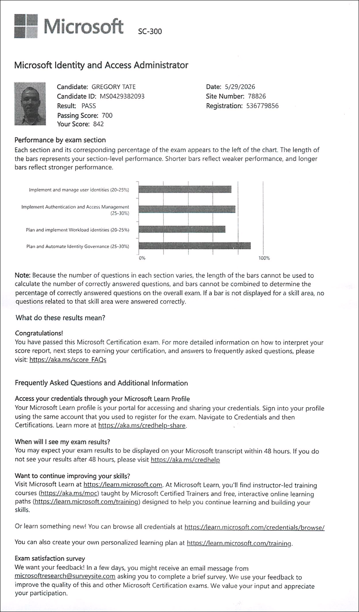

# My SC-300 Exam Experience

I took the SC-300 exam on May 29th, 2026 and passed with a score of 842, which I consider a solid score.

I committed around 84 hours of studying over 36 days, which averages around 2.3 hours per day.

The exam was tough. I had 140 minutes to answer 59 questions. I completed all questions with around 30 minutes remaining for review. I marked around 30 questions for review and barely had enough time to review them all. In fact, time ran out just as I finished reviewing the last question.

Most of the questions were multiple choice, but around 40% of the exam consisted of a scenario-based questions, ordering questions, and drag-and-drop questions.

The first part of the exam was a case study that included around 7 questions. In the case study, you're presented with a heavy volume of information, none of which you can easily retain in your head. I was prepared for this ahead of time and knew to focus on the question first and then go look for the relevant information. However, even on reviewing these questions, I found subtle clues that helped me reverse my initial answers. In the case study, once you finish these questions, you're not allowed to back to review them. I finished the case study in ten minutes.  

After finishing the case study, I continued through an onslaught of complex questions, many of which presented two or three tables, requiring you to consider transitive relationships as you relate items across the tables. Many of the questions tested edge cases, requiring you to understand the nuances in the exam content.

The final 7 questions were scenario-based questions that presented the same scenario, but with slighly different-worded questions. With these questions, I was not allowed to go back and review the prior one. This was challenging because if you provided an answer you thought was correct for the first question, but then the next question presented a different nuance that made your initial answer incorrect, you couldn't go back and change your answer to the first question.

From a preparation perspective, none of the study material I used -- either the Microsoft Asssessment or the MeasureUp exams -- presented exam questions on the level of complexity that I experienced on the exam. The exams really test your knowledge of the content on various levels, i.e. do you have experience with the content, have you studied the content, and do you understand the content well enough to apply it in complex scenarios.

I barely passed my last Microsoft exam, but only dedicated around 35 hours of study time. This time around I more than doubled my study time, and I think that made a huge difference.

I also changed my study approach a bit by dedicating more time to each exam task covered in the study guide. This was the first exam where I also used LLM tools to help me prepare. I used NotebookLM by grounding it on PDFs of the Microsoft documentation and generating quizzes and podcasts.

For my next exam, the AZ-305, I'll build on this approach by using additional LLM tools, e.g. ChatGPT Deep Research and Claude Opus, to generate study guides with deep links to the Microsoft documentation.

It's a great feeling to have passed this exam, and I'm already looking forward to studying for the AZ-305!

