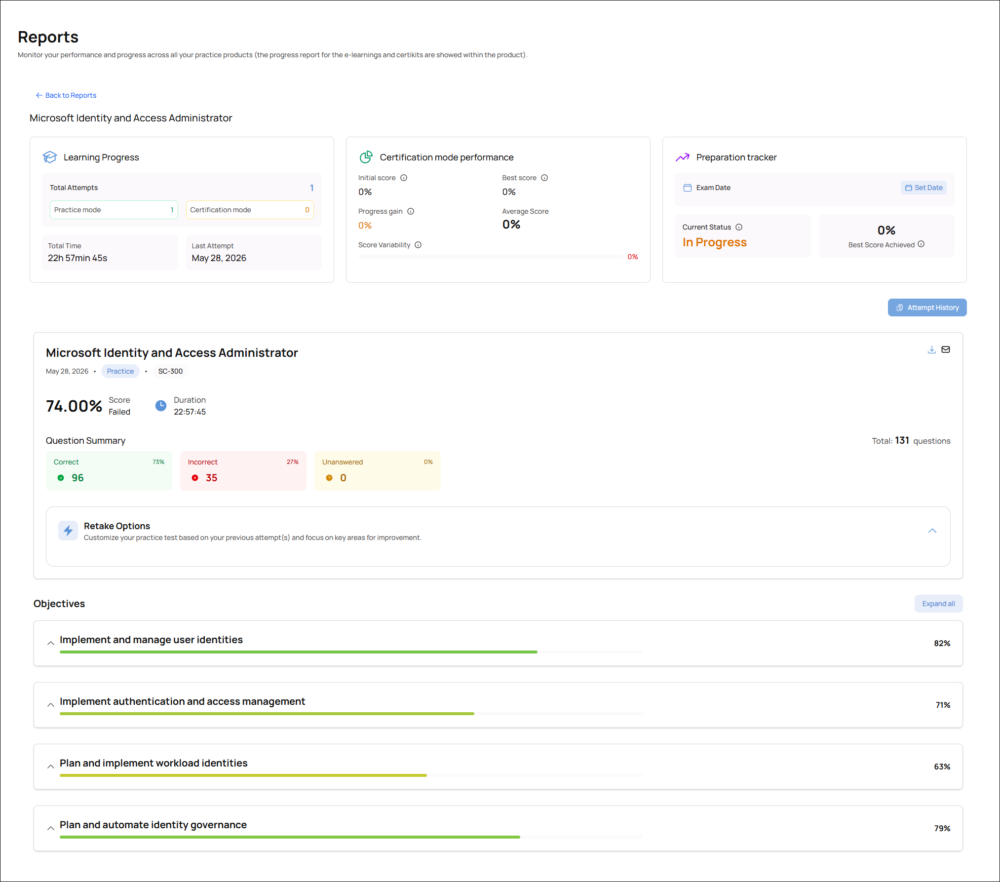

The week of the exam, after completing studying for all tasks, I performed my first run-through of 131 medium- and hard-level questions on MeasureUp. I took the exam over four days, doing around 30-40 questions each day.

Here are my results:

