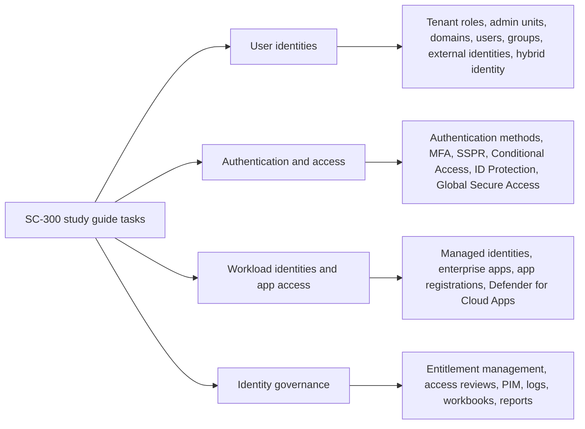

# SC-300 Study Guide Task-to-Documentation Map

## Executive summary

This report maps every SC-300 skill and task in the current study guide to official English-language documentation on learn.microsoft.com, prioritizing operational product documentation over high-level marketing or training content. The source study guide version in scope is **“Skills measured as of April 27, 2026”**, and the mapping below follows its four skill domains exactly. [\[1\]](https://learn.microsoft.com/en-us/credentials/certifications/resources/study-guides/sc-300)

The documentation landscape is strongest where the exam aligns with core Microsoft[\[2\]](https://learn.microsoft.com/en-us/entra/identity-platform/security-best-practices-for-app-registration) Entra administration surfaces: tenant roles, Conditional Access, authentication methods, external identities, managed identities, application proxy, entitlement management, access reviews, and monitoring. Coverage is more fragmented for tasks that span multiple control planes or product families, especially **effective permissions evaluation**, **tenant/user/group/device setting combinations**, **OAuth 2.0 token administration**, **identity-selection strategy across service principals and managed service accounts**, and some **Privileged Identity Management** planning tasks. In those areas, the report intentionally maps each task to multiple Learn pages and calls out the gap rather than overstating a single page’s coverage. [\[3\]](https://learn.microsoft.com/en-us/credentials/certifications/resources/study-guides/sc-300)

The tables below include, for each task, a **link count**, a **coverage note** (`Direct`, `Split`, or `Gap`), and one or more **official Learn pages** with a short relevance justification. Tasks marked `Split` are well-covered but require reading more than one page to perform the task end to end. Tasks marked `Gap` have no single clean operational page matching the study-guide wording, even though the linked Learn pages still provide the best official coverage available. [\[1\]](https://learn.microsoft.com/en-us/credentials/certifications/resources/study-guides/sc-300)

## Scope and mapping method

The study guide organizes the exam into four top-level skill domains: user identities, authentication and access management, workload identities, and identity governance. Each mapping below preserves the study-guide task text and then points to the most directly relevant Learn pages for performing or understanding that task. Where possible, the mapping prefers admin-center how-to pages, then conceptual pages, then API/reference or adjacent Windows/Azure documentation when the exam task spans more than one Microsoft surface. [\[1\]](https://learn.microsoft.com/en-us/credentials/certifications/resources/study-guides/sc-300)

Coverage notes used throughout the report mean the following:

| Note | Meaning |
|----|----|
| Direct | One Learn page is a strong primary match for the task. |
| Split | The task is well-supported, but Microsoft documents it across two or more pages. |
| Gap | No single Learn page cleanly matches the study-guide wording; the linked pages are the best official set. |

## Implement and manage user identities

This skill domain covers tenant configuration, Microsoft Entra identity objects, external identities, and hybrid identity tasks listed in the study guide. [\[1\]](https://learn.microsoft.com/en-us/credentials/certifications/resources/study-guides/sc-300)

**Configure and manage a Microsoft Entra tenant**

| Task | Links | Coverage | Official Learn pages |
|----|---:|----|----|
| Configure and manage built-in and custom Microsoft Entra roles | 2 | Direct | **Microsoft Entra built-in roles** — `https://learn.microsoft.com/en-us/entra/identity/role-based-access-control/permissions-reference` — authoritative permission reference for built-in roles and role capabilities.\<br\>**Assign Microsoft Entra roles** — `https://learn.microsoft.com/en-us/entra/identity/role-based-access-control/manage-roles-portal` — operational guide for role assignment, including scoped assignments. [\[4\]](https://learn.microsoft.com/en-us/entra/identity/role-based-access-control/permissions-reference) |
| Recommend when to use administrative units | 2 | Split | **Administrative units in Microsoft Entra ID** — `https://learn.microsoft.com/en-us/entra/identity/role-based-access-control/administrative-units` — explains what administrative units are, supported objects, and delegated administration scenarios.\<br\>**Least privileged roles by task** — `https://learn.microsoft.com/en-us/entra/identity/role-based-access-control/delegate-by-task` — useful for deciding when scoped delegation is preferable to broader tenant-wide administration. [\[5\]](https://learn.microsoft.com/en-us/entra/identity/role-based-access-control/administrative-units) |
| Configure and manage administrative units | 3 | Direct | **Create or delete administrative units** — `https://learn.microsoft.com/en-us/entra/identity/role-based-access-control/admin-units-manage` — direct how-to for lifecycle management of administrative units.\<br\>**Add users, groups, or devices to an administrative unit** — `https://learn.microsoft.com/en-us/entra/identity/role-based-access-control/admin-units-members-add` — covers membership operations, including bulk add.\<br\>**Assign Microsoft Entra roles** — `https://learn.microsoft.com/en-us/entra/identity/role-based-access-control/manage-roles-portal` — needed for scoped role assignments over an administrative unit. [\[6\]](https://learn.microsoft.com/en-us/entra/identity/role-based-access-control/admin-units-manage) |
| Evaluate effective permissions for Microsoft Entra roles | 2 | Gap | **Microsoft Entra built-in roles** — `https://learn.microsoft.com/en-us/entra/identity/role-based-access-control/permissions-reference` — best official source for evaluating what a role can actually do.\<br\>**Least privileged roles by task** — `https://learn.microsoft.com/en-us/entra/identity/role-based-access-control/delegate-by-task` — helps compare intended tasks with the minimum required built-in role. There is no single dedicated Learn page centered on “effective permissions evaluation” as its own workflow. [\[7\]](https://learn.microsoft.com/en-us/entra/identity/role-based-access-control/permissions-reference) |
| Configure and manage domains in Microsoft Entra ID and Microsoft 365 | 2 | Direct | **Add and verify custom domain names** — `https://learn.microsoft.com/en-us/entra/identity/users/domains-manage` — primary Entra domain-management article for add, verify, make primary, and delete actions.\<br\>**Assign or unassign licenses for users in the Microsoft 365 admin center** — `https://learn.microsoft.com/en-us/microsoft-365/admin/manage/assign-licenses-to-users?view=o365-worldwide` — useful because some Microsoft 365 tenant tasks are completed outside the Entra admin center even though they depend on the same directory domain context. [\[8\]](https://learn.microsoft.com/en-us/entra/identity/users/domains-manage) |
| Configure Company branding settings | 1 | Direct | **Add company branding to your organization's sign-in page** — `https://learn.microsoft.com/en-us/entra/fundamentals/how-to-customize-branding` — direct operational guide for branding the sign-in experience. [\[9\]](https://learn.microsoft.com/en-us/entra/fundamentals/how-to-customize-branding) |
| Configure tenant properties, user settings, group settings, and device settings | 4 | Gap | **What are the default user permissions in Microsoft Entra ID?** — `https://learn.microsoft.com/en-us/entra/fundamentals/users-default-permissions` — strongest official page for user settings and default user role behavior.\<br\>**How to manage groups** — `https://learn.microsoft.com/en-us/entra/fundamentals/how-to-manage-groups` — covers core group administration surfaces and related settings behavior.\<br\>**Manage device identities using the Microsoft Entra admin center** — `https://learn.microsoft.com/en-us/entra/identity/devices/manage-device-identities` — operational page for device settings and device identity administration.\<br\>**defaultUserRolePermissions resource type** — `https://learn.microsoft.com/en-us/graph/api/resources/defaultuserrolepermissions?view=graph-rest-1.0` — official schema for settings exposed through the user/group settings plane. Microsoft does not publish one single unified how-to that covers all four settings buckets together. [\[10\]](https://learn.microsoft.com/en-us/entra/fundamentals/users-default-permissions) |

**Create, configure, and manage Microsoft Entra identities**

| Task | Links | Coverage | Official Learn pages |
|----|---:|----|----|
| Create, configure, and manage users | 2 | Direct | **Bulk create users in Microsoft Entra ID** — `https://learn.microsoft.com/en-us/entra/identity/users/users-bulk-add` — direct admin-center workflow for user creation at scale.\<br\>**Users, groups, licensing, and roles in Microsoft Entra ID** — `https://learn.microsoft.com/en-us/entra/identity/users/directory-overview-user-model` — conceptual model for user objects, group relationships, and identity administration. [\[11\]](https://learn.microsoft.com/en-us/entra/identity/users/users-bulk-add) |
| Create, configure, and manage groups | 2 | Direct | **How to manage groups** — `https://learn.microsoft.com/en-us/entra/fundamentals/how-to-manage-groups` — core operational article for group creation and administration.\<br\>**Microsoft Entra version 2 cmdlets for group management** — `https://learn.microsoft.com/en-us/entra/identity/users/groups-settings-v2-cmdlets` — adds the PowerShell plane that the study guide expects administrators to know. [\[12\]](https://learn.microsoft.com/en-us/entra/fundamentals/how-to-manage-groups) |
| Manage custom security attributes | 4 | Split | **What are custom security attributes in Microsoft Entra ID?** — `https://learn.microsoft.com/en-us/entra/fundamentals/custom-security-attributes-overview` — best starting point for the feature model and object support.\<br\>**Manage access to custom security attributes in Microsoft Entra ID** — `https://learn.microsoft.com/en-us/entra/fundamentals/custom-security-attributes-manage` — role and delegation model for administering the feature.\<br\>**Add or deactivate custom security attribute definitions in Microsoft Entra ID** — `https://learn.microsoft.com/en-us/entra/fundamentals/custom-security-attributes-add` — definition lifecycle operations.\<br\>**Assign, update, list, or remove custom security attributes for users** — `https://learn.microsoft.com/en-us/entra/identity/users/users-custom-security-attributes` — assignment workflow against user objects. [\[13\]](https://learn.microsoft.com/en-us/entra/fundamentals/custom-security-attributes-overview) |
| Automate bulk operations by using the Microsoft Entra admin center and PowerShell | 3 | Split | **Bulk create users in Microsoft Entra ID** — `https://learn.microsoft.com/en-us/entra/identity/users/users-bulk-add` — direct bulk user import workflow in the admin center.\<br\>**Bulk add group members in Microsoft Entra ID** — `https://learn.microsoft.com/en-us/entra/identity/users/groups-bulk-import-members` — bulk group membership operations.\<br\>**Bulk operations service limitations** — `https://learn.microsoft.com/en-us/entra/fundamentals/bulk-operations-service-limitations` — important operational caveats and scaling limits for bulk jobs. [\[14\]](https://learn.microsoft.com/en-us/entra/identity/users/users-bulk-add) |
| Manage device join and device registration in Microsoft Entra ID | 3 | Split | **What is device identity in Microsoft Entra ID?** — `https://learn.microsoft.com/en-us/entra/identity/devices/overview` — explains registration, join, and hybrid join states.\<br\>**Manage device identities using the Microsoft Entra admin center** — `https://learn.microsoft.com/en-us/entra/identity/devices/manage-device-identities` — operational management article for existing device objects.\<br\>**Configure Microsoft Entra hybrid join** — `https://learn.microsoft.com/en-us/entra/identity/devices/how-to-hybrid-join` — direct setup path for the hybrid scenario. [\[15\]](https://learn.microsoft.com/en-us/entra/identity/devices/overview) |
| Assign, modify, and report on licenses | 3 | Split | **Assign or unassign licenses for users in the Microsoft 365 admin center** — `https://learn.microsoft.com/en-us/microsoft-365/admin/manage/assign-licenses-to-users?view=o365-worldwide` — primary operational article for license assignment and changes.\<br\>**Microsoft Entra licensing** — `https://learn.microsoft.com/en-us/entra/fundamentals/licensing` — explains the license portfolio and what is managed where.\<br\>**Resolve group license assignment problems** — `https://learn.microsoft.com/en-us/entra/fundamentals/licensing-groups-resolve-problems` — best fit for reporting and troubleshooting license-assignment outcomes. [\[16\]](https://learn.microsoft.com/en-us/microsoft-365/admin/manage/assign-licenses-to-users?view=o365-worldwide) |

**Implement and manage identities for external users and tenants**

| Task | Links | Coverage | Official Learn pages |
|----|---:|----|----|
| Manage External collaboration settings in Microsoft Entra ID | 2 | Split | **Cross-tenant access overview** — `https://learn.microsoft.com/en-us/entra/external-id/cross-tenant-access-overview` — explicitly distinguishes cross-tenant access settings from external collaboration settings and explains both control areas.\<br\>**Microsoft Entra B2B best practices** — `https://learn.microsoft.com/en-us/entra/external-id/b2b-fundamentals` — planning and operational guidance for collaboration boundaries, invitations, and external governance. [\[17\]](https://learn.microsoft.com/en-us/entra/external-id/cross-tenant-access-overview) |
| Invite external users, individually or in bulk | 2 | Split | **B2B guest user properties** — `https://learn.microsoft.com/en-us/entra/external-id/user-properties` — best operational article for object behavior once a guest exists and for understanding the resulting account state.\<br\>**Tutorial for bulk inviting B2B collaboration users** — `https://learn.microsoft.com/en-us/entra/external-id/bulk-invite-powershell` — direct bulk invitation workflow. Individual invitation steps are documented across related B2B articles rather than a single dedicated page in the sources gathered here. [\[18\]](https://learn.microsoft.com/en-us/entra/external-id/user-properties) |
| Manage external user accounts in Microsoft Entra ID | 1 | Direct | **B2B guest user properties** — `https://learn.microsoft.com/en-us/entra/external-id/user-properties` — direct explanation of how guest accounts are represented and managed in the tenant directory. [\[19\]](https://learn.microsoft.com/en-us/entra/external-id/user-properties) |
| Implement Cross-tenant access settings | 2 | Direct | **Cross-tenant access settings** — `https://learn.microsoft.com/en-us/entra/external-id/cross-tenant-access-settings-b2b-collaboration` — direct configuration article for inbound and outbound cross-tenant rules.\<br\>**Cross-tenant access overview** — `https://learn.microsoft.com/en-us/entra/external-id/cross-tenant-access-overview` — provides the conceptual foundation for deciding how to scope those settings. [\[20\]](https://learn.microsoft.com/en-us/entra/external-id/cross-tenant-access-settings-b2b-collaboration) |
| Implement and manage cross-tenant synchronization | 2 | Direct | **What is cross-tenant synchronization in Microsoft Entra ID?** — `https://learn.microsoft.com/en-us/entra/identity/multi-tenant-organizations/cross-tenant-synchronization-overview` — architecture and behavior overview.\<br\>**Configure cross-tenant synchronization** — `https://learn.microsoft.com/en-us/entra/identity/multi-tenant-organizations/cross-tenant-synchronization-configure` — implementation workflow in the admin center. [\[21\]](https://learn.microsoft.com/en-us/entra/identity/multi-tenant-organizations/cross-tenant-synchronization-overview) |
| Configure external identity providers, including protocols such as SAML and WS-Fed | 2 | Direct | **Add federation with SAML/WS-Fed identity providers** — `https://learn.microsoft.com/en-us/entra/external-id/direct-federation` — hands-on configuration guidance.\<br\>**About SAML/WS-Fed identity provider federation** — `https://learn.microsoft.com/en-us/entra/external-id/direct-federation-overview` — conceptual article for protocol fit and federation behavior. [\[22\]](https://learn.microsoft.com/en-us/entra/external-id/direct-federation) |

**Implement and manage hybrid identity**

| Task | Links | Coverage | Official Learn pages |
|----|---:|----|----|
| Implement and manage Microsoft Entra Connect Sync | 2 | Direct | **What is Microsoft Entra Connect and Connect Health** — `https://learn.microsoft.com/en-us/entra/identity/hybrid/connect/whatis-azure-ad-connect` — primary overview of Connect Sync and its monitoring plane.\<br\>**Customize an installation of Microsoft Entra Connect** — `https://learn.microsoft.com/en-us/entra/identity/hybrid/connect/how-to-connect-install-custom` — operational install and configuration options. [\[23\]](https://learn.microsoft.com/en-us/entra/identity/hybrid/connect/whatis-azure-ad-connect) |
| Implement and manage Microsoft Entra Cloud Sync | 1 | Direct | **What is Microsoft Entra Cloud Sync?** — `https://learn.microsoft.com/en-us/entra/identity/hybrid/cloud-sync/what-is-cloud-sync` — direct overview of architecture, agents, and deployment model. [\[24\]](https://learn.microsoft.com/en-us/entra/identity/hybrid/cloud-sync/what-is-cloud-sync) |
| Implement and manage password hash synchronization | 2 | Direct | **Implement password hash synchronization with Microsoft Entra Connect Sync** — `https://learn.microsoft.com/en-us/entra/identity/hybrid/connect/how-to-connect-password-hash-synchronization` — implementation steps.\<br\>**What is password hash synchronization?** — `https://learn.microsoft.com/en-us/entra/identity/hybrid/connect/whatis-phs` — conceptual behavior and trade-offs. [\[25\]](https://learn.microsoft.com/en-us/entra/identity/hybrid/connect/how-to-connect-password-hash-synchronization) |
| Implement and manage pass-through authentication | 2 | Split | **Microsoft Entra Connect: Pass-through Authentication** — `https://learn.microsoft.com/en-us/entra/identity/hybrid/connect/how-to-connect-pta-current-limitations` — implementation caveats, supported scenarios, and operational boundaries.\<br\>**Authentication for Microsoft Entra hybrid identity solutions** — `https://learn.microsoft.com/en-us/entra/identity/hybrid/connect/choose-ad-authn` — helps choose and position PTA among other hybrid sign-in methods. [\[26\]](https://learn.microsoft.com/en-us/entra/identity/hybrid/connect/how-to-connect-pta-current-limitations) |
| Implement and manage seamless single sign-on | 2 | Direct | **Quickstart: Microsoft Entra seamless single sign-on** — `https://learn.microsoft.com/en-us/entra/identity/hybrid/connect/how-to-connect-sso-quick-start` — direct implementation guide.\<br\>**Microsoft Entra Connect: Seamless single sign-on** — `https://learn.microsoft.com/en-us/entra/identity/hybrid/connect/how-to-connect-sso` — deeper operational and architectural guidance. [\[27\]](https://learn.microsoft.com/en-us/entra/identity/hybrid/connect/how-to-connect-sso-quick-start) |
| Migrate from AD FS to other authentication and authorization mechanisms | 1 | Direct | **Migrate from federation to cloud authentication** — `https://learn.microsoft.com/en-us/entra/identity/hybrid/connect/migrate-from-federation-to-cloud-authentication` — direct migration guidance from AD FS toward managed sign-in methods. [\[28\]](https://learn.microsoft.com/en-us/entra/identity/hybrid/connect/migrate-from-federation-to-cloud-authentication) |
| Implement and manage Microsoft Entra Connect Health | 2 | Split | **What is Microsoft Entra Connect and Connect Health** — `https://learn.microsoft.com/en-us/entra/identity/hybrid/connect/whatis-azure-ad-connect` — primary overview of the Connect Health service.\<br\>**Microsoft Entra general operations guide reference** — `https://learn.microsoft.com/en-us/entra/architecture/ops-guide-ops` — operational guidance on health-agent baselines and lifecycle expectations. [\[29\]](https://learn.microsoft.com/en-us/entra/identity/hybrid/connect/whatis-azure-ad-connect) |

## Implement authentication and access management

This skill domain covers user authentication, Conditional Access, Identity Protection, and Global Secure Access tasks from the study guide. [\[1\]](https://learn.microsoft.com/en-us/credentials/certifications/resources/study-guides/sc-300)

**Plan, implement, and manage Microsoft Entra user authentication**

| Task | Links | Coverage | Official Learn pages |
|----|---:|----|----|
| Plan for authentication | 2 | Split | **Microsoft Entra authentication overview** — `https://learn.microsoft.com/en-us/entra/identity/authentication/overview-authentication` — complete method inventory and scenario map.\<br\>**Plan a Microsoft Entra multifactor authentication deployment** — `https://learn.microsoft.com/en-us/entra/identity/authentication/howto-mfa-getstarted` — strongest planning page for registration, rollout, and operational sequencing. [\[30\]](https://learn.microsoft.com/en-us/entra/identity/authentication/overview-authentication) |
| Implement and manage authentication methods, including certificate-based authentication, Temporary Access Pass, OAuth 2.0 tokens, Microsoft Authenticator, and passkeys (FIDO2) | 6 | Split | **Manage authentication methods** — `https://learn.microsoft.com/en-us/entra/identity/authentication/concept-authentication-methods-manage` — central admin-policy surface for authentication methods.\<br\>**Set up Microsoft Entra certificate-based authentication** — `https://learn.microsoft.com/en-us/entra/identity/authentication/how-to-certificate-based-authentication` — direct CBA setup.\<br\>**Configure Temporary Access Pass to register passwordless authentication methods** — `https://learn.microsoft.com/en-us/entra/identity/authentication/howto-authentication-temporary-access-pass` — TAP policy and issuance.\<br\>**Authentication methods in Microsoft Entra ID** — `https://learn.microsoft.com/en-us/entra/identity/authentication/concept-authentication-authenticator-app` — Authenticator method behavior.\<br\>**How to enable passkeys (FIDO2) in Microsoft Entra ID** — `https://learn.microsoft.com/en-us/entra/identity/authentication/how-to-authentication-passkeys-fido2` — direct passkey enablement.\<br\>**Understanding Tokens in Microsoft Entra ID** — `https://learn.microsoft.com/en-us/entra/identity/devices/concept-tokens-microsoft-entra-id` — closest Learn page for understanding access and refresh tokens in tenant operations. OAuth token coverage is partly developer-oriented, so this task is inherently split across admin and identity-platform docs. [\[31\]](https://learn.microsoft.com/en-us/entra/identity/authentication/concept-authentication-methods-manage) |
| Implement and manage tenant-wide multifactor authentication settings | 3 | Split | **Configure Microsoft Entra multifactor authentication settings** — `https://learn.microsoft.com/en-us/entra/identity/authentication/howto-mfa-mfasettings` — direct tenant-level settings page.\<br\>**Microsoft Entra multifactor authentication overview** — `https://learn.microsoft.com/en-us/entra/identity/authentication/concept-mfa-howitworks` — policy and behavior overview.\<br\>**How to run a registration campaign to set up Microsoft Authenticator** — `https://learn.microsoft.com/en-us/entra/identity/authentication/how-to-mfa-registration-campaign` — tenant-wide posture improvement mechanism for method adoption. [\[32\]](https://learn.microsoft.com/en-us/entra/identity/authentication/howto-mfa-mfasettings) |
| Configure and deploy self-service password reset (SSPR) | 3 | Direct | **Enable Microsoft Entra self-service password reset** — `https://learn.microsoft.com/en-us/entra/identity/authentication/tutorial-enable-sspr` — implementation guide.\<br\>**Plan a Microsoft Entra self-service password-reset deployment** — `https://learn.microsoft.com/en-us/entra/identity/authentication/concept-sspr-deploy` — deployment design considerations.\<br\>**Enable Microsoft Entra password writeback** — `https://learn.microsoft.com/en-us/entra/identity/authentication/tutorial-enable-sspr-writeback` — required when hybrid users must write new passwords back on-premises. [\[33\]](https://learn.microsoft.com/en-us/entra/identity/authentication/tutorial-enable-sspr) |
| Implement and manage Windows Hello for Business | 3 | Direct | **Windows Hello for Business overview** — `https://learn.microsoft.com/en-us/windows/security/identity-protection/hello-for-business/` — feature overview and scenario framing.\<br\>**Plan a Windows Hello for Business deployment** — `https://learn.microsoft.com/en-us/windows/security/identity-protection/hello-for-business/deploy/` — deployment planning model.\<br\>**Configure Windows Hello for Business** — `https://learn.microsoft.com/en-us/windows/security/identity-protection/hello-for-business/configure` — operational configuration details. [\[34\]](https://learn.microsoft.com/en-us/windows/security/identity-protection/hello-for-business/) |
| Disable accounts and revoke user sessions | 2 | Direct | **Revoke user access in an emergency in Microsoft Entra ID** — `https://learn.microsoft.com/en-us/entra/identity/users/users-revoke-access` — direct emergency-response workflow for blocking access and revoking sessions.\<br\>**Offboard users with Microsoft Entra PowerShell** — `https://learn.microsoft.com/en-us/powershell/entra-powershell/offboard-user?view=entra-powershell` — scriptable offboarding path that combines disablement with session/token revocation. [\[35\]](https://learn.microsoft.com/en-us/entra/identity/users/users-revoke-access) |
| Implement and manage Microsoft Entra password protection | 3 | Direct | **Password protection in Microsoft Entra ID** — `https://learn.microsoft.com/en-us/entra/identity/authentication/concept-password-ban-bad` — feature overview and cloud behavior.\<br\>**Configure custom Microsoft Entra password protection lists** — `https://learn.microsoft.com/en-us/entra/identity/authentication/tutorial-configure-custom-password-protection` — direct configuration guide for banned-password customization.\<br\>**Enable on-premises Microsoft Entra Password Protection** — `https://learn.microsoft.com/en-us/entra/identity/authentication/howto-password-ban-bad-on-premises-operations` — extends management into the hybrid/on-premises scenario. [\[36\]](https://learn.microsoft.com/en-us/entra/identity/authentication/concept-password-ban-bad) |
| Enable Microsoft Entra Kerberos authentication for hybrid identities | 2 | Split | **Introduction to Microsoft Entra Kerberos** — `https://learn.microsoft.com/en-us/entra/identity/authentication/kerberos` — best conceptual entry point for Entra Kerberos in hybrid identity.\<br\>**Microsoft Entra hybrid join using Microsoft Entra Kerberos** — `https://learn.microsoft.com/en-us/entra/identity/devices/how-to-hybrid-join-using-microsoft-entra-kerberos` — direct implementation scenario for hybrid devices. Microsoft’s Learn content is scenario-based rather than one single “enable Kerberos for hybrid identities” master article. [\[37\]](https://learn.microsoft.com/en-us/entra/identity/authentication/kerberos) |

**Plan, implement, and manage Microsoft Entra Conditional Access**

| Task | Links | Coverage | Official Learn pages |
|----|---:|----|----|
| Plan Conditional Access policies | 2 | Direct | **Plan a Conditional Access deployment** — `https://learn.microsoft.com/en-us/entra/identity/conditional-access/plan-conditional-access` — direct planning guidance, including exclusions and resilience.\<br\>**Microsoft Entra Conditional Access: Zero Trust Policy Engine** — `https://learn.microsoft.com/en-us/entra/identity/conditional-access/overview` — establishes the evaluation model and design intent. [\[38\]](https://learn.microsoft.com/en-us/entra/identity/conditional-access/plan-conditional-access) |
| Implement Conditional Access policy assignments | 2 | Direct | **Build Conditional Access policies in Microsoft Entra** — `https://learn.microsoft.com/en-us/entra/identity/conditional-access/concept-conditional-access-policies` — direct admin article for assignments and controls.\<br\>**Targeting Resources in Conditional Access Policies** — `https://learn.microsoft.com/en-us/entra/identity/conditional-access/concept-conditional-access-cloud-apps` — deeper resource, user action, and authentication-context targeting guidance. [\[39\]](https://learn.microsoft.com/en-us/entra/identity/conditional-access/concept-conditional-access-policies) |
| Implement Conditional Access policy controls | 2 | Direct | **Build Conditional Access policies in Microsoft Entra** — `https://learn.microsoft.com/en-us/entra/identity/conditional-access/concept-conditional-access-policies` — enumerates grant and session controls.\<br\>**Overview of Conditional Access Authentication Strengths** — `https://learn.microsoft.com/en-us/entra/identity/authentication/concept-authentication-strengths` — needed when the control selected is authentication-strength based rather than generic MFA. [\[40\]](https://learn.microsoft.com/en-us/entra/identity/conditional-access/concept-conditional-access-policies) |
| Test and troubleshoot Conditional Access policies | 4 | Direct | **The Conditional Access What If tool** — `https://learn.microsoft.com/en-us/entra/identity/conditional-access/what-if-tool` — targeted simulation tool.\<br\>**Analyze Conditional Access Policy Impact** — `https://learn.microsoft.com/en-us/entra/identity/conditional-access/concept-conditional-access-report-only` — report-only testing strategy.\<br\>**Troubleshooting sign-in problems with Conditional Access** — `https://learn.microsoft.com/en-us/entra/identity/conditional-access/troubleshoot-conditional-access` — operational troubleshooting guide.\<br\>**Conditional Access insights and reporting workbook** — `https://learn.microsoft.com/en-us/entra/identity/conditional-access/howto-conditional-access-insights-reporting` — workbook-based analysis over time. [\[41\]](https://learn.microsoft.com/en-us/entra/identity/conditional-access/what-if-tool) |
| Implement session management | 2 | Direct | **Conditional Access adaptive session lifetime policies** — `https://learn.microsoft.com/en-us/entra/identity/conditional-access/concept-session-lifetime` — sign-in frequency and session lifetime behavior.\<br\>**Conditional Access: Manage Session Controls Effectively** — `https://learn.microsoft.com/en-us/entra/identity/conditional-access/concept-conditional-access-session` — consolidated treatment of session controls. [\[42\]](https://learn.microsoft.com/en-us/entra/identity/conditional-access/concept-session-lifetime) |
| Implement device-enforced restrictions | 2 | Split | **How to Require Device Compliance with Conditional Access** — `https://learn.microsoft.com/en-us/entra/identity/conditional-access/policy-all-users-device-compliance` — strongest direct mapping for device-based enforcement.\<br\>**Require compliant, hybrid joined devices, or MFA** — `https://learn.microsoft.com/en-us/entra/identity/conditional-access/policy-alt-all-users-compliant-hybrid-or-mfa` — useful pattern when device state must be combined with alternate grant paths. [\[43\]](https://learn.microsoft.com/en-us/entra/identity/conditional-access/policy-all-users-device-compliance) |
| Implement continuous access evaluation | 1 | Direct | **Continuous access evaluation in Microsoft Entra** — `https://learn.microsoft.com/en-us/entra/identity/conditional-access/concept-continuous-access-evaluation` — direct feature explanation, supported services, and policy behavior. [\[44\]](https://learn.microsoft.com/en-us/entra/identity/conditional-access/concept-continuous-access-evaluation) |
| Configure authentication context | 2 | Split | **Targeting Resources in Conditional Access Policies** — `https://learn.microsoft.com/en-us/entra/identity/conditional-access/concept-conditional-access-cloud-apps` — admin-facing setup and publishing of authentication contexts.\<br\>**Developer guide to Conditional Access authentication context** — `https://learn.microsoft.com/en-us/entra/identity-platform/developer-guide-conditional-access-authentication-context` — needed when the context must be consumed by apps. [\[45\]](https://learn.microsoft.com/en-us/entra/identity/conditional-access/concept-conditional-access-cloud-apps) |
| Implement protected actions | 2 | Direct | **What are protected actions in Microsoft Entra ID?** — `https://learn.microsoft.com/en-us/entra/identity/role-based-access-control/protected-actions-overview` — feature explanation and supported permissions.\<br\>**Add, test, or remove protected actions in Microsoft Entra ID** — `https://learn.microsoft.com/en-us/entra/identity/role-based-access-control/protected-actions-add` — direct implementation walkthrough. [\[46\]](https://learn.microsoft.com/en-us/entra/identity/role-based-access-control/protected-actions-overview) |
| Create a Conditional Access policy from a template | 1 | Direct | **Conditional Access policy templates** — `https://learn.microsoft.com/en-us/entra/identity/conditional-access/concept-conditional-access-policy-common` — direct page for template-based creation. [\[47\]](https://learn.microsoft.com/en-us/entra/identity/conditional-access/concept-conditional-access-policy-common) |

**Manage risk by using Microsoft Entra ID Protection**

| Task | Links | Coverage | Official Learn pages |
|----|---:|----|----|
| Implement and manage user risk by using Microsoft Entra ID Protection or Conditional Access policies | 2 | Split | **Remediate risks and unblock users** — `https://learn.microsoft.com/en-us/entra/id-protection/howto-identity-protection-remediate-unblock` — direct risk-remediation workflow for risky users.\<br\>**Build Conditional Access policies in Microsoft Entra** — `https://learn.microsoft.com/en-us/entra/identity/conditional-access/concept-conditional-access-policies` — needed when user-risk handling is enforced through Conditional Access rather than standalone investigation. [\[48\]](https://learn.microsoft.com/en-us/entra/id-protection/howto-identity-protection-remediate-unblock) |
| Implement and manage sign-in risk by using Microsoft Entra ID Protection or Conditional Access policies | 2 | Split | **Remediate risks and unblock users** — `https://learn.microsoft.com/en-us/entra/id-protection/howto-identity-protection-remediate-unblock` — strongest operational page from the gathered sources for ID Protection remediation workflows.\<br\>**Build Conditional Access policies in Microsoft Entra** — `https://learn.microsoft.com/en-us/entra/identity/conditional-access/concept-conditional-access-policies` — sign-in risk is one of the policy conditions surfaced here. [\[48\]](https://learn.microsoft.com/en-us/entra/id-protection/howto-identity-protection-remediate-unblock) |
| Implement and manage multifactor authentication registration by using authentication methods and registration campaigns | 3 | Direct | **Manage authentication methods** — `https://learn.microsoft.com/en-us/entra/identity/authentication/concept-authentication-methods-manage` — central policy plane.\<br\>**How to run a registration campaign to set up Microsoft Authenticator** — `https://learn.microsoft.com/en-us/entra/identity/authentication/how-to-mfa-registration-campaign` — direct registration-campaign workflow.\<br\>**Combined registration for SSPR and Microsoft Entra multifactor authentication** — `https://learn.microsoft.com/en-us/entra/identity/authentication/concept-registration-mfa-sspr-combined` — explains the end-user registration experience and control model. [\[49\]](https://learn.microsoft.com/en-us/entra/identity/authentication/concept-authentication-methods-manage) |
| Monitor, investigate, and remediate risky users and risky sign-ins | 2 | Direct | **Remediate risks and unblock users** — `https://learn.microsoft.com/en-us/entra/id-protection/howto-identity-protection-remediate-unblock` — direct remediation guide.\<br\>**Sign-in logs in Microsoft Entra ID** — `https://learn.microsoft.com/en-us/entra/identity/monitoring-health/concept-sign-ins` — explains how risky users and risky sign-ins surface through monitoring and health. [\[50\]](https://learn.microsoft.com/en-us/entra/id-protection/howto-identity-protection-remediate-unblock) |
| Monitor, investigate, and remediate risky workload identities | 2 | Split | **Risky workload identities in Microsoft Entra ID Protection** — `https://learn.microsoft.com/en-us/entra/id-protection/concept-workload-identity-risk` — direct conceptual coverage for risky workload identities.\<br\>**Sign-in logs in Microsoft Entra ID** — `https://learn.microsoft.com/en-us/entra/identity/monitoring-health/concept-sign-ins` — explains where risky workload identity data surfaces operationally. [\[51\]](https://learn.microsoft.com/en-us/windows/security/identity-protection/hello-for-business/faq) |

**Implement Global Secure Access**

| Task | Links | Coverage | Official Learn pages |
|----|---:|----|----|
| Deploy Global Secure Access clients | 2 | Direct | **Global Secure Access client overview** — `https://learn.microsoft.com/en-us/entra/global-secure-access/concept-clients` — client capabilities and traffic-forwarding behavior.\<br\>**Install the Global Secure Access Client for Windows** — `https://learn.microsoft.com/en-us/entra/global-secure-access/how-to-install-windows-client` — direct deployment instructions for the primary client platform. [\[52\]](https://learn.microsoft.com/en-us/entra/global-secure-access/concept-clients) |
| Deploy and manage Private Access | 3 | Direct | **Quickstart: Configure Quick Access to private resources** — `https://learn.microsoft.com/en-us/entra/global-secure-access/quickstart-quick-access` — quickest end-to-end deployment path for Private Access.\<br\>**How to configure connectors for Microsoft Entra Private Access** — `https://learn.microsoft.com/en-us/entra/global-secure-access/how-to-configure-connectors` — private network connector configuration.\<br\>**How to configure per-app access using Global Secure Access** — `https://learn.microsoft.com/en-us/entra/global-secure-access/how-to-configure-per-app-access` — segmented application access model after initial deployment. [\[53\]](https://learn.microsoft.com/en-us/entra/global-secure-access/quickstart-quick-access) |
| Deploy and manage Internet Access | 2 | Direct | **Learn about Microsoft Entra Internet Access for all apps** — `https://learn.microsoft.com/en-us/entra/global-secure-access/concept-internet-access` — direct overview of the Secure Web Gateway service.\<br\>**Microsoft Global Secure Access Deployment Guide for Microsoft Entra Internet Access** — `https://learn.microsoft.com/en-us/entra/architecture/gsa-deployment-guide-internet-access` — rollout and operational deployment guidance. [\[54\]](https://learn.microsoft.com/en-us/entra/global-secure-access/concept-internet-access) |
| Deploy and manage Internet Access for Microsoft 365 | 2 | Split | **What is Global Secure Access?** — `https://learn.microsoft.com/en-us/entra/global-secure-access/overview-what-is-global-secure-access` — establishes the product line and licensing distinction for Microsoft traffic.\<br\>**Install the Windows client to acquire Microsoft traffic** — `https://learn.microsoft.com/en-us/entra/global-secure-access/quickstart-install-client` — most direct operational path for the Microsoft 365 traffic profile. The management guidance is distributed across Global Secure Access docs rather than one standalone “manage Internet Access for Microsoft 365” article. [\[55\]](https://learn.microsoft.com/en-us/entra/global-secure-access/overview-what-is-global-secure-access) |

## Plan and implement workload identities

This skill domain covers identities for apps and Azure workloads, enterprise app integration, app registrations, and Microsoft Defender for Cloud Apps. [\[1\]](https://learn.microsoft.com/en-us/credentials/certifications/resources/study-guides/sc-300)

**Plan and implement identities for applications and Azure workloads**

| Task | Links | Coverage | Official Learn pages |
|----|---:|----|----|
| Select appropriate identities for applications and Azure workloads, including managed identities, service principals, user accounts, and managed service accounts | 4 | Gap | **Security best practices for application properties** — `https://learn.microsoft.com/en-us/entra/identity-platform/security-best-practices-for-app-registration` — explicitly compares app registrations with managed identities for some design decisions.\<br\>**Managed identities for Azure resources** — `https://learn.microsoft.com/en-us/entra/identity/managed-identities-azure-resources/overview` — managed identity decision and usage model.\<br\>**Secure group managed service accounts** — `https://learn.microsoft.com/en-us/entra/architecture/service-accounts-group-managed` — security posture and usage guidance for gMSAs.\<br\>**Register a Microsoft Entra app and create a service principal** — `https://learn.microsoft.com/en-us/entra/identity-platform/howto-create-service-principal-portal` — best source here for service-principal mechanics. Microsoft does not publish one single chooser matrix covering all four identity types in one place. [\[56\]](https://learn.microsoft.com/en-us/entra/identity-platform/security-best-practices-for-app-registration) |
| Create managed identities | 2 | Direct | **Managed identities for Azure resources** — `https://learn.microsoft.com/en-us/entra/identity/managed-identities-azure-resources/overview` — core overview of system-assigned and user-assigned identities.\<br\>**Manage user-assigned managed identities using the Azure portal** — `https://learn.microsoft.com/en-us/entra/identity/managed-identities-azure-resources/manage-user-assigned-managed-identities-azure-portal` — direct creation and management workflow. [\[57\]](https://learn.microsoft.com/en-us/entra/identity/managed-identities-azure-resources/overview) |
| Assign a managed identity to an Azure resource | 2 | Split | **Managed identities for Azure resources** — `https://learn.microsoft.com/en-us/entra/identity/managed-identities-azure-resources/overview` — explains the source-resource assignment pattern.\<br\>**Managed identity best practice recommendations** — `https://learn.microsoft.com/en-us/entra/identity/managed-identities-azure-resources/managed-identity-best-practice-recommendations` — clarifies when user-assigned identities should be reused across resources. [\[58\]](https://learn.microsoft.com/en-us/entra/identity/managed-identities-azure-resources/overview) |
| Use a managed identity assigned to an Azure resource to access other Azure resources | 1 | Direct | **Managed identities for Azure resources** — `https://learn.microsoft.com/en-us/entra/identity/managed-identities-azure-resources/overview` — explicitly lays out the pattern: create identity, assign to source resource, authorize against target resource, then use token-based access. [\[59\]](https://learn.microsoft.com/en-us/entra/identity/managed-identities-azure-resources/overview) |

**Plan, implement, and monitor the integration of enterprise applications**

| Task | Links | Coverage | Official Learn pages |
|----|---:|----|----|
| Plan and implement settings for enterprise applications, including application-level and tenant-level settings | 3 | Gap | **Properties of an enterprise application** — `https://learn.microsoft.com/en-us/entra/identity/enterprise-apps/application-properties` — best application-level settings reference.\<br\>**Overview of user and admin consent** — `https://learn.microsoft.com/en-us/entra/identity/enterprise-apps/user-admin-consent-overview` — key tenant-level governance setting area for enterprise apps.\<br\>**Configure how users consent to applications** — `https://learn.microsoft.com/en-us/entra/identity/enterprise-apps/configure-user-consent` — operational tenant-side consent controls. Microsoft documents these settings areas separately instead of in one enterprise-app settings master article. [\[60\]](https://learn.microsoft.com/en-us/entra/identity/enterprise-apps/application-properties) |
| Assign appropriate Microsoft Entra roles to users to manage enterprise applications | 2 | Direct | **Microsoft Entra built-in roles** — `https://learn.microsoft.com/en-us/entra/identity/role-based-access-control/permissions-reference` — role definitions and permissions.\<br\>**Assign Microsoft Entra roles** — `https://learn.microsoft.com/en-us/entra/identity/role-based-access-control/manage-roles-portal` — role assignment workflow. [\[61\]](https://learn.microsoft.com/en-us/entra/identity/role-based-access-control/permissions-reference) |
| Design and implement integration for on-premises apps by using Microsoft Entra Application Proxy | 3 | Direct | **Microsoft Entra application proxy** — `https://learn.microsoft.com/en-us/entra/identity/app-proxy/overview-what-is-app-proxy` — architecture, connector model, and security posture.\<br\>**Plan a Microsoft Entra application proxy deployment** — `https://learn.microsoft.com/en-us/entra/identity/app-proxy/conceptual-deployment-plan` — design considerations and deployment planning.\<br\>**Add an on-premises application for remote access through application proxy** — `https://learn.microsoft.com/en-us/entra/identity/app-proxy/application-proxy-add-on-premises-application` — direct publication workflow. [\[62\]](https://learn.microsoft.com/en-us/entra/identity/app-proxy/overview-what-is-app-proxy) |
| Design and implement integration for software as a service (SaaS) apps | 2 | Split | **Overview of the Microsoft Entra application gallery** — `https://learn.microsoft.com/en-us/entra/identity/enterprise-apps/overview-application-gallery` — primary starting point for gallery SaaS integrations and preintegrated apps.\<br\>**Manage users and groups assignment to an application** — `https://learn.microsoft.com/en-us/entra/identity/enterprise-apps/assign-user-or-group-access-portal` — needed after integration to complete assignment and access rollout. Microsoft’s SaaS integration guidance is spread across service-specific gallery articles, so the study-guide task is broader than any one page. [\[63\]](https://learn.microsoft.com/en-us/entra/identity/enterprise-apps/overview-application-gallery) |
| Assign, classify, and manage users, groups, and app roles for enterprise applications | 3 | Split | **Manage users and groups assignment to an application** — `https://learn.microsoft.com/en-us/entra/identity/enterprise-apps/assign-user-or-group-access-portal` — direct assignment workflow.\<br\>**Create collections on the My Apps portal** — `https://learn.microsoft.com/en-us/entra/identity/enterprise-apps/access-panel-collections` — strongest official fit for “classify” and organize applications for users.\<br\>**Add app roles and get them from a token** — `https://learn.microsoft.com/en-us/entra/identity-platform/howto-add-app-roles-in-apps` — authoritative app-role definition and assignment coverage. [\[64\]](https://learn.microsoft.com/en-us/entra/identity/enterprise-apps/assign-user-or-group-access-portal) |
| Configure and manage user and admin consent | 4 | Direct | **Overview of user and admin consent** — `https://learn.microsoft.com/en-us/entra/identity/enterprise-apps/user-admin-consent-overview` — conceptual core.\<br\>**Configure how users consent to applications** — `https://learn.microsoft.com/en-us/entra/identity/enterprise-apps/configure-user-consent` — tenant settings for user consent.\<br\>**Grant tenant-wide admin consent to an application** — `https://learn.microsoft.com/en-us/entra/identity/enterprise-apps/grant-admin-consent` — direct admin-consent workflow.\<br\>**Configure the admin consent workflow** — `https://learn.microsoft.com/en-us/entra/identity/enterprise-apps/configure-admin-consent-workflow` — user-request flow when admin approval is required. [\[65\]](https://learn.microsoft.com/en-us/entra/identity/enterprise-apps/user-admin-consent-overview) |
| Create and manage application collections | 2 | Direct | **Create collections on the My Apps portal** — `https://learn.microsoft.com/en-us/entra/identity/enterprise-apps/access-panel-collections` — direct management documentation for collections.\<br\>**My Apps portal overview** — `https://learn.microsoft.com/en-us/entra/identity/enterprise-apps/myapps-overview` — user-facing context for where collections are consumed. [\[66\]](https://learn.microsoft.com/en-us/entra/identity/enterprise-apps/access-panel-collections) |

**Plan and implement app registrations**

| Task | Links | Coverage | Official Learn pages |
|----|---:|----|----|
| Plan for app registrations | 2 | Split | **Security best practices for application properties** — `https://learn.microsoft.com/en-us/entra/identity-platform/security-best-practices-for-app-registration` — strongest planning article for app registration design and risks.\<br\>**Register applications** — `https://learn.microsoft.com/en-us/security/zero-trust/develop/app-registration` — Zero Trust design guidance for registration boundaries and separation. [\[67\]](https://learn.microsoft.com/en-us/entra/identity-platform/security-best-practices-for-app-registration) |
| Create app registrations | 2 | Direct | **How to register an app in Microsoft Entra ID** — `https://learn.microsoft.com/en-us/entra/identity-platform/quickstart-register-app` — direct admin-center workflow.\<br\>**Register an application with the Microsoft identity platform** — `https://learn.microsoft.com/en-us/graph/auth-register-app-v2` — complementary walkthrough, especially helpful for understanding the object identities created. [\[68\]](https://learn.microsoft.com/en-us/entra/identity-platform/quickstart-register-app) |
| Configure app authentication | 3 | Split | **Security best practices for application properties** — `https://learn.microsoft.com/en-us/entra/identity-platform/security-best-practices-for-app-registration` — best practices for credentials, redirect URIs, token settings, and identity type.\<br\>**Register an application with the Microsoft identity platform** — `https://learn.microsoft.com/en-us/graph/auth-register-app-v2` — includes certificates, secrets, and federated credentials in one walkthrough.\<br\>**OpenID Connect on the Microsoft identity platform** — `https://learn.microsoft.com/en-us/entra/identity-platform/v2-protocols-oidc` — direct guidance for redirect URIs and ID token configuration. [\[69\]](https://learn.microsoft.com/en-us/entra/identity-platform/security-best-practices-for-app-registration) |
| Configure API permissions | 2 | Direct | **Configure app permissions for a web API** — `https://learn.microsoft.com/en-us/entra/identity-platform/quickstart-configure-app-access-web-apis` — direct API-permissions and admin-consent walkthrough.\<br\>**Overview of permissions and consent in the Microsoft identity platform** — `https://learn.microsoft.com/en-us/entra/identity-platform/permissions-consent-overview` — permission types and consent model. [\[70\]](https://learn.microsoft.com/en-us/entra/identity-platform/quickstart-configure-app-access-web-apis) |
| Create app roles | 1 | Direct | **Add app roles and get them from a token** — `https://learn.microsoft.com/en-us/entra/identity-platform/howto-add-app-roles-in-apps` — authoritative how-to for defining and assigning app roles. [\[71\]](https://learn.microsoft.com/en-us/entra/identity-platform/howto-add-app-roles-in-apps) |

**Manage and monitor app access by using Microsoft Defender for Cloud Apps**

| Task | Links | Coverage | Official Learn pages |
|----|---:|----|----|
| Configure and analyze cloud discovery results by using Defender for Cloud Apps | 3 | Direct | **Cloud app discovery overview** — `https://learn.microsoft.com/en-us/defender-cloud-apps/set-up-cloud-discovery` — feature and setup overview.\<br\>**View discovered apps on the Cloud discovery dashboard** — `https://learn.microsoft.com/en-us/defender-cloud-apps/discovered-apps` — direct analysis workflow for results.\<br\>**Cloud discovery policies** — `https://learn.microsoft.com/en-us/defender-cloud-apps/policies-cloud-discovery` — operational policy layer over discovery findings. [\[72\]](https://learn.microsoft.com/en-us/defender-cloud-apps/set-up-cloud-discovery) |
| Configure connected apps | 2 | Direct | **Connect apps to get visibility and control** — `https://learn.microsoft.com/en-us/defender-cloud-apps/enable-instant-visibility-protection-and-governance-actions-for-your-apps` — direct app-connector setup article.\<br\>**Get started – Microsoft Defender for Cloud Apps** — `https://learn.microsoft.com/en-us/defender-cloud-apps/get-started` — onboarding sequence that explicitly calls out app connectors. [\[73\]](https://learn.microsoft.com/en-us/defender-cloud-apps/enable-instant-visibility-protection-and-governance-actions-for-your-apps) |
| Implement application-enforced restrictions | 2 | Direct | **Use application enforced restrictions for unmanaged devices** — `https://learn.microsoft.com/en-us/entra/identity/conditional-access/policy-all-users-app-enforced-restrictions` — direct policy pattern for the control.\<br\>**Conditional Access: Manage Session Controls Effectively** — `https://learn.microsoft.com/en-us/entra/identity/conditional-access/concept-conditional-access-session` — explains where application-enforced restrictions live among session controls. [\[74\]](https://learn.microsoft.com/en-us/entra/identity/conditional-access/policy-all-users-app-enforced-restrictions) |
| Configure Conditional Access app control | 2 | Direct | **Conditional Access app control** — `https://learn.microsoft.com/en-us/defender-cloud-apps/proxy-intro-aad` — direct Microsoft Defender for Cloud Apps reverse-proxy control plane.\<br\>**Conditional Access: Manage Session Controls Effectively** — `https://learn.microsoft.com/en-us/entra/identity/conditional-access/concept-conditional-access-session` — explains how the Entra-side session control invokes Defender for Cloud Apps. [\[75\]](https://learn.microsoft.com/en-us/defender-cloud-apps/proxy-intro-aad) |
| Create access and session policies in Defender for Cloud Apps | 2 | Direct | **Control cloud apps with policies** — `https://learn.microsoft.com/en-us/defender-cloud-apps/control-cloud-apps-with-policies` — general policy engine and policy types.\<br\>**Conditional Access app control** — `https://learn.microsoft.com/en-us/defender-cloud-apps/proxy-intro-aad` — needed specifically for real-time access and session policy scenarios. [\[76\]](https://learn.microsoft.com/en-us/defender-cloud-apps/control-cloud-apps-with-policies) |
| Implement and manage policies for OAuth apps | 1 | Direct | **Manage OAuth apps – Microsoft Defender for Cloud Apps** — `https://learn.microsoft.com/en-us/defender-cloud-apps/manage-app-permissions` — direct operational page for investigating and governing OAuth app permissions. [\[77\]](https://learn.microsoft.com/en-us/defender-cloud-apps/manage-app-permissions) |
| Manage the Cloud app catalog | 3 | Split | **Find your cloud app and calculate risk scores** — `https://learn.microsoft.com/en-us/defender-cloud-apps/risk-score` — primary Cloud app catalog article and risk-scoring view.\<br\>**Add custom apps to cloud discovery** — `https://learn.microsoft.com/en-us/defender-cloud-apps/cloud-discovery-custom-apps` — extends the catalog behavior to custom-app visibility.\<br\>**Submit an App Catalog update request** — `https://learn.microsoft.com/en-us/defender-cloud-apps/submit-app-catalog-update-request` — official path when the built-in catalog needs changes. [\[78\]](https://learn.microsoft.com/en-us/defender-cloud-apps/risk-score) |

## Plan and automate identity governance

This skill domain covers entitlement management, access reviews, privileged access, and identity monitoring/reporting tasks from the study guide. [\[1\]](https://learn.microsoft.com/en-us/credentials/certifications/resources/study-guides/sc-300)

**Plan and implement entitlement management in Microsoft Entra**

| Task | Links | Coverage | Official Learn pages |
|----|---:|----|----|
| Plan entitlements | 2 | Split | **What is entitlement management?** — `https://learn.microsoft.com/en-us/entra/id-governance/entitlement-management-overview` — feature model for package-based lifecycle governance.\<br\>**Common scenarios in entitlement management** — `https://learn.microsoft.com/en-us/entra/id-governance/entitlement-management-scenarios` — scenario-driven planning patterns. [\[79\]](https://learn.microsoft.com/en-us/entra/id-governance/entitlement-management-overview) |
| Create and configure catalogs | 2 | Gap | **What is entitlement management?** — `https://learn.microsoft.com/en-us/entra/id-governance/entitlement-management-overview` — explains catalogs as foundational containers in the entitlement model.\<br\>**Create an access package in entitlement management** — `https://learn.microsoft.com/en-us/entra/id-governance/entitlement-management-access-package-create` — includes the “create new catalog” flow while building an access package. The gathered sources do not include a cleaner dedicated catalog-only how-to. [\[80\]](https://learn.microsoft.com/en-us/entra/id-governance/entitlement-management-overview) |
| Create and configure access packages | 1 | Direct | **Create an access package in entitlement management** — `https://learn.microsoft.com/en-us/entra/id-governance/entitlement-management-access-package-create` — direct implementation article for access package creation and resource inclusion. [\[81\]](https://learn.microsoft.com/en-us/entra/id-governance/entitlement-management-access-package-create) |
| Manage access requests | 1 | Direct | **Change request settings for an access package in entitlement management** — `https://learn.microsoft.com/en-us/entra/id-governance/entitlement-management-access-package-request-policy` — direct page for request policy controls, eligibility, approvals, and behavior. [\[82\]](https://learn.microsoft.com/en-us/entra/id-governance/entitlement-management-access-package-request-policy) |
| Implement and manage terms of use | 1 | Direct | **Set Up Microsoft Entra Terms of Use with Conditional Access** — `https://learn.microsoft.com/en-us/entra/identity/conditional-access/terms-of-use` — direct implementation guide for ToU documents and policy enforcement. [\[83\]](https://learn.microsoft.com/en-us/entra/identity/conditional-access/terms-of-use) |
| Manage the lifecycle of external users | 2 | Direct | **Govern access for external users in entitlement management** — `https://learn.microsoft.com/en-us/entra/id-governance/entitlement-management-external-users` — strongest direct match for the lifecycle and policy side of external-user governance.\<br\>**Manage external access with Microsoft Entra entitlement management** — `https://learn.microsoft.com/en-us/entra/architecture/6-secure-access-entitlement-managment` — architecture article tying requests, assignment, review, and expiration together. [\[84\]](https://learn.microsoft.com/en-us/entra/id-governance/entitlement-management-external-users) |
| Configure and manage connected organizations | 1 | Direct | **Manage connected organizations in entitlement management** — `https://learn.microsoft.com/en-us/entra/id-governance/entitlement-management-organization` — direct setup and management guidance for connected organizations. [\[85\]](https://learn.microsoft.com/en-us/entra/id-governance/entitlement-management-organization) |

**Plan, implement, and manage access reviews in Microsoft Entra**

| Task | Links | Coverage | Official Learn pages |
|----|---:|----|----|
| Plan for access reviews | 2 | Direct | **Plan a Microsoft Entra access reviews deployment** — `https://learn.microsoft.com/en-us/entra/id-governance/deploy-access-reviews` — deployment planning and governance model.\<br\>**What are access reviews?** — `https://learn.microsoft.com/en-us/entra/id-governance/access-reviews-overview` — conceptual basis and recurring review patterns. [\[86\]](https://learn.microsoft.com/en-us/entra/id-governance/deploy-access-reviews) |
| Create and configure access reviews | 1 | Direct | **Create an access review of groups and applications** — `https://learn.microsoft.com/en-us/entra/id-governance/create-access-review` — direct creation and configuration workflow. [\[87\]](https://learn.microsoft.com/en-us/entra/id-governance/create-access-review) |
| Monitor access review activity | 1 | Direct | **Complete an access review of groups & applications** — `https://learn.microsoft.com/en-us/entra/id-governance/complete-access-review` — covers status tracking, history, and result retrieval. [\[88\]](https://learn.microsoft.com/en-us/entra/id-governance/complete-access-review) |
| Manually respond to access review activity | 1 | Direct | **Review access to groups & applications in access reviews** — `https://learn.microsoft.com/en-us/entra/id-governance/perform-access-review` — direct reviewer workflow for manual approve/deny decisions. [\[89\]](https://learn.microsoft.com/en-us/entra/id-governance/perform-access-review) |

**Plan and implement privileged access**

| Task | Links | Coverage | Official Learn pages |
|----|---:|----|----|
| Plan and manage Microsoft Entra roles in Microsoft Entra Privileged Identity Management (PIM), including settings and assignments | 2 | Gap | **What is Privileged Identity Management?** — `https://learn.microsoft.com/en-us/entra/id-governance/privileged-identity-management/pim-configure` — core PIM service overview and capabilities.\<br\>**Plan a Privileged Identity Management deployment** — `https://learn.microsoft.com/en-us/entra/id-governance/privileged-identity-management/pim-deployment-plan` — best planning source in the gathered set. Microsoft’s role settings and role assignment procedures are documented more granularly than this study-guide task phrasing. [\[90\]](https://learn.microsoft.com/en-us/entra/id-governance/privileged-identity-management/pim-configure) |
| Plan and manage Azure resources in PIM, including settings and assignments | 2 | Direct | **Assign Azure resource roles in Privileged Identity Management** — `https://learn.microsoft.com/en-us/entra/id-governance/privileged-identity-management/pim-resource-roles-assign-roles` — direct operational guide for Azure resource roles in PIM.\<br\>**View audit report for Azure resource roles in Privileged Identity Management** — `https://learn.microsoft.com/en-us/entra/id-governance/privileged-identity-management/azure-pim-resource-rbac` — supports the monitoring/reporting side of Azure-resource PIM management. [\[91\]](https://learn.microsoft.com/en-us/entra/id-governance/privileged-identity-management/pim-resource-roles-assign-roles) |
| Plan and configure PIM for Groups | 1 | Direct | **Plan a Privileged Identity Management deployment** — `https://learn.microsoft.com/en-us/entra/id-governance/privileged-identity-management/pim-deployment-plan` — includes the PIM for Groups planning model and how it fits broader delegated access design. [\[92\]](https://learn.microsoft.com/en-us/entra/id-governance/privileged-identity-management/pim-deployment-plan) |
| Manage the PIM request and approval process | 2 | Gap | **What is Privileged Identity Management?** — `https://learn.microsoft.com/en-us/entra/id-governance/privileged-identity-management/pim-configure` — explains activation and governance features that underpin approvals.\<br\>**Plan a Privileged Identity Management deployment** — `https://learn.microsoft.com/en-us/entra/id-governance/privileged-identity-management/pim-deployment-plan` — best planning article for approval design among the gathered sources. A single dedicated “request and approval process” how-to was not present in the retrieved Learn set. [\[90\]](https://learn.microsoft.com/en-us/entra/id-governance/privileged-identity-management/pim-configure) |
| Analyze PIM audit history and reports | 2 | Direct | **View audit report for Azure resource roles in Privileged Identity Management** — `https://learn.microsoft.com/en-us/entra/id-governance/privileged-identity-management/azure-pim-resource-rbac` — direct audit history article for Azure resource roles.\<br\>**Microsoft Entra security operations for Privileged Identity Management** — `https://learn.microsoft.com/en-us/entra/architecture/security-operations-privileged-identity-management` — operational monitoring references for PIM. [\[93\]](https://learn.microsoft.com/en-us/entra/id-governance/privileged-identity-management/azure-pim-resource-rbac) |
| Create and manage break-glass accounts | 2 | Gap | **Best practices to secure with Microsoft Entra ID** — `https://learn.microsoft.com/en-us/entra/architecture/secure-best-practices` — includes emergency-access account guidance and operational recommendations.\<br\>**Microsoft Entra customer considerations under DORA** — `https://learn.microsoft.com/en-us/compliance/dora/dora-entra` — supplemental governance context for resilient privileged access. The gathered Learn sources did not surface a single emergency-access article dedicated solely to break-glass account implementation. [\[94\]](https://learn.microsoft.com/en-us/entra/architecture/secure-best-practices) |

**Monitor identity activity by using logs, workbooks, and reports**

| Task | Links | Coverage | Official Learn pages |
|----|---:|----|----|
| Review and analyze sign-in, audit, and provisioning logs by using the Microsoft Entra admin center | 4 | Split | **Sign-in logs in Microsoft Entra ID** — `https://learn.microsoft.com/en-us/entra/identity/monitoring-health/concept-sign-ins` — direct sign-in log types and usage.\<br\>**Microsoft Entra audit log activity reference** — `https://learn.microsoft.com/en-us/entra/identity/monitoring-health/reference-audit-activities` — audit event taxonomy and use.\<br\>**What is Microsoft Entra monitoring and health?** — `https://learn.microsoft.com/en-us/entra/identity/monitoring-health/overview-monitoring-health` — unifying monitoring plane, including provisioning-related surfaces.\<br\>**Microsoft Entra Connect cloud sync insights workbook** — `https://learn.microsoft.com/en-us/entra/identity/hybrid/cloud-sync/how-to-cloud-sync-workbook` — best provisioning-focused reporting source gathered here. The retrieved set did not include a single dedicated provisioning-log concept page. [\[95\]](https://learn.microsoft.com/en-us/entra/identity/monitoring-health/concept-sign-ins) |
| Configure diagnostic settings, including configuring destinations such as Log Analytics workspaces, storage accounts, and Azure Event Hubs | 3 | Direct | **How to configure Microsoft Entra diagnostic settings** — `https://learn.microsoft.com/en-us/entra/identity/monitoring-health/howto-configure-diagnostic-settings` — direct configuration article.\<br\>**Integrate Microsoft Entra logs with Azure Monitor logs** — `https://learn.microsoft.com/en-us/entra/identity/monitoring-health/howto-integrate-activity-logs-with-azure-monitor-logs` — destination setup for Azure Monitor/Log Analytics.\<br\>**Logs available for streaming from Microsoft Entra ID** — `https://learn.microsoft.com/en-us/entra/identity/monitoring-health/concept-diagnostic-settings-logs-options` — explains log categories and routing options. [\[96\]](https://learn.microsoft.com/en-us/entra/identity/monitoring-health/howto-configure-diagnostic-settings) |
| Monitor Microsoft Entra ID by using KQL queries in Log Analytics | 2 | Direct | **Create a Log Analytics workspace to analyze sign-in logs** — `https://learn.microsoft.com/en-us/entra/identity/monitoring-health/tutorial-configure-log-analytics-workspace` — direct KQL and workspace setup walkthrough.\<br\>**Integrate Microsoft Entra logs with Azure Monitor logs** — `https://learn.microsoft.com/en-us/entra/identity/monitoring-health/howto-integrate-activity-logs-with-azure-monitor-logs` — prerequisite routing step before KQL becomes useful. [\[97\]](https://learn.microsoft.com/en-us/entra/identity/monitoring-health/tutorial-configure-log-analytics-workspace) |
| Analyze Microsoft Entra ID by using workbooks and reporting | 4 | Direct | **What are Microsoft Entra workbooks?** — `https://learn.microsoft.com/en-us/entra/identity/monitoring-health/overview-workbooks` — workbook capability overview.\<br\>**How to use Microsoft Entra workbooks** — `https://learn.microsoft.com/en-us/entra/identity/monitoring-health/howto-use-workbooks` — direct usage and creation article.\<br\>**What is Microsoft Entra monitoring and health?** — `https://learn.microsoft.com/en-us/entra/identity/monitoring-health/overview-monitoring-health` — ties reports, logs, recommendations, and workbooks together.\<br\>**Tutorial: Create a custom workbook for Microsoft Entra ID** — `https://learn.microsoft.com/en-us/entra/identity/monitoring-health/tutorial-create-log-analytics-workbook` — custom analytical workbook creation. [\[98\]](https://learn.microsoft.com/en-us/entra/identity/monitoring-health/overview-workbooks) |
| Monitor and improve the security posture by using Identity Secure Score | 2 | Direct | **What is the Identity Secure Score?** — `https://learn.microsoft.com/en-us/entra/identity/monitoring-health/concept-identity-secure-score` — direct explanation of the score and improvement actions.\<br\>**What are Microsoft Entra recommendations?** — `https://learn.microsoft.com/en-us/entra/identity/monitoring-health/overview-recommendations` — explains the recommendation engine, including secure-score recommendations. [\[99\]](https://learn.microsoft.com/en-us/entra/identity/monitoring-health/concept-identity-secure-score) |

## Coverage summary

The mapping above gives every study-guide task at least one official Learn page, but some tasks are plainly broader than Microsoft’s page boundaries. The most notable `Gap` tasks are these:

| Task | Why the gap exists | Best official coverage |
|----|----|----|
| Evaluate effective permissions for Microsoft Entra roles | Microsoft documents permissions by role and least-privileged task mappings, but not a single “effective permissions evaluator” article. | `permissions-reference`, `delegate-by-task` [\[7\]](https://learn.microsoft.com/en-us/entra/identity/role-based-access-control/permissions-reference) |
| Configure tenant properties, user settings, group settings, and device settings | Microsoft splits these across user defaults, group docs, device docs, and Graph settings schemas. | `users-default-permissions`, `how-to-manage-groups`, `manage-device-identities`, `defaultuserrolepermissions` [\[10\]](https://learn.microsoft.com/en-us/entra/fundamentals/users-default-permissions) |
| Select appropriate identities for applications and Azure workloads | There is no single Learn decision matrix spanning managed identities, service principals, user accounts, and gMSAs together. | `security-best-practices-for-app-registration`, `managed-identities-azure-resources/overview`, `service-accounts-group-managed`, `howto-create-service-principal-portal` [\[56\]](https://learn.microsoft.com/en-us/entra/identity-platform/security-best-practices-for-app-registration) |
| Implement and manage authentication methods including OAuth 2.0 tokens | Token material is split between tenant admin docs and Microsoft identity platform developer docs. | `concept-authentication-methods-manage`, `how-to-certificate-based-authentication`, `howto-authentication-temporary-access-pass`, `concept-tokens-microsoft-entra-id` [\[100\]](https://learn.microsoft.com/en-us/entra/identity/authentication/concept-authentication-methods-manage) |
| Plan and manage Microsoft Entra roles in PIM, including settings and assignments | PIM docs are organized by scenario and object type, not by one consolidated role-settings-and-assignments task page. | `pim-configure`, `pim-deployment-plan` [\[90\]](https://learn.microsoft.com/en-us/entra/id-governance/privileged-identity-management/pim-configure) |
| Manage the PIM request and approval process | Approval behavior is documented within broader PIM content rather than a dedicated master article in the gathered source set. | `pim-configure`, `pim-deployment-plan` [\[90\]](https://learn.microsoft.com/en-us/entra/id-governance/privileged-identity-management/pim-configure) |
| Create and manage break-glass accounts | Emergency access guidance is embedded in broader secure-operations guidance rather than a tightly scoped break-glass implementation article in the retrieved set. | `secure-best-practices`, `dora-entra` [\[94\]](https://learn.microsoft.com/en-us/entra/architecture/secure-best-practices) |
| Create and configure catalogs | Catalog guidance is subordinate to entitlement-management overview and access-package creation in the gathered docs. | `entitlement-management-overview`, `entitlement-management-access-package-create` [\[80\]](https://learn.microsoft.com/en-us/entra/id-governance/entitlement-management-overview) |

A useful way to think about the documentation relationships is to treat the study-guide domains as four overlapping documentation stacks:

    flowchart TD
        A[Study guide tasks]
        A --> B[Operational admin-center how-to]
        A --> C[Concept and architecture]
        A --> D[Adjacent implementation plane]

        B --> B1[Roles, CA, MFA, access reviews, access packages]
        C --> C1[Zero Trust model, identity platform, product overviews]
        D --> D1[Graph reference, Windows Server, Azure Monitor, Windows security docs]

That pattern explains most of the `Split` and `Gap` rows: SC-300 often tests an **administrative outcome**, while Learn frequently documents the same outcome across an admin workflow page, a conceptual page, and a platform-specific page. The report therefore keeps the mapping faithful to Microsoft’s documentation model rather than forcing a misleading single-link answer. [\[101\]](https://learn.microsoft.com/en-us/credentials/certifications/resources/study-guides/sc-300)

------------------------------------------------------------------------

[\[1\]](https://learn.microsoft.com/en-us/credentials/certifications/resources/study-guides/sc-300) [\[3\]](https://learn.microsoft.com/en-us/credentials/certifications/resources/study-guides/sc-300) [\[101\]](https://learn.microsoft.com/en-us/credentials/certifications/resources/study-guides/sc-300) <https://learn.microsoft.com/en-us/credentials/certifications/resources/study-guides/sc-300>

<https://learn.microsoft.com/en-us/credentials/certifications/resources/study-guides/sc-300>

[\[2\]](https://learn.microsoft.com/en-us/entra/identity-platform/security-best-practices-for-app-registration) [\[56\]](https://learn.microsoft.com/en-us/entra/identity-platform/security-best-practices-for-app-registration) [\[67\]](https://learn.microsoft.com/en-us/entra/identity-platform/security-best-practices-for-app-registration) [\[69\]](https://learn.microsoft.com/en-us/entra/identity-platform/security-best-practices-for-app-registration) <https://learn.microsoft.com/en-us/entra/identity-platform/security-best-practices-for-app-registration>

<https://learn.microsoft.com/en-us/entra/identity-platform/security-best-practices-for-app-registration>

[\[4\]](https://learn.microsoft.com/en-us/entra/identity/role-based-access-control/permissions-reference) [\[7\]](https://learn.microsoft.com/en-us/entra/identity/role-based-access-control/permissions-reference) [\[61\]](https://learn.microsoft.com/en-us/entra/identity/role-based-access-control/permissions-reference) <https://learn.microsoft.com/en-us/entra/identity/role-based-access-control/permissions-reference>

<https://learn.microsoft.com/en-us/entra/identity/role-based-access-control/permissions-reference>

[\[5\]](https://learn.microsoft.com/en-us/entra/identity/role-based-access-control/administrative-units) <https://learn.microsoft.com/en-us/entra/identity/role-based-access-control/administrative-units>

<https://learn.microsoft.com/en-us/entra/identity/role-based-access-control/administrative-units>

[\[6\]](https://learn.microsoft.com/en-us/entra/identity/role-based-access-control/admin-units-manage) <https://learn.microsoft.com/en-us/entra/identity/role-based-access-control/admin-units-manage>

<https://learn.microsoft.com/en-us/entra/identity/role-based-access-control/admin-units-manage>

[\[8\]](https://learn.microsoft.com/en-us/entra/identity/users/domains-manage) <https://learn.microsoft.com/en-us/entra/identity/users/domains-manage>

<https://learn.microsoft.com/en-us/entra/identity/users/domains-manage>

[\[9\]](https://learn.microsoft.com/en-us/entra/fundamentals/how-to-customize-branding) <https://learn.microsoft.com/en-us/entra/fundamentals/how-to-customize-branding>

<https://learn.microsoft.com/en-us/entra/fundamentals/how-to-customize-branding>

[\[10\]](https://learn.microsoft.com/en-us/entra/fundamentals/users-default-permissions) <https://learn.microsoft.com/en-us/entra/fundamentals/users-default-permissions>

<https://learn.microsoft.com/en-us/entra/fundamentals/users-default-permissions>

[\[11\]](https://learn.microsoft.com/en-us/entra/identity/users/users-bulk-add) [\[14\]](https://learn.microsoft.com/en-us/entra/identity/users/users-bulk-add) <https://learn.microsoft.com/en-us/entra/identity/users/users-bulk-add>

<https://learn.microsoft.com/en-us/entra/identity/users/users-bulk-add>

[\[12\]](https://learn.microsoft.com/en-us/entra/fundamentals/how-to-manage-groups) <https://learn.microsoft.com/en-us/entra/fundamentals/how-to-manage-groups>

<https://learn.microsoft.com/en-us/entra/fundamentals/how-to-manage-groups>

[\[13\]](https://learn.microsoft.com/en-us/entra/fundamentals/custom-security-attributes-overview) <https://learn.microsoft.com/en-us/entra/fundamentals/custom-security-attributes-overview>

<https://learn.microsoft.com/en-us/entra/fundamentals/custom-security-attributes-overview>

[\[15\]](https://learn.microsoft.com/en-us/entra/identity/devices/overview) <https://learn.microsoft.com/en-us/entra/identity/devices/overview>

<https://learn.microsoft.com/en-us/entra/identity/devices/overview>

[\[16\]](https://learn.microsoft.com/en-us/microsoft-365/admin/manage/assign-licenses-to-users?view=o365-worldwide) <https://learn.microsoft.com/en-us/microsoft-365/admin/manage/assign-licenses-to-users?view=o365-worldwide>

<https://learn.microsoft.com/en-us/microsoft-365/admin/manage/assign-licenses-to-users?view=o365-worldwide>

[\[17\]](https://learn.microsoft.com/en-us/entra/external-id/cross-tenant-access-overview) <https://learn.microsoft.com/en-us/entra/external-id/cross-tenant-access-overview>

<https://learn.microsoft.com/en-us/entra/external-id/cross-tenant-access-overview>

[\[18\]](https://learn.microsoft.com/en-us/entra/external-id/user-properties) [\[19\]](https://learn.microsoft.com/en-us/entra/external-id/user-properties) <https://learn.microsoft.com/en-us/entra/external-id/user-properties>

<https://learn.microsoft.com/en-us/entra/external-id/user-properties>

[\[20\]](https://learn.microsoft.com/en-us/entra/external-id/cross-tenant-access-settings-b2b-collaboration) <https://learn.microsoft.com/en-us/entra/external-id/cross-tenant-access-settings-b2b-collaboration>

<https://learn.microsoft.com/en-us/entra/external-id/cross-tenant-access-settings-b2b-collaboration>

[\[21\]](https://learn.microsoft.com/en-us/entra/identity/multi-tenant-organizations/cross-tenant-synchronization-overview) <https://learn.microsoft.com/en-us/entra/identity/multi-tenant-organizations/cross-tenant-synchronization-overview>

<https://learn.microsoft.com/en-us/entra/identity/multi-tenant-organizations/cross-tenant-synchronization-overview>

[\[22\]](https://learn.microsoft.com/en-us/entra/external-id/direct-federation) <https://learn.microsoft.com/en-us/entra/external-id/direct-federation>

<https://learn.microsoft.com/en-us/entra/external-id/direct-federation>

[\[23\]](https://learn.microsoft.com/en-us/entra/identity/hybrid/connect/whatis-azure-ad-connect) [\[29\]](https://learn.microsoft.com/en-us/entra/identity/hybrid/connect/whatis-azure-ad-connect) <https://learn.microsoft.com/en-us/entra/identity/hybrid/connect/whatis-azure-ad-connect>

<https://learn.microsoft.com/en-us/entra/identity/hybrid/connect/whatis-azure-ad-connect>

[\[24\]](https://learn.microsoft.com/en-us/entra/identity/hybrid/cloud-sync/what-is-cloud-sync) <https://learn.microsoft.com/en-us/entra/identity/hybrid/cloud-sync/what-is-cloud-sync>

<https://learn.microsoft.com/en-us/entra/identity/hybrid/cloud-sync/what-is-cloud-sync>

[\[25\]](https://learn.microsoft.com/en-us/entra/identity/hybrid/connect/how-to-connect-password-hash-synchronization) <https://learn.microsoft.com/en-us/entra/identity/hybrid/connect/how-to-connect-password-hash-synchronization>

<https://learn.microsoft.com/en-us/entra/identity/hybrid/connect/how-to-connect-password-hash-synchronization>

[\[26\]](https://learn.microsoft.com/en-us/entra/identity/hybrid/connect/how-to-connect-pta-current-limitations) <https://learn.microsoft.com/en-us/entra/identity/hybrid/connect/how-to-connect-pta-current-limitations>

<https://learn.microsoft.com/en-us/entra/identity/hybrid/connect/how-to-connect-pta-current-limitations>

[\[27\]](https://learn.microsoft.com/en-us/entra/identity/hybrid/connect/how-to-connect-sso-quick-start) <https://learn.microsoft.com/en-us/entra/identity/hybrid/connect/how-to-connect-sso-quick-start>

<https://learn.microsoft.com/en-us/entra/identity/hybrid/connect/how-to-connect-sso-quick-start>

[\[28\]](https://learn.microsoft.com/en-us/entra/identity/hybrid/connect/migrate-from-federation-to-cloud-authentication) <https://learn.microsoft.com/en-us/entra/identity/hybrid/connect/migrate-from-federation-to-cloud-authentication>

<https://learn.microsoft.com/en-us/entra/identity/hybrid/connect/migrate-from-federation-to-cloud-authentication>

[\[30\]](https://learn.microsoft.com/en-us/entra/identity/authentication/overview-authentication) <https://learn.microsoft.com/en-us/entra/identity/authentication/overview-authentication>

<https://learn.microsoft.com/en-us/entra/identity/authentication/overview-authentication>

[\[31\]](https://learn.microsoft.com/en-us/entra/identity/authentication/concept-authentication-methods-manage) [\[49\]](https://learn.microsoft.com/en-us/entra/identity/authentication/concept-authentication-methods-manage) [\[100\]](https://learn.microsoft.com/en-us/entra/identity/authentication/concept-authentication-methods-manage) <https://learn.microsoft.com/en-us/entra/identity/authentication/concept-authentication-methods-manage>

<https://learn.microsoft.com/en-us/entra/identity/authentication/concept-authentication-methods-manage>

[\[32\]](https://learn.microsoft.com/en-us/entra/identity/authentication/howto-mfa-mfasettings) <https://learn.microsoft.com/en-us/entra/identity/authentication/howto-mfa-mfasettings>

<https://learn.microsoft.com/en-us/entra/identity/authentication/howto-mfa-mfasettings>

[\[33\]](https://learn.microsoft.com/en-us/entra/identity/authentication/tutorial-enable-sspr) <https://learn.microsoft.com/en-us/entra/identity/authentication/tutorial-enable-sspr>

<https://learn.microsoft.com/en-us/entra/identity/authentication/tutorial-enable-sspr>

[\[34\]](https://learn.microsoft.com/en-us/windows/security/identity-protection/hello-for-business/) <https://learn.microsoft.com/en-us/windows/security/identity-protection/hello-for-business/>

<https://learn.microsoft.com/en-us/windows/security/identity-protection/hello-for-business/>

[\[35\]](https://learn.microsoft.com/en-us/entra/identity/users/users-revoke-access) <https://learn.microsoft.com/en-us/entra/identity/users/users-revoke-access>

<https://learn.microsoft.com/en-us/entra/identity/users/users-revoke-access>

[\[36\]](https://learn.microsoft.com/en-us/entra/identity/authentication/concept-password-ban-bad) <https://learn.microsoft.com/en-us/entra/identity/authentication/concept-password-ban-bad>

<https://learn.microsoft.com/en-us/entra/identity/authentication/concept-password-ban-bad>

[\[37\]](https://learn.microsoft.com/en-us/entra/identity/authentication/kerberos) <https://learn.microsoft.com/en-us/entra/identity/authentication/kerberos>

<https://learn.microsoft.com/en-us/entra/identity/authentication/kerberos>

[\[38\]](https://learn.microsoft.com/en-us/entra/identity/conditional-access/plan-conditional-access) <https://learn.microsoft.com/en-us/entra/identity/conditional-access/plan-conditional-access>

<https://learn.microsoft.com/en-us/entra/identity/conditional-access/plan-conditional-access>

[\[39\]](https://learn.microsoft.com/en-us/entra/identity/conditional-access/concept-conditional-access-policies) [\[40\]](https://learn.microsoft.com/en-us/entra/identity/conditional-access/concept-conditional-access-policies) <https://learn.microsoft.com/en-us/entra/identity/conditional-access/concept-conditional-access-policies>

<https://learn.microsoft.com/en-us/entra/identity/conditional-access/concept-conditional-access-policies>

[\[41\]](https://learn.microsoft.com/en-us/entra/identity/conditional-access/what-if-tool) <https://learn.microsoft.com/en-us/entra/identity/conditional-access/what-if-tool>

<https://learn.microsoft.com/en-us/entra/identity/conditional-access/what-if-tool>

[\[42\]](https://learn.microsoft.com/en-us/entra/identity/conditional-access/concept-session-lifetime) <https://learn.microsoft.com/en-us/entra/identity/conditional-access/concept-session-lifetime>

<https://learn.microsoft.com/en-us/entra/identity/conditional-access/concept-session-lifetime>

[\[43\]](https://learn.microsoft.com/en-us/entra/identity/conditional-access/policy-all-users-device-compliance) <https://learn.microsoft.com/en-us/entra/identity/conditional-access/policy-all-users-device-compliance>

<https://learn.microsoft.com/en-us/entra/identity/conditional-access/policy-all-users-device-compliance>

[\[44\]](https://learn.microsoft.com/en-us/entra/identity/conditional-access/concept-continuous-access-evaluation) <https://learn.microsoft.com/en-us/entra/identity/conditional-access/concept-continuous-access-evaluation>

<https://learn.microsoft.com/en-us/entra/identity/conditional-access/concept-continuous-access-evaluation>

[\[45\]](https://learn.microsoft.com/en-us/entra/identity/conditional-access/concept-conditional-access-cloud-apps) <https://learn.microsoft.com/en-us/entra/identity/conditional-access/concept-conditional-access-cloud-apps>

<https://learn.microsoft.com/en-us/entra/identity/conditional-access/concept-conditional-access-cloud-apps>

[\[46\]](https://learn.microsoft.com/en-us/entra/identity/role-based-access-control/protected-actions-overview) <https://learn.microsoft.com/en-us/entra/identity/role-based-access-control/protected-actions-overview>

<https://learn.microsoft.com/en-us/entra/identity/role-based-access-control/protected-actions-overview>

[\[47\]](https://learn.microsoft.com/en-us/entra/identity/conditional-access/concept-conditional-access-policy-common) <https://learn.microsoft.com/en-us/entra/identity/conditional-access/concept-conditional-access-policy-common>

<https://learn.microsoft.com/en-us/entra/identity/conditional-access/concept-conditional-access-policy-common>

[\[48\]](https://learn.microsoft.com/en-us/entra/id-protection/howto-identity-protection-remediate-unblock) [\[50\]](https://learn.microsoft.com/en-us/entra/id-protection/howto-identity-protection-remediate-unblock) <https://learn.microsoft.com/en-us/entra/id-protection/howto-identity-protection-remediate-unblock>

<https://learn.microsoft.com/en-us/entra/id-protection/howto-identity-protection-remediate-unblock>

[\[51\]](https://learn.microsoft.com/en-us/windows/security/identity-protection/hello-for-business/faq) <https://learn.microsoft.com/en-us/windows/security/identity-protection/hello-for-business/faq>

<https://learn.microsoft.com/en-us/windows/security/identity-protection/hello-for-business/faq>

[\[52\]](https://learn.microsoft.com/en-us/entra/global-secure-access/concept-clients) <https://learn.microsoft.com/en-us/entra/global-secure-access/concept-clients>

<https://learn.microsoft.com/en-us/entra/global-secure-access/concept-clients>

[\[53\]](https://learn.microsoft.com/en-us/entra/global-secure-access/quickstart-quick-access) <https://learn.microsoft.com/en-us/entra/global-secure-access/quickstart-quick-access>

<https://learn.microsoft.com/en-us/entra/global-secure-access/quickstart-quick-access>

[\[54\]](https://learn.microsoft.com/en-us/entra/global-secure-access/concept-internet-access) <https://learn.microsoft.com/en-us/entra/global-secure-access/concept-internet-access>

<https://learn.microsoft.com/en-us/entra/global-secure-access/concept-internet-access>

[\[55\]](https://learn.microsoft.com/en-us/entra/global-secure-access/overview-what-is-global-secure-access) <https://learn.microsoft.com/en-us/entra/global-secure-access/overview-what-is-global-secure-access>

<https://learn.microsoft.com/en-us/entra/global-secure-access/overview-what-is-global-secure-access>

[\[57\]](https://learn.microsoft.com/en-us/entra/identity/managed-identities-azure-resources/overview) [\[58\]](https://learn.microsoft.com/en-us/entra/identity/managed-identities-azure-resources/overview) [\[59\]](https://learn.microsoft.com/en-us/entra/identity/managed-identities-azure-resources/overview) <https://learn.microsoft.com/en-us/entra/identity/managed-identities-azure-resources/overview>

<https://learn.microsoft.com/en-us/entra/identity/managed-identities-azure-resources/overview>

[\[60\]](https://learn.microsoft.com/en-us/entra/identity/enterprise-apps/application-properties) <https://learn.microsoft.com/en-us/entra/identity/enterprise-apps/application-properties>

<https://learn.microsoft.com/en-us/entra/identity/enterprise-apps/application-properties>

[\[62\]](https://learn.microsoft.com/en-us/entra/identity/app-proxy/overview-what-is-app-proxy) <https://learn.microsoft.com/en-us/entra/identity/app-proxy/overview-what-is-app-proxy>

<https://learn.microsoft.com/en-us/entra/identity/app-proxy/overview-what-is-app-proxy>

[\[63\]](https://learn.microsoft.com/en-us/entra/identity/enterprise-apps/overview-application-gallery) <https://learn.microsoft.com/en-us/entra/identity/enterprise-apps/overview-application-gallery>

<https://learn.microsoft.com/en-us/entra/identity/enterprise-apps/overview-application-gallery>

[\[64\]](https://learn.microsoft.com/en-us/entra/identity/enterprise-apps/assign-user-or-group-access-portal) <https://learn.microsoft.com/en-us/entra/identity/enterprise-apps/assign-user-or-group-access-portal>

<https://learn.microsoft.com/en-us/entra/identity/enterprise-apps/assign-user-or-group-access-portal>

[\[65\]](https://learn.microsoft.com/en-us/entra/identity/enterprise-apps/user-admin-consent-overview) <https://learn.microsoft.com/en-us/entra/identity/enterprise-apps/user-admin-consent-overview>

<https://learn.microsoft.com/en-us/entra/identity/enterprise-apps/user-admin-consent-overview>

[\[66\]](https://learn.microsoft.com/en-us/entra/identity/enterprise-apps/access-panel-collections) <https://learn.microsoft.com/en-us/entra/identity/enterprise-apps/access-panel-collections>

<https://learn.microsoft.com/en-us/entra/identity/enterprise-apps/access-panel-collections>

[\[68\]](https://learn.microsoft.com/en-us/entra/identity-platform/quickstart-register-app) <https://learn.microsoft.com/en-us/entra/identity-platform/quickstart-register-app>

<https://learn.microsoft.com/en-us/entra/identity-platform/quickstart-register-app>

[\[70\]](https://learn.microsoft.com/en-us/entra/identity-platform/quickstart-configure-app-access-web-apis) <https://learn.microsoft.com/en-us/entra/identity-platform/quickstart-configure-app-access-web-apis>

<https://learn.microsoft.com/en-us/entra/identity-platform/quickstart-configure-app-access-web-apis>

[\[71\]](https://learn.microsoft.com/en-us/entra/identity-platform/howto-add-app-roles-in-apps) <https://learn.microsoft.com/en-us/entra/identity-platform/howto-add-app-roles-in-apps>

<https://learn.microsoft.com/en-us/entra/identity-platform/howto-add-app-roles-in-apps>

[\[72\]](https://learn.microsoft.com/en-us/defender-cloud-apps/set-up-cloud-discovery) <https://learn.microsoft.com/en-us/defender-cloud-apps/set-up-cloud-discovery>

<https://learn.microsoft.com/en-us/defender-cloud-apps/set-up-cloud-discovery>

[\[73\]](https://learn.microsoft.com/en-us/defender-cloud-apps/enable-instant-visibility-protection-and-governance-actions-for-your-apps) <https://learn.microsoft.com/en-us/defender-cloud-apps/enable-instant-visibility-protection-and-governance-actions-for-your-apps>

<https://learn.microsoft.com/en-us/defender-cloud-apps/enable-instant-visibility-protection-and-governance-actions-for-your-apps>

[\[74\]](https://learn.microsoft.com/en-us/entra/identity/conditional-access/policy-all-users-app-enforced-restrictions) <https://learn.microsoft.com/en-us/entra/identity/conditional-access/policy-all-users-app-enforced-restrictions>

<https://learn.microsoft.com/en-us/entra/identity/conditional-access/policy-all-users-app-enforced-restrictions>

[\[75\]](https://learn.microsoft.com/en-us/defender-cloud-apps/proxy-intro-aad) <https://learn.microsoft.com/en-us/defender-cloud-apps/proxy-intro-aad>

<https://learn.microsoft.com/en-us/defender-cloud-apps/proxy-intro-aad>

[\[76\]](https://learn.microsoft.com/en-us/defender-cloud-apps/control-cloud-apps-with-policies) <https://learn.microsoft.com/en-us/defender-cloud-apps/control-cloud-apps-with-policies>

<https://learn.microsoft.com/en-us/defender-cloud-apps/control-cloud-apps-with-policies>

[\[77\]](https://learn.microsoft.com/en-us/defender-cloud-apps/manage-app-permissions) <https://learn.microsoft.com/en-us/defender-cloud-apps/manage-app-permissions>

<https://learn.microsoft.com/en-us/defender-cloud-apps/manage-app-permissions>

[\[78\]](https://learn.microsoft.com/en-us/defender-cloud-apps/risk-score) <https://learn.microsoft.com/en-us/defender-cloud-apps/risk-score>

<https://learn.microsoft.com/en-us/defender-cloud-apps/risk-score>

[\[79\]](https://learn.microsoft.com/en-us/entra/id-governance/entitlement-management-overview) [\[80\]](https://learn.microsoft.com/en-us/entra/id-governance/entitlement-management-overview) <https://learn.microsoft.com/en-us/entra/id-governance/entitlement-management-overview>

<https://learn.microsoft.com/en-us/entra/id-governance/entitlement-management-overview>

[\[81\]](https://learn.microsoft.com/en-us/entra/id-governance/entitlement-management-access-package-create) <https://learn.microsoft.com/en-us/entra/id-governance/entitlement-management-access-package-create>

<https://learn.microsoft.com/en-us/entra/id-governance/entitlement-management-access-package-create>

[\[82\]](https://learn.microsoft.com/en-us/entra/id-governance/entitlement-management-access-package-request-policy) <https://learn.microsoft.com/en-us/entra/id-governance/entitlement-management-access-package-request-policy>

<https://learn.microsoft.com/en-us/entra/id-governance/entitlement-management-access-package-request-policy>

[\[83\]](https://learn.microsoft.com/en-us/entra/identity/conditional-access/terms-of-use) <https://learn.microsoft.com/en-us/entra/identity/conditional-access/terms-of-use>

<https://learn.microsoft.com/en-us/entra/identity/conditional-access/terms-of-use>

[\[84\]](https://learn.microsoft.com/en-us/entra/id-governance/entitlement-management-external-users) <https://learn.microsoft.com/en-us/entra/id-governance/entitlement-management-external-users>

<https://learn.microsoft.com/en-us/entra/id-governance/entitlement-management-external-users>

[\[85\]](https://learn.microsoft.com/en-us/entra/id-governance/entitlement-management-organization) <https://learn.microsoft.com/en-us/entra/id-governance/entitlement-management-organization>

<https://learn.microsoft.com/en-us/entra/id-governance/entitlement-management-organization>

[\[86\]](https://learn.microsoft.com/en-us/entra/id-governance/deploy-access-reviews) <https://learn.microsoft.com/en-us/entra/id-governance/deploy-access-reviews>

<https://learn.microsoft.com/en-us/entra/id-governance/deploy-access-reviews>

[\[87\]](https://learn.microsoft.com/en-us/entra/id-governance/create-access-review) <https://learn.microsoft.com/en-us/entra/id-governance/create-access-review>

<https://learn.microsoft.com/en-us/entra/id-governance/create-access-review>

[\[88\]](https://learn.microsoft.com/en-us/entra/id-governance/complete-access-review) <https://learn.microsoft.com/en-us/entra/id-governance/complete-access-review>

<https://learn.microsoft.com/en-us/entra/id-governance/complete-access-review>

[\[89\]](https://learn.microsoft.com/en-us/entra/id-governance/perform-access-review) <https://learn.microsoft.com/en-us/entra/id-governance/perform-access-review>

<https://learn.microsoft.com/en-us/entra/id-governance/perform-access-review>

[\[90\]](https://learn.microsoft.com/en-us/entra/id-governance/privileged-identity-management/pim-configure) <https://learn.microsoft.com/en-us/entra/id-governance/privileged-identity-management/pim-configure>

<https://learn.microsoft.com/en-us/entra/id-governance/privileged-identity-management/pim-configure>

[\[91\]](https://learn.microsoft.com/en-us/entra/id-governance/privileged-identity-management/pim-resource-roles-assign-roles) <https://learn.microsoft.com/en-us/entra/id-governance/privileged-identity-management/pim-resource-roles-assign-roles>

<https://learn.microsoft.com/en-us/entra/id-governance/privileged-identity-management/pim-resource-roles-assign-roles>

[\[92\]](https://learn.microsoft.com/en-us/entra/id-governance/privileged-identity-management/pim-deployment-plan) <https://learn.microsoft.com/en-us/entra/id-governance/privileged-identity-management/pim-deployment-plan>

<https://learn.microsoft.com/en-us/entra/id-governance/privileged-identity-management/pim-deployment-plan>

[\[93\]](https://learn.microsoft.com/en-us/entra/id-governance/privileged-identity-management/azure-pim-resource-rbac) <https://learn.microsoft.com/en-us/entra/id-governance/privileged-identity-management/azure-pim-resource-rbac>

<https://learn.microsoft.com/en-us/entra/id-governance/privileged-identity-management/azure-pim-resource-rbac>

[\[94\]](https://learn.microsoft.com/en-us/entra/architecture/secure-best-practices) <https://learn.microsoft.com/en-us/entra/architecture/secure-best-practices>

<https://learn.microsoft.com/en-us/entra/architecture/secure-best-practices>

[\[95\]](https://learn.microsoft.com/en-us/entra/identity/monitoring-health/concept-sign-ins) <https://learn.microsoft.com/en-us/entra/identity/monitoring-health/concept-sign-ins>

<https://learn.microsoft.com/en-us/entra/identity/monitoring-health/concept-sign-ins>

[\[96\]](https://learn.microsoft.com/en-us/entra/identity/monitoring-health/howto-configure-diagnostic-settings) <https://learn.microsoft.com/en-us/entra/identity/monitoring-health/howto-configure-diagnostic-settings>

<https://learn.microsoft.com/en-us/entra/identity/monitoring-health/howto-configure-diagnostic-settings>

[\[97\]](https://learn.microsoft.com/en-us/entra/identity/monitoring-health/tutorial-configure-log-analytics-workspace) <https://learn.microsoft.com/en-us/entra/identity/monitoring-health/tutorial-configure-log-analytics-workspace>

<https://learn.microsoft.com/en-us/entra/identity/monitoring-health/tutorial-configure-log-analytics-workspace>

[\[98\]](https://learn.microsoft.com/en-us/entra/identity/monitoring-health/overview-workbooks) <https://learn.microsoft.com/en-us/entra/identity/monitoring-health/overview-workbooks>

<https://learn.microsoft.com/en-us/entra/identity/monitoring-health/overview-workbooks>

[\[99\]](https://learn.microsoft.com/en-us/entra/identity/monitoring-health/concept-identity-secure-score) <https://learn.microsoft.com/en-us/entra/identity/monitoring-health/concept-identity-secure-score>

<https://learn.microsoft.com/en-us/entra/identity/monitoring-health/concept-identity-secure-score>
