# 2026 AVS Bootcamp Day 3

**Generated**: 2026-02-07  
**Slides**: 102  

---

## Table of Contents

- [Slide 1: Day Three of Three](#slide-1-day-three-of-three)
- [Slide 2: PARTNER SKILLING HUB](#slide-2-partner-skilling-hub)
- [Slide 3: Session Time](#slide-3-session-time)
- [Slide 4: Today: Technical](#slide-4-today-technical)
- [Slide 5: A few quick reminders...](#slide-5-a-few-quick-reminders)
- [Slide 6: AVS](#slide-6-avs)
- [Slide 7: Modernize, Secure and Optimize AVS Workloads](#slide-7-modernize-secure-and-optimize-avs-workloads)
- [Slide 8: Session](#slide-8-session)
- [Slide 9: Modernization](#slide-9-modernization)
- [Slide 10: Efficiently migrate while maintaining operational consistency](#slide-10-efficiently-migrate-while-maintaining-operational-consistency)
- [Slide 11: Seamless Innovation with Azure Services](#slide-11-seamless-innovation-with-azure-services)
- [Slide 12: Networking](#slide-12-networking)
- [Slide 13: How AVS integrates with other Azure services](#slide-13-how-avs-integrates-with-other-azure-services)
- [Slide 14: Secure and defend your apps and data](#slide-14-secure-and-defend-your-apps-and-data)
- [Slide 15: Arc-enabled AVS](#slide-15-arc-enabled-avs)
- [Slide 16: Bring the Azure control plane to all environments](#slide-16-bring-the-azure-control-plane-to-all-environments)
- [Slide 17: Azure Services available through Azure Arc for VMware vSphere](#slide-17-azure-services-available-through-azure-arc-for-vmware-vsphere)
- [Slide 18: Protect AVS Workloads with](#slide-18-protect-avs-workloads-with)
- [Slide 19: Native Security with Azure](#slide-19-native-security-with-azure)
- [Slide 20: Protect Azure VMware Solution](#slide-20-protect-azure-vmware-solution)
- [Slide 21: Demo](#slide-21-demo)
- [Slide 22: Slide 22](#slide-22-slide-22)
- [Slide 23: Attaching AVS workloads to](#slide-23-attaching-avs-workloads-to)
- [Slide 24: Azure resources do not need](#slide-24-azure-resources-do-not-need)
- [Slide 25: Connectivity with Azure services overview (Gen1)](#slide-25-connectivity-with-azure-services-overview-gen1)
- [Slide 26: Connectivity with Azure services overview (Gen2)](#slide-26-connectivity-with-azure-services-overview-gen2)
- [Slide 27: Azure Private Endpoint](#slide-27-azure-private-endpoint)
- [Slide 28: Private DNS Resolution](#slide-28-private-dns-resolution)
- [Slide 29: Secure, private connectivity to Azure services](#slide-29-secure-private-connectivity-to-azure-services)
- [Slide 30: Options to migrate essential databases to Azure](#slide-30-options-to-migrate-essential-databases-to-azure)
- [Slide 31: Demo](#slide-31-demo)
- [Slide 32: Demo environment](#slide-32-demo-environment)
- [Slide 33: Slide 33](#slide-33-slide-33)
- [Slide 34: Demo](#slide-34-demo)
- [Slide 35: Transforming Enterprise IT with Azure innovation](#slide-35-transforming-enterprise-it-with-azure-innovation)
- [Slide 36: Demo environment](#slide-36-demo-environment)
- [Slide 37: Slide 37](#slide-37-slide-37)
- [Slide 38: Continue Learning](#slide-38-continue-learning)
- [Slide 39: Kickstart your AVS journey today](#slide-39-kickstart-your-avs-journey-today)
- [Slide 40: Click-through demos](#slide-40-click-through-demos)
- [Slide 41: Questions](#slide-41-questions)
- [Slide 42: AVS](#slide-42-avs)
- [Slide 43: Azure VMware Solution](#slide-43-azure-vmware-solution)
- [Slide 44: Azure VMware Solution global availability](#slide-44-azure-vmware-solution-global-availability)
- [Slide 45: AVS SKUs & Hardware Details](#slide-45-avs-skus--hardware-details)
- [Slide 46: AVS Primary Storage: VMware vSAN](#slide-46-avs-primary-storage-vmware-vsan)
- [Slide 47: vSAN Express Storage Architecture](#slide-47-vsan-express-storage-architecture)
- [Slide 48: AVS External Storage: Key Considerations](#slide-48-avs-external-storage-key-considerations)
- [Slide 49: External Storage for AVS: Key Benefits](#slide-49-external-storage-for-avs-key-benefits)
- [Slide 50: AVS](#slide-50-avs)
- [Slide 51: Storage flexibility for intensive workloads](#slide-51-storage-flexibility-for-intensive-workloads)
- [Slide 52: Azure NetApp Files (ANF)](#slide-52-azure-netapp-files-anf)
- [Slide 53: Azure NetApp Files for AVS](#slide-53-azure-netapp-files-for-avs)
- [Slide 54: Azure NetApp Files for AVS](#slide-54-azure-netapp-files-for-avs)
- [Slide 55: Azure NetApp Files](#slide-55-azure-netapp-files)
- [Slide 56: Classified as Microsoft Confidential](#slide-56-classified-as-microsoft-confidential)
- [Slide 57: ©Microsoft Corporation](#slide-57-microsoft-corporation)
- [Slide 58: AVS](#slide-58-avs)
- [Slide 59: AVS](#slide-59-avs)
- [Slide 60: Classified as Microsoft Confidential](#slide-60-classified-as-microsoft-confidential)
- [Slide 61: ©Microsoft Corporation](#slide-61-microsoft-corporation)
- [Slide 62: Customer:](#slide-62-customer)
- [Slide 63: Azure Elastic SAN (ESAN)](#slide-63-azure-elastic-san-esan)
- [Slide 64: Azure Elastic SAN](#slide-64-azure-elastic-san)
- [Slide 65: Azure Elastic SAN](#slide-65-azure-elastic-san)
- [Slide 66: M I C R O S O F T  C O N F I D E N T I A L](#slide-66-m-i-c-r-o-s-o-f-t--c-o-n-f-i-d-e-n-t-i-a-l)
- [Slide 67: M I C R O S O F T  C O N F I D E N T I A L](#slide-67-m-i-c-r-o-s-o-f-t--c-o-n-f-i-d-e-n-t-i-a-l)
- [Slide 68: AVS](#slide-68-avs)
- [Slide 69: M I C R O S O F T  C O N F I D E N T I A L](#slide-69-m-i-c-r-o-s-o-f-t--c-o-n-f-i-d-e-n-t-i-a-l)
- [Slide 70: M I C R O S O F T  C O N F I D E N T I A L](#slide-70-m-i-c-r-o-s-o-f-t--c-o-n-f-i-d-e-n-t-i-a-l)
- [Slide 71: M I C R O S O F T  C O N F I D E N T I A L](#slide-71-m-i-c-r-o-s-o-f-t--c-o-n-f-i-d-e-n-t-i-a-l)
- [Slide 72: M I C R O S O F T  C O N F I D E N T I A L](#slide-72-m-i-c-r-o-s-o-f-t--c-o-n-f-i-d-e-n-t-i-a-l)
- [Slide 73: Customer:](#slide-73-customer)
- [Slide 74: Azure Native Pure Storage Service](#slide-74-azure-native-pure-storage-service)
- [Slide 75: Pure Storage Cloud Product Family](#slide-75-pure-storage-cloud-product-family)
- [Slide 76: Pure Cloud Block Store (CBS)](#slide-76-pure-cloud-block-store-cbs)
- [Slide 77: Azure Native Pure Storage Cloud](#slide-77-azure-native-pure-storage-cloud)
- [Slide 78: Best option for balanced performance and cost optimization](#slide-78-best-option-for-balanced-performance-and-cost-optimization)
- [Slide 79: AVS](#slide-79-avs)
- [Slide 80: Azure Native Pure Storage Cloud Pricing](#slide-80-azure-native-pure-storage-cloud-pricing)
- [Slide 81: Customer:](#slide-81-customer)
- [Slide 82: AVS](#slide-82-avs)
- [Slide 83: Break](#slide-83-break)
- [Slide 84: AVS: Key Features and New Capabilities](#slide-84-avs-key-features-and-new-capabilities)
- [Slide 85: Agenda](#slide-85-agenda)
- [Slide 86: Large Customer Migration – HCX Lessons learned](#slide-86-large-customer-migration--hcx-lessons-learned)
- [Slide 87: Lessons Learned](#slide-87-lessons-learned)
- [Slide 88: When to choose Gen 1 vs Gen 2](#slide-88-when-to-choose-gen-1-vs-gen-2)
- [Slide 89: Gen 2 Landing Zone Readiness](#slide-89-gen-2-landing-zone-readiness)
- [Slide 90: Gen2 DNS is not the same as Gen1](#slide-90-gen2-dns-is-not-the-same-as-gen1)
- [Slide 91: Other Gen 2 Special Design Considerations](#slide-91-other-gen-2-special-design-considerations)
- [Slide 92: AVS Observability Landscape](#slide-92-avs-observability-landscape)
- [Slide 93: AVS Observability – Host Metrics](#slide-93-avs-observability--host-metrics)
- [Slide 94: AVS Observability – Activity Log Alerts](#slide-94-avs-observability--activity-log-alerts)
- [Slide 95: AVS Observability – VM Guest Monitoring](#slide-95-avs-observability--vm-guest-monitoring)
- [Slide 96: AVS Observability – VMWare Control Plane](#slide-96-avs-observability--vmware-control-plane)
- [Slide 97: AVS Observability – Application Monitoring](#slide-97-avs-observability--application-monitoring)
- [Slide 98: AVS Observability – Azure Services](#slide-98-avs-observability--azure-services)
- [Slide 99: AVS Observability – Syslog](#slide-99-avs-observability--syslog)
- [Slide 100: AVS](#slide-100-avs)
- [Slide 101: Session Time](#slide-101-session-time)
- [Slide 102: Thank You For Attending](#slide-102-thank-you-for-attending)

---

## Slide 1: Day Three of Three

**Timestamp**: 00:00:00 – 00:00:32

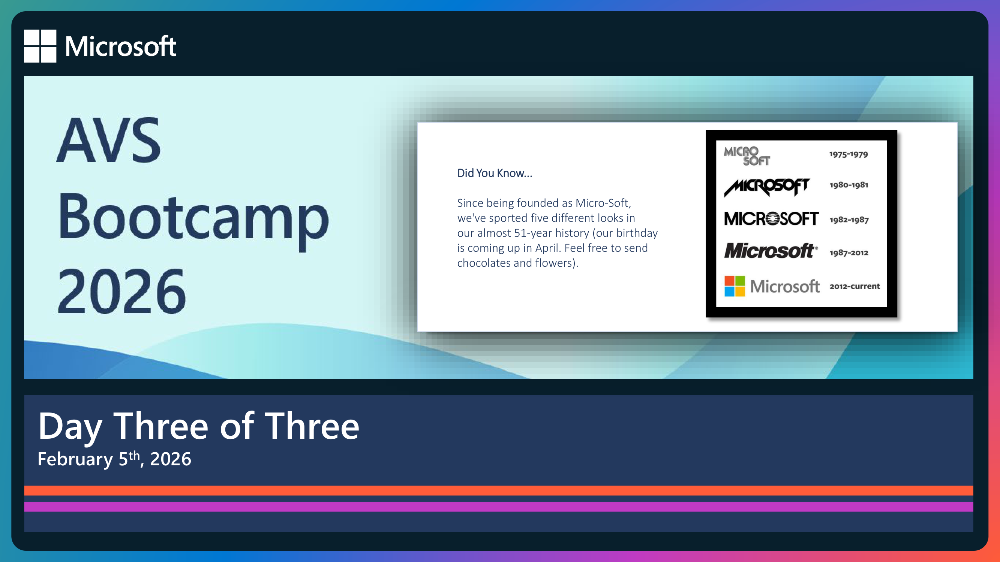

### Key Points

- Microsoft, originally founded as Micro-Soft, has undergone five different logo changes throughout its nearly 51-year history.
- The company’s official birthday is in April 2026.
- The current logo is considered by the speaker to be the best among the five.
- The presentation is part of ABS Boot Camp 2026, specifically the third and final day of the event.
- The session promises an action-packed agenda with notable topics and presenters.

### Details

- **Company History and Branding Evolution**: Microsoft was initially founded under the name "Micro-Soft." Over its almost 51 years of existence, the company has updated its logo five times, reflecting changes in branding and corporate identity.
- **Upcoming Anniversary**: Microsoft’s 51st anniversary is approaching in April 2026, marking over half a century since its founding.
- **Speaker’s Opinion on Logo**: The presenter expressed a personal view that the latest Microsoft logo is probably the best iteration to date, implying a positive reception of the current branding.
- **Context of Presentation**: This slide is part of the opening remarks on day three of the ABS Boot Camp 2026, welcoming attendees worldwide and setting the tone for a day filled with valuable content and expert presentations.
- **Tone and Engagement**: The speaker uses a friendly and informal tone, even humorously inviting attendees to send chocolates and flowers for the company’s birthday, which helps create a welcoming atmosphere.

### Definitions

- **Micro-Soft**: The original name of Microsoft at its founding, highlighting the company’s early identity before evolving into the global brand known today.

### Examples

- No specific practical examples or demonstrations were mentioned on this slide or in the narration.

### Key Takeaways 🎯

- Microsoft has a rich history spanning nearly 51 years, marked by five distinct logo designs.
- The company’s birthday is in April, a milestone that underscores its longevity and evolution.
- The current Microsoft logo is regarded positively by the presenter.
- This slide sets the stage for the final day of ABS Boot Camp 2026, emphasizing excitement and quality content ahead.

---

## Slide 2: PARTNER SKILLING HUB

**Timestamp**: 00:00:32 – 00:01:03

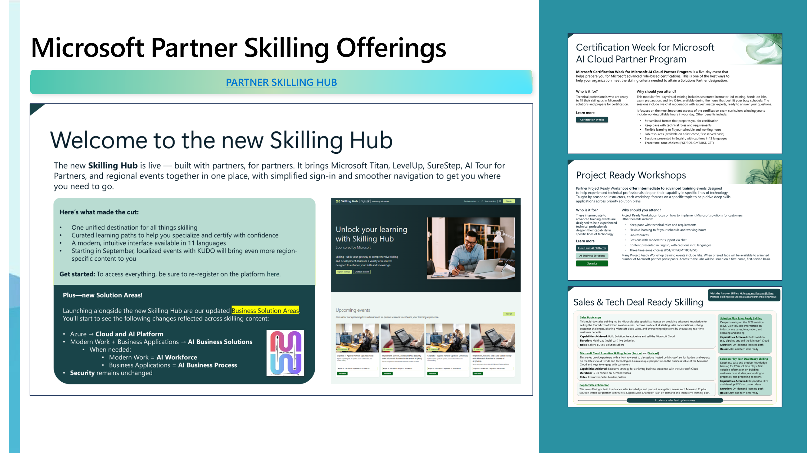

### Key Points

- Introduction and emphasis on the **Microsoft Partner Skilling Hub** as a central resource.
- The **Partner Skilling Hub** contains comprehensive skilling offerings for Microsoft partners.
- The resource has been consistently maintained since 2012.
- The hub includes all content covered in the current event and additional materials.

### Details

- The **Partner Skilling Hub** is positioned as the go-to platform for Microsoft partners seeking training and skill development.
- The speaker expresses a personal preference for the hub, highlighting its longstanding presence and reliability since 2012.
- The hub aggregates a wide range of skilling resources, including those discussed during the event, making it a one-stop shop for partner education.
- The speaker briefly acknowledges the hub without going into extensive detail, implying familiarity and encouraging attendees to explore it independently.
- This resource supports the broader goal of empowering Microsoft partners through continuous learning and skill enhancement.

### Definitions

- **Microsoft Partner Skilling Hub**: An online platform offering a comprehensive collection of training and skill development resources tailored for Microsoft partners, maintained since 2012.

### Examples

- No specific practical examples or demonstrations were mentioned in this segment.

### Key Takeaways 🎯

- The **Microsoft Partner Skilling Hub** is a vital, long-standing resource for partner training.
- It consolidates all training content from the event and much more.
- Partners are encouraged to utilize this hub to enhance their skills and stay updated.

---

## Slide 3: Session Time

**Timestamp**: 00:01:03 – 00:01:36

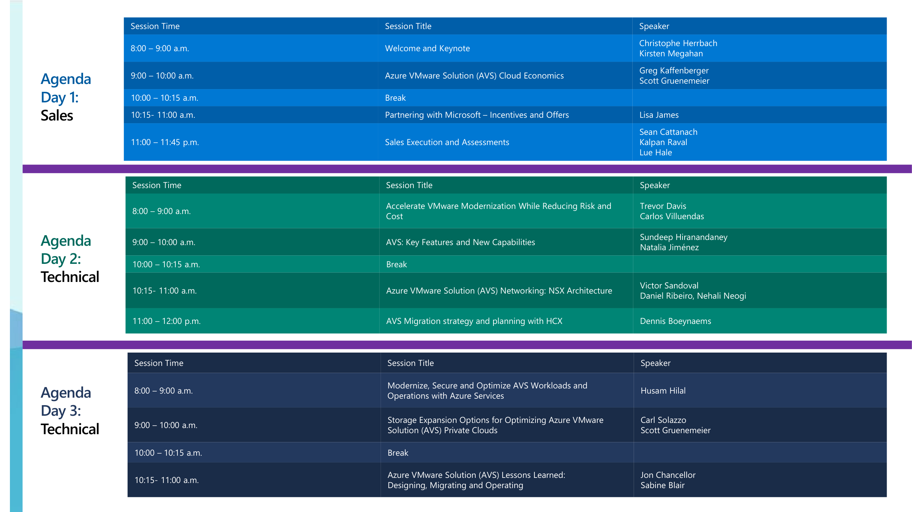

### Key Points

- The slide presents the detailed agenda for a multi-day event focused on Azure VMware Solution (AVS).
- The agenda is divided into three days with distinct themes: Day 1 (Sales), Day 2 (Technical), and Day 3 (Technical).
- Each day includes sessions with specific topics, times, and speakers.
- Day 3’s agenda includes sessions on modernizing, securing, and optimizing AVS workloads, storage expansion, and lessons learned.
- The speaker highlights that Days 1 and 2 have already occurred and their content will be available on demand.
- The speaker reminds attendees to use the Q&A panel for questions, as live verbal questions are not possible.

### Details

- **Agenda Overview:**
  - The event spans three days, each with a focused agenda:
    - **Day 1 (Sales):** Focuses on sales-related topics such as cloud economics, partnering incentives, and sales execution.
    - **Day 2 (Technical):** Covers technical deep dives into AVS modernization, networking, migration strategies, and planning.
    - **Day 3 (Technical):** Continues technical discussions with sessions on workload optimization, storage options, and lessons learned from AVS deployments.
  
- **Day 3 Sessions:**
  - **8:00 – 9:00 a.m.:** "Modernize, Secure and Optimize AVS Workloads and Operations with Azure Services" presented by Husam Hilal.
  - **9:00 – 10:00 a.m.:** "Storage Expansion Options for Optimizing Azure VMware Solution (AVS) Private Clouds" by Carl Solazzo and Scott Gruenemeier.
  - **10:00 – 10:15 a.m.:** Break.
  - **10:15 – 11:00 a.m.:** "Azure VMware Solution (AVS) Lessons Learned: Designing, Migrating and Operating" by Jon Chancellor and Sabine Blair.
  
- **Speaker’s Context:**
  - The speaker confirms that Days 1 and 2 content is already completed and will be accessible on demand, allowing attendees to catch up.
  - Day 3 will start shortly with Husam Hilal’s presentation.
  - There will be two presentations before a short break, followed by the final session of the day.
  - Attendees are encouraged to submit questions via the Q&A panel since live verbal questions are not possible.
  
- **Session Topics Summary:**
  - **Sales Day (Day 1):** Includes keynote, cloud economics, Microsoft partnership incentives, and sales execution strategies.
  - **Technical Day 2:** Focuses on VMware modernization, AVS key features, networking architecture, and migration strategies.
  - **Technical Day 3:** Emphasizes operational optimization, storage scalability, and practical lessons from AVS deployments.

### Definitions

- **Azure VMware Solution (AVS):** A Microsoft Azure service that enables customers to run VMware workloads natively on Azure infrastructure.
- **HCX:** Hybrid Cloud Extension, a VMware technology used for migration and workload mobility between on-premises and cloud environments.
- **NSX Architecture:** VMware’s network virtualization and security platform, critical for AVS networking.
- **Cloud Economics:** The financial and business considerations involved in adopting cloud services like AVS.

### Examples

- No specific practical examples or demonstrations were mentioned in the speaker’s narration or on the slide.

### Key Takeaways 🎯

- The event is structured over three days with clear focus areas: sales and technical deep dives.
- Day 3’s agenda includes important sessions on optimizing AVS workloads, expanding storage, and lessons learned from real-world AVS deployments.
- Attendees should use the Q&A panel for questions during the sessions.
- Content from Days 1 and 2 is available on demand, allowing flexible learning.
- The agenda reflects a comprehensive approach to understanding and leveraging Azure VMware Solution from sales, technical, operational, and strategic perspectives.

---

## Slide 4: Today: Technical

**Timestamp**: 00:01:36 – 00:02:12

### Key Points

- The session schedule for the technical day focuses on Azure VMware Solution (AVS) and related Azure services.
- Topics include modernization, security, optimization, storage expansion, and lessons learned in design, migration, and operations.
- The sessions are led by experts Husam Hilal, Carl Solazzo, Scott Gruenemeier, Jon Chancellor, and Sabine Blair.
- A break is scheduled between 10:00 and 10:15 a.m.
- The speaker encourages attendees to complete a survey to help improve content.
- Recorded sessions will be available on the Skilling Hub.
- Badges will be awarded for participation.

### Details

- **Session Schedule:**
  - **8:00 – 9:00 a.m.:** "Modernize, Secure and Optimize AVS Workloads and Operations with Azure Services" presented by Husam Hilal. This session likely covers how to leverage Azure services to enhance AVS workloads in terms of modernization, security, and operational efficiency.
  - **9:00 – 10:00 a.m.:** "Storage Expansion Options for Optimizing Azure VMware Solution (AVS) Private Clouds" presented by Carl Solazzo and Scott Gruenemeier. This session focuses on storage strategies to optimize AVS private cloud environments.
  - **10:00 – 10:15 a.m.:** Break.
  - **10:15 – 11:00 a.m.:** "Azure VMware Solution (AVS) Lessons Learned: Designing, Migrating and Operating" presented by Jon Chancellor and Sabine Blair. This session shares practical insights and lessons from real-world AVS deployments.

- **Speaker's Additional Notes:**
  - Attendees are encouraged to complete a survey to help Microsoft continue building valuable content.
  - The recorded versions of these sessions will be accessible on the Skilling Hub, allowing for later review.
  - Participation badges will be awarded, incentivizing engagement.
  - The speaker humorously mentioned "dogs wear free, cats are 50% off, kids full price," likely a lighthearted comment unrelated to technical content.
  - Attendees are asked to "mail that check in with your birthday present for us Microsofties," another humorous remark to keep the tone light.

### Definitions

- **Azure VMware Solution (AVS):** A Microsoft Azure service that enables customers to run VMware workloads natively on Azure infrastructure, combining VMware’s virtualization technology with Azure’s cloud capabilities.
- **Skilling Hub:** A Microsoft platform where recorded sessions and learning content are made available for skill development and certification.

### Examples

- No specific technical examples or demonstrations were mentioned in this slide or the speaker’s narration.

### Key Takeaways 🎯

- The day’s technical sessions focus on enhancing and optimizing Azure VMware Solution workloads through modernization, security, storage expansion, and operational best practices.
- Expert speakers will share both strategic and practical insights.
- Attendees should take advantage of the survey and recorded content on Skilling Hub to maximize learning.
- Participation is recognized through badges, encouraging active engagement.

---

## Slide 5: A few quick reminders

**Timestamp**: 00:01:03 – 00:02:12

### Key Points

- Use the Q&A panel to submit questions during the event.
- The session will be recorded and made available on Skilling Hub about one week after the event.
- Attendees are encouraged to complete the event survey to help improve future content.
- Sales badges will be awarded within five days post-event and can be shared on social media.
- Pricing note: Kids attend at full price; no discounts apply.

### Details

- **Q&A Panel Usage**:  
  Attendees should use the Q&A panel to ask questions during the session. The speaker clarified that questions cannot be asked live by unmuting oneself; all questions must be submitted through the panel. This ensures an organized and manageable Q&A process.

- **Recorded Session Availability**:  
  A recorded version of the event will be uploaded to the Skilling Hub platform approximately one week after the event concludes. This allows attendees to revisit the content or catch up if they missed parts of the live session.

- **Event Survey**:  
  To help the organizers continue creating valuable and relevant content, attendees are requested to complete the event survey. The survey is accessible via the taskbar in the training console. Feedback collected will guide improvements in future events.

- **Sales Badges**:  
  Participants will receive sales badges within five days after the event. The speaker encourages attendees to proudly display these badges on their social media profiles, highlighting their achievement and participation.

- **Pricing Clarification**:  
  The slide states that kids attend at full price with no discounts. The speaker humorously added some playful, nonsensical remarks about dogs and cats pricing ("dogs wear free, cats are 50% off") and joked about mailing a check with a birthday present for Microsoft employees. These comments are not to be taken literally but add a light-hearted tone.

### Definitions

- **Q&A Panel**: A feature in the training console or webinar platform where attendees can type and submit questions during the event instead of speaking live.

- **Skilling Hub**: The platform where recorded versions of training events and sessions are hosted for later viewing.

- **Sales Badges**: Digital or virtual badges awarded to participants recognizing their completion or participation in sales-related training events.

### Examples

- No specific practical examples or demonstrations were provided on this slide or in the narration. The speaker’s humorous mention of pets and birthday presents was a light-hearted aside rather than a practical example.

### Key Takeaways 🎯

- Always use the Q&A panel to ask questions during the event; live unmuting is not allowed.  
- The recorded session will be available on Skilling Hub about a week later for review.  
- Complete the event survey via the training console to help improve future content.  
- Sales badges will be awarded within five days—share them proudly on social media.  
- Kids attend at full price; no discounts apply.  

---

These reminders ensure smooth participation, access to content after the event, and engagement that helps improve future training sessions.

---

## Slide 6: AVS

**Timestamp**: 00:02:12 – 00:02:44

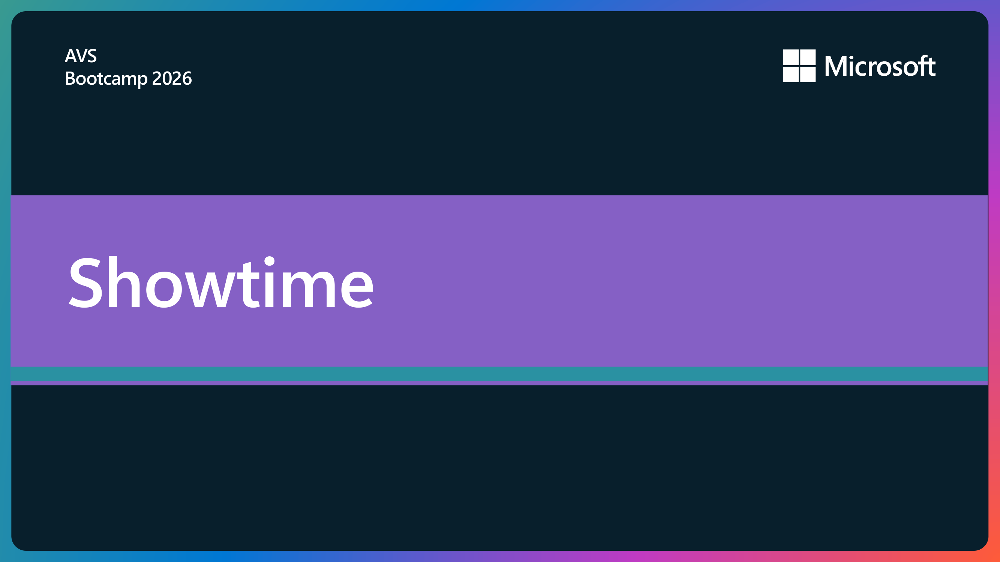

[Jump to 2:12](https://gtatepubliceus01.blob.core.windows.net/downloads/2026_AVS_Bootcamp_Day3.mp4#t=5025)

### Key Points

- Introduction to the AVS Bootcamp 2026 event.
- Transition of presentation from Tony to Hussam Hilal.
- Hussam Hilal’s role as a Partner Solution Architect at Microsoft.
- Setting the stage for day three of the AVS Bootcamp.

### Details

- The slide displays the title **"AVS Bootcamp 2026"**, indicating the event and year.
- The speaker, Tony, concludes his segment and hands over the presentation to Hussam Hilal.
- Hussam introduces himself as a **Partner Solution Architect** at Microsoft, emphasizing his role in working closely with partners.
- This marks the beginning of day three of the AVS Bootcamp, suggesting a multi-day training or informational event focused on AVS (Azure VMware Solution).
- Hussam expresses enthusiasm and gratitude for the attendees’ participation, setting a positive tone for the session.

### Definitions

- **AVS (Azure VMware Solution)**: Although not explicitly defined in this slide or narration, AVS generally refers to Microsoft’s service that allows running VMware workloads natively on Azure infrastructure.
- **Partner Solution Architect**: A Microsoft role focused on collaborating with partners to design and implement technical solutions leveraging Microsoft technologies.

### Examples

- No specific examples or demonstrations were provided in this segment.

### Key Takeaways 🎯

- The AVS Bootcamp 2026 is underway, now entering day three.
- Hussam Hilal, a Partner Solution Architect at Microsoft, is the new presenter.
- The session is positioned as a collaborative and informative event for partners and attendees interested in AVS.

---

## Slide 7: Modernize, Secure and Optimize AVS Workloads

**Timestamp**: 00:02:44 – 00:03:14

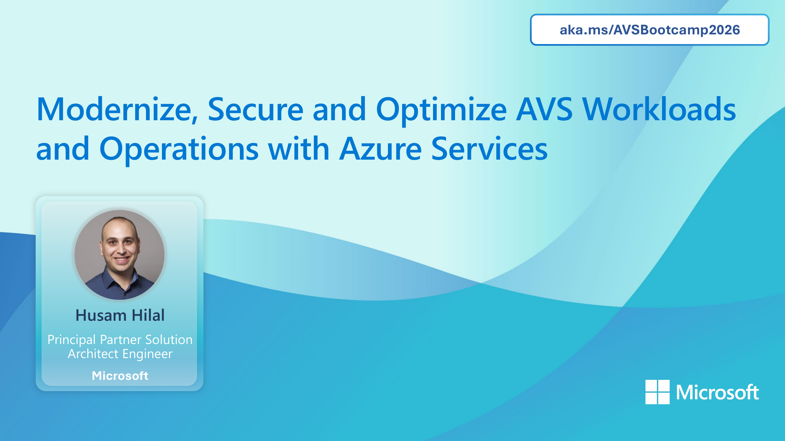

### Key Points

- Focus on modernizing, securing, and optimizing Azure VMware Solution (AVS) workloads and operations.
- Emphasis on leveraging Azure services to enhance AVS environments.
- Integration between AVS workloads and Azure native services is a core theme.
- Speaker has extensive experience (around four years) working with AVS.
- The session will explore practical ways to improve AVS workloads post-migration.

### Details

- The slide title highlights three main objectives for AVS workloads and operations: **Modernize**, **Secure**, and **Optimize**.
- Husam Hilal, a Principal Partner Solution Architect Engineer at Microsoft, is the presenter, indicating expertise and authority on the topic.
- The focus is on how Azure services can be used to enhance AVS workloads once they are migrated.
- The speaker stresses the importance of integration capabilities between AVS and Azure services, suggesting that these integrations unlock new possibilities for workload management and operational efficiency.
- The phrase “very close to my heart” suggests a personal and professional passion for AVS and its modernization journey.
- The session will likely cover practical guidance and strategies to leverage Azure services for AVS environments, although specific services or methods are not detailed on this slide.
- The URL aka.ms/AVSBootcamp2026 is provided as a resource, possibly for further learning or session materials.

### Definitions

- **Azure VMware Solution (AVS)**: A Microsoft Azure service that allows organizations to run VMware workloads natively on Azure infrastructure, enabling seamless migration and hybrid cloud scenarios.
- **Modernize**: The process of updating and improving workloads and operations to take advantage of new technologies and capabilities.
- **Secure**: Implementing measures and controls to protect workloads and data within AVS environments.
- **Optimize**: Enhancing performance, cost-efficiency, and operational effectiveness of AVS workloads.

### Examples

- No specific examples or demonstrations were mentioned in this segment of the presentation.

### Key Takeaways 🎯

- The session will focus on how to **modernize, secure, and optimize** AVS workloads using Azure services.
- Integration between AVS and Azure services is a key enabler for these improvements.
- The speaker brings significant experience with AVS, promising in-depth insights.
- Understanding how to leverage Azure services post-migration is critical for maximizing the value of AVS deployments.

---

## Slide 8: Session

**Timestamp**: 00:03:14 – 00:03:51

### Key Points

- Overview of the session agenda covering modernization motivations and practical integrations.
- Focus on managing and securing workloads on Azure VMware Solution (AVS) using Azure Arc and Defender.
- Multiple demos illustrating key concepts: Arc-enabled workloads with Defender, private connectivity for secure Azure attachment, database migration and app modernization, and AI-enabled AVS-hosted applications.
- Emphasis on private connectivity to securely attach AVS workloads to Azure services.
- Provision of continuous learning resources and a Q&A session to maximize attendee engagement.

### Details

- The session begins with an **Introduction** and discussion on **Modernization Motivations**, explaining why organizations consider modernizing their workloads.
- Next, the session covers **Manage workloads with Arc**, demonstrating how Azure Arc can be used to integrate and manage AVS workloads within Azure’s management framework.
- The topic of **Secure AVS Workloads** follows, highlighting the use of **Microsoft Defender** to enhance security for workloads running on AVS.
- **Demo #1** will showcase Arc-enabled workloads combined with Defender, providing a practical example of securing and managing AVS workloads.
- The agenda then moves to **Private Connectivity – Attaching to Azure**, explaining how to securely connect AVS environments to Azure services, ensuring secure and reliable communication.
- **Demo #2** focuses on **Database migration and application modernization**, illustrating practical steps to migrate databases and modernize applications running on AVS.
- The session continues with **Demo #3**, which demonstrates how to **AI-enable AVS-hosted applications**, showing integration of AI capabilities into workloads hosted on AVS.
- Finally, the session will wrap up by sharing **resources for continuous learning**, enabling attendees to deepen their knowledge post-session.
- The event concludes with a **Questions** segment, encouraging attendees to submit questions via chat for interactive engagement.

### Definitions

- **Azure VMware Solution (AVS)**: A Microsoft Azure service that allows running VMware workloads natively on Azure infrastructure.
- **Azure Arc**: A management tool that extends Azure management and services to on-premises, multi-cloud, and edge environments, enabling centralized governance and control.
- **Microsoft Defender**: A security solution integrated with Azure services to provide threat protection and security management for workloads.
- **Private Connectivity**: Secure network connections that link AVS environments directly to Azure services without traversing the public internet, enhancing security and performance.

### Examples

- **Demo #1**: Showcasing how to enable and manage AVS workloads using Azure Arc combined with Microsoft Defender for security.
- **Demo #2**: Illustrating database migration and application modernization processes on AVS.
- **Demo #3**: Demonstrating the integration of AI capabilities into applications hosted on AVS.

### Key Takeaways 🎯

- The session is structured to provide both conceptual understanding and hands-on demonstrations related to modernizing workloads on AVS.
- Azure Arc and Microsoft Defender play critical roles in managing and securing AVS workloads.
- Private connectivity is essential for securely attaching AVS environments to Azure services.
- Practical demos will cover workload management, security, migration, modernization, and AI enablement.
- Attendees will receive resources for ongoing learning and have opportunities to ask questions for clarification and deeper understanding.

---

## Slide 9: Modernization

**Timestamp**: 00:03:51 – 00:04:26

### Key Points

- The focus of this session is on the motivations behind modernization.
- The discussion centers on the fifth stage of the migration journey to Azure VMware Solution (AVS).
- Prior stages include customer onboarding, migration planning, environment provisioning, connectivity setup, and workload migration.
- The current emphasis is on integrating Azure native services with workloads running on AVS.
- This integration represents the final step in the migration and modernization process covered in the session.

### Details

- The session is structured around a five-stage journey for customers adopting AVS:
  1. Customer onboarding and initial migration planning.
  2. Sizing and provisioning the AVS environment.
  3. Establishing connectivity between on-premises infrastructure and AVS.
  4. Migrating workloads using VMware HCX.
  5. Attaching or integrating Azure services to workloads now running on AVS.
- At this point in the journey, workloads have been successfully migrated and are operational within the AVS environment.
- The speaker emphasizes that the current session (the first hour of the AVS bootcamp) will concentrate on stage five — the modernization motivations and how Azure services can be leveraged alongside AVS workloads.
- This stage is critical because it enables customers to extend and enhance their migrated applications by utilizing Azure’s native capabilities, thus achieving modernization beyond simple migration.

### Definitions

- **Azure VMware Solution (AVS)**: A Microsoft Azure service that allows customers to run VMware workloads natively on Azure infrastructure.
- **VMware HCX**: A tool used to migrate workloads from on-premises VMware environments to AVS.
- **Modernization Motivations**: The reasons and drivers behind extending and enhancing migrated workloads by integrating Azure native services after migration to AVS.

### Examples

- No specific practical examples or demonstrations were provided in this segment; the speaker outlined the overall journey and the focus on the final stage of modernization.

### Key Takeaways 🎯

- Modernization motivations refer to the benefits and reasons for integrating Azure services with workloads running on AVS.
- The session focuses on the final stage of the migration journey, where workloads are already migrated and operational in AVS.
- Understanding how to attach Azure services to AVS workloads is essential for achieving full modernization beyond migration.
- This step enables customers to leverage Azure’s cloud-native capabilities to enhance their existing VMware workloads.

---

## Slide 10: Efficiently migrate while maintaining operational consistency

**Timestamp**: 00:04:26 – 00:13:41

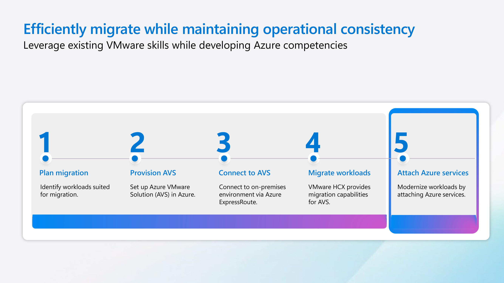

### Key Points

- Efficient migration to Azure VMware Solution (AVS) while maintaining operational consistency.
- Leverage existing VMware skills and develop Azure competencies.
- Identify workloads suitable for migration.
- Set up AVS in Azure and connect it to on-premises environments via Azure ExpressRoute.
- Use VMware HCX for migration capabilities.
- Follow migration phases: Plan migration, Provision AVS, Connect to AVS, Migrate workloads, Attach Azure services.
- Modernize workloads by integrating Azure native services to optimize cost and innovation.
- Integration occurs at two layers: AVS infrastructure level and VM workload level.
- Security and governance are integral throughout the migration and modernization process.

### Details

- **Migration Strategy and Operational Consistency**:  
  The slide emphasizes migrating VMware workloads to AVS efficiently without disrupting existing operations. This allows organizations to retain their VMware environment while gaining Azure benefits.

- **Leveraging Skills and Competencies**:  
  Organizations can use their existing VMware expertise while simultaneously developing skills in Azure services, enabling a smoother transition and hybrid operational model.

- **Workload Identification**:  
  It is important to assess and identify which workloads are suitable for migration to AVS. This involves workload assessment tools and planning.

- **Setting up AVS**:  
  AVS is provisioned within Azure, requiring integration with Azure networking components such as ExpressRoute, route servers, virtual gateways, and Azure Virtual WAN (VWAN). This setup ensures private, high-bandwidth, low-latency connectivity between on-premises and AVS environments.

- **Connectivity via Azure ExpressRoute**:  
  ExpressRoute provides private, secure connectivity between on-premises data centers and AVS, avoiding internet exposure and ensuring data stays within Azure boundaries.

- **Migration Tools - VMware HCX**:  
  VMware HCX is used to migrate VMs from on-premises VMware environments to AVS, facilitating rehosting (lift-and-shift) of workloads.

- **Migration Phases (6 Rs Framework)**:  
  The slide references the migration lifecycle:  
  1. Plan migration  
  2. Provision AVS  
  3. Connect to AVS  
  4. Migrate workloads (rehost)  
  5. Attach Azure services (modernize)  
  This approach supports gradual modernization while maintaining operational continuity.

- **Modernization by Attaching Azure Services**:  
  Once workloads run on AVS, they can be modernized by integrating Azure services such as:  
  - Azure Storage (Blob, Files, Data Lake)  
  - Azure SQL Managed Instance and Cosmos DB  
  - Azure Kubernetes Service (AKS)  
  - Azure AI and OpenAI services  
  - Azure Defender for Cloud for security  
  - Azure Arc for hybrid management and governance  
  This integration enables cost optimization, reduces technical debt, and accelerates innovation.

- **Two Integration Layers**:  
  - **Infrastructure Layer**: Core Azure services integrated at the AVS cluster/host level (networking, storage expansion, security).  
  - **Workload Layer**: VMs running on AVS can be enhanced by attaching Azure services directly (security, storage, AI, monitoring).

- **Storage Expansion Options**:  
  AVS supports decoupling storage from compute by attaching external Azure storage solutions such as Azure NetApp Files, Azure Elastic SAN, and Pure Storage Cloud. This allows scaling storage independently from AVS nodes, optimizing costs.

- **Security Integration**:  
  Security is embedded at every layer:  
  - Identity and access management with Azure AD, conditional access, MFA  
  - Data protection with encryption, Azure Key Vault, confidential computing  
  - Network security with Azure Firewall, Virtual WAN, Private Link  
  - Threat protection with Defender for Cloud, Defender for Servers, Azure DDoS Protection  
  - Security management and monitoring with Microsoft Sentinel, Azure Monitor, Azure Advisor

- **Cost Optimization and Gradual Modernization**:  
  Modernizing workloads by moving certain components to Azure services reduces the need for large AVS node deployments, lowering costs. This can be done gradually without immediately offloading all workloads from AVS.

- **Broader Azure Ecosystem**:  
  AVS workloads can integrate with over 200 Azure services, including emerging platforms like Microsoft Fabric for data and AI analytics, enabling extensive modernization possibilities.

### Definitions

- **Azure VMware Solution (AVS)**: A Microsoft Azure service that allows organizations to run VMware workloads natively on Azure infrastructure, enabling seamless migration and hybrid cloud operations.

- **Azure ExpressRoute**: A private, dedicated network connection between on-premises infrastructure and Azure, providing secure, high-throughput, low-latency connectivity without traversing the public internet.

- **VMware HCX**: A VMware tool that facilitates live migration and bulk migration of VMs from on-premises VMware environments to AVS.

- **6 Rs of Migration**: A framework describing migration strategies: Rehost, Refactor, Rearchitect, Rebuild, Replace, Retain.

- **Azure Arc**: A service that extends Azure management and governance capabilities to on-premises, multi-cloud, and edge environments, including AVS.

- **Azure Defender for Cloud**: A cloud-native security solution providing threat protection and security posture management for Azure resources and hybrid environments.

- **Azure NetApp Files, Azure Elastic SAN, Pure Storage Cloud**: Azure storage solutions that can be attached to AVS to expand storage capacity independently from compute nodes.

### Examples

- **Integration with Azure Services**:  
  - Running AVS private cloud and Azure services in the same Azure Availability Zone to achieve low latency and high bandwidth connectivity.  
  - Attaching VMs running on AVS to Azure Storage Files or Blob storage for additional storage needs.  
  - Using Azure SQL Managed Instance as a target for migrating Microsoft SQL Server workloads from AVS.  
  - Leveraging Azure Arc to manage and govern VMs running on AVS.  
  - Employing Azure Defender for Cloud and Azure Firewall to secure AVS workloads.

- **Storage Expansion**:  
  Instead of adding more AVS nodes just to increase storage, organizations can attach external storage solutions like Azure NetApp Files or Pure Storage Cloud to AVS clusters.

- **Security Layering**:  
  Using Azure AD for identity management, Azure Key Vault for encryption keys, and Azure DDoS Protection to safeguard AVS workloads.

### Key Takeaways 🎯

- Migrating VMware workloads to AVS enables operational consistency while leveraging existing VMware skills and gaining Azure capabilities.  
- Migration involves planning, provisioning AVS, connecting via ExpressRoute, migrating workloads with VMware HCX, and modernizing by attaching Azure services.  
- AVS integrates with Azure at both infrastructure and workload levels, enabling modernization, cost optimization, and enhanced security.  
- Storage and security are decoupled and enhanced through Azure native services, allowing flexible scaling and robust protection.  
- Gradual modernization is possible, allowing workloads to remain on AVS while progressively adopting Azure services.  
- Understanding the integration points and available Azure services is key to maximizing the benefits of AVS migration and modernization.

---

## Slide 11: Seamless Innovation with Azure Services

**Timestamp**: 00:25:58 – 00:31:09

### Key Points

- Azure VMware Solution (AVS) integrates seamlessly with Azure services using high bandwidth, low latency, and private connectivity.
- Gen 1 AVS connects to Azure Virtual Network or Virtual WAN Hub via ExpressRoute with optional FastPath for enhanced performance.
- Leveraging Azure Availability Zones improves latency and bandwidth by co-locating AVS and Azure services.
- Private Endpoints and subnet delegation enable secure, private IP-based access to Azure services from AVS without internet exposure.
- Application Gateway provides secure, layer 7 load balancing with Web Application Firewall (WAF) capabilities for AVS workloads exposed externally.
- Gen 2 AVS is deployed inside an Azure Virtual Network, enabling VNet peering for more secure, scalable, and performant connectivity.
- Application Gateway is currently the only Azure load balancer that supports pointing to IP addresses, making it uniquely compatible with AVS.
- Additional third-party load balancers (F5, Palo Alto, Check Point) are available via Azure Marketplace for advanced needs.

### Details

- **AVS Integration Architecture (Gen 1):**
  - AVS runs as a separate environment connected to Azure resources through ExpressRoute.
  - ExpressRoute provides private, dedicated connectivity between AVS and Azure Virtual Network or Virtual WAN Hub.
  - Enabling FastPath on ExpressRoute enhances bandwidth and reduces latency.
  - Co-locating AVS and Azure services in the same **Availability Zone** further reduces latency and increases bandwidth.
  
- **Private Connectivity:**
  - **Private Endpoints** create network adapters with private IP addresses for Azure services (e.g., Storage, SQL, OpenAI), allowing AVS VMs to communicate securely within Azure’s private network.
  - This avoids internet traversal, enhancing security and performance.
  - **Subnet delegation** similarly allows private access to services like Azure NetApp Files.
  
- **External Access and Security:**
  - To expose AVS-hosted applications securely to the internet, use **Azure Application Gateway**.
  - Application Gateway functions as a **Layer 7 load balancer** with integrated **Web Application Firewall (WAF)**.
  - Backend pools in Application Gateway can include AVS VM IP addresses, enabling direct, secure routing of traffic.
  - This setup is demonstrated in one of the presentation’s demos.
  
- **AVS Gen 2 Enhancements:**
  - AVS is deployed inside an Azure Virtual Network (VNet) via delegation, no longer siloed.
  - Connectivity to other Azure services uses **VNet peering** (VNet-to-VNet or VNet-to-Virtual WAN Hub).
  - This internal Azure network communication is more secure, scalable, and performant.
  - All previous concepts (availability zones, private endpoints, subnet delegation, application gateway) still apply.
  
- **Load Balancing Notes:**
  - Application Gateway is the only Azure load balancer that supports pointing to IP addresses, making it suitable for AVS.
  - For other load balancing needs, third-party solutions like F5, Palo Alto, and Check Point are available in Azure Marketplace and can integrate with AVS.

### Definitions

- **Azure VMware Solution (AVS)**: A service that allows running VMware workloads natively on Azure infrastructure.
- **ExpressRoute**: A private, dedicated network connection between on-premises or AVS environments and Azure.
- **FastPath**: An ExpressRoute feature that improves network performance by bypassing certain routing layers.
- **Availability Zone**: Physically separate locations within an Azure region to improve availability and reduce latency.
- **Private Endpoint**: A network interface with a private IP address that connects you privately and securely to a service powered by Azure Private Link.
- **Subnet Delegation**: Assigning a subnet to a specific Azure service to enable private access.
- **Application Gateway**: An Azure Layer 7 load balancer with integrated Web Application Firewall capabilities.
- **Virtual Network (VNet) Peering**: Connecting two Azure VNets to enable direct, private IP communication.

### Examples

- Using Private Endpoints to connect AVS VMs to Azure Storage or SQL services via private IP addresses, ensuring no internet traffic.
- Configuring Application Gateway’s backend pool with AVS VM IP addresses to securely route external traffic to AVS-hosted applications.
- Demonstration mentioned in the presentation showing Application Gateway integration with AVS.
- Gen 2 AVS deployed inside a VNet, connected via VNet peering to other Azure services for improved security and performance.

### Key Takeaways 🎯

- AVS offers seamless, secure, and high-performance integration with Azure services through private connectivity options like ExpressRoute, private endpoints, and VNet peering.
- Leveraging Azure Availability Zones and private networking features significantly reduces latency and improves bandwidth.
- Application Gateway is the primary Azure load balancer compatible with AVS IP-based backend pools, providing secure external access with WAF.
- Gen 2 AVS improves upon Gen 1 by deploying AVS inside an Azure VNet, enabling more scalable and secure network integration.
- For advanced load balancing needs beyond Application Gateway, third-party solutions are available in Azure Marketplace.

---

## Slide 12: Networking

**Timestamp**: 00:13:41 – 00:14:51

### Key Points

- Azure VMware Solution (AVS) integrates with over 200 native Azure services across multiple domains.
- Key integration areas include Networking, Governance, Migration, Operations & Management, Storage, Security, Backup & Disaster Recovery (BCDR), AI Modernization, and Application services.
- Networking services ensure secure and private connectivity, including Virtual WAN, Private Link, Azure Firewall, and Azure DDoS Protection.
- Security is enhanced with Defender for Cloud, Defender for Servers, Microsoft Anti-Malware, and security management tools like Microsoft Sentinel.
- Operations and management tools such as Azure Monitor, Azure Advisor, and log analytics help monitor and optimize AVS environments.
- Migration tools include Migrate Assessment, VMware HCX, and third-party solutions.
- Storage options include Elastic SAN, NetApp Files, Pure Storage Cloud, and third-party solutions.
- AI and modernization services like GitHub Copilot, Azure Copilot, Azure Migrate, and AI/ML services support workload modernization on AVS.
- The slide and narration emphasize that this list is illustrative, not exhaustive.

### Details

- **Networking**:  
  - AVS supports integration with Azure networking services to provide secure, private, and optimized connectivity.  
  - **Virtual WAN** enables global transit network architecture for AVS workloads.  
  - **Private Endpoint (Private Link)** ensures private connectivity between AVS and Azure services, avoiding exposure to the public internet.  
  - **Azure Firewall** provides a managed, cloud-based network security service to protect AVS environments from threats.  
  - **Azure DDoS Protection** safeguards AVS workloads against distributed denial-of-service attacks.  

- **Governance**:  
  - Policy management and automation tools help enforce compliance and streamline operations within AVS.  
  - **Update Manager** automates patching and updates for AVS workloads.  

- **Migration**:  
  - Tools like **Migrate Assessment** and **VMware HCX** facilitate assessment and migration of workloads into AVS.  
  - Third-party migration tools can also be integrated.  

- **Operations & Management**:  
  - **Arc-enabled vSphere** and **Arc-enabled servers** extend Azure management capabilities to on-premises and AVS environments.  
  - **Lighthouse** provides centralized management across multiple AVS instances or tenants.  
  - **Azure Monitor** and **log analytics** enable monitoring and diagnostics of AVS workloads and infrastructure.  
  - **Azure Advisor** offers recommendations to optimize AVS environments.  

- **Storage**:  
  - AVS supports integration with Azure native storage services such as **Elastic SAN**, **NetApp Files**, and **Pure Storage Cloud**.  
  - Third-party storage solutions are also supported.  

- **Security**:  
  - **Defender for Cloud** and **Defender for Servers** provide threat detection and security posture management for AVS workloads.  
  - **Microsoft Anti-Malware** protects against malware threats.  
  - Security Incident and Event Management (SIEM) tools like **Microsoft Sentinel** help with security monitoring and incident response.  
  - **Bastion** provides secure and seamless RDP/SSH connectivity to AVS VMs without exposing them publicly.  

- **Backup and Disaster Recovery (BCDR)**:  
  - Azure Backup and **Site Recovery** services ensure data protection and business continuity for AVS workloads.  
  - Third-party BCDR solutions can also be integrated.  

- **AI Modernization and Application Services**:  
  - AVS workloads can leverage AI and machine learning services such as **GitHub Copilot**, **Azure Copilot**, and **AI/ML** services for modernization.  
  - Application modernization is supported via services like **Azure Kubernetes Service (AKS)**, **App Service**, **Application Gateway**, **Containers Registry**, and **Key Vault**.  
  - Database modernization options include **Oracle DB@Azure**, **SQL Managed Instance (SQL MI)**, **Cosmos DB**, and others.  
  - Microsoft Fabric and Foundry are also part of the broader ecosystem for application and data modernization.  

- **Integration Scope**:  
  - The slide clarifies that the listed services are examples to demonstrate the breadth of Azure services that can integrate with AVS, not a complete list.  
  - AVS enables customers to modernize and secure VMware workloads by leveraging the extensive Azure ecosystem.  

### Definitions

- **Azure VMware Solution (AVS)**: A Microsoft Azure service that allows customers to run VMware workloads natively on Azure infrastructure, integrating with Azure services.  
- **Virtual WAN**: A networking service that provides optimized and automated branch connectivity to Azure and on-premises networks.  
- **Private Endpoint (Private Link)**: A network interface that connects you privately and securely to a service powered by Azure Private Link.  
- **Azure Firewall**: A managed, cloud-based network security service that protects Azure Virtual Network resources.  
- **Defender for Cloud**: A unified security management system that provides threat protection across Azure workloads.  
- **Microsoft Sentinel**: A cloud-native Security Information and Event Management (SIEM) system for intelligent security analytics and threat intelligence.  
- **VMware HCX**: A hybrid cloud extension technology that facilitates workload migration and mobility between on-premises VMware environments and AVS.  
- **Azure Monitor**: A platform service that provides full-stack monitoring for applications and infrastructure.  
- **Azure Advisor**: A personalized cloud consultant that helps optimize Azure resources for high availability, security, performance, and cost.  
- **Bastion**: A fully managed PaaS service that provides secure and seamless RDP/SSH connectivity to virtual machines directly in the Azure portal without exposing them publicly.  

### Examples

- Using **Virtual WAN** and **Private Link** to establish private, secure connectivity between AVS workloads and other Azure services, avoiding exposure to the public internet.  
- Deploying **Azure Firewall** to protect AVS workloads from network-based attacks.  
- Leveraging **Defender for Cloud** and **Microsoft Sentinel** to monitor and protect AVS workloads against threats and to analyze security logs.  
- Utilizing **VMware HCX** to migrate on-premises VMware workloads into AVS with minimal downtime.  
- Applying **Azure Monitor** and **Azure Advisor** to continuously monitor AVS environments and receive optimization recommendations.  

### Key Takeaways 🎯

- AVS seamlessly integrates with a broad range of Azure services, enabling secure, manageable, and modernized VMware workloads in the cloud.  
- Networking and security services are foundational to protecting AVS environments, including private connectivity, firewalls, and threat protection tools.  
- Operations and management tools provide visibility, monitoring, and automation to optimize AVS workloads.  
- Migration tools simplify moving existing VMware workloads to AVS.  
- Storage, backup, and disaster recovery services ensure data resilience and business continuity.  
- AI and application modernization services enable innovation on top of AVS workloads.  
- This slide highlights common integration examples but is not exhaustive—AVS supports integration with over 200 Azure services.

---

## Slide 13: How AVS integrates with other Azure services

**Timestamp**: 00:25:58 – 00:26:28

### Key Points

- Azure VMware Solution (AVS) integrates with a wide range of Azure services to support and modernize workloads running inside the AVS Private Cloud.
- Integration occurs at multiple layers: within the AVS Private Cloud workloads (VMs) and at the hypervisor cluster/host layer.
- Common Azure services used with AVS include security, networking, storage, backup, database, and AI services.
- The slide illustrates examples of these integrations but is not an exhaustive list.
- The AVS shown is Generation 1, with Generation 2 to be discussed later.

### Details

- **Azure VMware Solution (AVS) Private Cloud**: This is the core VMware environment hosted on Azure infrastructure, allowing customers to run VMware workloads natively on Azure.
  
- **Integration with Azure Services**:
  - **Workload-level integrations (VMs inside AVS Private Cloud)**:
    - **Defender for Cloud**: Provides security and threat protection for workloads running inside AVS.
    - **Application Gateway**: Offers application-level routing and load balancing for applications hosted on AVS VMs.
    - **Azure Backup**: Enables backup and recovery of data and VMs running inside AVS.
    - **Private Endpoint**: Allows secure, private connectivity to Azure services from AVS workloads.
    - **Storage Account**: Provides scalable storage options accessible by AVS workloads.
    - **SQL Managed Instance**: Managed SQL database service that can be integrated with AVS workloads.
    - **OpenAI Services**: AI and machine learning services that can be leveraged by applications running on AVS.
    - **Arc-enabled Servers**: Extends Azure management and governance to VMs running inside AVS.
    - The slide notes there are many other services that can integrate similarly.

  - **Core environment and infrastructure-level integrations**:
    - **Storage Options**: Various Azure storage services supporting AVS infrastructure.
    - **Gateway**: Network gateways facilitating connectivity.
    - **ExpressRoute**: Dedicated private network connection between on-premises environments and Azure, supporting AVS connectivity.
    - **Virtual Network (VNet)**: Azure networking construct that AVS integrates with for network segmentation and security.
    - **Virtual WAN (vWAN)**: Azure networking service for large-scale branch connectivity, usable with AVS.
    - **Route Server**: Simplifies dynamic routing between AVS and Azure network.
    - **Monitor**: Azure monitoring services for observability of AVS environments.
    - **Arc-enabled vSphere**: Extends Azure Arc management to the vSphere hypervisor layer.
    - **3rd party services**: Additional integrations at the hypervisor cluster or host level, beyond native Azure services.

- **Speaker’s Context**:
  - The speaker points out that the diagram shows AVS on the far right, representing the Gen 1 AVS environment.
  - The Azure environment and resources shown are those deployed within Azure alongside AVS.
  - The speaker intends to cover Gen 2 AVS later, noting that the integration story is similar.
  - The slide aims to demonstrate common examples of integration rather than an exhaustive list.

### Definitions

- **Azure VMware Solution (AVS)**: A Microsoft Azure service that allows customers to run VMware workloads natively on Azure infrastructure, providing a private cloud environment managed by VMware technologies.
- **Defender for Cloud**: Azure’s security management and threat protection service for cloud workloads.
- **Private Endpoint**: A network interface that connects you privately and securely to a service powered by Azure Private Link.
- **Arc-enabled Servers**: Azure Arc extends Azure management capabilities to servers running outside of Azure, including on-premises or other clouds.
- **ExpressRoute**: A service that provides a private connection between an organization’s on-premises infrastructure and Azure datacenters.
- **Virtual Network (VNet)**: A fundamental building block for private networks in Azure, enabling secure communication between Azure resources.
- **Virtual WAN (vWAN)**: A networking service that provides optimized and automated branch connectivity to Azure.
- **Route Server**: A service that simplifies dynamic routing between network appliances and Azure virtual networks.

### Examples

- The slide lists specific Azure services integrated with AVS workloads, such as using Azure Backup to protect VMs running inside the AVS Private Cloud.
- Application Gateway can be used to manage traffic for applications hosted on AVS VMs.
- OpenAI Services can be leveraged by applications running on AVS to add AI capabilities.
- Arc-enabled Servers allow centralized management of AVS VMs alongside other Azure and hybrid resources.

### Key Takeaways 🎯

- AVS integrates deeply with many Azure services at both the workload and infrastructure layers to provide a comprehensive hybrid cloud environment.
- These integrations enable modernization, security, backup, networking, and management capabilities for VMware workloads running on Azure.
- The slide illustrates common examples but is not exhaustive; many other Azure and third-party services can also integrate with AVS.
- Understanding these integrations is key to leveraging AVS effectively within an Azure environment.
- The current focus is on Gen 1 AVS, with Gen 2 to be discussed subsequently.

---

## Slide 14: Secure and defend your apps and data

**Timestamp**: 00:13:41 – 00:14:51

### Key Points

- Comprehensive security framework for apps and data in Azure environments.
- Identity and access management features to control and protect user access.
- Data protection mechanisms including encryption and confidential computing.
- Network security services to ensure secure connectivity and prevent attacks.
- Threat protection tools to detect and mitigate security threats.
- Security management and monitoring solutions for ongoing security posture management.
- Integration of these security services with Azure VMware Solution (AVS) environments.

### Details

- **Identity and Access Management**  
  - Microsoft Entra ID provides identity protection capabilities.  
  - Multi-factor authentication (MFA) enhances login security by requiring multiple verification methods.  
  - Role-based access control (RBAC) allows fine-grained permissions assignment to users and services.  
  - Managed Identities simplify secure access to Azure resources without managing credentials manually.

- **Data Protection**  
  - Encryption is applied at multiple levels: disks, storage accounts, and SQL databases to protect data at rest.  
  - Azure Key Vault securely stores cryptographic keys and secrets used for encryption.  
  - Azure confidential computing provides hardware-based trusted execution environments to protect data in use.  
  - Azure Files and Azure NetApp Files offer built-in data protection capabilities for file storage.

- **Network Security**  
  - ExpressRoute enables private, dedicated network connections to Azure, bypassing the public internet.  
  - Virtual WAN facilitates global transit network architecture, simplifying connectivity and security.  
  - Private Link ensures private connectivity between Azure services, preventing exposure to the public internet.  
  - Route Server and Virtual Gateway support network routing and secure VPN connectivity.  
  - Azure Firewall provides a managed, cloud-based network security service to protect Azure Virtual Networks.

- **Threat Protection**  
  - Microsoft Defender for Cloud offers unified security management and threat protection across Azure resources.  
  - Defender for Servers extends threat detection and response capabilities to virtual machines.  
  - Microsoft Antimalware for Azure protects VMs against malware threats.  
  - Azure DDoS Protection defends against distributed denial-of-service attacks.

- **Security Management and Monitoring**  
  - Log Analytics collects and analyzes security logs and telemetry data.  
  - EventHub enables event ingestion and streaming for security monitoring.  
  - Azure Monitor provides comprehensive monitoring of Azure resources and workloads.  
  - Azure Advisor offers personalized recommendations to improve security posture and performance.  
  - Microsoft Sentinel is a cloud-native Security Information and Event Management (SIEM) tool that aggregates security data and enables threat detection and response.

- **Integration with Azure VMware Solution (AVS)**  
  - All these security services can be integrated with AVS environments, allowing consistent security management even for workloads running on VMware infrastructure hosted in Azure.  
  - This integration ensures that customers benefit from Azure’s native security capabilities while running hybrid or VMware-based workloads.

### Definitions

- **Microsoft Entra ID**: Azure’s identity and access management service that provides identity protection features to secure user authentication and authorization.  
- **Multi-factor Authentication (MFA)**: A security mechanism requiring users to provide two or more verification factors to gain access to a resource.  
- **Role-Based Access Control (RBAC)**: A method to assign permissions to users or groups based on their roles within an organization.  
- **Managed Identities**: Azure feature that provides automatically managed identities for applications to access Azure resources securely without storing credentials.  
- **Azure Key Vault**: A cloud service for securely storing and accessing secrets, keys, and certificates.  
- **Azure Confidential Computing**: Technology that protects data while it is being processed in memory using hardware-based trusted execution environments.  
- **ExpressRoute**: A service that provides private, dedicated network connections between on-premises infrastructure and Azure data centers.  
- **Private Link**: A service that enables private connectivity from a virtual network to Azure platform as a service (PaaS), customer-owned, or Microsoft partner services.  
- **Azure Firewall**: A managed, cloud-based network security service that protects Azure Virtual Network resources.  
- **Microsoft Defender for Cloud**: A unified security management system that provides threat protection across Azure workloads.  
- **Microsoft Sentinel**: A cloud-native SIEM tool that collects security data across the enterprise and uses AI to detect, investigate, and respond to threats.

### Examples

- Using **Private Link** to establish private connectivity between Azure services, ensuring traffic does not traverse the public internet.  
- Deploying **Azure Firewall** to prevent attacks on the Azure environment by filtering and controlling network traffic.  
- Leveraging **Microsoft Defender for Cloud** and **Defender for Servers** to detect and respond to threats in workloads running on Azure VMware Solution.  
- Utilizing **Azure Monitor** and **Log Analytics** to collect logs and monitor the health and security of Azure VMs and AVS environments.  
- Applying **Azure Advisor** recommendations to optimize security configurations in the Azure environment.

### Key Takeaways 🎯

- Azure provides a comprehensive suite of security services spanning identity, data, network, threat protection, and security management.  
- These services are designed to work seamlessly together to secure applications and data in Azure, including workloads running on Azure VMware Solution.  
- Integration of Azure native security tools with AVS environments enables consistent security posture and threat protection across hybrid cloud deployments.  
- Leveraging these tools helps organizations prevent attacks, protect sensitive data, and maintain continuous security monitoring and management.

---

## Slide 15: Arc-enabled AVS

**Timestamp**: 00:14:51 – 00:15:26

### Key Points

- Introduction to optimizing operations using Arc-enabled Azure VMware Solution (AVS).
- Focus on how workflows can run on AVS once it is Arc-enabled.
- Importance of understanding Azure Resource Manager (ARM) in the context of Azure native services.
- Azure native services include IaaS and PaaS offerings such as Azure VMs, Azure Network, Azure Storage, and Azure App Services.
- A demo will be presented to illustrate these concepts.

### Details

- The slide titled "Arc-enabled AVS" introduces the topic of integrating Azure Arc with Azure VMware Solution to optimize operational workflows.
- The speaker emphasizes starting with the operational aspect—how to improve and streamline operations by running workflows on AVS after enabling Azure Arc.
- Azure Arc enables management and governance of resources outside of Azure, including AVS, by extending Azure management capabilities.
- To effectively leverage Arc-enabled AVS, it is crucial to understand how Azure Resource Manager (ARM) functions because ARM is the control plane for managing Azure native services.
- ARM manages resources such as Infrastructure as a Service (IaaS) and Platform as a Service (PaaS) components, including Azure Virtual Machines, networking, storage, and app services.
- The speaker plans to demonstrate these concepts through a practical demo, which will help solidify understanding of how workflows operate on Arc-enabled AVS.

### Definitions

- **Arc-enabled AVS**: Azure VMware Solution integrated with Azure Arc, allowing management and operational workflows to run on AVS using Azure-native tools and services.
- **Azure Resource Manager (ARM)**: The deployment and management service for Azure, which provides a consistent management layer to create, update, and delete resources in Azure.
- **IaaS (Infrastructure as a Service)**: Cloud computing service that provides virtualized computing resources over the internet, such as Azure VMs.
- **PaaS (Platform as a Service)**: Cloud computing service that provides a platform allowing customers to develop, run, and manage applications without dealing with infrastructure management, e.g., Azure App Services.

### Examples

- The speaker mentions a forthcoming demo that will showcase how workflows can be optimized on AVS once it is Arc-enabled.
- Examples of Azure native services relevant to the discussion include Azure VMs, Azure Network, Azure Storage, and Azure App Services, which are managed via ARM.

### Key Takeaways 🎯

- Arc-enabling AVS allows you to optimize operations by running workflows on AVS using Azure management tools.
- Understanding Azure Resource Manager is fundamental to managing Azure native services and integrating them with AVS.
- The integration bridges VMware environments with Azure’s native cloud management capabilities.
- A practical demo will illustrate these concepts in action, reinforcing the operational benefits of Arc-enabled AVS.

---

## Slide 16: Bring the Azure control plane to all environments

**Timestamp**: 00:15:26 – 00:16:34

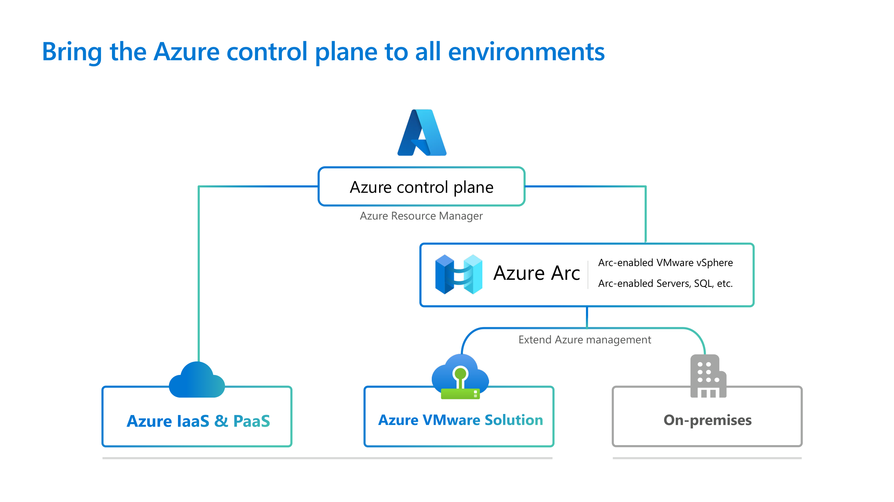

### Key Points

- Azure Resource Manager (ARM) is the core Azure control plane.
- Azure Arc extends the Azure control plane to environments outside Azure, such as on-premises, third-party clouds, and Azure VMware Solution.
- Azure Arc acts as a bridge connecting non-Azure environments to Azure.
- This extension allows centralized management of workloads and assets across diverse environments.
- Arc-enabled resources include VMware vSphere, servers, SQL databases, and more.
- The goal is to manage all environments from a single pane of glass using Azure Resource Manager.

### Details

- The **Azure control plane** refers to Azure Resource Manager (ARM), which is the management layer for Azure services.
- Traditionally, ARM manages resources within Azure boundaries (public cloud).
- Many organizations have workloads running outside Azure, such as:
  - On-premises data centers
  - Other cloud providers or hyperscalers
  - Azure VMware Solution environments (VMware workloads running on Azure infrastructure)
- **Azure Arc** is a technology that enables these external environments to be "Arc-enabled," meaning they can be connected and managed through the Azure control plane.
- By Arc-enabling environments like VMware vSphere, physical or virtual servers, SQL databases, and other resources, Azure extends its management capabilities beyond its native cloud.
- Azure Arc functions as a **bridge** that links non-Azure environments to Azure, enabling unified management.
- This approach allows IT teams to manage diverse infrastructure and workloads from a **single pane of glass**—the Azure portal or Azure Resource Manager interface.
- The slide visually represents this concept with the Azure control plane at the center, extending management capabilities to on-premises and other environments through Azure Arc.
- The speaker emphasizes understanding the foundational layer (shown in gray on the slide) as the base of this integration story.

### Definitions

- **Azure Resource Manager (ARM)**: The Azure control plane responsible for managing Azure resources and services.
- **Azure control plane**: The management layer of Azure, primarily represented by ARM, which handles deployment, configuration, and management of resources.
- **Azure Arc**: A service that extends Azure management capabilities to resources outside of Azure, including on-premises, multi-cloud, and edge environments, enabling centralized governance and management.
- **Arc-enabled VMware vSphere**: VMware environments that have been connected to Azure Arc to allow management through Azure.

### Examples

- Managing VMware workloads running on Azure VMware Solution by Arc-enabling the vSphere environment.
- Extending Azure management to on-premises servers and SQL databases by connecting them via Azure Arc.
- Using Azure Arc to manage resources hosted in third-party cloud providers or other hyperscalers.

### Key Takeaways 🎯

- Azure Arc brings the Azure control plane (ARM) to any environment, not just Azure public cloud.
- This enables centralized, consistent management of hybrid and multi-cloud infrastructures.
- Azure Arc acts as a bridge, connecting on-premises, VMware, and other cloud resources to Azure.
- Arc-enabled resources can be managed from a single interface, simplifying operations and governance.

---

## Slide 17: Azure Services available through Azure Arc for VMware vSphere

**Timestamp**: 00:16:34 – 00:19:52

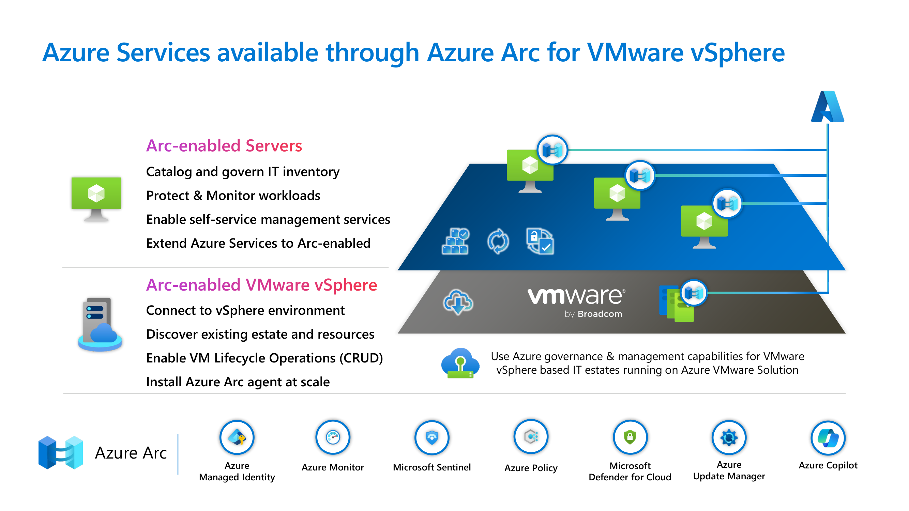

### Key Points

- Azure Arc enables integration of VMware vSphere environments (on-premises or Azure VMware Solution) with Azure services.
- It allows discovery and inventory of existing VMware estate and resources.
- Supports full VM lifecycle operations (Create, Read, Update, Delete - CRUD) on vSphere VMs.
- Facilitates scalable installation of Azure Arc agents on VMware VMs.
- Extends Azure governance, management, and security services to VMware environments.
- Provides out-of-the-box Azure Managed Identity for Arc-enabled VMs, enabling passwordless authentication to Azure services.
- Enables centralized policy enforcement, compliance, monitoring, and protection across hybrid VMware environments.
- Integrates with Azure services such as Microsoft Defender for Cloud, Microsoft Sentinel, Azure Monitor, Azure Update Manager, Azure Copilot, Azure Policy, and Azure Managed Identity.

### Details

- **Connecting VMware vSphere to Azure Arc**:  
  Azure Arc can connect VMware vSphere environments whether they are on-premises or running on Azure VMware Solution (AVS). This connection allows the VMware estate to be managed through Azure.

- **Discovery and Inventory**:  
  Once connected, Azure Arc discovers the existing VMware estate and resources, providing visibility into all VMs and assets within the vSphere environment.

- **VM Lifecycle Operations (CRUD)**:  
  Azure Arc enables full lifecycle management of VMs on vSphere, including creating, reading, updating, and deleting VMs. These operations are available out-of-the-box after Arc-enabling the VMware environment.

- **Azure Arc Agent Installation at Scale**:  
  The Azure Arc agent can be installed on VMs running on VMware environments at scale, enabling deeper integration with Azure services.

- **Extending Azure Services to VMware**:  
  Arc-enabling VMware VMs unlocks integration with Azure services such as:  
  - **Azure Monitor** for performance and health monitoring  
  - **Microsoft Defender for Cloud** for security and threat protection  
  - **Azure Update Manager** for patch management  
  - **Azure Copilot** for AI-powered assistance  
  - **Azure Policy** for governance and compliance enforcement

- **Azure Managed Identity for VMs**:  
  A key benefit of Arc-enabling VMs is the automatic provisioning of an Azure Managed Identity for each VM. This identity allows the VM to authenticate securely and passwordlessly to other Azure services (e.g., Azure Storage) without needing keys or passwords.

- **Centralized Management and Governance**:  
  Azure Arc provides a unified control plane to manage VMware environments alongside native Azure resources. This includes:  
  - Enforcing compliance and auditing policies  
  - Visibility and inventory of all assets in one place  
  - Managing access control across teams and departments  
  - Using Azure APIs, portal, CLI, and PowerShell for management

- **Security Integration with Defender for Cloud**:  
  Customers can leverage Microsoft Defender for Cloud to protect VMware workloads by first Arc-enabling their VMware environments. This integration extends Azure’s security capabilities to non-Azure environments.

### Definitions

- **Azure Arc**: A Microsoft service that extends Azure management and governance capabilities to resources outside of Azure, including on-premises and multi-cloud environments such as VMware vSphere.

- **VM Lifecycle Operations (CRUD)**: The set of operations to Create, Read, Update, and Delete virtual machines, enabling full management of VM lifecycle.

- **Azure Managed Identity**: An identity automatically managed by Azure that allows resources like VMs to authenticate to Azure services securely without using passwords or keys.

- **Azure VMware Solution (AVS)**: A Microsoft Azure service that runs VMware workloads natively on Azure infrastructure.

### Examples

- A VM running on an AVS environment can be Arc-enabled, which installs the Azure Arc agent on it. This VM then gains an Azure Managed Identity, allowing it to authenticate to an Azure Storage account without passwords or keys.

- Using Azure Policy, an organization can enforce compliance rules on VMware VMs running on-premises or AVS, just as they would for native Azure resources.

- Integration with Microsoft Defender for Cloud allows security monitoring and threat protection for VMware workloads once they are Arc-enabled.

### Key Takeaways 🎯

- Azure Arc bridges VMware vSphere environments with Azure, enabling unified management and governance across hybrid infrastructures.
- Full VM lifecycle management and scalable agent deployment are available immediately after Arc-enabling VMware VMs.
- Azure Managed Identity provides secure, passwordless authentication from VMware VMs to Azure services.
- Azure governance, monitoring, and security services like Defender for Cloud and Azure Policy extend seamlessly to VMware workloads through Azure Arc.
- This integration simplifies compliance, auditing, and operational visibility for VMware environments both on-premises and in AVS.

---

## Slide 18: Protect AVS Workloads with

**Timestamp**: 00:25:25 – 00:25:58

### Key Points

- Introduction to protecting Azure VMware Solution (AVS) workloads using Microsoft Defender for Cloud.
- Transition from a demo to discussing modernization of applications on AVS.
- Emphasis on modernizing applications securely and privately within the AVS environment.
- Leveraging Azure services to enable modernization while maintaining security.

### Details

- The slide highlights **Microsoft Defender for Cloud** as a key tool to protect workloads running on **Azure VMware Solution (AVS)**.
- The speaker concludes the first demo and signals a shift in focus toward **application modernization** on AVS.
- Modernization involves updating and improving applications running on AVS by integrating Azure-native services.
- The speaker stresses that modernization efforts must be conducted **privately and securely**, implying that security and network isolation remain priorities.
- This sets the stage for discussing how Azure services can be leveraged to enhance AVS workloads beyond traditional infrastructure management, focusing on cloud-native capabilities.
- The relationship between Microsoft Defender for Cloud and AVS is that Defender provides security monitoring and threat protection specifically tailored for workloads running in the AVS environment.
- The broader topic involves managing and securing hybrid cloud environments where VMware workloads run on Azure infrastructure, with modernization as a next step after foundational protection.

### Definitions

- **Azure VMware Solution (AVS)**: A Microsoft Azure service that allows customers to run VMware workloads natively on Azure infrastructure.
- **Microsoft Defender for Cloud**: A security management and threat protection service that provides unified security monitoring and advanced threat defense across hybrid cloud workloads, including those running on AVS.
- **Modernization**: The process of updating and enhancing existing applications, often by integrating cloud-native services and capabilities to improve performance, scalability, and security.

### Examples

- The speaker references completing a demo (not detailed here) related to AVS workload protection.
- No specific examples of Defender for Cloud features or modernization steps are provided on this slide or in the narration.

### Key Takeaways 🎯

- Microsoft Defender for Cloud is essential for protecting workloads running on Azure VMware Solution.
- After establishing workload protection, the next focus area is modernizing applications on AVS using Azure services.
- Modernization must be done securely and privately to maintain compliance and data protection.
- This slide serves as a transition point from demonstrating security capabilities to exploring modernization strategies on AVS.

---

## Slide 19: Native Security with Azure

**Timestamp**: 00:20:26 – 00:21:29

### Key Points

- Azure Defender for Cloud provides **native, built-in security controls** integrated directly into the Azure platform.
- It offers **comprehensive cloud security posture management** and **cloud workload protection** across various Azure services.
- Defender for Cloud supports **threat remediation** through a **unified security platform**.
- Addresses common cloud security challenges such as **insufficient visibility**, **high incidence of cloud security incidents**, and **long breach containment times**.
- Protects a wide range of workloads including **virtual machines (VMs)**, **databases**, **AI services**, **application services**, **containers**, and **Azure VMware Solution (AVS) workloads**.
- Provides **threat intelligence**, **resilience**, and **reliability** for cloud workloads.
- Statistics highlight the urgency of cloud security:  
  - 72% of tech companies report insufficient cloud visibility.  
  - 80% of companies experienced cloud security incidents in 2024.  
  - Average time to contain a data breach is 64 days.

### Details

- **Azure Defender for Cloud** is a **native security solution** embedded within the Azure platform, designed to provide **visibility and protection** across all cloud workloads.
- It integrates **security controls natively**, meaning it is built into the Azure environment rather than being an add-on or external tool.
- The platform offers **comprehensive posture management**, which means it continuously assesses and improves the security configuration of cloud resources to reduce vulnerabilities.
- It also provides **cloud workload protection coverage**, securing workloads running on Azure as well as on hybrid or multi-cloud environments such as AVS (Azure VMware Solution).
- The solution enables **threat remediation** by unifying security alerts and controls into a single platform, allowing security teams to respond efficiently.
- The speaker emphasized that many organizations face **common cloud security challenges**:
  - A significant lack of visibility into cloud environments (72% of tech companies).
  - A high rate of cloud security incidents (80% of companies in 2024).
  - Long average breach containment times (64 days), which increase risk and potential damage.
- By leveraging Defender for Cloud, organizations can **reduce these risks** through enhanced visibility, proactive threat detection, and faster remediation.
- Defender for Cloud is versatile and can be attached to various Azure services beyond just virtual machines, including:
  - **Databases and storage**  
  - **AI services**  
  - **Application services**  
  - **Containers**  
  - **AVS workloads** (non-Azure environments running on Azure infrastructure)
- The platform also incorporates **threat intelligence**, which means it uses data from global threat sources to identify and respond to emerging threats.
- It enhances **resilience and reliability** by continuously monitoring and protecting workloads, ensuring business continuity.

### Definitions

- **Azure Defender for Cloud**: A native Azure security solution that provides integrated security controls, posture management, and workload protection across Azure and hybrid environments.
- **Cloud Security Posture Management (CSPM)**: Continuous assessment and improvement of cloud resource configurations to reduce security risks.
- **Cloud Workload Protection Platform (CWPP)**: Security solutions that protect workloads running in cloud environments, including VMs, containers, and serverless functions.
- **Azure VMware Solution (AVS)**: A service that allows running VMware workloads natively on Azure infrastructure.
- **Threat Intelligence**: Data and insights about current and emerging cyber threats used to enhance security detection and response.

### Examples

- Defender for Cloud can protect **AVS workloads**, which are VMware workloads running on Azure, demonstrating its capability beyond traditional Azure-native services.
- It secures diverse workloads such as AI services and application services, showing its broad applicability across different cloud service types.

### Key Takeaways 🎯

- Azure Defender for Cloud is a **comprehensive, native security solution** that addresses critical cloud security challenges by providing visibility, protection, and remediation across a wide range of workloads.
- It helps organizations overcome **insufficient cloud visibility** and **high incident rates** by integrating threat intelligence and unified security controls.
- The platform supports **multi-service protection**, including VMs, databases, AI, containers, and hybrid environments like AVS.
- Leveraging Defender for Cloud can significantly reduce the **time and impact of cloud security incidents**, improving overall cloud security posture and resilience.

---

## Slide 20: Protect Azure VMware Solution

**Timestamp**: 00:19:52 – 00:20:26

### Key Points

- Microsoft Defender for Cloud can protect Azure VMware Solution (AVS) environments.
- Azure Arc enables management and security of non-Azure environments, including AVS.
- Azure Arc extends cloud management and security protections beyond Azure to multicloud, datacenter, and hosted environments.
- Azure Arc provides a single control plane to manage any resource, anywhere.
- Integration of Azure Arc with Defender for Cloud allows centralized security monitoring and protection for AVS workloads.

### Details

- **Protecting AVS with Defender for Cloud via Azure Arc**:  
  Customers often want to leverage the security capabilities of Microsoft Defender for Cloud for workloads running outside of Azure, such as in Azure VMware Solution (AVS). Since AVS is a VMware environment hosted on Azure infrastructure but not a native Azure resource, it requires enabling Azure Arc to bring it under Azure management.

- **Azure Arc’s Role**:  
  Azure Arc acts as an extension of Azure management and security capabilities to resources that are outside of Azure’s native cloud environment. This includes multicloud environments, on-premises datacenters, and hosted environments like AVS. By "Arc-enabling" these resources, they become manageable and securable through Azure tools.

- **Single Control Plane**:  
  Azure Arc provides a unified control plane that allows administrators to manage and secure any resource, regardless of where it is located—on-premises, in other clouds, or in hosted environments. This simplifies governance and security operations.

- **Integration with Defender for Cloud**:  
  Once AVS is Arc-enabled, it can be integrated with Microsoft Defender for Cloud. This integration enables the application of Defender’s security policies, threat detection, and compliance monitoring to AVS workloads, providing consistent security posture management.

- **Upcoming Demo**:  
  The speaker mentions that a demonstration will follow, showing how to enable AVS with Azure Arc and integrate it with Defender for Cloud, illustrating the practical steps and benefits.

### Definitions

- **Azure VMware Solution (AVS)**: A service that allows customers to run VMware workloads natively on Azure infrastructure.
- **Microsoft Defender for Cloud**: A cloud security posture management and threat protection service that helps secure Azure and hybrid environments.
- **Azure Arc**: A set of technologies that extends Azure management and security capabilities to resources outside of Azure, including on-premises, multicloud, and hosted environments, enabling a single control plane for management.

### Examples

- The speaker references a forthcoming demo that will show how to Arc-enable AVS and integrate it with Defender for Cloud, demonstrating the process and benefits of this approach.

### Key Takeaways 🎯

- Azure Arc enables extending Azure’s management and security capabilities to AVS and other non-Azure environments.
- By Arc-enabling AVS, customers can protect their VMware workloads using Microsoft Defender for Cloud.
- Azure Arc provides a unified control plane for managing and securing resources anywhere, simplifying hybrid and multicloud security.
- Leveraging Defender for Cloud via Azure Arc helps maintain consistent security posture across diverse environments.

---

## Slide 21: Demo

**Timestamp**: 00:45:06 – 00:46:54

### Key Points

- Demonstration of Arc-enabled VMs on Azure VMware Solution (AVS) integrated with Microsoft Defender for Cloud.
- AI adoption is a major competitive driver, with 87% of organizations believing AI provides an edge.
- Importance of co-locating data, applications, and infrastructure to reduce latency and avoid data silos.
- Migrating workloads to Azure via AVS enables integration with Azure AI services.
- Azure AI services include AI Foundry, machine learning, Microsoft Copilot, and GitHub Copilot.
- Microsoft ensures AI services uphold data fairness, inclusiveness, accountability, reliability, privacy, and transparency.
- Customers can customize AI governance policies to meet their specific requirements.

### Details

- The demo focuses on how Arc-enabled virtual machines running on Azure VMware Solution (AVS) can be integrated with Microsoft Defender for Cloud, showcasing enhanced security and management capabilities.
- AI is a critical strategic priority: 87% of organizations see AI as a way to gain a competitive advantage, driving pressure from leadership to adopt AI technologies.
- To become AI-ready and secure, organizations should start by co-locating their data, applications, and infrastructure. This is facilitated by migrating workloads to Azure using AVS.
  - **Benefits of co-location**:
    - Reduced application latency due to proximity of resources.
    - Prevention of data silos, enabling seamless data access and integration.
    - Easier integration into the broader Azure ecosystem.
- Once workloads are migrated and co-located, organizations can infuse AI capabilities into their applications by leveraging Azure AI services such as:
  - Azure AI Foundry for building AI models.
  - Machine learning tools for training custom models.
  - Microsoft Copilot and GitHub Copilot for AI-assisted development and productivity.
- Microsoft’s AI services come with built-in controls to ensure:
  - Fairness and inclusiveness in AI outputs.
  - Accountability and reliability of AI systems.
  - Privacy and transparency in data handling and AI operations.
- Customers retain the ability to configure and customize these controls to align with their own policies and compliance needs.
- The integration of AVS workloads with Microsoft Defender for Cloud adds a layer of security monitoring and threat protection, ensuring that AI-enabled workloads remain secure.

### Definitions

- **Arc-enabled VMs**: Virtual machines managed through Azure Arc, allowing on-premises or multi-cloud VMs to be managed and secured via Azure services.
- **Azure VMware Solution (AVS)**: A Microsoft Azure service that enables customers to run VMware workloads natively on Azure, facilitating migration and hybrid cloud scenarios.
- **Microsoft Defender for Cloud**: A cloud-native security solution that provides threat protection and security management for workloads running in Azure and hybrid environments.
- **Azure AI Foundry**: A suite of Azure AI services and tools designed to help build, train, and deploy AI models.
- **Microsoft Copilot / GitHub Copilot**: AI-powered tools that assist developers by providing code suggestions and automating coding tasks.

### Examples

- The speaker references a demo showcasing how Arc-enabled VMs on AVS integrate with Microsoft Defender for Cloud, illustrating practical application of these technologies.
- Use cases include migrating existing VMware workloads to Azure to reduce latency and data silos, then enhancing those workloads with AI capabilities like machine learning and Copilot.
- Organizations can leverage these integrated services to revamp their processes with AI while maintaining security and compliance.

### Key Takeaways 🎯

- Migrating VMware workloads to Azure via AVS enables co-location of data, apps, and infrastructure, which is foundational for AI readiness.
- Integrating Arc-enabled VMs with Microsoft Defender for Cloud ensures security for AI-enabled workloads.
- Azure AI services provide powerful tools to infuse AI into applications, supported by Microsoft’s commitment to ethical AI principles.
- Organizations have flexibility to customize AI governance to meet their unique security and compliance requirements.
- The combination of AVS, Azure Arc, AI services, and Defender for Cloud creates a secure, efficient, and AI-ready environment for modern workloads.

---

## Slide 22: Slide 22

**Timestamp**: 00:46:54 – 00:47:59

### Key Points

- Azure VMware Solution (AVS) serves as the data source platform.
- Data from AVS integrates into Azure AI services.
- New or updated AI applications and agents can be built leveraging this integration.
- Secure connectivity is crucial, using private endpoints and managed identities.
- Practical use case: a bank modernizing legacy applications by integrating AVS with Azure AI services.

### Details

- **Azure VMware Solution (AVS)** acts as the foundational environment where various data sources reside.
- Data from AVS is ingested into **Azure AI services**, enabling advanced AI capabilities.
- This integration supports the development or modernization of applications and AI agents that utilize the data stored in AVS.
- The workflow involves:
  - Data residing in AVS from multiple sources.
  - Data flowing into Azure AI services for processing and AI model integration.
  - Building or updating applications and AI agents that leverage this AI-enhanced data.
- **Security considerations**:
  - The bank example highlights the use of **private endpoints** to ensure secure connectivity between AVS and Azure AI services.
  - **Managed identities** are used to manage authentication securely without manual credential handling.
- The speaker emphasizes the practical benefits of this integration by previewing a demo scenario involving a bank.
- The bank’s motivation:
  - Clients were dissatisfied with legacy applications.
  - The bank sought to modernize these applications using AI.
  - They leveraged AVS for migration and secure connectivity to Azure AI services.
  
### Definitions

- **Azure VMware Solution (AVS)**: A Microsoft Azure service that allows running VMware workloads natively on Azure infrastructure, enabling seamless integration of VMware environments with Azure services.
- **Azure AI services**: A suite of AI tools and services in Azure that provide capabilities such as machine learning, cognitive services, and AI agent development.
- **Private endpoint**: A network interface that connects privately and securely to Azure services, ensuring traffic remains within the Azure network.
- **Managed identity**: An Azure feature that provides an automatically managed identity in Azure Active Directory for applications to use when connecting to resources, eliminating the need for credentials in code.

### Examples

- A bank that has migrated its infrastructure to AVS.
- The bank’s clients were unhappy with the legacy applications.
- The bank wants to modernize these applications by integrating with Azure AI services.
- They use private endpoints for secure connectivity and managed identities for secure authentication.
- The speaker plans to demonstrate a quick demo showing this integration in action.

### Key Takeaways 🎯

- AVS can serve as a secure, integrated data source platform for Azure AI services.
- Combining AVS with Azure AI enables modernization of legacy applications through AI-powered agents.
- Secure connectivity and authentication (private endpoints and managed identities) are essential in this integration.
- Real-world scenarios, like banking, illustrate the practical benefits of this approach.

---

## Slide 23: Attaching AVS workloads to

**Timestamp**: 00:30:38 – 00:31:43

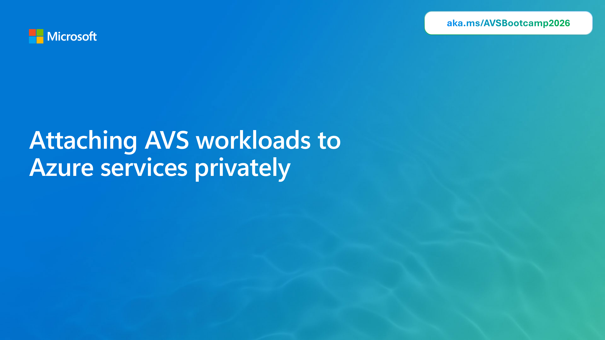

### Key Points

- Integration of Azure VMware Solution (AVS) workloads with Azure services via private connectivity.
- Use of **private endpoints** to securely connect AVS workloads to Azure services.
- Private endpoints create a network interface with a private IP address within Azure.
- Benefits include private and secure connectivity, blocking data exfiltration, enabling private access, and providing predictable IP addresses.
- Applicable to various Azure services such as Storage Accounts and Key Vaults.

### Details

- The slide highlights the concept of **attaching AVS workloads to Azure services privately**, emphasizing secure and private integration.
- The speaker elaborates on the use of **private endpoints** as the key mechanism for this integration.
- When a private endpoint is created for an Azure service that supports it, a **network interface** is provisioned automatically.
  - This network interface is assigned a **private IP address** within the Azure virtual network.
- This setup ensures that all traffic between AVS workloads and Azure services remains within the Azure backbone network, avoiding exposure to the public internet.
- Key benefits of using private endpoints include:
  - **Private and secure connectivity**: Communication is confined to the Azure network, enhancing security.
  - **Blocking data exfiltration**: Since traffic does not leave the Azure environment, it prevents unauthorized data transfer outside the virtual network.
  - **Enabling private access**: Services can be accessed privately without public IPs.
  - **Predictable IP addressing**: You can assign specific private IP addresses to these network interfaces, which helps in network management and firewall configurations.
- This approach applies to multiple Azure services such as:
  - Storage Accounts
  - Key Vaults
  - Other Azure services that support private endpoints
- The speaker references a diagram (not shown here) illustrating the journey and architecture of this private connectivity setup.

### Definitions

- **Azure VMware Solution (AVS)**: A Microsoft Azure service that allows you to run VMware workloads natively on Azure infrastructure.
- **Private Endpoint**: A network interface that connects you privately and securely to a service powered by Azure Private Link, assigned a private IP address within your virtual network.
- **Network Interface**: A virtual network interface card (NIC) created when a private endpoint is provisioned, enabling private IP communication.
- **Data Exfiltration**: Unauthorized transfer of data from within a network to an external destination.

### Examples

- Assigning a private IP address to a private endpoint connected to a Storage Account, allowing AVS workloads to access storage privately.
- Using private endpoints to connect AVS workloads to a Key Vault securely, ensuring secrets and keys are accessed over a private network.

### Key Takeaways 🎯

- Private endpoints enable AVS workloads to connect securely and privately to Azure services without exposing traffic to the public internet.
- Each private endpoint creates a network interface with a private IP, providing predictable and manageable connectivity.
- This method enhances security by blocking data exfiltration and ensuring all communication stays within Azure’s private network.
- Applicable to many Azure services, making it a versatile solution for integrating AVS with Azure resources.

---

## Slide 24: Azure resources do not need

**Timestamp**: 00:31:43 – 00:33:02

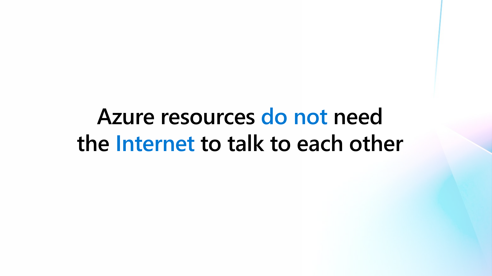

### Key Points

- Azure resources can communicate with each other without requiring Internet access.
- Connectivity within Azure environments can be governed and managed through IP inventory and private networking.
- Azure VMware Solution (AVS) uses private network interfaces with private IP addresses to connect workloads securely.
- VNet peering enables direct communication between AVS workloads and Azure services without going through the Internet.
- Azure Private Endpoints provide private IP addresses for Azure services, enhancing security.
- Azure Private DNS Zones work alongside Private Endpoints to resolve service names to private IP addresses, avoiding the need to hardcode IPs in applications.

### Details

- **No Internet Required for Azure Resource Communication**  
  The slide emphasizes that Azure resources do not need the Internet to communicate with each other. This is a fundamental security and architecture principle in Azure networking.

- **IP Inventory and Governance**  
  Maintaining an IP inventory helps clearly identify and manage what resources are connected and how. This facilitates governance over connectivity within the Azure environment, ensuring controlled and secure communication.

- **Azure VMware Solution (AVS) Connectivity**  
  AVS environments use private network interfaces assigned private IP addresses. These private IPs enable AVS workloads and applications to connect securely to Azure services.

- **VNet Peering**  
  VNet peering is a connectivity method that links virtual networks (VNets) so that resources in different VNets can communicate directly. In the AVS context, VNet peering allows workloads to access Azure services privately, without traversing the public Internet.

- **Private Endpoints and Private IPs**  
  Azure Private Endpoints assign private IP addresses to Azure services, enabling secure, private connectivity. However, applications typically do not use these private IP addresses directly.

- **Azure Private DNS Zones**  
  To avoid hardcoding private IP addresses in applications, Azure Private DNS Zones are used. These zones contain DNS record sets (e.g., A records) that map service names to their private IP addresses. This allows applications to resolve service names to private IPs seamlessly.

- **Example of Private DNS Zone**  
  The speaker references an example where a private DNS zone contains record sets with service names and corresponding A records pointing to private IP addresses, facilitating name resolution within the private network.

### Definitions

- **Azure VMware Solution (AVS)**: A service that allows running VMware workloads natively on Azure infrastructure, integrated with Azure networking and services.

- **VNet Peering**: A method to connect two Azure virtual networks, enabling resources in each VNet to communicate with each other privately and directly.

- **Private Endpoint**: A network interface that connects you privately and securely to a service powered by Azure Private Link, assigned a private IP address within your VNet.

- **Azure Private DNS Zone**: A DNS zone hosted in Azure that provides name resolution for resources within a private network, allowing private IP addresses to be resolved via DNS names.

### Examples

- The speaker describes a private DNS zone example where a service name is registered as an A record with a private IP address. This setup allows applications to resolve the service name to the private IP without hardcoding the IP address.

### Key Takeaways 🎯

- Azure resources communicate securely over private networks without using the Internet.
- AVS workloads connect to Azure services via private IPs and VNet peering, ensuring secure, private connectivity.
- Private Endpoints provide private IP addresses for Azure services, but applications use DNS names, not IPs, for connectivity.
- Azure Private DNS Zones enable seamless name resolution of private IP addresses, simplifying application configuration and enhancing security.

---

## Slide 25: Connectivity with Azure services overview (Gen1)

**Timestamp**: 00:33:02 – 00:35:52

### Key Points

- Azure service connectivity in Gen1 leverages subnet delegation and private endpoints to enable private IP communication.
- Private Endpoints provide secure, private IP access to Azure services without traffic traversing the public internet.
- Integration with Azure Private DNS Zones is critical for seamless DNS name resolution of private endpoints.
- Availability Zones should be used to deploy Azure resources close to Azure VMware Solution (AVS) workloads for optimal performance.
- ExpressRoute provides high-bandwidth, low-latency connectivity to Azure services, supporting over 200 Azure services.
- Application Gateway with Web Application Firewall (WAF) can be used to enable Azure services or end-consumers to reach AVS workloads.
- DNS Private Resolver in Azure enables DNS resolution for private endpoints from external environments like AVS.
- Virtual Network (VNet) linking to Private DNS Zones is essential for DNS resolution to work correctly.

### Details

- **Subnet Delegation and Integration**:  
  Allows communication with Azure service instances through private IP addresses within a subnet. This is foundational for secure, private connectivity to Azure services.

- **Private Endpoints**:  
  Provide a private IP address for Azure service instances, ensuring that traffic does not traverse the public internet. This enhances security and reduces exposure.  
  - Best practice is to integrate Private Endpoints with Azure Private DNS Zones to enable seamless DNS name resolution without requiring IP address usage in applications.

- **Azure Private DNS Zones**:  
  Critical for resolving Azure service names to private IP addresses assigned by Private Endpoints.  
  - Must be linked to the Virtual Network (VNet) to function properly. Without this VNet link, the private DNS zone is ineffective.

- **DNS Private Resolver**:  
  A managed Azure service that acts as a DNS forwarding service, enabling DNS queries from external environments (such as AVS) to resolve private endpoint IP addresses.  
  - It uses an inbound endpoint with an IP address that is configured as a conditional forwarder in DNS servers running inside AVS.  
  - This setup allows workloads in AVS to resolve Azure service names (e.g., openai.azure.com, storage accounts, key vaults) to their private IPs.

- **Availability Zones**:  
  To maximize performance and minimize latency, Azure resources that integrate with AVS should be deployed in the same Availability Zone as the AVS workloads.

- **ExpressRoute and FastPath**:  
  Provides dedicated, high-speed (over 10 Gbps) and low-latency connectivity between on-premises or AVS environments and Azure.  
  - Supports connectivity to 200+ Azure services.  
  - Uses a dedicated Microsoft Enterprise Edge for routing traffic.

- **Application Gateway with WAF**:  
  Used to enable Azure services or external consumers to access workloads running on AVS securely.

- **Practical DNS Resolution Example**:  
  The speaker demonstrated running an NS lookup from a VM inside AVS for an Azure Storage account (e.g., avsstorageaccount.blob.core.windows.net).  
  - With Private Endpoints and Private DNS Zones configured, the query returns a private IP address.  
  - Running the same query from an external VM (e.g., a laptop) returns the public IP address, illustrating the difference in DNS resolution based on network context.

### Definitions

- **Private Endpoint**: A network interface that connects you privately and securely to a service powered by Azure Private Link. It assigns a private IP address from your VNet to the Azure service, eliminating exposure to the public internet.

- **Azure Private DNS Zone**: A DNS zone hosted in Azure that provides name resolution for private endpoints within a virtual network.

- **DNS Private Resolver**: A managed Azure DNS forwarding service that enables DNS queries from external networks (like AVS) to resolve private endpoint IP addresses in Azure.

- **Availability Zone**: Physically separate locations within an Azure region that provide high availability and fault tolerance.

- **ExpressRoute**: A dedicated private connection between your on-premises infrastructure or AVS and Azure, offering high bandwidth and low latency.

- **Application Gateway with WAF**: A web traffic load balancer that includes a Web Application Firewall to protect web applications from common threats.

### Examples

- The speaker’s example of an OpenAI service with a private endpoint enabled:  
  - The private endpoint has a network interface with a private IP (e.g., 10.1.3.8).  
  - This IP is registered in the private DNS zone with the resource’s fully qualified domain name (FQDN).  
  - Applications can access the service using the FQDN without any IP changes or internet exposure.

- NS lookup example from a VM inside AVS for an Azure Storage account:  
  - Returns the private IP address due to private endpoint and private DNS zone configuration.  
  - The same query from outside AVS returns the public IP address.

- DNS Private Resolver setup:  
  - An inbound endpoint IP address is configured in AVS DNS servers as a conditional forwarder.  
  - DNS queries for Azure services that cannot be resolved locally are forwarded to this resolver, which returns private IP addresses.

### Key Takeaways 🎯

- Private Endpoints combined with Azure Private DNS Zones enable secure, private connectivity to Azure services without changing application configurations or exposing traffic to the internet.  
- Linking Private DNS Zones to the correct VNets is essential for DNS resolution to work.  
- DNS Private Resolver facilitates DNS resolution for private endpoints from external environments like AVS.  
- Deploy Azure resources in the same Availability Zone as AVS workloads to optimize performance.  
- ExpressRoute provides a high-speed, low-latency, private connection to Azure services, supporting extensive service integration.  
- Application Gateway with WAF is a key component for securely exposing AVS workloads to Azure services or external consumers.

---

## Slide 26: Connectivity with Azure services overview (Gen2)

**Timestamp**: 00:36:27 – 00:37:30

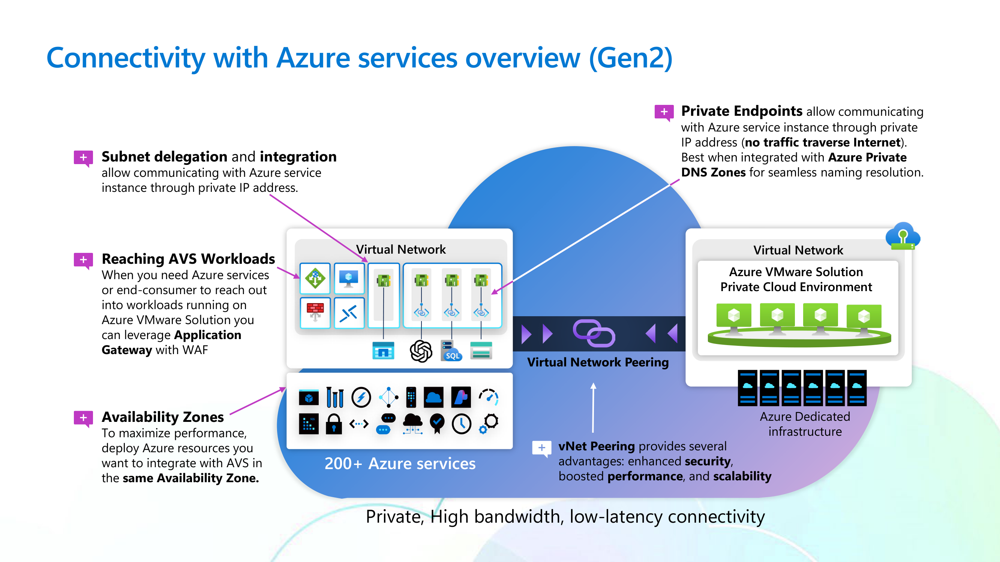

### Key Points

- Connectivity to Azure services from Azure VMware Solution (AVS) Gen2 environments can be achieved securely via subnet delegation and private endpoints.
- Private Endpoints enable communication with Azure services over private IP addresses, avoiding internet traffic.
- Integration with Azure Private DNS Zones enhances seamless name resolution for private endpoints.
- Deploying AVS and Azure resources in the same Availability Zone maximizes performance.
- Virtual Network (vNet) Peering offers private, high-bandwidth, low-latency connectivity with enhanced security and scalability.
- Application Gateway with Web Application Firewall (WAF) can be used to allow Azure services or external consumers to reach workloads running on AVS.

### Details

- **Subnet Delegation and Integration**:  
  Subnet delegation allows a subnet within a virtual network to be dedicated to a specific Azure service, enabling direct communication with that service instance through a private IP address. This setup ensures traffic does not traverse the public internet, enhancing security.

- **Private Endpoints**:  
  Private Endpoints provide a way to connect privately to Azure service instances using private IP addresses within your virtual network. This means that even if a service has a public IP, network access can be restricted to only allow traffic through the private endpoint, blocking all external internet access.  
  The speaker emphasized that simply knowing the public IP of a storage account does not guarantee access because network access rules can block external traffic. Using a private endpoint with proper authorization allows access to storage content securely.

- **Azure Private DNS Zones**:  
  When using private endpoints, integrating with Azure Private DNS Zones is recommended to enable seamless DNS name resolution within the virtual network, so services can be accessed by their usual domain names without additional configuration.

- **Availability Zones**:  
  To maximize performance and reduce latency, it is best practice to deploy Azure resources that need to integrate with AVS workloads in the same Availability Zone. This proximity reduces network hops and improves throughput.

- **Virtual Network Peering**:  
  vNet Peering connects two virtual networks privately, enabling resources in both networks to communicate with low latency and high bandwidth. Benefits include:  
  - Enhanced security since traffic remains within Azure’s backbone network.  
  - Improved performance due to direct network paths.  
  - Scalability for growing workloads.  
  The slide notes that over 200 Azure services support vNet Peering, making it a versatile connectivity option.

- **Reaching AVS Workloads**:  
  When Azure services or external end-consumers need to access workloads running on AVS (which is a private cloud environment), Application Gateway with WAF can be leveraged. This provides secure, controlled access with protection against web vulnerabilities.

- **Speaker’s Additional Context on Modernization**:  
  The speaker described a typical modernization scenario where an application tier runs on AVS due to VMware dependencies, while the database tier (e.g., SQL Server) can run either on AVS or on Azure-native services such as Azure SQL Database, Azure SQL Managed Instance, or SQL Server on Azure VMs. This hybrid approach allows leveraging cloud-native services while maintaining legacy VMware workloads.

### Definitions

- **Subnet Delegation**: Assigning a subnet within a virtual network to a specific Azure service, enabling direct private IP communication with that service.
- **Private Endpoint**: A network interface that connects you privately and securely to a service powered by Azure Private Link, using a private IP address within your virtual network.
- **Azure Private DNS Zone**: A DNS service that provides name resolution for private endpoints within a virtual network, enabling seamless access to Azure services by their domain names.
- **Availability Zone**: Physically separate locations within an Azure region that provide high availability and fault tolerance.
- **Virtual Network Peering (vNet Peering)**: A mechanism to connect two Azure virtual networks privately, enabling resources in both networks to communicate with low latency and high bandwidth.
- **Application Gateway with WAF**: A web traffic load balancer that includes a Web Application Firewall to protect web applications from common threats and vulnerabilities.

### Examples

- The speaker explained that even if you have the public IP address of a storage account, you might get an "access denied" error if network access is restricted. However, using a private endpoint with the correct authorization allows access to the storage content securely over a private IP.
- A modernization example was given where an application tier runs on AVS due to VMware dependencies, while the database tier can run on Azure SQL Database or Azure SQL Managed Instance, illustrating hybrid deployment scenarios.

### Key Takeaways 🎯

- Use subnet delegation and private endpoints to securely connect AVS workloads to Azure services without exposing traffic to the internet.
- Integrate private endpoints with Azure Private DNS Zones for seamless service name resolution.
- Deploy AVS and Azure resources in the same Availability Zone to optimize performance.
- Leverage vNet Peering for secure, high-performance connectivity between virtual networks.
- Use Application Gateway with WAF to securely expose AVS workloads to Azure services or external users.
- Hybrid architectures combining AVS-hosted application tiers with Azure-native database services enable modernization while preserving VMware dependencies.

---

## Slide 27: Azure Private Endpoint

**Timestamp**: 00:37:30 – 00:39:57

### Key Points

- Azure Private Endpoint enables secure, private connectivity to Azure services by assigning private IP addresses within a virtual network.
- It blocks data exfiltration from the virtual network, enhancing security.
- Supports private access from resources within the virtual network, peered virtual networks, and hybrid environments connected via VPN or ExpressRoute.
- Simplifies connectivity governance through predictable private IP addressing.
- Azure Private Endpoint is implemented as a special network interface linked to an Azure PaaS resource.
- The speaker emphasized the integration of Azure VMware Solution (AVS) workloads with Azure services, highlighting private connectivity benefits.

### Details

- **Azure Private Endpoint** is a network interface that connects Azure PaaS services privately to your virtual network.
  - It is assigned a private IP address from the subnet within your virtual network.
  - This setup ensures that traffic between your virtual network and Azure services does not traverse the public internet, enhancing security.
  - It effectively blocks data exfiltration attempts from the virtual network by restricting access paths.
- **Connectivity Scope**:
  - Private Endpoint enables access not only from resources inside the same virtual network but also from peered virtual networks.
  - It extends to hybrid environments connected via VPN or ExpressRoute, allowing seamless private access across on-premises and cloud.
- **Governance and Management**:
  - Using predictable private IP addresses simplifies network management and governance.
  - This predictability helps in applying network security policies and monitoring.
- **Relationship to Azure VMware Solution (AVS)**:
  - The speaker discussed how workloads running on AVS can leverage Azure Private Endpoint to securely connect to Azure services such as SQL Managed Instance or Oracle Database on Azure.
  - This "better together" approach allows running application tiers on AVS and database tiers on Azure PaaS services, optimizing for cost, operational ease, and technical debt reduction.
- **Demonstration Context**:
  - The speaker introduced a demo involving an application running on IIS within a VM.
  - The application uses a local SQL database on the same VM, illustrating connectivity and database access.
  - Although the demo used a local SQL instance, the context implies that in production, Azure Private Endpoint would enable secure private connectivity to managed databases in Azure.

### Definitions

- **Azure Private Endpoint**: A special network interface that connects an Azure PaaS resource privately to your virtual network by assigning it a private IP address from your virtual network’s address space, enabling secure and private connectivity.
- **Virtual Network (vNet)**: A logically isolated network in Azure where you can run your resources securely.
- **Peered vNets**: Virtual networks connected to each other to allow resources to communicate privately.
- **ExpressRoute**: A private connection between on-premises infrastructure and Azure datacenters.
- **Azure VMware Solution (AVS)**: A service that allows running VMware workloads natively on Azure infrastructure.
- **Private Link**: The underlying technology powering Azure Private Endpoint, enabling private connectivity to Azure services.

### Examples

- Running an application tier on Azure VMware Solution while connecting privately to a SQL Managed Instance or Oracle Database hosted as Azure PaaS services.
- A demo scenario where an IIS-hosted to-do list application connects to a local SQL database on the same VM, illustrating database connectivity which in real-world scenarios would be replaced by private connectivity to Azure-managed databases via Private Endpoint.

### Key Takeaways 🎯

- Azure Private Endpoint is critical for securing Azure service access by providing private IP connectivity within your virtual network and blocking data exfiltration.
- It supports hybrid and multi-vNet environments, enabling seamless and secure access to Azure services.
- The integration of AVS workloads with Azure PaaS services via Private Endpoint exemplifies a hybrid architecture that optimizes cost, security, and operational efficiency.
- Predictable private IP addressing simplifies network governance and security management.
- Understanding Azure Private Endpoint is essential for designing secure, private, and well-governed cloud architectures.

---

## Slide 28: Private DNS Resolution

**Timestamp**: 00:39:57 – 00:44:28

### Key Points

- Private DNS resolution enables Azure services to resolve their fully qualified domain names (FQDNs) to private IP addresses associated with Private Endpoint network interfaces.
- This approach allows services to remain accessible via their existing DNS names without requiring changes to application code.
- Azure Private DNS Zones and Private DNS Resolver work together to manage DNS queries for private endpoints.
- Conditional forwarding and DNS forwarding zones are used to route DNS queries appropriately within the virtual network and to Azure recursive resolvers.
- The demo environment includes Azure SQL Managed Instance and other Azure services configured with private endpoints and private DNS zones.
- Applications can connect privately to Azure services using private IPs resolved via private DNS, enabling secure and seamless migration scenarios.

### Details

- **Private DNS Resolution Concept**:  
  The slide illustrates how Azure services, such as Azure SQL Managed Instance or Azure VMware Solution, can be accessed privately through private endpoints. The private endpoint is assigned a private IP address within a subnet of a virtual network. The DNS resolution for the service’s fully qualified domain name (e.g., `openai.azure.com`) is configured to resolve to this private IP address instead of a public IP.

- **DNS Infrastructure Components**:  
  - **Private DNS Zone**: Contains DNS records mapping service names to private IP addresses (e.g., `privatelink.openai.azure.com` with an A record pointing to `10.1.3.8`).  
  - **DNS Private Resolver**: A DNS VM or service within the virtual network that handles DNS queries, including conditional forwarding to Azure recursive resolvers or other DNS servers.  
  - **Conditional Forwarders**: Used to forward DNS queries for specific domains (like `privatelink.azure.com`) to the appropriate DNS servers.  
  - **Forward and Reverse Lookup Zones**: Manage name-to-IP and IP-to-name mappings within the private DNS infrastructure.

- **Network Components**:  
  - **Virtual Network and Subnets**: The private endpoints and DNS resolver reside within subnets of a virtual network.  
  - **Private Endpoint Network Interface**: The network interface attached to the private endpoint, assigned a private IP address (e.g., `10.1.6.4`).  
  - **ExpressRoute and FastPath**: Mentioned as part of the network infrastructure that can be used for private connectivity.

- **Speaker’s Demo Explanation**:  
  - The speaker demonstrated connecting an application VM to an Azure SQL Managed Instance using the private endpoint.  
  - By performing an NSLookup on the fully qualified domain name of the SQL Managed Instance, the private IP address was returned, confirming private DNS resolution.  
  - The application’s connection string was updated to use the SQL Managed Instance’s hostname, allowing the application to connect privately without code changes.  
  - The speaker used a migration wizard to migrate a local database to the Azure SQL Managed Instance, verifying compatibility and running an online migration.  
  - After migration, the speaker showed querying the new database from the application, confirming successful migration and connectivity.  
  - The speaker also referenced an Application Gateway backend pool configured with a VM running on Azure VMware Solution (AVS), demonstrating how private IPs are used for backend services accessible via public IPs on the gateway.

- **Integration of DNS and Network for Private Access**:  
  The slide and narration emphasize that private DNS zones and private endpoints together enable seamless, secure access to Azure services without exposing them publicly or requiring application changes. DNS queries for Azure services resolve to private IPs, and traffic flows within the virtual network or via ExpressRoute.

### Definitions

- **Private Endpoint**: A network interface that connects you privately and securely to a service powered by Azure Private Link, assigned a private IP address within your virtual network.  
- **Private DNS Zone**: A DNS zone hosted in Azure that contains DNS records for private endpoints, enabling name resolution to private IP addresses within a virtual network.  
- **DNS Private Resolver**: A DNS service or VM within a virtual network that handles DNS queries, including forwarding and resolving names for private endpoints.  
- **Conditional Forwarder**: A DNS configuration that forwards queries for specific domains to designated DNS servers.  
- **ExpressRoute**: A service that provides a private connection between your on-premises networks and Azure datacenters.  
- **FastPath**: A feature that optimizes network traffic routing for ExpressRoute connections.

### Examples

- The speaker performed an NSLookup on the fully qualified domain name of an Azure SQL Managed Instance, which resolved to a private IP address due to the private endpoint and private DNS zone configuration.  
- The speaker migrated a local database to the Azure SQL Managed Instance using a migration wizard, then connected an application VM to the managed instance using the private DNS-resolved hostname without changing application code beyond the connection string.  
- An Application Gateway backend pool was configured with a VM running on Azure VMware Solution, using its private IP address, demonstrating private connectivity within the virtual network.

### Key Takeaways 🎯

- Private DNS resolution is critical for enabling Azure services to be accessed privately via their standard DNS names without modifying applications.  
- Azure Private DNS Zones and Private DNS Resolver enable seamless name resolution to private IPs of private endpoints.  
- Private endpoints provide secure, private connectivity to Azure services within a virtual network.  
- This setup supports migration scenarios and hybrid architectures by allowing applications to connect privately and securely to Azure services.  
- DNS and network configurations work together to ensure that traffic stays within private networks, enhancing security and performance.

---

## Slide 29: Secure, private connectivity to Azure services

**Timestamp**: 00:44:28 – 00:36:59

### Key Points

- Azure Private Endpoints and Private DNS Zones enable secure, private connectivity to Azure services.
- DNS query flow differs depending on whether the VM is running inside Azure VMware Solution (AVS) or externally.
- VMs inside AVS receive private IP addresses for Azure Storage Account via private DNS resolution.
- External VMs receive public IP addresses for Azure Storage Account.
- The DNS resolution process involves multiple components: application VM, DNS VM, DNS private resolver inbound endpoint, and Azure-provided DNS.
- Conditional forwarding and private DNS zones are key to resolving private IP addresses within linked virtual networks.

### Details

- **Secure, Private Connectivity to Azure Services**:  
  The slide highlights how Azure Private Endpoints combined with Private DNS Zones provide a mechanism for VMs to connect securely and privately to Azure services like Azure Storage Accounts.

- **From VM running in AVS (Azure VMware Solution)**:  
  When a VM inside AVS attempts to connect to an Azure Storage Account, the DNS query returns a **private IP address**. This is because the VM’s DNS resolution path is configured to use private DNS zones linked to the virtual network, enabling private endpoint resolution.

- **From External VM (outside AVS)**:  
  A VM outside the AVS environment querying the same Azure Storage Account will receive a **public IP address**. This is because it does not have access to the private DNS zones or private endpoint configurations linked to the AVS virtual network.

- **DNS Query Flow Explained by Speaker**:  
  - The application VM initiates a DNS query to connect to an Azure service (example given: SQL Managed Instance).  
  - The query is sent to a **DNS VM** configured with conditional forwarding rules.  
  - The DNS VM forwards the query to a **DNS private resolver inbound endpoint**.  
  - The DNS private resolver checks with the Azure-provided DNS service and recognizes the query originates from a virtual network linked to a private DNS zone.  
  - Because of this linkage, the resolver returns the **private IP address** associated with the Azure service (e.g., SQL Managed Instance).  
  - The response flows back from the Azure DNS to the DNS private resolver, then to the DNS VM, and finally to the application VM.  
  - This flow ensures that VMs inside AVS resolve Azure services to private IPs, maintaining secure and private connectivity.

- **Conditional Forwarding and Private DNS Zones**:  
  These configurations are essential to direct DNS queries appropriately and enable private IP resolution for Azure services within linked virtual networks.

- **Practical Deployment**:  
  The speaker mentions that the demo showed this DNS query flow in action and that the slides will be available for deeper study and deployment guidance.

### Definitions

- **Azure Private Endpoint**: A network interface that connects you privately and securely to a service powered by Azure Private Link, enabling private IP connectivity to Azure services without exposing them to the public internet.

- **Private DNS Zone**: A DNS zone hosted in Azure DNS that allows you to manage and resolve domain names in a virtual network privately, enabling name resolution for private endpoints.

- **DNS Private Resolver Inbound Endpoint**: A component that receives DNS queries from on-premises or other networks and forwards them to Azure DNS, enabling private DNS resolution for linked virtual networks.

- **Conditional Forwarder**: A DNS server configuration that forwards DNS queries for specific domains to designated DNS servers, used here to route queries to the DNS private resolver.

### Examples

- The speaker’s example focused on a VM inside AVS querying a SQL Managed Instance:  
  The DNS query flows through the DNS VM and DNS private resolver, which returns the private IP address of the SQL Managed Instance because the virtual network is linked to a private DNS zone.

- Contrast with an external VM querying the same Azure Storage Account, which receives a public IP address due to lack of private DNS zone linkage.

### Key Takeaways 🎯

- Azure Private Endpoints combined with Private DNS Zones enable VMs inside AVS to resolve Azure services to private IP addresses, ensuring secure and private connectivity.  
- DNS query flow involves conditional forwarding and private DNS resolvers to return private IPs for linked virtual networks.  
- VMs outside AVS or without private DNS zone linkage will resolve Azure services to public IP addresses.  
- Understanding and configuring DNS private resolvers and conditional forwarding is critical for implementing private connectivity to Azure services in hybrid environments.

---

## Slide 30: Options to migrate essential databases to Azure

**Timestamp**: 00:37:30 – 00:52:51

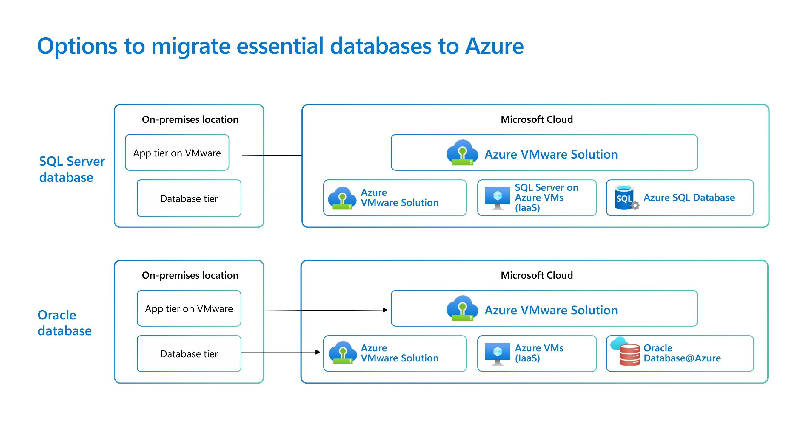

### Key Points

- Multiple options exist to migrate essential databases to Azure, including Infrastructure as a Service (IaaS) and platform-specific managed services.
- Azure VMware Solution (AVS) enables co-location of applications, data, and infrastructure in Microsoft Cloud, reducing latency and data silos.
- Integration with Azure AI services (e.g., Azure OpenAI, Azure Document Intelligence) enhances applications with AI capabilities.
- Azure Arc enables VMs to authenticate securely to Azure services without storing keys, using managed identities.
- Secure connectivity is achieved through private endpoints and private DNS configurations.
- AI readiness and modernization of legacy applications are key drivers for migrating workloads to Azure and AVS.

### Details

- **Migration Options for Databases to Azure**:
  - **Azure VMs (IaaS)**: Lift-and-shift approach where SQL Server databases run on Azure virtual machines.
  - **Azure SQL Database**: Fully managed SQL Server database service on Azure.
  - **Azure VMware Solution (AVS)**: Enables running VMware workloads natively on Azure infrastructure.
  - **Oracle Database@Azure**: Managed Oracle database service on Azure.
  
- **On-Premises Architecture**:
  - Application tier running on VMware infrastructure.
  - Database tier either on-premises or migrated to Azure using AVS or other Azure database services.

- **Azure VMware Solution (AVS)**:
  - Allows co-location of app tier and database tier within Microsoft Cloud.
  - Reduces application latency by keeping data and apps close.
  - Avoids data silos by integrating workloads into Azure ecosystem.
  - Supports secure connectivity via private endpoints and managed identities.

- **AI Integration with AVS**:
  - Organizations are motivated by AI to gain competitive advantage (87% believe AI is critical).
  - AVS workloads can be integrated with Azure AI services such as Azure AI Foundry, Azure Machine Learning, Microsoft Copilot, and GitHub Copilot.
  - AI services handle data fairness, inclusiveness, accountability, reliability, privacy, and transparency.
  - Customizable controls allow organizations to enforce their own policies.

- **Security and Identity Management**:
  - Azure Arc enables VMs in AVS to have managed identities.
  - Managed identities allow VMs to authenticate to Azure services (e.g., storage accounts, Azure OpenAI) without storing keys or passwords.
  - Private endpoints and private DNS zones ensure secure and private connectivity between AVS workloads and Azure services.

- **DNS Flow in AVS Environment**:
  - Application VM queries DNS VM with conditional forwarding to Azure DNS private resolver.
  - Azure Platform DNS resolves queries for private DNS zones, returning private IP addresses.
  - This setup supports secure and private access to Azure services from AVS workloads.

### Definitions

- **Azure VMware Solution (AVS)**: A Microsoft service that allows customers to run VMware workloads natively on Azure infrastructure, enabling seamless migration and integration with Azure services.
- **Managed Identity**: An Azure feature that provides an automatically managed identity in Azure Active Directory for applications to authenticate to Azure services securely without storing credentials.
- **Private Endpoint**: A network interface that connects you privately and securely to a service powered by Azure Private Link.
- **Azure Arc**: A set of technologies that extends Azure management and services to any infrastructure, including on-premises and other clouds, enabling features like managed identities on VMs outside of Azure.
- **Azure AI Foundry**: A suite of Azure AI services and tools to build, train, and deploy AI models.
- **Azure Document Intelligence**: An Azure AI service that extracts information from documents such as PDFs using AI-powered recognition.

### Examples

- **Bank Modernization Demo**:
  - A bank migrated its workloads to AVS to modernize legacy applications.
  - Clients complained about outdated app experiences; the bank wanted AI-enabled apps.
  - The bank leveraged private endpoints and managed identities for secure, confidential data access.
  - The demo environment included:
    - Application VM, DNS VM, SQL VM running inside AVS.
    - Azure services like Storage Account, Azure OpenAI, and Azure Document Intelligence with private endpoints.
  - The application VM was Arc-enabled, allowing it to authenticate to Azure services without keys.
  - The application was rewritten using GitHub Copilot in a few hours.
  - The app demonstrated:
    - Querying account balance.
    - Uploading a PDF bill, parsed by Azure Document Intelligence.
    - Confirming and paying the bill.
    - Viewing updated transactions and balance.
  - Authentication used only service endpoints and names, no stored keys or passwords.

### Key Takeaways 🎯

- Migrating databases to Azure can be done via Azure VMs, Azure SQL Database, AVS, or Oracle Database@Azure depending on workload needs.
- AVS enables seamless migration of VMware workloads with benefits like reduced latency, integrated ecosystem, and secure connectivity.
- Integrating AVS workloads with Azure AI services empowers organizations to modernize applications and leverage AI securely and efficiently.
- Azure Arc and managed identities simplify secure authentication to Azure services without managing secrets.
- Private endpoints and private DNS zones are critical for secure, private communication between AVS workloads and Azure services.
- Practical AI modernization can be rapidly achieved using tools like GitHub Copilot and Azure AI services, demonstrated by the banking app example.

---

## Slide 31: Demo

**Timestamp**: 00:46:54 – 00:47:29

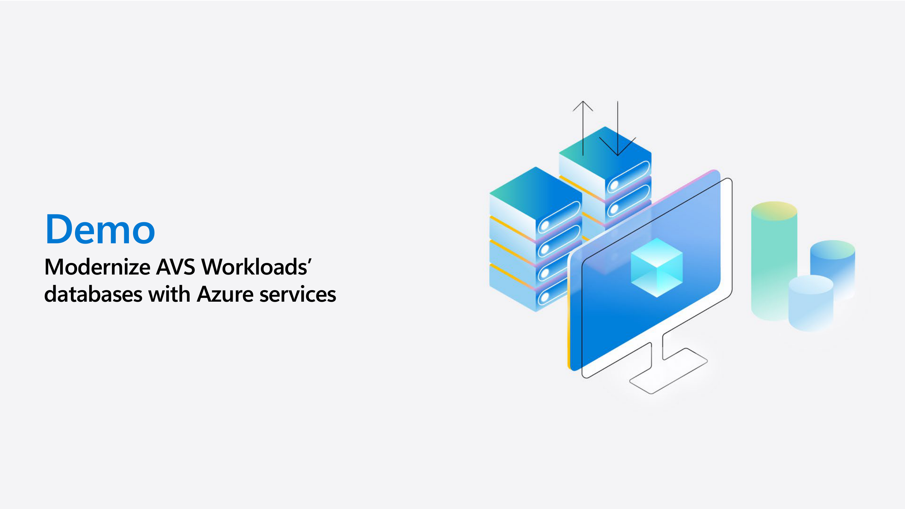

### Key Points

- Modernizing databases for Azure VMware Solution (AVS) workloads using Azure services.
- AVS hosts various data sources that serve as the foundation for modernization.
- Integration of AVS data sources with Azure AI services to build or update applications.
- The workflow involves moving data from AVS into Azure services, then leveraging AI capabilities.

### Details

- **AVS as a Data Source**: The Azure VMware Solution environment contains the existing data sources relevant to workloads running on AVS.
- **Data Flow**: Data from AVS is ingested or landed into Azure services, which act as the platform for modernization.
- **Azure AI Services Integration**: Once data is in Azure services, it can be integrated with Azure AI services. This enables the creation or enhancement of applications and AI agents that utilize the data.
- **Application Modernization**: The process may involve updating existing applications or building new AI-powered agents that leverage the modernized data infrastructure.
- The demo focuses on demonstrating this end-to-end flow from AVS data sources to Azure services and AI integration.

### Definitions

- **Azure VMware Solution (AVS)**: A Microsoft Azure service that allows running VMware workloads natively on Azure infrastructure.
- **Azure AI Services**: A suite of AI and machine learning services provided by Azure to build intelligent applications, including cognitive services, machine learning, and AI agents.

### Examples

- The speaker described a scenario where data residing on AVS is used as input for Azure AI services to build new AI agents or update existing applications, demonstrating the modernization workflow.

### Key Takeaways 🎯

- AVS workloads’ databases can be modernized by moving data into Azure services.
- Azure AI services provide powerful tools to build intelligent applications from AVS data.
- The integration of AVS data sources with Azure AI enables modernization and innovation in application development.
- Understanding the data flow from AVS to Azure services is critical for leveraging AI capabilities effectively.

---

## Slide 32: Demo environment

**Timestamp**: 00:47:59 – 00:50:37

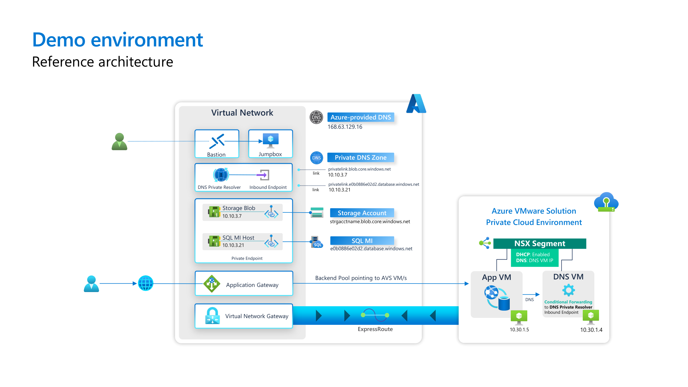

### Key Points

- The demo environment integrates Azure VMware Solution (AVS) with Azure services using a secure, private network architecture.
- Key components include application VMs, DNS VMs, SQL Managed Instance (MI), storage accounts, and Azure AI services, all connected via private endpoints.
- The application VM is Arc-enabled, enabling managed identity-based authentication to Azure services without storing keys on the VM.
- The environment uses private DNS zones, DNS private resolver, and inbound endpoints to manage name resolution securely within the virtual network.
- Connectivity is facilitated through ExpressRoute and virtual network gateways, ensuring secure, private access between AVS and Azure services.
- The architecture includes bastion and jumpbox for secure administrative access.

### Details

- **Demo Environment Architecture**:
  - The environment consists of an Azure VMware Solution (AVS) private cloud hosting multiple VMs:
    - **Application VM**: Runs the demo application and is Arc-enabled.
    - **DNS VM**: Handles DNS services within the AVS environment.
    - **SQL MI Host**: Hosts SQL Managed Instance within the private network.
  - Azure side includes:
    - **Storage Account** with private endpoint (privatelink.blob.core.windows.net).
    - **SQL Managed Instance** with private endpoint (privatelink.e0b0886e02d2.database.windows.net).
    - **Azure AI services** such as OpenAI and Azure Document Intelligence, each with private endpoints.
  - The private endpoints ensure that traffic between AVS VMs and Azure services remains on the Microsoft backbone network, avoiding exposure to the public internet.

- **Networking and DNS**:
  - The virtual network includes private IP addresses for VMs (e.g., 10.10.3.7, 10.10.3.21 for app VMs).
  - Private DNS zones (e.g., strgacctname.blob.core.windows.net) are used to resolve Azure service endpoints privately.
  - Azure-provided DNS and a DNS private resolver with inbound endpoint are configured to handle DNS queries securely.
  - Conditional forwarding is set up from the DNS VM to the DNS private resolver inbound endpoint, ensuring proper name resolution for private endpoints.
  - DHCP is enabled with DNS configured to point to the DNS VM IP, facilitating dynamic IP assignment and DNS resolution within the AVS environment.

- **Security and Access**:
  - Bastion and jumpbox VMs provide secure administrative access to the AVS environment.
  - Managed identities are used for authentication from the Arc-enabled application VM to Azure services, eliminating the need for storing credentials on the VM.
  - ExpressRoute and virtual network gateways provide private, high-throughput connectivity between on-premises or AVS environments and Azure.

- **Arc-enabled VM**:
  - The application VM is Arc-enabled, which means it is connected to Azure Arc.
  - This enables the VM to have a managed identity, allowing it to authenticate securely to Azure services such as Storage Account and OpenAI without storing keys locally.
  - This approach enhances security and simplifies identity management in hybrid environments.

### Definitions

- **Azure VMware Solution (AVS)**: A Microsoft Azure service that allows running VMware workloads natively on Azure infrastructure within a private cloud environment.
- **Arc-enabled VM**: A virtual machine connected to Azure Arc, enabling management and identity features such as managed identities for secure authentication to Azure services.
- **Private Endpoint**: A network interface that connects privately and securely to Azure services over a private IP within a virtual network.
- **Private DNS Zone**: A DNS zone hosted in Azure DNS that allows private name resolution within a virtual network.
- **DNS Private Resolver**: A managed DNS service that resolves DNS queries for private endpoints and supports inbound endpoints for hybrid DNS resolution.
- **Managed Identity**: An Azure Active Directory identity automatically managed by Azure, used to authenticate to Azure services without storing credentials.
- **ExpressRoute**: A private connection service that links on-premises networks or AVS environments to Azure, bypassing the public internet.
- **Bastion**: A managed service that provides secure and seamless RDP/SSH connectivity to VMs without exposing them to the public internet.
- **Jumpbox**: A hardened VM used as a secure entry point to access other VMs in a private network.

### Examples

- The demo runs an application VM inside AVS that accesses Azure Storage Account and OpenAI services via private endpoints.
- The application VM uses its Arc-enabled managed identity to authenticate to Azure services securely without storing any keys.
- DNS queries from the AVS environment are forwarded conditionally to the Azure DNS private resolver inbound endpoint to resolve private endpoints correctly.

### Key Takeaways 🎯

- The demo environment showcases a secure hybrid architecture integrating AVS with Azure services using private endpoints and private DNS.
- Arc-enabled VMs gain managed identities, enabling secure, keyless authentication to Azure services.
- Private DNS zones and DNS private resolver inbound endpoints are critical for resolving Azure service endpoints privately within the virtual network.
- ExpressRoute and virtual network gateways ensure secure, private connectivity between AVS and Azure.
- Bastion and jumpbox provide secure administrative access without exposing VMs to the public internet.

---

## Slide 33: Slide 33

**Timestamp**: 00:47:29 – 00:47:59

### Key Points

- No visual or textual content was presented on this slide.
- No speaker narration was provided during this slide.
- The slide likely served as a pause, transition, or visual break in the presentation.

### Details

- Since the slide contained no text or images and the speaker did not provide any narration during this time segment, there are no concepts, definitions, or examples to extract.
- This slide may have been used to allow the audience to reflect on previous content, prepare for the next topic, or serve as a placeholder.
- Without additional context from surrounding slides or narration, no substantive notes can be derived from this slide alone.

### Definitions

- None provided.

### Examples

- None provided.

### Key Takeaways 🎯

- No new information was introduced on this slide.
- Focus should be on the content before and after this slide for study purposes.

---

## Slide 34: Demo

**Timestamp**: 00:47:29 – 00:56:16

### Key Points

- Demonstration of integrating AI-enabled applications securely with Azure services.
- Use case of a bank migrating to Azure VMware Solution (AVS) to modernize legacy applications.
- Leveraging secure connectivity through private endpoints.
- Use of managed identities for secure authentication and integration.
- Data from AVS flows into Azure services, which then integrate with Azure AI services to build intelligent applications and agents.

### Details

- The demo focuses on showing how AI-enabled applications can be integrated securely with Azure services, emphasizing practical implementation.
- The example centers on a bank that has migrated its infrastructure to Azure VMware Solution (AVS).
  - The bank’s clients were dissatisfied with the legacy applications.
  - The bank aims to modernize these applications by incorporating AI capabilities.
- To maintain security, the bank uses **private endpoints** to ensure secure connectivity between AVS and Azure services.
- **Managed identities** are employed to handle authentication securely without managing credentials manually.
- The data flow:
  - Various data sources reside within AVS.
  - This data lands into Azure services securely.
  - Azure AI services are then leveraged to build AI-powered applications and intelligent agents.
- This integration demonstrates how legacy systems can be modernized by combining AVS infrastructure with Azure’s AI and security features.

### Definitions

- **Azure VMware Solution (AVS)**: A Microsoft Azure service that allows organizations to run VMware workloads natively on Azure infrastructure.
- **Private Endpoint**: A network interface that connects you privately and securely to a service powered by Azure Private Link, ensuring traffic remains within the Azure network.
- **Managed Identity**: An Azure Active Directory feature that provides an automatically managed identity in Azure AD for applications to use when connecting to resources, eliminating the need for credentials in code.

### Examples

- The bank scenario where legacy applications are modernized by integrating AI capabilities.
- Use of private endpoints to secure connectivity between AVS and Azure services.
- Use of managed identities to authenticate and authorize access to Azure services without manual credential management.

### Key Takeaways 🎯

- AI-enabled applications can be securely integrated with Azure services using private endpoints and managed identities.
- Migrating legacy systems like those in a bank to AVS enables modernization through AI.
- Secure connectivity and identity management are critical components in building modern, AI-powered applications on Azure.
- The demo illustrates a practical flow from AVS data sources to Azure AI services, showcasing end-to-end integration.

---

## Slide 35: Transforming Enterprise IT with Azure innovation

**Timestamp**: 00:47:29 – 00:48:31

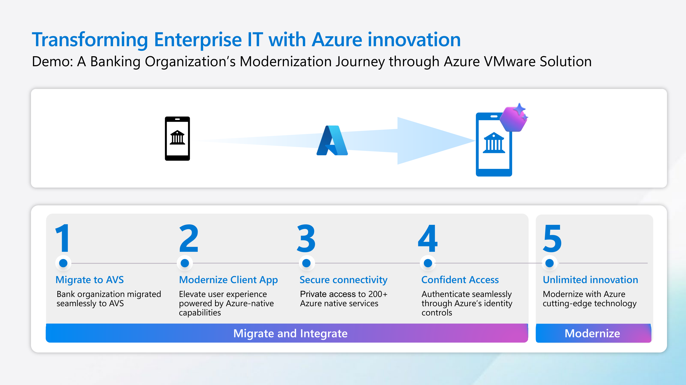

### Key Points

- Azure VMware Solution (AVS) enables seamless migration for enterprises, exemplified by a banking organization.
- Modernizing legacy client applications with Azure-native capabilities, including AI, enhances user experience.
- Secure connectivity is achieved through private endpoints providing private access to over 200 Azure native services.
- Azure’s identity controls facilitate seamless and confident authentication.
- The integration of migration, modernization, and secure connectivity supports unlimited innovation using Azure’s cutting-edge technology.

### Details

- The slide presents a demo scenario illustrating how a banking organization modernizes its IT infrastructure using Azure VMware Solution (AVS).
- **Migration to AVS**: The bank successfully migrated its existing workloads to AVS without disruption, enabling a smooth transition from legacy infrastructure.
- **Modernizing Client Applications**: The bank’s clients were dissatisfied with the outdated user experience of their applications. To address this, the bank is modernizing these apps by integrating Azure-native capabilities, such as AI, to elevate the user experience.
- **Secure Connectivity**: The bank leverages **private endpoints** to establish secure, private access to more than 200 Azure native services. This approach ensures data and service access remain within a secure network boundary, reducing exposure to public internet risks.
- **Confident Access**: Authentication is managed seamlessly through Azure’s identity controls, specifically using **managed identity**. This allows secure, passwordless authentication for applications and services, enhancing security and simplifying access management.
- The demo aims to showcase how migration, modernization, and secure connectivity work together in a real-world banking scenario, highlighting the practical benefits of Azure innovation.
- The slide emphasizes the broader theme of **unlimited innovation** by combining migration and integration with Azure’s cutting-edge technology stack.

### Definitions

- **Azure VMware Solution (AVS)**: A Microsoft Azure service that allows enterprises to migrate and run VMware workloads natively on Azure infrastructure, enabling seamless integration with Azure services.
- **Private Endpoint**: A network interface that connects privately and securely to Azure services over a private link, avoiding exposure to the public internet.
- **Managed Identity**: An Azure feature that provides applications with an automatically managed identity in Azure Active Directory, enabling secure authentication without managing credentials.

### Examples

- The banking organization migrated its legacy VMware workloads to AVS seamlessly.
- The bank’s clients were experiencing poor user experience with legacy applications, prompting modernization using AI-powered Azure-native capabilities.
- The bank uses private endpoints to securely connect to over 200 Azure native services.
- Authentication for the bank’s applications is handled through Azure’s managed identity, ensuring secure and seamless access.

### Key Takeaways 🎯

- Azure VMware Solution enables smooth migration of legacy enterprise workloads to Azure.
- Modernizing client applications with Azure-native AI capabilities significantly improves user experience.
- Secure connectivity via private endpoints protects access to Azure services.
- Azure’s managed identity simplifies and secures authentication processes.
- Combining migration, modernization, and secure connectivity on Azure fosters continuous innovation in enterprise IT.

---

## Slide 36: Demo environment

**Timestamp**: 00:48:31 – 00:55:43

### Key Points

- The demo environment is based on Azure VMware Solution (AVS) private cloud with integrated Azure services.
- Key Azure services used include Azure Storage Account, Azure OpenAI, and Azure Document Intelligence, each accessed via private endpoints.
- DNS architecture involves DNS Private Resolver, Private DNS Zones, and conditional forwarding to enable private DNS resolution within the AVS environment.
- The application VM is Arc-enabled, which provides it with a managed identity for keyless authentication to Azure services.
- Authentication leverages managed identities instead of storing keys or passwords on the VM.
- The DNS resolution flow involves queries from the application VM to a DNS VM, conditional forwarding to Azure DNS Private Resolver, and finally Azure Platform DNS to resolve private endpoints.
- The demo application uses Azure OpenAI as a Large Language Model (LLM) and Azure Document Intelligence for PDF document recognition.
- Network security is enforced by disabling public access to AI services, allowing only private endpoint connections.
- The demo app was developed rapidly using GitHub Copilot, showcasing modern AI-assisted development.

### Details

- **Demo Environment Architecture**  
  The environment runs on Azure VMware Solution (AVS), a private cloud setup with virtual networks and NSX segments. Key components include:  
  - **Jumpbox and Bastion** for secure access.  
  - **DNS Private Resolver and Inbound Endpoint** to handle DNS queries within the private network.  
  - **Private Endpoints** for Azure services such as Storage Blob, OpenAI, and Cognitive Services, ensuring traffic remains within the private network.  
  - **Virtual Network Gateway and ExpressRoute** for connectivity.  
  - **DNS VM** configured with conditional forwarding to the Azure DNS Private Resolver (IP 10.30.1.6).  
  - **Application VM** is Arc-enabled, enabling managed identity authentication.

- **Arc-Enabled VM and Managed Identity**  
  The application VM is Azure Arc-enabled, which means:  
  - It is registered with Azure Arc, allowing Azure management and security capabilities on-premises or in AVS.  
  - It receives a **system-assigned managed identity**, enabling it to authenticate to Azure services without storing keys or secrets locally.  
  - This identity is granted roles such as **Cognitive Services OpenAI Contributor** to access Azure OpenAI and Document Intelligence services securely.

- **DNS Resolution Flow**  
  - The web app running on the Arc-enabled VM initiates DNS queries for Azure services (e.g., Azure OpenAI).  
  - Queries go to the **DNS VM** in the AVS environment, which uses **conditional forwarding** to the **DNS Private Resolver** in Azure via an inbound endpoint.  
  - The DNS Private Resolver forwards queries to **Azure Platform DNS** (notably IP 168.63.129.16, a multifunctional Azure IP used for DNS and other services).  
  - Azure Platform DNS recognizes the virtual network linked to the **Private DNS Zone** for the service and returns the private IP address of the private endpoint.  
  - The DNS VM returns the private IP to the application VM, enabling private network communication with Azure services.

- **Azure Services and Private Endpoints**  
  - Azure Storage Account, Azure OpenAI, and Azure Document Intelligence are all accessed via private endpoints with private IPs (e.g., 10.10.4.8 for OpenAI).  
  - Private DNS zones contain A records mapping service names (e.g., resource.openai.azure.com) to these private IPs.  
  - Network security is enforced by disabling public access on these services, allowing only private endpoint connections.

- **Demo Application**  
  - The app demonstrates a banking scenario where a user can:  
    - Query account balance.  
    - Upload a PDF bill, which is parsed using Azure Document Intelligence.  
    - Confirm and make payments using Azure OpenAI for conversational interaction.  
    - View recent transactions reflecting the payment.  
  - The app was developed quickly using GitHub Copilot, highlighting AI-assisted development productivity.  
  - The app configuration contains no keys or passwords, only service endpoints and deployment info, relying entirely on managed identity for authentication.

- **Security and Access Control**  
  - The Arc-enabled VM’s managed identity is assigned appropriate Azure RBAC roles to access cognitive services.  
  - The AI Foundry service’s networking configuration disables all public access, enforcing private endpoint-only connectivity.  
  - This setup ensures secure, keyless, private communication between AVS-hosted VMs and Azure AI services.

### Definitions

- **Azure VMware Solution (AVS)**: A Microsoft Azure service that allows running VMware workloads natively on Azure infrastructure in a private cloud environment.
- **Arc-enabled VM**: A virtual machine connected to Azure Arc, enabling Azure management and security features on non-Azure or hybrid environments.
- **Managed Identity**: An automatically managed identity in Azure Active Directory used to authenticate to Azure services without storing credentials in code.
- **Private Endpoint**: A network interface that connects you privately and securely to a service powered by Azure Private Link.
- **DNS Private Resolver**: A managed DNS resolver service in Azure that enables DNS resolution for private endpoints within virtual networks.
- **Conditional Forwarding**: DNS configuration that forwards queries for specific domains to designated DNS servers.
- **Azure Platform DNS (168.63.129.16)**: A special IP address in Azure used for DNS services and other platform functions.
- **Private DNS Zone**: A DNS zone hosted in Azure that allows resolution of domain names to private IP addresses within a virtual network.

### Examples

- The demo app allows a user to:  
  - Ask for their account balance.  
  - Upload a PDF bill, which is parsed by Azure Document Intelligence to extract payment info.  
  - Confirm and make a payment using conversational AI powered by Azure OpenAI.  
  - View updated recent transactions reflecting the payment.

- The application VM authenticates to Azure OpenAI and Document Intelligence services using its Arc-enabled managed identity, without any stored keys.

- DNS resolution example:  
  - The app queries resource.openai.azure.com.  
  - DNS VM forwards to DNS Private Resolver → Azure Platform DNS → Private DNS Zone.  
  - Private DNS Zone returns private IP 10.10.4.8 for OpenAI service.  
  - App connects privately to OpenAI service at 10.10.4.8.

### Key Takeaways 🎯

- Azure VMware Solution can be integrated with Azure services using private endpoints and private DNS zones to ensure secure, private connectivity.
- Arc-enabled VMs gain managed identities, enabling keyless authentication to Azure services, improving security and simplifying credential management.
- DNS architecture with conditional forwarding and private DNS zones is critical for resolving Azure service endpoints privately within AVS.
- Modern AI-assisted development tools like GitHub Copilot can accelerate building complex cloud-native applications.
- Disabling public access and enforcing private endpoint connectivity enhances security posture for Azure AI services.
- Understanding the DNS flow and managed identity usage is essential for designing secure hybrid cloud applications with Azure services.

---

## Slide 37: Slide 37

**Timestamp**: 00:55:43 – 00:55:43

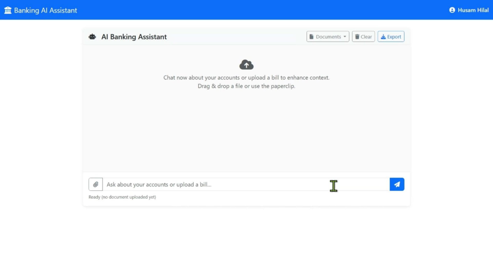

### Key Points

- No content was presented on the slide.
- No narration or explanation was provided by the speaker during this time.

### Details

- Slide 37 contained no text, images, or visual information.
- The speaker did not provide any commentary or additional information related to this slide.
- This slide likely served as a placeholder, transition, or pause in the presentation rather than conveying new material.

### Definitions

- None provided.

### Examples

- None provided.

### Key Takeaways 🎯

- There is no new information to study from Slide 37.
- Focus should remain on the preceding and following slides for substantive content.

---

## Slide 38: Continue Learning

**Timestamp**: 00:56:50 – 00:57:21

### Key Points

- Continued learning is essential for mastering AVS (Azure VMware Solution).
- Several official resources are available for further study.
- Documentation and structured learning paths provide foundational knowledge.
- Interactive demos offer hands-on experience and practical understanding.

### Details

- The slide encourages learners to **continue their education** beyond the presentation.
- The speaker highlights three main resources for ongoing learning about AVS:
  - **Documentation page**: The primary source for detailed technical information and official guidance.
  - **AVS Learning Path**: A structured educational path designed to guide learners through the concepts and practical skills needed to work with AVS. Accessible at **aka.ms/avspath**.
  - **Interactive Demos**: Available at **aka.ms/AVSDemos**, these demos include many of the examples shown during the presentation. They are click-through, allowing users to engage interactively and gain hands-on experience with AVS features and workflows.
- These resources are intended to deepen understanding and provide practical exposure, which is crucial for effectively using AVS in real-world scenarios.
- The emphasis on interactive demos suggests a learning approach that combines theory with practice, enhancing retention and skill development.

### Definitions

- **AVS (Azure VMware Solution)**: A Microsoft Azure service that allows users to run VMware workloads natively on Azure infrastructure.
- **Learning Path**: A curated sequence of educational content designed to progressively build knowledge and skills on a specific topic.
- **Interactive Demos**: Online, guided simulations or walkthroughs that allow users to explore and practice using a technology in a controlled, hands-on environment.

### Examples

- The speaker references the demos shown during the presentation, which are available as interactive click-through demos online. These allow learners to replicate and explore the scenarios demonstrated live.

### Key Takeaways 🎯

- To effectively master AVS, leverage the official documentation and structured learning paths.
- Use the interactive demos to gain practical, hands-on experience.
- Continuing education through these resources will solidify understanding and improve your ability to work with AVS confidently.

---

## Slide 39: Kickstart your AVS journey today

**Timestamp**: 00:57:21 – 00:58:22

### Key Points

- Multiple resources are available to help you start and advance your Azure VMware Solution (AVS) journey.
- These resources include documentation, learning paths, interactive demos, and landing zone guidance.
- The Cloud Adoption Framework (CAF) Landing Zone for AVS is a key resource for deployment best practices.
- Joining the AVS Pros LinkedIn group is recommended to stay updated with the latest AVS news, workshops, and enablement content.
- All these resources and communities are freely accessible anytime.

### Details

- **Kickstart your AVS journey today**: The slide encourages users to begin exploring and using Azure VMware Solution immediately by leveraging a variety of Microsoft-provided resources.
  
- **Documentation (aka.ms/AVSDocs)**: Comprehensive official documentation is available to understand AVS concepts, configurations, and operational guidance.

- **Learning Path (aka.ms/AVSPath)**: Structured learning paths help users gain step-by-step knowledge and skills related to AVS.

- **Interactive Demos (aka.ms/AVSDemos)**: Hands-on demos allow users to explore AVS features interactively, providing practical experience.

- **CAF Landing Zone (aka.ms/AVSLZA)**: This refers to the Cloud Adoption Framework Landing Zone tailored for AVS. It provides best practices and templates for setting up a secure, scalable, and compliant AVS environment. The speaker emphasized this as a critical part of the cloud adoption journey.

- **Community Engagement (partner.microsoft.com and aka.ms/AVSPros)**: The AVS Pros LinkedIn group is a community platform where users can connect, share knowledge, and receive updates on AVS service enhancements, announcements, workshops, and enablement content. The speaker strongly encouraged joining this group to stay current with AVS modernization efforts.

- **Accessibility and Cost**: All these resources and community engagements are free and available anytime, allowing users to learn and engage at their own pace.

### Definitions

- **Azure VMware Solution (AVS)**: A Microsoft Azure service that enables running VMware workloads natively on Azure infrastructure.

- **Cloud Adoption Framework (CAF) Landing Zone**: A set of guidelines, best practices, and templates designed to help organizations deploy cloud environments that are secure, scalable, and compliant. The AVS-specific landing zone adapts these principles for VMware workloads on Azure.

- **AVS Pros Group**: A LinkedIn community for professionals interested in Azure VMware Solution, providing a platform for updates, discussions, and learning opportunities.

### Examples

- The speaker mentioned the **CAF Landing Zone for AVS** as an example of a resource that helps users deploy AVS environments following best practices.

- Joining the **AVS Pros LinkedIn group** was highlighted as a practical step to stay informed about new announcements, workshops, and enablement content related to AVS.

### Key Takeaways 🎯

- Start your AVS learning journey using Microsoft’s free resources: documentation, learning paths, demos, and landing zone guidance.
- Use the Cloud Adoption Framework Landing Zone (aka.ms/AVSLZA) to deploy AVS environments effectively.
- Join the AVS Pros LinkedIn group (aka.ms/AVSPros) to stay connected with the AVS community and receive ongoing updates and support.
- All these resources are freely accessible anytime, enabling continuous learning and engagement.

---

## Slide 40: Click-through demos

**Timestamp**: 00:58:22 – 00:59:00

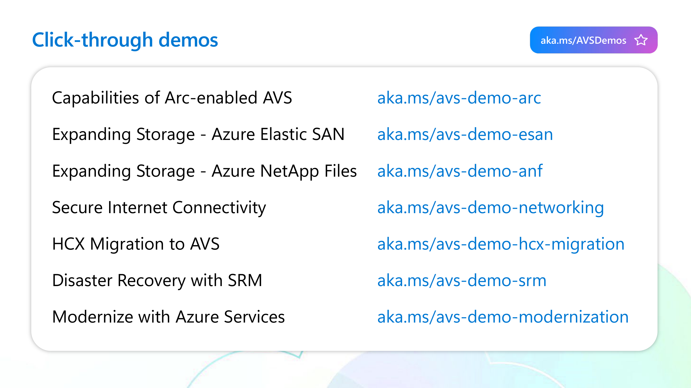

### Key Points

- The slide provides a set of clickable demo links related to Azure VMware Solution (AVS).
- These demos cover various capabilities and scenarios including Arc-enabled AVS, storage expansion, secure networking, migration, disaster recovery, and modernization.
- The demos are freely accessible and designed for hands-on learning anytime.
- The speaker emphasizes that these links offer comprehensive, practical environments to explore AVS features beyond the brief overview shown earlier in the presentation.

### Details

- **Click-through demos**: Interactive, web-based demonstrations that allow users to explore AVS capabilities in a practical, self-paced manner.
- The slide lists specific demo topics with corresponding short URLs (aka.ms links) for easy access:
  - **Arc-enabled AVS**: Demonstrates integration of AVS with Azure Arc, enabling hybrid management and governance.
  - **Expanding Storage - Azure Elastic SAN**: Shows how to scale storage using Azure Elastic SAN with AVS.
  - **Expanding Storage - Azure NetApp Files**: Demonstrates storage expansion using Azure NetApp Files.
  - **Secure Internet Connectivity**: Covers networking configurations to securely connect AVS environments to the internet.
  - **HCX Migration to AVS**: Demonstrates migration workflows using VMware HCX to move workloads into AVS.
  - **Disaster Recovery with SRM**: Shows disaster recovery scenarios using VMware Site Recovery Manager (SRM) with AVS.
  - **Modernize with Azure Services**: Explores how to modernize AVS workloads by integrating with native Azure services.
- The speaker notes that the demos shown during the presentation were only a small part of what is available through these links.
- These demos provide a full, hands-on environment to deepen understanding of AVS features and use cases.
- The demos are accessible anytime and free of charge, making them a valuable resource for learning and experimentation.
- The general link aka.ms/AVSDemos serves as a hub to access all these individual demos.

### Definitions

- **Azure VMware Solution (AVS)**: A Microsoft Azure service that allows customers to run VMware workloads natively on Azure infrastructure.
- **Azure Arc**: A service that enables management and governance of resources across on-premises, multi-cloud, and edge environments.
- **Azure Elastic SAN**: A scalable, high-performance storage service in Azure designed for SAN workloads.
- **Azure NetApp Files**: A fully managed file storage service in Azure optimized for enterprise workloads.
- **HCX (Hybrid Cloud Extension)**: VMware technology for seamless migration and workload mobility between on-premises and cloud environments.
- **Site Recovery Manager (SRM)**: VMware disaster recovery orchestration tool that automates failover and failback processes.

### Examples

- The speaker referenced the demo on **Arc-enabled AVS** as an example, noting that only a small part was shown during the presentation, but the full demo is available via the provided link.
- The **Modernize with Azure Services** demo was also mentioned as part of the presentation, illustrating how AVS workloads can be enhanced by integrating Azure native services.
- Other demos like **HCX Migration** and **Disaster Recovery with SRM** provide practical scenarios for migrating and protecting AVS workloads.

### Key Takeaways 🎯

- A comprehensive set of free, click-through demos is available to explore AVS capabilities in depth.
- These demos cover critical areas such as hybrid management, storage expansion, secure networking, migration, disaster recovery, and modernization.
- The demos are accessible anytime via aka.ms links, enabling hands-on learning and experimentation.
- Leveraging these demos can significantly enhance understanding of AVS and its integration with Azure services.

---

## Slide 41: Questions

**Timestamp**: 01:04:18 – 01:04:48

### Key Points

- The slide signals the start of a Q&A session.
- The speaker checks if the presentation slides are advancing correctly.
- Interaction with the audience and moderators is encouraged to confirm technical functionality.

### Details

- The slide simply displays the word "Questions," indicating that the presenter is opening the floor for audience inquiries.
- The speaker uses this moment to verify that the slide deck is progressing as intended by requesting a thumbs-up from the audience or moderators.
- The speaker specifically addresses "Carl," presumably a moderator or technical assistant, confirming that the slides are advancing properly.
- This interaction ensures smooth continuation of the presentation and readiness to engage with questions.

### Definitions

- No technical terms or definitions were introduced on this slide or in the narration.

### Examples

- No practical examples or demonstrations were provided during this segment.

### Key Takeaways 🎯

- The "Questions" slide marks the transition to audience engagement.
- Confirming slide functionality is important to maintain flow during presentations.
- Interaction with moderators or audience members can help troubleshoot technical issues in real time.

---

## Slide 42: AVS

**Timestamp**: 01:04:18 – 01:04:48

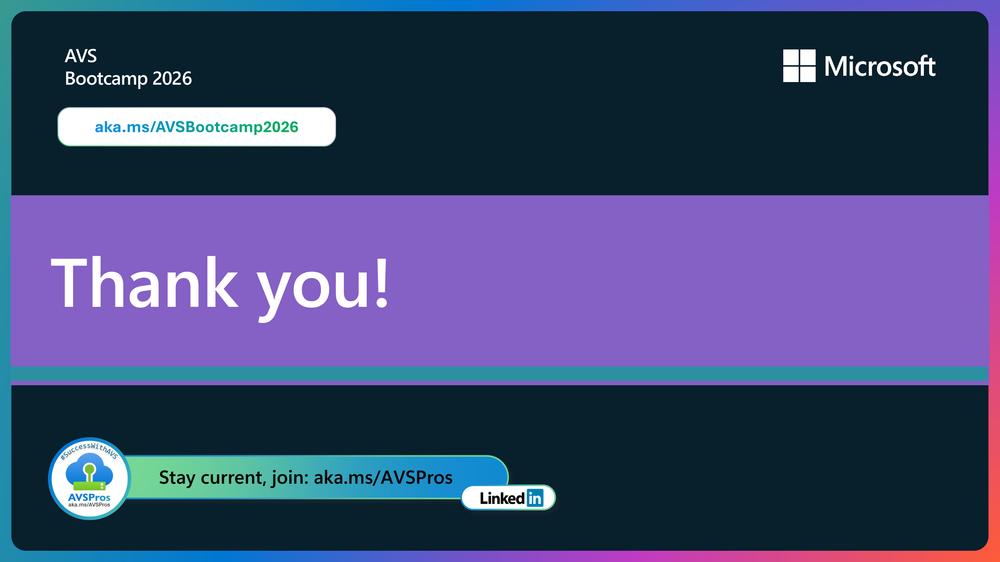

### Key Points

- The slide promotes the **AVS Bootcamp 2026** event.
- Encourages staying current with AVS (Azure VMware Solution) by joining the community or resource hub.
- Provides a direct link for ongoing learning and updates: **aka.ms/AVSPros**.

### Details

- **AVS Bootcamp 2026** is likely an upcoming or ongoing training event focused on Azure VMware Solution, designed to help professionals deepen their knowledge and skills.
- The slide serves as a call to action for attendees or viewers to stay engaged with the latest developments in AVS.
- The URL **aka.ms/AVSPros** is a shortened Microsoft link directing users to a resource page or community hub where they can find more information, updates, training materials, or networking opportunities related to AVS.
- Although there was no speaker narration for this slide, the content implies the importance of continuous learning and community involvement to keep pace with evolving technologies in Azure VMware Solution.

### Definitions

- **AVS (Azure VMware Solution)**: A Microsoft service that enables running VMware workloads natively on Azure infrastructure, combining VMware’s virtualization technology with Azure’s cloud capabilities.

### Examples

- No specific examples or demonstrations were provided on this slide or in the narration.

### Key Takeaways 🎯

- To stay current with Azure VMware Solution developments, professionals should engage with the AVS Bootcamp 2026 and utilize resources available at aka.ms/AVSPros.
- Continuous learning and community participation are essential for mastering AVS technologies and keeping skills up to date.

---

## Slide 43: Azure VMware Solution

**Timestamp**: 01:04:48 – 01:05:20

### Key Points

- Azure VMware Solution (AVS) is a **host-based solution**.
- AVS provides the **entire host environment**, similar to deploying VMware on-premises.
- The host includes **CPU, memory, storage**, and additional components.
- Understanding AVS as a full host environment is foundational before discussing external storage options.

### Details

- **Azure VMware Solution (AVS)** is designed to deliver a VMware environment hosted on Azure infrastructure.
- Being a **host-based solution** means that AVS provides customers with full access to the physical host resources, not just virtualized slices or partial services.
- This setup mirrors the traditional on-premises VMware deployment model, where the entire host (hardware and software stack) is dedicated to the VMware environment.
- The host includes critical resources such as:
  - **CPU**: Processing power allocated to run virtual machines.
  - **Memory**: RAM available for VM workloads.
  - **Storage**: Local storage resources on the host.
  - **And more**: This implies networking, management components, and other host-level resources.
- This foundational understanding is important as the presentation moves into discussing **external storage options** for AVS, which complement or extend the host’s native storage capabilities.

### Definitions

- **Azure VMware Solution (AVS)**: A Microsoft Azure service that provides a fully managed VMware environment running on Azure infrastructure, enabling customers to run VMware workloads natively in the cloud.
- **Host-based solution**: A deployment model where the entire physical host (including CPU, memory, storage, and other resources) is provided to the user, similar to traditional on-premises VMware deployments.

### Examples

- No specific practical examples or demonstrations were provided in this segment.

### Key Takeaways 🎯

- AVS delivers a full VMware host environment on Azure, replicating the on-premises VMware experience.
- The host includes all essential resources (CPU, memory, storage), which is critical to understand before exploring external storage options.
- Recognizing AVS as a host-based solution sets the stage for understanding how external storage integrates with or supplements the native host storage.

---

## Slide 44: Azure VMware Solution global availability

**Timestamp**: 01:03:45 – 01:04:18

### Key Points

- Azure VMware Solution (AVS) is a Microsoft first-party service, fully owned, operated, and supported by Microsoft.
- AVS is globally available in 37 Azure regions.
- Four new regions were added in the last year: Spain Central, Norway East, Korea Central, and Malaysia West.
- AVS plays a critical role in Microsoft’s cloud migration strategy.
- Azure Infrastructure as a Service (IaaS) is available in over 70 regions, showing broader global coverage compared to AVS.
- Microsoft continues to invest in expanding AVS capabilities and regional availability.

### Details

- **Azure VMware Solution (AVS) Global Availability:**
  - AVS is deployed in 37 Azure regions worldwide, providing customers with extensive geographic options for VMware workloads on Azure.
  - The slide lists all 37 regions, including major US regions (West US, East US, Central US, etc.), Canadian regions (Canada Central, Canada East), European regions (North Europe, UK South, West Europe, France Central, Germany West Central, Sweden Central, Switzerland West, Switzerland North, Italy North, Spain Central, Norway East), Middle East and Africa (South Africa North, Qatar Central, UAE North), Asia-Pacific (India Central, Japan West, Japan East, Australia Southeast, Australia East, Korea Central, East Asia, Southeast Asia, Malaysia West), and US Government regions (US Gov AZ, US Gov VA).
  - The four regions added in the last year are Spain Central, Norway East, Korea Central, and Malaysia West, highlighting ongoing expansion.
  
- **Microsoft First-Party Offering:**
  - AVS is a Microsoft-owned and operated service, meaning Microsoft manages the infrastructure, support, and operations globally.
  - This ownership ensures consistent service quality, security, and integration with Azure services.
  
- **Strategic Importance:**
  - AVS is a key component of Microsoft’s cloud migration strategy, enabling enterprises to move VMware-based workloads to Azure seamlessly.
  - The solution supports hybrid cloud scenarios and modernization efforts by leveraging Azure’s global infrastructure.
  
- **Comparison with Azure IaaS:**
  - While AVS is available in 37 regions, Azure IaaS services are available in over 70 regions, indicating a broader footprint for general Azure infrastructure services.
  - This distinction is important for planning workload placement and understanding service availability.

- **Continuous Investment:**
  - Microsoft is actively investing in expanding AVS both in terms of geographic availability and platform capabilities.
  - This ongoing development ensures AVS remains a competitive and evolving solution for VMware workloads on Azure.

- **Reference:**
  - The slide includes a URL to the Azure global infrastructure products by region table for up-to-date information:  
    <https://azure.microsoft.com/en-us/explore/global-infrastructure/products-by-region/table>

### Definitions

- **Azure VMware Solution (AVS):**  
  A Microsoft first-party service that enables customers to run VMware workloads natively on Azure infrastructure, fully managed and supported by Microsoft.

- **Microsoft First-Party Offering:**  
  A service that is owned, operated, and supported directly by Microsoft, ensuring integrated management and support.

- **Azure Infrastructure as a Service (IaaS):**  
  Core Azure cloud services that provide virtualized computing resources over the internet, available in more than 70 regions globally.

### Examples

- The speaker specifically mentioned the addition of four new AVS regions in the last year as practical examples of Microsoft’s expansion efforts:  
  - Spain Central  
  - Norway East  
  - Korea Central  
  - Malaysia West

### Key Takeaways 🎯

- Azure VMware Solution is a globally available, Microsoft-managed service running in 37 regions, supporting enterprise VMware workloads on Azure.
- Microsoft continues to expand AVS regionally, adding four new regions in the past year, reflecting its strategic importance.
- AVS complements Azure IaaS, which has a broader regional footprint, enabling flexible cloud migration and hybrid cloud strategies.
- Being a first-party offering, AVS benefits from Microsoft’s direct ownership, operation, and support, ensuring high service quality and integration.

---

## Slide 45: AVS SKUs & Hardware Details

**Timestamp**: 01:04:48 – 01:05:50

### Key Points

- Azure VMware Solution (AVS) offers multiple SKUs (host/node types) with varying CPU, memory, and storage configurations.
- Each AVS SKU corresponds to a specific hardware profile with defined CPU cores, RAM, and vSAN storage capacity.
- AVS hosts, SKUs, and nodes are interchangeable terms referring to the same concept.
- The slide lists five AVS SKUs: AV36P, AV48, AV52, AV64 Gen 1, and AV64 Gen 2.
- Storage capacity and type vary across SKUs, with NVMe-based vSAN storage and Intel Optane cache used in some configurations.
- AVS clusters require a minimum of 3 nodes and can scale up to 96 nodes per private cloud instance.
- The session focuses on AVS storage capabilities and how to extend them, emphasizing external storage integration.

### Details

- **AVS SKUs and Hardware Overview:**
  - AVS provides different SKU sizes to meet various workload requirements, each with a fixed amount of CPU, RAM, and storage.
  - The terms "host," "SKU," and "node type" are used interchangeably to describe these hardware configurations.
  
- **CPU Specifications:**
  - AV36P: Intel Xeon Gold 6240 (Cascade Lake), 36 cores @ 2.6 GHz base, 3.9 GHz turbo, 72 vCPUs.
  - AV48: Intel Xeon Gold 6442Y (Sapphire Rapids), 48 cores @ 2.6 GHz base, 4.0 GHz turbo, 96 vCPUs.
  - AV52: Intel Xeon Platinum 8270 (Cascade Lake), 52 cores @ 2.7 GHz base, 4.0 GHz turbo, 104 vCPUs.
  - AV64 Gen 1 & Gen 2: Intel Xeon Platinum 8370C (Ice Lake), 64 cores @ 2.8 GHz base, 3.5 GHz turbo, 128 vCPUs.
  
- **Memory:**
  - AV36P: 768 GB RAM
  - AV48: 1,024 GB RAM
  - AV52: 1,536 GB RAM
  - AV64 Gen 1 & Gen 2: 1,024 GB RAM each
  
- **vSAN Storage:**
  - AV36P: Raw 20.7 TB NVMe OSA, vSAN capacity 19.2 TB NVMe OSA, 1.5 TB Intel Optane cache.
  - AV48: vSAN capacity 25.6 TB NVMe ESA.
  - AV52: Raw 39.9 TB NVMe OSA, vSAN capacity 38.4 TB NVMe OSA, 1.5 TB Intel Optane cache.
  - AV64 Gen 1: Raw 19.2 TB NVMe OSA, vSAN capacity 15.36 TB NVMe OSA, 3.84 TB NVMe cache.
  - AV64 Gen 2: vSAN capacity 21.12 TB NVMe ESA.
  
- **Hardware Origin:**
  - AV36P, AV48, AV52, AV64 Gen 1 are Dell hardware.
  - AV64 Gen 2 is Azure fleet hardware with an initial 3-node Dell cluster required to deploy the Software-Defined Data Center (SDDC).
  
- **Cluster Configuration Limits:**
  - Minimum 3 nodes per vSphere cluster.
  - Maximum 16 nodes per vSphere cluster.
  - Maximum 12 clusters per private cloud instance.
  - Maximum 96 nodes per private cloud instance.
  
- **Context from Speaker:**
  - The speaker emphasizes that the session will focus on storage capabilities and extending storage in AVS.
  - The different SKUs provide flexibility in CPU, RAM, and storage to suit different workload needs.
  - The speaker notes that while there are multiple flavors of the AV64 SKU, the session will not cover deployment details for those variants.
  - Understanding the fixed resources per SKU is important for planning AVS deployments and storage extension strategies.

### Definitions

- **SKU (Stock Keeping Unit)**: In AVS context, a SKU refers to a specific host or node type with a defined hardware configuration (CPU, RAM, storage).
- **Host/Node**: Terms used interchangeably with SKU to describe a physical or virtual server in the AVS environment.
- **vSAN (Virtual SAN)**: VMware’s software-defined storage solution that aggregates local storage devices across hosts into a shared datastore.
- **NVMe OSA (Original Storage Architecture)**: A type of NVMe-based storage architecture used in some AVS SKUs.
- **NVMe ESA (Enhanced Storage Architecture)**: A newer NVMe storage architecture variant used in some AVS SKUs.
- **Intel Optane Cache**: High-performance cache storage technology used to accelerate vSAN performance.

### Examples

- The AV36P SKU has 36 CPU cores, 768 GB RAM, and approximately 19.2 TB of usable NVMe vSAN storage with Intel Optane caching.
- The AV64 Gen 2 SKU uses Azure fleet hardware and requires an initial 3-node Dell cluster to deploy the SDDC, illustrating hybrid hardware deployment.

### Key Takeaways 🎯

- AVS offers multiple SKUs with fixed CPU, memory, and storage configurations tailored to different workload needs.
- Understanding the hardware specifications of each SKU is crucial for planning AVS deployments and storage extension.
- AVS storage is primarily NVMe-based vSAN with varying capacities and cache configurations depending on the SKU.
- Clusters have defined minimum and maximum node counts, impacting scalability.
- The session’s focus is on AVS storage capabilities and how to extend them beyond the built-in vSAN storage.

---

## Slide 46: AVS Primary Storage: VMware vSAN

**Timestamp**: 01:05:50 – 01:06:51

### Key Points

- VMware vSAN serves as the primary storage solution in Azure VMware Solution.
- vSAN is a fully configured all-flash storage system local to the vSphere cluster.
- Data efficiency features like de-duplication and compression are enabled by default.
- Each ESXi host node in the cluster contains two disk groups, each with one cache disk and three capacity disks.
- Additional external storage options can be integrated to expand capabilities or storage capacity without adding more nodes.
- The VMware technology stack includes vCenter, ESXi hosts, vSAN storage, and NSX networking, running on VMware-certified hardware within Azure.
- External storage integrations supported include Azure NetApp Files, Azure Elastic SAN, Azure Native Pure Storage, and Pure Cloud Block Store (available via Marketplace).

### Details

- **VMware vSAN as Primary Storage**:  
  VMware vSAN is the default and primary storage solution used in Azure VMware Solution clusters. It is designed as an all-flash storage system that is fully configured and local to the cluster, meaning storage resources are directly attached to the ESXi hosts within the cluster rather than relying on external storage arrays.

- **Storage Configuration**:  
  Each ESXi host node in the vSphere cluster is configured with two disk groups. Each disk group consists of one cache disk (used for write buffering and read caching) and three capacity disks (used for persistent data storage). This configuration supports high performance and resilience.

- **Data Efficiency Features**:  
  De-duplication and compression are enabled by default on the vSAN storage. These features reduce the physical storage footprint by eliminating duplicate data blocks and compressing data, which is a standard practice in vSAN deployments both on-premises and in the cloud.

- **VMware Technology Stack in Azure VMware Solution**:  
  The solution runs VMware vCenter for management, ESXi hosts for compute, vSAN for storage, and NSX for networking. This stack is deployed on VMware-certified hardware within the Azure cloud environment, ensuring compatibility and performance.

- **External Storage Integrations**:  
  While vSAN provides robust local storage, there are scenarios where external storage is needed—either to add advanced capabilities or to scale storage without adding more ESXi nodes. Supported external storage options include:  
  - **Azure NetApp Files**: A high-performance file storage service.  
  - **Azure Elastic SAN**: A scalable block storage service.  
  - **Azure Native Pure Storage**: Cloud-native storage solutions from Pure Storage.  
  - **Pure Cloud Block Store**: Available through the Azure Marketplace, providing cloud-based block storage.

- **Speaker’s Context**:  
  The speaker emphasized placing the most IO-intensive applications on the host to leverage the high-performance local vSAN storage. They also highlighted the flexibility of integrating external storage when necessary, for example, to expand capacity without adding nodes or to gain additional storage features.

### Definitions

- **VMware vSAN**: A software-defined storage solution that aggregates local storage devices across a vSphere cluster to create a shared datastore with high performance and resilience. In Azure VMware Solution, it is configured as an all-flash, local storage system with built-in data efficiency features.

- **Disk Group**: A collection of one cache disk and multiple capacity disks within an ESXi host that together form the building block of vSAN storage.

- **De-duplication and Compression**: Data efficiency technologies that reduce storage consumption by eliminating duplicate data blocks and compressing stored data, respectively.

- **ESXi Host**: A physical server running VMware’s hypervisor, which hosts virtual machines and local storage resources.

- **NSX**: VMware’s network virtualization and security platform integrated into the VMware technology stack.

### Examples

- Deploying high IO-demand applications directly on hosts with vSAN storage to maximize performance.
- Using external storage services like Azure NetApp Files or Pure Cloud Block Store to extend storage capacity or add features without scaling out the cluster with additional ESXi hosts.

### Key Takeaways 🎯

- VMware vSAN is the foundational, all-flash primary storage solution for Azure VMware Solution clusters, optimized for performance and efficiency.
- Default vSAN configuration includes two disk groups per node, each with one cache disk and three capacity disks.
- Data efficiency features such as de-duplication and compression are enabled by default.
- External storage integrations provide flexibility to expand storage capabilities beyond the local vSAN cluster.
- The VMware technology stack in Azure VMware Solution includes vCenter, ESXi hosts, vSAN storage, and NSX networking, running on certified hardware within Azure.

---

## Slide 47: vSAN Express Storage Architecture

**Timestamp**: 01:07:22 – 01:07:55

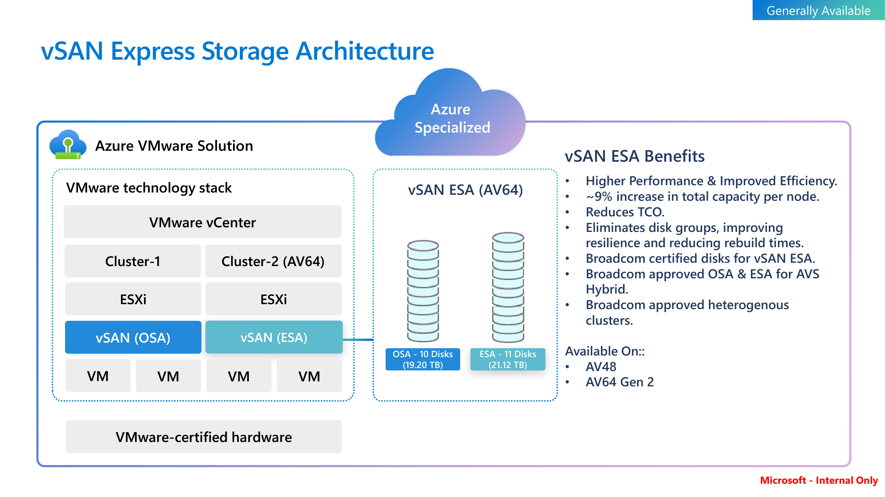

### Key Points

- VMware has introduced the vSAN Express Storage Architecture (ESA) with VCF version 8.
- vSAN ESA is generally available on Microsoft Azure VMware Solution (AVS), specifically on AV48 and AV64 Gen 2 deployments.
- ESA offers higher performance and improved efficiency compared to the older vSAN Original Storage Architecture (OSA).
- ESA increases total storage capacity per node by approximately 9%.
- ESA eliminates disk groups, which improves resilience and reduces rebuild times.
- Broadcom-certified disks support vSAN ESA, and Broadcom approves both OSA and ESA for AVS Hybrid environments.
- ESA supports heterogeneous clusters and is integrated within the VMware technology stack and VMware-certified hardware.

### Details

- **vSAN Express Storage Architecture (ESA)** is a new storage architecture introduced by VMware with VCF (VMware Cloud Foundation) version 8.
- ESA is available on Microsoft Azure VMware Solution (AVS), particularly on the latest AV48 and AV64 Gen 2 hardware deployments.
- Compared to the legacy vSAN Original Storage Architecture (OSA), ESA provides:
  - **Higher performance and improved efficiency** due to advanced storage and compression algorithms.
  - Approximately **9% increase in total capacity per node** (e.g., ESA node with 11 disks offers 21.12 TB vs. OSA node with 10 disks offering 19.20 TB).
  - **Elimination of disk groups**, which simplifies the storage architecture, enhances resilience, and reduces rebuild times during failures.
- ESA is supported by **Broadcom-certified disks**, ensuring hardware compatibility and reliability.
- Broadcom also approves both OSA and ESA for **AVS Hybrid clusters**, allowing flexibility in cluster configurations.
- ESA supports **heterogeneous clusters**, meaning clusters can include different types of hardware or configurations.
- The architecture integrates tightly with the **VMware technology stack**, including VMware vCenter and ESXi hypervisor.
- The slide illustrates two clusters: one with ESA (AV64) and one with OSA, showing the difference in disk count and capacity.
- ESA is specialized for Azure VMware Solution environments and is generally available for production use.

### Definitions

- **vSAN Express Storage Architecture (ESA)**: The latest storage architecture from VMware introduced in VCF 8, designed to improve performance, efficiency, and capacity by using advanced storage algorithms and eliminating disk groups.
- **vSAN Original Storage Architecture (OSA)**: The legacy vSAN storage architecture that uses disk groups and provides lower capacity and performance compared to ESA.
- **Disk Groups**: A collection of disks grouped together in vSAN OSA; ESA eliminates these to improve resilience and reduce rebuild times.
- **AV48 and AV64 Gen 2**: Specific Microsoft Azure VMware Solution hardware configurations where vSAN ESA is available.
- **Broadcom-certified disks**: Storage devices certified by Broadcom to be compatible and reliable for use with vSAN ESA.

### Examples

- The slide compares two clusters:
  - ESA cluster (AV64) with 11 disks totaling 21.12 TB capacity.
  - OSA cluster with 10 disks totaling 19.20 TB capacity.
- This example demonstrates the ~9% capacity increase per node with ESA.
- The speaker highlights that ESA is deployed on AV48 and AV64 Gen 2 hardware in Microsoft Azure, showing practical availability in cloud environments.

### Key Takeaways 🎯

- vSAN ESA is a significant advancement over the legacy OSA, offering better performance, efficiency, and capacity.
- ESA is generally available on Microsoft Azure VMware Solution, specifically on AV48 and AV64 Gen 2 hardware.
- ESA’s elimination of disk groups leads to improved resilience and faster rebuilds.
- Broadcom-certified disks and support for heterogeneous clusters ensure broad hardware compatibility.
- ESA provides about a 9% increase in storage capacity per node compared to OSA, making it a more efficient storage solution for VMware environments on Azure.

---

## Slide 48: AVS External Storage: Key Considerations

**Timestamp**: 01:08:27 – 01:09:00

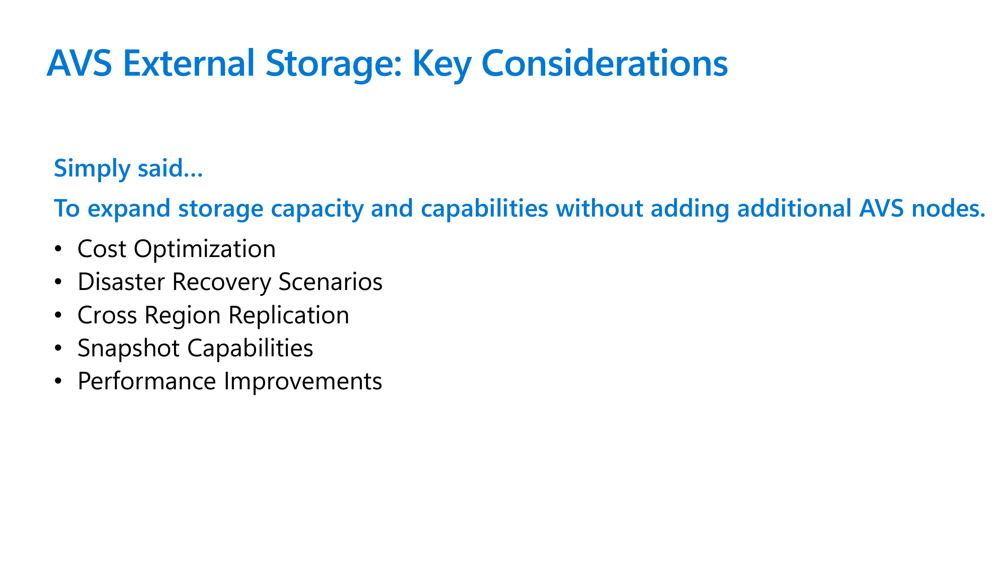

### Key Points

- External storage for Azure VMware Solution (AVS) is primarily used to expand storage capacity and capabilities without adding more AVS nodes.
- Cost optimization is the leading motivation for deploying external storage.
- External storage supports disaster recovery scenarios, enabling failover between regions.
- Additional benefits include cross-region replication, snapshot capabilities, and performance improvements.

### Details

- **Purpose of AVS External Storage**: The main goal is to increase storage capacity and enhance storage features without the need to scale out the AVS cluster by adding more nodes. This approach helps manage resources more efficiently.
  
- **Cost Optimization**: According to the speaker, cost savings is the most common and compelling reason customers choose to implement external storage. By offloading storage needs externally, organizations can avoid the expense of scaling AVS nodes unnecessarily.

- **Disaster Recovery (DR) Scenarios**: External storage enables robust DR strategies. For example, if the primary AVS deployment is in the US East region, external storage can facilitate failover and replication to a secondary site such as US West. This setup ensures business continuity in case of regional outages.

- **Cross Region Replication**: External storage solutions often support replicating data across different geographic regions, which is critical for DR and compliance requirements.

- **Snapshot Capabilities**: Snapshots allow point-in-time copies of data, which are useful for backups, quick recovery, and testing purposes.

- **Performance Improvements**: Using external storage can also enhance performance by leveraging specialized storage technologies or configurations that may not be available within the AVS nodes themselves.

### Definitions

- **AVS External Storage**: Storage resources connected to an Azure VMware Solution environment that are separate from the local storage of AVS nodes, used to expand capacity and add features without increasing node count.

- **Disaster Recovery (DR)**: Strategies and technologies that enable an IT environment to continue operating or quickly recover after a failure or disaster, often involving failover to a secondary site.

- **Cross Region Replication**: The process of copying data asynchronously or synchronously between storage systems located in different geographic regions to ensure data availability and durability.

- **Snapshot**: A read-only copy of data at a specific point in time, used for backup and recovery.

### Examples

- The speaker described a scenario where a primary AVS deployment is located in the US East region, and external storage is used to enable failover capabilities to a secondary AVS deployment in the US West region. This setup exemplifies disaster recovery and cross-region replication benefits.

### Key Takeaways 🎯

- External storage is a strategic choice to expand AVS storage capabilities without adding costly AVS nodes.
- Cost optimization is the primary driver for adopting external storage in AVS environments.
- External storage enhances disaster recovery by enabling failover and replication across regions.
- Additional features like snapshots and performance improvements make external storage a valuable extension to AVS.

---

## Slide 49: External Storage for AVS: Key Benefits

**Timestamp**: 01:10:06 – 01:11:38

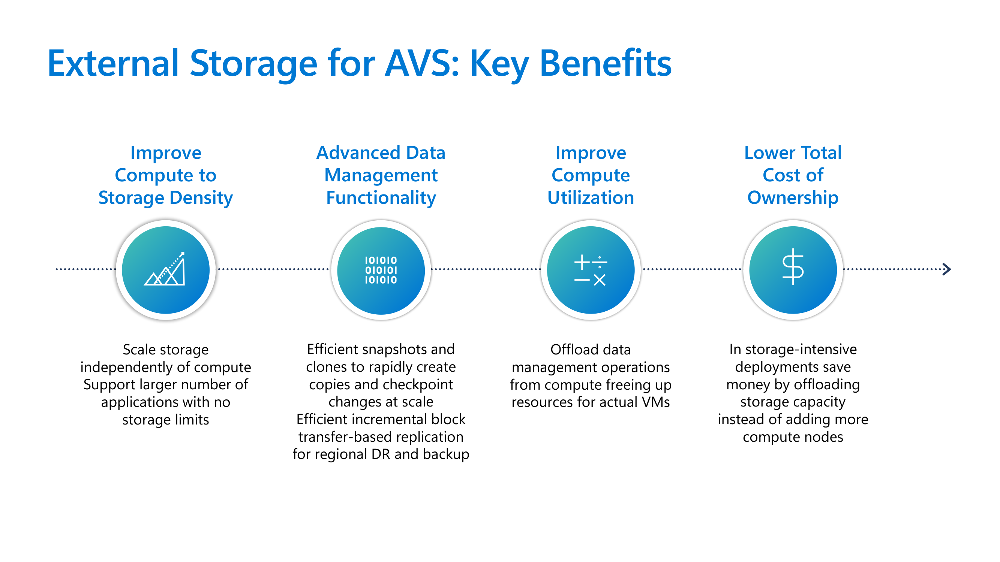

### Key Points

- External storage for Azure VMware Solution (AVS) offers multiple key benefits including improved compute-to-storage density, advanced data management, better compute utilization, and lower total cost of ownership.
- Storage needs rarely align perfectly with compute sizing, making flexible external storage critical.
- Customers’ storage demands typically grow faster than compute needs.
- Storage is often the largest hardware cost in on-premises environments, more than compute blades.
- Using external storage allows scaling storage independently from compute resources.
- Advanced data management features like efficient snapshots, clones, and incremental replication support disaster recovery and backup.
- Offloading storage and data management tasks from compute nodes frees up compute resources for running virtual machines.
- External storage options combined with Azure native storage offerings provide economic advantages and improved ROI when migrating to the cloud.

### Details

- **Improve Compute to Storage Density**  
  External storage enables organizations to add more storage capacity without needing to deploy additional compute hosts. This decoupling means that storage can scale independently, optimizing resource utilization and avoiding unnecessary compute node purchases just to meet storage demands.

- **Scale Storage Independently of Compute**  
  Since storage needs often outpace compute needs, external storage solutions allow customers to expand storage capacity without increasing compute infrastructure, which is more cost-effective and efficient.

- **Support Larger Number of Applications with No Storage Limits**  
  External storage removes constraints on storage capacity, enabling deployment of more applications without worrying about hitting storage limits tied to compute node configurations.

- **Advanced Data Management Functionality**  
  Features such as efficient snapshots and clones allow rapid creation of copies and checkpoints at scale, facilitating testing, development, and backup operations.  
  Incremental block transfer-based replication supports regional disaster recovery (DR) and backup by efficiently transferring only changed data blocks.

- **Improve Compute Utilization**  
  By offloading data management operations (e.g., snapshots, replication) to external storage systems, compute nodes are freed up to focus on running virtual machines, improving overall compute efficiency.

- **Lower Total Cost of Ownership (TCO)**  
  In storage-intensive deployments, it is more economical to add storage capacity externally rather than adding more compute nodes just to get additional storage. This approach reduces hardware costs and operational expenses.

- **Speaker’s Context and Insights**  
  - The speaker emphasized that in real-world sizing scenarios for AVS, storage rarely fits neatly into predefined “t-shirt” sizes aligned with CPU and compute resources. Storage is almost always the limiting factor.  
  - Customers’ storage needs continually grow, making flexible external storage essential.  
  - Storage hardware often represents the largest on-premises cost, surpassing compute blades.  
  - Azure offers multiple external storage options alongside native Azure storage services, providing customers with flexibility to match workloads to the most appropriate storage solution.  
  - This matching of workload to storage type delivers significant economic benefits, lowers total cost of ownership, and improves return on investment when migrating to the cloud.

### Definitions

- **Compute to Storage Density**: The ratio or balance between compute resources (CPU, memory) and storage capacity in a deployment. Improving this means getting more storage capacity without proportionally increasing compute resources.

- **Snapshots and Clones**: Data management features that create point-in-time copies of data. Snapshots capture the state of data at a moment, while clones create writable copies, both useful for backups, testing, and recovery.

- **Incremental Block Transfer-Based Replication**: A replication method that transfers only the changed blocks of data since the last replication, making disaster recovery and backup more efficient by reducing data transfer volumes.

- **Total Cost of Ownership (TCO)**: The overall cost of deploying and operating IT infrastructure, including hardware, software, maintenance, and operational expenses.

### Examples

- The speaker referenced sizing hundreds of AVS deployments and noted that in almost all cases, storage requirements did not align perfectly with compute sizing “t-shirt” categories, highlighting the need for flexible external storage.

- Customers often face growing storage demands that outpace compute needs, making external storage a practical solution to avoid unnecessary compute node purchases.

### Key Takeaways 🎯

- External storage in AVS enables independent scaling of storage and compute, optimizing resource use and cost.  
- Storage is typically the largest hardware cost and the most common bottleneck in sizing AVS environments.  
- Advanced data management features in external storage improve operational efficiency and support disaster recovery.  
- Offloading storage tasks from compute nodes frees resources for running workloads.  
- Leveraging multiple external and native Azure storage options provides customers with economic advantages and better ROI when migrating to the cloud.

---

## Slide 50: AVS

**Timestamp**: 01:11:38 – 01:13:18

### Key Points

- Using a combination of Azure VMware Solution (AVS) hosts and external storage can significantly reduce costs in storage-heavy environments.
- A purely AVS host-based deployment requires more nodes to meet storage needs, increasing cost.
- Deploying fewer AVS nodes focused on CPU and RAM, supplemented by external storage for capacity, can yield around 40% savings over three years.
- Example configuration compares 31 AVS nodes (host-based storage) vs. 11 AVS nodes plus 192TB external storage.
- This approach is particularly beneficial for workloads where storage requirements exceed CPU and RAM needs.

### Details

- **AVS (Azure VMware Solution)** is a cloud service that allows running VMware workloads natively on Azure infrastructure.
- In a **storage-heavy environment**, the primary bottleneck or resource requirement is storage capacity rather than CPU or RAM.
- The slide shows two configurations for a 3-year reserved instance (RI) commitment:
  - **31 AVS nodes** fully host-based storage, requiring a large number of nodes to meet storage demands.
  - **11 AVS nodes** plus **192TB external storage**, where fewer nodes are deployed because CPU and RAM needs are lower, and external storage supplements capacity.
- The external storage reduces the need to over-provision AVS hosts just for storage, enabling cost savings.
- The speaker explains that the 31-node configuration is sized to handle the entire workload solely on AVS hosts, which is costly.
- By analyzing the workload, if CPU and RAM needs only require 11 nodes, the remaining storage demand (about 200TB) can be offloaded to external storage.
- This hybrid approach can reduce total costs by over 40% across three years compared to the all-host approach.
- The slide and narration emphasize this as an illustrative example to demonstrate the financial and architectural benefits of combining AVS with external storage.
- The savings come from reducing the number of expensive AVS hosts while still meeting storage requirements through external storage solutions.

### Definitions

- **AVS (Azure VMware Solution)**: A Microsoft Azure service that allows running VMware workloads on Azure infrastructure, providing native VMware environments in the cloud.
- **3YR RI (3-Year Reserved Instance)**: A pricing model where compute resources are reserved for three years, typically offering cost savings compared to pay-as-you-go.
- **3YR RC (3-Year Reserved Capacity)**: A reserved capacity pricing model for storage or other resources committed for three years.
- **External Storage**: Storage resources that are separate from the compute hosts (AVS nodes), used to supplement or replace host-based storage capacity.

### Examples

- **Example scenario**:  
  - A storage-heavy workload initially sized to 31 AVS nodes to meet storage needs entirely on host-based storage.  
  - By analyzing CPU and RAM requirements, only 11 AVS nodes are needed for compute.  
  - The remaining storage requirement (~192TB) is fulfilled by external storage.  
  - This hybrid setup results in a 40%+ cost savings over three years compared to the 31-node all-host solution.

### Key Takeaways 🎯

- Combining AVS with external storage is a cost-effective strategy for storage-heavy workloads.  
- Reducing AVS nodes to match CPU and RAM needs, while offloading storage to external systems, can significantly lower costs.  
- This approach can yield over 40% savings on a 3-year reserved instance basis.  
- Proper workload sizing and understanding resource bottlenecks (CPU/RAM vs. storage) are critical to optimizing cloud infrastructure costs.  
- The example illustrates the practical benefits of hybrid storage architectures in cloud VMware deployments.

---

## Slide 51: Storage flexibility for intensive workloads

**Timestamp**: 01:32:28 – 01:33:01

### Key Points

- Azure offers flexible storage options tailored for intensive workloads.
- Customers often prefer storage solutions they are familiar with, influencing their choice.
- Azure supports multiple storage services, both first-party and third-party, to meet diverse needs.
- Integration with on-premises environments like VMware cloud foundation is supported.
- Storage choices in Azure consider cost, performance, and customer preference.
- Azure’s storage ecosystem includes native Azure services and marketplace third-party services.

### Details

- **Storage Flexibility for Intensive Workloads**: The slide emphasizes that Azure provides a variety of storage solutions designed to handle demanding workloads efficiently.
  
- **Customer Preference and Choice**: The speaker highlights that customers tend to stick with storage technologies they know and trust from their on-premises environments. This human tendency is acknowledged by Azure’s approach to offering multiple storage options.

- **Azure Portal and Azure Resource Manager**: These tools are used to manage and deploy resources, including storage, within Azure, providing a unified management experience.

- **Azure Private Cloud Infrastructure**: Azure supports private cloud setups, allowing customers to extend or migrate workloads with familiar infrastructure paradigms.

- **VMware Cloud Foundation Integration**:
  - **vCenter & vSphere**: VMware management and virtualization platforms supported within Azure environments.
  - **vSAN**: VMware’s software-defined storage solution integrated for storage management.
  - **NSX & HCX**: Networking and hybrid cloud extension tools that facilitate connectivity and migration between on-premises VMware environments and Azure.

- **Compute and Networking**:
  - Azure Virtual Network (VNet) is used to connect compute resources and storage securely.
  - Azure backbone network provides the underlying high-speed connectivity between services.

- **Extended Storage Services in Azure**:
  - **Azure NetApp Files**: A first-party Azure service providing enterprise-grade file storage.
  - **Azure Elastic SAN**: Another first-party service offering scalable block storage.
  - **Azure Native Pure Storage Cloud**: Azure native service integrating Pure Storage technology.
  - **Pure Cloud Block Store**: A third-party storage service available via the Azure Marketplace.

- **Generally Available**: All the mentioned services and integrations are in general availability, meaning they are production-ready and supported for enterprise use.

### Definitions

- **Azure NetApp Files**: A first-party Azure service offering high-performance file storage, suitable for enterprise workloads requiring shared file systems.
- **Azure Elastic SAN**: A first-party Azure service providing scalable, high-performance block storage designed for intensive workloads.
- **Pure Cloud Block Store**: A third-party block storage service available through the Azure Marketplace, offering Pure Storage technology natively in Azure.
- **VMware Cloud Foundation**: An integrated software stack combining VMware vSphere, vSAN, NSX, and other components to provide a complete software-defined data center solution.
- **Azure Resource Manager**: The deployment and management service for Azure, enabling users to create, update, and delete resources in a consistent way.

### Examples

- The speaker references customers who have existing on-premises storage solutions and prefer to continue using familiar technologies when moving to Azure.
- Integration with VMware environments (vCenter, vSphere, vSAN, NSX, HCX) is a practical example of how Azure supports hybrid cloud scenarios and customer choice.

### Key Takeaways 🎯

- Azure provides a broad spectrum of storage options to accommodate different customer preferences, workloads, and performance needs.
- Both first-party Azure services and third-party marketplace offerings are available to ensure flexibility.
- Integration with VMware cloud infrastructure allows customers to leverage familiar tools and extend their on-premises environments into Azure.
- Storage solutions in Azure are designed to be production-ready and generally available, ensuring reliability for intensive workloads.

---

## Slide 52: Azure NetApp Files (ANF)

**Timestamp**: 01:20:15 – 01:20:48

### Key Points

- Azure NetApp Files (ANF) is a storage service integrated with Azure VMware Solution (AVS).
- Pricing for ANF in Azure is based on performance tiers and capacity usage.
- Users can view and manage ANF pricing and performance options directly within the Azure portal.
- There are different performance levels available, including standard and higher performance workloads.
- Flexible pricing options exist and should be carefully evaluated for cost optimization.

### Details

- **Azure NetApp Files (ANF) for AVS** refers to the use of Azure NetApp Files as a high-performance file storage solution within the Azure VMware Solution environment.
- The speaker emphasizes that Azure pricing models, including for ANF, are structured around two main factors:
  - **Performance**: Different tiers or levels of performance (e.g., standard vs. premium) affect cost.
  - **Capacity**: The amount of storage allocated also impacts pricing.
- The speaker refers to an "eye chart" (likely a pricing or performance comparison chart) that illustrates how ANF pricing varies depending on these factors.
- All pricing and performance options for ANF can be accessed and reviewed within the Azure portal, providing transparency and ease of management.
- The speaker strongly encourages users to examine the flexible pricing options "with a fine-tooth comb," suggesting that careful analysis can lead to cost savings or better alignment with workload needs.
- The repeated mention of seeing this scenario "over and over" indicates that understanding ANF pricing is a common and important topic for users deploying AVS workloads.

### Definitions

- **Azure NetApp Files (ANF)**: A fully managed file storage service in Azure that provides high-performance file shares, optimized for enterprise workloads.
- **Azure VMware Solution (AVS)**: A Microsoft service that allows customers to run VMware workloads natively on Azure infrastructure.
- **Performance Tier**: A classification of storage service levels based on throughput and latency characteristics, affecting cost and suitability for different workloads.
- **Capacity Pricing**: The cost associated with the amount of storage allocated or consumed.

### Examples

- While no specific numerical examples were given, the speaker mentions an "eye chart" that visually compares pricing for standard and higher performance workloads within ANF.
- The speaker suggests users explore the Azure portal to see real-time pricing and performance options for their specific needs.

### Key Takeaways 🎯

- Azure NetApp Files pricing is primarily driven by performance level and storage capacity.
- Users should leverage the Azure portal to understand and manage ANF costs effectively.
- Careful evaluation of flexible pricing options can optimize costs for AVS deployments using ANF.
- Understanding ANF pricing is critical for planning and managing storage in Azure VMware Solution environments.

---

## Slide 53: Azure NetApp Files for AVS

**Timestamp**: 01:20:48 – 01:21:54

### Key Points

- Azure NetApp Files (ANF) is now generally available as a storage option for Azure VMware Solution (AVS).
- ANF provides high-performance, metered file storage tailored for demanding enterprise file workloads.
- ANF can be used to expand storage efficiently without scaling AVS clusters.
- Using ANF reduces total cost of operations (TCO) for storage-intensive applications.
- ANF offers multiple service levels (standard, premium, ultra, flex) to optimize cost and performance.
- A TCO estimator tool is available to help customers model cost savings and sizing.
- Real-world example: Home Trust Company reduced their AVS environment by 30 hosts by offloading storage to ANF, significantly lowering costs.

### Details

- **Azure NetApp Files for AVS**: ANF integrates with Azure VMware Solution to provide external storage volumes accessible as NFS datastores within the VMware technology stack.
  - VMware stack components include VMware vCenter, VMs, ESXi hosts, vSAN storage, and NSX networking.
  - ANF volumes appear as NFS datastores to the VMware environment.
- **Storage Expansion**: Instead of scaling AVS clusters by adding more hosts to increase storage capacity, ANF allows enterprises to expand storage independently and efficiently.
- **Cost Efficiency**: Storage-intensive applications running on AVS can be more cost-effective by using ANF rather than scaling compute clusters.
  - ANF offers metered file storage, so customers pay for what they use.
  - Service levels (standard, premium, ultra, flex) allow customers to balance performance needs and costs.
- **TCO Estimator Tool**:
  - Developed jointly by Azure NetApp Files and NetApp.
  - Allows customers to input sizing requirements, number of hosts, and potential offloading scenarios.
  - Helps compare costs between running storage internally on AVS clusters versus using ANF external storage.
  - The tool is user-friendly and enables customers to create their own cost models quickly.
- **Customer Success Story**:
  - Home Trust Company deployed ANF with AVS.
  - They eliminated 30 AVS hosts by offloading storage to ANF.
  - This deployment significantly reduced their total cost of ownership (TCO).
- **Hardware and Certification**:
  - AVS runs on specialized, VMware-certified hardware in Azure.
  - ANF complements this by providing enterprise-class storage capabilities.

### Definitions

- **Azure NetApp Files (ANF)**: A high-performance, metered file storage service on Azure designed for enterprise workloads, offering scalable NFS volumes that integrate with AVS.
- **Azure VMware Solution (AVS)**: A Microsoft Azure service that enables running VMware workloads natively on Azure infrastructure with VMware-certified hardware.
- **NFS Datastores**: Network File System volumes presented to VMware environments as storage datastores for virtual machines.
- **TCO (Total Cost of Ownership)**: The overall cost of operating IT infrastructure, including hardware, software, and operational expenses.
- **TCO Estimator Tool**: An online tool provided by Azure NetApp Files and NetApp to help customers model and compare costs of storage options in AVS environments.

### Examples

- **Home Trust Company**:
  - Deployed Azure NetApp Files with Azure VMware Solution.
  - Eliminated 30 AVS hosts by offloading storage to ANF volumes.
  - Achieved significant cost savings and reduced TCO.
- **TCO Estimator Usage**:
  - Customers input their environment sizing and storage needs.
  - Tool calculates cost differences between scaling AVS clusters versus using ANF.
  - Helps decide between standard, premium, ultra, or flex service levels based on cost and performance needs.

### Key Takeaways 🎯

- Azure NetApp Files is now generally available as a scalable, high-performance storage option for Azure VMware Solution.
- Using ANF allows enterprises to expand storage without adding AVS hosts, reducing infrastructure complexity and cost.
- The metered, service-level-based pricing model of ANF helps optimize TCO for storage-intensive workloads.
- The TCO estimator tool is a valuable resource for planning and cost comparison.
- Real-world deployments like Home Trust Company demonstrate significant cost savings by integrating ANF with AVS.

---

## Slide 54: Azure NetApp Files for AVS

**Timestamp**: 01:21:54 – 01:22:25

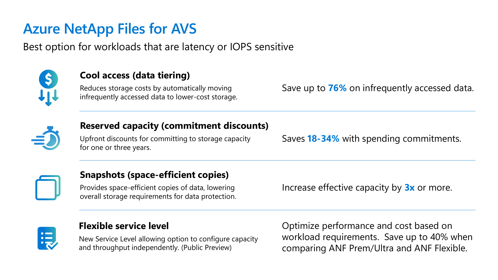

### Key Points

- Azure NetApp Files (ANF) for Azure VMware Solution (AVS) offers multiple cost-saving and performance optimization features.
- Reserved capacity provides upfront discounts by committing to storage capacity for one or three years.
- Snapshots enable space-efficient data copies, reducing overall storage needs for data protection.
- Cool access (data tiering) automatically moves infrequently accessed data to lower-cost storage, saving up to 76%.
- Spending commitments can save 18-34% on storage costs.
- Effective storage capacity can be increased by 3x or more through these features.
- A new Flexible Service Level (in Public Preview) allows independent configuration of capacity and throughput.
- Flexible Service Level optimizes performance and cost, saving up to 40% compared to Premium/Ultra tiers.
- Best suited for workloads sensitive to latency or IOPS.
- Azure Elastic SAN is a fully managed, redundant storage service offering flexibility, complementing ANF capabilities.

### Details

- **Reserved Capacity (Commitment Discounts):**  
  Users can commit to a specific amount of storage capacity for either one or three years. This commitment results in upfront discounts, making long-term storage more cost-effective.

- **Snapshots (Space-Efficient Copies):**  
  Snapshots provide a way to create copies of data that consume minimal additional storage space. This feature lowers the overall storage requirements needed for data protection and backup strategies.

- **Cool Access (Data Tiering):**  
  This feature automatically moves data that is infrequently accessed to lower-cost storage tiers. This tiering reduces storage costs significantly, with potential savings of up to 76% on such data.

- **Spending Commitments:**  
  By committing to spending levels, customers can save between 18% and 34%, further optimizing their storage expenditure.

- **Effective Capacity Increase:**  
  Combining snapshots, tiering, and reserved capacity can increase the effective storage capacity by three times or more, enhancing storage efficiency.

- **Flexible Service Level (Public Preview):**  
  This new service level allows customers to configure storage capacity and throughput independently, offering greater flexibility to tailor performance and cost to specific workload needs.  
  - It can save up to 40% when compared to the Premium or Ultra service levels of Azure NetApp Files.  
  - Ideal for workloads that require low latency or high IOPS, providing optimized performance without unnecessary cost.

- **Azure Elastic SAN (Speaker Context):**  
  Although not detailed on the slide, the speaker introduced Azure Elastic SAN as a complementary, fully managed storage service with built-in redundancy and high flexibility. It has been available for a couple of years and is designed to provide scalable, resilient storage solutions.

### Definitions

- **Azure NetApp Files (ANF):** A Microsoft Azure service providing enterprise-grade file storage with high performance and data management features.

- **Reserved Capacity:** A pricing model offering discounts in exchange for committing to a fixed amount of storage capacity over a set period (one or three years).

- **Snapshots:** Space-efficient, point-in-time copies of data that reduce storage overhead for backups and data protection.

- **Cool Access (Data Tiering):** A feature that automatically moves infrequently accessed data to cheaper storage tiers to reduce costs.

- **Flexible Service Level:** A new ANF service tier allowing independent scaling of capacity and throughput to optimize cost and performance.

- **Azure Elastic SAN:** A fully managed, redundant storage service designed for flexibility and scalability, complementing Azure NetApp Files.

### Examples

- No specific practical examples or demonstrations were provided in the transcript or slide content.

### Key Takeaways 🎯

- Committing to reserved capacity and spending commitments can significantly reduce Azure NetApp Files storage costs (up to 34% savings).
- Snapshots and cool access features improve storage efficiency and reduce costs by lowering space requirements and tiering data.
- The new Flexible Service Level offers customizable performance and cost optimization, especially beneficial for latency and IOPS-sensitive workloads.
- Azure Elastic SAN is a flexible, fully managed storage service with redundancy, complementing ANF offerings for enterprise storage needs.

---

## Slide 55: Azure NetApp Files

**Timestamp**: 01:22:25 – 01:23:29

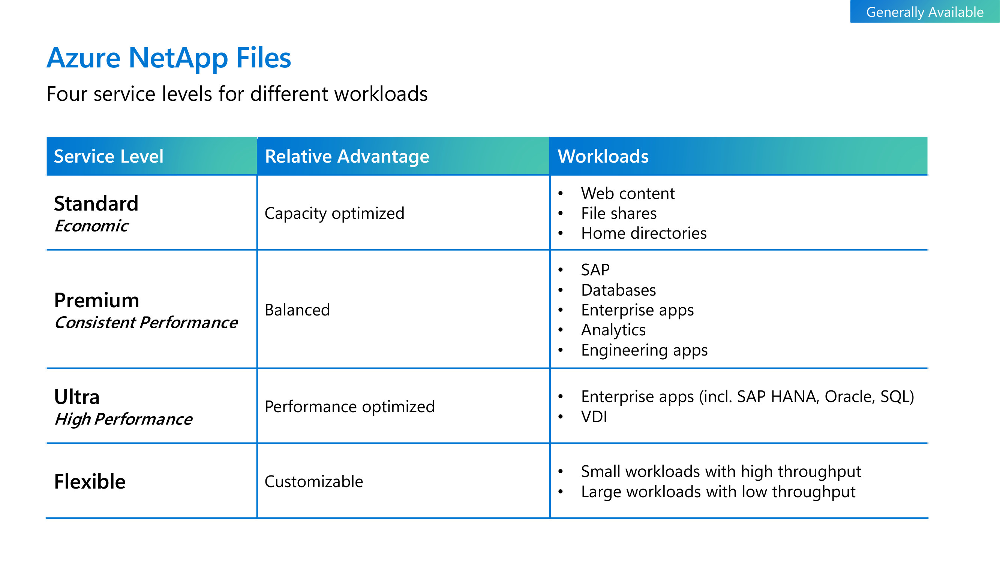

### Key Points

- Azure NetApp Files offers four distinct service levels tailored for different workload requirements.
- Each service level balances cost, performance, and capacity optimization to suit specific application needs.
- The service levels are Standard, Premium, Ultra, and Flexible, each with unique advantages and target workloads.
- Azure NetApp Files provides scalable storage independent of compute resources.
- The service integrates natively with Azure solutions and supports seamless migration of on-premises VMware environments to Azure VMware Solution (AVS).
- Elastic SAN (eSAN) is highlighted as a flexible, low-cost storage tier with independent capacity scaling, similar in concept to Azure NetApp Files’ flexible tier.

### Details

- **Azure NetApp Files Service Levels:**

  1. **Standard**
     - **Relative Advantage:** Economic, capacity optimized.
     - **Target Workloads:** Web content, file shares, home directories.
     - Designed for cost-effective storage where capacity is prioritized over performance.

  2. **Premium**
     - **Relative Advantage:** Consistent performance, balanced.
     - **Target Workloads:** SAP, databases, enterprise applications, analytics, engineering applications.
     - Provides a balance between performance and cost, suitable for mission-critical business applications.

  3. **Ultra**
     - **Relative Advantage:** High performance, performance optimized.
     - **Target Workloads:** Enterprise applications including SAP HANA, Oracle, SQL databases, and Virtual Desktop Infrastructure (VDI).
     - Optimized for workloads requiring very high throughput and low latency.

  4. **Flexible**
     - **Relative Advantage:** Customizable.
     - **Target Workloads:** Small workloads with high throughput, large workloads with low throughput.
     - A newer service tier that allows independent scaling of storage capacity and performance.
     - Provides flexibility to tailor storage to workload needs, balancing throughput and capacity.

- **Speaker’s Additional Context:**

  - Azure NetApp Files allows scaling of storage independently from compute and performance, similar to the flexible tier.
  - The flexible tier is noted as the lowest cost per GB storage option for Azure VMware Solution (AVS).
  - Azure NetApp Files is a first-party Azure service with native integration to other Azure solutions, enhancing ease of use and reliability.
  - High availability and scalability are key features, supporting seamless migration of on-premises VMware environments to AVS.
  - Elastic SAN (eSAN) is mentioned as another low-cost storage solution with independent capacity scaling, available from day one, highlighting the evolution of flexible storage tiers in Azure.

### Definitions

- **Azure NetApp Files:** A first-party Azure file storage service offering multiple service levels optimized for different workloads, with native Azure integration and scalable storage independent of compute.
- **Service Level:** A tier of Azure NetApp Files characterized by specific performance, cost, and capacity trade-offs tailored to particular workload types.
- **Flexible Tier:** A newer Azure NetApp Files service level that allows independent scaling of storage capacity and performance, customizable for diverse workload needs.
- **Elastic SAN (eSAN):** A low-cost, flexible storage solution that allows independent scaling of storage capacity, similar in concept to Azure NetApp Files’ flexible tier, optimized for Azure VMware Solution.

### Examples

- **Standard Tier Use Cases:** Hosting web content, file shares, and home directories where cost efficiency and capacity are prioritized.
- **Premium Tier Use Cases:** Running SAP, databases, enterprise applications, analytics, and engineering applications requiring consistent performance.
- **Ultra Tier Use Cases:** Supporting high-performance enterprise applications such as SAP HANA, Oracle, SQL databases, and Virtual Desktop Infrastructure (VDI).
- **Flexible Tier Use Cases:** Handling small workloads that demand high throughput or large workloads that require low throughput, offering customizable performance and capacity.

### Key Takeaways 🎯

- Azure NetApp Files provides four service levels—Standard, Premium, Ultra, and Flexible—each optimized for specific workload types and performance needs.
- The flexible tier is a recent addition that enables independent scaling of storage capacity and performance, offering cost-effective and customizable storage.
- Azure NetApp Files is a first-party Azure service with native integration, high availability, and scalability, making it ideal for migrating and running VMware workloads on Azure VMware Solution.
- Elastic SAN (eSAN) is another flexible, low-cost storage option supporting independent capacity scaling, reinforcing Azure’s commitment to flexible storage solutions.

---

## Slide 56: Classified as Microsoft Confidential

**Timestamp**: 01:23:29 – 01:24:34

### Key Points

- Azure NetApp Files (ANF) provides a hierarchical storage structure with multiple layers: Azure NetApp Account, Capacity Pools, and Volumes.
- Capacity Pools come in different performance tiers: Standard, Premium, Ultra, and Flexible, each supporting 1 to 2048 TiB capacity.
- Volumes within capacity pools range from 50 GiB to 100 TiB for standard volumes, and large volumes can scale from 50 TiB up to 2048 TiB.
- Performance requirements vary from low to high, influencing the choice of capacity pool and volume configuration.
- Elastic SAN supports zone redundant storage to enhance durability and uptime, with provisioning units that scale performance (base units) or capacity (capacity only).
- Networking and security configurations (private endpoints, RBAC) are applied at the group level and inherited by volumes.
- Elastic SAN volumes use the iSCSI protocol and can be exposed as VMFS datastores to Azure VMware Solution (AVS).
- Each volume has individual performance limits.

### Details

- **Azure NetApp Files Hierarchy**:
  - **Azure NetApp Account**: Represents the top-level container, scoped by Azure region (e.g., West Europe, US South Central).
  - **Capacity Pools**: Logical containers within an Azure NetApp Account that define performance tiers and capacity ranges.
    - Four types of capacity pools are shown:
      - Standard (1 - 2048 TiB)
      - Premium (1 - 2048 TiB)
      - Ultra (1 - 2048 TiB)
      - Flexible (1 - 2048 TiB)
  - **Volumes**: Created inside capacity pools with size ranges:
    - Standard volumes: 50 GiB to 100 TiB
    - Large volumes: 50 TiB to 2048 TiB
  - Volumes inherit networking and security configurations from their parent groups, enabling controlled access.

- **Performance and Capacity Scaling in Elastic SAN**:
  - Elastic SAN provisioning involves two types of units:
    - **Base units**: Scale performance.
    - **Capacity only units**: Scale storage capacity.
  - Redundancy options include:
    - Locally redundant storage (LRS)
    - Zone redundant storage (ZRS), which protects against zone outages and enhances uptime.
  - Volumes have individual performance limits, meaning each volume can be tuned or capped independently.

- **Networking and Security**:
  - Volumes inherit configurations from their groups, including private endpoints and Role-Based Access Control (RBAC).
  - This setup reduces unauthorized access and secures data.
  
- **Protocol and Integration**:
  - Elastic SAN volumes operate over the iSCSI protocol.
  - They can be exposed as VMFS datastores to Azure VMware Solution (AVS), enabling integration with VMware environments hosted in Azure.

### Definitions

- **Azure NetApp Account**: A regional container in Azure that holds capacity pools and volumes for Azure NetApp Files.
- **Capacity Pool**: A logical container within an Azure NetApp Account that defines the performance tier and capacity allocation for volumes.
- **Volume**: A storage unit within a capacity pool, sized between 50 GiB and up to 2048 TiB depending on the pool and volume type.
- **Elastic SAN**: A scalable storage solution that supports zone redundant storage and allows separate scaling of performance and capacity.
- **Base Units**: Provisioning units in Elastic SAN that scale performance.
- **Capacity Only Units**: Provisioning units in Elastic SAN that scale storage capacity without affecting performance.
- **Locally Redundant Storage (LRS)**: Data replication within a single Azure region to protect against hardware failures.
- **Zone Redundant Storage (ZRS)**: Data replication across multiple availability zones within a region to protect against zone outages.
- **iSCSI Protocol**: Internet Small Computer Systems Interface, a protocol that allows clients to send SCSI commands to storage devices over IP networks.
- **VMFS Datastore**: VMware File System datastore used by VMware ESXi hosts to store virtual machine files.

### Examples

- Deploying Elastic SAN with zone redundant storage to protect against availability zone outages, ensuring enhanced durability and uptime.
- Using Elastic SAN volumes as VMFS datastores in Azure VMware Solution (AVS) environments, leveraging iSCSI protocol connectivity.
- Configuring private endpoints and RBAC on volume groups to restrict access and enhance security.

### Key Takeaways 🎯

- Azure NetApp Files organizes storage into accounts, capacity pools, and volumes, each with specific capacity and performance characteristics.
- Elastic SAN allows flexible scaling of performance and capacity with redundancy options to improve availability.
- Security and networking configurations are inherited by volumes, enabling centralized control.
- Elastic SAN volumes support iSCSI and can integrate seamlessly with VMware environments in Azure.
- Understanding the hierarchy and provisioning units is critical for designing scalable, performant, and secure storage solutions in Azure.

---

## Slide 57: ©Microsoft Corporation

**Timestamp**: 01:24:34 – 01:25:38

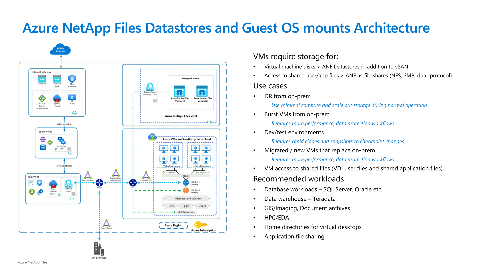

### Key Points

- Azure NetApp Files enables scalable storage with minimal compute usage during normal operations.
- It supports high-performance requirements and data protection workflows.
- Rapid clones and snapshots are essential for checkpointing changes efficiently.
- The architecture involves Azure NetApp Files datastores and guest OS mounts.
- Elastic SANs use ExpressRoute gateways and PrivateLink with multiple private endpoints for connectivity.
- The number of private endpoints varies by SKU: typically 4 for non-AV64 SKUs and up to 8 for AV64 SKUs.
- Session load balancing across private endpoints prevents network path overload.

### Details

- **Azure NetApp Files Usage**:  
  The service is designed to use minimal compute resources while scaling out storage capacity during normal operations. This means that storage can grow independently of compute, optimizing resource utilization.

- **Performance and Data Protection**:  
  For workloads requiring higher performance and robust data protection workflows, Azure NetApp Files supports these needs by enabling rapid clones and snapshots. These features allow quick checkpointing of data changes, which is critical for backup, recovery, and development/testing scenarios.

- **Architecture Overview**:  
  The architecture involves Azure NetApp Files datastores that are mounted by the guest operating system. This setup facilitates direct access to scalable, high-performance storage.

- **Elastic SAN Connectivity**:  
  Elastic SANs connect through an ExpressRoute gateway combined with PrivateLink technology. This setup provides private, secure network connectivity to the storage service.

- **Private Endpoints Configuration**:  
  - The number of private endpoints deployed depends on the SKU of the Elastic SAN.  
  - For non-AV64 SKUs, typically 4 private endpoints are deployed.  
  - For AV64 SKUs, the number can go up to 8, depending on the amount of storage provisioned.  
  - These multiple endpoints help distribute network sessions evenly, preventing any single network path from becoming a bottleneck.

- **Load Balancing**:  
  The system automatically balances sessions across all private endpoints, ensuring efficient network utilization and avoiding overload on any single endpoint.

### Definitions

- **Azure NetApp Files**: A Microsoft Azure service providing scalable, high-performance file storage with features like rapid cloning and snapshots for data protection and efficient storage management.

- **Elastic SAN**: A storage architecture that uses Azure NetApp Files with private network connectivity via ExpressRoute and PrivateLink, allowing scalable and secure storage access.

- **ExpressRoute Gateway**: A network gateway that enables private, dedicated connections between Azure data centers and on-premises infrastructure.

- **PrivateLink**: Azure service that provides private connectivity from a virtual network to Azure services without exposing data to the public internet.

- **Private Endpoints**: Network interfaces that connect privately and securely to Azure services within a virtual network.

- **SKU (Stock Keeping Unit)**: A specific product configuration or version, here referring to different performance and capacity tiers of Elastic SAN.

### Examples

- For a non-AV64 SKU Elastic SAN deployment, 4 private endpoints are typically created to connect storage securely and distribute network load.

- For an AV64 SKU, which supports higher storage capacity, up to 8 private endpoints may be deployed to handle increased network traffic and storage demands.

### Key Takeaways 🎯

- Azure NetApp Files allows scaling storage independently with minimal compute overhead during normal operations.

- Rapid clones and snapshots are key features for performance and data protection workflows.

- Elastic SAN connectivity relies on ExpressRoute gateways and PrivateLink with multiple private endpoints for secure, balanced network access.

- The number of private endpoints depends on the SKU and storage size, ensuring efficient load distribution and avoiding network bottlenecks.

---

## Slide 58: AVS

**Timestamp**: 01:25:38 – 01:28:00

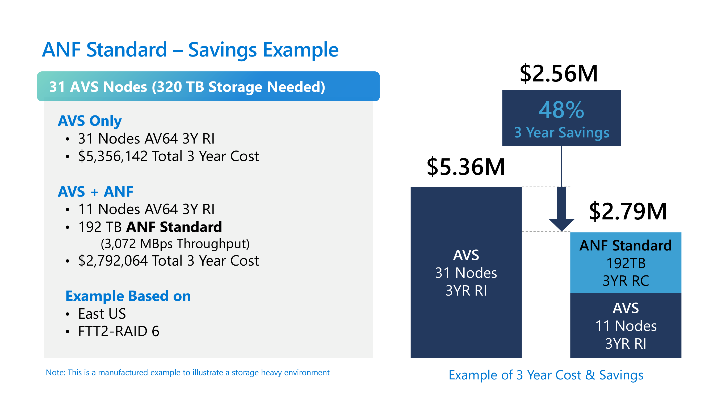

### Key Points

- Comparison of total 3-year costs between Azure VMware Solution (AVS) only and AVS combined with Azure NetApp Files (ANF) Standard.
- Significant cost savings (48% or $2.56M) achieved by integrating ANF with AVS in a storage-heavy environment.
- Example based on a 31-node AVS deployment requiring 320 TB storage.
- ANF Standard provides high throughput (3,072 MBps) and scalable storage performance.
- Pricing and durability options vary by region and redundancy type (locally redundant vs. zone redundant storage).
- Elastic SAN (ANF) offers both cost efficiency and high performance, suitable for large-scale VMware workloads on Azure.

### Details

- **Cost Comparison**:
  - AVS Only scenario:
    - 31 AV64 nodes with 3-year Reserved Instances (RI).
    - Total 3-year cost: approximately $5.36 million.
  - AVS + ANF scenario:
    - 11 AV64 nodes with 3-year RI.
    - 192 TB ANF Standard storage with 3,072 MBps throughput.
    - Total 3-year cost: approximately $2.79 million.
  - This represents a 48% savings (~$2.56 million) over the AVS-only approach.

- **Storage Requirements & Configuration**:
  - The example assumes a storage-heavy environment requiring 320 TB.
  - ANF Standard is configured with locally redundant storage (FTT2-RAID 6) in East US region.
  - The example is illustrative and manufactured to highlight cost benefits.

- **Performance & Throughput**:
  - ANF Standard supports large volumes up to 64 TiB.
  - Elastic SAN can scale from 80,000 up to 2 million IOPS.
  - Throughput in the example is 3,072 MBps, demonstrating high-performance capabilities.
  - Performance considerations include throughput, IOPS, and traffic costs (e.g., private endpoints).

- **Pricing Details**:
  - Locally redundant storage costs about $0.08 per GB.
  - Capacity units cost about $0.06 per GB.
  - Zone redundant storage is more expensive but offers higher durability and peace of mind.
  - Pricing varies by Azure region.

- **Additional Considerations**:
  - When planning architecture and costs, include ExpressRoute Ultra Gateway and private endpoint costs.
  - Elastic SAN is positioned as a cost-effective yet high-performance storage solution for AVS deployments.
  - The example demonstrates real-world achievable savings and performance balance.

### Definitions

- **AVS (Azure VMware Solution)**: A Microsoft Azure service that allows running VMware workloads natively on Azure infrastructure.
- **ANF (Azure NetApp Files) Standard**: A high-performance, scalable file storage service on Azure, offering features like high throughput and IOPS, with options for redundancy.
- **3YR RI (3-Year Reserved Instance)**: A pricing model where compute resources are reserved for three years, offering cost savings compared to pay-as-you-go.
- **3YR RC (3-Year Reserved Capacity)**: Reserved capacity for storage over three years, providing cost benefits.
- **FTT2-RAID 6**: A fault tolerance setting with RAID 6, providing double parity for data protection.
- **Locally Redundant Storage (LRS)**: Data is replicated within a single Azure data center to protect against hardware failures.
- **Zone Redundant Storage (ZRS)**: Data is replicated across multiple availability zones for higher durability.

### Examples

- A 31-node AVS deployment requiring 320 TB storage was analyzed.
- Using AVS only (31 nodes, 3YR RI), the 3-year cost was $5.36 million.
- Using a hybrid approach with 11 AV64 nodes (3YR RI) plus 192 TB ANF Standard storage, the 3-year cost dropped to $2.79 million.
- This hybrid approach yielded a 48% cost savings (~$2.56 million) while maintaining high throughput (3,072 MBps).
- The example is based on East US region with locally redundant storage configured as FTT2-RAID 6.

### Key Takeaways 🎯

- Integrating Azure NetApp Files Standard with Azure VMware Solution can significantly reduce total 3-year costs in storage-heavy environments.
- Elastic SAN (ANF) offers a compelling combination of cost savings and high performance, supporting large volumes and high IOPS.
- Pricing and durability options should be carefully considered based on region and business requirements.
- Real-world deployments can achieve up to 48% savings by optimizing node count and leveraging ANF for storage.
- Always factor in additional network and endpoint costs (e.g., ExpressRoute Ultra Gateway, private endpoints) when planning total solution cost.

---

## Slide 59: AVS

**Timestamp**: 01:28:00 – 01:31:57

### Key Points

- Comparison of costs and configurations between AVS-only deployment and AVS combined with Azure NetApp Files (ANF) Flexible over a 3-year reserved instance (RI) term.
- AVS nodes and storage requirements impact cost efficiency and scalability.
- Elastic SAN (ESAN) private endpoint and data transfer costs are additional factors to consider.
- Performance considerations and best practices for deploying Elastic SAN with AVS.
- Cost savings potential when using external storage like ANF Flexible in storage-heavy environments.
- Importance of deployment region and zone alignment for performance and connectivity.
- Trade-offs between thick and thin provisioning for AVS virtual disks.

### Details

- **Slide Overview:**
  - The slide presents a cost comparison example for a storage-heavy environment requiring 320 TB storage.
  - Two scenarios are compared over a 3-year reserved instance (RI) period:
    - **AVS Only:** 31 AV64 nodes with a total 3-year cost of approximately $5.36 million.
    - **AVS + ANF Flexible:** 11 AV64 nodes combined with 192 TB of ANF Flexible storage (4,000 MBps throughput + 192 TiB capacity), costing about $2.9 million over 3 years.
  - This represents a 46% savings ($2.46 million) over 3 years by using ANF Flexible external storage alongside fewer AVS nodes.
  - The example is based on East US region pricing and uses FTT2-RAID 6 for data protection.

- **Speaker’s Additional Insights:**
  - **Private Endpoint Costs:** Deploying private endpoints for Elastic SAN incurs a small monthly cost (~$58.40 for 8 endpoints) plus data processing charges (~1 cent per GB inbound/outbound). For example, 65 TB data processed monthly results in about $1,400/month.
  - **Ultra Gateway Costs:** ExpressRoute Ultra Gateway required for connectivity adds roughly $1,100–$1,200/month depending on region.
  - **When to Use External Storage:**
    - If only 1-2 additional AVS nodes are needed to meet storage targets, external storage may not be cost-effective.
    - For 3 or more AVS nodes required, external storage like ANF Flexible or Elastic SAN becomes more attractive.
  - **Pricing Tools:** Azure pricing calculator includes Elastic SAN and Azure NetApp Files for cost estimation; NetApp also provides TCO calculators.
  - **Deployment Best Practices:**
    - Deploy AVS and Elastic SAN in the same Azure region and availability zone to avoid cross-zone latency and performance degradation.
    - Configure private endpoints before mounting Elastic SAN volumes to AVS.
  - **Performance Limits:**
    - A single Elastic SAN volume can support up to 80,000 IOPS or 1,280 Mbps throughput.
    - For higher performance, multiple volumes should be used and workloads split accordingly.
  - **Provisioning Recommendations:**
    - Thick provisioning on AVS virtual disks is recommended for critical workloads to maximize performance, though it uses more storage.
    - Thin provisioning can save space but may reduce throughput; suitable for less performance-sensitive workloads.
  - **Network Bandwidth:**
    - Each AVS host supports up to 10 Gbps network bandwidth on AV36 or higher AV64 nodes for iSCSI traffic.
    - ExpressRoute Ultra Performance Gateway can scale up to 20 Gbps with 10 scale units, but 10 Gbps is guaranteed due to QoS.
  - **Customer Example:** Racetrack used Elastic SAN to scale storage cost-effectively and reduced storage costs by over 30% compared to vSAN.

### Definitions

- **AVS (Azure VMware Solution):** A managed service that allows running VMware workloads natively on Azure infrastructure.
- **3YR RI (3 Year Reserved Instance):** A pricing model where compute resources are reserved for three years, offering cost savings compared to pay-as-you-go.
- **ANF Flexible (Azure NetApp Files Flexible):** A scalable, high-performance file storage service in Azure, supporting flexible throughput and capacity configurations.
- **Elastic SAN (ESAN):** Azure’s block storage service designed for high-performance, scalable storage that can be used as external storage for AVS.
- **Private Endpoint:** A network interface that connects you privately and securely to a service powered by Azure Private Link.
- **FTT2-RAID 6:** A data protection scheme used in Azure NetApp Files providing fault tolerance with two parity drives.
- **Thick Provisioning:** Allocating the full storage capacity upfront for a virtual disk to ensure maximum performance.
- **Thin Provisioning:** Allocating storage capacity on demand, which can save space but may reduce performance.
- **ExpressRoute Ultra Performance Gateway:** A high-bandwidth gateway for private network connectivity between on-premises and Azure.

### Examples

- **Cost Example:**
  - 31 AV64 nodes (AVS only) for 320 TB storage needs cost $5.36 million over 3 years.
  - Using 11 AV64 nodes plus 192 TB ANF Flexible storage reduces the 3-year cost to $2.9 million, saving $2.46 million (46%).
- **Performance Example:**
  - A single Elastic SAN volume supports up to 80,000 IOPS or 1,280 Mbps throughput.
  - For workloads exceeding this, multiple volumes should be deployed.
- **Customer Case:**
  - Racetrack deployed Elastic SAN for scalable, low-cost external storage and achieved over 30% storage cost savings compared to VMware vSAN.

### Key Takeaways 🎯

- Combining AVS with external storage like Azure NetApp Files Flexible can significantly reduce costs in storage-heavy environments.
- Elastic SAN private endpoints and data transfer costs, while not large, must be included in total cost calculations.
- Proper deployment alignment (region and zone) and configuration (private endpoints, provisioning type) are critical for optimal performance.
- Thick provisioning is recommended for critical workloads to maximize performance; thin provisioning can be used for less demanding workloads.
- Network bandwidth and performance limits should be considered when scaling workloads on AVS with external storage.
- Use Azure pricing calculators and NetApp TCO tools to estimate costs accurately before deployment.
- External storage becomes more cost-effective when more than two additional AVS nodes are needed to meet storage requirements.

---

## Slide 60: Classified as Microsoft Confidential

**Timestamp**: 01:41:24 – 01:42:29

### Key Points

- Azure NetApp Files (ANF) offers multiple adaptive service levels tailored for different workload needs and cost-performance balances.
- Selecting the right external storage solution is critical for Azure VMware Solution (AVS) deals to ensure appropriate features, performance, and cost.
- Cost is always a factor in storage decisions; balancing cost, performance, and complexity is essential.
- External storage integration is common and necessary in AVS deployments but must be carefully evaluated against alternatives like adding extra hosts.
- ANF service levels provide flexibility with capacity, throughput, latency, and cost options to optimize for various enterprise workloads.

### Details

- **Azure NetApp Files Service Levels**: The slide outlines four main service levels, each with distinct characteristics:

  1. **Standard (Capacity Optimized)**
     - Cost: $0.08 per GiB/month (capacity), $0.11 per GiB/month (throughput)
     - Throughput: 16 MiB/s per 1 TiB provisioned
     - Volume throughput: Up to 4.5 GiB/s (small volumes), up to 12.5 GiB/s (large volumes)
     - Latency: <1 ms for hot tier, variable for cool tier
     - Use cases: Web content, file shares, home directories
     - Focus: Economic, cost-effective storage with consistent performance

  2. **Premium (Performance Optimized)**
     - Cost: $0.15 per GiB/month (capacity), $0.29 per GiB/month (throughput)
     - Throughput: 64 MiB/s per 1 TiB provisioned
     - Volume throughput: Up to 12.5 GiB/s (large volumes)
     - Latency: <1 ms
     - Use cases: SAP, databases, enterprise applications, analytics, engineering apps
     - Focus: High performance for demanding workloads

  3. **Ultra (Performance Optimized)**
     - Cost: $0.39 per GiB/month (capacity), $0.13 per GiB/month (throughput)
     - Throughput: 128 MiB/s per 1 TiB provisioned
     - Volume throughput: Up to 12.5 GiB/s (large volumes)
     - Latency: <1 ms for hot tier, variable for cool tier
     - Use cases: Enterprise apps including SAP HANA, Oracle, SQL, VDI
     - Focus: Maximum performance for critical enterprise workloads

  4. **Flexible Service Level (Customizable)**
     - Cost: $0.11 per GiB/month (capacity), $2.25 per GiB/month (throughput)
     - Throughput: 128 MiB/s + (0–640) MiB/s per 1 TiB provisioned
     - Volume throughput: Up to 12.5 GiB/s (large volumes at GA)
     - Latency: <1 ms
     - Use cases: Small workloads with high throughput, large workloads with low throughput
     - Focus: Customizable throughput to match specific workload requirements

- **Cost Considerations**: The speaker emphasized that cost is always a factor for customers when choosing storage solutions. The pricing details on the slide provide transparency for cost optimization.

- **Performance and Complexity Trade-offs**: The speaker highlighted the importance of balancing performance needs with cost and operational complexity. For example, deploying an extra host to handle storage needs might increase complexity and cost, making external storage a better option in many cases.

- **Integration with AVS**: Almost every AVS deal includes external storage, making it critical to select the right Azure NetApp Files tier to meet workload demands and budget constraints.

- **Additional Resources**: The slide provides URLs for pricing details and a cool access calculator to help estimate costs and savings:
  - <https://azure.microsoft.com/en-us/pricing/details/netapp/>
  - <https://aka.ms/anfcoolaccesscalc>

- **Use of ANF Datastore for AVS TCO Estimator**: The slide suggests using the ANF datastore in the AVS Total Cost of Ownership (TCO) Estimator to evaluate potential savings.

### Definitions

- **Azure NetApp Files (ANF)**: A Microsoft Azure service providing enterprise-grade file storage with multiple service levels optimized for different performance and cost needs.

- **Service Level**: A predefined configuration of storage performance and cost characteristics tailored to specific workload requirements.

- **Throughput**: The amount of data that can be processed or transferred per second, measured here in MiB/s per TiB provisioned.

- **Latency**: The delay before a transfer of data begins following an instruction, with <1 ms indicating very low latency suitable for high-performance applications.

- **Cool Access**: A tier within ANF service levels that offers lower cost storage with variable latency, suitable for less frequently accessed data.

- **AVS (Azure VMware Solution)**: A Microsoft Azure service that enables running VMware workloads natively on Azure infrastructure.

### Examples

- **Workload Examples per Service Level**:
  - Standard: Web content hosting, file shares, home directories.
  - Premium: SAP systems, databases, enterprise applications, analytics, engineering apps.
  - Ultra: Enterprise applications including SAP HANA, Oracle, SQL databases, Virtual Desktop Infrastructure (VDI).
  - Flexible: Small workloads requiring high throughput or large workloads with low throughput demands.

- **Cost vs. Complexity Scenario**: The speaker mentioned that sometimes adding an extra host to handle storage needs increases complexity and cost, so integrating external storage like ANF is often more efficient.

### Key Takeaways 🎯

- Choosing the right Azure NetApp Files service level is crucial for optimizing cost, performance, and complexity in AVS deployments.
- External storage is a near-universal requirement in AVS deals and must be carefully matched to workload needs.
- Cost is always a critical factor; use available tools and calculators to estimate and optimize TCO.
- ANF offers flexible, adaptive service levels that can be customized to balance throughput, latency, and cost.
- Understanding workload characteristics helps select the appropriate ANF tier to ensure consistent and high performance without unnecessary expense or complexity.

---

## Slide 61: ©Microsoft Corporation

**Timestamp**: 01:36:53 – 01:37:27

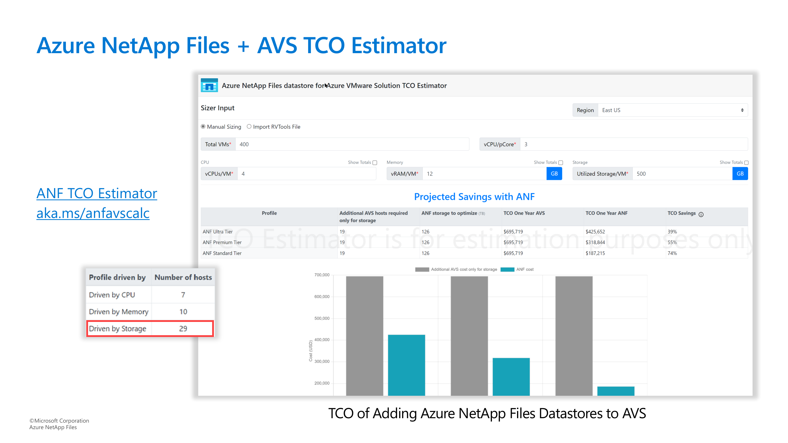

### Key Points

- Azure NetApp Files (ANF) is a fully managed storage service integrated with Azure VMware Solution (AVS).
- ANF appears as a Virtual Volume (VVol) storage bucket within the AVS platform.
- This integration allows migration of virtual machines (VMs) from vSAN storage to Azure NetApp Files.
- Using ANF with AVS can lead to cost savings by leveraging external storage options.
- Microsoft provides a Total Cost of Ownership (TCO) Estimator tool to evaluate the financial impact of adding ANF datastores to AVS.

### Details

- **Azure NetApp Files (ANF)** is presented as a fully managed service, meaning users do not have to manage the underlying infrastructure.
- Within the **Azure VMware Solution (AVS)** environment, ANF shows up as a **VVol (Virtual Volume)** storage bucket, which acts like a storage container for VMs.
- This setup enables users to "point and shoot" — simply select ANF as a storage target — and start moving virtual machines off their existing **vSAN** (VMware’s native storage solution) onto Azure’s native, high-performance storage platform.
- The speaker highlights that this approach effectively extends the AVS platform’s storage capabilities by integrating with Azure’s cloud-native storage services.
- The slide references the **ANF TCO Estimator** tool (available at aka.ms/anfavscalc), which helps users calculate the total cost of ownership when adding Azure NetApp Files datastores to their AVS environment.
- The speaker notes that this slide has been used in various contexts to demonstrate that external storage options like ANF can provide cost savings compared to traditional on-premises or vSAN storage.
- The integration supports hybrid cloud strategies by enabling seamless VM migration and storage expansion without complex management overhead.

### Definitions

- **Azure NetApp Files (ANF)**: A fully managed cloud storage service that provides high-performance file storage, integrated natively into Azure.
- **Azure VMware Solution (AVS)**: A Microsoft Azure service that allows customers to run VMware workloads natively on Azure infrastructure.
- **VVol (Virtual Volume)**: A storage abstraction that allows granular VM-level storage management, appearing as a storage bucket within AVS.
- **vSAN**: VMware’s software-defined storage solution that pools local storage devices in a vSphere cluster to create a shared datastore.
- **TCO Estimator**: A tool provided by Microsoft to calculate the total cost of ownership when integrating Azure NetApp Files with AVS.

### Examples

- The speaker describes a practical scenario where a user points to Azure NetApp Files within AVS, and it appears as a VVol storage bucket.
- The user then migrates virtual machines from their existing vSAN storage to the Azure-native NetApp Files platform, effectively expanding storage capacity and potentially reducing costs.

### Key Takeaways 🎯

- Azure NetApp Files integrates seamlessly with Azure VMware Solution as a fully managed external storage option.
- This integration simplifies VM migration from vSAN to cloud-native storage, enhancing flexibility and scalability.
- Using the ANF TCO Estimator tool helps organizations understand potential cost savings and plan their storage strategy effectively.
- Leveraging external storage like ANF within AVS can lead to significant operational and financial benefits.

---

## Slide 62: Customer

**Timestamp**: 01:37:27 – 01:38:01

### Key Points

- Home Trust Company upgraded its datacenter with a focus on reliability, resilience, and cost reduction.
- Azure NetApp Files was selected as the datastore solution for Azure VMware Solution (AVS).
- The choice of Azure NetApp Files led to significant Total Cost of Ownership (TCO) savings by eliminating the need for 30 AVS nodes dedicated to storage.
- Azure NetApp Files offers flexible performance tiers, enabling easy scaling.
- Premium Azure NetApp Files storage supports both production and development/testing environments.
- The solution simplified management and enabled modernization of workloads on Azure.
- Speaker emphasized that cost savings are significant across solutions, with sizing considerations depending on workload needs, especially storage-heavy architectures.

### Details

- **Customer & Context**: Home Trust Company, a large financial insurance firm with 1,000–9,999 employees, needed to exit its datacenter. The upgrade project was costly and time-consuming, prompting a search for a managed VMware solution that would increase reliability and resilience while reducing operating costs.

- **Solution**:
  - Azure NetApp Files was chosen as the datastore for Azure VMware Solution.
  - This choice was driven by TCO savings, primarily because it eliminated the need for 30 AVS nodes that would have been used solely for storage.
  - Azure NetApp Files provides three performance tiers, allowing Home Trust to scale storage performance up or down based on workload demands.
  - Premium storage tiers were used for both production and Dev/Test environments, ensuring high performance and flexibility.

- **Impact**:
  - Simplified management of datastores within Azure VMware Solution.
  - Significant cost savings in total ownership.
  - Enabled Home Trust to fully commit to Azure, facilitating workload modernization and optimization by moving workloads to Azure SaaS, PaaS, or IaaS platforms.
  - The collaboration and technical support from Microsoft, Bell, NetApp, and others were key to the project's success.

- **Speaker’s Additional Context**:
  - The speaker highlighted that while different solutions may have slight differences, the main factor for customers is feature preference since all options save significant money.
  - The speaker and colleague have extensive experience sizing AVS environments (potentially over 1,000 AVS sizing projects combined).
  - For storage-heavy architectures, customers may not need additional CPU or RAM, which influences the sizing and cost considerations.
  - This insight aligns with Home Trust’s choice to eliminate 30 AVS nodes dedicated to storage by leveraging Azure NetApp Files.

### Definitions

- **Azure NetApp Files**: A Microsoft Azure service providing enterprise-grade file storage with multiple performance tiers, designed to support scalable and flexible storage needs, especially for workloads running on Azure VMware Solution.

- **Azure VMware Solution (AVS)**: A Microsoft Azure service that allows customers to run VMware workloads natively on Azure infrastructure, enabling hybrid cloud and datacenter exit strategies.

- **Total Cost of Ownership (TCO)**: The comprehensive cost of deploying and operating a technology solution, including hardware, software, management, and operational expenses.

### Examples

- Home Trust Company’s elimination of 30 AVS nodes dedicated to storage by using Azure NetApp Files as the datastore, resulting in significant cost savings.
- Use of Azure NetApp Files premium storage for both production and development/testing environments, demonstrating flexibility and performance scaling.

### Key Takeaways 🎯

- Azure NetApp Files can significantly reduce costs and complexity in Azure VMware Solution deployments by replacing multiple storage-dedicated AVS nodes.
- Flexible performance tiers in Azure NetApp Files allow organizations to scale storage efficiently according to workload needs.
- Managed VMware solutions on Azure, supported by Azure NetApp Files, enable organizations like Home Trust Company to modernize workloads and optimize cloud infrastructure.
- Expert sizing and architecture considerations, especially for storage-heavy workloads, are crucial to maximizing cost savings and performance benefits.

---

## Slide 63: Azure Elastic SAN (ESAN)

**Timestamp**: 01:38:01 – 01:38:40

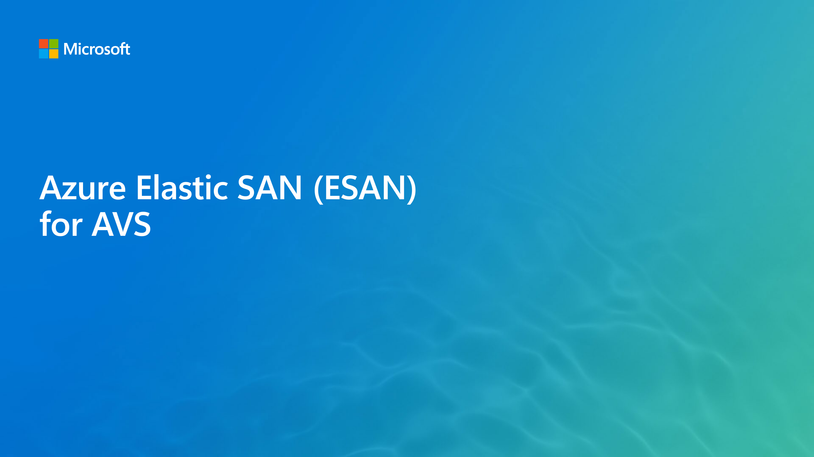

### Key Points

- Azure Elastic SAN (ESAN) can be integrated with Azure VMware Solution (AVS) to optimize infrastructure.
- Using AVS hosts alone might require a higher number of nodes (e.g., 31 hosts).
- By leveraging Azure native pure storage alongside AVS hosts, the number of required hosts can be significantly reduced (e.g., down to 11 hosts).
- This hybrid approach uses vSAN storage on AVS hosts and spills over to Azure native pure storage.
- Potential cost savings of up to 52% over three years by adopting this combined storage strategy.
- Azure Elastic SAN is a fully managed, fully hosted storage platform provided by Pure Storage.

### Details

- **Azure Elastic SAN (ESAN) for AVS** refers to the use of Azure’s Elastic SAN storage service in conjunction with Azure VMware Solution environments.
- The speaker illustrates a scenario where a workload initially requires 31 AVS hosts if relying solely on AVS infrastructure.
- However, when considering CPU and RAM requirements, the number of AVS hosts can be reduced to 11 by offloading storage demands.
- This is achieved by continuing to use vSAN storage on the reduced number of AVS hosts while extending storage capacity into Azure native pure storage.
- This hybrid storage approach optimizes resource utilization by balancing compute and storage needs between AVS hosts and Azure Elastic SAN.
- The solution is fully managed and hosted by Pure Storage, ensuring ease of deployment and maintenance.
- Financially, this approach can lead to substantial cost savings, with the speaker citing up to 52% savings over a three-year period compared to using AVS hosts alone.
- This demonstrates how integrating Azure Elastic SAN with AVS can improve efficiency and reduce total cost of ownership for VMware workloads running in Azure.

### Definitions

- **Azure Elastic SAN (ESAN)**: A fully managed, hosted storage platform in Azure, provided by Pure Storage, designed to deliver scalable, high-performance storage that can integrate with AVS environments.
- **Azure VMware Solution (AVS)**: A Microsoft Azure service that allows customers to run VMware workloads natively on Azure infrastructure.
- **vSAN storage**: VMware’s software-defined storage solution that pools direct-attached storage devices across a VMware cluster to create a shared datastore.

### Examples

- The speaker’s example compares two configurations for a workload:
  - **31 AVS hosts** if relying solely on AVS infrastructure for both compute and storage.
  - **11 AVS hosts** when using vSAN storage on these hosts combined with Azure native pure storage (Elastic SAN) to handle additional storage needs.
- This example highlights how integrating Azure Elastic SAN can reduce the number of required AVS hosts by nearly two-thirds.

### Key Takeaways 🎯

- Combining Azure Elastic SAN with AVS can significantly reduce the number of AVS hosts needed by offloading storage to Azure native pure storage.
- This hybrid approach optimizes CPU, RAM, and storage resources efficiently.
- It offers substantial cost savings—up to 52% over three years—while providing a fully managed, hosted storage solution.
- Azure Elastic SAN is a strategic complement to AVS for scalable, cost-effective VMware workloads in Azure.

---

## Slide 64: Azure Elastic SAN

**Timestamp**: 01:38:40 – 01:39:17

### Key Points

- Azure Elastic SAN is a fully managed, VMware-certified storage solution integrated with Azure VMware Solution (AVS).
- It provides scalable, redundant storage independent of compute resources.
- Azure Elastic SAN offers the lowest cost per GiB storage option for AVS.
- It supports high availability, data protection, and seamless migration of on-premises VMware environments to AVS.
- Usage of Azure native storage, including Elastic SAN, counts against a customer’s Microsoft Azure Consumption Commitment (MAC), which can provide cost benefits.

### Details

- **Azure Elastic SAN Overview**:  
  Azure Elastic SAN is a fully managed storage service designed specifically for Azure VMware Solution environments. It integrates natively with VMware technology stacks such as ESXi hosts, vCenter, and vSAN storage, providing VMware-certified datastores (VMFS) for virtual machines (VMs).

- **Architecture and Integration**:  
  The slide illustrates the integration of Azure Elastic SAN volumes with VMware components:
  - Multiple Azure Elastic SAN volumes can be attached as VMware-certified datastores.
  - These datastores support VMware vCenter management and ESXi hosts.
  - Networking is handled via VMware NSX, ensuring seamless connectivity.
  - The solution runs on VMware-certified hardware within Azure, ensuring compatibility and performance.

- **Key Features**:  
  - **Fully Managed Storage with Built-in Redundancy**: Azure Elastic SAN handles storage management and ensures data redundancy to protect against failures.
  - **Scalable Storage Independent of Compute**: Storage capacity and performance can be scaled without needing to scale compute resources, offering flexibility and cost efficiency.
  - **Cost Efficiency**: It is the lowest cost per GiB storage option available for AVS, making it an economical choice for VMware workloads on Azure.
  - **Native Azure Integration**: As a first-party Azure solution, it integrates seamlessly with other Azure services, enhancing the overall cloud ecosystem.
  - **High Availability and Data Protection**: Designed to enhance data protection and recovery capabilities with high availability and scalability tailored for AVS environments.
  - **Simplified Migration**: Facilitates seamless migration of on-premises VMware environments to AVS by providing centralized, cost-effective storage.

- **Microsoft Azure Consumption Commitment (MAC)**:  
  The speaker highlights that any usage or purchase of Azure native storage, including Azure Elastic SAN, counts against a customer’s MAC.  
  - **MAC Definition**: A Microsoft Azure Consumption Commitment is a customer’s contractual commitment to spend a certain amount on Azure services over a defined period (typically 3 to 5 years).  
  - Customers with a MAC receive discounted pricing based on their committed spend, making Azure Elastic SAN usage more cost-effective for those customers.

### Definitions

- **Azure Elastic SAN**: A fully managed, VMware-certified storage service on Azure that provides scalable, redundant, and cost-effective storage volumes for Azure VMware Solution environments.
- **Microsoft Azure Consumption Commitment (MAC)**: A contractual agreement where a customer commits to a certain level of Azure spending over a period (usually 3-5 years) in exchange for discounted pricing.
- **VMFS Datastores**: VMware File System datastores used to store virtual machine files, supported natively by Azure Elastic SAN in AVS.
- **VMware NSX**: VMware’s network virtualization and security platform, used here to manage networking for VMs in AVS.
- **Azure VMware Solution (AVS)**: A Microsoft Azure service that enables running VMware workloads natively on Azure infrastructure.

### Examples

- The speaker references customers who have a MAC and how their Azure Elastic SAN usage counts toward this commitment, implying cost savings for those customers.
- The slide’s diagram shows multiple Azure Elastic SAN volumes attached to VMware ESXi hosts and managed via vCenter, illustrating a typical AVS deployment architecture.

### Key Takeaways 🎯

- Azure Elastic SAN is a native, fully managed storage solution optimized for AVS, offering scalability, redundancy, and cost efficiency.
- It enables independent scaling of storage from compute, reducing costs and improving flexibility.
- Usage of Azure Elastic SAN contributes to a customer’s MAC, potentially lowering costs for committed Azure spenders.
- The solution supports seamless migration and integration with VMware environments, making it ideal for enterprises moving VMware workloads to Azure.

---

## Slide 65: Azure Elastic SAN

**Timestamp**: 01:39:17 – 01:39:49

### Key Points

- Azure Elastic SAN is an optimal storage solution for secondary sites or workloads with lower performance demands.
- It offers significant cost savings—up to 55% compared to scaling by adding more nodes.
- Provides cost-effective, scalable storage capacity that can be increased independently of performance.
- It is the lowest cost per GiB storage option available for Azure VMware Solution (AVS).
- Supports zone-redundant storage (ZRS) to enhance resilience and disaster recovery capabilities.
- Azure Elastic SAN is generally available, with ZRS currently available in limited AVS regions and expanding soon.
- Storage for Azure Native Pure Storage is fully managed by Microsoft and counts toward the customer’s Microsoft Azure Commitment (MAC), ensuring financial efficiency.

### Details

- **Azure Elastic SAN** is designed to serve as a cost-effective storage option particularly suited for secondary sites or workloads that do not require the highest performance levels.
- It enables users to **store large volumes of data affordably**, making it ideal for scenarios where capacity is a priority over peak performance.
- One of the key advantages is the ability to **scale storage capacity independently**: after meeting performance requirements, additional capacity-only units can be deployed to increase storage without adding unnecessary performance overhead.
- This approach results in **up to 55% cost savings** compared to scaling by adding more compute nodes, making it a financially attractive option.
- Azure Elastic SAN offers the **lowest cost per GiB storage option for AVS**, which can be scaled up on demand, providing flexibility and cost control.
- To ensure **business continuity and resilience**, Azure Elastic SAN supports **zone-redundant storage (ZRS)**, protecting against outages by replicating data across availability zones.
- ZRS for Azure Elastic SAN is currently available in a limited number of AVS regions, with plans to roll out to additional regions soon.
- The speaker emphasized the financial benefits of using Azure Native Pure Storage, highlighting that all storage is managed by Microsoft and that expenditures on Azure Native Pure Storage count toward the customer’s **Microsoft Azure Commitment (MAC)**. This means any dollar spent reduces the MAC commitment, aligning with customers’ financial goals.
- Overall, Azure Elastic SAN aligns with both **technological and financial objectives**, ensuring deployments are efficient and cost-effective.

### Definitions

- **Azure Elastic SAN**: A scalable, cost-effective storage solution in Azure designed for secondary sites or less demanding workloads, allowing independent scaling of storage capacity and providing zone-redundant storage options.
- **Zone-Redundant Storage (ZRS)**: A storage replication strategy that replicates data across multiple availability zones to protect against zone-level outages and enhance disaster recovery.
- **Microsoft Azure Commitment (MAC)**: A financial commitment customers make to Azure usage, where spending on Azure Native Pure Storage counts toward fulfilling this commitment, effectively reducing the remaining balance.

### Examples

- While no specific practical demonstrations were given, the speaker highlighted the financial example that any dollar spent on Azure Native Pure Storage reduces the MAC commitment, illustrating cost efficiency in real-world budgeting scenarios.

### Key Takeaways 🎯

- Azure Elastic SAN is a cost-effective, scalable storage solution ideal for secondary sites and less demanding workloads.
- It offers up to 55% savings compared to scaling by adding nodes, with the ability to scale capacity independently.
- Provides the lowest cost per GiB storage for AVS and supports zone-redundant storage for disaster recovery.
- Azure Native Pure Storage is fully managed by Microsoft and financially beneficial as it counts toward the MAC commitment.
- ZRS availability is currently limited but expanding, enhancing resilience and business continuity.

---

## Slide 66: M I C R O S O F T  C O N F I D E N T I A L

**Timestamp**: 01:39:49 – 01:40:23

### Key Points

- Azure Elastic SAN offers scalable, provisioned storage volumes with flexible billing and redundancy options.
- Storage is organized into volume groups, which provide configuration inheritance and networking/security management.
- Two provisioning units exist: Base units and Capacity-only units, with billing based on provisioned amounts.
- Volumes support private endpoints, iSCSI protocol for read/write access, and can be exposed as VMFS datastores.
- Redundancy options include Locally Redundant Storage (LRS) and Zone-Redundant Storage (ZRS).
- Volumes have individual performance limits despite being part of a volume group.
- The platform is generally available and supported jointly by Microsoft and Pure Storage.
- Real-world example: Dupico Credit Union leveraged Azure Native Pure Storage with AVS to reduce the number of AVS hosts needed, optimizing costs for a storage-heavy workload.

### Details

- **Azure Elastic SAN** is a cloud-native storage solution designed to provide elastic, scalable SAN volumes.
- Storage is structured hierarchically:
  - **Volume Group**: A container for volumes that inherits networking and security configurations.
  - **Volumes**: Individual storage units within a volume group, each with its own performance limits.
- **Provisioning Units**:
  - **Base units**: The fundamental provisioning block.
  - **Capacity-only units**: Additional capacity provisioned beyond the base.
  - Billing is based on the sum of provisioned base and capacity-only units, allowing flexible cost management.
- **Redundancy Options**:
  - **LRS (Locally Redundant Storage)**: Data is replicated within a single data center.
  - **ZRS (Zone-Redundant Storage)**: Data is replicated across multiple availability zones for higher resilience.
- **Networking and Security**:
  - Volume groups manage network and security settings.
  - Private Endpoints are configured at the volume group level, providing secure, private connectivity.
- **Access Protocol**:
  - Volumes provide read/write access over the iSCSI protocol, a standard for SAN connectivity.
- **VMFS Datastore Support**:
  - Volumes can be exposed as VMFS datastores, enabling use with VMware environments.
- **General Availability**:
  - Azure Elastic SAN is generally available, indicating it is production-ready.
- **Speaker’s Example**:
  - Dupico Credit Union deployed Azure VMware Solution (AVS) and integrated Azure Native Pure Storage.
  - This integration allowed them to reduce the number of AVS hosts required by offloading storage to Azure Native Pure Storage.
  - They maintained necessary CPU and RAM on hosts but optimized storage costs by leveraging cloud-native storage.
  - This demonstrates cost savings and efficiency for storage-heavy customers using this platform.

### Definitions

- **Azure Elastic SAN**: A scalable, cloud-native storage solution providing SAN volumes with flexible provisioning and redundancy options.
- **Volume Group**: A logical container for volumes that manages shared networking and security configurations.
- **Provisioning Units**: Units of storage allocation consisting of base units and capacity-only units, used for billing and capacity planning.
- **LRS (Locally Redundant Storage)**: Storage redundancy within a single data center.
- **ZRS (Zone-Redundant Storage)**: Storage redundancy across multiple availability zones.
- **Private Endpoints**: Network interfaces that connect privately and securely to Azure resources.
- **iSCSI Protocol**: Internet Small Computer Systems Interface, a protocol that allows clients to send SCSI commands to storage devices over IP networks.
- **VMFS Datastore**: VMware File System datastore used to store virtual machine files.

### Examples

- **Dupico Credit Union**:
  - Deployed Azure VMware Solution (AVS) with Azure Native Pure Storage.
  - Reduced the number of AVS hosts required by offloading storage to Azure Native Pure Storage.
  - Achieved cost savings by optimizing storage-heavy workloads while maintaining CPU and RAM requirements on hosts.

### Key Takeaways 🎯

- Azure Elastic SAN provides flexible, provisioned storage volumes with configurable redundancy and security.
- Volume groups simplify management by inheriting configurations and enabling private endpoints.
- Billing is based on provisioned base and capacity-only units, allowing cost control.
- The platform supports iSCSI access and can integrate with VMware environments via VMFS datastores.
- Real-world deployments, such as Dupico Credit Union, demonstrate cost savings and efficiency gains by combining AVS with Azure Native Pure Storage.
- Azure Elastic SAN is generally available and jointly supported by Microsoft and Pure Storage, ensuring enterprise readiness.

---

## Slide 67: M I C R O S O F T  C O N F I D E N T I A L

**Timestamp**: 01:40:23 – 01:40:54

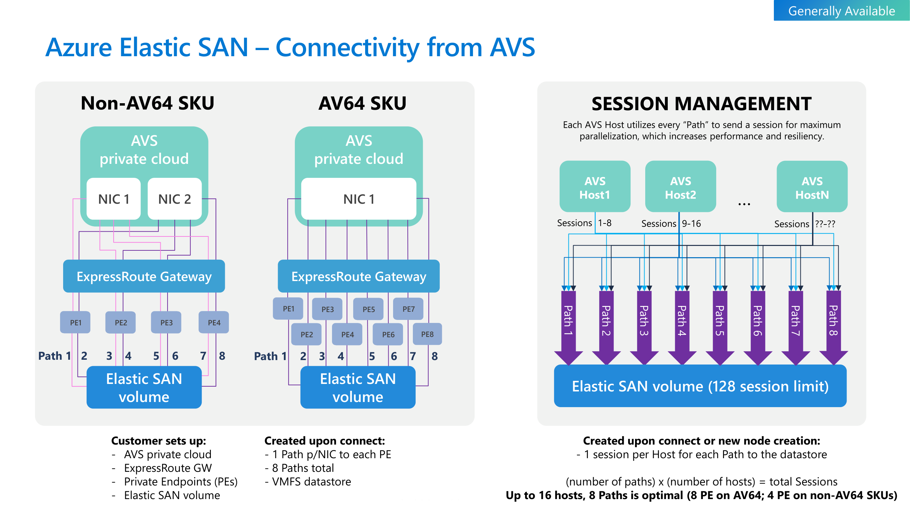

### Key Points

- Overview of Azure VMware Solution (AVS) private cloud connectivity with Azure Elastic SAN.
- Customer responsibilities include setting up AVS private cloud, ExpressRoute Gateway, Private Endpoints (PEs), and Elastic SAN volume.
- Upon connection, multiple network paths and sessions are created between hosts and the Elastic SAN datastore.
- Optimal configuration involves up to 16 hosts and 8 network paths (PEs), with session limits per Elastic SAN volume.
- Elastic SAN supports up to 128 sessions per volume.
- The slide illustrates the detailed path and session setup between AVS hosts and Elastic SAN via ExpressRoute Gateway.
- The solution is generally available and designed for cost savings compared to AVS-only deployments.

### Details

- **Customer Setup Components:**
  - **AVS private cloud:** The VMware environment hosted on Azure.
  - **ExpressRoute Gateway:** Provides private network connectivity between AVS and Azure services.
  - **Private Endpoints (PEs):** Network interfaces that connect AVS to Elastic SAN volumes.
  - **Elastic SAN volume:** The storage resource used by AVS VMs, presented as a VMFS datastore.

- **Connection and Path Configuration:**
  - For each Private Endpoint (PE), a dedicated network path (p/NIC) is created.
  - There are 8 paths total, corresponding to 8 PEs.
  - Each host in the AVS environment establishes one session per path to the Elastic SAN datastore.
  - Total sessions = (number of paths) × (number of hosts).
  - Elastic SAN volume supports up to 128 sessions per volume.

- **Host and Path Optimization:**
  - Up to 16 hosts can be connected optimally.
  - 8 paths (PEs) are optimal for AV64 SKU (Azure VMware Solution with 64 vCPUs).
  - Non-AV64 SKUs typically use 4 PEs.
  - This setup ensures efficient and resilient connectivity between AVS hosts and Elastic SAN storage.

- **Networking Diagram Highlights:**
  - The slide shows multiple PEs (PE1 to PE8) connected to the ExpressRoute Gateway.
  - Each PE corresponds to a path used by hosts to access the Elastic SAN volume.
  - NICs (Network Interface Cards) are involved in managing these paths.

- **Speaker Context:**
  - The speaker briefly mentions anticipated cost savings by using this hybrid approach (AVS with Elastic SAN) compared to AVS-only deployments.
  - No new questions were raised at this point, indicating the audience may have understood the connectivity and cost benefits.

### Definitions

- **AVS (Azure VMware Solution):** A service that allows running VMware workloads natively on Azure infrastructure.
- **ExpressRoute Gateway:** A gateway that enables private, dedicated network connectivity between on-premises or AVS environments and Azure services.
- **Private Endpoints (PEs):** Network interfaces that provide private connectivity to Azure services, here used to connect AVS to Elastic SAN.
- **Elastic SAN:** Azure’s scalable, high-performance storage service designed for SAN workloads, supporting multiple sessions and paths.
- **VMFS datastore:** VMware File System datastore used to store virtual machine files on SAN storage.

### Examples

- The slide implicitly demonstrates a scenario where a customer sets up an AVS private cloud with 8 Private Endpoints connected through an ExpressRoute Gateway to an Elastic SAN volume.
- For example, with 8 paths and 16 hosts, the total number of sessions to the Elastic SAN datastore would be 128 (8 paths × 16 hosts), which is the maximum session limit per volume.

### Key Takeaways 🎯

- Azure Elastic SAN integrates with AVS private clouds via ExpressRoute Gateway and Private Endpoints to provide scalable, high-performance storage.
- Customers are responsible for setting up AVS, ExpressRoute Gateway, PEs, and Elastic SAN volumes.
- The connectivity model uses multiple paths and sessions to optimize performance and resilience.
- Elastic SAN supports up to 128 sessions per volume, accommodating up to 16 hosts with 8 paths optimally.
- This hybrid deployment model offers significant cost savings compared to AVS-only storage solutions.
- The solution is generally available and ready for production use.

---

## Slide 68: AVS

**Timestamp**: 01:40:54 – 01:43:38

### Key Points

- Azure VMware Solution (AVS) deployments often require external storage to meet performance, feature, and cost requirements.
- External storage integration can significantly reduce total 3-year costs compared to AVS nodes alone.
- There is a cost and complexity trade-off when deciding between adding AVS nodes or using external storage.
- A practical break point for cost-effectiveness is typically around 3-6 AVS hosts; beyond that, external storage usually offers better savings.
- The example compares 31 AVS nodes alone versus a hybrid of 11 AVS nodes plus ESAN external storage.
- Storage-heavy environments benefit most from external storage solutions like ESAN.
- Features and disaster recovery capabilities influence the choice of storage solutions.
- Customers sometimes choose Azure Native Pure or Azure NetApp Files for their advanced functionality, even if external storage is not strictly required.

### Details

- **AVS Only Scenario:**
  - 31 AVS nodes (AV64 instance type) reserved for 3 years (3YR RI).
  - Total 3-year cost: approximately $5.36 million.
  - Storage capacity needed: 320 TB.
  
- **AVS + ESAN Scenario:**
  - 11 AVS nodes (AV64 3YR RI).
  - 192 TB ESAN external storage (48 TB base + 144 TB capacity).
  - Endpoints account for about 11% of storage costs.
  - Total 3-year cost: approximately $2.41 million.
  - This represents a savings of 55% over the AVS-only scenario.
  
- **Example Context:**
  - Based on East US region.
  - Uses FTT2-Raid 6 configuration for storage resiliency.
  - The example is manufactured to illustrate a storage-heavy environment.
  - ESAN is generally available.
  
- **Speaker Insights:**
  - External storage is critical in almost every AVS deal to balance features, performance, and cost.
  - Cost is always a factor for customers; external storage integration helps optimize this.
  - Adding extra AVS hosts solely for storage can be less cost-effective and adds complexity.
  - The "break point" for deciding between adding hosts or using external storage is often around 3-6 hosts.
  - Beyond this break point, external storage typically offers significant savings and is worth the added complexity.
  - Some customers prefer Azure Native Pure or Azure NetApp Files for their advanced features, even if external storage is not strictly necessary.
  - Disaster recovery use cases also influence storage choices.
  - The decision involves weighing complexity against cost savings and desired features.
  
- **Additional Notes:**
  - The speaker emphasizes practical decision-making rather than fixed rules.
  - Most customers tend to overshoot storage needs, making external storage a clear choice.
  - The example highlights the financial impact of choosing the right storage architecture in AVS deployments.

### Definitions

- **AVS (Azure VMware Solution)**: A Microsoft Azure service that allows customers to run VMware workloads natively on Azure infrastructure.
- **3YR RI (3 Year Reserved Instance)**: A pricing model where resources are reserved for three years, typically offering cost savings compared to pay-as-you-go.
- **ESAN (External Storage Area Network)**: External storage solution integrated with AVS to provide scalable, high-performance storage separate from AVS compute nodes.
- **FTT2-Raid 6**: A fault tolerance configuration providing double parity (two drives can fail without data loss), used here for storage resiliency.
- **Endpoints**: Components or interfaces that connect compute nodes to external storage; they contribute to storage costs (~11% in this example).
- **Azure Native Pure / Azure NetApp Files**: Managed storage services on Azure offering advanced features and replication capabilities, sometimes used instead of external storage.

### Examples

- **Cost Comparison Example:**
  - 31 AVS nodes alone cost $5.36M over 3 years for 320 TB storage.
  - Using 11 AVS nodes plus 192 TB ESAN external storage costs $2.41M over 3 years.
  - This hybrid approach saves approximately $2.95M or 55% over the AVS-only approach.
  
- **Practical Break Point:**
  - For environments requiring more than 3-6 AVS hosts, external storage is usually more cost-effective.
  - For smaller environments, adding hosts might be simpler and more cost-effective.
  
- **Use Case Considerations:**
  - Customers with large storage needs (e.g., needing an extra 200 TB) find external storage decisions straightforward.
  - Some customers choose Azure Native Pure or Azure NetApp Files for their replication and disaster recovery features, even if external storage is not strictly necessary.

### Key Takeaways 🎯

- Integrating external storage with AVS can dramatically reduce costs and improve storage efficiency in storage-heavy environments.
- The decision to use external storage versus adding AVS nodes depends on balancing cost savings against added complexity.
- A typical cost break point is around 3-6 AVS hosts; beyond this, external storage is usually the better choice.
- Features, performance, and disaster recovery requirements also influence storage architecture decisions.
- The example provided illustrates a 55% cost saving over 3 years by combining fewer AVS nodes with ESAN external storage.
- Understanding customer needs and appetite for complexity is critical when designing AVS storage solutions.

---

## Slide 69: M I C R O S O F T  C O N F I D E N T I A L

**Timestamp**: 01:43:38 – 01:47:30

### Key Points

- Azure Elastic SAN pricing is based on units measured in TiB with specific performance characteristics.
- Pricing varies by redundancy type: Premium LRS (Locally Redundant Storage) and Premium ZRS (Zone-Redundant Storage).
- Two types of units: Base units (with provisioned IOPS and throughput) and Capacity-only units (storage without provisioned performance).
- Pricing is region-specific; the slide shows East US pricing.
- Additional costs apply for Private Link and Ultra Performance Gateway (~11% upcharge).
- Azure Elastic SAN supports Tier 1 & 2 workloads including databases and VDI, scalable to very large volumes and high IOPS/throughput.
- VMware Live Site Recovery (formerly SRM) now supports replication to external storage, enabling cost-effective disaster recovery (DR) solutions using Azure Elastic SAN and other external storage platforms.
- This capability allows DR environments to be smaller and less costly by replicating storage externally rather than duplicating entire host clusters.

### Details

- **Pricing Meter and Units**:
  - **Premium LRS Base unit**: 1 TiB with 5000 IOPS and 200 MB/s throughput, priced at $0.08 per GiB monthly.
  - **Premium LRS Capacity only unit**: 1 TiB capacity without provisioned performance, priced at $0.06 per GiB monthly.
  - **Premium ZRS Base unit**: 1 TiB with 5000 IOPS and 200 MB/s throughput, priced at $0.12 per GiB monthly.
  - **Premium ZRS Capacity only unit**: 1 TiB capacity without provisioned performance, priced at $0.09 per GiB monthly.
  - Pricing is based on the East US region; other regions may vary.
  - Private Link and Ultra Performance Gateway costs are additional (~11% upcharge).

- **Monthly Cost Examples**:
  - For LRS:
    - Base Units: 2,621.44 units costing $3,932.16
    - Capacity Units: 4,177.92 units costing $6,266.88
    - Total: $6,799.36
  - For ZRS:
    - Base Units: 2,621.44 units costing $3,932.16
    - Capacity Units: 4,177.92 units costing $6,266.88
    - Total: $10,199.04

- **Azure Elastic SAN Scale Targets**:
  - Volume size: 64 TiB per volume, up to 1 PiB per SAN.
  - IOPS: 80,000 per volume, up to 2,000,000 per SAN.
  - Throughput: 1,280 MB/s per volume, up to 80,000 MB/s per SAN.
  - Provisioning model: Per GiB granularity for provisioning, flexible at TiB granularity.

- **Use Cases**:
  - Designed for Tier 1 & 2 workloads such as databases and Virtual Desktop Infrastructure (VDI).
  - Can be hosted on any compute option including VMs, containers, and Azure VMware Solution (AVS).

- **Speaker’s Explanation on Replication and Disaster Recovery**:
  - Traditional replication tools like Pure Storage’s replication or NetApp’s SnapMirror are platform-specific and do not work across different storage vendors.
  - VMware’s Live Site Recovery (formerly SRM) now supports replication to external storage, including Azure Elastic SAN, ANF (Azure NetApp Files), and Pure Storage.
  - This cross-platform replication capability enables more flexible and cost-effective DR strategies.
  - Previously, DR required duplicating the number of hosts (e.g., 10 hosts in production required 10 hosts in DR) to replicate vSAN storage.
  - Now, with external storage replication, fewer DR hosts are needed (e.g., 3 hosts in DR instead of 10), significantly reducing costs.
  - External storage replication allows spinning up nodes on demand in DR, avoiding the cost of idle hardware.
  - This approach is especially beneficial for customers looking to reduce DR costs by leveraging Azure storage and replication tools.

### Definitions

- **Premium LRS (Locally Redundant Storage)**: A redundancy option where data is replicated within a single data center to protect against hardware failures.
- **Premium ZRS (Zone-Redundant Storage)**: A redundancy option where data is replicated across multiple availability zones to protect against zone failures.
- **Base Unit**: A storage unit that includes provisioned performance metrics such as IOPS and throughput.
- **Capacity Only Unit**: A storage unit that includes capacity without provisioned performance guarantees.
- **VMware Live Site Recovery (formerly SRM)**: A disaster recovery service that enables replication and failover of workloads, now supporting replication to external storage platforms.
- **Azure Elastic SAN**: A scalable, high-performance storage service designed for enterprise workloads, supporting large volumes, high IOPS, and throughput.

### Examples

- A customer with 10 hosts in East US production can now replicate their workloads to a DR site with only 3 hosts in West US by using Azure Elastic SAN and VMware Live Site Recovery to replicate external storage, reducing DR costs significantly.
- Pricing example: For a 64 TiB volume with 80,000 IOPS and 1,280 MB/s throughput, the monthly cost would be calculated based on base units and capacity units as per the pricing meter.

### Key Takeaways 🎯

- Azure Elastic SAN pricing is tiered by redundancy type and performance provisioning, with clear cost structures for base and capacity units.
- VMware Live Site Recovery’s support for external storage replication enables flexible, cost-effective DR solutions using Azure Elastic SAN.
- This capability reduces the need to duplicate entire host clusters in DR, lowering hardware and operational costs.
- Azure Elastic SAN supports demanding enterprise workloads with high scalability in volume size, IOPS, and throughput.
- Additional costs for Private Link and Ultra Performance Gateway should be considered in total pricing.
- Understanding the pricing model and replication capabilities is critical for designing efficient and cost-effective storage and DR architectures in Azure.

---

## Slide 70: M I C R O S O F T  C O N F I D E N T I A L

**Timestamp**: 01:47:30 – 01:49:05

### Key Points

- The slide presents a pricing example for data transfer and private endpoint usage in an Azure VMware Solution (AVS) private cloud environment using Azure Private Link.
- Data transfer between AVS private cloud and the Azure Virtual Network (vNet) via Private Link does not incur Private Endpoint (PE) charges.
- Outbound and inbound data processed through the Private Link are charged at $0.01 per GB.
- Private Endpoints are charged at $0.01 per hour per endpoint.
- The example shows 65 TB of data moving in both directions between AVS private cloud and the PE, and between PE and Elastic SAN (ESAN).
- The speaker emphasizes the value of AVS in optimizing cloud resource usage, reducing capital expenditure, and only scaling hardware when needed.

### Details

- **Data Transfer and Pricing Breakdown:**
  - The slide illustrates a scenario where 65 TB of data is transferred outbound from AVS private cloud to the Private Endpoint (PE), and 65 TB inbound from PE to AVS private cloud.
  - There are no PE charges for data transfer between AVS private cloud and the vNet, highlighting a cost-saving aspect.
  - However, data processed outbound and inbound through the Virtual Network Private Link is charged at $0.01 per GB.
  - For 65 TB outbound data processed, the cost is $665.60.
  - For 65 TB inbound data processed, the cost is also $665.60.
  - Additionally, 8 Private Endpoints are used, each charged at $0.01 per hour, totaling $58.40 per month.
- **Infrastructure Components:**
  - The AVS private cloud subnet connects to Elastic SAN (ESAN) storage.
  - Data flows between AVS private cloud, PE, and ESAN are detailed to show how data transfer charges apply.
- **Speaker’s Context:**
  - The speaker and co-presenter express enthusiasm about AVS’s ability to leverage cloud benefits such as cost efficiency and dynamic hardware utilization.
  - AVS allows organizations to minimize capital investments by using cloud resources efficiently and scaling hardware only when necessary.
  - Azure is highlighted as an ideal platform for running VMware workloads with these capabilities.
  - The speakers encourage attendees to reach out for further questions and provide contact avenues, emphasizing their willingness to assist.
- **Broader Topic Relationship:**
  - This slide fits into the broader discussion of external storage options for AVS, focusing on cost implications and practical deployment considerations.
  - Understanding pricing models for data transfer and private endpoints is critical for planning and budgeting AVS deployments.

### Definitions

- **AVS (Azure VMware Solution)**: A Microsoft Azure service that enables running VMware workloads natively on Azure infrastructure, providing cloud benefits while maintaining VMware compatibility.
- **Private Endpoint (PE)**: A network interface that connects privately and securely to Azure services over a Private Link, avoiding exposure to the public internet.
- **Elastic SAN (ESAN)**: Azure’s scalable, high-performance storage solution designed to support demanding workloads such as those running on AVS.
- **Virtual Network (vNet)**: An Azure network that provides isolation and segmentation for resources, enabling secure communication within Azure.
- **Private Link**: Azure service that enables private connectivity from a virtual network to Azure platform as a service (PaaS), customer-owned, or Microsoft partner services.

### Examples

- The slide’s pricing example uses 65 TB of data transferred outbound and inbound between AVS private cloud and PE, illustrating how data transfer costs accumulate.
- The example includes 8 Private Endpoints running continuously, showing how endpoint charges add to the monthly cost.
- The scenario demonstrates no PE charges for data moving between AVS private cloud and vNet, emphasizing cost-saving opportunities.

### Key Takeaways 🎯

- Data transfer between AVS private cloud and vNet via Private Link avoids Private Endpoint charges, reducing costs.
- Outbound and inbound data processed through Private Link are charged at $0.01 per GB, which can add up significantly at large data volumes.
- Private Endpoints incur a charge of $0.01 per hour each, which should be factored into cost planning.
- AVS enables efficient cloud resource utilization, minimizing capital expenditure and scaling hardware dynamically.
- Understanding the pricing model for Private Link and Private Endpoints is essential for budgeting AVS deployments effectively.
- The speakers are accessible for further questions and emphasize the practical benefits of AVS for VMware workloads on Azure.

---

## Slide 71: M I C R O S O F T  C O N F I D E N T I A L

**Timestamp**: 01:59:55 – 02:00:25

### Key Points

- Introduction to pricing considerations for Azure services related to Private Endpoints and Azure Elastic SAN.
- Reference to official Microsoft Azure pricing calculators for accurate cost estimation.
- The Azure Elastic SAN service is generally available.
- The presenters are from the Cloud Solutions Unit (CSU), specializing in customer migrations and escalations.

### Details

- The slide emphasizes **performance** and **cost** as key factors when working with Azure services such as Private Endpoints and Azure Elastic SAN.
- To assist with cost planning, Microsoft provides online tools:
  - The **Azure Pricing Calculator** (<https://azure.microsoft.com/en-us/pricing/calculator/>) is the primary resource for estimating costs of various Azure services.
  - For **Private Endpoint** specific costs, there is a dedicated pricing page: **Pricing - Azure Private Link | Microsoft Azure**.
  - There is also a specific calculator for **Azure Elastic SAN** pricing.
- The slide notes that **Azure Elastic SAN** is **Generally Available (GA)**, indicating it is fully released and supported for production use.
- The speaker’s narration introduces the next presenters, Sabine and John, who are part of the **Cloud Solutions Unit (CSU)**. This division focuses on:
  - Handling customer migrations to Azure.
  - Managing escalations related to cloud architecture.
- The transition indicates that the upcoming content will likely delve deeper into practical aspects of Azure services, possibly including cost management and performance considerations.

### Definitions

- **Azure Pricing Calculator**: An online tool provided by Microsoft to estimate the cost of Azure services based on usage and configuration.
- **Private Endpoint**: A network interface that connects you privately and securely to a service powered by Azure Private Link.
- **Azure Elastic SAN**: A scalable, high-performance storage area network service in Azure, now generally available.
- **Generally Available (GA)**: A product or service status indicating it is fully released and supported for production workloads.
- **Cloud Solutions Unit (CSU)**: A specialized team within Microsoft focusing on cloud architecture, customer migrations, and resolving escalations.

### Examples

- No specific practical examples or demonstrations were provided in this segment. The speaker mainly introduced the presenters and set the stage for the next part of the presentation.

### Key Takeaways 🎯

- Use the official Azure Pricing Calculator and dedicated pricing pages to accurately estimate costs for Private Endpoints and Azure Elastic SAN.
- Azure Elastic SAN is now generally available, signaling readiness for production deployment.
- The Cloud Solutions Unit (CSU) team, represented by Sabine and John, specializes in customer migrations and escalations, indicating their expertise in practical Azure deployments and troubleshooting.

---

## Slide 72: M I C R O S O F T  C O N F I D E N T I A L

**Timestamp**: 02:00:25 – 02:10:37

### Key Points

- Proper configuration of Azure VMware Solution (AVS) and Elastic SAN (ESAN) is critical to meet performance targets.
- AVS and ESAN must be co-located in the same Azure region and availability zone.
- Minimum iSCSI session counts and private endpoint configurations vary by AVS SKU.
- ESAN volumes can deliver high IOPS and throughput if configured with sufficient base units.
- AVS virtual disks should use thick provisioning for optimal performance.
- Network bandwidth limits exist per AVS host and ExpressRoute gateway, with potential scaling options.
- HCX (Hybrid Cloud Extension) is a key tool for migrations, requiring careful scaling and configuration.
- Migration parallelism increases require scaling HCX appliances and service meshes.
- Network extension appliances have limits; improper scaling can cause latency, packet loss, and performance degradation.
- Use Mobility Optimized Networks (MON) only when necessary due to limitations and complexity.
- After L2 network stretch cutover, move the gateway promptly to avoid inefficient routing.

---

### Details

**Slide Content: Azure Elastic SAN and AVS Configuration for Performance**

- **Co-location**: AVS private cloud and ESAN must be deployed in the same Azure region and zone to minimize latency and maximize performance.
  
- **iSCSI Sessions**:  
  - AV36, AV36P, AV52 SKUs require at least 6 iSCSI sessions distributed over 3 private endpoints.  
  - AV64 SKU requires 7 iSCSI sessions over 7 private endpoints.  
  This ensures sufficient parallelism and bandwidth for storage traffic.

- **Private Endpoint Configuration**:  
  Before mounting ESAN volumes as external datastores in AVS, configure the desired private endpoint to ensure proper network routing.

- **ESAN Volume Performance**:  
  A single ESAN volume backed by at least 16 base units can support up to 80,000 IOPS and/or 1280 MBps throughput.

- **AVS Disk Provisioning**:  
  Thick provisioning is recommended for virtual disks to avoid performance penalties associated with thin provisioning, which zeroes new blocks on demand causing initial write latency.

- **Network Bandwidth**:  
  - AV36 hosts support up to 10 Gbps iSCSI traffic; AV64 supports higher bandwidth.  
  - ExpressRoute Ultra Performance virtual network gateway supports 10 Gbps bandwidth.  
  - ExpressRoute Scale Gateway can scale up to 20 Gbps with 10 scale units, but this is not guaranteed due to Quality of Service (QoS) constraints.  
  - Currently, a Software-Defined Data Center (SDDC) supports a max of 10 Gbps iSCSI traffic, with plans to relax this limit.

---

**Speaker Narration: HCX Migration Best Practices and Scaling**

- **HCX Overview**:  
  Hybrid Cloud Extension (HCX) is a Broadcom hypervisor suite tool used extensively for migrating workloads between vSphere environments without IP changes, supporting live migrations, bulk moves, and network extensions.

- **HCX Complexity**:  
  The HCX user guide is extensive, covering installation, site pairing, and interconnects. Misconfigurations are common and can cause migration issues.

- **Scaling HCX Appliances**:  
  - When increasing migration parallelism, scale HCX appliances to avoid control plane or data plane contention.  
  - Heavy use of Layer 2 network extensions (e.g., 10-20 VLANs per appliance) can saturate appliances.  
  - Network extension appliances have a limit of 8 per deployment; concentration of networks on few appliances risks performance degradation.

- **Indicators to Scale**:  
  - Rapid increase in newly stretched networks.  
  - Migration performance degradation, such as initial syncs taking hours instead of minutes, indicating CPU or memory saturation on HCX appliances.

- **Service Mesh Scaling**:  
  - Start with a single HCX service mesh for pilot migrations.  
  - Scale out by adding multiple service meshes when concurrency increases or isolation is needed (e.g., different clusters, network profiles).  
  - Maximum supported service meshes per HCX manager is 64, but Microsoft recommends fewer for operational simplicity.  
  - HCX does not auto-load balance migrations across meshes; load distribution is a manual operational task.

- **Network Extension Gateway Management**:  
  - After L2 stretch cutover, promptly move the gateway to the cloud to avoid inefficient routing paths (tromboning/hairpinning).

- **Mobility Optimized Networks (MON)**:  
  - Use MON only when necessary, as it has limitations including lack of support for third-party gateways, topology constraints, and risk of asymmetric routing if the gateway is not moved promptly.  
  - MON is an advanced feature designed to optimize east-west traffic and reduce tromboning during network stretches.

---

### Definitions

- **Azure VMware Solution (AVS)**: A Microsoft Azure service that enables running VMware workloads natively on Azure infrastructure.

- **Elastic SAN (ESAN)**: Azure’s scalable, high-performance software-defined storage solution designed to provide block storage for AVS.

- **iSCSI Sessions**: Network sessions using the Internet Small Computer Systems Interface protocol to connect storage devices over IP networks.

- **Thick Provisioning**: Allocating the full amount of storage space upfront for a virtual disk, improving performance by avoiding on-demand zeroing of blocks.

- **Hybrid Cloud Extension (HCX)**: A Broadcom tool integrated with AVS that facilitates workload migration and network extension between on-premises and cloud vSphere environments.

- **Service Mesh (HCX)**: Logical grouping of HCX appliances that manage migration and network extension traffic; scaling out service meshes improves concurrency and isolation.

- **Mobility Optimized Networks (MON)**: An advanced HCX feature to optimize network traffic paths during L2 network extensions, reducing tromboning and hairpinning.

- **Tromboning/Hairpinning**: Inefficient network routing where traffic takes a longer path than necessary, often back through the source location.

---

### Examples

- **iSCSI Session Configuration**:  
  For an AV36 SKU host, configure 6 iSCSI sessions distributed over 3 private endpoints to ensure sufficient parallel storage access.

- **HCX Appliance Saturation**:  
  If initial VM syncs during migration start taking hours instead of minutes, this indicates HCX appliances are CPU or memory bound and need scaling.

- **Service Mesh Load Distribution**:  
  When migrating large production waves, deploy multiple HCX service meshes and assign migration waves by cluster or workload group to balance load manually.

- **L2 Network Stretch Gateway Move**:  
  After completing a Layer 2 network extension migration, immediately move the gateway in the portal to avoid traffic routing inefficiencies.

---

### Key Takeaways 🎯

- Co-locate AVS and ESAN in the same region and zone; configure iSCSI sessions and private endpoints per SKU guidelines to meet performance targets.

- Use thick provisioning for AVS virtual disks to avoid initial write performance penalties.

- ESAN volumes with at least 16 base units can deliver up to 80K IOPS and 1280 MBps throughput.

- Network bandwidth per AVS host and ExpressRoute gateway has limits; scaling options exist but may be constrained by QoS.

- HCX is essential for migrations but requires careful scaling of appliances and service meshes as migration concurrency increases.

- Monitor for signs of HCX saturation (e.g., slow syncs, stretched networks) and scale accordingly.

- Distribute migration load manually across multiple HCX service meshes to avoid bottlenecks.

- After L2 network stretch, promptly move the gateway to the cloud to prevent inefficient routing.

- Use Mobility Optimized Networks only when necessary due to their complexity and limitations.

These best practices ensure smooth, high-performance migrations and operations within Azure VMware Solution environments.

---

## Slide 73: Customer

**Timestamp**: 02:10:37 – 02:16:04

### Key Points

- RaceTrac, a large retail/fuel company in the Southeast US, needed a cost-effective, scalable storage solution for disaster recovery (DR) on Azure VMware Solution (AVS).
- Traditional options like vSAN required additional compute resources, increasing costs unnecessarily.
- Azure Elastic SAN (ESAN) provided a scalable, low-cost external storage option that decouples storage scaling from compute scaling.
- Using Elastic SAN enabled RaceTrac to reduce storage costs by 30% compared to vSAN while maintaining performance and DR capabilities.
- Azure VMware Solution users often face challenges related to Azure landing zones, migration, and platform architecture, which Microsoft addresses with modular Azure landing zone accelerators.
- Different customer scenarios exist: brand new to Azure, existing Azure users new to AVS, and those migrating to newer AVS generations.
- Modular accelerators support components like HCX for migration, external storage integration (e.g., Azure NetApp Files), and monitoring.
- Gen 2 AVS offers VNet integration, simplifying network architecture within existing Azure hub-and-spoke models.

### Details

- **Customer Profile:**
  - RaceTrac is a corporate-scale company with over 10,000 employees, operating in retail and fuel sectors in the Southeast US.
  - Their DR storage needs require significantly more capacity than compute power.

- **Situation:**
  - RaceTrac needed to scale storage for disaster recovery without incurring the high costs of additional compute resources.
  - vSAN, a common storage solution, mandates extra compute nodes, making it expensive.
  - The company sought a flexible solution that avoids paying for unused features.

- **Solution:**
  - Azure Elastic SAN (ESAN) was chosen as it provides scalable external storage that can be expanded independently of compute resources.
  - ESAN integrates with Azure VMware Solution (AVS), allowing offloading of less frequently accessed data.
  - This separation of storage and compute scaling reduces costs while maintaining performance.

- **Impact:**
  - RaceTrac achieved a 30% reduction in storage costs compared to vSAN.
  - Elastic SAN became the most cost-effective storage option for their AVS deployment.
  - The solution ensures scalable disaster recovery, protecting workloads from outages and data corruption without unnecessary expenses.

- **Speaker Context:**
  - Many AVS users are new to Azure and lack an Azure landing zone, which is essential for governance, subscription management, and foundational architecture.
  - Microsoft provides Azure landing zone accelerators—modular, GitHub-based deployment templates—to help customers quickly establish the necessary Azure environment for AVS.
  - These accelerators can be deployed via the Azure portal or infrastructure-as-code tools like Terraform and Bicep.
  - Customers with existing Azure footprints but new to AVS can also benefit from these accelerators by deploying only needed modules.
  - Modules include support for HCX (primary migration tool), external storage integrations (e.g., Azure NetApp Files, Azure Files), and baseline monitoring services.
  - The Gen 2 AVS model offers VNet integration, facilitating simpler integration into existing hub-and-spoke network architectures.
  - Customers may migrate to Gen 2 AVS for reasons such as supporting multiple private clouds, data center migrations, or disaster recovery expansions.
  - Choosing between Gen 1 and Gen 2 AVS is use case-driven; both are the same product with different deployment flavors.

### Definitions

- **Azure VMware Solution (AVS)**: A Microsoft Azure service that allows customers to run VMware workloads natively on Azure infrastructure.
- **Azure Elastic SAN (ESAN)**: A scalable, low-cost external storage service for Azure that allows independent scaling of storage capacity separate from compute resources.
- **vSAN**: VMware’s software-defined storage solution that aggregates local storage from multiple hosts into a shared datastore, requiring additional compute nodes.
- **Azure Landing Zone**: A pre-configured, governed Azure environment that provides foundational architecture and governance for cloud workloads.
- **Azure Landing Zone Accelerator**: Modular, GitHub-based deployment templates that help customers quickly set up Azure landing zones tailored for AVS.
- **HCX (Hybrid Cloud Extension)**: A VMware tool used for migrating workloads between on-premises and cloud environments.
- **Gen 1 and Gen 2 AVS**: Different deployment models of Azure VMware Solution, with Gen 2 offering VNet integration for simpler networking.

### Examples

- RaceTrac’s use case: They required more storage capacity than compute for disaster recovery. By switching from vSAN to Azure Elastic SAN, they avoided buying costly compute nodes and reduced storage costs by 30%.
- Microsoft’s Azure landing zone accelerator helps new AVS customers quickly deploy the necessary Azure infrastructure, including modules for migration (HCX), external storage, and monitoring.
- Customers migrating from Gen 1 to Gen 2 AVS to leverage VNet integration for easier network architecture integration.

### Key Takeaways 🎯

- Azure Elastic SAN enables cost-effective, scalable storage for AVS by decoupling storage from compute, ideal for DR scenarios requiring large storage capacity.
- RaceTrac’s adoption of Elastic SAN resulted in a 30% cost reduction compared to vSAN.
- Many AVS customers are new to Azure and benefit from Microsoft’s modular Azure landing zone accelerators to speed up deployment and migration.
- Understanding the differences between Gen 1 and Gen 2 AVS, and choosing based on use case, is critical for successful cloud migration and expansion.
- Modular accelerators and integration options like HCX and external storage services simplify migration and operational management in AVS environments.

---

## Slide 74: Azure Native Pure Storage Service

**Timestamp**: 02:16:04 – 02:16:34

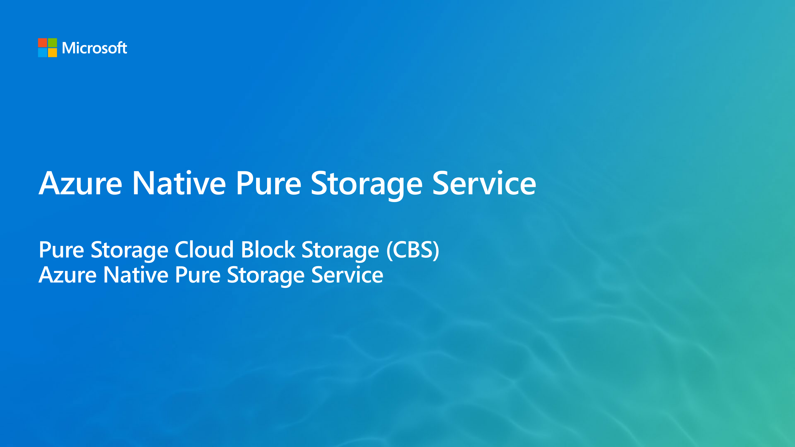

### Key Points

- Introduction of **Azure Native Pure Storage Service**, specifically **Pure Storage Cloud Block Storage (CBS)**
- Considerations and decision drivers for adopting Gen 1 solutions at scale
- Customer scenarios influencing storage service choices, such as telco environments with large network footprints
- Licensing economics impacting platform decisions, with Oracle as an example
- Importance of VMware migration timelines ("VMware runway") in platform adoption

### Details

- The slide highlights **Azure Native Pure Storage Service**, focusing on **Pure Storage Cloud Block Storage (CBS)**, indicating a cloud-integrated storage solution native to Azure.
- The speaker discusses **high-level decision drivers** for customers moving to Gen 1 storage solutions at scale.
- Key factors influencing these decisions include:
  - **Customer footprint**: For example, a telco customer might have thousands of network nodes, which affects storage and licensing needs.
  - **Licensing economics**: Costs and licensing models, such as those related to Oracle software, play a significant role in choosing storage platforms.
  - **VMware runway**: The available time or window to migrate VMware workloads to the new platform is a critical consideration; shorter runways require faster, more seamless integration.
- These factors collectively influence whether a customer opts for Azure Native Pure Storage CBS as their cloud block storage solution.
- The context suggests that Pure Storage CBS on Azure is positioned as a scalable, native cloud storage option that aligns with enterprise needs, especially those with complex licensing and migration constraints.

### Definitions

- **Azure Native Pure Storage Service**: A cloud storage service integrated directly within Azure, provided by Pure Storage, designed to offer scalable and efficient block storage.
- **Pure Storage Cloud Block Storage (CBS)**: A specific Pure Storage offering that provides block storage capabilities natively within the Azure cloud environment.
- **Gen 1**: Refers to the first generation or initial phase of storage solutions or platforms being adopted at scale.
- **VMware runway**: The timeframe or period available to migrate VMware workloads from existing infrastructure to a new platform or cloud environment.

### Examples

- A telco customer with thousands of network nodes requiring scalable storage solutions.
- Licensing economics example: Oracle licensing costs influencing storage platform decisions.
- VMware migration urgency: Customers with limited VMware runway needing faster platform adoption.

### Key Takeaways 🎯

- Azure Native Pure Storage Service, particularly Pure Storage CBS, is designed to meet the needs of large-scale, complex customers.
- Decision drivers such as customer footprint, licensing economics, and VMware migration timelines critically influence storage platform choices.
- Understanding these factors helps in selecting the right cloud block storage solution on Azure for enterprise workloads.

---

## Slide 75: Pure Storage Cloud Product Family

**Timestamp**: 02:16:34 – 02:17:04

### Key Points

- Overview of Pure Storage’s Cloud Product Family offerings that are generally available.
- Introduction of Azure Native Pure Storage Cloud Service integrated directly within the Azure Portal.
- Availability of Pure Cloud Block Store for Azure VMware Solution (AVS) through a 3rd party marketplace.
- Mention of a new product addition to the Pure Storage Cloud Product Family.
- Use cases involving hosting providers and Managed Service Providers (MSPs) leveraging network constructs such as distributed firewalls and network segments.
- Reference to Gen 1 platform capabilities supporting multiple networks and complex network segmentation.

### Details

- **Pure Storage Cloud Product Family** includes multiple products that are currently generally available, indicating they are production-ready and supported.
- The **Azure Native Pure Storage Cloud Service** is integrated natively within the Azure Portal, allowing users to manage Pure Storage services seamlessly alongside other Azure resources. This service is jointly supported, implying collaboration between Pure Storage and Microsoft Azure teams.
- **Pure Cloud Block Store for AVS** (Azure VMware Solution) is available via a 3rd party marketplace, enabling customers running VMware workloads on Azure to leverage Pure Storage’s block storage capabilities.
- The slide hints at a **new product** addition, though details are not specified.
- The speaker elaborates on use cases relevant to hosting providers and MSPs who require advanced network segmentation and security features:
  - These customers often use **distributed firewalls** and **network segments** that are complex and cannot be quickly redesigned or consolidated.
  - Such environments benefit from leveraging **Gen 1** platform capabilities, which support many networks and allow for granular network control.
- The mention of "less time to get out of the platform" suggests that the platform is designed for efficient deployment and migration, important for service providers managing complex network topologies.

### Definitions

- **Azure Native Pure Storage Cloud Service**: A Pure Storage service that is integrated directly within the Azure Portal, allowing users to provision and manage Pure Storage resources natively in Azure.
- **Pure Cloud Block Store for AVS**: A Pure Storage block storage solution designed specifically for Azure VMware Solution environments, available through a third-party marketplace.
- **Distributed Firewall**: A firewall architecture that applies security policies at multiple points within a network, often at the virtual network interface level, enabling fine-grained segmentation.
- **Gen 1 Platform**: Refers to the first generation of a platform that supports multiple network segments and distributed firewall constructs, suitable for complex network environments.

### Examples

- Hosting providers and MSPs using the Gen 1 platform to manage many networks with distributed firewalls and network segments that cannot be quickly redesigned or consolidated.
- Customers leveraging Pure Cloud Block Store for AVS to provide block storage services to VMware workloads running on Azure.

### Key Takeaways 🎯

- Pure Storage offers a family of cloud products that are generally available and integrated with Azure, including native portal integration and marketplace availability.
- The Azure Native Pure Storage Cloud Service enables seamless management within Azure, supported jointly by Pure Storage and Microsoft.
- Pure Cloud Block Store for AVS supports VMware workloads on Azure, expanding Pure Storage’s cloud footprint.
- Complex network environments managed by hosting providers and MSPs benefit from Gen 1 platform capabilities, especially for distributed firewall and network segmentation use cases.
- The product family continues to evolve with new offerings to meet diverse cloud storage needs.

---

## Slide 76: Pure Cloud Block Store (CBS)

**Timestamp**: 02:17:04 – 02:17:34

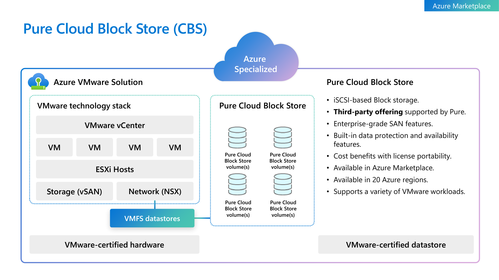

### Key Points

- Pure Cloud Block Store (CBS) is an iSCSI-based block storage solution available in Azure Marketplace.
- It is a third-party offering supported by Pure Storage, providing enterprise-grade SAN features.
- CBS integrates with VMware environments, supporting VMware-certified hardware and VMware vCenter.
- It supports VMware workloads using VMFS datastores on ESXi hosts, leveraging VMware technology stack components like vSAN and NSX.
- CBS offers built-in data protection, availability features, and cost benefits through license portability.
- The solution is available in 20 Azure regions, with Gen. 1 (original flavor) having the broadest region availability and SKU flexibility.
- Gen. 1 CBS uses a Microsoft-managed ExpressRoute circuit, which may impose core count constraints but offers more SKU options.

### Details

- **Pure Cloud Block Store Overview**:  
  Pure Cloud Block Store is a cloud-native block storage service designed for VMware workloads running in Azure. It is delivered as an iSCSI-based block storage solution, meaning it provides block-level storage accessible over IP networks using the iSCSI protocol.

- **Integration with VMware**:  
  CBS supports VMware-certified hardware and integrates seamlessly with VMware vCenter, allowing management of virtual machines (VMs) and ESXi hosts. It supports VMFS datastores, which are VMware’s file systems for storing VM files on block storage devices. The VMware technology stack includes storage via vSAN and networking via NSX, with CBS acting as a certified datastore within this environment.

- **Enterprise Features**:  
  CBS offers enterprise-grade SAN features, including built-in data protection and availability capabilities, ensuring high reliability and resilience for critical VMware workloads.

- **Availability and Licensing**:  
  CBS is available through the Azure Marketplace and is deployed in 20 Azure regions, making it widely accessible. It offers cost benefits through license portability, allowing customers to leverage existing Pure Storage licenses.

- **Gen. 1 Flavor Specifics**:  
  The speaker highlighted that the original version of CBS, referred to as Gen. 1, remains popular due to its broad regional availability and SKU flexibility. Gen. 1 supports more SKU options and is sometimes preferred by customers despite some core count constraints. A key technical detail is that Gen. 1 leverages a Microsoft-managed ExpressRoute circuit for connectivity, which influences deployment and performance characteristics.

### Definitions

- **Pure Cloud Block Store (CBS)**: An iSCSI-based block storage service offered by Pure Storage in Azure Marketplace, designed to provide enterprise-grade SAN features and support VMware workloads in Azure.

- **iSCSI (Internet Small Computer Systems Interface)**: A protocol that allows clients (initiators) to send SCSI commands to storage devices (targets) over IP networks, enabling block-level storage access.

- **VMFS (Virtual Machine File System)**: A clustered file system used by VMware ESXi hosts to store virtual machine files on block storage devices.

- **ExpressRoute**: A Microsoft Azure service that provides private, dedicated network connectivity between on-premises infrastructure and Azure data centers.

- **SKU (Stock Keeping Unit)**: A specific product configuration or option available for purchase.

### Examples

- Customers sometimes choose Gen. 1 CBS because it offers more SKU options and flexibility, despite some core count limitations.
- Gen. 1 CBS uses a Microsoft-managed ExpressRoute circuit, which is a key consideration in deployment planning.

### Key Takeaways 🎯

- Pure Cloud Block Store is a VMware-certified, iSCSI-based block storage solution available in Azure Marketplace with enterprise SAN features.
- It integrates tightly with VMware environments, supporting VMFS datastores on ESXi hosts and leveraging VMware’s technology stack.
- Gen. 1 CBS remains widely used due to its broader regional availability and SKU flexibility, using a Microsoft-managed ExpressRoute circuit.
- CBS provides built-in data protection, availability, and cost benefits through license portability, making it suitable for a variety of VMware workloads in Azure.

---

## Slide 77: Azure Native Pure Storage Cloud

**Timestamp**: 02:17:34 – 02:18:00

### Key Points

- Introduction of Azure Native Pure Storage Cloud as a fully managed block storage-as-a-service tailored for Azure VMware Solution (AVS).
- Integration with VMware technologies including vVols (virtual volumes) and VAAI (vSphere APIs for Array Integration).
- Storage scalability is independent of compute nodes within the AVS environment.
- Significant cost savings potential, estimated at $100,000 per month for 1,000 TB of storage.
- This service is an Azure Native ISV (Independent Software Vendor) offering, providing a seamless Azure experience for third-party storage solutions.
- The solution operates within the VMware technology stack, including VMware vCenter, ESXi hosts, and NSX networking.
- Connectivity facilitated via ExpressRoute Circuit for secure and high-performance network integration.

### Details

- **Azure Native Pure Storage Cloud** is presented as a new cloud storage solution in public preview, specifically designed for use with Azure VMware Solution (AVS).
- The service provides **block storage-as-a-service**, meaning it offers raw storage volumes that can be attached to virtual machines (VMs) running on AVS.
- It integrates tightly with VMware's storage management features:
  - **vVol datastores**: Virtual volumes that allow granular VM-level storage management.
  - **VAAI (vSphere APIs for Array Integration)**: VMware APIs that offload certain storage operations to the storage array, improving performance and efficiency.
- The storage provided by Pure Storage Cloud can **scale independently** of the compute resources (ESXi hosts) in the AVS cluster, allowing flexible capacity planning.
- The slide highlights a **typical cost saving** of $100,000 per month when managing 1,000 TB of storage, emphasizing the economic benefit of this solution.
- The solution is described as an **Azure Native ISV Service**, meaning it is developed by a third-party partner (Pure Storage) but integrated natively into the Azure ecosystem, offering a seamless experience for Azure customers.
- The architecture diagram on the slide shows multiple Pure Storage Cloud volumes connected to VMs managed by VMware vCenter, running on ESXi hosts with NSX networking, illustrating the integration within the VMware technology stack.
- The **ExpressRoute Circuit** is mentioned as the network connectivity method, providing a private, high-throughput, and low-latency connection between Azure and on-premises or other cloud environments, ensuring secure and performant access to the storage service.

### Definitions

- **Azure VMware Solution (AVS)**: A Microsoft Azure service that enables customers to run VMware workloads natively on Azure infrastructure.
- **vVols (Virtual Volumes)**: A VMware storage technology that allows VM-level storage management by abstracting storage at the VM disk level.
- **VAAI (vSphere APIs for Array Integration)**: APIs that enable VMware to offload certain storage operations to the storage array, improving efficiency and performance.
- **Block Storage-as-a-Service**: A cloud storage model where raw storage volumes are provided to be attached to compute instances, typically used for databases or VM disks.
- **Azure Native ISV Service**: A third-party software solution that is fully integrated into the Azure platform, providing a native experience for Azure customers.
- **ExpressRoute Circuit**: A private network connection between Azure data centers and on-premises infrastructure or other cloud environments, offering enhanced security and performance.

### Examples

- The slide visually depicts multiple Pure Storage Cloud volumes attached as vVol datastores to VMs running on ESXi hosts managed by VMware vCenter, demonstrating how storage is provisioned and managed in this environment.
- The cost savings example quantifies the financial benefit of using this solution at scale: $100,000 per month saved for 1,000 TB of storage.

### Key Takeaways 🎯

- Azure Native Pure Storage Cloud offers a fully managed, scalable block storage solution optimized for Azure VMware Solution.
- Integration with VMware storage technologies like vVols and VAAI enhances performance and management.
- Storage scales independently from compute, providing flexibility and efficiency.
- The solution delivers significant cost savings at scale.
- As an Azure Native ISV Service, it provides a seamless experience within the Azure ecosystem.
- Connectivity via ExpressRoute ensures secure and high-performance access to storage resources.

---

## Slide 78: Best option for balanced performance and cost optimization

**Timestamp**: 02:18:00 – 02:18:30

### Key Points

- Pure Storage Cloud offers a balanced solution for performance and cost optimization in hybrid VMware environments.
- It enables seamless hybrid VMware management using the same storage operating system from on-premises to cloud.
- The solution provides affordable premium storage with enterprise-grade features like immutable snapshots.
- Supports enterprise-scale VMware migration to Azure without the need for refactoring.
- Fully managed Azure-native service reduces operational complexity and is accessible directly through the Azure portal.
- Generally available with integration support for VMware features such as vVols, VAAI, and vSphere.

### Details

- **Balanced Performance and Cost Optimization**: Pure Storage Cloud is positioned as the best option for organizations looking to optimize both performance and cost in their hybrid VMware deployments. It balances efficiency and premium capabilities to reduce overall costs.

- **Seamless Hybrid VMware Management**: The solution uses the same storage operating system (OS) across on-premises and cloud environments, simplifying management and deployment. This consistency helps IT teams manage hybrid VMware environments without learning new tools or processes.

- **Affordable Premium Storage**:
  - Reduces Azure VMware Solution (AVS) costs by up to 40%.
  - Provides enterprise-grade features such as immutable snapshots out-of-the-box, enhancing data protection and compliance.
  - Balances performance and efficiency, ensuring premium storage capabilities without excessive cost.

- **Enterprise-Scale VMware Migration**:
  - Enables migration of storage-heavy VMware workloads to Azure without refactoring applications or storage configurations.
  - Supports VMware features including:
    - **vVols (Virtual Volumes)**: Enables granular storage management at the VM level.
    - **VAAI (vStorage APIs for Array Integration)**: Offloads certain storage operations to the array for improved performance.
    - **vSphere Integration**: Allows use of familiar VMware management tools to streamline migration and ongoing operations.
  - This support helps save time and accelerates getting VMware environments up and running in Azure.

- **Azure Native Pure Storage Cloud**:
  - Fully managed service available directly in the Azure portal.
  - Eliminates the overhead of managing storage infrastructure.
  - Supports plug-in driven management and restore capabilities, enhancing operational simplicity.
  - Provides native integration with Azure services, improving user experience and reducing complexity.

- **General Availability**: The service is generally available, indicating it is production-ready and supported for enterprise use.

### Definitions

- **AVS (Azure VMware Solution)**: A Microsoft Azure service that allows running VMware workloads natively on Azure infrastructure.
- **vVols (Virtual Volumes)**: VMware storage technology that enables VM-centric storage management by abstracting storage at the VM level.
- **VAAI (vStorage APIs for Array Integration)**: VMware APIs that allow storage arrays to offload certain tasks, improving performance and efficiency.
- **vSphere**: VMware’s cloud computing virtualization platform used to manage virtualized environments.

### Examples

- No specific practical examples or demonstrations were provided in the slide or transcript.

### Key Takeaways 🎯

- Pure Storage Cloud provides a cost-effective, high-performance storage solution for hybrid VMware environments.
- It simplifies hybrid VMware management by using a consistent storage OS from on-premises to cloud.
- Supports enterprise-grade features like immutable snapshots and VMware integrations (vVols, VAAI, vSphere).
- Enables seamless migration of VMware workloads to Azure without refactoring.
- Fully managed and integrated into the Azure portal, reducing operational complexity.
- The service is generally available and ready for enterprise deployment.

---

## Slide 79: AVS

**Timestamp**: 02:18:30 – 02:19:00

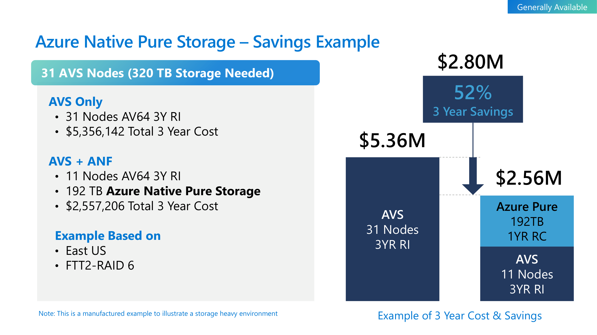

### Key Points

- Comparison of cost and configuration between two Azure VMware Solution (AVS) deployment options over a 3-year period.
- Demonstration of cost savings when combining AVS with Azure Native Pure Storage (ANF) versus AVS-only deployment.
- Specific node counts, storage sizes, and pricing details for each option.
- Example scenario based on East US region with FTT2-RAID 6 storage configuration.
- Emphasis on a storage-heavy environment to illustrate savings.
- Highlighting the availability of Azure Native Pure Storage as a cost-saving option.

### Details

- **AVS Only Deployment:**
  - Uses 31 AV64 nodes with a 3-year Reserved Instance (RI) commitment.
  - Total 3-year cost is approximately $5,356,142.
  - Storage requirement is 320 TB.
  - This represents a baseline cost for a fully AVS-based solution.

- **AVS + Azure Native Pure Storage (ANF) Deployment:**
  - Uses fewer AV64 nodes (11 nodes) with a 3-year RI.
  - Includes 192 TB of Azure Native Pure Storage.
  - Total 3-year cost is approximately $2,557,206.
  - This hybrid approach reduces the number of AVS nodes needed by offloading storage to Azure Native Pure Storage.
  - Results in a 52% savings over the AVS-only deployment, equating to about $2.8 million saved over 3 years.

- **Configuration and Assumptions:**
  - The example is based on the East US Azure region.
  - Storage is configured with FTT2-RAID 6, which implies fault tolerance with two copies and RAID 6 parity for data protection.
  - The example is manufactured specifically to illustrate a storage-heavy environment where leveraging Azure Native Pure Storage can significantly reduce costs.
  - Both options use 3-year Reserved Instances (RI) for cost optimization.

- **Terminology:**
  - **3YR RI**: 3-Year Reserved Instance, a pricing model where resources are reserved for three years at a discounted rate.
  - **1YR RC**: 1-Year Reserved Capacity, another pricing model for storage reserved for one year.
  - **AV64**: Likely refers to a specific AVS node SKU or configuration.
  - **Azure Native Pure Storage**: Azure NetApp Files (ANF), a native Azure storage service providing enterprise-grade storage capabilities.

- **General Availability:**
  - The Azure Native Pure Storage option is generally available, meaning it is fully supported and ready for production use.

### Definitions

- **Azure VMware Solution (AVS)**: A Microsoft Azure service that allows customers to run VMware workloads natively on Azure infrastructure.
- **Reserved Instance (RI)**: A billing option where compute resources are reserved for a fixed term (e.g., 1 or 3 years) to receive a discounted rate compared to pay-as-you-go pricing.
- **Azure Native Pure Storage (ANF)**: Azure NetApp Files, a high-performance, enterprise-grade file storage service integrated into Azure.
- **FTT2-RAID 6**: A fault tolerance configuration with two copies of data and RAID 6 parity, providing high data protection and availability.

### Examples

- A customer needing 320 TB of storage for their AVS environment can either:
  - Deploy 31 AV64 nodes with all storage local to AVS, costing about $5.36 million over 3 years.
  - Deploy 11 AV64 nodes combined with 192 TB of Azure Native Pure Storage, costing about $2.56 million over 3 years.
- This hybrid approach yields a 52% cost savings ($2.8 million) over the 3-year period.

### Key Takeaways 🎯

- Combining AVS with Azure Native Pure Storage can significantly reduce total 3-year costs in storage-heavy environments.
- Using fewer AVS nodes and offloading storage to Azure Native Pure Storage achieves over 50% savings compared to AVS-only deployments.
- The example is region-specific (East US) and assumes a fault-tolerant RAID 6 storage configuration.
- Azure Native Pure Storage is a generally available, enterprise-grade solution that integrates well with AVS for cost optimization.
- Reserved Instances (3YR RI) are a key factor in achieving these cost savings.

---

## Slide 80: Azure Native Pure Storage Cloud Pricing

**Timestamp**: 02:19:00 – 02:19:30

### Key Points

- Azure Native Pure Storage Cloud pricing is fully integrated with Azure billing and counts toward the Microsoft Azure Consumption Commitment (MACC).
- Pricing and purchasing are accessible directly through the Azure Portal.
- Billing is handled by Azure with separate line items for committed and on-demand usage.
- Minimum storage and commit sizes are specified with associated performance metrics.
- Customers can configure capacity and performance independently.
- On-demand usage is billed hourly and aggregated monthly.
- Support is provided jointly by Microsoft and Pure Storage, covering Levels 1, 2, and 3.
- The solution is generally available and includes trials via Pure Sales.
- Pricing details are available in the AVS Pricing Worksheet on Seismic.

### Details

- **Integration with Azure Billing and MACC**:  
  The Pure Storage Cloud solution is natively integrated into the Azure ecosystem, meaning all usage is tracked and billed through Azure’s billing system. This usage counts toward the Microsoft Azure Consumption Commitment (MACC), which is a commitment customers make to consume a certain amount of Azure services over time.

- **Purchasing & Pricing**:  
  - Customers can purchase Pure Storage Cloud services directly through the Azure Portal, simplifying procurement and management.  
  - Pricing information is documented in the AVS Pricing Worksheet available on Seismic, a platform for sales and marketing resources.  
  - Trials are available but require contacting Pure Sales directly.

- **Deployment & Billing**:  
  - Deployment and billing are managed within the Azure Portal.  
  - Billing is split into two categories: committed usage (based on a minimum commitment) and on-demand usage. Each is shown as separate line items on the Azure bill.  
  - On-demand usage is calculated hourly and submitted to Azure for monthly billing, allowing flexible scaling beyond committed amounts.

- **Configuration**:  
  - Customers can independently configure capacity (storage size) and performance (throughput).  
  - Minimum storage pool size is 30 TiB with a minimum throughput of 800 MB/s.  
  - Minimum commitment size is 100 TiB with a minimum throughput of 1600 MB/s.  
  - This flexibility allows customers to tailor the solution to their workload requirements.

- **Support**:  
  - Support is provided collaboratively by Microsoft and Pure Storage.  
  - Microsoft Support Team handles Level 1, 2, and 3 support, ensuring comprehensive assistance.

- **Availability**:  
  - The Azure Native Pure Storage Cloud solution is generally available, meaning it is fully released and supported for production use.

- **Third-party Partner Solution**:  
  - This is a third-party partner solution integrated into Azure, providing a seamless native experience for customers.

### Definitions

- **Microsoft Azure Consumption Commitment (MACC)**:  
  A contractual commitment by customers to consume a specified amount of Azure services over a period, which can provide cost benefits and budgeting predictability.

- **Committed Usage**:  
  The amount of storage and performance capacity a customer agrees to use and pay for over a contract period, typically at a discounted rate.

- **On-demand Usage**:  
  Additional usage beyond the committed amount, billed hourly and aggregated monthly, providing flexibility to scale up as needed.

- **TiB (Tebibyte)**:  
  A unit of digital information storage equal to 2^40 bytes, approximately 1.1 trillion bytes.

### Examples

- While no explicit examples or demonstrations were provided in the slide or transcript, the minimum configuration requirements (30 TiB storage pool with 800 MB/s throughput, and 100 TiB commit with 1600 MB/s throughput) serve as practical baseline examples for deployment sizing.

### Key Takeaways 🎯

- Azure Native Pure Storage Cloud is seamlessly integrated with Azure billing and counts toward MACC, simplifying cost management.
- Customers can purchase, deploy, and manage Pure Storage Cloud services directly through the Azure Portal.
- Billing differentiates between committed and on-demand usage, providing flexibility and transparency.
- Minimum storage and performance commitments ensure baseline service levels, with independent configuration options.
- Support is robust, provided jointly by Microsoft and Pure Storage.
- The solution is generally available and trials can be arranged through Pure Sales.

---

## Slide 81: Customer

**Timestamp**: 00:00:00 – 00:00:00

### Key Points

- Dupaco Credit Union is leveraging a combined solution of Azure VMware Solution (AVS) and Azure Native Pure Storage.
- The solution targets significant cost savings in Azure storage expenses.
- The fully-managed service reduces operational complexity, enabling Dupaco to focus on innovation.
- Dupaco is a corporate-sized financial services organization located in the Midwest US with approximately 1,000 employees.
- The testimonial from Joe Ervolino, IT Infrastructure Manager at Dupaco, highlights the transformative potential of this solution.

### Details

- **Customer Profile**: Dupaco Credit Union operates in the financial services industry, serving a regional market in the Midwest United States. With a workforce of about 1,000 employees, it is classified as a corporate-sized organization.
  
- **Solution Overview**: Dupaco has implemented a hybrid cloud storage solution combining Azure VMware Solution (AVS) with Azure Native Pure Storage. This integration allows them to optimize their cloud storage infrastructure within the Azure ecosystem.

- **Cost Efficiency**: The primary driver for adopting this solution is the anticipated significant reduction in Azure storage costs. By leveraging Pure Storage’s native integration with Azure and AVS, Dupaco expects to achieve better storage efficiency and cost management.

- **Operational Benefits**: The fully-managed nature of the Pure Storage Cloud on AVS means Dupaco’s IT team can reduce time spent on managing storage infrastructure. This shift allows the team to redirect focus toward innovation and strategic initiatives rather than operational maintenance.

- **Strategic Impact**: Joe Ervolino emphasizes that the cost savings and operational efficiencies gained will enable Dupaco to allocate resources more effectively, investing in other strategic areas of the credit union to drive growth and member services.

### Definitions

- **Azure VMware Solution (AVS)**: A Microsoft Azure service that allows organizations to run VMware workloads natively on Azure, providing a seamless hybrid cloud experience with integrated management and scalability.

- **Azure Native Pure Storage**: A cloud storage solution integrated natively with Azure, offering high-performance, scalable, and fully-managed storage services optimized for Azure workloads.

### Examples

- Dupaco’s use case demonstrates how a financial services organization can leverage AVS combined with Pure Storage to reduce cloud storage costs while simplifying infrastructure management.

### Key Takeaways 🎯

- Combining AVS with Azure Native Pure Storage can lead to significant cost savings and operational efficiencies.
- Fully-managed cloud storage services free IT resources to focus on innovation rather than infrastructure management.
- Financial services organizations like Dupaco can strategically benefit from cloud-native storage solutions to optimize resource allocation.
- Customer testimonials provide real-world validation of the transformative potential of integrated cloud storage solutions.

---

## Slide 82: AVS

**Timestamp**: 00:00:00 – 00:00:00

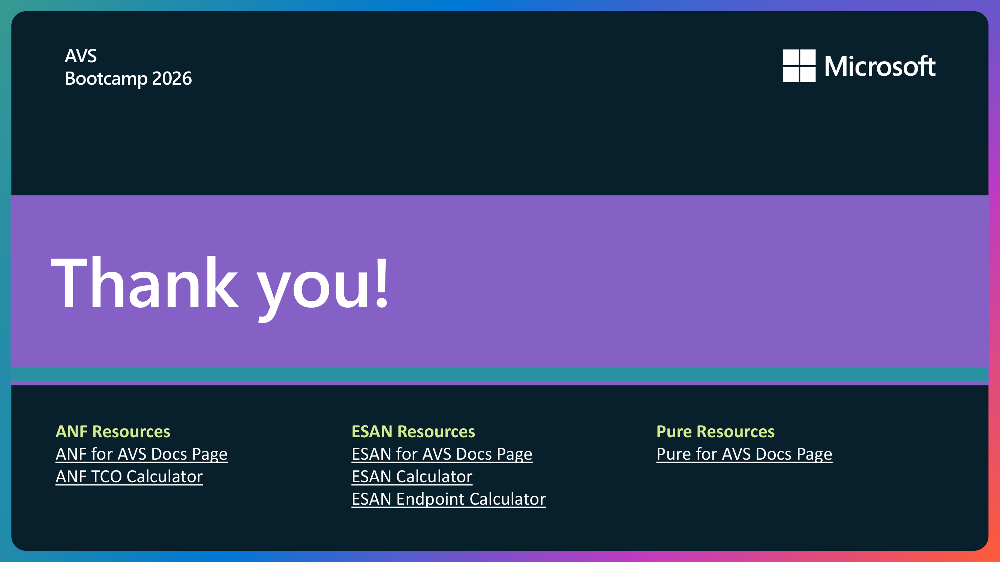

### Key Points

- The slide lists various resources related to AVS (Amazon Virtual Services) and its associated partners or tools.
- Resources are categorized under three main headings: ANF, ESAN, and Pure.
- Each category includes documentation pages and calculators designed to assist with AVS deployments and cost calculations.

### Details

- **AVS Bootcamp 2026**: This appears to be the overarching event or training session under which these resources are provided.
- **ANF Resources**:
  - **ANF for AVS Docs Page**: A documentation page specifically for Azure NetApp Files (ANF) integration with AVS.
  - **ANF TCO Calculator**: A Total Cost of Ownership calculator tailored for ANF usage within AVS environments, helping users estimate costs.
- **ESAN Resources**:
  - **ESAN for AVS Docs Page**: Documentation focused on ESAN (Elastic SAN) solutions for AVS.
  - **ESAN Calculator**: A tool to calculate costs or sizing for ESAN deployments.
  - **ESAN Endpoint Calculator**: Likely a specialized calculator to estimate endpoint configurations or costs related to ESAN.
- **Pure Resources**:
  - **Pure for AVS Docs Page**: Documentation for Pure Storage solutions integrated with AVS.
  
These resources are intended to support users in planning, deploying, and managing storage solutions within AVS environments, providing both technical guidance and financial planning tools.

### Definitions

- **ANF (Azure NetApp Files)**: A Microsoft Azure service providing enterprise-grade file storage, integrated here with AVS for optimized storage solutions.
- **ESAN (Elastic SAN)**: A storage solution designed for scalable and flexible SAN environments, used within AVS.
- **Pure Storage**: A company offering high-performance storage solutions, integrated with AVS for enhanced storage capabilities.
- **TCO Calculator**: A tool used to estimate the total cost of ownership for a given technology or deployment, including hardware, software, and operational expenses.

### Examples

- No specific examples or demonstrations were provided on this slide or in the narration.

### Key Takeaways 🎯

- Multiple specialized resources and calculators are available to assist with AVS storage solutions from ANF, ESAN, and Pure.
- These resources help users understand documentation, plan deployments, and estimate costs effectively.
- Knowing where to find and how to use these resources is essential for successful AVS storage management and cost optimization.

---

---

## Slide 83: Break

**Timestamp**: 00:00:00 – 00:00:00

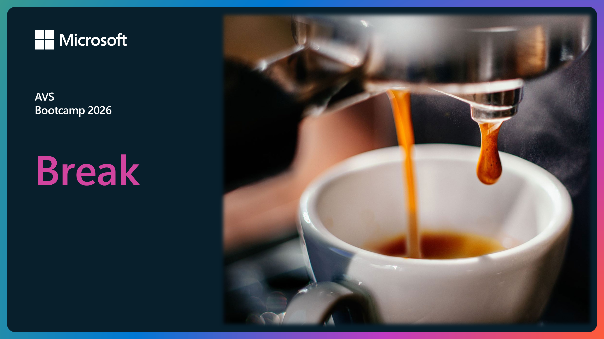

### Key Points

- The slide indicates a scheduled break during the AVS Bootcamp 2026 event.
- No additional content or speaker narration was provided for this slide.

### Details

- The slide simply states "Break" along with the event name "AVS Bootcamp 2026."
- This signals a pause in the session, allowing attendees to rest or refresh before continuing.
- No technical concepts, definitions, or examples are presented on this slide.
- The break serves as a natural division in the bootcamp agenda, helping to segment the learning material.

### Definitions

- None provided on this slide.

### Examples

- None provided on this slide.

### Key Takeaways 🎯

- This slide marks a break period during the AVS Bootcamp 2026.
- No instructional content is associated with this slide; it is purely a scheduling note.

---

## Slide 84: AVS: Key Features and New Capabilities

**Timestamp**: 00:00:00 – 00:00:00

### Key Points

- Introduction to AVS (Azure VMware Solution) focusing on its key features and new capabilities.
- Presentation led by two Senior Cloud Solution Architects: Sabine Blair and Jon Chancellor.
- Emphasis on understanding AVS’s role and enhancements in cloud infrastructure.

### Details

- The slide serves as a title or introductory slide for a section or presentation segment about AVS.
- AVS stands for Azure VMware Solution, a Microsoft Azure service that enables running VMware workloads natively on Azure infrastructure.
- The presenters, Sabine Blair and Jon Chancellor, are Senior Cloud Solution Architects, indicating their expertise in cloud solutions and likely deep knowledge of AVS.
- Although no narration was provided, the slide sets the stage for a detailed discussion on AVS’s key features and any new capabilities that have been introduced.
- The focus is likely on how AVS integrates VMware environments with Azure, benefits such as scalability, security, and operational consistency, and recent updates or enhancements to the service.

### Definitions

- **AVS (Azure VMware Solution)**: A Microsoft Azure service that allows organizations to run VMware workloads on Azure infrastructure, providing a hybrid cloud environment that combines VMware’s virtualization technology with Azure’s cloud capabilities.

### Examples

- No specific examples or demonstrations were provided on this slide or in the transcript.

### Key Takeaways 🎯

- This slide introduces the topic of AVS’s key features and new capabilities.
- The presenters are senior experts positioned to provide in-depth insights.
- Understanding AVS is critical for leveraging VMware workloads in the Azure cloud.
- Further slides or discussion will elaborate on the specific features and enhancements of AVS.

---

## Slide 85: Agenda

**Timestamp**: 02:10:37 – 02:11:10

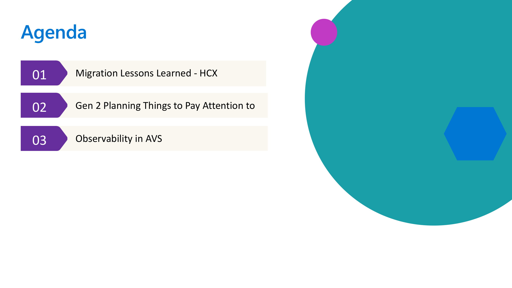

### Key Points

- The agenda covers three main topics: Migration Lessons Learned with HCX, Gen 2 Planning considerations, and Observability in Azure VMware Solution (AVS).
- A critical challenge for AVS users is often the lack of an existing Azure landing zone, which delays migration efforts.
- Azure landing zones provide foundational architecture and governance necessary before migrating workloads to Azure.
- Microsoft offers an Azure landing zone accelerator tailored for AVS to simplify and speed up deployment.
- The accelerator is modular, GitHub-based, and can be deployed via Azure portal or infrastructure-as-code tools like Terraform and Bicep.
- The landing zone sets up everything specific to AVS requirements, enabling connectivity between on-premises environments and AVS for migration.

### Details

- **Agenda Overview**: The slide outlines the session’s focus areas:
  - **Migration Lessons Learned - HCX**: Insights and best practices from migrations using VMware HCX.
  - **Gen 2 Planning Things to Pay Attention to**: Important considerations when planning for Gen 2 AVS deployments.
  - **Observability in AVS**: Monitoring and visibility aspects within Azure VMware Solution.

- **Azure Landing Zone Importance**:
  - Many AVS customers start without an Azure landing zone, meaning they lack the foundational Azure platform setup.
  - Without this platform, migration is slowed because the environment must be architected and designed from scratch.
  - The Azure landing zone includes governance policies, subscription management (democratization), and design principles.
  - The speaker uses the analogy: "turning the lights on before you can move into the house," emphasizing that the landing zone is the essential foundation.

- **Azure Landing Zone Accelerator**:
  - Microsoft provides a dedicated landing zone accelerator for AVS in their documentation.
  - This accelerator is modular and hosted on GitHub.
  - It can be deployed directly from the Azure portal or through code-based deployment tools such as Terraform and Bicep.
  - The accelerator automates the setup of all AVS-specific infrastructure and configurations.
  - Once deployed, it enables AVS to be operational and facilitates communication between on-premises environments and AVS, which is critical for migration.

### Definitions

- **Azure Landing Zone**: A pre-configured, governed, and secure Azure environment that provides the foundational architecture and policies necessary to deploy and manage workloads in Azure effectively.
- **Azure Landing Zone Accelerator**: A modular, GitHub-hosted deployment toolkit designed to quickly set up an Azure landing zone tailored for Azure VMware Solution, deployable via Azure portal or infrastructure-as-code tools.
- **AVS (Azure VMware Solution)**: A Microsoft Azure service that allows customers to run VMware workloads natively on Azure infrastructure.
- **HCX (Hybrid Cloud Extension)**: A VMware technology used to facilitate migration and workload mobility between on-premises VMware environments and cloud platforms like AVS.

### Examples

- The speaker describes a common scenario where AVS users arrive without any Azure platform setup, requiring them to architect an Azure landing zone from scratch, which delays migration.
- The Azure landing zone accelerator example shows how users can deploy a ready-made, modular landing zone directly from Azure portal or via Terraform/Bicep scripts, speeding up the process.

### Key Takeaways 🎯

- Establishing an Azure landing zone is a crucial prerequisite for successful AVS migrations.
- Microsoft’s Azure landing zone accelerator simplifies and accelerates the creation of this foundational environment.
- Proper landing zone setup ensures governance, subscription management, and design principles are in place, enabling smooth migration and operation of AVS workloads.
- Understanding and leveraging these tools and concepts is essential for efficient migration planning and execution in AVS environments.

---

## Slide 86: Large Customer Migration – HCX Lessons learned

**Timestamp**: 02:11:10 – 02:11:46

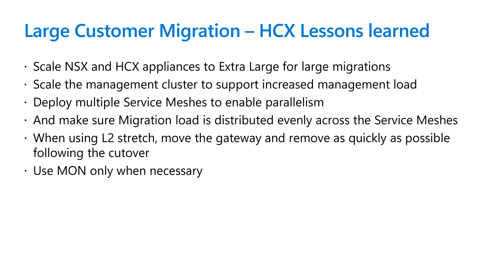

### Key Points

- For large-scale customer migrations using HCX, it is critical to scale infrastructure components appropriately.
- NSX and HCX appliances should be scaled to Extra Large size to handle large migration workloads.
- The management cluster must be scaled to support the increased management load during migration.
- Deploying multiple Service Meshes enables parallel migration processes, improving efficiency.
- Migration load should be evenly distributed across Service Meshes to avoid bottlenecks.
- When using Layer 2 (L2) stretch networks, the gateway should be moved and removed promptly after cutover to minimize risks.
- Use MON (Monitor mode) only when necessary to avoid unnecessary overhead.
- Customers new to Azure or Azure VMware Solution (AVS) may leverage different platform generations (Gen 1 or Gen 2) depending on their environment and requirements.

### Details

- **Scaling NSX and HCX Appliances**: For large migrations, the standard appliance sizes may not suffice. Scaling to Extra Large appliances ensures sufficient resources (CPU, memory, network throughput) to handle the volume and complexity of data migration without performance degradation.

- **Management Cluster Scaling**: The management cluster, which orchestrates and controls migration activities, must be scaled up to handle the increased load from managing multiple migrations and large data volumes. This prevents management bottlenecks and ensures smooth operation.

- **Multiple Service Meshes Deployment**: Service Meshes are logical groupings that manage migration traffic and services. Deploying multiple Service Meshes allows migrations to run in parallel, significantly reducing total migration time.

- **Load Distribution**: Even distribution of migration load across Service Meshes is essential to avoid overloading any single mesh, which could cause delays or failures.

- **L2 Stretch Gateway Handling**: Layer 2 stretch networks allow VMs to maintain the same IP addresses across source and target sites during migration. However, the gateway that supports this stretch should be moved and removed quickly after cutover to avoid network conflicts and ensure clean network segmentation.

- **Use of MON (Monitor Mode)**: MON mode is a feature that can be enabled for monitoring migration traffic or troubleshooting. It should be used sparingly and only when necessary to avoid additional overhead or complexity.

- **Context from Speaker**: The speaker highlighted that customers new to Azure or AVS might be using different platform generations (Gen 1 or Gen 2). This distinction is important because it affects how migrations are planned and executed. Customers with existing Azure footprints but new to AVS need to understand these platform differences to optimize their migration strategy.

### Definitions

- **HCX (Hybrid Cloud Extension)**: A VMware technology that facilitates workload migration, disaster recovery, and network extension between on-premises data centers and cloud environments.

- **NSX**: VMware’s network virtualization and security platform that provides networking and security services in virtualized environments.

- **Service Mesh**: A dedicated infrastructure layer that manages service-to-service communication, in this context used to manage migration traffic and services.

- **L2 Stretch**: A network configuration that extends Layer 2 networks across geographically dispersed sites, allowing VMs to retain their IP addresses during migration.

- **MON (Monitor Mode)**: A mode used to monitor migration traffic or diagnose issues during migration processes.

- **Gen 1 and Gen 2 Platforms**: Different generations of Azure VMware Solution platforms, each with distinct features and capabilities relevant to migration planning.

### Examples

- No specific concrete examples or demonstrations were provided in the transcript or slide content.

### Key Takeaways 🎯

- Proper scaling of NSX, HCX appliances, and management clusters is essential for successful large-scale migrations.
- Deploy multiple Service Meshes and distribute migration load evenly to maximize parallelism and efficiency.
- Handle L2 stretch gateways carefully by moving and removing them quickly after cutover to maintain network integrity.
- Use MON mode only when necessary to avoid unnecessary overhead.
- Understand the differences between Gen 1 and Gen 2 Azure VMware Solution platforms when planning migrations, especially for customers new to AVS or Azure.

---

## Slide 87: Lessons Learned

**Timestamp**: 02:11:46 – 02:13:22

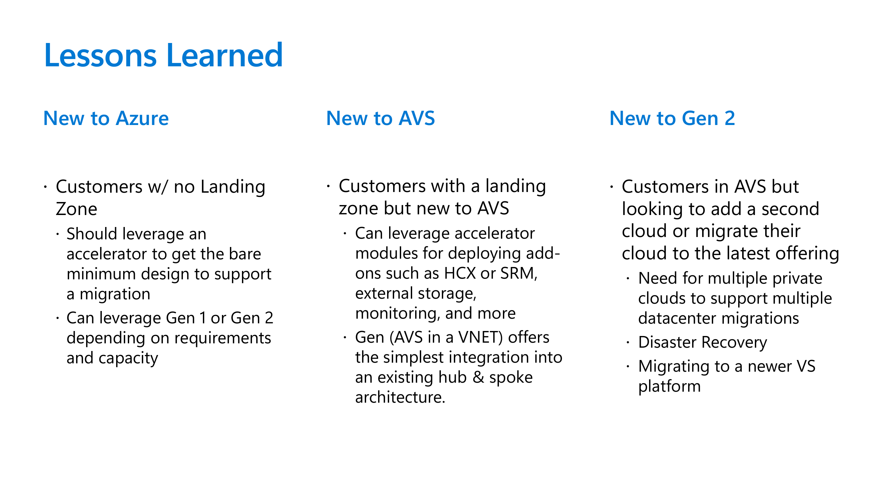

### Key Points

- Different customer scenarios require tailored approaches when adopting Azure VMware Solution (AVS).
- Customers new to Azure without a landing zone should use accelerators to establish a minimal viable design for migration.
- Customers with an existing Azure landing zone but new to AVS can leverage modular accelerator add-ons for enhanced deployment.
- The Gen 1 and Gen 2 AVS deployment models offer different integration options depending on requirements and capacity.
- Customers already using AVS but moving to Gen 2 or expanding their cloud footprint face unique migration and multi-cloud challenges.
- Accelerators provide modular, flexible deployment options that support migration tools, storage, monitoring, and network integration.

### Details

- **New to Azure Customers:**
  - These customers typically do not have a landing zone set up in Azure.
  - They should leverage an **accelerator** to quickly deploy a baseline Azure environment that supports migration.
  - Accelerators help establish the **bare minimum design** needed for migration.
  - Depending on workload requirements and capacity, customers can choose between **Gen 1** or **Gen 2** AVS deployment models.
  
- **New to AVS Customers (with Azure Landing Zone):**
  - These customers already have an Azure landing zone but are new to the Azure VMware Solution.
  - They can use **accelerator modules** to deploy add-ons such as:
    - **HCX** (Hybrid Cloud Extension) – primary migration tool for workload mobility.
    - **SRM** (Site Recovery Manager) – for disaster recovery.
    - External storage integrations like **Azure NetApp Files (ANF)** and **Azure Files**.
    - Monitoring services, including baseline monitoring and platform alerts.
  - The **Gen 2 model** of AVS is integrated into an Azure Virtual Network (VNet), making it the simplest option for integration into existing **hub-and-spoke network architectures**.
  - The modular nature of accelerators allows customers to deploy only the components they need, increasing flexibility and velocity in adoption.

- **New to Gen 2 Customers:**
  - These customers already have an AVS footprint but are looking to:
    - Add a second private cloud.
    - Migrate their existing cloud to the latest Gen 2 offering.
  - Reasons for this include:
    - Supporting multiple datacenter migrations (not always a one-to-one migration).
    - Expanding cloud footprint across different colocation sites or branch offices.
    - Implementing disaster recovery strategies.
    - Migrating to a newer AVS platform version.
  - This scenario often involves managing **multiple private clouds** to support complex migration and DR needs.

- **Accelerators:**
  - Are modular and can be selectively deployed.
  - Include modules for migration tools (HCX), storage, monitoring, and more.
  - Help customers gain momentum and velocity in adopting AVS.
  - Provide a structured approach to deploying AVS environments aligned with customer needs and existing Azure infrastructure.

### Definitions

- **Landing Zone**: A pre-configured, secure, scalable Azure environment that provides the foundational infrastructure and governance needed to deploy workloads.
- **Accelerator**: A modular deployment framework or toolkit that helps customers quickly set up Azure VMware Solution environments with baseline configurations and optional add-ons.
- **Gen 1 and Gen 2 AVS**: Different deployment generations of Azure VMware Solution. Gen 2 is integrated into an Azure Virtual Network (VNet), simplifying network integration.
- **HCX (Hybrid Cloud Extension)**: A primary migration tool used to move workloads between on-premises VMware environments and AVS.
- **SRM (Site Recovery Manager)**: A disaster recovery tool that automates failover and failback of VMware workloads.
- **Hub-and-Spoke Architecture**: A network topology where a central hub (often a virtual network) connects to multiple spoke networks, enabling centralized management and security.

### Examples

- Customers with an existing Azure hub-and-spoke network can use the Gen 2 AVS model because it integrates directly into their existing VNet, simplifying network design.
- A customer migrating multiple datacenters may deploy multiple private clouds in AVS to handle different data center migrations concurrently.
- Using accelerator modules, a customer can deploy HCX for migration, integrate external storage like Azure NetApp Files, and set up monitoring alerts without deploying unnecessary components.

### Key Takeaways 🎯

- Accelerators are essential tools that help customers at different stages—whether new to Azure, new to AVS, or upgrading to Gen 2—quickly and efficiently deploy the necessary infrastructure.
- The modular design of accelerators allows tailored deployments that fit customer-specific migration and operational needs.
- Gen 2 AVS’s VNet integration offers the simplest path for customers with existing Azure network architectures.
- Migration and expansion scenarios often require multiple private clouds and disaster recovery planning.
- Understanding customer context (new to Azure, new to AVS, or new to Gen 2) is critical to selecting the right deployment approach and tools.

---

## Slide 88: When to choose Gen 1 vs Gen 2

**Timestamp**: 02:13:22 – 02:18:28

### Key Points

- Choosing between Gen 1 and Gen 2 depends heavily on specific customer use cases and environment characteristics.
- Gen 1 is suited for large environments with thousands of VLANs, complex NSX-T constructs, and licensing considerations like Oracle.
- Gen 1 leverages Microsoft-managed ExpressRoute circuits and has broader regional availability and SKU flexibility.
- Gen 2 offers easier integration with Azure VNets, leveraging Microsoft Fleet hardware and modern VNet peering.
- Both Gen 1 and Gen 2 can coexist in hybrid environments, providing flexibility in deployment and connectivity.

### Details

- **Use Case-Driven Decision**: There is no one-size-fits-all answer when choosing between Gen 1 and Gen 2; the decision depends on customer environment size, licensing economics, and operational needs.

- **Gen 1 Characteristics**:
  - Ideal for customers with very large network footprints (e.g., over 1000 VLANs).
  - Common among hosting providers, MSP-like customers, and telcos.
  - Supports deep NSX-T constructs such as distributed firewalls and network segments that cannot be quickly redesigned or consolidated.
  - Uses Microsoft-managed ExpressRoute circuits for connectivity.
  - Has the most extensive regional availability currently.
  - Offers more SKU options and flexibility, accommodating core count constraints.
  - Suitable when customers have a shorter VMware runway (less time to migrate off VMware platforms).
  - Enables connectivity to customer-managed hubs or managed V1 hubs via ExpressRoute and dedicated Microsoft Edge routers.

- **Gen 2 Characteristics**:
  - Integrates directly with Azure VNets, simplifying Azure service integration.
  - Uses Microsoft Fleet hardware, which is more readily available.
  - Supports VNet peering and VWAN hub connectivity, enabling fast and straightforward integration.
  - Suitable for newer architectures where vSphere hosts are directly attached to Azure VNets.
  - Provides longer operational runway and easier hardware availability.
  - Enables hybrid setups where Gen 2 environments can connect to Azure VWAN hubs and peer with other Azure VNets, facilitating communication across environments.

- **Hybrid Deployment Scenario**:
  - A customer may run Gen 1 in one environment (e.g., a private cloud connected via ExpressRoute).
  - The same customer can deploy Gen 2 in another environment (e.g., a branch or secondary data center).
  - Gen 2 environments connect quickly to Azure VWAN hubs, enabling seamless connectivity back to Gen 1 environments and other Azure VNets.
  - This hybrid approach leverages the strengths of both generations, providing operational flexibility and integration options.

### Definitions

- **Gen 1**: The original flavor of the product that uses Microsoft-managed ExpressRoute circuits for connectivity, supports large numbers of networks, and has broad regional availability and SKU flexibility.

- **Gen 2**: The newer architecture that integrates directly with Azure VNets using Microsoft Fleet hardware, enabling easier and faster integration with Azure services through VNet peering and VWAN hubs.

- **ExpressRoute Circuit**: A Microsoft-managed private connection that Gen 1 uses to connect the private cloud environment to customer-managed hubs or managed V1 hubs.

- **VNet Peering**: A method to connect Azure Virtual Networks (VNets) directly, allowing resources in different VNets to communicate with low latency and high bandwidth.

- **VWAN Hub**: Azure Virtual WAN hub, a central networking construct that facilitates connectivity between VNets, on-premises networks, and other environments.

- **NSX-T Constructs**: VMware NSX-T networking components such as distributed firewalls and network segments used for micro-segmentation and network virtualization.

### Examples

- A telco or hosting provider with thousands of VLANs and complex NSX-T setups chooses Gen 1 due to its ability to handle large network scales and licensing economics (e.g., Oracle licensing).

- A customer runs a Gen 1 ABS private cloud connected via an ExpressRoute circuit with a dedicated Microsoft Edge router.

- The same customer deploys Gen 2 in a secondary data center or branch, connecting it directly to an Azure VWAN hub within minutes, enabling hybrid connectivity between Gen 1 and Gen 2 environments.

### Key Takeaways 🎯

- The choice between Gen 1 and Gen 2 is driven by customer environment scale, licensing, operational runway, and integration priorities.
- Gen 1 excels in large, complex network environments requiring ExpressRoute connectivity and broad regional availability.
- Gen 2 offers modern Azure integration with direct VNet connectivity and faster deployment.
- Both generations can coexist, enabling hybrid cloud architectures that leverage the strengths of each.
- Understanding the connectivity models (ExpressRoute vs. VNet peering) is critical to designing the right solution.

---

## Slide 89: Gen 2 Landing Zone Readiness

**Timestamp**: 02:18:28 – 02:20:07

### Key Points

- Gen 2 Landing Zone readiness requires careful IP address planning before deployment.
- Customers should request a /21 IP address block to accommodate all necessary subnets.
- A minimum /22 is required for the Azure VMware Solution (AVS) private cloud management plane.
- HCX integration in Gen 2 requires at least two additional /24 subnets (one for management, one for uplink).
- Additional IP space is needed for future expansion such as Site Recovery Manager (SRM), additional network meshes, and Network Virtual Appliances (NVAs).
- Planning IP space early avoids deployment delays and network conflicts.

### Details

- **Gen 2 Landing Zone**: Refers to the network environment setup for Azure VMware Solution (AVS) Gen 2 deployments.
- **IP Address Blocks**:
  - The AVS private cloud management plane requires a minimum of a /22 subnet.
  - HCX (Hybrid Cloud Extension) requires at least two separate /24 subnets: one for management and one for uplink.
  - Because of these combined requirements, customers should request a /21 subnet block to cover all needs comfortably.
- **Microsoft-managed delegated subnets**: In Gen 2, some subnets are delegated and managed by Microsoft within the customer's provided IP range.
- **Why /21?**:
  - A /21 subnet provides enough IP addresses to carve out:
    - The /22 subnet for AVS management.
    - Multiple /24 subnets for HCX components.
    - Additional subnets for future expansion such as SRM, additional network meshes, and NVAs.
- **Planning IP space**:
  - It is critical to plan and allocate IP address space *before* deployment rather than during it.
  - This proactive planning prevents migration slowdowns and network configuration issues.
- **Workload segments**:
  - The workload network segments should be carved out separately from the management and HCX subnets.
- **Gen 1 vs Gen 2**:
  - Both Gen 1 and Gen 2 require a /22 for the AVS management plane.
  - Gen 2 uniquely requires additional /24 subnets for HCX, which is why the larger /21 block is recommended.
- **Speaker emphasis**:
  - The speaker stresses that even if a /22 seems sufficient today, planning for a /21 is safer when deploying Gen 2 with HCX.
  - This ensures flexibility and room for future network components without needing to readdress or redesign the network.

### Definitions

- **Gen 2 Landing Zone**: The network and infrastructure environment setup for deploying Azure VMware Solution Gen 2, including IP subnet allocation and delegated subnets.
- **AVS (Azure VMware Solution)**: A Microsoft Azure service that allows customers to run VMware workloads natively on Azure.
- **HCX (Hybrid Cloud Extension)**: A VMware technology that enables workload migration and network extension between on-premises environments and cloud environments like AVS.
- **/21, /22, /24**: CIDR notation for IP subnet sizes. A /21 subnet contains 2048 IP addresses, /22 contains 1024, and /24 contains 256.
- **Management Plane**: The network segment used for managing the AVS private cloud infrastructure components.
- **Delegated Subnets**: Subnets within a customer's IP range that are managed by Microsoft for specific services.
- **NVA (Network Virtual Appliance)**: Virtual appliances such as firewalls or routers deployed within the virtual network.
- **SRM (Site Recovery Manager)**: A disaster recovery management tool that may require additional network resources.

### Examples

- If a customer requests only a /22 subnet for AVS Gen 2 with HCX, they will lack sufficient IP space for HCX uplink and management subnets, potentially causing deployment issues.
- By requesting a /21 subnet, the customer can allocate:
  - One /22 for AVS management.
  - Two /24 subnets for HCX (management and uplink).
  - Additional /24 subnets for future expansion like SRM or NVAs.
- The speaker illustrated that Microsoft-managed delegated subnets are carved from the /21 block provided by the customer, highlighting the importance of providing a sufficiently large IP block.

### Key Takeaways 🎯

- Always plan and request at least a /21 subnet block for Gen 2 AVS deployments that include HCX.
- The /21 block covers AVS management (/22), HCX subnets (two /24s), and future network expansions.
- Early IP space planning is critical to avoid migration delays and network reconfiguration.
- Gen 2 introduces new subnet requirements compared to Gen 1, especially due to HCX.
- Microsoft manages delegated subnets carved from the customer-provided IP range, so providing adequate IP space is essential.

---

## Slide 90: Gen2 DNS is not the same as Gen1

**Timestamp**: 02:20:07 – 02:22:27

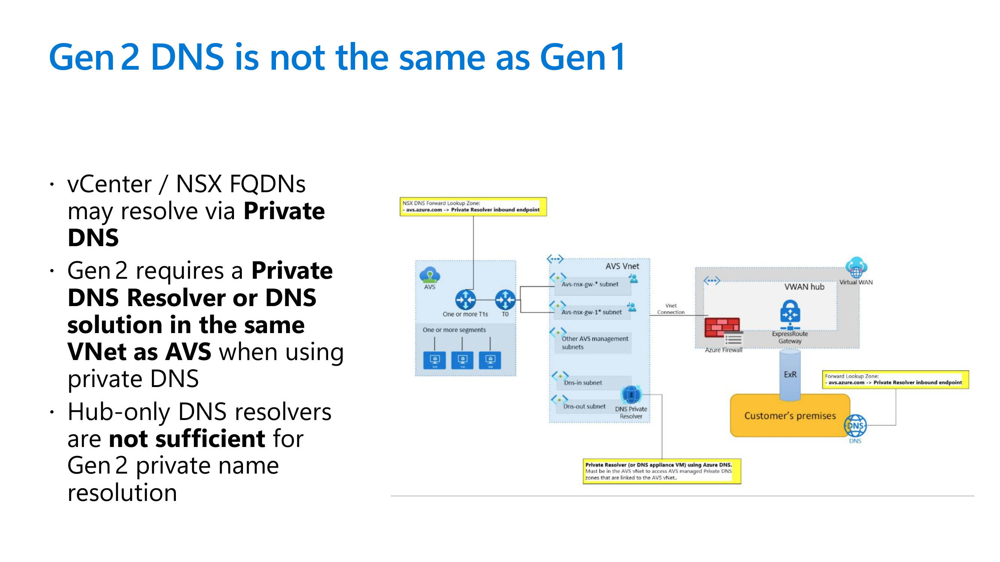

### Key Points

- Gen2 DNS differs significantly from Gen1 DNS in Azure VMware Solution (AVS) environments.
- Gen2 uses Microsoft Managed Private DNS zones scoped specifically to the AVS VNet.
- Private DNS resolution for Gen2 workloads requires a DNS resolver deployed within the same VNet as AVS.
- Hub-only DNS resolvers or DNS solutions outside the AVS VNet are insufficient for Gen2 private name resolution.
- Proper DNS forwarding rules must be configured to enable name resolution from outside the AVS VNet.

### Details

- **Gen2 DNS vs Gen1 DNS**  
  Gen2 DNS introduces new constructs and behaviors that are not present in Gen1. Unlike Gen1, Gen2 uses Microsoft Managed Private DNS zones that are scoped exclusively to the AVS VNet. This means the private DNS zones (e.g., `*.abs.azure.com`) are linked only to the AVS VNet and cannot be linked to hub or spoke VNets.

- **Private DNS Zones and VNet Scope**  
  The private DNS zones in Gen2 are VNet-scoped, meaning only resources within the AVS VNet can directly resolve the AVS management plane FQDNs such as vCenter and NSX addresses.

- **Requirement for DNS Resolver in AVS VNet**  
  To enable DNS resolution of AVS FQDNs from outside the AVS VNet (e.g., from on-premises or other VNets), you must deploy either:  
  - An Azure Private DNS Resolver, or  
  - A DNS virtual machine (VM) acting as a resolver  
  within the same AVS VNet.

- **Why Hub-Only DNS Resolvers Are Insufficient**  
  Hub-only DNS resolvers or DNS forwarding solutions located outside the AVS VNet cannot resolve Gen2 private DNS names because the private DNS zones are not linked to those VNets. Attempts to forward DNS queries to hub-level resolvers will fail to resolve AVS management plane names.

- **DNS Forwarding Configuration**  
  To enable external workloads or on-premises systems to resolve AVS names, you must:  
  1. Deploy the private DNS resolver inside the AVS VNet.  
  2. Configure forwarding rules that direct queries for `abs.azure.com` to the inbound endpoint of the private DNS resolver.

- **Common Pitfalls**  
  Customers often try to forward DNS queries to hub-level resolvers or on-prem DNS servers without deploying a resolver in the AVS VNet, resulting in broken connectivity to AVS components like vCenter and NSX.

- **Summary**  
  Gen2 DNS is unique due to its VNet-scoped private DNS zones and requires a DNS resolver within the AVS VNet for private name resolution. This is a critical difference from Gen1, which did not have this VNet-scoped DNS behavior.

### Definitions

- **Gen2 DNS**: The DNS architecture used in Azure VMware Solution Gen2, featuring Microsoft Managed Private DNS zones scoped to the AVS VNet, requiring specialized DNS resolvers within that VNet for private name resolution.

- **Private DNS Resolver**: An Azure service or DNS VM deployed within the AVS VNet that forwards DNS queries for private zones to enable name resolution from outside the AVS VNet.

- **VNet Scope DNS Behavior**: A DNS zone configuration where the private DNS zone is linked only to a specific virtual network (VNet), restricting DNS resolution to resources within that VNet.

- **Hub-only DNS Resolver**: A DNS resolver deployed in a hub VNet intended to serve multiple spoke VNets, which is insufficient for Gen2 DNS private name resolution because the private DNS zones are not linked to the hub VNet.

### Examples

- Customers attempting to resolve vCenter or NSX FQDNs from on-premises or other VNets by forwarding DNS queries to a hub-level DNS resolver fail because the private DNS zones are not linked to the hub VNet.

- Successful resolution requires deploying a private DNS resolver inside the AVS VNet and configuring forwarding rules to the inbound endpoint of the resolver for the `abs.azure.com` domain.

### Key Takeaways 🎯

- Gen2 DNS uses Microsoft Managed Private DNS zones scoped exclusively to the AVS VNet, unlike Gen1.

- To resolve AVS private DNS names (e.g., vCenter, NSX) from outside the AVS VNet, a private DNS resolver must be deployed inside the AVS VNet.

- Hub-only DNS resolvers or DNS solutions outside the AVS VNet will not work for Gen2 private name resolution.

- Proper DNS forwarding rules to the private DNS resolver’s inbound endpoint are essential for external name resolution.

- Understanding and implementing Gen2 DNS correctly is critical to maintaining connectivity and management plane access in AVS Gen2 environments.

---

## Slide 91: Other Gen 2 Special Design Considerations

**Timestamp**: 02:27:05 – 02:32:02

### Key Points

- Gen 2 private clouds have specific route limitations and deployment requirements that differ from Gen 1.
- Gen 2 does not include a built-in SNAT option for outbound internet access; alternative methods must be planned.
- Proper role-based access control (RBAC) permissions are critical for successful deployment.
- The virtual network (VNet) and private cloud must reside in the same resource group.
- Only one Gen 2 SDDC (Software-Defined Data Center) is allowed per resource group.
- Cross-resource group or subscription references (e.g., DDoS protection, UDRs) can cause installation failures.
- Azure Policies enforcing UDR or NSG rules may interfere with installation.
- Enabling VNet automatic peering sync (currently in preview) helps dynamically update peerings.

### Details

- **Route Limitations**: Gen 2 private clouds have a maximum usable route size of /16. This means the IP address space for routing is limited, and careful planning is required to avoid exceeding this limit.

- **Outbound Internet Access (No SNAT in Gen 2)**:
  - Unlike Gen 1, which provided a simple SNAT checkbox option for outbound internet access, Gen 2 does not include this feature.
  - To enable internet egress for workloads in Gen 2 private clouds, you must plan to route outbound traffic through:
    - Azure Firewall
    - Network Virtual Appliances (NVAs), such as third-party firewalls or MBAs
    - Force tunneling back to on-premises networks
  - This is important for environments that require internet access for updates, testing, or other outbound connectivity.

- **Role-Based Access Control (RBAC) Requirements**:
  - The deployer account (the user or service principal running the deployment) must have either:
    - Owner role, or
    - User Access Administrator role
  - This permission must be granted at the deployment scope.
  - While documentation suggests subscription-level permissions, practical experience shows that owner permissions at the resource group level where deployment occurs are sufficient.
  - These permissions are necessary because the deployment process provisions special role assignments unique to Gen 2 private clouds.
  - Insufficient permissions will cause role assignment failures and partial installation failures.

- **Resource Group Constraints**:
  - The AVS virtual network and the Gen 2 private cloud must be created in the **same resource group**.
  - This is a current service limitation and differs from typical Azure resource management where networking and compute resources can be separated.
  - Customers often separate networking and compute into different resource groups, but this is not supported for Gen 2 AVS deployments.
  - Coordination between teams managing networking and infrastructure is required.

- **Single Gen 2 SDDC per Resource Group**:
  - Only one Gen 2 SDDC can exist in a single resource group.
  - If multiple private clouds are needed, they must be deployed in separate resource groups.
  - This is less common but relevant for large customers or complex environments.

- **Cross-Scope References and Policy Conflicts**:
  - Cross-resource group or cross-subscription references, such as DDoS protection plans, user-defined routes (UDRs), or other network linkages, can cause installation failures.
  - Policies that enforce UDR or NSG (Network Security Group) rules strictly may also block or interfere with the installation process.
  - If such policies or protections are in place, they should be temporarily disabled or unlinked from the AVS VNet during installation.
  - After successful deployment, these protections and policies can generally be re-enabled or relinked, though some edge cases may require additional troubleshooting.

- **VNet Automatic Peering Sync (Preview)**:
  - There is a preview feature to enable automatic synchronization of VNet peerings.
  - This helps dynamically update peerings as changes occur, reducing manual management overhead.

### Definitions

- **SNAT (Source Network Address Translation)**: A method that allows outbound internet traffic from private IP addresses by translating them to a public IP address. Gen 1 AVS provided a built-in SNAT option for outbound internet access, which Gen 2 lacks.

- **NVA (Network Virtual Appliance)**: A virtual appliance, often a third-party firewall or router, deployed in Azure to manage network traffic, including outbound internet egress.

- **Force Tunneling**: A network routing technique that forces all outbound internet traffic to be routed back through on-premises networks or specific network appliances for inspection or compliance.

- **UDR (User-Defined Route)**: Custom routing rules defined by users to control traffic flow within Azure VNets.

- **NSG (Network Security Group)**: Azure resource used to filter network traffic to and from Azure resources based on rules.

- **RBAC (Role-Based Access Control)**: Azure's system for managing user permissions and access to resources.

- **SDDC (Software-Defined Data Center)**: A virtualized data center environment, in this context referring to the AVS private cloud instance.

### Examples

- **Outbound Internet Access in Gen 1 vs Gen 2**:
  - Gen 1: A checkbox option enabled SNAT for outbound internet access, suitable for test or demo environments with minimal filtering needs.
  - Gen 2: No SNAT option; outbound internet must be routed via Azure Firewall, third-party NVAs, or force tunneling to on-premises.

- **RBAC Permissions Scenario**:
  - A deployment fails because the deployer account only has contributor permissions.
  - Granting owner or user access administrator role at the resource group level resolves the failure because the deployment needs to create special role assignments.

- **Resource Group Limitation Scenario**:
  - A customer tries to deploy the AVS VNet in one resource group and the private cloud in another.
  - Deployment fails due to the service limitation requiring both to be in the same resource group.

- **Policy Conflict Scenario**:
  - A customer has a DDoS protection plan applied at a subscription level that automatically links to all VNets.
  - Deployment fails due to this linkage.
  - Temporarily unlinking the DDoS protection from the AVS VNet allows deployment to succeed.
  - After deployment, the protection can be re-applied.

### Key Takeaways 🎯

- Gen 2 AVS private clouds have stricter deployment and configuration requirements than Gen 1, especially regarding outbound internet access and resource group organization.
- Plan outbound internet egress carefully since Gen 2 lacks a built-in SNAT option.
- Ensure the deployer account has sufficient RBAC permissions (owner or user access administrator) at the deployment scope.
- Keep the AVS virtual network and private cloud in the same resource group.
- Only one Gen 2 SDDC per resource group is allowed; use separate resource groups for multiple deployments.
- Temporarily disable or unlink cross-scope policies (DDoS, UDRs, NSGs) that may interfere with installation.
- Use VNet automatic peering sync (preview) to simplify peering management.

---

## Slide 92: AVS Observability Landscape

**Timestamp**: 02:32:02 – 02:32:38

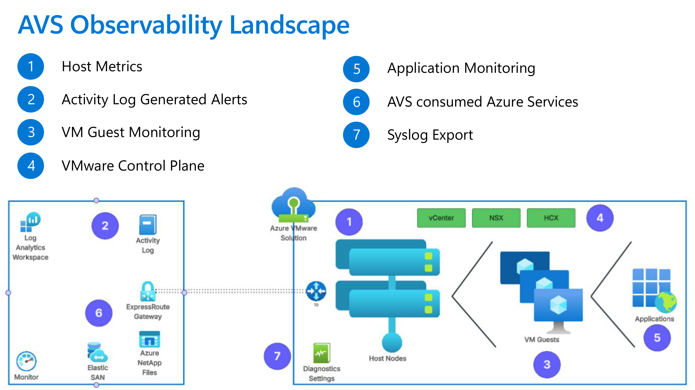

### Key Points

- Observability in Azure VMware Solution (AVS) is critical beyond initial deployment, especially for ongoing monitoring (day two operations).
- There are seven core areas of observability in AVS that cover infrastructure and the broader ecosystem.
- Host metrics are foundational, focusing on physical hosts that support the private cloud.
- Monitoring host CPU consumption helps in capacity planning—scaling out or scaling down nodes based on workload demands.
- Observability should encompass not only hosts but also logs, alerts, VM guest monitoring, syslog exports, Azure services consumed by AVS, VMware control plane, and application monitoring.

### Details

- **Observability Landscape in AVS**: The slide lists seven key areas where monitoring and observability should be implemented to ensure comprehensive coverage of the AVS environment.
  
- **Seven Core Observability Areas**:
  1. **Host Metrics**: Physical hosts underpinning the private cloud are monitored for performance metrics such as CPU consumption. This is crucial because these hosts are dedicated to the AVS deployment and directly impact performance and capacity.
  2. **Activity Log Generated Alerts**: Alerts generated from activity logs help in identifying operational issues or changes within the environment.
  3. **VM Guest Monitoring**: Monitoring inside the virtual machines themselves to track performance and health at the guest OS level.
  4. **Syslog Export**: Exporting syslog data for centralized logging and analysis.
  5. **AVS Consumed Azure Services**: Observing Azure services that AVS utilizes to understand dependencies and performance impacts.
  6. **VMware Control Plane**: Monitoring the VMware management components that control the private cloud environment.
  7. **Application Monitoring**: Observing the applications running on AVS to ensure end-to-end performance and availability.

- **Speaker’s Emphasis on Host Metrics**:
  - Host metrics are the first and foundational observability area because physical hosts have direct performance implications.
  - CPU consumption is a key metric: high CPU usage may indicate the need to add more nodes to the private cloud to handle workload demands.
  - Conversely, if CPU consumption decreases, it may signal an opportunity to reduce nodes to optimize costs.
  - This dynamic scaling consideration is important because AVS runs in a cloud environment where resource optimization can lead to cost savings.

- **Context**:
  - The speaker highlights a common challenge: organizations often focus on deploying AVS but neglect comprehensive monitoring afterward.
  - Effective observability ensures not only infrastructure health but also the health of the entire ecosystem supported by AVS.
  - The slide and narration together provide a framework for what areas to monitor and why.

### Definitions

- **Host Metrics**: Performance data collected from the physical servers (hosts) that run the private cloud infrastructure, including CPU, memory, and other resource usage.
- **Activity Log Generated Alerts**: Notifications triggered by specific events or changes recorded in activity logs, used to detect operational issues.
- **VM Guest Monitoring**: Monitoring the performance and health of virtual machines from within the guest operating system.
- **Syslog Export**: The process of sending system log messages to a centralized logging system for analysis and troubleshooting.
- **AVS Consumed Azure Services**: Azure platform services that are utilized by AVS to deliver its functionality.
- **VMware Control Plane**: The management layer of VMware that controls the private cloud environment, including components like vCenter.
- **Application Monitoring**: Tracking the performance, availability, and health of applications running on the AVS infrastructure.

### Examples

- Monitoring CPU consumption on physical hosts to decide when to add or remove nodes:
  - If CPU usage is consistently high, add nodes to increase capacity.
  - If CPU usage drops after a workload peak, consider reducing nodes to save costs.

### Key Takeaways 🎯

- Observability in AVS must cover multiple layers: from physical hosts to applications.
- Host metrics are critical for capacity planning and cost optimization.
- Effective monitoring requires a holistic approach that includes logs, alerts, VM guest data, syslog, Azure services, VMware control plane, and applications.
- Organizations should prioritize enabling comprehensive observability early to avoid gaps in monitoring after deployment.

---

## Slide 93: AVS Observability – Host Metrics

**Timestamp**: 02:32:38 – 02:34:49

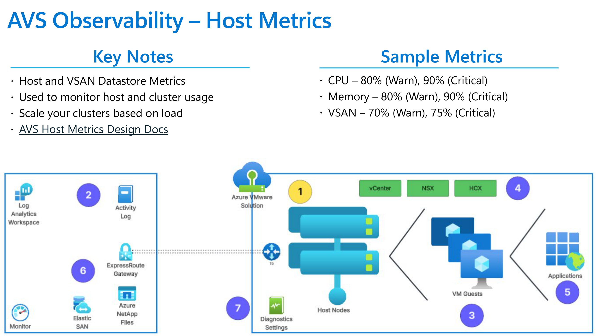

### Key Points

- AVS Observability includes monitoring host and VSAN datastore metrics.
- These metrics help track host and cluster resource usage.
- Monitoring these metrics enables scaling of clusters based on workload demands.
- Key metrics include CPU, Memory, and VSAN usage with defined warning and critical thresholds.
- vSAN consumption is critical for maintaining SLA compliance.
- Host-level metrics can be viewed at both individual host and cluster levels.

### Details

- **Host and VSAN Datastore Metrics**: AVS observability focuses on collecting and analyzing metrics related to the physical hosts and the VSAN datastore within the private cloud environment.
  
- **Purpose of Metrics**: These metrics are essential for monitoring resource usage at both the host and cluster levels. They provide insight into whether the infrastructure is under stress or underutilized, which informs decisions about scaling.

- **Scaling Clusters Based on Load**:
  - When CPU consumption or other metrics become high (e.g., CPU usage reaching warning or critical thresholds), it may indicate the need to add more nodes to the cluster to handle the workload.
  - Conversely, if CPU or memory usage drops significantly, it may be possible to reduce the number of nodes to optimize costs.
  
- **Sample Metrics and Thresholds**:
  - **CPU Usage**: Warning at 80%, Critical at 90%
  - **Memory Usage**: Warning at 80%, Critical at 90%
  - **VSAN Usage**: Warning at 70%, Critical at 75%
  
- **vSAN Metric Importance**:
  - vSAN consumption is a key metric tied directly to SLA compliance.
  - The SLA for ABS (Azure VMware Solution) includes maximum allowable vSAN consumption.
  - Crossing the 75% vSAN usage threshold means the private cloud is out of SLA compliance.
  - To maintain SLA compliance, administrators must either add nodes to increase vSAN capacity or clean up existing storage to reduce usage below 75%.
  
- **Host-Level Metrics**:
  - Metrics can be viewed at the individual host level or aggregated at the cluster level.
  - This granularity helps identify specific hosts that may be underperforming or overutilized.
  
- **Design Documentation**:
  - AVS Host Metrics Design Docs provide detailed guidance on monitoring and managing these metrics.
  
- **Operational Impact**:
  - Monitoring these metrics proactively helps avoid performance degradation.
  - It also supports cost optimization by scaling resources according to actual demand.

### Definitions

- **AVS (Azure VMware Solution) Observability**: The capability to monitor and analyze performance and usage metrics of hosts and datastores within an Azure VMware private cloud environment.
  
- **vSAN (Virtual SAN)**: A software-defined storage solution that aggregates local storage devices across hosts in a VMware cluster to create a shared datastore.
  
- **SLA (Service Level Agreement)**: A formal commitment that defines the expected performance and availability standards for a service, including resource usage limits.

### Examples

- If CPU consumption on a host reaches 80% (warning) or 90% (critical), this signals the need to add nodes to the cluster to handle increased workload.
- If CPU consumption drops after a peak workload, nodes can be removed to save costs.
- When vSAN usage approaches 70% (warning) or exceeds 75% (critical), administrators must act to add storage capacity or clean up data to remain within SLA limits.

### Key Takeaways 🎯

- Monitoring host and VSAN datastore metrics is crucial for maintaining performance and SLA compliance in AVS environments.
- Defined warning and critical thresholds for CPU, memory, and vSAN usage guide operational decisions.
- vSAN usage above 75% breaches SLA, requiring immediate remediation.
- Host-level metrics enable precise scaling and cost optimization of private cloud resources.

---

## Slide 94: AVS Observability – Activity Log Alerts

**Timestamp**: 02:34:49 – 02:38:50

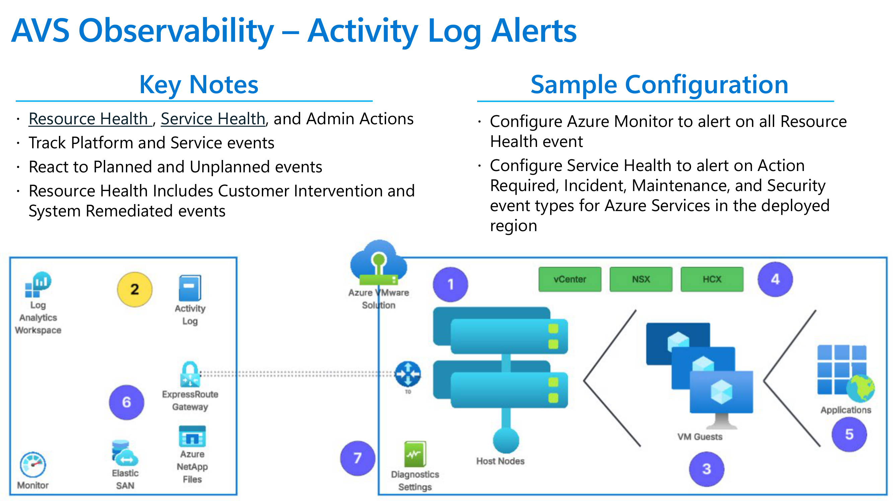

### Key Points

- Activity Log Alerts are essential for monitoring Azure VMware Solution (AVS) health and administrative actions.
- Alerts cover Resource Health, Service Health, and Admin Actions.
- These alerts track both platform/service events and administrative changes.
- They enable reaction to both planned and unplanned events.
- Resource Health alerts include events requiring customer intervention and those automatically remediated by the system.
- Proper configuration of Azure Monitor and Service Health alerts is critical to avoid alert fatigue.
- Alerts should be scoped to relevant services and regions, targeting responsible teams.
- Activity Log Alerts also support governance by monitoring sensitive administrative actions.

### Details

- **Activity Log Alerts Overview**  
  Activity Log Alerts are a critical but often underutilized feature for AVS observability. They derive from Azure’s activity log and provide notifications about the health and status of Azure services and resources.

- **Service Health Alerts**  
  - Based on the Azure activity log, Service Health alerts notify about planned maintenance, incidents, security events, and other service-related occurrences.  
  - These alerts cover any Azure service in any region and can be customized for specific event types such as Action Required, Incident, Maintenance, and Security.  
  - It is recommended to configure these alerts specifically for the AVS deployment region and route them to the team responsible for AVS operations to avoid overwhelming users with irrelevant alerts.

- **Resource Health Alerts**  
  - A newer capability currently in preview, Resource Health alerts focus on events specific to AVS resources, including those emitted from vCenter or NSX components.  
  - These alerts provide granular insight into the private cloud environment, enabling timely responses to issues such as host maintenance or failures.  
  - Example: Integration with third-party solutions like Zerto for Business Continuity and Disaster Recovery (BCDR) to trigger workload migration during host maintenance.  
  - These alerts should be configured to notify key administrative personnel to ensure rapid response.

- **Admin Actions Alerts**  
  - The activity log also records governance-related events such as access to or changes in cloud admin credentials and modifications to the private cloud environment.  
  - While these alerts may be less critical than health alerts, they are important for security and compliance monitoring and should be configured where appropriate.

- **Configuration Recommendations**  
  - Use Azure Monitor to configure alerts on all Resource Health events.  
  - Configure Service Health alerts for relevant event types (Action Required, Incident, Maintenance, Security) for Azure services in the AVS deployed region.  
  - Avoid enabling alerts for all services and regions to prevent alert fatigue; instead, focus on the services and regions relevant to your AVS deployment.  
  - Route alerts to the appropriate teams responsible for AVS health and administration.

### Definitions

- **Activity Log Alerts**: Notifications generated from Azure’s activity log that inform about resource health, service health, and administrative actions related to Azure services and resources.
- **Resource Health**: A set of alerts focused on the health status of specific Azure resources, including events that require customer intervention or are automatically remediated by the system.
- **Service Health**: Alerts related to the overall health and status of Azure services, including planned maintenance, incidents, and security events.
- **Admin Actions**: Governance-related events such as changes to cloud admin credentials or modifications to the private cloud environment, recorded in the activity log.
- **Azure Monitor**: Azure’s platform service used to configure and manage alerts based on resource and service health events.
- **vCenter / NSX**: VMware components integrated within AVS that emit specific resource health events.
- **Zerto**: A third-party BCDR solution that can leverage resource health alerts to automate workload migration during host maintenance.

### Examples

- Configuring Service Health alerts specifically for AVS in the deployed region to notify the AVS operations team, avoiding unnecessary alerts from unrelated services or regions.
- Using Resource Health alerts to detect host maintenance events emitted from vCenter, enabling integration with Zerto to move workloads proactively.
- Setting up alerts for administrative actions such as changes to cloud admin credentials to maintain governance and security oversight.

### Key Takeaways 🎯

- Activity Log Alerts are vital for proactive monitoring and management of AVS environments.  
- Configure Service Health and Resource Health alerts thoughtfully to focus on relevant services and regions, minimizing alert noise.  
- Resource Health alerts provide detailed insights into private cloud events and are important for operational responsiveness.  
- Administrative action alerts support governance and security by tracking sensitive changes.  
- Proper alert routing to responsible teams ensures timely and effective incident response.

---

## Slide 95: AVS Observability – VM Guest Monitoring

**Timestamp**: 02:38:50 – 02:41:16

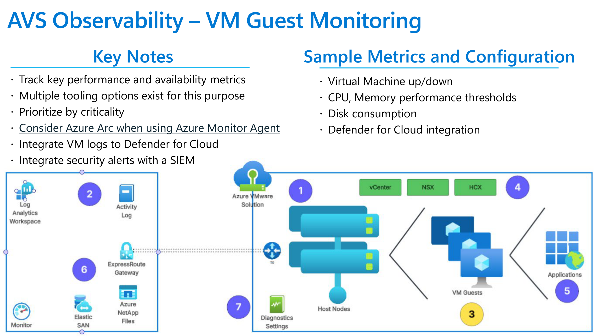

### Key Points

- Monitoring VM guests in Azure VMware Solution (AVS) is critical to track workload performance and availability.
- Multiple monitoring tools are available, including Broadcom Aria (formerly VMware vRealize) and Azure Monitor.
- Prioritize monitoring efforts based on the criticality of workloads.
- Azure Arc enables deployment of Azure Monitor Agent on VM guests, enhancing monitoring and security capabilities.
- Integration with Defender for Cloud allows VM logs and security alerts to be centralized and correlated.
- Security alerts can be forwarded to SIEM (Security Information and Event Management) systems such as Microsoft Sentinel or third-party solutions.
- Key metrics to monitor include VM availability (up/down status), CPU and memory performance thresholds, disk consumption, and Defender for Cloud integration status.

### Details

- **Importance of VM Guest Monitoring:**  
  After establishing the AVS core infrastructure, the focus shifts to monitoring the VM guests, which host the actual workloads and business-critical applications migrated to AVS. Ensuring these guests are properly monitored is essential for operational success.

- **Tooling Options:**  
  Customers have several options for guest monitoring:
  - **Broadcom Aria (formerly VMware vRealize):** Included with the latest VMware Cloud Foundation (VCF) licensing bundled in AVS. This can help reduce costs if previously using third-party monitoring tools.
  - **Azure Monitor:** Can be used to monitor VM guests, especially when combined with Azure Arc.

- **Azure Arc and Azure Monitor Agent:**  
  Azure Arc allows you to manage on-premises and multi-cloud VMs as if they were Azure resources. Using Azure Arc, you can deploy the Azure Monitor Agent on AVS VM guests, unlocking enhanced monitoring capabilities, including:
  - Better performance and availability tracking.
  - Security monitoring and automation.
  - Integration with Azure Defender for Cloud for security posture management.

- **Security Integration:**  
  - VM logs can be integrated into Defender for Cloud, providing centralized security monitoring.
  - Security alerts generated can be forwarded to SIEM systems such as Microsoft Sentinel or third-party solutions, enabling comprehensive incident management.

- **Prioritization:**  
  Monitoring efforts should be prioritized based on the criticality of workloads running on the VM guests to ensure resources are focused on the most important systems.

- **Sample Metrics to Track:**  
  - VM operational status (up/down).
  - CPU and memory usage against defined performance thresholds.
  - Disk consumption and capacity.
  - Defender for Cloud integration status and alerts.

### Definitions

- **AVS (Azure VMware Solution):** A Microsoft Azure service that allows customers to run VMware workloads natively on Azure infrastructure.
- **VM Guest:** A virtual machine running on the AVS infrastructure, hosting workloads and applications.
- **Broadcom Aria:** A monitoring and management tool included with VCF licensing, formerly known as VMware vRealize, used for guest monitoring.
- **Azure Arc:** A service that extends Azure management capabilities to on-premises, multi-cloud, and edge environments, enabling deployment of Azure services like Azure Monitor Agent on non-Azure VMs.
- **Azure Monitor Agent:** An agent deployed on VMs to collect monitoring data for Azure Monitor.
- **Defender for Cloud:** Azure’s cloud security posture management and threat protection service.
- **SIEM (Security Information and Event Management):** Systems that aggregate and analyze security alerts and logs from multiple sources for incident detection and response.
- **Microsoft Sentinel:** A cloud-native SIEM solution from Microsoft.

### Examples

- Customers who previously used third-party monitoring tools can switch to Broadcom Aria included with VCF licensing to reduce costs.
- Using Azure Arc, a customer can deploy Azure Monitor Agent on AVS VM guests, enabling integration with Defender for Cloud and forwarding alerts to Microsoft Sentinel for centralized security management.

### Key Takeaways 🎯

- Monitoring VM guests in AVS is essential for maintaining workload performance and availability.
- Multiple monitoring tools exist; leverage included Broadcom Aria or Azure Monitor via Azure Arc for enhanced capabilities.
- Integrate VM logs and security alerts with Defender for Cloud and SIEM systems to improve security posture and incident response.
- Prioritize monitoring based on workload criticality and track key metrics like VM availability, CPU/memory usage, and disk consumption.
- Azure Arc significantly expands monitoring and security integration options for AVS VM guests.

---

## Slide 96: AVS Observability – VMWare Control Plane

**Timestamp**: 02:41:16 – 02:43:13

### Key Points

- Monitoring the VMware Control Plane in AVS starts with Resource Health Alerts.
- For more detailed alerting, VCF Operations with management packs for NSX and HCX should be considered.
- Key metrics to monitor include NSX node performance and HCX tunnel status.
- NSX appliance scaling is a manual process requiring customer-initiated support tickets.
- Monitoring NSX Edge appliance performance is critical to avoid disruptions.
- Tools like ARIA and Resource Health provide valuable monitoring data for the control plane.

### Details

- **Starting Point: Resource Health Alerts**  
  The initial focus for observability in the VMware Control Plane is on Resource Health Alerts. These alerts provide a baseline understanding of the health status of resources under management.

- **Enhanced Alerting via VCF Operations and Management Packs**  
  For more granular and detailed alerting, VMware Cloud Foundation (VCF) Operations can be leveraged. This includes the use of management packs specifically designed for NSX and HCX components, which provide deeper insights into these critical parts of the control plane.

- **Key Metrics to Monitor**  
  - **NSX Node Performance:** Monitoring the performance of NSX nodes is essential to ensure the network virtualization layer is functioning optimally.  
  - **HCX Tunnel Status:** During migrations, especially when HCX is deployed, it is important to monitor the status of HCX tunnels (whether they are up or down) and tunnel saturation levels to detect potential bottlenecks or failures.

- **NSX Appliance Scaling**  
  NSX appliances, particularly at the edge, can become resource-constrained ("running hot"). Unlike some automated scaling solutions, scaling NSX appliances in AVS is not automatic. Customers must open a support ticket with VMware to request scaling to a larger appliance size. This process can cause a short but potentially disruptive event, so proactive monitoring is necessary to avoid unexpected issues.

- **Importance of Monitoring NSX Edge Performance**  
  Since scaling requires manual intervention, continuous monitoring of NSX Edge appliance performance is critical. Early detection of performance issues allows customers to plan and request scaling before disruptions occur.

- **Monitoring Tools**  
  Both ARIA and Resource Health tools provide valuable metrics and alerts for monitoring the VMware Control Plane. These tools help customers maintain visibility into the health and performance of NSX and HCX components.

### Definitions

- **NSX Node Performance:** Metrics related to the operational status and resource utilization of NSX appliances that provide network virtualization and security services within the VMware environment.

- **HCX Tunnel Status:** The operational state (up/down) and performance metrics (such as saturation) of HCX tunnels, which facilitate workload migration and network extension between sites.

- **VCF Operations:** VMware Cloud Foundation Operations, a suite of tools and management packs that provide enhanced monitoring and alerting capabilities for components like NSX and HCX.

- **ARIA:** A VMware tool that provides observability and monitoring capabilities, including resource health and performance metrics.

### Examples

- During a migration using HCX, monitoring the tunnel status is crucial to ensure connectivity is maintained. If a tunnel goes down or becomes saturated, it may require rebalancing or troubleshooting.

- If NSX Edge appliances are observed to be running at high resource utilization ("running hot"), the customer should open a support ticket to request scaling to a larger appliance size to prevent service disruption.

### Key Takeaways 🎯

- Start monitoring the VMware Control Plane with Resource Health Alerts for a baseline view.
- Use VCF Operations with NSX and HCX management packs for detailed, component-specific alerting.
- Proactively monitor NSX Edge appliance performance to anticipate and request scaling before disruptions occur.
- HCX tunnel status and saturation are critical metrics during migrations.
- Scaling NSX appliances is a manual process requiring customer action and can cause short disruptions.
- Utilize ARIA and Resource Health tools to maintain comprehensive observability of the control plane.

---

## Slide 97: AVS Observability – Application Monitoring

**Timestamp**: 02:43:13 – 02:43:49

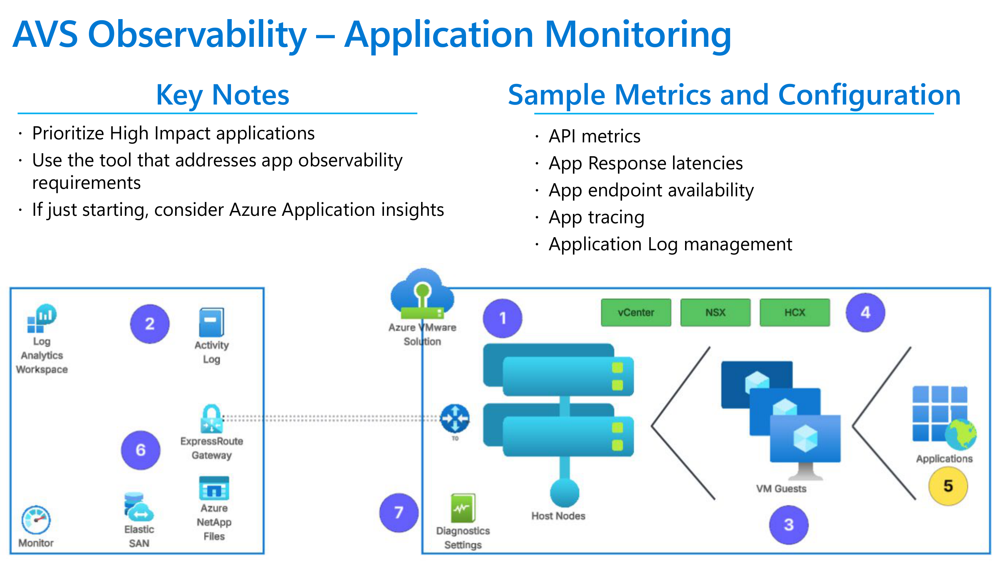

### Key Points

- Prioritize monitoring of high-impact applications within AVS environments.
- Select application monitoring tools that meet specific observability requirements.
- For those beginning application monitoring, Azure Application Insights is a recommended starting point.
- Important metrics to monitor include API metrics, application response latencies, endpoint availability, tracing, and log management.
- Application monitoring is essential but often under-discussed; AVS supports integration with Azure-native tools.
- Existing on-premises application monitoring solutions can also be deployed in AVS.

### Details

- **Application Monitoring in AVS**: Although not heavily emphasized, application monitoring is a critical aspect of observability in Azure VMware Solution (AVS). It ensures that applications running in AVS are performing well and issues are detected early.
  
- **Tooling Options**: AVS users have access to Azure-native monitoring tools, notably **Azure Monitor's Application Insights**, which provides comprehensive application observability capabilities. This includes collecting various metrics and telemetry data to understand application health and performance.

- **Azure Application Insights**: This tool is particularly useful for those just starting with application monitoring. It can collect:
  - **API metrics**: Data about API calls, usage, and performance.
  - **Application response latencies**: Time taken for the app to respond to requests.
  - **Endpoint availability**: Monitoring whether application endpoints are reachable and operational.
  - **Application tracing**: Tracking the flow of requests through the application to diagnose issues.
  - **Application log management**: Collecting and managing logs generated by the application for troubleshooting and auditing.

- **Prioritization**: It is recommended to focus monitoring efforts on applications that have the highest potential impact on business operations or user experience, ensuring resources are allocated efficiently.

- **Flexibility**: While Azure Application Insights is recommended, organizations can continue to use their existing on-premises application monitoring solutions if preferred, deploying them within AVS.

- **Context**: The speaker emphasizes that application monitoring is not unique to AVS but is a general best practice. The goal is to highlight its importance and encourage users to ensure monitoring is in place.

### Definitions

- **Application Monitoring**: The process of collecting and analyzing data about an application's performance, availability, and usage to ensure it operates correctly and efficiently.

- **Azure Application Insights**: A feature of Azure Monitor that provides application performance management and instant analytics, enabling developers and operators to monitor live applications and detect anomalies.

- **API Metrics**: Quantitative data related to the usage and performance of application programming interfaces (APIs), such as request counts, error rates, and response times.

- **App Response Latencies**: The duration between a client request and the application's response, indicating performance speed.

- **App Endpoint Availability**: The measure of whether application endpoints (URLs or services) are accessible and functioning as expected.

- **Application Tracing**: The technique of following the path of a request through various components of an application to diagnose issues or understand behavior.

- **Application Log Management**: The collection, storage, and analysis of log files generated by applications for troubleshooting and monitoring.

### Examples

- Using **Azure Application Insights** to monitor API call performance and detect slow response times.
- Tracking endpoint availability to ensure critical application services remain accessible.
- Deploying existing on-premises application monitoring tools within AVS environments if preferred over Azure-native solutions.

### Key Takeaways 🎯

- Application monitoring is essential for maintaining healthy, performant applications in AVS.
- Prioritize monitoring for applications with the highest business impact.
- Azure Application Insights is a strong, accessible starting point for application observability in AVS.
- Key metrics to monitor include API metrics, response latencies, endpoint availability, tracing, and logs.
- Existing on-premises monitoring solutions can be used alongside or instead of Azure tools.
- Ensuring application monitoring is in place is a fundamental best practice, not unique to AVS but critical within it.

---

## Slide 98: AVS Observability – Azure Services

**Timestamp**: 02:43:49 – 02:47:10

### Key Points

- AVS (Azure VMware Solution) integrates with and consumes various Azure services.
- Monitoring external Azure services such as storage and networking is critical for AVS observability.
- Metrics related to latency, capacity, and throughput should be implemented for external storage and networking services.
- AMBA (Azure Monitor Baseline Alerting) provides recommended default metrics for monitoring Azure services.
- Specific metrics to monitor include latency and capacity for Azure NetApp Files (ANF) or Elastic SAN (ESAN), and throughput, ARP/BGP availability, and route metrics for ExpressRoute gateways.

### Details

- **AVS and Azure Services Integration**: AVS environments often rely on external Azure services like Azure NetApp Files (ANF), Elastic SAN (ESAN), and ExpressRoute gateways. Although these services are external to the core AVS infrastructure, their performance directly impacts AVS operations.

- **Importance of Monitoring External Storage**:  
  - External storage services such as ANF and ESAN require monitoring of key metrics like latency and consumed capacity.  
  - Latency monitoring helps ensure storage performance aligns with expected service levels.  
  - Capacity monitoring helps detect when throughput or storage limits are being approached, signaling the need for SKU upgrades or capacity increases.

- **ExpressRoute Gateway Monitoring**:  
  - Particularly relevant for Gen 1 AVS environments, which use ExpressRoute for connectivity to on-premises networks.  
  - Gen 2 AVS does not use ExpressRoute, so these considerations apply mainly to Gen 1.  
  - Key metrics include throughput (both high and low), ARP (Address Resolution Protocol) and BGP (Border Gateway Protocol) availability, and route metrics.  
  - Changes in ARP or BGP availability can indicate network events or route changes that may precede connectivity issues.  
  - Monitoring throughput helps ensure the ExpressRoute connection is not nearing capacity limits, enabling proactive scaling or SKU upgrades.

- **AMBA (Azure Monitor Baseline Alerting)**:  
  - AMBA is an internal Microsoft offering that provides baseline alerting metrics for Azure services.  
  - It serves as a recommended starting point for monitoring configurations, especially when customers are unsure about which metrics to track.  
  - The AMBA page (aka.ms/AMBA) lists core Azure service metrics and is periodically updated to reflect best practices.

- **Practical Monitoring Recommendations**:  
  - Implement metrics monitoring for external storage and networking services integrated with AVS.  
  - Use AMBA metrics as initial defaults to simplify monitoring setup.  
  - Pay attention to latency and capacity for storage services like ANF and ESAN.  
  - Monitor ExpressRoute gateway throughput and network protocol availability to detect and respond to network events early.

### Definitions

- **AVS (Azure VMware Solution)**: A Microsoft Azure service that enables running VMware workloads natively on Azure infrastructure.

- **ANF (Azure NetApp Files)**: A high-performance file storage service in Azure used for enterprise workloads.

- **ESAN (Elastic SAN)**: Azure’s elastic block storage service designed for scalable, high-performance storage.

- **ExpressRoute**: A service that provides private, dedicated network connections between on-premises infrastructure and Azure datacenters.

- **ARP (Address Resolution Protocol)**: A network protocol used to map IP addresses to physical MAC addresses on a local network.

- **BGP (Border Gateway Protocol)**: A protocol used to exchange routing information between different networks on the internet or private networks.

- **AMBA (Azure Monitor Baseline Alerting)**: A Microsoft internal offering providing baseline alerting metrics for Azure services to guide monitoring configurations.

### Examples

- Monitoring ANF or ESAN latency and consumed capacity to ensure storage performance meets expected thresholds and to detect when scaling is needed.

- Tracking ExpressRoute gateway throughput and ARP/BGP availability to identify network events or route changes that could impact connectivity between on-premises and Azure environments.

- Using AMBA metrics as a starting point for setting up monitoring alerts for Azure services integrated with AVS.

### Key Takeaways 🎯

- Do not overlook monitoring external Azure services integrated with AVS; their performance directly affects AVS workloads.

- Focus on latency and capacity metrics for storage services like ANF and ESAN.

- For Gen 1 AVS, monitor ExpressRoute gateway throughput and network protocol availability (ARP/BGP) to detect network issues early.

- Use AMBA as a trusted source for baseline monitoring metrics and alerts for Azure services.

- Proactive monitoring enables timely scaling and troubleshooting, ensuring AVS environments remain performant and reliable.

---

## Slide 99: AVS Observability – Syslog

**Timestamp**: 02:47:10 – 02:48:57

### Key Points

- AVS (Azure VMware Solution) can emit syslog data from VMware stack components such as vCenter and NSX.
- Syslog emission is configured via AVS diagnostic settings.
- Syslog data can be sent to multiple targets including Azure Log Analytics, storage accounts, and third-party solutions via Event Hub.
- The syslog stream is very dense and generates a large volume of data, which can lead to significant costs.
- It is recommended to enable syslog only when necessary.
- Third-party integrations and logic app instructions are available to help filter and manage syslog data.
- Filtering capabilities are currently limited but improvements are planned.

### Details

- **Syslog Emission from AVS**: AVS emits syslog data originating from Broadcom components within the VMware stack, specifically including vCenter and NSX components. This syslog stream provides detailed diagnostic logs useful for troubleshooting and monitoring.

- **Configuration**: Syslog output is configured through the standard AVS diagnostic settings interface. Users can select which logs and metrics to send, including all logs and all metrics if desired.

- **Targets for Syslog Data**:
  - Azure Log Analytics workspace (default recommended target)
  - Azure Storage accounts
  - Third-party solutions via Azure Event Hub
  - Third-party integrations can be managed using Azure Logic Apps, with provided instructions to facilitate this.

- **Volume and Cost Considerations**:
  - The syslog stream is described as "very dense," meaning it produces a high volume of log data.
  - Because of the volume, storing and analyzing these logs can incur substantial costs, especially when using Log Analytics.
  - Customers are cautioned to enable syslog only when necessary to avoid unexpected charges.

- **Filtering and Management**:
  - Currently, syslog data is minimally filtered before emission, so all or most logs are sent.
  - The AVS team is working on providing better filtering options in the future.
  - Meanwhile, customers can use third-party logic apps to filter and manage the data post-collection.

- **Use Cases**:
  - Syslog is primarily recommended for diagnostic purposes or when detailed log data is required to troubleshoot issues within the AVS environment.
  - It is not recommended to keep syslog enabled continuously due to cost and data volume.

- **Additional Notes**:
  - The speaker emphasized the importance of caution when enabling syslog.
  - Links and further resources will be provided in the presentation slides or afterwards for configuring syslog and third-party integrations.

### Definitions

- **AVS (Azure VMware Solution)**: A Microsoft Azure service that allows customers to run VMware workloads natively on Azure infrastructure.
- **Syslog**: A standard protocol used to send system log or event messages to a specific server, useful for monitoring and troubleshooting.
- **Diagnostic Settings**: Configuration interface in AVS that allows users to specify which logs and metrics to collect and where to send them.
- **Log Analytics**: Azure service that collects and analyzes log data from various sources, enabling monitoring and diagnostics.
- **Event Hub**: Azure service used for data streaming and event ingestion, which can forward logs to third-party systems.
- **Logic App**: Azure service that enables workflow automation and integration, here used to filter and manage syslog data.

### Examples

- The speaker mentioned the default recommended target for syslog data is Azure Log Analytics, but warned that this can lead to substantial charges due to the volume of data.
- Third-party filtering can be implemented using Azure Logic Apps, with instructions provided by the AVS team to help customers manage the log stream.

### Key Takeaways 🎯

- AVS syslog provides detailed logs from VMware components but produces a very large volume of data.
- Enable syslog only when necessary to avoid high storage and analytics costs.
- Use diagnostic settings to configure syslog emission and choose appropriate targets.
- Filtering options are limited currently; use third-party logic apps to manage data flow.
- Syslog is a powerful diagnostic tool but requires careful management to balance cost and utility.

---

## Slide 100: AVS

**Timestamp**: 02:48:57 – 02:49:31

### Key Points

- The AVS Bootcamp 2026 event has concluded.
- The event spanned three days, covering both sales and technical topics.
- Numerous speakers contributed to a wide range of subjects.
- Recorded sessions and resources will be made available on the Skilling Hub.
- Appreciation was expressed to all attendees, especially those present on the final day.

### Details

- The slide simply displays the event title: **"AVS Bootcamp 2026"**, indicating the name and year of the bootcamp.
- The speaker confirms the conclusion of the event, noting that all planned content for the day has been covered and no further questions remain.
- The bootcamp lasted three days, integrating both **sales** and **technical** content, suggesting a comprehensive approach to training and knowledge sharing.
- The speaker highlights the quality and breadth of topics and the contributions of many speakers, emphasizing the event’s value.
- Attendee engagement is acknowledged, particularly those who participated throughout the entire event.
- Important logistical information: recordings and additional resources from the bootcamp will be accessible on the **Skilling Hub**, providing ongoing learning opportunities beyond the live sessions.

### Definitions

- **AVS Bootcamp**: A multi-day training event focused on Amazon Voice Services (AVS), combining sales and technical education.
- **Skilling Hub**: The platform where recorded sessions and resources from the bootcamp will be hosted for participant access.

### Examples

- No specific examples or demonstrations were mentioned during this closing segment.

### Key Takeaways 🎯

- The AVS Bootcamp 2026 has successfully concluded after three days of in-depth sales and technical training.
- All sessions are recorded and resources are available on the Skilling Hub for future reference.
- The event featured a diverse set of speakers and topics, providing a rich learning experience.
- Attendees are thanked for their participation and encouraged to revisit the materials online.

---

## Slide 101: Session Time

**Timestamp**: 02:45:20 – 02:48:57

### Key Points

- The slide presents a detailed agenda for a multi-day technical and sales conference focused on Azure VMware Solution (AVS).
- Sessions cover VMware modernization, AVS features, networking, migration strategies, workload optimization, storage options, lessons learned, cloud economics, partner incentives, and sales execution.
- The speaker discusses monitoring and alerting strategies for AVS, particularly around network throughput and syslog data management.
- Emphasis on proactive alerting using Azure Monitor Baseline Alerting (AMBA) and careful handling of syslog data to avoid excessive costs.

### Details

- **Conference Agenda Overview:**
  - **Day 1 (Sales Focus):**
    - 8:00 – 9:00 a.m.: Welcome and Keynote by Christophe Herrbach and Kirsten Megahan.
    - 9:00 – 10:00 a.m.: Azure VMware Solution (AVS) Cloud Economics with Greg Kaffenberger and Scott Gruenemeier.
    - 10:00 – 10:15 a.m.: Break.
    - 10:15 – 11:00 a.m.: Partnering with Microsoft – Incentives and Offers by Lisa James.
    - 11:00 – 11:45 a.m.: Sales Execution and Assessments with Sean Cattanach, Kalpan Raval, and Lue Hale.

  - **Day 2 (Technical Focus):**
    - 8:00 – 9:00 a.m.: Accelerate VMware Modernization While Reducing Risk and Cost by Trevor Davis and Carlos Villuendas.
    - 9:00 – 10:00 a.m.: AVS: Key Features and New Capabilities by Sundeep Hiranandaney and Natalia Jiménez.
    - 10:00 – 10:15 a.m.: Break.
    - 10:15 – 11:00 a.m.: Azure VMware Solution (AVS) Networking: NSX Architecture by Victor Sandoval, Daniel Ribeiro, and Nehali Neogi.
    - 11:00 – 12:00 p.m.: AVS Migration Strategy and Planning with HCX by Dennis Boeynaems.

  - **Day 3 (Technical Focus):**
    - 8:00 – 9:00 a.m.: Modernize, Secure and Optimize AVS Workloads and Operations with Azure Services by Husam Hilal.
    - 9:00 – 10:00 a.m.: Storage Expansion Options for Optimizing AVS Private Clouds by Carl Solazzo and Scott Gruenemeier.
    - 10:00 – 10:15 a.m.: Break.
    - 10:15 – 11:00 a.m.: Azure VMware Solution (AVS) Lessons Learned: Designing, Migrating and Operating by Jon Chancellor and Sabine Blair.

- **Speaker’s Insights on Monitoring and Alerting:**
  - **Network Throughput Monitoring:**
    - ExpressRoute throughput is generally sufficient for most customers.
    - For high data transfer scenarios, it is recommended to set up alerts on ExpressRoute gateway metrics.
    - Alerts help identify when throughput limits are approached, enabling timely scaling to newer SKUs.
  
  - **Azure Monitor Baseline Alerting (AMBA):**
    - AMBA is an internal Microsoft offering providing default alerting metrics per Azure service.
    - It serves as a good starting point for customers unsure about which metrics to monitor.
    - The AMBA page is accessible at aka.ms/AMBA.
    - AMBA metrics are periodically updated to cover core Azure services.

  - **Syslog Data from AVS:**
    - AVS emits syslog data from Broadcom components including vCenter and NSX.
    - Syslog data can be routed to standard diagnostic targets like Azure Log Analytics.
    - Currently, syslog data is minimally filtered, resulting in large volumes of data.
    - This can lead to significant Log Analytics charges if not managed carefully.
    - Recommendations:
      - Enable syslog only when necessary for diagnostics.
      - Use third-party logic app instructions provided to filter and manage syslog data.
      - Microsoft is working on long-term filtering solutions.
    - Syslog configuration uses the standard diagnostic settings interface, allowing selection of specific metrics or logs to send.

- **Contextual Relationship:**
  - The agenda sessions provide a comprehensive learning path from sales and economics to technical deep dives on AVS features, networking, migration, optimization, and lessons learned.
  - The speaker’s focus on monitoring and alerting complements the technical sessions by addressing operational best practices and cost management in AVS environments.

### Definitions

- **ExpressRoute:** A dedicated private connection between on-premises infrastructure and Azure data centers, used to improve network performance and security.
- **SKU (Stock Keeping Unit):** Refers to different service tiers or versions, often with varying performance or capacity.
- **Azure Monitor Baseline Alerting (AMBA):** A Microsoft internal offering that provides default alerting metrics for Azure services to simplify monitoring setup.
- **Syslog:** A standard protocol used to send system log or event messages to a specific server, useful for diagnostics and monitoring.
- **Broadcom Components:** Hardware/software elements from Broadcom used in AVS infrastructure, including vCenter and NSX components.
- **Log Analytics:** An Azure service that collects and analyzes log data from various sources for monitoring and troubleshooting.

### Examples

- Setting up alerts on ExpressRoute gateway metrics to monitor throughput and avoid hitting limits.
- Using AMBA default metrics as a baseline for alerting when unsure which Azure service metrics to monitor.
- Routing AVS syslog data to Azure Log Analytics for diagnostics, while applying filters via third-party logic apps to control data volume and costs.

### Key Takeaways 🎯

- The conference agenda covers a broad range of AVS topics from sales to deep technical content, enabling comprehensive learning.
- Proactive monitoring of network throughput using alerts is critical to managing AVS performance and scaling needs.
- AMBA provides a valuable starting point for setting up Azure service alerts.
- Syslog data from AVS is voluminous and minimally filtered by default; careful management is necessary to avoid high costs.
- Diagnostic logging should be enabled judiciously and filtered appropriately to balance operational insight with cost control.

---

## Slide 102: Thank You For Attending

**Timestamp**: 02:48:57 – 02:49:47

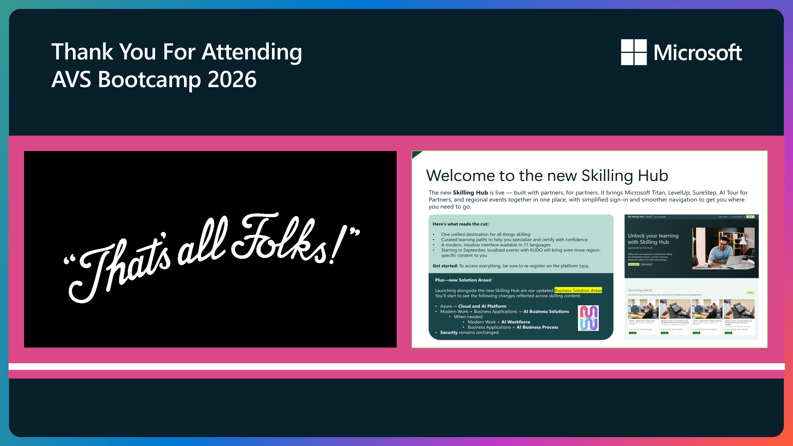

### Key Points

- The AVS Bootcamp 2026 event has concluded successfully.
- The event spanned three days covering both sales and technical topics.
- Numerous speakers contributed to a wide range of valuable content.
- Recorded sessions and additional resources are available on the Skilling Hub platform.
- Participants can access links and materials through Skilling Hub, especially where they registered.
- Appreciation was expressed to all attendees, particularly those who stayed through the entire event.

### Details

- The slide simply thanks attendees for participating in the AVS Bootcamp 2026, marking the official end of the event.
- The speaker acknowledged the contributions of John and Sabine, likely co-hosts or key presenters.
- Over the course of three days, the bootcamp covered extensive material related to sales and technical aspects, indicating a comprehensive program.
- The speaker confirmed there were no further questions, signaling a smooth conclusion.
- Emphasis was placed on the availability of recorded versions of the sessions and supplementary resources, which will be accessible on the Skilling Hub.
- Some attendees had inquired about access links; these have been provided in the Q&A and will also be included in the resource section on Skilling Hub.
- The speaker thanked everyone for their participation and engagement, highlighting the commitment of those attending on the final day.
- The closing remarks reinforced that the event was complete and expressed appreciation for the audience’s time and attention.

### Definitions

- **Skilling Hub**: The online platform where recorded sessions and resources from the AVS Bootcamp 2026 are hosted and accessible to registered participants.

### Examples

- No specific practical examples or demonstrations were mentioned during this closing segment.

### Key Takeaways 🎯

- The AVS Bootcamp 2026 successfully concluded after three days of in-depth sales and technical training.
- All session recordings and resources are available on Skilling Hub for review and further learning.
- Participants should check Skilling Hub for access to materials and links shared during the event.
- Appreciation was extended to all attendees, especially those who participated through the entire event duration.

---

---

*Generated by VideoToNotes - Presentation Notes Pipeline*
